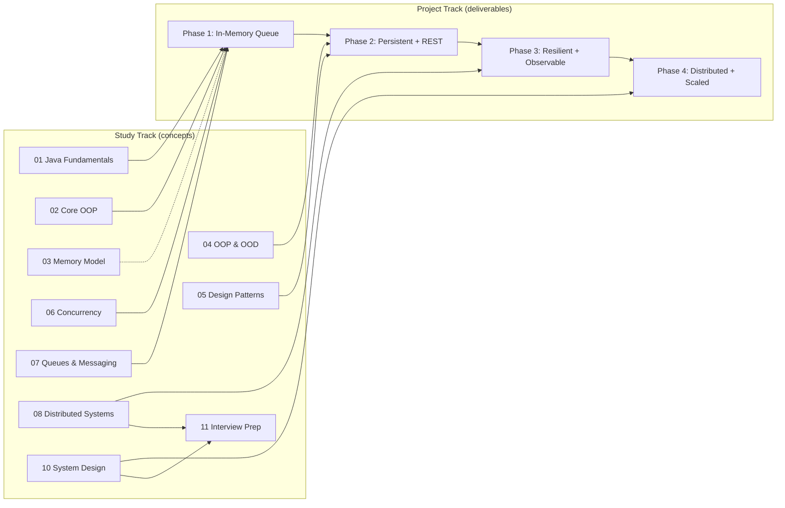
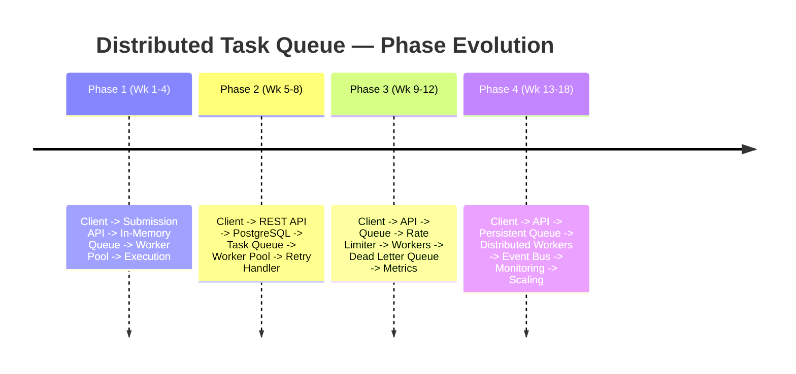
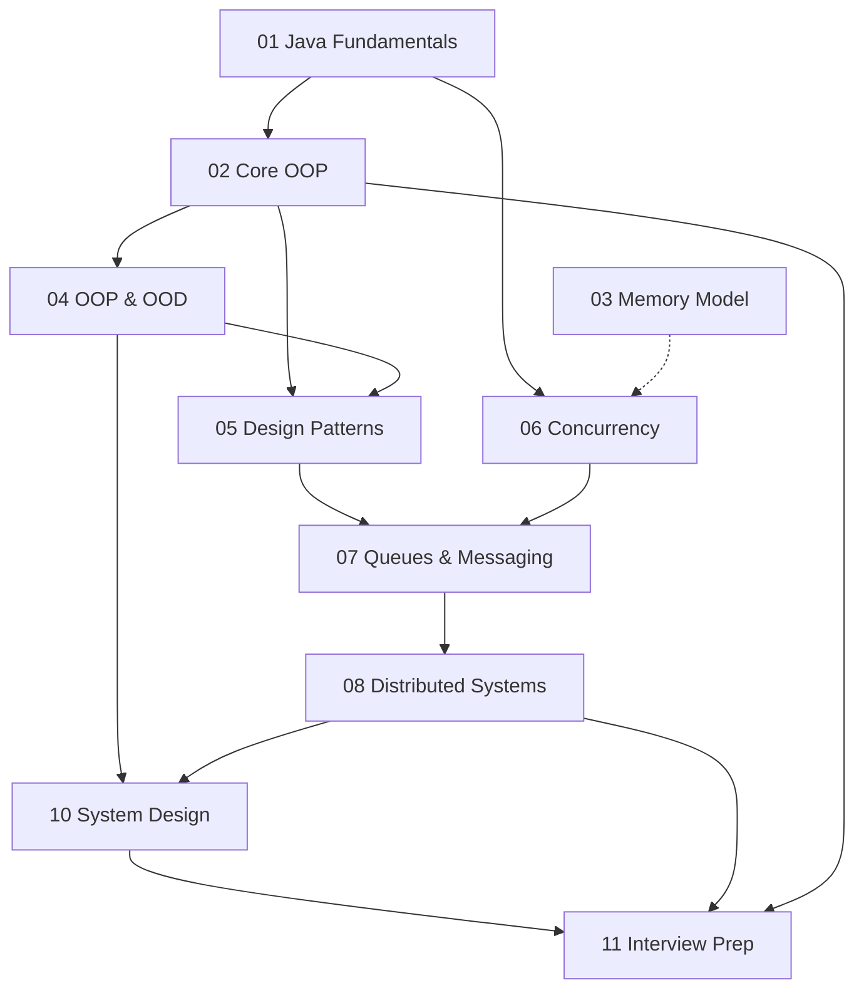
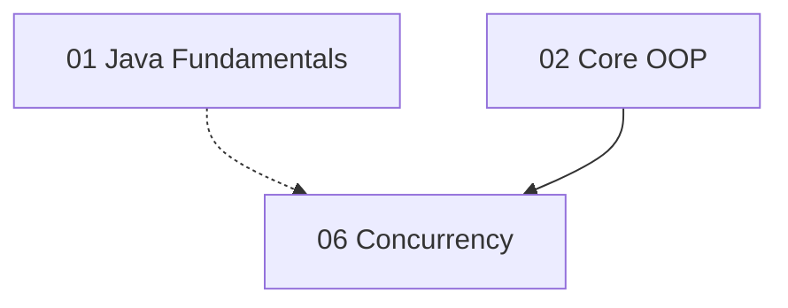

# Project Milestones

> **Where this fits:** This is the milestone ladder for the entire `backend-engineering-roadmap`. The whole curriculum is one evolving project — a **Distributed Task Queue and Event Processing Platform** — and this file is the planning map that tells you *what to build next, what "done" means, and when to cut a release tag.* Read [`roadmap.md`](./roadmap.md) for the high-level arc and [`study-plan.md`](./study-plan.md) for the day-by-day cadence. This file connects the study modules to the four shippable project phases.

This is a **navigation and planning doc**, not a concept chapter. There is no new Java syntax here. Instead you get: a phased timeline, a module dependency graph, exit criteria for each module, the demoable capability per phase, suggested git tags, and a weekly checklist you can paste into a tracker.

---

## How to read this document

The curriculum has two parallel tracks that you interleave:

1. **Study modules** (`01`–`08`, `10`, `11`) — the concepts: Java, OOP, OOD, patterns, concurrency, queues, distributed systems, system design, interview prep.
2. **Project phases** (`09-project/phase-1..4`) — the deliverables. Each phase is a working, demoable system you can run, tag, and put on your resume.

A **milestone** is the moment a project phase reaches its *definition of done*. You do not study every module to 100% before touching code. You study *just enough* of a module to unlock the next phase, build it, then come back and deepen. The dependency graph below makes the "just enough" precise.



---

## The milestone ladder at a glance

| Phase | Milestone name | Demoable capability | Git tag | Rough weeks |
|------:|----------------|---------------------|---------|------------:|
| 1 | **Walking Skeleton** | Submit a task in code; a worker pool runs it asynchronously | `v0.1.0-phase1` | Weeks 1–4 |
| 2 | **Durable Service** | `POST /tasks` over HTTP; survives a restart; retries failures | `v0.2.0-phase2` | Weeks 5–8 |
| 3 | **Resilient Platform** | Rate-limited, circuit-broken, with a DLQ and live metrics | `v0.3.0-phase3` | Weeks 9–12 |
| 4 | **Distributed System** | Multiple worker nodes off a shared broker, event-driven, scalable | `v1.0.0` | Weeks 13–18 |

The architecture target per phase (from the curriculum spec):



---

## Module dependency graph (study order)

Edges mean "should be comfortable with the source before the target." Dotted edges are "helpful but not blocking."



> **Reading the graph:** `01` and `02` gate everything — you cannot model objects you cannot write. `06 Concurrency` branches off `01` directly because Phase 1's worker pool needs it before you have mastered every OOP nuance. `03 Memory Model` is dotted into `06` because understanding stack/heap and the happens-before relationship makes concurrency click, but you can start `06` without finishing `03`.

---

## Phase 1 — Walking Skeleton

> **Architecture:** `Client -> Task Submission API -> In-Memory Queue -> Worker Pool -> Task Execution`

### Concrete deliverable
A runnable Maven project where a `main` method (the stand-in "client") submits `Task` objects into an `InMemoryTaskQueue`, a `WorkerPool` of `Worker` threads dequeues them, looks up the matching `TaskHandler` by `task.type()`, executes it, and transitions `TaskStatus` from `PENDING` to `RUNNING` to `SUCCEEDED` or `FAILED`. No HTTP, no database, no Spring — pure Java 21.

### Demoable capability
"I submit 1,000 tasks; four worker threads drain the queue concurrently; I see status transitions logged and the process exits cleanly on shutdown." You can demo this from a terminal with `mvn -q exec:java`.

### Canonical model introduced
- `enum TaskStatus { PENDING, SCHEDULED, RUNNING, SUCCEEDED, FAILED, RETRYING, DEAD }`
- `record Task(String id, String type, String payload, TaskStatus status, int attempts, int maxAttempts, Instant createdAt, Instant scheduledAt, int priority)`
- `interface TaskHandler { TaskResult handle(Task task) throws Exception; }` (functional)
- `record TaskResult(boolean success, String message, boolean retryable)`
- `interface TaskQueue { void enqueue(Task t); Task dequeue() throws InterruptedException; int size(); }`
- `class InMemoryTaskQueue implements TaskQueue` backed by a `BlockingQueue`
- `class Worker implements Runnable`
- `class WorkerPool` wrapping an `ExecutorService`

### Key concepts unlocked
- **From [`01-java-fundamentals`](../01-java-fundamentals/chapter-01-classes-and-objects.md):** records, sealed/enum types, generics ([`chapter-04-generics.md`](../01-java-fundamentals/chapter-04-generics.md)), collections, exceptions, functional interfaces ([`chapter-08-functional-interfaces.md`](../01-java-fundamentals/chapter-08-functional-interfaces.md)).
- **From [`02-core-oop`](../02-core-oop/chapter-13-interfaces.md):** programming to an interface (`TaskQueue`, `TaskHandler`), composition over inheritance ([`chapter-17-composition-vs-inheritance.md`](../02-core-oop/chapter-17-composition-vs-inheritance.md)).
- **From [`06-concurrency`](../06-concurrency/threads.md):** `Thread`, `ExecutorService` ([`executor-service.md`](../06-concurrency/executor-service.md)), `BlockingQueue` ([`blocking-queue.md`](../06-concurrency/blocking-queue.md)), graceful shutdown.
- **From [`07-queues-and-messaging`](../07-queues-and-messaging/producer-consumer.md):** the producer–consumer pattern and [`task-queues.md`](../07-queues-and-messaging/task-queues.md).

### Suggested git tag
`v0.1.0-phase1` — annotated: `git tag -a v0.1.0-phase1 -m "Phase 1: in-memory queue + worker pool"`.

### Definition of done
- [ ] `Task` is an immutable record; status changes produce *new* `Task` instances (no setters).
- [ ] `InMemoryTaskQueue` blocks on an empty `dequeue()` and is thread-safe (backed by `LinkedBlockingQueue` or `ArrayBlockingQueue`).
- [ ] `WorkerPool.start()` launches N workers; `WorkerPool.shutdown()` drains in-flight work and terminates (no daemon-thread leaks).
- [ ] A `TaskHandler` registry maps `type -> handler`; an unknown type fails the task with a clear message rather than throwing into the worker loop.
- [ ] At least two handlers exist (e.g. an `EmailTaskHandler` and a `ResizeImageTaskHandler` stub) and a JUnit 5 + AssertJ test proves concurrent draining of ≥1,000 tasks with zero lost tasks.
- [ ] `mvn -q test` is green; the demo `main` runs and exits with code 0.

See [`09-project/phase-1.md`](../09-project/phase-1.md) for the full build, and [`09-project/architecture.md`](../09-project/architecture.md) for diagrams.

---

## Phase 2 — Durable Service

> **Architecture:** `Client -> REST API -> PostgreSQL -> Task Queue -> Worker Pool -> Retry Handler`

### Concrete deliverable
Wrap the engine in **Spring Boot 3**. Expose `POST /tasks` (accepts a task, persists it, returns `201` with the id) and `GET /tasks/{id}` (returns current status). Persist tasks in **PostgreSQL** via a `TaskRepository` (Spring Data JDBC). Add a `RetryPolicy` so transient failures are re-enqueued with backoff instead of dying. The queue is now durable: kill the app mid-run and tasks survive.

### Demoable capability
```bash
curl -s -X POST localhost:8080/tasks \
  -H 'content-type: application/json' \
  -d '{"type":"email","payload":"{\"to\":\"a@b.com\"}","maxAttempts":3}'
# -> {"id":"<uuid>","status":"PENDING"}
curl -s localhost:8080/tasks/<uuid>   # -> {"id":"<uuid>","status":"SUCCEEDED",...}
```
"Submit over HTTP, restart the JVM, and the task still completes — and a flaky handler is retried with exponential backoff."

### Canonical model introduced
- `interface TaskRepository { void save(Task t); Optional<Task> findById(String id); List<Task> pollDue(int n); }` — JDBC-backed.
- `class PostgresTaskQueue implements TaskQueue` — reads/writes through the repository, using `SELECT ... FOR UPDATE SKIP LOCKED` semantics for safe polling.
- `interface RetryPolicy { Optional<Duration> nextDelay(int attempt); }` with `FixedDelayRetryPolicy` and `ExponentialBackoffRetryPolicy` (with jitter).
- `class TaskController` — Spring `@RestController` exposing the two endpoints.
- **Flyway** migrations for the `tasks` table.

### Key concepts unlocked
- **From [`04-oop-and-ood`](../04-oop-and-ood/layered-architecture.md):** layered architecture, [`dependency-injection.md`](../04-oop-and-ood/dependency-injection.md) (Spring beans), [`domain-modeling.md`](../04-oop-and-ood/domain-modeling.md), [`solid.md`](../04-oop-and-ood/solid.md) (the repository is the Dependency Inversion Principle made concrete).
- **From [`05-design-patterns`](../05-design-patterns/strategy.md):** `RetryPolicy` is the **Strategy** pattern; the handler registry is **Factory**; `PostgresTaskQueue` behind `TaskQueue` is **Adapter**.
- **From [`07-queues-and-messaging`](../07-queues-and-messaging/message-queues.md):** durable queues, at-least-once delivery.

### Suggested git tag
`v0.2.0-phase2` — `git tag -a v0.2.0-phase2 -m "Phase 2: REST + PostgreSQL + retries"`.

### Definition of done
- [ ] `POST /tasks` validates input, persists, returns `201` + `Location` header; `GET /tasks/{id}` returns `404` for unknown ids.
- [ ] Flyway migration creates the `tasks` table; schema version is checked at startup.
- [ ] `pollDue(n)` uses `FOR UPDATE SKIP LOCKED` so two app instances never grab the same row.
- [ ] `ExponentialBackoffRetryPolicy` applies jitter; a task exceeding `maxAttempts` stops retrying and lands in a terminal state.
- [ ] **Testcontainers** spins a real Postgres in tests; an integration test proves persistence survives a simulated restart.
- [ ] No business logic in the controller — it delegates to a service; the service depends on interfaces, not Spring annotations leaking downward.

See [`09-project/phase-2.md`](../09-project/phase-2.md).

---

## Phase 3 — Resilient Platform

> **Architecture:** `Client -> API Layer -> Queue Layer -> Rate Limiter -> Worker Nodes -> Dead Letter Queue -> Metrics`

### Concrete deliverable
Make the service *production-grade under stress*. Add a **token-bucket rate limiter** in front of execution, **Resilience4j circuit breakers** around flaky handlers, a real **dead-letter queue** for poison messages, and **Micrometer + Prometheus** metrics exposed at `/actuator/prometheus`, visualized in **Grafana**.

### Demoable capability
"Blast the API at 10× the rate limiter's capacity — excess requests are shed cleanly (HTTP `429`), the circuit breaker opens when a downstream handler keeps failing, repeatedly-failing tasks land in the DLQ with a reason, and a live Grafana dashboard shows throughput, success rate, retry rate, and DLQ depth."

### Canonical model introduced
- `interface RateLimiter { boolean tryAcquire(); }` with `class TokenBucketRateLimiter`.
- `interface DeadLetterQueue { void send(Task t, String reason); }` — a `dead_letter` table or topic.
- `class MetricsCollector` / a Micrometer `MeterRegistry` — counters (`tasks.succeeded`, `tasks.failed`, `tasks.dead`), timers (`task.execution`), gauges (queue depth).
- Resilience4j `CircuitBreaker` wrapping `TaskHandler` invocation.
- `interface TaskScheduler { void schedule(Task t, Duration delay); }` backed by a `DelayQueue` / `ScheduledExecutorService` for delayed retries.

### Key concepts unlocked
- **From [`08-distributed-systems`](../08-distributed-systems/rate-limiting.md):** [`rate-limiting.md`](../08-distributed-systems/rate-limiting.md), [`circuit-breakers.md`](../08-distributed-systems/circuit-breakers.md), [`backpressure.md`](../08-distributed-systems/backpressure.md), [`dlq.md`](../08-distributed-systems/dlq.md), [`retries.md`](../08-distributed-systems/retries.md), [`idempotency.md`](../08-distributed-systems/idempotency.md).
- **From [`07-queues-and-messaging`](../07-queues-and-messaging/dead-letter-queues.md):** [`dead-letter-queues.md`](../07-queues-and-messaging/dead-letter-queues.md), [`delayed-queues.md`](../07-queues-and-messaging/delayed-queues.md), [`scheduling-queues.md`](../07-queues-and-messaging/scheduling-queues.md), [`priority-queues.md`](../07-queues-and-messaging/priority-queues.md).
- **From [`05-design-patterns`](../05-design-patterns/decorator.md):** the rate limiter and circuit breaker are **Decorators**/**Proxies** around the handler; **Chain of Responsibility** for the middleware pipeline.
- **From [`10-system-design`](../10-system-design/observability-and-ops.md):** [`observability-and-ops.md`](../10-system-design/observability-and-ops.md).

### Suggested git tag
`v0.3.0-phase3` — `git tag -a v0.3.0-phase3 -m "Phase 3: rate limiting + circuit breakers + DLQ + metrics"`.

### Definition of done
- [ ] `TokenBucketRateLimiter.tryAcquire()` is thread-safe and refills based on elapsed time (not a background thread per bucket).
- [ ] A task that fails `maxAttempts` times is routed to the `DeadLetterQueue` with a captured reason and original payload — never silently dropped.
- [ ] Circuit breaker opens after a configured failure threshold and half-opens on a timer; tasks fast-fail (and are scheduled for retry) while open.
- [ ] `/actuator/prometheus` exposes counters, timers, and gauges; a committed Grafana JSON dashboard renders throughput, p99 latency, retry rate, and DLQ depth.
- [ ] Load test (e.g. with `k6` or a JUnit harness) proves the limiter sheds excess load without unbounded memory growth (backpressure works).
- [ ] Handlers are idempotent or guarded by an idempotency key so at-least-once delivery is safe.

See [`09-project/phase-3.md`](../09-project/phase-3.md).

---

## Phase 4 — Distributed System

> **Architecture:** `Client -> API Layer -> Persistent Queue -> Distributed Workers -> Event Bus -> Monitoring -> Horizontal Scaling`

### Concrete deliverable
Go horizontal. Replace the single-process queue with a **pluggable broker** (Redis Streams / Kafka / RabbitMQ behind the same `TaskQueue` interface). Run **multiple worker nodes** as separate containers via **Docker Compose**, all consuming from the shared broker. Introduce an **`EventBus`** so task lifecycle events (`SUCCEEDED`, `FAILED`, `DEAD`) are published and other services subscribe. Prove you can scale workers from 1 to N and throughput rises roughly linearly.

### Demoable capability
"`docker compose up --scale worker=4` and submit a burst; the four worker containers share the load off Kafka, lifecycle events flow over the `EventBus` to an audit subscriber, Grafana shows per-node throughput, and scaling to 8 workers nearly doubles drain rate without code changes."

### Canonical model introduced
- A distributed `TaskQueue` implementation backed by the broker (e.g. `KafkaTaskQueue` / `RedisStreamTaskQueue`) — same interface, swapped via config.
- `interface EventBus { void publish(TaskEvent e); void subscribe(TaskEventListener l); }` with a `record TaskEvent(...)` and `TaskEventListener`.
- Consumer-group semantics for partitioned consumption; **distributed locks** / leader election for singleton jobs like the scheduler.
- `docker-compose.yml` wiring API, workers, Postgres, the broker, Prometheus, and Grafana.

### Key concepts unlocked
- **From [`08-distributed-systems`](../08-distributed-systems/sharding.md):** [`sharding.md`](../08-distributed-systems/sharding.md), [`distributed-locks.md`](../08-distributed-systems/distributed-locks.md), [`leader-election.md`](../08-distributed-systems/leader-election.md), [`message-ordering.md`](../08-distributed-systems/message-ordering.md), [`service-discovery-and-scaling.md`](../08-distributed-systems/service-discovery-and-scaling.md), [`cap-theorem.md`](../08-distributed-systems/cap-theorem.md).
- **From [`07-queues-and-messaging`](../07-queues-and-messaging/broker-comparison.md):** [`broker-comparison.md`](../07-queues-and-messaging/broker-comparison.md) (Redis vs Kafka vs RabbitMQ tradeoffs).
- **From [`05-design-patterns`](../05-design-patterns/observer.md):** the `EventBus` is **Observer**/Publish–Subscribe; **Mediator** for decoupling subscribers.
- **From [`10-system-design`](../10-system-design/scaling-the-platform.md):** [`scaling-the-platform.md`](../10-system-design/scaling-the-platform.md), [`capacity-estimation.md`](../10-system-design/capacity-estimation.md), [`case-studies.md`](../10-system-design/case-studies.md).

### Suggested git tag
`v1.0.0` — the project is now a real distributed system: `git tag -a v1.0.0 -m "Phase 4: distributed brokered workers + event bus + horizontal scaling"`.

### Definition of done
- [ ] Swapping the broker is a **config change**, not a code change — proven by running the same test suite against two broker implementations.
- [ ] `docker compose up --scale worker=N` runs N independent worker containers consuming from one broker with no duplicated execution (consumer groups / exclusive consumption).
- [ ] `EventBus` publishes lifecycle events; at least one subscriber (audit/notification) reacts; publishing is non-blocking to the worker loop.
- [ ] A distributed lock guarantees exactly one scheduler instance fires due tasks even with multiple API replicas.
- [ ] A scaling experiment is documented: throughput at 1, 2, 4, 8 workers, with the bottleneck identified (broker, DB, or CPU).
- [ ] Monitoring covers all nodes; an alert fires on rising DLQ depth or a stalled consumer group.

See [`09-project/phase-4.md`](../09-project/phase-4.md).

---

## Module exit criteria (when are you "done" with a module?)

You are never *fully* done — you revisit. But here is the bar to **leave** a module and move on. Each links to its module entry point.

| Module | You can leave when you can… | Maps to phase |
|--------|-----------------------------|--------------:|
| [`01 Java Fundamentals`](../01-java-fundamentals/chapter-01-classes-and-objects.md) | Write a generic, immutable `record`, use streams and `Optional`, define a functional interface, and handle checked vs unchecked exceptions deliberately. | 1 |
| [`02 Core OOP`](../02-core-oop/chapter-01-objects-and-references.md) | Explain composition vs inheritance with the `Worker`/`TaskQueue` example and choose interfaces over concrete types by default. | 1–2 |
| [`03 Memory Model`](../03-java-memory-model/stack-vs-heap.md) | Reason about stack vs heap, why `Task` is immutable, pass-by-value, and how GC affects a long-running worker. | 1 |
| [`04 OOP & OOD`](../04-oop-and-ood/solid.md) | Apply SOLID, identify the aggregate boundary around `Task`, and justify a layered/hexagonal split for the service. | 2 |
| [`05 Design Patterns`](../05-design-patterns/strategy.md) | Name the pattern behind `RetryPolicy` (Strategy), the handler registry (Factory), `EventBus` (Observer), and the middleware chain (Chain of Responsibility) — and implement them from scratch. | 2–4 |
| [`06 Concurrency`](../06-concurrency/threads.md) | Build a correct producer–consumer with `BlockingQueue` and `ExecutorService`, shut it down gracefully, and avoid the classic data race. | 1 |
| [`07 Queues & Messaging`](../07-queues-and-messaging/producer-consumer.md) | Explain at-least-once vs exactly-once, when to use a DLQ, and the tradeoffs between Redis, Kafka, and RabbitMQ. | 1, 3, 4 |
| [`08 Distributed Systems`](../08-distributed-systems/cap-theorem.md) | Reason about idempotency, retries+backoff, rate limiting, backpressure, circuit breakers, and CAP for *this* system. | 3–4 |
| [`10 System Design`](../10-system-design/system-design-fundamentals.md) | Whiteboard the task queue end-to-end, do a back-of-envelope capacity estimate, and defend storage and scaling choices. | 4 |
| [`11 Interview Prep`](../11-interview-prep/system-design.md) | Answer Java/OOD/concurrency/distributed/system-design questions using *your own project* as the worked example. | all |

> **Exit-criteria rule of thumb:** a module is "exited" when you have completed its `exercises.md`, passed its `solutions.md` self-check, and *used the concept in the project*. Reading without building does not count.

---

## Weekly checklist (18-week plan)

Copy this into your tracker. Each week is one checkbox set. Adjust pace to your hours — these assume ~10–12 focused hours/week. See [`study-plan.md`](./study-plan.md) for the granular daily version.

### Phase 1 block (Weeks 1–4) → tag `v0.1.0-phase1`
- [ ] **Week 1 — Java core.** [`01`](../01-java-fundamentals/chapter-01-classes-and-objects.md) chapters 1–5 (classes, encapsulation, abstraction, generics, collections). Model `TaskStatus` + `Task` record.
- [ ] **Week 2 — Java + OOP.** [`01`](../01-java-fundamentals/chapter-06-exceptions.md) chapters 6–8 (exceptions, streams, functional interfaces) and [`02`](../02-core-oop/chapter-13-interfaces.md) interfaces + [`composition`](../02-core-oop/chapter-17-composition-vs-inheritance.md). Define `TaskHandler`, `TaskResult`, `TaskQueue`.
- [ ] **Week 3 — Concurrency.** [`06`](../06-concurrency/threads.md): threads, [`executor-service`](../06-concurrency/executor-service.md), [`blocking-queue`](../06-concurrency/blocking-queue.md). Build `InMemoryTaskQueue` + `Worker`.
- [ ] **Week 4 — Producer/consumer + ship.** [`07 producer-consumer`](../07-queues-and-messaging/producer-consumer.md), [`task-queues`](../07-queues-and-messaging/task-queues.md). Build `WorkerPool`, write the concurrency test, hit **Phase 1 DoD**, tag `v0.1.0-phase1`.

### Phase 2 block (Weeks 5–8) → tag `v0.2.0-phase2`
- [ ] **Week 5 — OOD foundations.** [`04`](../04-oop-and-ood/solid.md): SOLID, [`dependency-injection`](../04-oop-and-ood/dependency-injection.md), [`layered-architecture`](../04-oop-and-ood/layered-architecture.md), [`domain-modeling`](../04-oop-and-ood/domain-modeling.md).
- [ ] **Week 6 — Spring Boot + Postgres.** Stand up Spring Web + Spring Data JDBC + Flyway. Build `TaskRepository`, the `tasks` migration, `TaskController` (`POST /tasks`, `GET /tasks/{id}`).
- [ ] **Week 7 — Patterns + retries.** [`05 strategy`](../05-design-patterns/strategy.md), [`factory-method`](../05-design-patterns/factory-method.md), [`adapter`](../05-design-patterns/adapter.md). Build `RetryPolicy` (`FixedDelay`, `ExponentialBackoff` + jitter) and `PostgresTaskQueue`.
- [ ] **Week 8 — Durability + ship.** Add `SKIP LOCKED` polling, Testcontainers integration tests, restart-survival test. Hit **Phase 2 DoD**, tag `v0.2.0-phase2`.

### Phase 3 block (Weeks 9–12) → tag `v0.3.0-phase3`
- [ ] **Week 9 — Resilience theory.** [`08`](../08-distributed-systems/retries.md): retries, [`idempotency`](../08-distributed-systems/idempotency.md), [`rate-limiting`](../08-distributed-systems/rate-limiting.md), [`backpressure`](../08-distributed-systems/backpressure.md).
- [ ] **Week 10 — Rate limiter + DLQ.** Build `TokenBucketRateLimiter` and `DeadLetterQueue`; route exhausted tasks to DLQ. Study [`07 dead-letter-queues`](../07-queues-and-messaging/dead-letter-queues.md), [`delayed-queues`](../07-queues-and-messaging/delayed-queues.md).
- [ ] **Week 11 — Circuit breakers + scheduling.** Add Resilience4j [`circuit-breakers`](../08-distributed-systems/circuit-breakers.md); build `TaskScheduler` (DelayQueue) for delayed retries.
- [ ] **Week 12 — Observability + ship.** Micrometer + Prometheus + Grafana dashboard; [`observability-and-ops`](../10-system-design/observability-and-ops.md). Load test. Hit **Phase 3 DoD**, tag `v0.3.0-phase3`.

### Phase 4 block (Weeks 13–18) → tag `v1.0.0`
- [ ] **Week 13 — Broker selection.** [`07 broker-comparison`](../07-queues-and-messaging/broker-comparison.md), [`message-queues`](../07-queues-and-messaging/message-queues.md). Pick Kafka or Redis Streams; design the `TaskQueue` broker adapter.
- [ ] **Week 14 — Distributed queue.** Implement the brokered `TaskQueue`; consumer-group consumption; prove no duplicate execution.
- [ ] **Week 15 — Event bus.** [`05 observer`](../05-design-patterns/observer.md), [`mediator`](../05-design-patterns/mediator.md). Build `EventBus` + `TaskEvent` + an audit subscriber.
- [ ] **Week 16 — Coordination.** [`08 distributed-locks`](../08-distributed-systems/distributed-locks.md), [`leader-election`](../08-distributed-systems/leader-election.md), [`message-ordering`](../08-distributed-systems/message-ordering.md). Singleton scheduler via distributed lock.
- [ ] **Week 17 — Containerize + scale.** Docker Compose; [`10 scaling-the-platform`](../10-system-design/scaling-the-platform.md), [`capacity-estimation`](../10-system-design/capacity-estimation.md). Run `--scale worker=N`; record the scaling experiment.
- [ ] **Week 18 — Polish + interviews.** Final monitoring/alerts, README, architecture doc. [`11`](../11-interview-prep/system-design.md) interview prep across all modules. Hit **Phase 4 DoD**, tag `v1.0.0`.

---

## Tradeoffs in this milestone plan

| Decision | Why we chose it | What we gave up | When to deviate |
|----------|-----------------|-----------------|-----------------|
| Phase before perfect mastery | Momentum + a runnable artifact each month keeps motivation and proves the concept | Some concepts are revisited shallowly the first pass | If you have prior Spring/concurrency depth, compress Phases 1–2 |
| In-memory queue in Phase 1 | Isolates concurrency learning from persistence | Phase 1 loses tasks on crash (acceptable for a skeleton) | Never skip Phase 1 to "save time" — the skeleton de-risks everything later |
| Postgres before a broker | Durability with familiar SQL semantics; `SKIP LOCKED` is a real queue | Lower max throughput than Kafka | If your target job is Kafka-heavy, do a thin Phase 2.5 broker spike |
| 18 weeks at ~10h/week | Sustainable for someone working a job | Slower than a bootcamp sprint | Double the hours to compress to ~9–10 weeks |
| Tag per phase | Clean resume artifacts and clear demo points | Tag discipline overhead | Always tag — recruiters and your future self both benefit |

---

## Common mistakes and pitfalls

- **Studying all of `01`–`08` before writing project code.** You will burn out and retain little. *Fix:* build Phase 1 by end of Week 4 no matter what.
- **Skipping Phase 1 because "it's just a `BlockingQueue`."** The worker lifecycle, shutdown semantics, and handler registry you build here are reused in every later phase. *Fix:* meet the full DoD, including the concurrency test.
- **Mutating `Task` in place** to "save allocations." It creates data races across workers. *Fix:* keep `Task` an immutable record; produce new instances on status change.
- **Letting Spring annotations leak into the domain.** A `@Component` on `RetryPolicy` couples your strategy to the framework. *Fix:* keep `04 OOD` boundaries — domain depends on interfaces, wiring lives at the edge.
- **Treating tags as optional.** Without tags you cannot demo "the state at Phase 2." *Fix:* the DoD checklist *ends* with the tag command.
- **Adding Kafka in Phase 2** because it feels impressive. You will fight infrastructure instead of learning persistence. *Fix:* respect the phase order; the broker is Phase 4.
- **Marking a module "done" after reading.** *Fix:* the exit criterion requires *using* the concept in the project and clearing `exercises.md`.

---

## Exercises

### Easy
1. **Knowledge check:** For each phase, state the one new canonical-model interface it introduces and the git tag it ends with (without looking back at the table).
2. **Planning:** Copy the Week 1–4 checklist into your tracker and put real calendar dates on each week.

### Medium
3. **Dependency reasoning:** Explain *why* `06 Concurrency` has an edge from `01 Java Fundamentals` directly rather than going through `02 Core OOP`. What is the minimum Java you need before threads make sense?
4. **DoD authoring:** Write two additional "definition of done" checkboxes for Phase 3 that test *backpressure* specifically (not just rate limiting). What metric would prove backpressure works?

### Hard
5. **Re-plan for a different goal:** Suppose your target role is a *Kafka platform team*. Rewrite the 18-week ladder so a broker appears by Week 8. Which phase's DoD changes, and what risk did you take on?
6. **Critique the graph:** Find one edge in the module dependency graph you would change for a learner who is already a strong Java developer. Justify the change and redraw that slice in Mermaid.

---

## Solutions

1. Phase 1 → `TaskQueue` (and the cluster `Task`/`Worker`/`WorkerPool`), tag `v0.1.0-phase1`. Phase 2 → `TaskRepository` (+`RetryPolicy`), tag `v0.2.0-phase2`. Phase 3 → `RateLimiter`/`DeadLetterQueue` (+`TaskScheduler`), tag `v0.3.0-phase3`. Phase 4 → `EventBus`, tag `v1.0.0`.

2. No single right answer — the point is committed dates. A correct solution assigns Week 1 starting Monday of your start date and Week 4 ending ~28 days later, with the Phase 1 tag on the Friday of Week 4.

3. Threads operate on *objects and references*, not inheritance hierarchies. The minimum prerequisites are: classes/objects, references and mutation (so you understand shared state), exceptions (so a worker loop can handle failure), and functional interfaces (so a `Runnable`/`TaskHandler` lambda makes sense). None of inheritance, polymorphism, or interface design *families* (the bulk of `02`) are needed to write a correct producer–consumer — hence the direct edge.

4. Example checkboxes: *(a)* "Under sustained overload, in-flight task count and queue depth stabilize below a configured ceiling rather than growing unbounded — proven by a 5-minute load test." *(b)* "When the bounded work queue is full, submission *blocks or rejects* (`429`) within a bounded time instead of buffering indefinitely." The proving metric is **bounded queue depth / steady memory** over time; rate-limit `429` count alone does not prove backpressure — memory stability does.

5. A valid re-plan: keep Phase 1 (Weeks 1–4) but insert a broker spike at Weeks 5–6 (Kafka producer/consumer, consumer groups, offsets) and make the **Phase 2 DoD** target a `KafkaTaskQueue` with at-least-once delivery instead of (or alongside) `PostgresTaskQueue`. The risk you take on: you now learn persistence *and* distributed messaging at once, and lose the gentle SQL-semantics on-ramp — debugging gets harder because failures are now network/partition failures rather than transaction failures. Mitigate by still persisting task *metadata* in Postgres for `GET /tasks/{id}`.

6. Reasonable answer: for a strong Java dev, drop the `01 -> 06` direct dependency to a dotted edge and add `02 -> 06` as the primary (they already know Java, so concurrency should follow good object modeling). Redrawn slice:


---

## Interview questions and takeaways

1. **"How would you sequence learning a large backend project?"** — Answer: build a *walking skeleton* first (Phase 1), then add durability, resilience, and distribution in thin vertical slices, tagging each. Depth-first per phase beats breadth-first across all topics.
2. **"What is a definition of done and why have one?"** — A checklist that makes 'done' objective and demoable; it prevents 90%-done-forever and forces tests + a tag.
3. **"Why an in-memory queue before a database queue?"** — To isolate concurrency correctness from persistence concerns; you learn one hard thing at a time.
4. **"When do you introduce Kafka vs Postgres-as-a-queue?"** — Postgres with `SKIP LOCKED` is a fine queue up to moderate scale and is operationally simple; reach for Kafka when you need high throughput, partitioned parallelism, replay, or fan-out — i.e. Phase 4 here.
5. **"How do you prove horizontal scaling works?"** — A controlled experiment: measure throughput at 1/2/4/8 workers and identify the saturating bottleneck (broker, DB, or CPU); near-linear scaling until a shared resource saturates is the expected shape.

**Takeaways:** ship something runnable every ~4 weeks; tag every phase; "done" means *tested and demoed*, not "I read it"; study just-in-time against the next deliverable.

---

## Production considerations

- **Tags are your demo time-machine.** `git checkout v0.2.0-phase2` lets you show exactly the durable-but-not-yet-resilient system in an interview. Keep them annotated and pushed.
- **Each phase's DoD includes a test.** A milestone with no automated proof regresses silently the moment you start the next phase.
- **Capacity numbers belong in the repo.** The Phase 4 scaling experiment (throughput at N workers) is the single most credible artifact for a system-design interview — write it down in [`09-project/architecture.md`](../09-project/architecture.md).
- **Revisit, do not restart.** When Phase 3 teaches you idempotency, go back and make Phase 2's handlers idempotent rather than rewriting from scratch. The phases are layers, not replacements.

---

## What We Can Improve In Our Project Using This Concept

This file *is* the improvement plan. Concretely, adopting a milestone ladder lets us: (1) keep a green, runnable artifact at every tag; (2) make "scope creep" visible — anything not mapped to a phase DoD is out of scope for now; (3) onboard a collaborator by handing them one phase and its DoD; and (4) produce four resume-grade demo points instead of one perpetually-unfinished repo.

## Project Refactoring Task

Audit the current state of the project against the four DoD checklists above. For every unchecked box, create a tracked task (issue or TODO list) labeled with its phase. Then reorganize the backlog so that *no Phase N+1 task starts until every Phase N box is checked*. If you find work in flight that belongs to a later phase (e.g. a half-built Kafka adapter during Phase 2), branch it off and shelve it until its phase.

## Git Commit For This Chapter

```text
docs(roadmap): add phased milestone ladder with DoD, tags, and weekly checklist

Files touched:
  00-roadmap/milestones.md   (new)
```

Tag cadence this file mandates: `v0.1.0-phase1`, `v0.2.0-phase2`, `v0.3.0-phase3`, `v1.0.0`.

## Architecture Impact

No code architecture changes — this is planning. But it *constrains* architecture: it forbids introducing Phase 4 infrastructure (brokers, multiple nodes) before Phases 1–3 are done, keeping the system shippable at every step. The dependency graph also encodes an architectural invariant: the domain (`Task`, `TaskQueue`, `TaskHandler`) is defined in Phase 1 and only *extended* — never rewritten — in later phases.

## Interview Takeaways

- Lead with a walking skeleton; add durability, resilience, and distribution as thin slices.
- Define "done" objectively (tested + tagged + demoable) before you start building.
- Postgres-with-`SKIP LOCKED` is a legitimate queue; Kafka is for scale/replay/fan-out.
- Prove scaling with a measured 1→N-worker experiment and name the bottleneck.
- Study just-in-time against the next deliverable, not breadth-first across all theory.
