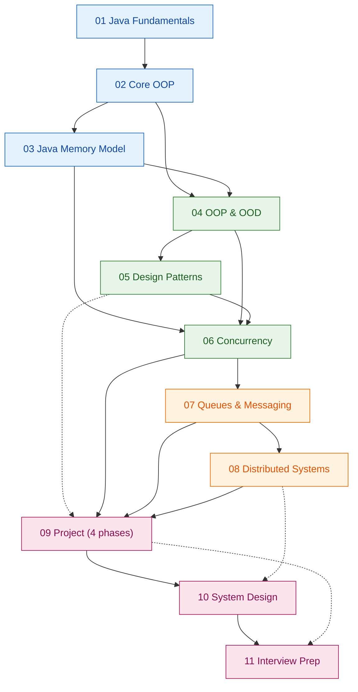
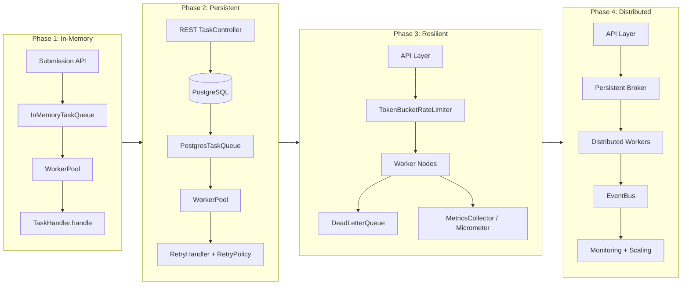

# The Learning Roadmap

> Where this fits in the project: this is the map. Every other file in `backend-engineering-roadmap`
> is a stop on this route. We start at "I have never written `public static void main`" and finish at
> "I designed, built, and can defend a distributed task queue and event processing platform." This page
> tells you the order, the timeline, and exactly when you are allowed to say "I'm done with this module."

This is a navigation and planning document, not a concept chapter. Read it once end-to-end now, then
return to it at the start of every module. Bookmark the [study plan](study-plan.md) for the day-by-day
breakdown and [milestones](milestones.md) for the demoable checkpoints.

---

## 1. The One-Sentence Plan

You will learn Java, OOP, OOD, design patterns, concurrency, queues, and distributed systems by building
**one** system across four phases — a **Distributed Task Queue and Event Processing Platform** — refactoring
it as each new concept lands, and finishing with system design and interview prep grounded in code you
actually wrote.

The canonical domain model you will keep extending the entire way:

```java
// You will meet these names in literally every module. Memorize the shapes, not yet the details.
enum TaskStatus { PENDING, SCHEDULED, RUNNING, SUCCEEDED, FAILED, RETRYING, DEAD }

record Task(
        String id,          // a UUID
        String type,        // routing key into the handler registry
        String payload,     // JSON string
        TaskStatus status,
        int attempts,
        int maxAttempts,
        Instant createdAt,
        Instant scheduledAt,
        int priority) {}

@FunctionalInterface
interface TaskHandler { TaskResult handle(Task task) throws Exception; }

record TaskResult(boolean success, String message, boolean retryable) {}

interface TaskQueue {
    void enqueue(Task t);
    Task dequeue() throws InterruptedException;
    int size();
}
```

If those four declarations look like noise right now, good — that is the point of week 1. By the end of
the roadmap you will have written, broken, and rewritten every one of them.

---

## 2. Why This Exact Ordering

The ordering is not arbitrary and it is not the order a university would teach. It is a **dependency
order**: each module is the minimum prerequisite for the next, and each module produces a concrete,
better version of the same project. Here is the argument, link by link in the chain.

1. **Java first** ([`01-java-fundamentals`](../01-java-fundamentals/chapter-01-classes-and-objects.md)).
   You cannot model objects in a language you cannot write. You already know DSA and have backend
   experience, so we skip "what is a loop" and go straight to classes, generics, collections, exceptions,
   streams, and functional interfaces — the syntax you will use to type the domain model above. **Why now:**
   every later module is expressed in Java code, so this is the literal alphabet.

2. **Core OOP next** ([`02-core-oop`](../02-core-oop/chapter-01-objects-and-references.md)). Syntax is not
   design. Before you can reason about *good* object structure you need fluency in the mechanics:
   references, constructors, static vs instance, overloading vs overriding, inheritance, polymorphism,
   and the four relationship types (association/aggregation/composition/inheritance). **Why before OOD:**
   OOD is the art of *choosing* between these mechanics; you must own the mechanics first.

3. **The Java Memory Model** ([`03-java-memory-model`](../03-java-memory-model/stack-vs-heap.md)). This is
   the module most curricula skip and most engineers later regret skipping. Stack vs heap, references,
   pass-by-value, garbage collection, object lifecycle, immutability, and the string pool. **Why here,
   right after OOP and right before OOD and concurrency:** you cannot reason about immutability as a
   *design* tool (`Task` is a record — why?) without understanding references and the heap, and you cannot
   reason about thread safety later without understanding what is actually shared between threads. This
   module is the hinge between "how objects work" and "how to design with them safely."

4. **OOP and OOD** ([`04-oop-and-ood`](../04-oop-and-ood/solid.md)). Now we design. Cohesion, coupling,
   dependency injection, domain modeling, aggregates, layered/hexagonal/clean architecture, SOLID,
   DRY/KISS/YAGNI, and the Law of Demeter. **Why after the memory model and before patterns:** design
   principles are the *vocabulary*; design patterns are *named solutions* expressed in that vocabulary.
   Learning patterns before principles produces cargo-cult engineers who paste a Singleton everywhere.

5. **Design patterns** ([`05-design-patterns`](../05-design-patterns/strategy.md)). The Gang of Four set,
   filtered for what actually ships in backend Java. Strategy for `RetryPolicy`, Factory for `TaskHandler`
   creation, Observer for the eventual `EventBus`, Command for `Task` itself, State for `TaskStatus`
   transitions. **Why after OOD:** a pattern is only correct if it improves cohesion/coupling — you need
   module 4 to judge that.

6. **Concurrency** ([`06-concurrency`](../06-concurrency/threads.md)). Threads, `ExecutorService`,
   `Future`/`CompletableFuture`, `BlockingQueue`, locks, semaphores, atomics, concurrent collections, and
   virtual threads. **Why here:** the entire point of a task queue is *asynchronous parallel processing*.
   You cannot build `Worker`, `WorkerPool`, or `InMemoryTaskQueue` without it. And you cannot write
   correct concurrent code without module 3 (what is shared) and module 4 (how to isolate it).

7. **Queues and messaging** ([`07-queues-and-messaging`](../07-queues-and-messaging/producer-consumer.md)).
   Producer/consumer, message queues, task queues, priority queues, delayed queues, scheduling queues,
   dead-letter queues, and a broker comparison (in-memory vs Redis vs RabbitMQ vs Kafka). **Why after
   concurrency:** a queue is a concurrency primitive applied to a domain. You generalize from
   `BlockingQueue` (a data structure) to a *messaging system* (an architecture).

8. **Distributed systems** ([`08-distributed-systems`](../08-distributed-systems/cap-theorem.md)). CAP,
   consistency/availability, idempotency, retries, DLQ, rate limiting, backpressure, circuit breakers,
   sharding, distributed locks, leader election, service discovery, and message ordering. **Why after
   queues:** these are the failure modes that appear *the moment your single-node queue becomes
   multi-node*. You feel the pain in module 7, then learn the cures here.

9. **The project** ([`09-project`](../09-project/architecture.md)). Four phases assembled into a real,
   running system. **Why a dedicated module even though we have been building all along:** the earlier
   modules introduce one concept against a thin slice; this module integrates them into a coherent,
   tested, deployable whole, with explicit architecture and tradeoff documentation.

10. **System design** ([`10-system-design`](../10-system-design/designing-a-task-queue.md)). Zoom out:
    fundamentals, designing a task queue from scratch on a whiteboard, scaling it, capacity estimation,
    storage modeling, observability/ops, and case studies (Celery, Sidekiq, SQS, Temporal). **Why after
    building it:** system-design interviews reward people who have *felt* the tradeoffs. You will have.

11. **Interview prep** ([`11-interview-prep`](../11-interview-prep/java.md)). Java, OOD, concurrency,
    distributed systems, and system design questions — every answer anchored to code you wrote. **Why
    last:** interview prep without a portfolio is memorization; with one, it is recall.

> The throughline: **mechanics → memory → design → patterns → concurrency → messaging → distribution →
> integration → design-at-scale → recall.** Each arrow is a hard dependency, not a preference.

---

## 3. Module Dependency Graph

This is the real prerequisite structure. A solid arrow means "you genuinely cannot do the target without
the source." A dotted arrow means "strongly recommended, reinforces but is not strictly blocking."



Reading the graph:

- **`02 Core OOP` is the first fork.** It feeds both `03 Memory Model` and `04 OOD`. Do not start design
  work until you have done both branches.
- **`03 Memory Model` feeds concurrency directly** (the dashed-in idea of "what is shared on the heap")
  *and* feeds OOD (immutability as a design tool). It is a load-bearing module, not a detour.
- **`06 Concurrency` is the convergence point** of memory, OOD, and patterns. It is the hardest module and
  has the most inbound edges. Budget extra time.
- **`09 Project` pulls from 5, 6, 7, 8.** You technically *start* the project in week 4 (Phase 1), but the
  dedicated project module is where you integrate everything.
- **The color bands map modules to project phases** (see the next section), not to difficulty.

---

## 4. Module → Project Phase Mapping

The project has four phases (from the spec). Modules are not one-to-one with phases — early modules seed
Phase 1 and you keep enriching earlier phases as you learn more. This table is the contract.

| Project Phase | Architecture | Modules that power it | What you can demo after it |
| --- | --- | --- | --- |
| **Phase 1** — In-memory | `Client -> Task Submission API -> In-Memory Queue -> Worker Pool -> Task Execution` | 01, 02, 03, 06 (early), 05 (Strategy/Factory) | Submit a `Task`, watch a `WorkerPool` of `Worker`s execute it via a `TaskHandler`, get a `TaskResult`. |
| **Phase 2** — Persistent | `Client -> REST API -> PostgreSQL -> Task Queue -> Worker Pool -> Retry Handler` | 04 (layering/DI), 05, Spring Boot 3, Spring Data, Flyway | `POST /tasks`, `GET /tasks/{id}`, survives a restart, retries failed tasks with a `RetryPolicy`. |
| **Phase 3** — Resilient | `Client -> API Layer -> Queue Layer -> Rate Limiter -> Worker Nodes -> Dead Letter Queue -> Metrics` | 07, 08 (rate limiting, retries, DLQ, circuit breakers), Micrometer/Prometheus | `TokenBucketRateLimiter` throttles load, poisoned tasks land in a `DeadLetterQueue`, Grafana shows throughput/latency. |
| **Phase 4** — Distributed | `Client -> API Layer -> Persistent Queue -> Distributed Workers -> Event Bus -> Monitoring -> Horizontal Scaling` | 08 (sharding, distributed locks, leader election, ordering), 07 (broker comparison), Redis/Kafka/RabbitMQ, Docker Compose | Multiple worker nodes scale horizontally, an `EventBus` fans out `TaskEvent`s, idempotent processing, no double execution. |



See [`09-project/architecture.md`](../09-project/architecture.md) for the full evolving architecture and
[`09-project/phase-1.md`](../09-project/phase-1.md) … [`phase-4.md`](../09-project/phase-4.md) for each build.

---

## 5. The Phased Timeline (Weeks)

This is a **16-week core plan** at roughly 12–15 focused hours/week, plus a 2-week interview sprint.
If you have less time, the "Compression" notes tell you what is safe to skim. If you have more, the
"Stretch" notes tell you where depth pays off. Adjust, but **do not reorder** — the dependency graph is law.

> Pace guidance: you are a strong programmer new to Java. Weeks 1–2 will feel fast (you know the concepts,
> only the syntax is new). Weeks 6–7 (concurrency) will feel slow — that is normal and correct. Do not
> rush concurrency to "catch up."

### Weeks 1–2 — Java Fundamentals → Phase 1 begins
- **Module:** [`01-java-fundamentals`](../01-java-fundamentals/chapter-01-classes-and-objects.md)
- **Study:** classes/objects, encapsulation, abstraction, generics, collections, exceptions, streams,
  functional interfaces. Set up Maven, JUnit 5, AssertJ.
- **Project:** type out `Task`, `TaskStatus`, `TaskResult`, `TaskHandler` exactly as in the canonical model.
  Write a trivial `main` that constructs a `Task` and prints it.
- **Compression:** if you know another statically typed OOP language, do chapters 04–08 first and backfill
  01–03 only where syntax surprises you.
- **Stretch:** read the [`exercises`](../01-java-fundamentals/exercises.md) generics section twice; generics
  variance is where Java differs most from what you know.

### Week 3 — Core OOP (mechanics)
- **Module:** [`02-core-oop`](../02-core-oop/chapter-01-objects-and-references.md)
- **Study:** references, constructors, access modifiers, static members, overloading vs
  [overriding](../02-core-oop/chapter-07-method-overriding.md), inheritance, polymorphism,
  up/downcasting, `instanceof` pattern matching, abstract classes vs
  [interfaces](../02-core-oop/chapter-13-interfaces.md), and the relationship quartet
  ([association](../02-core-oop/chapter-14-association.md),
  [aggregation](../02-core-oop/chapter-15-aggregation.md),
  [composition](../02-core-oop/chapter-16-composition.md),
  [composition vs inheritance](../02-core-oop/chapter-17-composition-vs-inheritance.md)).
- **Project:** turn `TaskHandler` into a real interface with two implementations (e.g. `EmailTaskHandler`,
  `ReportTaskHandler`). Use polymorphism to dispatch by `task.type()`.

### Week 4 — Java Memory Model + Phase 1 build
- **Module:** [`03-java-memory-model`](../03-java-memory-model/stack-vs-heap.md)
- **Study:** [stack vs heap](../03-java-memory-model/stack-vs-heap.md),
  [object references](../03-java-memory-model/object-references.md),
  [pass-by-value](../03-java-memory-model/pass-by-value.md),
  [GC](../03-java-memory-model/garbage-collection.md),
  [object lifecycle](../03-java-memory-model/object-lifecycle.md),
  [immutable objects](../03-java-memory-model/immutable-objects.md),
  [string pool](../03-java-memory-model/string-pool.md).
- **Project — Phase 1 complete:** build `InMemoryTaskQueue` on a `BlockingQueue`, a single-threaded
  `Worker`, and a tiny driver. Now you understand *why* `Task` is an immutable record (it crosses thread
  boundaries safely). Tag `v0.1.0`.
- **Why this week matters:** every concurrency bug you write later is a memory-model misunderstanding.

### Weeks 5 — OOP & OOD
- **Module:** [`04-oop-and-ood`](../04-oop-and-ood/solid.md)
- **Study:** [cohesion](../04-oop-and-ood/cohesion.md), [coupling](../04-oop-and-ood/coupling.md),
  [dependency injection](../04-oop-and-ood/dependency-injection.md),
  [domain modeling](../04-oop-and-ood/domain-modeling.md), [aggregates](../04-oop-and-ood/aggregates.md),
  [layered](../04-oop-and-ood/layered-architecture.md) /
  [hexagonal](../04-oop-and-ood/hexagonal-architecture.md) /
  [clean](../04-oop-and-ood/clean-architecture.md) architecture, [SOLID](../04-oop-and-ood/solid.md),
  [DRY/KISS/YAGNI](../04-oop-and-ood/dry-kiss-yagni.md), [Law of Demeter](../04-oop-and-ood/law-of-demeter.md).
- **Project:** refactor Phase 1 so `Worker` depends on the `TaskQueue` *interface*, not `InMemoryTaskQueue`.
  Introduce a `HandlerRegistry`. This is your first deliberate DI and your first ports-and-adapters seam —
  it is what makes Phase 2's `PostgresTaskQueue` a drop-in swap.

### Week 6 — Design Patterns (backend-relevant subset)
- **Module:** [`05-design-patterns`](../05-design-patterns/strategy.md)
- **Study (prioritized):** [Strategy](../05-design-patterns/strategy.md) (→ `RetryPolicy`),
  [Factory Method](../05-design-patterns/factory-method.md) / [Abstract Factory](../05-design-patterns/abstract-factory.md)
  (→ handler/queue creation), [Observer](../05-design-patterns/observer.md) (→ `EventBus`),
  [Command](../05-design-patterns/command.md) (→ `Task` as a command), [State](../05-design-patterns/state.md)
  (→ `TaskStatus` transitions), [Template Method](../05-design-patterns/template-method.md),
  [Chain of Responsibility](../05-design-patterns/chain-of-responsibility.md),
  [Decorator](../05-design-patterns/decorator.md) (→ wrapping handlers with retry/metrics),
  [Adapter](../05-design-patterns/adapter.md), [Proxy](../05-design-patterns/proxy.md),
  [Facade](../05-design-patterns/facade.md).
- **Skim later:** [Visitor](../05-design-patterns/visitor.md), [Interpreter](../05-design-patterns/interpreter.md),
  [Memento](../05-design-patterns/memento.md), [Mediator](../05-design-patterns/mediator.md) — read once,
  use rarely in this project.
- **Project:** implement `RetryPolicy` as a Strategy with `FixedDelayRetryPolicy` and
  `ExponentialBackoffRetryPolicy`. Build a `TaskHandlerFactory`/registry.

### Weeks 7–8 — Concurrency (the hard, load-bearing module)
- **Module:** [`06-concurrency`](../06-concurrency/threads.md)
- **Study:** [threads](../06-concurrency/threads.md), [`ExecutorService`](../06-concurrency/executor-service.md),
  [futures & `CompletableFuture`](../06-concurrency/futures-and-completablefuture.md),
  [`BlockingQueue`](../06-concurrency/blocking-queue.md), [locks](../06-concurrency/locks.md),
  [semaphores](../06-concurrency/semaphores.md),
  [atomics & thread safety](../06-concurrency/atomics-and-thread-safety.md),
  [concurrent collections](../06-concurrency/concurrent-collections.md). Cover virtual threads (Loom).
- **Project:** rebuild `WorkerPool` on a real `ExecutorService`. Make `InMemoryTaskQueue` truly concurrent.
  Add graceful `shutdown()`. Stress-test with thousands of tasks. This is the first time the system is
  genuinely parallel — and the first time you will write a data race and have to fix it.
- **Do not skip the exercises here.** Concurrency is learned only by debugging it.

### Week 9 — Queues & Messaging
- **Module:** [`07-queues-and-messaging`](../07-queues-and-messaging/producer-consumer.md)
- **Study:** [producer/consumer](../07-queues-and-messaging/producer-consumer.md),
  [message queues](../07-queues-and-messaging/message-queues.md),
  [task queues](../07-queues-and-messaging/task-queues.md),
  [priority queues](../07-queues-and-messaging/priority-queues.md),
  [delayed queues](../07-queues-and-messaging/delayed-queues.md),
  [scheduling queues](../07-queues-and-messaging/scheduling-queues.md),
  [dead-letter queues](../07-queues-and-messaging/dead-letter-queues.md),
  [broker comparison](../07-queues-and-messaging/broker-comparison.md).
- **Project:** add `priority` handling (priority queue), a `TaskScheduler` backed by a `DelayQueue`
  (honoring `scheduledAt`), and the first `DeadLetterQueue` interface.

### Weeks 10–11 — Distributed Systems
- **Module:** [`08-distributed-systems`](../08-distributed-systems/cap-theorem.md)
- **Study:** [CAP](../08-distributed-systems/cap-theorem.md) /
  [consistency & availability](../08-distributed-systems/consistency-and-availability.md),
  [idempotency](../08-distributed-systems/idempotency.md), [retries](../08-distributed-systems/retries.md),
  [DLQ](../08-distributed-systems/dlq.md), [rate limiting](../08-distributed-systems/rate-limiting.md),
  [backpressure](../08-distributed-systems/backpressure.md),
  [circuit breakers](../08-distributed-systems/circuit-breakers.md),
  [sharding](../08-distributed-systems/sharding.md),
  [distributed locks](../08-distributed-systems/distributed-locks.md),
  [leader election](../08-distributed-systems/leader-election.md),
  [service discovery & scaling](../08-distributed-systems/service-discovery-and-scaling.md),
  [message ordering](../08-distributed-systems/message-ordering.md).
- **Project:** make handlers idempotent, add a `TokenBucketRateLimiter`, wire Resilience4j circuit
  breakers, route exhausted retries to the DLQ. This is the backbone of **Phase 3**.

### Weeks 12–14 — The Project (integrate Phases 2, 3, 4)
- **Module:** [`09-project`](../09-project/architecture.md)
- **Build:** [Phase 2](../09-project/phase-2.md) (Spring Boot 3, `TaskController`, `TaskRepository`,
  PostgreSQL, Flyway), [Phase 3](../09-project/phase-3.md) (rate limiting, DLQ, Micrometer + Prometheus +
  Grafana), [Phase 4](../09-project/phase-4.md) (pluggable Redis/Kafka/RabbitMQ broker, `EventBus`,
  Docker Compose, horizontal scaling).
- **Deliverable:** a running, tested, containerized platform with an architecture doc.

### Week 15 — System Design
- **Module:** [`10-system-design`](../10-system-design/system-design-fundamentals.md)
- **Study:** [fundamentals](../10-system-design/system-design-fundamentals.md),
  [designing a task queue](../10-system-design/designing-a-task-queue.md),
  [scaling the platform](../10-system-design/scaling-the-platform.md),
  [capacity estimation](../10-system-design/capacity-estimation.md),
  [data modeling & storage](../10-system-design/data-modeling-and-storage.md),
  [observability & ops](../10-system-design/observability-and-ops.md),
  [case studies](../10-system-design/case-studies.md).
- **Activity:** whiteboard your own platform from scratch in 45 minutes, then compare to what you built.

### Week 16 (+ buffer) — Interview Prep
- **Module:** [`11-interview-prep`](../11-interview-prep/java.md)
- **Study:** [Java](../11-interview-prep/java.md), [OOD](../11-interview-prep/ood.md),
  [concurrency](../11-interview-prep/concurrency.md),
  [distributed systems](../11-interview-prep/distributed-systems.md),
  [system design](../11-interview-prep/system-design.md). Every answer references your repo.

---

## 6. Exit Criteria Per Module

You are **done** with a module only when you can do everything in its row *without looking it up*. These
are deliberately strict. "I read it" is not "I'm done."

### Module 01 — Java Fundamentals
- [ ] You can declare the full canonical model (`Task` record, `TaskStatus` enum, `TaskHandler` functional
      interface, `TaskResult` record) from memory and compile it with Maven.
- [ ] You can explain generics with bounded type parameters and write a generic method.
- [ ] You can write a stream pipeline that filters tasks by status and collects to a list.
- [ ] You can write a `try`/`catch`/`finally` and a try-with-resources, and explain checked vs unchecked.
- [ ] Your JUnit 5 + AssertJ test runs green via `mvn test`.

### Module 02 — Core OOP
- [ ] You can correctly answer "does this print the parent or child method?" for any overriding scenario.
- [ ] You can draw the four relationships (association/aggregation/composition/inheritance) as UML and give
      a `Task`-queue example of each.
- [ ] You can explain when to prefer composition over inheritance with a concrete project example.
- [ ] You can refactor a `switch` on `task.type()` into polymorphic dispatch.

### Module 03 — Java Memory Model
- [ ] You can predict, on paper, what mutating an object passed to a method does to the caller's reference.
- [ ] You can explain *why* `Task` is immutable and what would break if it were mutable in a `WorkerPool`.
- [ ] You can describe object lifecycle and when an object becomes eligible for GC.
- [ ] You can explain `String` interning and why `==` on strings is a trap.

### Module 04 — OOP & OOD
- [ ] You can name the SOLID principles and point to one violation and one fix *in your own code*.
- [ ] `Worker` depends on the `TaskQueue` interface, not a concrete class (DI in action).
- [ ] You can explain why hexagonal architecture makes `PostgresTaskQueue` a drop-in for `InMemoryTaskQueue`.
- [ ] You can identify a Law-of-Demeter violation and flatten it.

### Module 05 — Design Patterns
- [ ] `RetryPolicy` is a Strategy with two real implementations, swappable at runtime.
- [ ] You can justify each pattern by its effect on cohesion/coupling — not just name it.
- [ ] You can name the pattern that fits `EventBus` (Observer) and `TaskStatus` transitions (State).
- [ ] You can spot an over-engineered pattern (e.g. a Singleton that should be a DI bean) and remove it.

### Module 06 — Concurrency
- [ ] `WorkerPool` runs on an `ExecutorService` with correct, tested graceful shutdown.
- [ ] You can explain the difference between `synchronized`, `ReentrantLock`, `Semaphore`, and an atomic.
- [ ] You can find and fix a data race you intentionally introduced.
- [ ] You can explain when virtual threads help and when they do not (CPU-bound vs IO-bound work).
- [ ] No `ConcurrentModificationException`, no lost updates, in a 10k-task stress test.

### Module 07 — Queues & Messaging
- [ ] `TaskScheduler` honors `scheduledAt` via a `DelayQueue` or `ScheduledExecutorService`.
- [ ] Priority is respected for `task.priority()`.
- [ ] You can explain at-least-once vs at-most-once vs exactly-once delivery.
- [ ] You can state, with numbers, when you would choose Kafka over RabbitMQ over Redis for this project.

### Module 08 — Distributed Systems
- [ ] Your handlers are idempotent and you can prove it (same task twice = one effect).
- [ ] `TokenBucketRateLimiter.tryAcquire()` correctly throttles under load.
- [ ] Exhausted retries land in the `DeadLetterQueue` with a reason.
- [ ] You can explain CAP for *this* system and which two you chose, and why.
- [ ] A circuit breaker opens on a failing downstream and recovers.

### Module 09 — Project
- [ ] `POST /tasks` and `GET /tasks/{id}` work against PostgreSQL; data survives restart.
- [ ] Metrics are visible in Grafana (throughput, latency, queue depth, DLQ size).
- [ ] Two worker nodes process without double-executing any task.
- [ ] `docker compose up` brings the whole platform up from cold.
- [ ] The architecture doc explains every tradeoff.

### Module 10 — System Design
- [ ] You can whiteboard the platform in 45 minutes, end to end, with capacity numbers.
- [ ] You can do a back-of-envelope estimate: given N tasks/sec and M ms/task, how many workers?
- [ ] You can compare your design to Celery/Sidekiq/SQS/Temporal and defend the differences.

### Module 11 — Interview Prep
- [ ] You can answer every interview question in the module out loud in under 3 minutes.
- [ ] Every answer cites a concrete file or class from your repo.
- [ ] You can do a live 45-minute mock system-design of a task queue without notes.

---

## 7. The Weekly Checklist (Repeat Every Week)

Copy this into your journal each Monday. It is the same loop regardless of module, because the *method*
is what makes the curriculum stick.

```text
WEEK ___  •  Module: ____________________  •  Project Phase: ____

MONDAY — Orient
  [ ] Re-read this module's row in the dependency graph and exit criteria.
  [ ] Skim every chapter heading in the module; write the 3 questions I most want answered.

TUE–THU — Learn by doing
  [ ] Read 1–2 chapters/day; type EVERY code sample (no copy-paste).
  [ ] After each chapter, do its Easy + Medium exercises before moving on.
  [ ] Commit a small refactor to the project that uses today's concept.

FRIDAY — Integrate
  [ ] Do the module's Hard / design / interview-style exercise.
  [ ] Make the project change that maps to this module (see the phase table).
  [ ] Write a 5-line journal note: what clicked, what is still fuzzy.

SATURDAY — Prove it
  [ ] Check off the module's exit criteria. Anything unchecked = revisit Mon/Tue.
  [ ] Run `mvn test`. Green, or it isn't done.

SUNDAY — Rest / buffer
  [ ] Optional: stretch goal, or catch up if behind. Protect this day for sustainability.

END-OF-WEEK GATE: do not advance to the next module until ALL exit criteria are checked.
```

Per-day discipline that matters more than any single concept:

- **Type, don't paste.** Muscle memory for Java syntax is the fastest path out of "new to Java."
- **One concept → one commit.** Every chapter should produce a real diff in the project. See each chapter's
  "Git Commit For This Chapter" footer for the exact conventional-commit message.
- **Red before green.** Write the failing JUnit test first when you can; it forces you to state intent.

---

## 8. Tradeoffs of This Roadmap

No plan is free. Here are the honest costs and the alternatives we rejected.

| Decision | Benefit | Cost / Risk | Why we chose it |
| --- | --- | --- | --- |
| One project across all modules | Deep, integrated understanding; a portfolio piece | Narrow domain exposure (everything is "tasks") | Depth beats breadth for *learning*; the patterns generalize. |
| Memory model *before* OOD/concurrency | Fewer concurrency bugs; immutability becomes a design tool | Feels like a detour at week 4 | Concurrency bugs are memory-model bugs; pay the cost early. |
| Patterns *after* principles | No cargo-cult pattern abuse | Slower gratification (you want to write a Factory on day 3) | A pattern is only correct relative to cohesion/coupling. |
| 16 weeks, sequential | Sustainable, dependency-respecting | Slower than a bootcamp's "build it in a weekend" | Real depth needs spaced repetition and refactoring loops. |
| Java 21 + Spring Boot 3 | Modern, employable, records/sealed/virtual-threads | Tied to one ecosystem | It is the dominant backend stack for these roles. |
| Build, then system design | Interview answers grounded in felt experience | You design "from below" before "from above" | Whiteboard skill is cheap to add *after* you have built. |

**Alternative orderings we explicitly rejected:**

- *Patterns before OOD:* produces people who memorize 23 patterns and misuse them. Rejected.
- *Concurrency before memory model:* produces flaky, race-ridden code and frustration. Rejected.
- *System design first (top-down):* common in interview courses, but answers are hollow without having
  built anything. We do it *after* the project on purpose.
- *Separate toy projects per module:* less context-switching cost per module, but no compounding — you
  never feel a refactor pay off three modules later. Rejected.

---

## 9. Common Mistakes and Pitfalls (Using This Roadmap)

- **Skipping the memory model** because "I know pointers." Java's pass-by-value-of-references trips up even
  C++ veterans. *Fix:* do module 03's [`pass-by-value`](../03-java-memory-model/pass-by-value.md) exercises.
- **Reading instead of typing.** Reading code creates the illusion of competence. *Fix:* the weekly
  checklist forbids copy-paste; honor it.
- **Reordering to "get to the fun part" (distributed systems).** You will hit a wall because the
  prerequisites aren't there. *Fix:* trust the dependency graph; it is a hard order.
- **Rushing concurrency** (weeks 7–8) to stay on schedule. *Fix:* it is the load-bearing module; let it
  take three weeks if needed and compress system design instead.
- **Treating exit criteria as suggestions.** The gate exists so you don't build module 7 on a shaky module
  6. *Fix:* no advancement until every box is checked.
- **Gold-plating the project early.** Don't build Phase 4 infrastructure in Phase 1. *Fix:* follow
  [YAGNI](../04-oop-and-ood/dry-kiss-yagni.md); each phase adds exactly what its modules teach.
- **Collecting patterns.** Adding a Singleton/Factory/Decorator everywhere "to practice." *Fix:* a pattern
  must improve cohesion/coupling or it is removed in review.
- **Doing interview prep first.** Memorizing answers with no project to anchor them. *Fix:* it is module 11
  for a reason.

---

## 10. Refactoring Exercise: Plan Your Own Schedule

The point of a roadmap is that you can adapt it. Below is a bad plan, an improved plan, and a
production-quality plan — for *scheduling your own study*, mirroring how we refactor code in every chapter.

**Bad plan (no dependencies, no gates):**

```text
Week 1: Java + Spring + Kafka + Docker  (learn everything at once)
Week 2: Build the whole distributed system
Week 3: Interview prep
```

Why it fails: ignores the dependency graph, no exit criteria, guarantees a half-working distributed system
built on a shaky Java foundation. This is the "build it in a weekend" trap.

**Improved plan (respects order, still too coarse):**

```text
Weeks 1-4:   Java + OOP + memory model
Weeks 5-8:   OOD + patterns + concurrency
Weeks 9-12:  queues + distributed + project
Weeks 13-16: system design + interview
```

Better — the order is right — but the blocks are too big to gate, and concurrency (a 2-week module) is
crammed into a shared block where it will get squeezed.

**Production-quality plan (gated, weighted by difficulty, buffered):**

```text
W1-2  Java fundamentals        gate: model compiles + tests green
W3    Core OOP                  gate: polymorphic dispatch in project
W4    Memory model + Phase 1    gate: InMemoryTaskQueue + Worker run; tag v0.1.0
W5    OOP & OOD                 gate: Worker depends on TaskQueue interface (DI)
W6    Design patterns           gate: RetryPolicy as Strategy
W7-8  Concurrency (2 wks)       gate: WorkerPool on ExecutorService, 10k-task stress passes
W9    Queues & messaging        gate: TaskScheduler honors scheduledAt
W10-11 Distributed systems      gate: idempotency + rate limit + DLQ proven
W12-14 Project (Phases 2-4)     gate: docker compose up; 2 nodes, no double-exec
W15   System design             gate: 45-min whiteboard with capacity numbers
W16+  Interview prep            gate: every answer cites a repo file
SUN   buffer every week         (sustainability is a feature, not a luxury)
```

The production plan weights concurrency at 2 weeks, attaches a concrete *gate* to every block, and
reserves a weekly buffer. That is the difference between a plan and a wish.

---

## 11. Exercises

### Easy

1. **Knowledge check.** Without scrolling up, list the eleven modules in dependency order and name the one
   project phase each block of modules first unlocks.
2. **Mapping.** For each canonical type (`Task`, `TaskQueue`, `RetryPolicy`, `DeadLetterQueue`,
   `RateLimiter`, `EventBus`), name the *earliest* module where you will implement it.
3. **Self-audit.** Copy the Module 01 exit criteria into your journal and honestly check which you can do
   today. The unchecked ones are week 1.

### Medium

4. **Personalize the timeline.** You have only 8 weeks (not 16). Produce a compressed schedule that still
   respects the dependency graph. State explicitly which modules you compress and which you refuse to
   compress, and justify each call against the tradeoff table in section 8.
5. **Phase mapping.** Draw your own version of the Phase 1→4 flowchart and annotate each arrow with the
   *one* module that makes that arrow possible. Compare to section 4.
6. **Gate design.** Pick any module and write three additional exit criteria beyond the ones listed. Each
   must be objectively checkable (a test passes, a class exists), not subjective ("I understand X").

### Hard

7. **Design exercise.** Suppose a teammate insists on learning Kafka in week 1 "to stay motivated." Write
   the argument (3–5 sentences) for why this violates the dependency graph, citing exactly which
   prerequisites are missing, and propose a motivation-preserving alternative that does *not* break order.
8. **Interview-style.** "Walk me through how you'd take a junior engineer from zero Java to shipping a
   distributed task queue in a quarter." Give a 2-minute answer structured around this roadmap's ordering
   rationale (section 2).
9. **Stretch challenge.** Extend the dependency graph with a hypothetical twelfth module, *Security &
   Auth* (authn/authz for the `TaskController`, secrets for brokers). Where does it slot in the Mermaid
   graph? What are its inbound prerequisites and its exit criteria? Defend the placement.

---

## 12. Solutions

**1.** Order: 01 Java Fundamentals → 02 Core OOP → 03 Memory Model → 04 OOP & OOD → 05 Design Patterns →
06 Concurrency → 07 Queues & Messaging → 08 Distributed Systems → 09 Project → 10 System Design → 11
Interview Prep. Phase unlocks: 01/02/03/06-early → **Phase 1**; 04/05 + Spring → **Phase 2**; 07/08 →
**Phase 3**; 08 (sharding/locks/election) + broker → **Phase 4**.

**2.** `Task`/`TaskQueue`: module 01 (declared) / module 04 (interface-driven) / module 06 (concurrent).
`RetryPolicy`: module 05 (Strategy). `RateLimiter` (`TokenBucketRateLimiter`): module 08. `DeadLetterQueue`:
introduced module 07, made resilient in module 08. `EventBus`: module 08/Phase 4.

**3 & 6.** Self-graded; the test is whether each criterion is *objectively checkable*. A good extra gate
for module 06: "`WorkerPool.shutdown()` drains in-flight tasks and rejects new ones, verified by a JUnit
test asserting zero tasks lost." A bad gate: "I feel comfortable with threads."

**4.** A defensible 8-week compression: W1 Java (compress 01 to chapters 04–08 if you know another OOP
language), W2 Core OOP + Memory model merged (you can move fast through mechanics), W3 OOD + patterns
(prioritize Strategy/Factory/Observer; skim Visitor/Interpreter), W4–5 Concurrency (**refuse to
compress** — it is load-bearing), W6 Queues + the distributed *essentials* (idempotency, retries, DLQ,
rate limiting; defer sharding/leader-election), W7 Project Phases 2–3 (defer full Phase 4), W8 System
design + interview. Refuse to compress: memory model fundamentals and concurrency. Safe to compress:
the rarely-used patterns and the advanced distributed topics (sharding/leader election) if you skip Phase 4.

**5 & 7.** Graded on reasoning. Key for 7: Kafka in week 1 presupposes producer/consumer (module 07),
which presupposes concurrency (module 06), which presupposes the memory model (03) and OOD (04), none of
which exist yet — so the learner would copy-paste config without understanding delivery semantics,
partitions, or consumer groups. Motivation-preserving alternative: build the *in-memory* `InMemoryTaskQueue`
in week 4 (Phase 1) so the learner sees real async task processing early, then swap in Kafka in module 07
as a *replacement* for a thing they already understand.

**8.** Model answer: "I order it by dependency, not by excitement. Java first because everything is
expressed in it. Then OOP mechanics, then the memory model — because concurrency bugs are memory bugs and
immutability is a design decision. Then OOD principles, *then* patterns, because a pattern is only correct
relative to cohesion and coupling. Concurrency comes next because a task queue is fundamentally async,
followed by queues and messaging (a queue is concurrency applied to a domain), then distributed systems
(the failures that appear when one node becomes many). All of it lands in one evolving project so each
concept produces a real refactor, and we finish with system design and interview prep grounded in code
they actually shipped."

**9.** *Security & Auth* slots **after `04 OOP & OOD`** (it is a cross-cutting concern best designed with
layered/hexagonal architecture in hand) and **before `09 Project` Phase 2** (where the REST
`TaskController` first becomes reachable). Inbound prerequisites: `04` (where to put a security boundary —
it's a port/adapter), `08-distributed-systems/rate-limiting.md` (auth and rate limiting share the request
filter chain). Exit criteria: "`POST /tasks` rejects unauthenticated requests with 401; broker
credentials come from a secrets store, not source; an integration test proves an unauthorized task is
never enqueued." Placement is defensible because security is a design concern (needs OOD) applied at the
API edge (needs the REST layer from Phase 2).

---

## 13. Interview Questions and Takeaways

1. **"Why learn the memory model before concurrency?"** Because every concurrency bug — lost updates,
   visibility issues, races — is at root a misunderstanding of what is shared on the heap and how
   references behave. Immutability (why `Task` is a record) is a *memory-model-informed design choice*.

2. **"Why patterns after principles, not before?"** A design pattern is a named solution expressed in the
   vocabulary of cohesion and coupling. Without that vocabulary you can't judge whether a pattern helps;
   you just sprinkle Singletons. Principles are the rubric; patterns are graded against it.

3. **"How do you avoid building a half-working distributed system?"** Gate every module on objective exit
   criteria and never advance until they're met. Build one node correctly (Phase 1) before distributing it
   (Phase 4). The dependency graph is enforced, not advisory.

4. **"Where does idempotency enter, and why there?"** Module 08 / Phase 3, the moment retries and
   multiple worker nodes can execute the same `Task` more than once. Before that there's no duplication to
   defend against; introducing it earlier is YAGNI.

5. **"What's the single highest-leverage module?"** Concurrency (06). It has the most inbound dependencies
   (memory, OOD, patterns), it's where the project becomes genuinely parallel, and it's the most common
   source of production incidents. We weight it at two weeks for that reason.

6. **"Why one project instead of many small exercises?"** Compounding. A refactor in module 04 (DI on
   `TaskQueue`) pays off in module 09 when `PostgresTaskQueue` drops in for free. Disconnected exercises
   never let you *feel* a design decision pay off later.

**Takeaways:** the curriculum is a dependency graph, not a syllabus; every concept produces a real commit;
exit criteria are gates, not suggestions; and the whole thing is grounded in one evolving system so your
interview answers cite code you actually wrote.

---

## 14. Production Considerations

- **Sustainability is the real risk.** Most self-directed roadmaps fail not from difficulty but from
  burnout around week 6–8 (concurrency). The protected Sunday buffer and the "one concept, one commit"
  rhythm exist to keep the pace humane. Plan for a missed week; the buffer absorbs it.
- **Scope creep on the project.** It is tempting to add features the modules haven't taught yet. Resist;
  each phase adds exactly what its modules cover. Over-building Phase 1 with Phase 4 concerns is the
  classic [YAGNI](../04-oop-and-ood/dry-kiss-yagni.md) failure.
- **Tooling drift.** Pin Java 21 LTS, a fixed Spring Boot 3.x line, and a known PostgreSQL image in
  `docker-compose` from day one. Chasing new releases mid-curriculum wastes time you budgeted for learning.
- **Measuring progress honestly.** The exit-criteria checkboxes and green `mvn test` are your only true
  signal. "I read the chapter" is a vanity metric. Track checked criteria per week as your burn-down.
- **When you fall behind,** compress system design (module 10) and the rarely-used patterns first; never
  compress the memory model or concurrency. See the Medium exercise #4 solution for a defensible 8-week cut.

---

## What We Can Improve In Our Project Using This Concept

The roadmap itself is the improvement lens: it tells us *which* improvement is legal *when*. Concretely,
it sequences the project's evolution so each change is a clean, reviewable diff rather than a big-bang
rewrite — `Task` declared (M1) → polymorphic handlers (M2) → immutable and thread-safe (M3) → DI'd behind
the `TaskQueue` interface (M4) → `RetryPolicy` as Strategy (M5) → `WorkerPool` on an `ExecutorService`
(M6) → scheduling/priority/DLQ (M7) → idempotency/rate-limiting/circuit-breaking (M8) → persisted,
observed, distributed (M9). Every arrow is a planned, gated refactor.

## Project Refactoring Task

Create `00-roadmap/progress.md` (your personal copy) with a checkbox per module exit criterion from
section 6. At the end of each week, check off only what you can do *without looking it up*, and link each
checked box to the commit that proves it (e.g. "M6: `WorkerPool` graceful shutdown — commit `a1b2c3d`").
This turns the roadmap from a document you read into a burn-down chart you drive.

## Git Commit For This Chapter

```bash
git add backend-engineering-roadmap/00-roadmap/roadmap.md
git commit -m "docs(roadmap): add phased, gated learning roadmap with module dependency graph

- Map 11 modules to 4 project phases with exit criteria each
- Add Mermaid dependency graph and phase flowchart
- Justify the mechanics->memory->design->patterns->concurrency->
  queues->distributed->project->system-design->interview ordering
- Include 16-week timeline, weekly checklist, and tradeoff table"
```

Files touched: `00-roadmap/roadmap.md` (new). Companion docs to author next:
[`study-plan.md`](study-plan.md) (day-by-day) and [`milestones.md`](milestones.md) (demoable checkpoints).

## Architecture Impact

This document has no runtime architecture impact — it produces no code. Its impact is *process*
architecture: it defines the order in which the system's architecture is allowed to evolve, ensuring
every architectural change (in-memory → persistent → resilient → distributed) lands on a foundation that
can support it. It is the constitution the other 129 files operate under.

## Interview Takeaways

- Be able to defend a *dependency-ordered* learning path, not a topic list: memory before concurrency,
  principles before patterns, build before system-design.
- "One evolving project" is itself an answer to "how do you learn deeply?" — it demonstrates compounding
  and the ability to refactor under changing requirements.
- Gates and exit criteria signal engineering maturity: you ship on objective signals (tests green,
  criteria met), not on feeling done.
