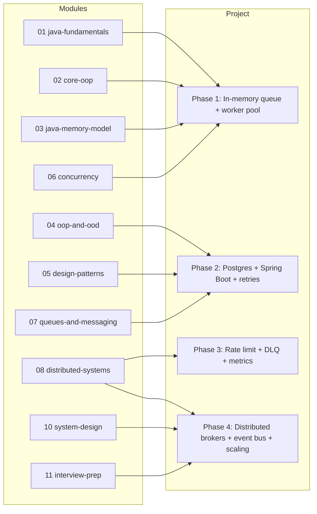
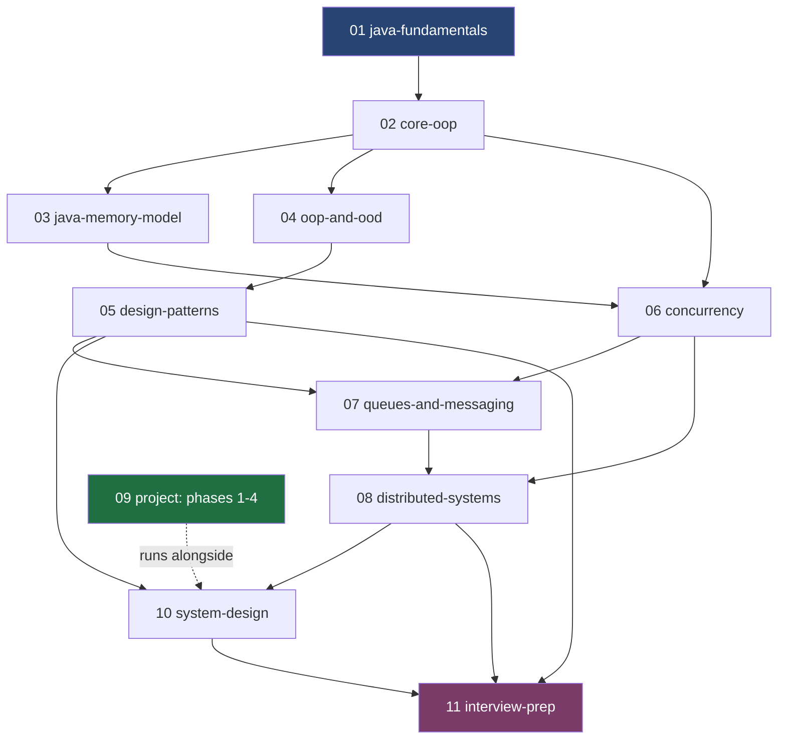
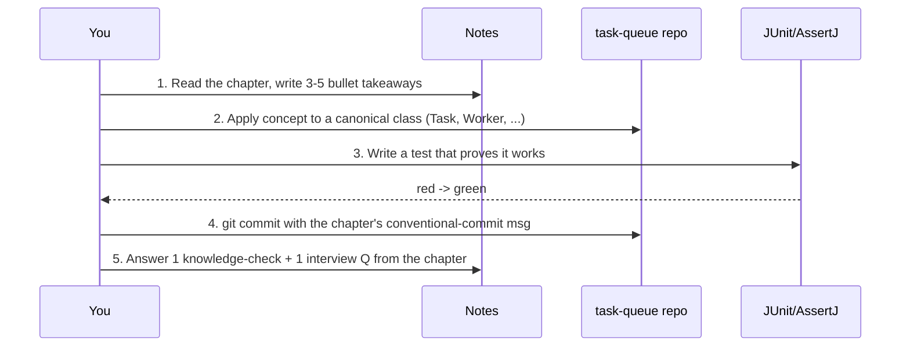
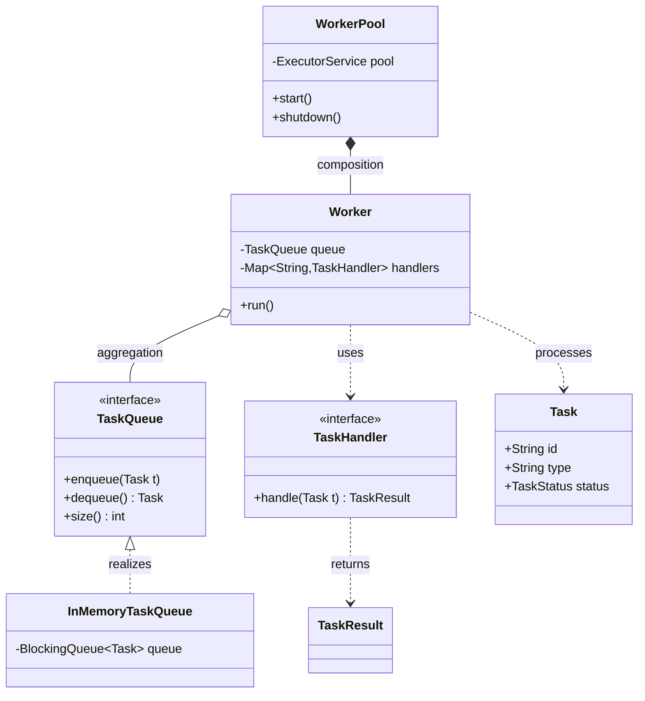

# Daily and Weekly Study Plan

> Where this fits in the project: this is your operational schedule. The [roadmap](./roadmap.md) tells you *what* exists and *why*; this file tells you *when* to study each module, *how* to split your hours, and *what working software you must have shipped* by the end of each week. Track your milestones in [milestones.md](./milestones.md).

This is a navigation and planning document, not a concept chapter. It is opinionated on purpose. Pick a track, follow the daily blocks, and refuse to advance a week until you hit the exit criteria. The whole curriculum is built around **one evolving system**: a Distributed Task Queue and Event Processing Platform. Every week of study produces a concrete, runnable piece of that system using the canonical domain model (`Task`, `TaskStatus`, `TaskQueue`, `Worker`, `WorkerPool`, `RetryPolicy`, `DeadLetterQueue`, `RateLimiter`, `TaskScheduler`, `TaskRepository`, `EventBus`).

---

## The Three Tracks At A Glance

| Track | Duration | Hours/day | Best for | Risk |
|-------|----------|-----------|----------|------|
| **Standard** | 12 weeks | 2–3 h/day | The default. Strong DSA background, new to Java/OOD, working a job or final-year studies. | None — this is the calibrated path. |
| **Intensive** | 6 weeks | 5–6 h/day | Full-time learners, bootcamp pace, between jobs, interview in ~7 weeks. | Burnout; skipping the reflective refactoring that builds intuition. |
| **Relaxed** | 16 weeks | 1–1.5 h/day | Busy professionals, parents, anyone who wants depth over speed. | Losing momentum; project context decay between sessions. |

> All three tracks cover the **same modules and the same project phases**. They differ only in calendar pacing and how much you compress the exercises and interview prep. Do not invent a fourth track by cherry-picking chapters — the dependency graph below is load-bearing.

---

## How Modules Map To Project Phases

The curriculum has 12 numbered modules. They feed four project phases. Study a module, then immediately apply it to the corresponding project phase so the knowledge sticks.



| Module | Project Phase it unlocks | Why this ordering |
|--------|--------------------------|-------------------|
| [01-java-fundamentals](../01-java-fundamentals/chapter-01-classes-and-objects.md) | Phase 1 | You cannot model `Task` or `TaskStatus` without the language. |
| [02-core-oop](../02-core-oop/chapter-01-objects-and-references.md) | Phase 1 | `TaskHandler`, `TaskQueue`, `Worker` are an exercise in interfaces, polymorphism, and composition. |
| [03-java-memory-model](../03-java-memory-model/stack-vs-heap.md) | Phase 1 | Immutable `Task` records, references shared across threads, GC pressure under load. |
| [06-concurrency](../06-concurrency/threads.md) | Phase 1 | `WorkerPool` is an `ExecutorService`; `InMemoryTaskQueue` is a `BlockingQueue`. |
| [04-oop-and-ood](../04-oop-and-ood/solid.md) | Phase 2 | Layered/hexagonal architecture, DI, cohesion/coupling — needed before Spring Boot. |
| [05-design-patterns](../05-design-patterns/strategy.md) | Phase 2 | `RetryPolicy` (Strategy), handler lookup (Factory), `TaskScheduler` (Command). |
| [07-queues-and-messaging](../07-queues-and-messaging/producer-consumer.md) | Phase 2–3 | Priority/delayed/scheduling/dead-letter queue semantics. |
| [08-distributed-systems](../08-distributed-systems/cap-theorem.md) | Phase 3–4 | Idempotency, retries, rate limiting, backpressure, circuit breakers, sharding. |
| [10-system-design](../10-system-design/designing-a-task-queue.md) | Phase 4 | Capacity estimation, observability, scaling the platform. |
| [11-interview-prep](../11-interview-prep/java.md) | After Phase 4 | Convert everything you built into crisp interview answers. |

---

## Module Dependency Graph

Do not study a module before its prerequisites. Arrows mean "must finish first."



Reading the graph:

- **01 → 02** is non-negotiable. Objects before everything.
- **02 splits three ways**: into memory model, into OOD principles, and (with the memory model) into concurrency.
- **05 design-patterns** depends on **04 oop-and-ood**, because a pattern is just a named, reusable answer to a design-principles problem.
- **07 queues** sits on top of both **06 concurrency** (the mechanics: `BlockingQueue`, `DelayQueue`) and **05 patterns** (the structure: Strategy, Command, Chain of Responsibility).
- **08 distributed-systems** is the convergence point. It needs queues and concurrency.
- **09 project** is dotted because it is not a "phase you finish then leave" — you continuously refactor it as you learn. It is your lab bench.

---

## Daily Time Budget (Standard Track, 2–3 hours)

Each study day splits into three blocks. The ratio shifts as the curriculum gets more hands-on.

| Phase of curriculum | Theory (read + take notes) | Coding (build the project) | Exercises (drills + review) |
|---------------------|----------------------------|----------------------------|------------------------------|
| Weeks 1–2 (language basics) | 45 min (35%) | 50 min (40%) | 30 min (25%) |
| Weeks 3–6 (OOP, OOD, patterns) | 35 min (28%) | 60 min (47%) | 30 min (25%) |
| Weeks 7–10 (concurrency, queues, distributed) | 30 min (23%) | 70 min (52%) | 35 min (25%) |
| Weeks 11–12 (system design, interview) | 40 min (40%) | 40 min (40% mock builds) | 20 min (20% mock interviews) |

> Rule of thumb: **coding time should never drop below 40%**. You are a strong problem-solver who is new to Java — your bottleneck is fluency, not concepts, and fluency only comes from typing real code.

### The Daily Loop



---

## Daily Checklist Template

Copy this into your notes app or a `daily-log.md` in your repo. Fill one per study day.

```text
# Study Day — YYYY-MM-DD   (Week N, Day D)

## Plan
- [ ] Theory: read <module/chapter-file.md>           (target: __ min)
- [ ] Coding: implement <canonical class / feature>    (target: __ min)
- [ ] Exercises: __ Easy / __ Medium / __ Hard         (target: __ min)

## Did it compile & test green?
- [ ] mvn -q test passes
- [ ] New code has at least one JUnit 5 + AssertJ test
- [ ] No checkstyle/format warnings

## Reflection (2 sentences max)
- What clicked:
- What is still fuzzy (carry to tomorrow):

## Knowledge check (from chapter section 11)
- Q:
- My answer:

## Interview question (from chapter section 13)
- Q:
- My one-paragraph answer:

## Commit
- [ ] git commit -m "<conventional commit from chapter's 'Git Commit' footer>"
- Hash: ________

## Did I hit today's exit micro-goal? (yes / no — if no, what blocked me)
```

> If you check fewer than 6 of these boxes for three days running, you are going too fast or too slow. Adjust the track, not your honesty.

---

## The 12-Week Standard Plan

Each week lists: the **goal**, the **chapter files** (with relative links to the manifest), the **daily breakdown**, the **project deliverable**, and **exit criteria**. A week is 6 study days; day 7 is review and slack (catch up, re-read fuzzy notes, run the full test suite).

### Week 1 — Java Fundamentals I: Objects, Encapsulation, Abstraction

**Goal:** Get fluent enough in Java 21 syntax to model the simplest slice of the domain (`Task`, `TaskStatus`) cleanly.

**Files:**
- [chapter-01-classes-and-objects.md](../01-java-fundamentals/chapter-01-classes-and-objects.md)
- [chapter-02-encapsulation.md](../01-java-fundamentals/chapter-02-encapsulation.md)
- [chapter-03-abstraction.md](../01-java-fundamentals/chapter-03-abstraction.md)
- [01-java-fundamentals/exercises.md](../01-java-fundamentals/exercises.md)

| Day | Theory | Coding | Exercises |
|-----|--------|--------|-----------|
| 1 | classes & objects | Create the Maven project; write `enum TaskStatus`. | Easy set in fundamentals/exercises |
| 2 | classes & objects (deep) | Write `Task` as a class first (mutable), with a constructor. | Knowledge-check Qs |
| 3 | encapsulation | Make `Task` fields private; add getters; validate `maxAttempts > 0`. | Medium set |
| 4 | encapsulation | Refactor: convert `Task` to a Java 21 `record`; note what you lose/gain. | Refactoring exercise |
| 5 | abstraction | Sketch `interface TaskQueue` (just signatures: `enqueue`, `dequeue`, `size`). | Design exercise |
| 6 | abstraction | Write a throwaway `main` that creates 3 `Task`s and prints them. | Hard set |

**Project deliverable:** A Maven project that compiles, with `TaskStatus`, `Task` (as a record), and an empty `TaskQueue` interface.

**Exit criteria:**
- [ ] `mvn -q compile` succeeds.
- [ ] You can explain, in two sentences, why `Task` is a `record` and what `record` generates for you (constructor, accessors, `equals`, `hashCode`, `toString`).
- [ ] You can state the difference between a class and an object without looking it up.

---

### Week 2 — Java Fundamentals II: Generics, Collections, Exceptions

**Goal:** Master the language tools you will lean on constantly — typed collections, generics, and a sane exception strategy.

**Files:**
- [chapter-04-generics.md](../01-java-fundamentals/chapter-04-generics.md)
- [chapter-05-collections.md](../01-java-fundamentals/chapter-05-collections.md)
- [chapter-06-exceptions.md](../01-java-fundamentals/chapter-06-exceptions.md)
- [01-java-fundamentals/solutions.md](../01-java-fundamentals/solutions.md)

| Day | Theory | Coding | Exercises |
|-----|--------|--------|-----------|
| 1 | generics | Re-type `TaskQueue` methods; understand the bounded type parameter syntax. | Easy generics drills |
| 2 | generics | Write a tiny generic `Result` holder; compare to the upcoming `TaskResult`. | Medium drills |
| 3 | collections | Pick a `Map` for handler lookup (`Map` keyed by task type). | Knowledge-check |
| 4 | collections | Implement a *single-threaded* `InMemoryTaskQueue` backed by `ArrayDeque`. | Collections exercise |
| 5 | exceptions | Define a `TaskExecutionException`; decide checked vs unchecked. | Design exercise |
| 6 | exceptions | Add try/catch around a fake handler call; log and rethrow appropriately. | Hard set |

**Project deliverable:** A single-threaded, in-memory `InMemoryTaskQueue` with `enqueue`/`dequeue`/`size`, plus a typed handler registry (`Map` of task type to `TaskHandler`), all with JUnit 5 + AssertJ tests.

**Exit criteria:**
- [ ] `mvn -q test` is green with at least 5 tests.
- [ ] You can explain type erasure in one sentence and why `List<Task>` and `List<String>` are the same class at runtime.
- [ ] You have a defensible rule for "checked vs unchecked" written in your notes.

---

### Week 3 — Core OOP: References, Constructors, Members, Inheritance

**Goal:** Internalize how Java objects actually behave — references, construction order, static vs instance, and the inheritance mechanics underneath polymorphism.

**Files:**
- [chapter-01-objects-and-references.md](../02-core-oop/chapter-01-objects-and-references.md)
- [chapter-03-constructors.md](../02-core-oop/chapter-03-constructors.md)
- [chapter-05-static-members.md](../02-core-oop/chapter-05-static-members.md)
- [chapter-08-inheritance.md](../02-core-oop/chapter-08-inheritance.md)
- [chapter-09-polymorphism.md](../02-core-oop/chapter-09-polymorphism.md)

| Day | Theory | Coding | Exercises |
|-----|--------|--------|-----------|
| 1 | objects & references | Prove aliasing: pass a `Task` to a method, observe shared reference. | Easy set |
| 2 | constructors | Add a static factory `Task.of(type, payload)` that sets sane defaults. | Knowledge-check |
| 3 | static members | Add a `TaskFactory` with a counter; discuss why a record can't have mutable static state cleanly. | Medium set |
| 4 | inheritance | Model a small handler hierarchy (`AbstractTaskHandler` -> concrete). | Refactoring exercise |
| 5 | polymorphism | Make `Worker` call `handler.handle(task)` polymorphically. | Design exercise |
| 6 | polymorphism | Add 2 concrete handlers (`EmailHandler`, `ReportHandler`). | Hard set |

**Project deliverable:** A polymorphic handler hierarchy and a `Worker` skeleton (not yet threaded) that looks up a handler by `task.type()` and invokes it.

**Exit criteria:**
- [ ] You can trace constructor execution order (super first, then fields, then body).
- [ ] You can explain why `Worker` depends on the `TaskHandler` interface, not concrete handlers (preview of DIP).
- [ ] At least two handlers run through the `Worker` and return a `TaskResult`.

---

### Week 4 — Core OOP: Abstract Classes, Interfaces, and Relationships

**Goal:** Master the four object relationships — association, aggregation, composition, inheritance — and choose composition over inheritance deliberately.

**Files:**
- [chapter-12-abstract-classes.md](../02-core-oop/chapter-12-abstract-classes.md)
- [chapter-13-interfaces.md](../02-core-oop/chapter-13-interfaces.md)
- [chapter-14-association.md](../02-core-oop/chapter-14-association.md)
- [chapter-16-composition.md](../02-core-oop/chapter-16-composition.md)
- [chapter-17-composition-vs-inheritance.md](../02-core-oop/chapter-17-composition-vs-inheritance.md)
- [02-core-oop/exercises.md](../02-core-oop/exercises.md)

Here is the relationship structure you are building toward, in UML:



**Project deliverable:** Correct UML for your current model and a refactor where `WorkerPool` *composes* `Worker`s (composition, lifecycle-owned) while `Worker` *aggregates* a `TaskQueue` (injected, not owned).

**Exit criteria:**
- [ ] You can draw the diagram above from memory and explain each arrow type.
- [ ] `WorkerPool` owns worker lifecycle; `TaskQueue` is injected into `Worker`.
- [ ] You completed the composition-vs-inheritance exercise and can defend your choice.

---

### Week 5 — Java Memory Model + Immutability

**Goal:** Understand stack vs heap, pass-by-value, GC, and why immutable `Task` objects are a gift to concurrent code (next week).

**Files:**
- [stack-vs-heap.md](../03-java-memory-model/stack-vs-heap.md)
- [object-references.md](../03-java-memory-model/object-references.md)
- [pass-by-value.md](../03-java-memory-model/pass-by-value.md)
- [immutable-objects.md](../03-java-memory-model/immutable-objects.md)
- [garbage-collection.md](../03-java-memory-model/garbage-collection.md)
- [string-pool.md](../03-java-memory-model/string-pool.md)

| Day | Theory | Coding | Exercises |
|-----|--------|--------|-----------|
| 1 | stack vs heap | Diagram where a `Task` lives vs its `id` reference. | Easy set |
| 2 | object-references | Demonstrate two variables aliasing one `Task`. | Knowledge-check |
| 3 | pass-by-value | Prove Java is pass-by-value (of references) with a test. | Medium set |
| 4 | immutable-objects | Make `Task` truly immutable; add `withStatus(...)` returning a copy. | Refactoring exercise |
| 5 | garbage-collection | Stress-create 1M `Task`s; observe heap; reason about GC. | Design exercise |
| 6 | string-pool | Understand why `id` as UUID `String` interns or not; payload JSON sizing. | Hard set |

**Project deliverable:** A genuinely immutable `Task` with copy-on-change methods (`withStatus`, `withAttempts`) — the foundation that makes the next week's concurrency safe by construction.

**Exit criteria:**
- [ ] You can explain pass-by-value in Java precisely (the *reference value* is copied).
- [ ] `Task` is immutable; status transitions create new instances.
- [ ] You can name one reason immutable tasks make a worker pool easier to reason about.

---

### Week 6 — Concurrency I: Threads, Executors, BlockingQueue

**Goal:** Build the real Phase 1 engine: a multi-threaded `WorkerPool` consuming from a `BlockingQueue`-backed `InMemoryTaskQueue`.

**Files:**
- [threads.md](../06-concurrency/threads.md)
- [executor-service.md](../06-concurrency/executor-service.md)
- [blocking-queue.md](../06-concurrency/blocking-queue.md)
- [atomics-and-thread-safety.md](../06-concurrency/atomics-and-thread-safety.md)
- [09-project/phase-1.md](../09-project/phase-1.md)

| Day | Theory | Coding | Exercises |
|-----|--------|--------|-----------|
| 1 | threads | Run a `Worker` on a raw `Thread`; see the producer-consumer race. | Easy set |
| 2 | executor-service | Replace raw threads with a fixed-size `ExecutorService` in `WorkerPool`. | Knowledge-check |
| 3 | blocking-queue | Swap `ArrayDeque` for `LinkedBlockingQueue`; `dequeue()` now blocks. | Medium set |
| 4 | atomics & thread-safety | Add an `AtomicLong` processed-count; reason about visibility. | Design exercise |
| 5 | phase-1 walkthrough | Wire `start()`/`shutdown()` with graceful drain. | Refactoring exercise |
| 6 | phase-1 walkthrough | Compare platform threads vs **virtual threads** for I/O-bound handlers. | Hard set + stretch |

**Project deliverable — PHASE 1 COMPLETE:** Client code submits tasks to an `InMemoryTaskQueue`; a `WorkerPool` of N workers drains it concurrently, executes handlers, and records success/failure. Clean `shutdown()` drains in-flight work.

**Exit criteria:**
- [ ] N workers process tasks concurrently with no lost or double-processed tasks under a 10k-task test.
- [ ] `shutdown()` finishes in-flight tasks and rejects new submissions.
- [ ] You can explain why `BlockingQueue` removes the need for hand-rolled `wait`/`notify`.
- [ ] You tried virtual threads and can state when they help (many blocked I/O tasks) and when they don't (CPU-bound work).

> **Milestone: Phase 1 shipped.** Record it in [milestones.md](./milestones.md).

---

### Week 7 — OOP & OOD: Principles That Make Phase 2 Possible

**Goal:** Learn cohesion, coupling, DI, SOLID, and layered/hexagonal architecture before introducing Spring Boot and Postgres — so your persistence layer doesn't become a tangle.

**Files:**
- [cohesion.md](../04-oop-and-ood/cohesion.md)
- [coupling.md](../04-oop-and-ood/coupling.md)
- [dependency-injection.md](../04-oop-and-ood/dependency-injection.md)
- [solid.md](../04-oop-and-ood/solid.md)
- [layered-architecture.md](../04-oop-and-ood/layered-architecture.md)
- [hexagonal-architecture.md](../04-oop-and-ood/hexagonal-architecture.md)

| Day | Theory | Coding | Exercises |
|-----|--------|--------|-----------|
| 1 | cohesion + coupling | Audit Phase 1 for low cohesion / tight coupling; list smells. | Easy set |
| 2 | dependency-injection | Constructor-inject `TaskQueue` and handlers into `Worker` (manual DI). | Knowledge-check |
| 3 | solid (SRP, OCP) | Split any class doing two jobs; make handlers open for extension. | Medium set |
| 4 | solid (LSP, ISP, DIP) | Define `TaskRepository` *port* (interface) — no JDBC yet. | Design exercise |
| 5 | layered-architecture | Carve packages: `api`, `domain`, `queue`, `worker`, `persistence`. | Refactoring exercise |
| 6 | hexagonal-architecture | Re-express as ports/adapters; queue and repo are ports. | Hard set |

**Project deliverable:** A re-architected Phase 1 in clean layers/hexagon with explicit ports (`TaskQueue`, `TaskRepository`, `TaskHandler`) and constructor injection everywhere — ready to slot Spring Boot in next week.

**Exit criteria:**
- [ ] Every dependency is injected via constructor; no `new` for collaborators inside business logic.
- [ ] You can name each SOLID letter and point to where you applied it.
- [ ] `domain` package has zero imports from `persistence` or `api` (dependency rule holds).

---

### Week 8 — Design Patterns + Phase 2 Persistence

**Goal:** Apply the patterns the project genuinely needs (Strategy for `RetryPolicy`, Factory for handler lookup, Command/Template for execution) and stand up Phase 2 on Spring Boot + Postgres + Flyway.

**Files:**
- [strategy.md](../05-design-patterns/strategy.md)
- [factory-method.md](../05-design-patterns/factory-method.md)
- [command.md](../05-design-patterns/command.md)
- [template-method.md](../05-design-patterns/template-method.md)
- [09-project/phase-2.md](../09-project/phase-2.md)

| Day | Theory | Coding | Exercises |
|-----|--------|--------|-----------|
| 1 | strategy | Define `interface RetryPolicy`; implement `FixedDelayRetryPolicy`. | Easy set |
| 2 | strategy | Implement `ExponentialBackoffRetryPolicy` with jitter. | Medium set |
| 3 | factory-method | Build a `TaskHandlerFactory` resolving handler by `task.type()`. | Knowledge-check |
| 4 | spring boot setup | Add Spring Web; expose `POST /tasks` and `GET /tasks/{id}` via `TaskController`. | Design exercise |
| 5 | persistence | Add Postgres + Flyway migration for a `tasks` table; implement `TaskRepository` (JDBC). | Refactoring exercise |
| 6 | command/template | Model task execution as a Command; use Template Method in `AbstractTaskHandler`. | Hard set |

**Project deliverable — PHASE 2 COMPLETE:** REST API (`TaskController`) accepts tasks, persists them to Postgres via `TaskRepository`, a queue feeds the `WorkerPool`, and a retry handler re-enqueues failed-but-retryable tasks using a pluggable `RetryPolicy`.

**Exit criteria:**
- [ ] `POST /tasks` returns 201 with the task id; `GET /tasks/{id}` returns persisted state.
- [ ] A failing-then-succeeding handler is retried per `ExponentialBackoffRetryPolicy`.
- [ ] Flyway migration runs cleanly on a fresh DB (use Testcontainers in a test).
- [ ] Swapping `FixedDelayRetryPolicy` for the exponential one requires **one line** (Strategy proven).

> **Milestone: Phase 2 shipped.** Record it in [milestones.md](./milestones.md).

---

### Week 9 — Queues & Messaging Semantics

**Goal:** Understand the queue family — task, priority, delayed, scheduling, dead-letter — and pick the right one for each project feature.

**Files:**
- [producer-consumer.md](../07-queues-and-messaging/producer-consumer.md)
- [task-queues.md](../07-queues-and-messaging/task-queues.md)
- [priority-queues.md](../07-queues-and-messaging/priority-queues.md)
- [delayed-queues.md](../07-queues-and-messaging/delayed-queues.md)
- [scheduling-queues.md](../07-queues-and-messaging/scheduling-queues.md)
- [dead-letter-queues.md](../07-queues-and-messaging/dead-letter-queues.md)

| Day | Theory | Coding | Exercises |
|-----|--------|--------|-----------|
| 1 | producer-consumer | Re-derive Phase 1 as the canonical producer-consumer pattern. | Easy set |
| 2 | priority-queues | Make `InMemoryTaskQueue` honor `task.priority()` via `PriorityBlockingQueue`. | Knowledge-check |
| 3 | delayed-queues | Implement `TaskScheduler.schedule(Task, Duration)` over a `DelayQueue`. | Medium set |
| 4 | scheduling-queues | Compare `DelayQueue` vs `ScheduledExecutorService` for `SCHEDULED` tasks. | Design exercise |
| 5 | dead-letter-queues | Define `interface DeadLetterQueue`; route `DEAD` tasks with a reason. | Refactoring exercise |
| 6 | broker-comparison | Read the broker comparison; map concepts to Redis/Kafka/RabbitMQ. | Hard set |

**Project deliverable:** Priority-aware dequeue, a working `TaskScheduler` for delayed/scheduled tasks, and a `DeadLetterQueue` that captures tasks which exhaust `maxAttempts`.

**Exit criteria:**
- [ ] High-priority tasks jump the queue (verified by an ordering test).
- [ ] A scheduled task runs no earlier than its `scheduledAt`.
- [ ] After `maxAttempts`, a task lands in the DLQ with a human-readable reason and `status == DEAD`.

---

### Week 10 — Distributed Systems: Reliability Primitives + Phase 3

**Goal:** Add the production reliability layer — idempotency, smart retries, rate limiting, backpressure, circuit breakers, metrics — completing Phase 3.

**Files:**
- [idempotency.md](../08-distributed-systems/idempotency.md)
- [retries.md](../08-distributed-systems/retries.md)
- [rate-limiting.md](../08-distributed-systems/rate-limiting.md)
- [backpressure.md](../08-distributed-systems/backpressure.md)
- [circuit-breakers.md](../08-distributed-systems/circuit-breakers.md)
- [09-project/phase-3.md](../09-project/phase-3.md)

| Day | Theory | Coding | Exercises |
|-----|--------|--------|-----------|
| 1 | idempotency | Make handler execution idempotent via task `id` dedupe keys. | Easy set |
| 2 | rate-limiting | Implement `TokenBucketRateLimiter`; gate the `WorkerPool`. | Knowledge-check |
| 3 | retries (distributed) | Combine `RetryPolicy` + DLQ into a robust `RetryHandler`. | Medium set |
| 4 | backpressure | Bound the queue; reject or block producers when full. | Design exercise |
| 5 | circuit-breakers | Wrap a flaky handler with Resilience4j; trip on failure rate. | Refactoring exercise |
| 6 | metrics | Add Micrometer counters/timers/gauges; expose Prometheus endpoint. | Hard set |

**Project deliverable — PHASE 3 COMPLETE:** API -> queue -> **rate limiter** -> worker nodes -> **dead-letter queue**, with **Micrometer/Prometheus metrics** (tasks processed, failures, retry count, queue depth, handler latency) and Resilience4j circuit breakers around handlers.

**Exit criteria:**
- [ ] `TokenBucketRateLimiter.tryAcquire()` caps throughput to a configured rate (load test confirms).
- [ ] Duplicate submissions of the same task `id` execute the side effect once.
- [ ] Prometheus endpoint exposes queue depth and per-handler latency; you can read them in Grafana or via `curl`.
- [ ] A handler exceeding the failure threshold trips its breaker and fails fast.

> **Milestone: Phase 3 shipped.** Record it in [milestones.md](./milestones.md).

---

### Week 11 — Distributed Systems II + Phase 4 + System Design

**Goal:** Go distributed: pluggable broker, event bus, sharding, leader election, horizontal scaling — and start the system-design synthesis.

**Files:**
- [sharding.md](../08-distributed-systems/sharding.md)
- [distributed-locks.md](../08-distributed-systems/distributed-locks.md)
- [leader-election.md](../08-distributed-systems/leader-election.md)
- [service-discovery-and-scaling.md](../08-distributed-systems/service-discovery-and-scaling.md)
- [message-ordering.md](../08-distributed-systems/message-ordering.md)
- [09-project/phase-4.md](../09-project/phase-4.md)
- [designing-a-task-queue.md](../10-system-design/designing-a-task-queue.md)
- [scaling-the-platform.md](../10-system-design/scaling-the-platform.md)

| Day | Theory | Coding | Exercises |
|-----|--------|--------|-----------|
| 1 | broker swap | Implement a distributed `TaskQueue` over Redis or RabbitMQ behind the existing port. | Easy set |
| 2 | event bus | Define `EventBus` with `publish(TaskEvent)`/`subscribe(...)`; emit lifecycle events. | Knowledge-check |
| 3 | sharding + ordering | Partition tasks by key; reason about per-key ordering with Kafka. | Medium set |
| 4 | distributed-locks + leader-election | Single-leader scheduler via a distributed lock. | Design exercise |
| 5 | service-discovery & scaling | docker-compose multiple worker nodes; scale horizontally. | Refactoring exercise |
| 6 | designing-a-task-queue / scaling | Write the design doc: APIs, data model, capacity, failure modes. | Hard set |

**Project deliverable — PHASE 4 COMPLETE:** API -> persistent broker (Redis/Kafka/RabbitMQ behind the `TaskQueue` port) -> distributed workers across containers -> `EventBus` for lifecycle events -> monitoring, with docker-compose scaling worker replicas horizontally.

**Exit criteria:**
- [ ] Two+ worker containers consume from one broker without double-processing.
- [ ] `EventBus` publishes `TaskEvent`s that a listener consumes (e.g., for audit/metrics).
- [ ] You can scale workers with `docker compose up --scale worker=3` and throughput rises.
- [ ] You wrote a 1–2 page design doc covering capacity estimation and failure modes.

> **Milestone: Phase 4 shipped — full platform.** Record it in [milestones.md](./milestones.md).

---

### Week 12 — System Design Polish + Interview Prep

**Goal:** Convert the system you built into interview-grade narratives across Java, OOD, concurrency, distributed systems, and system design.

**Files:**
- [system-design-fundamentals.md](../10-system-design/system-design-fundamentals.md)
- [capacity-estimation.md](../10-system-design/capacity-estimation.md)
- [observability-and-ops.md](../10-system-design/observability-and-ops.md)
- [11-interview-prep/java.md](../11-interview-prep/java.md)
- [11-interview-prep/ood.md](../11-interview-prep/ood.md)
- [11-interview-prep/concurrency.md](../11-interview-prep/concurrency.md)
- [11-interview-prep/distributed-systems.md](../11-interview-prep/distributed-systems.md)
- [11-interview-prep/system-design.md](../11-interview-prep/system-design.md)

| Day | Theory (40%) | Mock build (40%) | Mock interview (20%) |
|-----|--------------|------------------|----------------------|
| 1 | system-design-fundamentals | Add observability: structured logs + dashboards | OOD: model a task queue out loud |
| 2 | capacity-estimation | Estimate throughput, storage, DB sizing for 10M tasks/day | System design: "design a task queue" |
| 3 | observability-and-ops | Add health checks, readiness, graceful shutdown | Concurrency: explain your `WorkerPool` |
| 4 | interview-prep/java | Polish README + architecture diagram | Java: records, virtual threads, generics |
| 5 | interview-prep/distributed-systems | Write a runbook for one failure scenario | Distributed: idempotency + retries + DLQ |
| 6 | interview-prep/system-design | Final end-to-end demo run | Full 45-min mock interview |

**Project deliverable:** A portfolio-ready repository — README with architecture diagram, all four phases runnable, tests green, metrics dashboards, and a written design doc.

**Exit criteria:**
- [ ] You can whiteboard the full architecture in 10 minutes without notes.
- [ ] You answered at least 5 interview questions per module out loud, timed.
- [ ] The repo runs end-to-end from a clean checkout following the README.
- [ ] You can articulate three concrete tradeoffs you made and why.

---

## Faster: The 6-Week Intensive Variant (5–6 h/day)

Same modules, same four project phases, compressed by doubling daily hours and trimming the slack/review days. Each week below packs roughly two standard weeks. Do the *coding deliverables fully* — only compress the exercise drills (do Medium + Hard, skip Easy once a concept is obvious) and the day-7 review.

| Intensive Week | Standard weeks folded in | Modules | Project milestone by end of week |
|----------------|--------------------------|---------|----------------------------------|
| 1 | 1 + 2 | [01-java-fundamentals](../01-java-fundamentals/chapter-01-classes-and-objects.md) | `Task`, `TaskStatus`, single-threaded `InMemoryTaskQueue`, handler registry |
| 2 | 3 + 4 | [02-core-oop](../02-core-oop/chapter-01-objects-and-references.md) | Polymorphic handlers, `Worker`, correct UML, composition over inheritance |
| 3 | 5 + 6 | [03-java-memory-model](../03-java-memory-model/immutable-objects.md) + [06-concurrency](../06-concurrency/blocking-queue.md) | **Phase 1 complete** (threaded `WorkerPool` + immutable `Task`) |
| 4 | 7 + 8 | [04-oop-and-ood](../04-oop-and-ood/solid.md) + [05-design-patterns](../05-design-patterns/strategy.md) | **Phase 2 complete** (Spring Boot + Postgres + retries) |
| 5 | 9 + 10 | [07-queues-and-messaging](../07-queues-and-messaging/dead-letter-queues.md) + [08-distributed-systems](../08-distributed-systems/rate-limiting.md) | **Phase 3 complete** (rate limit + DLQ + metrics) |
| 6 | 11 + 12 | [08-distributed-systems](../08-distributed-systems/sharding.md) + [10-system-design](../10-system-design/designing-a-task-queue.md) + [11-interview-prep](../11-interview-prep/system-design.md) | **Phase 4 complete** + interview prep |

**Intensive daily split (5–6 h):**

```text
Block A  90 min  Theory: read 2 chapters, dense notes
Block B 150 min  Coding: implement the day's project slice + tests
Block C  60 min  Exercises: Medium + Hard only
Block D  30 min  Interview Qs out loud + commit
```

**Intensive cautions:**
- The reflective refactoring (the "improved -> production" arc in each chapter) is where intuition forms. Do *not* skip it to save time — skip Easy drills instead.
- Take one full rest day per week. Six days on, one off. Cramming seven days degrades retention fast.
- If you fall behind, drop interview-prep depth before dropping project deliverables. The project is the asset.

---

## Relaxed: The 16-Week Variant (1–1.5 h/day)

Same content, stretched. This variant spreads the 12 weeks of material across 16 calendar weeks, adding deliberate review weeks so context doesn't decay between short sessions.

| Relaxed Weeks | Maps to Standard | Focus | Notes |
|---------------|------------------|-------|-------|
| 1–2 | Week 1–2 | [01-java-fundamentals](../01-java-fundamentals/chapter-01-classes-and-objects.md) | One chapter every 2–3 days; small commits |
| 3–4 | Week 3–4 | [02-core-oop](../02-core-oop/chapter-13-interfaces.md) | Spend extra time on UML relationships |
| 5 | — | **Review + catch-up** | Re-run all tests, re-read fuzzy notes, no new material |
| 6 | Week 5 | [03-java-memory-model](../03-java-memory-model/immutable-objects.md) | Make `Task` immutable carefully |
| 7–8 | Week 6 | [06-concurrency](../06-concurrency/blocking-queue.md) | **Phase 1 complete** — take your time on threading |
| 9 | Week 7 | [04-oop-and-ood](../04-oop-and-ood/hexagonal-architecture.md) | Architecture refactor |
| 10–11 | Week 8 | [05-design-patterns](../05-design-patterns/strategy.md) + [phase-2](../09-project/phase-2.md) | **Phase 2 complete** — Spring Boot ramp is slow, that's fine |
| 12 | — | **Review + catch-up** | Solidify Phase 2; write tests you skipped |
| 13 | Week 9 | [07-queues-and-messaging](../07-queues-and-messaging/dead-letter-queues.md) | Priority/delayed/DLQ |
| 14 | Week 10 | [08-distributed-systems](../08-distributed-systems/rate-limiting.md) + [phase-3](../09-project/phase-3.md) | **Phase 3 complete** |
| 15 | Week 11 | [phase-4](../09-project/phase-4.md) + [10-system-design](../10-system-design/scaling-the-platform.md) | **Phase 4 complete** |
| 16 | Week 12 | [11-interview-prep](../11-interview-prep/java.md) | Interview synthesis + portfolio polish |

**Relaxed daily split (1–1.5 h):**

```text
35 min  Theory OR Coding (alternate days — never try both in one short session)
20 min  The other of the two
20 min  Exercises (2-3 problems) + commit
```

> The biggest risk in the relaxed track is **context decay**: forgetting where the project stood between sessions. Mitigation: end every session by writing one sentence in `daily-log.md` answering "next session, start by ___." The two dedicated review weeks (5 and 12) exist specifically to reconverge.

---

## Weekly Checklist Template

Copy one per week into your notes. This is the higher-level gate on top of the daily checklist.

```text
# Week N — <theme>   (Track: Standard / Intensive / Relaxed)

## Goal
- <the one-line weekly goal>

## Chapters to finish
- [ ] <module/chapter-1.md>
- [ ] <module/chapter-2.md>
- [ ] <module/chapter-3.md>
- [ ] exercises.md for the module (Easy / Medium / Hard split actually attempted)

## Project deliverable
- [ ] <the concrete artifact, e.g. "threaded WorkerPool drains BlockingQueue">
- [ ] All new code has tests (JUnit 5 + AssertJ)
- [ ] mvn -q verify is green from a clean checkout

## Exit criteria (from this week's section above)
- [ ] criterion 1
- [ ] criterion 2
- [ ] criterion 3

## Phase milestone? (only weeks 6, 8, 10, 11)
- [ ] Recorded in milestones.md with date + commit hash

## Retrospective (3 bullets)
- Went well:
- Struggled:
- Adjust next week:

## Interview readiness
- [ ] Answered >= 5 interview questions out loud from this week's chapters
```

---

## Pacing Rules That Keep You On Track

1. **Green-before-advance.** Never start a new week with a red test suite. A broken Phase N poisons Phase N+1.
2. **Commit daily, conventionally.** Each chapter's footer gives a concrete conventional-commit message — use it. Your git log becomes a learning record and a portfolio narrative.
3. **Code beats notes.** If you are short on time, cut theory before cutting the coding deliverable. You learn Java by writing Java.
4. **Refactor in place — one repo, four phases.** Do not start a new project per phase. The whole point is watching one system evolve. Tag releases: `git tag phase-1`, `phase-2`, etc.
5. **Exit criteria are gates, not suggestions.** If you cannot tick the exit boxes honestly, repeat the week's hardest day rather than advancing.
6. **One rest day per week, always.** Retention collapses without consolidation sleep and a break.
7. **Re-derive, don't re-read.** When a concept feels fuzzy, re-implement the smallest version from a blank file rather than re-reading the chapter.

---

## What Done Looks Like

By the end of any track you should have:

- A single Git repository, four tagged phases (`phase-1` … `phase-4`), all tests green from a clean checkout.
- A running platform: REST API -> persistent queue/broker -> distributed worker pool -> retries -> rate limiting -> dead-letter queue -> event bus -> metrics dashboards -> horizontal scaling via docker-compose.
- A README with an architecture diagram and a short design doc (capacity estimation + failure modes).
- The ability to whiteboard the architecture and defend every major tradeoff in an interview.

That repository is your strongest signal to a hiring manager: not that you *read* about backend engineering, but that you *built* a production-shaped distributed system and can reason about every layer of it.

Next: open [roadmap.md](./roadmap.md) for the conceptual map, then start [chapter-01-classes-and-objects.md](../01-java-fundamentals/chapter-01-classes-and-objects.md) and Week 1, Day 1 today.
