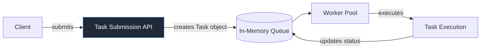
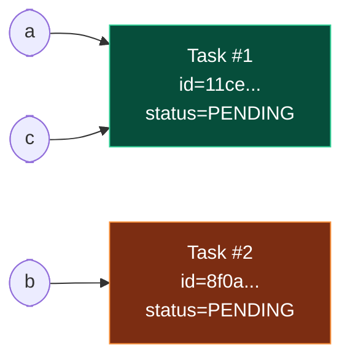
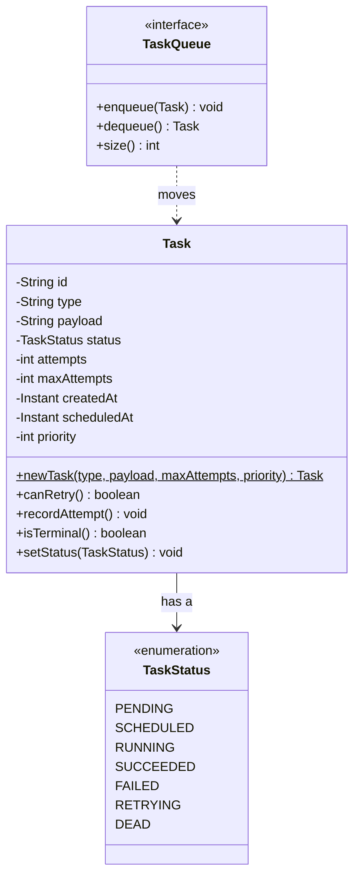

# Classes and Objects

> The first stone of our platform. Before we have a queue, workers, or a single line of concurrency, we need a way to *represent a unit of work in memory*. In Java, that representation is an **object**, and the blueprint that produces it is a **class**. This chapter models the very first `Task` and `TaskStatus` — the atoms that every other chapter in this repository builds on.

---

## 1. Where This Fits In The Project

Our entire platform is a **Distributed Task Queue and Event Processing Platform**. Strip away the queues, the workers, the Postgres, the Kafka — and at the very bottom there is one thing flowing through the whole system: a **task**. A client submits a task, it sits in a queue, a worker pulls it, runs it, and records whether it succeeded or failed.

So the *first* engineering decision is: **how do we represent a task in memory?** Everything downstream (serialization, persistence, retries, scheduling) depends on getting this object model right. This chapter builds the minimal `Task` and the `TaskStatus` enum and uses them to teach the Java object model: classes vs objects, fields, methods, constructors, the `new` keyword, object identity, and a first look at `toString` and `equals`.

We deliberately build the *bad* version first, because you learn the rules by hitting the walls they exist to prevent.



> We are at the very left of this diagram. The "creates Task object" step is the subject of this chapter.

---

## 2. Why This Exists — The Real Problem

You have solved 1000+ DSA problems. You are completely comfortable with `int[]`, `HashMap`, recursion, and graph traversal. So why do we need *classes* at all? Couldn't a task just be a tuple `(id, type, payload, status)`?

You *can* model it as loose data — and people do, in scripting languages, with dictionaries and tuples. But a backend system that lives for years has a different problem than a LeetCode solution that lives for 50 milliseconds:

- **Data and behavior drift apart.** If a task is a `Map<String, Object>`, the logic that says "a task with `attempts >= maxAttempts` is dead" lives *somewhere else*, in some function, far from the data. Six months later nobody knows all the places that decide a task is dead.
- **No invariants.** A raw map lets you put a `String` where a status enum should be, or a negative `attempts`. Nothing stops it. The compiler shrugs.
- **No identity contract.** Are two tasks "the same"? With raw maps you have no agreed answer.

A **class** solves this by bundling **state** (fields) and **behavior** (methods) into one named type, with a **constructor** that enforces how valid instances come into being. This is the core idea of object orientation, and Java is built around it.

### A tiny bit of history

The class-as-blueprint idea goes back to **Simula 67** (1967), the language that introduced classes and objects to model real-world simulations — literally ships, queues, and customers. **Smalltalk** (1970s) radicalized it: *everything* is an object. **C++** brought classes to the C world; **Java** (1995) made "everything lives in a class" the default and removed manual memory management with garbage collection. The reason this model won for backends is exactly our problem above: large systems need state and the rules that govern that state to live *together*, with enforced construction.

### How this differs from what you already know

| You came from | Their "task" | Java's version | Key difference |
|---|---|---|---|
| C | `struct Task { ... }` + free functions | `class Task { ... }` with methods | Java glues behavior to the data; structs do not |
| Go | `struct` + methods on it, no constructors | `class` + constructors | Java enforces construction via constructors; Go uses bare literals |
| Python | `dict` or `@dataclass` | `class` / `record` | Java is statically typed and compiler-checked; dict typos are runtime errors |
| Rust | `struct` + `impl` | `class` (mutable) or `record` (immutable-ish) | Java objects are heap references with garbage collection, not move semantics |
| JS/TS | object literal `{}` / `class` | `class` | Java has no untyped bag-of-properties; every field is declared and typed |

> If you internalize one sentence: **a Java class is a struct that carries its own methods and is constructed through a controlled gate (the constructor).** Objects are the instances that come out of that gate.

---

## 3. The Naive Version — A First-Cut `Task`

Here is the kind of `Task` a newcomer writes on day one. It compiles. It "works." It is also a small disaster, and we will name every flaw.

```java
// File: Task.java  (NAIVE — do not ship this)
public class Task {
    public String id;
    public String type;
    public String payload;
    public String status;   // "PENDING", "RUNNING", ... as raw strings
    public int attempts;
    public int maxAttempts;
}
```

Using it:

```java
public class Demo {
    public static void main(String[] args) {
        Task t = new Task();          // the 'new' keyword allocates an object
        t.id = "abc";                 // hope nobody passes a non-UUID
        t.type = "send-email";
        t.status = "PENidng";         // typo — compiles fine, silently wrong
        t.maxAttempts = -3;           // nonsense, allowed
        System.out.println(t);        // prints Task@1b6d3586  — useless
    }
}
```

What is wrong here, ranked by how much it will hurt you in production:

1. **`status` is a `String`.** `"PENidng"` compiles and runs. Now your worker's `switch (status)` silently never matches and the task is stuck forever. The compiler should have caught this. (Fix: an **enum**.)
2. **Public mutable fields.** Anyone, anywhere, can set `t.status = "garbage"` or `t.attempts = -100`. There is *no* moment where the object validates itself. (Fix: a constructor + encapsulation — next chapter.)
3. **No constructor with rules.** `new Task()` gives you a half-built object: `id` is `null`, `status` is `null`. A task with a `null` id is not a task. (Fix: a real constructor.)
4. **`toString` prints garbage.** `Task@1b6d3586` is the class name plus a hex hashcode. In a log line during a 3 a.m. incident, that tells you nothing. (Fix: override `toString`.)
5. **No identity contract.** `t1.equals(t2)` will be `false` even if both describe the same logical task, because the default `equals` compares memory addresses. (Fix: override `equals`/`hashCode` — previewed here, deepened in [chapter-02-encapsulation.md](./chapter-02-encapsulation.md).)

This naive class is a *struct in disguise*. We are paying for Java (verbosity, ceremony) and getting none of its benefits (safety, invariants).

---

## 4. Improved Version — A Real Class With Construction And Behavior

Let's promote `status` to an enum, add a constructor that refuses to build nonsense, and add a method so behavior lives with the data.

First, the enum. An **enum** is a class whose instances are a fixed, named set. This is the single biggest upgrade.

```java
// File: TaskStatus.java
public enum TaskStatus {
    PENDING,
    SCHEDULED,
    RUNNING,
    SUCCEEDED,
    FAILED,
    RETRYING,
    DEAD
}
```

> These seven values are the **canonical** statuses for the whole repository. Every later chapter — workers, retries, dead-letter queues — refers to exactly these. We will not invent ad-hoc strings ever again.

Now the improved `Task`:

```java
// File: Task.java  (IMPROVED)
import java.time.Instant;
import java.util.UUID;

public class Task {
    private final String id;          // assigned once, never reassigned
    private final String type;
    private final String payload;     // JSON string; opaque to the Task itself
    private TaskStatus status;        // mutable: it moves through a lifecycle
    private int attempts;
    private final int maxAttempts;
    private final Instant createdAt;

    // Constructor: the single controlled gate for building a Task.
    public Task(String type, String payload, int maxAttempts) {
        if (type == null || type.isBlank()) {
            throw new IllegalArgumentException("type must not be blank");
        }
        if (maxAttempts < 1) {
            throw new IllegalArgumentException("maxAttempts must be >= 1");
        }
        this.id = UUID.randomUUID().toString();   // we MINT the id; callers cannot forge it
        this.type = type;
        this.payload = payload == null ? "{}" : payload;
        this.status = TaskStatus.PENDING;          // every task starts PENDING
        this.attempts = 0;
        this.maxAttempts = maxAttempts;
        this.createdAt = Instant.now();
    }

    // Behavior lives WITH the data now.
    public boolean canRetry() {
        return attempts < maxAttempts;
    }

    public void recordAttempt() {
        this.attempts++;
    }

    // Read-only access (more on this in the encapsulation chapter).
    public String getId()        { return id; }
    public String getType()      { return type; }
    public TaskStatus getStatus(){ return status; }
    public int getAttempts()     { return attempts; }
    public int getMaxAttempts()  { return maxAttempts; }
    public Instant getCreatedAt(){ return createdAt; }

    public void setStatus(TaskStatus status) {
        this.status = status;   // still loose; we tighten this in chapter 2
    }
}
```

What improved, concretely:

- `new Task("bad", "{}", -1)` now **throws** instead of silently producing junk. The object cannot exist in an invalid initial state.
- `id` is **minted internally** as a UUID. A `final` field can be assigned exactly once, so the id is fixed for the object's whole life — exactly the contract a task id needs.
- `canRetry()` is a **method**: the "can this task be retried?" rule now lives *with* the task, not scattered across the codebase. When the retry logic changes, there is one place to change it.
- `status` is type-safe. `t.setStatus("RUNNNG")` will not compile; only the seven `TaskStatus` values are accepted.

This is already shippable for Phase 1. But a staff engineer would push two more steps.

---

## 5. Production-Quality Version — Identity, Diagnostics, And Honest Mutability

Two things are still missing for production: a **`toString` you can read in a log**, and a defined **identity contract** (`equals`/`hashCode`) so tasks behave correctly inside `HashSet`, `HashMap`, and de-duplication logic. We also want construction that supports the richer canonical model (`priority`, `scheduledAt`).

```java
// File: Task.java  (PRODUCTION)
import java.time.Instant;
import java.util.Objects;
import java.util.UUID;

public final class Task {              // 'final': no subclassing; identity stays simple
    private final String id;
    private final String type;
    private final String payload;
    private TaskStatus status;
    private int attempts;
    private final int maxAttempts;
    private final Instant createdAt;
    private final Instant scheduledAt; // when it becomes eligible to run
    private final int priority;        // higher runs first (used later by PriorityQueue)

    // Primary constructor — the full canonical Task.
    public Task(String id,
                String type,
                String payload,
                TaskStatus status,
                int attempts,
                int maxAttempts,
                Instant createdAt,
                Instant scheduledAt,
                int priority) {
        this.id          = Objects.requireNonNull(id, "id");
        this.type        = requireText(type, "type");
        this.payload     = payload == null ? "{}" : payload;
        this.status      = Objects.requireNonNull(status, "status");
        this.attempts    = requireNonNegative(attempts, "attempts");
        this.maxAttempts = requirePositive(maxAttempts, "maxAttempts");
        this.createdAt   = Objects.requireNonNull(createdAt, "createdAt");
        this.scheduledAt = scheduledAt == null ? createdAt : scheduledAt;
        this.priority    = priority;
    }

    // Convenience factory: the common "submit a brand-new task right now" path.
    public static Task newTask(String type, String payload, int maxAttempts, int priority) {
        Instant now = Instant.now();
        return new Task(
            UUID.randomUUID().toString(),
            type, payload, TaskStatus.PENDING,
            0, maxAttempts, now, now, priority
        );
    }

    // --- behavior ---
    public boolean canRetry()      { return attempts < maxAttempts; }
    public void recordAttempt()    { this.attempts++; }
    public boolean isTerminal()    { return status == TaskStatus.SUCCEEDED || status == TaskStatus.DEAD; }

    // --- accessors ---
    public String getId()          { return id; }
    public String getType()        { return type; }
    public String getPayload()     { return payload; }
    public TaskStatus getStatus()  { return status; }
    public int getAttempts()       { return attempts; }
    public int getMaxAttempts()    { return maxAttempts; }
    public Instant getCreatedAt()  { return createdAt; }
    public Instant getScheduledAt(){ return scheduledAt; }
    public int getPriority()       { return priority; }
    public void setStatus(TaskStatus status) { this.status = Objects.requireNonNull(status); }

    // --- identity: two Tasks are the SAME iff they share an id ---
    @Override
    public boolean equals(Object o) {
        if (this == o) return true;
        if (!(o instanceof Task other)) return false;   // Java 21 pattern matching
        return id.equals(other.id);
    }

    @Override
    public int hashCode() {
        return id.hashCode();   // MUST be consistent with equals
    }

    // --- diagnostics: readable in a log line ---
    @Override
    public String toString() {
        return "Task[id=%s, type=%s, status=%s, attempts=%d/%d, priority=%d]"
            .formatted(id, type, status, attempts, maxAttempts, priority);
    }

    // --- small private validators keep the constructor clean ---
    private static String requireText(String v, String name) {
        if (v == null || v.isBlank()) throw new IllegalArgumentException(name + " must not be blank");
        return v;
    }
    private static int requireNonNegative(int v, String name) {
        if (v < 0) throw new IllegalArgumentException(name + " must be >= 0");
        return v;
    }
    private static int requirePositive(int v, String name) {
        if (v < 1) throw new IllegalArgumentException(name + " must be >= 1");
        return v;
    }
}
```

Why a staff engineer makes these exact choices:

- **Identity by `id`, not by all fields.** A task's `status` and `attempts` *change over its life*. If `equals` compared every field, "the same task" before and after a retry would be considered *different* objects — and it would vanish from any `HashMap` keyed on it. Comparing only the immutable `id` is the correct domain rule: a task is the same task no matter how its status mutates. (`record`s, by contrast, compare *all* fields — which is exactly why a mutable `Task` should be a `class`, not a `record`. More in [../03-java-memory-model/immutable-objects.md](../03-java-memory-model/immutable-objects.md).)
- **`hashCode` consistent with `equals`.** The contract is ironclad: if `a.equals(b)` then `a.hashCode() == b.hashCode()`. Break it and `HashMap` will lose your tasks. We derive both from `id` only, so they cannot drift.
- **`final class`.** Nobody subclasses `Task` and breaks the identity contract by adding fields to `equals`. Behavior we need later (different task *kinds*) belongs in `TaskHandler`, not in `Task` subclasses.
- **A factory method `newTask(...)`.** The nine-argument constructor is honest but noisy at call sites. The static factory names the common intent ("a fresh task, now, pending") and hides the boilerplate. Constructors and factories get a full chapter in [../02-core-oop/chapter-03-constructors.md](../02-core-oop/chapter-03-constructors.md).

> **When would this become a `record`?** When `Task` is fully immutable — no `setStatus`. In Phase 2 we persist tasks to Postgres and treat state transitions as *new rows* / new objects, at which point an immutable `record Task(...)` (exactly the canonical record shape) becomes attractive. For Phase 1's in-memory mutation, a `class` is the right call. We will make that migration explicitly later.

---

## 6. Code Walkthrough — Beginner, Intermediate, Production

### 6a. Beginner: create objects and watch identity

```java
public class IdentityDemo {
    public static void main(String[] args) {
        Task a = Task.newTask("send-email", "{\"to\":\"x@y.com\"}", 3, 5);
        Task b = Task.newTask("send-email", "{\"to\":\"x@y.com\"}", 3, 5);
        Task c = a;   // not a new object — another reference to the SAME object

        System.out.println(a);                 // Task[id=..., type=send-email, status=PENDING, attempts=0/3, priority=5]
        System.out.println(a == b);            // false: two distinct objects on the heap
        System.out.println(a == c);            // true : same object, two names
        System.out.println(a.equals(b));       // false: different ids (we minted two UUIDs)
        System.out.println(a.equals(c));       // true : same id (same object)
        System.out.println(a.getId().equals(c.getId())); // true
    }
}
```

The mental model: `new` (inside `newTask`) carves out a fresh object on the **heap** and hands back a **reference** (an arrow). `a` and `c` are two arrows to one object; `a` and `b` are arrows to two different objects that merely *look* alike. `==` compares the arrows (identity); `equals` compares by our domain rule (the id). Memory and references get a dedicated treatment in [../03-java-memory-model/object-references.md](../03-java-memory-model/object-references.md).



### 6b. Intermediate: behavior lives on the object, and identity powers de-duplication

```java
import java.util.HashSet;
import java.util.Set;

public class BehaviorDemo {
    public static void main(String[] args) {
        Task t = Task.newTask("resize-image", "{\"id\":42}", 3, 0);

        // Simulate a worker attempting the task and failing twice, then giving up.
        while (t.canRetry()) {
            t.recordAttempt();
            t.setStatus(TaskStatus.RETRYING);
            System.out.println("attempt " + t.getAttempts() + " -> " + t.getStatus());
        }
        t.setStatus(TaskStatus.DEAD);
        System.out.println("final: " + t + ", terminal=" + t.isTerminal());

        // Identity makes a Set de-duplicate by task id, even as status mutates.
        Set<Task> seen = new HashSet<>();
        seen.add(t);
        t.setStatus(TaskStatus.SUCCEEDED);  // mutate AFTER inserting
        System.out.println("still found after mutation: " + seen.contains(t)); // true
    }
}
```

The last two lines are the payoff of "identity by `id`." We inserted `t` into a `HashSet`, then mutated its status. Because `hashCode`/`equals` depend only on the immutable `id`, the set still finds it. Had we (wrongly) hashed on `status`, the object would have been *lost* in its own set — one of the nastiest bugs in Java. This is precisely why `equals`/`hashCode` must rest on immutable fields.

### 6c. Production-inspired: a queue stub built on the canonical model

This previews how `Task` plugs into the `TaskQueue` interface (full treatment in [../06-concurrency/blocking-queue.md](../06-concurrency/blocking-queue.md) and [../07-queues-and-messaging/task-queues.md](../07-queues-and-messaging/task-queues.md)). Notice that the queue knows *nothing* about how a task runs — it only moves `Task` objects.

```java
import java.util.concurrent.BlockingQueue;
import java.util.concurrent.LinkedBlockingQueue;

// Canonical interface from the spec.
interface TaskQueue {
    void enqueue(Task t);
    Task dequeue() throws InterruptedException;
    int size();
}

final class InMemoryTaskQueue implements TaskQueue {
    private final BlockingQueue<Task> queue = new LinkedBlockingQueue<>();

    @Override public void enqueue(Task t) {
        if (t.isTerminal()) {
            throw new IllegalStateException("won't enqueue a terminal task: " + t);
        }
        queue.add(t);
    }
    @Override public Task dequeue() throws InterruptedException { return queue.take(); }
    @Override public int size() { return queue.size(); }
}

public class QueueDemo {
    public static void main(String[] args) throws InterruptedException {
        TaskQueue q = new InMemoryTaskQueue();
        q.enqueue(Task.newTask("send-email",   "{}", 3, 0));
        q.enqueue(Task.newTask("resize-image", "{}", 5, 9));
        System.out.println("queued: " + q.size());     // queued: 2

        Task next = q.dequeue();
        next.setStatus(TaskStatus.RUNNING);
        System.out.println("running: " + next);          // readable toString in the log
    }
}
```

Three object-modeling lessons hide in this snippet: the queue depends on the **type** `Task`, not on its internals; `enqueue` uses the **behavior method** `isTerminal()` rather than re-deriving the rule; and the readable `toString()` makes the running log line genuinely useful.

---

## 7. How This Applies To Our Task Queue Project

Every later chapter leans on the objects defined here:

- `Worker` (a `Runnable`) calls `queue.dequeue()` to get a **`Task` object**, looks up a `TaskHandler` by `task.getType()`, and on failure calls `task.recordAttempt()` and consults `task.canRetry()` — all methods defined in this chapter.
- `RetryPolicy.nextDelay(int attempt)` is fed `task.getAttempts()`.
- `DeadLetterQueue.send(Task t, String reason)` receives a `Task` whose `status` we set to `DEAD`.
- `TaskRepository.save(Task t)` (Phase 2) serializes exactly these fields into Postgres columns; a clean field list now means a clean schema later.
- A `HashMap<String, Task>` keyed by id, and any de-duplication of tasks, rely on the `equals`/`hashCode` we defined.

In other words, this `Task` is the contract the rest of the system programs against. Get the object model right and the queue, workers, retries, and persistence fall into place. Get it wrong (public mutable strings) and every downstream layer inherits the mess.



---

## 8. Tradeoffs

| Decision | Option A | Option B | What we chose & why |
|---|---|---|---|
| Status representation | raw `String` | `enum TaskStatus` | **enum** — compile-time safety, exhaustive `switch` later, zero typos |
| `Task` shape | mutable `class` | immutable `record` | **class** in Phase 1 (in-place status mutation); record later when persisted |
| Identity | all fields (`record`-style) | id only | **id only** — status mutates; same task must stay equal across its lifecycle |
| Construction | public no-arg + setters | validating constructor + factory | **constructor + factory** — no half-built objects ever exist |
| `id` source | caller passes it | object mints a UUID | **mint internally** — callers can't forge/collide ids; ids are guaranteed |
| Subclassing | open class | `final class` | **final** — protects the identity contract; variety goes in `TaskHandler` |
| `payload` type | parsed object | opaque `String` (JSON) | **String** — `Task` stays decoupled from any JSON library; flexible payloads |

The honest cost of our choices: a validating constructor and overridden `equals`/`hashCode`/`toString` are *more code* than a bag of public fields. That verbosity is the price Java charges for compiler-enforced safety. In Phase 2 a `record` will reclaim most of that boilerplate for the immutable case — a tradeoff we make consciously, not by default.

---

## 9. Common Mistakes And Pitfalls

- **Comparing objects with `==`.** `taskA == taskB` compares references, not contents. For "same task," use `equals`. Fix: override `equals` and call it. (For strings too — `==` on strings is a classic trap; see [../03-java-memory-model/string-pool.md](../03-java-memory-model/string-pool.md).)
- **Overriding `equals` but not `hashCode` (or vice versa).** Break the contract and `HashMap`/`HashSet` silently misbehave. Fix: always override both, derived from the same fields.
- **Hashing on mutable fields.** If `hashCode` depends on `status`, mutating an in-set object makes it unfindable. Fix: hash only on immutable fields (here, `id`).
- **Public mutable fields.** Anyone can corrupt the object. Fix: `private` fields + a validating constructor (next chapter).
- **No-arg constructor that leaves `null`/garbage state.** A `Task` with a `null` id is not a task. Fix: require everything the object needs in the constructor.
- **Forgetting `@Override`.** Misspell `toString` as `tostring` and you've added a useless method instead of overriding the real one. Fix: annotate; the compiler then catches the typo.
- **Putting business rules outside the object.** `if (t.getAttempts() < t.getMaxAttempts())` scattered everywhere. Fix: `t.canRetry()` — one method, one source of truth.

---

## 10. Refactoring Exercise — Bad → Improved → Production

**Bad.** A "task" as a public-field struct with stringly-typed status:

```java
public class Task {
    public String id;
    public String type;
    public String status;   // "PENDING" etc.
    public int attempts;
    public int maxAttempts;
}
```

**Improved.** Enum status, validating constructor, behavior on the object:

```java
import java.util.UUID;

public class Task {
    private final String id;
    private final String type;
    private TaskStatus status;
    private int attempts;
    private final int maxAttempts;

    public Task(String type, int maxAttempts) {
        if (type == null || type.isBlank()) throw new IllegalArgumentException("type");
        if (maxAttempts < 1) throw new IllegalArgumentException("maxAttempts");
        this.id = UUID.randomUUID().toString();
        this.type = type;
        this.status = TaskStatus.PENDING;
        this.maxAttempts = maxAttempts;
    }
    public boolean canRetry() { return attempts < maxAttempts; }
    public void recordAttempt() { attempts++; }
    public TaskStatus getStatus() { return status; }
    public void setStatus(TaskStatus s) { this.status = s; }
    public String getId() { return id; }
}
```

**Production.** Add the identity contract and diagnostics (the gap most people forget):

```java
import java.util.Objects;
import java.util.UUID;

public final class Task {
    private final String id;
    private final String type;
    private TaskStatus status;
    private int attempts;
    private final int maxAttempts;

    public Task(String type, int maxAttempts) {
        if (type == null || type.isBlank()) throw new IllegalArgumentException("type");
        if (maxAttempts < 1) throw new IllegalArgumentException("maxAttempts");
        this.id = UUID.randomUUID().toString();
        this.type = type;
        this.status = TaskStatus.PENDING;
        this.maxAttempts = maxAttempts;
    }
    public boolean canRetry() { return attempts < maxAttempts; }
    public void recordAttempt() { attempts++; }
    public TaskStatus getStatus() { return status; }
    public void setStatus(TaskStatus s) { this.status = Objects.requireNonNull(s); }
    public String getId() { return id; }

    @Override public boolean equals(Object o) {
        return o instanceof Task t && id.equals(t.id);
    }
    @Override public int hashCode() { return id.hashCode(); }
    @Override public String toString() {
        return "Task[id=%s, type=%s, status=%s, %d/%d]"
            .formatted(id, type, status, attempts, maxAttempts);
    }
}
```

The move from Improved to Production is small in lines but large in correctness: without `equals`/`hashCode`, `Task` cannot live safely in any hash-based collection, and without `toString` it cannot be debugged.

---

## 11. Exercises

> Solutions are in section 12. Try each before peeking.

### Easy

- **E1 (knowledge check).** Explain the difference between a *class* and an *object*. What does `new` do, and where does the resulting object live?
- **E2 (knowledge check).** Why is `==` the wrong tool for "are these two tasks the same task"? What is the right tool, and what must you override to make it correct?
- **E3 (coding).** Add a method `description()` to `Task` that returns a single human-readable line like `"send-email (PENDING, attempt 0 of 3)"`.

### Medium

- **M1 (coding).** Add a `priority` field (int) and a static factory `Task.highPriority(String type, int maxAttempts)` that creates a `PENDING` task with `priority = 10`. Validate that `priority` is between 0 and 10.
- **M2 (refactoring).** You are handed a `Map<String,Object> task` floating through a codebase. Refactor a function `boolean isDead(Map<String,Object> task)` into a clean `Task` class with an `isDead()` method.
- **M3 (design).** Should `Task` be a mutable `class` or an immutable `record` in Phase 1 vs Phase 2? Justify with the identity and persistence reasons from this chapter.

### Hard

- **H1 (coding).** Implement `equals`/`hashCode` correctly, then write a small program proving that mutating a `Task`'s status *after* inserting it into a `HashSet` does **not** lose it — and a second program showing how hashing on `status` *would* lose it.
- **H2 (interview-style).** A teammate writes `class Task` overriding `equals` to compare *all* fields (id, type, status, attempts). Explain, with a concrete scenario from our queue, why this breaks retries, and what the fix is.
- **H3 (stretch).** Convert the production `Task` into an immutable `record Task(...)` matching the canonical shape, and add a `withStatus(TaskStatus s)` method that returns a *new* `Task` with the changed status (a "copy-on-write" transition). Discuss the GC tradeoff.

---

## 12. Solutions

### E1

A **class** is a blueprint/type — a compile-time description of state (fields) and behavior (methods). An **object** is a concrete instance of that class, created at runtime. `new Task(...)` allocates a fresh object on the **heap**, runs the constructor to initialize it, and returns a **reference** (a pointer) to it that you store in a variable. The class exists once; you can create unlimited objects from it.

### E2

`==` compares **references** — whether two variables point to the *same* object in memory. Two separately created tasks describing the same work are different objects, so `==` is `false` even though they are "the same task" logically. The right tool is `equals`, which you **override** to compare by domain identity (here, the `id`). You must *also* override `hashCode` consistently, or hash-based collections break.

### E3

```java
public String description() {
    return "%s (%s, attempt %d of %d)".formatted(type, status, attempts, maxAttempts);
}
// usage: Task.newTask("send-email","{}",3,0).description()
//   -> "send-email (PENDING, attempt 0 of 3)"
```

### M1

```java
public final class Task {
    private final String id;
    private final String type;
    private TaskStatus status;
    private int attempts;
    private final int maxAttempts;
    private final int priority;

    public Task(String type, int maxAttempts, int priority) {
        if (type == null || type.isBlank()) throw new IllegalArgumentException("type");
        if (maxAttempts < 1) throw new IllegalArgumentException("maxAttempts");
        if (priority < 0 || priority > 10) throw new IllegalArgumentException("priority 0..10");
        this.id = java.util.UUID.randomUUID().toString();
        this.type = type;
        this.status = TaskStatus.PENDING;
        this.maxAttempts = maxAttempts;
        this.priority = priority;
    }

    public static Task highPriority(String type, int maxAttempts) {
        return new Task(type, maxAttempts, 10);
    }
    public int getPriority() { return priority; }
    // ... other accessors as before
}
```

`highPriority` is a static **factory method**: it names a common construction intent and reuses the validating constructor, so the priority rule is enforced in exactly one place.

### M2

```java
// Before: stringly-typed, rule lives in a free function
static boolean isDead(java.util.Map<String,Object> task) {
    int attempts = (int) task.get("attempts");
    int max      = (int) task.get("maxAttempts");
    String status= (String) task.get("status");
    return attempts >= max && "FAILED".equals(status);
}

// After: a real class; the rule is a method, the data is typed
public final class Task {
    private TaskStatus status;
    private int attempts;
    private final int maxAttempts;
    // ... constructor + accessors ...
    public boolean isDead() {
        return status == TaskStatus.DEAD
            || (attempts >= maxAttempts && status == TaskStatus.FAILED);
    }
}
```

The refactor moves the rule *onto* the data, removes unchecked casts, and makes the status type-safe. Callers go from `isDead(map)` to `task.isDead()`.

### M3

In **Phase 1**, a `Task` flows through an in-memory queue and a worker mutates its `status` in place (`PENDING → RUNNING → SUCCEEDED`). A mutable **class** with `equals`/`hashCode` keyed on the immutable `id` models this directly: the *same* object changes state while staying "the same task." In **Phase 2**, tasks are persisted in Postgres, and a state transition is naturally an `UPDATE` (or a new row in an event-sourced design). There, an immutable **record** — the canonical `record Task(...)` — is cleaner: each load produces a fresh value object, no shared mutable state across threads, and value-based `equals` is acceptable because the loaded snapshot is read-mostly. The dividing line is *ownership of mutation*: in-memory we mutate (class); in the database the DB owns state and we map immutable snapshots (record).

### H1

```java
import java.util.HashSet;
import java.util.Set;

public class HashContractDemo {
    public static void main(String[] args) {
        // Correct: hashing on immutable id.
        Task t = Task.newTask("resize-image", "{}", 3, 0);
        Set<Task> good = new HashSet<>();
        good.add(t);
        t.setStatus(TaskStatus.RUNNING);          // mutate AFTER insert
        System.out.println("found after mutate: " + good.contains(t)); // true

        // Pathological: a wrapper that (wrongly) hashes on status.
        record BadKey(Task task) {
            @Override public int hashCode() { return task.getStatus().hashCode(); }
            @Override public boolean equals(Object o) {
                return o instanceof BadKey b && b.task.getStatus() == task.getStatus();
            }
        }
        Set<BadKey> bad = new HashSet<>();
        Task u = Task.newTask("send-email", "{}", 3, 0);
        BadKey key = new BadKey(u);
        bad.add(key);
        u.setStatus(TaskStatus.RUNNING);          // bucket changes out from under the set
        System.out.println("found after mutate: " + bad.contains(key)); // false — LOST
    }
}
```

The first set keeps finding the task because `hashCode` rests on the unchanging `id`. The `BadKey` set loses the entry: mutating `status` moves the element to a different hash bucket than the one it was stored in, so `contains` looks in the wrong place. This is the canonical "hash on mutable field" bug.

### H2

Comparing **all** fields means `equals` returns `false` the moment any field changes. In our queue, a worker mutates the same `Task` object: `attempts` goes 0 → 1, `status` goes `RUNNING` → `RETRYING`. If that task was placed into a `Map<Task, Something>` or a de-dup `Set<Task>`, the post-mutation object no longer `equals` (and no longer hashes to) its pre-mutation self, so lookups, removals, and de-duplication all silently fail — the retry machinery loses track of the task, and it may be re-enqueued forever or dropped. The fix is to define identity by the **immutable** `id` only: a task is the same task throughout its lifecycle regardless of how its mutable fields evolve.

### H3

```java
import java.time.Instant;
import java.util.UUID;

public record Task(
        String id, String type, String payload, TaskStatus status,
        int attempts, int maxAttempts, Instant createdAt, Instant scheduledAt, int priority) {

    public Task {                                  // compact canonical constructor: validate
        if (type == null || type.isBlank()) throw new IllegalArgumentException("type");
        if (maxAttempts < 1) throw new IllegalArgumentException("maxAttempts");
        if (attempts < 0) throw new IllegalArgumentException("attempts");
    }

    public static Task newTask(String type, String payload, int maxAttempts, int priority) {
        Instant now = Instant.now();
        return new Task(UUID.randomUUID().toString(), type, payload,
                        TaskStatus.PENDING, 0, maxAttempts, now, now, priority);
    }

    // Copy-on-write transition: returns a NEW Task, leaves this one untouched.
    public Task withStatus(TaskStatus newStatus) {
        return new Task(id, type, payload, newStatus,
                        attempts, maxAttempts, createdAt, scheduledAt, priority);
    }
}
```

**Tradeoff.** The record gives free, correct value-based `equals`/`hashCode`/`toString` and thread-safe immutability — excellent for a persisted, concurrent system. The cost is **allocation churn**: every status change (`PENDING → RUNNING → SUCCEEDED`) allocates a brand-new object, so a hot path produces more short-lived garbage for the GC to sweep. For Java's generational GC this is usually cheap (young-gen collection is fast), but on a very hot loop it is real pressure — which is exactly why Phase 1's in-place mutable class is reasonable, and why we switch to immutability when persistence and concurrency make correctness matter more than a few extra allocations. Note also: a record's `equals` compares *all* components, so two snapshots of the same task with different statuses are *not* equal — fine for value snapshots, wrong for "same logical task" tracking, which is why a keyed `Map<String,Task>` (by id) is the pattern in Phase 2.

---

## 13. Interview Questions And Takeaways

1. **Q: What is the difference between a class and an object?**
   A: A class is a compile-time blueprint defining fields and methods; an object is a runtime instance allocated on the heap. One class, many objects.

2. **Q: What does the `new` keyword do?**
   A: Allocates memory for a new object on the heap, runs the constructor to initialize its fields, and returns a reference to it.

3. **Q: Difference between `==` and `equals()`?**
   A: `==` compares references (same object in memory) for objects, or raw values for primitives. `equals()` compares by logical equality as defined by the class; you override it to mean what "equal" should mean for your domain.

4. **Q: Why must `hashCode` be overridden whenever `equals` is?**
   A: The contract requires equal objects to have equal hash codes. Hash-based collections (`HashMap`, `HashSet`) locate elements by `hashCode` first, then confirm with `equals`. Inconsistency makes elements unfindable.

5. **Q: Should `equals`/`hashCode` use mutable fields?**
   A: No. If a field used in hashing changes while the object is in a hash collection, the object moves to a different conceptual bucket and is effectively lost. Base identity on immutable fields (like an id).

6. **Q: When would you use a `record` instead of a `class`?**
   A: For immutable, value-semantic data carriers (DTOs, snapshots, keys). Records auto-generate `equals`/`hashCode`/`toString`/accessors from their components. Avoid them when you need in-place mutation or identity that differs from full-field equality.

7. **Q: Why prefer an enum over a `String` for status?**
   A: Type safety (no typos compile), a closed set of values, exhaustive `switch` support, and self-documenting code. Strings invite invalid states and silent bugs.

8. **Q: Why mint the `id` inside the constructor instead of accepting it from the caller?**
   A: It guarantees every task has a unique, well-formed id and removes the chance of callers forging or colliding ids. (In distributed Phase 4 you might accept a client-supplied idempotency key separately — different concern.)

> **Takeaways:** Bundle state with the rules that govern it. Construct objects through a validating gate so invalid states are unrepresentable. Define identity deliberately and base it on immutable fields. Make `toString` useful for the 3 a.m. you. These four habits separate a Java *class* from a struct-with-extra-steps.

---

## 14. Production Considerations

- **Logging & diagnostics.** A good `toString()` is not cosmetic — it is your incident-response surface. But never dump `payload` blindly into logs; it may contain PII or secrets. In production, log `id`, `type`, `status`, and `attempts`, and treat `payload` as sensitive. (Observability is covered in [../10-system-design/observability-and-ops.md](../10-system-design/observability-and-ops.md).)
- **Serialization boundary.** These fields become a Postgres schema (Phase 2) and a wire format (Phase 4, JSON/Avro). Keeping `payload` an opaque `String` decouples the `Task` type from any JSON library and keeps the schema stable. Renaming a field later is a *migration*, not a refactor — design the field set carefully now.
- **Identity at scale.** `id` is a UUID v4 (random). That is collision-safe but not sortable; if you later need time-ordered ids for index locality in Postgres, consider UUID v7 or a ULID. Decide before millions of rows exist.
- **Memory & allocation.** Each `Task` is a heap object with a header plus its fields — on the order of tens of bytes. At very high throughput, immutable copy-on-write transitions multiply allocations; profile before assuming it matters, and lean on the JVM's fast young-gen GC. See [../03-java-memory-model/garbage-collection.md](../03-java-memory-model/garbage-collection.md).
- **Thread safety.** The mutable Phase 1 `Task` is *not* thread-safe: two threads mutating `status`/`attempts` race. In Phase 1 we keep a task confined to one worker at a time; concurrency safety is handled by the *queue*, not the task. When that assumption breaks, immutability (records) or explicit synchronization becomes necessary — see [../06-concurrency/atomics-and-thread-safety.md](../06-concurrency/atomics-and-thread-safety.md).

---

## What We Can Improve In Our Project Using This Concept

Right now we have only a sketch. With a properly modeled `Task` and `TaskStatus`, we can immediately:

- Replace any stringly-typed status with the type-safe `TaskStatus` enum across the codebase.
- Centralize the "can this be retried?" and "is this terminal?" rules as methods on `Task`, so the upcoming `Worker` and `RetryHandler` share one source of truth.
- Make `Task` safe to drop into `HashSet`/`HashMap` for de-duplication and id-keyed lookups by defining `equals`/`hashCode` on the immutable `id`.
- Give every log line a readable task representation via `toString`, paying off the moment we debug the worker pool.

## Project Refactoring Task

1. Create `TaskStatus.java` with the seven canonical values.
2. Create the production `Task.java` from section 5 (`final class`, validating constructor, static `newTask` factory, behavior methods, `equals`/`hashCode`/`toString`).
3. Add a JUnit 5 + AssertJ test class `TaskTest` asserting: invalid construction throws; `newTask` yields `PENDING` with `attempts == 0`; two `newTask` calls are `!equals`; a `Task` survives mutation inside a `HashSet`.
4. Wire `Task` into a minimal `InMemoryTaskQueue` (section 6c) and a `main` that enqueues two tasks and dequeues one.

```java
// TaskTest.java (JUnit 5 + AssertJ)
import org.junit.jupiter.api.Test;
import java.util.HashSet;
import java.util.Set;
import static org.assertj.core.api.Assertions.*;

class TaskTest {
    @Test void newTaskStartsPending() {
        Task t = Task.newTask("send-email", "{}", 3, 0);
        assertThat(t.getStatus()).isEqualTo(TaskStatus.PENDING);
        assertThat(t.getAttempts()).isZero();
        assertThat(t.canRetry()).isTrue();
    }
    @Test void invalidConstructionThrows() {
        assertThatThrownBy(() -> Task.newTask("  ", "{}", 3, 0))
            .isInstanceOf(IllegalArgumentException.class);
    }
    @Test void distinctTasksAreNotEqual() {
        assertThat(Task.newTask("x", "{}", 1, 0))
            .isNotEqualTo(Task.newTask("x", "{}", 1, 0));
    }
    @Test void survivesMutationInsideHashSet() {
        Task t = Task.newTask("x", "{}", 1, 0);
        Set<Task> set = new HashSet<>(); set.add(t);
        t.setStatus(TaskStatus.RUNNING);
        assertThat(set).contains(t);
    }
}
```

## Git Commit For This Chapter

```bash
git add src/main/java/com/taskqueue/domain/Task.java \
        src/main/java/com/taskqueue/domain/TaskStatus.java \
        src/main/java/com/taskqueue/queue/TaskQueue.java \
        src/main/java/com/taskqueue/queue/InMemoryTaskQueue.java \
        src/test/java/com/taskqueue/domain/TaskTest.java
git commit -m "feat(domain): model canonical Task and TaskStatus with identity and validation

Introduce the core Task class (validating constructor, newTask factory,
canRetry/recordAttempt/isTerminal behavior, id-based equals/hashCode,
readable toString) and the seven-value TaskStatus enum. Add a minimal
InMemoryTaskQueue and JUnit5/AssertJ tests covering construction,
identity, and hash-set survival under mutation."
```

Files touched: `Task.java`, `TaskStatus.java`, `TaskQueue.java`, `InMemoryTaskQueue.java`, `TaskTest.java`.

## Architecture Impact

This chapter establishes the **domain core** at the center of the architecture. `Task` and `TaskStatus` are pure domain types with zero framework dependencies — no Spring, no JDBC, no JSON library. Everything else (queue, workers, repository, REST layer) depends *inward* on this core, never the reverse. That dependency direction is what makes Phase 2's persistence and Phase 4's distribution swappable without touching the heart of the system, and it is the seed of the layered and hexagonal architectures explored in [../04-oop-and-ood/hexagonal-architecture.md](../04-oop-and-ood/hexagonal-architecture.md).

## Interview Takeaways

- A class bundles state with behavior; an object is a heap instance produced by `new` through a constructor.
- `==` is reference identity; `equals`/`hashCode` are domain identity — override both, consistently, on immutable fields.
- Make invalid states unrepresentable: validate in the constructor; prefer enums over strings.
- Choose `class` vs `record` by who owns mutation (in-memory mutate → class; persisted/value snapshot → record).
- A readable `toString` is a production tool, not decoration — but never log sensitive payloads.

---

> **Next:** [chapter-02-encapsulation.md](./chapter-02-encapsulation.md) tightens the loose `setStatus` into a guarded state transition and makes the fields truly private with intent, turning this object from "safe to build" into "safe to evolve."
