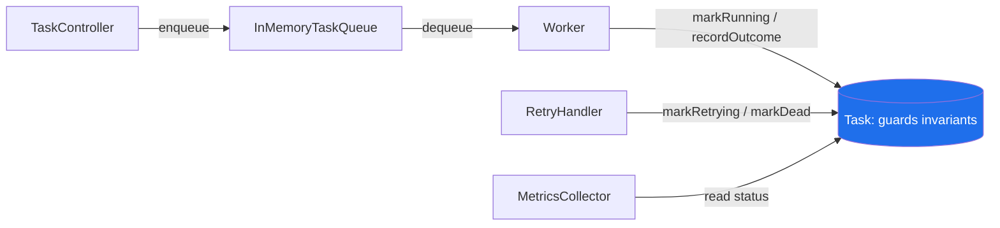
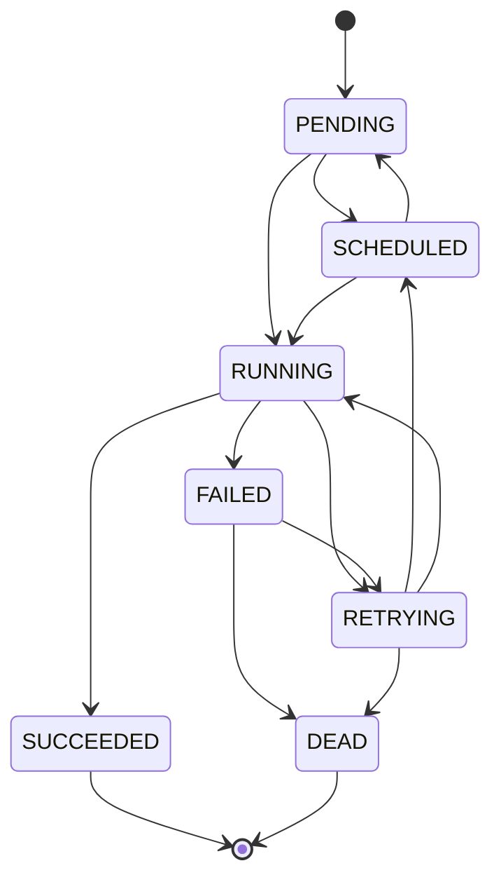

# Encapsulation

> Where this fits in the project: in Phase 1 our `Task` flows from the **Submission API** into an
> **in-memory queue**, gets pulled by a **Worker**, executed, and updated. Many components touch a
> `Task` — but **only `Task` itself is allowed to decide how its `status` and `attempts` change.**
> Encapsulation is what makes that rule enforceable instead of aspirational.

This chapter builds directly on [`chapter-01-classes-and-objects.md`](./chapter-01-classes-and-objects.md),
where we created the `Task` class. There we focused on *what an object is*. Here we focus on
*who is allowed to change it, and how we stop everyone else.*

---

## 1. Why This Exists

You have solved 1000+ DSA problems. In a LeetCode solution, a `struct`/class is usually a dumb bag of
fields — you mutate `node.val` freely because the whole program fits in your head and lives for 50ms.

Backend systems are the opposite. A single `Task` object is touched by:

- the **TaskController** (deserializes JSON, sets initial state),
- the **TaskQueue** (enqueues / dequeues),
- a **Worker** running on one of N threads (executes, increments attempts),
- the **RetryHandler** (decides whether to retry, transition to `RETRYING` or `DEAD`),
- the **TaskRepository** (persists to Postgres in Phase 2),
- and eventually a **MetricsCollector** reading its status.

If every one of those can write `task.attempts = 99` or `task.status = SUCCEEDED` directly, then a
bug anywhere becomes a corruption everywhere. **Encapsulation** is the discipline of hiding internal
state behind a small, validated surface so that **invariants live in exactly one place**.

> **Definition.** Encapsulation = (1) bundling data with the behavior that operates on it, and
> (2) restricting direct access to that data so the object controls its own consistency. In Java the
> mechanism is access modifiers (`private`, package-private, `protected`, `public`) plus methods.

### A tiny bit of history (why it genuinely helps)

Parnas's 1972 paper *"On the Criteria To Be Used in Decomposing Systems into Modules"* argued that
modules should hide *design decisions likely to change* behind a stable interface. The decision
"how does a `Task` transition between states?" is exactly that kind of volatile decision. Today we add
`SCHEDULED`; tomorrow we add rate-limit backoff; in Phase 3 we add dead-lettering. If the transition
rules are scattered across the queue, the worker, and the controller, every change is a multi-file
archaeology dig. Hide them inside `Task` and you change one method.

The invariants we will protect in this chapter:

1. `attempts` starts at 0 and is **monotonically non-decreasing**.
2. `attempts` must **never exceed** `maxAttempts`.
3. Only **legal `TaskStatus` transitions** are allowed (you cannot go from `SUCCEEDED` back to `RUNNING`).
4. `maxAttempts` and `id` are set once and never change.



The blue node is the only place mutation logic lives. Everyone else asks `Task` to change itself.

---

## 2. The Naive Version

Here is the first-cut `Task` most newcomers (and many real codebases) write: public fields, or the
slightly-less-naked "anemic" version with mechanical getters and setters.

```java
// BAD: public mutable fields. Anyone can write anything.
public class Task {
    public String id;
    public String type;
    public String payload;
    public TaskStatus status;
    public int attempts;
    public int maxAttempts;
    public Instant createdAt;
    public Instant scheduledAt;
    public int priority;
}
```

And the queue/worker code that grows around it:

```java
// In the Worker — directly mutating another object's internals.
task.attempts = task.attempts + 1;          // off-by-one bugs live here
task.status = TaskStatus.RUNNING;            // no check that the prior status was legal

// In the RetryHandler — somewhere else entirely.
if (task.attempts > task.maxAttempts) {
    task.status = TaskStatus.DEAD;           // duplicate, drifting logic
}

// In a unit test someone wrote to "force" a state.
task.status = TaskStatus.SUCCEEDED;
task.attempts = -3;                          // nonsense, but the compiler is fine with it
```

### Why this is broken

- **No single source of truth.** The "attempts vs maxAttempts" rule is written in the worker, again
  in the retry handler, and forgotten in the controller. They will drift.
- **Illegal transitions are unpreventable.** Nothing stops `SUCCEEDED -> RUNNING`. A re-delivered
  message could resurrect a finished task.
- **The queue can corrupt task state.** Imagine `InMemoryTaskQueue` holds the *same object reference*
  that the worker is mutating (object references are covered in
  [`../03-java-memory-model/object-references.md`](../03-java-memory-model/object-references.md)).
  If the queue's retry path does `task.attempts = 0` while a worker thread does `task.attempts++`,
  you get a torn, impossible state. We will see this concretely in §7.
- **Invalid objects can exist.** `attempts = -3` is representable. Garbage in, garbage everywhere.

> The anemic getter/setter version (a `setStatus(TaskStatus s)` that just assigns) is **no better**.
> It is the same naked field with extra ceremony. A setter that performs no validation is just a
> public field wearing a suit.

---

## 3. Improved Version

Make the fields `private`, expose **read-only getters**, and replace blind setters with
**intent-revealing behavior methods** that validate before mutating.

```java
public class Task {
    private final String id;
    private final String type;
    private final String payload;
    private TaskStatus status;
    private int attempts;
    private final int maxAttempts;
    private final Instant createdAt;
    private Instant scheduledAt;
    private final int priority;

    public Task(String id, String type, String payload, int maxAttempts, int priority) {
        this.id = Objects.requireNonNull(id, "id");
        this.type = Objects.requireNonNull(type, "type");
        this.payload = Objects.requireNonNull(payload, "payload");
        if (maxAttempts < 1) {
            throw new IllegalArgumentException("maxAttempts must be >= 1, was " + maxAttempts);
        }
        this.maxAttempts = maxAttempts;
        this.priority = priority;
        this.status = TaskStatus.PENDING;   // every Task is born consistent
        this.attempts = 0;
        this.createdAt = Instant.now();
        this.scheduledAt = this.createdAt;
    }

    // Read-only accessors — no setters for id/maxAttempts/createdAt.
    public String id() { return id; }
    public String type() { return type; }
    public String payload() { return payload; }
    public TaskStatus status() { return status; }
    public int attempts() { return attempts; }
    public int maxAttempts() { return maxAttempts; }
    public Instant createdAt() { return createdAt; }
    public Instant scheduledAt() { return scheduledAt; }
    public int priority() { return priority; }

    // Behavior, not setters. The verb says WHY the state changes.
    public void markRunning() {
        if (status != TaskStatus.PENDING && status != TaskStatus.RETRYING && status != TaskStatus.SCHEDULED) {
            throw new IllegalStateException("Cannot run a task in status " + status);
        }
        attempts++;                          // one place increments attempts
        status = TaskStatus.RUNNING;
    }

    public boolean canRetry() {
        return attempts < maxAttempts;
    }
}
```

This already kills the worst problems: nobody can set `attempts` to nonsense, the increment lives in
one method, and `markRunning` rejects illegal entry states. But the transition logic is still
ad-hoc `if` statements sprinkled across `markRunning`, and we have not yet centralized *all* legal
transitions. Let's harden it.

---

## 4. Production-Quality Version

A staff engineer ships a `Task` where:

- Every status change goes through **one private `transitionTo` gate**.
- The legal transition graph is **declared as data**, not buried in branches.
- Each public mutator is a **named business operation** (`markRunning`, `recordSuccess`, `recordFailure`).
- The class guards the `attempts <= maxAttempts` invariant **inside** itself.
- Defensive copies / immutable types prevent leaking mutable internals (ties into
  [`../03-java-memory-model/immutable-objects.md`](../03-java-memory-model/immutable-objects.md)).

```java
import java.time.Instant;
import java.util.EnumSet;
import java.util.Map;
import java.util.Objects;
import java.util.Set;

/**
 * A unit of work. All state changes go through transitionTo(), which is the single
 * place that enforces (a) legal status transitions and (b) the attempts <= maxAttempts invariant.
 */
public final class Task {

    private final String id;
    private final String type;
    private final String payload;
    private final int maxAttempts;
    private final int priority;
    private final Instant createdAt;

    private TaskStatus status;
    private int attempts;
    private Instant scheduledAt;
    private String lastError;   // why the most recent attempt failed; null when never failed

    // Legal transition graph, declared once as data. Edit HERE to evolve the lifecycle.
    private static final Map<TaskStatus, Set<TaskStatus>> LEGAL = Map.of(
        TaskStatus.PENDING,   EnumSet.of(TaskStatus.SCHEDULED, TaskStatus.RUNNING),
        TaskStatus.SCHEDULED, EnumSet.of(TaskStatus.RUNNING, TaskStatus.PENDING),
        TaskStatus.RUNNING,   EnumSet.of(TaskStatus.SUCCEEDED, TaskStatus.FAILED, TaskStatus.RETRYING),
        TaskStatus.RETRYING,  EnumSet.of(TaskStatus.SCHEDULED, TaskStatus.RUNNING, TaskStatus.DEAD),
        TaskStatus.FAILED,    EnumSet.of(TaskStatus.RETRYING, TaskStatus.DEAD),
        TaskStatus.SUCCEEDED, EnumSet.noneOf(TaskStatus.class),  // terminal
        TaskStatus.DEAD,      EnumSet.noneOf(TaskStatus.class)   // terminal
    );

    private Task(String id, String type, String payload, int maxAttempts, int priority,
                 Instant createdAt) {
        this.id = id;
        this.type = type;
        this.payload = payload;
        this.maxAttempts = maxAttempts;
        this.priority = priority;
        this.createdAt = createdAt;
        this.status = TaskStatus.PENDING;
        this.attempts = 0;
        this.scheduledAt = createdAt;
    }

    /** Factory enforces a born-consistent object; the only way to build a Task. */
    public static Task create(String id, String type, String payload, int maxAttempts, int priority) {
        Objects.requireNonNull(id, "id");
        Objects.requireNonNull(type, "type");
        Objects.requireNonNull(payload, "payload");
        if (maxAttempts < 1) {
            throw new IllegalArgumentException("maxAttempts must be >= 1, was " + maxAttempts);
        }
        return new Task(id, type, payload, maxAttempts, priority, Instant.now());
    }

    // ---- read-only accessors ----
    public String id()          { return id; }
    public String type()        { return type; }
    public String payload()     { return payload; }
    public int maxAttempts()    { return maxAttempts; }
    public int priority()       { return priority; }
    public Instant createdAt()  { return createdAt; }
    public TaskStatus status()  { return status; }   // returns an immutable enum; safe to expose
    public int attempts()       { return attempts; }
    public Instant scheduledAt(){ return scheduledAt; }
    public String lastError()   { return lastError; }

    // ---- the single mutation gate ----
    private void transitionTo(TaskStatus next) {
        Set<TaskStatus> allowed = LEGAL.get(status);
        if (!allowed.contains(next)) {
            throw new IllegalStateException(
                "Illegal transition " + status + " -> " + next + " for task " + id);
        }
        this.status = next;
    }

    // ---- named business operations (the public surface workers/handlers call) ----

    /** A worker begins executing. Consumes one attempt. */
    public void markRunning() {
        if (attempts >= maxAttempts) {
            throw new IllegalStateException(
                "No attempts left (" + attempts + "/" + maxAttempts + ") for task " + id);
        }
        attempts++;                       // invariant: attempts can never exceed maxAttempts
        transitionTo(TaskStatus.RUNNING);
    }

    /** Execution finished successfully. */
    public void recordSuccess() {
        transitionTo(TaskStatus.SUCCEEDED);
        this.lastError = null;
    }

    /**
     * Execution failed. The Task itself decides the resulting state from its own invariants:
     * retry if budget remains and the failure is retryable, otherwise dead-letter.
     */
    public void recordFailure(String error, boolean retryable) {
        this.lastError = error;
        transitionTo(TaskStatus.FAILED);
        if (retryable && attempts < maxAttempts) {
            transitionTo(TaskStatus.RETRYING);
        } else {
            transitionTo(TaskStatus.DEAD);
        }
    }

    /** Scheduler will run this later; mutator validated and clock-aware. */
    public void scheduleAt(Instant when) {
        Objects.requireNonNull(when, "when");
        transitionTo(TaskStatus.SCHEDULED);
        this.scheduledAt = when;
    }

    public boolean isTerminal() {
        return status == TaskStatus.SUCCEEDED || status == TaskStatus.DEAD;
    }

    public boolean canRetry() {
        return attempts < maxAttempts;
    }

    @Override
    public String toString() {
        return "Task[id=%s, type=%s, status=%s, attempts=%d/%d]"
            .formatted(id, type, status, attempts, maxAttempts);
    }
}
```

```java
public enum TaskStatus {
    PENDING, SCHEDULED, RUNNING, SUCCEEDED, FAILED, RETRYING, DEAD
}
```

### Why this is the shippable version

- **One gate.** `transitionTo` is the only writer of `status`. Add a new state? Edit `LEGAL` and the
  graph stays provably consistent. This is the State pattern in seed form (see
  [`../05-design-patterns/state.md`](../05-design-patterns/state.md)).
- **Invariant lives once.** `attempts >= maxAttempts` is checked in `markRunning`, and `recordFailure`
  reuses the same `attempts < maxAttempts` truth to choose `RETRYING` vs `DEAD`. The *decision* is the
  Task's, not the queue's.
- **No setters for identity.** `id`, `type`, `maxAttempts`, `createdAt` are `final`. The object cannot
  drift into a different identity.
- **`final class`** — nobody can subclass `Task` and override `markRunning` to skip the guard. (When
  you *do* want extension, you make it explicit; see
  [`../02-core-oop/chapter-17-composition-vs-inheritance.md`](../02-core-oop/chapter-17-composition-vs-inheritance.md).)

The state machine, drawn:



---

## 5. Code Walkthrough

### Beginner: private field + validated mutator

The smallest meaningful encapsulation: hide one field, validate its only legal change.

```java
public class Counter {
    private int attempts;          // private: outsiders cannot touch it

    public int attempts() {        // read access only
        return attempts;
    }

    public void increment(int max) {
        if (attempts >= max) {     // guard the invariant before mutating
            throw new IllegalStateException("attempts would exceed max=" + max);
        }
        attempts++;
    }
}
```

```java
Counter c = new Counter();
c.increment(3);                    // attempts = 1
System.out.println(c.attempts()); // 1
// c.attempts = 99;               // COMPILE ERROR: attempts has private access
```

The compile error on the last line is the entire point: encapsulation turns a *runtime corruption*
into a *compile-time impossibility*.

### Intermediate: behavior-rich vs anemic, side by side

```java
// ANEMIC: the queue is forced to know the rules. Logic leaks out of the object.
class AnemicTask {
    private TaskStatus status;
    private int attempts;
    public TaskStatus getStatus() { return status; }
    public void setStatus(TaskStatus s) { this.status = s; }   // no validation
    public int getAttempts() { return attempts; }
    public void setAttempts(int a) { this.attempts = a; }      // no validation
}

// Caller must implement the rules — and every caller must get it right.
void runAnemic(AnemicTask t) {
    t.setAttempts(t.getAttempts() + 1);   // off-by-one risk
    t.setStatus(TaskStatus.RUNNING);      // no transition check
}
```

```java
// RICH: the object owns the rules. The caller just expresses intent.
class RichTask {
    private TaskStatus status = TaskStatus.PENDING;
    private int attempts;
    private final int maxAttempts;
    RichTask(int maxAttempts) { this.maxAttempts = maxAttempts; }

    public TaskStatus status() { return status; }
    public int attempts() { return attempts; }

    public void markRunning() {
        if (attempts >= maxAttempts) throw new IllegalStateException("no attempts left");
        if (status == TaskStatus.SUCCEEDED || status == TaskStatus.DEAD)
            throw new IllegalStateException("task is terminal");
        attempts++;
        status = TaskStatus.RUNNING;
    }
}

void runRich(RichTask t) {
    t.markRunning();   // impossible to get wrong; the object protects itself
}
```

The anemic version pushes a 6-line ritual onto **every** caller. The rich version makes the ritual a
single verb that **cannot be misused**. Multiply by every worker, retry handler, and test in the
codebase and you see why this scales.

### Production-inspired: the Worker only expresses intent

Here is how the encapsulated `Task` is consumed by the canonical `Worker` (full `Worker`/`WorkerPool`
design is in [`../06-concurrency/executor-service.md`](../06-concurrency/executor-service.md)). Notice
the worker never reads-then-writes `status` or `attempts` — it asks the `Task` to change itself.

```java
public final class Worker implements Runnable {
    private final TaskQueue queue;
    private final Map<String, TaskHandler> handlers;

    public Worker(TaskQueue queue, Map<String, TaskHandler> handlers) {
        this.queue = queue;
        this.handlers = handlers;
    }

    @Override
    public void run() {
        try {
            while (!Thread.currentThread().isInterrupted()) {
                Task task = queue.dequeue();           // blocks; see blocking-queue.md
                TaskHandler handler = handlers.get(task.type());
                if (handler == null) {
                    task.recordFailure("no handler for type " + task.type(), false);
                    continue;
                }
                task.markRunning();                    // attempts++ and PENDING/RETRYING -> RUNNING
                try {
                    TaskResult result = handler.handle(task);
                    if (result.success()) {
                        task.recordSuccess();
                    } else {
                        task.recordFailure(result.message(), result.retryable());
                    }
                } catch (Exception e) {
                    task.recordFailure(e.getMessage(), true);  // unexpected throw = retryable
                }
            }
        } catch (InterruptedException e) {
            Thread.currentThread().interrupt();        // restore the flag; clean shutdown
        }
    }
}
```

The worker contains **zero** state-machine logic. If we later add a `DELAYED` status, the worker does
not change at all — only `Task.LEGAL` and possibly the scheduler do. That is encapsulation paying rent.

```java
public interface TaskHandler {                 // functional interface, per the canonical model
    TaskResult handle(Task task) throws Exception;
}

public record TaskResult(boolean success, String message, boolean retryable) {}
```

---

## 6. How This Applies to Our Task Queue Project

| Concern | Without encapsulation | With encapsulation |
|---|---|---|
| Increment `attempts` | done in Worker, RetryHandler, tests — drifts | only `Task.markRunning()` |
| `attempts <= maxAttempts` invariant | checked in 3 places, sometimes forgotten | checked once, inside `markRunning` |
| Status transitions | `task.status = X` anywhere | `transitionTo` + `LEGAL` graph |
| Retry-vs-dead decision | RetryHandler reaches into Task fields | `Task.recordFailure(...)` decides |
| Adding a new status | grep the codebase, pray | edit `LEGAL`, recompile |
| Persisting (Phase 2) | repository must re-derive state | repository reads consistent state |

In Phase 2, the `TaskRepository` (`save`, `findById`, `pollDue`) reads and writes `Task` rows in
Postgres. Because `Task` can only exist in a legal state, the *only* way an illegal row appears is a
manual DB edit — and a `CHECK` constraint plus the rehydration factory closes even that. The
repository never has to "fix up" a task. See
[`../09-project/phase-2.md`](../09-project/phase-2.md) for the JDBC mapping.

---

## 7. Tradeoffs

### How broken encapsulation lets the queue corrupt task state (concrete)

This is the failure the whole chapter exists to prevent. With public fields and shared references:

```java
// Two threads hold the SAME Task object reference.
// Thread A: Worker executing the task.
task.attempts = task.attempts + 1;   // read 2, about to write 3
// ...context switch...
// Thread B: the queue's "requeue for retry" path.
task.attempts = 0;                    // resets to 0
task.status = TaskStatus.PENDING;
// ...back to Thread A...
// write 3                            // now attempts=3 but status=PENDING: impossible state
```

The task is now `PENDING` with `attempts=3` and `maxAttempts=3` — it will be marked `DEAD` on its next
pickup even though it never actually ran three times. The queue *corrupted* the task simply by being
allowed to touch its fields. Encapsulation does not magically make this thread-safe (that needs the
tools in [`../06-concurrency/atomics-and-thread-safety.md`](../06-concurrency/atomics-and-thread-safety.md)),
but it **shrinks the corruption surface to a handful of `synchronized`/atomic mutators on `Task`**,
instead of every line in the codebase that says `task.attempts = ...`.

### The honest costs

| Tradeoff | Encapsulated (rich object) | Exposed (public fields / anemic) |
|---|---|---|
| Lines of code | More boilerplate (mutators, factory) | Fewer up front |
| Correctness | Invalid states unrepresentable | Cheap to corrupt |
| Change cost | Edit one class | Edit every caller |
| Serialization | Need factory/Jackson config | "Just works" with public fields |
| Testing | Test through the public API (good) | Can poke any field (brittle tests) |
| Performance | Negligible; JIT inlines getters | Identical at runtime |

> Encapsulation is **not free** — you pay in boilerplate and in serialization friction (Jackson loves
> public setters; you'll configure it to use the factory or a constructor). You buy correctness and a
> single point of change. For a long-lived backend touched by many components, that trade is almost
> always worth it. For a throwaway script, it is overkill.

---

## 8. Common Mistakes and Pitfalls

- **Leaking a mutable reference through a getter.** If `Task` held a `List<String> tags`, returning the
  live list lets callers mutate internal state without going through `Task`.
  - *Fix:* return `List.copyOf(tags)` or `Collections.unmodifiableList(tags)`; store an immutable copy.
- **"Encapsulation" = getter + setter for every field.** That is anemic; you've encapsulated *nothing*.
  - *Fix:* expose behavior (`markRunning`), not raw setters. Add a setter only when a field genuinely
    has a free, unvalidated set operation (rare).
- **Validating in the caller instead of the object.** Putting `if (attempts < maxAttempts)` in the
  worker re-opens every bug.
  - *Fix:* push the guard inside the mutator; callers express intent only.
- **Public fields "for the test."** Tests then lock in the wrong shape and bypass invariants.
  - *Fix:* test through the public API; if it's hard to set up state, add a legitimate factory like
    `Task.rehydrate(...)` used by the repository.
- **`protected` fields in a base class.** Subclasses become an uncontrolled back door into your state.
  - *Fix:* keep fields `private`; expose `protected` *methods* if subclasses truly need access.
- **Confusing immutability with encapsulation.** An immutable object is well-encapsulated by default,
  but a mutable object can still be perfectly encapsulated. (Deep dive:
  [`../03-java-memory-model/immutable-objects.md`](../03-java-memory-model/immutable-objects.md).)

---

## 9. Refactoring Exercise

**Bad** — public fields, logic in the caller:

```java
public class Task {
    public TaskStatus status;
    public int attempts;
    public int maxAttempts;
}

class RetryHandler {
    void onFailure(Task t) {
        t.attempts++;                                  // wrong place; double-counts with worker
        if (t.attempts >= t.maxAttempts) {
            t.status = TaskStatus.DEAD;
        } else {
            t.status = TaskStatus.RETRYING;
        }
    }
}
```

**Improved** — private fields, behavior method, but transitions still ad-hoc:

```java
public class Task {
    private TaskStatus status = TaskStatus.PENDING;
    private int attempts;
    private final int maxAttempts;
    public Task(int maxAttempts) { this.maxAttempts = maxAttempts; }

    public TaskStatus status() { return status; }
    public int attempts() { return attempts; }

    public void onFailure() {
        if (status != TaskStatus.RUNNING)
            throw new IllegalStateException("can only fail a RUNNING task");
        status = attempts >= maxAttempts ? TaskStatus.DEAD : TaskStatus.RETRYING;
    }
}
```

**Production** — single gate + declared transition graph (the §4 design, focused):

```java
public final class Task {
    private static final Map<TaskStatus, Set<TaskStatus>> LEGAL = Map.of(
        TaskStatus.PENDING,  EnumSet.of(TaskStatus.RUNNING),
        TaskStatus.RUNNING,  EnumSet.of(TaskStatus.SUCCEEDED, TaskStatus.FAILED),
        TaskStatus.FAILED,   EnumSet.of(TaskStatus.RETRYING, TaskStatus.DEAD),
        TaskStatus.RETRYING, EnumSet.of(TaskStatus.RUNNING, TaskStatus.DEAD),
        TaskStatus.SUCCEEDED, EnumSet.noneOf(TaskStatus.class),
        TaskStatus.DEAD,      EnumSet.noneOf(TaskStatus.class));

    private TaskStatus status = TaskStatus.PENDING;
    private int attempts;
    private final int maxAttempts;
    public Task(int maxAttempts) {
        if (maxAttempts < 1) throw new IllegalArgumentException("maxAttempts >= 1");
        this.maxAttempts = maxAttempts;
    }

    public TaskStatus status() { return status; }
    public int attempts() { return attempts; }

    private void transitionTo(TaskStatus next) {
        if (!LEGAL.get(status).contains(next))
            throw new IllegalStateException("illegal " + status + " -> " + next);
        status = next;
    }

    public void markRunning() {
        if (attempts >= maxAttempts) throw new IllegalStateException("no attempts left");
        attempts++;
        transitionTo(TaskStatus.RUNNING);
    }

    public void recordFailure(boolean retryable) {
        transitionTo(TaskStatus.FAILED);
        transitionTo(retryable && attempts < maxAttempts ? TaskStatus.RETRYING : TaskStatus.DEAD);
    }
}
```

The progression: corruption-prone -> centralized-but-branchy -> data-driven and single-gated.

---

## 10. Exercises

### Easy

**E1 (Knowledge check).** A teammate says "we have encapsulation because every field has a getter and
a setter." Why is that claim usually wrong? Give the one-sentence correction.

**E2 (Coding).** Add a `private String lastError` to `Task`. Expose a read-only `lastError()`. It must
be set **only** inside `recordFailure(String error, boolean retryable)` and cleared inside
`recordSuccess()`. No public setter allowed.

### Medium

**M1 (Refactoring).** You are given the anemic `AnemicTask` from §5. Refactor it into a behavior-rich
`Task` with `markRunning()`, `recordSuccess()`, and `recordFailure(boolean retryable)` that enforces
`attempts <= maxAttempts` and rejects illegal transitions. Delete all setters.

**M2 (Design).** `Task` has no mutable collections today, but suppose we add `private List<String>
tags`. Design the getter and the constructor so a caller can never mutate the internal list. Show both
the leaky version and the safe version, and explain the difference in one sentence.

### Hard

**H1 (Interview-style).** Two worker threads share one `Task` reference. Demonstrate how `markRunning()`
can violate `attempts <= maxAttempts` under a race, then make `Task` safe **without** changing its
public API. Discuss why encapsulation made this a small fix.

**H2 (Stretch).** Replace the `Map<TaskStatus, Set<TaskStatus>>` transition table with a sealed
interface hierarchy (one type per state, à la the State pattern) so that illegal transitions become
**compile-time** errors where possible. Discuss what you gained and what you lost versus the data-driven
table.

---

## 11. Solutions

### E1

"Every field has a getter and a setter" is *anemic*, not encapsulated: an unvalidated setter is just a
public field with extra steps. Real encapsulation hides fields **and** exposes validated behavior
(`markRunning`), so invariants are enforced in one place rather than trusted to every caller.

### E2

```java
public final class Task {
    private TaskStatus status = TaskStatus.PENDING;
    private int attempts;
    private final int maxAttempts;
    private String lastError;                     // private; mutated only internally

    public Task(int maxAttempts) {
        if (maxAttempts < 1) throw new IllegalArgumentException("maxAttempts >= 1");
        this.maxAttempts = maxAttempts;
    }

    public TaskStatus status() { return status; }
    public int attempts() { return attempts; }
    public String lastError() { return lastError; }   // read-only

    public void markRunning() {
        if (attempts >= maxAttempts) throw new IllegalStateException("no attempts left");
        if (status == TaskStatus.SUCCEEDED || status == TaskStatus.DEAD)
            throw new IllegalStateException("terminal");
        attempts++;
        status = TaskStatus.RUNNING;
    }

    public void recordSuccess() {
        status = TaskStatus.SUCCEEDED;
        lastError = null;                          // cleared internally
    }

    public void recordFailure(String error, boolean retryable) {
        lastError = error;                         // set internally only
        status = (retryable && attempts < maxAttempts) ? TaskStatus.RETRYING : TaskStatus.DEAD;
    }
}
```

`lastError` has no setter; the only writers are the two business methods, so it can never disagree with
`status` (a non-null `lastError` always means a failure happened).

### M1

```java
public final class Task {
    private TaskStatus status = TaskStatus.PENDING;
    private int attempts;
    private final int maxAttempts;

    public Task(int maxAttempts) {
        if (maxAttempts < 1) throw new IllegalArgumentException("maxAttempts >= 1");
        this.maxAttempts = maxAttempts;
    }

    public TaskStatus status() { return status; }
    public int attempts() { return attempts; }

    public void markRunning() {
        requireNotTerminal();
        if (attempts >= maxAttempts) throw new IllegalStateException("no attempts left");
        attempts++;
        status = TaskStatus.RUNNING;
    }

    public void recordSuccess() {
        if (status != TaskStatus.RUNNING) throw new IllegalStateException("not running");
        status = TaskStatus.SUCCEEDED;
    }

    public void recordFailure(boolean retryable) {
        if (status != TaskStatus.RUNNING) throw new IllegalStateException("not running");
        status = (retryable && attempts < maxAttempts) ? TaskStatus.RETRYING : TaskStatus.DEAD;
    }

    private void requireNotTerminal() {
        if (status == TaskStatus.SUCCEEDED || status == TaskStatus.DEAD)
            throw new IllegalStateException("task is terminal: " + status);
    }
}
```

All setters are gone; every mutation is a named, validated operation. `attempts` can only grow in
`markRunning`, and the guard guarantees `attempts <= maxAttempts` forever.

### M2

```java
// LEAKY: returns the live internal list — callers can mutate it behind Task's back.
class LeakyTask {
    private final List<String> tags;
    LeakyTask(List<String> tags) { this.tags = tags; }   // also captures caller's list!
    public List<String> tags() { return tags; }          // leak
}

// SAFE: copy in, copy/unmodifiable out.
final class SafeTask {
    private final List<String> tags;
    SafeTask(List<String> tags) { this.tags = List.copyOf(tags); }  // defensive copy in
    public List<String> tags() { return tags; }                     // List.copyOf is immutable; safe
}
```

The leaky version shares the *same list object* with the outside world in two places (the constructor
argument and the getter), so any external mutation corrupts the task; the safe version owns a private
immutable copy that no one else can change.

### H1

```java
// Race: thread A and thread B both call markRunning() on the same Task with maxAttempts=1.
// A reads attempts=0, passes the guard; B reads attempts=0, passes the guard; both increment.
// Result: attempts=2 > maxAttempts=1. Invariant violated.

public final class Task {
    private TaskStatus status = TaskStatus.PENDING;
    private int attempts;
    private final int maxAttempts;
    private final Object lock = new Object();      // intrinsic lock; private, not 'this'

    public Task(int maxAttempts) { this.maxAttempts = maxAttempts; }

    public TaskStatus status()  { synchronized (lock) { return status; } }
    public int attempts()       { synchronized (lock) { return attempts; } }

    public void markRunning() {
        synchronized (lock) {                      // check-and-act is now atomic
            if (attempts >= maxAttempts) throw new IllegalStateException("no attempts left");
            attempts++;
            status = TaskStatus.RUNNING;
        }
    }
}
```

Because all state is `private` and every mutation already funnels through `markRunning`, making the
class thread-safe is a **localized** change — add one lock around the check-and-act. With public fields
we'd have to hunt down and lock *every* `task.attempts = ...` site across the codebase. That is the
maintenance dividend of encapsulation. (Lock choice and alternatives like `AtomicInteger`:
[`../06-concurrency/locks.md`](../06-concurrency/locks.md).)

### H2

```java
public sealed interface TaskState
        permits Pending, Running, Succeeded, Failed, Retrying, Dead {
    int attempts();
    int maxAttempts();
}

record Pending(int attempts, int maxAttempts) implements TaskState {
    public Running run() {
        if (attempts >= maxAttempts) throw new IllegalStateException("no attempts left");
        return new Running(attempts + 1, maxAttempts);   // only Pending exposes run()
    }
}
record Running(int attempts, int maxAttempts) implements TaskState {
    public Succeeded succeed() { return new Succeeded(attempts, maxAttempts); }
    public TaskState fail(boolean retryable) {
        return (retryable && attempts < maxAttempts)
            ? new Retrying(attempts, maxAttempts)
            : new Dead(attempts, maxAttempts);
    }
}
record Succeeded(int attempts, int maxAttempts) implements TaskState {}   // terminal: no methods
record Failed(int attempts, int maxAttempts) implements TaskState {}
record Retrying(int attempts, int maxAttempts) implements TaskState {
    public Running run() { return new Running(attempts + 1, maxAttempts); }
}
record Dead(int attempts, int maxAttempts) implements TaskState {}        // terminal
```

**Gained:** illegal transitions are largely unrepresentable — there is no `succeed()` on `Pending`, so
`pending.succeed()` won't compile. State-specific data can live on the specific record. **Lost:** the
transition graph is now spread across many types instead of one readable table; you trade a 7-line map
for 7 classes, and dynamic/config-driven transitions get harder. For a fixed, safety-critical lifecycle
the sealed approach wins; for an evolving or externally-configured one, the data table wins. Pattern
matching over the sealed hierarchy is covered in
[`../02-core-oop/chapter-11-instanceof.md`](../02-core-oop/chapter-11-instanceof.md).

---

## 12. Interview Questions and Takeaways

1. **What is encapsulation, precisely?** Bundling data with the behavior that operates on it, and
   restricting direct access so the object enforces its own invariants. The mechanism in Java is access
   modifiers plus methods; the *goal* is a single source of truth for state changes.

2. **Getter/setter for every field — is that encapsulation?** No. That's an anemic domain model. An
   unvalidated setter is a public field in disguise; you've added ceremony, not protection.

3. **`private` vs `protected` vs package-private vs `public` — when each?** `private` by default for
   fields. Package-private for collaborators in the same package/module. `protected` only for methods
   you intend subclasses to extend (never fields — that's a back door). `public` for the deliberate API
   surface.

4. **How does encapsulation interact with thread safety?** It doesn't make code thread-safe, but it
   *confines* mutation to a few methods, so adding `synchronized`/atomics is a local change. Public
   fields scatter mutation everywhere, making correct locking nearly impossible.

5. **Give an example where breaking encapsulation caused a real bug.** Shared `Task` reference with
   public `attempts`: the queue's requeue path and a worker's increment interleave, producing a
   `PENDING` task with `attempts == maxAttempts` that dies without ever truly running.

6. **How do you keep an object's invariants valid from construction?** Validate in the
   constructor/factory and make the object *born consistent* (e.g., `status = PENDING`, `attempts = 0`).
   Combine with `final` fields so identity can't drift.

7. **What's the downside of encapsulation?** Boilerplate and serialization friction (frameworks expect
   setters). You mitigate with records, factories, and framework config — and accept the trade because
   correctness and single-point-of-change usually dominate.

8. **Records vs encapsulated mutable class for `Task`?** A `record` is great for *immutable* value
   carriers (like `TaskResult`). `Task` has a lifecycle (mutable status/attempts), so a class with a
   guarded mutation surface fits better — though the sealed-state design (H2) can make even `Task`
   effectively immutable-per-transition.

**Takeaways:** hide fields, expose intent; put each invariant in exactly one place; make illegal states
unrepresentable; born-consistent via factory/constructor; `final` for identity; one mutation gate for
the lifecycle.

---

## 13. Production Considerations

- **Serialization.** Jackson (Spring Boot's default) wants either public setters or an annotated
  constructor. Keep encapsulation by using `@JsonCreator` on a static factory / canonical constructor
  and `@JsonProperty` on accessors — do **not** add setters just to please the serializer.
- **JPA/Hibernate (Phase 2).** Hibernate needs a no-arg constructor and field access; keep it
  `protected` and rely on `@Access(AccessType.FIELD)` so your public API stays setter-free while the ORM
  rehydrates via reflection. Provide a separate `Task.rehydrate(...)` factory for the JDBC repository
  path. See [`../09-project/phase-2.md`](../09-project/phase-2.md).
- **Database as the second guard.** Encapsulation protects the in-JVM object; add Postgres `CHECK`
  constraints (`attempts <= max_attempts`, `status IN (...)`) so a rogue migration or manual edit can't
  create an illegal row. Belt and suspenders.
- **Observability.** Because all transitions funnel through `transitionTo`, that's the natural place to
  emit a metric/log on every status change (`task.transition` counter tagged by from/to). One hook, full
  lifecycle visibility — wired up in [`../09-project/phase-3.md`](../09-project/phase-3.md).
- **What breaks at scale.** The biggest real-world failure is *not* a missing `private` keyword — it's a
  rich object accidentally sharing a mutable reference across threads (the §7 race). Encapsulation is
  necessary but not sufficient; pair it with immutability or proper synchronization.
- **Equality and identity.** Override `equals`/`hashCode` on `id` only (the stable identity), so a `Task`
  in a `HashSet` doesn't "move" when its mutable status changes. Don't include mutable fields in
  `hashCode`.

---

## What We Can Improve In Our Project Using This Concept

Our Phase 1 `Task` (from chapter 1) currently exposes mutable state that the `Worker` and a future
`RetryHandler` both poke directly. We will:

- make all `Task` fields `private`, with `final` on `id`, `type`, `maxAttempts`, `createdAt`;
- replace setters with `markRunning()`, `recordSuccess()`, `recordFailure(error, retryable)`, `scheduleAt(when)`;
- centralize transitions behind a private `transitionTo` gate backed by the `LEGAL` table;
- enforce `attempts <= maxAttempts` inside `markRunning` only;
- make `Task` a `final class` with a `create(...)` factory so every instance is born consistent.

## Project Refactoring Task

Take the Phase 1 codebase, locate every `task.status = ...` and `task.attempts = ...` assignment in
`Worker` and tests, and replace them with the new behavior methods. The compiler will flag each illegal
access once fields go `private` — fix them one by one until the project compiles with **zero** external
field writes. Add a JUnit 5 + AssertJ test asserting that `markRunning()` past `maxAttempts` throws, and
that `RUNNING -> PENDING` throws `IllegalStateException`.

## Git Commit For This Chapter

```text
refactor(task): encapsulate Task state behind validated mutators

- make Task fields private; final for id/type/maxAttempts/createdAt
- add transitionTo() gate with declared LEGAL transition table
- replace setters with markRunning/recordSuccess/recordFailure/scheduleAt
- enforce attempts <= maxAttempts in one place
- update Worker to express intent; remove direct field writes
- add JUnit5/AssertJ tests for illegal transitions and attempt overflow

Files touched:
  src/main/java/com/taskqueue/domain/Task.java
  src/main/java/com/taskqueue/domain/TaskStatus.java
  src/main/java/com/taskqueue/worker/Worker.java
  src/test/java/com/taskqueue/domain/TaskTest.java
```

## Architecture Impact

State-change logic moves *out* of the queue/worker layer and *into* the domain object, shrinking the
mutation surface from "every component" to "one class." This makes the worker stateless w.r.t. task
rules, enables a single observability/metrics hook at `transitionTo`, and is the prerequisite for safely
introducing concurrency (Phase 1 worker pool), persistence (Phase 2 repository), and the retry/DLQ logic
(Phase 3). It is also the seed of the State pattern formalized in
[`../05-design-patterns/state.md`](../05-design-patterns/state.md).

## Interview Takeaways

Encapsulation isn't getters and setters — it's making invalid states unrepresentable by giving each
invariant exactly one home. Hide fields, expose intent-revealing behavior, mark identity `final`, build
born-consistent objects via a factory, and funnel every lifecycle change through a single validated gate.
It buys you a single point of change and a small, lockable mutation surface; you pay in boilerplate and
serialization config — a trade that pays off in any system touched by more than one component.
