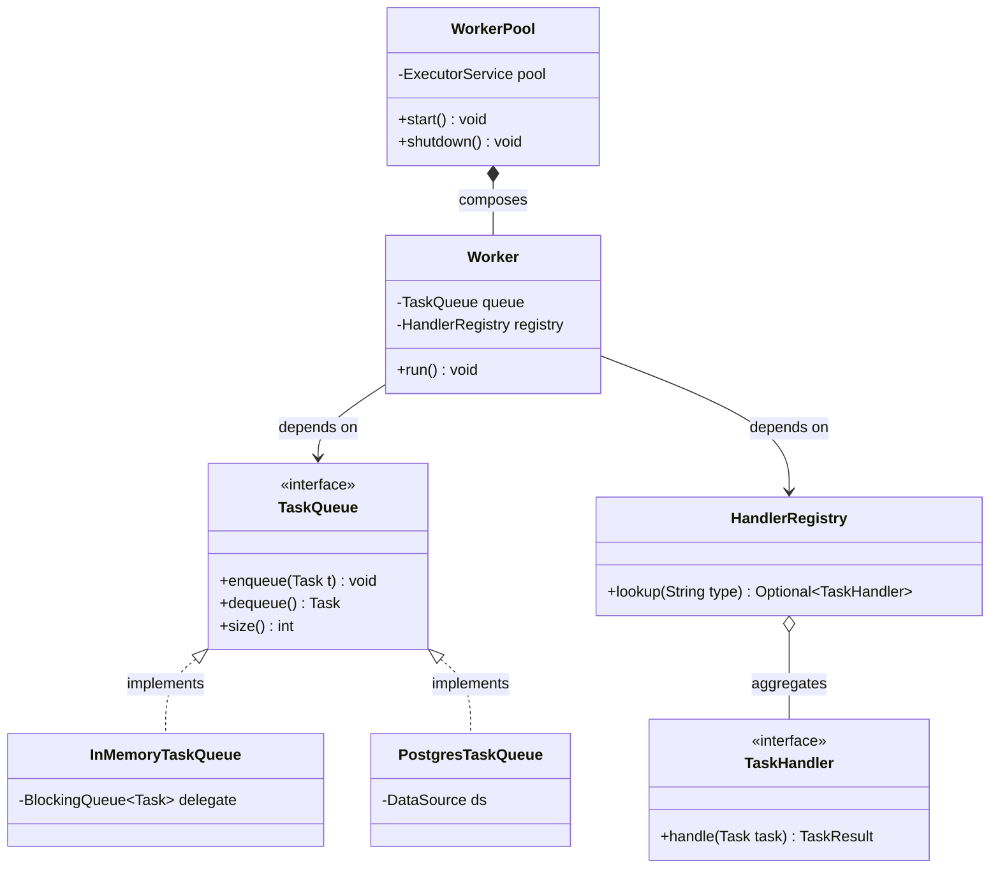
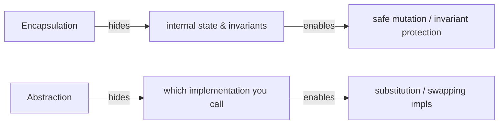

# Abstraction

> Where this fits in the project: abstraction is what lets the rest of our Task Queue platform talk to a `TaskQueue` and a `TaskHandler` without caring whether the queue lives in RAM (Phase 1) or in PostgreSQL (Phase 2) — and that single design decision is what makes the whole roadmap possible.

This chapter is the hinge between Phase 1 and Phase 2 of the project. If you get abstraction right here, swapping `InMemoryTaskQueue` for `PostgresTaskQueue` later becomes a one-line wiring change instead of a week-long rewrite. If you get it wrong, every caller leaks knowledge of the queue's internals and the whole platform calcifies.

---

## 1. Why this exists — the real problem it solves

You already know data structures cold. You can implement a lock-free ring buffer in your sleep. So why does "abstraction" deserve a chapter?

Because abstraction is not a data-structure technique — it is a **dependency-management** technique. The problem it solves is this:

> Software changes. The parts that change must not drag the parts that don't change down with them.

In our platform, the *worker logic* ("pull a task, run its handler, mark it done or retry it") is stable. It will look almost identical in Phase 1 and in Phase 4. But the *storage* underneath it changes drastically: an in-memory `ArrayBlockingQueue` in Phase 1, a PostgreSQL table with `SELECT ... FOR UPDATE SKIP LOCKED` in Phase 2, a Redis or Kafka broker in Phase 4.

If the `Worker` class directly references `ArrayBlockingQueue`, then every storage change forces a `Worker` rewrite. Abstraction is the seam that prevents that: the `Worker` depends on the *idea* of a queue (`enqueue`, `dequeue`, `size`), not on any concrete queue.

### A bit of history

The word comes from the Latin *abstrahere*, "to draw away." In computing, the lineage runs from Dijkstra's structured programming, through Parnas's 1972 paper *On the Criteria To Be Used in Decomposing Systems into Modules* (which argued you decompose around **information hiding**, i.e. around what is likely to change), to Liskov's abstract data types, to the modern mantra **"program to an interface, not an implementation"** (Gang of Four, 1994).

Parnas's insight is the one that matters most for us: pick your abstractions around the **axes of change**. Storage will change. Therefore storage gets an interface.

> [!NOTE]
> **Abstraction vs encapsulation** (we will return to this in §, but plant the seed now):
> - **Encapsulation** hides *data and state* behind methods — the subject of the [previous chapter](./chapter-02-encapsulation.md). It is about *protecting invariants*.
> - **Abstraction** hides *which implementation you are talking to* behind a type — the subject of *this* chapter. It is about *managing dependencies and enabling substitution*.
> They are siblings, not synonyms. A class can be perfectly encapsulated and still expose a terrible abstraction.

---

## 2. The naive version — no abstraction at all

Here is the first cut a Phase-1 author might write. It works. It is also a trap.

```java
import java.util.concurrent.ArrayBlockingQueue;

// NAIVE: the worker is welded to one concrete queue type.
public class NaiveWorker implements Runnable {

    private final ArrayBlockingQueue<Task> queue; // concrete type leaks everywhere

    public NaiveWorker(ArrayBlockingQueue<Task> queue) {
        this.queue = queue;
    }

    @Override
    public void run() {
        try {
            while (!Thread.currentThread().isInterrupted()) {
                Task task = queue.take(); // ArrayBlockingQueue-specific method
                // ... and here we'd hardcode a giant switch on task.type()
                if (task.type().equals("email")) {
                    sendEmail(task);
                } else if (task.type().equals("report")) {
                    buildReport(task);
                } // ...endless else-if chain
            }
        } catch (InterruptedException e) {
            Thread.currentThread().interrupt();
        }
    }

    private void sendEmail(Task t) { /* ... */ }
    private void buildReport(Task t) { /* ... */ }
}
```

What is wrong with this — concretely?

1. **Storage is welded in.** `ArrayBlockingQueue` is named in the field type. When Phase 2 moves the queue to PostgreSQL, `NaiveWorker` must be rewritten, recompiled, and re-tested. The change radius is the entire class.
2. **Behavior is welded in.** Every task type lives in one `else-if` chain. Adding a new task type means editing `NaiveWorker` — a direct violation of the Open/Closed Principle (see [`solid.md`](../04-oop-and-ood/solid.md)).
3. **It is untestable in isolation.** To test the loop you must construct a real `ArrayBlockingQueue` and real handlers. You cannot inject a fake queue that returns one task and then stops.
4. **It uses `ArrayBlockingQueue`-specific surface.** `take()` is fine, but if a caller starts using `queue.remainingCapacity()` or `queue.drainTo(...)`, those assumptions metastasize and you can never swap the implementation.

This is the "no abstraction" baseline. Everything below is the climb out of it.

---

## 3. Improved version — extract a `TaskQueue` interface

The first move: stop naming the concrete type. Introduce the canonical `TaskQueue` interface and depend on *that*.

```java
// The abstraction: callers see ONLY these three operations.
public interface TaskQueue {
    void enqueue(Task t);
    Task dequeue() throws InterruptedException;
    int size();
}
```

```java
import java.util.concurrent.BlockingQueue;
import java.util.concurrent.LinkedBlockingQueue;

// Phase 1 implementation — an adapter over a BlockingQueue.
public final class InMemoryTaskQueue implements TaskQueue {

    private final BlockingQueue<Task> delegate;

    public InMemoryTaskQueue() {
        this(new LinkedBlockingQueue<>());
    }

    public InMemoryTaskQueue(BlockingQueue<Task> delegate) {
        this.delegate = delegate; // even the BlockingQueue kind is hidden from callers
    }

    @Override
    public void enqueue(Task t) {
        delegate.add(t); // throws if bounded and full — a deliberate choice (see §8)
    }

    @Override
    public Task dequeue() throws InterruptedException {
        return delegate.take(); // blocks until an element is available
    }

    @Override
    public int size() {
        return delegate.size();
    }
}
```

Now the worker depends only on the abstraction:

```java
public final class Worker implements Runnable {

    private final TaskQueue queue; // abstraction, not ArrayBlockingQueue

    public Worker(TaskQueue queue) {
        this.queue = queue;
    }

    @Override
    public void run() {
        try {
            while (!Thread.currentThread().isInterrupted()) {
                Task task = queue.dequeue();
                // still hardcoding behavior — we fix this next
                process(task);
            }
        } catch (InterruptedException e) {
            Thread.currentThread().interrupt();
        }
    }

    private void process(Task task) { /* ... */ }
}
```

We have solved problem #1 (storage is no longer welded in) and #3 (we can now inject a fake `TaskQueue` in tests). But behavior is still hardcoded in `process`. That is the second axis of change, and it needs its own abstraction.

---

## 4. Production-quality version — two abstractions, fully decoupled

A staff engineer abstracts **both** axes of change: *where tasks come from* (`TaskQueue`) and *what running a task means* (`TaskHandler`). The worker becomes a thin orchestrator that knows neither.

```java
// TaskHandler is the behavior abstraction. It is a functional interface,
// so a handler can be a lambda, a method reference, or a full class.
@FunctionalInterface
public interface TaskHandler {
    TaskResult handle(Task task) throws Exception;
}
```

```java
// The result of running a handler. Immutable by construction (a record).
public record TaskResult(boolean success, String message, boolean retryable) {

    public static TaskResult ok() {
        return new TaskResult(true, "ok", false);
    }

    public static TaskResult retry(String why) {
        return new TaskResult(false, why, true);
    }

    public static TaskResult fail(String why) {
        return new TaskResult(false, why, false);
    }
}
```

```java
import java.util.Map;
import java.util.Optional;

// A registry maps a task TYPE (a String) to its TaskHandler.
// This replaces the else-if chain with an open, extensible lookup.
public final class HandlerRegistry {

    private final Map<String, TaskHandler> handlers;

    public HandlerRegistry(Map<String, TaskHandler> handlers) {
        this.handlers = Map.copyOf(handlers); // defensive copy -> immutable
    }

    public Optional<TaskHandler> lookup(String type) {
        return Optional.ofNullable(handlers.get(type));
    }
}
```

```java
// The production Worker: orchestration only. It depends on TWO abstractions
// (TaskQueue, HandlerRegistry) and zero concrete storage or behavior.
public final class Worker implements Runnable {

    private final TaskQueue queue;
    private final HandlerRegistry registry;

    public Worker(TaskQueue queue, HandlerRegistry registry) {
        this.queue = queue;
        this.registry = registry;
    }

    @Override
    public void run() {
        try {
            while (!Thread.currentThread().isInterrupted()) {
                Task task = queue.dequeue();
                runOne(task);
            }
        } catch (InterruptedException e) {
            Thread.currentThread().interrupt(); // restore the flag, then exit
        }
    }

    private void runOne(Task task) {
        TaskHandler handler = registry.lookup(task.type()).orElse(null);
        if (handler == null) {
            // No handler registered for this type — a domain failure, not a crash.
            System.err.println("No handler for type: " + task.type());
            return;
        }
        try {
            TaskResult result = handler.handle(task);
            if (result.success()) {
                System.out.println("Task " + task.id() + " succeeded");
            } else if (result.retryable()) {
                System.out.println("Task " + task.id() + " will retry: " + result.message());
                // Phase 2 wires in RetryPolicy + re-enqueue here.
            } else {
                System.out.println("Task " + task.id() + " failed permanently: " + result.message());
                // Phase 3 wires in the DeadLetterQueue here.
            }
        } catch (Exception e) {
            System.err.println("Handler threw for task " + task.id() + ": " + e.getMessage());
        }
    }
}
```

Why this is what we ship:

- `Worker` names **no** concrete queue and **no** concrete handler. Both can change without touching it.
- New task types are added by registering a new `TaskHandler` — **no edit to `Worker`** (Open/Closed satisfied).
- It is trivially testable: inject a one-task fake queue and a stub handler, assert the branch taken.
- The retry/DLQ branches are clearly marked as future seams. The abstraction *anticipates* Phases 2–3 without implementing them prematurely (YAGNI respected — see [`dry-kiss-yagni.md`](../04-oop-and-ood/dry-kiss-yagni.md)).

---

## 5. Code walkthrough — beginner, intermediate, production

### 5a. Beginner: program to the interface

The single most important habit. Declare variables by their **abstract** type, construct with the **concrete** type.

```java
// GOOD: the variable's type is the abstraction.
TaskQueue queue = new InMemoryTaskQueue();

// LESS GOOD: the variable is bound to the concrete type, tempting callers
// to use InMemoryTaskQueue-specific methods later.
InMemoryTaskQueue queue2 = new InMemoryTaskQueue();
```

Once `queue` is declared as `TaskQueue`, the compiler physically prevents you from calling anything outside the three-method abstraction. That compiler enforcement is the abstraction doing its job.

```java
public class BeginnerDemo {
    public static void main(String[] args) {
        TaskQueue queue = new InMemoryTaskQueue();

        Task t = new Task(
            "11111111-1111-1111-1111-111111111111",
            "email",
            "{\"to\":\"a@b.com\"}",
            TaskStatus.PENDING,
            0, 3,
            java.time.Instant.now(),
            java.time.Instant.now(),
            5
        );

        queue.enqueue(t);
        System.out.println("Queue size: " + queue.size()); // 1
    }
}
```

### 5b. Intermediate: a lambda handler and a registry

Because `TaskHandler` is a functional interface, a handler can be a lambda. This is abstraction paying dividends: tiny handlers cost one line.

```java
import java.util.Map;

public class IntermediateDemo {
    public static void main(String[] args) {
        // Handlers as lambdas — the abstraction lets behavior be data.
        TaskHandler emailHandler = task -> {
            System.out.println("Sending email: " + task.payload());
            return TaskResult.ok();
        };

        TaskHandler reportHandler = task -> {
            if (task.payload().isBlank()) {
                return TaskResult.retry("empty payload, will retry");
            }
            System.out.println("Building report: " + task.payload());
            return TaskResult.ok();
        };

        HandlerRegistry registry = new HandlerRegistry(Map.of(
            "email", emailHandler,
            "report", reportHandler
        ));

        registry.lookup("email").ifPresent(h -> {
            try {
                TaskResult r = h.handle(sample("email", "{\"to\":\"x\"}"));
                System.out.println("email result success=" + r.success());
            } catch (Exception e) {
                throw new RuntimeException(e);
            }
        });
    }

    static Task sample(String type, String payload) {
        return new Task(
            java.util.UUID.randomUUID().toString(), type, payload,
            TaskStatus.PENDING, 0, 3,
            java.time.Instant.now(), java.time.Instant.now(), 0
        );
    }
}
```

### 5c. Production-inspired: swap the queue without touching the worker

This is the payoff. We define a second `TaskQueue` implementation that *pretends* to be DB-backed (we will build the real `PostgresTaskQueue` in [Phase 2](../09-project/phase-2.md)). The `Worker`, `WorkerPool`, and `HandlerRegistry` do not change at all.

```java
import java.util.Deque;
import java.util.concurrent.ConcurrentLinkedDeque;
import java.util.concurrent.locks.Condition;
import java.util.concurrent.locks.ReentrantLock;

// A stand-in for PostgresTaskQueue: same abstraction, different mechanism.
// Imagine `pollDue` is a SELECT ... FOR UPDATE SKIP LOCKED and `enqueue` an INSERT.
public final class FakeDbTaskQueue implements TaskQueue {

    private final Deque<Task> rows = new ConcurrentLinkedDeque<>();
    private final ReentrantLock lock = new ReentrantLock();
    private final Condition notEmpty = lock.newCondition();

    @Override
    public void enqueue(Task t) {
        lock.lock();
        try {
            rows.addLast(t);   // INSERT INTO tasks ...
            notEmpty.signal();
        } finally {
            lock.unlock();
        }
    }

    @Override
    public Task dequeue() throws InterruptedException {
        lock.lock();
        try {
            while (rows.isEmpty()) {
                notEmpty.await();   // in real Postgres we'd poll with a delay instead
            }
            return rows.pollFirst(); // SELECT ... FOR UPDATE SKIP LOCKED; UPDATE status='RUNNING'
        } finally {
            lock.unlock();
        }
    }

    @Override
    public int size() {
        return rows.size(); // SELECT count(*) FROM tasks WHERE status='PENDING'
    }
}
```

```java
import java.util.Map;
import java.util.concurrent.ExecutorService;
import java.util.concurrent.Executors;

public class ProductionDemo {
    public static void main(String[] args) {
        // Choose the implementation here, and ONLY here.
        TaskQueue queue = pickQueue(System.getenv("QUEUE_KIND"));

        HandlerRegistry registry = new HandlerRegistry(Map.of(
            "email", task -> { System.out.println("email " + task.id()); return TaskResult.ok(); }
        ));

        // WorkerPool runs N workers — none of them know which queue they got.
        ExecutorService pool = Executors.newFixedThreadPool(4);
        for (int i = 0; i < 4; i++) {
            pool.submit(new Worker(queue, registry));
        }

        queue.enqueue(ProductionDemo.task("email", "{\"to\":\"z\"}"));
    }

    // The ONE place that mentions concrete queue types — a tiny factory.
    private static TaskQueue pickQueue(String kind) {
        return "db".equalsIgnoreCase(kind)
            ? new FakeDbTaskQueue()       // Phase 2 path
            : new InMemoryTaskQueue();    // Phase 1 path
    }

    static Task task(String type, String payload) {
        return new Task(
            java.util.UUID.randomUUID().toString(), type, payload,
            TaskStatus.PENDING, 0, 3,
            java.time.Instant.now(), java.time.Instant.now(), 0
        );
    }
}
```

Read `pickQueue` carefully. It is the **only** place in the entire program that names a concrete queue. Everything downstream sees `TaskQueue`. Changing `QUEUE_KIND=db` migrates the platform from RAM to a database with zero edits to business logic. *That* is the entire point of abstraction, demonstrated in nine lines.

---

## 6. How this applies to our Task Queue project

Here is the dependency structure once both abstractions are in place. Solid arrows are "depends on"; the dashed arrows are "implements."



Notice what the diagram says about change radius: `InMemoryTaskQueue` and `PostgresTaskQueue` are leaves. `Worker` points only at interfaces. Replacing one leaf with another does not move any arrow that touches `Worker`. The abstraction is a firewall.

Concrete mapping to the canonical model:

| Canonical type | Role here | Phase introduced |
|---|---|---|
| `TaskQueue` | storage abstraction (the firewall) | Phase 1 |
| `InMemoryTaskQueue` | `BlockingQueue`-backed impl | Phase 1 |
| `PostgresTaskQueue` | JDBC-backed impl, same interface | Phase 2 |
| `TaskHandler` | behavior abstraction (functional) | Phase 1 |
| `Worker` | orchestrator depending only on abstractions | Phase 1 |
| `WorkerPool` | composes Workers over an `ExecutorService` | Phase 1 |
| `TaskRepository` | persistence abstraction (parallel idea, CRUD-shaped) | Phase 2 |

> `TaskRepository` is worth a side note: it is the *same abstraction discipline* applied to persistence rather than to queuing. `findById`, `save`, `pollDue` hide whether rows live in Postgres, H2, or an in-memory map. We build it for real in [`phase-2.md`](../09-project/phase-2.md).

---

## 7. Abstraction versus encapsulation — the precise distinction

These two get conflated constantly in interviews. Pin them down.



| | Encapsulation | Abstraction |
|---|---|---|
| Hides | data, fields, internal state | the concrete implementation behind a type |
| Mechanism | `private` fields, getters/validation, defensive copies | interfaces, abstract classes, polymorphism |
| Goal | protect invariants | manage dependencies, enable substitution |
| Failure mode | exposed mutable field (broken invariant) | leaky abstraction (caller depends on impl details) |
| In our project | `Task.attempts` cannot go negative | `Worker` cannot tell in-memory from Postgres |

A worked example showing they are independent:

```java
// Perfectly ENCAPSULATED (private state, validated), but a LEAKY ABSTRACTION:
// it exposes a method that only makes sense for a BlockingQueue.
public final class LeakyQueue implements TaskQueue {
    private final java.util.concurrent.ArrayBlockingQueue<Task> q
        = new java.util.concurrent.ArrayBlockingQueue<>(100);

    @Override public void enqueue(Task t) { q.add(t); }
    @Override public Task dequeue() throws InterruptedException { return q.take(); }
    @Override public int size() { return q.size(); }

    // LEAK: this only makes sense for a bounded in-memory queue. A Postgres
    // queue has no "remaining capacity". Callers that use this can never be
    // migrated to PostgresTaskQueue.
    public int remainingCapacity() { return q.remainingCapacity(); }
}
```

The field is `private` (good encapsulation). But `remainingCapacity()` lets a caller depend on something only `ArrayBlockingQueue` can provide (bad abstraction). The two qualities are orthogonal; you must get *both* right.

For the encapsulation half of this story in depth, see [`chapter-02-encapsulation.md`](./chapter-02-encapsulation.md).

---

## 8. Leaky abstractions

> **The Law of Leaky Abstractions** (Joel Spolsky, 2002): *All non-trivial abstractions, to some degree, are leaky.* The job is not to achieve a perfect abstraction — it is to choose **what** leaks and to leak it **on purpose**.

A leaky abstraction is one where implementation details bleed through the interface and force callers to know things they shouldn't. Our `TaskQueue` has several latent leaks:

1. **Blocking semantics.** `dequeue()` blocks. `InMemoryTaskQueue` blocks on `BlockingQueue.take()`; `PostgresTaskQueue` would have to *poll the DB in a loop* to fake blocking, or use `LISTEN/NOTIFY`. The "it just blocks" abstraction leaks the moment latency or DB load matters.
2. **Bounded vs unbounded.** `enqueue` may throw when an in-memory bounded queue is full; a Postgres table is effectively unbounded until the disk fills. Callers that assume "enqueue never fails" are coding to a leak.
3. **Ordering and fairness.** `LinkedBlockingQueue` is roughly FIFO. `PostgresTaskQueue` ordered by `priority DESC, scheduledAt ASC` is not FIFO at all. If a caller *relies* on FIFO, the abstraction has leaked ordering guarantees it never promised.
4. **Durability.** In-memory tasks vanish on crash; Postgres tasks survive. A caller that enqueues a "fire-and-forget" task and assumes it will run is depending on durability the Phase-1 impl does not provide.

How a staff engineer manages leaks instead of pretending they don't exist:

```java
// Make the contract EXPLICIT in the interface so leaks are documented, not surprising.
public interface TaskQueue {

    /**
     * Enqueue a task.
     * @throws QueueFullException if a bounded implementation is at capacity.
     *         Unbounded implementations never throw this.
     */
    void enqueue(Task t);

    /**
     * Block until a task is available and return it.
     * Implementations MAY return tasks out of FIFO order (e.g. by priority).
     * Callers MUST NOT rely on insertion order.
     * @throws InterruptedException if the waiting thread is interrupted.
     */
    Task dequeue() throws InterruptedException;

    /**
     * A best-effort, possibly-stale count of pending tasks. For metrics only;
     * never use as a precondition for dequeue (the count can change concurrently).
     */
    int size();
}
```

The Javadoc *is* the abstraction. By writing "MAY return out of FIFO order" and "best-effort, possibly-stale count," we move the leak from a runtime surprise into a documented contract. Now `InMemoryTaskQueue` and `PostgresTaskQueue` are honestly substitutable, because no caller was ever promised FIFO or an exact count.

> [!WARNING]
> The worst leaks are the ones encoded as *behavioral assumptions* nobody wrote down. "Tasks always run in the order I submit them" is not in the interface, so it is not a guarantee — but a caller may silently depend on it and break in Phase 2. Documented contracts (and tests that assert the contract, not the implementation) are how you defend against this.

---

## 9. Tradeoffs — honest engineering

Abstraction is not free. Add an interface only where change actually happens.

| Tradeoff | Benefit of abstracting | Cost of abstracting |
|---|---|---|
| Indirection | swap impls, mock in tests, parallel teams | one more file/type to navigate; harder to "jump to code" |
| Flexibility | Open/Closed; add impls without edits | risk of over-engineering interfaces no one needs |
| Coupling | callers depend on a stable contract | the contract itself becomes a thing you must not break |
| Performance | usually negligible (JIT devirtualizes monomorphic calls) | megamorphic call sites can defeat inlining |
| Cognitive load | clear seams, named concepts | premature abstraction hides the real flow |

Rules of thumb that keep this honest:

- **Abstract the axes of change, not everything.** Storage changes → `TaskQueue`. Behavior changes → `TaskHandler`. A `Task` record does not need an interface; it is plain data.
- **Rule of three.** Do not extract an interface until you have (or can clearly foresee) a *second* implementation. One implementation behind an interface is often premature.
- **An interface with one impl forever is a smell** — unless that impl is genuinely expected to change (like `TaskQueue`, where Phase 2 *guarantees* a second impl). Foresight justifies it here; speculation does not justify it elsewhere.

> [!NOTE]
> On performance: the JVM is extremely good at this. A call site that only ever sees `InMemoryTaskQueue` is *monomorphic*; the JIT inlines through the interface as if it were a direct call. The interface costs essentially nothing until the call site becomes polymorphic at runtime — and even then it is cheap. Do not avoid abstraction for performance in application code.

---

## 10. Common mistakes and pitfalls

- **Declaring variables by concrete type.** `ArrayBlockingQueue<Task> q = ...` invites impl-specific calls. *Fix:* declare as `TaskQueue q = ...`.
- **Returning concrete types from methods.** `public LinkedBlockingQueue<Task> getQueue()` leaks the impl through the return type. *Fix:* return `TaskQueue`.
- **Interfaces with one method per concrete method ("anemic" interfaces).** If your interface just mirrors one class's public methods, it adds no abstraction. *Fix:* design the interface around the *client's needs*, not the implementor's surface.
- **Leaky method names.** `remainingCapacity()`, `getConnection()` on a `TaskQueue` betray the mechanism. *Fix:* keep the interface in the vocabulary of the domain.
- **`instanceof` checks that defeat the abstraction.** `if (queue instanceof InMemoryTaskQueue imq) imq.remainingCapacity()` re-couples the caller. *Fix:* if you need a capability, model it as a method on the interface (or a separate capability interface), not a downcast. See [`chapter-11-instanceof.md`](../02-core-oop/chapter-11-instanceof.md).
- **Over-abstracting data.** Wrapping a `Task` record behind an `ITask` interface "for flexibility." Plain data does not change shape on a hidden axis. *Fix:* keep `Task` a record.
- **Abstraction without dependency injection.** Defining `TaskQueue` but then writing `new InMemoryTaskQueue()` inside `Worker` re-welds it. *Fix:* inject the dependency through the constructor (see [`dependency-injection.md`](../04-oop-and-ood/dependency-injection.md)).
- **Confusing "interface" with "abstraction."** Adding the keyword `interface` does not create a good abstraction. A bad interface is worse than no interface. The abstraction is the *contract you chose*, not the syntax.

---

## 11. Refactoring exercise — bad, improved, production

### Bad

A "task processor" with storage and behavior both welded in, plus a leaky downcast.

```java
import java.util.concurrent.ArrayBlockingQueue;

public class BadProcessor {
    private final ArrayBlockingQueue<Task> queue = new ArrayBlockingQueue<>(1000);

    public void submit(Task t) {
        // leak: callers must understand capacity to use this safely
        if (queue.remainingCapacity() == 0) {
            throw new RuntimeException("full");
        }
        queue.add(t);
    }

    public void runForever() throws InterruptedException {
        while (true) {
            Task t = queue.take();
            String type = t.type();
            if (type.equals("email")) {
                System.out.println("email " + t.payload());
            } else if (type.equals("report")) {
                System.out.println("report " + t.payload());
            } else {
                System.out.println("unknown " + type);
            }
        }
    }
}
```

Problems: concrete queue welded in; `remainingCapacity` leaks; behavior is an else-if chain that violates Open/Closed; impossible to unit test a single iteration.

### Improved

Introduce `TaskQueue`, inject it, and replace the else-if chain with a map of handlers.

```java
import java.util.Map;

public class ImprovedProcessor {
    private final TaskQueue queue;            // abstraction, injected
    private final Map<String, TaskHandler> handlers;

    public ImprovedProcessor(TaskQueue queue, Map<String, TaskHandler> handlers) {
        this.queue = queue;
        this.handlers = handlers;
    }

    public void submit(Task t) {
        queue.enqueue(t); // capacity concerns now hidden inside the impl
    }

    public void runForever() throws InterruptedException {
        while (true) {
            Task t = queue.dequeue();
            TaskHandler h = handlers.get(t.type());
            if (h == null) { System.out.println("unknown " + t.type()); continue; }
            try { h.handle(t); } catch (Exception e) { System.out.println("error " + e); }
        }
    }
}
```

Better: storage is injected, behavior is open for extension. Remaining gaps: no result handling (success/retry/fail), `runForever` can't be cleanly stopped, no registry abstraction.

### Production-quality

Use the canonical `Worker` + `HandlerRegistry`, honor interruption, and route results.

```java
import java.util.Optional;

public final class TaskProcessor implements Runnable {

    private final TaskQueue queue;
    private final HandlerRegistry registry;

    public TaskProcessor(TaskQueue queue, HandlerRegistry registry) {
        this.queue = queue;
        this.registry = registry;
    }

    @Override
    public void run() {
        try {
            while (!Thread.currentThread().isInterrupted()) {
                dispatch(queue.dequeue());
            }
        } catch (InterruptedException e) {
            Thread.currentThread().interrupt(); // cooperative shutdown
        }
    }

    private void dispatch(Task task) {
        Optional<TaskHandler> handler = registry.lookup(task.type());
        if (handler.isEmpty()) {
            // no downcast, no instanceof — purely contract-driven
            System.err.println("no handler for " + task.type());
            return;
        }
        try {
            TaskResult result = handler.get().handle(task);
            // Pattern switch over the result's meaning; retry/DLQ are future seams.
            if (result.success()) {
                // mark SUCCEEDED
            } else if (result.retryable()) {
                // Phase 2: RetryPolicy decides nextDelay; re-enqueue
            } else {
                // Phase 3: DeadLetterQueue.send(task, result.message())
            }
        } catch (Exception e) {
            System.err.println("handler failed for " + task.id() + ": " + e.getMessage());
        }
    }
}
```

This version is interruptible, contract-driven (no `instanceof`, no leak), open for new handlers, and already has clearly labeled seams for the retry and DLQ work in later phases.

---

## 12. Exercises

> Solutions are in §13. Try each before scrolling.

### Easy

- **E1 (knowledge check).** In one sentence each, state the difference between abstraction and encapsulation, and give one example of each from the Task Queue project.
- **E2 (coding).** Implement a `NoOpTaskQueue implements TaskQueue` whose `dequeue()` blocks forever (never returns) and whose `size()` is always `0`. Useful as a test double. Why might "block forever" be a reasonable `dequeue` for a queue that is never fed?
- **E3 (spotting leaks).** Given the interface below, name the one method that is a leaky abstraction and say why.
  ```java
  interface TaskQueue {
      void enqueue(Task t);
      Task dequeue() throws InterruptedException;
      int size();
      java.sql.Connection connection(); // <-- ?
  }
  ```

### Medium

- **M1 (coding).** Implement `BoundedInMemoryTaskQueue implements TaskQueue` backed by an `ArrayBlockingQueue` of fixed capacity, where `enqueue` throws a custom `QueueFullException` (unchecked) when full — and document the leak in the Javadoc.
- **M2 (refactoring).** Take `BadProcessor` from §11 and refactor it so a *single* iteration of its loop is unit-testable without an infinite loop and without real storage. Show the production class and a JUnit 5 + AssertJ test.
- **M3 (design).** You need a `TaskQueue` that is in-memory but *persists to disk on shutdown* and *reloads on startup*. Without changing the `TaskQueue` interface, sketch the class and explain which existing impl it can wrap (hint: composition).

### Hard

- **H1 (interview-style).** A teammate proposes adding `peek()`, `clear()`, `drainTo(Collection)`, and `remainingCapacity()` to `TaskQueue` "so we have flexibility." Argue, with reference to leaky abstractions and substitutability, which (if any) belong on the interface, and what to do with the rest.
- **H2 (stretch).** Design a *capability interface* approach so that callers who genuinely need bounded-queue capacity can ask for it *without* every `TaskQueue` having to provide `remainingCapacity()`. Implement `BoundedQueue` as an optional capability interface and show a caller using `instanceof` pattern matching *correctly*.
- **H3 (design + coding).** Prove substitutability with a single test: write one parameterized JUnit 5 test that runs against *both* `InMemoryTaskQueue` and `FakeDbTaskQueue` and asserts identical observable behavior for enqueue/dequeue/size. (This is the Liskov substitution test for the abstraction.)

---

## 13. Solutions

### E1

> **Abstraction** hides *which implementation* you are talking to behind a type — e.g. `Worker` depends on `TaskQueue`, not on whether it is in-memory or Postgres. **Encapsulation** hides *internal state* behind methods that protect invariants — e.g. `Task.attempts` is private and can only be incremented through controlled methods, never set negative.

### E2

```java
public final class NoOpTaskQueue implements TaskQueue {
    @Override public void enqueue(Task t) { /* dropped on the floor */ }

    @Override public Task dequeue() throws InterruptedException {
        // Block forever: a worker bound to this queue parks harmlessly.
        Thread.currentThread().join(); // returns only on interruption
        throw new IllegalStateException("unreachable");
    }

    @Override public int size() { return 0; }
}
```

Blocking forever is reasonable because a `Worker` calling `dequeue()` on an unfed queue *should* idle, not spin or crash. In tests it lets you start a worker that simply waits, so you can assert "no work was done." (Interrupting the worker thread cleanly unblocks `join()`.)

### E3

`connection()` is the leak. It exposes a JDBC `Connection`, which (a) only makes sense for a database-backed queue — `InMemoryTaskQueue` has no connection to return — and (b) lets callers run arbitrary SQL, bypassing the three-operation contract entirely. Any caller that uses `connection()` can never be migrated to the in-memory impl, defeating the whole purpose of the abstraction.

### M1

```java
import java.util.concurrent.ArrayBlockingQueue;

/** Thrown by bounded TaskQueue implementations when at capacity. */
public final class QueueFullException extends RuntimeException {
    public QueueFullException(String msg) { super(msg); }
}

public final class BoundedInMemoryTaskQueue implements TaskQueue {

    private final ArrayBlockingQueue<Task> q;

    public BoundedInMemoryTaskQueue(int capacity) {
        this.q = new ArrayBlockingQueue<>(capacity);
    }

    /**
     * Enqueue a task.
     * <p>LEAK (documented): this implementation is bounded, so it MAY throw
     * {@link QueueFullException}. Unbounded implementations never do. Callers
     * that must remain impl-agnostic should be prepared for this exception.
     */
    @Override
    public void enqueue(Task t) {
        if (!q.offer(t)) {
            throw new QueueFullException("queue at capacity " + q.size());
        }
    }

    @Override
    public Task dequeue() throws InterruptedException { return q.take(); }

    @Override
    public int size() { return q.size(); }
}
```

The point of M1 is that the *leak is honest*: the Javadoc tells callers that bounded impls may throw, turning a surprise into a documented contract.

### M2

Refactor so the loop body is a method you can call once. Then test that method directly.

```java
import java.util.Optional;

public final class TestableProcessor {
    private final TaskQueue queue;
    private final HandlerRegistry registry;
    private final StringBuilder log = new StringBuilder(); // observable side effect

    public TestableProcessor(TaskQueue queue, HandlerRegistry registry) {
        this.queue = queue;
        this.registry = registry;
    }

    // One iteration, extracted for testability.
    void processOne() throws InterruptedException {
        Task t = queue.dequeue();
        Optional<TaskHandler> h = registry.lookup(t.type());
        if (h.isEmpty()) { log.append("unknown:").append(t.type()).append(';'); return; }
        try { h.get().handle(t); log.append("ran:").append(t.type()).append(';'); }
        catch (Exception e) { log.append("error;"); }
    }

    String log() { return log.toString(); }
}
```

```java
import org.junit.jupiter.api.Test;
import java.util.Map;
import static org.assertj.core.api.Assertions.assertThat;

class TestableProcessorTest {

    @Test
    void runsTheRegisteredHandlerForOneTask() throws Exception {
        TaskQueue queue = new InMemoryTaskQueue();
        HandlerRegistry registry = new HandlerRegistry(Map.of(
            "email", task -> TaskResult.ok()
        ));
        TestableProcessor p = new TestableProcessor(queue, registry);

        queue.enqueue(sample("email"));
        p.processOne(); // exactly one iteration, no infinite loop

        assertThat(p.log()).isEqualTo("ran:email;");
    }

    @Test
    void logsUnknownForUnregisteredType() throws Exception {
        TaskQueue queue = new InMemoryTaskQueue();
        HandlerRegistry registry = new HandlerRegistry(Map.of());
        TestableProcessor p = new TestableProcessor(queue, registry);

        queue.enqueue(sample("ghost"));
        p.processOne();

        assertThat(p.log()).isEqualTo("unknown:ghost;");
    }

    private static Task sample(String type) {
        return new Task(
            java.util.UUID.randomUUID().toString(), type, "{}",
            TaskStatus.PENDING, 0, 3,
            java.time.Instant.now(), java.time.Instant.now(), 0
        );
    }
}
```

Extracting `processOne()` (and injecting the `TaskQueue` abstraction so we can feed exactly one task) is what makes the loop testable. The abstraction is what makes the test possible at all.

### M3

Use **composition**: wrap any existing `TaskQueue` and add snapshot/restore around it. It can wrap `InMemoryTaskQueue` directly.

```java
import java.util.List;

public final class SnapshottingTaskQueue implements TaskQueue {

    private final TaskQueue delegate;          // composition over an existing impl
    private final SnapshotStore store;         // abstraction over disk I/O

    public SnapshottingTaskQueue(TaskQueue delegate, SnapshotStore store) {
        this.delegate = delegate;
        this.store = store;
        store.load().forEach(delegate::enqueue); // reload on startup
    }

    @Override public void enqueue(Task t) { delegate.enqueue(t); store.append(t); }
    @Override public Task dequeue() throws InterruptedException { return delegate.dequeue(); }
    @Override public int size() { return delegate.size(); }

    public void persistOnShutdown() {
        // snapshot whatever the impl can expose; in practice drain a copy
        store.flush();
    }

    interface SnapshotStore {
        List<Task> load();
        void append(Task t);
        void flush();
    }
}
```

The key insight: because `SnapshottingTaskQueue` *is a* `TaskQueue` and *has a* `TaskQueue`, callers see no difference. We added durability without touching the interface or any existing impl — the Decorator pattern in embryo (see [`decorator.md`](../05-design-patterns/decorator.md)).

### H1

Argue by substitutability and leakiness:

- **`peek()`** — *Reject.* It implies a stable head, but `PostgresTaskQueue` (ordered by priority, with `SKIP LOCKED`) and concurrent consumers make "the next element" meaningless. Peeked value may already be claimed by another worker. Leaky and unsubstitutable.
- **`clear()`** — *Maybe, with care.* Defensible for admin/testing, but dangerous in production (data loss) and semantically fuzzy under concurrency. If kept, it belongs on a separate `AdminQueue` capability interface, not the core path.
- **`drainTo(Collection)`** — *Reject from core.* It is `BlockingQueue` vocabulary; a DB-backed queue "draining" means a bulk `DELETE ... RETURNING`, which has wildly different cost and transactional semantics. Leaks the mechanism.
- **`remainingCapacity()`** — *Reject from core.* Only bounded in-memory queues have capacity. This is the canonical leak. If a caller needs it, expose it via an optional capability interface (see H2), so unbounded impls aren't forced to lie.

General principle: the core interface should contain only operations that **every** plausible implementation can honor with the **same meaning**. Everything else goes behind capability interfaces or admin types. This preserves Liskov substitutability across `InMemoryTaskQueue`, `PostgresTaskQueue`, and the Phase-4 broker.

### H2

Split optional behavior into a separate interface. Callers test for it with `instanceof` pattern matching — which is the *correct* use of `instanceof`: probing for a capability, not for a concrete class.

```java
/** Optional capability: some queues are bounded and can report headroom. */
public interface BoundedQueue {
    int remainingCapacity();
    int capacity();
}

public final class BoundedInMemoryTaskQueue2 implements TaskQueue, BoundedQueue {
    private final java.util.concurrent.ArrayBlockingQueue<Task> q;
    public BoundedInMemoryTaskQueue2(int capacity) { this.q = new java.util.concurrent.ArrayBlockingQueue<>(capacity); }
    @Override public void enqueue(Task t) { q.add(t); }
    @Override public Task dequeue() throws InterruptedException { return q.take(); }
    @Override public int size() { return q.size(); }
    @Override public int remainingCapacity() { return q.remainingCapacity(); }
    @Override public int capacity() { return q.remainingCapacity() + q.size(); }
}
```

```java
public final class BackpressureMonitor {
    // Works with ANY TaskQueue; uses extra capability only if present.
    public void report(TaskQueue queue) {
        if (queue instanceof BoundedQueue bounded) {       // capability probe
            double used = 1.0 - (double) bounded.remainingCapacity() / bounded.capacity();
            System.out.printf("queue %.0f%% full%n", used * 100);
        } else {
            System.out.println("unbounded queue; no capacity backpressure");
        }
    }
}
```

This is the right shape: the core `TaskQueue` stays clean and substitutable; bounded impls *opt in* to extra behavior; callers degrade gracefully when the capability is absent. The unbounded `PostgresTaskQueue` simply does not implement `BoundedQueue` and is never asked to lie.

### H3

One parameterized test, two implementations, identical assertions — the Liskov substitution test.

```java
import org.junit.jupiter.api.Test;
import org.junit.jupiter.params.ParameterizedTest;
import org.junit.jupiter.params.provider.MethodSource;
import java.util.function.Supplier;
import java.util.stream.Stream;
import static org.assertj.core.api.Assertions.assertThat;

class TaskQueueContractTest {

    // Each implementation is supplied as a factory so every test gets a fresh instance.
    static Stream<Supplier<TaskQueue>> implementations() {
        return Stream.of(
            InMemoryTaskQueue::new,
            FakeDbTaskQueue::new
        );
    }

    @ParameterizedTest
    @MethodSource("implementations")
    void enqueueThenDequeueReturnsSameTask(Supplier<TaskQueue> factory) throws Exception {
        TaskQueue queue = factory.get();
        Task t = sample();

        assertThat(queue.size()).isZero();
        queue.enqueue(t);
        assertThat(queue.size()).isEqualTo(1);

        Task out = queue.dequeue();
        assertThat(out.id()).isEqualTo(t.id());
        assertThat(queue.size()).isZero();
    }

    @ParameterizedTest
    @MethodSource("implementations")
    void sizeReflectsEnqueues(Supplier<TaskQueue> factory) {
        TaskQueue queue = factory.get();
        queue.enqueue(sample());
        queue.enqueue(sample());
        assertThat(queue.size()).isEqualTo(2);
    }

    private static Task sample() {
        return new Task(
            java.util.UUID.randomUUID().toString(), "email", "{}",
            TaskStatus.PENDING, 0, 3,
            java.time.Instant.now(), java.time.Instant.now(), 0
        );
    }
}
```

This single test class is the executable definition of "substitutable." If a future `PostgresTaskQueue` passes `TaskQueueContractTest`, you can swap it in with confidence. This pattern — a *contract test* shared across all implementations of an abstraction — is one of the highest-leverage testing techniques you will use in this entire roadmap.

---

## 14. Interview questions and takeaways

1. **What is the difference between abstraction and encapsulation?**
   *Encapsulation hides internal state to protect invariants (private fields + controlled access). Abstraction hides which implementation you call behind a type to manage dependencies and enable substitution. They are orthogonal — a class can be well-encapsulated yet expose a leaky abstraction.*

2. **What does "program to an interface, not an implementation" mean concretely?**
   *Declare variables, parameters, and return types by the abstract type (`TaskQueue`), and create concrete instances in exactly one place (a factory or DI container). The compiler then prevents callers from depending on impl-specific methods, so implementations stay swappable.*

3. **What is a leaky abstraction? Give a real example.**
   *An abstraction whose implementation details bleed through and force callers to know things they shouldn't. Example: a `remainingCapacity()` method on `TaskQueue` only makes sense for a bounded in-memory queue; any caller using it cannot migrate to a Postgres-backed queue. Spolsky's law says all non-trivial abstractions leak somewhat; the skill is choosing what leaks deliberately and documenting it.*

4. **When should you NOT introduce an interface?**
   *When there is only one implementation and no foreseeable second one (premature abstraction), or when abstracting plain data (`Task` is a record, not an interface). Apply the rule of three; abstract the axes of change, not everything.*

5. **How does abstraction relate to the Open/Closed Principle?**
   *Abstraction provides the extension point. New `TaskHandler` implementations or new `TaskQueue` implementations are added without modifying existing code that depends on the interface — open for extension, closed for modification.*

6. **How do you keep two implementations of an interface truly substitutable?**
   *Define the contract precisely (including failure modes and ordering) in documentation, and enforce it with a shared contract test run against every implementation. This is the practical face of the Liskov Substitution Principle.*

7. **Does abstraction hurt performance in Java?**
   *Rarely in application code. The JIT devirtualizes and inlines monomorphic interface calls, so the cost is near zero until a call site becomes polymorphic at runtime — and even then it is cheap. Do not sacrifice clean seams for micro-optimization here.*

8. **Why is `TaskHandler` a functional interface, and why does that matter?**
   *A single-abstract-method interface can be implemented by a lambda or method reference, so trivial handlers cost one line while complex ones can still be full classes. It is the same abstraction either way — behavior becomes data you can register, pass around, and test in isolation.*

**Takeaways:** abstraction is dependency management, not data hiding. Pick abstractions around what changes (storage, behavior). Program to interfaces, construct concretes in one place. All abstractions leak — document the leaks. Use contract tests to guarantee substitutability.

---

## 15. Production considerations

- **Where the leaks bite in prod.** The "`dequeue` just blocks" abstraction is comfortable in Phase 1 but in Phase 2 a naive `PostgresTaskQueue` that blocks by tight-polling will hammer the database. The production fix (`LISTEN/NOTIFY`, or a bounded poll interval with backoff) lives *behind* the interface — callers never change, but the impl must respect DB load. Watch query rate as a metric.
- **Monitoring the abstraction, not the impl.** Expose metrics in the abstraction's vocabulary: `queue.size()` as a gauge, enqueue/dequeue rates as counters, dequeue wait time as a timer. We wire these via Micrometer in [`observability-and-ops.md`](../10-system-design/observability-and-ops.md). Because they are defined on the interface, the dashboards keep working when you swap implementations.
- **`size()` is a trap at scale.** For `InMemoryTaskQueue`, `size()` is O(1). For `PostgresTaskQueue`, `SELECT count(*)` on a large table can be slow and lock-contending. The interface promised "best-effort, possibly-stale" — honor that with an approximate count (e.g. `pg_class.reltuples`) rather than an exact one. The abstraction's honesty is what lets you cut this corner safely.
- **Capability discovery.** In a horizontally scaled deployment (Phase 4), different nodes may run different `TaskQueue` impls during a rolling migration. Capability interfaces (H2) and contract tests (H3) are what let mixed versions coexist without a flag day.
- **Backpressure.** A bounded queue throwing `QueueFullException` is a backpressure signal. The API layer must translate it to an HTTP 429, not a 500. We cover this in [`backpressure.md`](../08-distributed-systems/backpressure.md) — and it only works because `enqueue`'s failure mode is part of the documented contract.

---

## What We Can Improve In Our Project Using This Concept

- Introduce the `TaskQueue` and `TaskHandler` interfaces *now*, in Phase 1, even though only `InMemoryTaskQueue` exists. The second implementation (`PostgresTaskQueue`) is a guaranteed Phase-2 requirement, so the abstraction is justified by foresight, not speculation.
- Replace any `else-if` / `switch` over `task.type()` in `Worker` with a `HandlerRegistry` lookup, making new task types additive.
- Add a `TaskQueueContractTest` so every present and future queue implementation is held to one substitutability standard.
- Document `enqueue`/`dequeue`/`size` failure modes and ordering guarantees in Javadoc so leaks are explicit, not surprises.

## Project Refactoring Task

1. Create `TaskQueue`, `TaskHandler`, and `TaskResult` in the `domain` package exactly as defined here.
2. Make `Worker` depend only on `TaskQueue` and `HandlerRegistry`; remove every reference to `ArrayBlockingQueue`/`LinkedBlockingQueue` from outside `InMemoryTaskQueue`.
3. Move all queue construction into a single factory method (`QueueFactory.create(...)`) keyed off configuration, so concrete types are named in exactly one place.
4. Add `TaskQueueContractTest` (parameterized over implementations) and confirm `InMemoryTaskQueue` passes.
5. Verify the swap: set the config to a `FakeDbTaskQueue` and confirm `Worker`, `WorkerPool`, and all tests pass unchanged.

## Git Commit For This Chapter

```text
refactor(queue): program to TaskQueue/TaskHandler abstractions

Extract TaskQueue and TaskHandler interfaces; make Worker depend only on
abstractions. Replace task-type else-if chain with HandlerRegistry. Add a
shared TaskQueueContractTest to guarantee substitutability ahead of the
Phase 2 PostgresTaskQueue. Document failure modes and ordering to make
abstraction leaks explicit.

Files touched:
  src/main/java/.../domain/TaskQueue.java        (new)
  src/main/java/.../domain/TaskHandler.java       (new)
  src/main/java/.../domain/TaskResult.java         (new)
  src/main/java/.../queue/InMemoryTaskQueue.java   (new)
  src/main/java/.../worker/Worker.java             (modified: depend on abstractions)
  src/main/java/.../worker/HandlerRegistry.java    (new)
  src/main/java/.../config/QueueFactory.java        (new)
  src/test/java/.../queue/TaskQueueContractTest.java (new)
```

## Architecture Impact

This chapter installs the central seam of the platform. `TaskQueue` becomes the firewall between business logic (workers, scheduling, retries) and storage (memory, Postgres, broker). Every later phase passes through this seam: Phase 2 adds `PostgresTaskQueue` behind it, Phase 3 inserts a `RateLimiter` and `DeadLetterQueue` around it, and Phase 4 swaps in a distributed broker — all without touching `Worker`. The abstraction defined here is what keeps the architecture's change radius small as the system grows from one process to many nodes.

## Interview Takeaways

- Abstraction is **dependency management**; encapsulation is **invariant protection**. Do not conflate them.
- "Program to an interface" means *declare abstract, construct concrete in one place*.
- All non-trivial abstractions leak — your job is to choose and document the leaks (ordering, boundedness, durability, blocking semantics).
- Justify an interface by a real or foreseeable second implementation; abstract the axes of change, not everything.
- Guarantee substitutability with a shared contract test — the executable form of the Liskov Substitution Principle.
