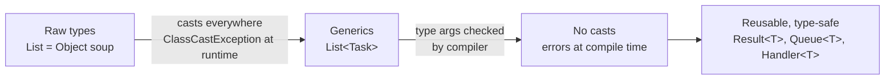
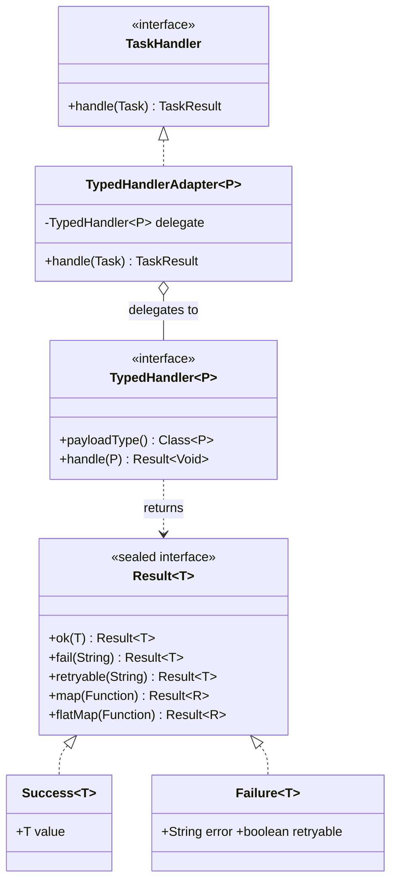
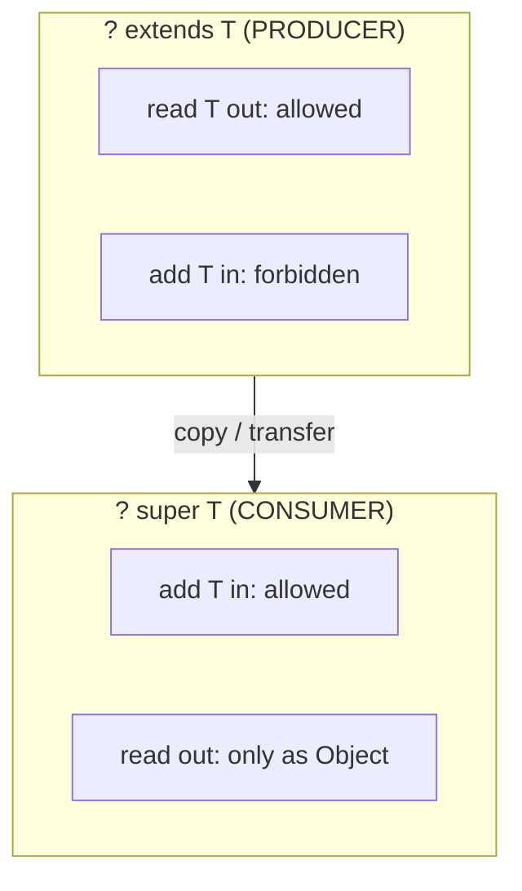

# Generics

> Where this fits in the project: Our Distributed Task Queue is built out of *containers* and *wrappers* — a `TaskQueue` holds `Task`s, a `Result` wraps the outcome of an operation, a `TaskHandler` consumes a typed payload. Generics are what let us write these once, type-safely, and reuse them for any element type without `Object` casts and without copy-pasting `IntQueue`, `TaskQueue`, `StringQueue`. This chapter builds the **generic `Result<T>` wrapper** we will thread through the entire platform.

---

## 1. Why This Exists

You have written generics-equivalent code in other languages (C++ templates, TypeScript generics, Rust's `<T>`). In Java, generics solve one concrete problem: **compile-time type safety for containers and abstractions**, without losing the ability to reuse code across element types.

Before generics (Java 1.0–1.4), every collection stored `Object`:

```java
// Pre-2004 Java. This compiled, ran, and exploded at runtime.
List tasks = new ArrayList();      // a list of... anything
tasks.add(new Task(...));
tasks.add("oops, a String");        // compiler says nothing
Task t = (Task) tasks.get(1);       // ClassCastException at RUNTIME
```

The cast on `get` was mandatory, ugly, and unchecked. A single wrong `add` anywhere in the codebase became a `ClassCastException` in production, far from the line that caused it. Generics (Java 5, 2004) moved that error to **compile time**:

```java
List<Task> tasks = new ArrayList<>();
tasks.add(new Task(...));
tasks.add("oops");                  // COMPILE ERROR — caught immediately
Task t = tasks.get(0);              // no cast, statically known to be Task
```

The mental model: **a generic type is a type-level function**. `List` is not a type; `List<Task>` is. You hand the compiler a type argument (`Task`) and it specializes the contract, checking every `add`/`get` against it. The payoff for our platform is enormous — `TaskQueue`, `Result`, `TaskHandler`, and `TaskRepository` all become *parameterized contracts* that are reused and checked, not duplicated and cast.



---

## 2. The Naive Version

Our first cut at a result wrapper for "did the task operation succeed, and what did it return" uses `Object`. This is exactly what people wrote before generics, and what some teams *still* write when they do not reach for a type parameter.

```java
// Naive: an untyped result. Carries a payload as Object.
class RawResult {
    final boolean success;
    final Object value;     // could be anything
    final String error;

    private RawResult(boolean success, Object value, String error) {
        this.success = success;
        this.value = value;
        this.error = error;
    }

    static RawResult ok(Object value)   { return new RawResult(true, value, null); }
    static RawResult fail(String error) { return new RawResult(false, null, error); }
}
```

Using it for "save a `Task` and return its id":

```java
RawResult r = saveTask(task);
if (r.success) {
    String id = (String) r.value;   // unchecked cast — hope it's really a String
    System.out.println("saved " + id);
}
```

Limitations, all of them real:

- **Every read is a cast.** `(String) r.value` is unchecked. If `saveTask` ever returns the `Task` instead of its id, you get a `ClassCastException` at the *call site*, not where the bug lives.
- **No compiler help.** Nothing stops `RawResult.ok(42)` feeding a caller that expects a `String`.
- **Self-documenting type is gone.** A reader cannot tell from `RawResult` what `value` holds. The type lives only in comments and tribal knowledge.
- **Refactors are dangerous.** Change a return type and the compiler stays silent; you find out in QA or prod.

---

## 3. Improved Version

Parameterize the wrapper with a type variable `T`. Now the success value's type travels with the object and the compiler enforces it.

```java
// Improved: a generic result. T is the type of the success value.
final class Result<T> {
    private final boolean success;
    private final T value;
    private final String error;

    private Result(boolean success, T value, String error) {
        this.success = success;
        this.value = value;
        this.error = error;
    }

    static <T> Result<T> ok(T value)   { return new Result<>(true, value, null); }
    static <T> Result<T> fail(String e) { return new Result<>(false, null, e); }

    boolean isSuccess() { return success; }
    T value()           { return value; }   // statically typed — no cast
    String error()      { return error; }
}
```

Call site, now cast-free and checked:

```java
Result<String> r = saveTask(task);          // T is fixed to String here
if (r.isSuccess()) {
    String id = r.value();                  // no cast, compiler knows it's String
    System.out.println("saved " + id);
}
```

`ok` and `fail` are **generic methods**: `<T>` before the return type declares a fresh type variable scoped to that method, inferred from the argument (`ok(value)`) or the assignment target (`Result<String> r = fail(...)`). The improvement is total: wrong types are now compile errors, and `Result<String>` documents itself.

It is still missing the *combinators* (`map`, `flatMap`, `getOrElse`) that make a result wrapper pleasant to chain. That is the production version.

---

## 4. Production-Quality Version

The version a staff engineer ships: a **sealed, immutable, exhaustively matchable** `Result<T>` with combinators, retryability baked in for our retry layer, and Java 21 pattern matching for consumption. This is the `Result<T>` we use across the whole platform.

```java
package com.platform.common;

import java.util.NoSuchElementException;
import java.util.Optional;
import java.util.function.Function;
import java.util.function.Supplier;

/**
 * A type-safe outcome wrapper. Either a Success carrying a T, or a Failure
 * carrying an error message and a retryable flag (consumed by the retry layer).
 *
 * Sealed so switch over it is exhaustive; immutable so it is safe to share
 * across worker threads.
 */
public sealed interface Result<T> permits Result.Success, Result.Failure {

    record Success<T>(T value) implements Result<T> {}
    record Failure<T>(String error, boolean retryable) implements Result<T> {}

    // ---- factories (generic methods) ----
    static <T> Result<T> ok(T value)                 { return new Success<>(value); }
    static <T> Result<T> fail(String error)          { return new Failure<>(error, false); }
    static <T> Result<T> retryable(String error)     { return new Failure<>(error, true); }

    // ---- queries ----
    default boolean isSuccess() { return this instanceof Success<T>; }

    default boolean isRetryable() {
        return this instanceof Failure<T> f && f.retryable();
    }

    // ---- extraction ----
    default T orElse(T fallback) {
        return switch (this) {
            case Success<T> s -> s.value();
            case Failure<T> ignored -> fallback;
        };
    }

    default T orElseGet(Supplier<? extends T> supplier) {
        return switch (this) {
            case Success<T> s -> s.value();
            case Failure<T> ignored -> supplier.get();
        };
    }

    default T orElseThrow() {
        return switch (this) {
            case Success<T> s -> s.value();
            case Failure<T> f -> throw new NoSuchElementException(f.error());
        };
    }

    default Optional<T> toOptional() {
        return this instanceof Success<T> s ? Optional.of(s.value()) : Optional.empty();
    }

    // ---- combinators ----
    /** Transform the success value; failures pass through unchanged. */
    default <R> Result<R> map(Function<? super T, ? extends R> fn) {
        return switch (this) {
            case Success<T> s -> Result.ok(fn.apply(s.value()));
            case Failure<T> f -> new Failure<>(f.error(), f.retryable());
        };
    }

    /** Chain another Result-returning step; short-circuits on the first failure. */
    default <R> Result<R> flatMap(Function<? super T, ? extends Result<R>> fn) {
        return switch (this) {
            case Success<T> s -> fn.apply(s.value());
            case Failure<T> f -> new Failure<>(f.error(), f.retryable());
        };
    }
}
```

Why each decision:

- **`sealed interface` + `record` variants.** The compiler knows the *only* two shapes, so `switch` is exhaustive — add a third variant later and every `switch` that forgot it fails to compile. No `default` branch silently swallowing new cases.
- **Immutable records.** `Result<T>` instances cross thread boundaries (a `Worker` produces one, the retry layer reads it). Immutability removes a whole class of concurrency bugs (see [../03-java-memory-model/immutable-objects.md](../03-java-memory-model/immutable-objects.md)).
- **`map` uses `Function<? super T, ? extends R>`.** Those wildcards are the **PECS rule** in action (§8). They make `map`/`flatMap` accept the widest possible set of functions — critical for reuse.
- **`retryable` flag.** Folds directly into the `RetryPolicy` decision so the retry layer never inspects exception types by hand.

---

## 5. Type Erasure — the One Thing You Must Internalize

Java generics are implemented by **erasure**: type parameters exist only at compile time. After compilation, `List<Task>` and `List<String>` are *both just `List`*. The type arguments are erased to their bounds (`Object` if unbounded).

```java
List<Task> a = new ArrayList<>();
List<String> b = new ArrayList<>();
System.out.println(a.getClass() == b.getClass()); // true — both java.util.ArrayList
```

This was a deliberate 2004 choice for **backward compatibility**: generic and pre-generic code had to interoperate on the same `List` class, so type arguments could not become part of the runtime class. The consequences you must remember:

```java
// 1. No instanceof against a parameterized type — the type arg isn't there at runtime.
if (x instanceof Result<String>) { }   // COMPILE ERROR
if (x instanceof Result<?>) { }         // OK — wildcard is allowed

// 2. You cannot create an array of a generic type.
T[] arr = new T[10];                    // COMPILE ERROR
Result<String>[] rs = new Result<>[4];  // COMPILE ERROR (generic array creation)

// 3. You cannot `new T()` or reference T.class — T is gone at runtime.
T t = new T();                          // COMPILE ERROR

// 4. Overloads that differ only by type arg clash — same erasure.
void f(List<Task> l) {}
void f(List<String> l) {}                // COMPILE ERROR — both erase to f(List)
```

The standard workaround for "I need the runtime type" is to **pass a `Class<T>` token** (this is exactly how Jackson, Spring, and `TaskRepository` round-trip JSON payloads):

```java
// Recover the runtime type by carrying a Class<T> token.
static <T> Result<T> fromJson(String json, Class<T> type, ObjectMapper mapper) {
    try {
        return Result.ok(mapper.readValue(json, type)); // type.class survives erasure
    } catch (Exception e) {
        return Result.retryable("deserialize failed: " + e.getMessage());
    }
}
```

> **Takeaway:** Generics protect you at compile time and then *vanish*. Anything that needs a type at runtime (reflection, deserialization, arrays) needs an explicit `Class<T>` token or a different design.

---

## 6. Code Walkthrough

### 6a. Beginner — a generic `Pair` and a generic method

```java
// A generic class with two independent type parameters.
record Pair<A, B>(A first, B second) {
    // A generic method that swaps; <X, Y> are fresh, unrelated to A, B.
    static <X, Y> Pair<Y, X> swap(Pair<X, Y> p) {
        return new Pair<>(p.second(), p.first());
    }
}

class BeginnerDemo {
    public static void main(String[] args) {
        Pair<String, Integer> taskPriority = new Pair<>("email-send", 5);
        Pair<Integer, String> swapped = Pair.swap(taskPriority);  // inferred
        System.out.println(swapped); // Pair[first=5, second=email-send]
    }
}
```

Notes: type arguments are *inferred* on the call (`Pair.swap(taskPriority)`); the diamond `<>` infers from the left-hand side. Each `<...>` declaration introduces variables scoped to that class or method only.

### 6b. Intermediate — a type-safe generic `Queue<T>` (our `TaskQueue` shape)

```java
import java.util.ArrayDeque;
import java.util.Deque;

/** A minimal generic FIFO queue — the shape our TaskQueue<Task> follows. */
final class SimpleQueue<T> {
    private final Deque<T> items = new ArrayDeque<>();
    private final int capacity;

    SimpleQueue(int capacity) { this.capacity = capacity; }

    boolean offer(T item) {                 // consumer of T
        if (items.size() >= capacity) return false;
        return items.offerLast(item);
    }

    T poll() { return items.pollFirst(); }  // producer of T (may be null)

    int size() { return items.size(); }

    /** Drain everything into a consumer — bounded wildcard so it accepts
        a Consumer of T or any supertype of T. PECS: consumer => super. */
    void drainTo(java.util.function.Consumer<? super T> sink) {
        T t;
        while ((t = poll()) != null) sink.accept(t);
    }
}

class IntermediateDemo {
    public static void main(String[] args) {
        SimpleQueue<String> q = new SimpleQueue<>(2);
        q.offer("task-1");
        q.offer("task-2");
        q.offer("task-3");                  // rejected, capacity 2
        q.drainTo(System.out::println);     // Consumer<Object> works via ? super String
        System.out.println("size=" + q.size());
    }
}
```

### 6c. Production-inspired — a typed `Handler<P>` for typed payloads

Our canonical `TaskHandler` takes a raw `Task` whose `payload` is a JSON `String`. In practice we want handlers written against a **decoded, typed payload** (e.g. an `EmailPayload`), not raw JSON. A generic `TypedHandler<P>` bridges the two: it knows how to decode `String` → `P`, then runs strongly-typed business logic.

```java
package com.platform.handler;

import com.fasterxml.jackson.databind.ObjectMapper;
import com.platform.common.Result;
// Task, TaskResult from the canonical domain model.

/** A handler written against a decoded payload of type P. */
public interface TypedHandler<P> {
    Class<P> payloadType();              // Class<P> token survives erasure (see §5)
    Result<Void> handle(P payload);      // business logic over a typed payload
}

/** Adapts a TypedHandler<P> to the canonical TaskHandler (raw Task in). */
public final class TypedHandlerAdapter<P> implements TaskHandler {
    private final TypedHandler<P> delegate;
    private final ObjectMapper mapper;

    public TypedHandlerAdapter(TypedHandler<P> delegate, ObjectMapper mapper) {
        this.delegate = delegate;
        this.mapper = mapper;
    }

    @Override
    public TaskResult handle(Task task) {
        P payload;
        try {
            payload = mapper.readValue(task.payload(), delegate.payloadType());
        } catch (Exception e) {
            // bad JSON is not retryable — it will never parse
            return new TaskResult(false, "unparseable payload: " + e.getMessage(), false);
        }
        Result<Void> r = delegate.handle(payload);
        return switch (r) {
            case Result.Success<Void> ignored -> new TaskResult(true, "ok", false);
            case Result.Failure<Void> f       -> new TaskResult(false, f.error(), f.retryable());
        };
    }
}
```

A concrete handler is now plain, typed code — no JSON, no casts:

```java
record EmailPayload(String to, String subject, String body) {}

final class EmailHandler implements TypedHandler<EmailPayload> {
    @Override public Class<EmailPayload> payloadType() { return EmailPayload.class; }

    @Override public Result<Void> handle(EmailPayload p) {
        if (p.to() == null || p.to().isBlank())
            return Result.fail("missing recipient");   // permanent failure
        // ... send email; on transient SMTP error:
        // return Result.retryable("smtp 421 try later");
        return Result.ok(null);
    }
}
```

This is generics paying for the whole platform at once: `Result<T>`, the `Class<P>` token to defeat erasure, PECS-flavored APIs, and pattern-matching consumption — all cooperating.

---

## 7. How This Applies to Our Task Queue Project

Concrete classes from the canonical model, generified:

- **`TaskQueue`** is conceptually `Queue<Task>`. Phase 1's `InMemoryTaskQueue` wraps a `BlockingQueue<Task>` (see [../06-concurrency/blocking-queue.md](../06-concurrency/blocking-queue.md)). The generic queue shape from §6b is its skeleton.
- **`Result<T>`** is the return type of every fallible operation: `Result<String>` from `saveTask`, `Result<Task>` from `findById`, `Result<Void>` from a handler. It replaces throwing-for-control-flow and naked `null`.
- **`TaskRepository.findById`** returns `Optional<Task>` — a generic type from the JDK — and `pollDue(int n)` returns `List<Task>` (see [chapter-05-collections.md](chapter-05-collections.md)).
- **`TaskHandler`** is a functional interface; `TypedHandler<P>` (§6c) is the generic layer above it that gives each handler a strongly-typed payload.
- **`RetryPolicy.nextDelay`** returns `Optional<Duration>` — `Optional<T>` is generics in the JDK, and `empty()` means "stop retrying."
- **`EventBus`** (Phase 4) publishes `TaskEvent` to `TaskEventListener`s; a richer design uses `EventBus` parameterized by event type, `Bus<E extends TaskEvent>`.



---

## 8. Bounded Type Parameters, Wildcards, and PECS

### Bounded type parameters: `<T extends Bound>`

A bound constrains a type variable so you can call the bound's methods on it. Our scheduler orders tasks by priority; to write a generic "pick the max" we need `T` to be comparable:

```java
import java.util.List;

// T must be Comparable to itself (or a supertype). Multiple bounds with &.
static <T extends Comparable<? super T>> T max(List<? extends T> items) {
    T best = items.get(0);
    for (T item : items) {
        if (item.compareTo(best) > 0) best = item;
    }
    return best;
}
```

`extends` here means "is a subtype of" for *both* classes and interfaces. You can stack bounds: `<T extends Number & Comparable<T>>`.

### Wildcards: `? extends` and `? super`

A wildcard `?` is an *unknown* type. It exists because **generics are invariant**: `List<Task>` is **not** a subtype of `List<Object>`, even though `Task` is a subtype of `Object`. If it were, you could do this disaster:

```java
List<Task> tasks = new ArrayList<>();
List<Object> objs = tasks;     // ILLEGAL (and good that it is)
objs.add("a String");           // would corrupt tasks with a non-Task
Task t = tasks.get(0);          // ClassCastException
```

Wildcards restore controlled flexibility:

- **`? extends T`** — a *producer*. "Some unknown subtype of T." You can **read** `T`s out, but cannot **add** (except `null`), because you do not know the exact subtype.
- **`? super T`** — a *consumer*. "Some unknown supertype of T." You can **add** `T`s in, but reads come back only as `Object`.

### PECS: Producer Extends, Consumer Super

Josh Bloch's mnemonic. If a parameter **produces** values you consume, use `? extends`. If it **consumes** values you supply, use `? super`. Both at once → no wildcard (or two type vars).

```java
import java.util.Collection;

// `src` PRODUCES tasks (we read from it)         -> ? extends Task
// `dst` CONSUMES tasks (we write to it)          -> ? super Task
static void transfer(Collection<? extends Task> src, Collection<? super Task> dst) {
    for (Task t : src) {     // read T out of a producer: OK
        dst.add(t);          // write T into a consumer: OK
    }
}
```

This single signature accepts `transfer(List<UrgentTask>, List<Object>)`, `transfer(Set<Task>, List<Task>)`, and more — maximum reuse with full safety. The JDK lives by this rule: `Collections.copy(List<? super T> dest, List<? extends T> src)`, `Stream.map(Function<? super T, ? extends R>)`, and our own `Result.map` (§4) all follow it.



> **Rule of thumb:** if you find yourself reaching for `? extends` to *write*, or `? super` to *read* a specific type, you have the wildcard backwards.

---

## 9. Tradeoffs

| Decision | Pro | Con / Cost |
|---|---|---|
| Generics vs raw `Object` | Compile-time safety, no casts, self-documenting | More verbose signatures; learning curve on wildcards |
| Erasure (Java's choice) | Backward compatible; no per-type code bloat | No runtime type info; no `new T[]`, no `T.class`, can't overload by type arg |
| Reification (C#/C++ style) | Runtime type available; specialized arrays | Bigger binaries; would have broken Java 1.4 interop |
| Wildcards (`? extends/super`) | Flexible APIs, max reuse | Confusing; "capture" errors; can't write to `? extends` |
| Named type vars (`<T>`) over wildcards | Can relate multiple positions | Leaks type param into signature when caller shouldn't care |
| Bounded `<T extends X>` | Call X's methods on T | Couples the generic to X's hierarchy |
| Sealed generic `Result<T>` | Exhaustive switch, immutable | Slightly more ceremony than throwing exceptions |

**The honest summary:** generics cost you signature complexity and the erasure restrictions; they buy you a class of bugs eliminated at compile time and APIs that are reused instead of copy-pasted. For a platform that swaps queues, handlers, and brokers across four phases, that trade is overwhelmingly worth it.

---

## 10. Common Mistakes and Pitfalls

- **Using raw types.** `List l = new ArrayList();` opts you *out* of all generic checking — every read becomes unchecked and `add` accepts anything. Fix: always parameterize, use `<>` (diamond) or `List<?>` if the element type is genuinely irrelevant.
- **`? extends` when you need to write.** `List<? extends Task>` cannot accept `add(task)`. Fix: use `List<Task>` or `List<? super Task>` if you are *adding*.
- **Suppressing `unchecked` warnings blindly.** `@SuppressWarnings("unchecked")` is sometimes necessary (a checked cast you've proven safe) but is a code smell otherwise. Fix: localize it to the single line, with a comment proving safety.
- **Expecting runtime type info.** `instanceof Result<String>` and `new T[]` do not exist. Fix: pass a `Class<T>` token.
- **Overloading by type argument.** `f(List<Task>)` and `f(List<String>)` collide after erasure. Fix: rename, or use a single `f(List<?>)`.
- **`static` field of type `T`.** Type parameters belong to *instances*, not the class; a `static T cache;` is illegal. Fix: make the field's type concrete or make the holding method generic.
- **Returning `null` instead of `Result.fail`.** Defeats the whole point of the wrapper. Fix: every fallible path returns a `Result`, never a bare `null`.
- **Leaking wildcards into return types.** `List<? extends Task> getTasks()` forces every caller to deal with the wildcard. Fix: return `List<Task>` from APIs; use wildcards on *parameters*.

---

## 11. Refactoring Exercise

We refactor a service method that does three fallible steps (validate, persist, enqueue) and currently signals failure via `null` + `Object`.

**Bad — `Object` payloads and `null` for failure:**

```java
class TaskService {
    Object submit(Task task) {                 // returns id (String) or null
        if (task.type() == null) return null;  // why null? caller can't tell
        String id = repo.save(task);           // may return null on DB error
        if (id == null) return null;
        queue.enqueue(task);
        return id;                             // String, but typed as Object
    }
}
// caller:
Object r = service.submit(t);
if (r != null) {
    String id = (String) r;                    // unchecked cast
    // ...but was a null a validation error or a DB error? unknown.
}
```

**Improved — generic `Result<String>`, no casts, failures distinguished:**

```java
class TaskService {
    Result<String> submit(Task task) {
        if (task.type() == null)
            return Result.fail("type is required");            // permanent
        String id;
        try {
            id = repo.save(task);
        } catch (TransientDbException e) {
            return Result.retryable("db unavailable: " + e.getMessage());
        }
        queue.enqueue(task);
        return Result.ok(id);
    }
}
// caller:
Result<String> r = service.submit(t);
String id = r.orElseThrow();                  // or .orElse(...), or switch
```

**Production-quality — compose the steps with `flatMap` so the happy path is linear and failures short-circuit:**

```java
class TaskService {
    Result<String> submit(Task task) {
        return validate(task)
            .flatMap(this::persist)            // String id only if validate ok
            .map(id -> { enqueueQuietly(task); return id; });  // side effect on success
    }

    private Result<Task> validate(Task t) {
        return (t.type() == null || t.type().isBlank())
            ? Result.fail("type is required")
            : Result.ok(t);
    }

    private Result<String> persist(Task t) {
        try {
            return Result.ok(repo.save(t));
        } catch (TransientDbException e) {
            return Result.retryable("db unavailable: " + e.getMessage());
        }
    }

    private void enqueueQuietly(Task t) { queue.enqueue(t); }
}
```

Each step returns a `Result`; `flatMap` threads success through and stops at the first failure, preserving its `retryable` flag for the retry layer. No casts, no `null`, no ambiguity about *why* it failed.

---

## 12. Exercises

### Easy

**E1 (knowledge check).** After erasure, are `List<Task>` and `List<String>` the same class at runtime? What does this imply about `instanceof List<Task>`?

**E2 (coding).** Write a generic method `firstOrDefault` that takes a `List<T>` and a default `T`, returning the first element or the default if the list is empty.

### Medium

**M1 (coding).** Add a `recover` method to `Result<T>` that, on `Failure`, applies a `Function<String, T>` (error message → fallback value) to produce a `Success`; on `Success`, returns `this` unchanged.

**M2 (refactoring).** This method uses a raw type and a cast. Fix it to be fully generic and cast-free:

```java
Object firstTask(List list) {
    return list.isEmpty() ? null : list.get(0);
}
```

**M3 (design).** A `copyTasks(src, dst)` utility must read from `src` and write to `dst`. Write its signature using PECS, and explain why each wildcard is `extends` or `super`.

### Hard

**H1 (interview-style).** Why can you not write `new T[10]` inside a generic class, and what is the idiomatic workaround used by `ArrayList` internally? Show code.

**H2 (coding).** Implement a generic `BoundedStack<T>` with `push`, `pop` (returning `Optional<T>`), and a `drainTo(Consumer<? super T>)`. Enforce capacity. Explain the wildcard on `drainTo`.

**H3 (stretch).** Implement `sequence`: given a `List<Result<T>>`, return a `Result<List<T>>` that is `Success` (with all values) iff every element is a success, otherwise the **first** `Failure` encountered (preserving its retryable flag).

---

## 13. Solutions

**E1.** Yes — both erase to `java.util.ArrayList`. The type argument is not present at runtime, so `instanceof List<Task>` is a compile error; only `instanceof List<?>` is legal. You cannot recover the element type from the object alone.

**E2.**

```java
static <T> T firstOrDefault(java.util.List<T> list, T fallback) {
    return list.isEmpty() ? fallback : list.get(0);
}
```

`<T>` before the return type declares the method's type variable; it is inferred from the arguments.

**M1.**

```java
default Result<T> recover(java.util.function.Function<String, ? extends T> fn) {
    return switch (this) {
        case Success<T> s -> s;
        case Failure<T> f -> Result.ok(fn.apply(f.error()));
    };
}
```

`? extends T` lets the recovery function return any subtype of `T` (PECS: it *produces* the fallback). Usage: `result.recover(err -> "default-id")`.

**M2.**

```java
static <T> T firstTask(List<T> list) {
    return list.isEmpty() ? null : list.get(0);   // no raw type, no cast
}
```

Parameterizing the list with `<T>` removes both the raw-type warning and the cast; the return type is now precisely `T`.

**M3.**

```java
static <T> void copyTasks(List<? extends T> src, List<? super T> dst) {
    for (T t : src) dst.add(t);
}
```

`src` is a **producer** — we read `T`s out of it — so `? extends T` (we accept any subtype). `dst` is a **consumer** — we write `T`s into it — so `? super T` (we accept any supertype). This is PECS exactly.

**H1.** Erasure means `T` has no runtime class, so `new T[10]` cannot know what array type to allocate; the language forbids it. `ArrayList` allocates an `Object[]` and casts on read, suppressing the single unchecked warning:

```java
final class Box<T> {
    private final Object[] data;            // not T[] — erasure
    Box(int n) { data = new Object[n]; }

    @SuppressWarnings("unchecked")
    T get(int i) { return (T) data[i]; }    // safe: we only ever put T in

    void set(int i, T value) { data[i] = value; }
}
```

The cast is provably safe because the only writes go through `set(T)`, so every slot truly holds a `T` (or `null`).

**H2.**

```java
import java.util.ArrayDeque;
import java.util.Deque;
import java.util.Optional;
import java.util.function.Consumer;

final class BoundedStack<T> {
    private final Deque<T> items = new ArrayDeque<>();
    private final int capacity;

    BoundedStack(int capacity) { this.capacity = capacity; }

    boolean push(T item) {
        if (items.size() >= capacity) return false;
        items.push(item);
        return true;
    }

    Optional<T> pop() {
        return items.isEmpty() ? Optional.empty() : Optional.of(items.pop());
    }

    // ? super T: the sink CONSUMES our Ts, so it may accept T or any supertype
    // (e.g. Consumer<Object> like System.out::println). PECS: consumer => super.
    void drainTo(Consumer<? super T> sink) {
        while (!items.isEmpty()) sink.accept(items.pop());
    }

    int size() { return items.size(); }
}
```

The `? super T` on `drainTo` lets callers pass a `Consumer<Object>` (the most general sink) while still being type-safe — the sink only ever *receives* `T`s, never produces them.

**H3.**

```java
import java.util.ArrayList;
import java.util.List;

static <T> Result<List<T>> sequence(List<Result<T>> results) {
    List<T> values = new ArrayList<>(results.size());
    for (Result<T> r : results) {
        switch (r) {
            case Result.Success<T> s -> values.add(s.value());
            case Result.Failure<T> f -> {
                // preserve the first failure's message AND retryable flag
                return f.retryable()
                    ? Result.retryable(f.error())
                    : Result.fail(f.error());
            }
        }
    }
    return Result.ok(values);
}
```

`sequence` is the classic "turn a list of results into a result of a list" combinator. It short-circuits on the first `Failure`, propagating its retryability so a single transient failure in a batch can still trigger a retry of the batch.

---

## 14. Interview Questions and Takeaways

1. **What is type erasure and why did Java choose it?** Generic type info exists only at compile time and is erased to bounds (`Object` if unbounded) at runtime. Chosen for binary backward compatibility with pre-generics (1.4) code that shared the same `List`/`Map` classes.

2. **Why is `List<Task>` not a subtype of `List<Object>`?** Generics are invariant. If it were, you could add a non-`Task` through the `List<Object>` alias and corrupt the original — a hole in the type system. Wildcards (`? extends`/`? super`) give controlled variance instead.

3. **Explain PECS.** Producer Extends, Consumer Super. Read from a parameter → `? extends T`; write to it → `? super T`. It maximizes API flexibility while staying type-safe. JDK examples: `Collections.copy`, `Stream.map`.

4. **Can you overload `f(List<Task>)` and `f(List<String>)`?** No — both erase to `f(List)`, a name clash. Rename or use a single wildcard method.

5. **How do you get the runtime type of a generic parameter?** You can't from the object alone (erasure). Pass a `Class<T>` token, as Jackson/Spring do, or use a `TypeReference`/super-type-token trick for parameterized types.

6. **What's the difference between `List<?>`, `List<Object>`, and a raw `List`?** `List<?>` is an unknown-but-specific element type — read-only (except `null`). `List<Object>` explicitly holds `Object`s and is writable. Raw `List` opts out of generics entirely and is unsafe — avoid it.

7. **Why prefer a generic method over a wildcard sometimes?** A named type variable `<T>` lets you *relate* multiple positions (input and output share `T`); a wildcard cannot express that the return type matches the argument type.

---

## 15. Production Considerations

- **Unchecked-warning hygiene.** In a large codebase, enable `-Xlint:unchecked` and treat new unchecked warnings as build failures (`-Werror` for that lint). The only acceptable suppressions are localized, commented, and provably safe (like the `Box<T>` in H1).
- **Erasure and serialization.** When persisting `Task.payload` (Phase 2 PostgreSQL) or shipping events over Kafka (Phase 4), the wire format has *no* generic info. You must carry the type explicitly — a `type` discriminator column/header plus a `Class<P>` lookup. This is exactly why `TypedHandler` exposes `payloadType()`.
- **`Result<T>` at API boundaries.** Internally `Result<T>` is ideal; at the REST boundary (`TaskController`), translate `Failure` into the right HTTP status (validation failure → 400, transient → 503/429, success → 201) rather than leaking the wrapper. Map `retryable` to a `Retry-After` header.
- **Heap pollution.** Mixing raw and parameterized types, or careless varargs (`@SafeVarargs`), can place the wrong type in a generic container and blow up *later*, far from the cause. Keep raw types out of the codebase entirely.
- **Performance.** Erasure means no per-type code bloat (unlike C++ templates) and generics add **zero runtime cost** — the casts the compiler inserts are the same ones you'd write by hand. There is no autoboxing penalty *unless* you use a generic over a wrapper type (`List<Integer>`); for hot numeric paths prefer primitive specializations (`IntStream`, primitive arrays).
- **Observability.** A consistent `Result<T>` makes failure classification trivial: increment a Micrometer counter tagged `outcome=success|retryable|permanent` in one place (the boundary where `Result` is consumed), giving clean dashboards (see [../10-system-design/observability-and-ops.md](../10-system-design/observability-and-ops.md)).

---

## What We Can Improve In Our Project Using This Concept

- Introduce `Result<T>` as the **single** fallible-return type across `TaskService`, `TaskRepository`, and handlers, eliminating control-flow exceptions and `null` returns.
- Add a `TypedHandler<P>` layer so business-logic handlers are written against decoded payloads, with one `TypedHandlerAdapter<P>` bridging to the raw `TaskHandler`.
- Apply PECS to every utility that moves tasks (`transfer`, `copyTasks`, `drainTo`) so those helpers are reused across `InMemoryTaskQueue`, the scheduler, and the DLQ.
- Sweep the codebase for raw types and unchecked casts; replace with parameterized types and localized, justified suppressions.

## Project Refactoring Task

1. Create `com.platform.common.Result<T>` exactly as in §4 (sealed, `Success`/`Failure` records, `map`/`flatMap`/`orElse*`).
2. Change `TaskService.submit` and `TaskRepository.save` to return `Result<String>` / `Result<Task>`; remove `null`-for-failure and control-flow exceptions.
3. Add `TypedHandler<P>` and `TypedHandlerAdapter<P>`; port `EmailHandler` to the typed form.
4. Add `Result.sequence` (H3) and use it where the API accepts a batch of tasks.
5. Add `-Xlint:unchecked` to the Maven compiler plugin and fix or justify every resulting warning.

## Git Commit For This Chapter

```text
feat(common): introduce type-safe Result<T> and typed handlers

Add sealed Result<T> (Success/Failure records) with map/flatMap/orElse and a
retryable flag wired into the retry layer. Add TypedHandler<P> +
TypedHandlerAdapter<P> so handlers run against decoded payloads via a Class<P>
token. Replace Object/null failure signaling in TaskService and TaskRepository.
Enable -Xlint:unchecked and remove raw types.

Files touched:
  src/main/java/com/platform/common/Result.java            (new)
  src/main/java/com/platform/handler/TypedHandler.java       (new)
  src/main/java/com/platform/handler/TypedHandlerAdapter.java (new)
  src/main/java/com/platform/handler/EmailHandler.java        (modified: typed payload)
  src/main/java/com/platform/service/TaskService.java          (modified: returns Result)
  src/main/java/com/platform/repo/TaskRepository.java          (modified: returns Result)
  pom.xml                                                       (modified: -Xlint:unchecked)
  src/test/java/com/platform/common/ResultTest.java            (new)
```

## Architecture Impact

`Result<T>` becomes the lingua franca of fallible operations across every layer — service, repository, handlers, retry, and (translated) the REST boundary. By making failure *typed and explicit* (`retryable` vs permanent), it removes the need for downstream layers to sniff exception types, which directly simplifies the `RetryPolicy` and `DeadLetterQueue` decisions in Phase 3. The generic `TypedHandler<P>` layer keeps business logic free of JSON and erasure concerns, isolating the one place (`TypedHandlerAdapter`) that must defeat erasure with a `Class<P>` token. Net effect: smaller change radius, cleaner failure observability, and reusable PECS-shaped utilities that survive the queue/broker swaps of later phases.

## Interview Takeaways

- Generics give **compile-time type safety with code reuse**; their cost is erasure's runtime limitations (`no new T[]`, `no T.class`, `no instanceof T`).
- Generics are **invariant**; wildcards add controlled variance. Remember **PECS**: producer `extends`, consumer `super`.
- Carry a **`Class<T>` token** whenever you need a generic type at runtime (deserialization, reflection).
- Never use **raw types** — they silently disable all generic checking.
- A sealed, immutable **`Result<T>`** is the cleanest way to model fallible operations and feed a retry/DLQ pipeline.
