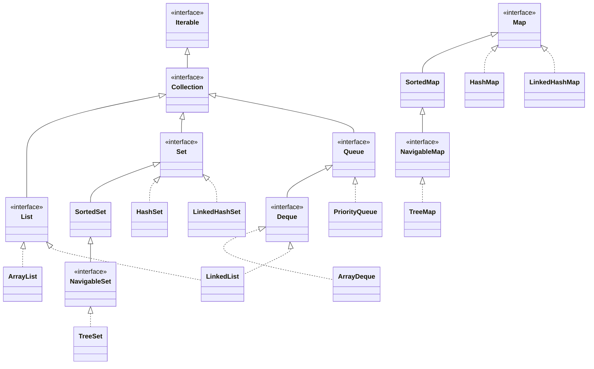
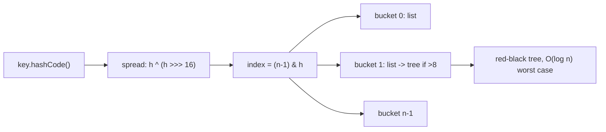

# Collections Framework

> Where this fits in the project: Phase 1 of our Distributed Task Queue lives entirely in memory. Before we reach for a `BlockingQueue` (see [../06-concurrency/blocking-queue.md](../06-concurrency/blocking-queue.md)) or PostgreSQL, every `Task` we accept must be *stored*, *indexed by status and type*, and *ordered by priority* using the right in-memory data structures. This chapter is the data-structure backbone of the whole platform.

---

## 1. Why This Exists

You have solved 1000+ DSA problems, so you already know arrays, hash tables, balanced trees, and heaps cold. The Java Collections Framework (JCF) is the *standard library packaging* of those abstractions: a small set of interfaces (`List`, `Set`, `Map`, `Queue`, `Deque`) backed by interchangeable implementations (`ArrayList`, `HashMap`, `TreeMap`, `ArrayDeque`, `PriorityQueue`, …).

The real problem it solves is **decoupling the contract from the data structure**. Before JCF (Java 1.0–1.1), people passed around raw `Vector`, `Hashtable`, and arrays, and every library invented its own incompatible container types. Joshua Bloch's JCF (Java 1.2, 1998) fixed this by defining:

- **Interfaces** describing *what* a collection does (`List` = ordered, indexable, duplicates allowed).
- **Implementations** describing *how* (`ArrayList` = backed by a growable array).
- **Algorithms** as static methods (`Collections.sort`, `Collections.binarySearch`).

Because your worker pool, scheduler, and repository all program against the *interface*, you can swap an `ArrayList` for a `LinkedList`, or a `HashMap` for a `ConcurrentHashMap`, without touching call sites. That swap-ability is the entire point — and it is what lets our `TaskQueue` evolve from `InMemoryTaskQueue` (Phase 1) to `PostgresTaskQueue` (Phase 2) to a distributed broker (Phase 4) while the `Worker` code stays put.



> **Note:** `Map` is deliberately *not* a subtype of `Collection`. A map is a set of key→value associations, not a collection of single elements. Keep this in your head; it explains why `Map` has no `iterator()` and you iterate `entrySet()`, `keySet()`, or `values()` instead.

---

## 2. The Naive Version

Our first cut at "store all tasks and find them" uses a single `ArrayList` and linear scans. Drawn straight from an early Phase 1 prototype:

```java
import java.time.Instant;
import java.util.ArrayList;
import java.util.List;

// enum from the canonical model
enum TaskStatus { PENDING, SCHEDULED, RUNNING, SUCCEEDED, FAILED, RETRYING, DEAD }

record Task(String id, String type, String payload, TaskStatus status,
            int attempts, int maxAttempts, Instant createdAt,
            Instant scheduledAt, int priority) {}

// The naive store: one flat list, everything is a scan.
class NaiveTaskStore {
    private final List<Task> tasks = new ArrayList<>();

    void add(Task t) { tasks.add(t); }                       // O(1) amortized

    Task findById(String id) {                               // O(n) -- bad
        for (Task t : tasks) {
            if (t.id().equals(id)) return t;
        }
        return null;
    }

    List<Task> findByStatus(TaskStatus status) {             // O(n) every call
        List<Task> out = new ArrayList<>();
        for (Task t : tasks) {
            if (t.status() == status) out.add(t);
        }
        return out;
    }

    Task highestPriority() {                                 // O(n) every call
        Task best = null;
        for (Task t : tasks) {
            if (best == null || t.priority() > best.priority()) best = t;
        }
        return best;
    }
}
```

**Why this is bad:**

- `findById` is **O(n)**. With 1,000,000 queued tasks, a single lookup walks a million records. The API's `GET /tasks/{id}` becomes a table scan.
- `findByStatus` is **O(n)** *and* allocates a fresh list each call.
- `highestPriority` is **O(n)**; pulling the next task to run — the hot path of the worker loop — is linear in the backlog.
- Returning a raw `null` instead of `Optional<Task>` invites `NullPointerException` (we fix that with the canonical `Optional<Task> findById(...)` signature; see [chapter-06-exceptions.md](chapter-06-exceptions.md) for why nullable returns are a liability).

The DSA instinct is correct: we need a hash index for id lookups and a heap for priority. JCF gives us both off the shelf.

---

## 3. Improved Version

Index by id with a `HashMap`, and use a `PriorityQueue` for the run order. We accept some redundancy (a task lives in two structures) in exchange for fast lookups.

```java
import java.util.*;

class IndexedTaskStore {
    // id -> Task : O(1) average lookup
    private final Map<String, Task> byId = new HashMap<>();

    // max-heap by priority for "what runs next"
    private final PriorityQueue<Task> byPriority =
        new PriorityQueue<>(Comparator.comparingInt(Task::priority).reversed());

    void add(Task t) {
        byId.put(t.id(), t);          // O(1) avg
        byPriority.offer(t);          // O(log n)
    }

    Optional<Task> findById(String id) {
        return Optional.ofNullable(byId.get(id));   // O(1) avg, null-safe
    }

    Optional<Task> pollHighestPriority() {
        return Optional.ofNullable(byPriority.poll()); // O(log n)
    }

    int size() { return byId.size(); }
}
```

This is dramatically better for the hot paths: id lookup and "next to run" are now O(1) and O(log n). But there is still a gap — `findByStatus` is missing, and if we add it as a scan over `byId.values()` it stays O(n). When the worker marks a task `RUNNING` or `SUCCEEDED`, the heap and id index can also drift out of sync (the heap still holds the *old* record). We address both in the production version.

---

## 4. Production-Quality Version

A staff engineer ships a store that maintains **multiple consistent indexes**: by id (`HashMap`), by status (`EnumMap<TaskStatus, ...>` of `LinkedHashSet`s to preserve FIFO and dedup), by type (`HashMap` of sets), and a priority view (`PriorityQueue`). Mutations go through one method so indexes never drift. We keep it single-threaded here; the thread-safe version arrives in [../06-concurrency/concurrent-collections.md](../06-concurrency/concurrent-collections.md).

```java
import java.time.Instant;
import java.util.*;

/**
 * In-memory, multi-indexed task store for Phase 1.
 * - id index:     O(1) avg lookup by id
 * - status index: O(1) avg "all tasks in status X" (returns a live-but-copied view)
 * - type index:   O(1) avg "all tasks of type X"
 * - priority view: O(log n) pull of the highest-priority PENDING task
 *
 * NOT thread-safe by design; see concurrent-collections.md for the safe variant.
 */
final class TaskStore {

    private final Map<String, Task> byId = new HashMap<>();

    // EnumMap is an array-backed map keyed by enum ordinal: tiny and fast.
    // LinkedHashSet gives O(1) add/remove/contains AND stable insertion order (FIFO within a status).
    private final EnumMap<TaskStatus, LinkedHashSet<String>> byStatus =
        new EnumMap<>(TaskStatus.class);

    private final Map<String, LinkedHashSet<String>> byType = new HashMap<>();

    // Max-heap on priority, tie-broken by createdAt (older first) for fairness.
    private final PriorityQueue<Task> pending = new PriorityQueue<>(
        Comparator.comparingInt(Task::priority).reversed()
                  .thenComparing(Task::createdAt));

    TaskStore() {
        for (TaskStatus s : TaskStatus.values()) {
            byStatus.put(s, new LinkedHashSet<>());
        }
    }

    /** Insert a brand-new task. */
    void add(Task t) {
        Objects.requireNonNull(t, "task");
        if (byId.putIfAbsent(t.id(), t) != null) {
            throw new IllegalStateException("duplicate task id: " + t.id());
        }
        byStatus.get(t.status()).add(t.id());
        byType.computeIfAbsent(t.type(), k -> new LinkedHashSet<>()).add(t.id());
        if (t.status() == TaskStatus.PENDING) pending.offer(t);
    }

    /** Replace a task with a new immutable version (records are immutable). */
    void update(Task updated) {
        Task old = byId.get(updated.id());
        if (old == null) throw new NoSuchElementException("unknown id: " + updated.id());
        if (old.status() != updated.status()) {
            byStatus.get(old.status()).remove(updated.id());
            byStatus.get(updated.status()).add(updated.id());
        }
        byId.put(updated.id(), updated);
        // Lazy heap fix-up: we re-offer if the new state is PENDING; stale entries
        // are skipped at poll time (see pollNextPending).
        if (updated.status() == TaskStatus.PENDING) pending.offer(updated);
    }

    Optional<Task> findById(String id) {
        return Optional.ofNullable(byId.get(id));
    }

    /** Snapshot of all tasks currently in a status. Defensive copy = callers cannot corrupt the index. */
    List<Task> findByStatus(TaskStatus status) {
        return byStatus.get(status).stream()
                .map(byId::get)
                .toList(); // Java 16+: immutable list
    }

    List<Task> findByType(String type) {
        return byType.getOrDefault(type, new LinkedHashSet<>()).stream()
                .map(byId::get)
                .toList();
    }

    /**
     * Pull the highest-priority PENDING task. Uses lazy deletion: a heap entry
     * whose current byId record is no longer PENDING (or whose snapshot is stale)
     * is discarded. Amortized O(log n).
     */
    Optional<Task> pollNextPending() {
        Task head;
        while ((head = pending.poll()) != null) {
            Task current = byId.get(head.id());
            if (current != null
                    && current.status() == TaskStatus.PENDING
                    && current.equals(head)) {        // skip stale duplicates
                return Optional.of(current);
            }
        }
        return Optional.empty();
    }

    int size() { return byId.size(); }
}
```

**Why this is the shippable version:**

- Every read the API and workers actually make (`findById`, `findByStatus`, `pollNextPending`) is O(1) or O(log n), not O(n).
- `EnumMap` is the canonical "map keyed by enum" — internally an array indexed by `ordinal()`, so it is faster and smaller than a `HashMap<TaskStatus, ...>` with zero hashing.
- `LinkedHashSet` per status buys **dedup + FIFO ordering** at O(1) per operation, which a plain `ArrayList` cannot (its `remove(Object)` is O(n)).
- `computeIfAbsent` removes the classic "check-then-put" race-prone, verbose idiom.
- Defensive copies (`.toList()` returns immutable) prevent callers from mutating our internal indexes — encapsulation, see [chapter-02-encapsulation.md](chapter-02-encapsulation.md).
- **Lazy deletion** in the heap avoids the O(n) cost of `PriorityQueue.remove(Object)` on status changes; we just skip stale entries when polling.

---

## 5. Code Walkthrough

### Beginner: the five workhorse collections

```java
import java.util.*;

public class CollectionsBasics {
    public static void main(String[] args) {
        // List: ordered, indexable, duplicates OK
        List<String> log = new ArrayList<>();
        log.add("task-1 enqueued");
        log.add("task-1 enqueued");          // duplicate allowed
        System.out.println(log.get(0));      // O(1) random access

        // Set: no duplicates, no positional access
        Set<String> seenTypes = new HashSet<>();
        seenTypes.add("email");
        seenTypes.add("email");              // ignored
        System.out.println(seenTypes.size()); // 1

        // Map: key -> value
        Map<String, Integer> attemptsByTask = new HashMap<>();
        attemptsByTask.put("task-1", 0);
        attemptsByTask.merge("task-1", 1, Integer::sum); // increment
        System.out.println(attemptsByTask.get("task-1")); // 1

        // Queue (FIFO) via ArrayDeque
        Queue<String> fifo = new ArrayDeque<>();
        fifo.offer("a"); fifo.offer("b");
        System.out.println(fifo.poll());     // "a"

        // Deque used as a stack (LIFO)
        Deque<String> stack = new ArrayDeque<>();
        stack.push("a"); stack.push("b");
        System.out.println(stack.pop());     // "b"
    }
}
```

### Intermediate: TreeMap for time-ordered scheduling + PriorityQueue for priority

The `TaskScheduler` (canonical model) needs "give me all tasks due at or before now". A `TreeMap` keyed by `scheduledAt` answers range queries in O(log n) per boundary.

```java
import java.time.Instant;
import java.util.*;

class ScheduleIndex {
    // NavigableMap keeps keys sorted; we can ask for "everything up to now".
    private final NavigableMap<Instant, List<Task>> dueAt = new TreeMap<>();

    void schedule(Task t) {
        dueAt.computeIfAbsent(t.scheduledAt(), k -> new ArrayList<>()).add(t);
    }

    /** All tasks whose scheduledAt <= now, removed from the index. O(log n + k). */
    List<Task> pollDue(Instant now) {
        // headMap(now, inclusive=true) is a live view of keys <= now
        NavigableMap<Instant, List<Task>> due = dueAt.headMap(now, true);
        List<Task> out = new ArrayList<>();
        Iterator<Map.Entry<Instant, List<Task>>> it = due.entrySet().iterator();
        while (it.hasNext()) {
            out.addAll(it.next().getValue());
            it.remove(); // removing through the view removes from the backing TreeMap
        }
        return out;
    }
}
```

```java
// PriorityQueue: highest-priority task runs first; ties broken by age.
PriorityQueue<Task> runQueue = new PriorityQueue<>(
    Comparator.comparingInt(Task::priority).reversed()
              .thenComparing(Task::createdAt));
runQueue.offer(highTask);   // priority 9
runQueue.offer(lowTask);    // priority 1
Task next = runQueue.poll();  // highTask, O(log n)
```

> `TreeMap.headMap(now, true)` returns a *view*, not a copy. Mutating through the view (here via `it.remove()`) writes back to the backing map. That is the cheapest way to drain due tasks without scanning the whole schedule.

### Production-inspired: `InMemoryTaskQueue` skeleton using a blocking, priority-ordered queue

This is the Phase 1 `TaskQueue` implementation. It combines a `PriorityBlockingQueue` (concurrency-safe priority heap) so workers can block waiting for work. Full concurrency treatment is in [../06-concurrency/blocking-queue.md](../06-concurrency/blocking-queue.md); here we focus on the collection choice.

```java
import java.util.Comparator;
import java.util.concurrent.PriorityBlockingQueue;

interface TaskQueue {
    void enqueue(Task t);
    Task dequeue() throws InterruptedException;
    int size();
}

final class InMemoryTaskQueue implements TaskQueue {

    // Priority order: higher priority first, older first on ties.
    private static final Comparator<Task> ORDER =
        Comparator.comparingInt(Task::priority).reversed()
                  .thenComparing(Task::createdAt);

    // Unbounded, thread-safe, blocking on take(). Backed by a binary heap.
    private final PriorityBlockingQueue<Task> queue =
        new PriorityBlockingQueue<>(64, ORDER);

    @Override public void enqueue(Task t) {
        queue.offer(t);                 // O(log n), never blocks (unbounded)
    }

    @Override public Task dequeue() throws InterruptedException {
        return queue.take();            // O(log n), blocks until an element exists
    }

    @Override public int size() {
        return queue.size();            // O(1)
    }
}
```

> Note: `PriorityBlockingQueue` is **unbounded** — `offer` always succeeds, so it does not apply backpressure. For Phase 3 we revisit this with bounded queues and a `RateLimiter`; see [../08-distributed-systems/backpressure.md](../08-distributed-systems/backpressure.md).

---

## 6. The `equals` / `hashCode` Contract (Critical for Sets and Maps)

Hash-based (`HashSet`, `HashMap`) and the `contains`/`remove` semantics of sets depend entirely on `equals` and `hashCode`. If you put `Task` objects directly into a `HashSet` or use them as `HashMap` keys, you **must** honor the contract:

1. **Consistency:** `a.equals(a)` is true (reflexive); `a.equals(b) == b.equals(a)` (symmetric); if `a.equals(b)` and `b.equals(c)` then `a.equals(c)` (transitive).
2. **`equals` ⇒ equal hashCodes:** if `a.equals(b)`, then `a.hashCode() == b.hashCode()`. The converse need **not** hold (collisions are allowed).
3. **Stability:** as long as the fields used in `equals` do not change, `hashCode` must not change.

The lethal mistake is **using a mutable field in `hashCode`** and then mutating it while the object sits in a hash set — the object lands in the wrong bucket and becomes unfindable.

```java
// BROKEN: hashes on a mutable field (status), then mutates it.
final class MutableTask {
    String id; TaskStatus status;
    @Override public boolean equals(Object o) {
        return o instanceof MutableTask m && id.equals(m.id) && status == m.status;
    }
    @Override public int hashCode() { return Objects.hash(id, status); }
}
// Put it in a HashSet as PENDING, then set status = RUNNING:
// the set can no longer find it -> contains() returns false, remove() leaks it.
```

**The fix our canonical `Task` already gives us:** `Task` is a **`record`**, and records auto-generate `equals` and `hashCode` over *all* components. Two records are equal iff every component is equal. Since we model status transitions by creating a *new* `Task` (immutability — see [../03-java-memory-model/immutable-objects.md](../03-java-memory-model/immutable-objects.md)), the value in the set never mutates underneath us.

But there is a subtlety: a record's `hashCode` includes `status`, `attempts`, `scheduledAt`, etc. So two `Task` snapshots with the same `id` but different `status` are **not equal**. That is exactly why in `TaskStore` we index by `String id`, not by `Task` — *identity in our domain is the id*, not the whole value. **Rule of thumb: key your maps on the stable identity (`id`), never on a mutable value object.**

If you genuinely need a set/map keyed on domain identity, override to use *only* `id`:

```java
// A thin identity wrapper if you must put Tasks in a Set keyed by domain identity.
record TaskKey(String id) {}                  // record over the immutable id only
Set<TaskKey> deduped = new HashSet<>();
deduped.add(new TaskKey(task.id()));          // dedup by id, ignoring mutable fields
```

---

## 7. How This Applies to Our Task Queue Project

| Canonical component | Collection choice | Why |
|---|---|---|
| `InMemoryTaskQueue` | `PriorityBlockingQueue<Task>` | priority order + blocking workers, thread-safe |
| `TaskStore` id index | `HashMap<String, Task>` | O(1) `findById` for `GET /tasks/{id}` |
| status index | `EnumMap<TaskStatus, LinkedHashSet<String>>` | O(1) per status, FIFO + dedup, tiny memory |
| type index | `HashMap<String, LinkedHashSet<String>>` | O(1) "all tasks of type email" |
| priority view | `PriorityQueue<Task>` | O(log n) "what runs next" |
| `TaskScheduler` due-index | `TreeMap<Instant, List<Task>>` / `DelayQueue` | O(log n) range query "due ≤ now" |
| dedup of seen ids | `HashSet<String>` | idempotency guard, see [../08-distributed-systems/idempotency.md](../08-distributed-systems/idempotency.md) |
| `Worker` handler lookup | `Map<String, TaskHandler>` | O(1) dispatch by `task.type()` |

The `Worker`'s dispatch loop ties it together:

```java
import java.util.Map;
import java.util.concurrent.ConcurrentHashMap;

final class Worker implements Runnable {
    private final TaskQueue queue;
    private final Map<String, TaskHandler> handlers; // type -> handler, O(1) dispatch
    private volatile boolean running = true;

    Worker(TaskQueue queue, Map<String, TaskHandler> handlers) {
        this.queue = queue;
        this.handlers = handlers;
    }

    @Override public void run() {
        while (running) {
            try {
                Task task = queue.dequeue();             // blocks
                TaskHandler handler = handlers.get(task.type()); // O(1)
                if (handler == null) {
                    System.err.println("no handler for type " + task.type());
                    continue;
                }
                TaskResult result = handler.handle(task);
                // outcome handling (retry/DLQ) covered in retry & dlq chapters
            } catch (InterruptedException e) {
                Thread.currentThread().interrupt();
                running = false;
            } catch (Exception e) {
                // treat as failure; see retries.md
            }
        }
    }
    void stop() { running = false; }
}

// canonical functional interface + result record
@FunctionalInterface interface TaskHandler { TaskResult handle(Task task) throws Exception; }
record TaskResult(boolean success, String message, boolean retryable) {}
```

> The handler registry is a `ConcurrentHashMap` because many workers read it concurrently; see [../06-concurrency/concurrent-collections.md](../06-concurrency/concurrent-collections.md).

---

## 8. Tradeoffs

### ArrayList vs LinkedList

| Operation | `ArrayList` | `LinkedList` |
|---|---|---|
| `get(i)` random access | **O(1)** | O(n) |
| `add` at end (amortized) | **O(1)** | O(1) |
| `add`/`remove` at head | O(n) | **O(1)** |
| `remove(Object)` | O(n) | O(n) |
| insert in middle (have iterator) | O(n) | **O(1)** |
| memory per element | low (one ref) | high (node + 2 refs) |
| cache locality | **excellent** | poor (pointer chasing) |

**Verdict:** Default to `ArrayList`. `LinkedList`'s theoretical wins (head insert, mid-list splice) are real only when you already hold an iterator at the position, and its terrible cache behavior usually loses in practice. For a FIFO queue, use **`ArrayDeque`, not `LinkedList`** — `ArrayDeque` is faster and uses less memory.

### HashMap vs TreeMap vs LinkedHashMap

| | `HashMap` | `TreeMap` | `LinkedHashMap` |
|---|---|---|---|
| get/put | O(1) avg | O(log n) | O(1) avg |
| ordering | none | **sorted by key** | insertion (or access) order |
| range queries (`headMap`/`subMap`) | no | **yes** | no |
| null key | one allowed | not allowed | one allowed |
| use in our project | id/type index | schedule by `Instant` | LRU cache, stable iteration |

### HashSet vs LinkedHashSet vs TreeSet

`HashSet` = fastest, unordered. `LinkedHashSet` = O(1) ops + predictable iteration order (we use it per-status). `TreeSet` = sorted, O(log n), needed when you want `first()`/`last()`/`ceiling()`.

### HashMap internals at a glance

A `HashMap` is an array of *buckets*. `index = (n - 1) & hash(key)` where `hash(key)` spreads `key.hashCode()` (it XORs high bits down). Collisions chain in a linked list; once a bucket exceeds **8 entries** (`TREEIFY_THRESHOLD`) and the table is ≥ 64, that bucket converts to a **red-black tree**, bounding worst-case lookup at O(log n) instead of O(n) under a hash-flooding attack. Default load factor is **0.75**: at 75% full the table doubles and rehashes. Sizing a map you know will hold ~N entries to `new HashMap<>((int)(N / 0.75) + 1)` avoids repeated resizes.



---

## 9. Common Mistakes and Pitfalls

- **Using `LinkedList` as a queue.** Use `ArrayDeque`. *Fix:* `Queue<T> q = new ArrayDeque<>();`
- **Calling `list.remove(int)` vs `list.remove(Object)` confusion.** `remove(2)` removes index 2; `remove(Integer.valueOf(2))` removes the value 2. *Fix:* be explicit with boxing.
- **`ConcurrentModificationException`** from mutating a collection during a `for-each`. *Fix:* use `Iterator.remove()`, `removeIf(...)`, or iterate a copy.
- **Mutable keys / hashing on mutable fields.** Object gets lost in the map. *Fix:* immutable keys; key on stable id (our `Task` is a record + we key on `id`).
- **Forgetting `hashCode` when overriding `equals`.** Hash collections silently break. *Fix:* override both, or use a `record`. IDE/`Objects.hash` generates them.
- **`Arrays.asList(arr)` returns a fixed-size list** — `add`/`remove` throw `UnsupportedOperationException`. *Fix:* `new ArrayList<>(Arrays.asList(arr))` or `List.of(...)` if you want truly immutable.
- **`List.of`, `Map.of`, `Set.of` are immutable and reject nulls** — calling `add` throws. *Fix:* know they are immutable; wrap if you need mutability.
- **Returning internal collections directly,** letting callers mutate your invariants. *Fix:* return `.toList()`/`Collections.unmodifiableList(...)` or a defensive copy.
- **Assuming `HashMap` ordering is stable.** It is not, and changes across Java versions. *Fix:* use `LinkedHashMap`/`TreeMap` if order matters.
- **`PriorityQueue` iteration is not sorted.** Only `poll()` returns elements in priority order; `for-each` over a PQ yields heap (array) order. *Fix:* poll repeatedly, or copy and sort.
- **Boxing in hot loops** (`Map<Integer,...>` keys autoboxing). *Fix:* be aware of allocation; prefer primitive specializations from libraries when it matters.

---

## 10. Refactoring Exercise

**Bad** — O(n) lookups, null returns, leaks internal state:

```java
class TaskRegistryBad {
    private final List<Task> tasks = new ArrayList<>();
    void add(Task t) { tasks.add(t); }
    Task get(String id) {
        for (Task t : tasks) if (t.id().equals(id)) return t; // O(n)
        return null;                                          // null leak
    }
    List<Task> all() { return tasks; }                        // exposes internals
}
```

**Improved** — O(1) lookup, `Optional`, defensive copy:

```java
class TaskRegistryBetter {
    private final Map<String, Task> byId = new HashMap<>();
    void add(Task t) { byId.put(t.id(), t); }                 // O(1) avg
    Optional<Task> get(String id) { return Optional.ofNullable(byId.get(id)); }
    List<Task> all() { return List.copyOf(byId.values()); }   // immutable copy
}
```

**Production** — multi-index, dedup guard, status filter, immutable snapshots:

```java
final class TaskRegistry {
    private final Map<String, Task> byId = new HashMap<>();
    private final EnumMap<TaskStatus, LinkedHashSet<String>> byStatus =
        new EnumMap<>(TaskStatus.class);

    TaskRegistry() {
        for (TaskStatus s : TaskStatus.values()) byStatus.put(s, new LinkedHashSet<>());
    }

    void add(Task t) {
        Objects.requireNonNull(t, "task");
        if (byId.putIfAbsent(t.id(), t) != null)
            throw new IllegalStateException("duplicate id " + t.id());
        byStatus.get(t.status()).add(t.id());
    }

    Optional<Task> get(String id) { return Optional.ofNullable(byId.get(id)); }

    List<Task> byStatus(TaskStatus s) {
        return byStatus.get(s).stream().map(byId::get).toList();
    }

    int size() { return byId.size(); }
}
```

---

## 11. Exercises

### Easy

- **E1 (knowledge check).** Which collection would you pick, and why, for: (a) FIFO worker queue, (b) "is this task id already seen?", (c) "tasks due before now", (d) "task that should run next by priority"?
- **E2 (coding).** Implement `Map<String,Integer> countByType(List<Task> tasks)` returning how many tasks exist per `type`, using `merge`.

### Medium

- **M1 (coding).** Implement `List<Task> topK(Collection<Task> tasks, int k)` returning the `k` highest-priority tasks using a *min*-heap of size `k` (O(n log k)).
- **M2 (refactoring).** Given `TaskRegistryBad` from §10, add an O(1) `findByType(String)` without changing the public method's complexity to O(n).
- **M3 (design).** A `Task`'s `status` changes over its lifetime. Explain why you must **not** store `Task` records as `HashSet` elements if you want to "find the same logical task" after a status change, and what to key on instead.

### Hard

- **H1 (interview-style).** Design an in-memory index supporting all of: `findById` O(1), `findByStatus` O(1) to the result set, `pollHighestPriority` O(log n), and `pollDueBefore(Instant)` O(log n + k). State each structure and the consistency strategy when a task changes status.
- **H2 (stretch).** Implement a fixed-capacity LRU cache for hot tasks using `LinkedHashMap` access-order mode by overriding `removeEldestEntry`. It must evict the least-recently-accessed entry when capacity is exceeded.

---

## 12. Solutions

**E1.** (a) `ArrayDeque` as a `Queue` (fast, low memory FIFO). (b) `HashSet<String>` of ids — O(1) membership. (c) `TreeMap<Instant, List<Task>>` — range query via `headMap`. (d) `PriorityQueue<Task>` ordered by priority — O(log n) `poll`.

**E2.**

```java
static Map<String, Integer> countByType(List<Task> tasks) {
    Map<String, Integer> counts = new HashMap<>();
    for (Task t : tasks) counts.merge(t.type(), 1, Integer::sum);
    return counts;
}
```

**M1.** Keep a min-heap of size `k`; if a task beats the current minimum, swap it in.

```java
static List<Task> topK(Collection<Task> tasks, int k) {
    if (k <= 0) return List.of();
    PriorityQueue<Task> minHeap =
        new PriorityQueue<>(Comparator.comparingInt(Task::priority)); // min by priority
    for (Task t : tasks) {
        if (minHeap.size() < k) {
            minHeap.offer(t);
        } else if (t.priority() > minHeap.peek().priority()) {
            minHeap.poll();
            minHeap.offer(t);
        }
    }
    // drain; heap yields ascending priority, so reverse for descending
    List<Task> out = new ArrayList<>(minHeap);
    out.sort(Comparator.comparingInt(Task::priority).reversed());
    return out;
}
```

Complexity: O(n log k) time, O(k) space — strictly better than sorting everything (O(n log n)) when k ≪ n.

**M2.** Add a parallel `Map<String, List<Task>> byType` maintained in `add`:

```java
class TaskRegistryM2 {
    private final Map<String, Task> byId = new HashMap<>();
    private final Map<String, List<Task>> byType = new HashMap<>();
    void add(Task t) {
        byId.put(t.id(), t);
        byType.computeIfAbsent(t.type(), k -> new ArrayList<>()).add(t);
    }
    Optional<Task> get(String id) { return Optional.ofNullable(byId.get(id)); }
    List<Task> findByType(String type) {
        return List.copyOf(byType.getOrDefault(type, List.of())); // O(1) lookup + O(m) copy
    }
}
```

**M3.** A record's `equals`/`hashCode` cover **all** components including the mutable-over-time `status`, `attempts`, etc. After a status transition you create a *new* `Task` value with a *different* hash, so the old snapshot in a `HashSet<Task>` is a different element — you cannot find "the task" by a fresh snapshot, and the stale one lingers. Key on the **stable domain identity, `id`** (e.g., `HashSet<String>` of ids, or `HashMap<String, Task>`), so identity survives value changes.

**H1.** Four coordinated structures, all mutated through one `update` method to stay consistent:

```java
final class FullIndex {
    private final Map<String, Task> byId = new HashMap<>();                  // findById O(1)
    private final EnumMap<TaskStatus, LinkedHashSet<String>> byStatus =      // findByStatus O(1)
        new EnumMap<>(TaskStatus.class);
    private final PriorityQueue<Task> pq = new PriorityQueue<>(              // pollHighest O(log n)
        Comparator.comparingInt(Task::priority).reversed().thenComparing(Task::createdAt));
    private final NavigableMap<Instant, List<Task>> due = new TreeMap<>();   // pollDueBefore O(log n + k)

    FullIndex() { for (TaskStatus s : TaskStatus.values()) byStatus.put(s, new LinkedHashSet<>()); }

    void add(Task t) {
        byId.put(t.id(), t);
        byStatus.get(t.status()).add(t.id());
        if (t.status() == TaskStatus.PENDING) pq.offer(t);
        if (t.status() == TaskStatus.SCHEDULED)
            due.computeIfAbsent(t.scheduledAt(), k -> new ArrayList<>()).add(t);
    }
    void transition(Task updated) {                 // single mutation point keeps indexes consistent
        Task old = byId.put(updated.id(), updated);
        if (old != null && old.status() != updated.status())
            byStatus.get(old.status()).remove(updated.id());
        byStatus.get(updated.status()).add(updated.id());
        if (updated.status() == TaskStatus.PENDING) pq.offer(updated); // lazy delete on poll
    }
    Optional<Task> findById(String id) { return Optional.ofNullable(byId.get(id)); }
    List<Task> findByStatus(TaskStatus s) { return byStatus.get(s).stream().map(byId::get).toList(); }
    Optional<Task> pollHighest() {
        Task h;
        while ((h = pq.poll()) != null) {
            Task cur = byId.get(h.id());
            if (cur != null && cur.status() == TaskStatus.PENDING && cur.equals(h)) return Optional.of(cur);
        }
        return Optional.empty();
    }
    List<Task> pollDueBefore(Instant now) {
        NavigableMap<Instant, List<Task>> head = due.headMap(now, true);
        List<Task> out = new ArrayList<>();
        Iterator<List<Task>> it = head.values().iterator();
        while (it.hasNext()) { out.addAll(it.next()); it.remove(); }
        return out;
    }
}
```

Consistency strategy: status changes go through `transition`, which removes the id from the old status bucket and adds to the new. The heap uses **lazy deletion** — stale entries are skipped at `poll` time by re-checking `byId`. This avoids O(n) `PriorityQueue.remove`.

**H2.** LRU cache via `LinkedHashMap` in access-order mode:

```java
final class LruTaskCache extends LinkedHashMap<String, Task> {
    private final int capacity;
    LruTaskCache(int capacity) {
        super(16, 0.75f, true);   // accessOrder = true -> get() moves entry to MRU end
        this.capacity = capacity;
    }
    @Override protected boolean removeEldestEntry(Map.Entry<String, Task> eldest) {
        return size() > capacity; // evict LRU when over capacity
    }
}
// Usage:
LruTaskCache cache = new LruTaskCache(2);
cache.put("a", taskA); cache.put("b", taskB);
cache.get("a");           // touch "a" -> "b" is now eldest
cache.put("c", taskC);    // evicts "b"
// cache.keySet() == [a, c]
```

This is O(1) for get/put/evict. It is the textbook in-memory hot-task cache; for production swap to Caffeine or Guava `Cache` for size/time eviction and stats.

---

## 13. Interview Questions and Takeaways

1. **Q: `ArrayList` vs `LinkedList` — when is `LinkedList` actually better?**
   A: Almost never in practice. Only when you do many inserts/removals at a position you already hold an iterator to, and never need random access. Its cache misses usually dominate. Default to `ArrayList`; use `ArrayDeque` for queues/stacks.

2. **Q: Walk me through a `HashMap` lookup.**
   A: Compute `hashCode()`, spread it (`h ^ (h >>> 16)`), index with `(n-1) & h`. Within the bucket, compare with `equals`. Buckets are linked lists, converting to red-black trees past 8 entries (table ≥ 64), bounding worst case at O(log n). Resizes (double) at load factor 0.75.

3. **Q: What is the `equals`/`hashCode` contract and what breaks if you violate it?**
   A: Equal objects must have equal hash codes; equality must be reflexive/symmetric/transitive/consistent. Violate it and `HashSet`/`HashMap` lose elements — `contains` returns false for an object that is "in" the set, and entries leak. Mutating a field used in `hashCode` while the object is in a hash structure is the classic bug.

4. **Q: Why is `Map` not a `Collection`?**
   A: A map is key→value associations, not a bag of single elements. It exposes its contents as collection *views*: `keySet()`, `values()`, `entrySet()`.

5. **Q: `HashMap` vs `TreeMap` vs `LinkedHashMap`?**
   A: `HashMap` O(1) unordered; `TreeMap` O(log n) sorted with range queries (`headMap`/`subMap`/`ceilingKey`); `LinkedHashMap` O(1) with insertion or access order (LRU). Choose by whether you need ordering or range queries.

6. **Q: How does `PriorityQueue` order elements, and does iteration return them sorted?**
   A: It's a binary min-heap (by natural order or comparator). Only `poll`/`peek` respect priority; iteration returns internal heap/array order, *not* sorted.

7. **Q: How do you get a thread-safe priority queue / map?**
   A: `PriorityBlockingQueue` for queues; `ConcurrentHashMap` for maps. `Collections.synchronizedMap` wraps with a single lock but you still must synchronize during iteration. See [../06-concurrency/concurrent-collections.md](../06-concurrency/concurrent-collections.md).

8. **Q: What's the difference between `Arrays.asList`, `List.of`, and `new ArrayList<>()`?**
   A: `Arrays.asList` is fixed-size, backed by the array, allows set but not add/remove, allows nulls. `List.of` is fully immutable and rejects nulls. `new ArrayList<>()` is fully mutable.

---

## 14. Production Considerations

- **Memory and GC.** A million `Task` records plus three indexes is real heap. Each `HashMap.Entry` carries overhead (~32–48 bytes) on top of key/value. Size maps up front; prefer `EnumMap` for enum keys; avoid boxing. Monitor heap; see [../03-java-memory-model/garbage-collection.md](../03-java-memory-model/garbage-collection.md).
- **Unbounded growth.** A plain in-memory store grows without limit and will OOM under backlog. Phase 2 moves persistence to PostgreSQL (`PostgresTaskQueue`, `TaskRepository`); the in-memory index becomes a bounded cache. Apply backpressure (bounded queues) — see [../08-distributed-systems/backpressure.md](../08-distributed-systems/backpressure.md).
- **Iteration safety under concurrency.** Iterating a non-concurrent collection while another thread mutates it throws `ConcurrentModificationException` (fail-fast) or, worse, corrupts state. Use `ConcurrentHashMap`/`CopyOnWriteArrayList`/`PriorityBlockingQueue`.
- **`PriorityQueue` fairness.** A flood of high-priority tasks can starve low-priority ones forever. Production schedulers add aging (boost priority with wait time) — our comparator's `thenComparing(createdAt)` is a first step.
- **Lazy-deletion heap growth.** The lazy-delete trick can let the heap accumulate stale entries if churn is high. Periodically compact (rebuild the PQ from live PENDING tasks) when `pq.size()` greatly exceeds the live PENDING count.
- **Snapshot cost.** `findByStatus` returns a defensive copy; for a status holding millions of tasks that copy is expensive. Paginate (`pollDue(int n)` from the canonical `TaskRepository`) instead of materializing everything.
- **Hash flooding.** If task ids or types came from untrusted input, adversarial keys could force collisions; the tree-bucket fallback caps this at O(log n). Still, validate/normalize external keys.

---

## What We Can Improve In Our Project Using This Concept

Replace the Phase 1 prototype's single `ArrayList<Task>` with a multi-indexed `TaskStore`: a `HashMap<String,Task>` id index, an `EnumMap<TaskStatus, LinkedHashSet<String>>` status index, a `HashMap<String, LinkedHashSet<String>>` type index, and a `PriorityBlockingQueue<Task>` for the run order. This turns `GET /tasks/{id}`, status filtering, and "next to run" from O(n) scans into O(1)/O(log n) operations, and removes null-returning APIs in favor of `Optional<Task>`.

## Project Refactoring Task

1. Introduce `TaskStore` (from §4) and route all reads/writes through it.
2. Make `InMemoryTaskQueue` back its priority order with the shared `Comparator<Task>` (priority desc, createdAt asc).
3. Change `TaskStore.findById` to return `Optional<Task>` and update the controller accordingly.
4. Add `findByStatus` and `findByType` backed by the new indexes; have them return immutable snapshots.
5. Write JUnit 5 + AssertJ tests: id lookup, duplicate-id rejection, status-bucket consistency after `update`, and priority ordering of `pollNextPending`.

## Git Commit For This Chapter

```text
feat(store): add multi-indexed in-memory TaskStore with O(1) lookups

Replace flat ArrayList task storage with id/status/type indexes and a
priority view. findById now returns Optional<Task>; status/type queries
return immutable snapshots. InMemoryTaskQueue uses the shared priority
comparator (priority desc, createdAt asc).

Files touched:
- src/main/java/com/taskqueue/store/TaskStore.java        (new)
- src/main/java/com/taskqueue/queue/InMemoryTaskQueue.java
- src/main/java/com/taskqueue/api/TaskController.java
- src/test/java/com/taskqueue/store/TaskStoreTest.java     (new)
```

## Architecture Impact

The storage layer gains a clear, swappable seam. By keeping all reads behind `TaskStore`/`TaskRepository` interfaces, Phase 2 can drop in a `PostgresTaskQueue` and JDBC `TaskRepository` with the in-memory indexes demoted to a bounded cache, and Phase 4 can place a distributed broker behind the same `TaskQueue` contract — none of which requires touching `Worker` or `WorkerPool`. Choosing the right collection here is what makes those later swaps cheap.

## Interview Takeaways

- Program to the collection *interface* (`List`/`Map`/`Queue`), choose the *implementation* by complexity needs.
- Default to `ArrayList` and `ArrayDeque`; reach for `LinkedList` almost never.
- Key maps and sets on **stable identity** (our `id`), never on mutable value objects; honor `equals`/`hashCode` (records do this for you).
- `EnumMap` for enum keys, `TreeMap` for range queries, `PriorityQueue` for priority, `LinkedHashMap` for LRU.
- Maintain multiple indexes through a single mutation point so they never drift; use lazy deletion to keep heap updates O(log n).
