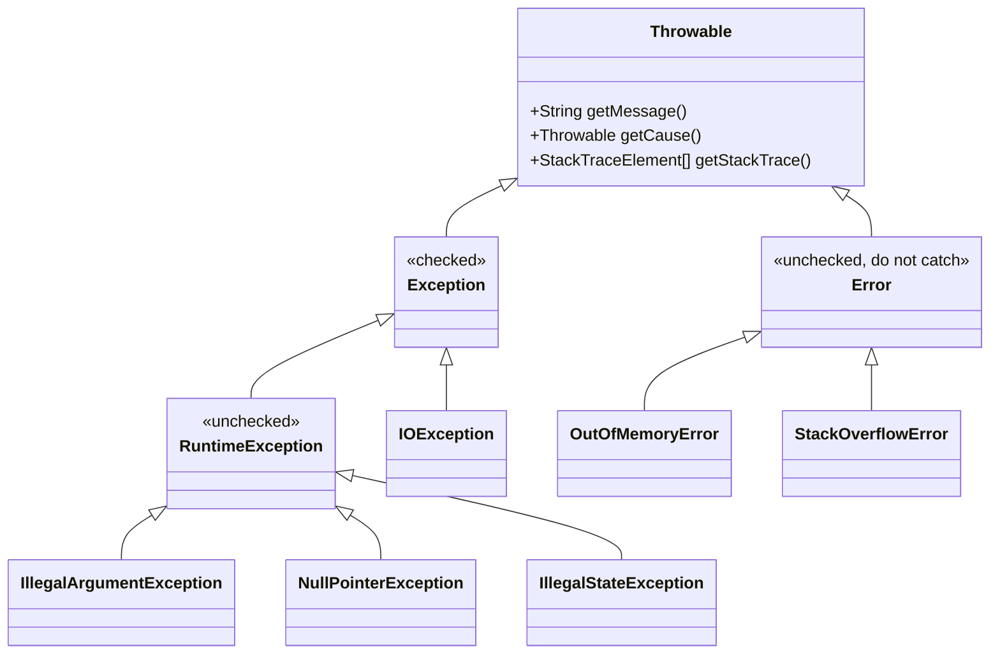
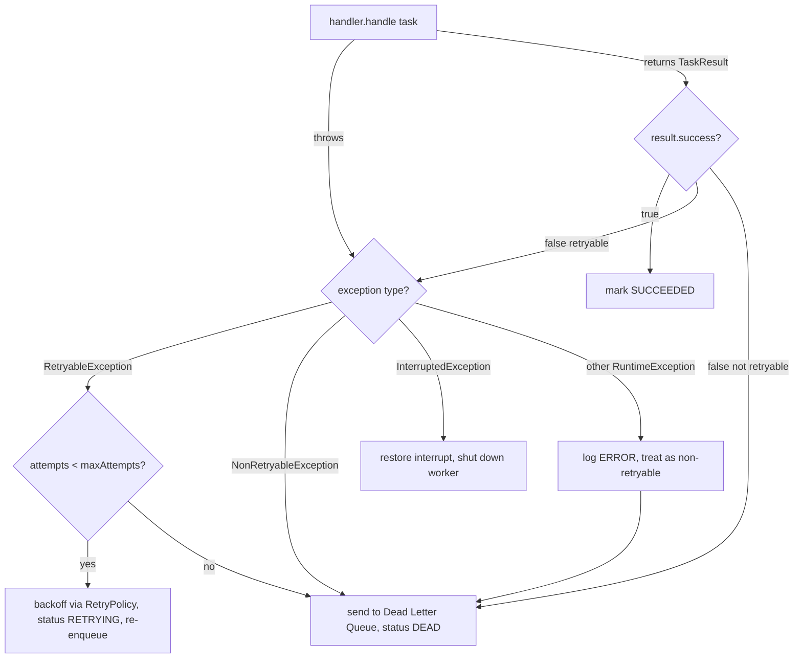
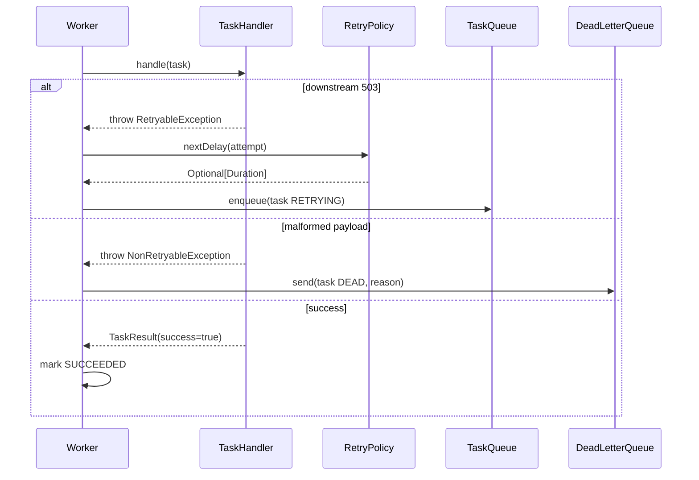

# Exceptions and Error Handling

> Where this fits in the project: every `Task` our platform runs *can fail*. A handler hits a flaky downstream API, a payload is malformed, a database connection drops mid-write. The single most important decision our `Worker` makes after a failure is **retry or dead-letter?** — and in our design that decision is driven almost entirely by the *type* of exception thrown. This chapter builds the exception taxonomy (`TaskExecutionException`, `RetryableException`, `NonRetryableException`) that the retry handler and dead-letter queue depend on later in [../07-queues-and-messaging/dead-letter-queues.md](../07-queues-and-messaging/dead-letter-queues.md) and [../08-distributed-systems/retries.md](../08-distributed-systems/retries.md).

---

## 1. Why This Exists

You have solved 1000+ DSA problems, so you have *returned error codes* — `-1` for "not found", `null` for "no value", a sentinel boolean for "failed". That works in a contained algorithm where the caller is two lines away and you control both sides. It falls apart in a backend system where:

- The code that *detects* a failure (a JDBC driver, deep inside `TaskRepository.save`) is twenty stack frames away from the code that *can decide what to do* (the `Worker`'s retry logic).
- A failure must carry **context**: which task, which attempt, the root cause, whether it is safe to retry.
- "Forgetting to check the return code" must be **impossible**, not merely discouraged.

Exceptions are Java's answer. An exception is a typed object that unwinds the call stack until some frame chooses to `catch` it. The type carries semantics; the object carries data (message, cause, custom fields); the stack trace carries the path. Crucially, an *uncaught* exception is loud — it crashes the thread and prints a trace — which is exactly what you want for bugs, and exactly what you must *prevent* from silently swallowing inside a long-lived worker.

Historically, C used return codes and `errno`; you had to remember to check after every call, and the type system did not help. Java (1995) adopted **checked exceptions** — a compile-time contract that a method *can* fail and the caller *must* deal with it. Two decades of experience showed checked exceptions are sometimes a feature and sometimes a straitjacket; modern Java leans heavily on **unchecked** exceptions for programming errors and reserves checked ones for genuinely recoverable conditions. Getting this distinction right is the heart of this chapter.



The mental model that matters: **`Throwable`** is the root. Below it, **`Error`** (JVM is broken — `OutOfMemoryError`, `StackOverflowError`; you generally do *not* catch these), and **`Exception`**. Under `Exception`, the dividing line is `RuntimeException`: anything that is a `RuntimeException` (or `Error`) is **unchecked**; everything else under `Exception` is **checked**.

---

## 2. Checked versus Unchecked: the Core Distinction

| Property | Checked (`extends Exception`) | Unchecked (`extends RuntimeException`) |
|---|---|---|
| Compiler forces handling? | Yes — `try/catch` or `throws` clause | No |
| Appears in method signature? | Must, via `throws` | Optional, usually omitted |
| Intended meaning | A recoverable condition the caller is *expected* to anticipate (file missing, network blip) | A programming error or precondition violation (null arg, bad state) |
| Typical examples | `IOException`, `SQLException`, `InterruptedException` | `NullPointerException`, `IllegalArgumentException`, `IllegalStateException` |
| Lambda / `Stream` friendliness | Poor — breaks functional interfaces | Good |

The classic guidance from Joshua Bloch (*Effective Java*): **use checked exceptions for conditions the caller can reasonably be expected to recover from, and runtime exceptions for programming errors.** If a caller has *no recovery action* available, do not force them to catch.

For our platform, the decision tree is concrete:

- A malformed `payload` (the JSON cannot be parsed) is a **programming/data error** — retrying will never help. We will model it as an *unchecked, non-retryable* condition.
- A downstream HTTP `503 Service Unavailable` is a **transient condition** — retrying *might* help. We will model it as *retryable*.
- `InterruptedException` (a checked exception the JVM uses for thread cancellation) must be handled *explicitly* by the `Worker` because dequeue blocks — we must never swallow it.

A subtle but important point: **whether an exception is checked or unchecked is orthogonal to whether it is retryable.** Those are two different axes. We will deliberately make our retry-relevant exceptions *unchecked* (so they flow cleanly through lambdas and `TaskHandler` implementations) while encoding the retryable/non-retryable axis as *distinct subtypes*.

---

## 3. The Naive Version

Here is the first thing most people write for a `Worker`. It "works" in the demo and is a disaster in production.

```java
// BAD: naive worker error handling.
public class NaiveWorker implements Runnable {
    private final TaskQueue queue;
    private final Map<String, TaskHandler> handlers;

    public NaiveWorker(TaskQueue queue, Map<String, TaskHandler> handlers) {
        this.queue = queue;
        this.handlers = handlers;
    }

    @Override
    public void run() {
        while (true) {
            try {
                Task task = queue.dequeue();
                TaskHandler handler = handlers.get(task.type());
                TaskResult result = handler.handle(task); // throws Exception
                if (!result.success()) {
                    System.out.println("task failed: " + result.message());
                }
            } catch (Exception e) {
                // swallow everything and keep going
            }
        }
    }
}
```

What is wrong here? Almost everything that matters in production:

1. **It swallows every exception silently.** `catch (Exception e) {}` is the single most damaging anti-pattern in Java. A `NullPointerException` in your handler, a `SQLException` from the DB, a thread interrupt — all vanish. You will sit there at 3 a.m. watching tasks disappear with zero log output.
2. **It catches `InterruptedException` and ignores it**, so the worker can never be shut down cleanly — the interrupt flag is cleared and discarded.
3. **It loses the cause.** When `handler.handle` throws, the original stack trace is gone.
4. **It makes no retry/dead-letter decision** — a failed task is just `println`-ed and forgotten.
5. **`handlers.get(task.type())` can return `null`**, producing an NPE that the blanket catch hides.

> The "executor swallowing exceptions" trap is even nastier and we devote a whole section to it below: when you submit work to an `ExecutorService` via `submit()`, an exception thrown by the task is captured in the returned `Future` and **never surfaces unless you call `Future.get()`**. People routinely lose exceptions this way without even a `catch` block.

---

## 4. Improved Version

First refactor: define a custom exception so failures carry context and a retryability flag, stop swallowing, and handle interruption correctly.

```java
// BETTER: a custom exception that carries context.
public class TaskExecutionException extends RuntimeException {
    private final String taskId;
    private final boolean retryable;

    public TaskExecutionException(String taskId, String message, boolean retryable, Throwable cause) {
        super(message, cause);          // chaining: preserve the original cause
        this.taskId = taskId;
        this.retryable = retryable;
    }

    public String taskId() { return taskId; }
    public boolean retryable() { return retryable; }
}
```

```java
// BETTER: worker that logs, respects interruption, and distinguishes outcomes.
public class ImprovedWorker implements Runnable {
    private static final System.Logger LOG = System.getLogger(ImprovedWorker.class.getName());
    private final TaskQueue queue;
    private final Map<String, TaskHandler> handlers;

    public ImprovedWorker(TaskQueue queue, Map<String, TaskHandler> handlers) {
        this.queue = queue;
        this.handlers = handlers;
    }

    @Override
    public void run() {
        while (!Thread.currentThread().isInterrupted()) {
            Task task = null;
            try {
                task = queue.dequeue();                 // blocks; may throw InterruptedException
                TaskHandler handler = handlers.get(task.type());
                if (handler == null) {
                    throw new TaskExecutionException(task.id(),
                        "no handler for type " + task.type(), false, null);
                }
                TaskResult result = handler.handle(task);
                if (!result.success()) {
                    throw new TaskExecutionException(task.id(),
                        result.message(), result.retryable(), null);
                }
                LOG.log(System.Logger.Level.INFO, "task {0} succeeded", task.id());
            } catch (InterruptedException ie) {
                Thread.currentThread().interrupt();      // restore the flag, then exit the loop
                LOG.log(System.Logger.Level.INFO, "worker interrupted, shutting down");
                return;
            } catch (TaskExecutionException tee) {
                LOG.log(System.Logger.Level.WARNING,
                    "task " + tee.taskId() + " failed (retryable=" + tee.retryable() + ")", tee);
                // retry/DLQ decision still missing — next refactor
            } catch (Exception e) {
                String id = task == null ? "unknown" : task.id();
                LOG.log(System.Logger.Level.ERROR, "unexpected error running task " + id, e);
            }
        }
    }
}
```

This is a large step up: interruption is honored, nothing is silently swallowed, the cause is chained, and we have a *typed* failure with a `retryable` flag. But the flag is a `boolean` passed at throw-time, which means every call site has to *remember* to set it correctly. That is fragile. The next version pushes the retryability into the **type system** itself.

---

## 5. Production-Quality Version

A staff engineer encodes the retry-vs-dead-letter decision into a small **sealed exception hierarchy**, so the *type* of the exception — not a boolean — answers "should we retry?". This is the version we ship.

```java
// Production: sealed taxonomy. The TYPE encodes the retry decision.
public sealed abstract class TaskExecutionException extends RuntimeException
        permits RetryableException, NonRetryableException {

    private final String taskId;

    protected TaskExecutionException(String taskId, String message, Throwable cause) {
        super(message, cause);
        this.taskId = taskId;
    }

    public String taskId() { return taskId; }

    /** Subclasses answer the only question the Worker cares about. */
    public abstract boolean retryable();
}
```

```java
// Transient failures: safe to retry (timeouts, 5xx, deadlocks, throttling).
public final class RetryableException extends TaskExecutionException {
    public RetryableException(String taskId, String message, Throwable cause) {
        super(taskId, message, cause);
    }
    @Override public boolean retryable() { return true; }
}
```

```java
// Permanent failures: retrying is pointless and wasteful (bad payload, 4xx, missing handler).
public final class NonRetryableException extends TaskExecutionException {
    public NonRetryableException(String taskId, String message, Throwable cause) {
        super(taskId, message, cause);
    }
    @Override public boolean retryable() { return false; }
}
```

> Note: a `sealed abstract` class compiles fine — `abstract` forces every permitted subclass to answer `retryable()`. Sealing means the compiler *knows the complete set of subtypes*, which lets the `Worker` use an exhaustive `switch` with no `default` branch. That is the payoff: add a third failure category later and the compiler points at every `switch` that must be updated.

Now the `Worker` makes its decision with **switch pattern matching** — exhaustive, no fall-through, no boolean to misread:

```java
// Production: outcome handling driven by exception TYPE.
private void onFailure(Task task, TaskExecutionException ex,
                       RetryPolicy retryPolicy, DeadLetterQueue dlq, TaskQueue queue) {
    switch (ex) {
        case RetryableException r -> {
            Optional<Duration> delay = retryPolicy.nextDelay(task.attempts() + 1);
            if (delay.isPresent() && task.attempts() + 1 < task.maxAttempts()) {
                Task retrying = task.withStatus(TaskStatus.RETRYING).incrementAttempts();
                // schedule re-enqueue after delay (see TaskScheduler in later chapters)
                queue.enqueue(retrying);
                LOG.log(System.Logger.Level.WARNING,
                    "retrying task {0}, attempt {1}", task.id(), retrying.attempts());
            } else {
                dlq.send(task.withStatus(TaskStatus.DEAD), "max attempts exhausted: " + r.getMessage());
            }
        }
        case NonRetryableException n ->
            dlq.send(task.withStatus(TaskStatus.DEAD), "non-retryable: " + n.getMessage());
    }
}
```

Because `TaskExecutionException` is sealed and permits exactly two subtypes, the `switch` above is **exhaustive** — the compiler accepts it with no `default` clause. This is the single most valuable property of the design: the failure taxonomy and the decision logic are kept in lockstep by the type checker.



---

## 6. Code Walkthrough

### 6.1 Beginner — checked vs unchecked, hands on

```java
public class CheckedVsUnchecked {

    // CHECKED: the compiler forces callers to handle or declare it.
    static String readPayload(String path) throws java.io.IOException {
        return java.nio.file.Files.readString(java.nio.file.Path.of(path));
    }

    // UNCHECKED: a precondition violation — the caller passed garbage. No `throws` needed.
    static int parsePriority(String raw) {
        if (raw == null || raw.isBlank()) {
            throw new IllegalArgumentException("priority must be non-blank, got: " + raw);
        }
        return Integer.parseInt(raw); // itself throws NumberFormatException (unchecked)
    }

    public static void main(String[] args) {
        // Must handle the checked one:
        try {
            String payload = readPayload("/tmp/task.json");
            System.out.println("payload length = " + payload.length());
        } catch (java.io.IOException e) {
            System.out.println("could not read payload: " + e.getMessage());
        }

        // The unchecked one compiles even if we ignore it (but it can blow up at runtime):
        System.out.println(parsePriority("5"));
        try {
            parsePriority("not-a-number");
        } catch (NumberFormatException e) {
            System.out.println("bad priority: " + e.getMessage());
        }
    }
}
```

Key takeaway: `IOException` *must* be caught or declared — the compiler will not let you ignore it. `IllegalArgumentException` and `NumberFormatException` are unchecked: the compiler is silent, but they are just as real at runtime. We reserve unchecked exceptions for "the caller made a mistake."

### 6.2 Intermediate — try-with-resources and exception chaining

When our Phase 2 `PostgresTaskQueue` reads from a JDBC connection, we must close the connection *even if the query throws*. The old way (`finally` blocks) is error-prone; **try-with-resources** is the correct tool. It works with anything implementing `AutoCloseable`.

```java
import java.sql.*;
import java.util.*;

public class TaskRepositoryJdbc {

    private final javax.sql.DataSource dataSource;

    public TaskRepositoryJdbc(javax.sql.DataSource dataSource) {
        this.dataSource = dataSource;
    }

    public Optional<Task> findById(String id) {
        String sql = "SELECT id, type, payload, status, attempts, max_attempts FROM tasks WHERE id = ?";
        // Connection, PreparedStatement, ResultSet all close automatically, in reverse order.
        try (Connection conn = dataSource.getConnection();
             PreparedStatement ps = conn.prepareStatement(sql)) {
            ps.setString(1, id);
            try (ResultSet rs = ps.executeQuery()) {
                if (rs.next()) {
                    return Optional.of(mapRow(rs));
                }
                return Optional.empty();
            }
        } catch (SQLException e) {
            // CHAINING: wrap the low-level SQLException in our domain exception,
            // preserving the original as the `cause`. We never let SQLException leak upward.
            throw new RetryableException(id, "failed to load task " + id, e);
        }
    }

    private Task mapRow(ResultSet rs) throws SQLException {
        return new Task(
            rs.getString("id"),
            rs.getString("type"),
            rs.getString("payload"),
            TaskStatus.valueOf(rs.getString("status")),
            rs.getInt("attempts"),
            rs.getInt("max_attempts"),
            java.time.Instant.now(),  // simplified for the example
            null,
            0
        );
    }
}
```

Why chaining matters: `super(message, cause)` (or `initCause`) keeps the original `SQLException` reachable via `getCause()`, so the printed stack trace shows the full story:

```text
RetryableException: failed to load task 7f3a...
    at TaskRepositoryJdbc.findById(TaskRepositoryJdbc.java:25)
    ...
Caused by: java.sql.SQLException: Connection refused
    at org.postgresql.Driver.connect(Driver.java:...)
    ...
```

Without chaining you get a `RetryableException` with **no idea what actually broke**. Always pass the cause.

**Suppressed exceptions** are a subtle bonus of try-with-resources: if the body throws *and then* `close()` also throws, the body's exception wins and the close exception is attached as a *suppressed* exception (retrievable via `getSuppressed()`), so neither is lost. In the pre-Java-7 `finally` idiom, a throwing `close()` would *mask* the real error.

### 6.3 Production-inspired — a `TaskHandler` that classifies failures correctly

This is the kind of handler we ship. Note how it translates *low-level, library-specific* failures into our *domain* taxonomy, so the `Worker` never needs to know about HTTP or JSON.

```java
import java.net.http.*;
import java.net.URI;
import java.time.Duration;

/** Calls a downstream webhook for a task and maps its result into our taxonomy. */
public final class WebhookTaskHandler implements TaskHandler {

    private final HttpClient http = HttpClient.newBuilder()
            .connectTimeout(Duration.ofSeconds(2))
            .build();

    @Override
    public TaskResult handle(Task task) throws Exception {
        WebhookPayload payload;
        try {
            payload = JsonUtil.parse(task.payload(), WebhookPayload.class);
        } catch (JsonParseException badJson) {
            // A malformed payload will NEVER parse on retry -> non-retryable, straight to DLQ.
            throw new NonRetryableException(task.id(),
                "invalid payload JSON: " + badJson.getMessage(), badJson);
        }

        HttpRequest request = HttpRequest.newBuilder()
                .uri(URI.create(payload.url()))
                .timeout(Duration.ofSeconds(5))
                .POST(HttpRequest.BodyPublishers.ofString(payload.body()))
                .build();

        HttpResponse<String> response;
        try {
            response = http.send(request, HttpResponse.BodyHandlers.ofString());
        } catch (java.net.http.HttpTimeoutException | java.net.ConnectException transientErr) {
            // Network blips are the textbook retryable case.
            throw new RetryableException(task.id(),
                "downstream unreachable: " + transientErr.getMessage(), transientErr);
        } catch (java.io.IOException io) {
            // Unknown I/O — be conservative and retry, but cap attempts upstream.
            throw new RetryableException(task.id(), "I/O error calling downstream", io);
        }

        int code = response.statusCode();
        if (code >= 200 && code < 300) {
            return new TaskResult(true, "downstream returned " + code, false);
        } else if (code == 429 || code >= 500) {
            // Throttling or server errors -> retryable.
            throw new RetryableException(task.id(),
                "downstream returned " + code, null);
        } else {
            // 4xx (except 429): our request is wrong; retrying won't fix it.
            throw new NonRetryableException(task.id(),
                "downstream rejected request with " + code, null);
        }
    }
}
```

The discipline on display: **classify at the boundary**. The handler is the only place that knows HTTP status codes and JSON parsing exist. It converts that knowledge into `RetryableException` / `NonRetryableException`, and from then on the entire pipeline reasons in domain terms. This is the single most important habit for keeping a large system's error handling sane.

---

## 7. How This Applies to Our Task Queue Project

Mapping concretely onto the canonical model:

- **`TaskExecutionException` (sealed)** is the root of all *expected* task failures. It carries `taskId` and a chained `cause`.
- **`RetryableException` / `NonRetryableException`** are the two permitted subtypes; their `retryable()` answer is what the `Worker` switches on.
- **`Worker`** catches `TaskExecutionException`, runs the `switch`, and routes to either re-enqueue (via `TaskQueue.enqueue` + `RetryPolicy.nextDelay`) or the `DeadLetterQueue`.
- **`TaskHandler` implementations** are responsible for *throwing the right subtype* — they translate library exceptions (`IOException`, `SQLException`, `JsonParseException`) into our domain types.
- **`TaskRepository` (JDBC)** uses **try-with-resources** for every `Connection`/`Statement`/`ResultSet` and chains `SQLException` into a `RetryableException`.
- **`InterruptedException`** is handled by `Worker.run()` by restoring the interrupt flag and exiting — never swallowed — so `WorkerPool.shutdown()` actually stops workers. See [../06-concurrency/executor-service.md](../06-concurrency/executor-service.md).



---

## 8. Tradeoffs

| Decision | Option A | Option B | Our choice & why |
|---|---|---|---|
| Checked vs unchecked for domain failures | Checked (`extends Exception`) forces handling | Unchecked (`extends RuntimeException`) | **Unchecked.** Handlers are functional (`TaskHandler.handle`), and checked exceptions poison lambdas/streams. The `Worker` is the single, deliberate catch point. |
| Encode retryability as... | a `boolean` field on one exception class | distinct *subtypes* in a sealed hierarchy | **Subtypes.** Exhaustive `switch`, impossible to "forget" the flag, compiler enforces coverage when categories grow. |
| Sealed vs open hierarchy | `sealed` (closed set) | open (anyone can subclass) | **Sealed.** We *want* a closed taxonomy so the decision `switch` stays exhaustive. |
| Where to classify failures | inside the `Worker` (inspect causes) | inside each `TaskHandler` | **In the handler.** It owns the domain knowledge (HTTP codes, JSON). The `Worker` stays generic. |
| Resource cleanup | `try/finally` | try-with-resources | **try-with-resources.** Correct close order, suppressed-exception handling, less code. |

There is a real cost to the sealed-hierarchy approach: more classes, and every handler must *decide* the category at throw-time. The alternative (one exception + boolean) is less typing but pushes the burden onto every call site to set the flag right, and offers no compiler help. For a system where the retry/DLQ decision is load-bearing (wrong = wasted compute or lost data), the type-driven design pays for itself.

---

## 9. Common Mistakes and Pitfalls

- **Swallowing exceptions: `catch (Exception e) {}`.** The cardinal sin. At minimum log with the throwable (`LOG.log(level, msg, e)`), never `e.getMessage()` alone — that drops the stack trace. *Fix:* log the `Throwable`, or rethrow wrapped.
- **Catching and discarding `InterruptedException`.** This breaks cancellation. *Fix:* `Thread.currentThread().interrupt();` to restore the flag, then return/break.
- **Catching `Throwable` or `Error`.** You will catch `OutOfMemoryError` and `StackOverflowError` and try to "handle" them on a corrupted JVM. *Fix:* catch `Exception` at most; let `Error` propagate.
- **Losing the cause.** `throw new RetryableException(id, "failed")` with no cause discards the root. *Fix:* always pass the original `Throwable` as the cause.
- **Using exceptions for control flow.** Throwing to break out of a loop is slow (stack capture) and unreadable. *Fix:* use normal returns; exceptions are for the exceptional.
- **`catch` then `return null`.** Pushes the failure onto the caller as a `null` they will forget to check. *Fix:* return `Optional`, or rethrow.
- **`ExecutorService.submit` and never calling `Future.get`.** Exceptions are captured in the `Future` and silently lost (see next section).
- **Catching a broad type before a narrow one.** `catch (Exception e)` before `catch (IOException e)` does not even compile (unreachable), but `catch (RuntimeException)` before a specific runtime subtype will shadow it. Order most-specific first.
- **Throwing in a `finally` block.** It discards any exception the `try` body threw. *Fix:* never throw from `finally`; use try-with-resources for cleanup.

---

## 10. The Executor-Swallowing-Exceptions Anti-Pattern

This deserves its own section because it bites everyone exactly once, and it is invisible — there is no `catch {}` to grep for.

When you call `ExecutorService.submit(Runnable)` or `submit(Callable)`, the executor **catches any exception the task throws and stores it inside the returned `Future`.** The task thread does *not* crash, the default uncaught-exception handler does *not* fire, and **nothing is logged**. The exception only re-emerges when someone calls `future.get()` (as the cause of an `ExecutionException`). If you never call `get()` — common for fire-and-forget tasks — the exception is gone forever.

```java
import java.util.concurrent.*;

public class ExecutorSwallowDemo {
    public static void main(String[] args) throws Exception {
        ExecutorService pool = Executors.newFixedThreadPool(2);

        // submit(): the NPE below is swallowed. No output. No crash. Silence.
        pool.submit(() -> {
            String s = null;
            s.length(); // NullPointerException -> trapped in the Future, never seen
        });

        // execute(): the SAME exception now propagates to the thread's
        // UncaughtExceptionHandler and IS printed. Different behavior!
        pool.execute(() -> {
            String s = null;
            s.length(); // NPE -> printed to stderr by default handler
        });

        pool.shutdown();
        pool.awaitTermination(1, TimeUnit.SECONDS);
    }
}
```

Three defenses, in order of preference:

1. **In every worker task, wrap the body in `try/catch` and log** before the exception can reach the executor. This is what our `Worker.run()` does — it is the reliable fix because it never relies on someone calling `get()`.
2. **For pools where you control creation, install a custom `ThreadFactory` with an `UncaughtExceptionHandler`.** Note this only helps for `execute()`, not `submit()`.
3. **For `submit()`, always retain and inspect the `Future`** (e.g., via `CompletableFuture.whenComplete` or by calling `get()`), and log the captured exception.

```java
// Production pattern: a ThreadFactory that names threads and logs uncaught exceptions.
import java.util.concurrent.*;
import java.util.concurrent.atomic.AtomicInteger;

public final class WorkerThreadFactory implements ThreadFactory {
    private static final System.Logger LOG = System.getLogger(WorkerThreadFactory.class.getName());
    private final AtomicInteger counter = new AtomicInteger();

    @Override
    public Thread newThread(Runnable r) {
        Thread t = new Thread(r, "worker-" + counter.incrementAndGet());
        t.setUncaughtExceptionHandler((thread, ex) ->
            LOG.log(System.Logger.Level.ERROR, "uncaught in " + thread.getName(), ex));
        return t;
    }
}
```

> Because our `Worker.run()` already catches inside its loop, a single bad task can never kill the worker thread *or* vanish silently. That defensive `try/catch` inside the run loop is non-negotiable for any long-lived consumer. More on executor lifecycles in [../06-concurrency/executor-service.md](../06-concurrency/executor-service.md) and [../06-concurrency/futures-and-completablefuture.md](../06-concurrency/futures-and-completablefuture.md).

---

## 11. Refactoring Exercise

**Bad** — swallows, loses cause, mishandles interrupt, no decision:

```java
public void runOnce(TaskQueue queue, Map<String, TaskHandler> handlers) {
    try {
        Task t = queue.dequeue();
        TaskResult r = handlers.get(t.type()).handle(t);
        if (!r.success()) System.out.println("failed");
    } catch (Exception e) {
        // ignore
    }
}
```

**Improved** — logs, chains, custom exception, but still uses a boolean flag and a generic catch:

```java
public void runOnce(TaskQueue queue, Map<String, TaskHandler> handlers) {
    Task t = null;
    try {
        t = queue.dequeue();
        TaskHandler h = handlers.get(t.type());
        if (h == null) throw new TaskExecutionException(t.id(), "no handler", false, null);
        TaskResult r = h.handle(t);
        if (!r.success()) throw new TaskExecutionException(t.id(), r.message(), r.retryable(), null);
    } catch (InterruptedException ie) {
        Thread.currentThread().interrupt();
    } catch (Exception e) {
        log(t, e);
    }
}
```

**Production** — sealed taxonomy, exhaustive `switch`, correct interrupt handling, full routing:

```java
public void runOnce(TaskQueue queue, Map<String, TaskHandler> handlers,
                    RetryPolicy retryPolicy, DeadLetterQueue dlq) {
    Task task = null;
    try {
        task = queue.dequeue();
        TaskHandler handler = handlers.get(task.type());
        if (handler == null) {
            throw new NonRetryableException(task.id(), "no handler for " + task.type(), null);
        }
        TaskResult result = handler.handle(task);
        if (result.success()) {
            LOG.log(System.Logger.Level.INFO, "task {0} SUCCEEDED", task.id());
            return;
        }
        // a non-throwing failure: let the result's retryable flag pick the subtype
        throw result.retryable()
            ? new RetryableException(task.id(), result.message(), null)
            : new NonRetryableException(task.id(), result.message(), null);
    } catch (InterruptedException ie) {
        Thread.currentThread().interrupt();                 // restore + bail out
    } catch (TaskExecutionException tee) {
        route(task, tee, retryPolicy, dlq, queue);          // exhaustive switch lives here
    } catch (RuntimeException unexpected) {
        // A bug in the handler (e.g. NPE). Treat as non-retryable, but surface loudly.
        LOG.log(System.Logger.Level.ERROR, "unexpected error in handler for " + safeId(task), unexpected);
        if (task != null) dlq.send(task.withStatus(TaskStatus.DEAD), "unexpected: " + unexpected);
    }
}

private void route(Task task, TaskExecutionException ex, RetryPolicy retryPolicy,
                   DeadLetterQueue dlq, TaskQueue queue) {
    switch (ex) {
        case RetryableException r -> {
            int next = task.attempts() + 1;
            if (next < task.maxAttempts() && retryPolicy.nextDelay(next).isPresent()) {
                queue.enqueue(task.withStatus(TaskStatus.RETRYING).incrementAttempts());
            } else {
                dlq.send(task.withStatus(TaskStatus.DEAD), "exhausted: " + r.getMessage());
            }
        }
        case NonRetryableException n ->
            dlq.send(task.withStatus(TaskStatus.DEAD), "non-retryable: " + n.getMessage());
    }
}
```

The arc: from *silent and lossy* to *typed, exhaustive, and self-documenting*. The compiler now guarantees the failure taxonomy and the routing logic cannot drift apart.

---

## 12. Exercises

### Easy

**E1 (knowledge check).** Classify each as checked or unchecked, and say whether the compiler forces you to handle it: `IOException`, `IllegalArgumentException`, `InterruptedException`, `NullPointerException`, `SQLException`, `OutOfMemoryError`.

**E2 (coding).** Write a method `parseMaxAttempts(String raw)` that returns an `int`. Throw an `IllegalArgumentException` (with a useful message) when `raw` is null, blank, not a number, or less than 1. Add a `main` that demonstrates all four failure cases being caught.

### Medium

**M1 (refactoring).** You are given the swallowing `NaiveWorker` from Section 3. Refactor it so it (a) never swallows, (b) restores the interrupt flag and exits cleanly on `InterruptedException`, (c) logs the full throwable, and (d) handles a missing handler explicitly. You may stop before the retry/DLQ routing.

**M2 (design).** Add a third failure category `ThrottledException` (the downstream said "slow down, retry after N seconds") to the sealed hierarchy. It is retryable *but* carries a `Duration retryAfter`. Show the new class, and show what the compiler forces you to change in the `route` switch from Section 11.

### Hard

**H1 (interview-style).** Explain, with a runnable demo, why `ExecutorService.submit(Runnable)` can swallow an exception while `execute(Runnable)` does not. Then write a `safeSubmit` helper that wraps any `Runnable` so its exceptions are always logged regardless of which method is used.

**H2 (stretch).** Implement a `WebhookTaskHandler.handle` that maps HTTP outcomes to the correct exception subtype (2xx → success, 429/5xx → `RetryableException`, other 4xx → `NonRetryableException`, malformed JSON → `NonRetryableException`, timeout/connect failure → `RetryableException`). Then write a JUnit 5 + AssertJ test that asserts a 503 throws `RetryableException` and a 400 throws `NonRetryableException`, using a stubbed HTTP layer.

---

## 13. Solutions

### E1 Solution

| Throwable | Category | Compiler-forced? |
|---|---|---|
| `IOException` | checked | Yes |
| `IllegalArgumentException` | unchecked (`RuntimeException`) | No |
| `InterruptedException` | checked | Yes |
| `NullPointerException` | unchecked | No |
| `SQLException` | checked | Yes |
| `OutOfMemoryError` | unchecked (`Error`) | No — and you should not catch it |

### E2 Solution

```java
public class ParseMaxAttempts {
    static int parseMaxAttempts(String raw) {
        if (raw == null || raw.isBlank()) {
            throw new IllegalArgumentException("maxAttempts must be non-blank, got: " + raw);
        }
        final int value;
        try {
            value = Integer.parseInt(raw.trim());
        } catch (NumberFormatException e) {
            throw new IllegalArgumentException("maxAttempts must be an integer, got: " + raw, e);
        }
        if (value < 1) {
            throw new IllegalArgumentException("maxAttempts must be >= 1, got: " + value);
        }
        return value;
    }

    public static void main(String[] args) {
        for (String in : new String[] {null, "  ", "abc", "0"}) {
            try {
                parseMaxAttempts(in);
            } catch (IllegalArgumentException e) {
                System.out.println("rejected [" + in + "]: " + e.getMessage());
            }
        }
        System.out.println("accepted: " + parseMaxAttempts("3")); // 3
    }
}
```

Note the chaining in the `NumberFormatException` branch: we wrap it as the cause so the root parse failure is not lost.

### M1 Solution

```java
public class SafeWorker implements Runnable {
    private static final System.Logger LOG = System.getLogger(SafeWorker.class.getName());
    private final TaskQueue queue;
    private final Map<String, TaskHandler> handlers;

    public SafeWorker(TaskQueue queue, Map<String, TaskHandler> handlers) {
        this.queue = queue;
        this.handlers = handlers;
    }

    @Override
    public void run() {
        while (!Thread.currentThread().isInterrupted()) {
            Task task = null;
            try {
                task = queue.dequeue();
                TaskHandler handler = handlers.get(task.type());
                if (handler == null) {
                    LOG.log(System.Logger.Level.ERROR, "no handler for type {0}", task.type());
                    continue;
                }
                TaskResult result = handler.handle(task);
                if (result.success()) {
                    LOG.log(System.Logger.Level.INFO, "task {0} succeeded", task.id());
                } else {
                    LOG.log(System.Logger.Level.WARNING, "task {0} failed: {1}",
                            task.id(), result.message());
                }
            } catch (InterruptedException ie) {
                Thread.currentThread().interrupt();   // (b) restore + exit
                return;
            } catch (Exception e) {                   // (a)(c) never swallow; log the throwable
                LOG.log(System.Logger.Level.ERROR,
                        "error running task " + (task == null ? "?" : task.id()), e);
            }
        }
    }
}
```

### M2 Solution

```java
public final class ThrottledException extends TaskExecutionException {
    private final java.time.Duration retryAfter;

    public ThrottledException(String taskId, String message, java.time.Duration retryAfter, Throwable cause) {
        super(taskId, message, cause);
        this.retryAfter = retryAfter;
    }

    public java.time.Duration retryAfter() { return retryAfter; }

    @Override public boolean retryable() { return true; }
}
```

You must also add it to the `permits` clause of the sealed parent:

```java
public sealed abstract class TaskExecutionException extends RuntimeException
        permits RetryableException, NonRetryableException, ThrottledException { /* ... */ }
```

The payoff: the `route` switch in Section 11 **stops compiling** with "the switch statement does not cover all possible input values" until you add a case. That is the sealed hierarchy earning its keep:

```java
switch (ex) {
    case RetryableException r -> retryOrDlq(task, r.getMessage(), retryPolicy, dlq, queue);
    case ThrottledException t -> {
        // honor the server's retry-after instead of our own backoff
        queue.enqueue(task.withStatus(TaskStatus.RETRYING).incrementAttempts());
        LOG.log(System.Logger.Level.WARNING, "throttled, retry after {0}", t.retryAfter());
    }
    case NonRetryableException n -> dlq.send(task.withStatus(TaskStatus.DEAD), n.getMessage());
}
```

### H1 Solution

```java
import java.util.concurrent.*;

public class SafeSubmitDemo {
    private static final System.Logger LOG = System.getLogger(SafeSubmitDemo.class.getName());

    /** Wrap so exceptions are logged no matter what — works for submit() and execute(). */
    static Runnable guarded(Runnable body) {
        return () -> {
            try {
                body.run();
            } catch (Throwable t) {  // catch all here is acceptable: we log AND rethrow Errors
                LOG.log(System.Logger.Level.ERROR, "task threw", t);
                if (t instanceof Error err) throw err; // never swallow JVM Errors
            }
        };
    }

    static Future<?> safeSubmit(ExecutorService pool, Runnable body) {
        return pool.submit(guarded(body));
    }

    public static void main(String[] args) throws Exception {
        ExecutorService pool = Executors.newSingleThreadExecutor();
        // Without guarding, submit() would swallow this. With guarding, it is logged.
        safeSubmit(pool, () -> { throw new RuntimeException("boom"); });
        pool.shutdown();
        pool.awaitTermination(1, TimeUnit.SECONDS);
    }
}
```

Why the asymmetry exists: `submit` adapts the task into a `FutureTask`, whose `run()` *catches* the throwable and stores it as the future's outcome — so the worker thread terminates normally and the uncaught-exception handler never fires. `execute` runs the `Runnable` directly on the thread, so an escaping exception reaches the thread's `UncaughtExceptionHandler`, which by default prints to `stderr`.

### H2 Solution

The handler is the `WebhookTaskHandler` from Section 6.3. Here is the test using a seam (`HttpExecutor`) we can stub, plus AssertJ assertions.

```java
import org.junit.jupiter.api.Test;
import static org.assertj.core.api.Assertions.*;

class WebhookTaskHandlerTest {

    // A tiny seam so the test can control the HTTP status without real network I/O.
    interface HttpExecutor { int post(String url, String body) throws java.io.IOException; }

    static final class TestableHandler implements TaskHandler {
        private final HttpExecutor http;
        TestableHandler(HttpExecutor http) { this.http = http; }

        @Override public TaskResult handle(Task task) throws Exception {
            WebhookPayload p;
            try {
                p = JsonUtil.parse(task.payload(), WebhookPayload.class);
            } catch (JsonParseException e) {
                throw new NonRetryableException(task.id(), "bad json", e);
            }
            int code;
            try {
                code = http.post(p.url(), p.body());
            } catch (java.io.IOException io) {
                throw new RetryableException(task.id(), "io", io);
            }
            if (code >= 200 && code < 300) return new TaskResult(true, "ok", false);
            if (code == 429 || code >= 500) throw new RetryableException(task.id(), "code " + code, null);
            throw new NonRetryableException(task.id(), "code " + code, null);
        }
    }

    private Task task() {
        return new Task("id-1", "webhook", "{\"url\":\"http://x\",\"body\":\"\"}",
                TaskStatus.PENDING, 0, 3, java.time.Instant.now(), null, 0);
    }

    @Test void serverError_isRetryable() {
        var handler = new TestableHandler((url, body) -> 503);
        assertThatThrownBy(() -> handler.handle(task()))
            .isInstanceOf(RetryableException.class)
            .hasMessageContaining("503");
    }

    @Test void badRequest_isNonRetryable() {
        var handler = new TestableHandler((url, body) -> 400);
        assertThatThrownBy(() -> handler.handle(task()))
            .isInstanceOf(NonRetryableException.class)
            .hasMessageContaining("400");
    }

    @Test void throttled_isRetryable() {
        var handler = new TestableHandler((url, body) -> 429);
        assertThatThrownBy(() -> handler.handle(task()))
            .isInstanceOf(RetryableException.class);
    }
}
```

The design lesson baked into the test: by introducing the `HttpExecutor` seam we can unit-test the *classification logic* (the part that matters for retry/DLQ) without any network. See more on testable seams and dependency injection in [../04-oop-and-ood/dependency-injection.md](../04-oop-and-ood/dependency-injection.md).

---

## 14. Interview Questions and Takeaways

1. **What is the difference between checked and unchecked exceptions, and when do you use each?**
   Checked extend `Exception` (not `RuntimeException`) and the compiler forces handling; use them for recoverable conditions the caller should anticipate. Unchecked extend `RuntimeException`; use them for programming errors and precondition violations. Modern Java leans unchecked because checked exceptions don't compose with lambdas/streams.

2. **Why is `catch (Exception e) {}` dangerous?**
   It silently swallows every failure — bugs, interrupts, I/O errors — producing systems that fail invisibly. At minimum log the throwable; ideally only catch what you can act on, and rethrow the rest.

3. **How should you handle `InterruptedException`?**
   Either propagate it, or restore the flag with `Thread.currentThread().interrupt()` and stop the current work. Never swallow it — it is the cooperative cancellation signal, and swallowing it makes threads un-stoppable.

4. **What is exception chaining and why does it matter?**
   Wrapping a low-level exception as the `cause` of a higher-level one (`new XException(msg, cause)`). It preserves the root cause and full "Caused by" trace while letting you raise a domain-meaningful type. Without it you lose the actual reason for the failure.

5. **Explain try-with-resources and suppressed exceptions.**
   It auto-closes any `AutoCloseable` in reverse order of acquisition, even on exception. If both the body and `close()` throw, the body's exception propagates and the close exception is attached as *suppressed* (`getSuppressed()`), so nothing is masked — unlike the old `finally` idiom.

6. **Why can an `ExecutorService` swallow exceptions, and how do you prevent it?**
   `submit()` traps the exception inside the returned `Future`; it only surfaces on `get()`. Prevent it by wrapping the task body in try/catch-and-log, inspecting the `Future`, or (for `execute()`) installing an `UncaughtExceptionHandler`.

7. **Should you ever catch `Throwable` or `Error`?**
   Almost never. `Error` signals a broken JVM (`OutOfMemoryError`, `StackOverflowError`) you cannot meaningfully recover from. Catch `Exception` at most; let `Error` propagate.

8. **How do you decide whether a failed task should be retried or dead-lettered?**
   By the *type/semantics* of the failure: transient (timeouts, 5xx, throttling, deadlocks) → retry with backoff up to `maxAttempts`; permanent (bad payload, 4xx, missing handler) → dead-letter immediately. Encoding this as a sealed exception hierarchy makes the decision exhaustive and compiler-checked.

---

## 15. Production Considerations

- **Cardinality and noise.** Logging full stack traces for every retryable failure floods logs and your log bill. Log retryable failures at `WARN` with a short message, capture the trace once (e.g., at final dead-lettering), and rely on metrics for volume. Tie this to [../10-system-design/observability-and-ops.md](../10-system-design/observability-and-ops.md).
- **Metrics over logs for rates.** Increment counters per failure category (`tasks.failed{type, retryable}`) via a `MetricsCollector` / Micrometer registry so you can alert on *rate of non-retryable failures* — a spike there means a bad deploy or poisoned input, not flaky downstreams.
- **Exception construction cost.** Building a `Throwable` captures the stack trace, which is not free. In ultra-hot paths (rarely our case), you can override `fillInStackTrace()` for control-flow-style exceptions — but only with a clear reason; it sacrifices debuggability.
- **Poison messages.** A `NonRetryableException` that you accidentally classify as retryable becomes a *poison message* that loops forever, burning a worker. Always cap with `maxAttempts` even for retryables, and always dead-letter on exhaustion. See [../07-queues-and-messaging/dead-letter-queues.md](../07-queues-and-messaging/dead-letter-queues.md).
- **Idempotency interplay.** Retries imply a task may run more than once. Handlers must be idempotent or the retry will double-charge / double-send. The exception taxonomy decides *whether* to retry; idempotency makes retrying *safe*. See [../08-distributed-systems/idempotency.md](../08-distributed-systems/idempotency.md).
- **Cross-thread visibility.** An exception in a worker thread is invisible to the submitting thread unless propagated through a `Future`, the queue, or a metric. Design the surfacing path deliberately; do not assume the caller "sees" the failure.

---

## What We Can Improve In Our Project Using This Concept

Today (Phase 1) our `Worker` likely does ad-hoc `try/catch` with `println`. We can introduce the **sealed `TaskExecutionException` hierarchy** (`RetryableException`, `NonRetryableException`) and refactor `Worker.run()` to (1) catch at a single deliberate point, (2) restore the interrupt flag on `InterruptedException`, and (3) route via an exhaustive `switch`. This makes the retry-vs-DLQ decision a *type-level* property rather than scattered `if (retryable)` checks, and prepares the codebase for the `RetryPolicy` and `DeadLetterQueue` we wire up in Phase 2/3.

## Project Refactoring Task

1. Create `TaskExecutionException` (sealed, abstract `retryable()`), `RetryableException`, and `NonRetryableException`.
2. Refactor `WebhookTaskHandler` (and any other `TaskHandler`) to translate library exceptions (`IOException`, `JsonParseException`, HTTP status codes) into the correct subtype at the boundary.
3. Refactor `Worker.run()`: single catch point, interrupt-flag restoration, exhaustive `switch` over `TaskExecutionException`, and a defensive `catch (RuntimeException)` that logs and dead-letters unexpected bugs.
4. Convert any JDBC access (`TaskRepository`) to **try-with-resources** and chain `SQLException` into `RetryableException`.
5. Add a `WorkerThreadFactory` with an `UncaughtExceptionHandler` to the `WorkerPool`'s `ExecutorService`.

## Git Commit For This Chapter

```text
feat(error-handling): add sealed TaskExecutionException taxonomy and harden Worker

- add sealed TaskExecutionException permitting RetryableException, NonRetryableException
- Worker.run: single catch point, restore interrupt flag, exhaustive switch routing
- WebhookTaskHandler: classify HTTP/JSON failures into retryable vs non-retryable
- TaskRepositoryJdbc: try-with-resources + chain SQLException into RetryableException
- WorkerPool: install WorkerThreadFactory with UncaughtExceptionHandler

Files touched:
  src/main/java/.../exception/TaskExecutionException.java
  src/main/java/.../exception/RetryableException.java
  src/main/java/.../exception/NonRetryableException.java
  src/main/java/.../worker/Worker.java
  src/main/java/.../worker/WorkerThreadFactory.java
  src/main/java/.../handler/WebhookTaskHandler.java
  src/main/java/.../repository/TaskRepositoryJdbc.java
  src/test/java/.../handler/WebhookTaskHandlerTest.java
```

## Architecture Impact

The exception taxonomy becomes a **stable contract between the handler layer and the orchestration layer**. Handlers depend only on the exception types (not on the `Worker`), and the `Worker`/retry/DLQ machinery depends only on the sealed parent — a clean, low-coupling seam. Because the hierarchy is sealed, adding a failure category (e.g., `ThrottledException`) is a compiler-guided change: every routing `switch` is flagged until updated. This is exactly the property we want as the platform grows from in-memory (Phase 1) to PostgreSQL-backed (Phase 2) to distributed brokers (Phase 4), where the set of transient failure modes expands.

## Interview Takeaways

- Use **unchecked** exceptions for domain failures so they flow through lambdas/streams; reserve **checked** for genuinely recoverable, anticipated conditions.
- Encode the retry-vs-dead-letter decision in a **sealed exception hierarchy** so the routing `switch` is exhaustive and compiler-enforced.
- **Never swallow** exceptions or `InterruptedException`; always **chain** the cause; always use **try-with-resources** for cleanup.
- Know the **executor-swallowing** trap cold: `submit()` hides exceptions in the `Future`; defend with a guarded task body.
- The exception *type* — not a boolean — should drive retry/DLQ, and retries demand **idempotent** handlers to be safe.
