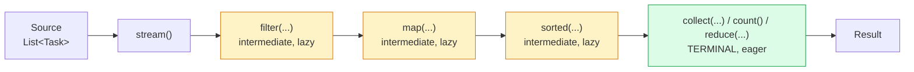

# Streams API (Practical)

> Where this fits: every time our Task Queue needs to *answer a question about a pile of tasks* —
> "how many failed?", "what's the success rate by type?", "which 50 tasks are due now?" — we are
> doing aggregation over collections. The Streams API is the idiomatic Java tool for turning that
> imperative loop-and-accumulate code into declarative, composable, testable pipelines. We will use it
> to build a `TaskStats` aggregation that the Phase 3 metrics layer reports to Prometheus.

---

## 1. Why this exists — the real problem it solves

Before Java 8 (2014), every "compute something over a collection" task was a hand-written loop with
mutable accumulators. Consider a question our platform asks constantly: *what fraction of `EMAIL` tasks
succeeded in this batch?* The pre-streams code looked like this:

```java
int total = 0;
int succeeded = 0;
for (Task t : tasks) {
    if (!"EMAIL".equals(t.type())) continue;
    total++;
    if (t.status() == TaskStatus.SUCCEEDED) succeeded++;
}
double rate = total == 0 ? 0.0 : (double) succeeded / total;
```

This works, but it has chronic problems that scale badly across a 130-file codebase:

- **Intent is buried.** Three concerns — *filter by type*, *count*, *count a sub-condition* — are
  interleaved in one loop. A reader must execute the loop in their head to recover the intent.
- **Mutable accumulators are bug magnets.** `total`, `succeeded`, the guard `total == 0` — each is a
  place to introduce an off-by-one or a divide-by-zero.
- **No composition.** If you now also want success-rate *by* type, you copy the loop and add a `Map`.
  The structure does not reuse.
- **No parallelism path.** Splitting this loop across cores by hand means locks or partitioning code.

The Streams API exists to express **what** you want (filter, map, group, reduce) and let the library
decide **how** (iteration order, fusion, parallel splitting). It is Java's answer to LINQ (C#), to
collection pipelines in Smalltalk/Ruby, and to the map/filter/reduce vocabulary that DSA folks already
know from functional programming. The same question becomes:

```java
double rate = tasks.stream()
    .filter(t -> "EMAIL".equals(t.type()))
    .collect(Collectors.teeing(
        Collectors.counting(),
        Collectors.filtering(t -> t.status() == TaskStatus.SUCCEEDED, Collectors.counting()),
        (total, ok) -> total == 0 ? 0.0 : (double) ok / total));
```

> A stream is **not** a data structure. It is a *pipeline description* over a source. It holds no
> storage, is consumed at most once, and does nothing until a terminal operation pulls values through.

The canonical model is defined once in [chapter-01-classes-and-objects.md](./chapter-01-classes-and-objects.md)
and the collection types we stream over come from [chapter-05-collections.md](./chapter-05-collections.md).
Throughout this chapter we use the `Task` record and `TaskStatus` enum from the SPEC.

---

## 2. The mental model: source → intermediate ops → terminal op



Three categories:

| Category | Examples | Returns | Eager/Lazy |
|---|---|---|---|
| **Source** | `collection.stream()`, `Stream.of`, `IntStream.range`, `Stream.iterate` | a `Stream` | — |
| **Intermediate** | `filter`, `map`, `flatMap`, `sorted`, `distinct`, `limit`, `peek`, `mapToInt` | a new `Stream` | **lazy** |
| **Terminal** | `collect`, `reduce`, `count`, `forEach`, `findFirst`, `anyMatch`, `toList` | a value / side effect | **eager** |

The single most important fact: **intermediate operations build a recipe; nothing runs until the
terminal operation is called.** That laziness is what enables short-circuiting (`findFirst`, `limit`,
`anyMatch`) and loop fusion (filter+map run in one pass, not two).

---

## 3. The naive version — a hand-rolled `TaskStats`

Here is a first-cut aggregator a newcomer writes for the Worker dashboard. It loops repeatedly over the
same list, once per metric.

```java
// NAIVE: correct but verbose, repetitive, and O(7 * n) passes.
public final class NaiveTaskStats {

    public static Map<String, Object> compute(List<Task> tasks) {
        Map<String, Object> out = new HashMap<>();

        // count by status — manual map building
        Map<TaskStatus, Integer> byStatus = new HashMap<>();
        for (Task t : tasks) {
            Integer c = byStatus.get(t.status());
            byStatus.put(t.status(), c == null ? 1 : c + 1);
        }
        out.put("byStatus", byStatus);

        // success rate — separate pass
        int total = 0, ok = 0;
        for (Task t : tasks) {
            total++;
            if (t.status() == TaskStatus.SUCCEEDED) ok++;
        }
        out.put("successRate", total == 0 ? 0.0 : (double) ok / total);

        // average attempts — yet another pass
        int sumAttempts = 0;
        for (Task t : tasks) sumAttempts += t.attempts();
        out.put("avgAttempts", tasks.isEmpty() ? 0.0 : (double) sumAttempts / tasks.size());

        return out;
    }
}
```

**Limitations:**

- **Stringly-typed result.** `Map<String, Object>` defeats the compiler — callers cast and pray.
- **Multiple passes.** Three loops over `tasks`. Fine for hundreds of items, wasteful for millions.
- **Manual map accumulation.** The `c == null ? 1 : c + 1` idiom is repeated and error-prone.
- **Not composable.** Adding "by type" means another loop and another untyped map entry.

---

## 4. Improved version — streams, but still loose

Replace each loop with a stream pipeline and return a typed record. This is a big readability win and
removes the null-checking, but it still walks the list multiple times and the metrics aren't unified.

```java
public record TaskStats(
        Map<TaskStatus, Long> countByStatus,
        double successRate,
        double avgAttempts) {

    public static TaskStats of(List<Task> tasks) {
        Map<TaskStatus, Long> byStatus = tasks.stream()
            .collect(Collectors.groupingBy(Task::status, Collectors.counting()));

        long total = tasks.size();
        long ok = tasks.stream()
            .filter(t -> t.status() == TaskStatus.SUCCEEDED)
            .count();
        double successRate = total == 0 ? 0.0 : (double) ok / total;

        double avgAttempts = tasks.stream()
            .mapToInt(Task::attempts)
            .average()
            .orElse(0.0);

        return new TaskStats(byStatus, successRate, avgAttempts);
    }
}
```

**What got better:** typed record result, no manual map building (`groupingBy` + `counting`),
no divide-by-zero on `average()` (it returns `OptionalDouble`). **What's still off:** three passes
(`groupingBy`, `filter().count()`, `mapToInt().average()`) over the same data, and the success count
could be derived from `countByStatus` instead of re-scanning.

---

## 5. Production-quality version — one pass, immutable, derived metrics

A staff engineer wants: a **single pass** over the data (cheap for large batches and required for
streaming/`Iterator` sources you can only traverse once), **immutable** outputs, and metrics that are
*derived* rather than independently recomputed (so they can't disagree). We collect raw counts in one
sweep and compute ratios from them.

```java
import java.util.EnumMap;
import java.util.Map;
import java.util.stream.Stream;

/**
 * Immutable aggregation of a batch of tasks, computed in a single pass.
 * Feeds the Phase 3 MetricsCollector / Micrometer gauges.
 */
public record TaskStats(
        long total,
        Map<TaskStatus, Long> countByStatus,
        Map<String, Long> countByType,
        double avgAttempts,
        long maxAttempts) {

    /** Derived metric: succeeded / total, guarded against empty batches. */
    public double successRate() {
        if (total == 0) return 0.0;
        long ok = countByStatus.getOrDefault(TaskStatus.SUCCEEDED, 0L);
        return (double) ok / total;
    }

    /** Derived metric: (failed + dead) / total — what alerting cares about. */
    public double failureRate() {
        if (total == 0) return 0.0;
        long bad = countByStatus.getOrDefault(TaskStatus.FAILED, 0L)
                 + countByStatus.getOrDefault(TaskStatus.DEAD, 0L);
        return (double) bad / total;
    }

    /** Single-pass factory. Works on any Stream, including one-shot sources. */
    public static TaskStats from(Stream<Task> tasks) {
        Accumulator acc = tasks.collect(
            Accumulator::new,
            Accumulator::accept,
            Accumulator::combine);   // combiner used only for parallel streams
        return acc.toStats();
    }

    public static TaskStats from(java.util.Collection<Task> tasks) {
        return from(tasks.stream());
    }

    /** Mutable internal accumulator — never escapes this class. */
    private static final class Accumulator {
        long total;
        long attemptsSum;
        long maxAttempts;
        final EnumMap<TaskStatus, Long> byStatus = new EnumMap<>(TaskStatus.class);
        final java.util.HashMap<String, Long> byType = new java.util.HashMap<>();

        void accept(Task t) {
            total++;
            attemptsSum += t.attempts();
            maxAttempts = Math.max(maxAttempts, t.attempts());
            byStatus.merge(t.status(), 1L, Long::sum);
            byType.merge(t.type(), 1L, Long::sum);
        }

        void combine(Accumulator other) {
            total += other.total;
            attemptsSum += other.attemptsSum;
            maxAttempts = Math.max(maxAttempts, other.maxAttempts);
            other.byStatus.forEach((k, v) -> byStatus.merge(k, v, Long::sum));
            other.byType.forEach((k, v) -> byType.merge(k, v, Long::sum));
        }

        TaskStats toStats() {
            double avg = total == 0 ? 0.0 : (double) attemptsSum / total;
            return new TaskStats(
                total,
                Map.copyOf(byStatus),   // defensive immutable copies
                Map.copyOf(byType),
                avg,
                maxAttempts);
        }
    }
}
```

Why this is the shippable version:

- **One pass.** `accept` updates every counter for each task exactly once — O(n), one traversal.
  This matters when the source is a `pollDue(n)` result you may want to consume lazily.
- **Parallel-ready, safely.** The 3-arg `collect(supplier, accumulator, combiner)` form gives a
  *per-thread* `Accumulator`, then merges them with `combine`. No shared mutable state, so
  `tasks.parallelStream()` works without locks (more on this in §8 and §14).
- **Derived metrics can't drift.** `successRate()` and `failureRate()` read the same `countByStatus`,
  so they always agree with it.
- **Immutable result.** `Map.copyOf` means callers can't mutate the stats, safe to cache and hand to
  multiple metric exporters.
- **`EnumMap` for status.** Backed by an array indexed by the enum ordinal — faster and smaller than a
  `HashMap` for a fixed key set (see [chapter-05-collections.md](./chapter-05-collections.md)).

---

## 6. Code walkthrough — beginner → intermediate → production

### 6a. Beginner: filter, map, collect

The three operations you will use 80% of the time. Take a list of tasks, keep the failed ones, extract
their ids, collect to a list.

```java
import java.util.List;

List<Task> tasks = loadBatch();

// filter: keep only DEAD tasks; map: Task -> its id; toList: terminal collect.
List<String> deadIds = tasks.stream()
    .filter(t -> t.status() == TaskStatus.DEAD)   // Predicate<Task>
    .map(Task::id)                                 // Function<Task, String>
    .toList();                                     // Java 16+, returns unmodifiable List

System.out.println("Dead tasks: " + deadIds);
```

Key beginner facts:
- `filter` takes a `Predicate<Task>` (returns boolean), `map` takes a `Function<Task, R>`.
  These functional interfaces are covered in [chapter-08-functional-interfaces.md](./chapter-08-functional-interfaces.md).
- `Task::id` is a **method reference**, shorthand for `t -> t.id()`.
- `.toList()` (Java 16+) returns an **unmodifiable** list; the older `.collect(Collectors.toList())`
  returns a list with no mutability guarantee. Prefer `.toList()`.

### 6b. Intermediate: groupingBy, counting, mapping, partitioningBy

Now compute structured aggregates — the bread and butter of metrics.

```java
import java.util.List;
import java.util.Map;
import java.util.stream.Collectors;

List<Task> tasks = loadBatch();

// 1) Count tasks per status: Map<TaskStatus, Long>
Map<TaskStatus, Long> byStatus = tasks.stream()
    .collect(Collectors.groupingBy(Task::status, Collectors.counting()));

// 2) Group ids by type: Map<String, List<String>>  (downstream 'mapping')
Map<String, List<String>> idsByType = tasks.stream()
    .collect(Collectors.groupingBy(
        Task::type,
        Collectors.mapping(Task::id, Collectors.toList())));

// 3) Split into done vs not-done: Map<Boolean, List<Task>>
Map<Boolean, List<Task>> partition = tasks.stream()
    .collect(Collectors.partitioningBy(t -> t.status() == TaskStatus.SUCCEEDED));
List<Task> done = partition.get(true);
List<Task> pending = partition.get(false);

// 4) Average attempts per type: Map<String, Double>
Map<String, Double> avgAttemptsByType = tasks.stream()
    .collect(Collectors.groupingBy(
        Task::type,
        Collectors.averagingInt(Task::attempts)));
```

Notes:
- `groupingBy(classifier, downstream)` is the workhorse. The downstream collector
  (`counting`, `mapping`, `averagingInt`, `summingLong`, nested `groupingBy`, ...) decides what each
  group reduces to. This composability is exactly what the naive version lacked.
- `partitioningBy` is a specialized `groupingBy` for a boolean — it *always* returns both `true` and
  `false` keys (even when empty), which `groupingBy` does not guarantee.

### 6c. Production-inspired: reduce, teeing, and feeding a MeterRegistry

A `MetricsReporter` that computes our `TaskStats` once and publishes the derived numbers to Micrometer.
This is the shape Phase 3 ships (Micrometer wiring detailed in
[../10-system-design/observability-and-ops.md](../10-system-design/observability-and-ops.md)).

```java
import io.micrometer.core.instrument.MeterRegistry;
import io.micrometer.core.instrument.Tags;
import java.util.List;

public final class MetricsReporter {

    private final MeterRegistry registry;

    public MetricsReporter(MeterRegistry registry) {
        this.registry = registry;
    }

    /** Compute once, publish many gauges/counters from the single TaskStats. */
    public TaskStats reportBatch(List<Task> batch) {
        TaskStats stats = TaskStats.from(batch);   // one pass, see §5

        registry.gauge("taskqueue.batch.success_rate", stats.successRate());
        registry.gauge("taskqueue.batch.failure_rate", stats.failureRate());
        registry.gauge("taskqueue.batch.avg_attempts", stats.avgAttempts());

        // one counter per status, tagged — Prometheus-friendly cardinality (7 statuses)
        stats.countByStatus().forEach((status, count) ->
            registry.counter("taskqueue.tasks.total",
                Tags.of("status", status.name())).increment(count));

        return stats;
    }
}
```

And a pure-`reduce` example for when you need a custom fold with no `Collector` — find the task with the
most attempts (the "most-retried" offender), without sorting the whole batch:

```java
import java.util.Comparator;
import java.util.Optional;
import java.util.function.BinaryOperator;

Optional<Task> mostRetried = tasks.stream()
    .reduce(BinaryOperator.maxBy(Comparator.comparingInt(Task::attempts)));

mostRetried.ifPresent(t ->
    System.out.printf("Worst offender: %s (%d attempts)%n", t.id(), t.attempts()));
```

> Prefer `max(comparator)` over `reduce(maxBy(...))` for readability when both work; use raw `reduce`
> when your fold isn't a simple min/max/sum and no built-in collector fits.

---

## 7. How this applies to our Task Queue project

Concrete touchpoints across the canonical model:

| Where | Stream usage |
|---|---|
| **`TaskRepository.pollDue(n)`** | filter due tasks (`scheduledAt <= now`), `sorted` by `priority` then `createdAt`, `limit(n)`, `toList()` — the dispatcher's selection query. |
| **`MetricsCollector` / Phase 3** | `TaskStats.from(...)` → counts by status, success/failure rate, avg attempts → Micrometer gauges. |
| **`DeadLetterQueue` triage** | `groupingBy(Task::type, counting())` on DLQ contents to find which task *type* is failing most. |
| **`WorkerPool` health** | partition in-flight tasks into `RUNNING` vs stuck, count by handler type. |
| **`TaskScheduler`** | map a list of `Task` to `Duration` delays, `min`/`max` to find the next wake-up. |
| **Admin API** | `GET /tasks?status=FAILED` filters and maps to DTOs before JSON serialization. |

Example — the dispatcher's `pollDue` selection logic done as a stream (the in-memory Phase 1 variant;
Phase 2 pushes this into SQL — see [../07-queues-and-messaging/task-queues.md](../07-queues-and-messaging/task-queues.md)):

```java
import java.time.Instant;
import java.util.Comparator;
import java.util.List;

public List<Task> pollDue(List<Task> all, int n, Instant now) {
    return all.stream()
        .filter(t -> t.status() == TaskStatus.SCHEDULED || t.status() == TaskStatus.PENDING)
        .filter(t -> !t.scheduledAt().isAfter(now))                // due now
        .sorted(Comparator.comparingInt(Task::priority).reversed() // high priority first
            .thenComparing(Task::createdAt))                       // then FIFO
        .limit(n)                                                  // short-circuits: stops early
        .toList();
}
```

`limit(n)` is the laziness payoff: combined with `sorted`, the stream still must sort to honor ordering,
but for an *unsorted* `findFirst`/`anyMatch` query the pipeline stops the instant it has an answer
instead of scanning the whole list.

---

## 8. Tradeoffs — streams vs loops, sequential vs parallel

### Streams vs imperative loops

| Dimension | Stream pipeline | Imperative `for` loop |
|---|---|---|
| Readability for filter/map/group | Excellent — reads like the intent | Verbose, intent buried |
| Multi-condition control flow (break, continue, early return into outer logic) | Awkward; `takeWhile`/`findFirst` only | Natural |
| Mutating external state | Anti-pattern (forbidden in parallel) | Natural |
| Debugging / stack traces | Harder; lambdas show as synthetic frames | Easy; line-by-line |
| Performance (small n) | Tiny overhead from pipeline setup | Marginally faster |
| Performance (large n, CPU-bound) | Can go parallel for free | Manual threading |
| Index-based / two-collection zip | Clumsy | Natural |

**Rule of thumb:** use a stream when you are *transforming or aggregating* a collection into another
value. Use a plain loop when you are doing *side-effecting control flow*, need indices, need `break`
into surrounding logic, or are mutating things. A `forEach` that just mutates external state is a loop
wearing a stream costume — write the loop.

```java
// DON'T: stream as a disguised loop with side effects.
tasks.stream().forEach(t -> repository.save(t));   // noise, no transformation

// DO: a plain enhanced-for is clearer for pure side effects.
for (Task t : tasks) {
    repository.save(t);
}
```

### Sequential vs parallel streams

`parallelStream()` (or `stream().parallel()`) splits work across the common `ForkJoinPool`. It is a
sharp tool:

| Use parallel when... | Avoid parallel when... |
|---|---|
| n is large (tens of thousands+) | n is small — split/merge overhead dominates |
| per-element work is non-trivial and CPU-bound | per-element work is cheap (the overhead wins) |
| the source splits cheaply (`ArrayList`, arrays, `IntStream.range`) | source splits poorly (`LinkedList`, `Iterator`, `Stream.iterate`) |
| operations are stateless and associative | you do I/O / blocking calls (starves the shared pool) |
| you don't depend on encounter order | you call `forEachOrdered` / rely on order (kills the speedup) |

> The common `ForkJoinPool` is **JVM-wide and shared**. A blocking `parallelStream()` (e.g. one that
> calls a database per element) can starve every other parallel stream in the process. For per-task I/O
> in our platform, use the `WorkerPool`'s `ExecutorService` and virtual threads instead
> (see [../06-concurrency/executor-service.md](../06-concurrency/executor-service.md) and
> [../06-concurrency/futures-and-completablefuture.md](../06-concurrency/futures-and-completablefuture.md)),
> not `parallelStream`.

---

## 9. Common mistakes and pitfalls

- **Reusing a consumed stream.** A stream can be traversed once. A second terminal op throws
  `IllegalStateException: stream has already been operated upon or closed`.
  *Fix:* re-create the stream from the source, or collect to a `List` and reuse that.
- **Treating intermediate ops as eager.** `tasks.stream().filter(...)` with no terminal does *nothing*.
  Side effects in `peek`/`map` never run without a terminal op. *Fix:* always end with a terminal op.
- **Mutating external state in `map`/`peek`.** Breaks in parallel and surprises in sequential.
  *Fix:* use a `Collector` / `reduce` to accumulate; keep the pipeline pure.
- **`NullPointerException` from `null` elements.** `groupingBy`'s classifier returning `null` throws.
  *Fix:* filter out nulls first, or map `null` to a sentinel.
- **`Collectors.toMap` on duplicate keys.** Throws `IllegalStateException: Duplicate key`.
  *Fix:* supply the merge function: `toMap(Task::id, t -> t, (a, b) -> b)`.
- **`peek` for logic, not logging.** `peek` is for debugging/observability; the JVM may *elide* it if
  no downstream needs the element. *Fix:* never put load-bearing side effects in `peek`.
- **Boxing in hot loops.** `stream().map(Task::attempts).reduce(0, Integer::sum)` boxes every int.
  *Fix:* `mapToInt(Task::attempts).sum()` — primitive `IntStream`, no boxing.
- **`parallelStream()` by reflex.** Often *slower* for small/cheap workloads and dangerous with shared
  state or I/O. *Fix:* default to sequential; parallelize only after measuring.
- **Infinite streams without a bound.** `Stream.iterate(0, i -> i + 1).forEach(...)` never terminates.
  *Fix:* add `limit(n)` or `takeWhile(...)`.

---

## 10. Refactoring exercise — bad → improved → production

**The task:** produce a per-type success report: for each task type, how many ran, how many succeeded,
and the success rate, returned in a stable, typed form.

### Bad

```java
// BAD: nested loops, manual maps, stringly-typed, O(types * n).
public static Map<String, double[]> reportBad(List<Task> tasks) {
    Map<String, double[]> report = new HashMap<>();
    Set<String> types = new HashSet<>();
    for (Task t : tasks) types.add(t.type());
    for (String type : types) {
        int total = 0, ok = 0;
        for (Task t : tasks) {                 // inner loop per type — O(types * n)
            if (t.type().equals(type)) {
                total++;
                if (t.status() == TaskStatus.SUCCEEDED) ok++;
            }
        }
        report.put(type, new double[]{ total, ok, total == 0 ? 0 : (double) ok / total });
    }
    return report;                              // double[] is a typeless tuple — terrible API
}
```

### Improved

```java
// IMPROVED: single groupingBy, typed record, but two passes to combine counts.
public record TypeReport(String type, long total, long succeeded, double successRate) {}

public static Map<String, TypeReport> reportImproved(List<Task> tasks) {
    Map<String, Long> totals = tasks.stream()
        .collect(Collectors.groupingBy(Task::type, Collectors.counting()));
    Map<String, Long> oks = tasks.stream()
        .filter(t -> t.status() == TaskStatus.SUCCEEDED)
        .collect(Collectors.groupingBy(Task::type, Collectors.counting()));

    Map<String, TypeReport> out = new HashMap<>();
    totals.forEach((type, total) -> {
        long ok = oks.getOrDefault(type, 0L);
        out.put(type, new TypeReport(type, total, ok, total == 0 ? 0 : (double) ok / total));
    });
    return out;
}
```

### Production

```java
// PRODUCTION: one pass for the grouping, custom downstream via teeing, immutable typed result.
public record TypeReport(String type, long total, long succeeded, double successRate) {
    static TypeReport of(String type, long total, long succeeded) {
        return new TypeReport(type, total, succeeded, total == 0 ? 0.0 : (double) succeeded / total);
    }
}

public static Map<String, TypeReport> reportProduction(List<Task> tasks) {
    // One pass: bucket by type, and within each bucket teeing computes total + succeeded together.
    Map<String, long[]> raw = tasks.stream().collect(Collectors.groupingBy(
        Task::type,
        Collectors.teeing(
            Collectors.counting(),                                    // total in this group
            Collectors.filtering(t -> t.status() == TaskStatus.SUCCEEDED,
                                 Collectors.counting()),              // succeeded in this group
            (total, ok) -> new long[]{ total, ok })));

    // Second tiny pass is over the grouped map (one entry per type), so effectively free.
    return raw.entrySet().stream()
        .collect(Collectors.toMap(
            Map.Entry::getKey,
            e -> TypeReport.of(e.getKey(), e.getValue()[0], e.getValue()[1])));
}
```

The production version walks the source **once** for the grouping; `teeing` runs the two sub-collectors
(`counting` and filtered `counting`) over the same group simultaneously. The result is immutable, typed,
and computes the rate at construction so it can never disagree with the counts.

> If readability matters more than the single-pass guarantee, the *Improved* version is a perfectly
> defensible production choice for batches in the thousands. Don't optimize passes you can't measure.

---

## 11. Exercises

### Easy

- **E1 (knowledge check).** Explain in one sentence each: why is `filter` lazy, and what makes `count`
  eager? Why can a stream be consumed only once?
- **E2 (coding).** Given `List<Task> tasks`, write a one-liner that returns the number of tasks whose
  status is `RETRYING`. Use a primitive stream where it helps.
- **E3 (coding).** Return a `List<String>` of the ids of all `DEAD` tasks, sorted alphabetically.

### Medium

- **M1 (coding).** Write `Map<TaskStatus, Long> countByStatus(List<Task>)` that returns a count for
  **every** `TaskStatus` value, including statuses with zero tasks (plain `groupingBy` omits empties).
- **M2 (refactoring).** Refactor this boxed reduction to avoid boxing and divide-by-zero:
  ```java
  double avg = tasks.stream().map(Task::attempts)
      .reduce(0, Integer::sum) / (double) tasks.size();
  ```
- **M3 (design).** Design a method `Optional<Task> nextDue(List<Task>, Instant now)` returning the
  single highest-priority due task without sorting the entire list. Explain the complexity.

### Hard

- **H1 (interview-style).** Implement `TaskStats.from(Stream<Task>)` so it works correctly on a
  `parallelStream()` and on a one-shot `Iterator`-backed stream. State the constraints your
  accumulator must satisfy for parallel correctness.
- **H2 (stretch).** Build a `successRateByType` report **and** detect the type with the worst success
  rate (min by rate, ties broken by higher volume) in a *single* pass over the data. Return
  `record WorstType(String type, double rate, long total)`.

---

## 12. Solutions

### E1
`filter` returns a new `Stream` describing a step; it stores the predicate and does no work until a
terminal op pulls elements through, so it is *lazy* (enables short-circuiting and fusion). `count` must
inspect/iterate the pipeline to produce a number, so it is *eager* — it triggers execution. A stream is
consumed once because it models a *traversal* of a source, not storage; after the terminal op the
pipeline state is spent, and re-traversing would require buffering it never holds.

### E2
```java
long retrying = tasks.stream()
    .filter(t -> t.status() == TaskStatus.RETRYING)
    .count();
```

### E3
```java
import java.util.List;
List<String> deadSorted = tasks.stream()
    .filter(t -> t.status() == TaskStatus.DEAD)
    .map(Task::id)
    .sorted()
    .toList();
```

### M1
```java
import java.util.EnumMap;
import java.util.List;
import java.util.Map;
import java.util.stream.Collectors;

public static Map<TaskStatus, Long> countByStatus(List<Task> tasks) {
    // Start from a complete EnumMap of zeros so every status appears.
    EnumMap<TaskStatus, Long> base = new EnumMap<>(TaskStatus.class);
    for (TaskStatus s : TaskStatus.values()) base.put(s, 0L);

    Map<TaskStatus, Long> counted = tasks.stream()
        .collect(Collectors.groupingBy(Task::status, Collectors.counting()));

    base.putAll(counted);   // overwrite zeros where we have data
    return Map.copyOf(base);
}
```
*Why:* `groupingBy` only creates keys for statuses that occur. Seeding a full `EnumMap` of zeros
guarantees all seven enum values are present — important for stable dashboards and Prometheus labels.

### M2
```java
double avg = tasks.stream()
    .mapToInt(Task::attempts)   // IntStream — no boxing
    .average()                  // OptionalDouble — handles empty list
    .orElse(0.0);
```
*Why:* `mapToInt` avoids boxing every `int` into `Integer`; `average()` returns `OptionalDouble`, so
`orElse(0.0)` removes the divide-by-zero risk the original had on an empty list.

### M3
```java
import java.time.Instant;
import java.util.Comparator;
import java.util.List;
import java.util.Optional;

public static Optional<Task> nextDue(List<Task> tasks, Instant now) {
    return tasks.stream()
        .filter(t -> !t.scheduledAt().isAfter(now))                 // due
        .max(Comparator.comparingInt(Task::priority)               // highest priority
            .thenComparing(Task::createdAt, Comparator.reverseOrder())); // older wins on tie
}
```
*Complexity:* O(n) single linear scan — `max` tracks the current best as it goes; no sort. This beats
`sorted().findFirst()` which is O(n log n). For one element, never sort.

### H1
```java
import java.util.stream.Stream;

public static TaskStats from(Stream<Task> tasks) {
    return tasks.collect(Accumulator::new, Accumulator::accept, Accumulator::combine)
                .toStats();
}
```
(Using the `Accumulator` from §5.) **Constraints for parallel correctness:**
1. **Supplier** produces a *fresh, independent* accumulator per split — no shared state.
2. **Accumulator** (`accept`) is associative and order-independent in effect (counting and summing are).
3. **Combiner** (`combine`) merges two partials into a result equal to having accumulated them
   sequentially — counts add, max takes the larger, sums add. Because each thread owns its own
   `Accumulator`, there is no data race; the `combine` step is the only cross-thread interaction and it
   is itself a pure merge. A one-shot `Iterator` source works too because we traverse exactly once.

### H2
```java
import java.util.Comparator;
import java.util.List;
import java.util.Map;
import java.util.stream.Collectors;

public record WorstType(String type, double rate, long total) {}

public static WorstType worstSuccessRate(List<Task> tasks) {
    // ONE pass: per type, collect [total, succeeded] via teeing.
    Map<String, long[]> perType = tasks.stream().collect(Collectors.groupingBy(
        Task::type,
        Collectors.teeing(
            Collectors.counting(),
            Collectors.filtering(t -> t.status() == TaskStatus.SUCCEEDED, Collectors.counting()),
            (total, ok) -> new long[]{ total, ok })));

    return perType.entrySet().stream()
        .map(e -> new WorstType(
            e.getKey(),
            e.getValue()[0] == 0 ? 0.0 : (double) e.getValue()[1] / e.getValue()[0],
            e.getValue()[0]))
        .min(Comparator.comparingDouble(WorstType::rate)
            .thenComparing(Comparator.comparingLong(WorstType::total).reversed()))
        .orElse(new WorstType("none", 1.0, 0));
}
```
*Why:* the grouping + `teeing` does the heavy aggregation in a single traversal of `tasks`. The second
stream is over the *grouped map* (one entry per type — tiny), so it's effectively free. Ties on rate
break toward the higher-volume type, which is the one worth alerting on.

---

## 13. Interview questions and takeaways

1. **Q: What is the difference between intermediate and terminal operations?**
   A: Intermediate ops (`filter`, `map`, `sorted`) return a new `Stream` and are *lazy* — they build a
   pipeline and run nothing. Terminal ops (`collect`, `count`, `reduce`, `forEach`) are *eager*, trigger
   execution, and produce a value or side effect. A pipeline runs only when a terminal op is attached.

2. **Q: Can you reuse a stream? What happens if you try?**
   A: No. A stream is single-use; a second terminal op throws `IllegalStateException`. Re-derive it from
   the source, or collect to a `List` and reuse the list.

3. **Q: `map` vs `flatMap`?**
   A: `map` is one-to-one (`Stream<Task>` → `Stream<String>`). `flatMap` is one-to-many: each element
   produces a stream and they are concatenated — e.g. `Stream<Order>` → `Stream<LineItem>` by flattening
   each order's items. Use `flatMap` to unnest.

4. **Q: How does `groupingBy` differ from `partitioningBy`?**
   A: `groupingBy(classifier)` buckets by any key and only creates keys that occur. `partitioningBy`
   takes a `Predicate` and *always* returns exactly two keys, `true` and `false`, even when one is empty.

5. **Q: When should you NOT use a stream?**
   A: For pure side-effecting control flow, when you need indices or to `break` into surrounding logic,
   when mutating external state, or for trivial single-element work where a loop is clearer. Streams are
   for transforming/aggregating collections into values.

6. **Q: When is `parallelStream()` a good idea, and what are its dangers?**
   A: Good when n is large, per-element work is CPU-bound and stateless, and the source splits cheaply
   (array/`ArrayList`). Dangers: shared mutable state causes races; blocking I/O starves the shared
   common `ForkJoinPool`; order-sensitive ops negate the speedup. Measure before parallelizing.

7. **Q: Why prefer `mapToInt(...).sum()` over `map(...).reduce(0, Integer::sum)`?**
   A: The primitive `IntStream` avoids autoboxing every value into `Integer`, eliminating allocation and
   GC pressure in hot paths. `IntStream` also offers `sum`, `average`, `summaryStatistics` directly.

8. **Q: What does `peek` do and why is it risky for logic?**
   A: `peek` is an intermediate op meant for debugging/observability. The JVM may skip it if no
   downstream consumes the element (e.g. with `count` over a sized source), so never put load-bearing
   side effects in it.

9. **Q: How do `collect(Collector)` and the 3-arg `collect(supplier, accumulator, combiner)` relate?**
   A: A `Collector` bundles supplier+accumulator+combiner+finisher into a reusable object. The 3-arg
   form is an ad-hoc, inline mutable reduction without a finisher — handy for one-off accumulators like
   our `TaskStats.Accumulator`.

**Takeaways:** think *source → lazy intermediates → eager terminal*; one pass beats many; keep pipelines
pure; reach for the primitive stream variants in hot loops; default to sequential and parallelize only
with evidence.

---

## 14. Production considerations

- **Cardinality of grouping keys.** `groupingBy(Task::type)` is safe (handful of types). Never
  `groupingBy` on something unbounded like `Task::id` for metrics — it explodes Prometheus label
  cardinality and memory. Aggregate on low-cardinality dimensions only.
- **Large batches and memory.** `collect(toList())` materializes everything; for millions of rows
  prefer streaming from the DB (Phase 2 `pollDue(n)` with a bounded `n`) and aggregating incrementally,
  or use a single-pass collector like `TaskStats.from` so you never hold the whole batch plus derived
  copies.
- **The shared `ForkJoinPool`.** `parallelStream()` uses one JVM-wide pool sized to `cores - 1` by
  default. A blocking parallel stream (DB/HTTP per element) can deadlock or starve unrelated parallel
  work elsewhere in the service. For per-task I/O, use the `WorkerPool` executor and virtual threads,
  not parallel streams.
- **Determinism and order.** Parallel streams may change encounter order for `forEach`; use
  `forEachOrdered` if order matters (but that erases much of the parallel benefit). `findAny` may return
  different elements across runs — only use it when any match is acceptable.
- **Exceptions in lambdas.** A `TaskHandler` throwing a checked exception can't flow through a plain
  `map` (lambdas can't declare checked exceptions). Wrap into an unchecked exception or filter to
  `TaskResult` first. See [chapter-06-exceptions.md](./chapter-06-exceptions.md).
- **Observability of the pipeline itself.** Streams give no per-stage metrics. To time aggregation,
  wrap the terminal op in a Micrometer `Timer` rather than peppering `peek` calls.
- **Stable stats for dashboards.** Always seed full enum/key sets (see M1) so a status with zero tasks
  still reports `0`, preventing gaps and broken Grafana panels.

---

## What We Can Improve In Our Project Using This Concept

Today the Phase 1 dashboard counts tasks with hand-written loops scattered across the `WorkerPool` and
an ad-hoc admin endpoint. We can: (1) introduce a single immutable `TaskStats` record computed in one
pass; (2) replace every counting loop with `TaskStats.from(...)`; (3) derive `successRate`/`failureRate`
from `countByStatus` so they can never disagree; (4) feed those numbers straight into the Phase 3
`MetricsCollector`/Micrometer registry; and (5) reuse `groupingBy(Task::type, counting())` for DLQ
triage. This collapses duplicated, multi-pass, stringly-typed metric code into one tested aggregator.

## Project Refactoring Task

Create `TaskStats` (record + private single-pass `Accumulator`) as in §5, with `from(Stream<Task>)`,
`from(Collection<Task>)`, `successRate()`, `failureRate()`, `countByStatus()`, `countByType()`,
`avgAttempts()`, and `maxAttempts()`. Replace all inline counting loops in `WorkerPool` and the admin
endpoint with calls to it. Add a `MetricsReporter.reportBatch` (§6c) that publishes the derived metrics.
Write tests proving: empty batch → all-zero stats with no exceptions; mixed batch → correct counts and
rates; and that `TaskStats.from(list.parallelStream())` equals the sequential result.

## Git Commit For This Chapter

```text
feat(metrics): add single-pass immutable TaskStats aggregation over task batches

- add TaskStats record with EnumMap-backed countByStatus and countByType
- compute total, avgAttempts, maxAttempts in one pass via private Accumulator
- derive successRate/failureRate from counts so they cannot diverge
- support sequential and parallel streams via supplier/accumulator/combiner collect
- add MetricsReporter.reportBatch to publish derived gauges/counters to Micrometer
- replace ad-hoc counting loops in WorkerPool and admin endpoint with TaskStats

Files touched:
  src/main/java/.../metrics/TaskStats.java           (new)
  src/main/java/.../metrics/MetricsReporter.java      (new)
  src/main/java/.../worker/WorkerPool.java            (refactor)
  src/main/java/.../api/AdminController.java           (refactor)
  src/test/java/.../metrics/TaskStatsTest.java         (new)
```

## Architecture Impact

`TaskStats` becomes the **single aggregation boundary** between raw task data and every consumer of
metrics — dashboards, the admin API, alerting, and the Prometheus exporter. By making it immutable,
single-pass, and parallel-safe, we get a component that scales from in-memory Phase 1 lists to
Phase 2/3 DB-paged batches without rewrites: the collector logic is identical whether the `Stream<Task>`
comes from a `List` or a JDBC `ResultSet` stream. It also enforces the principle that *derived metrics
are computed from a common source of truth*, eliminating an entire class of "the two numbers on the
dashboard don't add up" bugs.

## Interview Takeaways

- Streams express *what*, not *how*: source → lazy intermediate ops → one eager terminal op.
- A stream is single-use and stores nothing; it is a pipeline over a source, not a collection.
- Prefer one pass and immutable results; derive ratios from shared counts so they can't disagree.
- Use `groupingBy`/`partitioningBy`/`teeing`/`mapping` to compose aggregations declaratively.
- Reach for primitive streams (`mapToInt().sum()`) in hot paths to avoid boxing.
- Default to sequential; `parallelStream()` only for large, CPU-bound, stateless, cheaply-splittable
  work — never for blocking I/O on the shared `ForkJoinPool`.
- Know when to *not* use streams: side-effecting control flow, indices, and `break` belong in loops.
