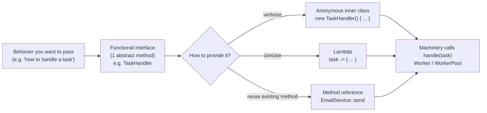
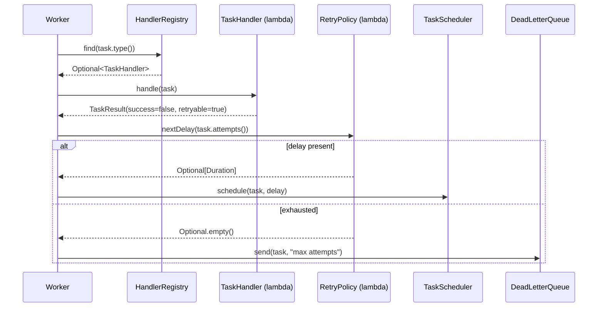
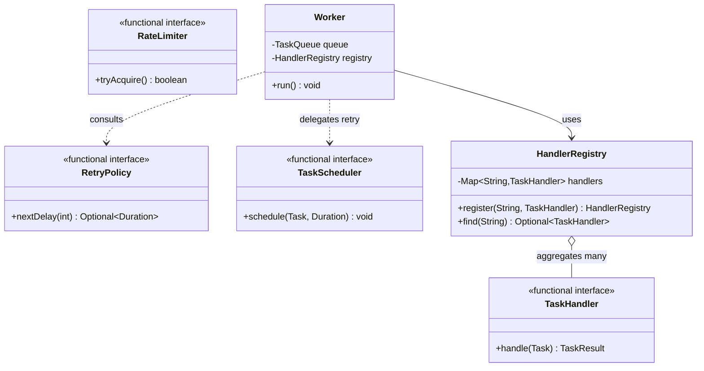

# Functional Interfaces and Lambdas

> Where this fits in the project: our entire worker pipeline is built on *behavior passed as data*.
> A `TaskHandler` is "the code that runs for a task type." A `RetryPolicy` is "how long to wait before
> attempt N." A handler registry maps `"send-email" -> some behavior`. In Java the clean way to express
> "a unit of behavior you can store, pass, and swap" is a **functional interface** invoked through a
> **lambda** or a **method reference**. This chapter is the hinge between the OOP/abstraction work and
> the concurrency work in [`../06-concurrency/executor-service.md`](../06-concurrency/executor-service.md).

This chapter builds on [`chapter-03-abstraction.md`](./chapter-03-abstraction.md) (interfaces as
contracts) and [`chapter-07-streams.md`](./chapter-07-streams.md) (where lambdas were everywhere but
left unexplained). Here we slow down and explain *what a lambda actually is*, *why `@FunctionalInterface`
exists*, *how variable capture works*, and *how to model our domain (`TaskHandler`, `RetryPolicy`,
handler registration) as first-class behavior*. We then bridge to concurrency via `Callable` and
`Future`.

---

## 1. Why This Exists

You have solved 1000+ DSA problems. In that world, "passing behavior" usually means passing a comparator
to a sort, and you rarely think about it again. Backend systems pass behavior *constantly*:

- A `Worker` pulls a `Task` of type `"resize-image"` and must run **the code registered for that type** —
  not a fixed function, but one chosen at runtime from a map.
- A retry handler must compute **how long to wait before attempt N**, and that policy must be swappable
  (fixed delay in tests, exponential backoff with jitter in production) without touching the worker.
- A rate limiter, an event listener, a scheduled callback — all are "a chunk of behavior I hand to
  some machinery that will call it later."

### A bit of history

Before Java 8 (2014), the only way to pass behavior was an **anonymous inner class** — six lines of
ceremony to express one line of logic. Java was famous for the "vertical problem": a `Runnable` that
printed one line took five lines and a `new`, a class name, an `@Override`, and a method body. Other
languages (Scala, C#, JavaScript, Python) had had closures for years. Java 8 added **lambdas** (`->`),
**method references** (`::`), and a standard library of **functional interfaces** in `java.util.function`.
Crucially, Java did *not* add function types as a brand-new language feature bolted onto the side. A
lambda in Java is **an instance of a functional interface** — a single-abstract-method interface. That
design decision keeps lambdas fully interoperable with the entire pre-existing type system: a lambda is
just a compact way to create an object that implements an interface with one method.

> The mental model: **a lambda is an object whose class the compiler writes for you, and that class
> implements exactly one interface with exactly one abstract method.**



---

## 2. The Core Idea: A Functional Interface

A **functional interface** is an interface with exactly **one abstract method** (the "SAM" — Single
Abstract Method). It may also have `default` and `static` methods (those have bodies, so they do not
count) and may redeclare `Object` methods like `equals`. The lambda you write *is* an implementation of
that one method.

Our canonical handler from the spec is the textbook example:

```java
@FunctionalInterface
public interface TaskHandler {
    TaskResult handle(Task task) throws Exception; // the single abstract method (SAM)
}
```

The `@FunctionalInterface` annotation is **optional but recommended**. It does nothing at runtime; it is
a compile-time guard. If someone later adds a second abstract method, the file *won't compile* — the
annotation turns "I intend this to be lambda-able" into an enforced contract. Without it, a careless edit
silently breaks every lambda call site with a confusing error far from the cause.

```java
// This will NOT compile because of @FunctionalInterface — and that is the point.
@FunctionalInterface
public interface TaskHandler {
    TaskResult handle(Task task) throws Exception;
    void cleanup(); // ERROR: TaskHandler is not a functional interface
                    // (multiple non-overriding abstract methods)
}
```

Because `TaskHandler` is functional, all three of these are equivalent objects:

```java
import java.time.Instant;

// 1. Anonymous inner class — pre-Java-8 style, explicit and verbose.
TaskHandler verbose = new TaskHandler() {
    @Override
    public TaskResult handle(Task task) throws Exception {
        System.out.println("handling " + task.id());
        return new TaskResult(true, "ok", false);
    }
};

// 2. Lambda — the compiler infers the type from the target (TaskHandler).
TaskHandler lambda = task -> {
    System.out.println("handling " + task.id());
    return new TaskResult(true, "ok", false);
};

// 3. Method reference — when an existing method already matches the SAM signature.
TaskHandler reference = EmailService::sendEmailTask; // a method (Task) -> TaskResult
```

> A lambda has **no name and no type of its own**. Its type comes from the *target context* — the
> variable, parameter, or return slot it is assigned into. `task -> ...` is meaningless in isolation; it
> only becomes a `TaskHandler` because we assigned it to a `TaskHandler`.

---

## 3. The Standard Functional Interfaces (`java.util.function`)

You will rarely hand-roll a functional interface for generic plumbing. The JDK ships a vocabulary of
them. Learn these six shapes — they cover ~95% of real code. (Generic type parameters are shown only
inside code fences, per the repo convention.)

| Interface | Abstract method | Shape | Our project usage |
|---|---|---|---|
| `Supplier<T>` | `T get()` | takes nothing, returns a `T` | `Supplier<Instant>` clock for testable timestamps |
| `Consumer<T>` | `void accept(T t)` | takes a `T`, returns nothing | log/emit a `TaskEvent`, side effects |
| `Function<T,R>` | `R apply(T t)` | `T` in, `R` out | map a `Task` to its DTO, parse payload |
| `Predicate<T>` | `boolean test(T t)` | `T` in, `boolean` out | filter due tasks, "is this retryable?" |
| `Runnable` | `void run()` | nothing in, nothing out | a unit of work for an executor |
| `Callable<V>` | `V call() throws Exception` | nothing in, `V` out, can throw | a task that returns a result to a `Future` |

Plus the common cousins: `BiFunction<T,U,R>` (two args), `UnaryOperator<T>` (`Function` where in==out
type), `BinaryOperator<T>` (reduce), and the primitive specializations (`IntPredicate`, `ToLongFunction`,
`IntSupplier`, …) that avoid autoboxing on hot paths.

```java
import java.time.Duration;
import java.time.Instant;
import java.util.Optional;
import java.util.function.*;

// Supplier: a swappable clock. In tests, inject a fixed instant; in prod, the real clock.
Supplier<Instant> clock = Instant::now;

// Consumer: side-effecting event emission.
Consumer<TaskEvent> emit = event -> log.info("event {} for task {}", event.kind(), event.taskId());

// Function: project a Task to an API response record.
Function<Task, TaskView> toView =
        t -> new TaskView(t.id(), t.type(), t.status().name(), t.attempts());

// Predicate: is this task ready to run right now?
Predicate<Task> isDue = t -> !t.scheduledAt().isAfter(Instant.now());

// BiFunction: combine attempt count + base delay into a backoff duration.
BiFunction<Integer, Duration, Duration> backoff =
        (attempt, base) -> base.multipliedBy(1L << Math.min(attempt, 16));
```

> **Naming convention worth internalizing**: `Supplier.get`, `Consumer.accept`, `Function.apply`,
> `Predicate.test`, `Runnable.run`, `Callable.call`. When you see one of these method names in code, you
> instantly know which shape of behavior you are looking at.

### Default methods make them composable

These interfaces are not just bare SAMs — they carry `default` methods so you can build pipelines without
ever writing a `for` loop:

```java
Predicate<Task> isDue      = t -> !t.scheduledAt().isAfter(Instant.now());
Predicate<Task> hasBudget  = t -> t.attempts() < t.maxAttempts();
Predicate<Task> runnable   = isDue.and(hasBudget);          // logical AND, short-circuits
Predicate<Task> blocked    = isDue.negate();                // logical NOT

Function<Task, String> id      = Task::id;
Function<String, String> upper = String::toUpperCase;
Function<Task, String> upperId = id.andThen(upper);         // compose left-to-right

Consumer<TaskEvent> logIt   = e -> log.info("{}", e);
Consumer<TaskEvent> metricIt = e -> metrics.increment(e.kind());
Consumer<TaskEvent> both    = logIt.andThen(metricIt);      // run both, in order
```

---

## 4. Lambdas, Method References, and Variable Capture

### 4.1 Lambda anatomy

```java
(Task task) -> { return task.id(); }   // explicit param type, block body, explicit return
(task)      -> task.id()               // inferred param type, expression body, implicit return
task        -> task.id()               // single param: parentheses optional
()          -> Instant.now()           // zero params need parentheses
(a, b)      -> a + b                   // multiple params: parentheses required, no types or all types
```

### 4.2 The four kinds of method reference

A method reference is sugar for a lambda that does nothing but call one method. Use it when the lambda
would just forward its arguments.

```java
import java.util.UUID;

// 1. Static method:        ClassName::staticMethod
Supplier<UUID> newId = UUID::randomUUID;                   // () -> UUID.randomUUID()
Function<String, Integer> parse = Integer::parseInt;       // s -> Integer.parseInt(s)

// 2. Instance method of a particular object:  instance::method
EmailService svc = new EmailService();
TaskHandler emailHandler = svc::sendEmailTask;             // t -> svc.sendEmailTask(t)

// 3. Instance method of an arbitrary object of a type:  ClassName::instanceMethod
Function<Task, String> getId = Task::id;                   // t -> t.id()
Function<String, String> up   = String::toUpperCase;       // s -> s.toUpperCase()

// 4. Constructor reference:  ClassName::new
Supplier<StringBuilder> sb = StringBuilder::new;           // () -> new StringBuilder()
Function<String, RuntimeException> ex = RuntimeException::new; // m -> new RuntimeException(m)
```

> Note on `UUID::randomUUID().toString()`: that exact chain is **not** a valid method reference — a
> reference is exactly one method. For a chain you must write a lambda: `() -> UUID.randomUUID().toString()`.
> A method reference is only legal when the entire lambda body is a single method invocation whose
> arguments line up with the SAM.

### 4.3 Captured variables must be *effectively final*

A lambda can read variables from its enclosing scope. But any **local variable** it captures must be
`final` or **effectively final** (assigned once, never reassigned). This is the single most common
beginner stumble.

```java
String type = task.type();           // effectively final: assigned once
TaskHandler h = t -> registry.get(type).handle(t);   // OK to capture 'type'

int counter = 0;
Runnable r = () -> counter++;         // COMPILE ERROR: counter is not effectively final
```

**Why this restriction?** A lambda may outlive the method that created it — it can be stashed in a map,
handed to another thread, scheduled for later. Java captures local variables **by value** (it copies the
reference/value into the lambda's hidden fields at creation time). If reassignment were allowed, the
lambda and the enclosing method would have two diverging copies of the "same" variable, which is exactly
the bug-prone semantics Java chose to forbid. Instance fields and static fields are different — those are
captured **by reference** (the lambda holds `this`), so you *can* mutate them, but then you own all the
thread-safety consequences.

```java
// Workarounds when you truly need mutable captured state:
import java.util.concurrent.atomic.AtomicLong;

AtomicLong processed = new AtomicLong();          // the *reference* is final; the contents mutate
Runnable r = () -> processed.incrementAndGet();    // thread-safe counter, legal capture

long[] box = { 0 };                                // a 1-element array: reference is final, [0] mutates
Runnable r2 = () -> box[0]++;                       // legal but NOT thread-safe; avoid in concurrent code
```

> Prefer `AtomicLong`/`AtomicInteger` over the `long[]{}` hack — the array trick compiles but lies about
> thread safety. In a `WorkerPool` running many `Worker`s, an unprotected `box[0]++` is a race.

### 4.4 Lambdas do not introduce a new `this`

Inside a lambda, `this` refers to the **enclosing instance**, not to the lambda object (unlike an
anonymous inner class, where `this` is the inner instance). This is usually what you want, but it bites
people migrating anonymous classes to lambdas.

```java
class Worker {
    private final String name = "worker-7";
    void demo() {
        Runnable lambda = () -> System.out.println(this.name);      // "worker-7" — enclosing Worker
        Runnable anon = new Runnable() {
            public void run() { System.out.println(this.getClass()); } // the anon class, NOT Worker
        };
    }
}
```

---

## 5. The Naive Version (Project Code)

Here is the first-cut `Worker` a newcomer writes. Behavior is hard-coded with `if/else` on task type.

```java
// NAIVE: dispatch by type with a giant conditional. Do not ship this.
public class Worker implements Runnable {
    private final TaskQueue queue;

    public Worker(TaskQueue queue) { this.queue = queue; }

    @Override
    public void run() {
        try {
            while (!Thread.currentThread().isInterrupted()) {
                Task task = queue.dequeue();
                // Behavior welded into the worker:
                if (task.type().equals("send-email")) {
                    sendEmail(task);
                } else if (task.type().equals("resize-image")) {
                    resizeImage(task);
                } else if (task.type().equals("charge-card")) {
                    chargeCard(task);
                } else {
                    System.err.println("unknown type: " + task.type());
                }
            }
        } catch (InterruptedException e) {
            Thread.currentThread().interrupt();
        }
    }

    private void sendEmail(Task t)   { /* ... */ }
    private void resizeImage(Task t) { /* ... */ }
    private void chargeCard(Task t)  { /* ... */ }
}
```

**Limitations:**

- **Open/Closed violation.** Every new task type edits `Worker`. The worker should never change when the
  domain grows. (See [`../04-oop-and-ood/solid.md`](../04-oop-and-ood/solid.md).)
- **No reuse.** The dispatch logic cannot be tested or shared independently of the threading loop.
- **No uniform result.** `void` methods swallow success/failure; we cannot drive retries.
- **String soup.** Typos in `"resize-image"` fail silently at runtime.

---

## 6. The Improved Version

Extract behavior behind the `TaskHandler` functional interface and look it up from a `Map`. The worker
no longer knows any task types.

```java
import java.util.Map;
import java.util.concurrent.ConcurrentHashMap;

public class HandlerRegistry {
    private final Map<String, TaskHandler> handlers = new ConcurrentHashMap<>();

    public void register(String type, TaskHandler handler) {
        handlers.put(type, handler);
    }

    public TaskHandler get(String type) {
        TaskHandler h = handlers.get(type);
        if (h == null) {
            throw new IllegalArgumentException("no handler registered for type: " + type);
        }
        return h;
    }
}
```

Registration is now **lambdas and method references** — behavior as data:

```java
HandlerRegistry registry = new HandlerRegistry();

// Lambda inline:
registry.register("send-email", task -> {
    emailService.send(task.payload());
    return new TaskResult(true, "sent", false);
});

// Method reference to an existing service method shaped (Task) -> TaskResult:
registry.register("resize-image", imageService::resize);

// A handler that asks for a retry on a transient failure:
registry.register("charge-card", task -> {
    try {
        paymentGateway.charge(task.payload());
        return new TaskResult(true, "charged", false);
    } catch (TransientGatewayException e) {
        return new TaskResult(false, e.getMessage(), /* retryable */ true);
    }
});
```

The worker shrinks to pure mechanism:

```java
public class Worker implements Runnable {
    private final TaskQueue queue;
    private final HandlerRegistry registry;

    public Worker(TaskQueue queue, HandlerRegistry registry) {
        this.queue = queue;
        this.registry = registry;
    }

    @Override
    public void run() {
        try {
            while (!Thread.currentThread().isInterrupted()) {
                Task task = queue.dequeue();
                TaskHandler handler = registry.get(task.type()); // chosen at runtime
                try {
                    TaskResult result = handler.handle(task);
                    System.out.println(task.id() + " -> " + result.message());
                } catch (Exception e) {
                    System.err.println("handler threw for " + task.id() + ": " + e.getMessage());
                }
            }
        } catch (InterruptedException e) {
            Thread.currentThread().interrupt();
        }
    }
}
```

`Worker` is now **closed for modification, open for extension**: adding a task type means calling
`register(...)`, never editing `Worker`. This is the **Strategy pattern** expressed through a functional
interface — see [`../05-design-patterns/strategy.md`](../05-design-patterns/strategy.md).

---

## 7. The Production-Quality Version

A staff engineer adds the things that bite at 3 a.m.: cross-cutting concerns layered via **decorating
the functional interface**, a typed result-driven outcome, defensive lookups, and clean composition.
Because `TaskHandler` is just an interface, we can wrap one handler in another to add timing, logging,
and a circuit breaker — without touching domain logic.

```java
import io.micrometer.core.instrument.MeterRegistry;
import io.micrometer.core.instrument.Timer;
import java.util.Map;
import java.util.Objects;
import java.util.Optional;
import java.util.concurrent.ConcurrentHashMap;
import java.util.function.UnaryOperator;

public final class HandlerRegistry {

    private final Map<String, TaskHandler> handlers = new ConcurrentHashMap<>();

    /** Register raw behavior. Idempotent overwrite is intentional for hot reload. */
    public HandlerRegistry register(String type, TaskHandler handler) {
        handlers.put(Objects.requireNonNull(type), Objects.requireNonNull(handler));
        return this; // fluent
    }

    public Optional<TaskHandler> find(String type) {
        return Optional.ofNullable(handlers.get(type));
    }

    /** Apply a decorator (e.g., metrics) to every registered handler at wiring time. */
    public void decorateAll(UnaryOperator<TaskHandler> decorator) {
        handlers.replaceAll((type, h) -> decorator.apply(h));
    }
}
```

The decorator is itself a higher-order function returning a `TaskHandler` lambda — a closure over the
meter registry:

```java
/** Wraps a handler to record latency + success/failure counters. */
public static TaskHandler timed(String type, TaskHandler delegate, MeterRegistry meters) {
    Timer timer = meters.timer("task.handle", "type", type);
    return task -> {
        long start = System.nanoTime();
        try {
            TaskResult result = delegate.handle(task);
            meters.counter("task.result", "type", type,
                           "outcome", result.success() ? "success" : "failure").increment();
            return result;
        } finally {
            timer.record(System.nanoTime() - start, java.util.concurrent.TimeUnit.NANOSECONDS);
        }
    };
}
```

Wiring it up reads like configuration, not control flow:

```java
HandlerRegistry registry = new HandlerRegistry()
        .register("send-email",   emailService::send)
        .register("resize-image", imageService::resize)
        .register("charge-card",  paymentService::charge);

// Layer metrics across every handler without editing any of them:
registry.decorateAll(h -> timed("any", h, meterRegistry));
```

And the worker resolves the outcome instead of printing it — driving the retry/DLQ machinery introduced
in later chapters:

```java
TaskHandler handler = registry.find(task.type())
        .orElseThrow(() -> new IllegalStateException("no handler for " + task.type()));

try {
    TaskResult result = handler.handle(task);
    if (result.success()) {
        repository.markSucceeded(task.id());
    } else if (result.retryable() && task.attempts() < task.maxAttempts()) {
        scheduleRetry(task);          // uses a RetryPolicy — next section
    } else {
        deadLetterQueue.send(task, result.message());
    }
} catch (Exception e) {
    // Unexpected exception: treat as retryable transient by policy.
    scheduleRetry(task);
}
```

> **Why decorate via a lambda instead of subclassing?** Subclassing forces one inheritance axis (you
> cannot be "the timed-and-circuit-broken" handler via single inheritance cleanly). Wrapping functional
> interfaces lets you stack concerns in any order at *wiring* time: `circuitBreaker(timed(logged(h)))`.
> This is exactly the Decorator pattern; see [`../05-design-patterns/decorator.md`](../05-design-patterns/decorator.md).

---

## 8. RetryPolicy and Scheduling as Lambdas

The spec defines `RetryPolicy` with `Optional<Duration> nextDelay(int attempt)`. An empty `Optional`
means "stop retrying — this task is dead." That is a functional interface too:

```java
import java.time.Duration;
import java.util.Optional;

@FunctionalInterface
public interface RetryPolicy {
    Optional<Duration> nextDelay(int attempt);
}
```

Both spec implementations can be written as lambdas or as small classes. Lambdas are perfect for tests
and simple cases; named classes are better when you need fields, `toString`, or DI:

```java
import java.time.Duration;
import java.util.Optional;
import java.util.concurrent.ThreadLocalRandom;

// Fixed delay, capped attempts — as a lambda. Captures 'delay' and 'maxAttempts' (effectively final).
public static RetryPolicy fixedDelay(Duration delay, int maxAttempts) {
    return attempt -> attempt >= maxAttempts ? Optional.empty() : Optional.of(delay);
}

// Exponential backoff with full jitter — the production policy.
public static RetryPolicy exponentialBackoff(Duration base, Duration cap, int maxAttempts) {
    return attempt -> {
        if (attempt >= maxAttempts) return Optional.empty();
        long exp = base.toMillis() * (1L << Math.min(attempt, 20)); // 2^attempt, guarded against overflow
        long capped = Math.min(exp, cap.toMillis());
        long jittered = ThreadLocalRandom.current().nextLong(capped + 1); // full jitter [0, capped]
        return Optional.of(Duration.ofMillis(jittered));
    };
}
```

Usage in the retry handler is uniform regardless of which policy is injected:

```java
RetryPolicy policy = exponentialBackoff(Duration.ofMillis(200), Duration.ofSeconds(30), 5);

policy.nextDelay(task.attempts())
      .ifPresentOrElse(
          delay -> scheduler.schedule(task, delay),       // TaskScheduler.schedule(Task, Duration)
          ()    -> deadLetterQueue.send(task, "max attempts exhausted")
      );
```

Notice `TaskScheduler.schedule(Task, Duration)` and `RateLimiter.tryAcquire()` are themselves
single-method interfaces — the whole platform is a lattice of functional contracts. The jitter rationale
(thundering-herd avoidance) is covered in [`../08-distributed-systems/retries.md`](../08-distributed-systems/retries.md)
and the bucket math in [`../08-distributed-systems/rate-limiting.md`](../08-distributed-systems/rate-limiting.md).



---

## 9. Bridging to Concurrency: `Runnable`, `Callable`, and `Future`

`Runnable` and `Callable` are the two functional interfaces that the `ExecutorService` understands.

```java
@FunctionalInterface public interface Runnable    { void run(); }
@FunctionalInterface public interface Callable<V> { V call() throws Exception; }
```

The difference is the whole reason both exist:

| | `Runnable` | `Callable<V>` |
|---|---|---|
| Returns a value? | No (`void`) | Yes (`V`) |
| Can throw checked exceptions? | No | Yes (`throws Exception`) |
| Submitted via | `execute()` or `submit()` | `submit()` |
| Get the result | side effects only | `Future<V>.get()` |

A `Worker` *is* a `Runnable` (a long-running loop). But a single task execution that must return a
`TaskResult` and may throw is naturally a `Callable`:

```java
import java.util.concurrent.*;

ExecutorService pool = Executors.newFixedThreadPool(8);

Task task = /* ... */;
TaskHandler handler = registry.find(task.type()).orElseThrow();

// Adapt a TaskHandler call into a Callable<TaskResult> via a lambda. handler.handle throws Exception,
// and Callable.call permits that — so the bridge is exact, no wrapping needed.
Callable<TaskResult> job = () -> handler.handle(task);

Future<TaskResult> future = pool.submit(job);

// ... later, block (or poll) for the outcome:
try {
    TaskResult result = future.get(5, TimeUnit.SECONDS); // bounded wait — never block forever
    System.out.println(result.message());
} catch (TimeoutException e) {
    future.cancel(true);                                  // give up, interrupt the worker thread
} catch (ExecutionException e) {
    Throwable cause = e.getCause();                       // the exception handle() threw, unwrapped
    log.error("task {} failed", task.id(), cause);
}
```

> **Why `Callable` matters for our project.** `TaskHandler.handle` returns a `TaskResult` and is declared
> `throws Exception`. Its shape lines up *exactly* with `Callable<TaskResult>`: a no-arg producer of a
> value that can throw. That is not a coincidence — modeling work as a returning, throwing unit of
> behavior is what lets an executor capture both the result and the failure in a single `Future`. On
> Java 21 you can run these on **virtual threads** (`Executors.newVirtualThreadPerTaskExecutor()`) so that
> blocking I/O inside `handle` scales to millions of in-flight tasks; the functional-interface contract
> does not change at all. Deep dive: [`../06-concurrency/futures-and-completablefuture.md`](../06-concurrency/futures-and-completablefuture.md)
> and [`../06-concurrency/executor-service.md`](../06-concurrency/executor-service.md).

---

## 10. Code Walkthrough — Beginner, Intermediate, Production

### Beginner: `Predicate` and `Consumer` on a list of tasks

```java
import java.time.Instant;
import java.util.List;
import java.util.function.Consumer;
import java.util.function.Predicate;

public class Beginner {
    public static void main(String[] args) {
        List<Task> tasks = TaskFixtures.sample();    // a few PENDING tasks

        Predicate<Task> isDue = t -> !t.scheduledAt().isAfter(Instant.now());
        Consumer<Task> print  = t -> System.out.println(t.id() + " " + t.type());

        for (Task t : tasks) {
            if (isDue.test(t)) {   // call the SAM explicitly
                print.accept(t);
            }
        }
    }
}
```

The point: `isDue` and `print` are **values** you can pass to a method, store in a field, or build a
list of. They happen to hold code.

### Intermediate: a handler registry built from method references

```java
import java.util.Map;

public class Intermediate {

    // Three services, each with a method shaped (Task) -> TaskResult.
    static TaskResult sendEmail(Task t)   { return new TaskResult(true, "email " + t.id(), false); }
    static TaskResult resizeImage(Task t) { return new TaskResult(true, "image " + t.id(), false); }
    static TaskResult chargeCard(Task t)  { return new TaskResult(false, "declined", true); }

    public static void main(String[] args) throws Exception {
        // Map of type -> behavior, populated entirely with method references.
        Map<String, TaskHandler> registry = Map.of(
            "send-email",   Intermediate::sendEmail,
            "resize-image", Intermediate::resizeImage,
            "charge-card",  Intermediate::chargeCard
        );

        Task t = new Task("id-1", "charge-card", "{}", TaskStatus.PENDING,
                          0, 3, java.time.Instant.now(), java.time.Instant.now(), 5);

        TaskHandler h = registry.get(t.type());
        TaskResult r = h.handle(t);
        System.out.println(r.success() + " / retryable=" + r.retryable() + " / " + r.message());
    }
}
```

### Production-inspired: composed, timed, retry-aware execution

```java
import java.time.Duration;
import java.util.Optional;
import java.util.concurrent.*;
import java.util.function.UnaryOperator;

public class ProductionInspired {

    // A reusable decorator: log every handler invocation. Higher-order: TaskHandler -> TaskHandler.
    static UnaryOperator<TaskHandler> logging(System.Logger log) {
        return delegate -> task -> {
            log.log(System.Logger.Level.INFO, "start {0} {1}", task.type(), task.id());
            try {
                TaskResult r = delegate.handle(task);
                log.log(System.Logger.Level.INFO, "done {0} -> {1}", task.id(), r.message());
                return r;
            } catch (Exception e) {
                log.log(System.Logger.Level.ERROR, "fail " + task.id(), e);
                throw e;
            }
        };
    }

    public static void main(String[] args) throws Exception {
        System.Logger log = System.getLogger("worker");

        TaskHandler base = task -> new TaskResult(true, "ok " + task.id(), false);
        TaskHandler handler = logging(log).apply(base);   // wrap behavior in behavior

        RetryPolicy policy = attempt ->
                attempt >= 3 ? Optional.empty() : Optional.of(Duration.ofMillis(100L << attempt));

        try (ExecutorService pool = Executors.newVirtualThreadPerTaskExecutor()) {
            Task task = TaskFixtures.one("charge-card");
            Future<TaskResult> f = pool.submit(() -> handler.handle(task)); // Callable bridge
            TaskResult result = f.get(2, TimeUnit.SECONDS);

            if (!result.success()) {
                policy.nextDelay(task.attempts())
                      .ifPresentOrElse(
                          d  -> log.log(System.Logger.Level.INFO, "retry in {0}", d),
                          () -> log.log(System.Logger.Level.WARNING, "dead-letter {0}", task.id()));
            }
        }
    }
}
```

---

## 11. How This Applies to Our Task Queue Project

Mapping the canonical model to functional-interface concepts:



- **`TaskHandler`** — the central functional interface; every task type is a lambda/method reference
  registered by type. This is the project's Strategy/Command seam.
- **`RetryPolicy`** — `FixedDelayRetryPolicy` and `ExponentialBackoffRetryPolicy` are lambdas (tests) or
  small classes (prod with config/DI).
- **`RateLimiter.tryAcquire()`** and **`TaskScheduler.schedule(...)`** — single-method contracts,
  trivially mockable in tests via lambdas.
- **`Callable<TaskResult>`** — the bridge that lets a handler run on the `WorkerPool`'s
  `ExecutorService` and surface its result/exception through a `Future`.
- **`Consumer<TaskEvent>`** — Phase 4 `EventBus` listeners register as consumers.

See the Phase 1 build in [`../09-project/phase-1.md`](../09-project/phase-1.md) and the queue mechanics
in [`../07-queues-and-messaging/task-queues.md`](../07-queues-and-messaging/task-queues.md).

---

## 12. Tradeoffs

| Decision | Pro | Con | When to choose |
|---|---|---|---|
| Lambda vs named class | Concise, zero ceremony, local | No name in stack traces; no fields; hard to unit-test in isolation | Lambda for ≤ ~5 lines, no state; class when it has fields/config/`toString` |
| Method reference vs lambda | Most readable when forwarding | Can hide the argument shape; no place to add a log line | Reference for pure forwarding; lambda when you need a body |
| Custom functional interface (`TaskHandler`) vs `Function<Task,TaskResult>` | Domain name, `throws Exception`, self-documenting | One more type to maintain | Custom for domain seams; stdlib for generic plumbing |
| Decorate functional interfaces vs subclass | Stackable concerns, composition over inheritance | Indirection; deep wrap chains obscure stack traces | Decorate for cross-cutting concerns (metrics, logging, breaker) |
| `Runnable` vs `Callable` | `Runnable` simpler | `Callable` returns + throws | `Callable` whenever you need the result or checked exceptions |
| Capture local vs pass as parameter | Capture is terse | Capture hides data flow; `AtomicLong` needed for mutation | Pass explicitly when the value is non-obvious or mutable |

A subtle performance note: lambdas are **not** compiled to an anonymous class per occurrence. The
compiler emits an `invokedynamic` bootstrap (`LambdaMetafactory`) that builds the implementation **once**
and, for non-capturing lambdas, caches a **singleton** instance. So `task -> task.id()` repeated in a hot
loop does not allocate on each iteration — but a *capturing* lambda (closing over `type`, say) may
allocate a new instance per capture. Hot paths: prefer non-capturing lambdas or hoist the capture.

---

## 13. Common Mistakes and Pitfalls

- **Forgetting `@FunctionalInterface`.** Without it, a second abstract method silently breaks all call
  sites. *Fix:* annotate every interface you intend to lambda.
- **Mutating a captured local.** `counter++` inside a lambda will not compile, or worse, people reach for
  a `long[]{}` hack that is not thread-safe. *Fix:* use `AtomicInteger`/`AtomicLong`.
- **Assuming `this` is the lambda.** In a lambda, `this` is the enclosing object. *Fix:* know the rule;
  if you truly need the inner instance, use an anonymous class.
- **Over-using method references.** `obj::doThing` reads cleanly until you need to add a log line — then
  you must rewrite it as a lambda. *Fix:* lambda when a body is even plausibly coming.
- **Swallowing exceptions in `Callable`.** `Future.get()` wraps the cause in `ExecutionException`; people
  forget to call `getCause()`. *Fix:* always unwrap.
- **Blocking `Future.get()` forever.** No timeout means a stuck handler hangs the caller. *Fix:* always
  use the timeout overload.
- **Capturing a heavy object by accident.** A lambda holding `this` keeps the whole enclosing instance
  alive — a memory leak if the lambda is stored in a long-lived registry. *Fix:* capture only the fields
  you need into locals first.
- **Side effects in `Predicate`/`Function`.** They are meant to be pure; mutating inside `filter`/`map`
  creates order-dependent bugs, especially with parallel streams. *Fix:* keep them side-effect free.

---

## 14. Refactoring Exercise

**Bad** — anonymous-class soup, type dispatch, no result:

```java
public void process(Task task) {
    Runnable r = new Runnable() {
        @Override public void run() {
            if (task.type().equals("send-email")) {
                new EmailService().send(task.payload());
            } else if (task.type().equals("resize-image")) {
                new ImageService().resize(task);
            }
            // no result, no retry, new service objects each time
        }
    };
    r.run();
}
```

**Improved** — `TaskHandler` registry, lambdas, returns a `TaskResult`:

```java
private final Map<String, TaskHandler> handlers = new ConcurrentHashMap<>();

public void wire(EmailService email, ImageService image) {
    handlers.put("send-email",   t -> { email.send(t.payload()); return new TaskResult(true, "sent", false); });
    handlers.put("resize-image", image::resize); // (Task) -> TaskResult
}

public TaskResult process(Task task) throws Exception {
    TaskHandler h = handlers.get(task.type());
    if (h == null) return new TaskResult(false, "no handler", false);
    return h.handle(task);
}
```

**Production** — decorated, timed, retry/DLQ-aware, executor-backed:

```java
public final class TaskProcessor {
    private final HandlerRegistry registry;
    private final RetryPolicy policy;
    private final TaskScheduler scheduler;
    private final DeadLetterQueue dlq;

    public TaskProcessor(HandlerRegistry registry, RetryPolicy policy,
                         TaskScheduler scheduler, DeadLetterQueue dlq, MeterRegistry meters) {
        this.registry = registry;
        this.policy = policy;
        this.scheduler = scheduler;
        this.dlq = dlq;
        registry.decorateAll(h -> HandlerDecorators.timed("task", h, meters)); // cross-cutting
    }

    public void process(Task task) {
        TaskHandler handler = registry.find(task.type())
                .orElseThrow(() -> new IllegalStateException("no handler for " + task.type()));
        try {
            TaskResult result = handler.handle(task);
            if (result.success()) return;
            if (result.retryable()) retryOrDie(task, result.message());
            else dlq.send(task, "non-retryable: " + result.message());
        } catch (Exception e) {
            retryOrDie(task, e.getMessage());
        }
    }

    private void retryOrDie(Task task, String reason) {
        policy.nextDelay(task.attempts())
              .ifPresentOrElse(d -> scheduler.schedule(task, d),
                               () -> dlq.send(task, "exhausted: " + reason));
    }
}
```

---

## 15. Exercises

### Easy

**E1 (knowledge check).** Why must a local variable captured by a lambda be effectively final, but an
instance field need not be? What does this imply about thread safety?

**E2 (coding).** Write a `Predicate<Task>` named `isRetryable` that is true when `attempts < maxAttempts`
**and** the status is `FAILED` or `RETRYING`. Then write a `Predicate<Task>` `isDead` as its logical
combination using default methods.

### Medium

**M1 (coding).** Implement `RetryPolicy fixedDelay(Duration, int maxAttempts)` and
`exponentialBackoff(Duration base, Duration cap, int maxAttempts)` as factory methods returning lambdas.
Both return `Optional.empty()` when attempts are exhausted.

**M2 (refactoring).** Given a `Worker` that dispatches with an `if/else` chain on `task.type()`, refactor
it to use a `HandlerRegistry` of `TaskHandler` lambdas. The worker must not reference any concrete type.

### Hard

**H1 (design).** Design a `UnaryOperator<TaskHandler>` decorator stack: `logged`, `timed`, and
`circuitBroken` (open the breaker after N consecutive failures, then short-circuit for a cooldown).
Show the wiring `circuitBroken(timed(logged(base)))`. Discuss ordering tradeoffs.

**H2 (interview-style).** Bridge a `TaskHandler` to a `Callable<TaskResult>`, submit it to a virtual-thread
executor, and retrieve the result with a 1-second timeout. Handle `TimeoutException` by cancelling the
future and `ExecutionException` by unwrapping the cause.

**H3 (stretch).** Build a tiny `EventBus` where `subscribe(Consumer<TaskEvent>)` registers listeners and
`publish(TaskEvent)` fans out to all of them, swallowing one listener's exception so others still run.
Make `publish` safe to call concurrently.

---

## 16. Solutions

**E1.** A lambda may outlive its enclosing method (stored in a map, run on another thread). Java captures
**locals by value** (copied into the lambda's hidden fields). If a local could be reassigned, the lambda
and the method would hold diverging copies — confusing and race-prone — so Java forbids it. Instance
fields are captured **by reference** (the lambda holds `this`), so they may change, but then *you* own
synchronization. Implication: capturing a field and mutating it across threads needs `Atomic*`/locks;
capturing an immutable local is automatically safe to publish.

**E2.**

```java
import java.util.function.Predicate;

Predicate<Task> hasBudget = t -> t.attempts() < t.maxAttempts();
Predicate<Task> failedish = t -> t.status() == TaskStatus.FAILED || t.status() == TaskStatus.RETRYING;
Predicate<Task> isRetryable = hasBudget.and(failedish);
Predicate<Task> isDead = isRetryable.negate().and(failedish); // failed-ish but out of budget
```

**M1.**

```java
import java.time.Duration;
import java.util.Optional;
import java.util.concurrent.ThreadLocalRandom;

public final class RetryPolicies {
    private RetryPolicies() {}

    public static RetryPolicy fixedDelay(Duration delay, int maxAttempts) {
        return attempt -> attempt >= maxAttempts ? Optional.empty() : Optional.of(delay);
    }

    public static RetryPolicy exponentialBackoff(Duration base, Duration cap, int maxAttempts) {
        return attempt -> {
            if (attempt >= maxAttempts) return Optional.empty();
            long exp = base.toMillis() * (1L << Math.min(attempt, 20));
            long capped = Math.min(exp, cap.toMillis());
            long jittered = ThreadLocalRandom.current().nextLong(capped + 1);
            return Optional.of(Duration.ofMillis(jittered));
        };
    }
}
```

**M2.**

```java
public class Worker implements Runnable {
    private final TaskQueue queue;
    private final HandlerRegistry registry;

    public Worker(TaskQueue queue, HandlerRegistry registry) {
        this.queue = queue;
        this.registry = registry;
    }

    @Override public void run() {
        try {
            while (!Thread.currentThread().isInterrupted()) {
                Task task = queue.dequeue();
                registry.find(task.type()).ifPresentOrElse(
                    h -> { try { h.handle(task); } catch (Exception e) { /* delegate to retry */ } },
                    () -> System.err.println("no handler: " + task.type()));
            }
        } catch (InterruptedException e) {
            Thread.currentThread().interrupt();
        }
    }
}
```

**H1.**

```java
import java.time.*;
import java.util.concurrent.atomic.AtomicInteger;
import java.util.concurrent.atomic.AtomicReference;
import java.util.function.UnaryOperator;

final class HandlerDecorators {
    private HandlerDecorators() {}

    static UnaryOperator<TaskHandler> logged(System.Logger log) {
        return d -> task -> {
            log.log(System.Logger.Level.INFO, "handling {0}", task.id());
            return d.handle(task);
        };
    }

    static UnaryOperator<TaskHandler> timed(MeterRegistry meters) {
        return d -> task -> {
            long start = System.nanoTime();
            try { return d.handle(task); }
            finally { meters.timer("handle").record(Duration.ofNanos(System.nanoTime() - start)); }
        };
    }

    static UnaryOperator<TaskHandler> circuitBroken(int threshold, Duration cooldown) {
        AtomicInteger failures = new AtomicInteger();
        AtomicReference<Instant> openedAt = new AtomicReference<>();
        return d -> task -> {
            Instant opened = openedAt.get();
            if (opened != null && Instant.now().isBefore(opened.plus(cooldown))) {
                return new TaskResult(false, "circuit open", true); // short-circuit, retryable
            }
            try {
                TaskResult r = d.handle(task);
                failures.set(0); openedAt.set(null);
                return r;
            } catch (Exception e) {
                if (failures.incrementAndGet() >= threshold) openedAt.set(Instant.now());
                throw new RuntimeException(e);
            }
        };
    }
}

// Wiring — order matters: logged is innermost (sees every call), circuit breaker outermost (guards first).
TaskHandler wired = HandlerDecorators.circuitBroken(5, Duration.ofSeconds(10))
        .apply(HandlerDecorators.timed(meters)
        .apply(HandlerDecorators.logged(log)
        .apply(base)));
```

*Ordering tradeoff:* the **circuit breaker outermost** short-circuits before timing/logging, so an open
breaker records no latency and emits no per-call log — usually desired. Put `timed` outermost instead if
you want to measure the breaker's own overhead. `logged` innermost guarantees a log line only for calls
that actually reach the real handler.

**H2.**

```java
import java.util.concurrent.*;

TaskHandler handler = registry.find(task.type()).orElseThrow();
try (ExecutorService pool = Executors.newVirtualThreadPerTaskExecutor()) {
    Future<TaskResult> f = pool.submit(() -> handler.handle(task)); // Callable<TaskResult>
    try {
        TaskResult result = f.get(1, TimeUnit.SECONDS);
        System.out.println(result.message());
    } catch (TimeoutException e) {
        f.cancel(true);                                  // interrupt the worker thread
        System.err.println("timed out: " + task.id());
    } catch (ExecutionException e) {
        Throwable cause = e.getCause();                  // the real exception handle() threw
        System.err.println("failed: " + cause.getMessage());
    }
}
```

**H3.**

```java
import java.util.List;
import java.util.concurrent.CopyOnWriteArrayList;
import java.util.function.Consumer;

public final class SimpleEventBus {
    private final List<Consumer<TaskEvent>> listeners = new CopyOnWriteArrayList<>();

    public void subscribe(Consumer<TaskEvent> listener) {
        listeners.add(listener);
    }

    public void publish(TaskEvent event) {
        for (Consumer<TaskEvent> l : listeners) {
            try {
                l.accept(event);                 // one bad listener must not kill the rest
            } catch (Exception e) {
                System.err.println("listener failed: " + e.getMessage());
            }
        }
    }
}
```

`CopyOnWriteArrayList` makes `subscribe`/`publish` safe to interleave across threads (reads never block,
writes copy). The `try/catch` per listener isolates failures. This is the Phase-4 `EventBus` in
miniature.

---

## 17. Interview Questions and Takeaways

1. **What is a functional interface?** An interface with exactly one abstract method (SAM). It may have
   `default`/`static` methods and `Object`-method redeclarations. A lambda is an instance of one.

2. **What does `@FunctionalInterface` do?** Nothing at runtime; at compile time it fails the build if the
   interface does not have exactly one abstract method. It documents and enforces intent.

3. **Why must captured locals be effectively final?** Lambdas capture locals by value and may outlive the
   enclosing frame; allowing reassignment would create diverging copies and races. Fields are captured by
   reference (via `this`), so they may mutate — at your own thread-safety risk.

4. **`Runnable` vs `Callable`?** `Runnable.run()` returns void and cannot throw checked exceptions;
   `Callable.call()` returns a value and may throw. Use `Callable` whenever you need a result or checked
   exceptions; pair it with `Future`.

5. **Lambda vs anonymous inner class — three differences?** (a) `this` semantics: lambda's `this` is the
   enclosing instance, anonymous class's `this` is itself. (b) Compilation: lambda uses `invokedynamic`
   and can be a cached singleton when non-capturing; anonymous class is a separate `.class` file. (c)
   Lambdas have no fields/state and cannot extend a class.

6. **Method-reference kinds?** Static (`Class::m`), bound instance (`obj::m`), unbound instance
   (`Class::instanceM`), constructor (`Class::new`).

7. **Are lambdas just syntactic sugar for anonymous classes?** No. They compile to `invokedynamic` +
   `LambdaMetafactory`, avoiding a class-per-lambda and enabling instance caching for non-capturing
   lambdas. Behaviorally close, but different `this` and different bytecode.

8. **When would you write a custom functional interface instead of using `Function`?** When you want a
   domain name (`TaskHandler`), checked exceptions (`throws Exception`), or a SAM signature the stdlib
   doesn't provide. Self-documenting domain seams beat generic `Function<Task,TaskResult>`.

**Takeaways:** a lambda is *behavior as a value*, typed by its target context as a SAM interface. Capture
rules exist to keep that value safe to publish. `Callable`/`Future` are the functional-interface bridge
into concurrency, and `TaskHandler`/`RetryPolicy` show how the whole platform is built from single-method
contracts.

---

## 18. Production Considerations

- **Stack traces through lambdas** are noisy: you'll see synthetic frames like
  `lambda$register$3`. Name your handlers (small classes) for the most failure-prone task types so
  on-call engineers can read traces; keep lambdas for trivial ones.
- **Capturing leaks.** A lambda stored in a long-lived `HandlerRegistry` that captures `this` pins the
  enclosing object (and transitively its graph) in memory. Capture only the fields you need.
- **Hot-path allocation.** Capturing lambdas may allocate per creation. In a `Worker` loop pulling
  thousands of tasks/second, build the handler **once** at registration, not per task.
- **Exceptions in `Consumer`/listeners.** A throwing event listener can abort an entire fan-out. Wrap each
  `accept` (as in H3) so one bad subscriber can't take down the bus.
- **`Future.get()` without timeout** is a classic production hang. Always bound the wait; cancel on
  timeout. On virtual threads, a stuck blocking call still pins a carrier only briefly, but an unbounded
  `get` still hangs the *caller*.
- **Mockability.** Because `TaskHandler`, `RetryPolicy`, `RateLimiter`, and `TaskScheduler` are SAMs, unit
  tests inject lambdas instead of mocks: `RetryPolicy noRetry = a -> Optional.empty();`. Faster and clearer
  than Mockito for pure behavior.
- **Observability of decorators.** When you `decorateAll` with timing/logging, ensure the decorator emits
  the **task type** as a tag, not a constant, or your Micrometer cardinality collapses into one metric.

---

## What We Can Improve In Our Project Using This Concept

Replace the `Worker`'s hard-coded `if/else` type dispatch with a `HandlerRegistry` of `TaskHandler`
lambdas/method references, making the worker closed for modification. Express `FixedDelayRetryPolicy` and
`ExponentialBackoffRetryPolicy` as factory-produced lambdas. Introduce `UnaryOperator<TaskHandler>`
decorators (`logged`, `timed`, `circuitBroken`) wired at startup so cross-cutting concerns never pollute
domain handlers. Bridge handler execution onto the `WorkerPool`'s executor via `Callable<TaskResult>` and
`Future` so results and exceptions are captured uniformly.

## Project Refactoring Task

1. Add `@FunctionalInterface` to `TaskHandler` and `RetryPolicy`.
2. Create `HandlerRegistry` (`register`, `find`, `decorateAll`) and migrate `Worker` to use it.
3. Move task-type logic out of `Worker` into registered lambdas/method references.
4. Implement `RetryPolicies.fixedDelay` and `RetryPolicies.exponentialBackoff` returning lambdas.
5. Add `HandlerDecorators.timed` (Micrometer) and wire it with `decorateAll`.
6. Adapt `handler.handle(task)` into a `Callable<TaskResult>` submitted to the pool's `ExecutorService`.
7. Add unit tests that inject lambda stubs for `RetryPolicy` and `TaskHandler`.

## Git Commit For This Chapter

```text
refactor(worker): model task dispatch and retry as functional interfaces

- annotate TaskHandler and RetryPolicy with @FunctionalInterface
- add HandlerRegistry with register/find/decorateAll
- move type dispatch out of Worker into registered lambdas
- add RetryPolicies (fixedDelay, exponentialBackoff with full jitter)
- add HandlerDecorators (logged, timed) and wire metrics via decorateAll
- bridge handler execution to Callable<TaskResult> + Future

Files touched:
  src/main/java/.../TaskHandler.java
  src/main/java/.../RetryPolicy.java
  src/main/java/.../HandlerRegistry.java
  src/main/java/.../HandlerDecorators.java
  src/main/java/.../RetryPolicies.java
  src/main/java/.../Worker.java
  src/test/java/.../HandlerRegistryTest.java
  src/test/java/.../RetryPolicyTest.java
```

## Architecture Impact

The platform shifts from **type-coupled dispatch** to **registry-driven, behavior-as-data** dispatch.
`Worker` becomes pure mechanism (pull, resolve, execute, route outcome); the domain grows by registering
handlers, never by editing the worker. Cross-cutting concerns (metrics, logging, circuit breaking) become
composable decorator layers applied at wiring time. The `Callable`/`Future` bridge cleanly seats this on
the concurrency layer and, on Java 21 virtual threads, scales to massive in-flight I/O-bound task counts
without changing a single contract.

## Interview Takeaways

- A lambda is an instance of a single-abstract-method interface, typed by its target context.
- `@FunctionalInterface` is a compile-time guard, not a runtime feature.
- Captured locals must be effectively final because lambdas capture by value and may outlive their frame.
- `Callable` (returns + throws) is the functional bridge to `ExecutorService`/`Future`; `Runnable` is the
  void/no-throw cousin.
- Functional interfaces turn Strategy/Command/Decorator into one-liners and make domain seams trivially
  testable and composable.
