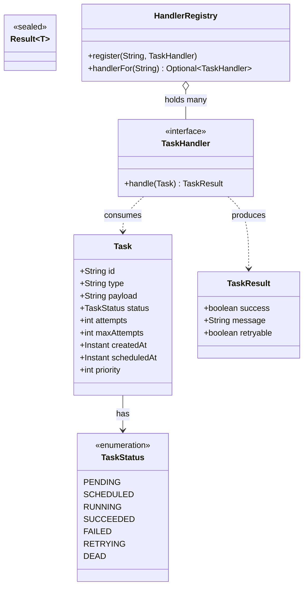

# Java Fundamentals: Exercises

> A graded problem set for the whole **01-java-fundamentals** module. Every exercise builds a real
> piece of our **Distributed Task Queue and Event Processing Platform** — the `Task` domain object,
> a generic `Result`, stream-based `TaskStats`, and a typed handler registry. Solve them with a
> compiler open. When you are stuck or want a staff-engineer reference, the complete, compilable
> solutions live in **[`./solutions.md`](./solutions.md)** (referenced by the same IDs used here,
> e.g. `E1`, `M3`, `H2`).

---

## How To Use This File

This is **not** a chapter — there is no theory here, only problems. The eight chapters in this
module already taught the concepts; the exercises make you *assemble* them into the Phase 1 domain:

- [`./chapter-01-classes-and-objects.md`](./chapter-01-classes-and-objects.md)
- [`./chapter-02-encapsulation.md`](./chapter-02-encapsulation.md)
- [`./chapter-03-abstraction.md`](./chapter-03-abstraction.md)
- [`./chapter-04-generics.md`](./chapter-04-generics.md)
- [`./chapter-05-collections.md`](./chapter-05-collections.md)
- [`./chapter-06-exceptions.md`](./chapter-06-exceptions.md)
- [`./chapter-07-streams.md`](./chapter-07-streams.md)
- [`./chapter-08-functional-interfaces.md`](./chapter-08-functional-interfaces.md)

Each exercise is **numbered and tagged** so the solutions file can address it precisely:

- The **letter prefix** is the difficulty: `E` = Easy, `M` = Medium, `H` = Hard.
- The number is a counter within that difficulty.
- A bracketed tag — `[knowledge-check]`, `[coding]`, `[refactor]`, `[design]`, `[interview]`,
  `[stretch]` — tells you what kind of work it is.

### Suggested order


Do the knowledge-checks first to surface gaps cheaply, then the coding exercises that assemble the
core domain types, then the refactors that turn bad code into shippable code, then
design/interview/stretch work that integrates everything into a runnable mini-platform.

### The slice of the canonical model these exercises build



> Conventions used throughout: package root `com.taskqueue`, Java 21, Maven, JUnit 5 + AssertJ for
> tests. When an exercise says "write a test," it means a JUnit 5 test using AssertJ assertions
> (`assertThat(...)`, `assertThatThrownBy(...)`).

---

## Part 1 — Knowledge-Check (mostly Easy)

> Short-answer questions. No IDE needed. Write a one-to-three sentence answer, then verify against
> `solutions.md`. These are calibrated to the exact mistakes a strong-DSA / new-to-Java engineer makes.

### E1 `[knowledge-check]` Easy — value vs reference

Given:

```java
Task a = Task.create("email", "{}");
Task b = a;
b.markRunning();
```

If `markRunning()` mutates the status, what is `a.status()` now, and why? Explain the difference
between the two *variables* and the one *object* on the heap. (See
[`../03-java-memory-model/object-references.md`](../03-java-memory-model/object-references.md).)

### E2 `[knowledge-check]` Easy — `==` vs `equals`

For two `Task` objects with the *same* `id` but created by two separate factory calls, what does
`==` return and what does a correctly-implemented `equals` return? Which field(s) should `Task`'s
`equals`/`hashCode` be based on, and why is `id` the right choice?

### E3 `[knowledge-check]` Easy — enum vs `int` constant

We model status as `enum TaskStatus { PENDING, SCHEDULED, RUNNING, SUCCEEDED, FAILED, RETRYING, DEAD }`
rather than `int PENDING = 0; int RUNNING = 1; ...`. Give three concrete advantages the enum gives us
that the `int` constants do not. (See [`./chapter-01-classes-and-objects.md`](./chapter-01-classes-and-objects.md).)

### E4 `[knowledge-check]` Easy — checked vs unchecked

`TaskHandler.handle(Task)` is declared `throws Exception` (a **checked** exception). A null `payload`
bug throws `NullPointerException` (an **unchecked** exception). Explain when you would model a failure
as checked vs unchecked, and which category a "downstream HTTP 503, please retry" failure belongs in.
(See [`./chapter-06-exceptions.md`](./chapter-06-exceptions.md).)

### E5 `[knowledge-check]` Easy — `List` vs `Set` vs `Map`

You need: (a) tasks in submission order, possibly with duplicates; (b) the set of distinct task
*types* seen; (c) a lookup from task `type` to its `TaskHandler`. Name the right collection interface
for each and the concrete class you would instantiate. (See
[`./chapter-05-collections.md`](./chapter-05-collections.md).)

### E6 `[knowledge-check]` Easy — what does generics buy us?

Before generics, a registry returned `Object` and callers cast. Explain, in terms of *when* the error
is caught, why `Map<String, TaskHandler>` is better than a raw `Map` returning `Object`. What is
**type erasure** and one consequence of it? (See [`./chapter-04-generics.md`](./chapter-04-generics.md).)

### E7 `[knowledge-check]` Easy — intermediate vs terminal stream ops

Classify each as intermediate or terminal: `filter`, `map`, `collect`, `count`, `peek`, `sorted`,
`forEach`, `reduce`. Why does `stream.filter(t -> t.priority() > 5)` *by itself* do **no work**?
(See [`./chapter-07-streams.md`](./chapter-07-streams.md).)

### E8 `[knowledge-check]` Easy — functional interface anatomy

What makes an interface a *functional interface*? Why can `TaskHandler` (one abstract method
`handle`) be written as a lambda `task -> new TaskResult(true, "ok", false)`, and what role does the
`@FunctionalInterface` annotation play? Name the four "core" `java.util.function` interfaces and the
shape of each. (See [`./chapter-08-functional-interfaces.md`](./chapter-08-functional-interfaces.md).)

---

## Part 2 — Coding Exercises

> Write real, compiling Java 21. Unless stated otherwise, put types under `com.taskqueue.domain`.
> Each builds a piece we reuse later in the module and in Phase 1.

### E9 `[coding]` Easy — the `TaskStatus` enum with behavior

Implement `TaskStatus` with the seven canonical values. Add `boolean isTerminal()` that returns
`true` for `SUCCEEDED` and `DEAD` (states from which a task never transitions again). Add
`boolean canRetry()` that returns `true` only for `FAILED` and `RETRYING`. Write a JUnit 5 test
asserting `SUCCEEDED.isTerminal()` is true and `RUNNING.isTerminal()` is false.

### E10 `[coding]` Easy — an immutable `TaskResult` record

Implement `record TaskResult(boolean success, String message, boolean retryable)`. Add two static
factory methods: `TaskResult.ok(String message)` (success, not retryable) and
`TaskResult.failRetryable(String message)` (not success, retryable). Add a compact constructor that
rejects a `null` message with `IllegalArgumentException`. Explain in a comment why a `record` is the
right tool here. (See [`./chapter-01-classes-and-objects.md`](./chapter-01-classes-and-objects.md).)

### E11 `[coding]` Easy — `Task` as a class with a validating factory

Implement `Task` with all nine canonical fields, **private and final where appropriate**, a private
constructor, and a public static `Task create(String type, String payload)` factory that:

- generates `id` via `UUID.randomUUID().toString()`,
- sets `status = PENDING`, `attempts = 0`, `maxAttempts = 3`, `priority = 0`,
- sets `createdAt = Instant.now()` and `scheduledAt = createdAt`,
- rejects null/blank `type` with `IllegalArgumentException`.

Expose getters (`id()`, `type()`, `status()`, …). Implement `equals`/`hashCode` on `id` only, plus a
`toString`. Write a test that two tasks created from the same arguments are **not** equal (different
generated ids).

### E11b `[coding]` Easy — overload `Task.create`

Add an overload `Task create(String type, String payload, int priority, int maxAttempts)` that the
two-arg factory delegates to. Validate `priority >= 0` and `maxAttempts >= 1`. This exercises
**method overloading** and constructor/factory delegation.

### M1 `[coding]` Medium — a generic `Result<T>` (sealed)

Build a reusable `Result<T>` to represent "either a value or a failure" without exceptions on the
happy path. Use a **sealed interface** with two records:

```java
public sealed interface Result<T> permits Result.Ok, Result.Err {
    record Ok<T>(T value)    implements Result<T> {}
    record Err<T>(String error) implements Result<T> {}
    // add: static factories ok(...) / err(...), isOk(), map(Function), orElse(T)
}
```

Implement `static <T> Result<T> ok(T value)`, `static <T> Result<T> err(String error)`,
`boolean isOk()`, `<R> Result<R> map(Function<? super T, ? extends R> fn)` (maps only on `Ok`), and
`T orElse(T fallback)`. Use `switch` pattern matching over the sealed type in `map`. Write tests for
`ok(2).map(x -> x + 1)` and that `err("boom").map(...)` stays `Err`. (See
[`./chapter-04-generics.md`](./chapter-04-generics.md).)

### M2 `[coding]` Medium — `TaskHandler` functional interface + two lambdas

Declare `@FunctionalInterface interface TaskHandler { TaskResult handle(Task task) throws Exception; }`.
Then implement two handlers **as lambdas**: an `emailHandler` that returns `TaskResult.ok("sent")`,
and a `flakyHandler` that throws on even-length payloads but returns `failRetryable` otherwise.
Write a method `TaskResult runSafely(TaskHandler h, Task t)` that catches any throwable from `handle`
and converts it into a retryable failed `TaskResult` (so the worker never sees a raw exception). This
previews [`./chapter-06-exceptions.md`](./chapter-06-exceptions.md) boundary handling.

### M3 `[coding]` Medium — a typed `HandlerRegistry`

Build `HandlerRegistry` that maps task `type` → `TaskHandler`:

- `void register(String type, TaskHandler handler)` — reject duplicate type registration with
  `IllegalStateException`; reject null args.
- `Optional<TaskHandler> handlerFor(String type)` — never returns null.
- `Set<String> registeredTypes()` — returns an **unmodifiable** view.

Back it with the correct `Map` implementation and justify your choice (ordering? concurrency?) in a
comment. Write tests covering: register + lookup hit, lookup miss returns empty `Optional`, duplicate
registration throws. This is the seed of the `Worker`'s "look up handler by type" step. (See
[`./chapter-05-collections.md`](./chapter-05-collections.md).)

### M4 `[coding]` Medium — `TaskStats` via the Streams API

Given a `List<Task>`, compute statistics in a stream-based class. Implement:

```java
public record TaskStats(
    long total,
    Map<TaskStatus, Long> countByStatus,
    double averagePriority,
    Optional<Task> highestPriority,
    List<String> distinctTypesSorted
) {
    public static TaskStats from(List<Task> tasks) { /* streams only */ }
}
```

Constraints: use `Collectors.groupingBy` + `counting()` for `countByStatus`;
`mapToInt(...).average()` for `averagePriority`; `max(Comparator.comparingInt(Task::priority))` for
`highestPriority`; `map(Task::type).distinct().sorted()` for `distinctTypesSorted`. No `for` loops.
Write a test over a hand-built list of 5 tasks. (See [`./chapter-07-streams.md`](./chapter-07-streams.md).)

### M5 `[coding]` Medium — partition due vs not-due tasks

A task is "due" when `scheduledAt <= now`. Using `Collectors.partitioningBy`, write
`Map<Boolean, List<Task>> partitionDue(List<Task> tasks, Instant now)`. Then, using a stream
pipeline, return the due tasks **sorted by priority descending, then by `createdAt` ascending** as a
tie-breaker (`Comparator.comparingInt(...).reversed().thenComparing(...)`). This is exactly what the
Phase 2 `pollDue(int n)` repository method needs to order work.

### M6 `[coding]` Medium — a generic, bounded `Box<T extends Comparable<T>>`

Write `Box<T extends Comparable<T>>` holding a `List<T>` with `void add(T item)`, `Optional<T> max()`,
and `<R extends Comparable<R>> Box<R> mapTo(Function<? super T, ? extends R> fn)`. The bounded type
parameter forces every element to be comparable so `max()` is always well-defined. Demonstrate it by
building a `Box<Integer>` of priorities and a `Box<String>` of task ids. This exercises **bounded
type parameters** and **PECS** (producer-extends, consumer-super); explain the `? super`/`? extends`
choices in comments. (See [`./chapter-04-generics.md`](./chapter-04-generics.md).)

### M7 `[coding]` Medium — custom exception hierarchy

Create an exception hierarchy under `com.taskqueue.domain.exception`:

- `TaskException extends Exception` (checked) — base for recoverable domain failures.
- `UnknownTaskTypeException extends TaskException` — thrown by the registry when no handler exists.
- `RetryableTaskException extends TaskException` — carries `boolean retryable()` (always true) and an
  optional `Throwable cause`.

Update `HandlerRegistry` to throw `UnknownTaskTypeException` from a new `TaskHandler require(String type)`
method (vs the `Optional`-returning `handlerFor`). Discuss in a comment when callers want `Optional`
and when they want the exception. Write a test asserting the exception type and message. (See
[`./chapter-06-exceptions.md`](./chapter-06-exceptions.md).)

### M8 `[coding]` Medium — `Comparable` and `Comparator` for `Task`

Make `Task` implement `Comparable<Task>` with a **natural ordering** of priority descending (higher
priority first), which is what a priority queue wants. Then provide three reusable `Comparator<Task>`
constants on `Task`: `BY_CREATED_AT`, `BY_SCHEDULED_AT`, `BY_PRIORITY_DESC`. Show sorting a list with
each. Note the classic pitfall: keep natural ordering **consistent with `equals`** or document loudly
that it is not. Explain which choice you made and why.

---

## Part 3 — Refactoring Exercises

> You are given bad-but-realistic code. Refactor it to the version a staff engineer would ship.
> Preserve behavior; improve design, safety, and readability. State each smell you removed.

### M9 `[refactor]` Medium — kill the setter-soup `Task`

The Phase-0 prototype below lets any component corrupt a task. Refactor to encapsulation: private
fields, intent-revealing mutators (`markRunning`, `recordSuccess`, `recordFailure`), a validating
factory, and `final` on identity fields. (Cross-check against
[`./chapter-02-encapsulation.md`](./chapter-02-encapsulation.md).)

```java
// BAD — refactor me
public class Task {
    public String id;
    public String type;
    public String status;       // a String, really?
    public int attempts;
    public int maxAttempts;
    public Task() {}            // born invalid
}
// elsewhere, anyone can do:
//   t.status = "RUNNING"; t.attempts = t.attempts + 1;  // typo-prone, unguarded
```

Deliverable: the refactored `Task`, plus a one-paragraph list of the smells you fixed (stringly-typed
status, public mutable fields, no invariants, no construction gate).

### M10 `[refactor]` Medium — replace the cast-and-instanceof ladder

The handler dispatch below uses raw `Object` and a brittle ladder. Refactor to a typed
`HandlerRegistry` (from M3); separately, refactor the result-handling `switch` to use Java 21
**switch pattern matching** with the sealed `Result<T>` from M1.

```java
// BAD — refactor me
Object handler = registry.get(task.getType());   // returns Object
if (handler instanceof EmailHandler) {
    ((EmailHandler) handler).send(task);
} else if (handler instanceof SmsHandler) {
    ((SmsHandler) handler).text(task);
} else {
    throw new RuntimeException("no handler");     // unchecked, vague
}
```

### M11 `[refactor]` Medium — loops to streams (and know when not to)

Rewrite this imperative aggregation using the Streams API, producing a `Map<TaskStatus, Long>`. Then
add a one-line comment explaining one case where you would **keep** the loop (hint: side effects,
early exit, or performance on a hot path).

```java
// BAD — refactor me
Map<TaskStatus, Long> counts = new HashMap<>();
for (Task t : tasks) {
    TaskStatus s = t.status();
    if (counts.containsKey(s)) {
        counts.put(s, counts.get(s) + 1);
    } else {
        counts.put(s, 1L);
    }
}
```

### M12 `[refactor]` Medium — leaky exception handling

This code swallows failures and leaks a checked exception as a generic `RuntimeException` with no
context. Refactor to: (1) catch narrowly, (2) preserve the cause via exception chaining, (3) use
try-with-resources if a resource is involved, and (4) never `catch (Exception ignored) {}`.

```java
// BAD — refactor me
public TaskResult run(TaskHandler h, Task t) {
    try {
        return h.handle(t);
    } catch (Exception e) {
        return null;            // caller now NPEs somewhere far away
    }
}
```

---

## Part 4 — Design Exercises

> Open-ended modeling. Produce types, signatures, a short rationale, and at least one diagram.
> Code skeletons are fine; full bodies optional unless stated. Judge yourself on tradeoffs, not LOC.

### M13 `[design]` Medium — design the `Result<T>` vs exceptions boundary

Write a half-page design note answering: where in the worker path do we use `Result<T>` (the M1
type) and where do we use exceptions? Cover: handler-thrown exceptions, "expected" business failures
(payment declined), and programmer bugs (NPE). Provide the rule you would put in a code-review
checklist. Include a `flowchart` Mermaid diagram of how an outcome flows from `TaskHandler.handle` to
the queue.

### M14 `[design]` Medium — design the handler-registration API

Today `HandlerRegistry.register` takes a `String type`. Critique the stringly-typed key. Propose at
least two alternative designs (e.g., a `TaskType` value object/enum, or annotation-driven
auto-registration) and lay out the tradeoffs in a comparison table (compile-time safety, openness to
new types at runtime, plugin friendliness, boilerplate). Recommend one for Phase 1 and one for
Phase 4 and justify the difference. (Looks ahead to
[`../05-design-patterns/factory-method.md`](../05-design-patterns/factory-method.md).)

### M15 `[design]` Medium — generic variance for a `TaskQueue<T>`

The canonical `TaskQueue` is non-generic (it holds `Task`). Suppose we wanted a generic `Queue<T>`
with `void enqueue(T t)` and `T dequeue()`. Explain why you cannot make `Queue<Task>` a subtype of
`Queue<Object>` (invariance), and design two utility method signatures using bounded wildcards: a
`drainInto(Collection<? super T> sink)` and a `copyFrom(Collection<? extends T> src)`. Justify each
wildcard with PECS. Provide a small `classDiagram` of the relationships. (Foundation for
[`../06-concurrency/blocking-queue.md`](../06-concurrency/blocking-queue.md).)

### H1 `[design]` Hard — model task lifecycle so invalid states are unrepresentable

Design the `Task` state machine over `TaskStatus` so illegal transitions cannot run. Deliver:

- (a) the legal transition table (`PENDING→SCHEDULED`, `PENDING→RUNNING`, `SCHEDULED→RUNNING`,
  `RUNNING→SUCCEEDED`, `RUNNING→FAILED`, `FAILED→RETRYING`, `RETRYING→RUNNING`, `FAILED→DEAD`, etc.),
- (b) a single private `transitionTo(TaskStatus next)` gate that consults the table and throws
  `IllegalStateException` on illegal moves, and
- (c) a `stateDiagram-v2` Mermaid diagram of the machine.

Discuss where `attempts >= maxAttempts` forces `FAILED→DEAD` instead of `FAILED→RETRYING`. (This is
the foundation for [`../05-design-patterns/state.md`](../05-design-patterns/state.md).)

### H2 `[design]` Hard — an extensible, type-safe metrics façade

Design a small `Metrics` abstraction the rest of the module can call without depending on Micrometer
yet. Requirements: `counter(name).increment()`, `timer(name).record(Duration)`, and the ability to
swap a no-op implementation for a real one later (Phase 3 uses Micrometer + Prometheus). Use
interfaces + a factory, keep it allocation-light, and explain how you would make the keys typed rather
than stringly-typed. Diagram it with a `classDiagram` showing the seam where the Micrometer adapter
plugs in. (Looks ahead to
[`../10-system-design/observability-and-ops.md`](../10-system-design/observability-and-ops.md).)

---

## Part 5 — Interview-Style Exercises

> Timed, whiteboard-flavored. Write the code *and* be ready to defend every decision out loud, the
> way you would in a real loop. Aim for 20–35 minutes each.

### H3 `[interview]` Hard — "Design `equals` and `hashCode` for `Task`"

Implement `equals` and `hashCode` for `Task`. Then defend: Why base them on `id` only and not all
fields? What breaks if `hashCode` includes the *mutable* `status` field and the task is a key in a
`HashMap`? State the full `equals` contract (reflexive, symmetric, transitive, consistent, non-null)
and show how an inheritance subclass could break **symmetry**. Bonus: why a `record` would give you
correct `equals`/`hashCode` for free, and why we *didn't* make `Task` a record.

### H4 `[interview]` Hard — "Why is `String` immutable, and where does that bite us?"

Our `Task.payload` is a JSON `String`. Explain why Java `String` is immutable and how that interacts
with the string pool, `hashCode` caching, and thread-safety. Then: a junior writes `payload += chunk;`
in a loop building a large payload — explain the O(n²) trap and fix it with `StringBuilder`. Relate to
[`../03-java-memory-model/string-pool.md`](../03-java-memory-model/string-pool.md) and
[`../03-java-memory-model/immutable-objects.md`](../03-java-memory-model/immutable-objects.md).

### H5 `[interview]` Hard — "Implement a generic LRU-ish handler cache"

In some deployments handlers are expensive to construct. Implement a generic, bounded `LruCache<K, V>`
(capacity N, evict least-recently-used) on top of `LinkedHashMap` with `accessOrder = true` and an
overridden `removeEldestEntry`. Then state the thread-safety story: why `LinkedHashMap` is **not**
safe under concurrency and what you would use in Phase 1's worker pool instead (preview
[`../06-concurrency/concurrent-collections.md`](../06-concurrency/concurrent-collections.md)). Give
the time complexity of `get`/`put`.

### H6 `[interview]` Hard — "Streams: top-K tasks by priority without sorting everything"

Given a `List<Task>` of size N and a `k`, return the top-`k` highest-priority tasks. First do it the
naive way with `sorted(...).limit(k)` and state its complexity. Then argue when you would drop to a
bounded `PriorityQueue` for O(N log k) instead of O(N log N), and write that version. Discuss whether
parallel streams help here and the hidden cost of `Collectors.toList()` ordering guarantees. (Ties to
[`../07-queues-and-messaging/priority-queues.md`](../07-queues-and-messaging/priority-queues.md).)

---

## Part 6 — Stretch Challenges

> Bigger, integrative, multi-concept. These produce code we genuinely reuse in Phase 1. Budget an
> hour-plus each. Tests required.

### H7 `[stretch]` Hard — assemble a single-threaded mini task runner

Tie the whole module together into a runnable `MiniTaskRunner` (no threads yet — that's
[`../06-concurrency/threads.md`](../06-concurrency/threads.md)). It must:

1. Hold a `HandlerRegistry` (M3/M7) and an in-memory `List<Task>` "queue."
2. `submit(Task)` adds a `PENDING` task.
3. `runOnce()` polls the highest-priority due task (M5/M8), looks up its handler, runs it via a safe
   wrapper (M2/M12), and applies the outcome to the task's lifecycle (H1): success → `SUCCEEDED`;
   retryable failure with `attempts < maxAttempts` → `RETRYING` (and re-enqueue); otherwise → `DEAD`.
4. `stats()` returns a `TaskStats` (M4) over all tasks ever seen.

Write JUnit 5 + AssertJ tests proving: a succeeding handler ends `SUCCEEDED`; an always-retryable
handler with `maxAttempts = 2` ends `DEAD` after exactly 2 attempts; an unknown type is reported
cleanly (M7). Include a `sequenceDiagram` of one `runOnce()` cycle.

### H8 `[stretch]` Hard — a generic, fluent `RetryEnvelope<T>`

Build a generic helper that runs a `Supplier<T>` (functional interface!) up to `maxAttempts` times,
returning a `Result<T>` (M1). Signature sketch:

```java
public final class RetryEnvelope<T> {
    public static <T> RetryEnvelope<T> of(Supplier<T> action) { ... }
    public RetryEnvelope<T> maxAttempts(int n) { ... }
    public RetryEnvelope<T> retryOn(Predicate<? super RuntimeException> when) { ... }
    public Result<T> run() { ... }   // returns Ok(value) or Err(lastError)
}
```

Use `Supplier`, `Predicate`, and `Function` from `java.util.function`, generics with bounded
wildcards, and the sealed `Result<T>`. No real backoff delay yet — just attempt counting (real backoff
arrives in [`../08-distributed-systems/retries.md`](../08-distributed-systems/retries.md)). Test:
succeeds on attempt 3 of 5; gives `Err` when the predicate says "don't retry."

### H9 `[stretch]` Hard — property-style tests for the lifecycle invariants

Without a property-testing library, write parameterized JUnit 5 tests (`@ParameterizedTest` +
`@MethodSource`) that assert the `Task` lifecycle invariants from H1 hold for *every* status pair: for
each `(from, to)` not in the legal table, `transitionTo` throws `IllegalStateException`; for each legal
pair it succeeds and leaves `status == to`. Additionally assert the monotonic invariant: `attempts`
never decreases and never exceeds `maxAttempts`. Explain why exhaustive pair-testing here is cheap
(7×7 = 49 cases) and why that won't scale to larger state spaces — motivating real property-based
testing (jqwik) you will meet later.

---

## Grading Rubric (self-assessment)

Use this to grade your own solutions before peeking at `solutions.md`.

| Dimension | What "passing" looks like | Common failure |
|---|---|---|
| Correctness | Compiles on Java 21; tests pass | Off-by-one in `attempts`; wrong terminal states |
| Encapsulation | No public mutable fields; intent-revealing methods | Setter soup; stringly-typed status |
| Generics | Bounded params + PECS wildcards used correctly | Raw types; needless casts |
| Exceptions | Narrow catch; cause chained; right checked/unchecked call | `catch (Exception ignored)`; swallowed cause |
| Streams | Single readable pipeline; right collector | Loop-in-disguise; mutating shared state in `forEach` |
| Functional | Lambdas for SAMs; method refs where clearer | Anonymous classes everywhere; over-clever chains |
| Tests | JUnit 5 + AssertJ; meaningful assertions | Asserting `notNull` only; no negative cases |
| Tradeoffs | You can defend every choice | "Because the tutorial did it" |

---

## Difficulty Index

| ID | Tag | Difficulty | Builds |
|---|---|---|---|
| E1–E8 | knowledge-check | Easy | mental model |
| E9 | coding | Easy | `TaskStatus` |
| E10 | coding | Easy | `TaskResult` |
| E11 / E11b | coding | Easy | `Task` + factory/overload |
| M1 | coding | Medium | `Result<T>` (sealed) |
| M2 | coding | Medium | `TaskHandler` + safe runner |
| M3 | coding | Medium | `HandlerRegistry` |
| M4 | coding | Medium | `TaskStats` (streams) |
| M5 | coding | Medium | due-partition + ordering |
| M6 | coding | Medium | bounded generic `Box` |
| M7 | coding | Medium | exception hierarchy |
| M8 | coding | Medium | `Comparable`/`Comparator` |
| M9–M12 | refactor | Medium | clean up bad code |
| M13–M15 | design | Medium | API / variance design |
| H1–H2 | design | Hard | state machine, metrics façade |
| H3–H6 | interview | Hard | contracts, immutability, caches, top-K |
| H7–H9 | stretch | Hard | mini runner, retry envelope, property tests |

---

## Project Integration Footer

### What We Can Improve In Our Project Using This Concept

These exercises are not throwaway drills — they are the **literal first commit** of Phase 1. After
finishing Part 2 and H7 you already own: a validated `Task` (E11), a typed `HandlerRegistry` (M3/M7),
a `Result<T>` for exception-free outcomes (M1), stream-based `TaskStats` for the metrics endpoint
(M4), and a single-threaded runner (H7). Phase 1 then "only" swaps the `List` queue for an
`InMemoryTaskQueue` backed by a `BlockingQueue` and the single runner for a `WorkerPool` — the
*domain* is already done and tested. See [`../09-project/phase-1.md`](../09-project/phase-1.md).

### Project Refactoring Task

Collect your solutions to **E9, E10, E11, M1, M3, M7, M4, M8, H1** into a package layout:

```text
src/main/java/com/taskqueue/domain/Task.java
src/main/java/com/taskqueue/domain/TaskStatus.java
src/main/java/com/taskqueue/domain/TaskResult.java
src/main/java/com/taskqueue/domain/Result.java
src/main/java/com/taskqueue/handler/TaskHandler.java
src/main/java/com/taskqueue/handler/HandlerRegistry.java
src/main/java/com/taskqueue/domain/exception/TaskException.java
src/main/java/com/taskqueue/stats/TaskStats.java
src/main/java/com/taskqueue/runner/MiniTaskRunner.java        # from H7
src/test/java/com/taskqueue/...                               # all your tests
```

Then refactor `MiniTaskRunner` (H7) so the lifecycle logic lives **on `Task`** (H1's `transitionTo`),
not in the runner. The runner should only orchestrate; the domain enforces its own invariants.

### Git Commit For This Chapter

```text
feat(domain): build core Task domain via fundamentals exercises

- add Task (validated factory, equals/hashCode on id, Comparable by priority)
- add TaskStatus with isTerminal/canRetry + legal-transition table
- add TaskResult record and generic sealed Result<T>
- add TaskHandler functional interface and typed HandlerRegistry
- add stream-based TaskStats and a single-threaded MiniTaskRunner
- add JUnit5/AssertJ tests incl. parameterized lifecycle invariants

Files touched:
  src/main/java/com/taskqueue/domain/Task.java
  src/main/java/com/taskqueue/domain/TaskStatus.java
  src/main/java/com/taskqueue/domain/TaskResult.java
  src/main/java/com/taskqueue/domain/Result.java
  src/main/java/com/taskqueue/handler/TaskHandler.java
  src/main/java/com/taskqueue/handler/HandlerRegistry.java
  src/main/java/com/taskqueue/stats/TaskStats.java
  src/main/java/com/taskqueue/runner/MiniTaskRunner.java
  src/test/java/com/taskqueue/...
```

### Architecture Impact

This exercise set produces the **innermost ring** of the system — the pure domain with zero framework
dependencies (no Spring, no Postgres, no Kafka). Everything in later modules (the worker pool, the
JDBC `TaskRepository`, the rate limiter, the event bus) depends *inward* on these types but they
depend on nothing. That is the dependency rule of
[`../04-oop-and-ood/clean-architecture.md`](../04-oop-and-ood/clean-architecture.md), and getting it
right here is why the platform stays testable and swappable through all four phases.

### Interview Takeaways

- A strong domain model makes invalid states **unrepresentable**: enums over int constants, validated
  factories over public fields, a single transition gate over scattered mutations.
- Reach for `record` for immutable value carriers (`TaskResult`), a `sealed interface` for closed
  alternatives (`Result<T>`), and a plain `class` when identity and mutable lifecycle matter (`Task`).
- Generics are about *catching errors at compile time*; bounded wildcards (PECS) are about *who
  produces vs consumes* the values.
- Streams replace accumulation loops, not all loops — keep the loop when you need side effects, early
  exit, or hot-path control.
- Model failures deliberately: `Result<T>` for expected outcomes on the happy path, checked exceptions
  for recoverable domain errors, unchecked for bugs — and never swallow a cause.
