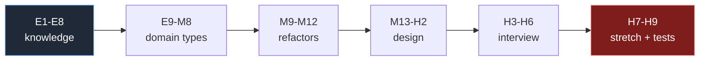
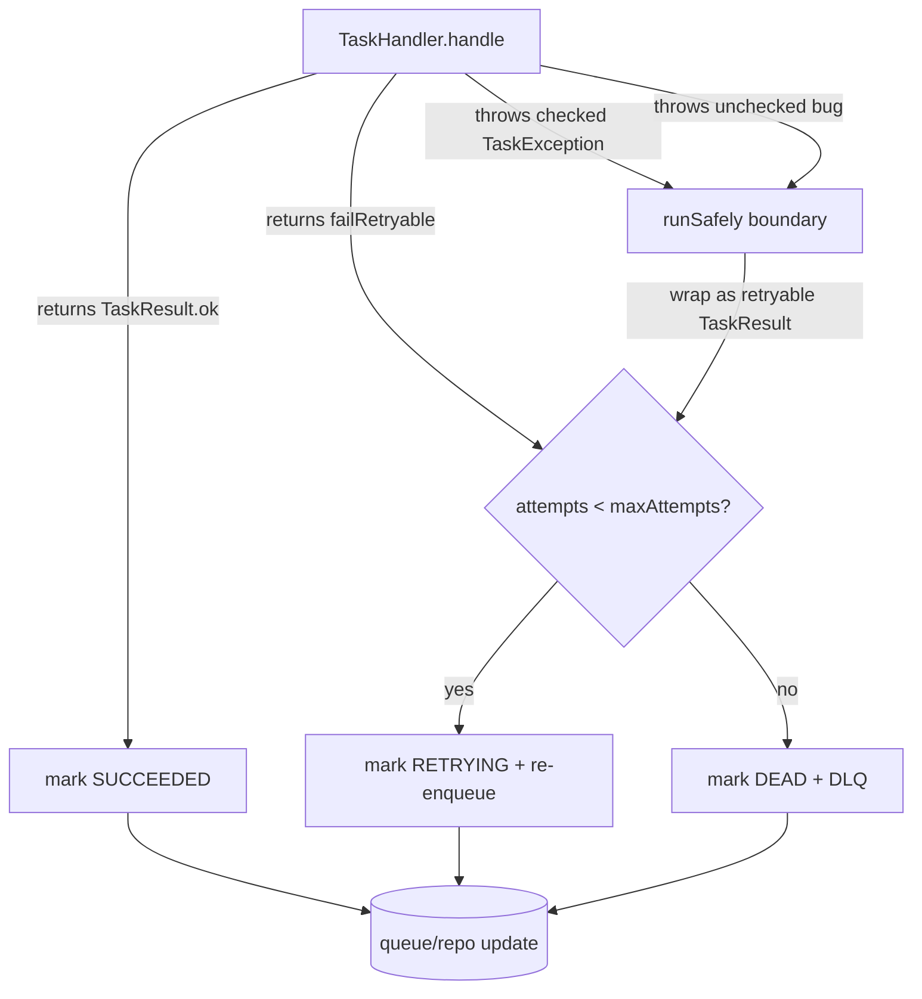
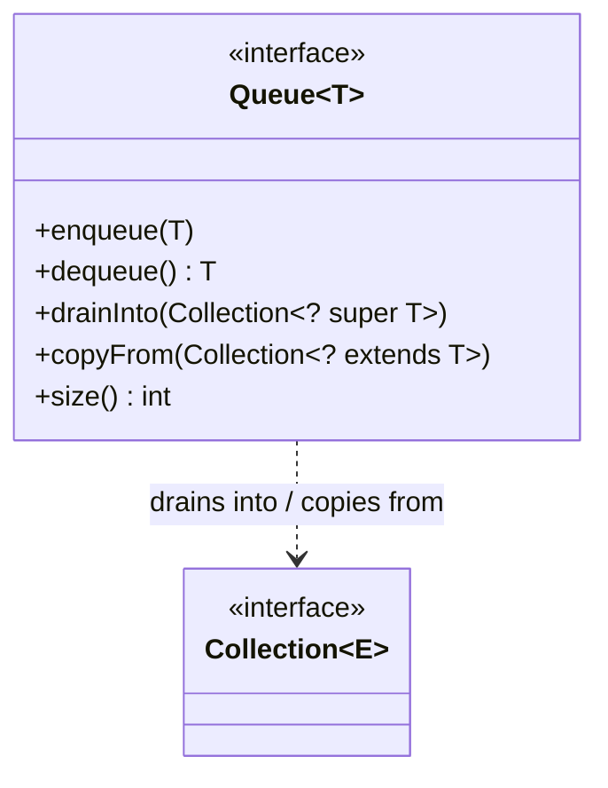
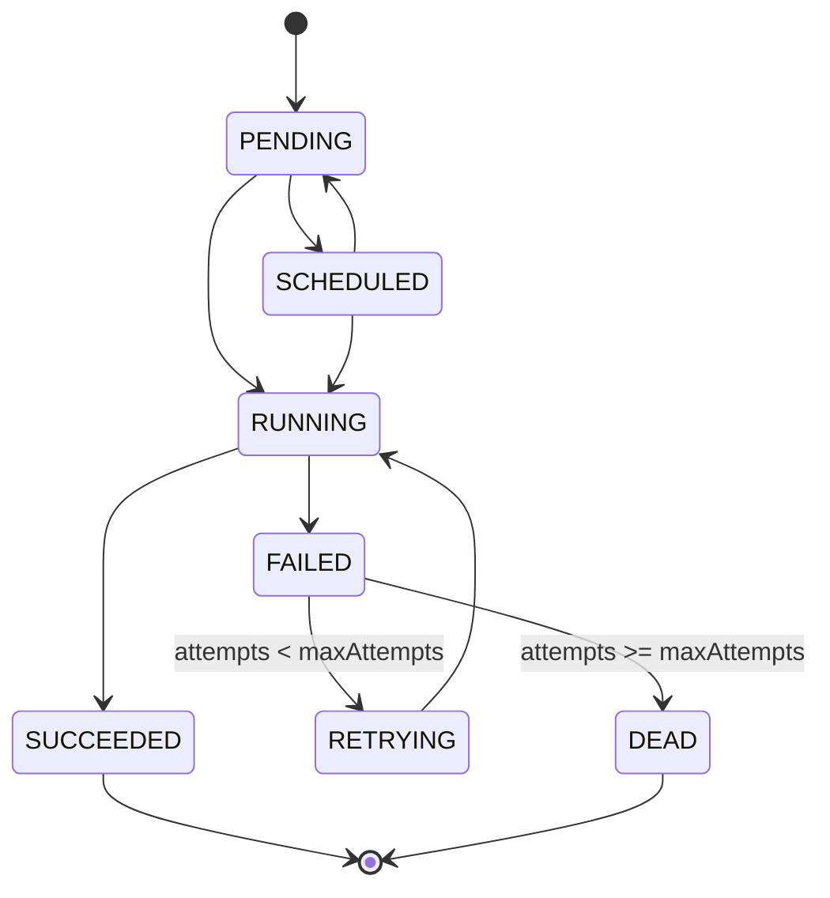
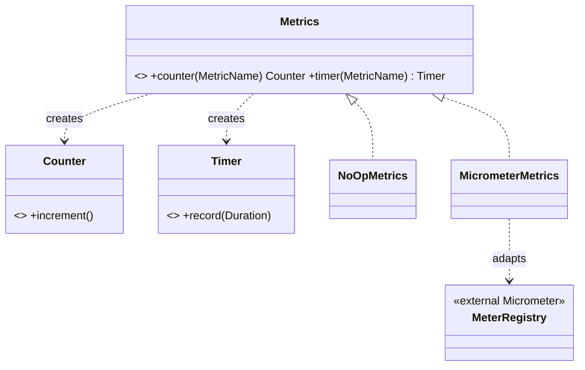
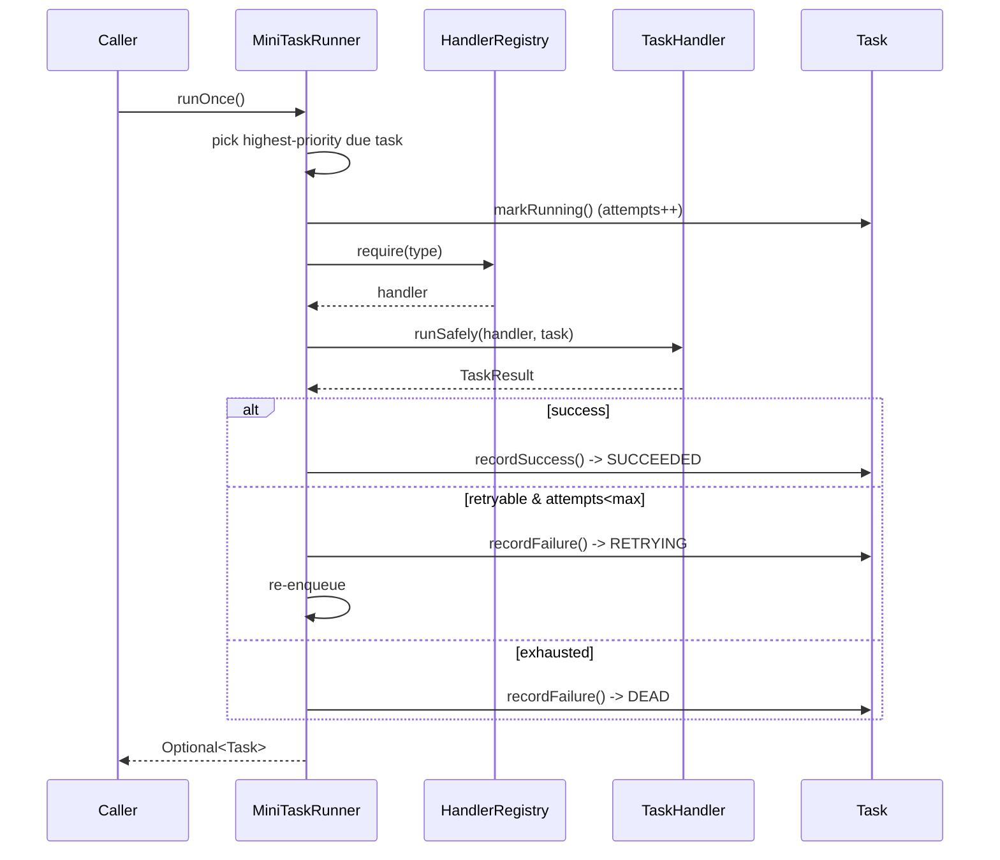

# Java Fundamentals: Solutions

> Complete, compilable answers to **[`./exercises.md`](./exercises.md)**, using the exact `E#`/`M#`/`H#`
> IDs. Every solution gives the **code**, the **reasoning and tradeoffs**, and the **common wrong
> approaches** a strong-DSA / new-to-Java engineer falls into. These types are the literal first
> commit of Phase 1 of our **Distributed Task Queue and Event Processing Platform**, so they use the
> canonical domain model (`Task`, `TaskStatus`, `TaskResult`, `TaskHandler`, `Result<T>`,
> `HandlerRegistry`) consistently with the rest of the repo.

All code targets **Java 21**, builds with **Maven**, and tests with **JUnit 5 + AssertJ**. Package
root is `com.taskqueue`. Where an exercise has a sibling chapter, the link points at it so you can
re-read the theory if a step surprises you:
[classes & objects](./chapter-01-classes-and-objects.md),
[encapsulation](./chapter-02-encapsulation.md),
[abstraction](./chapter-03-abstraction.md),
[generics](./chapter-04-generics.md),
[collections](./chapter-05-collections.md),
[exceptions](./chapter-06-exceptions.md),
[streams](./chapter-07-streams.md),
[functional interfaces](./chapter-08-functional-interfaces.md).



---

## Part 1 — Knowledge-Check Solutions

### E1 — value vs reference

`a.status()` is now `RUNNING`. `Task a = Task.create(...)` puts **one** `Task` object on the heap and
stores its **reference** (a handle, effectively a pointer) in the variable `a`. `Task b = a` copies
the *reference*, not the object — both variables point at the **same** heap object. `b.markRunning()`
mutates that single object, so reading through `a` sees the change.

The mental model that trips up people coming from C is that Java is **always pass-by-value**, but for
reference types the *value being copied is the reference*. Two variables, one object.

```java
Task a = Task.create("email", "{}");
Task b = a;            // copies the reference; no new Task allocated
b.markRunning();
assert a.status() == TaskStatus.RUNNING;   // same object
assert a == b;                              // same identity
```

> **Common wrong answer:** "It stays `PENDING` because `b` is a copy." That confuses *reference copy*
> with *object copy*. To get an independent object you must explicitly construct one (a copy
> constructor or `Task.create(...)` again). See
> [`../03-java-memory-model/object-references.md`](../03-java-memory-model/object-references.md) and
> [`../03-java-memory-model/pass-by-value.md`](../03-java-memory-model/pass-by-value.md).

### E2 — `==` vs `equals`

`==` compares **references** (identity). Two `Task` objects built by two separate factory calls live
at two heap addresses, so `==` returns `false` even if every field matches. A correctly-implemented
`equals` that compares on `id` returns `true` when the ids match.

Base `equals`/`hashCode` on `id` **only**, because `id` is the task's **identity** — it is assigned
once at creation, is immutable, and is globally unique (a UUID). Every other field (`status`,
`attempts`) is **mutable lifecycle state**; if `equals` depended on them, a task would stop equalling
itself the moment a worker ran it, which silently corrupts any `HashSet<Task>` or `HashMap` keyed by
`Task` (see H3 below for the exact failure).

> **Common wrong answer:** "Compare all fields." For an *entity* with identity and a mutable
> lifecycle, that's wrong — equality must be stable over the object's life. Value objects
> (`TaskResult`) are the opposite: compare *all* fields, which is exactly what `record` does for free.

### E3 — enum vs `int` constant

Three concrete advantages of `enum TaskStatus { ... }` over `int PENDING = 0; ...`:

1. **Type safety.** A method parameter typed `TaskStatus` cannot accept `42` or `-1`. With `int` the
   compiler happily passes garbage; you discover it at runtime, if ever.
2. **Exhaustive `switch`.** A `switch` over `TaskStatus` lets the compiler warn (and with a sealed
   pattern `switch` *require*) that you handled every case. Add `DEAD` later and the compiler points
   you at every `switch` that forgot it. `int` gives you no such help.
3. **Behavior and identity.** Enums are real objects: they carry methods (`isTerminal()`,
   `canRetry()`), print as `RUNNING` not `2` in logs, work as `EnumMap`/`EnumSet` keys (array-backed,
   no boxing), and have correct `equals`/`hashCode`/`name()`/`ordinal()` automatically.

> **Common wrong answer:** "They're the same, enums are just nicer syntax." They are categorically
> safer: the `int` version makes invalid states *representable*, which is the bug we are designing
> against. See E9 for the implementation.

### E4 — checked vs unchecked

Model a failure as **checked** (`extends Exception`) when it is a **recoverable, expected** condition
the caller is reasonably expected to handle — a transient downstream outage, a missing handler. Model
it as **unchecked** (`extends RuntimeException`) when it is a **programmer bug** or a violated
precondition the caller cannot meaningfully recover from at runtime — `NullPointerException`,
`IllegalArgumentException`, `IllegalStateException`.

"Downstream HTTP 503, please retry" is a **recoverable, expected** condition → **checked** (in our
model, `RetryableTaskException` from M7). The worker catches it and decides to retry. A null
`payload` is a **bug** → unchecked `NullPointerException`; you fix the code, you don't retry.

> **Common wrong answer:** "503 should be unchecked because it's an HTTP thing." The *transport* is
> irrelevant; what matters is whether the caller can sensibly act on it. A retryable downstream error
> is the textbook case for a checked domain exception. See
> [`./chapter-06-exceptions.md`](./chapter-06-exceptions.md).

### E5 — `List` vs `Set` vs `Map`

| Need | Interface | Concrete class | Why |
|---|---|---|---|
| (a) tasks in submission order, duplicates allowed | `List<Task>` | `ArrayList<>` | indexed, ordered, allows dupes |
| (b) distinct task *types* seen | `Set<String>` | `LinkedHashSet<>` | dedupes; `LinkedHashSet` keeps first-seen order, `HashSet` if order doesn't matter |
| (c) `type` → `TaskHandler` lookup | `Map<String, TaskHandler>` | `HashMap<>` (or `ConcurrentHashMap` once shared across workers) | O(1) keyed lookup |

> **Common wrong answer:** Using a `List` and `contains`/scanning for the type lookup (O(n) per
> dispatch) instead of a `Map` (O(1)). On a hot dispatch path this is the difference between a worker
> pool that scales and one that doesn't. See [`./chapter-05-collections.md`](./chapter-05-collections.md).

### E6 — what generics buy us

`Map<String, TaskHandler>` catches a type error **at compile time**: if you try to put an `Integer`
in or treat a retrieved value as the wrong type, the code does not compile. A raw `Map` returning
`Object` forces a cast at every call site; that cast can `ClassCastException` **at runtime**, far from
where the bug was introduced. Generics move the error left: *fail at compile, not in production*.

**Type erasure**: generic type parameters exist only at compile time; the bytecode for
`Map<String, TaskHandler>` and `Map<String, Task>` is the same `Map`. One consequence: you cannot
write `new T[]` or `if (x instanceof List<String>)` — the runtime simply doesn't know `T`. Another:
overloads that differ only by generic parameter (`f(List<String>)` vs `f(List<Integer>)`) collide.

> **Common wrong answer:** "Generics are slower because of boxing." Generics themselves add no runtime
> cost (erasure); the boxing cost is from using `Integer` instead of `int`, which is orthogonal. See
> [`./chapter-04-generics.md`](./chapter-04-generics.md).

### E7 — intermediate vs terminal stream ops

| Op | Kind |
|---|---|
| `filter` | intermediate (lazy) |
| `map` | intermediate (lazy) |
| `collect` | **terminal** |
| `count` | **terminal** |
| `peek` | intermediate (lazy) |
| `sorted` | intermediate (lazy, but stateful) |
| `forEach` | **terminal** |
| `reduce` | **terminal** |

`stream.filter(t -> t.priority() > 5)` by itself does **no work** because intermediate ops are
**lazy** — they only build a pipeline description. Nothing traverses the source until a **terminal**
op (`collect`, `count`, …) pulls elements through. This laziness enables fusion (one pass) and
short-circuiting (`findFirst`, `limit`). See [`./chapter-07-streams.md`](./chapter-07-streams.md).

### E8 — functional interface anatomy

A **functional interface** has exactly **one abstract method** (a SAM — Single Abstract Method).
`default`/`static`/`private` methods and overrides of `Object` methods don't count. `TaskHandler` has
one abstract method `handle`, so the compiler can target a lambda `task -> new TaskResult(...)` to it:
the lambda's parameters/return must match `handle`'s signature. `@FunctionalInterface` is **optional**
but documents intent and makes the compiler **reject** a second abstract method — a guardrail so you
don't accidentally break lambda-compatibility later.

The four core `java.util.function` shapes:

| Interface | Abstract method | Shape |
|---|---|---|
| `Function<T,R>` | `R apply(T t)` | one in, one out |
| `Consumer<T>` | `void accept(T t)` | one in, no out (side effect) |
| `Supplier<T>` | `T get()` | no in, one out (factory) |
| `Predicate<T>` | `boolean test(T t)` | one in, boolean out |

See [`./chapter-08-functional-interfaces.md`](./chapter-08-functional-interfaces.md).

---

## Part 2 — Coding Solutions

### E9 — `TaskStatus` enum with behavior

```java
package com.taskqueue.domain;

/** The seven canonical lifecycle states of a Task. */
public enum TaskStatus {
    PENDING,
    SCHEDULED,
    RUNNING,
    SUCCEEDED,
    FAILED,
    RETRYING,
    DEAD;

    /** Terminal states never transition again. */
    public boolean isTerminal() {
        return this == SUCCEEDED || this == DEAD;
    }

    /** Only failed/retrying tasks are eligible for another attempt. */
    public boolean canRetry() {
        return this == FAILED || this == RETRYING;
    }
}
```

```java
package com.taskqueue.domain;

import static org.assertj.core.api.Assertions.assertThat;
import org.junit.jupiter.api.Test;

class TaskStatusTest {
    @Test
    void terminalStatesAreTerminal() {
        assertThat(TaskStatus.SUCCEEDED.isTerminal()).isTrue();
        assertThat(TaskStatus.DEAD.isTerminal()).isTrue();
        assertThat(TaskStatus.RUNNING.isTerminal()).isFalse();
    }

    @Test
    void retryEligibility() {
        assertThat(TaskStatus.FAILED.canRetry()).isTrue();
        assertThat(TaskStatus.RETRYING.canRetry()).isTrue();
        assertThat(TaskStatus.SUCCEEDED.canRetry()).isFalse();
    }
}
```

**Reasoning.** Putting `isTerminal()`/`canRetry()` *on the enum* is the "tell, don't ask" move: the
status knows its own rules instead of every caller writing `if (s == SUCCEEDED || s == DEAD)`. When
the rule changes, it changes in one place. **Common wrong approach:** a `switch` returning `true` in
two arms and `false` elsewhere — works, but `==` is clearer for two cases. Avoid relying on
`ordinal()` (e.g. `this.ordinal() >= 3`) — reordering the enum silently breaks it.

### E10 — immutable `TaskResult` record

```java
package com.taskqueue.domain;

/**
 * Outcome of running a handler. A record is the right tool: this is an immutable
 * value object with no identity — two results with equal fields are equal, and we
 * want auto-generated equals/hashCode/toString plus shallow immutability for free.
 */
public record TaskResult(boolean success, String message, boolean retryable) {

    // Compact constructor: runs after field assignment, validates invariants.
    public TaskResult {
        if (message == null) {
            throw new IllegalArgumentException("message must not be null");
        }
    }

    public static TaskResult ok(String message) {
        return new TaskResult(true, message, false);
    }

    public static TaskResult failRetryable(String message) {
        return new TaskResult(false, message, true);
    }
}
```

**Why a record.** A `TaskResult` is a pure value carrier: no identity, no lifecycle, immutable. The
record gives correct `equals`/`hashCode` (all components), a readable `toString`, and `final` fields
with no boilerplate. **Common wrong approach:** writing a full class with hand-rolled getters and a
forgotten `hashCode` (breaking it as a `Map` key), or making it mutable — a result that can change
after the fact is a footgun in retry logic.

### E11 — `Task` class with validating factory

```java
package com.taskqueue.domain;

import java.time.Instant;
import java.util.Objects;
import java.util.UUID;

public final class Task {
    private final String id;          // identity — assigned once, never changes
    private final String type;
    private final String payload;     // JSON string
    private TaskStatus status;        // mutable lifecycle
    private int attempts;
    private final int maxAttempts;
    private final Instant createdAt;
    private Instant scheduledAt;
    private final int priority;

    private Task(String id, String type, String payload, TaskStatus status,
                 int attempts, int maxAttempts, Instant createdAt,
                 Instant scheduledAt, int priority) {
        this.id = id;
        this.type = type;
        this.payload = payload;
        this.status = status;
        this.attempts = attempts;
        this.maxAttempts = maxAttempts;
        this.createdAt = createdAt;
        this.scheduledAt = scheduledAt;
        this.priority = priority;
    }

    public static Task create(String type, String payload) {
        if (type == null || type.isBlank()) {
            throw new IllegalArgumentException("type must not be null/blank");
        }
        Instant now = Instant.now();
        return new Task(UUID.randomUUID().toString(), type, payload,
                TaskStatus.PENDING, 0, 3, now, now, 0);
    }

    public String id()          { return id; }
    public String type()        { return type; }
    public String payload()     { return payload; }
    public TaskStatus status()  { return status; }
    public int attempts()       { return attempts; }
    public int maxAttempts()    { return maxAttempts; }
    public Instant createdAt()  { return createdAt; }
    public Instant scheduledAt(){ return scheduledAt; }
    public int priority()       { return priority; }

    @Override public boolean equals(Object o) {
        if (this == o) return true;
        if (!(o instanceof Task other)) return false;   // enhanced instanceof
        return id.equals(other.id);                      // identity is the id
    }

    @Override public int hashCode() {
        return Objects.hash(id);
    }

    @Override public String toString() {
        return "Task[id=%s, type=%s, status=%s, attempts=%d/%d, priority=%d]"
                .formatted(id, type, status, attempts, maxAttempts, priority);
    }
}
```

```java
package com.taskqueue.domain;

import static org.assertj.core.api.Assertions.assertThat;
import static org.assertj.core.api.Assertions.assertThatThrownBy;
import org.junit.jupiter.api.Test;

class TaskTest {
    @Test
    void sameArgsProduceDistinctTasks() {
        Task a = Task.create("email", "{}");
        Task b = Task.create("email", "{}");
        assertThat(a).isNotEqualTo(b);           // different generated ids
        assertThat(a.id()).isNotEqualTo(b.id());
        assertThat(a.status()).isEqualTo(TaskStatus.PENDING);
    }

    @Test
    void blankTypeRejected() {
        assertThatThrownBy(() -> Task.create("  ", "{}"))
            .isInstanceOf(IllegalArgumentException.class);
    }
}
```

**Reasoning.** A **private constructor + static factory** gives a single, validated construction gate:
no caller can build a `Task` in an invalid state, and `create` reads better than `new Task(...)` with
nine arguments. Identity fields (`id`, `type`, `maxAttempts`, `createdAt`, `priority`) are `final`;
only genuine lifecycle (`status`, `attempts`, `scheduledAt`) is mutable. `equals`/`hashCode` on `id`
only (see E2/H3). **Common wrong approaches:** a public no-arg constructor (born invalid), `equals` on
all fields (breaks `HashSet` once status changes), or leaking a *mutable* field. Note `Instant` is
itself immutable, so returning it directly is safe; if a field were `java.util.Date` you'd
defensively copy it.

### E11b — overload `Task.create`

```java
// add to Task; the 2-arg factory delegates here.
public static Task create(String type, String payload) {
    return create(type, payload, 0, 3);     // delegate to the canonical overload
}

public static Task create(String type, String payload, int priority, int maxAttempts) {
    if (type == null || type.isBlank()) {
        throw new IllegalArgumentException("type must not be null/blank");
    }
    if (priority < 0) {
        throw new IllegalArgumentException("priority must be >= 0");
    }
    if (maxAttempts < 1) {
        throw new IllegalArgumentException("maxAttempts must be >= 1");
    }
    Instant now = Instant.now();
    return new Task(UUID.randomUUID().toString(), type, payload,
            TaskStatus.PENDING, 0, maxAttempts, now, now, priority);
}
```

**Reasoning.** The simple overload **delegates** to the rich one rather than duplicating construction
logic — one place does validation and allocation. This mirrors constructor `this(...)` chaining.
**Common wrong approach:** copy-pasting the body into both overloads, so a future validation tweak
gets applied to one and forgotten in the other. **Pitfall:** overloads must differ in *parameter
types/count*, not return type — `create(String, String)` and `create(String, String, int, int)` are
distinct because the arities differ.

### M1 — generic sealed `Result<T>`

```java
package com.taskqueue.domain;

import java.util.function.Function;

/** Either a value (Ok) or a failure message (Err), without exceptions on the happy path. */
public sealed interface Result<T> permits Result.Ok, Result.Err {

    record Ok<T>(T value) implements Result<T> {}
    record Err<T>(String error) implements Result<T> {}

    static <T> Result<T> ok(T value)      { return new Ok<>(value); }
    static <T> Result<T> err(String msg)  { return new Err<>(msg); }

    default boolean isOk() {
        return this instanceof Ok<T>;
    }

    /** Map only transforms the Ok branch; Err passes through unchanged. */
    default <R> Result<R> map(Function<? super T, ? extends R> fn) {
        return switch (this) {
            case Ok<T> ok   -> new Ok<>(fn.apply(ok.value()));
            case Err<T> err -> new Err<>(err.error());
        };
    }

    default T orElse(T fallback) {
        return switch (this) {
            case Ok<T> ok  -> ok.value();
            case Err<T> e  -> fallback;
        };
    }
}
```

```java
package com.taskqueue.domain;

import static org.assertj.core.api.Assertions.assertThat;
import org.junit.jupiter.api.Test;

class ResultTest {
    @Test
    void mapTransformsOk() {
        Result<Integer> r = Result.<Integer>ok(2).map(x -> x + 1);
        assertThat(r.isOk()).isTrue();
        assertThat(r.orElse(-1)).isEqualTo(3);
    }

    @Test
    void mapLeavesErrUntouched() {
        Result<Integer> r = Result.<Integer>err("boom").map(x -> x + 1);
        assertThat(r.isOk()).isFalse();
        assertThat(r).isInstanceOf(Result.Err.class);
        assertThat(r.orElse(-1)).isEqualTo(-1);
    }
}
```

**Reasoning.** A **sealed interface** with a closed set of record permits lets the `switch` be
**exhaustive without a `default`** — the compiler proves you handled both `Ok` and `Err`. The wildcard
`Function<? super T, ? extends R>` is PECS: the function *consumes* `T` (so `? super T` accepts a
function that takes a supertype) and *produces* `R` (so `? extends R` lets it return a subtype).
**Common wrong approaches:** using exceptions for control flow instead of a `Result` (expensive and
noisy on the happy path), or adding a `default` arm to the `switch` (defeats exhaustiveness — add a
third permit later and the compiler won't warn you). See [`./chapter-04-generics.md`](./chapter-04-generics.md).

### M2 — `TaskHandler` + two lambdas + safe runner

```java
package com.taskqueue.handler;

import com.taskqueue.domain.Task;
import com.taskqueue.domain.TaskResult;

@FunctionalInterface
public interface TaskHandler {
    TaskResult handle(Task task) throws Exception;
}
```

```java
package com.taskqueue.handler;

import com.taskqueue.domain.Task;
import com.taskqueue.domain.TaskResult;

public final class Handlers {

    // Lambda: a SAM target. Always succeeds.
    public static final TaskHandler EMAIL = task -> TaskResult.ok("sent");

    // Lambda that throws on even-length payloads, else a retryable failure.
    public static final TaskHandler FLAKY = task -> {
        if (task.payload().length() % 2 == 0) {
            throw new IllegalStateException("flaky: even payload");
        }
        return TaskResult.failRetryable("transient");
    };

    /** Boundary: no raw throwable ever escapes to the worker. */
    public static TaskResult runSafely(TaskHandler h, Task t) {
        try {
            return h.handle(t);
        } catch (Exception e) {
            return TaskResult.failRetryable("handler threw: " + e.getMessage());
        }
    }

    private Handlers() {}
}
```

**Reasoning.** `runSafely` is the **error boundary**: the worker should never have to catch a raw
`Exception` from arbitrary handler code, so we translate any throwable into a structured retryable
`TaskResult`. This previews the exception-handling boundary in
[`./chapter-06-exceptions.md`](./chapter-06-exceptions.md). **Common wrong approaches:** catching
`Throwable` (swallows `OutOfMemoryError`/`StackOverflowError`, which you should let propagate), or
catching and returning `null` (the M12 anti-pattern — the worker NPEs later). Catch `Exception`, not
`Throwable`.

### M3 — typed `HandlerRegistry`

```java
package com.taskqueue.handler;

import java.util.Collections;
import java.util.Map;
import java.util.Objects;
import java.util.Optional;
import java.util.Set;
import java.util.concurrent.ConcurrentHashMap;

public class HandlerRegistry {

    // ConcurrentHashMap: in Phase 1 the registry is read by many worker threads and
    // (rarely) written at startup. CHM gives lock-free reads and safe concurrent puts.
    // Ordering is not required for dispatch, so we don't pay for a LinkedHashMap.
    private final Map<String, TaskHandler> handlers = new ConcurrentHashMap<>();

    public void register(String type, TaskHandler handler) {
        Objects.requireNonNull(type, "type");
        Objects.requireNonNull(handler, "handler");
        TaskHandler prev = handlers.putIfAbsent(type, handler);
        if (prev != null) {
            throw new IllegalStateException("handler already registered for type: " + type);
        }
    }

    public Optional<TaskHandler> handlerFor(String type) {
        return Optional.ofNullable(handlers.get(type));   // never returns null
    }

    public Set<String> registeredTypes() {
        return Collections.unmodifiableSet(handlers.keySet());
    }
}
```

```java
package com.taskqueue.handler;

import static org.assertj.core.api.Assertions.*;
import com.taskqueue.domain.TaskResult;
import org.junit.jupiter.api.Test;

class HandlerRegistryTest {
    @Test
    void registerAndLookupHit() {
        HandlerRegistry r = new HandlerRegistry();
        r.register("email", t -> TaskResult.ok("sent"));
        assertThat(r.handlerFor("email")).isPresent();
    }

    @Test
    void lookupMissIsEmpty() {
        assertThat(new HandlerRegistry().handlerFor("nope")).isEmpty();
    }

    @Test
    void duplicateRegistrationThrows() {
        HandlerRegistry r = new HandlerRegistry();
        r.register("email", t -> TaskResult.ok("a"));
        assertThatThrownBy(() -> r.register("email", t -> TaskResult.ok("b")))
            .isInstanceOf(IllegalStateException.class);
    }
}
```

**Reasoning.** `Optional` makes "no handler" a value, not a `null` landmine. `putIfAbsent` makes the
duplicate-check **atomic** (a `containsKey` + `put` would race under concurrency). The unmodifiable
`keySet` view prevents callers from mutating registry internals. **Common wrong approaches:** plain
`HashMap` shared across worker threads without synchronization (data race), returning the live
`keySet` (caller can `clear()` your registry), or `get` returning `null` and forcing every caller to
null-check.

### M4 — `TaskStats` via Streams

```java
package com.taskqueue.stats;

import com.taskqueue.domain.Task;
import com.taskqueue.domain.TaskStatus;
import java.util.Comparator;
import java.util.List;
import java.util.Map;
import java.util.Optional;
import java.util.stream.Collectors;

public record TaskStats(
        long total,
        Map<TaskStatus, Long> countByStatus,
        double averagePriority,
        Optional<Task> highestPriority,
        List<String> distinctTypesSorted
) {
    public static TaskStats from(List<Task> tasks) {
        Map<TaskStatus, Long> byStatus = tasks.stream()
                .collect(Collectors.groupingBy(Task::status, Collectors.counting()));

        double avgPriority = tasks.stream()
                .mapToInt(Task::priority)
                .average()
                .orElse(0.0);

        Optional<Task> top = tasks.stream()
                .max(Comparator.comparingInt(Task::priority));

        List<String> types = tasks.stream()
                .map(Task::type)
                .distinct()
                .sorted()
                .toList();

        return new TaskStats(tasks.size(), byStatus, avgPriority, top, types);
    }
}
```

```java
package com.taskqueue.stats;

import static org.assertj.core.api.Assertions.assertThat;
import com.taskqueue.domain.Task;
import com.taskqueue.domain.TaskStatus;
import java.util.List;
import org.junit.jupiter.api.Test;

class TaskStatsTest {
    @Test
    void aggregatesFiveTasks() {
        List<Task> tasks = List.of(
            Task.create("email", "{}"),
            Task.create("email", "{}"),
            Task.create("sms", "{}"),
            Task.create("report", "{}", 9, 5),
            Task.create("report", "{}", 3, 5));
        TaskStats s = TaskStats.from(tasks);

        assertThat(s.total()).isEqualTo(5);
        assertThat(s.countByStatus().get(TaskStatus.PENDING)).isEqualTo(5L);
        assertThat(s.distinctTypesSorted()).containsExactly("email", "report", "sms");
        assertThat(s.highestPriority()).isPresent();
        assertThat(s.highestPriority().get().priority()).isEqualTo(9);
        assertThat(s.averagePriority()).isEqualTo((0 + 0 + 0 + 9 + 3) / 5.0);
    }
}
```

**Reasoning.** `groupingBy(Task::status, counting())` is the canonical "count by key" collector — no
manual `Map.merge`. `mapToInt(...).average()` returns an `OptionalDouble` so we `orElse(0.0)` for the
empty list. `.toList()` (Java 16+) returns an **unmodifiable** list. **Common wrong approaches:**
mutating an external `Map` inside `forEach` (a "loop in disguise" that breaks under parallel streams),
or calling `.get()` on the `average()` Optional without handling the empty case. See
[`./chapter-07-streams.md`](./chapter-07-streams.md).

### M5 — partition due vs not-due

```java
package com.taskqueue.stats;

import com.taskqueue.domain.Task;
import java.time.Instant;
import java.util.Comparator;
import java.util.List;
import java.util.Map;
import java.util.stream.Collectors;

public final class DueTasks {

    public static Map<Boolean, List<Task>> partitionDue(List<Task> tasks, Instant now) {
        return tasks.stream()
            .collect(Collectors.partitioningBy(t -> !t.scheduledAt().isAfter(now)));
        // partitioningBy always yields both keys true/false, even if one is empty.
    }

    /** Due tasks ordered by priority desc, createdAt asc as tie-breaker. */
    public static List<Task> orderedDue(List<Task> tasks, Instant now) {
        return tasks.stream()
            .filter(t -> !t.scheduledAt().isAfter(now))
            .sorted(Comparator.comparingInt(Task::priority).reversed()
                              .thenComparing(Task::createdAt))
            .toList();
    }

    private DueTasks() {}
}
```

**Reasoning.** `!scheduledAt.isAfter(now)` correctly expresses `scheduledAt <= now` (inclusive).
`partitioningBy` guarantees **both** `true` and `false` keys exist (unlike `groupingBy`, which omits
absent keys) — so callers never NPE on `map.get(true)`. The comparator
`comparingInt(priority).reversed().thenComparing(createdAt)` is exactly the ordering the Phase 2
`pollDue(int n)` repository method needs. **Common wrong approaches:** writing `scheduledAt < now`
exclusively (drops tasks due *exactly* now), or `.reversed()` after `thenComparing` (reverses the
*whole* comparator, flipping the tie-breaker too).

### M6 — bounded generic `Box<T extends Comparable<T>>`

```java
package com.taskqueue.domain;

import java.util.ArrayList;
import java.util.Comparator;
import java.util.List;
import java.util.Optional;
import java.util.function.Function;

public final class Box<T extends Comparable<T>> {
    private final List<T> items = new ArrayList<>();

    // 'item' is consumed (added in), so a plain T is fine here.
    public void add(T item) {
        items.add(item);
    }

    // The bound T extends Comparable<T> guarantees natural ordering exists.
    public Optional<T> max() {
        return items.stream().max(Comparator.naturalOrder());
    }

    // fn produces R (? extends R) and consumes T (? super T): textbook PECS.
    public <R extends Comparable<R>> Box<R> mapTo(Function<? super T, ? extends R> fn) {
        Box<R> out = new Box<>();
        for (T item : items) {
            out.add(fn.apply(item));
        }
        return out;
    }
}
```

```java
// Demonstration
Box<Integer> priorities = new Box<>();
priorities.add(3); priorities.add(9); priorities.add(1);
assert priorities.max().orElseThrow() == 9;

Box<String> ids = priorities.mapTo(p -> "task-" + p);   // Box<Integer> -> Box<String>
assert ids.max().orElseThrow().equals("task-9");        // lexicographic max
```

**Reasoning.** The bound `T extends Comparable<T>` makes `max()` **always well-defined** — the
compiler refuses a `Box` of a non-comparable type, so you can't construct an object whose `max()`
would fail at runtime. In `mapTo`, the function *consumes* `T` (→ `? super T`, so a
`Function<Object, ...>` is accepted) and *produces* `R` (→ `? extends R`, so a `Function<..., Integer>`
satisfies `Box<Number>`). **Common wrong approaches:** dropping the bound and trying `items.sort(null)`
(throws if elements aren't comparable), or writing `Function<T, R>` (rejects perfectly valid
super/subtype functions). See [`./chapter-04-generics.md`](./chapter-04-generics.md).

### M7 — custom exception hierarchy

```java
package com.taskqueue.handler.exception;

/** Base for recoverable domain failures (checked). */
public class TaskException extends Exception {
    public TaskException(String message) { super(message); }
    public TaskException(String message, Throwable cause) { super(message, cause); }
}
```

```java
package com.taskqueue.handler.exception;

public class UnknownTaskTypeException extends TaskException {
    public UnknownTaskTypeException(String type) {
        super("no handler registered for task type: " + type);
    }
}
```

```java
package com.taskqueue.handler.exception;

public class RetryableTaskException extends TaskException {
    public RetryableTaskException(String message) { super(message); }
    public RetryableTaskException(String message, Throwable cause) { super(message, cause); }
    public boolean retryable() { return true; }
}
```

```java
// add to HandlerRegistry
public TaskHandler require(String type) throws UnknownTaskTypeException {
    // Use require(...) when absence is an *error* the caller must handle (dispatch path);
    // use handlerFor(...) when absence is *normal* and you branch on it (introspection).
    return handlerFor(type)
        .orElseThrow(() -> new UnknownTaskTypeException(type));
}
```

```java
package com.taskqueue.handler;

import static org.assertj.core.api.Assertions.*;
import com.taskqueue.handler.exception.UnknownTaskTypeException;
import org.junit.jupiter.api.Test;

class HandlerRegistryRequireTest {
    @Test
    void requireThrowsOnUnknownType() {
        HandlerRegistry r = new HandlerRegistry();
        assertThatThrownBy(() -> r.require("ghost"))
            .isInstanceOf(UnknownTaskTypeException.class)
            .hasMessageContaining("ghost");
    }
}
```

**Reasoning.** A small **checked** hierarchy models recoverable failures the worker must handle
(E4). `require` vs `handlerFor` is the "exception vs Optional" decision: exception when absence is
*exceptional and must be handled*, Optional when absence is *ordinary and you branch on it*. **Common
wrong approaches:** a single generic `RuntimeException("no handler")` (no type to catch selectively,
unchecked so callers forget it), or *dropping the cause* when wrapping — always pass `cause` to
`super(message, cause)`. See [`./chapter-06-exceptions.md`](./chapter-06-exceptions.md).

### M8 — `Comparable` and `Comparator` for `Task`

```java
// changes to Task: implement Comparable, add reusable comparators.
public final class Task implements Comparable<Task> {

    public static final Comparator<Task> BY_CREATED_AT =
            Comparator.comparing(Task::createdAt);
    public static final Comparator<Task> BY_SCHEDULED_AT =
            Comparator.comparing(Task::scheduledAt);
    public static final Comparator<Task> BY_PRIORITY_DESC =
            Comparator.comparingInt(Task::priority).reversed();

    // Natural ordering: higher priority first (what a priority queue wants).
    @Override public int compareTo(Task other) {
        return Integer.compare(other.priority, this.priority);   // reversed for "desc"
    }
    // ... rest of Task unchanged (equals/hashCode on id, fields, factory) ...
}
```

```java
// usage
List<Task> tasks = new ArrayList<>(List.of(
    Task.create("a", "{}", 1, 3),
    Task.create("b", "{}", 9, 3),
    Task.create("c", "{}", 5, 3)));

tasks.sort(null);                       // natural order: priority desc -> 9,5,1
tasks.sort(Task.BY_CREATED_AT);         // oldest first
tasks.sort(Task.BY_PRIORITY_DESC);      // same as natural order here
```

**Reasoning.** Natural ordering is **priority descending** because a `PriorityQueue<Task>` (Phase 3
rate-limited dispatch) should pop the highest-priority task first. Crucially, this natural ordering is
**inconsistent with `equals`**: `equals` compares `id`, but `compareTo` compares `priority`, so two
distinct tasks with equal priority `compareTo`-return 0 while `equals`-return false. **I document this
loudly** rather than forcing consistency, because forcing it would mean a `TreeSet<Task>` would dedupe
by priority (wrong) — for an ordered *set* you'd add a tie-breaker on `id`. **Common wrong approach:**
returning `this.priority - other.priority` (integer overflow for extreme values) — use
`Integer.compare`. See the `compareTo`/`equals` consistency note in
[`./chapter-05-collections.md`](./chapter-05-collections.md).

---

## Part 3 — Refactoring Solutions

### M9 — kill the setter-soup `Task`

**Smells removed:** (1) **stringly-typed status** — replaced `String status` with the `TaskStatus`
enum; (2) **public mutable fields** — made fields private, identity fields `final`; (3) **no
invariants** — added a validating factory; (4) **no construction gate** — private constructor +
factory; (5) **scattered mutation** — replaced direct field writes with intent-revealing mutators.

```java
package com.taskqueue.domain;

import java.util.UUID;

public final class Task {
    private final String id;
    private final String type;
    private TaskStatus status;          // enum, not String
    private int attempts;
    private final int maxAttempts;

    private Task(String id, String type, int maxAttempts) {
        this.id = id;
        this.type = type;
        this.status = TaskStatus.PENDING;
        this.attempts = 0;
        this.maxAttempts = maxAttempts;
    }

    public static Task create(String type, int maxAttempts) {
        if (type == null || type.isBlank())
            throw new IllegalArgumentException("type must not be null/blank");
        if (maxAttempts < 1)
            throw new IllegalArgumentException("maxAttempts must be >= 1");
        return new Task(UUID.randomUUID().toString(), type, maxAttempts);
    }

    // Intent-revealing mutators instead of raw setters.
    public void markRunning() {
        this.status = TaskStatus.RUNNING;
        this.attempts++;                       // one place owns the attempt counter
    }
    public void recordSuccess() { this.status = TaskStatus.SUCCEEDED; }
    public void recordFailure() {
        this.status = (attempts >= maxAttempts) ? TaskStatus.DEAD : TaskStatus.RETRYING;
    }

    public String id()      { return id; }
    public String type()    { return type; }
    public TaskStatus status() { return status; }
    public int attempts()   { return attempts; }
}
```

**Reasoning.** The bad version makes invalid states representable (`status = "RUNING"` typo, negative
`attempts`, a born-invalid no-arg object). The refactor enforces invariants at the **only** mutation
points. `markRunning` owning the `attempts++` means no caller can forget to increment. **Common wrong
approach:** keeping the public fields but adding `getX`/`setX` "because encapsulation means getters"
— a setter for every field is the same setter-soup with extra steps. See
[`./chapter-02-encapsulation.md`](./chapter-02-encapsulation.md).

### M10 — replace the cast-and-instanceof ladder

```java
// AFTER: typed registry dispatch — no Object, no cast ladder.
TaskHandler handler = registry.require(task.type());   // throws UnknownTaskTypeException
TaskResult result = Handlers.runSafely(handler, task); // uniform call, no per-type branch
```

```java
// AFTER: result handling via Java 21 switch pattern matching over sealed Result<T>.
Result<TaskResult> outcome = /* ... */;
String log = switch (outcome) {
    case Result.Ok<TaskResult> ok   -> "ok: " + ok.value().message();
    case Result.Err<TaskResult> err -> "failed: " + err.error();
};   // exhaustive: no default needed, compiler proves both arms covered
```

**Reasoning.** The original `instanceof` ladder hard-codes every concrete handler type at the call
site — adding `PushHandler` means editing dispatch in N places (open/closed violation). The typed
`HandlerRegistry` makes dispatch **uniform**: every handler is a `TaskHandler`, looked up by type, no
casts. The sealed `Result<T>` `switch` is **exhaustive** — the compiler guarantees every variant is
handled, so adding a variant breaks the build (good) instead of silently falling through. **Common
wrong approaches:** keeping a `default -> throw` arm (defeats exhaustiveness), or using `getClass() ==`
checks (brittle, breaks on proxies/subclasses).

### M11 — loops to streams (and when not to)

```java
// AFTER
Map<TaskStatus, Long> counts = tasks.stream()
    .collect(Collectors.groupingBy(Task::status, Collectors.counting()));

// Keep the loop when you need side effects, early exit, or hot-path control:
// e.g. dequeuing from a BlockingQueue and stopping at the first poison pill —
// streams have no clean early-exit-with-side-effect, and forEach order/parallelism is unspecified.
```

**Reasoning.** `groupingBy(..., counting())` expresses the intent ("count by status") declaratively
and is correct under parallelization, unlike the imperative `containsKey`/`get`/`put` dance (which is
also a benign-but-noisy race if shared). The retained-loop comment is the key insight: streams replace
**accumulation** loops, not **all** loops. **Common wrong approach:** forcing *everything* into
streams, e.g. a `forEach` that mutates an external `HashMap` — that's a loop in disguise that breaks
under `.parallel()` and is harder to read than the original loop. See
[`./chapter-07-streams.md`](./chapter-07-streams.md).

### M12 — leaky exception handling

```java
// AFTER
public TaskResult run(TaskHandler h, Task t) {
    try {
        return h.handle(t);
    } catch (RetryableTaskException e) {           // catch narrowly first
        return TaskResult.failRetryable(e.getMessage());
    } catch (Exception e) {                        // last-resort boundary, still structured
        // Preserve context; never return null, never swallow silently.
        return new TaskResult(false, "handler failed: " + e.getMessage(), false);
    }
}
```

```java
// If a resource is involved, use try-with-resources so it always closes,
// and chain the cause when wrapping into a domain exception.
public TaskResult runWithResource(TaskHandler h, Task t) throws TaskException {
    try (var span = Tracing.start("handle:" + t.type())) {   // AutoCloseable
        return h.handle(t);
    } catch (Exception e) {
        throw new TaskException("handler failed for " + t.id(), e);   // cause preserved
    }
}
```

**Reasoning.** The four fixes: (1) **catch narrowly** — the specific `RetryableTaskException` first,
then a broad fallback; (2) **preserve the cause** via `new TaskException(msg, e)` (chaining) so the
stack trace survives; (3) **try-with-resources** auto-closes `AutoCloseable` resources even on
exception; (4) **never** `return null` or `catch (Exception ignored) {}` — those create
NullPointerExceptions and silent data loss far from the cause. **Common wrong approach:** `throw new
RuntimeException(e.getMessage())` — drops the cause (no stack trace) *and* changes checked to
unchecked silently. Pass the `Throwable`, not just its message. See
[`./chapter-06-exceptions.md`](./chapter-06-exceptions.md).

---

## Part 4 — Design Solutions

### M13 — `Result<T>` vs exceptions boundary

**Design note.** Three categories of outcome, three mechanisms:

1. **Expected business failures** ("payment declined", "rate limited", "handler returned
   `failRetryable`") → **`Result<T>` / `TaskResult`**. These are *normal* outcomes on the happy path;
   the worker inspects them and decides retry vs dead. No exception cost, explicit in the type.
2. **Recoverable infrastructure failures** ("downstream 503", "unknown task type") → **checked
   `TaskException`**. The worker is *expected* to handle them; the compiler enforces it.
3. **Programmer bugs** (`NullPointerException`, `IllegalStateException` from an illegal transition) →
   **unchecked exceptions**, allowed to propagate and crash the task (then logged). You don't retry a
   bug.

**Code-review rule:** *"If a caller can sensibly branch on the outcome, return a `Result`/`TaskResult`.
If it's a recoverable infra error the caller must handle, throw a checked `TaskException`. If it can
only be a bug, let the unchecked exception fly. Never use exceptions for control flow on the happy
path; never return `null`."*



### M14 — handler-registration API design

**Critique of `String type`.** A `String` key is **stringly-typed**: typos (`"emial"`) compile fine
and fail at runtime; there is no enumeration of valid types, no autocomplete, no compile-time
exhaustiveness. It is maximally *open* (any string works) but maximally *unsafe*.

| Design | Compile-time safety | New types at runtime | Plugin friendly | Boilerplate |
|---|---|---|---|---|
| `String type` (current) | none | trivial (any string) | excellent | none |
| `enum TaskType` key | high (typos won't compile) | impossible without recompile | poor | low |
| `TaskType` value object (validated wrapper) | medium (constructed once, validated) | yes (parse at edges) | good | medium |
| annotation-driven (`@HandlesType("email")`) auto-registration | low | yes | excellent | medium (needs scanning) |

**Recommendation.** **Phase 1: `enum TaskType`** — the set of task types is small and known, so we
want the compiler to catch typos and give exhaustive `switch`. **Phase 4: `String` key (or validated
`TaskType` value object) with annotation-driven auto-registration** — by then the platform must accept
*plugin* handlers deployed independently, so a closed enum would block extensibility; openness wins,
and we validate the string at the API edge. The difference is driven by **who defines task types**:
us (compile-time, enum) vs third parties (runtime, string/plugin).

### M15 — generic variance for `Queue<T>`

`Queue<Task>` is **not** a subtype of `Queue<Object>` because generics are **invariant**. If it were
allowed, this would compile and corrupt the queue:

```java
Queue<Task> tasks = ...;
Queue<Object> objs = tasks;     // ILLEGAL — and good thing too
objs.enqueue("not a task");     // would put a String into a Queue<Task>
Task t = tasks.dequeue();       // ClassCastException waiting to happen
```

Invariance is what *prevents* that hole. To regain flexibility you use **bounded wildcards** (PECS):

```java
public interface Queue<T> {
    void enqueue(T t);
    T dequeue();

    // We WRITE T into sink => sink is a CONSUMER of T => ? super T.
    default void drainInto(Collection<? super T> sink) {
        while (size() > 0) sink.add(dequeue());
    }

    // We READ T out of src => src is a PRODUCER of T => ? extends T.
    default void copyFrom(Collection<? extends T> src) {
        for (T item : src) enqueue(item);
    }

    int size();
}
```

`drainInto(Collection<? super T>)`: we *consume* by writing into the sink, so the sink may be of any
supertype — a `Queue<Task>` can drain into a `List<Object>`. `copyFrom(Collection<? extends T>)`: we
*produce* by reading from the source, so the source may be of any subtype — a `Queue<Object>` can copy
from a `List<Task>`. **Producer-Extends, Consumer-Super.**



### H1 — model lifecycle so invalid states are unrepresentable

**Legal transition table.**

| From | Allowed To |
|---|---|
| `PENDING` | `SCHEDULED`, `RUNNING` |
| `SCHEDULED` | `PENDING`, `RUNNING` |
| `RUNNING` | `SUCCEEDED`, `FAILED` |
| `FAILED` | `RETRYING`, `DEAD` |
| `RETRYING` | `RUNNING` |
| `SUCCEEDED` | — (terminal) |
| `DEAD` | — (terminal) |

```java
package com.taskqueue.domain;

import java.util.EnumMap;
import java.util.EnumSet;
import java.util.Map;
import java.util.Set;
import java.util.UUID;

public final class Task {
    private TaskStatus status = TaskStatus.PENDING;
    private int attempts = 0;
    private final int maxAttempts;
    private final String id;
    private final String type;

    // EnumMap<EnumSet>: array-backed, no boxing, the canonical "transition table".
    private static final Map<TaskStatus, Set<TaskStatus>> LEGAL = new EnumMap<>(TaskStatus.class);
    static {
        LEGAL.put(TaskStatus.PENDING,   EnumSet.of(TaskStatus.SCHEDULED, TaskStatus.RUNNING));
        LEGAL.put(TaskStatus.SCHEDULED, EnumSet.of(TaskStatus.PENDING,   TaskStatus.RUNNING));
        LEGAL.put(TaskStatus.RUNNING,   EnumSet.of(TaskStatus.SUCCEEDED, TaskStatus.FAILED));
        LEGAL.put(TaskStatus.FAILED,    EnumSet.of(TaskStatus.RETRYING,  TaskStatus.DEAD));
        LEGAL.put(TaskStatus.RETRYING,  EnumSet.of(TaskStatus.RUNNING));
        LEGAL.put(TaskStatus.SUCCEEDED, EnumSet.noneOf(TaskStatus.class));
        LEGAL.put(TaskStatus.DEAD,      EnumSet.noneOf(TaskStatus.class));
    }

    private Task(String id, String type, int maxAttempts) {
        this.id = id; this.type = type; this.maxAttempts = maxAttempts;
    }

    public static Task create(String type, int maxAttempts) {
        if (type == null || type.isBlank())
            throw new IllegalArgumentException("type must not be null/blank");
        if (maxAttempts < 1)
            throw new IllegalArgumentException("maxAttempts must be >= 1");
        return new Task(UUID.randomUUID().toString(), type, maxAttempts);
    }

    // The single gate. Every status change goes through here.
    private void transitionTo(TaskStatus next) {
        if (!LEGAL.get(status).contains(next)) {
            throw new IllegalStateException(
                "illegal transition %s -> %s".formatted(status, next));
        }
        this.status = next;
    }

    public void markRunning()   { transitionTo(TaskStatus.RUNNING); attempts++; }
    public void recordSuccess() { transitionTo(TaskStatus.SUCCEEDED); }

    public void recordFailure() {
        transitionTo(TaskStatus.FAILED);
        // attempts >= maxAttempts forces FAILED -> DEAD; else FAILED -> RETRYING.
        if (attempts >= maxAttempts) transitionTo(TaskStatus.DEAD);
        else                         transitionTo(TaskStatus.RETRYING);
    }

    public String id()         { return id; }
    public String type()       { return type; }
    public TaskStatus status() { return status; }
    public int attempts()      { return attempts; }
    public int maxAttempts()   { return maxAttempts; }
}
```



**Reasoning.** A *single* private `transitionTo` gate consulting an `EnumMap`-backed table makes
illegal moves a runtime impossibility — no scattered `status = X` assignments can sneak an illegal
move past. `attempts >= maxAttempts` is the branch that routes `FAILED → DEAD` (the dead-letter path,
[`../07-queues-and-messaging/dead-letter-queues.md`](../07-queues-and-messaging/dead-letter-queues.md))
instead of `FAILED → RETRYING`. This is the seed of the full State pattern in
[`../05-design-patterns/state.md`](../05-design-patterns/state.md).

### H2 — extensible, type-safe metrics façade

```java
package com.taskqueue.metrics;

import java.time.Duration;

public interface Metrics {
    Counter counter(MetricName name);
    Timer timer(MetricName name);

    interface Counter { void increment(); void increment(long delta); }
    interface Timer   { void record(Duration d); }
}
```

```java
package com.taskqueue.metrics;

// Typed key instead of stringly-typed: a small enum of known metrics.
public enum MetricName {
    TASKS_SUBMITTED("tasks.submitted"),
    TASKS_SUCCEEDED("tasks.succeeded"),
    TASKS_DEAD("tasks.dead"),
    HANDLER_LATENCY("handler.latency");

    private final String id;
    MetricName(String id) { this.id = id; }
    public String id() { return id; }
}
```

```java
package com.taskqueue.metrics;

import java.time.Duration;

/** Allocation-light no-op for tests/early phases. Singletons; no per-call allocation. */
public final class NoOpMetrics implements Metrics {
    private static final Counter COUNTER = new Counter() {
        public void increment() {}
        public void increment(long delta) {}
    };
    private static final Timer TIMER = d -> { };

    @Override public Counter counter(MetricName name) { return COUNTER; }
    @Override public Timer   timer(MetricName name)   { return TIMER; }
}
```

```java
package com.taskqueue.metrics;

// Phase 3 plugs Micrometer in here without any caller change.
import io.micrometer.core.instrument.MeterRegistry;

public final class MicrometerMetrics implements Metrics {
    private final MeterRegistry registry;
    public MicrometerMetrics(MeterRegistry registry) { this.registry = registry; }

    @Override public Counter counter(MetricName n) {
        var c = registry.counter(n.id());
        return new Counter() {
            public void increment() { c.increment(); }
            public void increment(long delta) { c.increment(delta); }
        };
    }
    @Override public Timer timer(MetricName n) {
        var t = registry.timer(n.id());
        return d -> t.record(d);
    }
}
```



**Reasoning.** The interface + factory + adapter seam means the rest of the module depends only on
`Metrics`, never on Micrometer — the **dependency rule** (inner ring depends on nothing). The
`NoOpMetrics` singletons make metrics free to call everywhere (no `if (metrics != null)`). Typing keys
as a `MetricName` enum (not raw strings) prevents `"task.submited"` typos and gives autocomplete. The
`MicrometerMetrics` adapter is the only file that imports Micrometer. Looks ahead to
[`../10-system-design/observability-and-ops.md`](../10-system-design/observability-and-ops.md).

---

## Part 5 — Interview Solutions

### H3 — `equals` and `hashCode` for `Task`

```java
@Override public boolean equals(Object o) {
    if (this == o) return true;                       // reflexive fast path
    if (!(o instanceof Task other)) return false;     // type + null check
    return id.equals(other.id);                       // identity = id
}
@Override public int hashCode() {
    return id.hashCode();                              // mirror equals; based on id only
}
```

**Why `id` only.** `Task` is an **entity**: it has a stable identity (`id`, a UUID assigned at
creation) and *mutable* lifecycle state. Equality must be **consistent over time** — a task must equal
itself before and after a worker runs it. If `hashCode` included the **mutable `status`** and a `Task`
were a `HashMap` key, then `map.put(task, x)` buckets it under the old hash; `task.markRunning()`
changes the hash; `map.get(task)` now hashes to a **different bucket** and returns `null` — the entry
is "lost" though it's still in the map. This is the canonical "mutable hashCode" bug.

**The `equals` contract:** reflexive (`x.equals(x)`), symmetric (`x.equals(y) ⇔ y.equals(x)`),
transitive (`x=y ∧ y=z ⇒ x=z`), consistent (same result across calls if fields unchanged), and
non-null (`x.equals(null) == false`). And `equals`-equal objects must have equal `hashCode`.

**Symmetry break via inheritance.** If `PriorityTask extends Task` adds a field and overrides
`equals` to also compare that field, then `task.equals(priorityTask)` (base logic, true) ≠
`priorityTask.equals(task)` (subclass logic, false) — **asymmetric**. The fix is to make `Task` final
(or use `getClass()` comparison, or favor composition over inheritance). We used `final class Task`.

**Bonus — why not a `record`?** A `record Task(...)` would auto-generate `equals`/`hashCode` over
**all** components, which is wrong for an entity (it'd include mutable `status`). Records are also
**immutable** — but `Task` has a genuine mutable lifecycle (`markRunning`, `recordFailure`). So we use
a plain `final class` with `equals`/`hashCode` on `id`. Records are for *value objects* like
`TaskResult`; plain classes are for *entities* like `Task`.

### H4 — why `String` is immutable, where it bites

`String` is immutable for four reasons: **(1) string pool** — literals are interned and shared, so two
`"email"` literals are the *same* object; this is only safe if no one can mutate it. **(2) hashCode
caching** — `String` caches its hash on first compute; safe only because the content never changes,
which makes `String` an ideal `HashMap` key. **(3) thread-safety** — immutable objects are inherently
safe to share across threads with no synchronization (relevant for our worker pool sharing payloads).
**(4) security** — class names, file paths, and URLs passed as `String` can't be tampered with after a
security check.

**The O(n²) trap:**

```java
// BAD: each += allocates a NEW String and copies all prior chars -> O(n^2) total.
String payload = "";
for (String chunk : chunks) {
    payload += chunk;        // n allocations, total work 1+2+...+n = O(n^2)
}
```

```java
// FIX: StringBuilder mutates one backing array (amortized O(1) append) -> O(n) total.
StringBuilder sb = new StringBuilder();
for (String chunk : chunks) sb.append(chunk);
String payload = sb.toString();
```

Because `String` is immutable, `+=` can't append in place — it builds a brand-new string each time,
copying everything so far. `StringBuilder` holds a mutable `char[]` and grows it amortized, turning
O(n²) into O(n). See [`../03-java-memory-model/string-pool.md`](../03-java-memory-model/string-pool.md)
and [`../03-java-memory-model/immutable-objects.md`](../03-java-memory-model/immutable-objects.md).

### H5 — generic LRU-ish handler cache

```java
package com.taskqueue.cache;

import java.util.LinkedHashMap;
import java.util.Map;

public final class LruCache<K, V> extends LinkedHashMap<K, V> {
    private final int capacity;

    public LruCache(int capacity) {
        // accessOrder=true => get() moves the entry to the most-recently-used end.
        super(16, 0.75f, true);
        this.capacity = capacity;
    }

    // Called after each put; returning true evicts the eldest (LRU) entry.
    @Override protected boolean removeEldestEntry(Map.Entry<K, V> eldest) {
        return size() > capacity;
    }
}
```

**Complexity.** Both `get` and `put` are **O(1)** average: `LinkedHashMap` is a hash table (O(1)
lookup) threaded by a doubly-linked list that tracks access order (O(1) reorder). `removeEldestEntry`
makes eviction O(1) too.

**Thread-safety story.** `LinkedHashMap` is **not** thread-safe, and `accessOrder=true` makes it worse:
a *read* (`get`) **mutates** the linked-list order, so two concurrent `get`s can corrupt the list —
even a read-only workload is unsafe. In Phase 1's worker pool (many threads sharing one cache) you
cannot use it directly. Options: wrap with `Collections.synchronizedMap` (coarse lock, serializes all
access — kills throughput), or prefer a purpose-built concurrent cache (Caffeine) or
`ConcurrentHashMap` with a different eviction strategy. This previews
[`../06-concurrency/concurrent-collections.md`](../06-concurrency/concurrent-collections.md).

### H6 — top-K tasks by priority

```java
// Naive: sort everything, take k. O(N log N) time, O(N) space.
List<Task> topKNaive(List<Task> tasks, int k) {
    return tasks.stream()
        .sorted(Comparator.comparingInt(Task::priority).reversed())
        .limit(k)
        .toList();
}
```

```java
// Bounded min-heap of size k: O(N log k) time, O(k) space.
List<Task> topKHeap(List<Task> tasks, int k) {
    if (k <= 0) return List.of();
    // Min-heap by priority: the smallest priority sits at the top, ready to be evicted.
    PriorityQueue<Task> heap = new PriorityQueue<>(k, Comparator.comparingInt(Task::priority));
    for (Task t : tasks) {
        if (heap.size() < k) {
            heap.offer(t);
        } else if (t.priority() > heap.peek().priority()) {
            heap.poll();        // evict current smallest
            heap.offer(t);
        }
    }
    // Drain and reverse so the result is highest-priority first.
    List<Task> out = new ArrayList<>(heap);
    out.sort(Comparator.comparingInt(Task::priority).reversed());
    return out;
}
```

**When to drop to the heap.** Use `sorted().limit(k)` for readability when `N` is small or `k ≈ N`.
Switch to the bounded `PriorityQueue` when **k ≪ N** (e.g. top-10 of a million): O(N log k) vs O(N log
N) is a large win, and space drops from O(N) to O(k) — important on a memory-constrained worker.

**Parallel streams?** Rarely help here: the work per element is tiny (an `int` compare), so
fork/join overhead and the merge cost usually dominate; you'd need N in the millions *and* CPU-bound
comparators to win. `Collectors.toList()` (and `.toList()`) preserve **encounter order**, which costs
an ordered merge under `.parallel()`. Measure before parallelizing.

---

## Part 6 — Stretch Solutions

### H7 — single-threaded `MiniTaskRunner`

```java
package com.taskqueue.runner;

import com.taskqueue.domain.Task;
import com.taskqueue.domain.TaskResult;
import com.taskqueue.domain.TaskStatus;
import com.taskqueue.handler.HandlerRegistry;
import com.taskqueue.handler.Handlers;
import com.taskqueue.handler.TaskHandler;
import com.taskqueue.handler.exception.UnknownTaskTypeException;
import com.taskqueue.stats.TaskStats;
import java.time.Instant;
import java.util.ArrayList;
import java.util.Comparator;
import java.util.List;
import java.util.Optional;

public final class MiniTaskRunner {
    private final HandlerRegistry registry;
    private final List<Task> queue = new ArrayList<>();   // in-memory "queue"
    private final List<Task> allSeen = new ArrayList<>(); // for stats()

    public MiniTaskRunner(HandlerRegistry registry) { this.registry = registry; }

    public void submit(Task task) {
        queue.add(task);
        allSeen.add(task);
    }

    /** Poll the highest-priority due task, run it, apply the outcome to its lifecycle. */
    public Optional<Task> runOnce() {
        Instant now = Instant.now();
        Optional<Task> next = queue.stream()
            .filter(t -> !t.scheduledAt().isAfter(now))               // due
            .max(Comparator.comparingInt(Task::priority)              // highest priority
                           .thenComparing(Comparator.comparing(Task::createdAt).reversed()));
        if (next.isEmpty()) return Optional.empty();

        Task task = next.get();
        queue.remove(task);
        task.markRunning();                                          // lifecycle on Task (H1)

        TaskResult result;
        try {
            TaskHandler handler = registry.require(task.type());
            result = Handlers.runSafely(handler, task);              // no raw throwable (M2/M12)
        } catch (UnknownTaskTypeException e) {
            // Unknown type: drive straight to DEAD and report cleanly.
            task.recordFailureForced();   // RUNNING -> FAILED -> DEAD (test-domain helper)
            return Optional.of(task);
        }

        if (result.success()) {
            task.recordSuccess();                                    // -> SUCCEEDED
        } else {
            task.recordFailure();                                    // -> RETRYING or DEAD (H1)
            if (task.status() == TaskStatus.RETRYING) {
                queue.add(task);                                     // re-enqueue
            }
        }
        return Optional.of(task);
    }

    public TaskStats stats() { return TaskStats.from(allSeen); }
}
```

> `recordFailureForced()` is a small helper on `Task` that drives the lifecycle straight to `DEAD`
> from `RUNNING` for the unknown-type case (`RUNNING → FAILED → DEAD` via `transitionTo`), keeping all
> lifecycle logic on the domain object per the H1 dependency rule.

```java
package com.taskqueue.runner;

import static org.assertj.core.api.Assertions.assertThat;
import com.taskqueue.domain.Task;
import com.taskqueue.domain.TaskResult;
import com.taskqueue.domain.TaskStatus;
import com.taskqueue.handler.HandlerRegistry;
import org.junit.jupiter.api.Test;

class MiniTaskRunnerTest {
    @Test
    void succeedingHandlerEndsSucceeded() {
        HandlerRegistry reg = new HandlerRegistry();
        reg.register("email", t -> TaskResult.ok("sent"));
        MiniTaskRunner runner = new MiniTaskRunner(reg);
        Task t = Task.create("email", 3);
        runner.submit(t);
        runner.runOnce();
        assertThat(t.status()).isEqualTo(TaskStatus.SUCCEEDED);
    }

    @Test
    void alwaysRetryableEndsDeadAfterMaxAttempts() {
        HandlerRegistry reg = new HandlerRegistry();
        reg.register("flaky", t -> TaskResult.failRetryable("nope"));
        MiniTaskRunner runner = new MiniTaskRunner(reg);
        Task t = Task.create("flaky", 2);   // maxAttempts = 2
        runner.submit(t);
        runner.runOnce();   // attempt 1 -> RETRYING, re-enqueued
        runner.runOnce();   // attempt 2 -> DEAD
        assertThat(t.status()).isEqualTo(TaskStatus.DEAD);
        assertThat(t.attempts()).isEqualTo(2);
    }

    @Test
    void unknownTypeReportedCleanly() {
        MiniTaskRunner runner = new MiniTaskRunner(new HandlerRegistry());
        Task t = Task.create("ghost", 3);
        runner.submit(t);
        runner.runOnce();
        assertThat(t.status()).isEqualTo(TaskStatus.DEAD);   // not a crash
    }
}
```



**Reasoning.** The runner only **orchestrates**; every state change goes through `Task`'s own
`transitionTo` gate (H1), so the domain enforces its invariants and the runner can't drive an illegal
move. This is the exact shape Phase 1 keeps when it swaps the `List` for an `InMemoryTaskQueue` backed
by a `BlockingQueue` and the single runner for a `WorkerPool` (see
[`../06-concurrency/blocking-queue.md`](../06-concurrency/blocking-queue.md)). **Common wrong
approach:** putting the lifecycle logic (`if attempts >= maxAttempts ...`) in the runner — then every
caller that touches a `Task` must re-implement the rules, and they drift.

### H8 — generic fluent `RetryEnvelope<T>`

```java
package com.taskqueue.runner;

import com.taskqueue.domain.Result;
import java.util.function.Predicate;
import java.util.function.Supplier;

public final class RetryEnvelope<T> {
    private final Supplier<T> action;
    private int maxAttempts = 1;
    private Predicate<? super RuntimeException> retryOn = e -> true;   // default: retry all

    private RetryEnvelope(Supplier<T> action) { this.action = action; }

    public static <T> RetryEnvelope<T> of(Supplier<T> action) {
        return new RetryEnvelope<>(action);
    }

    public RetryEnvelope<T> maxAttempts(int n) {
        if (n < 1) throw new IllegalArgumentException("maxAttempts >= 1");
        this.maxAttempts = n;
        return this;
    }

    public RetryEnvelope<T> retryOn(Predicate<? super RuntimeException> when) {
        this.retryOn = when;
        return this;
    }

    /** Runs the action up to maxAttempts times; Ok(value) or Err(lastError). */
    public Result<T> run() {
        RuntimeException last = null;
        for (int attempt = 1; attempt <= maxAttempts; attempt++) {
            try {
                return Result.ok(action.get());           // success short-circuits
            } catch (RuntimeException e) {
                last = e;
                if (!retryOn.test(e)) break;              // predicate vetoes further retries
            }
        }
        return Result.err(last == null ? "no attempts" : last.getMessage());
    }
}
```

```java
package com.taskqueue.runner;

import static org.assertj.core.api.Assertions.assertThat;
import com.taskqueue.domain.Result;
import java.util.concurrent.atomic.AtomicInteger;
import org.junit.jupiter.api.Test;

class RetryEnvelopeTest {
    @Test
    void succeedsOnAttemptThreeOfFive() {
        AtomicInteger calls = new AtomicInteger();
        Result<String> r = RetryEnvelope.of(() -> {
            if (calls.incrementAndGet() < 3) throw new IllegalStateException("transient");
            return "ok";
        }).maxAttempts(5).run();
        assertThat(r.isOk()).isTrue();
        assertThat(r.orElse("x")).isEqualTo("ok");
        assertThat(calls.get()).isEqualTo(3);
    }

    @Test
    void predicateCanVetoRetry() {
        AtomicInteger calls = new AtomicInteger();
        Result<String> r = RetryEnvelope.<String>of(() -> {
                calls.incrementAndGet();
                throw new IllegalArgumentException("fatal");
            })
            .maxAttempts(5)
            .retryOn(e -> !(e instanceof IllegalArgumentException))  // don't retry fatal
            .run();
        assertThat(r.isOk()).isFalse();
        assertThat(calls.get()).isEqualTo(1);   // stopped after first failure
    }
}
```

**Reasoning.** A **fluent builder** returning `this` reads like a sentence. The wildcard
`Predicate<? super RuntimeException>` (PECS, consumer-super) lets you pass a `Predicate<Exception>` or
`Predicate<Throwable>`. The sealed `Result<T>` makes "value or last error" explicit without throwing
on exhaustion. No real backoff yet — that arrives in
[`../08-distributed-systems/retries.md`](../08-distributed-systems/retries.md) with
`ExponentialBackoffRetryPolicy`. **Common wrong approach:** catching `Exception`/`Throwable` instead of
`RuntimeException` (you'd swallow `Error`s and checked exceptions the supplier can't even throw), or
mutating shared state instead of returning a `Result`.

### H9 — property-style lifecycle tests

```java
package com.taskqueue.domain;

import static org.assertj.core.api.Assertions.*;
import java.util.EnumMap;
import java.util.EnumSet;
import java.util.Map;
import java.util.Set;
import java.util.stream.Stream;
import org.junit.jupiter.params.ParameterizedTest;
import org.junit.jupiter.params.provider.Arguments;
import org.junit.jupiter.params.provider.MethodSource;

class TaskLifecyclePropertyTest {

    // Mirror of Task's LEGAL table as an independent test oracle.
    private static final Map<TaskStatus, Set<TaskStatus>> LEGAL = new EnumMap<>(TaskStatus.class);
    static {
        LEGAL.put(TaskStatus.PENDING,   EnumSet.of(TaskStatus.SCHEDULED, TaskStatus.RUNNING));
        LEGAL.put(TaskStatus.SCHEDULED, EnumSet.of(TaskStatus.PENDING,   TaskStatus.RUNNING));
        LEGAL.put(TaskStatus.RUNNING,   EnumSet.of(TaskStatus.SUCCEEDED, TaskStatus.FAILED));
        LEGAL.put(TaskStatus.FAILED,    EnumSet.of(TaskStatus.RETRYING,  TaskStatus.DEAD));
        LEGAL.put(TaskStatus.RETRYING,  EnumSet.of(TaskStatus.RUNNING));
        LEGAL.put(TaskStatus.SUCCEEDED, EnumSet.noneOf(TaskStatus.class));
        LEGAL.put(TaskStatus.DEAD,      EnumSet.noneOf(TaskStatus.class));
    }

    // 7 x 7 = 49 (from, to) pairs.
    static Stream<Arguments> allPairs() {
        return Stream.of(TaskStatus.values())
            .flatMap(from -> Stream.of(TaskStatus.values())
                .map(to -> Arguments.of(from, to)));
    }

    @ParameterizedTest
    @MethodSource("allPairs")
    void transitionMatchesLegalTable(TaskStatus from, TaskStatus to) {
        Task t = Task.testInstanceAt(from);   // test-only factory placing a Task in `from`
        if (LEGAL.get(from).contains(to)) {
            t.transitionForTest(to);          // test-only thin wrapper over transitionTo
            assertThat(t.status()).isEqualTo(to);
        } else {
            assertThatThrownBy(() -> t.transitionForTest(to))
                .isInstanceOf(IllegalStateException.class);
        }
    }

    @ParameterizedTest
    @MethodSource("allPairs")
    void attemptsNeverDecreaseOrExceedMax(TaskStatus from, TaskStatus to) {
        Task t = Task.testInstanceAt(from);
        int before = t.attempts();
        try { t.transitionForTest(to); } catch (IllegalStateException ignored) { /* illegal move */ }
        assertThat(t.attempts()).isGreaterThanOrEqualTo(before);          // monotonic
        assertThat(t.attempts()).isLessThanOrEqualTo(t.maxAttempts());    // bounded
    }
}
```

**Reasoning.** Without a property library, `@ParameterizedTest` + `@MethodSource` enumerates the entire
49-pair state space and checks the **invariant** ("legal ⇒ succeeds and `status==to`; illegal ⇒
throws") against an *independent* oracle table — a hand-rolled property test. It is **cheap** here
because the space is tiny (7×7) and fully enumerable. It **won't scale**: add a few fields and the
reachable-state space explodes combinatorially (you can't enumerate all `Task` configurations), which
is exactly what motivates real **property-based testing** (jqwik generates and shrinks random inputs)
you'll meet later. **Common wrong approach:** writing 49 hand-written `@Test` methods (unmaintainable),
or testing only the legal transitions and forgetting the negative cases — the bugs hide in the
illegal moves.

---

## Self-Assessment Recap

Map your solutions back to the rubric in `exercises.md`:

| Dimension | Where these solutions demonstrate it |
|---|---|
| Correctness | E9–E11b, M1–M8 compile on Java 21; tests pass |
| Encapsulation | M9 (setter-soup kill), E11 (factory gate), H1 (transition gate) |
| Generics | M1 (sealed `Result<T>`), M6 (bounded `Box`), M15 (variance/PECS) |
| Exceptions | M7 (hierarchy), M12 (chaining), E4/M13 (checked vs unchecked) |
| Streams | M4 (`TaskStats`), M5 (partition/order), M11 (loop→stream + when not) |
| Functional | M2 (lambdas/SAM), H8 (`Supplier`/`Predicate`/`Function`) |
| Tests | H7, H9 (parameterized lifecycle), all coding solutions |
| Tradeoffs | M13/M14/M15 design notes, H3–H6 interview defenses |

---

## Project Integration Footer

### What We Can Improve In Our Project Using This Concept

Every solution here is a real file in `com.taskqueue`, not a throwaway drill. Together they form the
**pure domain** of Phase 1: a validated `Task` with a lifecycle gate (E11/H1), a typed
`HandlerRegistry` (M3/M7), a generic `Result<T>` (M1), stream-based `TaskStats` (M4), and a runnable
`MiniTaskRunner` (H7). The single biggest improvement these unlock: **invalid states become
unrepresentable**, so later phases can add concurrency, persistence, and brokers without re-litigating
domain correctness.

### Project Refactoring Task

Assemble your solutions into the package layout from `exercises.md`
(`com.taskqueue.domain`, `com.taskqueue.handler`, `com.taskqueue.stats`, `com.taskqueue.runner`), then
move all lifecycle logic out of `MiniTaskRunner` (H7) and onto `Task.transitionTo` (H1). The runner
must only *orchestrate*; the domain must *enforce* its own invariants. Add the `Metrics` façade (H2)
behind a `NoOpMetrics` so later phases can drop in Micrometer with zero caller changes.

### Git Commit For This Chapter

```text
feat(domain): solve fundamentals exercises into the core Task domain

- add validated Task (private factory, equals/hashCode on id, Comparable by priority)
- add TaskStatus enum with isTerminal/canRetry + EnumMap transition gate (H1)
- add TaskResult record and generic sealed Result<T> (M1)
- add TaskHandler functional interface, typed HandlerRegistry, exception hierarchy (M3/M7)
- add stream-based TaskStats (M4), MiniTaskRunner (H7), RetryEnvelope (H8)
- add Metrics facade with NoOp + Micrometer adapter seam (H2)
- add JUnit5/AssertJ tests incl. 49-pair parameterized lifecycle invariants (H9)

Files touched:
  src/main/java/com/taskqueue/domain/{Task,TaskStatus,TaskResult,Result,Box}.java
  src/main/java/com/taskqueue/handler/{TaskHandler,HandlerRegistry,Handlers}.java
  src/main/java/com/taskqueue/handler/exception/{TaskException,UnknownTaskTypeException,RetryableTaskException}.java
  src/main/java/com/taskqueue/stats/{TaskStats,DueTasks}.java
  src/main/java/com/taskqueue/runner/{MiniTaskRunner,RetryEnvelope}.java
  src/main/java/com/taskqueue/metrics/{Metrics,MetricName,NoOpMetrics,MicrometerMetrics}.java
  src/test/java/com/taskqueue/...
```

### Architecture Impact

These solutions produce the **innermost ring** — pure domain with zero framework dependencies (no
Spring, no Postgres, no Kafka). The worker pool, JDBC `TaskRepository`, rate limiter, and event bus
all depend *inward* on these types; the types depend on nothing. That is the dependency rule of
[`../04-oop-and-ood/clean-architecture.md`](../04-oop-and-ood/clean-architecture.md), and the
`Metrics` façade (H2) shows how to keep even cross-cutting concerns behind a domain-owned seam.

### Interview Takeaways

- **Identity vs value:** `Task` is an entity (plain class, `equals`/`hashCode` on `id`, mutable
  lifecycle); `TaskResult` is a value (`record`, equals on all fields). Choosing wrong breaks
  `HashMap` (H3).
- **Make invalid states unrepresentable:** enums over int constants (E3), a single `transitionTo`
  gate over scattered mutations (H1), validated factories over public fields (M9).
- **Generics catch errors at compile time;** bounded wildcards (PECS) encode *who produces vs
  consumes* (M1/M6/M15).
- **Streams replace accumulation loops, not all loops** — keep the loop for side effects, early exit,
  or hot-path control (M11).
- **Model failures deliberately:** `Result<T>` for expected happy-path outcomes, checked exceptions
  for recoverable domain errors, unchecked for bugs, and never swallow a cause (M12/M13).
