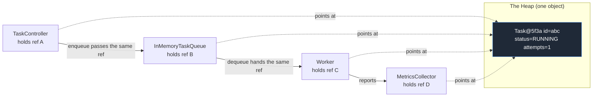
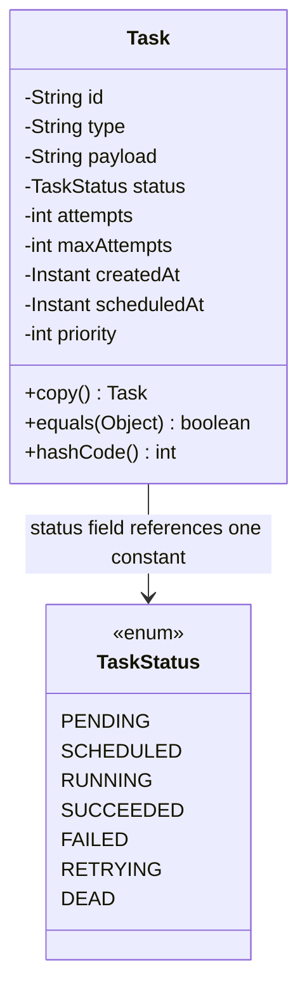

# Objects and References

> A `Task` lives in exactly one place — the heap. But a single `Task` can be *pointed at* from many places at once: the submission API holds it, the queue holds it, a worker holds it, a metrics counter holds it. Those are not four tasks. They are four **references** to one object. Almost every subtle bug in a queue system — the worker that mutates a task another thread is reading, the "duplicate" that is actually the same object, the dreaded `NullPointerException` at 3 a.m. — comes from not understanding the difference between an *object* and a *reference to it*. This chapter makes that distinction physical.

---

## 1. Where This Fits In The Project

In [chapter-01-classes-and-objects.md](../01-java-fundamentals/chapter-01-classes-and-objects.md) we built the `Task` class and learned that `new Task(...)` produces an object. We waved our hands at one detail: what is the variable `t` in `Task t = new Task(...)`? It is **not** the task. It is a **reference** — a typed handle that *points at* a task sitting on the heap.

That distinction is the foundation of the whole platform. The moment a `Task` is submitted, it is handed around:



There are **four references** (A, B, C, D) and **one object**. If the worker mutates the object through ref C, the API sees the change through ref A — because they are the same task. That is sometimes exactly what we want and sometimes a catastrophic **aliasing bug**. This chapter teaches you to tell the two apart, and foreshadows the [java-memory-model module](../03-java-memory-model/object-references.md) where we make the rules formal.

---

## 2. Why This Exists — The Real Problem

You have solved 1000+ DSA problems. You already *use* references constantly — every time you pass an `int[]` to a function in Java and the function mutates it, you have used reference semantics. You may just never have had to *name* the model, because LeetCode rarely punishes you for aliasing.

A long-lived backend punishes you constantly. Concretely:

- A `Task` is created once but referenced from the API thread, a `BlockingQueue`, a worker thread, and a metrics map. If you believe each "copy" is independent, you will be blindsided when a mutation in one place appears everywhere.
- You will call `taskA.equals(taskB)` and need to know: am I asking "are these the same object in memory?" or "do these describe the same logical task?" Those are different questions with different operators (`==` vs `equals`).
- A reference can point at **nothing** — `null`. Dereferencing it (`task.getId()`) throws `NullPointerException`, the single most common runtime crash in Java's history.

So the model exists to answer three questions precisely: **Where does an object live? How many things can point at it? When are two handles "equal"?**

### A tiny bit of history

The object-versus-reference split is not a Java quirk; it is how managed languages tame memory. In **C**, you manually distinguish a `Task t` (a value on the stack) from a `Task *p` (a pointer to one on the heap), and you free it yourself — get it wrong and you get a use-after-free or a leak. **Java (1995)** made one deliberate decision: *every object is always accessed through a reference, and you never free anything by hand* — a garbage collector reclaims objects once no reference points at them. C# and Go and Kotlin all copied this model. The upside is no dangling pointers. The price is that **aliasing is invisible** — there is no `*` or `&` to remind you that two variables share one object. You have to keep the model in your head. This chapter installs that model.

### How this differs from what you already know

| You came from | Their model | Java's model | The gotcha |
|---|---|---|---|
| C/C++ | explicit `Task` (value) vs `Task*` (pointer) | every object is implicitly a reference | no `*`/`&` to signal sharing — aliasing is silent |
| Python | names bind to objects; `is` vs `==` | references; `==` vs `.equals` | same idea, different operator names |
| Go | values copy; pointers via `&`/`*` | objects never copy on assignment | Java assignment of an object never deep-copies |
| Rust | move/borrow checker enforces aliasing rules | no compiler help; you must reason manually | Java lets two refs mutate one object with no warning |
| JS/TS | primitives by value, objects by reference | primitives by value, objects by reference | closest match — but Java adds `==` vs `.equals` |

> One sentence to internalize: **In Java, a variable of a class type is never the object — it is a typed arrow pointing at an object on the heap, or at nothing (`null`).**

---

## 3. The Naive Version — Believing Each Reference Is A Copy

Here is the mental model a newcomer brings from value-oriented thinking. They believe assignment copies the object. It does not, and the bug is silent.

```java
// File: AliasingDemo.java  (NAIVE mental model — read the output and wince)
import java.time.Instant;

public class AliasingDemo {
    public static void main(String[] args) {
        Task original = new Task("abc", "send-email", "{}", TaskStatus.PENDING,
                                 0, 3, Instant.now(), null, 5);

        // The newcomer THINKS this makes an independent snapshot. It does not.
        Task snapshot = original;     // copies the REFERENCE, not the object

        // A worker "starts" the task by mutating through one handle...
        snapshot.setStatus(TaskStatus.RUNNING);
        snapshot.setAttempts(1);

        // ...and is shocked that the "untouched" original changed too.
        System.out.println(original.getStatus());   // RUNNING  (!!)
        System.out.println(original.getAttempts());  // 1        (!!)
        System.out.println(original == snapshot);    // true — same object
    }
}
```

What went wrong:

1. **`Task snapshot = original;` copied the arrow, not the task.** Both variables now point at the *same* heap object. There was only ever one `Task`.
2. **Mutation is shared.** `snapshot.setStatus(...)` and `original.getStatus()` touch the same fields because there is one set of fields.
3. **The newcomer has no word for this.** They call it "the copy changed by itself," which is a haunted-house explanation for a mundane fact: there was never a copy.

Now scale this into the queue, where it stops being a curiosity and becomes a production incident:

```java
// File: QueueAliasingBug.java  (NAIVE — this ships, then pages you at 3 a.m.)
import java.util.ArrayList;
import java.util.List;
import java.time.Instant;

public class QueueAliasingBug {
    public static void main(String[] args) {
        Task t = new Task("abc", "resize-image", "{}", TaskStatus.PENDING,
                          0, 3, Instant.now(), null, 5);

        List<Task> auditLog = new ArrayList<>();
        auditLog.add(t);                 // we think we logged a "PENDING snapshot"

        // Later, a worker runs the task and mutates it...
        t.setStatus(TaskStatus.SUCCEEDED);
        t.setAttempts(1);

        // The "audit log" entry we thought captured PENDING now reads SUCCEEDED.
        System.out.println(auditLog.get(0).getStatus());   // SUCCEEDED — audit ruined
    }
}
```

The audit log did not capture a moment in time. It captured a *reference* to a live, mutating object. The "snapshot" lies because it was never a snapshot — it is an alias. This is the canonical **aliasing bug**, and the in-memory queue is full of opportunities for it.

> The fix is **not** "never share references" — sharing is the whole point of a queue. The fix is to *know when you are sharing* and to copy deliberately (or use immutability) when you need a true snapshot.

---

## 4. Improved Version — Naming The Model And Copying On Purpose

The improvement is conceptual first, then mechanical. We accept that assignment shares, and when we actually need an independent task we **copy explicitly**.

```java
// File: Task.java  (the canonical model — fields per the SPEC, with a copy helper)
import java.time.Instant;
import java.util.Objects;

public class Task {
    private final String id;        // UUID; identity never changes
    private String type;
    private String payload;         // JSON string
    private TaskStatus status;
    private int attempts;
    private final int maxAttempts;
    private final Instant createdAt;
    private Instant scheduledAt;
    private int priority;

    public Task(String id, String type, String payload, TaskStatus status,
                int attempts, int maxAttempts, Instant createdAt,
                Instant scheduledAt, int priority) {
        this.id = Objects.requireNonNull(id, "id");
        this.type = Objects.requireNonNull(type, "type");
        this.payload = payload;
        this.status = Objects.requireNonNull(status, "status");
        this.attempts = attempts;
        this.maxAttempts = maxAttempts;
        this.createdAt = Objects.requireNonNull(createdAt, "createdAt");
        this.scheduledAt = scheduledAt;
        this.priority = priority;
    }

    /** A genuine, independent snapshot — a NEW object on the heap with the same field values. */
    public Task copy() {
        return new Task(id, type, payload, status, attempts, maxAttempts,
                        createdAt, scheduledAt, priority);
    }

    public String getId()        { return id; }
    public String getType()      { return type; }
    public String getPayload()   { return payload; }
    public TaskStatus getStatus(){ return status; }
    public int getAttempts()     { return attempts; }
    public int getMaxAttempts()  { return maxAttempts; }
    public Instant getCreatedAt(){ return createdAt; }
    public Instant getScheduledAt(){ return scheduledAt; }
    public int getPriority()     { return priority; }

    public void setStatus(TaskStatus status) { this.status = Objects.requireNonNull(status); }
    public void setAttempts(int attempts)    { this.attempts = attempts; }
    public void setScheduledAt(Instant at)   { this.scheduledAt = at; }

    @Override
    public String toString() {
        return "Task[id=%s, type=%s, status=%s, attempts=%d/%d]"
            .formatted(id, type, status, attempts, maxAttempts);
    }
}
```

Now the audit log works *because we made a real copy*:

```java
// File: QueueAliasingFixed.java
auditLog.add(t.copy());            // an independent object frozen at PENDING
t.setStatus(TaskStatus.SUCCEEDED); // mutates the live task, not the snapshot
System.out.println(auditLog.get(0).getStatus());  // PENDING — audit preserved
System.out.println(t == auditLog.get(0));          // false — different objects
```

We have not removed sharing. We have made the sharing *visible*: assignment shares (alias), `.copy()` does not (new object). That single distinction — "is this the same object, or a same-valued different object?" — is what `==` and `equals` exist to answer, which is the next refinement.

---

## 5. Production-Quality Version — Identity, `==` vs `equals`, and `null`-Safety

A staff engineer ships three things this naive code lacked: a **defined identity contract** (so "same task" is unambiguous), **`null`-safe access**, and a clear rule for **when to copy vs share**. Identity is the linchpin, so we give `Task` an `equals`/`hashCode` based on its `id` (its UUID is its identity — two `Task` objects with the same `id` *are* the same logical task).

```java
// File: Task.java  (production additions — append to the class above)
@Override
public boolean equals(Object o) {
    // Reference-equality fast path: literally the same object.
    if (this == o) return true;
    // Type + null check via pattern matching (Java 21).
    if (!(o instanceof Task other)) return false;
    // Logical identity: a Task IS its id. Other fields are mutable state, not identity.
    return id.equals(other.id);
}

@Override
public int hashCode() {
    return id.hashCode();   // must agree with equals: equal objects -> equal hashCodes
}
```

Now the two notions of "equal" are crisp:

```java
// File: EqualityDemo.java
import java.time.Instant;

public class EqualityDemo {
    public static void main(String[] args) {
        Instant now = Instant.now();
        Task a = new Task("abc", "email", "{}", TaskStatus.RUNNING, 1, 3, now, null, 5);
        Task b = new Task("abc", "email", "{}", TaskStatus.PENDING, 0, 3, now, null, 5);
        Task c = a;   // alias

        System.out.println(a == b);        // false — different objects on the heap
        System.out.println(a.equals(b));   // true  — same id, so same logical task
        System.out.println(a == c);        // true  — same object (alias)
        System.out.println(a.equals(c));   // true  — trivially, same object
    }
}
```

> **The rule:** use `==` to ask *"is this literally the same object?"* and `.equals()` to ask *"does this represent the same thing?"* For class types, **almost always use `.equals()`** — `==` on objects is only correct when you genuinely mean identity (e.g., enum constants, or checking against `null`).

### `null`: the reference that points at nothing

A reference variable can hold `null` — a valid value meaning "points at no object." Dereferencing it throws:

```java
// File: NullDemo.java
public class NullDemo {
    public static void main(String[] args) {
        Task task = null;
        // System.out.println(task.getId());  // -> NullPointerException at runtime

        // Production-safe patterns:

        // 1. null-safe equals: call equals on the constant or use Objects.equals.
        System.out.println("RUNNING".equals(getStatusName(task)));  // false, no NPE
        System.out.println(java.util.Objects.equals(task, null));   // true, no NPE

        // 2. Guard before dereferencing.
        if (task != null) {
            System.out.println(task.getId());
        }

        // 3. Prefer Optional<Task> at API boundaries (TaskRepository.findById returns it).
    }

    static String getStatusName(Task t) {
        return t == null ? null : t.getStatus().name();
    }
}
```

Notice trick #1: `"RUNNING".equals(x)` never throws even if `x` is `null`, because the *left* operand is a non-null constant. This is why seasoned Java code writes `CONSTANT.equals(variable)`, not `variable.equals(CONSTANT)`. And note that `==` against `null` is always safe — `null` is the one case where `==` on a reference is the *right* tool, because you are asking "does this arrow point at nothing?"

### The full picture, with a memory diagram



Two references, one object — the picture every Java engineer holds in their head:

```text
STACK (per-thread)                 HEAP (shared, GC-managed)
+----------------------+
| original  ---------- + --------> +-------------------------------+
+----------------------+           |  Task@5f3a                    |
| snapshot  ---------- + --------> |   id       = "abc"            |
+----------------------+    (same  |   type     = "send-email"     |
| auditCopy ---------- + --+ arrow)|   status   = RUNNING          |
+----------------------+   |       |   attempts = 1                |
                           |       +-------------------------------+
                           |
                           +-----> +-------------------------------+
                                   |  Task@9b2c  (the .copy())     |
                                   |   id       = "abc"            |
                                   |   status   = PENDING          |
                                   +-------------------------------+
```

`original` and `snapshot` are two arrows to **one** object — mutate via either, both see it. `auditCopy` is an arrow to a **second** object with the same `id` — `auditCopy.equals(original)` is `true` (same id) but `auditCopy == original` is `false` (different objects). This diagram is the whole chapter. The [stack-vs-heap chapter](../03-java-memory-model/stack-vs-heap.md) makes the left/right split rigorous.

---

## 6. Code Walkthrough — Beginner, Intermediate, Production

### Beginner: one object, two names

```java
// File: TwoNames.java
import java.time.Instant;

public class TwoNames {
    public static void main(String[] args) {
        Task t1 = new Task("id-1", "email", "{}", TaskStatus.PENDING,
                           0, 3, Instant.now(), null, 5);
        Task t2 = t1;                    // SAME object, second name

        t2.setStatus(TaskStatus.RUNNING);
        System.out.println(t1.getStatus());  // RUNNING — t1 sees it, they share one object
        System.out.println(t1 == t2);        // true
    }
}
```

The lesson: assignment of a class type binds another name to the **same** object. No object was created by `Task t2 = t1`.

### Intermediate: pass-by-value of the *reference*

Java is pass-by-value — but the *value* passed for an object argument is **the reference**, so the method can mutate the shared object yet cannot make the caller's variable point elsewhere. This trips up nearly everyone once.

```java
// File: PassByValueDemo.java
import java.time.Instant;

public class PassByValueDemo {
    static void mutate(Task task)   { task.setStatus(TaskStatus.RUNNING); } // affects caller
    static void reassign(Task task) { task = null; }                        // does NOT affect caller

    public static void main(String[] args) {
        Task t = new Task("id-9", "email", "{}", TaskStatus.PENDING,
                          0, 3, Instant.now(), null, 5);

        mutate(t);
        System.out.println(t.getStatus());  // RUNNING — method mutated the shared object

        reassign(t);
        System.out.println(t == null);      // false — method only rebound its OWN copy of the arrow
    }
}
```

`mutate` follows the arrow and changes the object; the caller sees it. `reassign` repoints *its local arrow* at `null`; the caller's arrow is untouched. The full treatment lives in [pass-by-value.md](../03-java-memory-model/pass-by-value.md), but the queue depends on this distinction: `enqueue(Task t)` shares your task with the queue, and a worker mutating it later mutates *your* task.

### Production-inspired: aliasing inside the queue, and the snapshot fix

```java
// File: InMemoryTaskQueue.java  (the canonical Phase-1 queue; reference semantics in action)
import java.util.concurrent.BlockingQueue;
import java.util.concurrent.LinkedBlockingQueue;

public class InMemoryTaskQueue implements TaskQueue {
    private final BlockingQueue<Task> queue = new LinkedBlockingQueue<>();

    @Override public void enqueue(Task t) {
        // We store the REFERENCE. The caller and the queue now alias one Task.
        queue.offer(t);
    }

    @Override public Task dequeue() throws InterruptedException {
        return queue.take();   // hands back the SAME reference we stored
    }

    @Override public int size() { return queue.size(); }
}
```

```java
// File: SubmissionService.java  (decide deliberately: share or snapshot)
public class SubmissionService {
    private final TaskQueue queue;
    private final java.util.List<Task> auditLog = new java.util.ArrayList<>();

    public SubmissionService(TaskQueue queue) { this.queue = queue; }

    public void submit(Task task) {
        // Audit must freeze the submitted state -> store an independent COPY.
        auditLog.add(task.copy());
        // The queue gets the live reference; the worker is expected to mutate it.
        queue.enqueue(task);
    }
}
```

The production call is conscious: the **audit log gets a `copy()`** (a real snapshot that won't drift), while the **queue gets the live reference** (because the worker is *supposed* to mutate the task as it runs). Same `Task` value, two completely different sharing decisions — and you now have the vocabulary to make each one on purpose. When threads enter the picture, sharing a mutable object across them is exactly the hazard [atomics-and-thread-safety.md](../06-concurrency/atomics-and-thread-safety.md) addresses.

---

## 7. How This Applies To Our Task Queue Project

Reference semantics are not an abstract Java fact here; they are load-bearing in the canonical model:

- **`TaskQueue.enqueue(Task t)` / `dequeue()`** move *references*, not copies. A `Task` you enqueue is the same object the `Worker` dequeues. Cheap (no copying), but it means the worker can mutate "your" task.
- **`Worker.run()`** does `task.setStatus(RUNNING)`, runs the handler, then `task.setStatus(SUCCEEDED)` or bumps `attempts`. Every observer holding that reference sees the transitions live.
- **`MetricsCollector`** and dedup logic rely on **`equals`/`hashCode` keyed on `id`** so that the same logical task maps to one counter/slot regardless of how many distinct `Task` objects (e.g., one rehydrated from `TaskRepository.findById`) describe it.
- **`TaskRepository.findById(String id)` returns `Optional<Task>`** precisely to make "no such task" a *typed* outcome instead of a `null` landmine — the production answer to the `null` problem in section 5.
- **`DeadLetterQueue.send(Task t, String reason)`** stores a reference too; if you want the DLQ entry to reflect the task *at the moment of death*, you snapshot with `copy()` first.

> Rule of thumb for the platform: **share references inside a single owning flow; copy (or use immutable values) when crossing an ownership or time boundary** (audit, DLQ snapshot, cross-thread publish).

---

## 8. Tradeoffs

| Decision | Pros | Cons | When to choose |
|---|---|---|---|
| Share references (alias) | Zero copy cost, O(1), the queue's whole point | Mutation is visible everywhere; aliasing bugs; thread hazards | Inside one flow that owns the task's lifecycle |
| Copy via `copy()` | True snapshot; immune to later mutation | Allocation + GC pressure; copy can go stale vs the live task | Audit logs, DLQ snapshots, returning to untrusted callers |
| Make `Task` immutable (record + `with`) | No aliasing bugs *ever*; trivially thread-safe | Every state change allocates a new object; more churn | High-concurrency paths; event sourcing (Phase 4) |
| `==` for equality | Fast, no method call | Wrong for logical identity; compares addresses | Only for `null` checks and enum constants |
| `.equals()` for equality | Correct logical identity; works in collections | Must be implemented correctly and kept in sync with `hashCode` | Almost always, for class types |

The deep tradeoff is **mutability vs aliasing safety**. Our `Task` is mutable (status flips as it runs), so aliasing is a live hazard we manage by discipline and `copy()`. The [immutable-objects chapter](../03-java-memory-model/immutable-objects.md) shows the alternative: make `Task` immutable and replace mutation with "produce a new `Task` with the new status," trading allocation for safety.

---

## 9. Common Mistakes And Pitfalls

- **Believing `Task b = a;` copies the object.** It copies the arrow. Fix: call `a.copy()` when you need an independent object.
- **Using `==` to compare two `Task`s for "sameness."** It only returns `true` for the identical object, so logically-equal tasks compare `false`. Fix: use `.equals()`.
- **Overriding `equals` but not `hashCode` (or vice versa).** Breaks `HashMap`/`HashSet`: equal tasks land in different buckets. Fix: always override both, consistently (here, both off `id`).
- **`variable.equals(CONSTANT)` when `variable` may be `null`.** Throws NPE. Fix: `CONSTANT.equals(variable)` or `Objects.equals(a, b)`.
- **Returning `null` to signal "not found."** Spreads NPEs across the codebase. Fix: return `Optional<Task>` (as `TaskRepository` does).
- **Mutating a shared `Task` from multiple threads without synchronization.** Reference sharing + mutation across threads = data races. Fix: confine the task to one thread, synchronize, or use immutability (see [concurrent-collections.md](../06-concurrency/concurrent-collections.md)).
- **Putting a mutable `Task` in a `HashSet`, then mutating a field used by `hashCode`.** It vanishes from the set. Fix: key `hashCode` only on the immutable `id` (we do), or never mutate fields that affect equality.

---

## 10. Refactoring Exercise — Bad → Improved → Production

**Bad:** a service that "caches the last submitted task" but accidentally aliases live state.

```java
// BAD
public class LastTaskCache {
    private Task last;
    public void onSubmit(Task t) { this.last = t; }       // aliases the live task
    public Task getLast()        { return last; }          // hands out the live, mutating task
}
```

A worker later mutates the task to `SUCCEEDED`; `getLast()` now returns `SUCCEEDED`, not the submitted state the cache promised. Worse, a caller can mutate the cached task and corrupt it.

**Improved:** snapshot on the way in so the cache holds a frozen value.

```java
// IMPROVED
public class LastTaskCache {
    private Task last;
    public void onSubmit(Task t) { this.last = t.copy(); }  // independent snapshot
    public Task getLast()        { return last; }            // but still hands out our internal object
}
```

Better — the cached value no longer drifts. But `getLast()` still leaks the cache's internal object: a caller could mutate it and quietly change what the cache returns next time.

**Production:** snapshot in *and* out, and make absence explicit with `Optional`.

```java
// PRODUCTION
import java.util.Optional;

public class LastTaskCache {
    private Task last;   // may be null internally; never exposed as null

    public synchronized void onSubmit(Task t) {
        this.last = t.copy();                 // freeze on write
    }

    public synchronized Optional<Task> getLast() {
        return Optional.ofNullable(last).map(Task::copy);  // freeze on read, no null escapes
    }
}
```

We copy on write (the cache is immune to later worker mutations), copy on read (callers can't mutate our internal state), expose `Optional<Task>` (no `null` leaks), and `synchronized` so the cache is safe under the concurrent submitters Phase 1 already has. Three reference-semantics ideas — aliasing, deliberate copying, and `null`-safety — in nine lines.

---

## 11. Exercises

### Easy

**E1 (knowledge check).** Given `Task a = new Task(...); Task b = a;`, how many `Task` objects exist on the heap? What does `a == b` return, and why?

**E2 (coding).** Write a method `boolean sameLogicalTask(Task x, Task y)` that returns `true` when both refer to the same logical task, is `null`-safe (no NPE if either is `null`), and treats two `null`s as the same.

### Medium

**M1 (coding).** Implement `Task.copy()` and a test proving that after `Task b = a.copy(); b.setStatus(RUNNING);`, `a.getStatus()` is unchanged and `a.equals(b)` is still `true` (same id) while `a == b` is `false`.

**M2 (refactoring).** The naive `QueueAliasingBug` from section 3 corrupts its audit log. Refactor `SubmissionService.submit` so the audit log freezes the submitted state, and write an assertion proving the logged status stays `PENDING` after the task succeeds.

### Hard

**H1 (design).** `MetricsCollector` counts tasks per `id`. Two `Task` objects can describe the same logical task (one fresh, one rehydrated from `TaskRepository`). Design the equals/hashCode contract and a `Map` choice so both map to one counter. Explain why mutating `status` must not move the task between buckets.

**H2 (interview-style).** Explain to an interviewer, using a memory diagram, why `reassign(Task t) { t = null; }` does not null out the caller's variable, but `mutate(Task t) { t.setStatus(RUNNING); }` does change the caller's task. Name the language rule.

**H3 (stretch).** Convert `Task` to an immutable Java 21 `record` with a `withStatus(TaskStatus)` method that returns a new `Task`. Show how this eliminates the audit-log aliasing bug *for free*, and state the cost you paid.

---

## 12. Solutions

**E1.** **One** object exists — `Task b = a` copies only the reference (the arrow), not the object. `a == b` returns `true` because both arrows point at that single object; `==` on references asks "same object?" and they are.

**E2.**

```java
// File: SameLogicalTask.java
import java.util.Objects;

public class SameLogicalTask {
    static boolean sameLogicalTask(Task x, Task y) {
        // Objects.equals handles both-null (true), one-null (false), and delegates to Task.equals.
        return Objects.equals(x, y);
    }

    public static void main(String[] args) {
        Task a = new Task("abc", "email", "{}", TaskStatus.PENDING, 0, 3,
                          java.time.Instant.now(), null, 5);
        Task b = a.copy();
        System.out.println(sameLogicalTask(a, b));      // true  — same id
        System.out.println(sameLogicalTask(a, null));   // false — no NPE
        System.out.println(sameLogicalTask(null, null));// true  — both absent
    }
}
```

`Objects.equals(a, b)` is the canonical null-safe equality: returns `true` if both are `null`, `false` if exactly one is, else `a.equals(b)`. It never throws.

**M1.**

```java
// File: CopySemanticsTest.java
import java.time.Instant;
import static org.assertj.core.api.Assertions.assertThat;
import org.junit.jupiter.api.Test;

class CopySemanticsTest {
    @Test void copyIsIndependentButLogicallyEqual() {
        Task a = new Task("abc", "email", "{}", TaskStatus.PENDING, 0, 3,
                          Instant.now(), null, 5);
        Task b = a.copy();

        b.setStatus(TaskStatus.RUNNING);

        assertThat(a.getStatus()).isEqualTo(TaskStatus.PENDING); // a untouched
        assertThat(b.getStatus()).isEqualTo(TaskStatus.RUNNING);
        assertThat(a == b).isFalse();        // different objects
        assertThat(a.equals(b)).isTrue();    // same id -> same logical task
    }
}
```

`copy()` builds a brand-new object with the same field values, so mutating `b` cannot reach `a`. `equals` is keyed on `id`, which both share, so they stay logically equal.

**M2.**

```java
// File: AuditSnapshotTest.java
import java.time.Instant;
import static org.assertj.core.api.Assertions.assertThat;
import org.junit.jupiter.api.Test;

class AuditSnapshotTest {
    @Test void auditLogFreezesSubmittedState() {
        TaskQueue queue = new InMemoryTaskQueue();
        SubmissionService svc = new SubmissionService(queue);   // calls auditLog.add(task.copy())

        Task t = new Task("abc", "resize", "{}", TaskStatus.PENDING, 0, 3,
                          Instant.now(), null, 5);
        svc.submit(t);

        // Worker effect: the live task succeeds.
        t.setStatus(TaskStatus.SUCCEEDED);

        // The audited copy stays PENDING because it is a separate object.
        assertThat(svc.auditLogView().get(0).getStatus()).isEqualTo(TaskStatus.PENDING);
    }
}
```

The fix is the single line `auditLog.add(task.copy())` in `submit`. Because the audit entry is now a distinct object, the worker's later mutation of the live task cannot touch it. (`auditLogView()` is a read-only accessor added for the test.)

**H1.** Key `equals`/`hashCode` on the immutable `id` only — never on `status`, `attempts`, or any field that mutates. Use `Map<String, LongAdder>` keyed by `task.getId()` (or `HashMap<Task, Counter>` relying on the id-based contract). Because `hashCode` depends only on `id`, two `Task` objects with the same id hash to the same bucket and `equals` confirms them as one key, so both increment the same counter. If `hashCode` instead depended on `status`, mutating a task from `RUNNING` to `SUCCEEDED` would change its hash, the `Map` would look in a different bucket, and the task would appear to "vanish" from its old slot — a classic mutable-key bug. Identity must be stable for the object's lifetime; the UUID is, the status is not.

**H2.** Java is **pass-by-value**: the value passed for an object argument is a *copy of the reference*. Diagram:

```text
caller: t -----------------------> [ Task object ]
              copies the arrow         ^   ^
method: t' (its own arrow) ------------+   |
                                           |
reassign:  t' = null   (only t' moves; caller's t still points here)
mutate:    t'.setStatus(...) (follows t' to the SAME object; caller's t sees it)
```

`reassign` repoints the method's *local* arrow `t'` to `null` — the caller's `t` is a different arrow and is unaffected. `mutate` does not touch any arrow; it follows `t'` to the shared object and changes a field, which the caller's `t` (pointing at the same object) observes. The rule: **Java passes references by value — you can mutate the pointed-at object, but you cannot rebind the caller's variable.**

**H3.**

```java
// File: Task.java  (immutable record variant — Java 21)
import java.time.Instant;

public record Task(String id, String type, String payload, TaskStatus status,
                   int attempts, int maxAttempts, Instant createdAt,
                   Instant scheduledAt, int priority) {

    public Task {                                 // compact canonical constructor
        java.util.Objects.requireNonNull(id, "id");
        java.util.Objects.requireNonNull(status, "status");
    }

    /** Returns a NEW Task with a changed status; the original is never mutated. */
    public Task withStatus(TaskStatus newStatus) {
        return new Task(id, type, payload, newStatus, attempts, maxAttempts,
                        createdAt, scheduledAt, priority);
    }
}
```

The audit bug disappears for free: `auditLog.add(task)` is now safe to share because *no one can mutate `task`* — a "status change" produces a different object (`task = task.withStatus(RUNNING)`), leaving every existing reference pointing at the unchanged original. Records also generate id-and-all-fields `equals`/`hashCode`; if you want id-only identity you override them. **The cost:** every state transition allocates a new `Task`, increasing GC churn — acceptable, even ideal, on high-concurrency paths, but a real allocation tax to weigh. This is the central tradeoff of [immutable-objects.md](../03-java-memory-model/immutable-objects.md).

---

## 13. Interview Questions And Takeaways

1. **What is the difference between an object and a reference in Java?**
   An object is data living on the heap, created by `new`. A reference is a typed handle (on the stack or inside another object) that points at a heap object or holds `null`. Variables of class type are references, never the object itself.

2. **What does `Task b = a;` do?**
   Copies the reference, not the object. Both names point at one object; mutating through either is visible through the other. Zero objects are created.

3. **`==` vs `equals` for objects — when do you use each?**
   `==` compares references (same object?). `equals` compares logical value/identity. For class types use `equals`; reserve `==` for `null` checks and enum constants.

4. **If you override `equals`, what else must you override, and why?**
   `hashCode`, consistently. Hash-based collections (`HashMap`, `HashSet`) locate objects by hash first, then confirm with `equals`. Equal objects with different hashes break those collections.

5. **Is Java pass-by-value or pass-by-reference?**
   Strictly pass-by-value. For objects, the *value copied is the reference*, so a method can mutate the shared object but cannot rebind the caller's variable.

6. **What is an aliasing bug? Give a real example.**
   Two references share one mutable object, and a mutation through one unexpectedly affects the other. Example: storing a live `Task` in an audit log, then a worker mutating it corrupts the "snapshot."

7. **How do you avoid a `NullPointerException` when comparing strings/objects?**
   Put the known non-null constant on the left (`"RUNNING".equals(x)`), or use `Objects.equals(a, b)`. Prefer `Optional` over returning `null`.

8. **Why might you make `Task` immutable?**
   It eliminates aliasing bugs and makes the object trivially thread-safe; the cost is allocating a new object per state change.

**Takeaways:** a variable is an arrow, not the object; assignment copies arrows; `==` is identity and `equals` is logical sameness; `null` is an arrow to nothing; copy or go immutable when you cross a time or ownership boundary.

---

## 14. Production Considerations

- **Thread safety.** Phase 1 already shares one mutable `Task` across the API thread, the `BlockingQueue`, and worker threads. Reference sharing + mutation across threads is a data race unless the task is confined to one thread or its mutation is synchronized. The `BlockingQueue` gives a safe *handoff* (a happens-before edge), but nothing protects the task once two threads hold the reference simultaneously. See [atomics-and-thread-safety.md](../06-concurrency/atomics-and-thread-safety.md).
- **Memory leaks via lingering references.** Java frees objects only when *no reference* points at them. A `Task` left in a static cache, an unbounded audit `List`, or a listener registry is never collected — a slow leak. Audit logs and dedup maps must be bounded or evicting. See [garbage-collection.md](../03-java-memory-model/garbage-collection.md).
- **`equals`/`hashCode` and persistence.** When tasks are rehydrated from Postgres (Phase 2), each `findById` may return a *new* `Task` object for the same row. Id-based `equals`/`hashCode` is what keeps dedup, metrics, and set membership correct across object boundaries.
- **`null` at the edges.** External input (JSON payloads, DB columns) is where `null` sneaks in. Validate at the boundary (constructor `requireNonNull`, `Optional` return types) so `null` never travels deep into worker logic and surfaces as an NPE mid-execution.
- **Defensive copies cost allocations.** Snapshotting every task everywhere creates GC pressure. Copy only at real boundaries (audit, DLQ, cross-thread publish); share freely within one owning flow.

---

## What We Can Improve In Our Project Using This Concept

- Add `Task.copy()` and id-based `equals`/`hashCode` to the canonical `Task` so dedup, metrics, and set membership are correct across distinct `Task` objects.
- Make `SubmissionService` snapshot tasks into the audit log instead of aliasing live, mutating objects.
- Replace any `null`-returning lookups with `Optional<Task>`, matching `TaskRepository.findById`'s contract, to kill a class of NPEs.
- Document the platform rule "share within a flow, copy across boundaries" so future contributors make sharing decisions consciously.

## Project Refactoring Task

1. Add `equals`/`hashCode` keyed on `id` and a `copy()` method to `Task`.
2. Update `SubmissionService.submit` to store `task.copy()` in the audit log while enqueuing the live reference.
3. Refactor `LastTaskCache` (or equivalent) to copy-on-write, copy-on-read, and return `Optional<Task>`.
4. Add `CopySemanticsTest` and `AuditSnapshotTest` (from section 12) and confirm they pass.
5. Grep the codebase for `== ` comparisons on `Task` and replace logical comparisons with `.equals()`.

## Git Commit For This Chapter

```bash
git add src/main/java/com/platform/task/Task.java \
        src/main/java/com/platform/task/SubmissionService.java \
        src/main/java/com/platform/task/LastTaskCache.java \
        src/test/java/com/platform/task/CopySemanticsTest.java \
        src/test/java/com/platform/task/AuditSnapshotTest.java
git commit -m "feat(task): add id-based equality, copy() snapshots, and null-safe accessors

Define Task identity via id-based equals/hashCode, add copy() for true
snapshots, and snapshot tasks into the audit log to fix an aliasing bug
where worker mutations corrupted logged state. Return Optional from the
last-task cache to eliminate null leaks."
```

Files touched: `Task.java`, `SubmissionService.java`, `LastTaskCache.java`, `CopySemanticsTest.java`, `AuditSnapshotTest.java`.

## Architecture Impact

Establishing reference semantics and an identity contract early ripples through every later phase. Id-based equality is the precondition for **idempotency** and **deduplication** in [idempotency.md](../08-distributed-systems/idempotency.md), for correct **metrics** aggregation, and for tasks surviving a round-trip through **Postgres** (Phase 2) and a **distributed broker** (Phase 4) as the "same" logical task. The "share within a flow, copy across boundaries" rule becomes a hard requirement once workers run on separate threads and, later, separate nodes — at which point aliasing is no longer a local bug but a distributed-consistency hazard.

## Interview Takeaways

- A variable of class type is a reference (an arrow), never the object; assignment copies the arrow.
- `==` asks "same object?", `.equals()` asks "same thing?" — use `equals` for domain objects, override `hashCode` alongside it.
- Java is pass-by-value of the reference: methods can mutate shared objects but cannot rebind the caller's variable.
- Aliasing bugs come from sharing a mutable object unintentionally; fix with deliberate copies or immutability.
- `null` is a reference to nothing; guard with `Objects.equals`, constant-on-the-left `equals`, and `Optional` at boundaries.
