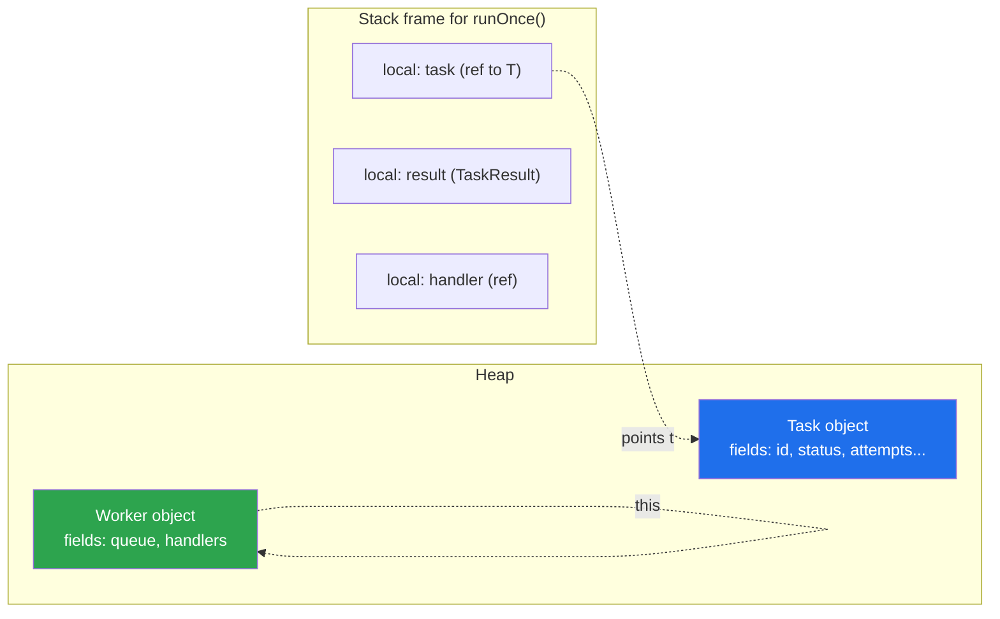
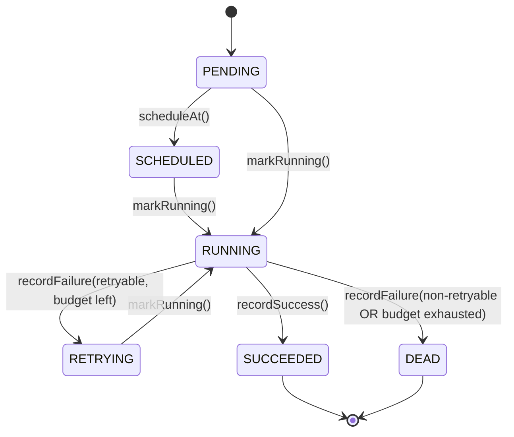

# Fields and Methods

> Where this fits in the project: in Phase 1 a `Task` is created by the **Submission API**, sits in an
> **in-memory queue**, and is pulled by a **Worker** that runs it. The Worker must move the task through
> its lifecycle — `markRunning`, `recordSuccess`, `recordFailure`. This chapter is about the two raw
> ingredients every such method is built from: **fields** (what an object *knows*) and **methods** (what
> an object *does*). Get the split between them right and the rest of OOP follows; get it wrong and you
> spend Phase 2 untangling bugs.

This chapter builds on [`chapter-01-objects-and-references.md`](./chapter-01-objects-and-references.md),
where we saw that an object is a region of heap memory reached through a reference. Here we zoom inside
that region: what lives there (instance fields), what does *not* (local variables), and how the methods
on the object reach their own state via `this`. We close with a preview of **Tell, Don't Ask**, the
principle that decides *which* methods a class should even have. The encapsulation machinery that
enforces all of this is the subject of [`chapter-02-encapsulation.md`](../01-java-fundamentals/chapter-02-encapsulation.md).

---

## 1. Why This Exists

You have solved 1000+ DSA problems, so you have written thousands of methods. But in a typical contest
solution, the distinction between "state that outlives a call" and "scratch space for one call" barely
matters — the whole program lives for 50ms inside one `main`. In a backend system that distinction is
load-bearing.

Consider our `Worker`. It pulls a `Task`, runs the matching `TaskHandler`, and must record what happened.
Three categories of data show up in that one operation:

1. **State that belongs to the Task and must survive long after the call ends** — `status`, `attempts`.
   This is *instance field* territory. It is the Task's identity over time.
2. **State that belongs to the Worker across many tasks** — the `TaskQueue` it pulls from, the handler
   registry it looks up in. Also instance fields, but of a *different object*.
3. **Scratch values that exist only while one method runs** — the `TaskResult` returned by a handler,
   a loop counter, a timestamp captured at the start of execution. These are *local variables*. The
   instant the method returns, they are gone and the garbage collector may reclaim them.

If you put scratch data in a field, you create accidental shared state that leaks between calls and
breaks under concurrency. If you try to keep durable state in a local variable, it evaporates and you
lose the task's history. **Fields versus locals is not a style choice — it is a correctness choice about
data lifetime.** The second half of the chapter answers the next question: given the fields, what
*methods* should the class expose? The wrong answer (getters/setters everywhere) produces *anemic*
objects that other classes manipulate from the outside; the right answer keeps behavior next to the data
it touches.

> **Definitions.**
> - **Instance field**: a variable declared directly in a class body (not inside a method). One copy
>   per object; lives on the heap as long as the object is reachable.
> - **Local variable**: a variable declared inside a method (or block). One copy per *call*; lives on
>   the call stack and dies when the method/block returns.
> - **Method signature**: the name plus the ordered list of parameter types (`recordFailure(String)`).
>   Java uses it to resolve which method you mean. The return type is *not* part of the signature.
> - **`this`**: the implicit reference to the object the method was invoked on.



The blue and green boxes (fields) live as long as their objects are reachable. The white boxes (locals)
vanish when `runOnce()` returns.

---

## 2. The Naive Version

Here is the first cut a newcomer to Java often writes when asked to "make the Worker run a task and
record the result." Everything is jammed into one method, durable state is confused with scratch state,
and the `Task`'s data is poked from the outside.

```java
// BAD: state lifetimes confused, Task treated as a dumb struct.
public class Worker {
    int attempts;        // FIELD — but this is per-task scratch, not per-worker state. WRONG home.
    String lastMessage;  // FIELD — leaks between tasks; not thread-safe; meaningless on the Worker.

    public void runOnce(TaskQueue queue, Map<String, TaskHandler> handlers) {
        try {
            Task task = queue.dequeue();
            attempts = task.attempts + 1;   // mutating Task from outside, storing on Worker
            task.attempts = attempts;       // off-by-one bugs live here
            task.status = TaskStatus.RUNNING;
            TaskHandler h = handlers.get(task.type);
            TaskResult r = h.handle(task);
            if (r.success()) {
                task.status = TaskStatus.SUCCEEDED;
                lastMessage = "ok";
            } else {
                task.status = TaskStatus.FAILED; // no retry logic, no DEAD transition
                lastMessage = r.message();
            }
        } catch (Exception e) {
            // attempts is now stale; if the next task throws here we read a previous task's count
        }
    }
}
```

Limitations, in order of severity:

- **`attempts` and `lastMessage` are instance fields on `Worker`, but they describe a `Task`.** One
  `Worker` runs many tasks; these fields smear one task's data over the next. Under Phase 1's worker
  pool (multiple Worker instances on multiple threads) this is also a data race waiting to happen.
- **The `Task` is a struct poked from the outside** (`task.attempts = ...`, `task.status = ...`). The
  rule "attempts may never exceed maxAttempts" and "you cannot go SUCCEEDED then RUNNING" lives nowhere.
- **No lifecycle methods.** There is no `markRunning`, no `recordFailure`. The transition logic is
  inlined and will be copy-pasted into the RetryHandler, the controller, and the tests.
- **Scratch and durable data are indistinguishable**, so you cannot reason about what survives a call.

---

## 3. The Improved Version

First fix: put each piece of data in the right home, and make the lifecycle a set of **methods on
`Task`** instead of field-poking from `Worker`. Locals stay local; durable per-task state stays on the
`Task`; durable per-worker state stays on the `Worker`.

```java
public class Task {
    private final String id;
    private final String type;
    private TaskStatus status;
    private int attempts;
    private final int maxAttempts;

    public Task(String id, String type, int maxAttempts) {
        this.id = id;                 // 'this.id' = the field; 'id' = the constructor parameter
        this.type = type;
        this.maxAttempts = maxAttempts;
        this.status = TaskStatus.PENDING;
        this.attempts = 0;
    }

    // Behavior lives next to the data it changes.
    public void markRunning() {
        this.status = TaskStatus.RUNNING;
        this.attempts++;              // 'this.' optional here; shown for clarity
    }

    public void recordSuccess() {
        this.status = TaskStatus.SUCCEEDED;
    }

    public void recordFailure() {
        this.status = TaskStatus.FAILED;
    }

    public String type()      { return type; }
    public TaskStatus status() { return status; }
    public int attempts()      { return attempts; }
}
```

```java
public class Worker {
    // Per-WORKER durable state — the collaborators it always uses. These belong here.
    private final TaskQueue queue;
    private final Map<String, TaskHandler> handlers;

    public Worker(TaskQueue queue, Map<String, TaskHandler> handlers) {
        this.queue = queue;
        this.handlers = handlers;
    }

    public void runOnce() throws InterruptedException {
        Task task = queue.dequeue();          // LOCAL: one task per call
        TaskHandler handler = handlers.get(task.type());  // LOCAL
        task.markRunning();                   // tell the Task to change itself
        try {
            TaskResult result = handler.handle(task);  // LOCAL: scratch result
            if (result.success()) task.recordSuccess();
            else                  task.recordFailure();
        } catch (Exception e) {
            task.recordFailure();
        }
    }
}
```

What improved:

- **`attempts` and `status` moved to where they belong** (the `Task`), and the per-task scratch (`task`,
  `handler`, `result`) is local — created and discarded per call, so two threads running two `Worker`
  instances never collide on them.
- **`Worker` keeps only genuinely per-worker state** (`queue`, `handlers`), set once in the constructor
  and `final`.
- **Transition logic is now methods on `Task`.** The Worker *tells* the task to change instead of
  reaching in. This is the first taste of Tell, Don't Ask (Section 7 and 12).

It is still incomplete: `recordFailure` ignores retries and the `DEAD` state, and the transitions aren't
guarded. That's the next step.

---

## 4. The Production-Quality Version

The version a staff engineer ships does three more things: (1) `recordFailure` understands the **retry
budget** and transitions to `RETRYING` or `DEAD` accordingly, taking a `TaskResult` so a non-retryable
failure dead-letters immediately; (2) every transition is **guarded** so illegal moves throw rather than
silently corrupt; (3) the class exposes **intention-revealing query methods** (`isTerminal`,
`canRetry`) instead of leaking raw fields. We keep the canonical model fields from the spec.

```java
import java.time.Instant;
import java.util.EnumSet;
import java.util.Set;

public final class Task {
    private final String id;
    private final String type;
    private final String payload;
    private TaskStatus status;
    private int attempts;
    private final int maxAttempts;
    private final Instant createdAt;
    private Instant scheduledAt;
    private final int priority;

    public Task(String id, String type, String payload,
                int maxAttempts, Instant scheduledAt, int priority) {
        this.id = id;
        this.type = type;
        this.payload = payload;
        this.maxAttempts = maxAttempts;
        this.priority = priority;
        this.createdAt = Instant.now();
        this.scheduledAt = scheduledAt;
        this.status = TaskStatus.PENDING;
        this.attempts = 0;
    }

    /** Legal predecessors for each target state — the transition table, in one place. */
    private static final Set<TaskStatus> RUNNABLE_FROM =
            EnumSet.of(TaskStatus.PENDING, TaskStatus.SCHEDULED, TaskStatus.RETRYING);

    // ---- Commands: behavior that mutates state, guarded by invariants ----

    public void markRunning() {
        require(RUNNABLE_FROM.contains(status),
                "cannot run from " + status);
        if (attempts >= maxAttempts) {
            throw new IllegalStateException("attempt budget exhausted for task " + id);
        }
        this.status = TaskStatus.RUNNING;
        this.attempts++;                 // attempts counts STARTED runs; monotonic, never exceeds budget
    }

    public void recordSuccess() {
        require(status == TaskStatus.RUNNING, "can only succeed from RUNNING, was " + status);
        this.status = TaskStatus.SUCCEEDED;
    }

    /**
     * Records a failure and decides the next state based on the result and the retry budget.
     * Returns the new status so callers (Worker, RetryHandler) need not re-derive it.
     */
    public TaskStatus recordFailure(TaskResult result) {
        require(status == TaskStatus.RUNNING, "can only fail from RUNNING, was " + status);
        if (result.retryable() && attempts < maxAttempts) {
            this.status = TaskStatus.RETRYING;
        } else {
            this.status = TaskStatus.DEAD;     // out of budget or non-retryable -> dead-letter
        }
        return this.status;
    }

    public void scheduleAt(Instant when) {
        require(status == TaskStatus.PENDING || status == TaskStatus.RETRYING,
                "cannot schedule from " + status);
        this.scheduledAt = when;
        this.status = TaskStatus.SCHEDULED;
    }

    // ---- Queries: intention-revealing, no raw state leaks where avoidable ----

    public boolean canRetry()  { return status == TaskStatus.RETRYING && attempts < maxAttempts; }
    public boolean isTerminal() {
        return status == TaskStatus.SUCCEEDED || status == TaskStatus.DEAD;
    }
    public boolean isDue(Instant now) {
        return scheduledAt == null || !scheduledAt.isAfter(now);
    }

    // ---- Accessors needed by persistence / serialization layers ----

    public String id()            { return id; }
    public String type()          { return type; }
    public String payload()       { return payload; }
    public TaskStatus status()    { return status; }
    public int attempts()         { return attempts; }
    public int maxAttempts()      { return maxAttempts; }
    public Instant createdAt()    { return createdAt; }
    public Instant scheduledAt()  { return scheduledAt; }
    public int priority()         { return priority; }

    private static void require(boolean condition, String message) {
        if (!condition) throw new IllegalStateException(message);
    }
}
```

Rationale:

- **`attempts++` lives inside `markRunning`**, so "attempts counts started runs" is defined once. No
  caller can desync `status` and `attempts`.
- **`recordFailure` takes the `TaskResult`** — the only data it needs from the outside — and returns the
  resulting status so the Worker doesn't re-implement the branching. Behavior travels *with* the decision.
- **Guards turn illegal transitions into loud `IllegalStateException`s** at the moment of corruption,
  not three layers downstream where they're undebuggable.
- **`final` fields** (`id`, `maxAttempts`, `createdAt`, `priority`) document that these never change and
  let the JVM and readers reason about immutability. `status`, `attempts`, `scheduledAt` are the only
  mutable cells, which is exactly the surface a reviewer should scrutinize.

---

## 5. Code Walkthrough

### Beginner: a field is not a local

```java
public class Counter {
    private int count;          // FIELD: one per Counter object, survives between calls

    public void increment() {
        int delta = 1;          // LOCAL: re-created every call, gone at the closing brace
        count += delta;         // 'count' resolves to the field; 'delta' to the local
    }

    public int value() { return count; }
}
```

```java
Counter c = new Counter();
c.increment();
c.increment();
System.out.println(c.value());  // 2 — the field accumulated; 'delta' did not
```

If `count` were declared inside `increment()` as a local, every call would start from 0 and `value()`
couldn't even see it. The accumulation *requires* field lifetime.

### Intermediate: `this`, shadowing, and method signatures

```java
public class Task {
    private int priority;

    // Parameter 'priority' SHADOWS the field 'priority' inside this method.
    public void setPriority(int priority) {
        // 'priority'      -> the parameter (the nearest declaration wins)
        // 'this.priority' -> the field
        this.priority = priority;     // without 'this.', this would assign the param to itself: a no-op
    }

    // OVERLOADING: same name, DIFFERENT signature (param types differ) -> two distinct methods.
    public void bumpPriority(int by)     { this.priority += by; }
    public void bumpPriority(int by, int max) { this.priority = Math.min(this.priority + by, max); }
}
```

Two things to internalize:

1. **Shadowing** is why `this.` exists. The compiler does *not* warn on `priority = priority;` — it is a
   legal (useless) self-assignment. This silent bug is the single most common rookie mistake in Java
   constructors and setters.
2. A **method signature** is name + parameter types. `bumpPriority(int)` and `bumpPriority(int, int)`
   have different signatures, so they coexist (overloading, covered in
   [`chapter-06-method-overloading.md`](./chapter-06-method-overloading.md)). The **return type is not
   part of the signature** — you cannot have two methods differing only by return type.

### Production-inspired: a Worker that tells, and a Task that decides

```java
public class Worker implements Runnable {
    private final TaskQueue queue;
    private final HandlerRegistry handlers;          // looks up TaskHandler by type
    private final DeadLetterQueue deadLetters;
    private volatile boolean running = true;         // per-worker control flag

    public Worker(TaskQueue queue, HandlerRegistry handlers, DeadLetterQueue deadLetters) {
        this.queue = queue;
        this.handlers = handlers;
        this.deadLetters = deadLetters;
    }

    @Override
    public void run() {
        while (running) {
            try {
                processOne();
            } catch (InterruptedException e) {
                Thread.currentThread().interrupt();
                return;
            }
        }
    }

    private void processOne() throws InterruptedException {
        Task task = queue.dequeue();                  // LOCAL
        TaskHandler handler = handlers.lookup(task.type());  // LOCAL
        task.markRunning();                           // TELL: Task owns the transition + attempts++
        try {
            TaskResult result = handler.handle(task); // LOCAL scratch
            if (result.success()) {
                task.recordSuccess();
            } else {
                dispatchFailure(task, result);
            }
        } catch (Exception e) {
            dispatchFailure(task, new TaskResult(false, e.toString(), true));
        }
    }

    private void dispatchFailure(Task task, TaskResult result) {
        TaskStatus next = task.recordFailure(result);     // Task decides RETRYING vs DEAD
        if (next == TaskStatus.DEAD) {
            deadLetters.send(task, result.message());     // only the side effect lives in Worker
        } else {
            queue.enqueue(task);                          // re-queue for retry
        }
    }

    public void stop() { this.running = false; }
}
```

Notice the division of labor. The `Worker` holds *its* durable collaborators as fields
(`queue`, `handlers`, `deadLetters`, `running`); each task and result is a *local*; and the
*decision* about state transitions lives entirely on `Task`. The Worker performs only the I/O side
effects (dead-letter, re-enqueue) that a `Task` has no business doing. This is the shape that scales
to a worker pool of virtual threads in Phase 1 and to distributed workers in Phase 4.

---

## 6. How This Applies to Our Task Queue Project

| Concept | Canonical model element | Field or method? |
| --- | --- | --- |
| Durable per-task state | `Task.status`, `Task.attempts`, `Task.scheduledAt` | instance fields (mutable) |
| Immutable per-task identity | `Task.id`, `Task.maxAttempts`, `Task.createdAt`, `Task.priority` | `final` instance fields |
| Per-worker collaborators | `Worker.queue`, `Worker.handlers` | `final` instance fields |
| One-call scratch | the `task`, `handler`, `result` inside `processOne()` | local variables |
| Lifecycle behavior | `markRunning`, `recordSuccess`, `recordFailure`, `scheduleAt` | methods on `Task` |
| Lifecycle queries | `canRetry`, `isTerminal`, `isDue` | methods on `Task` |

The `RetryPolicy.nextDelay(int attempt)` interface from the spec is the perfect example of a method that
needs *no* field at all from its arguments beyond the attempt count — so `attempt` is a parameter, not
state the policy stores. Meanwhile `TokenBucketRateLimiter` *must* hold its current token count as a
field because it survives across `tryAcquire()` calls. The same question — "does this outlive one call?"
— answers both designs.



Every arrow in this diagram is a *method* on `Task`. Every node is a value of the `status` *field*. That
is the whole chapter in one picture: fields are the nouns (states), methods are the verbs (transitions).

---

## 7. Tradeoffs

### Fields vs locals

| Choice | When it's right | Cost of getting it wrong |
| --- | --- | --- |
| Instance field | Data must survive across calls and conceptually belongs to the object | Accidental shared mutable state; thread-safety bugs; bloated objects |
| Local variable | Scratch data scoped to one call | If you needed persistence, the value evaporates and you lose history |
| `static` field | One value shared by *all* instances (e.g. a transition table constant) | Hidden global state; a classic source of test flakiness (covered in [`chapter-05-static-members.md`](./chapter-05-static-members.md)) |

### Behavior-rich vs anemic objects

| Design | Pros | Cons |
| --- | --- | --- |
| Behavior on the object (`task.markRunning()`) | Invariants in one place; readable call sites; testable in isolation | Slightly more methods to write up front |
| Anemic object + external service mutates fields | Familiar to ex-procedural / ORM-heavy teams; "thin" entities | Logic scatters; same transition coded 5 times; bugs multiply |

The honest tradeoff: behavior-rich objects cost a few extra methods today and save you the Phase 2
debugging session where a `Task` mysteriously goes from `SUCCEEDED` back to `RUNNING` because the
RetryHandler and the Worker disagreed about the rules. We choose behavior-rich. (Martin Fowler named the
anti-pattern the *Anemic Domain Model* for a reason.)

### `this.` everywhere vs only when needed

You *must* use `this.` to disambiguate when a parameter shadows a field. Elsewhere it's optional. House
style: always use `this.` on assignment in constructors and setters (where shadowing risk is highest),
and omit it for reads where the name is unambiguous. Consistency beats dogma either way.

---

## 8. Common Mistakes and Pitfalls

- **Putting per-task scratch in a Worker field.** Fix: if the value's meaning resets for each task, it is
  a local, not a field. Ask "would two tasks share this correctly?" If no, it's a local.
- **`priority = priority;` in a setter/constructor.** Silent no-op due to shadowing. Fix: write
  `this.priority = priority;`. Turn on your IDE's "assignment to itself" inspection.
- **Mutating another object's fields directly** (`task.attempts++` from the Worker). Fix: give the object
  a method and call it. The owner enforces the invariant.
- **Thinking the return type distinguishes methods.** `int parse()` and `String parse()` do *not*
  overload — that's a compile error. Only the signature (name + parameter types) distinguishes methods.
- **Leaking mutable collection fields via getters.** `public List<Task> tasks() { return tasks; }` hands
  callers your internals; they can mutate behind your back. Fix: return `List.copyOf(tasks)` or an
  unmodifiable view. (More in [`chapter-02-encapsulation.md`](../01-java-fundamentals/chapter-02-encapsulation.md).)
- **Initializing fields lazily in random methods** so the object has different valid states depending on
  call order. Fix: initialize in the constructor (see [`chapter-03-constructors.md`](./chapter-03-constructors.md)).
- **Non-final fields that never change.** They invite accidental mutation and hide intent. Fix: mark
  identity fields `final`.

---

## 9. Refactoring Exercise

**Bad** — a `TaskTracker` that exposes fields and lets a service mutate them; lifetimes are confused.

```java
public class TaskTracker {
    public TaskStatus status;          // public, no guard
    public int attempts;               // public
    public int maxAttempts;
    public String lastError;
    public long lastRunMillis;         // scratch from the last run, stored as durable field
}

// Caller (a service) does all the thinking:
class RetryService {
    void afterRun(TaskTracker t, boolean ok, String err) {
        t.lastRunMillis = System.currentTimeMillis();  // why is this here?
        if (ok) { t.status = TaskStatus.SUCCEEDED; }
        else {
            t.attempts++;
            t.lastError = err;
            t.status = (t.attempts >= t.maxAttempts) ? TaskStatus.DEAD : TaskStatus.RETRYING;
        }
    }
}
```

**Improved** — encapsulate the fields, move the decision onto the object, drop the misplaced scratch field.

```java
public class TaskTracker {
    private TaskStatus status = TaskStatus.PENDING;
    private int attempts;
    private final int maxAttempts;
    private String lastError;

    public TaskTracker(int maxAttempts) { this.maxAttempts = maxAttempts; }

    public void markRunning() { this.status = TaskStatus.RUNNING; this.attempts++; }
    public void recordSuccess() { this.status = TaskStatus.SUCCEEDED; }
    public void recordFailure(String err) {
        this.lastError = err;
        this.status = (attempts >= maxAttempts) ? TaskStatus.DEAD : TaskStatus.RETRYING;
    }
    public TaskStatus status() { return status; }
    public int attempts() { return attempts; }
}
```

**Production-quality** — guard transitions, make `recordFailure` honor retryability, return the decision,
and keep elapsed time as a *local* measured where it's used (not a stale field).

```java
public final class TaskTracker {
    private TaskStatus status = TaskStatus.PENDING;
    private int attempts;
    private final int maxAttempts;
    private String lastError;

    public TaskTracker(int maxAttempts) {
        if (maxAttempts < 1) throw new IllegalArgumentException("maxAttempts must be >= 1");
        this.maxAttempts = maxAttempts;
    }

    public void markRunning() {
        if (status == TaskStatus.SUCCEEDED || status == TaskStatus.DEAD)
            throw new IllegalStateException("cannot run a terminal task, was " + status);
        if (attempts >= maxAttempts)
            throw new IllegalStateException("attempt budget exhausted");
        this.status = TaskStatus.RUNNING;
        this.attempts++;
    }

    public void recordSuccess() {
        requireRunning();
        this.status = TaskStatus.SUCCEEDED;
    }

    public TaskStatus recordFailure(String err, boolean retryable) {
        requireRunning();
        this.lastError = err;
        this.status = (retryable && attempts < maxAttempts) ? TaskStatus.RETRYING : TaskStatus.DEAD;
        return this.status;
    }

    private void requireRunning() {
        if (status != TaskStatus.RUNNING)
            throw new IllegalStateException("expected RUNNING, was " + status);
    }

    public TaskStatus status()  { return status; }
    public int attempts()       { return attempts; }
    public String lastError()   { return lastError; }
}
```

```java
// Elapsed time is scratch — measure it as a LOCAL at the call site, don't store it on the entity.
TaskTracker tracker = new TaskTracker(3);
tracker.markRunning();
long start = System.nanoTime();           // local
TaskResult r = handler.handle(task);
long elapsedMs = (System.nanoTime() - start) / 1_000_000;  // local, handed to metrics
metrics.recordLatency(task.type(), elapsedMs);
if (r.success()) tracker.recordSuccess();
else             tracker.recordFailure(r.message(), r.retryable());
```

---

## 10. Exercises

> Solutions are in Section 11. Try each before peeking.

### Easy

- **E1 (knowledge check).** Without running it, what does this print, and why?
  ```java
  public class Acc {
      private int total;
      public void add(int x) { int total = x; total += x; this.total += x; }
      public int total() { return total; }
  }
  // Acc a = new Acc(); a.add(5); a.add(5); System.out.println(a.total());
  ```
- **E2 (coding).** Write a `RunCounter` class with a method `record(boolean success)` that keeps running
  totals of successes and failures across calls, and `successRate()` returning a `double` (0.0 if no
  runs yet). Identify which variables are fields and which are locals.

### Medium

- **M1 (coding).** Implement `markRunning()`, `recordSuccess()`, and `recordFailure(TaskResult)` on a
  `Task` with fields `status`, `attempts`, `maxAttempts`. `recordFailure` must return the new
  `TaskStatus`: `RETRYING` if retryable and budget remains, else `DEAD`. Guard every transition.
- **M2 (refactoring).** You are given a `Worker` that stores `currentAttempt` and `currentTaskId` as
  instance fields and mutates them inside `runOnce`. Refactor so no per-task data is stored on the
  Worker, explaining each move.

### Hard

- **H1 (design).** Design the field/method split for `TokenBucketRateLimiter` implementing
  `RateLimiter.tryAcquire()`. Decide what must be a field (and why it survives calls), what is a local,
  and what must be guarded for thread safety. Sketch the method.
- **H2 (interview-style).** A teammate proposes making `Task` a plain record with public components and
  putting all transition logic in a `TaskService`. Argue for or against using the fields-vs-methods and
  Tell-Don't-Ask lens. Then show the version you'd ship.

---

## 11. Solutions

### E1

Prints **15**. Walkthrough: `add` has a *local* `total` that shadows the field. `int total = x;` then
`total += x;` only touch the local (which dies at the brace). Only `this.total += x;` touches the field,
adding `x` (5) each call. Two calls add 5 + 5 = **15**. The local arithmetic is dead code — a textbook
shadowing bug.

### E2

```java
public final class RunCounter {
    private long successes;   // FIELD: accumulates across calls
    private long failures;    // FIELD

    public void record(boolean success) {
        if (success) successes++;     // no locals needed here
        else         failures++;
    }

    public double successRate() {
        long total = successes + failures;   // LOCAL: scratch for this computation
        return total == 0 ? 0.0 : (double) successes / total;
    }

    public long total() { return successes + failures; }
}
```

`successes`/`failures` must be fields because the totals must survive between `record` calls. `total`
inside `successRate` is a local: it is recomputed each call and never needs to persist.

### M1

```java
public final class Task {
    private TaskStatus status = TaskStatus.PENDING;
    private int attempts;
    private final int maxAttempts;

    public Task(int maxAttempts) { this.maxAttempts = maxAttempts; }

    public void markRunning() {
        if (status == TaskStatus.SUCCEEDED || status == TaskStatus.DEAD)
            throw new IllegalStateException("terminal task cannot run: " + status);
        if (attempts >= maxAttempts)
            throw new IllegalStateException("no attempts left");
        status = TaskStatus.RUNNING;
        attempts++;
    }

    public void recordSuccess() {
        if (status != TaskStatus.RUNNING) throw new IllegalStateException("not running");
        status = TaskStatus.SUCCEEDED;
    }

    public TaskStatus recordFailure(TaskResult result) {
        if (status != TaskStatus.RUNNING) throw new IllegalStateException("not running");
        status = (result.retryable() && attempts < maxAttempts)
                ? TaskStatus.RETRYING : TaskStatus.DEAD;
        return status;
    }

    public TaskStatus status() { return status; }
    public int attempts() { return attempts; }
}
```

The key decisions: `attempts++` lives only in `markRunning` so the count is unambiguous; `recordFailure`
returns the decision so callers don't recompute it; guards make illegal call orders fail loudly.

### M2

```java
// BEFORE (sketch): Worker had `int currentAttempt; String currentTaskId;` set inside runOnce.
public final class Worker {
    private final TaskQueue queue;       // KEEP: per-worker collaborator
    private final HandlerRegistry handlers;

    public Worker(TaskQueue queue, HandlerRegistry handlers) {
        this.queue = queue; this.handlers = handlers;
    }

    public void runOnce() throws InterruptedException {
        Task task = queue.dequeue();                  // was a field, now LOCAL
        task.markRunning();                           // attempt lives on Task, not Worker
        TaskHandler handler = handlers.lookup(task.type());
        TaskResult result;
        try { result = handler.handle(task); }
        catch (Exception e) { result = new TaskResult(false, e.toString(), true); }
        if (result.success()) task.recordSuccess();
        else                  task.recordFailure(result);
    }
}
```

Each move: `currentTaskId` becomes the local `task` (its meaning is "the task *this call* handles", so
it cannot be shared between calls/threads). `currentAttempt` disappears entirely — the attempt count is
the `Task`'s own state, incremented by `markRunning`. The Worker now holds only collaborators it reuses
for every task, which is exactly what a pooled, multi-threaded Worker needs to be correct.

### H1

```java
public final class TokenBucketRateLimiter implements RateLimiter {
    private final long capacity;          // FIELD: config, survives all calls (final)
    private final double refillPerNano;   // FIELD: tokens added per nanosecond
    private double tokens;                // FIELD: MUST survive calls — that's the whole point
    private long lastRefillNano;          // FIELD: survives, drives lazy refill

    public TokenBucketRateLimiter(long capacity, long refillTokens, long perSeconds) {
        this.capacity = capacity;
        this.tokens = capacity;
        this.refillPerNano = (double) refillTokens / (perSeconds * 1_000_000_000L);
        this.lastRefillNano = System.nanoTime();
    }

    @Override
    public synchronized boolean tryAcquire() {  // guarded: tokens is shared mutable state
        long now = System.nanoTime();           // LOCAL
        double refill = (now - lastRefillNano) * refillPerNano;  // LOCAL
        tokens = Math.min(capacity, tokens + refill);
        lastRefillNano = now;
        if (tokens >= 1.0) { tokens -= 1.0; return true; }
        return false;
    }
}
```

Reasoning: `tokens` and `lastRefillNano` *must* be fields — a rate limiter that forgot its token count
between calls would limit nothing. `capacity`/`refillPerNano` are immutable config fields. `now` and
`refill` are locals (scratch for this call). Because multiple Worker threads share one limiter, the
mutable fields need synchronization; `synchronized` (or an `AtomicLong`-based design) provides it. This
is the same "does it outlive the call?" test, plus a thread-safety layer.

### H2

**Position: against the anemic split; ship a behavior-rich `Task`.** A record with public components and
a separate `TaskService` is the Anemic Domain Model anti-pattern. The transition rules ("attempts never
exceeds maxAttempts", "no SUCCEEDED then RUNNING") are invariants over `Task`'s own fields; the object
that owns the fields should own the rules. With a `TaskService`, those rules live outside the data,
nothing stops *another* caller from mutating the record's state in violation, and the same logic gets
re-implemented in the Worker, the RetryHandler, and tests. Through the **Tell, Don't Ask** lens: callers
should *tell* `task.markRunning()` and `task.recordFailure(result)`, not *ask* `task.status()` /
`task.attempts()` and then decide externally. The version to ship is the guarded, behavior-rich `Task`
from Section 4. (A record is still fine as an immutable DTO at the API boundary — but the *domain* entity
that transitions through states should be a class with behavior.)

---

## 12. Interview Questions and Takeaways

1. **Q: Difference between an instance field and a local variable?**
   A: An instance field is declared in the class body, lives on the heap, one copy per object, survives
   across method calls as long as the object is reachable. A local is declared in a method/block, lives
   on the stack, one copy per call, dies when the method returns. The distinction is about *data lifetime*.

2. **Q: What exactly is a method signature, and does the return type count?**
   A: Signature = method name + ordered parameter types. The return type is *not* part of it, so you
   cannot overload on return type alone. Java uses the signature to resolve overloads at compile time.

3. **Q: Why does `this` exist if it's optional most of the time?**
   A: To disambiguate when a parameter or local *shadows* a field (e.g. a setter `setX(int x)` needs
   `this.x = x`). Without it the assignment is a silent no-op. It's also occasionally used to pass the
   current object to a collaborator (`registry.register(this)`).

4. **Q: What is field shadowing and why is it dangerous?**
   A: When a local/parameter has the same name as a field, the inner declaration "wins" inside that
   scope. Dangerous because `field = field;` compiles without warning and silently does nothing,
   producing constructors/setters that appear to set state but don't.

5. **Q: What's the Anemic Domain Model and how does fields-vs-methods relate?**
   A: An anemic model puts all state in dumb data holders and all behavior in separate service classes.
   Fields-vs-methods is about keeping *behavior next to the data it operates on*; the anemic model
   violates that by divorcing them, scattering invariants and inviting duplication.

6. **Q: Preview — what is Tell, Don't Ask?**
   A: Prefer telling an object to perform an operation (`task.recordFailure(result)`) over pulling its
   data out and deciding for it (`if (task.attempts() >= task.maxAttempts()) ...`). It keeps decisions
   with the data and reduces coupling. Full treatment in
   [`law-of-demeter.md`](../04-oop-and-ood/law-of-demeter.md).

7. **Q: When would per-instance state legitimately need to be a `static` field instead?**
   A: When the value is shared by *all* instances and is genuinely class-level — e.g. a constant
   transition table or a shared `MeterRegistry`. Be wary: mutable statics are global state and a frequent
   source of test pollution. See [`chapter-05-static-members.md`](./chapter-05-static-members.md).

**Takeaways:** fields are nouns (durable state), methods are verbs (behavior). The lifetime test ("does
this outlive one call?") decides field vs local. `this` disambiguates shadowing. Keep behavior on the
object that owns the data — that's the seed of Tell, Don't Ask and the cure for anemic models.

---

## 13. Production Considerations

- **Mutable fields + concurrency.** Every mutable instance field is a potential data race once more than
  one thread touches the object. In Phase 1 a single `Task` is owned by one Worker thread at a time, so
  its fields don't need synchronization — but the moment a `MetricsCollector` reads `task.status()` from
  another thread, you need a `volatile` field or proper publication. Shared mutable state like
  `TokenBucketRateLimiter.tokens` needs explicit synchronization. See
  [`atomics-and-thread-safety.md`](../06-concurrency/atomics-and-thread-safety.md).
- **Field bloat hurts memory at scale.** With millions of queued tasks, every extra field is bytes times
  millions. Don't store derivable values (e.g. don't cache `successRate` as a field if it's cheap to
  compute); don't keep scratch (`lastRunMillis`) on the entity.
- **Serialization couples to fields.** When `Task` is persisted to Postgres (Phase 2) or serialized for a
  broker (Phase 4), your field set becomes a schema. Adding/removing/renaming a field is a migration, not
  a refactor. Intention-revealing methods (`isTerminal()`) insulate callers from field changes.
- **Guard exceptions are observability gold.** The `IllegalStateException("can only succeed from
  RUNNING")` thrown by a guard pinpoints the exact illegal transition. Log these with the task id; a spike
  in guard violations is an early signal that a new code path is mis-driving the lifecycle.
- **`final` fields aid the JIT and reviewers.** Immutable identity fields let the JVM reason about the
  object and tell reviewers "this never changes — ignore it when hunting mutation bugs." Make everything
  that can be `final`, `final`.

---

## What We Can Improve In Our Project Using This Concept

Right now (post Chapter 01) `Task` is mostly a data holder and the Worker pokes its fields. Using this
chapter we move every lifecycle transition onto `Task` as a guarded method (`markRunning`,
`recordSuccess`, `recordFailure`, `scheduleAt`), reclassify all per-task scratch in `Worker` as locals,
and mark identity fields `final`. The `Worker` shrinks to "tell the task, perform the side effect,"
which is exactly the shape the Phase 1 worker pool needs to be thread-safe and the Phase 3 dead-letter
flow needs to be clean.

## Project Refactoring Task

1. Add `markRunning()`, `recordSuccess()`, and `TaskStatus recordFailure(TaskResult)` to `Task`, each
   guarding its transition and throwing `IllegalStateException` on illegal moves; move `attempts++` into
   `markRunning`.
2. Add query methods `canRetry()`, `isTerminal()`, `isDue(Instant)`.
3. Mark `id`, `type`, `payload`, `maxAttempts`, `createdAt`, `priority` as `final`.
4. In `Worker`, delete any per-task instance fields; make the task/handler/result locals; replace all
   `task.field = ...` writes with method calls.
5. Add JUnit 5 + AssertJ tests asserting that an illegal transition (e.g. `recordSuccess()` before
   `markRunning()`) throws, and that `recordFailure` returns `DEAD` once the budget is exhausted.

## Git Commit For This Chapter

```text
refactor(domain): move Task lifecycle onto behavior-rich methods

- add markRunning/recordSuccess/recordFailure(TaskResult)/scheduleAt to Task
- add query methods canRetry/isTerminal/isDue
- make identity fields (id, type, payload, maxAttempts, createdAt, priority) final
- remove per-task instance fields from Worker; use locals
- guard all status transitions with IllegalStateException
- tests: illegal-transition guards and DEAD-on-budget-exhaustion

Files touched:
  src/main/java/com/taskqueue/domain/Task.java
  src/main/java/com/taskqueue/worker/Worker.java
  src/test/java/com/taskqueue/domain/TaskLifecycleTest.java
```

## Architecture Impact

Decisions move *into* the `Task` aggregate and out of the procedural Worker, making `Task` the single
authority over its own state. This reduces coupling (the Worker no longer needs to know the transition
rules), localizes future changes (adding `SCHEDULED`-backoff or dead-lettering edits one class), and
sets up clean aggregate boundaries for Phase 2 persistence and Phase 4 distribution. It is the concrete
first step from a struct-plus-services layout toward a real domain model.

## Interview Takeaways

- Fields = durable state (heap, one per object); locals = scratch (stack, one per call). The "does it
  outlive the call?" test is the deciding question and a common interview probe.
- A method signature is name + parameter types; return type does not count — so no return-type overloading.
- `this` exists to defeat shadowing; `field = field;` is the silent bug it prevents.
- Keep behavior next to data (avoid the Anemic Domain Model); *tell* objects to act rather than *asking*
  for their fields and deciding externally — the seed of Tell, Don't Ask and the Law of Demeter.
