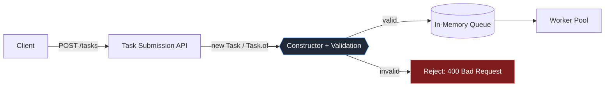
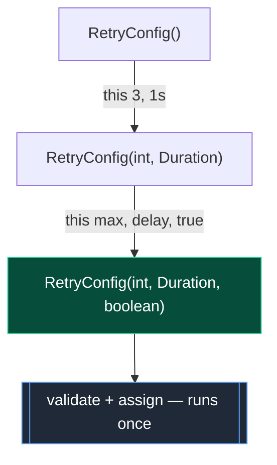
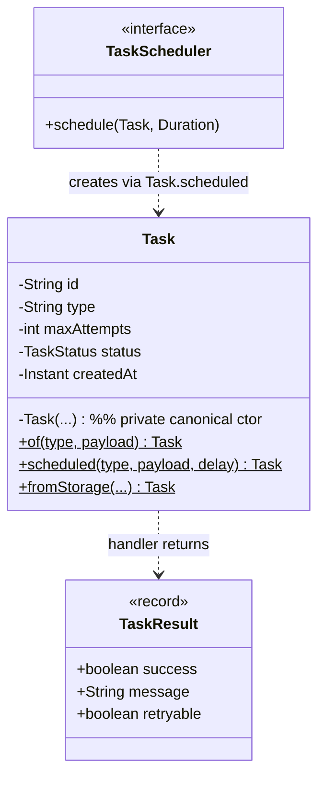

# Constructors

> A constructor is the **gate** through which every `Task` enters the world. This chapter is about controlling that gate: refusing invalid tasks at birth, reducing the noise of many overloaded constructors, and ending with the static factory methods (`Task.of`, `Task.newTask`) that our platform will actually call everywhere downstream.

---

## 1. Where This Fits In The Project

In [chapter-01-classes-and-objects.md](../01-java-fundamentals/chapter-01-classes-and-objects.md) we decided that a unit of work is a `Task` object, and in [chapter-02-fields-and-methods.md](./chapter-02-fields-and-methods.md) we gave it fields and behavior. But we glossed over the most important question of object orientation: **how does a valid `Task` come into existence?**

Every task in the platform is born at exactly one place — the **Task Submission API** — and from that moment it flows through the queue, the workers, the retry handler, and (sometimes) the dead-letter queue. If a malformed task can be *constructed* (negative `maxAttempts`, `null` id, a `scheduledAt` in the distant past), that corruption propagates through every layer and surfaces as a 3 a.m. page. The cheapest place to stop bad data is at construction time.



> This chapter lives at the `{{Constructor + Validation}}` node. Get this node right and every node to its right gets simpler.

---

## 2. Why This Exists — The Real Problem

A constructor is a special method whose job is to **turn raw arguments into a valid, fully-initialized object**. It exists to solve one problem: *an object should never be observable in a half-built or invalid state*.

You come from DSA, where you write `new int[n]` and the array is just zeroed and ready. A `Task` is not that simple. A valid task has rules — **invariants** — that must hold for its entire life:

- `id` is a non-null UUID string.
- `type` is non-null and non-blank (a worker must be able to look up a handler by it).
- `attempts >= 0` and `maxAttempts >= 1`.
- `status` starts at `PENDING` (or `SCHEDULED` if it has a future `scheduledAt`).
- `createdAt` is set and never null.

Without a constructor enforcing these, every other piece of code has to defensively re-check them, or — worse — assume them and crash when they are violated.

### A tiny bit of history

Early languages separated **allocation** from **initialization**. In C you `malloc` a struct (raw memory) and then *hope* every caller fills in every field before use. The classic bug — using a struct before it is fully initialized — was so common that **Simula** and then **C++** introduced the *constructor*: a method the language guarantees runs exactly once, right after allocation, before anyone can touch the object. Java inherited this and made it ironclad: you literally cannot get a reference to a Java object without a constructor having completed. That guarantee is the whole point.

### How this differs from what you already know

| You came from | Their construction | Java's version | Key difference |
|---|---|---|---|
| C | `malloc` + manual field fills | constructor runs automatically | Java cannot hand you an uninitialized object |
| Go | bare struct literal `Task{...}` | `new Task(...)` / `Task.of(...)` | Go has no constructors; Java centralizes validation in one |
| Python | `__init__(self, ...)` | `Task(...)` | Same idea; Java overloads constructors by parameter types |
| Rust | associated fn `Task::new()` | constructor or static factory | Rust has no special constructor keyword; Java does, plus factories |
| JS/TS | `constructor(){}` in class | constructor / factory | Java enforces types and final fields at compile time |

> One sentence to keep: **a constructor is the only sanctioned way to produce a valid object, so it is the right and cheapest place to enforce every invariant.**

---

## 3. The Naive Version — No Constructor, No Guarantees

The newcomer's first `Task` has *no* constructor. Java silently supplies a **default (no-arg) constructor**, and callers poke fields in afterward.

```java
// File: Task.java  (NAIVE — do not ship this)
public class Task {
    public String id;
    public String type;
    public String payload;
    public TaskStatus status;
    public int attempts;
    public int maxAttempts;
    public java.time.Instant createdAt;
}
```

```java
// Caller, somewhere in the API layer
Task t = new Task();   // the compiler-generated default constructor
t.id = java.util.UUID.randomUUID().toString();
t.type = "send-email";
// ... and now we forget to set maxAttempts and createdAt
```

What is wrong here:

- **The object is born invalid.** Between `new Task()` and the last assignment there is a window where `t` has `null` id, `null` status, `maxAttempts == 0`. Another thread (or a `toString` in a logger) can observe garbage.
- **Nothing enforces invariants.** `maxAttempts` stays `0`, so the retry handler later divides by it or loops forever. `createdAt` is `null`, so metrics throw `NullPointerException`.
- **The rules are nowhere.** "A valid task" is a concept that exists only in a Confluence page, not in code.
- **Public mutable fields** let any caller corrupt a task at any time — there is no encapsulation (see [chapter-02-encapsulation.md](../01-java-fundamentals/chapter-02-encapsulation.md)).

> The **default constructor** is the no-argument constructor Java generates *only when you declare no constructor of your own*. The moment you write any constructor, Java stops generating it. People are surprised by this — see Common Mistakes.

---

## 4. Improved Version — A Real Constructor That Validates

Give `Task` a **parameterized constructor** that takes the inputs a caller actually controls, computes the rest, and validates invariants. Make the fields `private`.

```java
// File: Task.java  (IMPROVED)
import java.time.Instant;
import java.util.UUID;

public class Task {
    private final String id;
    private final String type;
    private final String payload;
    private TaskStatus status;   // mutable: status changes as the task is processed
    private int attempts;
    private final int maxAttempts;
    private final Instant createdAt;

    public Task(String type, String payload, int maxAttempts) {
        if (type == null || type.isBlank())
            throw new IllegalArgumentException("type must be non-blank");
        if (maxAttempts < 1)
            throw new IllegalArgumentException("maxAttempts must be >= 1, was " + maxAttempts);

        this.id = UUID.randomUUID().toString();   // we generate identity, not the caller
        this.type = type;
        this.payload = payload == null ? "{}" : payload;
        this.maxAttempts = maxAttempts;
        this.status = TaskStatus.PENDING;          // every task starts PENDING
        this.attempts = 0;
        this.createdAt = Instant.now();
    }

    // getters omitted for brevity; status/attempts have controlled mutators
}
```

What improved:

- **Invariants are enforced at the gate.** A blank type or `maxAttempts < 1` throws *before* the object exists. There is no invalid `Task` floating around.
- **The constructor computes derived state** (`id`, `status`, `createdAt`) so callers can't get it wrong or even forget it.
- **`final` fields** (`id`, `type`, `maxAttempts`, `createdAt`) can never change after construction — a first taste of immutability, expanded in [immutable-objects.md](../03-java-memory-model/immutable-objects.md).

But notice a new tension already: what if a task needs a `priority`? Or a `scheduledAt`? We can't keep adding required parameters to one constructor. That pressure is the subject of section 5.

---

## 5. Production-Quality Version — `this()` Chaining + Static Factories

A real `Task` has more knobs: `priority`, `scheduledAt`, sometimes a caller-supplied `id` (for idempotency — see [idempotency.md](../08-distributed-systems/idempotency.md)). The instinct is to add **more constructors**, each with more parameters. That instinct leads to the **telescoping-constructor anti-pattern** (section 8). The production answer has three moves:

1. **One canonical (full) constructor** that does *all* validation.
2. **Convenience constructors that delegate to it via `this(...)`** so validation lives in exactly one place.
3. **Static factory methods** (`Task.of`, `Task.newTask`) as the public, readable API. Constructors become `private` or package-private; the world calls factories.

```java
// File: Task.java  (PRODUCTION-INSPIRED)
import java.time.Duration;
import java.time.Instant;
import java.util.Objects;
import java.util.UUID;

public final class Task {
    private final String id;
    private final String type;
    private final String payload;
    private TaskStatus status;
    private int attempts;
    private final int maxAttempts;
    private final Instant createdAt;
    private final Instant scheduledAt;
    private final int priority;   // higher = more urgent

    /**
     * The CANONICAL constructor. Every other path funnels here, so all
     * invariant checks live in exactly one place. It is private: callers
     * use the static factories below.
     */
    private Task(String id, String type, String payload, int maxAttempts,
                 Instant scheduledAt, int priority) {
        this.id = Objects.requireNonNull(id, "id");
        this.type = requireNonBlank(type, "type");
        this.payload = payload == null ? "{}" : payload;
        if (maxAttempts < 1)
            throw new IllegalArgumentException("maxAttempts must be >= 1, was " + maxAttempts);
        this.maxAttempts = maxAttempts;
        this.priority = priority;
        this.createdAt = Instant.now();
        this.scheduledAt = scheduledAt;   // may be null = run immediately
        this.attempts = 0;
        // status is DERIVED from scheduledAt — a single source of truth:
        this.status = (scheduledAt != null && scheduledAt.isAfter(createdAt))
                ? TaskStatus.SCHEDULED
                : TaskStatus.PENDING;
    }

    // ---- Static factory methods: the public construction API ----

    /** Simplest task: type + payload, sensible defaults. */
    public static Task of(String type, String payload) {
        return new Task(UUID.randomUUID().toString(), type, payload, 3, null, 0);
    }

    /** Task with an explicit retry budget. */
    public static Task of(String type, String payload, int maxAttempts) {
        return new Task(UUID.randomUUID().toString(), type, payload, maxAttempts, null, 0);
    }

    /** Task scheduled to run after a delay (used by the TaskScheduler). */
    public static Task scheduled(String type, String payload, Duration delay) {
        Instant runAt = Instant.now().plus(delay);
        return new Task(UUID.randomUUID().toString(), type, payload, 3, runAt, 0);
    }

    /** Idempotent submission: caller supplies a stable id. */
    public static Task withId(String id, String type, String payload, int maxAttempts) {
        return new Task(id, type, payload, maxAttempts, null, 0);
    }

    /** Rehydrate from storage (Phase 2 PostgresTaskQueue / TaskRepository). */
    public static Task fromStorage(String id, String type, String payload, int maxAttempts,
                                   Instant scheduledAt, int priority, TaskStatus status, int attempts) {
        Task t = new Task(id, type, payload, maxAttempts, scheduledAt, priority);
        t.status = status;       // controlled override for rebuilt rows
        t.attempts = attempts;
        return t;
    }

    private static String requireNonBlank(String s, String field) {
        if (s == null || s.isBlank())
            throw new IllegalArgumentException(field + " must be non-blank");
        return s;
    }

    // getters + controlled status/attempt transitions omitted for brevity
}
```

Why a staff engineer ships *this*:

- **Validation lives in one constructor.** Add a rule once; every factory inherits it. (Note: here the factories themselves delegate to the canonical constructor; with several constructors you would use `this(...)` chaining — shown next.)
- **Factories have names.** `Task.scheduled(type, payload, delay)` reads far better than a five-argument `new Task(...)` where you have to remember which `Instant` means what.
- **Factories can return cached or subtype instances** and can be `null`-free — constructors are forced to return a brand-new instance of exactly this class.
- **Factories can fail loudly with a domain name** instead of a generic `new`.

### `this()` constructor chaining, explicitly

When you *do* keep multiple constructors (common in framework/entity code), chain them with `this(...)` so the canonical one is the only validator. `this(...)` **must be the first statement** in the constructor body.

```java
public class RetryConfig {
    private final int maxAttempts;
    private final Duration baseDelay;
    private final boolean jitter;

    // Canonical constructor — the ONLY one with validation logic.
    public RetryConfig(int maxAttempts, Duration baseDelay, boolean jitter) {
        if (maxAttempts < 1) throw new IllegalArgumentException("maxAttempts >= 1");
        this.maxAttempts = maxAttempts;
        this.baseDelay = Objects.requireNonNull(baseDelay, "baseDelay");
        this.jitter = jitter;
    }

    // Convenience: jitter defaults to true. Delegates — no duplicated checks.
    public RetryConfig(int maxAttempts, Duration baseDelay) {
        this(maxAttempts, baseDelay, true);   // MUST be the first statement
    }

    // Convenience: everything defaulted.
    public RetryConfig() {
        this(3, Duration.ofSeconds(1));        // chains to the 2-arg, which chains to the 3-arg
    }
}
```



---

## 6. Code Walkthrough

### Beginner: a default constructor vs. a parameterized one

```java
public class Counter {
    private int value;

    public Counter() {            // explicit no-arg constructor
        this.value = 0;
    }
    public Counter(int start) {   // parameterized constructor (overload)
        this.value = start;
    }
    public int value() { return value; }

    public static void main(String[] args) {
        Counter a = new Counter();     // value = 0
        Counter b = new Counter(10);   // value = 10
        System.out.println(a.value() + " " + b.value());  // 0 10
    }
}
```

Two constructors with different parameter lists is **constructor overloading** — the same mechanism as method overloading (see [chapter-06-method-overloading.md](./chapter-06-method-overloading.md)), resolved by the compiler from argument types.

### Intermediate: validation + `this()` chaining in our domain

```java
import java.time.Instant;
import java.util.UUID;

public class Task {
    private final String id;
    private final String type;
    private final int maxAttempts;
    private TaskStatus status;
    private final Instant createdAt;

    // Canonical
    public Task(String id, String type, int maxAttempts) {
        if (id == null) throw new IllegalArgumentException("id");
        if (type == null || type.isBlank()) throw new IllegalArgumentException("type");
        if (maxAttempts < 1) throw new IllegalArgumentException("maxAttempts");
        this.id = id;
        this.type = type;
        this.maxAttempts = maxAttempts;
        this.status = TaskStatus.PENDING;
        this.createdAt = Instant.now();
    }

    // Convenience: auto-generate id, default retry budget — delegates.
    public Task(String type) {
        this(UUID.randomUUID().toString(), type, 3);  // first statement; reuses all checks
    }

    public String id() { return id; }
    public TaskStatus status() { return status; }
}
```

```java
Task quick = new Task("send-email");                       // id auto, maxAttempts 3
Task explicit = new Task("id-123", "send-email", 5);       // full control
// new Task("id-123", "", 5);  // throws IllegalArgumentException — caught at the gate
```

### Production-inspired: factory + immutable `Task` + an event record

In Phase 4 we publish events (see [chapter-08-functional-interfaces.md](../01-java-fundamentals/chapter-08-functional-interfaces.md) and the `EventBus`). Java **records** give you a *compact canonical constructor* — perfect for immutable value objects with validation.

```java
import java.time.Instant;
import java.util.Objects;

/** An immutable event. The compact constructor validates; fields are implicitly final. */
public record TaskEvent(String taskId, TaskStatus from, TaskStatus to, Instant at) {

    // Compact canonical constructor: no parameter list, no field assignments —
    // the compiler assigns the record components for you AFTER this body runs.
    public TaskEvent {
        Objects.requireNonNull(taskId, "taskId");
        Objects.requireNonNull(to, "to");
        if (at == null) at = Instant.now();   // you may normalize/replace components here
    }

    // Static factory reads better than the canonical constructor at call sites.
    public static TaskEvent transition(Task task, TaskStatus from, TaskStatus to) {
        return new TaskEvent(task.id(), from, to, Instant.now());
    }
}
```

```java
TaskResult r = new TaskResult(false, "SMTP timeout", true);  // (success, message, retryable)
TaskEvent e = TaskEvent.transition(task, TaskStatus.RUNNING, TaskStatus.RETRYING);
```

> Records collapse the "constructor + final fields + `equals`/`hashCode`/`toString`" boilerplate into one line. For pure immutable values like `TaskResult` and `TaskEvent`, **prefer a record over a hand-written class**.

---

## 7. How This Applies To Our Task Queue Project

Concrete construction points across the canonical model:

- **`Task`** — constructed via `Task.of(type, payload)` in the API layer; via `Task.scheduled(...)` by the `TaskScheduler`; via `Task.fromStorage(...)` by the `PostgresTaskQueue`/`TaskRepository` when rehydrating rows. One private canonical constructor validates them all.
- **`TaskResult(boolean success, String message, boolean retryable)`** — a record; its compact constructor can `requireNonNull(message)`.
- **`InMemoryTaskQueue`** — its constructor takes the capacity and wires up the backing `BlockingQueue` (see [blocking-queue.md](../06-concurrency/blocking-queue.md)).
- **`WorkerPool`** — its constructor takes the worker count, the `TaskQueue`, and the handler registry, then builds an `ExecutorService` (see [executor-service.md](../06-concurrency/executor-service.md)).
- **`ExponentialBackoffRetryPolicy`** — constructor validates `baseDelay > 0` and `maxDelay >= baseDelay`; uses `this()` to default the jitter flag.
- **`TokenBucketRateLimiter`** — constructor validates `capacity >= 1` and `refillPerSecond > 0` (see [rate-limiting.md](../08-distributed-systems/rate-limiting.md)).



---

## 8. Tradeoffs

### Constructor vs. static factory method

| Aspect | `public` constructor | Static factory (`Task.of`) |
|---|---|---|
| Name | Always the class name | Can describe intent (`scheduled`, `withId`) |
| Overload disambiguation | By parameter *types* only — two `(String, String)` ctors are impossible | Different names sidestep the clash |
| Return type | Must be exactly this class, always a new instance | Can return a subtype, a cached instance, or even `null` |
| Discoverability | `new` is universal | Must document `of`/`newInstance` conventions |
| Reflection/frameworks | Many frameworks call ctors directly | Some need a no-arg ctor; factories can be invisible to them |
| When to prefer | Few params, no naming clash, framework requires it | Many shapes, meaningful names, caching, immutability |

### Telescoping constructors vs. chaining vs. Builder

| Approach | Looks like | Pain | Verdict |
|---|---|---|---|
| Telescoping ctors | `new Task(a)`, `new Task(a,b)`, `new Task(a,b,c,d,e)` | Unreadable call sites; can't distinguish same-type params; combinatorial explosion | Avoid past ~3 params |
| `this()` chaining | many ctors, all delegating to one | Tames *duplication*, not *readability* — `new Task(x, null, 3, null, 0)` is still cryptic | Good for entities/frameworks |
| Static factories | `Task.of(...)`, `Task.scheduled(...)` | Still positional args within each factory | Good middle ground |
| **Builder** | `Task.builder().type("x").priority(5).build()` | More code to write once | Best for many optional params — built in [factory-method.md](../05-design-patterns/factory-method.md) follow-ups |

> The telescoping problem is *why the Builder pattern exists*. We deliberately stop short of the Builder here so you feel the pain it solves. When `Task` grows past ~4 optional fields, reach for a Builder.

---

## 9. Common Mistakes And Pitfalls

- **Assuming the default constructor still exists after you add one.** Declaring *any* constructor removes the compiler-generated no-arg one. Frameworks (JPA, Jackson) that need a no-arg constructor will then fail. **Fix:** add an explicit `protected`/`private` no-arg constructor when a framework requires it.
- **Doing real work in the constructor.** Opening sockets, spawning threads, or registering callbacks from a constructor leaks a partially-constructed `this`. **Fix:** construct, *then* call a separate `start()`/`init()` (this is exactly why `WorkerPool` has `start()` and `shutdown()` rather than starting threads in its constructor).
- **Calling an overridable method from a constructor.** The subclass override runs before the subclass's own fields are initialized, observing `null`. **Fix:** call only `private`/`final`/`static` methods from constructors.
- **`this(...)` or `super(...)` not first.** The compiler rejects any statement before a `this(...)`/`super(...)` call. **Fix:** move it to the top (Java 22+ relaxes this slightly with statements before `super()`, but keep the simple rule for Java 21).
- **Validating after assignment.** Assign first, throw later, and you've already mutated state. **Fix:** validate *before* assigning, or validate into locals.
- **Leaking mutable references in the constructor.** `this.tags = tags;` aliases the caller's list. **Fix:** defensive copy: `this.tags = List.copyOf(tags);`.
- **Forgetting `createdAt`/`status` defaults.** A task with `null` status breaks the worker's switch. **Fix:** set every derived field in the canonical constructor.

---

## 10. Refactoring Exercise

**Bad** — telescoping constructors, no validation, mutable public fields:

```java
public class Task {
    public String id, type, payload;
    public int maxAttempts, priority;
    public java.time.Instant scheduledAt;

    public Task() {}
    public Task(String type) { this.type = type; }
    public Task(String type, String payload) { this.type = type; this.payload = payload; }
    public Task(String type, String payload, int maxAttempts) {
        this.type = type; this.payload = payload; this.maxAttempts = maxAttempts;
    }
    public Task(String type, String payload, int maxAttempts, int priority, java.time.Instant scheduledAt) {
        this.type = type; this.payload = payload; this.maxAttempts = maxAttempts;
        this.priority = priority; this.scheduledAt = scheduledAt;
    }
}
```

**Improved** — one canonical constructor, the rest chain to it, validation centralized:

```java
import java.time.Instant;
import java.util.UUID;

public class Task {
    private final String id, type, payload;
    private final int maxAttempts, priority;
    private final Instant scheduledAt;

    public Task(String type, String payload, int maxAttempts, int priority, Instant scheduledAt) {
        if (type == null || type.isBlank()) throw new IllegalArgumentException("type");
        if (maxAttempts < 1) throw new IllegalArgumentException("maxAttempts >= 1");
        this.id = UUID.randomUUID().toString();
        this.type = type;
        this.payload = payload == null ? "{}" : payload;
        this.maxAttempts = maxAttempts;
        this.priority = priority;
        this.scheduledAt = scheduledAt;
    }
    public Task(String type, String payload, int maxAttempts) { this(type, payload, maxAttempts, 0, null); }
    public Task(String type, String payload)                 { this(type, payload, 3, 0, null); }
    public Task(String type)                                 { this(type, "{}", 3, 0, null); }
}
```

**Production-quality** — private canonical constructor, named static factories, immutable:

```java
import java.time.Duration;
import java.time.Instant;
import java.util.UUID;

public final class Task {
    private final String id, type, payload;
    private final int maxAttempts, priority;
    private final Instant createdAt, scheduledAt;

    private Task(String id, String type, String payload, int maxAttempts, int priority, Instant scheduledAt) {
        if (id == null) throw new IllegalArgumentException("id");
        if (type == null || type.isBlank()) throw new IllegalArgumentException("type");
        if (maxAttempts < 1) throw new IllegalArgumentException("maxAttempts >= 1");
        this.id = id;
        this.type = type;
        this.payload = payload == null ? "{}" : payload;
        this.maxAttempts = maxAttempts;
        this.priority = priority;
        this.createdAt = Instant.now();
        this.scheduledAt = scheduledAt;
    }

    public static Task of(String type, String payload) {
        return new Task(UUID.randomUUID().toString(), type, payload, 3, 0, null);
    }
    public static Task ofPriority(String type, String payload, int priority) {
        return new Task(UUID.randomUUID().toString(), type, payload, 3, priority, null);
    }
    public static Task scheduled(String type, String payload, Duration delay) {
        return new Task(UUID.randomUUID().toString(), type, payload, 3, 0, Instant.now().plus(delay));
    }
    public static Task withId(String id, String type, String payload, int maxAttempts) {
        return new Task(id, type, payload, maxAttempts, 0, null);
    }
}
```

The progression: kill the telescoping noise (chaining), then make call sites *read* (factories), then make instances *safe* (immutability).

---

## 11. Exercises

### Easy

**E1 (Knowledge check).** Java generates a default constructor only under one condition. State it, and explain what happens to that default constructor the moment you add a one-argument constructor.

**E2 (Coding).** Write a `TokenBucketRateLimiter` constructor `TokenBucketRateLimiter(int capacity, double refillPerSecond)` that throws `IllegalArgumentException` if `capacity < 1` or `refillPerSecond <= 0`, and initializes `availableTokens` to `capacity`.

### Medium

**M1 (Coding + chaining).** Implement `ExponentialBackoffRetryPolicy` with a canonical constructor `(Duration baseDelay, Duration maxDelay, boolean jitter)` and two convenience constructors that chain via `this(...)`: one defaulting `jitter` to `true`, one defaulting both `jitter=true` and `maxDelay = Duration.ofMinutes(5)`. Validate `baseDelay > 0` and `maxDelay >= baseDelay`.

**M2 (Refactoring).** You are given a `Task` with five telescoping constructors and duplicated validation in each. Refactor so validation appears exactly once and the constructors chain. Then add a `Task.scheduled(type, payload, delay)` static factory.

### Hard

**H1 (Design).** The team wants `Task` to support: optional `priority`, optional `scheduledAt`, optional caller-supplied `id` (idempotency), and a required `type`. Argue — in 5–8 sentences — whether you'd use overloaded factories or introduce a Builder, and define the boundary at which you'd switch.

**H2 (Interview-style).** Explain why you should not call an overridable instance method from a constructor. Give a concrete `Task`/subclass example where it produces a `NullPointerException`, then show the fix.

**H3 (Stretch).** Convert `TaskResult` and `TaskEvent` to records with compact canonical constructors that (a) reject `null` required components and (b) default `at`/`timestamp` to `Instant.now()` when not provided. Show that two records with equal components are `.equals()` and share a `hashCode`.

---

## 12. Solutions

**E1.** Java generates a default no-arg constructor *only if the class declares no constructor at all*. As soon as you declare any constructor (e.g. a one-arg one), the compiler stops generating the no-arg constructor; `new Foo()` then fails to compile unless you add an explicit no-arg constructor yourself.

**E2.**

```java
public class TokenBucketRateLimiter implements RateLimiter {
    private final int capacity;
    private final double refillPerSecond;
    private double availableTokens;

    public TokenBucketRateLimiter(int capacity, double refillPerSecond) {
        if (capacity < 1)
            throw new IllegalArgumentException("capacity must be >= 1, was " + capacity);
        if (refillPerSecond <= 0)
            throw new IllegalArgumentException("refillPerSecond must be > 0, was " + refillPerSecond);
        this.capacity = capacity;
        this.refillPerSecond = refillPerSecond;
        this.availableTokens = capacity;   // start full
    }

    @Override public synchronized boolean tryAcquire() {
        if (availableTokens >= 1) { availableTokens -= 1; return true; }
        return false;
    }
}
```

**M1.**

```java
import java.time.Duration;
import java.util.Optional;

public class ExponentialBackoffRetryPolicy implements RetryPolicy {
    private final Duration baseDelay;
    private final Duration maxDelay;
    private final boolean jitter;
    private final java.util.Random rng = new java.util.Random();

    // Canonical — the only validator.
    public ExponentialBackoffRetryPolicy(Duration baseDelay, Duration maxDelay, boolean jitter) {
        if (baseDelay == null || baseDelay.isNegative() || baseDelay.isZero())
            throw new IllegalArgumentException("baseDelay must be > 0");
        if (maxDelay == null || maxDelay.compareTo(baseDelay) < 0)
            throw new IllegalArgumentException("maxDelay must be >= baseDelay");
        this.baseDelay = baseDelay;
        this.maxDelay = maxDelay;
        this.jitter = jitter;
    }

    // jitter defaults to true
    public ExponentialBackoffRetryPolicy(Duration baseDelay, Duration maxDelay) {
        this(baseDelay, maxDelay, true);
    }

    // maxDelay defaults to 5 minutes, jitter to true
    public ExponentialBackoffRetryPolicy(Duration baseDelay) {
        this(baseDelay, Duration.ofMinutes(5), true);
    }

    @Override public Optional<Duration> nextDelay(int attempt) {
        long millis = (long) (baseDelay.toMillis() * Math.pow(2, Math.max(0, attempt - 1)));
        millis = Math.min(millis, maxDelay.toMillis());
        if (jitter) millis = (long) (millis * (0.5 + rng.nextDouble() * 0.5)); // 50%–100%
        return Optional.of(Duration.ofMillis(millis));
    }
}
```

**M2.**

```java
import java.time.Duration;
import java.time.Instant;
import java.util.UUID;

public final class Task {
    private final String id, type, payload;
    private final int maxAttempts, priority;
    private final Instant scheduledAt;

    // The single validator. Everything chains here.
    public Task(String type, String payload, int maxAttempts, int priority, Instant scheduledAt) {
        if (type == null || type.isBlank()) throw new IllegalArgumentException("type");
        if (maxAttempts < 1) throw new IllegalArgumentException("maxAttempts >= 1");
        this.id = UUID.randomUUID().toString();
        this.type = type;
        this.payload = payload == null ? "{}" : payload;
        this.maxAttempts = maxAttempts;
        this.priority = priority;
        this.scheduledAt = scheduledAt;
    }
    public Task(String type, String payload, int maxAttempts) { this(type, payload, maxAttempts, 0, null); }
    public Task(String type, String payload)                 { this(type, payload, 3, 0, null); }
    public Task(String type)                                 { this(type, "{}", 3, 0, null); }

    public static Task scheduled(String type, String payload, Duration delay) {
        return new Task(type, payload, 3, 0, Instant.now().plus(delay));
    }
}
```

**H1 (model answer).** With four independent optional fields the factory approach hits a combinatorial wall: you'd need `of`, `ofPriority`, `scheduled`, `scheduledWithPriority`, `withId`, `withIdAndPriority`, … and the set grows as the power set of options. A Builder lets each option be set independently and read at the call site (`Task.builder().type("email").priority(5).runAfter(delay).build()`), and centralizes validation in `build()`. My rule of thumb: up to ~2–3 optional fields, named static factories stay readable and are cheaper; at 4+ optional fields, or when many combinations are genuinely used, switch to a Builder. I'd also switch earlier if several optional fields share a type (two `String`s, two `Instant`s) because positional factory args become ambiguous. For `Task` here, with four optionals including same-typed `Instant`s, I'd introduce a Builder while keeping `Task.of` and `Task.scheduled` as ergonomic shortcuts.

**H2 (model answer).** A constructor runs the superclass constructor *before* the subclass's field initializers and constructor body. If the superclass constructor calls an overridden method, the subclass version runs against still-`null` subclass fields.

```java
class Base {
    Base() { init(); }                 // called during Base construction
    void init() {}                     // overridable
}
class LoggingTask extends Base {
    private final String name = "audit";   // set AFTER Base() returns
    @Override void init() {
        System.out.println(name.length());  // NPE: name is still null here
    }
}
```

Fix: don't call overridable methods from constructors — make `init` `private`/`final`, or move the work to an explicit post-construction `start()` method.

**H3.**

```java
import java.time.Instant;
import java.util.Objects;

public record TaskResult(boolean success, String message, boolean retryable) {
    public TaskResult {
        Objects.requireNonNull(message, "message");
    }
    public static TaskResult ok()            { return new TaskResult(true, "ok", false); }
    public static TaskResult retry(String m) { return new TaskResult(false, m, true); }
    public static TaskResult fail(String m)  { return new TaskResult(false, m, false); }
}

public record TaskEvent(String taskId, TaskStatus to, Instant at) {
    public TaskEvent {
        Objects.requireNonNull(taskId, "taskId");
        Objects.requireNonNull(to, "to");
        if (at == null) at = Instant.now();   // normalize a component in the compact ctor
    }
    public static TaskEvent now(String taskId, TaskStatus to) {
        return new TaskEvent(taskId, to, null);  // compact ctor fills 'at'
    }
}
```

```java
var a = new TaskResult(true, "ok", false);
var b = new TaskResult(true, "ok", false);
assert a.equals(b);                       // records: structural equality, free
assert a.hashCode() == b.hashCode();      // consistent hashCode, free
```

Records generate `equals`, `hashCode`, and `toString` from the components, so two `TaskResult`s with equal fields are equal and share a hash — no boilerplate.

---

## 13. Interview Questions And Takeaways

1. **What does Java do if a class declares no constructor?**
   It generates a public (package-private for non-public classes) no-arg default constructor that calls `super()`. Declaring any constructor suppresses this.

2. **Why must `this()`/`super()` be the first statement in a constructor (Java 21)?**
   To guarantee the superclass/delegated constructor fully initializes its part of the object before this constructor touches anything — preventing observation of half-built state.

3. **Static factory vs. constructor — give three concrete advantages of factories.**
   They have descriptive names; they can return cached or subtype instances (not forced to create a new object of exactly this class); and they can be `null`-free and overload past same-typed parameter lists by using different method names.

4. **What is the telescoping-constructor problem and how do you fix it?**
   Many constructors with growing parameter lists become unreadable and can't disambiguate same-typed args. Fix with `this()` chaining to centralize validation, static factories for naming, and a Builder when optional fields proliferate.

5. **Why is calling an overridable method from a constructor dangerous?**
   The override runs before the subclass's fields are initialized, so it observes default/`null` values — a classic source of `NullPointerException`. Call only `private`/`final`/`static` methods from constructors.

6. **How do records change constructor authoring?**
   Components are implicitly `final`; a compact canonical constructor lets you validate and normalize without restating parameters or assignments. Records auto-generate `equals`/`hashCode`/`toString`.

7. **How do you make a class immutable through its constructor?**
   Make all fields `final`, assign them once in the constructor, take defensive copies of mutable inputs (`List.copyOf`), expose no setters, and (ideally) mark the class `final`. See [immutable-objects.md](../03-java-memory-model/immutable-objects.md).

8. **Your entity needs a no-arg constructor for JPA but you also have a validating one. How?**
   Add an explicit `protected` no-arg constructor for the framework and keep the validating constructor/factories for application code.

---

## 14. Production Considerations

- **Fail fast at the boundary.** Validating in the `Task` constructor means a bad submission becomes a `400 Bad Request` at the API edge, not a corrupted row discovered by a worker hours later. Map `IllegalArgumentException` to HTTP 400 in the `TaskController` (Phase 2).
- **Construction cost matters under load.** A constructor that calls `UUID.randomUUID()` (a secure-random draw) per task is fine at hundreds/sec but shows up in flame graphs at 100k/sec. Profile before optimizing; if needed, switch to a cheaper id scheme or batch.
- **`Instant.now()` in constructors hurts testability.** Hard-coding the clock makes time-based tests flaky. Inject a `java.time.Clock` (the factory can pass `Clock.systemUTC()` by default) so tests can use `Clock.fixed(...)`.
- **Reflection-heavy frameworks** (Jackson, JPA, Spring) often instantiate via a no-arg constructor and then set fields, bypassing your validation. Prefer constructor-binding (`@JsonCreator`, Spring's constructor binding) so your validating constructor actually runs.
- **Don't leak `this` early.** Registering the object with an `EventBus` or thread from inside the constructor can publish a reference before construction completes — a data race. Wire up subscriptions in a separate lifecycle method.
- **Monitoring:** count constructor-rejected submissions as a metric (`tasks.rejected{reason=...}`) — a spike usually means a client is sending malformed payloads and is worth alerting on.

---

## What We Can Improve In Our Project Using This Concept

Our current `Task` (from chapters 01–02) is constructed with public fields or a single ad-hoc constructor and no validation. We can: (1) make all stable fields `final`; (2) introduce one private canonical constructor that validates every invariant; (3) expose `Task.of`, `Task.scheduled`, `Task.withId`, and `Task.fromStorage` as the only public construction API; and (4) convert `TaskResult` (and the future `TaskEvent`) to records with validating compact constructors. This guarantees no invalid `Task` can exist anywhere downstream.

## Project Refactoring Task

1. Convert `Task` fields `id`, `type`, `maxAttempts`, `createdAt`, `scheduledAt`, `priority` to `final`.
2. Add the private canonical constructor with full validation (`type` non-blank, `maxAttempts >= 1`, derive `status` from `scheduledAt`).
3. Replace all `new Task(...)` call sites with `Task.of(...)` / `Task.scheduled(...)`.
4. Add `Task.fromStorage(...)` for the future `PostgresTaskQueue`/`TaskRepository` rehydration path.
5. Convert `TaskResult` to a record with a `requireNonNull(message)` compact constructor.
6. Add JUnit 5 + AssertJ tests asserting that invalid inputs throw `IllegalArgumentException`.

## Git Commit For This Chapter

```text
refactor(core): enforce Task invariants via canonical constructor + static factories

- Make Task identity/config fields final (id, type, maxAttempts, createdAt, scheduledAt, priority)
- Add private canonical constructor with invariant validation
- Add Task.of / Task.scheduled / Task.withId / Task.fromStorage factories
- Convert TaskResult to a record with a validating compact constructor
- Add construction-validation unit tests (JUnit 5 + AssertJ)

Files touched:
  src/main/java/com/platform/task/Task.java
  src/main/java/com/platform/task/TaskResult.java
  src/test/java/com/platform/task/TaskConstructionTest.java
```

## Architecture Impact

Centralizing construction makes the `Task` type a **trusted boundary**: every layer to the right of the API (queue, workers, retry handler, DLQ, metrics) can assume a `Task` is valid and never re-check invariants. This removes scattered defensive code, shrinks the surface for `NullPointerException`, and gives Phase 2 persistence a single, auditable rehydration path (`fromStorage`). It also sets up the Builder and Factory-Method patterns we adopt later without rewriting call sites — they already go through factories.

## Interview Takeaways

- A constructor is the single sanctioned gate for producing a valid object; enforce every invariant there and fail fast.
- Declaring any constructor removes the compiler's default no-arg one — know this for frameworks.
- Use `this()` chaining to keep validation in exactly one place; use static factories for readable, flexible construction.
- The telescoping-constructor anti-pattern is the motivation for the Builder pattern — recognize the boundary (~4 optional fields) where you switch.
- `final` fields + validating constructor + defensive copies = immutability; records make this nearly free for value objects.
