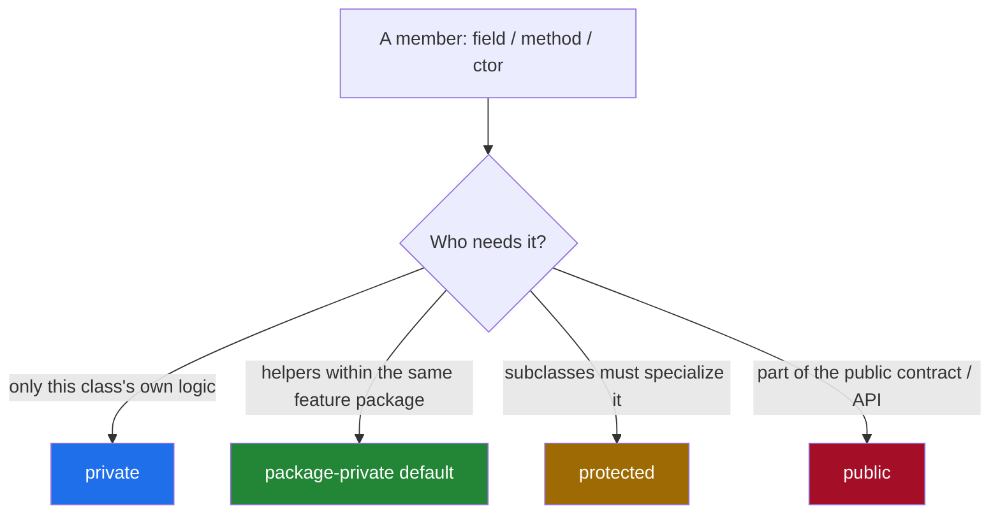
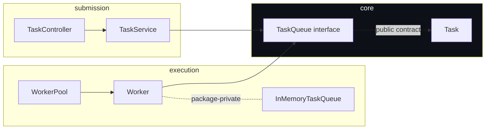

# Access Modifiers

> Where this fits in the project: in Phase 1 a `Task` travels from the **Submission API** into an
> **in-memory queue**, gets pulled by a **Worker**, and is mutated through retries and state changes.
> Many components touch a `Task`, but only a few are *allowed* to. Access modifiers are the language
> mechanism that turns "should not touch this" into "**cannot** touch this". They are the load-bearing
> walls of every encapsulation boundary we draw in this curriculum.

This chapter is the natural sequel to [`chapter-02-fields-and-methods.md`](./chapter-02-fields-and-methods.md)
and the OOP-side companion to [`../01-java-fundamentals/chapter-02-encapsulation.md`](../01-java-fundamentals/chapter-02-encapsulation.md).
There we asked *what state an object holds*. Here we ask the harder question: **who is allowed to see it,
who is allowed to change it, and how does Java enforce that at compile time?**

---

## 1. Why This Exists

You have solved 1000+ DSA problems. In a contest solution, every field is effectively `public`: you reach
into `node.val`, `dp[i][j]`, `graph[u]` freely because the entire program fits in your head and dies in 50ms.

A backend platform is the opposite of a contest. Our `Task` is mutated across threads, persisted to Postgres,
read by metrics, retried, dead-lettered, and serialized to JSON. The codebase will outlive your memory of it.
The single most important question in object design becomes: **what is the smallest surface I must expose so
the rest of the system can do its job, while everything else stays sealed?**

Access modifiers answer that. They are Java's compile-time enforcement of the **principle of least privilege**:
expose the minimum, hide the maximum. A field you never expose is a field no future engineer (or future you)
can corrupt. The compiler becomes your code reviewer, rejecting illegal access before it ever ships.

> **Definition.** An *access modifier* controls the *visibility* of a class, field, method, or constructor:
> which other code is permitted to name and use it. Java has exactly four levels: `private`,
> package-private (the default, no keyword), `protected`, and `public`.

### A tiny bit of history (why it genuinely helps)

The idea predates Java. David Parnas's 1972 paper *"On the Criteria To Be Used in Decomposing Systems into
Modules"* argued that a module should hide its *design decisions likely to change* behind a stable interface.
The decisions "how is a `Task`'s `status` stored?" and "how do retries count up?" are exactly that kind of
volatile decision. Access modifiers are the language-level tool that makes Parnas's information hiding
*enforceable* rather than a comment that everyone ignores under deadline pressure.

C had no enforcement — `static` at file scope was the closest thing. C++ introduced `private`/`protected`/`public`
class members. Java added a fourth, package-scoped level and tied visibility to its package system, then in
Java 9 added a second, coarser layer with the module system (JPMS). We will cover all of it.

---

## 2. The Four Levels (and the fifth, modules)

Java has **four** member access levels. From most restrictive to least:

| Modifier            | Same class | Same package | Subclass (other package) | Anywhere |
|---------------------|:----------:|:------------:|:------------------------:|:--------:|
| `private`           | yes        | no           | no                       | no       |
| *(default)* package-private | yes | yes      | no                       | no       |
| `protected`         | yes        | yes          | yes                      | no       |
| `public`            | yes        | yes          | yes                      | yes      |

A few rules people get wrong:

- There is **no `package` keyword**. Package-private is the *absence* of a modifier. This is a common trap.
- `protected` is **strictly wider** than package-private: it grants everything package-private grants, *plus*
  access from subclasses in other packages — but only through the subclass's own inheritance, not arbitrary
  instances. (See pitfalls below; this rule trips up nearly everyone.)
- Top-level classes (and interfaces, enums, records) may only be `public` or package-private. You cannot write
  `private class Task` at the top level — `private` and `protected` are illegal there.
- Nested classes *can* be `private`/`protected` because they are members of their enclosing type.



The mental default for the learner coming from contests: **start at `private` and widen only when a concrete
caller forces you to.** Visibility is a ratchet — widening later is cheap, narrowing later breaks callers.

---

## 3. The Naive Version

Here is a first-cut `Task` written the way someone fresh from competitive programming writes it: everything
`public`, because "I might need it."

```java
package com.taskqueue;

import java.time.Instant;

// NAIVE: every field public, no invariants protected.
public class Task {
    public String id;
    public String type;
    public String payload;
    public TaskStatus status;
    public int attempts;
    public int maxAttempts;
    public Instant createdAt;
    public Instant scheduledAt;
    public int priority;
}
```

And the worker that uses it:

```java
package com.taskqueue.worker;

import com.taskqueue.Task;
import com.taskqueue.TaskStatus;

public class Worker implements Runnable {
    // ... pulls a task, then:
    void execute(Task task) {
        task.status = TaskStatus.RUNNING;   // anybody can do this
        task.attempts++;                    // anybody can do this
        // ... run handler ...
        task.status = TaskStatus.SUCCEEDED;
        task.attempts = 0;                  // oops, reset attempts? who knows
    }
}
```

**What is wrong with this?**

1. **No invariant has a home.** "`attempts` must never exceed `maxAttempts`" is enforced *nowhere*, so it is
   enforced *everywhere by convention* — which means *nowhere* in practice. Any of the dozen classes that
   touch a `Task` can violate it, and the bug surfaces three layers away.
2. **Illegal state transitions are legal.** A `SUCCEEDED` task can be flipped back to `RUNNING` by a typo.
3. **You can never change the representation.** The moment `payload` is `public`, switching from `String` to
   a parsed object, or adding lazy validation, breaks every caller. Public fields freeze your internals.
4. **Refactoring is global, not local.** You can't grep for "who writes `attempts`" — the answer is the whole
   repo. There is no choke point.

Public mutable fields are the object-oriented equivalent of global variables. They scale exactly as badly.

---

## 4. The Improved Version

First refactor: make fields `private`, expose behavior through methods, and let the object guard its own rules.
This is encapsulation, with access modifiers doing the enforcing.

```java
package com.taskqueue;

import java.time.Instant;
import java.util.Objects;
import java.util.UUID;

public class Task {
    private final String id;
    private final String type;
    private final String payload;
    private TaskStatus status;
    private int attempts;
    private final int maxAttempts;
    private final Instant createdAt;
    private Instant scheduledAt;
    private final int priority;

    public Task(String type, String payload, int maxAttempts, int priority) {
        this.id = UUID.randomUUID().toString();
        this.type = Objects.requireNonNull(type, "type");
        this.payload = Objects.requireNonNull(payload, "payload");
        if (maxAttempts < 1) throw new IllegalArgumentException("maxAttempts must be >= 1");
        this.maxAttempts = maxAttempts;
        this.priority = priority;
        this.status = TaskStatus.PENDING;
        this.attempts = 0;
        this.createdAt = Instant.now();
        this.scheduledAt = this.createdAt;
    }

    // Read access: public getters for fields the rest of the system legitimately needs.
    public String id() { return id; }
    public String type() { return type; }
    public String payload() { return payload; }
    public TaskStatus status() { return status; }
    public int attempts() { return attempts; }
    public int maxAttempts() { return maxAttempts; }
    public int priority() { return priority; }
    public Instant scheduledAt() { return scheduledAt; }

    // Write access: behavior, not raw setters. Each method guards an invariant.
    public void markRunning() {
        requireTransition(TaskStatus.RUNNING);
        this.attempts++;
        this.status = TaskStatus.RUNNING;
    }

    public boolean canRetry() {
        return attempts < maxAttempts;
    }

    private void requireTransition(TaskStatus next) {
        if (!status.canTransitionTo(next)) {
            throw new IllegalStateException("Illegal transition " + status + " -> " + next);
        }
    }
}
```

Now the worker physically *cannot* write `attempts = 99` — the field is `private`. It can only call
`markRunning()`, which increments by exactly one and validates the transition. The invariant has a single home.

This is a big improvement, but notice the **package** is doing nothing yet. Everything that needs `Task` is
`public`. We have used only two of our four levels (`private`, `public`). The next level uses the package
boundary to hide *implementation collaborators* from the rest of the application.

---

## 5. The Production-Quality Version

A staff engineer thinks about *three* concentric rings of visibility, not two:

- **`private`** — the object's own secrets (`attempts`, `status` storage). Nobody outside sees these.
- **package-private** — collaborators *within the same feature*. The `Worker` and the `TaskQueue` may need to
  call helpers on each other that the outside world must never see. This is the under-used, highly valuable
  middle level.
- **`public`** — the genuine API surface other modules depend on: `Task.id()`, `TaskQueue.enqueue()`.

Below, the `Task` exposes a `public` read API and `public` state-transition behavior, but a *package-private*
factory hook used only by the persistence layer to rehydrate a `Task` from the database without re-running
business validation (the row was already valid when it was written).

```java
package com.taskqueue.core;

import java.time.Instant;
import java.util.Objects;
import java.util.UUID;

public final class Task {
    private final String id;
    private final String type;
    private final String payload;
    private TaskStatus status;
    private int attempts;
    private final int maxAttempts;
    private final Instant createdAt;
    private Instant scheduledAt;
    private final int priority;

    // Public, validating constructor: the only way external code creates a fresh Task.
    public Task(String type, String payload, int maxAttempts, int priority) {
        this(UUID.randomUUID().toString(), type, payload,
             TaskStatus.PENDING, 0, requirePositive(maxAttempts),
             Instant.now(), Instant.now(), priority);
        Objects.requireNonNull(type, "type");
        Objects.requireNonNull(payload, "payload");
    }

    // Package-private full constructor: used ONLY by the repository in this package to
    // reconstruct a Task from a DB row. Not part of the public API — outsiders cannot call it.
    Task(String id, String type, String payload, TaskStatus status, int attempts,
         int maxAttempts, Instant createdAt, Instant scheduledAt, int priority) {
        this.id = id;
        this.type = type;
        this.payload = payload;
        this.status = status;
        this.attempts = attempts;
        this.maxAttempts = maxAttempts;
        this.createdAt = createdAt;
        this.scheduledAt = scheduledAt;
        this.priority = priority;
    }

    private static int requirePositive(int n) {
        if (n < 1) throw new IllegalArgumentException("maxAttempts must be >= 1");
        return n;
    }

    // ---- public read API ----
    public String id() { return id; }
    public String type() { return type; }
    public String payload() { return payload; }
    public TaskStatus status() { return status; }
    public int attempts() { return attempts; }
    public int maxAttempts() { return maxAttempts; }
    public int priority() { return priority; }
    public Instant createdAt() { return createdAt; }
    public Instant scheduledAt() { return scheduledAt; }

    // ---- public behavior (guards invariants) ----
    public void markRunning() {
        transition(TaskStatus.RUNNING);
        this.attempts++;
    }

    public void markSucceeded() { transition(TaskStatus.SUCCEEDED); }

    public void markRetrying(Instant nextRunAt) {
        transition(TaskStatus.RETRYING);
        this.scheduledAt = Objects.requireNonNull(nextRunAt);
    }

    public void markDead() { transition(TaskStatus.DEAD); }

    public boolean canRetry() { return attempts < maxAttempts; }

    private void transition(TaskStatus next) {
        if (!status.canTransitionTo(next)) {
            throw new IllegalStateException("Illegal transition " + status + " -> " + next);
        }
        this.status = next;
    }
}
```

The repository lives in the **same package** and is therefore allowed to call the hidden constructor:

```java
package com.taskqueue.core;   // SAME package -> can see package-private members

import java.time.Instant;

public final class JdbcTaskRepository implements TaskRepository {

    Task fromRow(java.sql.ResultSet rs) throws java.sql.SQLException {
        // Allowed: this class is in com.taskqueue.core, like Task.
        return new Task(
            rs.getString("id"),
            rs.getString("type"),
            rs.getString("payload"),
            TaskStatus.valueOf(rs.getString("status")),
            rs.getInt("attempts"),
            rs.getInt("max_attempts"),
            rs.getTimestamp("created_at").toInstant(),
            rs.getTimestamp("scheduled_at").toInstant(),
            rs.getInt("priority"));
    }
}
```

A controller in `com.taskqueue.api` — a *different* package — physically cannot call that constructor. It must
go through the validating public one. **The package boundary is now carrying design intent.** This is the level
the contest-trained engineer most often skips, and it is the one that scales a codebase.

> **Rule of thumb a staff engineer ships:** every field `private` and `final` where possible; constructors and
> factory hooks package-private unless external creation is intended; methods package-private by default,
> promoted to `public` only when something in another package genuinely depends on them.

---

## 6. Code Walkthrough

### 6.1 Beginner example — the four levels in one class

```java
package com.taskqueue.demo;

public class AccessDemo {
    private   int secret = 1;   // only this class
              int shared = 2;   // this class + same package (no keyword!)
    protected int family = 3;   // this class + same package + subclasses elsewhere
    public    int open   = 4;   // everyone

    private   void hiddenHelper() { /* internal only */ }
              void packageHelper() { /* feature-internal */ }
    protected void extendHook()    { /* subclass override point */ }
    public    void api()           { /* the contract */ }
}
```

Reading from the *same class* sees all four. Reading from another package sees only `open`/`api`, plus
`family`/`extendHook` *if you are a subclass accessing them through inheritance*.

### 6.2 Intermediate example — package-private collaboration

A `Worker` and an `InMemoryTaskQueue` in the same package can share a helper the outside world never sees.

```java
package com.taskqueue.worker;   // both classes live here

import com.taskqueue.core.Task;
import com.taskqueue.core.TaskHandler;
import com.taskqueue.core.TaskResult;
import java.util.Map;

public final class Worker implements Runnable {
    private final InMemoryTaskQueue queue;
    private final Map<String, TaskHandler> handlers;

    public Worker(InMemoryTaskQueue queue, Map<String, TaskHandler> handlers) {
        this.queue = queue;
        this.handlers = handlers;
    }

    @Override public void run() {
        try {
            while (!Thread.currentThread().isInterrupted()) {
                Task task = queue.dequeue();           // public API
                queue.recordInFlight(task);            // PACKAGE-PRIVATE: worker-only bookkeeping
                process(task);
            }
        } catch (InterruptedException e) {
            Thread.currentThread().interrupt();
        }
    }

    private void process(Task task) {
        task.markRunning();
        TaskHandler handler = handlers.get(task.type());
        try {
            TaskResult result = handler.handle(task);
            if (result.success()) task.markSucceeded();
            else task.markRetrying(java.time.Instant.now());
        } catch (Exception e) {
            task.markRetrying(java.time.Instant.now());
        }
    }
}
```

```java
package com.taskqueue.worker;   // SAME package as Worker

import com.taskqueue.core.Task;
import java.util.concurrent.BlockingQueue;
import java.util.concurrent.LinkedBlockingQueue;
import java.util.concurrent.atomic.AtomicInteger;

public final class InMemoryTaskQueue implements com.taskqueue.core.TaskQueue {
    private final BlockingQueue<Task> queue = new LinkedBlockingQueue<>();
    private final AtomicInteger inFlight = new AtomicInteger();

    @Override public void enqueue(Task t) { queue.offer(t); }
    @Override public Task dequeue() throws InterruptedException { return queue.take(); }
    @Override public int size() { return queue.size(); }

    // Package-private: ONLY Workers in this package report in-flight counts. The API layer
    // and metrics layer never call this; they read a public gauge instead.
    void recordInFlight(Task t) { inFlight.incrementAndGet(); }

    public int inFlightCount() { return inFlight.get(); }   // public read for metrics
}
```

`recordInFlight` is a deliberate package secret. If `inFlightCount` were settable from anywhere, every layer
could lie about it. Package-private keeps the *write* path inside the feature while exposing a clean public read.

### 6.3 Production-inspired example — protected as an extension point

`protected` shines when you ship a base class meant to be subclassed by *other packages* (a framework seam).
Our `RetryPolicy` base exposes a `protected` hook that subclasses tune, while keeping the public method final.

```java
package com.taskqueue.retry;

import java.time.Duration;
import java.util.Optional;

public abstract class AbstractRetryPolicy implements RetryPolicy {

    private final int maxAttempts;

    protected AbstractRetryPolicy(int maxAttempts) {   // protected ctor: only subclasses construct
        this.maxAttempts = maxAttempts;
    }

    // Public, final: the contract callers depend on. Validation lives here, once.
    @Override
    public final Optional<Duration> nextDelay(int attempt) {
        if (attempt < 1) throw new IllegalArgumentException("attempt must be >= 1");
        if (attempt >= maxAttempts) return Optional.empty();   // give up -> dead-letter
        return Optional.of(computeDelay(attempt));             // delegate to subclass
    }

    // Protected hook: the ONE thing subclasses customize. Not public (callers must not call it
    // directly and bypass the maxAttempts check), not private (subclasses must override it).
    protected abstract Duration computeDelay(int attempt);

    protected int maxAttempts() { return maxAttempts; }   // protected read for subclasses
}
```

```java
package com.taskqueue.retry.policies;   // DIFFERENT package -> relies on protected access

import com.taskqueue.retry.AbstractRetryPolicy;
import java.time.Duration;
import java.util.concurrent.ThreadLocalRandom;

public final class ExponentialBackoffRetryPolicy extends AbstractRetryPolicy {

    private final Duration base;

    public ExponentialBackoffRetryPolicy(int maxAttempts, Duration base) {
        super(maxAttempts);                 // calling the protected ctor from a subclass: legal
        this.base = base;
    }

    @Override
    protected Duration computeDelay(int attempt) {   // overriding the protected hook
        long millis = base.toMillis() * (1L << (attempt - 1));      // 2^(attempt-1)
        long jitter = ThreadLocalRandom.current().nextLong(millis / 2 + 1);
        return Duration.ofMillis(millis + jitter);
    }
}
```

`computeDelay` is `protected`, not `public`: an outside caller must not call it directly and dodge the
`maxAttempts` guard in `nextDelay`. It is not `private`, because subclasses in other packages must override it.
`protected` is *exactly* the right level — wider than package-private (the subclass is elsewhere), narrower than
public (random callers are shut out). This is the textbook justification for the level's existence.

> **Override widening rule:** when overriding, you may *widen* access (`protected` -> `public`) but never narrow
> it. Narrowing would break Liskov substitution — a caller of the base type could suddenly be denied access.

---

## 7. How This Applies to Our Task Queue Project

Mapping the four levels onto the canonical model:

| Element                         | Recommended visibility | Why |
|---------------------------------|------------------------|-----|
| `Task.status`, `Task.attempts`  | `private`              | Mutated only via guarded transition methods. |
| `Task.id()`, `Task.status()`    | `public`               | Metrics, controller, repository all read them. |
| `Task(id, ...)` rehydrate ctor  | package-private        | Only the repository in the same package rebuilds rows. |
| `InMemoryTaskQueue.recordInFlight` | package-private     | Worker-only bookkeeping; outside reads a public gauge. |
| `AbstractRetryPolicy.computeDelay` | `protected`         | Subclass extension point across packages. |
| `TaskQueue.enqueue/dequeue/size`| `public`               | The cross-package contract between API and workers. |
| `TokenBucketRateLimiter` internals (refill loop) | `private` | Implementation detail; only `tryAcquire()` is public. |
| `DeadLetterQueue.send`          | `public`               | Called by the retry handler across packages. |

```mermaid
classDiagram
    class Task {
        -String id
        -TaskStatus status
        -int attempts
        +id() String
        +status() TaskStatus
        +markRunning() void
        +markRetrying(Instant) void
        ~Task(id, type, ...)  «package-private rehydrate»
    }
    class TaskQueue {
        <<interface>>
        +enqueue(Task) void
        +dequeue() Task
        +size() int
    }
    class InMemoryTaskQueue {
        -BlockingQueue~Task~ queue
        -AtomicInteger inFlight
        +enqueue(Task) void
        +dequeue() Task
        ~recordInFlight(Task) void  «package-private»
        +inFlightCount() int
    }
    class AbstractRetryPolicy {
        -int maxAttempts
        +nextDelay(int) Optional~Duration~
        #computeDelay(int) Duration «protected hook»
    }
    class ExponentialBackoffRetryPolicy {
        -Duration base
        #computeDelay(int) Duration
    }
    TaskQueue <|.. InMemoryTaskQueue
    AbstractRetryPolicy <|-- ExponentialBackoffRetryPolicy
    InMemoryTaskQueue ..> Task : holds
```



### Package boundaries: package-by-feature vs package-by-layer

Access modifiers are only as good as the package structure they live in. Two organizing schemes:

**Package-by-layer** (groups by technical role):

```text
com.taskqueue
├── controllers   (TaskController)
├── services      (TaskService, RetryHandler)
├── repositories  (JdbcTaskRepository)
├── model         (Task, TaskStatus, TaskResult)
└── queues        (InMemoryTaskQueue, Worker)
```

The fatal flaw: to keep a feature working, classes must call across packages, so **almost everything ends up
`public`**. Package-private becomes useless because collaborators live in different packages. You get the cost
of packages with none of the encapsulation benefit.

**Package-by-feature** (groups by domain capability):

```text
com.taskqueue
├── core          (Task, TaskStatus, TaskResult, TaskQueue, TaskHandler)
├── submission    (TaskController, TaskService)        ← "submit a task" feature
├── execution     (Worker, WorkerPool, InMemoryTaskQueue)  ← "run tasks" feature
├── retry         (RetryPolicy, AbstractRetryPolicy, RetryHandler, DeadLetterQueue)
├── ratelimit     (RateLimiter, TokenBucketRateLimiter)
└── scheduling    (TaskScheduler, DelayedTask)
```

Now collaborators within a feature share a package, so **package-private actually does work**: the `Worker` and
`WorkerPool` in `execution` can share internals while staying invisible to `submission`. The public surface of
each package shrinks to the genuine cross-feature contract. This is why mature Java codebases trend toward
package-by-feature — it lets the language's middle visibility level pull its weight.



---

## 8. Tradeoffs

| Choice | Pro | Con |
|--------|-----|-----|
| Default to `private` fields | Invariants have one home; representation is free to change | More boilerplate (constructors, accessors) — mitigated by `record`s |
| Use package-private collaborators | Smallest public API; features stay cohesive | Requires package-by-feature discipline to be useful |
| Use `protected` for extension | Clean framework seams; LSP-safe widening | Couples subclasses to your internal protocol; harder to change later |
| Make everything `public` | Zero friction now | Frozen internals, global mutation, untestable invariants — pays forever |
| `record` for value types | Free immutability + accessors | Components are always `public` accessors; can't hide a field's read |

Key tension: **`protected` vs package-private.** `protected` is a *bigger commitment* than it looks — once a
subclass in another package (possibly another team's code) depends on a `protected` member, you have a published
contract you must maintain. Prefer package-private unless you are *intentionally* designing for external
extension. Favoring composition over inheritance (see
[`chapter-17-composition-vs-inheritance.md`](./chapter-17-composition-vs-inheritance.md)) often lets you avoid
`protected` entirely.

Another tension: **records expose all components as public accessors.** A `record TaskResult(boolean success,
String message, boolean retryable)` is perfect because every component *is* part of the contract. But you would
not make `Task` a record if you needed to hide `attempts` from readers — records cannot give you a private
component with no accessor.

---

## 9. Common Mistakes and Pitfalls

- **Thinking there is a `package` keyword.** There isn't. Package-private is the *absence* of any modifier.
  Writing `package int x;` does not compile.
- **Believing `protected` means "package + subclasses, any access."** It does not. A subclass in another
  package can access a `protected` member **only on objects of its own type (or a subtype), via inheritance** —
  not on an arbitrary instance of the base class. This compiles inside `Sub` only for `this`-rooted access:
  ```java
  // In package b, class Sub extends a.Base:
  void f(a.Base other, Sub mine) {
      // mine.protectedField  -> OK (own type)
      // other.protectedField -> COMPILE ERROR (arbitrary base instance, different package)
  }
  ```
- **Public mutable fields "for convenience."** They freeze your representation and scatter invariants. Always
  go through methods.
- **Returning a reference to a mutable internal collection from a `public` getter.** `public List<Task> tasks()
  { return this.tasks; }` lets callers mutate your private list. Return `List.copyOf(this.tasks)` or an
  unmodifiable view. Visibility on the field is meaningless if you hand out the reference.
- **Widening visibility "to make the test pass."** A test needing a `private` member usually signals the class
  has a missing public behavior, or the test is at the wrong level. Use package-private + a same-package test,
  not `public`.
- **`protected` on a `final` class.** A `final` class cannot be subclassed, so `protected` collapses to
  package-private. The compiler allows it but it is misleading; use package-private explicitly.
- **Leaking internals through serialization.** Jackson can read/write `private` fields by reflection, so making
  them `private` does not stop your wire format from coupling to them. Use DTOs at the boundary.

---

## 10. Refactoring Exercise

**Bad** — public fields, invariant enforced by hope, internal list leaked:

```java
public class WorkerPool {
    public java.util.List<Worker> workers = new java.util.ArrayList<>();
    public boolean running = false;

    public void start() {
        running = true;
        for (Worker w : workers) new Thread(w).start();
    }
}
// Elsewhere: pool.workers.clear(); pool.running = true;  // corrupts state silently
```

**Improved** — private fields, behavior methods, defensive read:

```java
public class WorkerPool {
    private final java.util.List<Worker> workers = new java.util.ArrayList<>();
    private volatile boolean running = false;

    public void addWorker(Worker w) {
        if (running) throw new IllegalStateException("pool already started");
        workers.add(w);
    }

    public void start() {
        running = true;
        for (Worker w : workers) new Thread(w).start();
    }

    public java.util.List<Worker> workers() {
        return java.util.List.copyOf(workers);   // unmodifiable snapshot
    }

    public boolean isRunning() { return running; }
}
```

**Production-quality** — `ExecutorService`, package-private factory seam, fully sealed:

```java
package com.taskqueue.execution;

import com.taskqueue.core.TaskHandler;
import com.taskqueue.core.TaskQueue;
import java.util.Map;
import java.util.concurrent.ExecutorService;
import java.util.concurrent.Executors;
import java.util.concurrent.TimeUnit;

public final class WorkerPool {
    private final TaskQueue queue;
    private final Map<String, TaskHandler> handlers;
    private final int size;
    private ExecutorService executor;   // private: lifecycle is ours alone

    public WorkerPool(TaskQueue queue, Map<String, TaskHandler> handlers, int size) {
        this.queue = queue;
        this.handlers = Map.copyOf(handlers);   // defensive copy; callers can't mutate later
        if (size < 1) throw new IllegalArgumentException("size must be >= 1");
        this.size = size;
    }

    public synchronized void start() {
        if (executor != null) throw new IllegalStateException("already started");
        executor = Executors.newVirtualThreadPerTaskExecutor();   // Java 21 Loom
        for (int i = 0; i < size; i++) {
            executor.submit(newWorker());
        }
    }

    // Package-private factory seam: tests in this package can override worker creation;
    // external code cannot reach in and swap our workers.
    Worker newWorker() {
        return new Worker(queue, handlers);
    }

    public synchronized void shutdown() throws InterruptedException {
        if (executor == null) return;
        executor.shutdownNow();
        executor.awaitTermination(30, TimeUnit.SECONDS);
        executor = null;
    }
}
```

Every field is `private`, the only mutation paths are `start()`/`shutdown()`, the `handlers` map is copied so
callers cannot mutate it post-construction, and `newWorker()` is a package-private seam for testability without
leaking to the world. This is the visibility discipline of shippable code.

---

## 11. Exercises

### Easy

**E1 (knowledge check).** Without a table, fill in: from a subclass in a *different* package, which of
`private`, package-private, `protected`, `public` members of the base class are accessible?

**E2 (coding).** Convert this leaky class so no external code can mutate `attempts`, but metrics can still read it.

```java
public class TaskCounter {
    public int attempts;
    public void hit() { attempts++; }
}
```

### Medium

**E3 (refactoring).** The `InMemoryTaskQueue` below leaks its backing queue. Seal it so callers can only
`enqueue`, `dequeue`, and read `size`, and so the in-flight count cannot be written from outside the package.

```java
public class InMemoryTaskQueue {
    public java.util.concurrent.BlockingQueue<Task> queue =
        new java.util.concurrent.LinkedBlockingQueue<>();
    public int inFlight;
}
```

**E4 (design).** You are designing the `retry` package. The `RetryHandler` needs to consult a `RetryPolicy` and,
on giving up, call `DeadLetterQueue.send`. Which classes go in which packages, and which members are
package-private vs public? Justify using package-by-feature.

### Hard

**E5 (interview-style).** Explain precisely why `protected` is *not* simply "package-private plus subclasses."
Give a code example that compiles for package-private access but fails for `protected` cross-package access (or
vice versa), and state the underlying rule.

**E6 (stretch).** Design a Java module (`module-info.java`) for the `core` package such that `Task` and
`TaskQueue` are visible to other modules but the `execution` internals are not exported at all. Show the
`exports`/`requires` directives and explain what JPMS enforces that `public` alone does not.

---

## 12. Solutions

**S1.** From a subclass in a different package: `private` — no. Package-private — no (different package).
`protected` — yes, but only through the subclass's own inheritance (on `this`/subtype references), not on
arbitrary base instances. `public` — yes, always.

**S2.**

```java
public final class TaskCounter {
    private int attempts;                 // sealed
    public void hit() { attempts++; }     // only legal mutation
    public int attempts() { return attempts; }   // read-only for metrics
}
```

The field is `private`; the only way it changes is `hit()`, which enforces "+1 only". Metrics read via
`attempts()` but cannot write.

**S3.**

```java
package com.taskqueue.execution;

import com.taskqueue.core.Task;
import com.taskqueue.core.TaskQueue;
import java.util.concurrent.BlockingQueue;
import java.util.concurrent.LinkedBlockingQueue;
import java.util.concurrent.atomic.AtomicInteger;

public final class InMemoryTaskQueue implements TaskQueue {
    private final BlockingQueue<Task> queue = new LinkedBlockingQueue<>();
    private final AtomicInteger inFlight = new AtomicInteger();

    @Override public void enqueue(Task t) { queue.offer(t); }
    @Override public Task dequeue() throws InterruptedException { return queue.take(); }
    @Override public int size() { return queue.size(); }

    void recordInFlight() { inFlight.incrementAndGet(); }   // package-private: workers only
    void clearInFlight()  { inFlight.decrementAndGet(); }
    public int inFlightCount() { return inFlight.get(); }   // public read
}
```

The backing `queue` is `private final` (never reassigned, never handed out). In-flight mutation is
package-private so only `Worker` in the `execution` package can adjust it; everyone else gets the public count.

**S4.** All four into `com.taskqueue.retry`:

- `RetryPolicy` (interface) — **public**: the `execution` package depends on it.
- `AbstractRetryPolicy` — **public** with a **protected** `computeDelay` hook; subclasses may live in
  `retry.policies`.
- `RetryHandler` — **public** entry point called by workers; its helper methods package-private.
- `DeadLetterQueue` (interface) — **public**; the concrete `InMemoryDeadLetterQueue` can be package-private if
  only `RetryHandler` in this package wires it (with a public factory method that returns the interface type).

Because all four collaborate inside one feature package, the only public surface is `RetryPolicy`,
`AbstractRetryPolicy`, `RetryHandler`, and `DeadLetterQueue` — concrete wiring stays hidden. Package-by-feature
makes this possible; in package-by-layer they'd be split across `services`/`model` and forced public.

**S5.** `protected` adds *cross-package subclass* access that package-private lacks, but it is *restricted to the
subclass's own type hierarchy*. The rule (JLS 6.6.2): a `protected` member declared in another package is
accessible **only when the access is through a reference whose type is the subclass or a subtype of it**.

```java
// package a
package a;
public class Base { protected int p = 7; }

// package b
package b;
import a.Base;
public class Sub extends a.Base {
    void demo(Base anyBase, Sub mySub) {
        int ok  = this.p;     // OK: through own (sub)type
        int ok2 = mySub.p;    // OK: reference is Sub, a subtype
        // int bad = anyBase.p;  // COMPILE ERROR: arbitrary Base in another package
    }
}
```

Package-private would forbid *all* of these from package `b` (wrong package). So `protected` is neither a strict
superset semantics-wise on arbitrary instances nor "package + subclasses, unconditionally" — it is "subclasses,
through their own type." That nuance is exactly why interviewers ask it.

**S6.**

```java
// src/com.taskqueue.core/module-info.java
module com.taskqueue.core {
    exports com.taskqueue.core;            // Task, TaskQueue, TaskStatus visible to others
    // com.taskqueue.core.internal is NOT exported -> invisible across modules
}

// src/com.taskqueue.execution/module-info.java
module com.taskqueue.execution {
    requires com.taskqueue.core;           // can use exported core types
    // does not export its own internals
}
```

What JPMS enforces beyond `public`: even a `public` class in a *non-exported* package is **unreachable** from
another module — the module boundary is checked by the JVM at link/runtime, not just the compiler, and it also
defeats deep reflection unless you `opens` the package. `public` only governs visibility *within* the readability
graph; modules govern *whether the package is part of that graph at all*. This is "strong encapsulation": you can
ship `public` helper classes for use inside your module while keeping them genuinely inaccessible to consumers.

---

## 13. Interview Questions and Takeaways

1. **Q: List Java's access levels from most to least restrictive.**
   A: `private` < package-private (default) < `protected` < `public`. There is no `package` keyword; the default
   is the absence of a modifier.

2. **Q: Is `protected` wider or narrower than the default?**
   A: Wider. Default = same package only. `protected` = same package *plus* subclasses in other packages
   (through their own type hierarchy).

3. **Q: Why make fields `private` if Jackson/Hibernate read them via reflection anyway?**
   A: Reflection bypasses *language* checks, but `private` still governs ordinary code — the 99% of access. It
   keeps invariants in one place and frees you to change representation. For wire formats, use DTOs so reflection
   couples to a boundary type, not your domain model.

4. **Q: Can an overriding method reduce visibility?**
   A: No. You may widen (`protected` -> `public`) but never narrow; narrowing breaks Liskov substitution.

5. **Q: When do you reach for `protected` over package-private?**
   A: Only when you are *intentionally* designing an extension point for subclasses in other packages — a
   framework seam like `AbstractRetryPolicy.computeDelay`. Otherwise prefer package-private; it is a smaller,
   reversible commitment.

6. **Q: Package-by-layer vs package-by-feature — which gives better encapsulation?**
   A: Package-by-feature. Collaborators share a package, so package-private actually hides internals and shrinks
   the public surface to true cross-feature contracts. Package-by-layer forces almost everything public.

7. **Q: What does the module system add over access modifiers?**
   A: A coarser, JVM-enforced boundary: a `public` class in a non-`exports`ed package is unreachable from other
   modules and reflection-proof unless `opens`ed. It enables strong encapsulation of "public-but-internal" code.

8. **Q: Give a real bug that public mutable fields cause.**
   A: Any of N classes setting `task.attempts = 0` mid-flight defeats the retry cap, causing infinite retries —
   and you cannot grep a single write site because the write site is everywhere.

---

## 14. Production Considerations

- **What breaks at scale:** wide-open visibility doesn't crash, it *rots*. Six months in, "who can set
  `status`?" has no answer, and a state-machine bug becomes a multi-day archaeology dig. Tight visibility keeps
  the blast radius of any change local.
- **Serialization leakage:** `private` does not stop Jackson from emitting a field. Your JSON contract silently
  tracks your private fields. Mitigate with `@JsonIgnore`, a dedicated DTO, or explicit `@JsonProperty` on a
  stable boundary type. Treat the wire format as a separate, versioned contract.
- **Reflection and frameworks:** Spring, JPA, and Jackson use `setAccessible(true)` to reach `private` members.
  Under JPMS you must `opens` the package to those frameworks or they fail at runtime. Plan module opens
  deliberately; do not blanket-`opens` everything.
- **Testing:** prefer package-private members tested by same-package tests (Maven/Gradle place `src/test/java`
  in the same package) over widening to `public`. This keeps the production API honest.
- **Monitoring the boundary:** enforce visibility rules with ArchUnit tests in CI (e.g., "no class in
  `submission` may access a package-private member of `execution`", "domain model must not depend on
  controllers"). Visibility you don't enforce in CI erodes under deadline pressure.
- **Binary compatibility:** widening visibility is source- and binary-compatible; narrowing or removing a
  `public`/`protected` member breaks downstream consumers. Treat public/protected surface as a published API you
  must version.

---

## What We Can Improve In Our Project Using This Concept

- Make every field on `Task`, `WorkerPool`, `InMemoryTaskQueue`, and `TokenBucketRateLimiter` `private` (and
  `final` where the value never changes), exposing only behavior and read accessors.
- Reorganize from package-by-layer to **package-by-feature** (`core`, `submission`, `execution`, `retry`,
  `ratelimit`, `scheduling`) so package-private collaboration becomes possible.
- Introduce the package-private rehydration constructor on `Task` so only the repository reconstructs DB rows,
  while external code is forced through the validating public constructor.
- Promote `AbstractRetryPolicy.computeDelay` to a `protected` extension hook and keep `nextDelay` public-final.

## Project Refactoring Task

Refactor the Phase 1 codebase: (1) seal all domain fields to `private`; (2) move classes into feature packages;
(3) demote any member that no other package uses from `public` to package-private; (4) add a `protected`
extension seam to the retry policy base class; (5) replace any leaked mutable collection getter with an
unmodifiable copy. Add an ArchUnit test asserting `submission` never touches package-private members of
`execution`.

## Git Commit For This Chapter

```text
refactor(core): enforce least-privilege visibility and package-by-feature boundaries

- Seal Task/WorkerPool/InMemoryTaskQueue fields to private (+ final where possible)
- Reorganize into feature packages: core, submission, execution, retry, ratelimit, scheduling
- Add package-private rehydrate ctor to Task; force external creation through validating ctor
- Add protected computeDelay() hook to AbstractRetryPolicy; keep nextDelay() public-final
- Return unmodifiable copies from collection getters
- Add ArchUnit test enforcing cross-package access rules

Files touched:
  src/main/java/com/taskqueue/core/Task.java
  src/main/java/com/taskqueue/execution/InMemoryTaskQueue.java
  src/main/java/com/taskqueue/execution/WorkerPool.java
  src/main/java/com/taskqueue/retry/AbstractRetryPolicy.java
  src/main/java/com/taskqueue/retry/policies/ExponentialBackoffRetryPolicy.java
  src/test/java/com/taskqueue/ArchitectureRulesTest.java
```

## Architecture Impact

The system's public surface shrinks from "everything" to a handful of cross-feature contracts (`Task`,
`TaskQueue`, `RetryPolicy`, `DeadLetterQueue`, `RateLimiter`). Each feature package becomes a small, replaceable
unit with a sealed interior, which is the precondition for the hexagonal/clean-architecture work in
[`../04-oop-and-ood/hexagonal-architecture.md`](../04-oop-and-ood/hexagonal-architecture.md) and for swapping
`InMemoryTaskQueue` for `PostgresTaskQueue` (Phase 2) and a broker (Phase 4) without touching callers. It also
sets up the module-level strong encapsulation we may adopt when packaging distributed workers in Phase 4.

## Interview Takeaways

- Four levels: `private` < default < `protected` < `public`; no `package` keyword.
- `protected` = default + cross-package subclass access *through the subclass's own type* — a nuance, not a
  superset.
- Default to `private`; widen only when a concrete caller forces it. Visibility is a one-way ratchet.
- Package-by-feature makes package-private useful; package-by-layer forces everything public.
- Modules (JPMS) add a JVM-enforced boundary that even `public` cannot cross unless `exports`ed.
- You may widen visibility when overriding, never narrow (Liskov).
