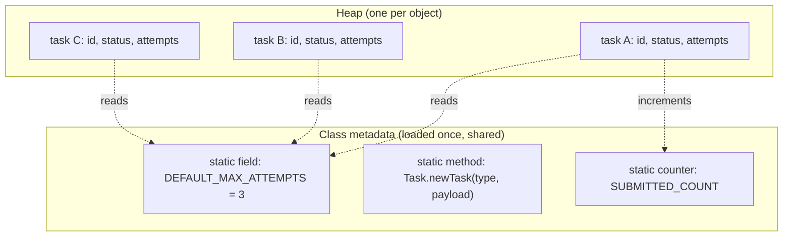
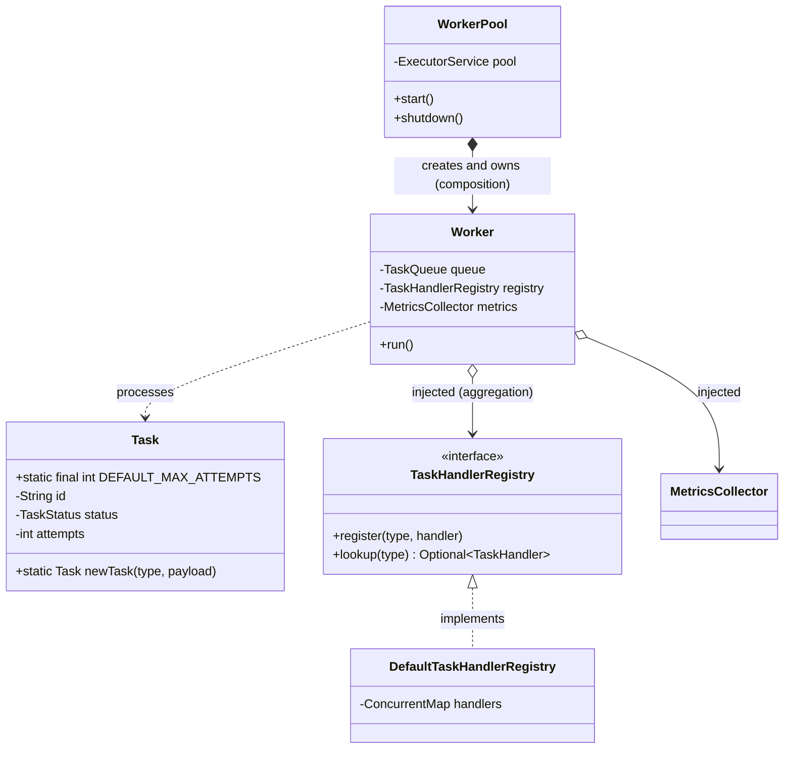

# Static Members

> Where this fits: `static` is how our Task Queue holds *class-level* knowledge — constants like
> `DEFAULT_MAX_ATTEMPTS`, factory methods like `Task.newTask(...)`, and the tempting-but-dangerous global
> `TaskHandlerRegistry`. Getting `static` right is the dividing line between code you can test and code you can't,
> which is exactly why this chapter ends by motivating dependency injection.

---

## 1. Why This Exists

Every field and method we have written so far lives on an *instance*. Each `Task` object has its own `id`,
its own `attempts` counter, its own `status`. That is correct: two tasks are genuinely two different things.

But some knowledge does not belong to any single object — it belongs to the *class as a whole*:

- There is exactly **one** correct value for "the default number of retry attempts." It is the same for every
  `Task` ever created. Storing a copy of `3` inside every `Task` instance is wasteful and, worse, invites drift.
- There is exactly **one** sensible way to "create a fresh `PENDING` task with a generated UUID." That logic is
  about the *Task type*, not about any particular task — there is no task yet when you call it.
- A counter like "how many tasks has this JVM ever submitted?" is inherently shared. It cannot live on one
  instance because no single instance is special.

`static` is Java's keyword for *belongs to the class, not to an instance*. A static member is created once when
the class is loaded, lives in the class's metadata (the *method area* / metaspace, not the per-object heap
slot), and is shared by every instance and by code that has no instance at all.

Historically this is the descendant of C's file-scope globals and `static` functions, cleaned up and namespaced
under a type. That heritage is the warning label: static state is **global state**, and global mutable state is
one of the oldest sources of bugs in our profession. The whole arc of this chapter is *use `static` for the
things that are genuinely class-level and immutable; resist it for the things that are really collaborators.*



This builds directly on [`chapter-02-fields-and-methods.md`](chapter-02-fields-and-methods.md) (instance state)
and [`chapter-03-constructors.md`](chapter-03-constructors.md) (object creation), and it relies on the
visibility rules from [`chapter-04-access-modifiers.md`](chapter-04-access-modifiers.md).

---

## 2. Class vs Instance State — The Mental Model

The single most important sentence in this chapter:

> **Instance members answer "what is true of *this object*?" Static members answer "what is true of the *type
> itself*?"**

| Question | Belongs on | Example from our model |
| --- | --- | --- |
| What is this task's current status? | instance field | `task.status` |
| How many attempts has *this* task used? | instance field | `task.attempts` |
| What is the default cap on attempts for *all* tasks? | static (constant) | `Task.DEFAULT_MAX_ATTEMPTS` |
| How do I mint a brand-new task? | static factory | `Task.newTask(...)` |
| How many tasks has this process submitted total? | static counter (shared) | `TaskMetrics.submitted` |

A static method has **no `this`**. That is not a quirk; it is the defining property. Because there is no `this`,
a static method cannot read instance fields directly — there is no instance for it to read from. This is exactly
why a factory method is static: it runs *before* any instance exists, so it could not possibly be an instance
method.

```java
public final class Task {
    // Instance state — one copy per Task object.
    private final String id;
    private TaskStatus status;
    private int attempts;

    // Class state — one copy for the whole type, shared by all objects.
    public static final int DEFAULT_MAX_ATTEMPTS = 3;

    // A static method has no `this`; it operates on parameters and class state only.
    public static int defaultMaxAttempts() {
        return DEFAULT_MAX_ATTEMPTS;
    }

    private Task(String id, TaskStatus status, int attempts) {
        this.id = id;          // legal: instance ctx has `this`
        this.status = status;
        this.attempts = attempts;
    }
}
```

---

## 3. The Naive Version

A learner new to Java, told "use static for shared things," reaches for `static` everywhere. Here is the
classic first cut of a handler registry and a metrics counter, both done as raw global mutable state.

```java
// NAIVE: everything static, everything global, everything public.
public class TaskSystem {
    // A globally reachable map of handlers, mutated from anywhere.
    public static Map<String, TaskHandler> handlers = new HashMap<>();

    // A global counter, incremented with ++ from many threads.
    public static int submitted = 0;
    public static int succeeded = 0;

    public static void register(String type, TaskHandler h) {
        handlers.put(type, h);
    }

    public static void submit(Task t) {
        submitted++;                       // not atomic; lost updates under threads
        TaskHandler h = handlers.get(t.type());
        // ... run it ...
    }
}
```

Why this is bad — and these are not stylistic nitpicks, they are real defects:

1. **`public static` mutable fields are global variables.** Any code anywhere can do
   `TaskSystem.handlers = null` or `TaskSystem.submitted = 999`. There is no invariant you can defend.
2. **Not thread-safe.** `submitted++` is read-modify-write; with a worker pool, increments are lost. A plain
   `HashMap` mutated concurrently can corrupt or loop forever.
3. **Untestable.** Static state persists across tests in the same JVM. Test A registers a handler, Test B sees
   it. Test order now matters, and you get flaky, mysterious failures. You cannot give one test a fake registry
   and another the real one — there is only one, forever.
4. **Hidden dependency.** `submit` secretly depends on `TaskSystem.handlers`. Nothing in its signature reveals
   it. You cannot tell, from the outside, what `submit` needs to do its job.
5. **No lifecycle.** When is the registry populated? Whoever runs first wins. Initialization order becomes a
   landmine.

This compiles and "works" in a demo. It rots the moment you have threads or tests — i.e., immediately in a Task
Queue.

---

## 4. Improved Version

Keep `static` only for what is genuinely class-level and immutable; make the mutable counter thread-safe; hide
the field and expose intent through methods.

```java
public final class TaskMetrics {
    // Constants: static + final. One shared, immutable, class-level fact.
    public static final int DEFAULT_MAX_ATTEMPTS = 3;

    // Mutable shared counters must be atomic, and the field must be private.
    private static final LongAdder SUBMITTED = new LongAdder();
    private static final LongAdder SUCCEEDED = new LongAdder();

    private TaskMetrics() { } // no instances; this is a utility holder

    public static void recordSubmitted() { SUBMITTED.add(1); }
    public static void recordSucceeded() { SUCCEEDED.add(1); }

    public static long submitted() { return SUBMITTED.sum(); }
    public static long succeeded() { return SUCCEEDED.sum(); }
}
```

This fixes correctness: `LongAdder` is contention-friendly and thread-safe, the fields are private, and the
class cannot be instantiated. The static **constant** `DEFAULT_MAX_ATTEMPTS` is exactly the right use of
`static` — it is one shared, immutable, class-level fact.

But the **registry** is still the hard part. If we make `TaskHandlerRegistry` static, we get a clean API and one
fatal flaw: tests still share it. The improvement that actually matters is to stop pretending the registry is
class-level knowledge. It is a *collaborator* — a thing the worker *uses* — so it should be an object you can
pass in. That realization is the bridge to the production version.

---

## 5. Production-Quality Version

A staff engineer draws a sharp line:

- **`static final` constants** — yes. They are immutable, class-level, zero-cost.
- **`static` factory methods** — yes, when they name a creation intent or hide construction detail.
- **`static` *mutable state*** — almost never in application code. Make it an injected object instead.

So the registry becomes an **instance** with an interface, created once at the composition root and **injected**
into the `Worker`. There is still exactly one in production — but the *sharing* is arranged by wiring, not by the
`static` keyword. That single change is what makes the whole system testable.

```java
// The contract — small, focused, mockable.
public interface TaskHandlerRegistry {
    void register(String type, TaskHandler handler);
    Optional<TaskHandler> lookup(String type);
}

// A real implementation: a normal object, instance state, thread-safe.
public final class DefaultTaskHandlerRegistry implements TaskHandlerRegistry {
    private final ConcurrentMap<String, TaskHandler> handlers = new ConcurrentHashMap<>();

    @Override public void register(String type, TaskHandler handler) {
        handlers.put(Objects.requireNonNull(type), Objects.requireNonNull(handler));
    }

    @Override public Optional<TaskHandler> lookup(String type) {
        return Optional.ofNullable(handlers.get(type));
    }
}

// The Worker DEPENDS on the interface and RECEIVES it. No static lookup anywhere.
public final class Worker implements Runnable {
    private final TaskQueue queue;
    private final TaskHandlerRegistry registry;   // injected collaborator
    private final MetricsCollector metrics;       // injected collaborator

    public Worker(TaskQueue queue, TaskHandlerRegistry registry, MetricsCollector metrics) {
        this.queue = queue;
        this.registry = registry;
        this.metrics = metrics;
    }

    @Override public void run() {
        try {
            while (!Thread.currentThread().isInterrupted()) {
                Task task = queue.dequeue();
                TaskHandler handler = registry.lookup(task.type())
                    .orElseThrow(() -> new IllegalStateException("No handler for: " + task.type()));
                TaskResult result = safeHandle(handler, task);
                metrics.recordOutcome(task.type(), result.success());
            }
        } catch (InterruptedException e) {
            Thread.currentThread().interrupt(); // restore the flag, exit cleanly
        }
    }

    private TaskResult safeHandle(TaskHandler handler, Task task) {
        try {
            return handler.handle(task);
        } catch (Exception e) {
            return new TaskResult(false, e.getMessage(), true);
        }
    }
}
```

Notice what is *still* static: the constants and the `Task.newTask` factory below. Notice what is *no longer*
static: the registry and the metrics sink, because they are collaborators with lifecycle that tests must
control.

---

## 6. Code Walkthrough

### 6a. Beginner — constants and a static factory

The first and safest uses of `static`: a named constant, and a factory that hides the `UUID`/`Instant`
plumbing so callers never construct a half-built `Task`.

```java
import java.time.Instant;
import java.util.UUID;

public final class Task {
    public static final int DEFAULT_MAX_ATTEMPTS = 3;
    public static final int DEFAULT_PRIORITY = 0;

    private final String id;
    private final String type;
    private final String payload;
    private TaskStatus status;
    private int attempts;
    private final int maxAttempts;
    private final Instant createdAt;
    private final int priority;

    // private: force creation through the named factory below.
    private Task(String id, String type, String payload, TaskStatus status,
                 int attempts, int maxAttempts, Instant createdAt, int priority) {
        this.id = id;
        this.type = type;
        this.payload = payload;
        this.status = status;
        this.attempts = attempts;
        this.maxAttempts = maxAttempts;
        this.createdAt = createdAt;
        this.priority = priority;
    }

    /** Static factory: the canonical way to mint a fresh, valid task. */
    public static Task newTask(String type, String payload) {
        return new Task(
            UUID.randomUUID().toString(),   // class-level knowledge: how to make an id
            type,
            payload,
            TaskStatus.PENDING,             // a fresh task is always PENDING
            0,                              // zero attempts so far
            DEFAULT_MAX_ATTEMPTS,           // shared constant
            Instant.now(),
            DEFAULT_PRIORITY
        );
    }

    public String type() { return type; }
    public TaskStatus status() { return status; }
    public int attempts() { return attempts; }
}
```

A static factory beats a public constructor here because it has a *name* (`newTask` reads better than
`new Task(...)`), it can return a cached or subtype instance, and it centralizes the "PENDING + UUID + now"
invariant. (More on this tradeoff in [`../05-design-patterns/factory-method.md`](../05-design-patterns/factory-method.md).)

### 6b. Intermediate — static factory with validation and named variants

Static factories shine when there are multiple meaningful ways to construct the same type. Each gets a clear
name instead of overloaded constructors you cannot tell apart.

```java
public final class RetryPolicies {
    private RetryPolicies() { } // utility class: never instantiated

    /** Fixed delay between every attempt. */
    public static RetryPolicy fixed(Duration delay) {
        if (delay.isNegative()) throw new IllegalArgumentException("delay must be >= 0");
        return attempt -> attempt < 1 ? Optional.empty() : Optional.of(delay);
    }

    /** Exponential backoff with full jitter, capped. */
    public static RetryPolicy exponentialWithJitter(Duration base, Duration cap) {
        return attempt -> {
            if (attempt < 1) return Optional.empty();
            long raw = base.toMillis() * (1L << Math.min(attempt - 1, 30)); // 2^(attempt-1)
            long capped = Math.min(raw, cap.toMillis());
            long jittered = ThreadLocalRandom.current().nextLong(capped + 1); // full jitter
            return Optional.of(Duration.ofMillis(jittered));
        };
    }

    /** No retries: every attempt is the last. */
    public static RetryPolicy none() {
        return attempt -> Optional.empty();
    }
}
```

Usage reads like prose: `RetryPolicies.exponentialWithJitter(Duration.ofMillis(100), Duration.ofSeconds(30))`.
The static methods are *stateless transformations*: input parameters in, a new `RetryPolicy` out. No shared
mutable state, so they are inherently thread-safe and trivially testable.

> Jitter note: `Math.min(attempt - 1, 30)` guards against shifting a `long` by 64+, which is undefined in Java
> (the shift amount is taken mod 64). Capping the exponent first is the production-safe habit.

`RetryPolicy` returns an `Optional<Duration>`; see
[`../01-java-fundamentals/chapter-08-functional-interfaces.md`](../01-java-fundamentals/chapter-08-functional-interfaces.md)
for why the lambda form is legal here.

### 6c. Production-inspired — the testability fork: static vs injected registry

This example shows, side by side, *why* a static registry hurts and an injected one heals. It is the heart of
the chapter.

```java
// ---------- Version A: STATIC registry (looks convenient, fails tests) ----------
final class StaticRegistry {
    private static final ConcurrentMap<String, TaskHandler> H = new ConcurrentHashMap<>();
    private StaticRegistry() { }
    static void register(String type, TaskHandler h) { H.put(type, h); }
    static TaskHandler lookup(String type) { return H.get(type); }
}

final class StaticWorker {
    void process(Task t) {
        TaskHandler h = StaticRegistry.lookup(t.type()); // HIDDEN global dependency
        // ...
    }
}

// ---------- Version B: INJECTED registry (one wire, fully testable) ----------
final class InjectedWorker {
    private final TaskHandlerRegistry registry; // VISIBLE dependency, swappable
    InjectedWorker(TaskHandlerRegistry registry) { this.registry = registry; }

    void process(Task t) {
        TaskHandler h = registry.lookup(t.type())
            .orElseThrow(() -> new IllegalStateException("no handler: " + t.type()));
        // ...
    }
}
```

And the tests that prove the difference:

```java
import static org.assertj.core.api.Assertions.*;
import org.junit.jupiter.api.*;

class RegistryTestabilityTest {

    // Version A: the global leaks between tests. Run order changes the result.
    @Test
    void staticRegistryBleedsAcrossTests() {
        StaticRegistry.register("email", t -> new TaskResult(true, "ok", false));
        // This handler is now visible to EVERY other test in the JVM — including ones
        // that wanted "email" to be absent. There is no clean way to reset it,
        // and @BeforeEach cannot un-register what another test class registered.
        assertThat(StaticRegistry.lookup("email")).isNotNull();
    }

    // Version B: each test gets its own registry. Total isolation, no reset dance.
    @Test
    void injectedRegistryIsIsolatedAndMockable() {
        TaskHandlerRegistry registry = new DefaultTaskHandlerRegistry();
        registry.register("email", t -> new TaskResult(true, "sent", false));
        InjectedWorker worker = new InjectedWorker(registry);

        Task t = Task.newTask("email", "{\"to\":\"a@b.com\"}");
        assertThatCode(() -> worker.process(t)).doesNotThrowAnyException();
    }

    @Test
    void unknownHandlerFailsLoudly() {
        TaskHandlerRegistry empty = new DefaultTaskHandlerRegistry(); // fresh, empty
        InjectedWorker worker = new InjectedWorker(empty);
        Task t = Task.newTask("sms", "{}");
        assertThatThrownBy(() -> worker.process(t))
            .isInstanceOf(IllegalStateException.class)
            .hasMessageContaining("no handler: sms");
    }
}
```

The injected version needs no `@BeforeEach` reset, no reflection to clear statics, no test ordering. Each test
constructs the exact world it wants. That is the entire argument for dependency injection in one screen.

---

## 7. How This Applies To Our Task Queue Project

Concrete mapping onto the canonical model:

- **`Task.DEFAULT_MAX_ATTEMPTS`, `Task.DEFAULT_PRIORITY`** — `public static final` constants. One value, shared,
  immutable. Correct use of static.
- **`Task.newTask(type, payload)`** — `static` factory enforcing the PENDING/UUID/now invariant.
- **`RetryPolicies.fixed(...)` / `.exponentialWithJitter(...)`** — `static` factories returning `RetryPolicy`
  lambdas. Stateless, thread-safe.
- **`TaskHandlerRegistry`** — *not* static. An injected collaborator so `Worker` and tests can swap it. This is
  the explicit motivation for [`../04-oop-and-ood/dependency-injection.md`](../04-oop-and-ood/dependency-injection.md)
  and the cautionary backdrop for [`../05-design-patterns/singleton.md`](../05-design-patterns/singleton.md).
- **`MetricsCollector`** — also injected. In Phase 3 it becomes a Micrometer `MeterRegistry`, which Spring Boot
  injects for you. Counters live *inside* that object, not in a `public static int`.
- **`WorkerPool`** — constructs `Worker`s and hands each the *same* registry and metrics instances. One object,
  shared by wiring — the "singleton-ness" without the `static` keyword.



`Worker o--> TaskHandlerRegistry` is **aggregation**: the worker holds a reference it did not create and does not
own. `WorkerPool *--> Worker` is **composition**: the pool creates and owns its workers. (See
[`chapter-15-aggregation.md`](chapter-15-aggregation.md) and
[`chapter-16-composition.md`](chapter-16-composition.md).)

---

## 8. Tradeoffs

| Use of `static` | When it helps | When it hurts | Verdict |
| --- | --- | --- | --- |
| `static final` primitive/String constant | Always: one immutable shared value, inlined by the compiler | Never meaningfully | Use freely |
| `static final` reference to an **immutable** object | Shared, safe (e.g. a `Duration`) | If the object is secretly mutable, it's shared mutable state | Use if truly immutable |
| `static` factory method (stateless) | Named creation, hides construction, can cache/return subtype | Hard to substitute in a test (can't mock a static) | Use for creation; don't put policy in it |
| `static` *mutable* field | "Convenient" global | Thread-unsafe, untestable, hidden dependency, lifecycle chaos | Avoid in app code |
| `static` utility method (pure function) | `Math.max`, parsing, formatting | If it grows hidden state or I/O it becomes a global | OK while pure |
| Static **registry / service locator** | Looks like easy global access | Breaks test isolation, hides deps, single config forever | Replace with DI |

Two costs people forget:

- **Static methods cannot be overridden** (they are not polymorphic — they are resolved by the *declared* type,
  not the runtime object). So you cannot subclass to vary behavior, and you cannot mock them without bytecode
  tricks. That rigidity is fine for pure helpers, fatal for collaborators.
- **Class initialization order** is governed by first use, not by you. A `static` field initialized from another
  class's `static` field creates an initialization-order dependency that surfaces as a baffling `null` or
  `ExceptionInInitializerError` at the worst time.

---

## 9. Common Mistakes And Pitfalls

- **`public static` mutable field.** It is a global variable wearing a type. *Fix:* make it `private`, expose
  methods, or better, make it an injected object.
- **`static` counter with `++`.** `count++` is not atomic; worker threads lose increments. *Fix:* `LongAdder`
  or `AtomicLong`, and read it as `.sum()`/`.get()`. See
  [`../06-concurrency/atomics-and-thread-safety.md`](../06-concurrency/atomics-and-thread-safety.md).
- **`static final List`/`Map` you keep mutating.** `final` freezes the *reference*, not the contents. A
  `static final HashMap` you `put` into from many threads still corrupts. *Fix:* `ConcurrentHashMap`, or a
  truly immutable `List.of(...)`. See [`../03-java-memory-model/immutable-objects.md`](../03-java-memory-model/immutable-objects.md).
- **Static registry "for convenience."** It silently couples every test to global state. *Fix:* inject the
  registry.
- **Calling a static method via an instance** (`task.defaultMaxAttempts()`). Compiles, but misleading — it is
  dispatched on the *class*, not the object. *Fix:* call `Task.defaultMaxAttempts()`.
- **Heavy work in a `static {}` block.** Initialization runs on first class use, can throw
  `ExceptionInInitializerError`, and you cannot inject a fake. *Fix:* lazy, explicit initialization or DI.
- **Hidden inter-class static init dependency.** Class `A`'s static field reads `B.X` before `B` is initialized.
  *Fix:* avoid cross-class static initialization chains; prefer constructor wiring.
- **Forgetting the private constructor** on a "utility" class, so someone instantiates `RetryPolicies`. *Fix:*
  private constructor (or make it a `final` class with no public ctor).

---

## 10. Refactoring Exercise

**Bad** — a global, mutable, untestable submission gateway:

```java
public class TaskGateway {
    public static Map<String, TaskHandler> handlers = new HashMap<>();
    public static int submitted = 0;
    public static List<Task> dead = new ArrayList<>();

    public static void submit(Task t) {
        submitted++;                                   // lost updates
        TaskHandler h = handlers.get(t.type());        // hidden global dep
        if (h == null) { dead.add(t); return; }        // unsynchronized list
        try {
            h.handle(t);
        } catch (Exception e) {
            dead.add(t);                               // shared mutable state
        }
    }
}
```

**Improved** — keep only the constant static; make counters atomic; hide fields:

```java
public final class TaskGateway {
    public static final int DEFAULT_MAX_ATTEMPTS = 3; // legit static constant

    private final TaskHandlerRegistry registry;       // now injected
    private final DeadLetterQueue deadLetters;        // now injected
    private final LongAdder submitted = new LongAdder();

    public TaskGateway(TaskHandlerRegistry registry, DeadLetterQueue deadLetters) {
        this.registry = registry;
        this.deadLetters = deadLetters;
    }

    public void submit(Task t) {
        submitted.add(1);
        registry.lookup(t.type()).ifPresentOrElse(
            h -> run(h, t),
            () -> deadLetters.send(t, "no handler for type: " + t.type())
        );
    }

    private void run(TaskHandler h, Task t) {
        try {
            h.handle(t);
        } catch (Exception e) {
            deadLetters.send(t, "handler threw: " + e.getMessage());
        }
    }

    public long submittedCount() { return submitted.sum(); }
}
```

**Production-quality** — interface + injected collaborators + thread-safe metrics, wired at the composition
root. The class no longer owns *any* shared global; it owns only its own instance counter, and even that could
move into the injected `MetricsCollector`.

```java
public interface TaskSubmitter {
    void submit(Task task);
}

public final class DefaultTaskSubmitter implements TaskSubmitter {
    private final TaskQueue queue;
    private final MetricsCollector metrics; // counters live here, injected

    public DefaultTaskSubmitter(TaskQueue queue, MetricsCollector metrics) {
        this.queue = queue;
        this.metrics = metrics;
    }

    @Override public void submit(Task task) {
        queue.enqueue(task);
        metrics.recordSubmitted(task.type());
    }
}

// Composition root (the ONE place that wires singletons by hand, no `static`):
class Bootstrap {
    static TaskSubmitter buildSubmitter() {
        TaskQueue queue = new InMemoryTaskQueue();
        MetricsCollector metrics = new MetricsCollector(); // one instance, shared by wiring
        return new DefaultTaskSubmitter(queue, metrics);
    }
}
```

The arc: *global static state* -> *thread-safe but still partly static* -> *interface with injected
collaborators and a single explicit composition root*. Production code lives at the third stop.

---

## 11. Exercises

### Easy

**E1 (Knowledge check).** Explain in two sentences why a `static` factory method cannot read instance fields,
and why that is exactly what makes it suitable for object creation.

**E2 (Coding).** Add a `static final` constant `MAX_PAYLOAD_BYTES = 256 * 1024` to `Task` and a `static` factory
`newValidatedTask(String type, String payload)` that throws `IllegalArgumentException` if `type` is blank or the
payload exceeds the cap. Return a normal `newTask` result otherwise.

### Medium

**M1 (Refactoring).** Given the `StaticRegistry` from §6c, convert it into an injectable
`TaskHandlerRegistry` interface plus `DefaultTaskHandlerRegistry`, and rewrite `StaticWorker` to receive it via
the constructor. Then write one JUnit test proving two `Worker`s can have *different* registries simultaneously.

**M2 (Coding).** Implement a thread-safe `TaskCounters` that tracks per-type submission counts using a
`ConcurrentHashMap` of `String` to `LongAdder`. Provide `record(String type)` and `count(String type)`. Make it
an injectable instance, *not* a static holder, and justify the choice in a comment.

### Hard

**H1 (Design).** You inherit a codebase where `MetricsCollector.INSTANCE` is a public static singleton used in
40 files. Lay out a *safe, incremental* migration to injected metrics that keeps the build green at every step.
List the steps, the risk at each, and how you verify isolation in tests.

**H2 (Interview-style).** Two threads call `Task.newTask("email", "{}")` simultaneously while a `static int
sequence` field is incremented to assign a monotonic sequence number. The numbers collide. Diagnose the bug,
fix it two different ways, and state the tradeoff between them.

**H3 (Stretch).** Demonstrate a class-initialization-order bug: class `A` has `static final int X = B.Y + 1;`
and class `B` has `static final int Y = A.X + 1;`. Predict the printed values, run it, and explain the JLS rule
that produces the result.

---

## 12. Solutions

**E1.** A static method runs on the class, not on an object, so it has no `this` and therefore no instance fields
to read — they may not exist yet. That absence is the point: a factory is called *before* the object exists, so
it must be static and must build the instance from parameters and class-level knowledge alone.

**E2.**

```java
public final class Task {
    public static final int MAX_PAYLOAD_BYTES = 256 * 1024;
    public static final int DEFAULT_MAX_ATTEMPTS = 3;
    // ... fields and private ctor as before ...

    public static Task newValidatedTask(String type, String payload) {
        if (type == null || type.isBlank())
            throw new IllegalArgumentException("type must be non-blank");
        int bytes = payload == null ? 0 : payload.getBytes(StandardCharsets.UTF_8).length;
        if (bytes > MAX_PAYLOAD_BYTES)
            throw new IllegalArgumentException(
                "payload " + bytes + "B exceeds cap " + MAX_PAYLOAD_BYTES + "B");
        return newTask(type, payload);
    }
}
```

The validation lives in the factory so *no* path can produce an invalid `Task`. Counting UTF-8 bytes (not
`String.length()`) is the correct size check for a byte cap.

**M1.**

```java
public interface TaskHandlerRegistry {
    void register(String type, TaskHandler handler);
    Optional<TaskHandler> lookup(String type);
}

public final class DefaultTaskHandlerRegistry implements TaskHandlerRegistry {
    private final ConcurrentMap<String, TaskHandler> handlers = new ConcurrentHashMap<>();
    public void register(String type, TaskHandler h) { handlers.put(type, h); }
    public Optional<TaskHandler> lookup(String type) { return Optional.ofNullable(handlers.get(type)); }
}

final class Worker2 {
    private final TaskHandlerRegistry registry;
    Worker2(TaskHandlerRegistry registry) { this.registry = registry; }
    TaskResult process(Task t) throws Exception {
        return registry.lookup(t.type())
            .orElseThrow(() -> new IllegalStateException("no handler: " + t.type()))
            .handle(t);
    }
}
```

```java
@Test
void twoWorkersHaveIndependentRegistries() throws Exception {
    TaskHandlerRegistry a = new DefaultTaskHandlerRegistry();
    TaskHandlerRegistry b = new DefaultTaskHandlerRegistry();
    a.register("email", t -> new TaskResult(true, "A", false));
    b.register("email", t -> new TaskResult(true, "B", false));

    Worker2 wa = new Worker2(a);
    Worker2 wb = new Worker2(b);

    assertThat(wa.process(Task.newTask("email", "{}")).message()).isEqualTo("A");
    assertThat(wb.process(Task.newTask("email", "{}")).message()).isEqualTo("B");
}
```

With a static registry this test is impossible to write — there is only one global map, so "two different
registries" cannot exist. Injection makes it trivial.

**M2.**

```java
public final class TaskCounters {
    // Instance, not static: each test/composition gets its own, so state never leaks.
    private final ConcurrentMap<String, LongAdder> perType = new ConcurrentHashMap<>();

    public void record(String type) {
        perType.computeIfAbsent(type, k -> new LongAdder()).add(1);
    }

    public long count(String type) {
        LongAdder a = perType.get(type);
        return a == null ? 0 : a.sum();
    }
}
```

`computeIfAbsent` makes "create-the-adder-if-missing" atomic so concurrent first-records for a type don't race.
Keeping it an instance means a unit test constructs a fresh `TaskCounters` and asserts on it with zero risk of
cross-test contamination — the defining advantage over a `static` holder.

**H1.** Incremental migration from a static singleton to injection:

1. **Introduce the interface.** Extract `MetricsCollector`'s methods into an interface; make the existing class
   implement it. Risk: low. Build stays green; nothing calls the interface yet.
2. **Add constructor injection alongside the static.** Give each consuming class a constructor that accepts the
   interface, *defaulting* to `MetricsCollector.INSTANCE` if not provided. Risk: low; old call sites unchanged.
3. **Migrate call sites in slices.** Per package, replace `MetricsCollector.INSTANCE.x()` with the injected
   field. Verify with a test that constructs the class with a *mock* metrics and asserts interactions. Risk:
   medium; do one package per PR.
4. **Wire a single instance at the composition root** (Spring `@Bean` in Phase 2+). Risk: low.
5. **Delete the static `INSTANCE`.** The compiler now finds every straggler. Risk: low — it fails loudly.
   Verify isolation by asserting that a test which records a metric does *not* affect a second test (each builds
   its own collector); under the old static, that assertion would fail.

**H2.** The bug: `sequence++` is read-modify-write. Two threads read the same value, both increment, and write
the same result — a lost update producing duplicate sequence numbers.

```java
// Fix 1: AtomicInteger — single shared atomic counter.
private static final AtomicInteger SEQUENCE = new AtomicInteger();
static Task newTask(String type, String payload) {
    int seq = SEQUENCE.incrementAndGet(); // atomic, monotonic, globally unique in-JVM
    // ...
}

// Fix 2: drop the shared counter entirely; use a per-task UUID for identity.
static Task newTask(String type, String payload) {
    String id = UUID.randomUUID().toString(); // no contention, no shared state
    // ...
}
```

Tradeoff: `AtomicInteger` gives a *dense, monotonic, ordered* sequence but is a contention point at high
throughput and is only unique within one JVM (it resets on restart and collides across nodes). `UUID` is
contention-free and globally unique across nodes and restarts — essential for the distributed Phase 4 — but is
not ordered and is 16 bytes instead of 4. For a distributed Task Queue, UUID wins; for a single-node monotonic
audit log, the atomic counter wins.

**H3.**

```java
class A { static final int X = B.Y + 1; static { System.out.println("A.X=" + X); } }
class B { static final int Y = A.X + 1; static { System.out.println("B.Y=" + Y); } }

public class InitOrder {
    public static void main(String[] a) { System.out.println("X=" + A.X + " Y=" + B.Y); }
}
```

Touching `A.X` triggers A's initialization, which needs `B.Y`, which triggers B's initialization, which needs
`A.X`. But A is *already being initialized* (it's mid-flight), so by the JLS rule the JVM does **not** re-enter
it; `A.X` is read at its current value, which is still `0` (the default for an `int` before its initializer
runs). So `B.Y = 0 + 1 = 1`, B finishes, then `A.X = 1 + 1 = 2`. Output: `B.Y=1`, `A.X=2`, then `X=2 Y=1`. The
rule (JLS 12.4.2): a thread that re-enters a class already being initialized proceeds without re-initializing,
seeing default values for not-yet-assigned fields. This is exactly why cross-class static initialization chains
are a trap — and another reason to prefer constructor wiring over static initialization order.

---

## 13. Interview Questions And Takeaways

1. **Q: What is the difference between a static and an instance member?**
   A: A static member belongs to the class, exists once, is shared by all instances, and has no `this`. An
   instance member exists once per object and carries per-object state.

2. **Q: Why is a static method not polymorphic?**
   A: Static methods are bound at compile time by the *declared* type (static dispatch), not the runtime object,
   so they cannot be overridden — only *hidden* by a same-signature static in a subclass. Polymorphism needs a
   `this` and a vtable; static has neither.

3. **Q: Is `static final` enough to make a collection a safe constant?**
   A: No. `final` freezes the reference, not the contents. A `static final HashMap` is still mutable and unsafe.
   Use `List.of(...)`/`Map.of(...)` for true immutability or `ConcurrentHashMap` if mutation is required.

4. **Q: Why does static state hurt unit testing?**
   A: Static state persists for the JVM's life, so it leaks between tests, makes order significant, and cannot
   be swapped per-test. You lose isolation and mockability — the core reasons to prefer injection.

5. **Q: When is a static factory better than a constructor?**
   A: When you want a meaningful name, want to hide or vary the concrete type, want to cache/return a shared
   instance, or want to centralize construction invariants. Constructors can't be named and always return a new
   instance of the exact class.

6. **Q: How do you make a JVM-wide counter thread-safe?**
   A: Use `AtomicLong`/`LongAdder` (prefer `LongAdder` under heavy write contention; it reduces hotspot
   contention via internal striping). Never `count++` on a shared field.

7. **Q: A static singleton vs. an injected single instance — same thing?**
   A: Functionally one instance either way, but the static singleton is reachable globally, hard to substitute,
   and tied to one configuration; the injected instance is wired at the composition root, swappable, and
   testable. Prefer injection; reserve true singletons for stateless, immutable utilities.

8. **Q: What triggers static initializer execution?**
   A: First active use of the class — first instance creation, first static method/field access (non-constant),
   or reflection. Constant `static final` primitives/Strings are inlined and may not trigger init at all.

**Takeaways:** `static` is for class-level, immutable facts and pure creation/utility logic. Static *mutable
state* is global state — avoid it. The moment you reach for a static registry/service-locator, you have found a
collaborator that wants to be injected.

---

## 14. Production Considerations

- **Metrics under load.** A `public static int` counter incremented by a worker pool silently undercounts. In
  production, counters are `LongAdder`/Micrometer meters held in an *injected* registry, scraped by Prometheus
  (Phase 3). Static counters also can't be reset or scoped per-tenant.
- **Class loading and memory.** Static fields are GC roots — they (and everything they reference) live until the
  class loader is unloaded, which for app classes is essentially forever. A `static Map` that only grows is a
  permanent memory leak. Watch this especially in containers and in frameworks that reload classes.
- **Hot-reload / multiple deployments.** In app servers or test harnesses that reload classes, static state can
  duplicate or stick around stale across reloads, producing ghost behavior. Injected instances are tied to the
  application context lifecycle and disposed cleanly.
- **Thread visibility.** A non-`final`, non-`volatile` static field written by one thread may never be seen by
  another due to the Java Memory Model. Constants (`static final`) are safe; mutable statics need `volatile` or
  atomics. See [`../06-concurrency/atomics-and-thread-safety.md`](../06-concurrency/atomics-and-thread-safety.md).
- **Initialization failures.** An exception in a `static {}` block throws `ExceptionInInitializerError` once,
  then `NoClassDefFoundError` forever after — a confusing, hard-to-recover failure mode. Keep static init
  trivial; do real setup in injected, lifecycle-managed beans.
- **Spring reality.** Spring beans are singletons *by default* but as *injected instances*, giving you one
  shared object with full testability — the production answer to "I need one of these." You almost never write
  `static` mutable state in a Spring service.

---

## What We Can Improve In Our Project Using This Concept

- Replace any `public static` mutable field in Phase 1 (counters, ad-hoc registries) with injected,
  thread-safe collaborators.
- Promote `Task` construction to `static` factories (`newTask`, `newValidatedTask`) so no caller can build an
  invalid or non-PENDING task.
- Keep `DEFAULT_MAX_ATTEMPTS`, `DEFAULT_PRIORITY`, and `MAX_PAYLOAD_BYTES` as the *only* static state in the
  domain — immutable constants.
- Make `TaskHandlerRegistry` and `MetricsCollector` injected interfaces, establishing the seam that
  [`../04-oop-and-ood/dependency-injection.md`](../04-oop-and-ood/dependency-injection.md) and Spring Boot
  (Phase 2) will fill.

## Project Refactoring Task

Refactor the Phase 1 codebase: (1) audit for every `static` member and classify each as constant / factory /
utility / *forbidden mutable state*; (2) convert the static handler registry into a `TaskHandlerRegistry`
interface with `DefaultTaskHandlerRegistry`, injected into `Worker` and `WorkerPool`; (3) move all counters into
an injected `MetricsCollector` using `LongAdder`; (4) add `Task.newTask`/`newValidatedTask` static factories and
make the constructor private; (5) add a unit test proving two workers with different registries run side by side
with no cross-talk; (6) add an ArchUnit rule forbidding `public static` non-final fields in the domain package.

## Git Commit For This Chapter

```text
refactor(core): eliminate global static state; add static factories and injected registry

- Add Task.newTask / Task.newValidatedTask static factories; make Task constructor private
- Keep only immutable static constants in domain (DEFAULT_MAX_ATTEMPTS, DEFAULT_PRIORITY, MAX_PAYLOAD_BYTES)
- Extract TaskHandlerRegistry interface + DefaultTaskHandlerRegistry (ConcurrentHashMap); inject into Worker
- Move JVM counters into injected MetricsCollector backed by LongAdder
- Add RetryPolicies static factories (fixed, exponentialWithJitter, none)
- Add tests proving per-worker registry isolation; add ArchUnit no-public-static-mutable rule

Files touched:
  src/main/java/com/taskqueue/core/Task.java
  src/main/java/com/taskqueue/execution/TaskHandlerRegistry.java
  src/main/java/com/taskqueue/execution/DefaultTaskHandlerRegistry.java
  src/main/java/com/taskqueue/execution/Worker.java
  src/main/java/com/taskqueue/execution/WorkerPool.java
  src/main/java/com/taskqueue/retry/RetryPolicies.java
  src/main/java/com/taskqueue/metrics/MetricsCollector.java
  src/test/java/com/taskqueue/execution/RegistryTestabilityTest.java
  src/test/java/com/taskqueue/ArchitectureRulesTest.java
```

## Architecture Impact

The domain layer's only shared state becomes a handful of immutable constants; every other "shared" thing
(registry, metrics) is now an injected instance wired at a single composition root. This is the precondition for
testability and for the dependency-injection and clean-architecture work ahead: collaborators can be mocked,
configurations can vary per environment, and Phase 2 can swap `InMemoryTaskQueue` for `PostgresTaskQueue`
without any caller touching a global. It also defuses the Singleton trap before we formally study it in
[`../05-design-patterns/singleton.md`](../05-design-patterns/singleton.md): we already have "one instance"
through wiring, so a static singleton buys us nothing but lost testability.

## Interview Takeaways

- `static` = class-level. Use it for immutable constants, pure factories, and pure utilities — not mutable
  state.
- `final` on a reference freezes the binding, not the object; a `static final` collection can still be mutated.
- Static methods aren't polymorphic and can't be mocked normally; that rigidity is fine for helpers, fatal for
  collaborators.
- Static mutable state breaks test isolation (leaks across tests, no per-test substitution) — the core
  motivation for dependency injection.
- A static singleton and an injected single instance both yield one object; the injected one is swappable and
  testable, so prefer it.
- Thread-safe shared counters use `AtomicLong`/`LongAdder`, never `++`; static fields are GC roots, so a growing
  `static Map` is a permanent leak.
