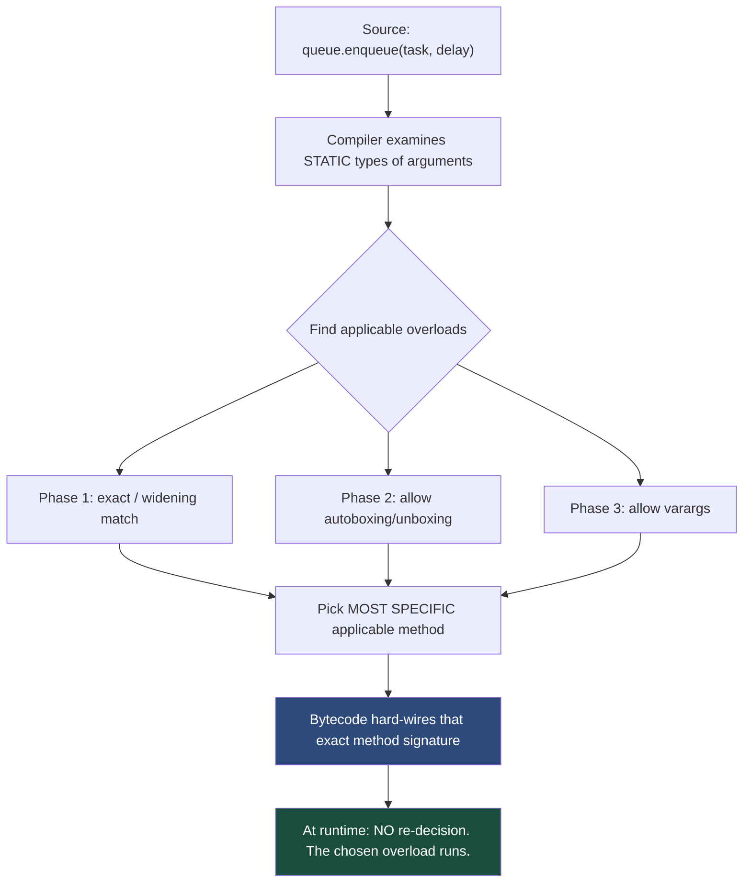
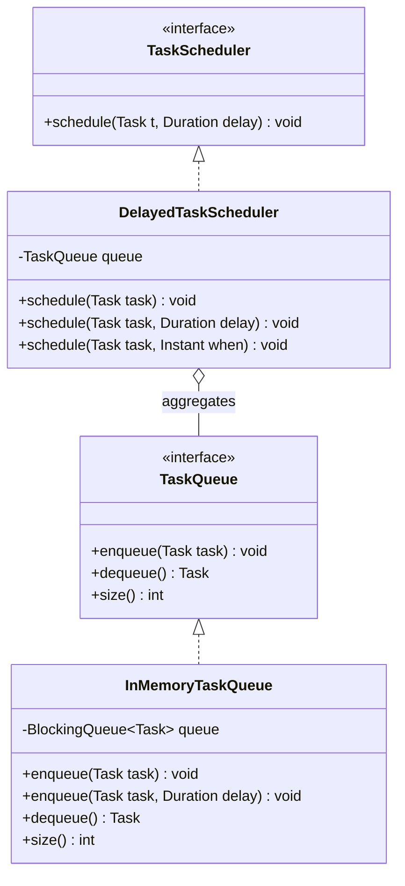

# Method Overloading (Compile-Time Polymorphism)

> Where this fits in the project: our `TaskQueue` and `TaskScheduler` need ergonomic APIs. We want `enqueue(task)` for "run now" and `enqueue(task, delay)` for "run later", without inventing two awkward method names. Method overloading lets one verb carry multiple intents — and the compiler, not the runtime, decides which one fires.

---

## 1. Why This Exists — The Real Problem

You are designing the producer-facing surface of the task queue. A caller has a `Task` and wants to submit it. Sometimes they want it processed immediately; sometimes after a delay (a poll-due scheduling concern from [the scheduling-queues chapter](../07-queues-and-messaging/scheduling-queues.md)).

Without overloading, you are forced into one of two ugly worlds:

1. **Name-mangling**: `enqueueNow(task)`, `enqueueWithDelay(task, delay)`, `enqueueWithPriority(task, priority)`. The vocabulary explodes. Every variant invents a new English word, and callers must memorize the dictionary.
2. **God methods with nullable junk**: `enqueue(Task t, Duration delay, Integer priority, boolean immediate)` where you pass `null` and `0` and `false` for the parts you do not care about. Now the *compiler* cannot help you, and a typo in argument order is a silent bug.

**Method overloading** is the language feature that says: *one method name, several parameter lists, the compiler picks the right one based on the static types of the arguments at the call site*. C had no notion of this — `printf` solved "many shapes" with varargs and format strings because it could not overload. C++ introduced overloading; Java inherited it. The win is a clean, discoverable API: `queue.enqueue(...)` autocompletes to show every legal shape.

The critical, often-misunderstood fact: **overload resolution happens at compile time** based on *declared* (static) types. It is *not* runtime polymorphism. That distinction is the entire point of this chapter and a top-5 Java interview trap. We will hammer it.



---

## 2. The Naive Version — First Cut, With Limitations

A learner new to Java often "solves" the immediate-vs-delayed problem with distinct names and copy-pasted bodies.

```java
// NAIVE: distinct method names, duplicated logic, no shared validation.
public final class NaiveTaskQueue {
    private final java.util.concurrent.BlockingQueue<Task> q =
        new java.util.concurrent.LinkedBlockingQueue<>();

    public void enqueueNow(Task t) {
        if (t == null) throw new IllegalArgumentException("task is null");
        q.add(t);
    }

    public void enqueueLater(Task t, Duration delay) {
        if (t == null) throw new IllegalArgumentException("task is null");   // duplicated
        if (delay == null) throw new IllegalArgumentException("delay is null");
        Task scheduled = t.withScheduledAt(Instant.now().plus(delay));      // pretend builder
        q.add(scheduled);
    }
}
```

Limitations called out:

- **Vocabulary sprawl.** Add priority and you get `enqueueNowWithPriority`, `enqueueLaterWithPriority`. Combinatorial explosion.
- **Duplicated validation.** The null check is copy-pasted; it will drift.
- **No discoverability.** `queue.enq...` does not group the variants in autocomplete the way one overloaded name does.
- **Hidden inconsistency risk.** Nothing forces both methods to share the same enqueue semantics.

---

## 3. Improved Version — Overload One Verb, Delegate

We collapse to a single verb `enqueue`, overloaded by arity, and route the simple case through the richer one so validation lives in exactly one place.

```java
public final class ImprovedTaskQueue {
    private final java.util.concurrent.BlockingQueue<Task> q =
        new java.util.concurrent.LinkedBlockingQueue<>();

    /** Enqueue for immediate processing. */
    public void enqueue(Task t) {
        enqueue(t, Duration.ZERO);          // delegate; one code path
    }

    /** Enqueue for processing after {@code delay}. */
    public void enqueue(Task t, Duration delay) {
        if (t == null)     throw new IllegalArgumentException("task is null");
        if (delay == null) throw new IllegalArgumentException("delay is null");
        Task ready = delay.isZero()
            ? t
            : t.withScheduledAt(Instant.now().plus(delay));
        q.add(ready);
    }
}
```

Better: one verb, no duplication, the two-arg form is the single source of truth. But there is still a subtle design smell — `Duration.ZERO` is a sentinel. And we have not yet addressed the *resolution traps* that bite when overloads accept primitives, boxed types, or varargs. That is where the production version earns its keep.

---

## 4. Production-Quality Version — Explicit, Trap-Free, Documented

A staff engineer ships overloads that (a) have an unambiguous resolution, (b) never surprise the caller with autoboxing or varargs, (c) document why each overload exists, and (d) avoid mixing `int` and `Integer` or `int` and `long` parameters that trigger the classic traps.

```java
import java.time.Duration;
import java.time.Instant;
import java.util.Objects;
import java.util.concurrent.BlockingQueue;
import java.util.concurrent.LinkedBlockingQueue;

/**
 * Producer-facing surface for the in-memory task queue (Phase 1).
 * <p>
 * Overloads are intentionally distinct in ARITY (1 vs 2 args), never merely
 * in primitive-vs-boxed types, so overload resolution is never ambiguous and
 * never silently autoboxes.
 */
public final class InMemoryTaskQueue implements TaskQueue {

    private final BlockingQueue<Task> queue = new LinkedBlockingQueue<>();

    /** Submit a task for immediate processing (scheduledAt = now). */
    @Override
    public void enqueue(Task task) {
        enqueue(task, Duration.ZERO);
    }

    /**
     * Submit a task to become eligible after {@code delay}.
     * A zero or negative delay is treated as "now".
     */
    public void enqueue(Task task, Duration delay) {
        Objects.requireNonNull(task, "task");
        Objects.requireNonNull(delay, "delay");
        Instant when = delay.isZero() || delay.isNegative()
            ? Instant.now()
            : Instant.now().plus(delay);
        queue.add(task.scheduledFor(when));   // returns a new Task (records are immutable)
    }

    @Override
    public Task dequeue() throws InterruptedException {
        return queue.take();                  // blocks until an element is available
    }

    @Override
    public int size() {
        return queue.size();
    }
}
```

Why a staff engineer ships it this way:

- **Arity-based overloads** (1 vs 2 params) make resolution trivial and human-obvious. There is never a "which one did the compiler pick?" moment.
- **`Objects.requireNonNull`** centralizes contracts and produces a precise NPE message.
- **No `int`/`long`/`Integer` overload pairs** — those are the autoboxing/widening minefield (Section 8). Using `Duration` instead of a bare `long millis` sidesteps it entirely and is self-documenting.
- **Immutable `Task`** (a record) means `scheduledFor` returns a copy; no aliasing surprises.

---

## 5. Code Walkthrough — Three Levels

### 5.1 Beginner: what overloading *is*

Same name, different parameter lists. The return type alone is **not** enough to overload — the compiler distinguishes overloads by the parameter list (the "signature"), not by return type.

```java
public class OverloadBasics {

    static String describe(Task t) {
        return "Task " + t.id() + " status=" + t.status();
    }

    static String describe(Task t, boolean verbose) {
        return verbose
            ? describe(t) + " attempts=" + t.attempts() + "/" + t.maxAttempts()
            : describe(t);
    }

    // ILLEGAL — differs only by return type. Won't compile:
    // static int describe(Task t) { ... }   // duplicate method signature

    public static void main(String[] args) {
        Task t = Task.of("email", "{\"to\":\"a@b.com\"}");
        System.out.println(describe(t));            // calls 1-arg version
        System.out.println(describe(t, true));      // calls 2-arg version
    }
}
```

### 5.2 Intermediate: resolution prefers the most specific match

When several overloads are applicable, Java picks the **most specific** one. `TaskHandler` is a `@FunctionalInterface`; `Runnable` is too. If a method is overloaded on both, a lambda's target type can become ambiguous.

```java
public class MostSpecific {

    static void submit(Object o)  { System.out.println("Object overload"); }
    static void submit(Task t)    { System.out.println("Task overload");   }
    static void submit(String s)  { System.out.println("String overload"); }

    public static void main(String[] args) {
        Task task = Task.of("report", "{}");
        submit(task);              // -> "Task overload"   (most specific)
        submit("hello");           // -> "String overload"
        submit((Object) task);     // -> "Object overload" (static type forced to Object)
        Object ref = task;
        submit(ref);               // -> "Object overload" (STATIC type is Object!)
    }
}
```

The last two lines are the heart of the chapter: `submit(ref)` does **not** dispatch on the runtime type `Task`. It dispatches on the *declared* type `Object`. Overloading is resolved by static type, decided by the compiler.

### 5.3 Production-inspired: scheduler with overloads that delegate

`TaskScheduler.schedule(Task, Duration)` is the canonical signature. We add ergonomic overloads that all funnel into it, plus a convenience that accepts an `Instant` deadline.

```java
import java.time.Duration;
import java.time.Instant;
import java.util.Objects;

public final class DelayedTaskScheduler implements TaskScheduler {

    private final TaskQueue queue;

    public DelayedTaskScheduler(TaskQueue queue) {
        this.queue = Objects.requireNonNull(queue, "queue");
    }

    /** Canonical method from the domain model. */
    @Override
    public void schedule(Task task, Duration delay) {
        Objects.requireNonNull(task, "task");
        Objects.requireNonNull(delay, "delay");
        // In Phase 1 we approximate scheduling by stamping scheduledAt and enqueuing.
        ((InMemoryTaskQueue) queue).enqueue(task, delay);
    }

    /** Convenience overload: schedule for a wall-clock instant. */
    public void schedule(Task task, Instant when) {
        Objects.requireNonNull(when, "when");
        Duration delay = Duration.between(Instant.now(), when);
        schedule(task, delay.isNegative() ? Duration.ZERO : delay);
    }

    /** Convenience overload: schedule immediately (arity 1). */
    public void schedule(Task task) {
        schedule(task, Duration.ZERO);
    }
}
```

Note the overloads differ by `Duration` vs `Instant` vs nothing — all *reference* types or distinct arity, so no boxing/widening ambiguity is possible.

---

## 6. How This Applies To Our Task Queue Project



Concrete touch points in the canonical model:

- **`InMemoryTaskQueue.enqueue(Task)` vs `enqueue(Task, Duration)`** — the headline example. The interface `TaskQueue` declares only the one-arg form; the concrete class *adds* the two-arg overload as a class-specific convenience. (You cannot call the two-arg form through a `TaskQueue` reference — it is not on the interface. That is a deliberate design boundary.)
- **`MetricsCollector.increment(String name)` vs `increment(String name, long amount)`** — counter increments default to 1.
- **`RetryPolicy` implementations** rarely overload; their single `nextDelay(int)` is intentionally not overloaded so the contract is crisp.
- **Worker logging**: `log(Task t)` vs `log(Task t, Throwable cause)` — overload to attach failure context.

A `Task` record matching the spec, used by every example above:

```java
import java.time.Instant;
import java.util.UUID;

public record Task(
        String id, String type, String payload, TaskStatus status,
        int attempts, int maxAttempts, Instant createdAt,
        Instant scheduledAt, int priority) {

    public static Task of(String type, String payload) {
        Instant now = Instant.now();
        return new Task(UUID.randomUUID().toString(), type, payload,
                TaskStatus.PENDING, 0, 3, now, now, 0);
    }

    public Task scheduledFor(Instant when) {
        return new Task(id, type, payload, TaskStatus.SCHEDULED,
                attempts, maxAttempts, createdAt, when, priority);
    }
}
```

---

## 7. Tradeoffs

| Approach | Discoverability | Resolution clarity | Risk | When to use |
|---|---|---|---|---|
| Overload by **arity** (1 vs 2 args) | High — autocompletes as one verb | Excellent — never ambiguous | Low | Default choice; our `enqueue` |
| Overload by **distinct reference types** (`Duration` vs `Instant`) | High | Good — most-specific rule is clear | Low–medium (null arg can be ambiguous) | Convenience converters |
| Overload mixing **primitive + boxed** (`int` + `Integer`) | Medium | Poor — phased resolution surprises | High | Avoid |
| Overload mixing **primitive widths** (`int` + `long` + `double`) | Medium | Poor — silent widening | High | Avoid; pick one width |
| Overload + **varargs** (`f(int)` + `f(int...)`) | Medium | Poor — varargs is last-resort phase | High | Only if the non-varargs form is a true fast path |
| Distinct **method names** | Lower (vocabulary sprawl) | N/A (no resolution) | Low | When semantics genuinely differ (`enqueue` vs `peek`) |
| **Builder / options object** | High | N/A | Low | 4+ optional params; avoids overload explosion |

Rule of thumb: **overload on arity or on clearly distinct reference types. Never overload on primitive-vs-boxed or on numeric width.** When you have many optional parameters, stop overloading and reach for a builder.

---

## 8. Common Mistakes and Pitfalls

- **Believing overloading is runtime polymorphism.** It is not. The bound method is chosen at compile time from static types. The fix: when you want runtime dispatch, use *overriding* (see [chapter-07-method-overriding.md](./chapter-07-method-overriding.md)) and [polymorphism](./chapter-09-polymorphism.md).

- **Overloading only by return type.** Illegal — does not compile (`duplicate method`). Return type is not part of the signature for overload purposes.

- **The `int` vs `Integer` ambiguity / surprise.** Overload resolution runs in three phases: (1) no boxing + only widening, (2) allow boxing/unboxing, (3) allow varargs. A primitive `int` literal binds to an `int` overload in phase 1 and *never* reaches a `long` overload by boxing.

  ```java
  static void m(long x)    { System.out.println("long"); }
  static void m(Integer x) { System.out.println("Integer"); }
  // m(5) prints "long": phase-1 widening int->long beats phase-2 boxing int->Integer.
  ```

  Fix: do not provide both a widened-primitive and a boxed overload for the same conceptual argument.

- **`null` is ambiguous across reference overloads.**

  ```java
  static void p(String s) {}
  static void p(StringBuilder sb) {}
  // p(null);  // COMPILE ERROR: reference to p is ambiguous
  ```

  Fix: cast — `p((String) null)` — or, better, redesign so a null call site is impossible.

- **Varargs as a silent fallback.** `f(int, int)` plus `f(int...)`: calling `f(1, 2)` picks the *fixed-arity* `f(int, int)` (phase 1/2) over the varargs (phase 3). Adding/removing a fixed overload can silently re-route existing calls.

- **Widening + boxing combined never happens.** Java will widen *or* box, but not widen-then-box (e.g. `int` will not become `Long`). Relying on that combination is a compile error waiting to happen.

- **Overloading where overriding was intended.** Adding `boolean equals(MyType other)` next to `equals(Object)` creates an *overload*, not an override; `HashMap` calls `equals(Object)` and ignores yours. Always `@Override public boolean equals(Object o)`.

- **Lambda target-type ambiguity.** Overloading the same arity on two functional interfaces (e.g. `Runnable` and `Callable`) makes a lambda call ambiguous. Fix: cast the lambda or avoid overloading on functional types.

---

## 9. Refactoring Exercise — Bad → Improved → Production

### Bad

```java
// BAD: name sprawl, an int-vs-long trap, and a varargs landmine.
class Submitter {
    void submit(Task t)                 { /* now */ }
    void submitDelay(Task t, int sec)   { /* int seconds */ }   // why int?
    void submitDelay(Task t, long ms)   { /* long millis */ }   // ambiguous unit!
    void submitMany(Task... tasks)      { for (Task t : tasks) submit(t); }
    void submitMany(Task t)             { submit(t); }          // shadows varargs confusingly
}
```

Problems: two `submitDelay` overloads with the same role but different unit (`sec` vs `ms`) is a correctness bomb; `submit(t, 5)` silently picks the `int` overload; the `submitMany` fixed-arity vs varargs pair reroutes single-element calls.

### Improved

```java
// IMPROVED: one verb, unit carried by Duration, no primitive overloads.
class Submitter {
    void submit(Task t)                  { submit(t, Duration.ZERO); }
    void submit(Task t, Duration delay)  { /* single source of truth */ }
    void submitAll(java.util.List<Task> tasks) { tasks.forEach(this::submit); }
}
```

### Production

```java
import java.time.Duration;
import java.util.List;
import java.util.Objects;

/**
 * Final form: arity-based overloads, Duration for unit-safety, an explicit
 * batch method (List, not varargs) so there is no fixed-vs-varargs reroute.
 */
public final class TaskSubmitter {

    private final TaskQueue queue;

    public TaskSubmitter(TaskQueue queue) {
        this.queue = Objects.requireNonNull(queue, "queue");
    }

    /** Submit for immediate processing. */
    public void submit(Task task) {
        submit(task, Duration.ZERO);
    }

    /** Submit to become eligible after {@code delay}. The single source of truth. */
    public void submit(Task task, Duration delay) {
        Objects.requireNonNull(task, "task");
        Objects.requireNonNull(delay, "delay");
        if (queue instanceof InMemoryTaskQueue q) {
            q.enqueue(task, delay);          // pattern matching for instanceof (Java 16+)
        } else {
            queue.enqueue(task);             // interface form; delay applied upstream
        }
    }

    /** Batch submit. List (not varargs) so resolution is unambiguous. */
    public void submitAll(List<Task> tasks) {
        Objects.requireNonNull(tasks, "tasks");
        tasks.forEach(this::submit);
    }
}
```

What changed and why: the dangerous `int`/`long` unit duplication is gone (units now live in `Duration`); the fixed-vs-varargs reroute is gone (a single `List` batch method); everything funnels into one validated path.

---

## 10. Exercises

> Each exercise has a complete solution in Section 11. Try first, then check.

### Easy

- **E1 (knowledge check).** True or false, with one-sentence justification: "Adding a method that differs from an existing one *only* by its return type is a valid overload."
- **E2 (predict output).** Given the `submit(Object)` / `submit(Task)` overloads from Section 5.2, what does `submit((Object) Task.of("x","{}"))` print, and why?
- **E3 (coding).** Add a `MetricsCollector.increment` pair: `increment(String name)` defaulting to amount 1, delegating to `increment(String name, long amount)`.

### Medium

- **M1 (resolution).** Write three overloads `pick(int)`, `pick(long)`, `pick(Integer)`. State which one `pick(7)` calls and explain via the three-phase rule.
- **M2 (refactoring).** Take this bad API and refactor to arity-based overloads with a single validated path:

  ```java
  void run(Task t, boolean retry) { /* ... */ }
  void run(Task t, boolean retry, int maxAttempts) { /* ... */ }
  ```
- **M3 (design).** Design the `enqueue` overload set for `InMemoryTaskQueue` so a caller can specify *both* a delay and a priority without combinatorial explosion. Justify your choice (overloads vs builder).

### Hard

- **H1 (ambiguity).** Construct a two-overload set where the call `f(null)` fails to compile, then show two distinct fixes and explain the tradeoff of each.
- **H2 (interview-style).** Explain to an interviewer why `List<String>` and `List<Integer>` cannot be used to overload the same method (`void g(List<String>)` and `void g(List<Integer>)`). Name the mechanism and the JVM-level reason.
- **H3 (stretch).** Implement an overloaded `dispatch` on `TaskHandler` (a `@FunctionalInterface`) and `Runnable` of the same arity, demonstrate the lambda ambiguity it causes, and fix it without removing either overload.

---

## 11. Solutions

### E1

**False.** Java's method signature for overloading is the *name plus parameter types*; the return type is not part of it. Two methods differing only by return type collide as duplicate signatures and fail to compile.

### E2

It prints **`Object overload`**. The cast `(Object)` changes the *static* type of the argument to `Object`, and overload resolution uses static types at compile time. The runtime type is still `Task`, but overloading ignores that.

### E3

```java
public final class MetricsCollector {
    private final java.util.concurrent.ConcurrentHashMap<String, java.util.concurrent.atomic.LongAdder> counters
        = new java.util.concurrent.ConcurrentHashMap<>();

    /** Increment by 1 (delegates to the 2-arg source of truth). */
    public void increment(String name) {
        increment(name, 1L);
    }

    public void increment(String name, long amount) {
        java.util.Objects.requireNonNull(name, "name");
        counters.computeIfAbsent(name, k -> new java.util.concurrent.atomic.LongAdder())
                .add(amount);
    }

    public long count(String name) {
        var adder = counters.get(name);
        return adder == null ? 0L : adder.sum();
    }
}
```

### M1

```java
static void pick(int x)     { System.out.println("int"); }
static void pick(long x)    { System.out.println("long"); }
static void pick(Integer x) { System.out.println("Integer"); }
```

`pick(7)` prints **`int`**. The literal `7` is an `int`. Phase 1 (exact / widening, no boxing) finds an exact match `pick(int)` — done. `pick(long)` would only win if no `int` overload existed (widening), and `pick(Integer)` is phase 2 (boxing), which is never reached because phase 1 already succeeded with the most specific match.

### M2

```java
public final class TaskRunner {

    /** Default: retry enabled, maxAttempts from the task itself. */
    public void run(Task t) {
        run(t, true, t.maxAttempts());
    }

    public void run(Task t, boolean retry) {
        run(t, retry, t.maxAttempts());
    }

    /** Single validated source of truth. */
    public void run(Task t, boolean retry, int maxAttempts) {
        java.util.Objects.requireNonNull(t, "task");
        if (maxAttempts < 1) throw new IllegalArgumentException("maxAttempts < 1");
        // ... actual execution; retry/maxAttempts honored here only ...
    }
}
```

Arity-based, every form funnels into the 3-arg method, validation lives once.

### M3

**Choice: a small builder, not more overloads.** Two independent optional axes (delay, priority) would need `enqueue(t)`, `enqueue(t, delay)`, `enqueue(t, priority)`, `enqueue(t, delay, priority)` — and `enqueue(t, delay)` vs `enqueue(t, priority)` would collide if both extra params were the same type, or be confusing even when not. A builder scales linearly:

```java
public final class EnqueueRequest {
    final Task task;
    final Duration delay;
    final int priority;

    private EnqueueRequest(Task t, Duration d, int p) { task = t; delay = d; priority = p; }

    public static Builder of(Task t) { return new Builder(t); }

    public static final class Builder {
        private final Task task;
        private Duration delay = Duration.ZERO;
        private int priority = 0;
        Builder(Task t) { this.task = java.util.Objects.requireNonNull(t); }
        public Builder delay(Duration d)   { this.delay = java.util.Objects.requireNonNull(d); return this; }
        public Builder priority(int p)     { this.priority = p; return this; }
        public EnqueueRequest build()      { return new EnqueueRequest(task, delay, priority); }
    }
}
// Usage: queue.enqueue(EnqueueRequest.of(task).delay(ofSeconds(5)).priority(9).build());
```

Keep the two simple overloads `enqueue(Task)` and `enqueue(Task, Duration)` for the common cases; use the builder once a third optional axis appears. This is the **"overload for 1–2 optional params, builder for 3+"** rule.

### H1

```java
static void f(String s)        { System.out.println("String"); }
static void f(StringBuilder s) { System.out.println("StringBuilder"); }
// f(null);  // ERROR: reference to f is ambiguous
```

Both `String` and `StringBuilder` are reference types and `null` is assignable to both, so neither is "more specific" — ambiguous.

- **Fix A (cast at call site):** `f((String) null);` — explicit, zero new API surface, but every null call site must remember the cast.
- **Fix B (disambiguating arity/marker overload):** add `f()` meaning "the String-less case", or rename one method. Cleaner long-term but changes the API.

Tradeoff: Fix A is local and minimal but leaks the ambiguity to callers; Fix B fixes the design but is a larger, breaking-ish change.

### H2

`void g(List<String>)` and `void g(List<Integer>)` **do not compile as overloads**. After **type erasure**, both have the runtime parameter type `List` (the JVM removes the generic type argument), so both methods erase to the identical signature `g(List)` — a name clash. The mechanism is *generic type erasure*: generics are a compile-time-only construct in Java; at the bytecode/JVM level there is one `List` type. Because overload signatures are determined after erasure for this collision check, the two declarations are duplicates.

### H3

```java
@FunctionalInterface
interface TaskHandler { TaskResult handle(Task t) throws Exception; }

public class DispatchDemo {
    static void dispatch(Runnable r)    { System.out.println("Runnable");    r.run(); }
    static void dispatch(TaskHandler h) { System.out.println("TaskHandler"); }

    public static void main(String[] args) throws Exception {
        // dispatch(() -> {});   // For a no-arg lambda this is fine (only Runnable fits),
        // but a lambda shaped to fit BOTH would be ambiguous. Force the target type:
        dispatch((TaskHandler) (Task t) -> new TaskResult(true, "ok", false)); // TaskHandler
        dispatch((Runnable) () -> System.out.println("ran"));                  // Runnable
    }
}
```

The ambiguity arises only when a lambda's shape could satisfy more than one functional-interface overload of the same arity. The fix without deleting either overload is a **target-type cast** at the call site, which tells the compiler exactly which functional interface to resolve against.

---

## 12. Interview Questions and Takeaways

1. **Q: Is overloading compile-time or runtime polymorphism?**
   A: Compile-time. The overload is selected by the compiler from the static (declared) types of the arguments and hard-wired into the bytecode. Contrast with overriding, which dispatches on the runtime type via the vtable.

2. **Q: Can you overload by return type alone?**
   A: No. The return type is not part of the overload signature; two such methods are duplicates and fail to compile.

3. **Q: Why does `m(5)` pick `m(long)` over `m(Integer)`?**
   A: Resolution phase 1 allows widening but not boxing; `int → long` widening succeeds before phase 2 boxing `int → Integer` is even considered. Earliest applicable phase wins.

4. **Q: Why is `f(null)` sometimes a compile error?**
   A: When two reference overloads both accept `null` and neither is a subtype of the other, no overload is most specific — ambiguous. Cast to disambiguate.

5. **Q: Why can't you overload `g(List<String>)` and `g(List<Integer>)`?**
   A: Type erasure collapses both to `g(List)` at the JVM level — identical erased signatures.

6. **Q: Overloading vs overriding — one-liner each?**
   A: Overloading = same name, different parameter lists, resolved at compile time within (usually) one class. Overriding = same signature, subclass replaces superclass behavior, resolved at runtime.

7. **Q: When do you stop adding overloads?**
   A: Once you have 3+ optional/independent parameters or any primitive-vs-boxed ambiguity; switch to a builder or an options/parameter object.

8. **Q: Does the varargs overload ever beat a fixed-arity one?**
   A: No, not when both are applicable. Varargs is the last resolution phase; a fixed-arity match always wins.

**Takeaways:** Overloading is sugar for "one verb, many shapes," resolved statically. Prefer arity or distinct reference types; flee from `int`/`long`/`Integer` mixes; remember erasure kills generic-only overloads; and never confuse it with runtime polymorphism.

---

## 13. Production Considerations

- **Binary compatibility.** Adding a *new* overload is usually source-compatible but can change which method existing call sites resolve to once those sites are recompiled (especially around autoboxing and varargs). In a library shipped to many consumers, a "harmless" overload can silently re-route calls after they rebuild. Treat overload sets as part of your public API contract; document them and add tests that assert which overload is chosen.

- **Reflection and frameworks.** Spring, Jackson, and Mockito inspect methods by signature. Two overloads with similar erased signatures can confuse mocking (`when(mock.enqueue(any()))` may be ambiguous across overloads — use argument matchers that pin the type). Be explicit with `any(Duration.class)` etc.

- **Logging and metrics.** Overloaded `log(Task)` vs `log(Task, Throwable)` is fine, but ensure the no-cause overload does not accidentally swallow exceptions someone expected to be recorded. Centralize through the richer overload.

- **API ergonomics at scale.** For a queue handling millions of tasks/day, the `enqueue(Task)` fast path matters: do not let it allocate a `Duration.ZERO` and walk a heavier code path if you can branch early. Measure; the delegation in Section 4 is cheap (a shared constant) and not worth de-optimizing prematurely — but know it is there.

- **Monitoring gotcha.** If you instrument only `enqueue(Task, Duration)` and assume `enqueue(Task)` flows through it, verify the delegation actually exists. A future refactor that splits the paths will silently drop metrics on the one-arg form. Add an integration test asserting the counter increments for *both* call shapes.

---

## What We Can Improve In Our Project Using This Concept

Our Phase 1 `InMemoryTaskQueue` currently exposes only `enqueue(Task)` per the `TaskQueue` interface. We can add a class-level `enqueue(Task, Duration)` overload that funnels through a single validated path, giving producers a clean "run later" option without a new method name and without touching the interface contract. Similarly, `MetricsCollector` gains an `increment(String)` / `increment(String, long)` pair, and `Worker` gains `log(Task)` / `log(Task, Throwable)` for failure context. All overloads are arity-based to keep resolution unambiguous.

## Project Refactoring Task

1. Add `void enqueue(Task task, Duration delay)` to `InMemoryTaskQueue`, and make the existing `enqueue(Task)` delegate to it with `Duration.ZERO`.
2. Add `Task scheduledFor(Instant when)` to the `Task` record so the two-arg overload can stamp `scheduledAt` and set status to `SCHEDULED`.
3. Add `increment(String)` to `MetricsCollector` delegating to `increment(String, long)`.
4. Write a JUnit 5 + AssertJ test asserting (a) `enqueue(t)` and `enqueue(t, ZERO)` produce identical queue state, and (b) `enqueue(t, ofSeconds(5))` sets `status == SCHEDULED` and a future `scheduledAt`.
5. Verify there are **no** `int`/`long`/`Integer` overload pairs anywhere in the producer API.

## Git Commit For This Chapter

```text
feat(queue): add arity-based enqueue overloads and delayed scheduling

- Add InMemoryTaskQueue.enqueue(Task, Duration); enqueue(Task) now delegates
- Add Task.scheduledFor(Instant) to stamp scheduledAt + SCHEDULED status
- Add MetricsCollector.increment(String) delegating to increment(String, long)
- Tests assert both enqueue call shapes and metric increments are equivalent

Files touched:
  src/main/java/.../queue/InMemoryTaskQueue.java
  src/main/java/.../model/Task.java
  src/main/java/.../metrics/MetricsCollector.java
  src/test/java/.../queue/InMemoryTaskQueueOverloadTest.java
```

## Architecture Impact

Overloading is a *local* ergonomic decision with no architectural blast radius — it adds no new types, dependencies, or runtime cost. The boundary worth respecting: the `TaskQueue` *interface* stays minimal (`enqueue(Task)` only); the *concrete* `InMemoryTaskQueue` adds the `(Task, Duration)` convenience. This keeps the abstraction lean while allowing implementation-specific ergonomics — a pattern we repeat in Phase 2 with `PostgresTaskQueue`. Because resolution is compile-time, overloads never participate in the polymorphic dispatch that drives our pluggable-broker design in Phase 4; that is the job of *overriding* and interfaces, covered next.

## Interview Takeaways

- Overloading = compile-time, resolved by **static** argument types; overriding = runtime, resolved by **dynamic** type. Never conflate them.
- Resolution is **three-phased**: (1) widening only, (2) boxing/unboxing, (3) varargs — earliest applicable phase, then most-specific, wins.
- Cannot overload by return type; cannot overload generic-only signatures (erasure); `null` across reference overloads is ambiguous.
- Prefer **arity** or **distinct reference types**; avoid primitive/boxed and numeric-width mixes; switch to a **builder** at 3+ optional params.

> Next: [chapter-07-method-overriding.md](./chapter-07-method-overriding.md) shows the runtime counterpart — dynamic dispatch — and why our pluggable `TaskQueue`, `RetryPolicy`, and `TaskHandler` implementations rely on it rather than on overloading.
