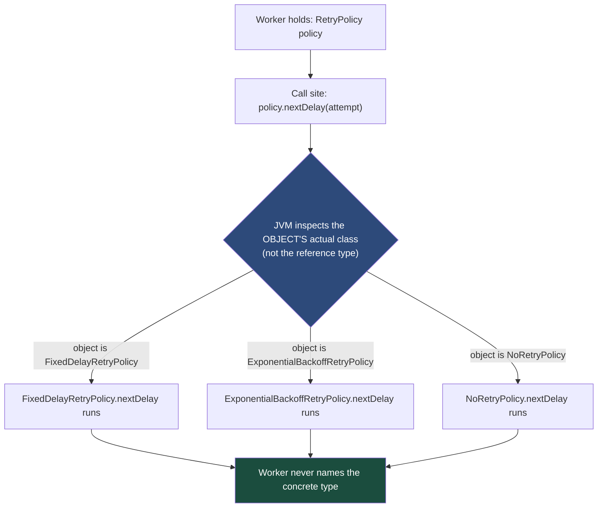
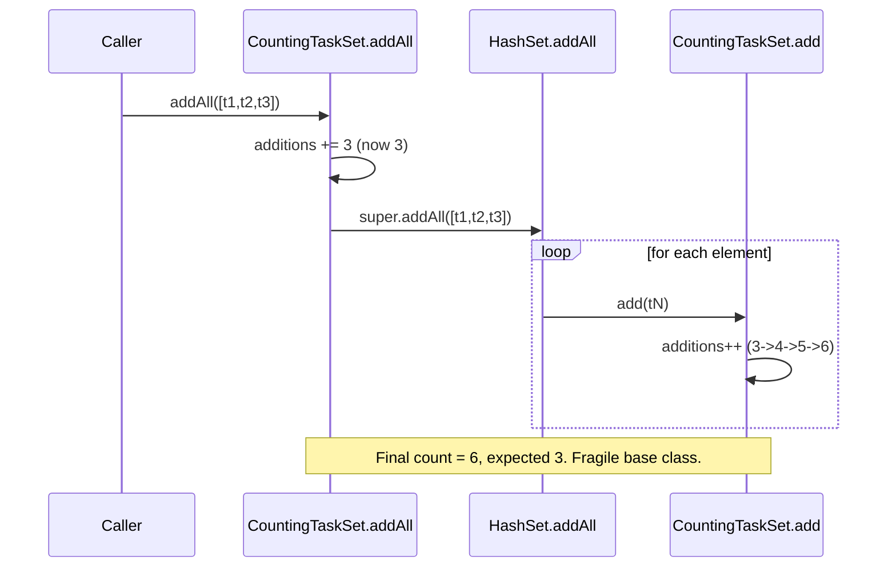
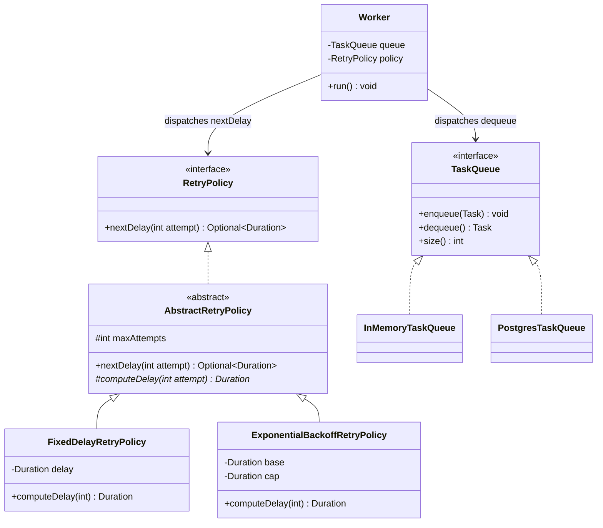

# Method Overriding (Runtime Polymorphism)

> Where this fits in the project: every pluggable piece of our platform — `RetryPolicy`, `TaskHandler`, `TaskQueue`, `DeadLetterQueue`, `RateLimiter` — works because the *same call site* (`policy.nextDelay(attempt)`, `queue.dequeue()`) routes to a *different implementation* at runtime depending on the concrete object behind the reference. That routing is **method overriding** and the **dynamic dispatch** that powers it. It is the single mechanism that lets us swap an `ExponentialBackoffRetryPolicy` for a `FixedDelayRetryPolicy`, or an `InMemoryTaskQueue` for a `PostgresTaskQueue`, without touching the `Worker` that calls them.

---

## 1. Why This Exists — The Real Problem

In [chapter-06-method-overloading.md](./chapter-06-method-overloading.md) the *compiler* picked the method from the static argument types. That is great for ergonomic APIs, but it cannot solve the problem at the heart of an extensible backend: **"I have a reference of a general type, I want behavior specific to the actual object, and I do not want to know which subtype it is."**

Concretely, our `Worker` holds a `RetryPolicy` field. When a task fails, the worker asks `policy.nextDelay(attempt)`. The worker must not contain an `if (policy instanceof ExponentialBackoffRetryPolicy) ... else if ...` ladder — that ladder would have to be edited every time we add a retry strategy, which violates the Open/Closed Principle and turns a one-line addition into a cross-cutting edit. Instead, the worker calls one method on the supertype, and the JVM, *at runtime*, dispatches to the override defined on the object's actual class.

Before OOP-style dispatch existed, C solved "different behavior behind one name" with **function pointers in structs** — you hand-built a vtable. Method overriding is that pattern promoted to a first-class language feature: the JVM maintains the vtable for you, and the `@Override`-annotated method on a subclass *replaces* the inherited one for any call made through any reference to that object.

The defining property: **the method that runs is determined by the object's runtime type, not the reference's compile-time type.** Overloading is decided at compile time by *argument* types; overriding is decided at run time by *receiver* type. Conflating the two is the most common Java interview failure, and we will pin the difference down immediately.



---

## 2. Overriding vs Overloading — Nail the Distinction First

Read this table once, slowly. Most overriding bugs are actually accidental *overloading* — you thought you replaced a method but you changed the signature and silently created a sibling instead.

| Aspect | Overriding | Overloading |
|---|---|---|
| Bound at | **Run time** (dynamic dispatch) | **Compile time** (static resolution) |
| Decided by | The **object's actual class** (receiver) | The **static types of the arguments** |
| Signature | **Same** name + same parameter types | Same name, **different** parameter list |
| Return type | Same, or a **covariant** (narrower) subtype | Irrelevant to resolution; cannot differ alone |
| Relationship | Across a **subtype/supertype** boundary | Within (or across) a class, same level |
| Access modifier | Cannot be **more restrictive** than the parent | Unconstrained |
| `throws` clause | Cannot add **new checked** exceptions | Unconstrained |
| Annotation | `@Override` (compiler-verified) | none |
| Polymorphism kind | **Runtime / subtype** polymorphism | **Compile-time / ad-hoc** polymorphism |

> Mnemonic: **Overr**iding happens at **r**untime (both have the `r`); over**l**oading is reso**l**ved by the compi**l**er. If the parameter list changed, you did **not** override — you overloaded, and `@Override` would have caught it. Always write `@Override`.

The deeper treatment of "one interface, many behaviors" lives in [chapter-09-polymorphism.md](./chapter-09-polymorphism.md); this chapter is the *mechanism* that makes that polymorphism work.

---

## 3. The Naive Version — First Cut, With Limitations

A learner new to Java, coming from procedural code, often "selects behavior" with a `type` field and a `switch`. Here is the retry decision written the wrong way — no overriding at all, just data-driven branching baked into the caller.

```java
// NAIVE: no overriding. One class, a "kind" tag, and a switch the Worker must know about.
import java.time.Duration;
import java.util.Optional;

public final class NaiveRetryPolicy {
    public enum Kind { FIXED, EXPONENTIAL, NONE }

    private final Kind kind;
    private final Duration base;

    public NaiveRetryPolicy(Kind kind, Duration base) {
        this.kind = kind;
        this.base = base;
    }

    public Optional<Duration> nextDelay(int attempt) {
        switch (kind) {                                   // the smell: behavior selected by data
            case FIXED:
                return Optional.of(base);
            case EXPONENTIAL:
                return Optional.of(base.multipliedBy(1L << attempt));  // base * 2^attempt
            case NONE:
                return Optional.empty();
            default:
                throw new IllegalStateException("unknown kind: " + kind);
        }
    }
}
```

What is wrong:

- **Open/Closed violation.** Adding "exponential backoff *with jitter*" means editing this class and its `switch`. Every new strategy reopens a tested file.
- **No type safety per strategy.** `base` is meaningless for `NONE`, yet it sits in every instance. The `EXPONENTIAL` case can overflow `1L << attempt` past attempt 63 with no compiler warning.
- **The caller leaks knowledge.** Anyone constructing a `NaiveRetryPolicy` must understand all kinds. There is no way to ship a *new* policy in a separate module without modifying this enum.
- **Untestable in isolation.** You cannot unit-test "exponential" without dragging the whole `switch` and enum along.

This is exactly the structure overriding is meant to dissolve.

---

## 4. Improved Version — Refactor Toward Overriding

Introduce the canonical `RetryPolicy` interface and let each strategy be its own class that **overrides** `nextDelay`. The `switch` evaporates; the `Worker` depends only on the interface.

```java
import java.time.Duration;
import java.util.Optional;

// The canonical contract from the SPEC.
public interface RetryPolicy {
    Optional<Duration> nextDelay(int attempt);  // empty => give up (route to DLQ)
}

public final class FixedDelayRetryPolicy implements RetryPolicy {
    private final Duration delay;
    private final int maxAttempts;

    public FixedDelayRetryPolicy(Duration delay, int maxAttempts) {
        this.delay = delay;
        this.maxAttempts = maxAttempts;
    }

    @Override                                            // compiler verifies we matched the contract
    public Optional<Duration> nextDelay(int attempt) {
        if (attempt >= maxAttempts) return Optional.empty();
        return Optional.of(delay);
    }
}

public final class ExponentialBackoffRetryPolicy implements RetryPolicy {
    private final Duration base;
    private final int maxAttempts;

    public ExponentialBackoffRetryPolicy(Duration base, int maxAttempts) {
        this.base = base;
        this.maxAttempts = maxAttempts;
    }

    @Override
    public Optional<Duration> nextDelay(int attempt) {
        if (attempt >= maxAttempts) return Optional.empty();
        long factor = 1L << Math.min(attempt, 30);       // cap shift to avoid overflow
        return Optional.of(base.multipliedBy(factor));
    }
}
```

Now adding a new strategy is a *new file*, never an edit to an existing one. The `Worker` does this and only this:

```java
Optional<Duration> delay = policy.nextDelay(task.attempts());   // dynamic dispatch
if (delay.isPresent()) {
    scheduler.schedule(task, delay.get());                      // retry later
} else {
    deadLetterQueue.send(task, "max attempts exhausted");       // give up
}
```

The improvement is real but two production concerns remain: exponential backoff without **jitter** causes retry storms (thundering herd) when many tasks fail simultaneously, and we have not bounded the maximum delay. We fix both next.

---

## 5. Production-Quality Version — What a Staff Engineer Ships

The production override adds **decorrelated jitter** (spreads retries randomly so a thousand simultaneous failures do not all retry at the same instant), a **delay cap**, and careful use of `@Override`, `final`, and a documented contract. We also show calling **`super`** correctly via an abstract base that holds shared `maxAttempts` logic — demonstrating cooperative overriding rather than copy-paste.

```java
import java.time.Duration;
import java.util.Optional;
import java.util.concurrent.ThreadLocalRandom;

/**
 * Shared base: owns the "are we out of attempts?" decision so every policy
 * answers it identically. Subclasses override only the delay computation.
 */
public abstract class AbstractRetryPolicy implements RetryPolicy {
    protected final int maxAttempts;

    protected AbstractRetryPolicy(int maxAttempts) {
        if (maxAttempts < 1) throw new IllegalArgumentException("maxAttempts >= 1");
        this.maxAttempts = maxAttempts;
    }

    // Template method: stable across all subclasses; NOT meant to be overridden.
    @Override
    public final Optional<Duration> nextDelay(int attempt) {
        if (attempt >= maxAttempts) return Optional.empty();   // exhausted -> DLQ
        return Optional.of(computeDelay(attempt));             // subclass decides "how long"
    }

    // The single extension point each policy MUST override.
    protected abstract Duration computeDelay(int attempt);
}

public final class FixedDelayRetryPolicy extends AbstractRetryPolicy {
    private final Duration delay;

    public FixedDelayRetryPolicy(Duration delay, int maxAttempts) {
        super(maxAttempts);                                   // call super constructor
        this.delay = delay;
    }

    @Override
    protected Duration computeDelay(int attempt) {
        return delay;
    }
}

public final class ExponentialBackoffRetryPolicy extends AbstractRetryPolicy {
    private final Duration base;
    private final Duration cap;

    public ExponentialBackoffRetryPolicy(Duration base, Duration cap, int maxAttempts) {
        super(maxAttempts);
        this.base = base;
        this.cap = cap;
    }

    @Override
    protected Duration computeDelay(int attempt) {
        long shift = Math.min(attempt, 30);                   // overflow guard
        long exp   = base.toMillis() * (1L << shift);         // base * 2^attempt
        long ceil  = Math.min(exp, cap.toMillis());           // bound the growth
        // Decorrelated jitter in [0, ceil]: spreads simultaneous retries.
        long jittered = ThreadLocalRandom.current().nextLong(ceil + 1);
        return Duration.ofMillis(jittered);
    }
}
```

Why this is the version to ship:

- **`final` on `nextDelay`** locks the "exhausted-vs-retry" decision so a subclass cannot accidentally forget to check `maxAttempts`. Subclasses override only `computeDelay`. This is the Template Method pattern ([template-method.md](../05-design-patterns/template-method.md)) realized through overriding.
- **Jitter** is the difference between a graceful recovery and a self-inflicted DDoS. See [retries.md](../08-distributed-systems/retries.md) for the distributed reasoning.
- **`super(maxAttempts)`** runs the base validation exactly once, in one place — no duplicated `if (maxAttempts < 1)` per subclass.
- Every overriding method carries **`@Override`**, so a typo like `computeDelay(long attempt)` fails the build instead of silently becoming an unused overload.

---

## 6. Code Walkthrough — Three Levels

### 6a. Beginner: dynamic dispatch in two lines

The whole concept in miniature. Note the reference type is `RetryPolicy`, but the *object* decides the method.

```java
RetryPolicy policy = new FixedDelayRetryPolicy(Duration.ofSeconds(2), 3);
System.out.println(policy.nextDelay(0));   // Optional[PT2S] -> FixedDelay's override runs

policy = new ExponentialBackoffRetryPolicy(Duration.ofMillis(100), Duration.ofSeconds(30), 5);
System.out.println(policy.nextDelay(3));   // Optional[PT0.x S] -> Exponential's override runs
```

The variable `policy` never changed its declared type, yet the method that executes changed. That is overriding.

### 6b. Intermediate: `super`, covariant returns, and `@Override`

Here a specialized handler **calls the parent's implementation** with `super`, then adds behavior — the cooperative pattern. It also shows a **covariant return**: an override may return a *narrower* type than the parent declared.

```java
// Base handler returns a TaskResult; logs and runs.
public class LoggingTaskHandler implements TaskHandler {
    @Override
    public TaskResult handle(Task task) throws Exception {
        System.out.println("handling " + task.id() + " type=" + task.type());
        return new TaskResult(true, "noop", false);
    }
}

// A handler that wraps another and ADDS timing, reusing the parent via super.
public class AuditingTaskHandler extends LoggingTaskHandler {
    private final MetricsCollector metrics;

    public AuditingTaskHandler(MetricsCollector metrics) { this.metrics = metrics; }

    @Override
    public TaskResult handle(Task task) throws Exception {
        long start = System.nanoTime();
        TaskResult base = super.handle(task);              // delegate to parent, then augment
        metrics.recordLatency(task.type(), System.nanoTime() - start);
        return base;
    }
}
```

Covariant returns let an override tighten the return type. The classic example is `clone()`, but it shows up in our queue factory hierarchy:

```java
class QueueFactory {
    TaskQueue create() { return new InMemoryTaskQueue(); }
}
class PersistentQueueFactory extends QueueFactory {
    @Override
    PostgresTaskQueue create() {        // covariant: PostgresTaskQueue <: TaskQueue (legal)
        return new PostgresTaskQueue();
    }
}
```

Callers using `QueueFactory` still get a `TaskQueue`; callers using `PersistentQueueFactory` get the precise `PostgresTaskQueue` without a cast. The override returns a subtype of the declared return — **covariance is allowed; contravariance of return is not.**

### 6c. Production-inspired: overriding `dequeue` across queue backends

Our `TaskQueue` contract (from the SPEC) has `enqueue`, `dequeue` (which `throws InterruptedException`), and `size`. Two backends override these with very different mechanics, but the `Worker` calling `queue.dequeue()` is oblivious. This is the payoff of overriding for our pluggable architecture (see [blocking-queue.md](../06-concurrency/blocking-queue.md)).

```java
import java.util.List;
import java.util.concurrent.BlockingQueue;
import java.util.concurrent.LinkedBlockingQueue;

public interface TaskQueue {
    void enqueue(Task t);
    Task dequeue() throws InterruptedException;            // blocking by contract
    int size();
}

// Phase 1: in-memory, backed by a BlockingQueue.
public final class InMemoryTaskQueue implements TaskQueue {
    private final BlockingQueue<Task> q = new LinkedBlockingQueue<>();

    @Override public void enqueue(Task t) { q.add(t); }

    @Override
    public Task dequeue() throws InterruptedException {
        return q.take();                                  // blocks until an element is available
    }

    @Override public int size() { return q.size(); }
}

// Phase 2: PostgreSQL-backed. Same interface, completely different override body.
public final class PostgresTaskQueue implements TaskQueue {
    private final TaskRepository repo;

    public PostgresTaskQueue(TaskRepository repo) { this.repo = repo; }

    @Override public void enqueue(Task t) { repo.save(t); }

    @Override
    public Task dequeue() throws InterruptedException {
        // Poll the DB for due tasks; sleep-and-retry if none (simplified).
        while (true) {
            List<Task> due = repo.pollDue(1);             // SELECT ... FOR UPDATE SKIP LOCKED
            if (!due.isEmpty()) return due.get(0);
            Thread.sleep(50);                             // honors the InterruptedException contract
        }
    }

    @Override public int size() { return repo.pollDue(Integer.MAX_VALUE).size(); }
}
```

The `Worker` body is identical regardless of backend:

```java
Task t = queue.dequeue();   // dispatches to InMemory.take() OR Postgres.pollDue() — Worker can't tell
```

That single line working across both backends *is* runtime polymorphism, delivered by overriding.

---

## 7. Overriding `equals`, `hashCode`, and `toString` Correctly

`java.lang.Object` ships default `equals`, `hashCode`, and `toString`. The defaults are identity-based and almost always wrong for domain types. Overriding them correctly is non-negotiable because `HashMap`, `HashSet`, deduplication, and idempotency all depend on the contracts.

### The `equals` contract (must hold or collections silently break)

For non-null references, `equals` must be:

- **Reflexive:** `x.equals(x)` is true.
- **Symmetric:** `x.equals(y) == y.equals(x)`.
- **Transitive:** if `x.equals(y)` and `y.equals(z)` then `x.equals(z)`.
- **Consistent:** repeated calls return the same result if the objects do not change.
- **`x.equals(null)` is false.**

### The `hashCode` contract (the one people forget)

> If `a.equals(b)` is true, then `a.hashCode() == b.hashCode()` **must** be true. (The converse is not required: unequal objects *may* share a hash code — that is a collision, not a bug.)

Break this and a `HashSet<Task>` can contain two "equal" tasks, or `map.get(key)` returns `null` for a key that is logically present. Here is a correct, hand-written override for `Task` keyed on its id (the domain identity), followed by the modern `record` form.

```java
import java.time.Instant;
import java.util.Objects;

public final class Task {
    private final String id;        // UUID: the identity
    private final String type;
    private final String payload;
    private final TaskStatus status;
    private final int attempts;
    private final int maxAttempts;
    private final Instant createdAt;
    private final Instant scheduledAt;
    private final int priority;

    // ... constructor + getters omitted ...

    @Override
    public boolean equals(Object o) {
        if (this == o) return true;                       // fast path: same reference
        if (!(o instanceof Task other)) return false;     // pattern-match instanceof (Java 16+)
        return id.equals(other.id);                       // identity is the id alone
    }

    @Override
    public int hashCode() {
        return Objects.hash(id);                           // MUST agree with equals's fields
    }

    @Override
    public String toString() {
        return "Task[id=%s, type=%s, status=%s, attempt=%d/%d]"
            .formatted(id, type, status, attempts, maxAttempts);   // no payload here
    }
}
```

The same domain object as a **record** generates `equals`, `hashCode`, and `toString` from *all* components automatically — but that is "value equality over every field," which is not always what you want for an entity with identity:

```java
public record Task(String id, String type, String payload, TaskStatus status,
                   int attempts, int maxAttempts, Instant createdAt,
                   Instant scheduledAt, int priority) {
    // A record auto-overrides equals/hashCode/toString across ALL components.
    // For id-only identity, override equals/hashCode explicitly (records allow it):
    @Override public boolean equals(Object o) {
        return o instanceof Task t && id.equals(t.id);
    }
    @Override public int hashCode() { return id.hashCode(); }
}
```

> Rule of thumb for our project: a `Task` is an **entity** identified by its UUID `id`, so `equals`/`hashCode` use the id only. A `TaskResult` is a **value object** — every field matters — so the record's all-field default is exactly right and we override nothing.

### The `equals` symmetry trap with inheritance

A subclass that adds fields and tries to include them in `equals` *breaks symmetry* with the parent. If `ColoredPoint extends Point` and `coloredPoint.equals(point)` is false but `point.equals(coloredPoint)` is true, the contract is violated and collections misbehave. The two safe escapes:

1. **Favor composition over inheritance** ([chapter-17-composition-vs-inheritance.md](./chapter-17-composition-vs-inheritance.md)) — make the subclass *hold* a `Point` instead of extending it.
2. **Use `getClass()` comparison instead of `instanceof`** when subclasses must not be equal to their parents:

```java
@Override
public boolean equals(Object o) {
    if (this == o) return true;
    if (o == null || getClass() != o.getClass()) return false;  // exact-class equality
    Task other = (Task) o;
    return id.equals(other.id);
}
```

`getClass()` enforces "same exact class to be equal" (kills symmetry violations but also kills equality across subtypes); `instanceof` is more permissive but demands you *never* add equality-relevant fields in subclasses. Pick deliberately; for `final` domain classes like our `Task` it is moot — there are no subclasses.

---

## 8. The Fragile Base Class Problem

Overriding's superpower — a subclass silently changing what an inherited method does — is also its sharpest hazard. A **fragile base class** is a superclass whose internal, self-calling behavior makes innocent subclasses break when the base changes, or makes the base break when subclasses override the "wrong" method.

The canonical demonstration is a "counting" set that miscounts because the base class's `addAll` internally calls `add`, and the subclass overrode both:

```java
import java.util.Collection;
import java.util.HashSet;

// FRAGILE: assumes addAll does NOT call add internally. That assumption is undocumented.
public class CountingTaskSet<E> extends HashSet<E> {
    private int additions = 0;

    @Override
    public boolean add(E e) {
        additions++;
        return super.add(e);
    }

    @Override
    public boolean addAll(Collection<? extends E> c) {
        additions += c.size();
        return super.addAll(c);          // HashSet.addAll internally calls add() per element!
    }

    public int additions() { return additions; }
}
```

Add three tasks via `addAll` and `additions` becomes **6**, not 3: `addAll` counts 3, then delegates to `super.addAll`, which calls the overridden `add` three more times. The subclass was correct in isolation; the bug is the *self-use* of the base class, which is an implementation detail the subclass was forced to know.



**Defenses, in order of preference:**

1. **Composition over inheritance.** Wrap the set instead of extending it; you only count where *you* call `add`, immune to the base's self-use. This is Effective Java's headline advice and the reason our project prefers `final` classes that delegate.
2. **Design for inheritance or prohibit it.** Make the base `final`, or document precisely which methods are self-called (Java's `@implSpec`), so overriders know the contract.
3. **Avoid overriding self-used methods.** If you must extend, override only methods the base does not call internally.

In our codebase, `InMemoryTaskQueue`, `FixedDelayRetryPolicy`, and `ExponentialBackoffRetryPolicy` are all `final` precisely to forbid fragile subclassing. The one place we *do* allow extension — `AbstractRetryPolicy` — is engineered for it: the self-used method (`nextDelay`) is `final`, and the extension point (`computeDelay`) is `abstract` and never self-called.

---

## 9. How This Applies to Our Task Queue Project



Overriding is the connective tissue of the whole platform:

- **`RetryPolicy.nextDelay`** — each strategy overrides it; `Worker` calls one method and gets strategy-appropriate delays. New strategies (`DecorrelatedJitterPolicy`, `NoRetryPolicy`) drop in without editing `Worker`.
- **`TaskHandler.handle`** — every task type (email, image-resize, webhook) overrides `handle`. The `Worker` looks up a handler by `task.type()` and calls `handle` polymorphically (see [chapter-08-functional-interfaces.md](../01-java-fundamentals/chapter-08-functional-interfaces.md), since `TaskHandler` is a functional interface).
- **`TaskQueue.dequeue`** — `InMemoryTaskQueue` (Phase 1), `PostgresTaskQueue` (Phase 2), and a distributed broker (Phase 4) each override it; the worker pool is unchanged across phases (see [phase-1.md](../09-project/phase-1.md)).
- **`DeadLetterQueue.send`**, **`RateLimiter.tryAcquire`**, **`TaskScheduler.schedule`** — all single-method contracts whose implementations override one method, enabling the Strategy pattern ([strategy.md](../05-design-patterns/strategy.md)).
- **`Task.equals`/`hashCode`** — override correctly or deduplication and idempotency keys break (the foundation of [idempotency.md](../08-distributed-systems/idempotency.md)).
- **`toString`** on `Task` and `TaskResult` — override for readable logs without leaking the `payload`.

---

## 10. Tradeoffs

| Decision | Pro | Con | When to choose |
|---|---|---|---|
| Override via interface (Strategy) | Open/Closed; testable; pluggable | One class per behavior; indirection | Behavior varies and grows (retry, queue, handler) |
| Override via abstract base + template method | Shares stable logic; one extension point | Inheritance coupling; fragile-base risk | A fixed algorithm with one varying step |
| `instanceof` + `switch` (no override) | All logic visible in one place | Open/Closed violation; edits ripple | Closed, small, rarely-changing set of cases |
| `record` auto `equals`/`hashCode` | Zero boilerplate, correct by construction | Value equality over *all* fields | Immutable value objects (`TaskResult`) |
| Hand-written `equals` on id only | Entity identity semantics | Must keep `hashCode` in sync | Entities (`Task`) keyed by UUID |
| `getClass()` equality | Symmetric across subclasses | No equality across subtypes | Class hierarchies that must not cross-equal |
| `instanceof` equality | Allows subtype equality | Breaks if subclass adds eq fields | `final` classes or no eq-relevant subfields |

The honest summary: overriding buys extensibility at the cost of indirection. For a backend whose whole reason to exist is swappable strategies and backends, that trade is overwhelmingly worth it — which is why every core contract in the SPEC is an interface.

---

## 11. Common Mistakes and Pitfalls

- **Accidental overloading instead of overriding.** You write `public Optional<Duration> nextDelay(Integer attempt)` (boxed) and think you overrode `nextDelay(int)`. You created a sibling. *Fix:* always annotate with `@Override`; it fails the build.
- **Forgetting `hashCode` when overriding `equals`.** Equal objects with different hashes vanish in `HashSet`/`HashMap`. *Fix:* override both, over the same fields; consider a `record`.
- **Narrowing access in an override.** Overriding a `public` method as `protected` is a compile error; an override may only *widen* access. *Fix:* keep it at least as accessible.
- **Adding new checked exceptions in an override.** An override of `dequeue()` cannot declare `throws SQLException` if the parent only declares `throws InterruptedException`. *Fix:* wrap in an unchecked exception or one the parent already declares.
- **Overriding self-used methods on a non-`final` base (fragile base class).** *Fix:* prefer composition; make leaf classes `final`.
- **Calling an overridable method from a constructor.** The subclass override runs *before* the subclass's fields are initialized, seeing `null`/`0`. *Fix:* never call overridable methods from constructors; make such methods `final` or `private`.
- **Covariant *parameters* (they do not exist).** Changing a parameter type to a subtype creates an overload, not an override. Only *return* types are covariant.
- **Calling `super.method()` when you meant to replace it (or forgetting it when you meant to extend).** Decide deliberately: replace vs augment.
- **Static methods are *hidden*, not overridden.** A `static` method in a subclass with the same signature *hides* the parent's; dispatch is by reference type, not object type. *Fix:* do not rely on polymorphism for statics; `@Override` is illegal on a hidden static.

---

## 12. Refactoring Exercise — Bad → Improved → Production

**Bad:** a `Worker` that selects retry behavior with a `switch`, mirroring Section 3's smell at the call site.

```java
// BAD: the Worker knows every retry strategy. Open/Closed violated.
void handleFailure(Task task, String policyKind) {
    Duration delay;
    switch (policyKind) {
        case "fixed":       delay = Duration.ofSeconds(2); break;
        case "exponential": delay = Duration.ofMillis(100L << task.attempts()); break;
        default: throw new IllegalArgumentException(policyKind);
    }
    if (task.attempts() < task.maxAttempts()) scheduler.schedule(task, delay);
    else dlq.send(task, "exhausted");
}
```

**Improved:** depend on the `RetryPolicy` interface; let overriding choose the delay.

```java
// IMPROVED: Worker depends on the interface; strategy chosen by dynamic dispatch.
private final RetryPolicy policy;

void handleFailure(Task task) {
    policy.nextDelay(task.attempts())
          .ifPresentOrElse(
              delay -> scheduler.schedule(task, delay),
              ()    -> dlq.send(task, "max attempts exhausted"));
}
```

**Production:** inject the policy, make leaf policies `final`, add jitter + cap via the `AbstractRetryPolicy` base from Section 5, and unit-test each override in isolation.

```java
// PRODUCTION: constructor-injected, immutable, observable.
public final class Worker implements Runnable {
    private final TaskQueue queue;
    private final RetryPolicy policy;             // any override, injected
    private final TaskScheduler scheduler;
    private final DeadLetterQueue dlq;
    private final MetricsCollector metrics;

    public Worker(TaskQueue queue, RetryPolicy policy, TaskScheduler scheduler,
                  DeadLetterQueue dlq, MetricsCollector metrics) {
        this.queue = queue; this.policy = policy; this.scheduler = scheduler;
        this.dlq = dlq; this.metrics = metrics;
    }

    void handleFailure(Task task) {
        policy.nextDelay(task.attempts()).ifPresentOrElse(
            delay -> { metrics.increment("task.retry"); scheduler.schedule(task, delay); },
            ()    -> { metrics.increment("task.dead");  dlq.send(task, "max attempts exhausted"); });
    }

    @Override public void run() { /* dequeue loop omitted */ }
}
```

The `Worker` no longer names any concrete policy. Swapping fixed for exponential-with-jitter is a *wiring* change, not a code change.

---

## 13. Exercises

### Easy

1. **Knowledge check.** A reference is declared `RetryPolicy p` but holds an `ExponentialBackoffRetryPolicy`. Which `nextDelay` runs, and *why* — compile-time or run-time decision?
2. **Coding.** Write a `NoRetryPolicy implements RetryPolicy` whose `nextDelay` always returns `Optional.empty()`. Add `@Override`.

### Medium

3. **Coding.** Override `equals`, `hashCode`, and `toString` on a `Task` class (non-record) using id-only identity. Then write a JUnit 5 + AssertJ test proving two `Task`s with the same id but different `status` are equal *and* share a hash code, and that a `HashSet` of them has size 1.
4. **Refactoring.** Take the fragile `CountingTaskSet` from Section 8 and rewrite it with composition so `addAll` counts correctly. Prove the count is 3, not 6.

### Hard

5. **Design.** Design an `AbstractRetryPolicy` (template method) where the `final` `nextDelay` owns the attempt-exhaustion check and an `abstract computeDelay` is the only override point. Add a `DecorrelatedJitterPolicy` subclass. Explain how this prevents a fragile base class.
6. **Interview-style.** Explain why calling an overridable method from a constructor is dangerous, and demonstrate the bug with a minimal `Worker`/`InstrumentedWorker` pair.
7. **Stretch.** Implement covariant returns: a `QueueFactory.create()` returning `TaskQueue` and a `PersistentQueueFactory` override returning `PostgresTaskQueue`. Show a caller obtaining the precise type without a cast.

---

## 14. Solutions

**Solution 1.** `ExponentialBackoffRetryPolicy.nextDelay` runs. The decision is made at **run time** by the object's actual class (dynamic dispatch), not by the `RetryPolicy` reference type. Overriding is bound at runtime; only the *receiver's* class matters.

**Solution 2.**

```java
import java.time.Duration;
import java.util.Optional;

public final class NoRetryPolicy implements RetryPolicy {
    @Override
    public Optional<Duration> nextDelay(int attempt) {
        return Optional.empty();          // never retry; always route to DLQ
    }
}
```

**Solution 3.**

```java
import java.util.Objects;

public final class Task {
    private final String id;
    private final TaskStatus status;
    public Task(String id, TaskStatus status) { this.id = id; this.status = status; }
    public String id() { return id; }
    public TaskStatus status() { return status; }

    @Override public boolean equals(Object o) {
        if (this == o) return true;
        if (!(o instanceof Task t)) return false;
        return id.equals(t.id);                          // id-only identity
    }
    @Override public int hashCode() { return Objects.hash(id); }
    @Override public String toString() {
        return "Task[id=%s, status=%s]".formatted(id, status);
    }
}
```

```java
import org.junit.jupiter.api.Test;
import java.util.HashSet;
import java.util.Set;
import static org.assertj.core.api.Assertions.assertThat;

class TaskEqualityTest {
    @Test
    void sameIdDifferentStatusAreEqualAndDedup() {
        Task a = new Task("uuid-1", TaskStatus.PENDING);
        Task b = new Task("uuid-1", TaskStatus.RUNNING);   // same id, different status

        assertThat(a).isEqualTo(b);                        // equals via id
        assertThat(a.hashCode()).isEqualTo(b.hashCode());  // hashCode agrees

        Set<Task> set = new HashSet<>();
        set.add(a); set.add(b);
        assertThat(set).hasSize(1);                        // deduplicated by id
    }
}
```

**Solution 4.** Composition fixes the fragile base class because we never inherit the base's self-use of `add`.

```java
import java.util.Collection;
import java.util.HashSet;
import java.util.Set;

public final class CountingTaskSet<E> {
    private final Set<E> delegate = new HashSet<>();      // HAS-A, not IS-A
    private int additions = 0;

    public boolean add(E e) { additions++; return delegate.add(e); }

    public boolean addAll(Collection<? extends E> c) {
        boolean changed = false;
        for (E e : c) changed |= add(e);                 // we control every count, once
        return changed;
    }
    public int additions() { return additions; }
    public int size() { return delegate.size(); }
}
```

```java
import org.junit.jupiter.api.Test;
import java.util.List;
import static org.assertj.core.api.Assertions.assertThat;

class CountingTaskSetTest {
    @Test void addAllCountsEachElementOnce() {
        CountingTaskSet<String> set = new CountingTaskSet<>();
        set.addAll(List.of("t1", "t2", "t3"));
        assertThat(set.additions()).isEqualTo(3);        // not 6
    }
}
```

**Solution 5.**

```java
import java.time.Duration;
import java.util.Optional;
import java.util.concurrent.ThreadLocalRandom;

public abstract class AbstractRetryPolicy implements RetryPolicy {
    protected final int maxAttempts;
    protected AbstractRetryPolicy(int maxAttempts) { this.maxAttempts = maxAttempts; }

    @Override
    public final Optional<Duration> nextDelay(int attempt) {   // FINAL: self-used logic locked
        if (attempt >= maxAttempts) return Optional.empty();
        return Optional.of(computeDelay(attempt));
    }
    protected abstract Duration computeDelay(int attempt);      // sole override point
}

public final class DecorrelatedJitterPolicy extends AbstractRetryPolicy {
    private final Duration base;
    private final Duration cap;
    public DecorrelatedJitterPolicy(Duration base, Duration cap, int maxAttempts) {
        super(maxAttempts); this.base = base; this.cap = cap;
    }
    @Override
    protected Duration computeDelay(int attempt) {
        long exp  = base.toMillis() * (1L << Math.min(attempt, 30));
        long ceil = Math.min(exp, cap.toMillis());
        return Duration.ofMillis(ThreadLocalRandom.current().nextLong(ceil + 1));
    }
}
```

It prevents a fragile base class because the only method the base calls on itself, `nextDelay`, is `final` (no subclass can change the exhaustion check), and `computeDelay` is `abstract` and never self-called — so a subclass override cannot break the base's internal contract.

**Solution 6.** Calling an overridable method from a constructor lets the *subclass* override run before the subclass's fields are initialized, observing default values.

```java
class Worker {
    Worker() { init(); }                 // calls overridable method during construction
    void init() { System.out.println("base init"); }
}
class InstrumentedWorker extends Worker {
    private final String name = "metrics-worker";   // set AFTER super() returns
    @Override void init() {
        System.out.println("init sees name=" + name);   // prints null! field not yet assigned
    }
}
// new InstrumentedWorker() -> "init sees name=null"
```

The base constructor runs `init()` before `name` is assigned, so the override sees `null`. *Fix:* make `init` `final` or `private`, or do the work after construction.

**Solution 7.**

```java
class QueueFactory {
    TaskQueue create() { return new InMemoryTaskQueue(); }
}
class PersistentQueueFactory extends QueueFactory {
    @Override
    PostgresTaskQueue create() { return new PostgresTaskQueue(/* repo */ null); }  // covariant
}

PersistentQueueFactory f = new PersistentQueueFactory();
PostgresTaskQueue pg = f.create();   // precise type, NO cast — covariant return at work
```

---

## 15. Interview Questions and Takeaways

1. **What is the difference between overriding and overloading?**
   Overriding replaces a supertype method with a subtype implementation, bound at **run time** by the object's actual class. Overloading provides multiple same-named methods with different parameter lists, resolved at **compile time** by the static argument types.

2. **When is `@Override` required, and what does it buy you?**
   Never strictly required, but always recommended. It makes the compiler verify you actually matched a supertype signature; a typo that would silently create an overload becomes a build error.

3. **Why must you override `hashCode` whenever you override `equals`?**
   Because the contract demands equal objects have equal hash codes. Violating it makes hash-based collections lose elements or fail lookups for keys that are logically present.

4. **What is a covariant return type?**
   An override may return a *subtype* of the supertype's declared return type. Parameters cannot be covariant (that creates an overload); only returns can.

5. **What is the fragile base class problem?**
   When a superclass's internal self-use of its own overridable methods causes subclasses to break (or vice versa). The defense is composition over inheritance, or designing the base for extension with `final` self-used methods and documented extension points.

6. **Why is calling an overridable method from a constructor dangerous?**
   The subclass override runs before the subclass's fields are initialized, so it observes uninitialized (`null`/`0`) state. Make such methods `final` or `private`.

7. **Can an override throw broader exceptions or have narrower visibility?**
   No. An override cannot declare new *checked* exceptions beyond the parent's, and cannot reduce visibility — it may only keep or widen access.

8. **Are static methods overridden?**
   No — they are *hidden*. Dispatch for statics is by reference type, not object type, so they are not polymorphic.

**Takeaways:** overriding = runtime dispatch on the receiver's class; always use `@Override`; keep `equals`/`hashCode`/`toString` correct and in sync; prefer composition to dodge fragile base classes; never call overridable methods from constructors.

---

## 14b. Production Considerations

- **Megamorphic call sites hurt the JIT.** A call site that sees one or two implementing classes is *monomorphic/bimorphic* and the JIT inlines it cheaply. A site that sees many (megamorphic) — e.g., a `TaskHandler.handle` dispatch over dozens of task types — cannot be inlined and pays a vtable lookup. At our throughput this is usually negligible, but profile hot dispatch paths; if one type dominates 99% of calls, the JIT optimizes for it via a guarded inline.
- **`equals`/`hashCode` correctness is a *correctness* property, not a perf one.** A broken `hashCode` in `Task` surfaces as *lost tasks* or *duplicate processing* — silent, intermittent, and brutal to debug. Add a property-based test asserting the contract before this ships.
- **Logging via `toString`.** Make sure overridden `toString` on `Task` never logs the raw `payload` (may contain PII or secrets). Log id, type, status, attempt counts only.
- **Override consistency across phases.** When `PostgresTaskQueue.dequeue` replaces `InMemoryTaskQueue.dequeue`, integration tests (Testcontainers) must assert the *same observable contract* — blocking semantics, ordering by priority, interrupt handling — so the polymorphic swap is truly transparent to the worker pool.
- **Mocking overrides in tests.** Mockito stubs work by creating a subclass and overriding methods; `final` classes/methods are unmockable without `mockito-inline`. Decide early whether a class is `final` for safety or open for mocking.

---

## What We Can Improve In Our Project Using This Concept

Today our Phase 1 `RetryPolicy` implementations duplicate the `attempt >= maxAttempts` exhaustion check. We can introduce an `AbstractRetryPolicy` template-method base whose `final nextDelay` owns that check and exposes a single `abstract computeDelay` override point, then reimplement `FixedDelayRetryPolicy` and `ExponentialBackoffRetryPolicy` on top of it and add decorrelated jitter and a delay cap to the exponential one. We can also harden domain identity by overriding `equals`/`hashCode` on `Task` to be id-only and `toString` to be log-safe, and mark all leaf policy and queue classes `final` to forbid fragile subclassing.

## Project Refactoring Task

1. Add `abstract class AbstractRetryPolicy implements RetryPolicy` with `final nextDelay(int)` and `abstract Duration computeDelay(int)`.
2. Reimplement `FixedDelayRetryPolicy` and `ExponentialBackoffRetryPolicy` to `extend AbstractRetryPolicy`; add jitter + cap to the exponential one; make both `final`.
3. Override `equals` (id-only), `hashCode`, and a log-safe `toString` on `Task`.
4. Mark `InMemoryTaskQueue` `final`; confirm `dequeue`/`enqueue`/`size` carry `@Override`.
5. Add JUnit 5 + AssertJ tests: each policy's `computeDelay` in isolation; the `equals`/`hashCode` contract and `HashSet` dedup; a test asserting the exponential delay never exceeds the cap.

## Git Commit For This Chapter

```text
refactor(retry): template-method RetryPolicy base + correct Task identity

- Add AbstractRetryPolicy with final nextDelay (exhaustion check) + abstract computeDelay
- Reimplement Fixed/Exponential policies on the base; add jitter + delay cap; make final
- Override Task.equals/hashCode (id-only) and log-safe toString
- Mark InMemoryTaskQueue final; verify @Override on TaskQueue methods
- Tests: per-policy computeDelay, cap bound, equals/hashCode contract + HashSet dedup

Files touched:
  src/main/java/.../retry/AbstractRetryPolicy.java
  src/main/java/.../retry/FixedDelayRetryPolicy.java
  src/main/java/.../retry/ExponentialBackoffRetryPolicy.java
  src/main/java/.../model/Task.java
  src/main/java/.../queue/InMemoryTaskQueue.java
  src/test/java/.../retry/RetryPolicyTest.java
  src/test/java/.../model/TaskEqualityTest.java
```

## Architecture Impact

Overriding is the load-bearing mechanism of our extensibility story. It lets `Worker` and `WorkerPool` depend on the `RetryPolicy`, `TaskQueue`, `TaskHandler`, `DeadLetterQueue`, and `RateLimiter` *abstractions* while concrete implementations are wired in at the edges — the foundation for the Strategy ([strategy.md](../05-design-patterns/strategy.md)) and Template Method ([template-method.md](../05-design-patterns/template-method.md)) patterns and for swapping queue backends across Phases 1→4 with zero worker changes. The discipline this chapter imposes — `@Override` everywhere, `final` leaf classes, correct `equals`/`hashCode`, no overridable calls in constructors — keeps that dynamic dispatch safe and prevents fragile-base-class regressions as the hierarchy grows.

## Interview Takeaways

- Overriding is **runtime** dispatch on the object's actual class; overloading is **compile-time** resolution on static argument types. Never conflate them — and always write `@Override`.
- Override `equals` and `hashCode` **together**, over the same fields; entities use id-only identity, value objects (records) use all-field equality.
- Returns can be **covariant**; parameters cannot. Overrides cannot narrow access or add new checked exceptions.
- The **fragile base class** problem is the dark side of overriding; defend with composition, `final` leaf classes, and template-method bases whose self-used methods are `final`.

> Next: [chapter-08-inheritance.md](./chapter-08-inheritance.md) zooms out from the dispatch mechanism to the `is-a` relationship itself — when inheritance earns its keep and when [composition](./chapter-17-composition-vs-inheritance.md) is the better tool.
