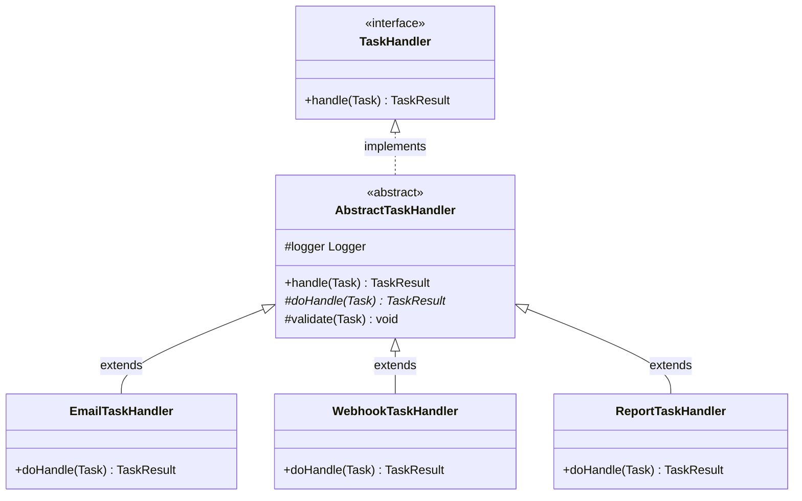
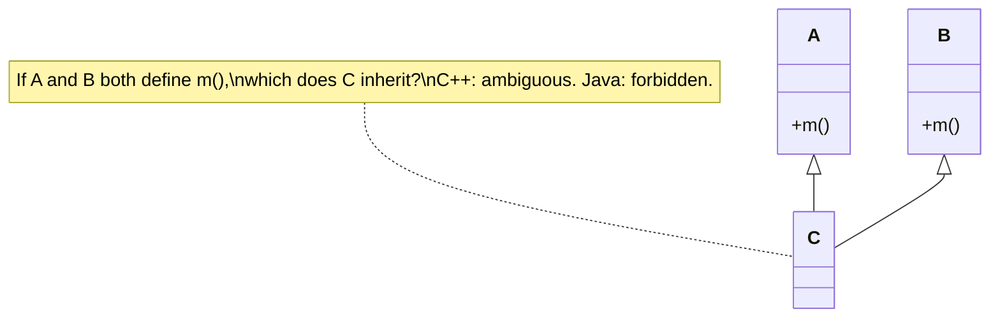

# Inheritance

> Where this fits: our Task Queue grows a family of task handlers — `EmailTaskHandler`, `WebhookTaskHandler`, `ReportTaskHandler` — that all share boilerplate (timing, attempt bookkeeping, defensive logging) but differ in one method: the actual work. Inheritance lets us hoist that shared scaffolding into an `AbstractTaskHandler` base so each concrete handler writes only its unique logic. This chapter teaches `extends`, constructor chaining, the IS-A test, `protected`, the single-inheritance (diamond) limitation, and — crucially — when inheritance is the *wrong* tool.

The previous two chapters were about *method* mechanics: [overloading](chapter-06-method-overloading.md) (compile-time selection by argument shape) and [overriding](chapter-07-method-overriding.md) (run-time dispatch by actual type). Inheritance is the *structural* relationship those mechanics ride on. `extends` creates a subtype that reuses, extends, and selectively replaces a supertype. Used well, it removes duplication and models genuine IS-A hierarchies. Used badly, it welds classes together so tightly that one becomes the dreaded *fragile base class*. We will build the `AbstractTaskHandler` hierarchy, then immediately foreshadow why [composition](chapter-16-composition.md) is usually the better hammer — a debate we resolve in full in [composition vs inheritance](chapter-17-composition-vs-inheritance.md).

---

## 1. Why This Exists

In Phase 1, every task type needs a `TaskHandler`. Recall the canonical contract:

```java
@FunctionalInterface
public interface TaskHandler {
    TaskResult handle(Task task) throws Exception;
}
```

A handler is supposed to do its work and return a `TaskResult(boolean success, String message, boolean retryable)`. But "do its work" in production is never *just* the work. Around every handler you want:

- A start/stop timer so we can emit a duration metric.
- A log line on entry and on exit (with the task id and type).
- A guard that converts an unexpected exception into a retryable `TaskResult` instead of letting it escape.
- A null/precondition check on the payload.

If three handlers each re-implement that cross-cutting scaffolding, you get copy-paste drift: one forgets to log, another swallows the exception, a third measures timing wrong. The duplication is the problem inheritance was invented to kill.

**Historical note.** Simula 67 introduced subclassing to model real-world taxonomies (a `Truck` IS-A `Vehicle`). Smalltalk made *everything* an object in a single rooted tree. Java inherited (pun intended) the single-rooted model — every class ultimately extends `java.lang.Object` — but deliberately allowed only **single inheritance of classes** to sidestep C++'s multiple-inheritance "diamond" headaches. Decades of practice then taught the industry a humbling lesson: inheritance is a *powerful but sharp* tool, and most reuse is better served by composition. The Gang of Four codified this in 1994 with the maxim **"favor object composition over class inheritance."** We will honor that maxim — but you cannot favor composition intelligently until you deeply understand what inheritance actually does. So: inheritance first, eyes open.



---

## 2. The `extends` Keyword and the IS-A Relationship

`class B extends A` declares that **B IS-A A**. B inherits A's non-private fields and methods, can add its own, and can override A's overridable methods. A `B` instance can be used anywhere an `A` is expected — that substitutability is the entire point (and the subject of [polymorphism](chapter-09-polymorphism.md) and [upcasting](chapter-10-upcasting-and-downcasting.md)).

The **IS-A test** is your first design gate. Before writing `extends`, finish this sentence honestly: *"Every B is-a A, in every context, for the lifetime of the object."* If it sounds forced, inheritance is wrong.

| Statement | IS-A holds? | Verdict |
|---|---|---|
| `EmailTaskHandler` IS-A `TaskHandler` | Yes — it genuinely handles tasks | Inheritance (or interface impl) is fine |
| `ExponentialBackoffRetryPolicy` IS-A `RetryPolicy` | Yes | Fine |
| `Worker` IS-A `Thread` | No — a Worker *uses* a thread, it isn't one | **Wrong** — use composition / `Runnable` |
| `CountingTaskQueue` IS-A `InMemoryTaskQueue` | Shaky — it *wraps* a queue to add counting | **Prefer composition** (decorator) |
| `Task` IS-A `HashMap` | No — Task *has* fields, it isn't a map | **Wrong** — model fields explicitly |

Two of those five are traps. That ratio is normal. Inheritance feels available far more often than it is appropriate.

> **Note on `extends` vs `implements`.** A class `extends` exactly one class (single inheritance) and `implements` any number of interfaces. `AbstractTaskHandler implements TaskHandler` and `EmailTaskHandler extends AbstractTaskHandler`. Interfaces are covered in [chapter-13-interfaces.md](chapter-13-interfaces.md); abstract classes in [chapter-12-abstract-classes.md](chapter-12-abstract-classes.md). This chapter is about the class-to-class `extends` link.

---

## 3. The Naive Version

A newcomer, told to "share code between handlers," reaches for inheritance and writes a **concrete** base class that handlers extend and *call* for the shared bits. It works, but it leaks responsibilities and invites misuse.

```java
// NAIVE: a concrete base that subclasses must remember to use correctly.
public class BaseHandler {
    protected long start;

    public void before(Task task) {
        start = System.nanoTime();
        System.out.println("START " + task.id());
    }

    public void after(Task task) {
        long ms = (System.nanoTime() - start) / 1_000_000;
        System.out.println("DONE " + task.id() + " in " + ms + "ms");
    }
}

public class EmailHandler extends BaseHandler implements TaskHandler {
    @Override
    public TaskResult handle(Task task) {
        before(task);                        // subclass must REMEMBER to call this
        // ... send email ...
        after(task);                         // ... and this, and in the right order
        return new TaskResult(true, "sent", false);
    }
}
```

Problems, all real:

1. **The contract is "please remember."** Nothing forces a subclass to call `before`/`after`. A new handler that forgets them silently loses timing and logging. The base class can't *guarantee* the scaffolding.
2. **No exception safety.** If sending throws, `after` never runs (no `finally`), the timer leaks, and the exception escapes the worker loop instead of becoming a `TaskResult`.
3. **Mutable shared state.** `protected long start` is an instance field on a handler that may be reused across tasks. If the same handler instance processes two tasks concurrently (it will, in a worker pool), `start` is a data race.
4. **Inheritance for code-sharing, not IS-A.** `EmailHandler` IS-A `BaseHandler`? Not really — it just wanted the helper methods. That's the classic inheritance-for-reuse smell.

---

## 4. Improved Version — the Template Method Shape

Flip control. Instead of letting subclasses *call* the scaffolding, the **base class owns the algorithm** and calls *down* into the subclass for the one varying step. This is the Template Method pattern (full treatment in [../05-design-patterns/template-method.md](../05-design-patterns/template-method.md)), and it is the single most defensible use of class inheritance.

```java
import java.time.Duration;

// IMPROVED: base owns the algorithm; subclass fills the hole.
public abstract class AbstractTaskHandler implements TaskHandler {

    // The base class controls the flow. final = subclasses CANNOT break the contract.
    @Override
    public final TaskResult handle(Task task) {
        long start = System.nanoTime();          // local, not a field — no shared state
        try {
            validate(task);
            TaskResult result = doHandle(task);  // the one varying step
            return result == null
                ? new TaskResult(false, "handler returned null", true)
                : result;
        } catch (Exception e) {
            return new TaskResult(false, e.getMessage(), true); // failures become results
        } finally {
            Duration took = Duration.ofNanos(System.nanoTime() - start);
            System.out.println("DONE " + task.id() + " in " + took.toMillis() + "ms");
        }
    }

    // Hook with a sensible default; subclasses may override.
    protected void validate(Task task) {
        if (task.payload() == null) {
            throw new IllegalArgumentException("payload is null for task " + task.id());
        }
    }

    // The abstract "hole": every concrete handler MUST supply this, and ONLY this.
    protected abstract TaskResult doHandle(Task task) throws Exception;
}
```

Now `EmailTaskHandler` shrinks to its essence:

```java
public class EmailTaskHandler extends AbstractTaskHandler {
    @Override
    protected TaskResult doHandle(Task task) {
        // parse task.payload() (JSON) and send the email
        return new TaskResult(true, "email sent for " + task.id(), false);
    }
}
```

Wins over the naive version: the scaffolding is **guaranteed** (subclasses can't skip it — `handle` is `final`), exception-safe (the `finally` always runs), and stateless across tasks (timing is a local). The subclass writes exactly one method.

---

## 5. Production-Quality Version

A staff engineer ships the version below. It keeps the Template Method spine but hardens it: real logging via SLF4J, injected `MetricsCollector`, a `retryable` distinction that respects the `TaskResult` contract, proper handling of `InterruptedException`, and `protected` members chosen with intent. Note the **constructor chaining**: the abstract base has a constructor that subclasses invoke with `super(...)`.

```java
import org.slf4j.Logger;
import org.slf4j.LoggerFactory;
import java.time.Duration;
import java.util.Objects;

/**
 * Base for all task handlers. Owns the cross-cutting algorithm
 * (validate -> time -> execute -> normalize -> record) so concrete
 * handlers implement only {@link #doHandle}.
 */
public abstract class AbstractTaskHandler implements TaskHandler {

    // protected, not private: subclasses legitimately log under the concrete class name.
    protected final Logger log = LoggerFactory.getLogger(getClass());

    private final MetricsCollector metrics;   // private: composed dependency, not subclass business

    protected AbstractTaskHandler(MetricsCollector metrics) {
        this.metrics = Objects.requireNonNull(metrics, "metrics");
    }

    @Override
    public final TaskResult handle(Task task) throws InterruptedException {
        Objects.requireNonNull(task, "task");
        long startNanos = System.nanoTime();
        log.debug("handling task id={} type={} attempt={}", task.id(), task.type(), task.attempts());
        try {
            validate(task);
            TaskResult result = doHandle(task);
            TaskResult normalized = normalize(result);
            metrics.recordSuccess(task.type(), normalized.success());
            return normalized;
        } catch (InterruptedException ie) {
            Thread.currentThread().interrupt();   // never swallow interruption
            throw ie;                             // let the worker pool unwind cleanly
        } catch (Exception e) {
            log.warn("handler failed for task id={} type={}", task.id(), task.type(), e);
            metrics.recordFailure(task.type());
            return new TaskResult(false, e.getMessage(), classifyRetryable(e));
        } finally {
            Duration took = Duration.ofNanos(System.nanoTime() - startNanos);
            metrics.recordDuration(task.type(), took);
        }
    }

    /** Override to add type-specific validation; call super to keep the base checks. */
    protected void validate(Task task) {
        if (task.payload() == null || task.payload().isBlank()) {
            throw new IllegalArgumentException("blank payload for task " + task.id());
        }
    }

    /** Override to mark certain exceptions as non-retryable (e.g., bad input). */
    protected boolean classifyRetryable(Exception e) {
        return !(e instanceof IllegalArgumentException); // bad input won't fix itself
    }

    private TaskResult normalize(TaskResult result) {
        return result != null
            ? result
            : new TaskResult(false, "handler returned null result", true);
    }

    /** The single varying step. Concrete handlers implement only this. */
    protected abstract TaskResult doHandle(Task task) throws Exception;
}
```

A concrete handler now declares its dependencies and chains the constructor:

```java
import java.net.URI;
import java.net.http.HttpClient;
import java.net.http.HttpRequest;
import java.net.http.HttpResponse;
import java.time.Duration;
import java.util.Objects;

public class WebhookTaskHandler extends AbstractTaskHandler {

    private final HttpClient http;

    public WebhookTaskHandler(MetricsCollector metrics, HttpClient http) {
        super(metrics);                              // CONSTRUCTOR CHAINING up to the base
        this.http = Objects.requireNonNull(http, "http");
    }

    @Override
    protected TaskResult doHandle(Task task) throws Exception {
        var request = HttpRequest.newBuilder()
                .uri(URI.create(parseUrl(task.payload())))
                .timeout(Duration.ofSeconds(5))
                .POST(HttpRequest.BodyPublishers.ofString(task.payload()))
                .build();
        var response = http.send(request, HttpResponse.BodyHandlers.ofString());
        boolean ok = response.statusCode() / 100 == 2;
        boolean retryable = response.statusCode() >= 500; // 5xx retry, 4xx don't
        return new TaskResult(ok, "status=" + response.statusCode(), retryable);
    }

    @Override
    protected boolean classifyRetryable(Exception e) {
        return e instanceof java.io.IOException; // transient network errors retry
    }

    private static String parseUrl(String payload) { /* parse JSON */ return "https://example.com/hook"; }
}
```

Why a staff engineer signs off on this:

- **`handle` is `final`** — the lifecycle contract (validate, time, normalize, record) cannot be accidentally broken by a subclass. This is the antidote to the naive "please remember."
- **`metrics` is `private`**, exposed to subclasses only through the algorithm, not as a field they can poke. The logger is `protected` because subclasses genuinely need it. Each `protected` member is a deliberate extension point, not an accident of visibility.
- **Constructor chaining is explicit and validating.** `super(metrics)` runs first; the base enforces non-null before the subclass touches its own fields.
- **Interruption is honored**, which matters the instant this runs inside a `WorkerPool`'s `ExecutorService` (see [../06-concurrency/executor-service.md](../06-concurrency/executor-service.md)).

---

## 6. Code Walkthrough — Constructor Chaining and `protected`

### 6.1 Beginner: what `extends` actually copies

```java
class Animal {
    String name;
    void speak() { System.out.println(name + " makes a sound"); }
}

class Dog extends Animal {          // Dog IS-A Animal
    void fetch() { System.out.println(name + " fetches"); } // inherits `name` field
}

public class Demo {
    public static void main(String[] args) {
        Dog d = new Dog();
        d.name = "Rex";   // inherited field
        d.speak();        // inherited method -> "Rex makes a sound"
        d.fetch();        // own method     -> "Rex fetches"
        Animal a = d;     // upcast: a Dog IS-A Animal, so this is safe
        a.speak();        // "Rex makes a sound"
    }
}
```

`Dog` gets `name` and `speak()` for free, adds `fetch()`, and a `Dog` can stand in for an `Animal`. That substitutability is the IS-A relationship made executable.

### 6.2 Intermediate: constructor chaining with `super(...)`

Constructors are **not** inherited, but a subclass constructor must initialize its superclass. The first statement of every constructor is an implicit `super()` unless you write an explicit `super(args)` or `this(args)`. Make the chain explicit and you control initialization order.

```java
import java.time.Duration;
import java.util.Optional;

abstract class AbstractRetryPolicy implements RetryPolicy {
    protected final int maxAttempts;     // shared, set once, immutable

    protected AbstractRetryPolicy(int maxAttempts) {
        if (maxAttempts < 1) throw new IllegalArgumentException("maxAttempts >= 1");
        this.maxAttempts = maxAttempts;
        System.out.println("AbstractRetryPolicy ctor: maxAttempts=" + maxAttempts);
    }

    // common guard reused by every policy
    protected boolean exhausted(int attempt) { return attempt >= maxAttempts; }
}

class FixedDelayRetryPolicy extends AbstractRetryPolicy {
    private final Duration delay;

    FixedDelayRetryPolicy(int maxAttempts, Duration delay) {
        super(maxAttempts);              // MUST run first — initializes the base
        this.delay = delay;              // then subclass state
        System.out.println("FixedDelayRetryPolicy ctor: delay=" + delay);
    }

    @Override
    public Optional<Duration> nextDelay(int attempt) {
        return exhausted(attempt) ? Optional.empty() : Optional.of(delay);
    }
}
```

Running `new FixedDelayRetryPolicy(3, Duration.ofSeconds(2))` prints:

```text
AbstractRetryPolicy ctor: maxAttempts=3
FixedDelayRetryPolicy ctor: delay=PT2S
```

**Initialization order, top to bottom:** base static init (once) → subclass static init (once) → base instance fields & base constructor body → subclass instance fields & subclass constructor body. The base is *fully* constructed before the subclass body runs. This is why calling an overridable method from a base constructor is a landmine — it would dispatch into the subclass before the subclass's fields exist (covered in [chapter-07-method-overriding.md](chapter-07-method-overriding.md)).

### 6.3 Production-inspired: a real handler hierarchy with `protected` hooks

```java
import java.util.Objects;

public class ReportTaskHandler extends AbstractTaskHandler {

    private final ReportRenderer renderer;

    public ReportTaskHandler(MetricsCollector metrics, ReportRenderer renderer) {
        super(metrics);
        this.renderer = Objects.requireNonNull(renderer);
    }

    // Reuse the base validation, then ADD a report-specific check.
    @Override
    protected void validate(Task task) {
        super.validate(task);                         // keep base null/blank guard
        if (!task.type().equals("report")) {
            throw new IllegalArgumentException("wrong type: " + task.type());
        }
    }

    @Override
    protected TaskResult doHandle(Task task) throws Exception {
        byte[] pdf = renderer.render(task.payload()); // may throw on malformed spec
        return new TaskResult(true, "rendered " + pdf.length + " bytes", false);
    }

    // Rendering a malformed spec is permanent — don't retry it.
    @Override
    protected boolean classifyRetryable(Exception e) {
        return false;
    }
}
```

This handler reuses the base algorithm, *extends* validation via `super.validate(task)` (the `super` call is how you augment rather than replace), and overrides the retry classification. Three subclasses — `Email`, `Webhook`, `Report` — share one hardened lifecycle and differ only where they genuinely differ.

---

## 7. The Diamond Limitation — Why Java Has Single Inheritance of Classes

C++ allows a class to extend two classes. If both define a method `m()` and a third class inherits from both, which `m()` wins? That ambiguity is the **diamond problem**:



Java sidesteps this entirely: **a class extends at most one class.** You get one linear chain of state and concrete behavior, so there is never ambiguity about *which inherited field or concrete method* you mean. Multiple inheritance of *type* and of *behavior* comes through interfaces instead — a class may implement many. Since Java 8, interfaces can carry `default` methods, which reintroduces a *narrow* diamond: if two interfaces supply the same default method, the compiler **forces you to resolve it explicitly**:

```java
interface Audited { default String tag() { return "audited"; } }
interface Timed   { default String tag() { return "timed"; } }

class InstrumentedQueue implements Audited, Timed {
    // Compile error UNLESS you override and disambiguate:
    @Override
    public String tag() {
        return Audited.super.tag() + "+" + Timed.super.tag(); // explicit super selection
    }
}
```

So Java didn't *remove* diamonds; it removed the *ambiguous, silent* kind. State (fields) is single-inheritance only — interfaces hold no instance state — so the truly dangerous diamond (conflicting inherited fields) cannot occur. This is a key reason interfaces, not abstract classes, are the preferred extension mechanism in modern Java.

| Mechanism | How many | Carries state? | Carries concrete behavior? | Diamond risk |
|---|---|---|---|---|
| `extends` a class | exactly 1 | yes | yes | none (single chain) |
| `implements` interfaces | many | no | yes (via `default`) | resolved at compile time |

---

## 8. When Inheritance Is the Wrong Tool

Inheritance is overused because `extends` is so easy to type. Here is the staff-engineer checklist for *rejecting* it:

1. **You only wanted the code, not the type.** If `B extends A` purely to reuse A's methods, but a `B` is not substitutable for an `A`, you have inheritance-for-reuse. Use composition: hold an `A` as a field and delegate.
2. **The relationship is HAS-A, not IS-A.** `Worker` HAS-A `TaskQueue`; it is not a queue. `WorkerPool` HAS-A `ExecutorService`. Composition, every time.
3. **You need behavior from more than one source.** Java forbids multiple class inheritance. If you find yourself wishing you could extend two classes, that is composition knocking.
4. **The base class is volatile.** If the superclass changes often, every subclass is at the mercy of those changes — the *fragile base class* problem. A base method's internal refactor can silently break subclasses that relied on the old call sequence.
5. **You want to add a responsibility around an existing object.** Counting, rate-limiting, logging, or caching *around* a `TaskQueue` is a decorator — wrap, don't subclass. `CountingTaskQueue` should hold a `TaskQueue`, not extend `InMemoryTaskQueue`.

The classic cautionary tale: `java.util.Stack extends Vector`. Because `Stack` IS-A `Vector`, you can call `stack.add(0, x)` and insert at the *bottom* of a stack — nonsense that the inheritance let through. The fix the JDK wishes it had used: `Stack` should *have* a `Vector`, exposing only push/pop. Same lesson, our domain: don't make `CountingTaskQueue extends InMemoryTaskQueue`.

```java
import java.util.Objects;
import java.util.concurrent.atomic.LongAdder;

// WRONG: counting queue inherits — exposes every InMemoryTaskQueue method,
// and overriding one base method may double-count if the base calls another internally.
class CountingTaskQueueWrong extends InMemoryTaskQueue { /* fragile */ }

// RIGHT: composition. Wraps any TaskQueue, exposes only the TaskQueue contract.
public final class CountingTaskQueue implements TaskQueue {
    private final TaskQueue delegate;
    private final LongAdder enqueued = new LongAdder();
    private final LongAdder dequeued = new LongAdder();

    public CountingTaskQueue(TaskQueue delegate) {
        this.delegate = Objects.requireNonNull(delegate);
    }

    @Override public void enqueue(Task t) { delegate.enqueue(t); enqueued.increment(); }
    @Override public Task dequeue() throws InterruptedException {
        Task t = delegate.dequeue(); dequeued.increment(); return t;
    }
    @Override public int size() { return delegate.size(); }

    public long enqueuedCount() { return enqueued.sum(); }
    public long dequeuedCount() { return dequeued.sum(); }
}
```

This is the foreshadowing the chapter title promised: **inheritance models IS-A and shares an algorithm via Template Method; composition models HAS-A and adds responsibilities via delegation.** We commit to the full comparison in [chapter-17-composition-vs-inheritance.md](chapter-17-composition-vs-inheritance.md). The rule of thumb you can adopt today: *use inheritance only for genuine IS-A with a stable base you control; reach for composition for everything else.*

---

## 9. How This Applies to Our Task Queue Project

The canonical model gives us two natural, *legitimate* inheritance hierarchies, both Template-Method-shaped:

- **`AbstractTaskHandler implements TaskHandler`** — the focus of this chapter. Concrete handlers (`EmailTaskHandler`, `WebhookTaskHandler`, `ReportTaskHandler`) extend it and supply only `doHandle`. IS-A holds: an `EmailTaskHandler` genuinely *is a* handler.
- **`AbstractRetryPolicy implements RetryPolicy`** — `FixedDelayRetryPolicy` and `ExponentialBackoffRetryPolicy` share `maxAttempts` and the `exhausted(attempt)` guard, then each computes its own delay.

Everything else cross-cutting — `CountingTaskQueue`, `LoggingTaskQueue`, an idempotency wrapper around a `TaskHandler` — is **composition**, not inheritance, because those are HAS-A relationships that add a responsibility *around* an existing object. The `Worker` and `WorkerPool` are pure composition: `Worker` HAS-A `TaskQueue` and a map of `TaskHandler`s; it is not a queue and not a handler. That single discipline — inheritance only for the two abstract bases, composition for everything else — keeps the tree one level deep and the system swappable across all four phases.

---

## 10. Tradeoffs

| Dimension | Inheritance (`extends`) | Composition (`HAS-A`) |
|---|---|---|
| Models | IS-A | HAS-A / uses-a |
| Reuse | Subclass inherits base implementation | Object delegates to a field |
| Coupling | Tight — subclass binds to base internals | Loose — binds to an interface |
| Flexibility | Fixed at compile time | Swappable at run time |
| Multiple sources | Only one class | As many collaborators as needed |
| Encapsulation | Weakened (`protected` exposes internals) | Preserved |
| Best for | A shared algorithm with a varying step (Template Method) | Adding responsibilities, swapping strategies (Decorator/Strategy) |

The honest summary: inheritance gives you the *most* code reuse with the *least* typing and the *tightest* coupling. Composition costs a few delegation methods but buys runtime flexibility and encapsulation. Default to composition; spend inheritance only where IS-A + Template Method genuinely fit — `AbstractTaskHandler` is exactly that case.

---

## 11. Common Mistakes and Pitfalls

- **Inheriting for code reuse, not IS-A.** *Fix:* apply the IS-A test out loud; if it's HAS-A, compose.
- **Calling overridable methods from a constructor.** The override runs before subclass fields are initialized, seeing `null`/`0`. *Fix:* make the called method `final` or `private`, or move the call out of the constructor.
- **Forgetting `super(...)` semantics.** If the base has no no-arg constructor and you don't call `super(args)`, the code won't compile. *Fix:* always chain explicitly.
- **Over-exposing with `protected`.** Every `protected` member is a public API to subclasses forever. *Fix:* keep fields `private`; expose only deliberate hook methods.
- **Deep hierarchies (`A → B → C → D`).** Each level multiplies fragility and obscures where behavior comes from. *Fix:* cap at one or two levels; prefer interfaces + composition for variation.
- **Overriding to *remove* behavior** (subclass throws `UnsupportedOperationException`). That breaks the Liskov Substitution Principle (see [../04-oop-and-ood/solid.md](../04-oop-and-ood/solid.md)). *Fix:* if the subtype can't honor the base contract, it isn't a subtype — restructure.
- **Mutable state in a shared base instance.** A handler instance reused across worker threads with `protected` mutable fields is a data race. *Fix:* keep per-call state local (as `AbstractTaskHandler.handle` does with `startNanos`).

---

## 12. Refactoring Exercise

**Bad** — concrete base, subclass must remember to call helpers, no exception safety, shared mutable field:

```java
public class BaseHandler {
    protected long start;
    public void before(Task t) { start = System.nanoTime(); }
    public void after(Task t)  { System.out.println((System.nanoTime()-start)/1_000_000 + "ms"); }
}

public class SmsHandler extends BaseHandler implements TaskHandler {
    public TaskResult handle(Task t) {
        before(t);
        // send sms (may throw — then after() never runs)
        after(t);
        return new TaskResult(true, "sent", false);
    }
}
```

**Improved** — Template Method, base owns the flow, `final handle`:

```java
public abstract class AbstractTaskHandler implements TaskHandler {
    @Override public final TaskResult handle(Task t) {
        long start = System.nanoTime();
        try { return doHandle(t); }
        catch (Exception e) { return new TaskResult(false, e.getMessage(), true); }
        finally { System.out.println((System.nanoTime()-start)/1_000_000 + "ms"); }
    }
    protected abstract TaskResult doHandle(Task t) throws Exception;
}

public class SmsHandler extends AbstractTaskHandler {
    @Override protected TaskResult doHandle(Task t) { return new TaskResult(true, "sent", false); }
}
```

**Production** — injected metrics, real logging, retry classification, interruption-safe, plus a *composed* counting wrapper so we don't subclass for cross-cutting concerns:

```java
import org.slf4j.Logger;
import org.slf4j.LoggerFactory;
import java.time.Duration;
import java.util.Objects;

public abstract class AbstractTaskHandler implements TaskHandler {
    protected final Logger log = LoggerFactory.getLogger(getClass());
    private final MetricsCollector metrics;

    protected AbstractTaskHandler(MetricsCollector metrics) {
        this.metrics = Objects.requireNonNull(metrics);
    }

    @Override public final TaskResult handle(Task t) throws InterruptedException {
        long start = System.nanoTime();
        try {
            TaskResult r = Objects.requireNonNullElse(doHandle(t),
                    new TaskResult(false, "null result", true));
            metrics.recordSuccess(t.type(), r.success());
            return r;
        } catch (InterruptedException ie) {
            Thread.currentThread().interrupt(); throw ie;
        } catch (Exception e) {
            log.warn("failed id={}", t.id(), e);
            metrics.recordFailure(t.type());
            return new TaskResult(false, e.getMessage(), classifyRetryable(e));
        } finally {
            metrics.recordDuration(t.type(), Duration.ofNanos(System.nanoTime() - start));
        }
    }
    protected boolean classifyRetryable(Exception e) { return !(e instanceof IllegalArgumentException); }
    protected abstract TaskResult doHandle(Task t) throws Exception;
}

public class SmsHandler extends AbstractTaskHandler {
    private final SmsGateway gateway;
    public SmsHandler(MetricsCollector m, SmsGateway g) { super(m); this.gateway = g; }
    @Override protected TaskResult doHandle(Task t) throws Exception {
        gateway.send(t.payload());
        return new TaskResult(true, "sent", false);
    }
}
```

The arc: inheritance moves from a *concrete helper bag* (bad) to a *guaranteed algorithm with one hole* (good) to a *hardened, instrumented, interruption-safe lifecycle* (production) — while cross-cutting concerns that aren't IS-A (counting) move to composition.

---

## 13. Exercises

### Easy

**E1 (knowledge check).** True or false, with one-line justification each:
(a) A subclass inherits the superclass's private fields.
(b) Constructors are inherited.
(c) `extends` permits at most one superclass.
(d) The first statement of a subclass constructor is always `super()` unless you write `super(args)` or `this(args)`.

**E2 (coding).** Given `AbstractTaskHandler` from §5, implement a `NoOpTaskHandler` whose `doHandle` returns a successful, non-retryable `TaskResult` with message `"noop"`. Chain the constructor correctly.

### Medium

**M1 (refactoring).** You are handed `class LoggingQueue extends InMemoryTaskQueue` that overrides `enqueue` to log. Explain in two sentences why this is fragile, then rewrite it as a composition-based `LoggingTaskQueue implements TaskQueue`.

**M2 (coding).** Add a `protected` hook `onFailure(Task t, Exception e)` to `AbstractTaskHandler` that subclasses may override to take type-specific recovery action (default: no-op). Call it from the `catch (Exception)` block *before* building the failure result. Show the base change and one overriding subclass.

### Hard

**H1 (design).** The team proposes a four-level hierarchy: `AbstractTaskHandler → RetryableTaskHandler → IdempotentRetryableTaskHandler → EmailTaskHandler`. Critique it. Propose a flatter design using composition and explain what each axis (retryability, idempotency) should *actually* be.

**H2 (interview-style).** Explain the diamond problem, why Java's single class inheritance avoids it, and how Java 8 `default` methods reintroduce a controlled version of it. Give a code example where the compiler forces explicit resolution.

---

## 14. Solutions

**E1.**
(a) **False** — private fields are not *accessible* to the subclass, though they physically exist in the object's memory layout; the subclass cannot name them.
(b) **False** — constructors are not inherited; a subclass must define its own and chain via `super(...)`.
(c) **True** — single class inheritance; many interfaces, one superclass.
(d) **True** — the compiler inserts an implicit `super()` (the no-arg super constructor) unless you provide an explicit `super(args)` or delegate to `this(args)`.

**E2.**

```java
public class NoOpTaskHandler extends AbstractTaskHandler {
    public NoOpTaskHandler(MetricsCollector metrics) {
        super(metrics);                  // constructor chaining
    }
    @Override
    protected TaskResult doHandle(Task task) {
        return new TaskResult(true, "noop", false);
    }
}
```

**M1.** It is fragile because `LoggingQueue` IS-A `InMemoryTaskQueue`, so it inherits and exposes every `InMemoryTaskQueue` method (and its internals); if the base's `enqueue` ever calls another base method internally, an override can double-log or behave inconsistently — the fragile base class problem. Composition fixes it by wrapping *any* `TaskQueue`:

```java
import org.slf4j.Logger;
import org.slf4j.LoggerFactory;
import java.util.Objects;

public final class LoggingTaskQueue implements TaskQueue {
    private static final Logger log = LoggerFactory.getLogger(LoggingTaskQueue.class);
    private final TaskQueue delegate;

    public LoggingTaskQueue(TaskQueue delegate) {
        this.delegate = Objects.requireNonNull(delegate);
    }
    @Override public void enqueue(Task t) {
        log.info("enqueue id={} type={}", t.id(), t.type());
        delegate.enqueue(t);
    }
    @Override public Task dequeue() throws InterruptedException { return delegate.dequeue(); }
    @Override public int size() { return delegate.size(); }
}
```

It works over `InMemoryTaskQueue`, `PostgresTaskQueue`, or any future broker — inheritance could only target one base.

**M2.**

```java
// In AbstractTaskHandler:
protected void onFailure(Task task, Exception e) { /* default: no-op */ }

@Override public final TaskResult handle(Task task) throws InterruptedException {
    long start = System.nanoTime();
    try {
        validate(task);
        return normalize(doHandle(task));
    } catch (InterruptedException ie) {
        Thread.currentThread().interrupt(); throw ie;
    } catch (Exception e) {
        onFailure(task, e);                                  // hook fires before result
        return new TaskResult(false, e.getMessage(), classifyRetryable(e));
    } finally {
        metrics.recordDuration(task.type(), Duration.ofNanos(System.nanoTime() - start));
    }
}
```

```java
// Overriding subclass that records the failing payload to a dead-letter staging table.
public class WebhookTaskHandler extends AbstractTaskHandler {
    private final FailureSink sink;
    public WebhookTaskHandler(MetricsCollector m, FailureSink sink) { super(m); this.sink = sink; }
    @Override protected void onFailure(Task task, Exception e) {
        sink.stage(task.id(), e.getMessage());   // type-specific recovery
    }
    @Override protected TaskResult doHandle(Task task) throws Exception {
        // ... perform the webhook call ...
        return new TaskResult(true, "ok", false);
    }
}
```

**H1.** The four-level hierarchy conflates **three orthogonal axes** into one linear chain: the cross-cutting lifecycle (base), *retryability*, *idempotency*, and the *actual work* (email). Inheritance forces a single ordering, so you cannot have an idempotent-but-non-retryable email handler without a new class, and the combinatorics explode (retryable × idempotent × handler-type). Each axis is independent and should be modeled independently:

- *Retryability* is not a handler trait at all — it belongs to the `RetryPolicy` the `Worker` consults, plus the `retryable` flag on `TaskResult`. Keep it out of the handler hierarchy.
- *Idempotency* is a cross-cutting concern best added by **composition** (a decorator that checks a dedup store before delegating), not a superclass.
- *The work* (email) is the only thing that should `extend AbstractTaskHandler`.

Flatter design:

```java
// One level of inheritance for the shared algorithm:
class EmailTaskHandler extends AbstractTaskHandler {
    EmailTaskHandler(MetricsCollector m) { super(m); }
    @Override protected TaskResult doHandle(Task t) { return new TaskResult(true, "sent", false); }
}

// Idempotency added by composition, reusable across ALL handlers:
final class IdempotentTaskHandler implements TaskHandler {
    private final TaskHandler delegate;
    private final SeenStore seen;
    IdempotentTaskHandler(TaskHandler delegate, SeenStore seen) { this.delegate = delegate; this.seen = seen; }
    @Override public TaskResult handle(Task t) throws Exception {
        if (seen.contains(t.id())) return new TaskResult(true, "already processed", false);
        TaskResult r = delegate.handle(t);
        if (r.success()) seen.mark(t.id());
        return r;
    }
}
```

Now `new IdempotentTaskHandler(new EmailTaskHandler(metrics), seenStore)` composes the two concerns with zero hierarchy explosion, and the same `IdempotentTaskHandler` wraps *any* handler. (See [../08-distributed-systems/idempotency.md](../08-distributed-systems/idempotency.md).)

**H2.** The diamond problem: if a class could inherit from two classes that each define `m()`, an inheriting class would have two competing definitions and the compiler couldn't pick one — ambiguous, especially with conflicting inherited *fields*. Java forbids multiple class inheritance, so concrete state and behavior come through a single linear chain — no ambiguity. Java 8 `default` methods let interfaces carry behavior, reintroducing a *controlled* diamond: when two implemented interfaces supply the same default method, the compiler refuses to choose and **forces an override** with explicit `Interface.super.method()` selection:

```java
interface Audited { default String tag() { return "audited"; } }
interface Timed   { default String tag() { return "timed"; } }

class InstrumentedHandler implements Audited, Timed {
    @Override public String tag() {
        return Audited.super.tag() + "+" + Timed.super.tag(); // explicit resolution required
    }
}
```

Because interfaces hold no instance fields, the dangerous *state* diamond can never occur — only method conflicts, which are resolved explicitly at compile time.

---

## 15. Interview Questions and Takeaways

**Q1. What is the difference between IS-A and HAS-A, and how do you decide?**
IS-A means substitutability (a subtype usable anywhere the supertype is expected) → inheritance/interface. HAS-A means containment (an object owns or uses another) → composition. Decide with the substitutability test: if a `B` can stand in for an `A` everywhere, IS-A; otherwise HAS-A.

**Q2. Walk me through constructor execution order in an inheritance chain.**
Static initializers of base then subclass (once each, at class load), then for each `new`: base instance fields → base constructor body → subclass instance fields → subclass constructor body. The subclass constructor's first action is `super(...)` (implicit or explicit), so the base is fully built before the subclass body runs.

**Q3. Why is calling an overridable method from a constructor dangerous?**
The override dispatches to the subclass, but the subclass's fields aren't initialized yet (still `null`/`0`), so the method sees a half-built object. Make such methods `final` or `private`, or don't call them from constructors.

**Q4. Why does Java allow single class inheritance but multiple interface inheritance?**
Single class inheritance avoids the diamond ambiguity over fields and concrete methods. Interfaces carry no instance state and, when `default` methods collide, the compiler forces explicit resolution — so multiple interface inheritance is safe.

**Q5. Give a real example where inheritance is the wrong choice.**
`Stack extends Vector` in the JDK: because Stack IS-A Vector, callers can `insertElementAt(0, x)` and violate stack semantics. It should have *composed* a Vector and exposed only push/pop. Same lesson: `CountingTaskQueue` should wrap a `TaskQueue`, not extend `InMemoryTaskQueue`.

**Q6. What does `protected` mean and when should you use it?**
`protected` members are accessible within the package and to subclasses anywhere. Use it *only* for deliberate extension points (hook methods, the logger). Keep fields `private`; over-exposing internals via `protected` welds subclasses to the base's implementation.

**Q7. What is the fragile base class problem?**
Subclasses depend on the base's internal behavior, so a seemingly safe change to the base (e.g., one base method now calls another internally) can silently break subclasses that overrode those methods. Mitigations: keep bases stable and minimal, make lifecycle methods `final`, document the self-call contract, or prefer composition.

**Q8. When *should* you use class inheritance, then?**
For a genuine IS-A relationship where a stable base owns an algorithm with one or more varying steps — the Template Method pattern. `AbstractTaskHandler` is the textbook fit: it owns validate→time→execute→record and subclasses fill only `doHandle`.

**Takeaways**

- `extends` = IS-A + single inheritance; verify substitutability before using it.
- Constructors aren't inherited; chain with `super(...)`, which always runs first.
- `final` on the lifecycle method makes Template Method tamper-proof; `protected` exposes deliberate hooks only.
- Java's single class inheritance dodges the diamond; `default`-method conflicts are resolved explicitly.
- Default to composition; spend inheritance only on stable IS-A hierarchies you control.

---

## 16. Production Considerations

- **Handler instances are shared across worker threads.** A single `EmailTaskHandler` may run on many threads in a `WorkerPool`. Any `protected` mutable field is a data race; keep per-task state local (as `handle` does with `startNanos`). Inheritance makes shared mutable base state *easy to add and easy to forget* — a recurring production bug.
- **Base-class changes ripple to every subclass at deploy time.** A "harmless" refactor of `AbstractTaskHandler.handle` redeploys behavior for every handler simultaneously. Cover the base with tests and treat it as a stable API; version it consciously.
- **Deep hierarchies hurt observability.** When a stack trace passes through three `super.handle` frames, on-call engineers waste time locating the real logic. Flat hierarchies (one level) plus composition keep traces readable.
- **`protected` is a forever-API.** Once a third-party or downstream team subclasses your base, every `protected` member is locked in. Removing or renaming one breaks them. Treat `protected` with the same care as `public`.
- **Plugin handlers are a trust boundary.** A subclass's `doHandle` can throw, hang, or `System.exit`. The base's `try/catch/finally` contains throws and records metrics, but Phase 3+ should additionally time-box dispatch (see [../08-distributed-systems/circuit-breakers.md](../08-distributed-systems/circuit-breakers.md)).
- **Constructor injection over field injection in subclasses.** Chaining `super(metrics)` and validating with `Objects.requireNonNull` fails fast at construction, not at the first task — far easier to diagnose in production.

---

## What We Can Improve In Our Project Using This Concept

- Introduce `AbstractTaskHandler` implementing `TaskHandler`, owning the validate→time→execute→normalize→record lifecycle with a `final handle` and an abstract `doHandle`.
- Migrate `EmailTaskHandler`, `WebhookTaskHandler`, and `ReportTaskHandler` to extend it, deleting their duplicated scaffolding and keeping only `doHandle` (plus optional `validate`/`classifyRetryable`/`onFailure` overrides).
- Pull shared retry-policy state into an `AbstractRetryPolicy` base (`maxAttempts`, `exhausted(attempt)`) that `FixedDelayRetryPolicy` and `ExponentialBackoffRetryPolicy` extend.
- Keep cross-cutting concerns (counting, logging, idempotency) as **composition** decorators around `TaskQueue`/`TaskHandler`, *not* subclasses — establishing the pattern we formalize in [chapter-16-composition.md](chapter-16-composition.md) and [chapter-17-composition-vs-inheritance.md](chapter-17-composition-vs-inheritance.md).

## Project Refactoring Task

1. Create `AbstractTaskHandler` (abstract, implements `TaskHandler`) with a `final handle`, `protected void validate`, `protected boolean classifyRetryable`, `protected void onFailure`, and `protected abstract TaskResult doHandle`. Inject `MetricsCollector` via the constructor.
2. Rewrite `EmailTaskHandler`, `WebhookTaskHandler`, `ReportTaskHandler` to extend it, chaining `super(metrics, ...)` and implementing only `doHandle` (override hooks where it adds value).
3. Add `AbstractRetryPolicy(int maxAttempts)` and refactor the fixed/exponential policies to extend it.
4. Add `CountingTaskQueue` and `LoggingTaskQueue` as composition decorators (implement `TaskQueue`, hold a delegate). Do **not** subclass `InMemoryTaskQueue`.
5. Write JUnit 5 + AssertJ tests: base `handle` converts a thrown exception into a retryable failure; `final handle` cannot be overridden (a compile check); `classifyRetryable` override flips a handler's retry behavior; `CountingTaskQueue` counts enqueue/dequeue correctly under concurrent access.

## Git Commit For This Chapter

```text
refactor(handlers): introduce AbstractTaskHandler base via Template Method

- add AbstractTaskHandler (implements TaskHandler) owning the handler lifecycle:
  validate -> time -> doHandle -> normalize -> record; handle() is final
- migrate Email/Webhook/Report handlers to extend AbstractTaskHandler (only doHandle)
- add AbstractRetryPolicy(maxAttempts) base for Fixed/ExponentialBackoff policies
- add CountingTaskQueue + LoggingTaskQueue as composition decorators (no subclassing)
- tests: AbstractTaskHandlerTest, CountingTaskQueueTest

Files touched:
  src/main/java/.../handler/AbstractTaskHandler.java
  src/main/java/.../handler/EmailTaskHandler.java
  src/main/java/.../handler/WebhookTaskHandler.java
  src/main/java/.../handler/ReportTaskHandler.java
  src/main/java/.../retry/AbstractRetryPolicy.java
  src/main/java/.../retry/FixedDelayRetryPolicy.java
  src/main/java/.../retry/ExponentialBackoffRetryPolicy.java
  src/main/java/.../queue/CountingTaskQueue.java
  src/main/java/.../queue/LoggingTaskQueue.java
  src/test/java/.../handler/AbstractTaskHandlerTest.java
  src/test/java/.../queue/CountingTaskQueueTest.java
```

## Architecture Impact

`AbstractTaskHandler` gives every task type a single, hardened, instrumented lifecycle — so observability (timing, success/failure counters) and failure containment are *uniform* across handlers and live in one place. Concrete handlers shrink to their business logic, which keeps the system extensible: a new task type is one `doHandle`. By deliberately routing cross-cutting concerns (counting, logging, idempotency) through composition rather than the class hierarchy, we keep the inheritance tree shallow (one level) and the queue/handler stack swappable — the structural precondition for Phase 2's `PostgresTaskQueue` and Phase 4's broker-backed queue slotting in behind the same interfaces. Inheritance here buys reuse where IS-A is real; composition guards flexibility everywhere else.

## Interview Takeaways

- `extends` encodes IS-A and single inheritance — verify substitutability before using it.
- Constructors chain bottom-up via `super(...)`; the base is fully built before the subclass body runs.
- Template Method (`final` lifecycle + abstract hole) is the canonical *good* use of class inheritance.
- Java avoids the field/method diamond via single class inheritance; `default`-method clashes are resolved explicitly.
- Favor composition over inheritance: model HAS-A and cross-cutting concerns by delegation, reserve inheritance for stable IS-A hierarchies you own.
