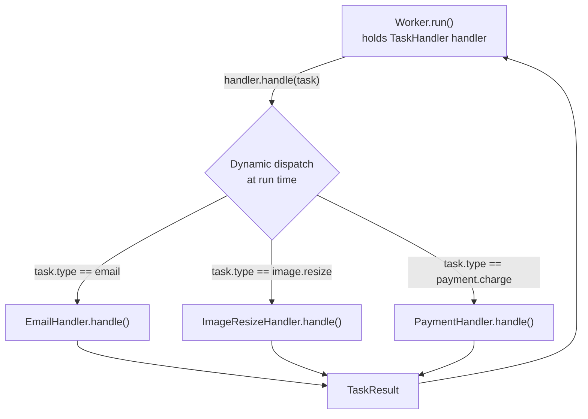
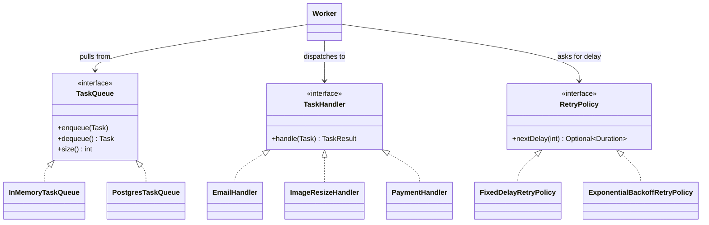

# Polymorphism

> Where this fits in the project: the `Worker` at the heart of Phase 1 pulls a `Task` off the queue,
> looks up *some* `TaskHandler`, and calls `handle(task)`. It has no idea whether that handler sends an
> email, resizes an image, or charges a credit card — and it must not care. That "one call, many behaviors"
> is **polymorphism**, and it is the single most important reason our platform can grow from 3 task types
> to 300 without the Worker ever being touched. This chapter is also where "program to an interface, not an
> implementation" stops being a slogan and becomes the mechanism that lets us swap an `InMemoryTaskQueue`
> for a `PostgresTaskQueue` in Phase 2 by changing exactly one line.

This chapter builds directly on [`chapter-07-method-overriding.md`](./chapter-07-method-overriding.md)
(the mechanism — dynamic dispatch via the vtable) and [`chapter-08-inheritance.md`](./chapter-08-inheritance.md)
(the relationship — subtypes). Overriding is *how* a single method name resolves to different code at run
time; polymorphism is *why that matters for design*. We will also contrast subtype polymorphism with the
two other kinds Java offers — **parametric** (generics, see
[`chapter-04-generics.md`](../01-java-fundamentals/chapter-04-generics.md)) and **ad hoc** (overloading,
see [`chapter-06-method-overloading.md`](./chapter-06-method-overloading.md)) — so you know exactly which
tool you are reaching for and what it costs.

---

## 1. Why This Exists

You have written thousands of functions. In a contest, when behavior needs to vary you write an `if/else`
or a `switch` on a tag and move on — the program lives for 50ms and is thrown away. In a backend that runs
for months, the `switch` is a liability that grows without bound. Polymorphism is the language feature that
replaces the ever-growing `switch` with a *table the runtime maintains for you*.

Concretely: our platform accepts tasks of different `type` — `"email"`, `"image.resize"`, `"payment.charge"`.
Each needs different execution logic. The naive instinct is a dispatch `switch` inside the Worker:

```java
switch (task.type()) {
    case "email"          -> sendEmail(task);
    case "image.resize"   -> resizeImage(task);
    case "payment.charge" -> chargeCard(task);
    // ...one new arm every time the business ships a feature
}
```

Every new task type forces an edit to the Worker — a class that has *nothing to do* with email or images.
The Worker becomes a magnet for change, every edit risks breaking unrelated task types, and the file grows
without bound. This is a direct violation of the **Open/Closed Principle** (see
[`../04-oop-and-ood/solid.md`](../04-oop-and-ood/solid.md)): software should be *open for extension* but
*closed for modification*. Polymorphism is how Java delivers that.

> **Definition.** *Polymorphism* (Greek: "many forms") is the ability of a single piece of code to operate
> uniformly over values of different concrete types, where each type supplies its own behavior. Java offers
> three flavors:
> - **Subtype (inclusion) polymorphism** — `Worker` holds a `TaskHandler` reference; the actual object may
>   be `EmailHandler` or `ImageResizeHandler`. Resolved at **run time** by dynamic dispatch. *This is the
>   star of the chapter.*
> - **Parametric polymorphism** — generics. `TaskQueue` is parameterized: `Optional<Task>`, `List<Task>`.
>   One implementation, many element types. Resolved at **compile time**, erased at run time.
> - **Ad hoc polymorphism** — overloading. Several `enqueue` methods with different parameter lists.
>   Resolved at **compile time** by the static types of the arguments.



The Worker calls *one* line — `handler.handle(task)` — and the JVM routes it to the right object's code.
That is the whole game.

---

## 2. The Naive Version

Here is the first-cut Worker most people write before they have internalized polymorphism. It works, ships,
and rots.

```java
// BAD: behavior selected by a giant switch the Worker owns.
public final class NaiveWorker implements Runnable {
    private final TaskQueue queue;

    NaiveWorker(TaskQueue queue) { this.queue = queue; }

    @Override
    public void run() {
        while (!Thread.currentThread().isInterrupted()) {
            try {
                Task task = queue.dequeue();
                execute(task);
            } catch (InterruptedException e) {
                Thread.currentThread().interrupt();
                return;
            }
        }
    }

    private void execute(Task task) {
        switch (task.type()) {                       // <-- the rot lives here
            case "email"          -> { /* 40 lines of SMTP code */ }
            case "image.resize"   -> { /* 60 lines of image code */ }
            case "payment.charge" -> { /* 80 lines of Stripe code */ }
            default -> throw new IllegalArgumentException("unknown type: " + task.type());
        }
    }
}
```

What is wrong, precisely:

- **No closure under extension.** Every new task type edits `NaiveWorker`. The class that should be the most
  stable in the system (it just loops and dispatches) becomes the most volatile.
- **God class.** SMTP, image, and payment logic all live in one file. Cohesion is near zero; the file mixes
  three unrelated domains.
- **Untestable in isolation.** To unit-test email logic you must instantiate the whole Worker and feed it a
  task. You cannot test `EmailHandler` because there is no `EmailHandler`.
- **Concurrency hazard.** All execution code shares one method's scope; it is easy to accidentally introduce
  shared mutable state across task types.
- **The `default` throw is a runtime trap.** A typo'd type compiles fine and blows up in production.

---

## 3. Improved Version

The first real improvement is to *name the abstraction*. The thing that varies is "what to do with a task,"
so we extract a `TaskHandler` interface — our canonical functional interface — and pull each behavior into
its own class. The Worker now holds a **map of type to handler**.

```java
@FunctionalInterface
public interface TaskHandler {
    TaskResult handle(Task task) throws Exception;
}

public record TaskResult(boolean success, String message, boolean retryable) {
    public static TaskResult ok()                 { return new TaskResult(true, "ok", false); }
    public static TaskResult retry(String reason) { return new TaskResult(false, reason, true); }
    public static TaskResult fail(String reason)  { return new TaskResult(false, reason, false); }
}
```

```java
public final class EmailHandler implements TaskHandler {
    @Override
    public TaskResult handle(Task task) {
        // parse task.payload(), send via SMTP...
        return TaskResult.ok();
    }
}

public final class ImageResizeHandler implements TaskHandler {
    @Override
    public TaskResult handle(Task task) {
        // resize per payload...
        return TaskResult.ok();
    }
}
```

```java
public final class ImprovedWorker implements Runnable {
    private final TaskQueue queue;
    private final Map<String, TaskHandler> handlers;   // type -> behavior

    ImprovedWorker(TaskQueue queue, Map<String, TaskHandler> handlers) {
        this.queue = queue;
        this.handlers = Map.copyOf(handlers);          // defensive copy, immutable
    }

    @Override
    public void run() {
        while (!Thread.currentThread().isInterrupted()) {
            try {
                Task task = queue.dequeue();
                TaskHandler handler = handlers.get(task.type());
                if (handler == null) {
                    // route to DLQ instead of crashing the worker thread
                    continue;
                }
                handler.handle(task);                  // <-- the ONE polymorphic call
            } catch (InterruptedException e) {
                Thread.currentThread().interrupt();
                return;
            } catch (Exception e) {
                // outcome handling comes in the production version
            }
        }
    }
}
```

The Worker no longer knows *any* task type. Adding `"payment.charge"` means writing a `PaymentHandler`
class and putting it in the map — **zero edits to the Worker.** The `switch` is gone; the map plus dynamic
dispatch does the routing. This is subtype polymorphism doing real work: `handler` is statically typed as
`TaskHandler`, but at run time it is whatever concrete class we registered.

What is still rough: handler registration is manual, there is no outcome handling (success/retry/fail), no
metrics, and unknown types are silently dropped. We fix that next.

---

## 4. Production-Quality Version

A staff engineer ships a Worker that is *closed for modification*, observable, and correct under failure.
We introduce a small `HandlerRegistry` (so registration is a real seam, not a raw map), centralize outcome
handling, and route unhandled/failed tasks to the `DeadLetterQueue`. The handler call is still one line.

```java
public final class HandlerRegistry {
    private final Map<String, TaskHandler> byType = new ConcurrentHashMap<>();

    /** Register the behavior for a task type. Idempotent re-registration is allowed. */
    public void register(String type, TaskHandler handler) {
        byType.put(Objects.requireNonNull(type), Objects.requireNonNull(handler));
    }

    public Optional<TaskHandler> lookup(String type) {
        return Optional.ofNullable(byType.get(type));
    }
}
```

```java
public final class Worker implements Runnable {

    private final TaskQueue queue;
    private final HandlerRegistry registry;
    private final DeadLetterQueue dlq;
    private final RetryPolicy retryPolicy;
    private final TaskScheduler scheduler;
    private final MetricsCollector metrics;

    public Worker(TaskQueue queue, HandlerRegistry registry, DeadLetterQueue dlq,
                  RetryPolicy retryPolicy, TaskScheduler scheduler, MetricsCollector metrics) {
        this.queue = queue;
        this.registry = registry;
        this.dlq = dlq;
        this.retryPolicy = retryPolicy;
        this.scheduler = scheduler;
        this.metrics = metrics;
    }

    @Override
    public void run() {
        while (!Thread.currentThread().isInterrupted()) {
            try {
                Task task = queue.dequeue();                 // polymorphic: any TaskQueue impl
                process(task);
            } catch (InterruptedException e) {
                Thread.currentThread().interrupt();
                return;                                       // clean shutdown
            }
        }
    }

    private void process(Task task) {
        TaskHandler handler = registry.lookup(task.type()).orElse(null);
        if (handler == null) {
            metrics.increment("task.unhandled", "type", task.type());
            dlq.send(task, "no handler registered for type=" + task.type());
            return;
        }

        long start = System.nanoTime();
        TaskResult result;
        try {
            result = handler.handle(task);                   // THE polymorphic call
        } catch (Exception e) {
            result = TaskResult.retry("handler threw: " + e.getClass().getSimpleName());
        } finally {
            metrics.recordTimer("task.duration", System.nanoTime() - start, "type", task.type());
        }

        applyOutcome(task, result);
    }

    private void applyOutcome(Task task, TaskResult result) {
        if (result.success()) {
            metrics.increment("task.succeeded", "type", task.type());
            return;
        }
        boolean canRetry = result.retryable() && task.attempts() + 1 < task.maxAttempts();
        if (canRetry) {
            Optional<Duration> delay = retryPolicy.nextDelay(task.attempts() + 1);
            if (delay.isPresent()) {
                metrics.increment("task.retrying", "type", task.type());
                scheduler.schedule(task, delay.get());       // polymorphic: any RetryPolicy + Scheduler
                return;
            }
        }
        metrics.increment("task.dead", "type", task.type());
        dlq.send(task, "exhausted: " + result.message());    // polymorphic: any DeadLetterQueue
    }
}
```

Count the polymorphic seams in this one class: `queue` (any `TaskQueue`), `handler` (any `TaskHandler`),
`retryPolicy` (any `RetryPolicy`), `scheduler` (any `TaskScheduler`), `dlq` (any `DeadLetterQueue`),
`metrics` (any `MetricsCollector`). The Worker is *pure orchestration over abstractions*. Every one of
those collaborators can be swapped — for a fake in a test, for a Postgres-backed version in Phase 2, for a
Kafka-backed version in Phase 4 — and the Worker's source never changes. That is the payoff of programming
to interfaces.

---

## 5. Code Walkthrough

### 5a. Beginner: one reference, many objects

The essence of subtype polymorphism: a variable's **static type** (what the compiler sees) can be a
supertype of its **dynamic type** (what actually lives there at run time). The method that runs is chosen by
the dynamic type.

```java
import java.time.Instant;
import java.util.List;

public class PolymorphismBasics {

    public static void main(String[] args) {
        // Static type is TaskHandler; dynamic types differ. A lambda is a TaskHandler too.
        List<TaskHandler> handlers = List.of(
            new EmailHandler(),
            new ImageResizeHandler(),
            task -> TaskResult.ok()      // inline handler via the functional interface
        );

        Task t = new Task("id-1", "demo", "{}", TaskStatus.PENDING,
                          0, 3, Instant.now(), Instant.now(), 5);

        for (TaskHandler h : handlers) {
            TaskResult r = h.handle(t);          // same call site, three different methods run
            System.out.println(h.getClass().getSimpleName() + " -> " + r.message());
        }
    }
}
```

The loop body is written *once*. It does not branch on type. The JVM dispatches `h.handle(t)` to
`EmailHandler.handle`, then `ImageResizeHandler.handle`, then the lambda's body — purely by the runtime
object identity. There is no `instanceof`, no cast, no `switch`.

### 5b. Intermediate: swapping implementations behind an interface

Here is the "program to an interface" payoff with `RetryPolicy`. The calling code is identical whether we
plug in a fixed delay or exponential backoff with jitter.

```java
import java.time.Duration;
import java.util.Optional;

public interface RetryPolicy {
    /** Delay before attempt N; empty means "give up". */
    Optional<Duration> nextDelay(int attempt);
}

public final class FixedDelayRetryPolicy implements RetryPolicy {
    private final Duration delay;
    private final int maxAttempts;
    public FixedDelayRetryPolicy(Duration delay, int maxAttempts) {
        this.delay = delay; this.maxAttempts = maxAttempts;
    }
    @Override public Optional<Duration> nextDelay(int attempt) {
        return attempt <= maxAttempts ? Optional.of(delay) : Optional.empty();
    }
}

public final class ExponentialBackoffRetryPolicy implements RetryPolicy {
    private final Duration base;
    private final Duration cap;
    private final int maxAttempts;
    private final java.util.random.RandomGenerator rng;

    public ExponentialBackoffRetryPolicy(Duration base, Duration cap, int maxAttempts) {
        this.base = base; this.cap = cap; this.maxAttempts = maxAttempts;
        this.rng = java.util.random.RandomGenerator.getDefault();
    }

    @Override public Optional<Duration> nextDelay(int attempt) {
        if (attempt > maxAttempts) return Optional.empty();
        long exp = base.toMillis() * (1L << Math.min(attempt - 1, 30));   // 2^(attempt-1)
        long capped = Math.min(exp, cap.toMillis());
        long jittered = (long) (capped * (0.5 + rng.nextDouble() * 0.5)); // full-ish jitter
        return Optional.of(Duration.ofMillis(jittered));
    }
}
```

```java
// Caller is written ONCE against RetryPolicy; the concrete policy is a configuration choice.
public final class RetryDemo {
    static void scheduleNext(Task task, RetryPolicy policy, TaskScheduler scheduler) {
        policy.nextDelay(task.attempts() + 1)
              .ifPresentOrElse(
                  d -> scheduler.schedule(task, d),
                  () -> System.out.println("giving up on " + task.id()));
    }

    public static void main(String[] args) {
        RetryPolicy fixed = new FixedDelayRetryPolicy(Duration.ofSeconds(5), 3);
        RetryPolicy backoff = new ExponentialBackoffRetryPolicy(
            Duration.ofMillis(100), Duration.ofSeconds(30), 6);
        // scheduleNext(task, fixed, scheduler);   // 5s, 5s, 5s, give up
        // scheduleNext(task, backoff, scheduler); // ~0.1s, 0.2s, 0.4s, ... capped at 30s
    }
}
```

Switching from `fixed` to `backoff` is a one-word change at the wiring point. No call site that *uses* the
policy is aware that two implementations exist. That is the entire economic argument for interfaces:
**variation is isolated to the place where you choose the implementation.**

### 5c. Production-inspired: the queue itself is polymorphic across phases

The most strategic use of polymorphism in this project is `TaskQueue`. Phase 1 ships in-memory; Phase 2
swaps in Postgres; the `WorkerPool` and `Worker` never notice.

```java
public interface TaskQueue {
    void enqueue(Task t);
    Task dequeue() throws InterruptedException;
    int size();
}

// Phase 1: backed by a BlockingQueue — see ../06-concurrency/blocking-queue.md
public final class InMemoryTaskQueue implements TaskQueue {
    private final java.util.concurrent.BlockingQueue<Task> q =
        new java.util.concurrent.LinkedBlockingQueue<>();
    @Override public void enqueue(Task t)            { q.offer(t); }
    @Override public Task dequeue() throws InterruptedException { return q.take(); }
    @Override public int size()                      { return q.size(); }
}

// Phase 2: backed by Postgres via a TaskRepository (sketch — full version in 09-project/phase-2.md)
public final class PostgresTaskQueue implements TaskQueue {
    private final TaskRepository repo;
    public PostgresTaskQueue(TaskRepository repo) { this.repo = repo; }

    @Override public void enqueue(Task t) { repo.save(t); }

    @Override public Task dequeue() throws InterruptedException {
        // poll for a due task; block-with-backoff if none (real impl uses SELECT ... FOR UPDATE SKIP LOCKED)
        while (true) {
            var due = repo.pollDue(1);
            if (!due.isEmpty()) return due.get(0);
            Thread.sleep(50);
        }
    }
    @Override public int size() { return repo.pollDue(Integer.MAX_VALUE).size(); }
}
```

```java
public final class WorkerPool {
    private final ExecutorService pool;
    private final List<Worker> workers;

    public WorkerPool(TaskQueue queue, HandlerRegistry registry, /* ...deps... */ int size) {
        this.pool = Executors.newFixedThreadPool(size);
        this.workers = IntStream.range(0, size)
            .mapToObj(i -> new Worker(queue, registry, /* ... */ null, null, null, null))
            .toList();
        // The pool depends on TaskQueue, never on WHICH queue. That is the seam.
    }
    public void start()    { workers.forEach(pool::submit); }
    public void shutdown() { pool.shutdownNow(); }
}
```

`new WorkerPool(new InMemoryTaskQueue(), ...)` in Phase 1 becomes
`new WorkerPool(new PostgresTaskQueue(repo), ...)` in Phase 2. The migration touches the **composition root**
(wherever you build the object graph) and nothing else. That is dependency inversion (see
[`../04-oop-and-ood/dependency-injection.md`](../04-oop-and-ood/dependency-injection.md)) made concrete by
polymorphism.

---

## 6. The Other Two Polymorphisms (Contrast)

Subtype polymorphism is not the only kind, and using the wrong one is a common design smell.

### Parametric polymorphism — generics

One implementation, many element types, **type-checked at compile time**. Our model is full of it:
`Optional<Task>`, `List<Task>`, `Map<String, TaskHandler>`. We could write a generic outbox:

```java
/** A type-safe, reusable buffer parameterized over the element type T. */
public final class Outbox<T> {
    private final java.util.Deque<T> items = new java.util.ArrayDeque<>();
    public void add(T item)        { items.addLast(item); }
    public Optional<T> poll()      { return Optional.ofNullable(items.pollFirst()); }
    public int size()              { return items.size(); }
}

// Usage: the same class works for Task, TaskEvent, or anything else — checked at compile time.
Outbox<Task> taskOutbox = new Outbox<>();
Outbox<TaskEvent> eventOutbox = new Outbox<>();   // Phase 4 EventBus territory
```

Generics give you *reuse without casting* and catch type errors before the program runs. Java erases the
type parameter at run time (type erasure), so there is no per-type code bloat — but also no run-time access
to `T`. Deep dive: [`chapter-04-generics.md`](../01-java-fundamentals/chapter-04-generics.md).

### Ad hoc polymorphism — overloading

Several methods share a name but differ in parameter lists; the **compiler** picks one by the static types
of the arguments. Useful for ergonomic APIs:

```java
public final class TaskQueueFacade {
    private final TaskQueue queue;
    public TaskQueueFacade(TaskQueue queue) { this.queue = queue; }

    public void enqueue(Task t)                 { queue.enqueue(t); }
    public void enqueue(String type, String payload) {
        queue.enqueue(new Task(java.util.UUID.randomUUID().toString(), type, payload,
                               TaskStatus.PENDING, 0, 3, Instant.now(), Instant.now(), 5));
    }
    public void enqueue(String type, String payload, int priority) {
        var t = new Task(java.util.UUID.randomUUID().toString(), type, payload,
                         TaskStatus.PENDING, 0, 3, Instant.now(), Instant.now(), priority);
        queue.enqueue(t);
    }
}
```

The three `enqueue` methods are resolved at **compile time** — `facade.enqueue("email", "{}")` binds to the
two-arg version statically. Contrast that with `handler.handle(task)`, which is resolved at **run time**.
Full treatment: [`chapter-06-method-overloading.md`](./chapter-06-method-overloading.md).



> The dashed `<|..` arrows are **realization** (a class implementing an interface). The solid `-->` arrows
> are **association** (the Worker *uses* these collaborators but does not own their lifecycle). UML
> relationships are covered in [`chapter-14-association.md`](./chapter-14-association.md).

---

## 7. How This Applies to Our Task Queue Project

| Abstraction | Concrete types (this/later phases) | What polymorphism buys us |
|---|---|---|
| `TaskHandler` | `EmailHandler`, `ImageResizeHandler`, `PaymentHandler`, lambdas | New task types add a class; Worker untouched (Open/Closed). |
| `TaskQueue` | `InMemoryTaskQueue` → `PostgresTaskQueue` → broker-backed | Phase migration changes the wiring line only. |
| `RetryPolicy` | `FixedDelayRetryPolicy`, `ExponentialBackoffRetryPolicy` | Retry strategy is config, not code edits. |
| `DeadLetterQueue` | in-memory list → DB table → dedicated topic | DLQ backend swappable per environment. |
| `RateLimiter` | `TokenBucketRateLimiter` (Phase 3) | Drop a different limiter in without touching callers. |
| `MetricsCollector` | no-op in tests → Micrometer in prod | Observability is a pluggable concern. |

The `Worker` is the canonical consumer of all of this. It is roughly 40 lines and will *not grow* as the
platform scales from 3 to 300 task types, because variation lives in the implementations, not in the Worker.

---

## 8. Tradeoffs

Polymorphism is not free. Be honest about the costs.

| Dimension | `switch`/`if` dispatch | Subtype polymorphism |
|---|---|---|
| Adding a new **type** | edit every switch | add one class, zero edits to consumers (Open/Closed win) |
| Adding a new **operation** over all types | one place to edit | edit every implementation (the "expression problem" flips) |
| Readability of control flow | linear, all in one place | scattered across files; harder to "see it all at once" |
| Run-time cost | none (or a tableswitch) | a virtual call (indirect dispatch; usually inlined by the JIT after profiling) |
| Testability | must exercise the whole switch | each implementation unit-tested in isolation |
| Coupling | consumer knows all types | consumer knows only the interface |

Key insight (the **expression problem**): subtype polymorphism makes *adding new types* cheap and *adding
new operations* expensive; `switch`-style dispatch is the reverse. Choose based on which axis changes more.
In our platform, **task types churn constantly** and the operation ("handle it") is stable — so subtype
polymorphism is exactly right. If instead we had a fixed set of 5 task types and constantly added new
*operations* over them, a sealed hierarchy with pattern-matching `switch` (see
[`chapter-11-instanceof.md`](./chapter-11-instanceof.md)) might fit better.

Performance: a virtual call is an indirect jump through a method table. With one or two implementations on a
hot path the JIT does monomorphic/bimorphic inlining and the cost vanishes. It only matters when a call site
is **megamorphic** (many implementations) and white-hot — rare in I/O-bound backend code where the network
dominates by orders of magnitude.

---

## 9. Common Mistakes and Pitfalls

- **Reintroducing `instanceof` chains.** If your "polymorphic" code does
  `if (h instanceof EmailHandler e) { ... }`, you have thrown the benefit away — the consumer is coupled to
  concrete types again. Fix: put the behavior *on* the interface and call it. (Pattern matching has its
  place — for closed, sealed hierarchies — see [`chapter-11-instanceof.md`](./chapter-11-instanceof.md) —
  but not for an open set of handlers.)
- **Leaky interfaces.** An interface with `getInternalConnection()` forces every implementation to expose
  internals and defeats swapping. Keep interfaces minimal and behavior-oriented (`handle`, not
  `getSmtpSession`).
- **Calling overridable methods from a constructor.** During construction the subclass fields are not yet
  initialized, but the overridden method *does* run (dynamic dispatch is already live), observing nulls.
  Never call an overridable method from a constructor. (See
  [`chapter-07-method-overriding.md`](./chapter-07-method-overriding.md).)
- **Confusing overloading with overriding.** `equals(Object)` is overriding; `equals(MyType)` is a *new
  overloaded* method the collections framework will never call. A subtle, classic bug.
- **Static type confusion with covariance.** Returning `List<Task>` but declaring `Collection<Task>` then
  trying to call `List`-specific methods on the result — the static type limits what you can call regardless
  of the dynamic type.
- **Designing for types you do not have.** Do not extract an interface with one implementation "just in
  case." YAGNI (see [`../04-oop-and-ood/dry-kiss-yagni.md`](../04-oop-and-ood/dry-kiss-yagni.md)). Extract
  the seam when the *second* implementation appears — `TaskQueue` earns its interface because Phase 2 needs
  Postgres.

---

## 10. Refactoring Exercise

**Bad.** A reporting method that branches on handler concrete type — `instanceof` masquerading as design.

```java
// BAD: consumer is coupled to every concrete handler; new handler => edit here.
String describe(TaskHandler h) {
    if (h instanceof EmailHandler)        return "sends email";
    if (h instanceof ImageResizeHandler)  return "resizes images";
    if (h instanceof PaymentHandler)      return "charges cards";
    return "unknown";
}
```

**Improved.** Push the behavior onto the interface as a default method so each type answers for itself.

```java
public interface TaskHandler {
    TaskResult handle(Task task) throws Exception;
    default String description() { return getClass().getSimpleName(); }  // sensible default
}

public final class EmailHandler implements TaskHandler {
    @Override public TaskResult handle(Task t) { return TaskResult.ok(); }
    @Override public String description() { return "sends transactional email"; }
}
```

```java
// Consumer is now ZERO-coupled to concrete types:
String describe(TaskHandler h) { return h.description(); }
```

**Production-quality.** Enrich the abstraction so the registry can self-describe for an admin endpoint, and
keep it immutable and discoverable. We give the handler a *capability descriptor* rather than ad hoc methods.

```java
public interface TaskHandler {
    TaskResult handle(Task task) throws Exception;

    /** Metadata used by /admin/handlers and metrics tagging. Override sparingly. */
    default HandlerInfo info() {
        return new HandlerInfo(getClass().getSimpleName(), false, java.time.Duration.ofSeconds(30));
    }
}

public record HandlerInfo(String name, boolean idempotent, java.time.Duration timeout) {}

public final class PaymentHandler implements TaskHandler {
    @Override public TaskResult handle(Task t) { return TaskResult.ok(); }
    @Override public HandlerInfo info() {
        return new HandlerInfo("payment.charge", true, java.time.Duration.ofSeconds(10));
    }
}
```

```java
// Admin endpoint can now enumerate capabilities WITHOUT any instanceof / switch:
List<HandlerInfo> describeAll(HandlerRegistry registry) {
    return registry.all().stream().map(TaskHandler::info).toList();
}
```

The progression: `instanceof` chain → behavior on the interface (default method) → a richer, immutable
capability object the rest of the system can consume uniformly. Coupling to concrete types is eliminated at
every step.

---

## 11. Exercises

### Easy

1. **(Knowledge check)** Explain the difference between a variable's *static type* and *dynamic type*, and
   state which one determines (a) whether the code compiles and (b) which overridden method runs at run time.
2. **(Coding)** Write a `LoggingHandler implements TaskHandler` that prints the task id and type, then
   returns `TaskResult.ok()`. Register it under `"log"` in a `HandlerRegistry` and look it up.

### Medium

3. **(Coding)** Implement a `CompositeTaskHandler implements TaskHandler` that wraps an ordered list of
   handlers and runs them in sequence, stopping at the first non-success result and returning it. (This is
   the Composite pattern; see [`../05-design-patterns/composite.md`](../05-design-patterns/composite.md).)
4. **(Refactoring)** You are given a `Dispatcher` with a `switch (task.type())` that calls one of four
   private methods. Refactor it to a `HandlerRegistry` + handler classes so that adding a fifth type
   requires no edit to `Dispatcher`.

### Hard

5. **(Design)** The team wants per-handler timeouts: a handler that exceeds its `HandlerInfo.timeout()`
   should be cancelled and treated as a retryable failure. Design a `TimeoutTaskHandler` *decorator* (see
   [`../05-design-patterns/decorator.md`](../05-design-patterns/decorator.md)) that wraps any `TaskHandler`
   and enforces the timeout using a `Future`. Keep the `TaskHandler` interface unchanged.
6. **(Interview-style)** Given an open, growing set of task types but a *fixed* operation set, you chose
   subtype polymorphism. Now product wants a single batch operation "export all handler configs as JSON."
   Explain, in terms of the expression problem, why this new *operation* is more painful than adding a new
   *type* was, and propose a design (visitor vs. default method vs. capability object) with tradeoffs.
7. **(Stretch)** Make the Worker dispatch over a **virtual thread per task** (Project Loom) while keeping
   the same `TaskHandler` abstraction. Sketch how `process(task)` submits to `Executors.newVirtualThreadPerTaskExecutor()`
   and why polymorphism is unaffected by the threading change.

---

## 12. Solutions

**1.** The *static type* is the declared type the compiler sees (`TaskHandler h`); it determines (a) whether
code compiles — you may only call methods declared on the static type. The *dynamic type* is the actual
class of the object at run time (`EmailHandler`); it determines (b) which overridden method body executes,
via dynamic dispatch. Compilation is static-type-driven; behavior is dynamic-type-driven.

**2.**

```java
public final class LoggingHandler implements TaskHandler {
    @Override public TaskResult handle(Task task) {
        System.out.printf("handling task id=%s type=%s%n", task.id(), task.type());
        return TaskResult.ok();
    }
}

// wiring
HandlerRegistry registry = new HandlerRegistry();
registry.register("log", new LoggingHandler());
TaskHandler h = registry.lookup("log").orElseThrow();
h.handle(new Task("id-9", "log", "{}", TaskStatus.PENDING, 0, 3,
                  Instant.now(), Instant.now(), 5));
```

**3.**

```java
public final class CompositeTaskHandler implements TaskHandler {
    private final List<TaskHandler> steps;
    public CompositeTaskHandler(List<TaskHandler> steps) {
        this.steps = List.copyOf(steps);                 // immutable, defensive
    }
    @Override public TaskResult handle(Task task) throws Exception {
        for (TaskHandler step : steps) {
            TaskResult r = step.handle(task);            // each call is polymorphic
            if (!r.success()) return r;                  // short-circuit on first failure
        }
        return TaskResult.ok();
    }
}
```

Because `CompositeTaskHandler` *is itself* a `TaskHandler`, the Worker treats a pipeline exactly like a
single handler. That uniformity is the Composite pattern's whole point.

**4.**

```java
// BEFORE: switch lives in Dispatcher.
// AFTER:
public final class Dispatcher {
    private final HandlerRegistry registry;
    public Dispatcher(HandlerRegistry registry) { this.registry = registry; }
    public TaskResult dispatch(Task task) throws Exception {
        return registry.lookup(task.type())
            .orElseThrow(() -> new IllegalStateException("no handler: " + task.type()))
            .handle(task);
    }
}
// Adding a 5th type: registry.register("new.type", new NewTypeHandler()); — Dispatcher unchanged.
```

**5.**

```java
public final class TimeoutTaskHandler implements TaskHandler {
    private final TaskHandler delegate;
    private final ExecutorService exec;     // e.g. newVirtualThreadPerTaskExecutor()

    public TimeoutTaskHandler(TaskHandler delegate, ExecutorService exec) {
        this.delegate = delegate; this.exec = exec;
    }

    @Override public TaskResult handle(Task task) {
        Future<TaskResult> f = exec.submit(() -> delegate.handle(task));
        Duration timeout = delegate.info().timeout();
        try {
            return f.get(timeout.toMillis(), TimeUnit.MILLISECONDS);
        } catch (TimeoutException e) {
            f.cancel(true);
            return TaskResult.retry("handler exceeded timeout " + timeout);
        } catch (ExecutionException e) {
            return TaskResult.retry("handler threw: " + e.getCause());
        } catch (InterruptedException e) {
            Thread.currentThread().interrupt();
            return TaskResult.retry("interrupted");
        }
    }
}
```

The decorator implements the same `TaskHandler` interface, so it is transparently substitutable for the
thing it wraps — the Worker cannot tell the difference. The interface stayed unchanged; we extended behavior
by *composition*, not modification.

**6.** The expression problem says one of {add types, add operations} is always cheap and the other
expensive, depending on your dispatch strategy. We optimized for *adding types* (subtype polymorphism), so a
new *operation* — "export config as JSON" — forces a method on `TaskHandler`, which means editing *every*
implementation. Options: (a) **default method** `default JsonNode exportConfig()` — non-breaking, but bloats
the interface and every handler that needs custom output must override it; (b) **capability object** — have
handlers already expose a `HandlerInfo`/config record and serialize that generically, requiring zero handler
edits (best fit here); (c) **visitor** — overkill for an open type set because the visitor must enumerate
types, which reintroduces the closed-set assumption we deliberately avoided. Recommendation: the capability
object, because our handlers already self-describe via `info()`.

**7.**

```java
private final ExecutorService vexec = Executors.newVirtualThreadPerTaskExecutor();

private void process(Task task) {
    registry.lookup(task.type()).ifPresentOrElse(handler ->
        vexec.submit(() -> {
            TaskResult r;
            try { r = handler.handle(task); }            // SAME polymorphic call
            catch (Exception e) { r = TaskResult.retry(e.getMessage()); }
            applyOutcome(task, r);
        }),
        () -> dlq.send(task, "no handler"));
}
```

Polymorphism is orthogonal to threading: `handler.handle(task)` dispatches the same way whether it runs on a
platform thread, a pooled thread, or a virtual thread. Loom changes *where* the call runs, not *how* it is
resolved. See [`../06-concurrency/threads.md`](../06-concurrency/threads.md) and
[`../06-concurrency/executor-service.md`](../06-concurrency/executor-service.md).

---

## 13. Interview Questions and Takeaways

1. **Q: What is the difference between overloading and overriding, and when is each resolved?**
   A: Overloading is *ad hoc* polymorphism — same name, different parameter lists — resolved by the compiler
   from the static argument types. Overriding is *subtype* polymorphism — a subclass redefines a supertype
   method with the same signature — resolved at run time by the object's dynamic type. Overloading is
   compile-time; overriding is run-time.

2. **Q: How does the JVM implement dynamic dispatch?**
   A: Each class has a method table (vtable). A virtual call loads the receiver's class pointer, indexes the
   table by method slot, and jumps. The JIT often devirtualizes monomorphic/bimorphic call sites by
   inlining after profiling, so the indirect jump frequently disappears on hot paths.

3. **Q: "Program to an interface, not an implementation" — what does it buy you concretely?**
   A: It isolates variation to the composition root. Consumers depend only on the abstraction, so you can
   swap implementations (in-memory vs. Postgres queue), inject fakes in tests, and satisfy Open/Closed —
   without editing any consumer. It is the practical form of the Dependency Inversion Principle.

4. **Q: What is the expression problem and how does it guide your choice between polymorphism and `switch`?**
   A: Adding types vs. adding operations are in tension. Subtype polymorphism makes adding *types* cheap and
   *operations* expensive; `switch` on a sealed type is the reverse. Pick based on which axis changes more.

5. **Q: When would you prefer a sealed interface + pattern-matching `switch` over classic polymorphism?**
   A: When the set of types is *closed and known* and operations are added frequently — sealed types give
   exhaustiveness checking and keep each operation in one place. For an *open* set (our task handlers),
   classic polymorphism wins.

6. **Q: Is there a performance penalty for polymorphism?**
   A: A virtual call is an indirect dispatch, but on monomorphic/bimorphic sites the JIT inlines it away.
   It only matters on megamorphic, ultra-hot paths — uncommon in I/O-bound backends where network latency
   dwarfs a method dispatch by orders of magnitude. Optimize for clarity first.

7. **Q: Why is calling an overridable method from a constructor dangerous?**
   A: Dynamic dispatch is active during construction, so the subclass override runs before the subclass
   fields are initialized, observing default/null values. Make such methods `final`, `private`, or `static`,
   or move the call out of the constructor.

8. **Q: Give a real example where generics (parametric) and subtyping (inclusion) combine.**
   A: `Optional<Task> findById(String id)` on `TaskRepository` — the *method* is polymorphic over repository
   implementations (subtype), and the return type is parameterized (parametric). The two compose cleanly.

**Takeaways:** Subtype polymorphism is the engine of extensibility — it replaces growing `switch` statements
with a runtime-maintained dispatch table. "Program to an interface" turns that engine into swappable
architecture. Know the three flavors (subtype/parametric/ad hoc), know the expression-problem tradeoff, and
reach for `instanceof`/`switch` only over *closed* sealed hierarchies.

---

## 14. Production Considerations

- **Megamorphic call sites.** If a single `handler.handle(task)` site sees dozens of implementations on a
  hot loop, the JIT cannot inline and dispatch costs become visible in flame graphs. Mitigation in practice:
  it almost never matters for I/O-bound handlers; if it does, partition workers by task family so each
  call site stays bimorphic.
- **Handler registration races.** Use a `ConcurrentHashMap` in `HandlerRegistry` (we do) so registration at
  startup and lookups by running workers never corrupt the map. Prefer *register all handlers before*
  starting the pool to avoid "handler not found yet" windows.
- **Unknown types are an operational signal.** A spike in `task.unhandled` usually means a producer deployed
  a new type before its handler shipped. Alert on it; route to DLQ; never crash the worker thread.
- **Interface evolution.** Adding a method to `TaskHandler` breaks every implementation unless you give it a
  `default`. Treat published interfaces as contracts; add via default methods, deprecate before removing.
- **Observability through the seam.** Because every handler goes through the same polymorphic call, you get a
  single choke point to add timers, tracing spans, and error counters — tag metrics by `task.type` so
  per-type latency is visible in Grafana (see
  [`../10-system-design/observability-and-ops.md`](../10-system-design/observability-and-ops.md)).
- **Testing.** Polymorphism makes the Worker trivially testable: inject a fake `TaskQueue` that yields one
  task, a stub `TaskHandler` returning a chosen `TaskResult`, and a spy `DeadLetterQueue`; assert the
  outcome routing. No real SMTP/DB needed.

---

## What We Can Improve In Our Project Using This Concept

Right now (early Phase 1) the Worker likely contains a `switch` on `task.type()` or a hardcoded handler.
We can replace that with a `HandlerRegistry` and a set of `TaskHandler` implementations, making the Worker
closed for modification. We can also extract the `TaskQueue` interface ahead of Phase 2 so the Postgres
migration is a one-line wiring change, and introduce the `RetryPolicy` seam so retry strategy becomes
configuration. Each of these is a concrete application of subtype polymorphism that pays off immediately in
testability and later in migration cost.

## Project Refactoring Task

1. Define `TaskHandler` (functional interface) and `TaskResult` (record) exactly as in the canonical model.
2. Extract `EmailHandler` and a `LoggingHandler` from any inline dispatch logic.
3. Add `HandlerRegistry` backed by a `ConcurrentHashMap`; register handlers in the composition root.
4. Rewrite `Worker.process(Task)` to look up via the registry and route unhandled tasks to a stub
   `DeadLetterQueue` — remove all `switch (task.type())`.
5. Add a JUnit 5 + AssertJ test that injects a fake `TaskQueue` and a stub `TaskHandler`, asserting the
   Worker calls `dlq.send` for an unknown type and does not for a known one.

## Git Commit For This Chapter

```text
refactor(worker): replace type switch with TaskHandler polymorphism and HandlerRegistry

- add TaskHandler functional interface and TaskResult record
- add HandlerRegistry (ConcurrentHashMap) for type -> handler lookup
- extract EmailHandler, LoggingHandler from inline dispatch
- rewrite Worker.process to dispatch polymorphically; route unhandled tasks to DLQ
- add WorkerDispatchTest with fake TaskQueue and stub TaskHandler

Files touched:
  src/main/java/com/taskq/handler/TaskHandler.java
  src/main/java/com/taskq/handler/TaskResult.java
  src/main/java/com/taskq/handler/HandlerRegistry.java
  src/main/java/com/taskq/handler/EmailHandler.java
  src/main/java/com/taskq/handler/LoggingHandler.java
  src/main/java/com/taskq/worker/Worker.java
  src/test/java/com/taskq/worker/WorkerDispatchTest.java
```

## Architecture Impact

The Worker becomes pure orchestration over abstractions (`TaskQueue`, `TaskHandler`, `RetryPolicy`,
`DeadLetterQueue`, `MetricsCollector`). Variation is pushed to leaf implementations, so the dependency graph
points *inward* toward stable abstractions — the foundation for the layered/hexagonal architecture in
[`../04-oop-and-ood/hexagonal-architecture.md`](../04-oop-and-ood/hexagonal-architecture.md). Phase
migrations (in-memory → Postgres → broker) collapse to composition-root edits, and new task types ship as
additive classes with no risk to existing behavior.

## Interview Takeaways

- Subtype polymorphism replaces growing `switch` statements with runtime dispatch; it is the practical form
  of the Open/Closed Principle.
- "Program to an interface" isolates variation to the composition root and makes implementations swappable
  and testable.
- Know all three polymorphisms — subtype (run-time, dynamic dispatch), parametric (generics, compile-time,
  erased), ad hoc (overloading, compile-time, static types).
- Use the expression problem to decide between polymorphism (cheap to add types) and sealed `switch` (cheap
  to add operations).
- Performance of virtual dispatch is a non-issue on I/O-bound paths; optimize for clarity and substitutability.
