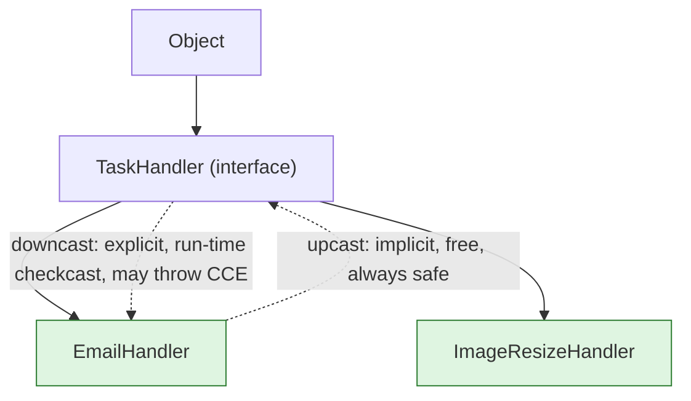
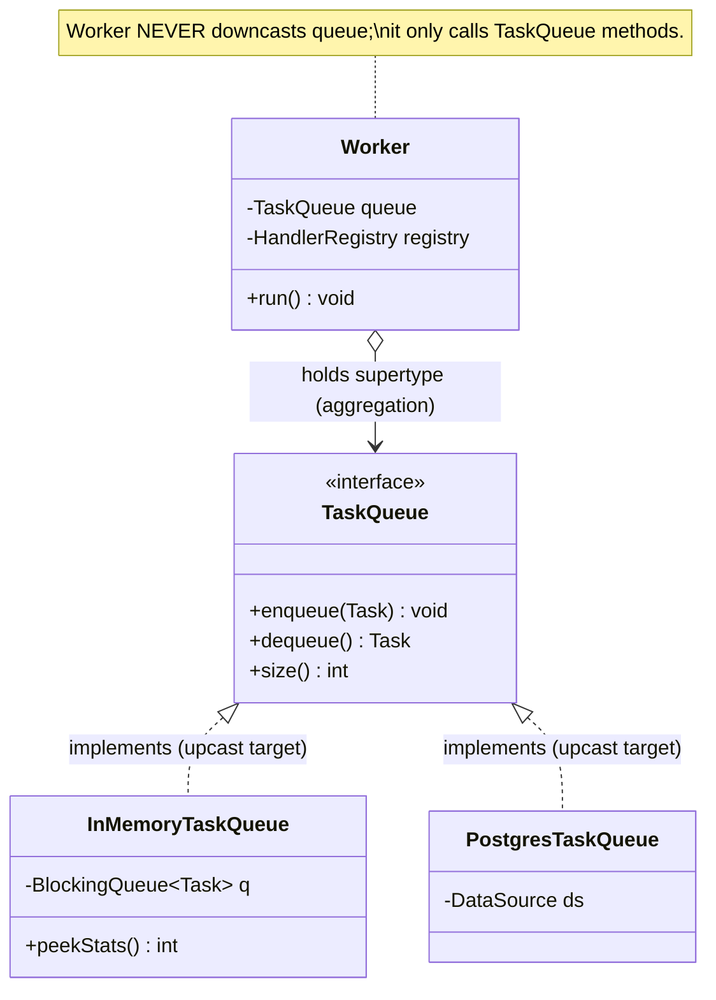

# Upcasting and Downcasting

> Where this fits in the project: the moment a `Worker` pulls something off a queue, it is holding a
> *reference whose static type is more general than the object's real type*. The queue hands back a
> `Task`, a `TaskQueue` reference points at an `InMemoryTaskQueue`, and a `TaskHandler` variable holds an
> `EmailHandler`. Every one of those is an **upcast** — silent, free, and the engine that makes
> [polymorphism](./chapter-09-polymorphism.md) usable. The dangerous twin is the **downcast**: forcing the
> compiler to treat a general reference as a specific subtype. This chapter teaches you when an upcast is
> the right design, when a downcast is a code smell screaming "your model is wrong," and the Java 21 tools
> (`instanceof` pattern matching, sealed `switch`) that let you avoid the smell entirely — including the
> recurring real case of casting `TaskEvent` subtypes and decoding `Task.payload`.

This chapter sits directly between [`chapter-09-polymorphism.md`](./chapter-09-polymorphism.md) (upcasting
is *how* you obtain a polymorphic reference) and [`chapter-11-instanceof.md`](./chapter-11-instanceof.md)
(the type test you run *before* a safe downcast). It also leans on
[`chapter-08-inheritance.md`](./chapter-08-inheritance.md) for the subtype relationship and on
[`chapter-13-interfaces.md`](./chapter-13-interfaces.md) and [`chapter-12-abstract-classes.md`](./chapter-12-abstract-classes.md)
for the supertypes we upcast to.

---

## 1. Why This Exists

You already know the mechanics of references from [`chapter-01-objects-and-references.md`](./chapter-01-objects-and-references.md):
a variable is a typed handle, and the object lives on the heap. Casting is about the **static type** of
that handle versus the **dynamic type** of the object it points at. The two never have to be the same.

```java
TaskHandler handler = new EmailHandler();   // static type: TaskHandler, dynamic type: EmailHandler
```

The compiler only lets you call methods that exist on the *static* type (`handler.handle(...)`). The JVM,
at run time, dispatches to the *dynamic* type's override (`EmailHandler.handle`). Casting is how you move a
reference up and down the type hierarchy so the compiler's view of "what methods are legal" lines up with
what you actually need to do.

- **Upcasting** widens the static type toward a supertype (`EmailHandler` → `TaskHandler` → `Object`). It is
  **always safe**, **implicit**, and costs nothing at run time — an `EmailHandler` *is-a* `TaskHandler`, so
  no check is needed.
- **Downcasting** narrows the static type toward a subtype (`TaskHandler` → `EmailHandler`). It is
  **potentially unsafe**, must be **explicit**, and triggers a **run-time check**. If the object is not
  actually that subtype, the JVM throws `ClassCastException`.

Why does the language even allow the dangerous direction? Because Java's static type system sometimes loses
information you genuinely had a moment ago. You put an `EmailHandler` into a `List<TaskHandler>`; later you
want the email-specific `lastRecipient()` method back. The information *exists* on the heap object — the
compiler just stopped tracking it. A downcast is you asserting, "I know more than the compiler here."

> **Definition.** A **cast** is an operator that changes the *static type* the compiler associates with a
> reference, without changing the object. **Upcast** = to a supertype (compile-time only, always valid).
> **Downcast** = to a subtype (compile-time syntax + run-time verification, can fail with
> `ClassCastException`).

The historical reason this distinction is sharp in Java: Java chose **nominal**, **statically-checked**
subtyping with a **single rooted hierarchy** (`Object` at the top). Upcasts are provable at compile time, so
the language makes them invisible. Downcasts cannot be proven safe by the compiler alone, so — unlike C++'s
unchecked `static_cast` — Java inserts a `checkcast` bytecode that verifies the type at run time. That check
is exactly what turns a silent memory-corruption bug into a loud, catchable `ClassCastException`.



---

## 2. The Naive Version

Here is dispatch logic written the way someone fresh from C-style code writes it: store handlers in a
collection of the base type, then *downcast back* to call type-specific methods. This shows up constantly
in real codebases and is exactly the smell we are learning to recognize.

```java
import java.util.List;

// Naive: a Worker that downcasts to discover what to do.
public class NaiveWorker {

    public void process(Task task, List<TaskHandler> handlers) {
        for (TaskHandler h : handlers) {                 // h: static type TaskHandler (an upcast already)
            // The author "knows" some handlers have extra capabilities, so they downcast to find out.
            if (h instanceof EmailHandler) {
                EmailHandler email = (EmailHandler) h;    // explicit downcast
                email.warmUpSmtpConnection();             // method that only exists on EmailHandler
                email.handleWithTracking(task);
            } else if (h instanceof ImageResizeHandler) {
                ImageResizeHandler img = (ImageResizeHandler) h; // another downcast
                img.allocateBuffer();
                img.handleWithTracking(task);
            } else {
                try {
                    h.handle(task);                       // fall back to the polymorphic call
                } catch (Exception e) {
                    throw new RuntimeException(e);
                }
            }
        }
    }
}
```

What is wrong here, beyond aesthetics:

- **The Worker reopens for every new handler type.** Add `PaymentHandler` and you must edit this method —
  the exact Open/Closed violation [`chapter-09-polymorphism.md`](./chapter-09-polymorphism.md) taught us to
  kill. The downcast *re-introduces* the `switch`-on-type we deleted, just disguised as `instanceof`.
- **It is fragile.** Drop the `instanceof` guard and you get a `ClassCastException` at run time for the
  first handler that is not an `EmailHandler`. The compiler cannot help you.
- **It leaks subtype knowledge upward.** The Worker now depends on `EmailHandler`, `ImageResizeHandler`, and
  their private-ish ceremony methods (`warmUpSmtpConnection`, `allocateBuffer`). The whole point of the
  `TaskHandler` abstraction was to *hide* that.

The naive code is not wrong because casting is evil. It is wrong because **a downcast here signals that the
supertype's contract is incomplete** — the behavior the Worker wants should have been on the interface.

---

## 3. Improved Version

First improvement: stop hand-writing the cast. Java 16+ gives us **`instanceof` pattern matching**, which
folds the type test and the downcast into one expression and scopes the narrowed variable so you cannot
misuse it. This removes the `ClassCastException` risk and the redundant cast, but — importantly — it does
**not** remove the design smell. We will keep going.

```java
public class ImprovedWorker {

    public void process(Task task, List<TaskHandler> handlers) throws Exception {
        for (TaskHandler h : handlers) {
            // Pattern matching: test + bind in one step. No explicit (EmailHandler) cast, no CCE risk.
            if (h instanceof EmailHandler email) {        // 'email' only in scope if the test passes
                email.warmUpSmtpConnection();
                email.handle(task);
            } else if (h instanceof ImageResizeHandler img) {
                img.allocateBuffer();
                img.handle(task);
            } else {
                h.handle(task);
            }
        }
    }
}
```

This is strictly safer than the naive version — the compiler guarantees `email` is non-null and of the right
type inside the branch, and flow scoping means you can never reference `email` where the test failed. But the
Worker still knows the concrete handler zoo. The improvement is *defensive*, not *architectural*.

The **architectural** fix is to recognize what `warmUpSmtpConnection()` and `allocateBuffer()` really are:
**lifecycle hooks every handler might want**. Put them on the interface with a default no-op, and the
downcast evaporates.

```java
@FunctionalInterface
public interface TaskHandler {
    TaskResult handle(Task task) throws Exception;

    // Lifecycle hook with a safe default. Handlers that need warm-up override it; others ignore it.
    default void prepare() { /* no-op */ }
}
```

```java
public class BetterWorker {
    public void process(Task task, List<TaskHandler> handlers) throws Exception {
        for (TaskHandler h : handlers) {
            h.prepare();          // polymorphic: SMTP warm-up, buffer alloc, or nothing — handler decides
            h.handle(task);       // polymorphic: actual work
        }
    }
}
```

No casts. No `instanceof`. The Worker depends only on `TaskHandler`. New handler types ship as additive
classes. This is the lesson: **most downcasts disappear when you move the wanted behavior onto the
supertype.**

---

## 4. Production-Quality Version

In a real platform you do not iterate "all handlers" per task — you look up *the one* handler for the task's
`type` via a registry (exactly the `HandlerRegistry` from the polymorphism chapter), and the Worker holds
collaborators by their **interface** types so the composition root can swap implementations. Every dependency
is stored upcast. The only place a cast is even conceivable is at a true type-erasure boundary — decoding
`Task.payload` (a JSON string) into a typed record — and there we use a *parser*, not a cast.

```java
import java.util.Optional;

/**
 * Production Worker. Every field is the SUPERTYPE (an upcast at construction time).
 * No downcasts anywhere: variation is resolved by the registry + dynamic dispatch.
 */
public final class Worker implements Runnable {

    private final TaskQueue queue;             // not InMemoryTaskQueue — upcast to the interface
    private final HandlerRegistry registry;    // type -> TaskHandler lookup
    private final RetryPolicy retryPolicy;     // not ExponentialBackoffRetryPolicy — upcast
    private final DeadLetterQueue dlq;         // upcast to the interface
    private volatile boolean running = true;

    public Worker(TaskQueue queue, HandlerRegistry registry,
                  RetryPolicy retryPolicy, DeadLetterQueue dlq) {
        this.queue = queue;
        this.registry = registry;
        this.retryPolicy = retryPolicy;
        this.dlq = dlq;
    }

    @Override
    public void run() {
        while (running) {
            try {
                Task task = queue.dequeue();        // returns a Task (already the right static type)
                dispatch(task);
            } catch (InterruptedException e) {
                Thread.currentThread().interrupt();
                running = false;
            }
        }
    }

    private void dispatch(Task task) {
        Optional<TaskHandler> handler = registry.lookup(task.type());
        if (handler.isEmpty()) {
            dlq.send(task, "no handler registered for type=" + task.type());
            return;
        }
        try {
            TaskResult result = handler.get().handle(task);   // polymorphic, no cast
            if (!result.success() && !result.retryable()) {
                dlq.send(task, result.message());
            }
            // retry scheduling omitted here; see chapter on retries
        } catch (Exception e) {
            dlq.send(task, "handler threw: " + e.getMessage());
        }
    }

    public void stop() { running = false; }
}
```

The single legitimate "narrowing" in the whole system is turning the opaque `payload` string into a typed
object. That is **not** a reference downcast — it is **deserialization**, and we localize it inside the
handler that owns the schema, returning a typed record. This is the production answer to "casting payloads."

```java
import com.fasterxml.jackson.databind.ObjectMapper;
import com.fasterxml.jackson.databind.json.JsonMapper;

/** Typed view of an email task's payload. Records are perfect for this. */
public record EmailPayload(String to, String subject, String body) {}

public final class EmailHandler implements TaskHandler {

    private static final ObjectMapper MAPPER = JsonMapper.builder().build();

    @Override
    public TaskResult handle(Task task) {
        final EmailPayload payload;
        try {
            // NOT a cast. A parse: String -> EmailPayload, with a validated schema and a clear failure mode.
            payload = MAPPER.readValue(task.payload(), EmailPayload.class);
        } catch (Exception e) {
            // Bad payload is a permanent (non-retryable) failure -> headed for the DLQ.
            return new TaskResult(false, "malformed email payload: " + e.getMessage(), false);
        }
        // ... send email using payload.to(), payload.subject(), payload.body() ...
        return new TaskResult(true, "sent to " + payload.to(), false);
    }
}
```

> **Staff-engineer rationale.** A `ClassCastException` and a JSON `MismatchedInputException` describe the
> same underlying mistake ("this thing is not the shape I expected"), but the parser gives you a *typed,
> recoverable, well-located* failure with a message you can log and route to the DLQ. A reference downcast
> gives you a stack trace from deep inside framework code. Always prefer a parse over a cast at a data
> boundary — see ["parse, don't validate"](#13-interview-questions-and-takeaways).

---

## 5. Code Walkthrough

### 5.1 Beginner — what each cast actually does

```java
public class CastBasics {
    public static void main(String[] args) {
        EmailHandler concrete = new EmailHandler();

        // UPCAST: implicit. No cast operator written. Always legal because EmailHandler IS-A TaskHandler.
        TaskHandler asInterface = concrete;
        Object asObject = concrete;        // upcast all the way to the root

        // Through 'asInterface' the compiler only sees TaskHandler's methods:
        //   asInterface.warmUpSmtpConnection();  // COMPILE ERROR: method not on TaskHandler
        // But dynamic dispatch still runs EmailHandler's handle():
        // asInterface.handle(someTask);   // runs EmailHandler.handle at run time

        // DOWNCAST: explicit. The (EmailHandler) operator inserts a run-time checkcast.
        EmailHandler back = (EmailHandler) asInterface;   // OK: the object really IS an EmailHandler
        System.out.println(back == concrete);             // true: same heap object, just re-typed handle

        // A downcast that lies fails at run time:
        TaskHandler imageHandler = new ImageResizeHandler();
        // EmailHandler boom = (EmailHandler) imageHandler;  // throws ClassCastException at run time
    }
}
```

Key takeaways for a Java newcomer:

1. The cast never copies or mutates the object. `back == concrete` is `true`.
2. Upcast = compiler relaxes what you may call; downcast = compiler trusts you, JVM verifies.
3. What you *can call* depends on the **static** type; what *runs* depends on the **dynamic** type.

### 5.2 Intermediate — safe downcasting with pattern matching

A queue's metrics endpoint wants to print queue depth, but only `InMemoryTaskQueue` exposes a cheap
`peekStats()`. A `PostgresTaskQueue` would need a DB round trip. Here is how to narrow *safely* when you
genuinely must.

```java
public final class QueueDiagnostics {

    /** Returns a human-readable depth, cheaply if possible, without crashing on other queue impls. */
    public static String describe(TaskQueue queue) {
        // Old style (still valid, more verbose):
        //   if (queue instanceof InMemoryTaskQueue) {
        //       InMemoryTaskQueue q = (InMemoryTaskQueue) queue;
        //       return "in-memory depth=" + q.peekStats();
        //   }

        // Java 21 idiom: test + bind in one expression. 'mem' is in scope only on the true branch.
        if (queue instanceof InMemoryTaskQueue mem) {
            return "in-memory depth=" + mem.peekStats();   // cheap, exact
        }
        // Graceful fallback for every other TaskQueue implementation:
        return "depth~=" + queue.size();                   // interface-only call, always available
    }
}
```

Why this is acceptable while the Worker example was not: this is a *diagnostic adapter at the edge of the
system* whose entire job is to special-case implementations for observability. It does not leak subtype
knowledge into core domain logic, and it degrades gracefully instead of throwing.

### 5.3 Production-inspired — casting events on the `EventBus`

Phase 4 introduces a `TaskEvent` hierarchy flowing over an `EventBus`. Listeners receive the **supertype**
`TaskEvent` (an upcast on the publish side) and must react differently per concrete event. This is the most
common place engineers reach for downcasts. The right tool is a **sealed interface + exhaustive `switch`
pattern matching** — the compiler then *guarantees* you handled every case, with zero risk of
`ClassCastException`.

```java
import java.time.Instant;

/** Sealed: the compiler knows the COMPLETE set of subtypes, enabling exhaustive switches. */
public sealed interface TaskEvent
        permits TaskEnqueued, TaskStarted, TaskSucceeded, TaskFailed, TaskDeadLettered {
    String taskId();
    Instant at();
}

public record TaskEnqueued(String taskId, Instant at, int priority)            implements TaskEvent {}
public record TaskStarted(String taskId, Instant at, String workerId)          implements TaskEvent {}
public record TaskSucceeded(String taskId, Instant at, long durationMillis)    implements TaskEvent {}
public record TaskFailed(String taskId, Instant at, int attempt, String error) implements TaskEvent {}
public record TaskDeadLettered(String taskId, Instant at, String reason)       implements TaskEvent {}
```

```java
public final class MetricsListener implements TaskEventListener {

    private final MetricsCollector metrics;

    public MetricsListener(MetricsCollector metrics) { this.metrics = metrics; }

    @Override
    public void onEvent(TaskEvent event) {           // receives the upcast supertype
        // Switch pattern matching: each case binds the narrowed subtype. NO explicit casts, NO CCE.
        // Because TaskEvent is sealed and we cover all permits, the compiler verifies exhaustiveness.
        switch (event) {
            case TaskEnqueued e      -> metrics.increment("task.enqueued", "priority", String.valueOf(e.priority()));
            case TaskStarted e       -> metrics.increment("task.started", "worker", e.workerId());
            case TaskSucceeded e     -> metrics.recordTimer("task.duration", e.durationMillis());
            case TaskFailed e        -> metrics.increment("task.failed", "attempt", String.valueOf(e.attempt()));
            case TaskDeadLettered e  -> metrics.increment("task.dead", "reason", e.reason());
            // No default needed: the switch is EXHAUSTIVE over a sealed type.
            // Add a 6th event subtype and THIS switch fails to compile until you handle it. That is the win.
        }
    }
}
```

> The contrast with the naive `if (e instanceof TaskFailed)` chain is the whole point: the chain would
> compile happily even if you forgot `TaskDeadLettered`, silently dropping those events. The sealed
> `switch` turns "did I handle every event?" from a run-time hope into a **compile-time guarantee**.

---

## 6. How This Applies to Our Task Queue Project

Upcasting is not an occasional trick in our platform — it is the *load-bearing structure*. Almost every
field in the system is stored as its supertype:

| Reference site | Declared (static) type | Likely dynamic type | Cast direction |
| --- | --- | --- | --- |
| `Worker.queue` | `TaskQueue` | `InMemoryTaskQueue` / `PostgresTaskQueue` | upcast at construction |
| `Worker.retryPolicy` | `RetryPolicy` | `ExponentialBackoffRetryPolicy` | upcast at construction |
| `HandlerRegistry` value | `TaskHandler` | `EmailHandler`, `ImageResizeHandler` | upcast on `register()` |
| `EventBus` payload | `TaskEvent` | `TaskFailed`, `TaskSucceeded` | upcast on `publish()` |
| `RateLimiter` field | `RateLimiter` | `TokenBucketRateLimiter` | upcast at construction |
| `TaskScheduler` field | `TaskScheduler` | `DelayQueue`-backed impl | upcast at construction |

These upcasts are what let Phase 1 → Phase 2 → Phase 4 migrations collapse into composition-root edits:
swap `new InMemoryTaskQueue()` for `new PostgresTaskQueue(dataSource)` and *nothing else changes*, because
everything downstream only ever knew the `TaskQueue` interface.

**Downcasts**, by contrast, should be rare and localized to three legitimate spots:

1. **Edge diagnostics / adapters** — e.g. `QueueDiagnostics.describe`, where special-casing an
   implementation for observability is the job, and you degrade gracefully.
2. **Event/command dispatch over a sealed hierarchy** — and there you use exhaustive `switch`, not raw
   casts (see `MetricsListener`).
3. **Data boundaries** — decoding `Task.payload`. This is deserialization (a *parse*), not a reference
   downcast, and it lives inside the handler that owns the schema.

If you find a downcast in `Worker.dispatch`, `WorkerPool`, or any core domain method, treat it as a bug
report against your model.



---

## 7. Tradeoffs

| Approach | Safety | Extensibility | Readability | When to use |
| --- | --- | --- | --- | --- |
| Implicit upcast (program to interface) | Always safe | Excellent — new subtypes are additive | High | The default. ~95% of references. |
| Old-style `(Sub) ref` downcast | Run-time `CCE` risk | Poor — couples caller to subtype | Low | Legacy code; avoid in new code. |
| `instanceof` pattern matching downcast | Safe (test guards the bind) | Poor — still per-subtype branches | Medium | Edge adapters, interop, gradual migration. |
| Sealed type + exhaustive `switch` | Safe + compile-time exhaustiveness | Good for *operations*, poor for *new types* | High | Closed hierarchies: events, commands, AST nodes. |
| Add behavior to the supertype (default method / abstract) | Safe — no narrowing at all | Excellent | High | When every subtype could plausibly have the behavior. |
| Parse/deserialize at the boundary | Safe — typed failure | N/A | High | Turning `payload` strings into typed records. |

The deep tradeoff is the **expression problem** (introduced in
[`chapter-09-polymorphism.md`](./chapter-09-polymorphism.md)):

- **Polymorphism / upcasting** makes *adding new types* cheap (new class, no edits elsewhere) but *adding
  new operations* expensive (touch every class). Use it when the type set grows — task **handlers**.
- **Sealed `switch` / downcasting** makes *adding new operations* cheap (new switch in one place) but
  *adding new types* expensive (every switch must be updated — though the compiler *forces* you, which is
  the saving grace). Use it when the type set is closed and operations grow — **events**, protocol messages.

There is no "casting is always bad" rule. There is "an *unchecked* downcast in *core domain logic* is
almost always a missing abstraction."

---

## 8. Common Mistakes and Pitfalls

- **Downcasting to call a method that should be on the interface.** Fix: add the method (often a `default`)
  to the supertype, as we did with `prepare()`. The downcast vanishes.
- **Forgetting the `instanceof` guard before a C-style cast.** `(EmailHandler) handler` on a non-email
  handler throws `ClassCastException`. Fix: use `instanceof` pattern matching so test and bind are atomic.
- **Catching `ClassCastException` to control flow.** Exceptions are not `if` statements; this hides bugs and
  is slow. Fix: test the type first, or restructure so no test is needed.
- **Casting a generic to dodge erasure.** `(List<Task>) someRawList` compiles with an *unchecked warning*
  and gives a `ClassCastException` only later, far from the cause (heap pollution). Fix: keep generics
  parameterized end to end; never cast away type parameters.
- **Believing a cast does work.** It does not deserialize, copy, or validate anything. `(EmailPayload)`
  on a `String` does not parse JSON — it just fails. Fix: use Jackson/a parser at data boundaries.
- **Upcasting and then being surprised by hidden statics or fields.** Fields and `static` methods are
  resolved by *static* type, not dynamic — they are **not** polymorphic (see
  [`chapter-07-method-overriding.md`](./chapter-07-method-overriding.md)). Upcasting then reading a field
  gives the supertype's field. Fix: never shadow fields; expose state via overridable methods.
- **`null instanceof Anything` is `false`.** A pattern like `task instanceof EmailPayload p` is safely
  `false` for `null`, so the bound variable is never null — but do not assume a downcast of `null` throws;
  `(EmailHandler) null` succeeds and yields `null`.
- **Non-exhaustive `switch` over a sealed type compiles only with all cases or a `default`.** Adding a new
  permitted subtype breaks compilation of every exhaustive switch — embrace this as a feature, not a
  nuisance.

---

## 9. Refactoring Exercise

**Bad** — a `WorkerPool` shutdown routine that downcasts to flush implementation-specific buffers:

```java
public class BadWorkerPool {
    private final List<TaskQueue> queues;
    public BadWorkerPool(List<TaskQueue> queues) { this.queues = queues; }

    public void shutdown() {
        for (TaskQueue q : queues) {
            // Smell: core lifecycle logic special-casing concrete implementations via downcasts.
            if (q instanceof InMemoryTaskQueue) {
                ((InMemoryTaskQueue) q).flushToDisk();      // unguarded second cast, CCE risk if refactored
            } else if (q instanceof PostgresTaskQueue) {
                ((PostgresTaskQueue) q).closeConnectionPool();
            }
            // What about the Phase-4 broker-backed queue? Silently does nothing. Bug waiting to happen.
        }
    }
}
```

**Improved** — pattern matching removes the unguarded casts and the CCE risk, but the smell (core logic
knowing every implementation) remains:

```java
public class ImprovedWorkerPool {
    private final List<TaskQueue> queues;
    public ImprovedWorkerPool(List<TaskQueue> queues) { this.queues = queues; }

    public void shutdown() {
        for (TaskQueue q : queues) {
            if (q instanceof InMemoryTaskQueue mem)        mem.flushToDisk();
            else if (q instanceof PostgresTaskQueue pg)    pg.closeConnectionPool();
            // Still must edit this method for every new queue type. Still incomplete by default.
        }
    }
}
```

**Production-quality** — promote "release my resources at shutdown" to the abstraction. The `TaskQueue`
interface extends `AutoCloseable`; each implementation closes itself correctly; the pool never narrows.

```java
public interface TaskQueue extends AutoCloseable {
    void enqueue(Task t);
    Task dequeue() throws InterruptedException;
    int size();
    @Override void close();          // each impl flushes/closes its own resources
}

public final class InMemoryTaskQueue implements TaskQueue {
    private final java.util.concurrent.BlockingQueue<Task> q = new java.util.concurrent.LinkedBlockingQueue<>();
    @Override public void enqueue(Task t) { q.offer(t); }
    @Override public Task dequeue() throws InterruptedException { return q.take(); }
    @Override public int size() { return q.size(); }
    public int peekStats() { return q.size(); }
    @Override public void close() { flushToDisk(); }
    private void flushToDisk() { /* persist any in-flight tasks */ }
}

public final class ProductionWorkerPool {
    private final List<TaskQueue> queues;
    public ProductionWorkerPool(List<TaskQueue> queues) { this.queues = queues; }

    public void shutdown() {
        // No casts, no instanceof, complete by construction. New queue types just work.
        for (TaskQueue q : queues) {
            q.close();
        }
    }
}
```

The transformation is the chapter in miniature: a downcast became an interface method, and the core logic
went from "knows every implementation and is silently incomplete" to "knows only the abstraction and is
total."

---

## 10. Exercises

### Easy

**E1 (knowledge check).** For each line, say whether it is an upcast, a downcast, or illegal, and whether
any check happens at run time. `EmailHandler e` and `TaskHandler h = e;` are in scope.

```java
Object o = h;                       // (a)
TaskHandler h2 = (TaskHandler) o;   // (b)
EmailHandler e2 = (EmailHandler) h; // (c)
ImageResizeHandler i = (ImageResizeHandler) h; // (d), where h points at an EmailHandler
String s = (String) o;              // (e)
```

**E2 (coding).** Write a method `safeAsInMemory(TaskQueue q)` that returns an `Optional<InMemoryTaskQueue>`,
empty when `q` is any other implementation, using `instanceof` pattern matching (no try/catch).

### Medium

**M1 (refactoring).** The following compiles but is fragile. Refactor it so no downcast appears, by moving
the needed behavior onto `TaskHandler`.

```java
void runAll(List<TaskHandler> hs, Task t) throws Exception {
    for (TaskHandler h : hs) {
        if (h instanceof EmailHandler em) em.openConnection();
        h.handle(t);
    }
}
```

**M2 (design).** You receive `TaskEvent` instances on a listener and must (a) increment a counter per event
and (b) for `TaskFailed` only, append the error to an audit log. Implement `onEvent(TaskEvent)` so that
adding a new sealed `TaskEvent` subtype later forces a compile error until you handle it.

### Hard

**H1 (interview-style).** Explain why `(List<Task>) (Object) rawList` can compile yet throw
`ClassCastException` at a *completely unrelated* line much later. Then show the correct fix.

**H2 (stretch).** Implement `PayloadCodec`, a small abstraction that turns `Task.payload` (JSON string)
into a typed record per task type, with a typed failure path that routes malformed payloads to the DLQ —
without a single reference downcast. Demonstrate it for `EmailPayload` and an `ImageResizePayload`.

---

## 11. Solutions

### E1

- **(a)** Upcast (`TaskHandler` → `Object`), implicit, **no** run-time check.
- **(b)** Downcast in syntax (`Object` → `TaskHandler`), explicit; a `checkcast` runs but **succeeds**,
  since the object is a `TaskHandler`.
- **(c)** Downcast (`TaskHandler` → `EmailHandler`), explicit, run-time check **succeeds** (the object is an
  `EmailHandler`).
- **(d)** Downcast, explicit, run-time check **fails** → `ClassCastException` (the object is an
  `EmailHandler`, not an `ImageResizeHandler`).
- **(e)** Compiles (`Object` → `String` is a plausible downcast), but **fails at run time** with
  `ClassCastException` because the object is a handler, not a `String`.

### E2

```java
import java.util.Optional;

public static Optional<InMemoryTaskQueue> safeAsInMemory(TaskQueue q) {
    return q instanceof InMemoryTaskQueue mem ? Optional.of(mem) : Optional.empty();
}
```

`instanceof` is `false` for `null`, so this is null-safe and never throws.

### M1

Move the lifecycle hook onto the interface with a no-op default; the downcast disappears.

```java
@FunctionalInterface
interface TaskHandler {
    TaskResult handle(Task task) throws Exception;
    default void openConnection() { /* no-op; handlers that need a connection override this */ }
}

void runAll(List<TaskHandler> hs, Task t) throws Exception {
    for (TaskHandler h : hs) {
        h.openConnection();   // polymorphic; EmailHandler overrides, others no-op
        h.handle(t);
    }
}
```

### M2

Use a sealed `TaskEvent` and an exhaustive `switch`. Omitting a future subtype breaks compilation.

```java
public final class AuditingListener implements TaskEventListener {
    private final MetricsCollector metrics;
    private final java.util.List<String> auditLog = new java.util.ArrayList<>();

    public AuditingListener(MetricsCollector metrics) { this.metrics = metrics; }

    @Override
    public void onEvent(TaskEvent event) {
        metrics.increment("event", "kind", event.getClass().getSimpleName()); // (a) always
        switch (event) {                                                       // (b) per-type
            case TaskFailed f -> auditLog.add(f.taskId() + ": " + f.error());
            case TaskEnqueued ignored      -> { }
            case TaskStarted ignored       -> { }
            case TaskSucceeded ignored     -> { }
            case TaskDeadLettered ignored  -> { }
            // No default: adding a 6th permitted subtype fails compilation here until handled.
        }
    }
}
```

### H1

`(List<Task>) (Object) rawList` works because generics are **erased**: at run time `List<Task>` and
`List<String>` are both just `List`, so the `checkcast` only verifies "is it a `List`?" — which passes even
if the list actually holds `String`s. This is **heap pollution**. The `ClassCastException` then fires not at
the cast but at the *first place the runtime inserts an implicit cast on read*:

```java
List<String> raw = new ArrayList<>();
raw.add("oops");
List<Task> tasks = (List<Task>) (Object) raw;   // compiles (unchecked warning), succeeds at run time
Task t = tasks.get(0);   // CCE HERE: the compiler inserted (Task) on the read, and "oops" is a String
```

The crash is far from the cause, which is exactly why erasure-defeating casts are dangerous. **Fix:** never
launder generics through `Object`. Keep the parameter typed (`List<Task>`) from the source, or copy with a
type filter if you must accept a raw/mixed list:

```java
List<Task> tasks = rawList.stream()
    .filter(Task.class::isInstance)   // keep only real Tasks
    .map(Task.class::cast)            // safe: each element verified by the filter
    .toList();
```

### H2

A codec abstraction parses `payload` into typed records; failures are typed, not exceptions thrown across
the system. No reference downcasts anywhere.

```java
import com.fasterxml.jackson.databind.ObjectMapper;
import com.fasterxml.jackson.databind.json.JsonMapper;
import java.util.Optional;

public record EmailPayload(String to, String subject, String body) {}
public record ImageResizePayload(String sourceUrl, int width, int height) {}

/** Parses a Task's JSON payload into a typed record; returns empty on malformed input. */
public final class PayloadCodec {
    private static final ObjectMapper MAPPER = JsonMapper.builder().build();

    public <T> Optional<T> decode(Task task, Class<T> shape) {
        try {
            return Optional.of(MAPPER.readValue(task.payload(), shape));  // parse, not cast
        } catch (Exception e) {
            return Optional.empty();                                      // typed failure path
        }
    }
}

public final class EmailHandler implements TaskHandler {
    private final PayloadCodec codec;
    public EmailHandler(PayloadCodec codec) { this.codec = codec; }

    @Override
    public TaskResult handle(Task task) {
        Optional<EmailPayload> p = codec.decode(task, EmailPayload.class);
        if (p.isEmpty()) {
            return new TaskResult(false, "malformed email payload", false); // non-retryable -> DLQ
        }
        EmailPayload e = p.get();
        // ... send email to e.to() ...
        return new TaskResult(true, "sent to " + e.to(), false);
    }
}

public final class ImageResizeHandler implements TaskHandler {
    private final PayloadCodec codec;
    public ImageResizeHandler(PayloadCodec codec) { this.codec = codec; }

    @Override
    public TaskResult handle(Task task) {
        Optional<ImageResizePayload> p = codec.decode(task, ImageResizePayload.class);
        if (p.isEmpty()) {
            return new TaskResult(false, "malformed image payload", false);
        }
        ImageResizePayload r = p.get();
        // ... resize from r.sourceUrl() to r.width() x r.height() ...
        return new TaskResult(true, "resized " + r.sourceUrl(), false);
    }
}
```

`codec.decode(task, EmailPayload.class)` *looks* like casting but is type-safe parsing: Jackson constructs
a real `EmailPayload` from the JSON. The `Class<T>` token carries the target type without any reference
narrowing, and `Optional` makes the failure mode explicit and routable to the
[dead-letter queue](../07-queues-and-messaging/dead-letter-queues.md).

---

## 12. Interview Questions and Takeaways

1. **Q: What is the difference between upcasting and downcasting, and which can fail?**
   A: Upcasting widens a reference to a supertype — implicit, compile-time only, always safe. Downcasting
   narrows to a subtype — explicit, inserts a run-time `checkcast`, and can throw `ClassCastException`.

2. **Q: Does casting change or copy the object?**
   A: No. A cast changes only the *static type* the compiler associates with the reference. The heap object
   is untouched; `(Sub) ref == ref` is always true when the cast succeeds.

3. **Q: When is a downcast a design smell, and when is it legitimate?**
   A: It is a smell in core domain logic where it re-introduces type switching the supertype should have
   absorbed (fix: add the method to the interface). It is legitimate at edges: framework/interop boundaries,
   exhaustive dispatch over a *sealed* hierarchy, and diagnostic adapters that degrade gracefully.

4. **Q: How does `instanceof` pattern matching improve downcasting?**
   A: It fuses the type test and the cast into one expression and flow-scopes the bound variable to the
   branch where the test passed, eliminating both the redundant cast and the `ClassCastException` risk.

5. **Q: Why can a `List<Task>` cast throw `ClassCastException` far from the cast site?**
   A: Type erasure. The `checkcast` only verifies `List`, not its element type, so heap pollution slips
   through and the exception surfaces at the first implicit cast on read. "Parse, don't validate" and keep
   generics parameterized.

6. **Q: How do sealed types relate to safe downcasting?**
   A: A sealed supertype tells the compiler the complete subtype set, enabling exhaustive `switch` pattern
   matching with no `default`. Adding a subtype breaks compilation of every switch until handled — turning a
   run-time hazard into a compile-time guarantee. Ideal for events and commands.

7. **Q: How should you "cast" a JSON payload into a typed object?**
   A: You do not cast — you deserialize. A reference cast cannot parse a string; use a parser (Jackson) that
   constructs a typed record and gives a typed, recoverable failure you can route to the DLQ.

8. **Q: Are fields and static methods polymorphic through an upcast?**
   A: No. Fields and `static` members are resolved by the *static* type, only instance methods dispatch
   dynamically. Never shadow fields; expose state via overridable methods.

> **Takeaways.** Upcasting is the free, invisible mechanism that makes "program to an interface" real and is
> the structural reason our phase migrations are cheap. Downcasting is a controlled exception: safe with
> `instanceof` pattern matching, *guaranteed* safe over sealed types with exhaustive `switch`, and best
> avoided entirely by pushing behavior onto the supertype. At data boundaries, parse — never cast.

---

## 13. Production Considerations

- **`ClassCastException` in production is almost always a deploy/version skew or a serialization bug**, not a
  logic typo. If two services share a class over the wire and one upgrades a record's shape, downcasts (and
  deserialization) on the other side fail. Treat schema as a versioned contract; prefer
  [idempotent](../08-distributed-systems/idempotency.md), schema-validated payloads.
- **Log the real types on failure.** When catching a cast/parse failure, log
  `actual=task.getClass()` and the `task.id()` so the DLQ entry is actionable. A bare `ClassCastException`
  with a framework stack trace wastes on-call time.
- **Metrics.** Emit a counter for malformed-payload failures (`task.payload.malformed`) separate from
  handler failures; a spike usually means an upstream producer shipped a bad schema, not a worker bug. Wire
  it through the `MetricsCollector` / Micrometer registry.
- **Erasure-defeating casts are a silent reliability risk.** Unchecked-cast warnings often become
  `ClassCastException`s under load when a rare element type slips into a collection. Make the build fail on
  unchecked warnings in core modules (`-Xlint:unchecked -Werror`).
- **Sealed hierarchies are a refactoring superpower at scale.** When you add `TaskEvent` subtypes across a
  large codebase, the compiler enumerates every consumer that must change — no grep, no missed listener,
  no events silently dropped in metrics or audit.
- **Performance is a non-issue.** A `checkcast` is a handful of nanoseconds and the JIT often elides it
  entirely after `instanceof`. On our I/O-bound task paths it never shows up in a profile — optimize for
  clarity and safety, not for removing casts.

---

## What We Can Improve In Our Project Using This Concept

- Audit `Worker`, `WorkerPool`, and the dispatch path for any `instanceof`/`(Sub)` casts and replace each
  with either a new `TaskHandler` method or registry lookup, so core logic depends only on supertypes.
- Make `TaskQueue` extend `AutoCloseable` and move all implementation-specific shutdown into `close()`,
  deleting the downcasts from pool shutdown.
- Introduce `PayloadCodec` so every handler decodes `Task.payload` via a typed parse with an explicit
  malformed-payload path to the [DLQ](../07-queues-and-messaging/dead-letter-queues.md).
- Model `TaskEvent` as a sealed interface and convert all event listeners to exhaustive `switch` so future
  event types cannot be silently dropped.

## Project Refactoring Task

1. Make `TaskQueue extends AutoCloseable`; implement `close()` in `InMemoryTaskQueue` (flush) and
   `PostgresTaskQueue` (close pool); rewrite `WorkerPool.shutdown()` to call `queue.close()` with no casts.
2. Add a `PayloadCodec` (Jackson-backed) and refactor `EmailHandler` / `ImageResizeHandler` to decode via
   `codec.decode(task, Shape.class)`, returning a non-retryable `TaskResult` on parse failure.
3. Convert `TaskEvent` to a `sealed interface` with record subtypes; rewrite `MetricsListener` and any
   audit listener to use exhaustive `switch` pattern matching.
4. Grep the codebase for `instanceof` and explicit casts; for each in domain logic, either justify it (edge
   adapter) or eliminate it by promoting behavior to the interface. Add tests asserting no `ClassCastException`
   on a known-bad payload and correct DLQ routing.

## Git Commit For This Chapter

```text
refactor(core): eliminate domain downcasts; sealed events, AutoCloseable queues, typed payload codec

- make TaskQueue extend AutoCloseable; move shutdown logic into close() per impl
- rewrite WorkerPool.shutdown to call queue.close() (remove InMemory/Postgres downcasts)
- add PayloadCodec (Jackson) and decode payloads via typed parse with DLQ path on failure
- model TaskEvent as a sealed interface; convert listeners to exhaustive switch pattern matching
- add tests for malformed-payload DLQ routing and exhaustiveness

Files touched:
  src/main/java/com/taskq/queue/TaskQueue.java
  src/main/java/com/taskq/queue/InMemoryTaskQueue.java
  src/main/java/com/taskq/queue/PostgresTaskQueue.java
  src/main/java/com/taskq/worker/WorkerPool.java
  src/main/java/com/taskq/handler/PayloadCodec.java
  src/main/java/com/taskq/handler/EmailHandler.java
  src/main/java/com/taskq/handler/ImageResizeHandler.java
  src/main/java/com/taskq/event/TaskEvent.java
  src/main/java/com/taskq/event/MetricsListener.java
  src/test/java/com/taskq/handler/PayloadCodecTest.java
  src/test/java/com/taskq/event/EventDispatchTest.java
```

## Architecture Impact

Removing domain downcasts pushes all variation to leaf implementations resolved by interface dispatch and
registry lookup, keeping the dependency graph pointed inward at stable abstractions — the precondition for
the hexagonal/clean architecture in [`../04-oop-and-ood/hexagonal-architecture.md`](../04-oop-and-ood/hexagonal-architecture.md).
`AutoCloseable` queues make resource lifecycle uniform across Phase 1 → Phase 4 broker swaps. Sealed
`TaskEvent` + exhaustive `switch` makes the Phase 4 [`EventBus`](../09-project/phase-4.md) extensible
without risking dropped events, and the `PayloadCodec` boundary turns serialization failures into typed,
observable, DLQ-routable outcomes.

## Interview Takeaways

- Upcasting is implicit, free, and always safe; it is the structural enabler of "program to an interface."
- Downcasting is explicit, run-time checked, and can throw `ClassCastException`; in core logic it usually
  signals a missing abstraction.
- Prefer `instanceof` pattern matching (safe, no redundant cast) and sealed `switch` (compile-time
  exhaustiveness) over raw casts.
- At data boundaries, parse — do not cast; a `Class<T>` token plus a parser beats narrowing a reference.
- Erasure makes generic downcasts dangerous (heap pollution); keep generics parameterized end to end.
