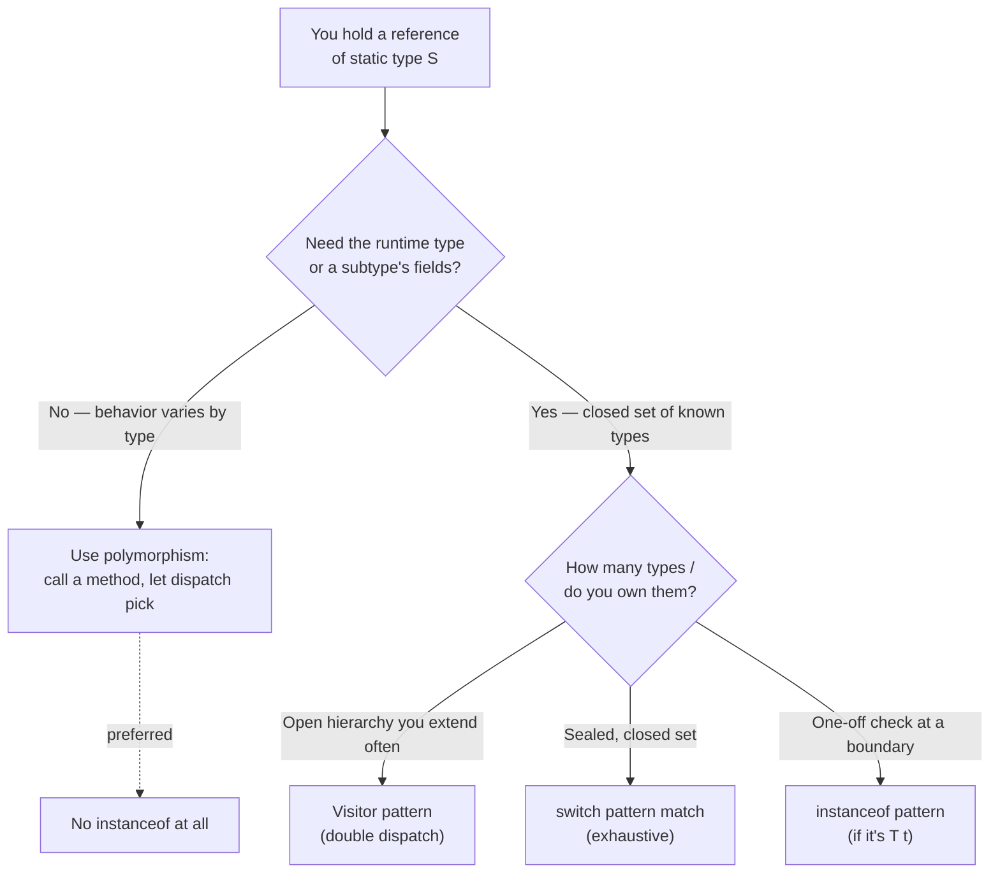
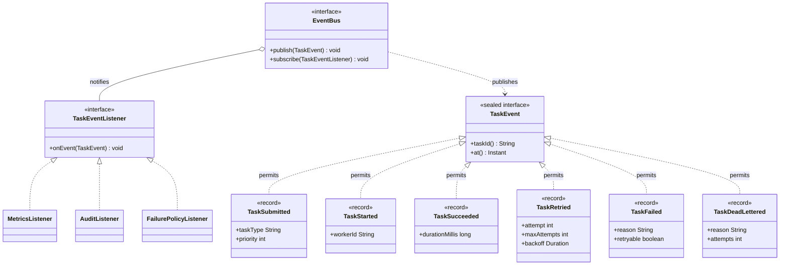

# instanceof and Pattern Matching

> Where this fits in the project: Phase 4 introduces an `EventBus` that broadcasts `TaskEvent`s — a task
> was submitted, started, succeeded, retried, dead-lettered. Subscribers (a metrics collector, an audit log,
> a Slack notifier) each receive *every* event and must decide, "is this the kind of event I care about, and
> if so, what fields does it carry?" That decision — "what concrete type is this object, and let me use it as
> that type" — is exactly what `instanceof` answers. This chapter teaches the operator, its modern
> **pattern-matching** form (Java 16+), exhaustive **switch over sealed types**, and — most importantly —
> *when a chain of `instanceof` is a design smell* that should become polymorphism, Strategy, or Visitor.

This chapter is the natural sequel to
[`chapter-10-upcasting-and-downcasting.md`](./chapter-10-upcasting-and-downcasting.md): downcasting is the
dangerous "trust me, this `Object` is really a `Task`" move, and `instanceof` is how you *check before you
trust*. It leans on [`chapter-09-polymorphism.md`](./chapter-09-polymorphism.md) (the thing we usually
*should* be doing instead) and sets up the [Visitor](../05-design-patterns/visitor.md) and
[Strategy](../05-design-patterns/strategy.md) patterns, plus the Phase 4
[`EventBus`](../09-project/phase-4.md). The `sealed`-interface machinery here is the same machinery used for
[functional outcomes](../01-java-fundamentals/chapter-08-functional-interfaces.md) and the queue-broker
hierarchy in [broker-comparison](../07-queues-and-messaging/broker-comparison.md).

---

## 1. Why This Exists

You have a reference of one static type and you need to know its *runtime* type — or you need to treat it as
a more specific type to reach fields the static type hides. That is the entire job of `instanceof`.

In a contest you almost never need this: your data is monomorphic, you control every type, and a tagged
`if (kind == 0)` is fine because the program lives for 50 ms. In a long-lived backend, objects arrive
through interfaces (`Object` from a deserializer, `TaskEvent` from an event bus, `Throwable` from a `catch`)
and you genuinely do not know the concrete type at compile time. `instanceof` is the **type-safe** way to
ask, replacing the unsafe alternative — blindly casting and praying you do not get a `ClassCastException`.

> **Definition.** `x instanceof T` evaluates to `true` if and only if `x` is non-null **and** the runtime
> type of `x` is `T` or a subtype of `T` (it is assignable to `T`). `null instanceof T` is **always
> `false`**, for every `T`. The operator never throws.

Historically Java only had the *boolean* form. You wrote the check, then re-wrote the cast:

```java
// Java 1.0 .. 15 — the classic "check then cast" two-step.
if (event instanceof TaskFailed) {
    TaskFailed failed = (TaskFailed) event;   // redundant: we JUST proved this
    log.warn("task {} failed: {}", failed.taskId(), failed.reason());
}
```

The cast is busywork the compiler should have done for you, and it is a place bugs hide (people change the
`instanceof` type but forget to change the cast type). Java 16 fixed this with **pattern matching for
`instanceof`**, and Java 21 finished the job with **pattern matching in `switch`** plus **record
deconstruction**. This chapter is about using all three well — and knowing when *not* to use any of them.



---

## 2. The Naive Version

Here is the first-cut event dispatcher most people write in Phase 4 before they know the modern tools. A
subscriber receives a `TaskEvent` and reacts based on what kind it is.

```java
// NAIVE: classic instanceof + cast, no exhaustiveness, easy to break.
class MetricsListener implements TaskEventListener {

    private final MetricsCollector metrics;
    MetricsListener(MetricsCollector metrics) { this.metrics = metrics; }

    @Override
    public void onEvent(TaskEvent event) {
        if (event instanceof TaskSubmitted) {
            TaskSubmitted e = (TaskSubmitted) event;
            metrics.increment("tasks.submitted", "type", e.taskType());
        } else if (event instanceof TaskSucceeded) {
            TaskSucceeded e = (TaskSucceeded) event;
            metrics.increment("tasks.succeeded", "type", e.taskType());
            metrics.recordLatency("tasks.duration", e.durationMillis());
        } else if (event instanceof TaskFailed) {
            TaskFailed e = (TaskFailed) event;
            metrics.increment("tasks.failed", "reason", e.reason());
        }
        // What about TaskRetried? TaskDeadLettered? Silently ignored.
    }
}
```

What is wrong here:

- **Repetition.** Every arm repeats the type name twice (`instanceof X` then `(X) event`) and binds a
  variable by hand. A copy-paste edit that updates one but not the other compiles and ships a bug.
- **No exhaustiveness.** Add a new event type `TaskRetried` and this code keeps compiling, silently dropping
  the event on the floor. There is no compiler safety net. The bug surfaces in production as "our retry
  counter is always zero."
- **Order-sensitivity.** If `TaskFailed extends TaskEvent` and `TaskDeadLettered extends TaskFailed`, the
  arms must be ordered most-specific-first or the wrong branch wins. Easy to get subtly wrong.
- **It is a magnet for change.** Every new event type forces an edit to *every* listener that switches on
  type. That is the Open/Closed violation we fought in
  [`chapter-09-polymorphism.md`](./chapter-09-polymorphism.md), back again in disguise.

> **Smell.** A long `if (x instanceof A) … else if (x instanceof B) …` ladder is the canonical sign you are
> *re-implementing dynamic dispatch by hand*. Nine times out of ten the right fix is to put the behavior on
> the type (polymorphism / Strategy). The tenth time — when the behavior genuinely lives *outside* the type
> hierarchy and varies per operation — is what Visitor and exhaustive `switch` are for.

---

## 3. The Improved Version

Java 16's **pattern matching for `instanceof`** removes the cast and the manual binding. The shape is
`if (event instanceof TaskFailed failed)` — if the test passes, `failed` is in scope, already the right
type, with **flow scoping**: the binding is available exactly where the compiler can prove the test held.

```java
// IMPROVED: pattern matching for instanceof. No casts, binding is automatic.
@Override
public void onEvent(TaskEvent event) {
    if (event instanceof TaskSubmitted submitted) {
        metrics.increment("tasks.submitted", "type", submitted.taskType());
    } else if (event instanceof TaskSucceeded succeeded) {
        metrics.increment("tasks.succeeded", "type", succeeded.taskType());
        metrics.recordLatency("tasks.duration", succeeded.durationMillis());
    } else if (event instanceof TaskFailed failed) {
        metrics.increment("tasks.failed", "reason", failed.reason());
    }
    // still no exhaustiveness — we'll fix that next with sealed + switch.
}
```

Two things just got better: the cast is gone (the compiler inserts it and *guarantees* it cannot throw),
and the variable is bound in one place so the type can never drift out of sync. **Flow scoping** is the
subtle, powerful part — the binding's scope follows the control flow where the pattern provably matched:

```java
// Flow scoping: 'failed' is in scope after the && because we can only reach
// the right operand when the left one (the pattern) matched.
if (event instanceof TaskFailed failed && failed.retryable()) {
    scheduleRetry(failed.taskId());
}

// And it works with early-return guards (the "negation" idiom):
void handle(TaskEvent event) {
    if (!(event instanceof TaskFailed failed)) {
        return;                       // not a failure → nothing to do
    }
    // From here on, 'failed' is definitely in scope and definitely a TaskFailed,
    // because the only way past the guard is for the pattern to have matched.
    log.warn("task {} failed: {}", failed.taskId(), failed.reason());
}
```

But we still have the *real* problem: nothing forces us to handle every event type. The compiler is happy
to let `TaskRetried` slip through. To close that hole we need the type hierarchy itself to be **closed** —
a `sealed` interface — and an exhaustive `switch`.

---

## 4. The Production-Quality Version

A staff engineer models `TaskEvent` as a **sealed interface** whose permitted implementations are records,
then dispatches with an **exhaustive `switch`** that deconstructs each record. The compiler now *proves*
every case is handled; forget one and the build fails.

```java
// The closed event hierarchy. 'sealed' + 'permits' tells the compiler the
// complete, finite set of subtypes — which is what makes switch exhaustive.
public sealed interface TaskEvent
        permits TaskSubmitted, TaskStarted, TaskSucceeded, TaskRetried,
                TaskFailed, TaskDeadLettered {

    String taskId();      // every event knows its task
    Instant at();         // and when it happened
}

public record TaskSubmitted(String taskId, String taskType, int priority, Instant at)
        implements TaskEvent {}

public record TaskStarted(String taskId, String workerId, Instant at)
        implements TaskEvent {}

public record TaskSucceeded(String taskId, String taskType, long durationMillis, Instant at)
        implements TaskEvent {}

public record TaskRetried(String taskId, int attempt, int maxAttempts, Duration backoff, Instant at)
        implements TaskEvent {}

public record TaskFailed(String taskId, String reason, boolean retryable, Instant at)
        implements TaskEvent {}

public record TaskDeadLettered(String taskId, String reason, int attempts, Instant at)
        implements TaskEvent {}
```

```java
// PRODUCTION: exhaustive switch over the sealed type, with record deconstruction.
// No default branch — the compiler verifies all six permitted types are covered.
// Add a seventh permitted type and THIS METHOD STOPS COMPILING until you handle it.
final class MetricsListener implements TaskEventListener {

    private final MeterRegistry registry;     // Micrometer — see ch.3 module
    MetricsListener(MeterRegistry registry) { this.registry = registry; }

    @Override
    public void onEvent(TaskEvent event) {
        switch (event) {
            case TaskSubmitted(String id, String type, int priority, var at) ->
                registry.counter("tasks.submitted", "type", type).increment();

            case TaskStarted(String id, String worker, var at) ->
                registry.counter("tasks.started", "worker", worker).increment();

            case TaskSucceeded(String id, String type, long ms, var at) -> {
                registry.counter("tasks.succeeded", "type", type).increment();
                registry.timer("tasks.duration", "type", type)
                        .record(ms, TimeUnit.MILLISECONDS);
            }

            case TaskRetried(String id, int attempt, int max, var backoff, var at) ->
                registry.counter("tasks.retried", "attempt", String.valueOf(attempt)).increment();

            case TaskFailed(String id, String reason, boolean retryable, var at) ->
                registry.counter("tasks.failed", "retryable", String.valueOf(retryable)).increment();

            case TaskDeadLettered(String id, String reason, int attempts, var at) ->
                registry.counter("tasks.dead_lettered", "reason", reason).increment();
        }
    }
}
```

Why this is the version to ship:

- **Exhaustiveness is compiler-checked.** `switch` over a sealed type with no `default` is exhaustive *by
  construction*. Adding `TaskCancelled` to the `permits` list turns every such `switch` in the codebase into
  a compile error — a free, repo-wide TODO list that you cannot forget to do. This is the single biggest
  reason to prefer sealed `switch` over `instanceof` ladders.
- **Deconstruction reads like the data.** `case TaskSucceeded(var id, var type, var ms, var at)` binds the
  components positionally, so the case header doubles as documentation of the record's shape.
- **No accidental `null`.** A `switch` on a reference throws `NullPointerException` on `null` *unless* you
  add a `case null` — so nulls are loud, not silent. (More on this in §8.)
- **No `default` trap.** A `default` arm would *re-open* the switch: add a new event type and the compiler
  stays quiet because `default` "handles" it. Omitting `default` on a sealed switch is the safety feature.

> **Rule of thumb.** Behavior that belongs to the *object* → put it on the type (polymorphism). Behavior
> that belongs to the *operation* and must stay exhaustive over a closed set → `sealed` + exhaustive
> `switch`. Behavior over an *open* hierarchy you extend constantly → Visitor. A bare `instanceof` chain is
> almost never the final answer.

---

## 5. Code Walkthrough

### 5a. Beginner — the boolean operator and the null rule

```java
public class InstanceofBasics {
    public static void main(String[] args) {
        Object a = "image.resize";
        Object b = 42;
        Object c = null;

        System.out.println(a instanceof String);   // true
        System.out.println(b instanceof String);   // false
        System.out.println(b instanceof Integer);  // true (autoboxed)
        System.out.println(c instanceof String);    // false — null is never an instance
        System.out.println(a instanceof Object);    // true — every non-null is an Object

        // instanceof respects the inheritance chain and interfaces:
        System.out.println(new java.util.ArrayList<>() instanceof java.util.List);       // true
        System.out.println(new java.util.ArrayList<>() instanceof java.util.Collection); // true
    }
}
```

Key takeaways for someone new to Java: `instanceof` is `true` for the exact type *and* any supertype or
interface it implements; it is `false` for `null`; and it never throws. Contrast with a raw cast
`(String) c`, which would *not* throw on `null` (casting null is legal) but `(String) b` *would* throw
`ClassCastException` at runtime — which is precisely why we test first.

### 5b. Intermediate — pattern matching with a guard, at a real boundary

A common boundary in our platform is deserializing an inbound payload. Suppose a generic JSON layer hands us
an `Object` and we must coerce it into a `Task`'s priority field, which is an `int` between 0 and 9.

```java
import java.util.OptionalInt;

public final class PriorityCoercion {

    /** Coerce an untyped JSON value into a valid task priority, or empty if it can't be. */
    public static OptionalInt coerce(Object raw) {
        // Guarded patterns: 'when' adds a boolean condition on top of the type test.
        return switch (raw) {
            case null                            -> OptionalInt.of(5);          // default priority
            case Integer i when i >= 0 && i <= 9 -> OptionalInt.of(i);
            case Integer i                       -> OptionalInt.empty();        // out of range
            case String s when s.isBlank()       -> OptionalInt.of(5);
            case String s -> {
                try { yield coerce(Integer.parseInt(s.trim())); }
                catch (NumberFormatException e) { yield OptionalInt.empty(); }
            }
            default -> OptionalInt.empty();                                     // unknown JSON type
        };
    }

    public static void main(String[] args) {
        System.out.println(coerce(7));        // OptionalInt[7]
        System.out.println(coerce(99));       // OptionalInt.empty
        System.out.println(coerce("3"));      // OptionalInt[3]
        System.out.println(coerce("oops"));   // OptionalInt.empty
        System.out.println(coerce(null));     // OptionalInt[5]
    }
}
```

Three new things appear here, all Java 21:

- **`case null`** — switch on a reference handles `null` *only* if you ask it to. Without `case null`, a
  `null` argument throws NPE before any case runs.
- **`when` guards** — a guard refines a type pattern with a boolean. Order matters: the *more specific*
  guarded case must come before the unguarded fallthrough of the same type, or it is dead code (a compile
  error: "this case label is dominated by a preceding case label").
- **`yield`** — returns a value from a `switch` expression's block arm. This is a `switch` *expression*
  (it produces a value), not a statement.

### 5c. Production-inspired — an audit listener and a router, both exhaustive

This is the kind of code that ships. Two subscribers on the Phase 4 `EventBus`, each an exhaustive
`switch`, each owning a *different* operation over the *same* closed event set.

```java
// Audit listener: produce a human-readable line for each event. The exhaustive
// switch is an EXPRESSION here, so it must return a String for every case.
final class AuditListener implements TaskEventListener {

    private final AuditLog log;
    AuditListener(AuditLog log) { this.log = log; }

    @Override
    public void onEvent(TaskEvent event) {
        String line = switch (event) {
            case TaskSubmitted s    -> "SUBMIT  %s type=%s prio=%d".formatted(s.taskId(), s.taskType(), s.priority());
            case TaskStarted s      -> "START   %s on worker=%s".formatted(s.taskId(), s.workerId());
            case TaskSucceeded s    -> "OK      %s in %dms".formatted(s.taskId(), s.durationMillis());
            case TaskRetried r      -> "RETRY   %s attempt %d/%d backoff=%s"
                                          .formatted(r.taskId(), r.attempt(), r.maxAttempts(), r.backoff());
            case TaskFailed f       -> "FAIL    %s reason=%s retryable=%b".formatted(f.taskId(), f.reason(), f.retryable());
            case TaskDeadLettered d -> "DEAD    %s after %d attempts: %s".formatted(d.taskId(), d.attempts(), d.reason());
        };
        log.append(event.at(), line);
    }
}
```

```java
// Routing logic: decide what the platform should DO next in response to a failure
// stream. Note how a nested guard distinguishes "retry" from "dead-letter" without
// any cast. This is where the closed switch earns its keep operationally.
final class FailurePolicyListener implements TaskEventListener {

    private final TaskScheduler scheduler;
    private final DeadLetterQueue dlq;
    private final TaskRepository repo;

    FailurePolicyListener(TaskScheduler scheduler, DeadLetterQueue dlq, TaskRepository repo) {
        this.scheduler = scheduler; this.dlq = dlq; this.repo = repo;
    }

    @Override
    public void onEvent(TaskEvent event) {
        switch (event) {
            // We only care about terminal-ish failures; everything else is a no-op,
            // but we STILL list them so the switch stays exhaustive and self-documenting.
            case TaskFailed(String id, String reason, boolean retryable, var at) when retryable ->
                repo.findById(id).ifPresent(t -> scheduler.schedule(t, Duration.ofSeconds(30)));

            case TaskFailed(String id, String reason, boolean retryable, var at) ->
                repo.findById(id).ifPresent(t -> dlq.send(t, "non-retryable: " + reason));

            case TaskDeadLettered d ->
                alertOncall("task " + d.taskId() + " dead-lettered: " + d.reason());

            case TaskSubmitted s -> { /* no-op */ }
            case TaskStarted s   -> { /* no-op */ }
            case TaskSucceeded s -> { /* no-op */ }
            case TaskRetried r   -> { /* no-op */ }
        }
    }

    private void alertOncall(String msg) { /* page via Slack/PagerDuty */ }
}
```

The two guarded `TaskFailed` cases show off the power: deconstruction binds `retryable` *and* a `when` guard
branches on it, all in the case header, all type-safe, zero casts. The trailing no-op cases are not waste —
they are the compiler-enforced proof that we *considered* every event and chose to ignore some.

---

## 6. How This Applies to Our Task Queue Project



Where each canonical concept connects:

- **`Worker` and `TaskHandler` should *not* use `instanceof`.** The whole point of looking up a
  `TaskHandler` by `task.type()` (a `Map<String, TaskHandler>`) is to *avoid* a type switch in the Worker.
  If you ever find yourself writing `if (handler instanceof EmailHandler)` inside `Worker.run()`, stop — the
  behavior belongs on `TaskHandler.handle()`. That is the §2 smell.
- **`TaskEvent` *is* the legitimate place for a closed `switch`.** Events are data, not behavior; the same
  event is interpreted differently by metrics, audit, and routing. Different operations over one closed data
  set is the textbook case for sealed + `switch` (and, when the hierarchy grows, for
  [Visitor](../05-design-patterns/visitor.md)).
- **`TaskResult` and `RetryPolicy`** can model a closed outcome with the same technique: a sealed
  `RetryDecision permits RetryAfter, GiveUp` is cleaner than a `boolean retryable` plus a nullable
  `Duration`. See [`chapter-12-abstract-classes.md`](./chapter-12-abstract-classes.md) for sealed-vs-abstract
  tradeoffs and [`chapter-13-interfaces.md`](./chapter-13-interfaces.md) for sealing interfaces.
- **Boundaries that hand us `Object`** — JSON deserialization (`payload`), JDBC `ResultSet` columns in the
  Phase 2 [`PostgresTaskQueue`](../09-project/phase-2.md), `catch (Exception e)` blocks classifying a
  failure as retryable — are where a *single* `instanceof` (not a chain) is the right tool. Exception
  classification ties into [retries](../08-distributed-systems/retries.md) and
  [dead-letter-queues](../07-queues-and-messaging/dead-letter-queues.md).

---

## 7. Tradeoffs

| Approach | Exhaustiveness | Adding a new type | Where logic lives | Best when |
|---|---|---|---|---|
| `instanceof` chain + cast (legacy) | None | Silent breakage | In the caller | Never (legacy only) |
| `instanceof` pattern (`if … x t`) | None | Silent breakage | In the caller | A single boundary check, not a ladder |
| `switch` over `sealed` + records | Compiler-checked | Build fails until handled | In the caller | Closed data set, many operations over it |
| Polymorphism (method on type) | N/A (no switch) | Just add a subclass | On the type | Behavior belongs to the object |
| [Visitor](../05-design-patterns/visitor.md) | Interface-enforced | Add visit method everywhere | In the visitor | Open hierarchy, many external operations |

The two axes that decide it:

1. **Does the behavior belong to the object or to the operation?** A `Task`'s *execution* belongs to its
   handler → polymorphism, no switch. A *metrics interpretation* of a `TaskEvent` belongs to the metrics
   subsystem, not the event → switch (or Visitor).
2. **Is the type set open or closed?** `TaskHandler` is *open* — the business adds new task types weekly, so
   we never want a switch we must edit. `TaskEvent` is *closed* — the set of lifecycle events changes rarely
   and deliberately, so an exhaustive switch's "edit everything when you add one" property is a *feature*
   (it forces every subsystem to acknowledge the new event).

> **The sealed-switch vs. Visitor decision.** Both give exhaustiveness. Sealed `switch` keeps each operation
> in one readable place but means N operations live in N switches scattered across the codebase. Visitor
> centralizes the dispatch contract in an interface (every new type forces a new `visitXxx` on every
> visitor) at the cost of more boilerplate and indirection. Below ~6 types and ~4 operations, prefer sealed
> `switch`. Above that, or when external libraries must extend the operation set, prefer Visitor. See
> [visitor.md](../05-design-patterns/visitor.md).

---

## 8. Common Mistakes and Pitfalls

- **`instanceof` ladder re-implementing dispatch.** If the chain switches on types *you own* to call
  type-specific *behavior*, that behavior belongs on the type. Fix: move it to a method, call polymorphically.
- **Forgetting `null` semantics.** `null instanceof T` is `false` (safe), but `switch (x)` on a `null`
  reference *throws NPE* unless you add `case null`. Decide deliberately; do not let it surprise you in prod.
- **Adding `default` to a sealed switch.** A `default` arm silently swallows future new types and kills
  exhaustiveness checking. Omit it; let the compiler force you to handle each new case. Use `case null,
  default ->` only when you truly want a catch-all.
- **Wrong dominance order with guards.** `case Integer i -> …` before `case Integer i when i > 0 -> …` makes
  the guarded case unreachable — a compile error. List specific/guarded cases first.
- **Casting without checking.** `(Task) obj` on the wrong type throws `ClassCastException` at runtime.
  Prefer the pattern form `obj instanceof Task t`, which checks and binds atomically. See
  [`chapter-10-upcasting-and-downcasting.md`](./chapter-10-upcasting-and-downcasting.md).
- **Using `getClass() == X.class` when you meant `instanceof`.** `instanceof` accepts subtypes;
  `getClass() == Foo.class` is exact-match only. The exact-match form is occasionally correct (e.g. inside
  `equals` to reject subclasses) but is usually a subtle bug when you wanted "is-a".
- **Raw vs. generic patterns.** `obj instanceof List<String> l` does not compile (generics are erased; the
  JVM can't check the element type). You can write `obj instanceof List<?> l`, or use the parameterized form
  only where the compiler can prove it from context. Test the raw type and accept the unchecked element type.
- **Pattern variable shadowing.** Reusing a binding name that already exists in scope is a compile error;
  pick fresh names, especially in nested switches.

---

## 9. Refactoring Exercise

**Bad** — a `notify`-everyone method on the `EventBus` consumer that grew an `instanceof` ladder, mixes
behavior and dispatch, and silently ignores new events:

```java
// BAD: ladder of instanceof + cast, no exhaustiveness, behavior tangled in.
class Notifier {
    void notify(Object event) {                       // even the type is too loose (Object)
        if (event instanceof TaskFailed) {
            TaskFailed f = (TaskFailed) event;
            if (f.retryable()) {
                scheduleRetry(f.taskId());
            } else {
                sendToDlq(f.taskId(), f.reason());
            }
        } else if (event instanceof TaskDeadLettered) {
            TaskDeadLettered d = (TaskDeadLettered) event;
            page(d.taskId());
        }
        // new event types? silently dropped. ordering bugs waiting to happen.
    }
}
```

**Improved** — tighten the parameter type and use pattern matching for `instanceof` to drop the casts:

```java
// IMPROVED: typed parameter + instanceof patterns. Casts gone, still not exhaustive.
class Notifier {
    void notify(TaskEvent event) {
        if (event instanceof TaskFailed f && f.retryable()) {
            scheduleRetry(f.taskId());
        } else if (event instanceof TaskFailed f) {        // f re-bound, fine: separate scope
            sendToDlq(f.taskId(), f.reason());
        } else if (event instanceof TaskDeadLettered d) {
            page(d.taskId());
        }
        // still no compiler guarantee we covered every event.
    }
}
```

**Production** — exhaustive `switch` over the sealed `TaskEvent`, deconstructing records, with no-op cases
made explicit so the compiler enforces total coverage:

```java
// PRODUCTION: exhaustive sealed switch. Add a new TaskEvent → this won't compile
// until you handle it. Guarded deconstruction splits retryable vs. terminal.
final class Notifier implements TaskEventListener {

    private final TaskScheduler scheduler;
    private final DeadLetterQueue dlq;
    private final TaskRepository repo;
    private final OnCall oncall;

    Notifier(TaskScheduler scheduler, DeadLetterQueue dlq, TaskRepository repo, OnCall oncall) {
        this.scheduler = scheduler; this.dlq = dlq; this.repo = repo; this.oncall = oncall;
    }

    @Override
    public void onEvent(TaskEvent event) {
        switch (event) {
            case TaskFailed(String id, String reason, boolean retryable, var at) when retryable ->
                repo.findById(id).ifPresent(t -> scheduler.schedule(t, Duration.ofSeconds(30)));

            case TaskFailed(String id, String reason, boolean retryable, var at) ->
                repo.findById(id).ifPresent(t -> dlq.send(t, "non-retryable: " + reason));

            case TaskDeadLettered(String id, String reason, int attempts, var at) ->
                oncall.page("dead-lettered " + id + " after " + attempts + ": " + reason);

            // Explicit no-ops keep the switch exhaustive AND document intent:
            case TaskSubmitted s -> { }
            case TaskStarted s   -> { }
            case TaskSucceeded s -> { }
            case TaskRetried r   -> { }
        }
    }
}
```

The journey is the lesson: **loosen nothing, check once, let the compiler count the cases.** Each step
removed a class of bug — casts, then exhaustiveness, then the over-broad `Object` parameter.

---

## 10. Exercises

> Solutions are in §11. Try each before peeking. Assume the sealed `TaskEvent` hierarchy and records from §4.

### Easy

- **E1 (knowledge check).** What does `null instanceof String` evaluate to, and what does `switch (x)` do
  when `x` is `null` and there is no `case null`? Why are these two behaviors different?
- **E2 (coding).** Write `boolean isTerminal(TaskEvent e)` returning `true` for `TaskSucceeded` and
  `TaskDeadLettered`, `false` otherwise — using a `switch` expression with no `default`.

### Medium

- **M1 (coding).** Write `Optional<Duration> backoffOf(TaskEvent e)` that returns the backoff of a
  `TaskRetried`, and empty for everything else, using a single `instanceof` pattern (not a switch).
- **M2 (refactoring).** Given the `instanceof`-ladder `summarize` below, refactor it to an exhaustive
  `switch` expression. Make adding a new event type a *compile error* until handled.

```java
class Summary {
    String summarize(TaskEvent e) {
        if (e instanceof TaskSubmitted) return "submitted";
        if (e instanceof TaskFailed) {
            TaskFailed f = (TaskFailed) e;
            return f.retryable() ? "failed (will retry)" : "failed (terminal)";
        }
        return "other";   // <-- the bug: hides everything else
    }
}
```

### Hard

- **H1 (design).** The platform now needs *four* operations over `TaskEvent`: metrics, audit text,
  failure-routing, and a JSON serializer. Should each be its own exhaustive `switch`, or should you
  introduce a Visitor? Justify with the two axes from §7, and sketch the Visitor interface either way.
- **H2 (interview-style).** Explain "flow scoping" of a pattern variable. Give one example where the binding
  *is* in scope after an `if` block and one where it is *not*, and explain why the compiler decides that.
- **H3 (stretch).** Implement a generic `EventBus` that publishes `TaskEvent`s to listeners and a
  `TypeFilter` decorator so a listener can subscribe to *only* `TaskFailed` and `TaskDeadLettered` without
  writing an `instanceof` check itself. Use a `Predicate<TaskEvent>` built from `instanceof` patterns.

---

## 11. Solutions

### E1

`null instanceof String` is **`false`** — by language rule, `null` is not an instance of any type, so the
operator is null-safe and never throws. A `switch (x)` *statement/expression* on a reference, however,
**throws `NullPointerException`** when `x` is `null` and there is no `case null` label. The difference is
deliberate: `instanceof` is a *predicate* (a question with a clean false answer for null), while `switch`
historically *selects* among cases and was retrofitted with pattern matching — to preserve old behavior and
avoid silently mishandling null, the language requires you to opt in with `case null`.

### E2

```java
static boolean isTerminal(TaskEvent e) {
    return switch (e) {
        case TaskSucceeded s, TaskDeadLettered d -> true;
        case TaskSubmitted s, TaskStarted st, TaskRetried r, TaskFailed f -> false;
    };
}
```

No `default`: the compiler verifies all six permitted types appear. Multiple type patterns share an arm via
the comma. Each labeled type still names a (here unused) binding; for a plain `true`/`false` we just name
them and ignore the bindings.

### M1

```java
import java.time.Duration;
import java.util.Optional;

static Optional<Duration> backoffOf(TaskEvent e) {
    return (e instanceof TaskRetried r)
            ? Optional.of(r.backoff())
            : Optional.empty();
}
```

A single `instanceof` pattern is exactly right here: one type of interest, a boundary-style check, no need
to enumerate the whole hierarchy. Using a full `switch` would be over-engineering for "is it this one type?"

### M2

```java
final class Summary {
    String summarize(TaskEvent e) {
        return switch (e) {
            case TaskSubmitted s    -> "submitted";
            case TaskStarted s      -> "started";
            case TaskSucceeded s    -> "succeeded";
            case TaskRetried r      -> "retrying (attempt " + r.attempt() + ")";
            case TaskFailed f       -> f.retryable() ? "failed (will retry)" : "failed (terminal)";
            case TaskDeadLettered d -> "dead-lettered";
        };
    }
}
```

The fix removes the `return "other"` catch-all. Now if someone adds `TaskCancelled` to `TaskEvent`'s
`permits`, this method *fails to compile* with "the switch statement does not cover all possible input
values" — turning a silent runtime bug into a loud build-time one.

### H1

Use the §7 axes. **Operation count is moderate (4) and growing; the type set is closed (6) and stable.**
That sits right on the sealed-switch/Visitor boundary. Recommendation: **start with four exhaustive
`switch`es** (one per operation), because each operation stays in one readable place and the four operations
are unlikely to be extended by *external* code. Promote to Visitor only if (a) the operation set itself
becomes open/pluggable, or (b) you start duplicating non-trivial traversal logic across the switches.

Either way, the Visitor interface would look like:

```java
public interface TaskEventVisitor<R> {
    R visit(TaskSubmitted e);
    R visit(TaskStarted e);
    R visit(TaskSucceeded e);
    R visit(TaskRetried e);
    R visit(TaskFailed e);
    R visit(TaskDeadLettered e);
}
// and TaskEvent gains: <R> R accept(TaskEventVisitor<R> v);
```

With sealed types + exhaustive `switch`, Java 21 gives you ~90% of Visitor's safety (compiler-checked
totality) without the `accept`/`visit` boilerplate — which is why modern Java reaches for sealed `switch`
first and Visitor second. See [visitor.md](../05-design-patterns/visitor.md).

### H2

**Flow scoping** means a pattern variable is in scope exactly where the compiler can prove the pattern
matched (and not elsewhere). The scope follows *definite assignment / reachability*, not lexical braces.

```java
// IN scope after the block: the only way to fall through to use(failed)
// would require the pattern to have matched, because the other path returns.
void inScope(TaskEvent e) {
    if (!(e instanceof TaskFailed failed)) return;
    use(failed);                 // OK: reachable only when 'failed' is bound
}

// NOT in scope after the block: control can reach the line below WITHOUT
// the pattern having matched (the if body might not run), so 'failed' is undefined here.
void notInScope(TaskEvent e) {
    if (e instanceof TaskFailed failed) {
        use(failed);             // OK inside the matched block
    }
    // use(failed);              // COMPILE ERROR: 'failed' may be unbound here
}
```

The compiler reasons about *which paths reach a given point*. In `inScope`, the early `return` removes the
non-matching path, so after the `if`, `failed` is guaranteed bound. In `notInScope`, the path where the
pattern did *not* match falls straight through, so the binding cannot be guaranteed and is not in scope.

### H3

```java
import java.time.Instant;
import java.util.List;
import java.util.concurrent.CopyOnWriteArrayList;
import java.util.function.Predicate;

@FunctionalInterface
interface TaskEventListener { void onEvent(TaskEvent e); }

interface EventBus {
    void publish(TaskEvent e);
    void subscribe(TaskEventListener l);
}

final class InMemoryEventBus implements EventBus {
    private final List<TaskEventListener> listeners = new CopyOnWriteArrayList<>();
    @Override public void subscribe(TaskEventListener l) { listeners.add(l); }
    @Override public void publish(TaskEvent e) {
        for (var l : listeners) {
            try { l.onEvent(e); }
            catch (RuntimeException ex) { /* isolate: one bad listener must not kill the bus */ }
        }
    }
}

/** Decorator: wraps a listener so it only sees events matching a predicate. */
final class TypeFilter implements TaskEventListener {
    private final Predicate<TaskEvent> accept;
    private final TaskEventListener delegate;
    TypeFilter(Predicate<TaskEvent> accept, TaskEventListener delegate) {
        this.accept = accept; this.delegate = delegate;
    }
    @Override public void onEvent(TaskEvent e) {
        if (accept.test(e)) delegate.onEvent(e);
    }
    // Build the predicate from instanceof patterns — the ONLY instanceof in user code.
    static TaskEventListener failuresOnly(TaskEventListener delegate) {
        Predicate<TaskEvent> p = e -> e instanceof TaskFailed || e instanceof TaskDeadLettered;
        return new TypeFilter(p, delegate);
    }
}

// Usage:
class Demo {
    public static void main(String[] args) {
        EventBus bus = new InMemoryEventBus();
        bus.subscribe(TypeFilter.failuresOnly(e -> System.out.println("FAILURE: " + e.taskId())));
        bus.publish(new TaskSucceeded("t1", "email", 12, Instant.now()));       // filtered out
        bus.publish(new TaskFailed("t2", "smtp timeout", true, Instant.now())); // delivered
    }
}
```

The decorator centralizes the *one* legitimate `instanceof` use (a boundary filter) so no individual
business listener has to. `CopyOnWriteArrayList` makes subscribe/publish safe under concurrent access (see
[`../06-concurrency/concurrent-collections.md`](../06-concurrency/concurrent-collections.md)), and the
`try/catch` isolates listener failures — both production essentials for an event bus.

---

## 12. Interview Questions and Takeaways

1. **What does `instanceof` return for `null`, and why?**
   Always `false`. `instanceof` is a null-safe predicate by language design, so you can test a possibly-null
   reference without a separate null check and without risking an exception.

2. **What is pattern matching for `instanceof` and what does it eliminate?**
   `if (x instanceof T t)` tests and binds atomically, with flow scoping. It eliminates the redundant cast
   and the class of bugs where the `instanceof` type and the cast type drift apart.

3. **Why does a `switch` over a sealed type not need a `default`, and why is that good?**
   The compiler knows the complete set of permitted subtypes, so it can verify totality. Omitting `default`
   means adding a new subtype turns every such `switch` into a compile error — exhaustiveness becomes a
   build-time guarantee instead of a runtime hope.

4. **When is an `instanceof` chain a code smell, and what replaces it?**
   When it switches on types you own to invoke type-specific *behavior* — that is hand-rolled dynamic
   dispatch. Replace with polymorphism (behavior on the type) or, for operations external to a closed data
   set, sealed `switch` / Visitor.

5. **Sealed `switch` vs. the Visitor pattern — when each?**
   Both give exhaustiveness. Sealed `switch` is lighter and keeps each operation in one place; prefer it for
   small, closed hierarchies. Visitor centralizes the dispatch contract and suits open operation sets or
   library-extensible designs, at the cost of boilerplate.

6. **What is flow scoping?**
   A pattern variable is in scope only where the compiler can prove the pattern matched, based on
   reachability — not lexical braces. The negated-guard early-return idiom extends a binding past an `if`.

7. **Can you write `obj instanceof List<String> l`?**
   No — generics are erased, so the JVM cannot check the element type at runtime. Use `List<?>` (or test the
   raw `List` and accept an unchecked element type). The compiler only permits a parameterized pattern when
   it can prove it from the static type.

8. **`instanceof` vs. `getClass() == Foo.class`?**
   `instanceof` is true for subtypes (an "is-a" test); the `getClass` comparison is exact-match only.
   Use exact match deliberately (e.g., symmetric `equals`); otherwise you usually want `instanceof`.

> **Takeaways.** Prefer *not* needing `instanceof` (polymorphism). When you do need it, use the *pattern*
> form to fuse check + cast. For a closed data set with operations over it, model it `sealed` and dispatch
> with an *exhaustive, default-less* `switch` so the compiler counts your cases for you. Reach for Visitor
> only when the operation set is open or the hierarchy is large.

---

## 13. Production Considerations

- **Schema evolution of events is the real risk.** When `TaskEvent` is serialized to a broker (Kafka in
  Phase 4) and consumed by a *separately deployed* service, exhaustive `switch` protects you *within* one
  binary, not *across* versions. A consumer compiled against 6 event types that receives a 7th over the wire
  must degrade gracefully — typically a deserialization layer maps unknown events to a sentinel
  `UnknownEvent` (added to `permits`) so the switch stays exhaustive and unknown events are logged, not
  dropped. Plan your sealed hierarchy with a forward-compatible catch-all from day one.
- **`switch` on `null` in hot paths.** An NPE thrown by a `switch` deep in an event loop can take down a
  worker thread. Either guarantee non-null upstream (validate at the bus boundary) or add an explicit
  `case null ->` that logs and drops. Do not rely on the implicit NPE as control flow.
- **Performance.** `instanceof` and pattern `switch` compile to efficient bytecode; for a small sealed
  hierarchy the JIT handles them well. Do not micro-optimize away a clean exhaustive `switch` for a hand-
  rolled type-tag `int` field — you would trade compiler-checked correctness for a negligible, usually
  unmeasurable win, and reintroduce the silent-drop bug class.
- **Observability.** Pair the `default`-less switch with a metric per event type (as in `MetricsListener`).
  A new event type with a zero counter in Grafana is often your first signal that a producer was deployed
  ahead of a consumer.
- **Testing exhaustiveness.** Add a unit test that iterates a representative instance of every permitted
  subtype through each listener and asserts no exception. Combined with the compiler's totality check, this
  catches logic bugs (wrong counter, swapped fields) that the type system cannot. Use JUnit 5 + AssertJ.

---

## What We Can Improve In Our Project Using This Concept

- Replace any nascent `instanceof`/`getClass` dispatch in early Phase 4 event handling with a single
  `sealed interface TaskEvent` and exhaustive `switch`es in `MetricsListener`, `AuditListener`, and
  `FailurePolicyListener`.
- Audit `Worker.run()` and the `TaskHandler` lookup to confirm there is *no* type switching there — handler
  selection must stay a `Map<String, TaskHandler>` keyed by `task.type()`, pure polymorphism.
- Convert the `TaskResult(boolean success, String message, boolean retryable)` tri-state into (or add
  alongside it) a sealed `RetryDecision permits RetryAfter, GiveUp` so retry logic is exhaustive instead of
  a nullable-`Duration`-plus-`boolean` puzzle.

## Project Refactoring Task

Introduce the `sealed interface TaskEvent` with the six record subtypes from §4. Implement
`InMemoryEventBus`, `TaskEventListener`, and three exhaustive-`switch` listeners (`MetricsListener`,
`AuditListener`, `FailurePolicyListener`). Wire the bus into the worker lifecycle so that submit/start/
succeed/retry/fail/dead-letter each publish the matching event. Add a future-proof `UnknownEvent` to the
`permits` list and have the (future) deserializer fall back to it. Write a JUnit 5 test that pushes one
instance of every permitted subtype through every listener and asserts no exceptions and correct counters.

## Git Commit For This Chapter

```text
feat(events): add sealed TaskEvent hierarchy and exhaustive switch listeners

- Add sealed interface TaskEvent permitting six lifecycle records
- Add InMemoryEventBus + TaskEventListener with listener isolation
- Implement MetricsListener/AuditListener/FailurePolicyListener via
  exhaustive default-less switch (compiler-checked totality)
- Replace legacy instanceof-ladder Notifier with pattern-matching switch
- Add UnknownEvent fallback for forward-compatible deserialization

Files touched:
  src/main/java/.../events/TaskEvent.java
  src/main/java/.../events/{TaskSubmitted,TaskStarted,TaskSucceeded,
      TaskRetried,TaskFailed,TaskDeadLettered,UnknownEvent}.java
  src/main/java/.../events/{EventBus,InMemoryEventBus,TaskEventListener}.java
  src/main/java/.../events/{MetricsListener,AuditListener,FailurePolicyListener}.java
  src/test/java/.../events/TaskEventDispatchTest.java
```

## Architecture Impact

This formalizes the **event layer** that Phase 4 leans on. Modeling `TaskEvent` as a closed sealed hierarchy
makes the system's vocabulary of lifecycle transitions explicit and compiler-enforced: any subsystem that
consumes events must acknowledge every event type, so a new lifecycle stage (e.g. `TaskCancelled`) cannot be
half-integrated. It also draws a sharp line — *behavior* (task execution) stays polymorphic on
`TaskHandler`, while *interpretation* (metrics, audit, routing) lives in exhaustive switches outside the
data — which is what lets the worker core stay closed for modification as the platform grows. See
[`../09-project/phase-4.md`](../09-project/phase-4.md) and
[`../09-project/architecture.md`](../09-project/architecture.md).

## Interview Takeaways

- `null instanceof T` is always `false`; `switch` on `null` throws unless `case null` is present.
- Pattern matching for `instanceof` fuses check + cast with flow scoping, killing a whole bug class.
- `sealed` + exhaustive, `default`-less `switch` makes "handle every case" a compile-time guarantee.
- An `instanceof` ladder over types you own to pick *behavior* is hand-rolled dispatch — use polymorphism.
- Sealed `switch` vs. Visitor: both exhaustive; switch is lighter for small closed sets, Visitor for open
  operation sets. Java 21 makes sealed `switch` the default reach.
