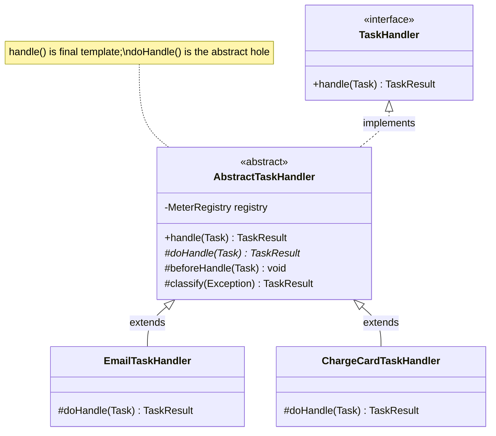
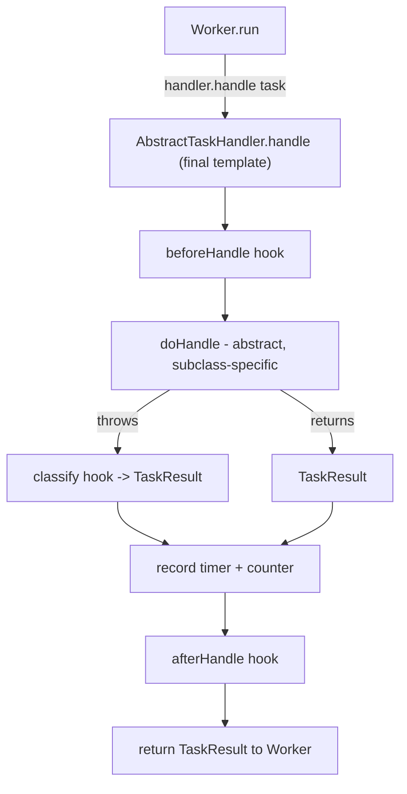

# Abstract Classes

> Where this fits: every `TaskHandler` in our platform has to do the *same* boring ceremony — start a timer, count the attempt, run the business logic, classify the outcome as retryable or fatal, stop the timer, emit a metric. Only the middle step differs per task type. An **abstract class** lets us write that ceremony *once* in a base `AbstractTaskHandler` and let each concrete handler fill in only the business logic. This is the structural backbone of the Template Method pattern that the worker loop leans on.

In [chapter-11-instanceof.md](chapter-11-instanceof.md) we learned to *inspect* an object's real type at run time. In [chapter-07-method-overriding.md](chapter-07-method-overriding.md) we learned that the JVM dispatches to that real type. An **abstract class** combines both ideas into a deliberate design tool: it ships *partial* behavior (concrete methods you inherit for free) plus *holes* (abstract methods subclasses are forced to fill). It is the missing rung between a plain class (all behavior, no holes) and an interface (mostly contract, historically no state).

This chapter builds the canonical `AbstractTaskHandler` for our Task Queue, contrasts abstract classes with interfaces rigorously, and shows the exact failure modes that bite in production.

---

## 1. Why This Exists

Look at two concrete handlers in our platform. One sends an email; one charges a card.

```java
// EmailTaskHandler — naive, standalone
public final class EmailTaskHandler implements TaskHandler {
    private final MeterRegistry registry;
    public EmailTaskHandler(MeterRegistry registry) { this.registry = registry; }

    @Override
    public TaskResult handle(Task task) throws Exception {
        long start = System.nanoTime();
        try {
            // --- the only interesting line ---
            sendEmail(task.payload());
            return new TaskResult(true, "email sent", false);
        } catch (TransientSmtpException e) {
            return new TaskResult(false, e.getMessage(), true);   // retryable
        } catch (InvalidAddressException e) {
            return new TaskResult(false, e.getMessage(), false);  // fatal
        } finally {
            registry.timer("task.handle", "type", "email")
                    .record(System.nanoTime() - start, TimeUnit.NANOSECONDS);
        }
    }
    private void sendEmail(String payload) { /* ... */ }
}
```

```java
// ChargeCardTaskHandler — naive, standalone
public final class ChargeCardTaskHandler implements TaskHandler {
    private final MeterRegistry registry;
    public ChargeCardTaskHandler(MeterRegistry registry) { this.registry = registry; }

    @Override
    public TaskResult handle(Task task) throws Exception {
        long start = System.nanoTime();
        try {
            charge(task.payload());                               // the only interesting line
            return new TaskResult(true, "charged", false);
        } catch (GatewayTimeoutException e) {
            return new TaskResult(false, e.getMessage(), true);   // retryable
        } catch (CardDeclinedException e) {
            return new TaskResult(false, e.getMessage(), false);  // fatal
        } finally {
            registry.timer("task.handle", "type", "charge")
                    .record(System.nanoTime() - start, TimeUnit.NANOSECONDS);
        }
    }
    private void charge(String payload) { /* ... */ }
}
```

Ninety percent of these two classes is **identical**: time the call, try/catch, classify the error, record a timer in `finally`. The duplicated parts are precisely the parts you must *never* get wrong — forget the `finally` and you leak the timer; mislabel an exception and a fatal error retries forever, hammering the payment gateway. Duplicated cross-cutting code is duplicated bugs.

An abstract class lets us hoist the invariant skeleton into a base and leave a single hole — "do the work" — for subclasses:

```java
public abstract class AbstractTaskHandler implements TaskHandler {
    protected abstract TaskResult doHandle(Task task) throws Exception; // the hole
    // ... timing + classification ceremony lives here, written once ...
}
```

**Historical note.** Simula 67 and C++ formalized abstract classes via *pure virtual* methods (`virtual void f() = 0;`). Java adopted the `abstract` keyword in 1.0. For two decades the rule of thumb was crisp: *abstract classes carry state and partial implementation; interfaces carry only contract.* Java 8 blurred the line by adding `default` methods to interfaces, and Java 16 made `private` interface methods legal. So the modern question is no longer "can an interface have behavior?" (yes) but "do I need **state**, **constructors**, or a **single forced lineage**?" — those remain the exclusive territory of abstract classes. We sharpen that distinction in section 8.



> An abstract class is a class that **cannot be instantiated** (`new AbstractTaskHandler()` is a compile error) and **may** declare abstract methods (methods with a signature but no body) that subclasses must implement.

---

## 2. The Three-Sentence Mental Model

1. **Abstract class** = a half-built class. It can hold fields, constructors, concrete methods, *and* abstract methods. You can't `new` it; you `extend` it and fill the holes.
2. **Abstract method** = a signature with no body, marked `abstract`. Any non-abstract subclass *must* override it, or the compiler rejects the subclass.
3. **Template Method** = a concrete (often `final`) method in the base that calls the abstract holes in a fixed order. The base owns the *algorithm's shape*; subclasses own the *steps*.

Everything below is an elaboration of these three sentences against the Task Queue.

---

## 3. The Naive Version

Before abstract classes, you reach for one of two bad tools.

**Bad option A — copy/paste (shown above).** Every handler re-implements timing and error classification. When you decide retryable errors should also increment a `task.retryable_failure` counter, you edit N files and miss one.

**Bad option B — a giant `switch` in a single God-handler:**

```java
// Anti-pattern: one handler that knows every task type
public final class MegaTaskHandler implements TaskHandler {
    @Override
    public TaskResult handle(Task task) throws Exception {
        long start = System.nanoTime();
        try {
            return switch (task.type()) {
                case "email"  -> { sendEmail(task.payload());  yield new TaskResult(true, "ok", false); }
                case "charge" -> { charge(task.payload());     yield new TaskResult(true, "ok", false); }
                // every new type edits THIS method -> Open/Closed violation
                default -> throw new IllegalArgumentException("unknown type " + task.type());
            };
        } catch (Exception e) {
            // one-size-fits-all classification: WRONG. A declined card is not retryable.
            return new TaskResult(false, e.getMessage(), true);
        } finally {
            // timer tag can't distinguish types cleanly here
        }
    }
    private void sendEmail(String p) {}
    private void charge(String p) {}
}
```

Limitations, in order of severity:

- **Open/Closed violation.** Every new task type edits the central `switch`. See [../04-oop-and-ood/solid.md](../04-oop-and-ood/solid.md).
- **Lost error semantics.** A single `catch` can't tell a transient gateway timeout (retry) from a hard card decline (give up). Misclassification either wastes money retrying fatal errors or drops recoverable ones.
- **Untestable in isolation.** You can't unit-test "email logic" without dragging in charge logic.
- **No shared invariants.** Bad option A has no central place to *enforce* that every handler records a timer.

---

## 4. The Improved Version

Pull the skeleton into an abstract base. Subclasses override one method.

```java
import io.micrometer.core.instrument.MeterRegistry;
import java.util.concurrent.TimeUnit;

public abstract class AbstractTaskHandler implements TaskHandler {

    private final MeterRegistry registry;

    protected AbstractTaskHandler(MeterRegistry registry) {
        this.registry = registry;   // abstract classes have constructors; interfaces do not
    }

    /** The ONE method a subclass must implement: the actual business work. */
    protected abstract TaskResult doHandle(Task task) throws Exception;

    /** The template: timing + uniform exception funneling, written once. */
    @Override
    public final TaskResult handle(Task task) throws Exception {   // final = subclasses can't break the skeleton
        long start = System.nanoTime();
        try {
            return doHandle(task);
        } finally {
            registry.timer("task.handle", "type", task.type())
                    .record(System.nanoTime() - start, TimeUnit.NANOSECONDS);
        }
    }
}
```

```java
public final class EmailTaskHandler extends AbstractTaskHandler {
    public EmailTaskHandler(MeterRegistry registry) { super(registry); }

    @Override
    protected TaskResult doHandle(Task task) {
        try {
            sendEmail(task.payload());
            return new TaskResult(true, "email sent", false);
        } catch (TransientSmtpException e) {
            return new TaskResult(false, e.getMessage(), true);
        } catch (InvalidAddressException e) {
            return new TaskResult(false, e.getMessage(), false);
        }
    }
    private void sendEmail(String payload) { /* ... */ }
}
```

Better — timing is centralized. But each subclass *still* hand-writes its own try/catch and decides retryability ad hoc. We have only solved half the duplication. The classification logic is the part most likely to be wrong, and it's still copy-pasted.

---

## 5. The Production-Quality Version

A staff engineer factors out **both** axes of variation:

- **What work to do** → abstract `doHandle`.
- **How to classify a thrown exception** → a *protected hook* `classify(Throwable)` with a sane default the subclass can override or extend.

We also add **protected lifecycle hooks** (`beforeHandle`, `afterHandle`) with empty defaults, so subclasses can opt into extra behavior (validation, audit logging) without touching the template. This is the full Template Method pattern (see [../05-design-patterns/template-method.md](../05-design-patterns/template-method.md)).

```java
import io.micrometer.core.instrument.MeterRegistry;
import java.time.Duration;
import java.util.concurrent.TimeUnit;
import org.slf4j.Logger;
import org.slf4j.LoggerFactory;

/**
 * Base for all task handlers. Owns timing, attempt counting, structured logging,
 * and exception -> TaskResult classification. Subclasses implement only doHandle().
 *
 * Thread-safety: instances are stateless beyond injected collaborators and may be
 * shared across worker threads. Do NOT add mutable instance fields in subclasses.
 */
public abstract class AbstractTaskHandler implements TaskHandler {

    protected final Logger log = LoggerFactory.getLogger(getClass()); // logs under the SUBCLASS name
    private final MeterRegistry registry;

    protected AbstractTaskHandler(MeterRegistry registry) {
        this.registry = registry;
    }

    // ---- The abstract hole: the only thing a subclass MUST provide ----
    protected abstract TaskResult doHandle(Task task) throws Exception;

    // ---- Protected hooks: empty defaults, override to opt in ----
    /** Runs before the work. Throw to fail fast (e.g. payload validation). */
    protected void beforeHandle(Task task) throws Exception { /* no-op default */ }

    /** Runs after the work, success or failure. Use for cleanup/audit. */
    protected void afterHandle(Task task, TaskResult result) { /* no-op default */ }

    /**
     * Maps an unexpected exception to a TaskResult. Default: everything is
     * retryable EXCEPT IllegalArgumentException (bad input never gets better).
     * Subclasses override to teach domain-specific fatal/transient distinctions.
     */
    protected TaskResult classify(Throwable t) {
        boolean retryable = !(t instanceof IllegalArgumentException);
        return new TaskResult(false, t.getClass().getSimpleName() + ": " + t.getMessage(), retryable);
    }

    // ---- The template method: fixed algorithm, cannot be overridden ----
    @Override
    public final TaskResult handle(Task task) {
        long start = System.nanoTime();
        TaskResult result;
        try {
            beforeHandle(task);
            result = doHandle(task);
            if (result == null) {                       // defensive: a buggy subclass
                result = new TaskResult(false, "handler returned null", false);
            }
        } catch (Exception e) {
            log.warn("task {} type={} attempt={} failed", task.id(), task.type(), task.attempts(), e);
            result = classify(e);                       // hook decides retryability
        } finally {
            Duration elapsed = Duration.ofNanos(System.nanoTime() - start);
            registry.timer("task.handle", "type", task.type())
                    .record(elapsed.toNanos(), TimeUnit.NANOSECONDS);
        }
        registry.counter("task.outcome", "type", task.type(),
                         "success", String.valueOf(result.success())).increment();
        afterHandle(task, result);
        return result;
    }
}
```

```java
/** Concrete handler: only the genuinely email-specific code remains. */
public final class EmailTaskHandler extends AbstractTaskHandler {

    private final SmtpClient smtp;

    public EmailTaskHandler(MeterRegistry registry, SmtpClient smtp) {
        super(registry);
        this.smtp = smtp;
    }

    @Override
    protected void beforeHandle(Task task) {
        if (!task.payload().contains("@")) {            // opt into validation
            throw new IllegalArgumentException("payload has no recipient");
        }
    }

    @Override
    protected TaskResult doHandle(Task task) throws Exception {
        smtp.send(task.payload());                      // just the work; throws on failure
        return new TaskResult(true, "email sent", false);
    }

    @Override
    protected TaskResult classify(Throwable t) {        // domain-specific override
        if (t instanceof InvalidAddressException) {
            return new TaskResult(false, "bad address", false); // fatal, don't retry
        }
        return super.classify(t);                        // SMTP timeouts -> retryable default
    }
}
```

What this buys us:

- **Single source of truth** for timing, attempt logging, null-result defense, and metric emission.
- **Per-type classification** that defaults to "retry transient, drop bad input" but can be sharpened — the email handler marks a bad address as fatal.
- `handle` is `final`: no subclass can accidentally skip the timer or the counter. The skeleton is *enforced*, not merely *offered*.
- Subclasses opt into `beforeHandle`/`afterHandle` only when they need them — the empty defaults keep simple handlers a single method.

---

## 6. Code Walkthrough — Beginner → Intermediate → Production

### 6.1 Beginner: the smallest possible abstract class

Strip away the project for a moment to see the mechanics.

```java
abstract class Shape {            // cannot be instantiated
    abstract double area();        // abstract method: no body, must be overridden

    String describe() {            // concrete method: inherited as-is
        return "area = " + area(); // calls the abstract method polymorphically
    }
}

final class Circle extends Shape {
    private final double r;
    Circle(double r) { this.r = r; }
    @Override double area() { return Math.PI * r * r; }   // fills the hole
}

public class Demo {
    public static void main(String[] args) {
        // Shape s = new Shape();        // COMPILE ERROR: Shape is abstract
        Shape s = new Circle(2.0);       // OK: upcast to the abstract type
        System.out.println(s.describe()); // "area = 12.566..." — describe() calls Circle.area()
    }
}
```

The two load-bearing facts: you **cannot** `new Shape()`, and the concrete `describe()` calls the abstract `area()` which resolves to the subclass at run time. That late-bound call from a concrete method *into* an abstract one is the seed of Template Method.

### 6.2 Intermediate: an abstract base with state and a constructor

Interfaces (pre-Java-8) could not do this; abstract classes always could. Here the base holds a field and runs setup in its constructor.

```java
import java.time.Instant;

abstract class AbstractTaskHandler {
    private final String handlerName;        // shared STATE — interfaces can't hold this
    private long invocations = 0;            // mutable per-instance bookkeeping

    protected AbstractTaskHandler(String handlerName) {   // constructor enforces an invariant
        if (handlerName == null || handlerName.isBlank())
            throw new IllegalArgumentException("handlerName required");
        this.handlerName = handlerName;
    }

    protected abstract TaskResult doHandle(Task task) throws Exception;

    public final TaskResult handle(Task task) throws Exception {
        invocations++;                       // base manages shared counter
        System.out.printf("[%s] handling %s at %s (call #%d)%n",
                handlerName, task.id(), Instant.now(), invocations);
        return doHandle(task);
    }

    public final long invocations() { return invocations; }
}

final class LoggingTaskHandler extends AbstractTaskHandler {
    LoggingTaskHandler() { super("logging"); }   // MUST call a super constructor
    @Override
    protected TaskResult doHandle(Task task) {
        System.out.println("payload: " + task.payload());
        return new TaskResult(true, "logged", false);
    }
}
```

Note the chain: `new LoggingTaskHandler()` → `super("logging")` → base constructor validates and assigns. A subclass *cannot* skip the base constructor; if you don't call `super(...)` explicitly and the base has no no-arg constructor, it's a compile error. This is how an abstract base guarantees its invariants are established before any subclass code runs (see [chapter-03-constructors.md](chapter-03-constructors.md)).

### 6.3 Production-inspired: the full handler wired into a `Worker`

This is how the base meets the rest of the canonical model. The `Worker` (from the SPEC) looks up a handler by task type and calls the template `handle`; it never knows or cares which concrete subclass it got.

```java
import io.micrometer.core.instrument.MeterRegistry;
import java.util.Map;

/** A Worker pulls tasks and dispatches to the registered handler. */
public final class Worker implements Runnable {
    private final TaskQueue queue;
    private final Map<String, TaskHandler> handlers; // type -> handler (often AbstractTaskHandler subclasses)
    private final DeadLetterQueue dlq;
    private final RetryPolicy retryPolicy;
    private volatile boolean running = true;

    public Worker(TaskQueue queue, Map<String, TaskHandler> handlers,
                  DeadLetterQueue dlq, RetryPolicy retryPolicy) {
        this.queue = queue; this.handlers = handlers; this.dlq = dlq; this.retryPolicy = retryPolicy;
    }

    @Override
    public void run() {
        while (running) {
            try {
                Task task = queue.dequeue();                 // blocks (see ../06-concurrency/blocking-queue.md)
                TaskHandler handler = handlers.get(task.type());
                if (handler == null) { dlq.send(task, "no handler for type " + task.type()); continue; }

                TaskResult result = handler.handle(task);    // template method runs; subclass fills doHandle
                if (result.success()) {
                    continue;                                // mark SUCCEEDED elsewhere
                }
                if (result.retryable() && task.attempts() < task.maxAttempts()) {
                    retryPolicy.nextDelay(task.attempts())
                               .ifPresent(d -> requeueAfter(task, d));
                } else {
                    dlq.send(task, result.message());        // fatal or out of attempts -> DLQ
                }
            } catch (InterruptedException e) {
                Thread.currentThread().interrupt();
                running = false;
            }
        }
    }

    private void requeueAfter(Task task, java.time.Duration delay) { /* scheduler hook */ }
    public void stop() { running = false; }
}
```

The point: the `Worker` depends on the `TaskHandler` *interface*, not on `AbstractTaskHandler`. The abstract class is an *implementation convenience* for handler authors, not part of the contract the worker sees. That separation — interface for callers, abstract class for implementers — is the cleanest way to use both tools together.

---

## 7. How This Applies to Our Task Queue Project

| Canonical type | Role of abstraction |
|---|---|
| `TaskHandler` (interface) | The **contract** the `Worker` depends on. Functional, so trivial handlers can be lambdas. |
| `AbstractTaskHandler` (abstract class) | The **template** for non-trivial handlers: timing, attempt logging, exception classification, metric emission — written once. |
| `EmailTaskHandler`, `ChargeCardTaskHandler` (concrete) | Fill only `doHandle`, optionally override `classify`/`beforeHandle`. |
| `RetryPolicy` (interface) | Stays an interface — it's stateless behavior with no shared skeleton worth hoisting. |
| `TaskQueue` (interface) | Interface; the in-memory vs Postgres vs broker backends share *no* implementation, so no abstract base. |

The decision rule that keeps the model coherent: **interface when implementations share only a contract; abstract class when they also share a non-trivial algorithm or invariant.** `TaskHandler` is an interface *and* `AbstractTaskHandler` is an abstract base — they coexist because they answer different questions.



---

## 8. Tradeoffs — Abstract Class vs Interface

This is the interview-defining comparison. Be precise.

| Dimension | Abstract class | Interface |
|---|---|---|
| Instance state (fields) | Yes — instance fields, including mutable | Only `public static final` constants |
| Constructors | Yes — can enforce invariants at construction | No constructors |
| Multiple inheritance | No — a class extends **one** class | Yes — a class implements **many** interfaces |
| Method bodies | Concrete + abstract methods | `default`, `static`, `private` (Java 9+) bodies; abstract methods |
| Access modifiers on members | `public`/`protected`/`private`/package | Members implicitly `public` (except `private` helpers) |
| `protected` hooks | Yes — central to Template Method | No `protected`; can't hide hooks from callers |
| Evolution (add a method) | Add a concrete method → no breakage | Add a `default` method → no breakage; abstract → breaks impls |
| Versioning across teams | Couples subclasses to base layout | Looser; the JDK preference for public APIs |
| Conceptual meaning | "is-a, and shares machinery" | "can-do / is-capable-of" |

**When to pick which:**

- **Abstract class** when implementations share **state**, a **constructor-enforced invariant**, **`protected` hooks**, or a non-trivial **algorithm skeleton**. Our `AbstractTaskHandler` is the poster child: it holds the `MeterRegistry`, enforces it via constructor, and exposes `protected` hooks.
- **Interface** when you only need a **contract**, want **multiple inheritance of type**, or are designing a **public API** that many independent teams implement (`TaskHandler`, `RetryPolicy`, `TaskQueue`).
- **Both** when callers should see a narrow contract but implementers benefit from a skeleton — expose the interface, provide an optional abstract base (the JDK does this: `Collection`/`AbstractCollection`, `List`/`AbstractList`, `Map`/`AbstractMap`).

> The single hardest constraint to remember: **single inheritance.** If `AbstractTaskHandler` is your base and you later need a handler that also extends a framework's `AbstractAuditedEntity`, you're stuck — Java has no multiple class inheritance. Interfaces dodge this entirely. When in doubt at a design boundary, prefer interface + composition over a deep abstract hierarchy. See [chapter-17-composition-vs-inheritance.md](chapter-17-composition-vs-inheritance.md).

### Why not just default methods on the interface?

Java 8 lets you put the template *on the interface* as a `default` method:

```java
public interface TaskHandler {
    TaskResult handle(Task task) throws Exception;
    // tempting: a default skeleton on the interface
    default TaskResult timed(Task task, MeterRegistry r) throws Exception { /* ... */ return null; }
}
```

It fails the moment the skeleton needs **state**: a `default` method has no `MeterRegistry` field to read — you'd have to pass it in on every call, or stash it in a `static` map (a memory leak and a thread-safety hazard). Defaults are perfect for *stateless* mixins; the moment your template owns a collaborator, reach for an abstract class. This is the crisp dividing line.

---

## 9. Common Mistakes and Pitfalls

- **Calling an overridable method from the base constructor.** The subclass override runs *before* the subclass's fields are initialized, so it sees `null`/`0`. Fix: make hooks `final` or `private`, or don't call them from constructors. (Same trap as [chapter-07-method-overriding.md](chapter-07-method-overriding.md) §"constructors".)
  ```java
  abstract class Bad {
      Bad() { init(); }              // BUG: runs before subclass field set
      protected abstract void init();
  }
  final class Sub extends Bad {
      private final String name = "x";
      @Override protected void init() { System.out.println(name.length()); } // NPE: name is null here
  }
  ```
- **Forgetting to make the template `final`.** If `handle` is overridable, a subclass can replace the whole algorithm and silently skip your timer/metrics. Mark template methods `final`.
- **Leaving the abstract method `public` when it should be `protected`.** `doHandle` is an implementation detail; callers should use `handle`. A `public` abstract method invites callers to bypass the template.
- **Abstract class with no abstract methods.** That's just a class you've forbidden from instantiation. Sometimes intentional (a "non-instantiable utility base"), but usually a smell — ask if you meant a concrete class or an interface.
- **Deep hierarchies.** `AbstractA → AbstractB → AbstractC → Concrete` is a fragile-base-class minefield; a change three levels up breaks everyone. Keep abstract chains shallow (ideally one level). Prefer composition for cross-cutting behavior.
- **Mutable state in a shared handler.** Handler instances are shared across worker threads. A mutable field in a subclass is a data race. Keep subclasses stateless beyond injected collaborators (see [../06-concurrency/atomics-and-thread-safety.md](../06-concurrency/atomics-and-thread-safety.md)).
- **Confusing "abstract" with "can't have constructors."** Abstract classes *do* have constructors — they just can't be called via `new`; they run when a subclass constructor calls `super(...)`.

---

## 10. Refactoring Exercise

**Bad** — duplicated ceremony, ad-hoc classification, no shared timer (the starting point):

```java
public final class ReportTaskHandler implements TaskHandler {
    @Override
    public TaskResult handle(Task task) {
        long t0 = System.currentTimeMillis();
        try {
            generateReport(task.payload());
            System.out.println("report done in " + (System.currentTimeMillis() - t0) + "ms");
            return new TaskResult(true, "ok", false);
        } catch (Exception e) {
            // every error treated as retryable — even a malformed payload
            return new TaskResult(false, e.getMessage(), true);
        }
    }
    private void generateReport(String p) { /* ... */ }
}
```

**Improved** — extend an abstract base, override only `doHandle`:

```java
public final class ReportTaskHandler extends AbstractTaskHandler {
    public ReportTaskHandler(MeterRegistry registry) { super(registry); }

    @Override
    protected TaskResult doHandle(Task task) throws Exception {
        generateReport(task.payload());
        return new TaskResult(true, "ok", false);
    }
    private void generateReport(String p) { /* ... */ }
}
```

**Production-quality** — sharpen classification and validate input via the hook:

```java
public final class ReportTaskHandler extends AbstractTaskHandler {

    private final ReportEngine engine;

    public ReportTaskHandler(MeterRegistry registry, ReportEngine engine) {
        super(registry);
        this.engine = engine;
    }

    @Override
    protected void beforeHandle(Task task) {
        if (task.payload().isBlank())
            throw new IllegalArgumentException("empty report spec");   // fatal via default classify
    }

    @Override
    protected TaskResult doHandle(Task task) throws Exception {
        String url = engine.generate(task.payload());
        return new TaskResult(true, "report at " + url, false);
    }

    @Override
    protected TaskResult classify(Throwable t) {
        if (t instanceof ReportEngineBusyException)                     // transient capacity issue
            return new TaskResult(false, "engine busy", true);          // retry
        if (t instanceof UnsupportedFormatException)                   // structural problem
            return new TaskResult(false, "bad format", false);         // fatal
        return super.classify(t);
    }
}
```

The progression: from a 14-line bug-prone copy, to a 6-line stub that inherits timing/metrics, to a precise, testable handler that classifies failures correctly and validates input — all without touching the worker or the base.

---

## 11. Exercises

### Easy

**E1 (knowledge check).** Which of these can an abstract class do that a Java interface cannot? (a) declare abstract methods, (b) hold mutable instance fields, (c) define `static` constants, (d) have a constructor. Explain each.

**E2 (coding).** Write an abstract class `AbstractRetryingHandler` that adds an `attempts()` counter incremented every time its `final handle` runs, with an abstract `doHandle`. Provide one concrete subclass.

### Medium

**M1 (refactoring).** You have three handlers that each repeat `if (payload == null) return failure`. Lift that validation into a `protected void validate(Task)` hook on `AbstractTaskHandler` and have subclasses override it. Show before/after.

**M2 (design).** The team wants a `dryRun` mode: handlers should log what they *would* do but not perform side effects. Design where this flag lives (base vs subclass vs `Task`) and how the template enforces it without each subclass re-checking. Justify with the Open/Closed Principle.

### Hard

**H1 (interview-style).** Explain to an interviewer when you'd choose an abstract class over an interface *given Java 8+ default methods exist*. Give a concrete example from a task-processing system where the abstract class is strictly necessary.

**H2 (stretch).** Make `AbstractTaskHandler.handle` time-box `doHandle` using virtual threads (Project Loom) and a per-task timeout, marking a timeout as retryable. Keep the template `final`; subclasses must not be able to disable the timeout.

---

## 12. Solutions

### E1

(a) **Both** can declare abstract methods. (b) **Only the abstract class** — interfaces hold only `public static final` constants, never per-instance mutable state. (c) **Both** — interface fields are implicitly `static final`; abstract classes can declare `static final` too. (d) **Only the abstract class** has constructors; interfaces have none. So the discriminators are (b) mutable instance state and (d) constructors — exactly the two things our `AbstractTaskHandler` relies on.

### E2

```java
public abstract class AbstractRetryingHandler implements TaskHandler {
    private int attempts = 0;                       // mutable state -> must be an abstract class

    protected abstract TaskResult doHandle(Task task) throws Exception;

    @Override
    public final TaskResult handle(Task task) throws Exception {
        attempts++;
        return doHandle(task);
    }
    public final int attempts() { return attempts; }
}

public final class PingHandler extends AbstractRetryingHandler {
    @Override
    protected TaskResult doHandle(Task task) {
        return new TaskResult(true, "pong", false);
    }
}
```

```java
// usage proof
PingHandler h = new PingHandler();
h.handle(task); h.handle(task);
assert h.attempts() == 2;   // base counted both invocations
```

The counter lives in the base, so *every* subclass gets attempt counting for free and none can bypass it (`handle` is `final`). Note: a single shared instance across threads would race on `attempts`; for production make it an `AtomicInteger` or keep handlers stateless.

### M1

**Before** (validation copy-pasted in each `doHandle`):

```java
@Override protected TaskResult doHandle(Task t) {
    if (t.payload() == null) return new TaskResult(false, "null payload", false); // repeated everywhere
    return real(t);
}
```

**After** — a `protected` hook, defaulted in the base, called by the template:

```java
public abstract class AbstractTaskHandler implements TaskHandler {
    protected abstract TaskResult doHandle(Task task) throws Exception;

    /** Override to add validation; throw to reject. Default accepts everything. */
    protected void validate(Task task) { /* no-op */ }

    @Override
    public final TaskResult handle(Task task) {
        try {
            validate(task);                 // template calls the hook before work
            return doHandle(task);
        } catch (IllegalArgumentException e) {
            return new TaskResult(false, e.getMessage(), false); // bad input is fatal
        } catch (Exception e) {
            return new TaskResult(false, e.getMessage(), true);
        }
    }
}

final class EmailHandler extends AbstractTaskHandler {
    @Override protected void validate(Task t) {
        if (t.payload() == null || !t.payload().contains("@"))
            throw new IllegalArgumentException("bad recipient");
    }
    @Override protected TaskResult doHandle(Task t) { /* send */ return new TaskResult(true, "ok", false); }
}
```

The validation rule now lives in one place per handler, and the *enforcement* (call it before work, treat its failure as fatal) lives once in the base.

### M2

`dryRun` belongs on the **base** as a `protected final boolean dryRun` set via constructor, and the **template** enforces it. Subclasses expose their intended side effects through a hook the base calls only when not in dry-run:

```java
public abstract class AbstractTaskHandler implements TaskHandler {
    private final boolean dryRun;
    protected AbstractTaskHandler(boolean dryRun) { this.dryRun = dryRun; }

    /** Pure planning: compute what to do, NO side effects. */
    protected abstract String plan(Task task);
    /** Apply the plan. Called only when not in dry-run. */
    protected abstract TaskResult apply(Task task, String plan) throws Exception;

    @Override
    public final TaskResult handle(Task task) throws Exception {
        String plan = plan(task);
        if (dryRun) return new TaskResult(true, "DRY RUN: " + plan, false); // side-effect-free path
        return apply(task, plan);
    }
}
```

This satisfies Open/Closed: adding a new handler can't forget the dry-run gate because the gate is in the `final` template, not in each subclass. Putting the flag on `Task` would be wrong — dry-run is a property of *how the worker is run*, not of the task data; it would pollute the domain model and the persistence layer.

### H1

> "With default methods, interfaces can carry behavior, so the abstract-vs-interface choice now hinges on **state and construction**, not on 'can it have a body'. I pick an abstract class when implementations must share *mutable instance state* or a *constructor-enforced invariant* — neither of which `default` methods can express. Concrete example: a base task handler that owns a `MeterRegistry` and a `RateLimiter`, validates them non-null in its constructor, and exposes `protected` hooks (`beforeHandle`, `classify`). A `default` method has no field to hold the registry and can't run constructor validation — I'd be forced to thread the registry through every call or stash it in a static map, which is a thread-safety and lifecycle mess. So the abstract class is strictly necessary here. I keep the public `TaskHandler` *interface* for callers and offer the abstract base purely as an implementation convenience — the JDK's `List`/`AbstractList` split, exactly."

### H2

```java
import java.time.Duration;
import java.util.concurrent.*;

public abstract class AbstractTaskHandler implements TaskHandler {

    private final Duration timeout;
    // one virtual-thread executor per handler; cheap (Loom threads are ~KBs)
    private final ExecutorService vexec = Executors.newVirtualThreadPerTaskExecutor();

    protected AbstractTaskHandler(Duration timeout) { this.timeout = timeout; }

    protected abstract TaskResult doHandle(Task task) throws Exception;

    @Override
    public final TaskResult handle(Task task) {            // final: timeout can't be disabled
        Future<TaskResult> f = vexec.submit(() -> doHandle(task));
        try {
            return f.get(timeout.toMillis(), TimeUnit.MILLISECONDS);
        } catch (TimeoutException e) {
            f.cancel(true);                                  // interrupt the work
            return new TaskResult(false, "timeout after " + timeout, true); // retryable
        } catch (ExecutionException e) {
            return new TaskResult(false, e.getCause().getMessage(), true);
        } catch (InterruptedException e) {
            Thread.currentThread().interrupt();
            return new TaskResult(false, "interrupted", true);
        }
    }
}
```

Because `handle` is `final`, no subclass can remove the timeout; they only provide `doHandle`. A timeout returns a *retryable* result so the worker re-queues it via the `RetryPolicy`. Virtual threads make per-task time-boxing affordable at high fan-out — a million blocked virtual threads cost a fraction of a million platform threads (see [../06-concurrency/futures-and-completablefuture.md](../06-concurrency/futures-and-completablefuture.md)). Production caveat: `cancel(true)` only interrupts cooperative blocking calls; tight CPU loops won't stop, so document the contract that `doHandle` must be interruptible.

---

## 13. Interview Questions and Takeaways

**Q1. Abstract class vs interface — when do you reach for each?**
Interface for a pure contract and multiple inheritance of type; abstract class when implementations also share *state*, a *constructor invariant*, or a *non-trivial algorithm with `protected` hooks*. Post-Java-8 the deciding factor is state/construction, since interfaces can now carry stateless behavior via `default` methods.

**Q2. Can an abstract class have a constructor? Why, if you can't instantiate it?**
Yes. It runs when a subclass constructor calls `super(...)`, initializing the base's fields and enforcing its invariants before subclass code executes. You just can't invoke it via `new` directly.

**Q3. Can an abstract class have zero abstract methods?**
Yes. It then exists only to be non-instantiable and to share concrete behavior. It's legal but often a smell — consider whether you wanted a concrete class or an interface.

**Q4. What's the Template Method pattern's relationship to abstract classes?**
Template Method is the canonical use: a `final` concrete method in the base defines the algorithm's fixed steps and order, calling abstract/hook methods that subclasses fill. Our `AbstractTaskHandler.handle` is exactly this.

**Q5. Why mark the template method `final`?**
So subclasses cannot replace the algorithm and skip invariant steps (timing, metrics, validation). `final` turns "please follow the skeleton" into "you cannot break the skeleton."

**Q6. Why is calling an abstract/overridable method from the base constructor dangerous?**
It dispatches to the subclass override before the subclass's fields are initialized, so the override sees defaults (`null`/`0`) — a classic source of NPEs. Keep constructor-time methods `final`/`private`.

**Q7. Abstract method visibility — `public` or `protected`?**
For Template Method holes like `doHandle`, prefer `protected`: it's an implementation detail for subclasses, not a public entry point. Callers use the `public final` template method.

**Q8. Can an abstract class implement an interface without implementing all its methods?**
Yes — it can leave interface methods abstract for subclasses to implement. This is how `AbstractTaskHandler implements TaskHandler` yet delegates the real work to `doHandle`.

---

## 14. Production Considerations

- **Shared handler instances are concurrent.** A `WorkerPool` typically registers one handler per type, shared across all worker threads. Any mutable field in a subclass is a data race. Keep subclasses immutable beyond injected, thread-safe collaborators; if you must count, use `AtomicInteger`/`LongAdder`.
- **The template is your observability seam.** Putting timing, attempt logging, and metric emission in `AbstractTaskHandler.handle` means *every* handler is observed identically — no per-handler gaps in your Grafana dashboards. This is one of the strongest practical reasons to use the abstract base over copy-paste.
- **Classification correctness is money.** Misclassifying a fatal error as retryable can hammer a downstream (a declined card retried 5 times) or, with exponential backoff, pile up DLQ traffic. The `classify` hook is where this lives; test it explicitly per handler. See [../08-distributed-systems/retries.md](../08-distributed-systems/retries.md) and [../07-queues-and-messaging/dead-letter-queues.md](../07-queues-and-messaging/dead-letter-queues.md).
- **Fragile base class at scale.** When dozens of handlers extend one base, a change to `handle` ripples to all of them. Cover the base with thorough tests, keep the hierarchy shallow, and treat the base's signature as a stable internal API.
- **Plugin/third-party handlers are a trust boundary.** A buggy `doHandle` can throw, hang, or return `null`. The template's null-defense and (H2's) time-boxing contain the blast radius; combine with circuit breakers ([../08-distributed-systems/circuit-breakers.md](../08-distributed-systems/circuit-breakers.md)).
- **Serialization & frameworks.** Spring/Jackson sometimes need a no-arg constructor; an abstract base with only a parameterized constructor can surprise framework instantiation. Usually fine for handlers (you construct them yourself with injected collaborators), but be aware when an abstract base is reflectively instantiated.

---

## What We Can Improve In Our Project Using This Concept

- Introduce `AbstractTaskHandler` and migrate `EmailTaskHandler`, `ChargeCardTaskHandler`, and `ReportTaskHandler` onto it, deleting their duplicated timing/try-catch ceremony.
- Centralize metric emission (`task.handle` timer, `task.outcome` counter) in the base so Phase 3 observability is uniform across all handlers ([../05-design-patterns/template-method.md](../05-design-patterns/template-method.md)).
- Add a `classify(Throwable)` hook so each handler can teach the platform which of its failures are transient vs fatal — feeding correct decisions into the retry/DLQ path.
- Add a `beforeHandle`/`validate` hook to fail fast on malformed payloads, marking them fatal so they go straight to the DLQ instead of burning retries.

## Project Refactoring Task

1. Create `AbstractTaskHandler implements TaskHandler` with a `final handle` template, abstract `doHandle`, and `protected` hooks `beforeHandle`, `afterHandle`, `classify`, injecting a `MeterRegistry`.
2. Migrate every concrete handler to extend it; delete duplicated timing/try-catch.
3. Override `classify` in `ChargeCardTaskHandler` (gateway timeout → retryable, card declined → fatal) and in `EmailTaskHandler` (bad address → fatal).
4. Add null-result defense and metric emission to the template.
5. Write JUnit 5 + AssertJ tests: a fake handler that throws each exception type and asserts the resulting `TaskResult.retryable()`; a test asserting the timer is recorded even on failure.

## Git Commit For This Chapter

```text
refactor(handlers): introduce AbstractTaskHandler template; hoist timing + classification

- add AbstractTaskHandler (final handle template, abstract doHandle, protected hooks)
- centralize task.handle timer + task.outcome counter in the base
- migrate Email/ChargeCard/Report handlers to extend the base (remove dup ceremony)
- per-handler classify() overrides: declined card / bad address are fatal, timeouts retryable
- null-result defense in template; beforeHandle validation hook
- tests: AbstractTaskHandlerTest, classification + timing-on-failure cases

Files touched:
  src/main/java/.../handler/AbstractTaskHandler.java
  src/main/java/.../handler/EmailTaskHandler.java
  src/main/java/.../handler/ChargeCardTaskHandler.java
  src/main/java/.../handler/ReportTaskHandler.java
  src/test/java/.../handler/AbstractTaskHandlerTest.java
```

## Architecture Impact

`AbstractTaskHandler` becomes the single chokepoint through which every task's execution flows. That makes it the natural home for cross-cutting concerns added in later phases — metrics (Phase 3), rate-limit checks ([../08-distributed-systems/rate-limiting.md](../08-distributed-systems/rate-limiting.md)), circuit breakers, and tracing — without editing a single concrete handler. The `Worker` stays coupled only to the `TaskHandler` *interface*, so the abstract base is an internal implementation detail we can evolve freely. Correct `classify` overrides feed the retry/DLQ machinery the right signal, which is the foundation for the idempotent, at-least-once processing model of Phase 4.

## Interview Takeaways

- Abstract class = partial implementation + state + constructors; interface = contract + multiple inheritance of type. Post-Java-8 the deciding factor is *state and construction*.
- Template Method: a `final` base method defines the algorithm; abstract/`protected` hooks let subclasses fill steps without breaking the skeleton.
- Mark template methods `final`; mark holes `protected`; never call overridable methods from the base constructor.
- Keep abstract hierarchies shallow and subclasses stateless — both guard against the fragile base class problem and concurrency bugs.
- Expose an interface to callers, offer an abstract base to implementers — the `List`/`AbstractList` pattern.
