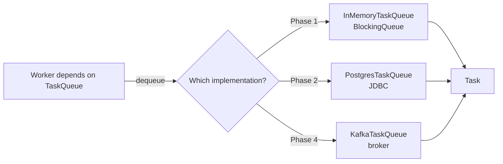
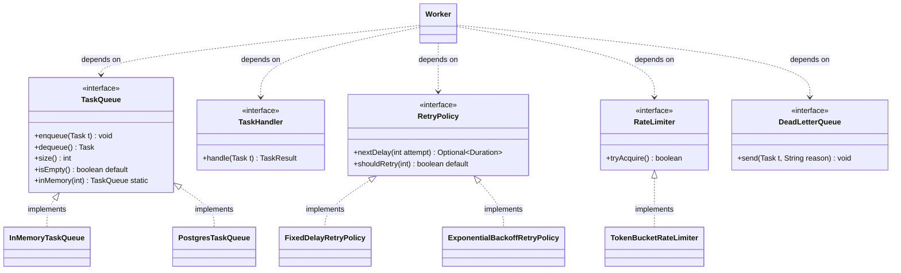

# Interfaces

> Where this fits: an interface is a **contract** — a promise about *what* a type can do, with zero commitment about *how*. Almost every seam in our Task Queue platform is an interface: `TaskQueue`, `TaskHandler`, `RetryPolicy`, `RateLimiter`, `DeadLetterQueue`, `TaskScheduler`, `TaskRepository`, `EventBus`. These are the **ports** through which the core domain talks to the outside world. Get interfaces right and the whole platform becomes pluggable: swap an in-memory queue for Postgres, a fixed delay for exponential backoff, a fake handler for a real one — without touching the code that depends on them.

The previous chapter, [chapter-12-abstract-classes.md](chapter-12-abstract-classes.md), covered abstract classes: a partial implementation you `extends`. Interfaces are the *other* tool for abstraction. They carry **no state**, you can `implements` as many as you like, and since Java 8 they can ship default behavior. This chapter is about interfaces as contracts; `default`, `static`, and `private` interface methods; functional interfaces; multiple inheritance of *type*; and a preview of the Interface Segregation Principle — all grounded in our project's ports.

---

## 1. Why This Exists — The Real Problem

Picture the Phase 1 worker loop. A `Worker` dequeues a `Task`, runs it, and on failure decides how long to wait before retrying. Now ask: *where does the task come from?*

If `Worker` is hard-wired to a concrete `ArrayBlockingQueue`, then the day we move to Phase 2 and want tasks to come from PostgreSQL, we rewrite `Worker`. The day we move to Phase 4 and want them from Kafka, we rewrite `Worker` again. The worker — the most important, most tested piece of logic — becomes the most fragile, because it is coupled to a *mechanism* instead of a *contract*.

The fix is to name the capability the worker actually needs and depend on that name:

```java
public interface TaskQueue {
    void enqueue(Task t);
    Task dequeue() throws InterruptedException;
    int size();
}
```

`Worker` depends on `TaskQueue`. It does not know or care whether the bytes live in a `BlockingQueue`, a Postgres table, or a Kafka topic. Each of those is a *different implementation of the same contract*. This is the single most important idea in backend design: **program to an interface, not an implementation.** It is what makes the [Dependency Inversion Principle](../04-oop-and-ood/solid.md) and [dependency injection](../04-oop-and-ood/dependency-injection.md) possible.

**Historical context worth knowing.** Java added interfaces in 1995 partly to avoid C++'s multiple-inheritance headaches (the "diamond problem" with shared state). A class extends exactly one class but implements any number of interfaces — you inherit multiple *types* without inheriting conflicting *state*. For 18 years interfaces were pure: only abstract method signatures and constants. Java 8 (2014) changed that with `default` and `static` methods, primarily so the JDK could add `Stream`-returning methods like `Collection.stream()` to interfaces that millions of classes already implemented, *without breaking those classes*. Java 9 added `private` interface methods to share code between defaults. Understanding *why* each feature was added tells you exactly when to reach for it.



---

## 2. Interface vs Abstract Class — Lock the Distinction First

This is the most common interview question on the topic, so nail it.

| Aspect | `interface` | `abstract class` |
|---|---|---|
| Instance state (fields) | No (only `public static final` constants) | Yes |
| Constructors | No | Yes (called by subclasses) |
| Method bodies | `default`, `static`, `private` (since Java 8/9) | Any |
| Multiple inheritance | A class can implement many | A class extends exactly one |
| Member access | Methods implicitly `public` | Any modifier |
| Models | A *capability* / role ("can be retried") | An *is-a* identity with shared state ("is an AbstractWorker") |
| `extends` vs `implements` | implemented; can `extends` other interfaces | extended |

Rule of thumb: **use an interface to define a contract that unrelated types can fulfill; use an abstract class when implementations share real state and a common identity.** A `RetryPolicy` is a pure capability — interface. A base class that holds a shared `MetricsCollector` and template-methods the retry loop is shared state plus identity — abstract class. They compose: an abstract class can implement an interface.

---

## 3. The Naive Version — Concrete Coupling

Here is Phase 1 written the way a Java newcomer (or someone fresh from a quick-and-dirty prototype) often writes it. It works, and it is a trap.

```java
import java.util.concurrent.ArrayBlockingQueue;

// BAD: Worker is welded to a specific queue class.
public class Worker implements Runnable {
    private final ArrayBlockingQueue<Task> queue;   // concrete type

    public Worker(ArrayBlockingQueue<Task> queue) {
        this.queue = queue;
    }

    @Override
    public void run() {
        while (!Thread.currentThread().isInterrupted()) {
            try {
                Task task = queue.take();           // tied to ArrayBlockingQueue API
                execute(task);
            } catch (InterruptedException e) {
                Thread.currentThread().interrupt();
                return;
            }
        }
    }

    private void execute(Task task) { /* ... */ }
}
```

Limitations, every one of which bites in a later phase:

- **Cannot swap the source.** Moving to `PostgresTaskQueue` in Phase 2 means rewriting `Worker`'s field, constructor, and loop.
- **Cannot test in isolation.** To unit-test `Worker` you must construct a *real* `ArrayBlockingQueue`. You cannot inject a stub that returns a canned task or throws on demand.
- **Leaks mechanism.** `queue.take()` is `ArrayBlockingQueue`'s vocabulary, not the domain's. The domain word is *dequeue*.
- **Violates Dependency Inversion.** High-level policy (`Worker`) depends on a low-level detail (`ArrayBlockingQueue`). It should be the other way around.

---

## 4. Improved Version — Introduce the Contract

Name the capability. Depend on the name.

```java
public interface TaskQueue {
    void enqueue(Task t);
    Task dequeue() throws InterruptedException;
    int size();
}
```

```java
import java.util.concurrent.ArrayBlockingQueue;
import java.util.concurrent.BlockingQueue;

public final class InMemoryTaskQueue implements TaskQueue {
    private final BlockingQueue<Task> queue;

    public InMemoryTaskQueue(int capacity) {
        this.queue = new ArrayBlockingQueue<>(capacity);
    }

    @Override public void enqueue(Task t)              { queue.add(t); }
    @Override public Task dequeue() throws InterruptedException { return queue.take(); }
    @Override public int size()                        { return queue.size(); }
}
```

```java
public class Worker implements Runnable {
    private final TaskQueue queue;   // contract, not class

    public Worker(TaskQueue queue) { this.queue = queue; }

    @Override
    public void run() {
        while (!Thread.currentThread().isInterrupted()) {
            try {
                Task task = queue.dequeue();   // domain vocabulary
                execute(task);
            } catch (InterruptedException e) {
                Thread.currentThread().interrupt();
                return;
            }
        }
    }

    private void execute(Task task) { /* ... */ }
}
```

`Worker` is now testable with a fake and reusable across every phase. We have decoupled *policy* (run tasks) from *mechanism* (how tasks are stored). But we can go further: interfaces can also carry default behavior, ship factories, and stay laser-focused on one job.

---

## 5. Production-Quality Version — Defaults, Statics, and Segregation

A staff engineer hardens the contract in three ways: give it a sensible **default** so common implementations write less code, add a **static factory** so callers get a good default implementation without naming a concrete class, and keep the interface **small and focused** so no implementer is forced to stub methods it does not need.

```java
import java.util.concurrent.LinkedBlockingQueue;

public interface TaskQueue {

    /** Add a task. Implementations must be thread-safe. */
    void enqueue(Task t);

    /** Block until a task is available, then return it. */
    Task dequeue() throws InterruptedException;

    /** Best-effort count; may be approximate for distributed implementations. */
    int size();

    /**
     * Default convenience: many call sites just want "is there anything to do?".
     * Implementers get this for free; a distributed queue may override for accuracy.
     */
    default boolean isEmpty() {
        return size() == 0;
    }

    /**
     * Static factory: hand callers a sane in-memory default without coupling them
     * to the concrete class name. Phase 2 swaps this for a Spring-injected bean.
     */
    static TaskQueue inMemory(int capacity) {
        return new BlockingQueueAdapter(new LinkedBlockingQueue<>(capacity));
    }
}
```

```java
import java.util.concurrent.BlockingQueue;

/** Adapts any java.util.concurrent BlockingQueue to our TaskQueue port. */
final class BlockingQueueAdapter implements TaskQueue {
    private final BlockingQueue<Task> delegate;

    BlockingQueueAdapter(BlockingQueue<Task> delegate) { this.delegate = delegate; }

    @Override
    public void enqueue(Task t) {
        try {
            delegate.put(t);   // block instead of throwing when the queue is full
        } catch (InterruptedException e) {
            Thread.currentThread().interrupt();
            throw new IllegalStateException("interrupted while enqueuing", e);
        }
    }

    @Override public Task dequeue() throws InterruptedException { return delegate.take(); }
    @Override public int size()                                { return delegate.size(); }
}
```

Why each choice earns its place:

- **`default isEmpty()`** — adds a convenience method to *every* implementation, present and future, without breaking any. This is exactly the problem `default` methods were invented to solve.
- **`static inMemory(...)`** — gives callers a good default *and* hides the concrete class (`BlockingQueueAdapter` is package-private). Callers depend only on `TaskQueue`.
- **Small interface** — `TaskQueue` has three core methods. We resisted bolting on `purge()`, `peek()`, `drainTo()`. An interface that does one job is one that everyone can implement honestly. That restraint is the [Interface Segregation Principle](../04-oop-and-ood/solid.md), previewed in §10.

---

## 6. Code Walkthrough — Beginner, Intermediate, Production

### 6a. Beginner: a contract and two implementations

The smallest honest example. `RetryPolicy` answers one question: *given the attempt number, how long do we wait — or do we stop?* The `Optional<Duration>` return is the contract's cleverness: `Optional.empty()` means "give up".

```java
import java.time.Duration;
import java.util.Optional;

public interface RetryPolicy {
    /** Delay before the given attempt, or empty to stop retrying. */
    Optional<Duration> nextDelay(int attempt);
}
```

```java
import java.time.Duration;
import java.util.Optional;

public final class FixedDelayRetryPolicy implements RetryPolicy {
    private final Duration delay;
    private final int maxAttempts;

    public FixedDelayRetryPolicy(Duration delay, int maxAttempts) {
        this.delay = delay;
        this.maxAttempts = maxAttempts;
    }

    @Override
    public Optional<Duration> nextDelay(int attempt) {
        if (attempt >= maxAttempts) return Optional.empty();   // stop
        return Optional.of(delay);                             // constant wait
    }
}
```

```java
import java.time.Duration;
import java.util.Optional;

public final class NoRetryPolicy implements RetryPolicy {
    @Override
    public Optional<Duration> nextDelay(int attempt) {
        return Optional.empty();   // never retry; fail fast
    }
}
```

The retry handler holds a `RetryPolicy` reference and never branches on type:

```java
Optional<Duration> wait = policy.nextDelay(task.attempts());
if (wait.isPresent()) {
    scheduler.schedule(task, wait.get());   // back to the queue after a delay
} else {
    deadLetterQueue.send(task, "max attempts exhausted");
}
```

### 6b. Intermediate: default + private methods, plus functional use

Exponential backoff with jitter is the production-grade policy. Here we use a `default` method to expose a derived value (the cap) and a `private` method to share computation between the default and `nextDelay` — `private` interface methods exist precisely so defaults can have helpers without leaking them into the public contract.

```java
import java.time.Duration;
import java.util.Optional;
import java.util.concurrent.ThreadLocalRandom;

public final class ExponentialBackoffRetryPolicy implements RetryPolicy {
    private final Duration base;       // e.g. 100ms
    private final Duration cap;        // e.g. 30s
    private final int maxAttempts;

    public ExponentialBackoffRetryPolicy(Duration base, Duration cap, int maxAttempts) {
        this.base = base;
        this.cap = cap;
        this.maxAttempts = maxAttempts;
    }

    @Override
    public Optional<Duration> nextDelay(int attempt) {
        if (attempt >= maxAttempts) return Optional.empty();
        long exp = base.toMillis() * (1L << Math.min(attempt, 30)); // base * 2^attempt
        long capped = Math.min(exp, cap.toMillis());
        long jittered = ThreadLocalRandom.current().nextLong(capped + 1); // full jitter
        return Optional.of(Duration.ofMillis(jittered));
    }
}
```

Because `RetryPolicy` has exactly one abstract method, it is a **functional interface** — we can also build a policy from a lambda, which is perfect for tests and one-offs (more on functional interfaces in §6c and [../01-java-fundamentals/chapter-08-functional-interfaces.md](../01-java-fundamentals/chapter-08-functional-interfaces.md)):

```java
RetryPolicy never = attempt -> java.util.Optional.empty();
RetryPolicy threeFlat = attempt ->
        attempt >= 3 ? java.util.Optional.empty()
                     : java.util.Optional.of(java.time.Duration.ofSeconds(2));
```

Now a `default` method that adds composable behavior to *every* policy without an abstract-method change — observe how it calls the abstract `nextDelay` and wraps the result:

```java
public interface RetryPolicy {
    java.util.Optional<java.time.Duration> nextDelay(int attempt);

    /** True iff this policy would still retry at the given attempt. */
    default boolean shouldRetry(int attempt) {
        return nextDelay(attempt).isPresent();
    }

    /** Decorator-as-default: never wait longer than the given ceiling. */
    default RetryPolicy cappedAt(java.time.Duration ceiling) {
        RetryPolicy self = this;
        return attempt -> self.nextDelay(attempt)
                .map(d -> d.compareTo(ceiling) > 0 ? ceiling : d);
    }
}
```

`policy.cappedAt(Duration.ofSeconds(10))` returns a new policy — interface-level composition with no new class. This is a glimpse of the [Decorator pattern](../05-design-patterns/decorator.md) and [Strategy pattern](../05-design-patterns/strategy.md) expressed through interfaces.

### 6c. Production-inspired: the full port set wired together

Here is how the interfaces compose in a Phase 1 retry loop. Notice that the orchestrating code mentions **only interfaces** — `TaskQueue`, `TaskHandler`, `RetryPolicy`, `DeadLetterQueue`, `TaskScheduler`, `RateLimiter`. Every concrete type is injected. This class is testable end-to-end with fakes.

```java
import java.time.Duration;
import java.util.Map;
import java.util.Optional;

public final class Worker implements Runnable {
    private final TaskQueue queue;
    private final Map<String, TaskHandler> handlers; // type -> handler contract
    private final RetryPolicy retryPolicy;
    private final TaskScheduler scheduler;
    private final DeadLetterQueue deadLetters;
    private final RateLimiter rateLimiter;

    public Worker(TaskQueue queue,
                  Map<String, TaskHandler> handlers,
                  RetryPolicy retryPolicy,
                  TaskScheduler scheduler,
                  DeadLetterQueue deadLetters,
                  RateLimiter rateLimiter) {
        this.queue = queue;
        this.handlers = Map.copyOf(handlers);
        this.retryPolicy = retryPolicy;
        this.scheduler = scheduler;
        this.deadLetters = deadLetters;
        this.rateLimiter = rateLimiter;
    }

    @Override
    public void run() {
        while (!Thread.currentThread().isInterrupted()) {
            try {
                Task task = queue.dequeue();
                if (!rateLimiter.tryAcquire()) {        // RateLimiter contract
                    scheduler.schedule(task, Duration.ofMillis(50)); // back off
                    continue;
                }
                process(task);
            } catch (InterruptedException e) {
                Thread.currentThread().interrupt();
                return;
            }
        }
    }

    private void process(Task task) {
        TaskHandler handler = handlers.get(task.type());
        if (handler == null) {
            deadLetters.send(task, "no handler for type: " + task.type());
            return;
        }
        try {
            TaskResult result = handler.handle(task);   // TaskHandler contract
            if (result.success()) return;               // SUCCEEDED
            if (result.retryable()) {
                retryOrDeadLetter(task, result.message());
            } else {
                deadLetters.send(task, "non-retryable: " + result.message());
            }
        } catch (Exception e) {
            retryOrDeadLetter(task, e.toString());
        }
    }

    private void retryOrDeadLetter(Task task, String reason) {
        Optional<Duration> delay = retryPolicy.nextDelay(task.attempts());
        if (delay.isPresent()) {
            scheduler.schedule(task, delay.get());      // TaskScheduler contract
        } else {
            deadLetters.send(task, "retries exhausted: " + reason); // DeadLetterQueue
        }
    }
}
```

This `Worker` is the same class in Phase 1 and Phase 4. Only the injected implementations change. That stability is the dividend interfaces pay.

---

## 7. How This Applies to Our Task Queue Project

Every architectural seam in the platform is an interface. The job of the interface is to let the *core* (worker logic, retry logic, scheduling logic) stay ignorant of *infrastructure* (which queue, which DB, which broker). This is the hexagonal / ports-and-adapters idea: the interfaces are **ports**, the implementations are **adapters**.



Concrete mapping of contract to implementations across phases:

| Port (interface) | Phase 1 adapter | Phase 2 adapter | Phase 4 adapter |
|---|---|---|---|
| `TaskQueue` | `InMemoryTaskQueue` (`BlockingQueue`) | `PostgresTaskQueue` (JDBC + `SELECT ... FOR UPDATE SKIP LOCKED`) | broker-backed (Kafka/Redis) |
| `TaskRepository` | — (in-memory) | JDBC-backed via Spring Data | sharded JDBC |
| `RetryPolicy` | `FixedDelayRetryPolicy` | `ExponentialBackoffRetryPolicy` | same, config-driven |
| `RateLimiter` | (none) | `TokenBucketRateLimiter` (local) | distributed token bucket (Redis) |
| `DeadLetterQueue` | in-memory list | DB `dead_letters` table | Kafka DLQ topic |
| `EventBus` | — | — | introduced Phase 4 |

`TaskHandler` deserves a special note: it is the platform's **extension point for users**. A user of our platform implements `TaskHandler` for their `"email"` or `"resize-image"` task type and registers it. Because it is a single-method interface, they can do it with a lambda:

```java
TaskHandler emailHandler = task ->
        new TaskResult(true, "sent to " + task.payload(), false);
```

---

## 8. Tradeoffs

Interfaces are not free. Be honest about the costs.

| Decision | Benefit | Cost / when it hurts |
|---|---|---|
| Program to an interface | Swappable implementations, testable units, DIP | One more type to maintain; indirection can obscure the call site |
| `default` methods | Evolve published interfaces without breaking implementers | Tempts you to put real logic in interfaces (no state to back it); diamond conflicts must be resolved manually |
| `static` factory on interface | Callers get a default impl without naming a concrete class | Couples the interface to one concrete adapter unless that adapter is package-private |
| Functional (single-method) interface | Lambdas, terse strategies, easy fakes | Adding a second abstract method is a breaking change for every lambda |
| Many small interfaces (ISP) | Implementers stub nothing irrelevant; precise dependencies | More files; risk of over-fragmentation |
| One fat interface | Fewer types | Forces implementers to stub or throw on methods they do not support |

A specific tradeoff to internalize: **interfaces buy you flexibility you may never use.** If `TaskQueue` will only ever be `InMemoryTaskQueue`, the interface is speculative generality ([YAGNI](../04-oop-and-ood/dry-kiss-yagni.md)). In *our* project we know we have at least three implementations across phases, so the interface pays for itself. Introduce an interface when you have (or imminently will have) **two implementations or a testing seam** — not before.

---

## 9. Common Mistakes and Pitfalls

- **Putting state in a `default` method's logic.** Interfaces have no instance fields. A `default` method can only call other interface methods. If you find yourself wanting a field, you want an abstract class or a separate object.
- **Fat interfaces.** A `TaskQueue` with `enqueue`, `dequeue`, `size`, `purge`, `peekAll`, `pause`, `resume`, `metrics()` forces a simple in-memory adapter to implement (or throw on) methods it has no business owning. Split it. *Fix:* segregate into `TaskQueue` + `AdminQueueOps`.
- **Leaking implementation types in the signature.** `void enqueue(ArrayBlockingQueue<Task> q)` defeats the purpose. Keep parameters and returns in terms of interfaces/domain types.
- **Forgetting interface methods are `public`.** You cannot reduce visibility when implementing (`@Override protected void enqueue(...)` won't compile). *Fix:* implement as `public`.
- **Unresolved diamond defaults.** If you implement two interfaces with the same `default` signature, the class *must* override and disambiguate, often via `Iface.super.method()`. The compiler forces you; do not be surprised.
- **Constants in interfaces (the "constant interface antipattern").** Stuffing `public static final` config into an interface and implementing it to "inherit" constants pollutes the type. *Fix:* use an `enum` or a `final` class with private constructor.
- **Adding a second abstract method to a `@FunctionalInterface`.** It silently breaks every lambda implementing it. *Fix:* annotate with `@FunctionalInterface` so the compiler guards the single-method invariant.
- **Over-abstracting too early.** One implementation plus no test seam means the interface is dead weight. *Fix:* extract the interface when the second implementation arrives.

---

## 10. Interface Segregation Preview

The "I" in SOLID: **no client should be forced to depend on methods it does not use.** Interfaces make this principle actionable. Consider the temptation to merge queue *operations* with queue *administration*:

```java
// SMELLS: one interface, two audiences.
public interface TaskQueue {
    void enqueue(Task t);
    Task dequeue() throws InterruptedException;
    int size();
    void purgeAll();                 // admin only
    java.util.List<Task> peekAll();  // admin / debugging only
    void pause();                    // ops only
}
```

`Worker` needs only `enqueue`/`dequeue`/`size`, yet it now *depends* on `purgeAll` and `pause`. A minimal in-memory adapter must implement all six. Segregate by audience:

```java
public interface TaskQueue {
    void enqueue(Task t);
    Task dequeue() throws InterruptedException;
    int size();
}

public interface QueueAdmin {       // separate role
    void purgeAll();
    java.util.List<Task> peekAll();
    void pause();
    void resume();
}
```

A concrete class may implement both — multiple inheritance of *type* — but each client depends only on the role it needs:

```java
public final class InMemoryTaskQueue implements TaskQueue, QueueAdmin {
    // Worker is injected as TaskQueue; the admin endpoint is injected as QueueAdmin.
}
```

The full treatment lives in [../04-oop-and-ood/solid.md](../04-oop-and-ood/solid.md); the key takeaway here is that **interfaces are the unit of segregation**, and a class implementing several of them is how Java does multiple inheritance of type safely.

---

## 11. Refactoring Exercise — Bad → Improved → Production

**Bad.** A `RetryHandler` that branches on a string and constructs delays inline. New policy = edit this method.

```java
public class RetryHandler {
    public java.time.Duration computeDelay(String policy, int attempt) {
        if (policy.equals("fixed")) {
            return java.time.Duration.ofSeconds(2);
        } else if (policy.equals("exponential")) {
            return java.time.Duration.ofMillis((long) (100 * Math.pow(2, attempt)));
        } else if (policy.equals("none")) {
            return java.time.Duration.ZERO; // caller "knows" zero means stop... fragile
        }
        throw new IllegalArgumentException("unknown policy " + policy);
    }
}
```

Problems: string-typed dispatch, no honest "stop" signal (zero is overloaded), open for modification, untestable per-policy.

**Improved.** Extract the contract; one class per policy; honest stop via `Optional.empty()`.

```java
import java.time.Duration;
import java.util.Optional;

public interface RetryPolicy {
    Optional<Duration> nextDelay(int attempt);
}

public final class FixedDelayRetryPolicy implements RetryPolicy {
    private final Duration delay; private final int max;
    public FixedDelayRetryPolicy(Duration delay, int max) { this.delay = delay; this.max = max; }
    public Optional<Duration> nextDelay(int a) {
        return a >= max ? Optional.empty() : Optional.of(delay);
    }
}
```

```java
public final class RetryHandler {
    private final RetryPolicy policy;     // depends on the contract
    public RetryHandler(RetryPolicy policy) { this.policy = policy; }
    public java.util.Optional<java.time.Duration> delayFor(int attempt) {
        return policy.nextDelay(attempt);
    }
}
```

**Production.** Add a `default` `shouldRetry`, a `static` factory for the common case, and a registry so handlers are selected by task type without `RetryHandler` knowing the concrete classes.

```java
import java.time.Duration;
import java.util.Optional;

public interface RetryPolicy {
    Optional<Duration> nextDelay(int attempt);

    default boolean shouldRetry(int attempt) { return nextDelay(attempt).isPresent(); }

    static RetryPolicy fixed(Duration d, int max) {
        return attempt -> attempt >= max ? Optional.empty() : Optional.of(d);
    }
    static RetryPolicy noRetry() { return attempt -> Optional.empty(); }
}
```

```java
import java.util.Map;

public final class RetryHandler {
    private final Map<String, RetryPolicy> byType;   // task type -> policy
    private final RetryPolicy fallback;

    public RetryHandler(Map<String, RetryPolicy> byType, RetryPolicy fallback) {
        this.byType = Map.copyOf(byType);
        this.fallback = fallback;
    }

    public java.util.Optional<java.time.Duration> delayFor(Task task) {
        RetryPolicy p = byType.getOrDefault(task.type(), fallback);
        return p.nextDelay(task.attempts());
    }
}
```

`RetryHandler` is now closed for modification: adding a policy or a per-type mapping never touches it. That is the Open/Closed payoff, delivered by an interface.

---

## 12. Exercises

### Easy

**E1 (knowledge check).** In one sentence each, explain why a class can `implements` many interfaces but `extends` only one class. Then state what `default` and `private` interface methods are *for*.

**E2 (coding).** Define the `DeadLetterQueue` interface from the canonical model (`send(Task t, String reason)`). Implement `InMemoryDeadLetterQueue` that stores `(Task, reason)` pairs and exposes a package-private accessor for tests. Add a `default` method `int count()` to the interface.

### Medium

**E3 (coding).** `RateLimiter` has one method, `boolean tryAcquire()`. Implement `TokenBucketRateLimiter` with capacity and refill rate, thread-safe, lazily refilling on each call. Also create an `AlwaysAllowRateLimiter` for tests using a lambda where possible.

**E4 (refactoring).** You are given a `NotificationService` interface with eight methods (`sendEmail`, `sendSms`, `sendPush`, `subscribe`, `unsubscribe`, `listSubscribers`, `purge`, `health`). A `Worker` only ever calls `sendEmail`. Apply Interface Segregation: split the interface so `Worker` depends on a one-method contract, and show the dependency in `Worker`'s constructor.

### Hard

**E5 (design).** Design the `TaskQueue` family so that the *same* core `Worker` runs in Phase 1 (in-memory) and Phase 2 (Postgres). Specify the interface, two adapters' responsibilities, where blocking semantics differ, and how `dequeue()`'s contract (blocking vs polling) is honored by a polling DB. Identify one method whose semantics you would document as "best-effort" and why.

**E6 (interview-style).** Two interfaces, `Auditable` and `Loggable`, both declare `default void record(String msg)`. A class `AuditedQueue` implements both. The code does not compile. Explain why, and show the exact fix using `Iface.super`.

**E7 (stretch).** Make `RetryPolicy` *composable*: add `default` methods `andThen(RetryPolicy next)` (use this policy until it returns empty, then defer to `next`) and `cappedAt(Duration ceiling)`. Write a test asserting that `fixed(1s, 2).andThen(exponential(...)).cappedAt(10s)` behaves correctly across attempts 0..5.

---

## 13. Solutions

### E1

A class has at most one superclass because state and constructors must form a single, unambiguous chain — multiple stateful parents create the diamond problem (which copy of a field do you inherit?). Interfaces carry no instance state, so implementing many of them is unambiguous; you inherit *types* (capabilities), not conflicting *fields*. `default` methods let a published interface gain new behavior without breaking existing implementers; `private` interface methods let several `default` methods share helper logic without exposing that helper as part of the public contract.

### E2

```java
public interface DeadLetterQueue {
    void send(Task t, String reason);
    default int count() { return 0; } // overridden by stateful impls
}
```

```java
import java.util.ArrayList;
import java.util.List;

public final class InMemoryDeadLetterQueue implements DeadLetterQueue {
    record Entry(Task task, String reason) {}
    private final List<Entry> entries = new ArrayList<>();

    @Override
    public synchronized void send(Task t, String reason) {
        entries.add(new Entry(t, reason));
    }

    @Override
    public synchronized int count() { return entries.size(); }

    // package-private test accessor
    synchronized List<Entry> entries() { return List.copyOf(entries); }
}
```

`count()` is a `default` returning 0 so trivial implementations need not define it; the stateful in-memory version overrides it.

### E3

```java
public interface RateLimiter {
    boolean tryAcquire();
}
```

```java
public final class TokenBucketRateLimiter implements RateLimiter {
    private final long capacity;
    private final double refillPerNano;   // tokens per nanosecond
    private double tokens;
    private long lastRefillNanos;

    public TokenBucketRateLimiter(long capacity, double tokensPerSecond) {
        this.capacity = capacity;
        this.refillPerNano = tokensPerSecond / 1_000_000_000.0;
        this.tokens = capacity;
        this.lastRefillNanos = System.nanoTime();
    }

    @Override
    public synchronized boolean tryAcquire() {
        refill();
        if (tokens >= 1.0) { tokens -= 1.0; return true; }
        return false;
    }

    private void refill() {
        long now = System.nanoTime();
        double added = (now - lastRefillNanos) * refillPerNano;
        if (added > 0) {
            tokens = Math.min(capacity, tokens + added);
            lastRefillNanos = now;
        }
    }
}
```

```java
RateLimiter alwaysAllow = () -> true;   // lambda: RateLimiter is functional
```

`synchronized` makes the lazy refill atomic; the lambda works because `RateLimiter` has exactly one abstract method.

### E4

```java
public interface EmailSender {              // the one role Worker needs
    void sendEmail(String to, String body);
}
public interface SmsSender    { void sendSms(String to, String body); }
public interface PushSender   { void sendPush(String to, String body); }
public interface SubscriberAdmin {
    void subscribe(String who); void unsubscribe(String who);
    java.util.List<String> listSubscribers(); void purge();
}
public interface HealthReporting { boolean health(); }
```

```java
public final class Worker {
    private final EmailSender email;        // depends on ONE method, not eight
    public Worker(EmailSender email) { this.email = email; }
    void notifyDone(String to) { email.sendEmail(to, "task complete"); }
}
```

A concrete `NotificationService` may `implements EmailSender, SmsSender, PushSender, SubscriberAdmin, HealthReporting`, but each client is injected only the role it uses.

### E5

```java
public interface TaskQueue {
    void enqueue(Task t);
    Task dequeue() throws InterruptedException; // contract: returns a task or blocks
    int size();                                 // best-effort
}
```

- **`InMemoryTaskQueue`** wraps a `BlockingQueue`. `dequeue()` truly blocks via `take()`; `size()` is exact.
- **`PostgresTaskQueue`** has no native blocking. It honors the *contract* by polling: `SELECT ... FOR UPDATE SKIP LOCKED LIMIT 1`, and if no row is returned it sleeps a short, bounded interval and retries until interrupted. The blocking *semantics* (caller blocks until a task exists) are preserved even though the *mechanism* is polling. Document `size()` as **best-effort** for the DB adapter: under concurrency the count is stale the instant it is read, and a heavy `COUNT(*)` is undesirable on the hot path, so we may return an approximate count from statistics. The interface lets us keep one `Worker` because the contract (block-until-available, approximate-size) is mechanism-agnostic.

### E6

It fails to compile because the class inherits **two** `default record` methods with identical signatures — the diamond problem for behavior. Java refuses to guess; the implementing class must override and disambiguate explicitly.

```java
public final class AuditedQueue implements Auditable, Loggable {
    @Override
    public void record(String msg) {
        Auditable.super.record(msg);   // pick one explicitly
        Loggable.super.record(msg);    // or call both, or neither
    }
}
```

### E7

```java
import java.time.Duration;
import java.util.Optional;

public interface RetryPolicy {
    Optional<Duration> nextDelay(int attempt);

    default RetryPolicy andThen(RetryPolicy next) {
        RetryPolicy self = this;
        return attempt -> {
            Optional<Duration> d = self.nextDelay(attempt);
            return d.isPresent() ? d : next.nextDelay(attempt);
        };
    }

    default RetryPolicy cappedAt(Duration ceiling) {
        RetryPolicy self = this;
        return attempt -> self.nextDelay(attempt)
                .map(d -> d.compareTo(ceiling) > 0 ? ceiling : d);
    }

    static RetryPolicy fixed(Duration d, int max) {
        return a -> a >= max ? Optional.empty() : Optional.of(d);
    }
    static RetryPolicy exponential(Duration base, int max) {
        return a -> a >= max ? Optional.empty()
                : Optional.of(Duration.ofMillis(base.toMillis() * (1L << Math.min(a, 30))));
    }
}
```

```java
import org.junit.jupiter.api.Test;
import java.time.Duration;
import static org.assertj.core.api.Assertions.assertThat;

class RetryPolicyCompositionTest {
    @Test
    void composesFixedThenExponentialWithCap() {
        RetryPolicy p = RetryPolicy.fixed(Duration.ofSeconds(1), 2)
                .andThen(RetryPolicy.exponential(Duration.ofSeconds(1), 6))
                .cappedAt(Duration.ofSeconds(10));

        assertThat(p.nextDelay(0)).contains(Duration.ofSeconds(1));   // fixed
        assertThat(p.nextDelay(1)).contains(Duration.ofSeconds(1));   // fixed
        // attempt 2: fixed exhausted -> exponential 1s * 2^2 = 4s
        assertThat(p.nextDelay(2)).contains(Duration.ofSeconds(4));
        // attempt 4: 1s * 2^4 = 16s -> capped to 10s
        assertThat(p.nextDelay(4)).contains(Duration.ofSeconds(10));
        // attempt 6: exponential exhausted (max=6) -> empty
        assertThat(p.nextDelay(6)).isEmpty();
    }
}
```

This is the [Strategy](../05-design-patterns/strategy.md) and [Decorator](../05-design-patterns/decorator.md) patterns expressed entirely through interface default methods — no new classes, fully composable.

---

## 14. Interview Questions and Takeaways

1. **What is the difference between an interface and an abstract class, and when do you pick each?**
   *Interface = contract/capability, no state, multiple inheritance of type; abstract class = partial implementation with shared state and a single identity. Pick the interface for a pluggable role (`TaskQueue`); pick the abstract class when implementations share real fields and a common base. They compose.*

2. **Why were `default` methods added in Java 8?**
   *Interface evolution. The JDK needed to add `stream()` to `Collection` without breaking the thousands of existing implementers. A `default` method gives every implementer a body for free.*

3. **What is a functional interface and why does it matter?**
   *An interface with exactly one abstract method, usable as a lambda target. It matters because it lets us pass behavior as a value — `RetryPolicy`, `TaskHandler`, `RateLimiter` all become lambda-able. `@FunctionalInterface` makes the compiler guard the single-method invariant.*

4. **How does Java avoid the multiple-inheritance diamond problem?**
   *A class extends one class (single state chain), so fields never conflict. Multiple interfaces are fine because they carry no instance state. The only diamond Java leaves is conflicting `default` *methods*, and the compiler forces you to resolve it with `Iface.super.method()`.*

5. **What is the Interface Segregation Principle and how do you apply it?**
   *No client should depend on methods it does not use. Split fat interfaces by audience (operations vs admin), so each consumer depends on a minimal role. Implementers stub nothing irrelevant.*

6. **Can interfaces have constructors or fields? Can their methods be private?**
   *No constructors; only `public static final` constants (not instance fields). Since Java 9, interfaces can have `private` (and `private static`) methods to share logic among `default` methods.*

7. **What breaks if you add a second abstract method to a published functional interface?**
   *Every lambda and method reference implementing it stops compiling. It is a breaking API change. Use a `default` method or a new interface instead.*

8. **Why "program to an interface, not an implementation"?**
   *It decouples policy from mechanism, enabling substitution (swap queues across phases), testing (inject fakes), and the Dependency Inversion Principle. The cost is one extra type and a layer of indirection — worth it when there are two or more implementations or a test seam.*

---

## 15. Production Considerations

- **Interface stability is API stability.** Once an interface is published across modules (or to platform users implementing `TaskHandler`), changing its abstract method signatures breaks every implementer. Add capability via `default` methods; reserve breaking changes for major versions.
- **`default` methods are not free at scale.** They are real virtual calls; they cannot be `synchronized` meaningfully (no instance lock you control) and cannot hold state. Keep them thin — composition and convenience, not core logic.
- **Beware "best-effort" methods on the hot path.** `TaskQueue.size()` backed by Postgres `COUNT(*)` can be a table scan under load. Document approximate semantics and back gauges with cheaper statistics; otherwise your metrics endpoint becomes a self-inflicted DoS.
- **Monitor through interfaces, not implementations.** Because `Worker` depends on contracts, you can wrap any adapter in a metrics decorator (`MeterRegistry` timing every `dequeue()`) without touching the worker — see the Decorator pattern. This is how Micrometer instrumentation stays non-invasive.
- **Lambda explosion in stack traces.** Heavy use of single-method interface lambdas yields opaque `lambda$...` frames. For production policies that need debuggability, prefer named classes; keep lambdas for tests and trivial cases.
- **Diamond defaults in dependency upgrades.** Upgrading a library can introduce a `default` method that now collides with one you implement, breaking compilation at upgrade time. CI catching this early is a feature, not a bug.

---

## What We Can Improve In Our Project Using This Concept

Audit the codebase for any class that names a *concrete* infrastructure type in a field, parameter, or return. Every such spot is a missed port. Concretely: ensure `Worker`, `WorkerPool`, `RetryHandler`, and the Phase 2 service layer depend only on `TaskQueue`, `TaskHandler`, `RetryPolicy`, `RateLimiter`, `DeadLetterQueue`, `TaskScheduler`, and `TaskRepository` — never on `ArrayBlockingQueue`, `JdbcTemplate`, or a Kafka client directly. Add `default` convenience methods (`TaskQueue.isEmpty`, `RetryPolicy.shouldRetry`) and `static` factories so callers get good defaults without coupling to concrete classes. Segregate `TaskQueue` operations from `QueueAdmin` so the worker's dependency surface shrinks to three methods.

## Project Refactoring Task

1. Introduce the `TaskQueue` interface and refactor `Worker` to depend on it (not `ArrayBlockingQueue`). Provide `InMemoryTaskQueue` as the Phase 1 adapter and a `TaskQueue.inMemory(int)` static factory hiding the concrete class.
2. Convert `RetryPolicy` to carry `default shouldRetry`, `default cappedAt`, and `static fixed/noRetry/exponential` factories. Make `RetryHandler` select policy by task type via an injected `Map<String, RetryPolicy>`.
3. Split `QueueAdmin` out of `TaskQueue` (Interface Segregation) and have `InMemoryTaskQueue implements TaskQueue, QueueAdmin`.
4. Add tests that inject lambda fakes for `TaskHandler` and `RateLimiter`, proving `Worker` is unit-testable without infrastructure.

## Git Commit For This Chapter

```text
refactor(core): introduce TaskQueue/RetryPolicy ports and segregate queue admin

- add TaskQueue interface with default isEmpty() and static inMemory() factory
- extract InMemoryTaskQueue adapter; Worker now depends on TaskQueue, not ArrayBlockingQueue
- add RetryPolicy default shouldRetry/cappedAt and static fixed/noRetry/exponential factories
- segregate QueueAdmin from TaskQueue (ISP); InMemoryTaskQueue implements both
- add unit tests injecting lambda fakes for TaskHandler and RateLimiter

Files touched:
  src/main/java/com/taskqueue/queue/TaskQueue.java        (new)
  src/main/java/com/taskqueue/queue/InMemoryTaskQueue.java (new)
  src/main/java/com/taskqueue/queue/QueueAdmin.java        (new)
  src/main/java/com/taskqueue/retry/RetryPolicy.java       (modified)
  src/main/java/com/taskqueue/retry/RetryHandler.java      (modified)
  src/main/java/com/taskqueue/worker/Worker.java           (modified)
  src/test/java/com/taskqueue/worker/WorkerTest.java       (new)
```

## Architecture Impact

This refactor draws the boundary between the **domain core** (worker/retry/scheduling logic) and **infrastructure adapters** (in-memory queue, Postgres, broker). The interfaces become the project's *ports*; implementations become *adapters*. That is precisely the seam that makes the Phase 1 → Phase 2 → Phase 4 evolution possible without rewriting the core, and it is the foundation the [hexagonal architecture](../04-oop-and-ood/hexagonal-architecture.md) and [dependency injection](../04-oop-and-ood/dependency-injection.md) chapters build on. Every future capability — metrics, circuit breakers, distributed brokers — plugs in by implementing or decorating an existing port, never by editing the core.

## Interview Takeaways

- "Program to an interface" decouples policy from mechanism; the payoff is substitution and testability, the cost is one extra type — justify it with two implementations or a test seam.
- `default` methods exist for interface evolution; `private` interface methods exist so defaults can share helpers; `static` interface methods give callers good defaults without naming a concrete class.
- Java avoids the inheritance diamond by allowing one stateful superclass but many stateless interfaces; conflicting `default` methods must be resolved with `Iface.super.method()`.
- A single-abstract-method interface is a functional interface — lambda-able, and the backbone of strategy-style design (`RetryPolicy`, `TaskHandler`, `RateLimiter`).
- The Interface Segregation Principle is applied *by splitting interfaces by audience*; the unit of segregation is the interface itself.
