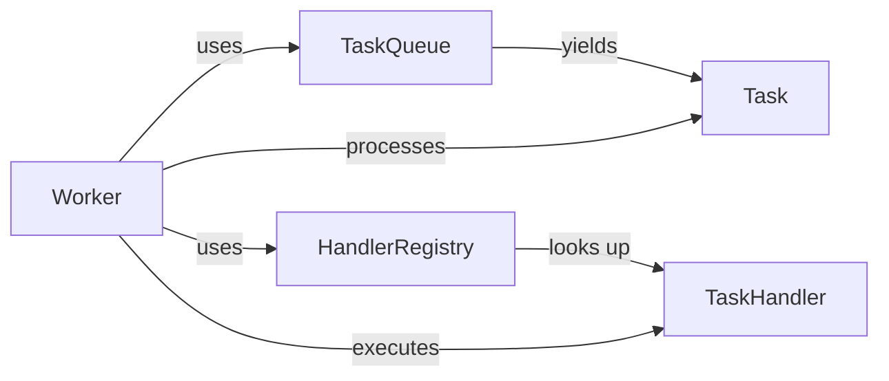
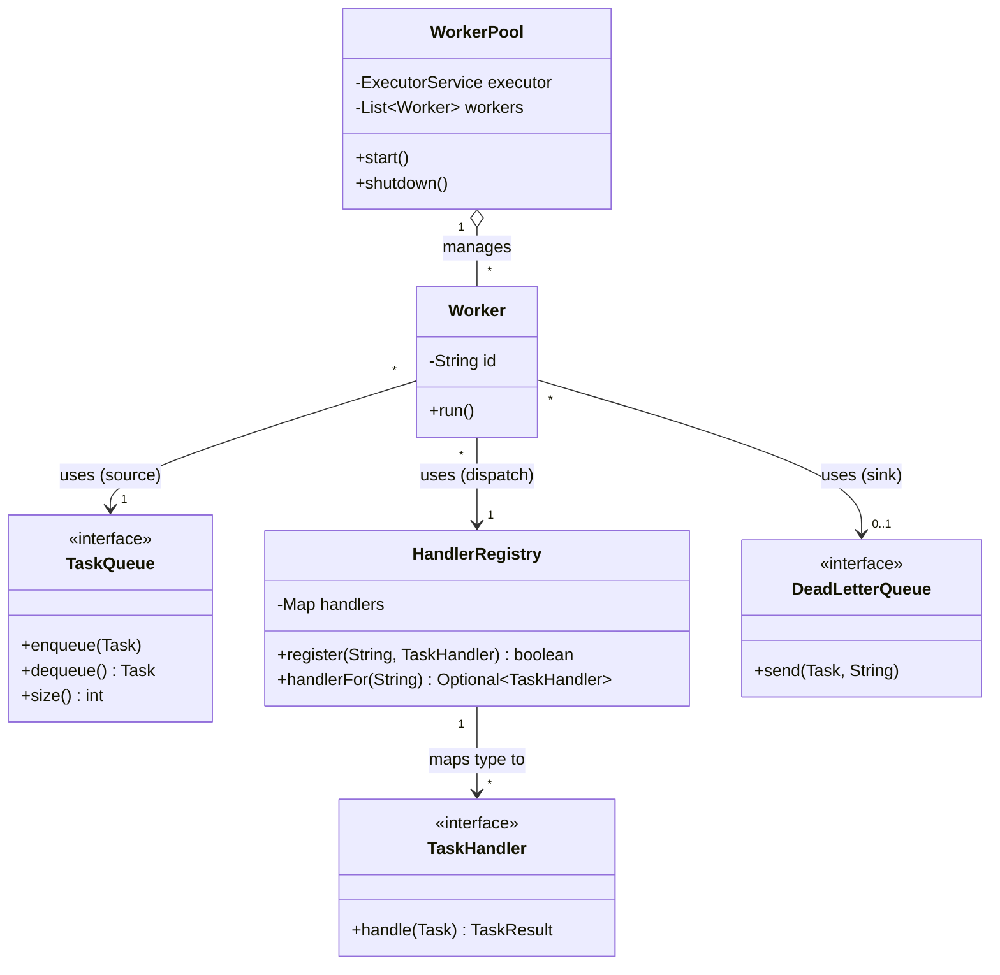

# Association

> Where this fits: an **association** is the plainest, most common relationship between two objects — *one object uses another*. In our Task Queue platform, a `Worker` **uses a** `TaskQueue` to pull work and **uses a** `HandlerRegistry` to find the right `TaskHandler` for each task type. Neither of those is *owned* by the worker; they are collaborators it was handed. Before we reach the stronger relationships — [aggregation](chapter-15-aggregation.md) (has-a, shared lifetime independent) and [composition](chapter-16-composition.md) (owns-a, lifetime bound) — we need the base case: the "uses-a" link, its **multiplicity**, its **navigability**, and the bidirectional pitfalls that wreck real codebases.

The previous chapter, [chapter-13-interfaces.md](chapter-13-interfaces.md), gave us the *contracts* objects talk through. This chapter is about the *wiring* — how one object holds a reference to another, how many of each there are, who can reach whom, and why a casual two-way link is one of the most expensive mistakes you can bake into an object model.

---

## 1. Why This Exists — The Real Problem

Objects are useless in isolation. A `Worker` that cannot reach a `TaskQueue` has nothing to do; a `TaskController` that cannot reach a `TaskRepository` cannot save anything. **Behavior emerges from objects collaborating**, and collaboration requires that one object be able to *reach* another — to hold a reference and call methods on it. That reachability is what UML calls an **association**.

The reason we name and study it (rather than just "objects calling objects") is that **how** you wire collaborators determines almost everything you care about in a backend:

- **Testability** — if `Worker` holds a `TaskQueue` reference handed in via its constructor, you can hand it a fake queue in a unit test. If it `new`s a concrete `ArrayBlockingQueue` inside itself, you cannot.
- **Coupling** — the set of associations *is* the coupling graph of your system. Tight, tangled associations are why a one-line change ripples across twelve files. See [coupling](../04-oop-and-ood/coupling.md).
- **Lifecycle bugs** — get multiplicity and ownership wrong and you leak memory, double-free logical resources, or hold a reference to a thing that was supposed to be gone.
- **Navigability** — decide carelessly that "A knows B *and* B knows A" and you have created a cycle that complicates construction, serialization, garbage collection, and reasoning.

**Historical context worth knowing.** The vocabulary — association, multiplicity, navigability, role names — comes from UML, standardized in 1997 by merging Booch, Rumbaugh's OMT, and Jacobson's notations. OMT in particular obsessed over relationship semantics because the authors had watched large systems rot from undisciplined object graphs. You do not need to draw UML for a living, but the *distinctions* it forces — "is this a use, a containment, or an ownership?" — are exactly the distinctions that keep an object model from turning into spaghetti. We will use Mermaid `classDiagram` (UML class notation) to make these precise.



A plain arrow, "uses". That is an association. The rest of this chapter is about doing it well.

---

## 2. Vocabulary: The Four Things You Actually Decide

When you draw an association you are implicitly answering four questions. Naming them makes the design conscious instead of accidental.

| Term | Question it answers | Example in our project |
|------|---------------------|------------------------|
| **Association** | Does A need to reach B at all? | `Worker` reaches `TaskQueue` |
| **Multiplicity** | *How many* B per A (and A per B)? | One `Worker` uses one `TaskQueue`; one `WorkerPool` uses many `Worker`s |
| **Navigability** | Who can reach whom — one way or both? | `Worker -> TaskQueue` one-way; `Task` does **not** know its `Worker` |
| **Role** | What does B *mean* to A here? | The queue is the worker's *source*; the registry is its *dispatcher* |

**Multiplicity** is written on the UML ends as `1`, `0..1`, `*` (zero-or-more), `1..*` (one-or-more), or exact counts like `4`. In Java it shows up concretely:

```java
// multiplicity 1: a single reference
private final TaskQueue queue;

// multiplicity 0..1: a reference that may be null / Optional
private RateLimiter rateLimiter; // nullable -> optional collaborator

// multiplicity * (many): a collection
private final List<Worker> workers;
```

**Navigability** is just: *which class holds the field?* If `Worker` has a `TaskQueue queue` field but `TaskQueue` has no `Worker` field, the association is **navigable from Worker to TaskQueue only**. That one-directional default is almost always what you want, and we will spend a whole section on why two-way is dangerous.

---

## 3. The Naive Version — Wiring by Construction Inside

Here is a first cut of a worker that knows it needs a queue and a way to dispatch handlers. It looks like it "just works," and that is exactly the trap.

```java
import java.util.HashMap;
import java.util.Map;
import java.util.concurrent.ArrayBlockingQueue;
import java.util.concurrent.BlockingQueue;

// NAIVE: the worker builds its own collaborators. Do not do this.
public class NaiveWorker implements Runnable {

    // Worker creates the queue it pulls from — so nobody else can share it!
    private final BlockingQueue<Task> queue = new ArrayBlockingQueue<>(1000);

    // Worker hard-codes the handler lookup table.
    private final Map<String, TaskHandler> handlers = new HashMap<>();

    public NaiveWorker() {
        // The worker decides which handlers exist. Adding a new task type
        // means editing this constructor.
        handlers.put("email", task -> new TaskResult(true, "sent", false));
        handlers.put("resize", task -> new TaskResult(true, "resized", false));
    }

    @Override
    public void run() {
        try {
            while (!Thread.currentThread().isInterrupted()) {
                Task task = queue.take();                  // pull
                TaskHandler h = handlers.get(task.type());  // dispatch
                if (h == null) continue;
                h.handle(task);                             // execute
            }
        } catch (Exception e) {
            Thread.currentThread().interrupt();
        }
    }
}
```

**What is wrong here is the association, not the logic.** The worker *uses* a queue and a handler table — both real associations — but it manufactures them internally. Consequences:

- **Unshareable queue.** A producer (the API) needs to `enqueue` into the *same* queue this worker `take`s from. But this queue is private and created inside the worker. There is no way for the producer and the worker to meet. The whole point of a queue is a shared meeting place between producer and consumer; this design destroys it.
- **No second worker.** A `WorkerPool` wants 8 workers draining *one* queue. With this design, 8 workers means 8 separate queues. Tasks vanish into whichever queue the producer happened to fill.
- **Untestable dispatch.** You cannot inject a stub handler or assert which handler ran; the map is sealed inside the constructor.
- **Concrete coupling.** `Worker` is welded to `ArrayBlockingQueue` and `HashMap`. Phase 2's `PostgresTaskQueue` cannot slot in.

The naive design confuses *"I use a thing"* with *"I own and build the thing."* Association is about *use*; it should not imply *construction*.

---

## 4. The Improved Version — Pass Collaborators In

The fix is to make the associations **explicit and inbound**: the worker *declares* what it needs and receives it from outside. This is plain constructor injection — the manual form of [dependency injection](../04-oop-and-ood/dependency-injection.md).

```java
public class ImprovedWorker implements Runnable {

    private final TaskQueue queue;            // association: Worker --uses--> TaskQueue (1)
    private final HandlerRegistry registry;   // association: Worker --uses--> HandlerRegistry (1)

    // The worker says "give me a queue and a registry." It does not care
    // which implementations, nor does it build them.
    public ImprovedWorker(TaskQueue queue, HandlerRegistry registry) {
        this.queue = queue;
        this.registry = registry;
    }

    @Override
    public void run() {
        try {
            while (!Thread.currentThread().isInterrupted()) {
                Task task = queue.dequeue();                          // uses queue
                TaskHandler handler = registry.handlerFor(task.type()); // uses registry
                if (handler == null) continue;
                handler.handle(task);                                 // uses handler
            }
        } catch (InterruptedException e) {
            Thread.currentThread().interrupt();
        } catch (Exception e) {
            // outcome handling comes in the retry chapter; ignore for now
        }
    }
}
```

Now the associations are real associations: the worker *reaches* a queue and a registry but does not own them. The same `TaskQueue` instance can be shared by the API producer and ten workers. A test can pass a fake queue and a registry seeded with a probe handler.

The `HandlerRegistry` itself models a **one-to-many** association — one registry, many handlers keyed by type:

```java
import java.util.Map;
import java.util.concurrent.ConcurrentHashMap;

public class HandlerRegistry {
    // multiplicity *: a registry associates with many handlers
    private final Map<String, TaskHandler> handlers = new ConcurrentHashMap<>();

    public void register(String type, TaskHandler handler) {
        handlers.put(type, handler);
    }

    public TaskHandler handlerFor(String type) {
        return handlers.get(type); // may be null -> 0..1 navigability to a handler
    }

    public boolean supports(String type) {
        return handlers.containsKey(type);
    }
}
```

This is already shippable for Phase 1. But a staff engineer hardens three more things: null-vs-`Optional` on lookups, defensive immutability of the handler view, and clarity about *who builds the graph*.

---

## 5. The Production-Quality Version

```java
import java.util.Map;
import java.util.Optional;
import java.util.concurrent.ConcurrentHashMap;

/**
 * Associates a task type with the TaskHandler that knows how to run it.
 * Multiplicity: one registry --> many handlers (keyed by type, type unique).
 * Navigability: registry -> handler only. A handler never knows the registry.
 */
public final class HandlerRegistry {

    private final Map<String, TaskHandler> handlers = new ConcurrentHashMap<>();

    /** Returns false if a handler for this type already exists (no silent overwrite). */
    public boolean register(String type, TaskHandler handler) {
        if (type == null || type.isBlank()) {
            throw new IllegalArgumentException("type must not be blank");
        }
        return handlers.putIfAbsent(type, handler) == null;
    }

    /** Optional makes the 0..1 multiplicity explicit at the call site. */
    public Optional<TaskHandler> handlerFor(String type) {
        return Optional.ofNullable(handlers.get(type));
    }

    public boolean supports(String type) {
        return handlers.containsKey(type);
    }

    /** Read-only snapshot — callers cannot mutate our association set. */
    public Map<String, TaskHandler> view() {
        return Map.copyOf(handlers);
    }
}
```

```java
import java.util.Optional;
import java.util.concurrent.atomic.AtomicLong;

/**
 * A Worker is a single consumer. Its associations, all inbound and one-way:
 *   Worker --1--> TaskQueue          (its work source)
 *   Worker --1--> HandlerRegistry    (its dispatcher)
 *   Worker --0..1--> DeadLetterQueue (optional sink for unhandleable tasks)
 *
 * Critically, none of these collaborators hold a reference back to the Worker.
 * The graph is a DAG, which keeps construction, GC, and reasoning simple.
 */
public final class Worker implements Runnable {

    private final TaskQueue queue;
    private final HandlerRegistry registry;
    private final DeadLetterQueue dlq;        // optional collaborator (0..1)
    private final String id;
    private final AtomicLong processed = new AtomicLong();

    public Worker(String id, TaskQueue queue, HandlerRegistry registry, DeadLetterQueue dlq) {
        this.id = id;
        this.queue = queue;
        this.registry = registry;
        this.dlq = dlq; // may be null; we guard at use sites
    }

    @Override
    public void run() {
        while (!Thread.currentThread().isInterrupted()) {
            try {
                Task task = queue.dequeue(); // blocks until work arrives
                dispatch(task);
            } catch (InterruptedException e) {
                Thread.currentThread().interrupt();
                return; // clean shutdown
            }
        }
    }

    private void dispatch(Task task) {
        Optional<TaskHandler> handler = registry.handlerFor(task.type());
        if (handler.isEmpty()) {
            sendToDlq(task, "no handler registered for type=" + task.type());
            return;
        }
        try {
            TaskResult result = handler.get().handle(task);
            processed.incrementAndGet();
            if (!result.success() && !result.retryable()) {
                sendToDlq(task, "permanent failure: " + result.message());
            }
            // retry/scheduling wiring arrives in later chapters
        } catch (Exception e) {
            sendToDlq(task, "handler threw: " + e.getClass().getSimpleName());
        }
    }

    private void sendToDlq(Task task, String reason) {
        if (dlq != null) dlq.send(task, reason);
    }

    public long processedCount() { return processed.get(); }
    public String id() { return id; }
}
```

What makes this the version a staff engineer ships:

- **All associations are inbound and final.** Every collaborator arrives through the constructor and is `final`. You can read the constructor signature and know *exactly* what this object depends on — the dependency surface is honest.
- **One-way navigability.** `Worker` reaches `TaskQueue`, `HandlerRegistry`, and `DeadLetterQueue`. None of them reach back. The object graph is a DAG — no cycles to trip up construction order or garbage collection.
- **Multiplicity is visible in the types.** A single `TaskQueue` field (1), a single `HandlerRegistry` (1), a nullable `DeadLetterQueue` (0..1). The registry's internal `Map` encodes its own one-to-many association.
- **`Optional` at the lookup boundary** turns the 0..1 "maybe no handler" multiplicity into a compiler-enforced decision instead of a lurking `NullPointerException`.

Who assembles the graph? Not the worker. A **composition root** — `WorkerPool` in Phase 1, the Spring container in Phase 2 — builds the queue and registry once and hands the *same* instances to every worker.



Read the arrows: a solid arrow with a multiplicity on each end is a plain **association** (uses-a). The open diamond on `WorkerPool o-- Worker` is **aggregation** (the pool *holds* workers) — that distinction is the subject of the [next chapter](chapter-15-aggregation.md). For now, focus on the bare arrows: those are our associations.

---

## 6. Code Walkthrough — Beginner, Intermediate, Production

### Beginner: the smallest possible association

One object holding a reference to another and calling a method on it. That is the whole concept.

```java
// Beginner: a Task "uses" a TaskStatus value. Even this is an association
// (to an enum), though we usually reserve the word for object-to-object links.
public record Task(String id, String type, String payload, TaskStatus status) {
    public boolean isTerminal() {
        // Task navigates to its status to make a decision.
        return status == TaskStatus.SUCCEEDED
            || status == TaskStatus.FAILED
            || status == TaskStatus.DEAD;
    }
}
```

```java
public enum TaskStatus { PENDING, SCHEDULED, RUNNING, SUCCEEDED, FAILED, RETRYING, DEAD }
```

```java
// A bare-bones consumer that USES a queue handed to it.
public class SimpleConsumer {
    private final TaskQueue queue; // <-- the association: a held reference

    public SimpleConsumer(TaskQueue queue) {
        this.queue = queue; // received, not created
    }

    public Task next() throws InterruptedException {
        return queue.dequeue(); // navigate the association and call a method
    }
}
```

### Intermediate: multiplicity and role names

A `WorkerPool` associates with *many* workers, and each worker associates with *one* queue. Two different multiplicities, two different roles.

```java
import java.util.ArrayList;
import java.util.List;
import java.util.concurrent.ExecutorService;
import java.util.concurrent.Executors;

public class WorkerPool {
    // multiplicity *: pool --> many workers (role: "managed workers")
    private final List<Worker> workers = new ArrayList<>();
    private final ExecutorService executor;
    private final int size;

    // The SAME queue and registry are shared across all workers.
    private final TaskQueue queue;          // role: shared source
    private final HandlerRegistry registry; // role: shared dispatcher

    public WorkerPool(int size, TaskQueue queue, HandlerRegistry registry) {
        this.size = size;
        this.queue = queue;
        this.registry = registry;
        this.executor = Executors.newFixedThreadPool(size);
    }

    public void start() {
        for (int i = 0; i < size; i++) {
            // Every worker gets the same queue instance -> one shared meeting point.
            Worker w = new Worker("worker-" + i, queue, registry, null);
            workers.add(w);
            executor.submit(w);
        }
    }

    public void shutdown() {
        executor.shutdownNow(); // interrupts workers; their run() returns cleanly
    }

    public int workerCount() { return workers.size(); }
}
```

The key line is `new Worker("worker-" + i, queue, registry, null)` inside the loop: **one** `queue` reference, passed to **many** workers. That is a one-(queue)-to-many-(workers) association expressed in plain Java, and it is the entire reason a fixed thread pool of workers can drain a single queue.

### Production-inspired: the assembled graph, end to end

A composition root builds every collaborator once and wires the associations. This is what Phase 1's `main` looks like before Spring takes over the wiring in Phase 2.

```java
import java.time.Instant;
import java.util.UUID;

public final class Phase1App {

    public static void main(String[] args) throws InterruptedException {
        // 1. Build collaborators ONCE at the composition root.
        TaskQueue queue = new InMemoryTaskQueue(10_000);
        HandlerRegistry registry = new HandlerRegistry();
        DeadLetterQueue dlq = (task, reason) ->
            System.out.println("DLQ <- " + task.id() + " : " + reason);

        // 2. Populate the registry's one-to-many association.
        registry.register("email", task -> new TaskResult(true, "email sent", false));
        registry.register("flaky", task -> new TaskResult(false, "downstream down", true));

        // 3. Wire the pool. The pool shares queue + registry across workers.
        WorkerPool pool = new WorkerPool(4, queue, registry);
        pool.start();

        // 4. The producer USES the same queue the workers consume from.
        for (int i = 0; i < 10; i++) {
            queue.enqueue(new Task(
                UUID.randomUUID().toString(),
                i % 2 == 0 ? "email" : "flaky",
                "{}",
                TaskStatus.PENDING,
                0, 3,
                Instant.now(), null, 5));
        }

        Thread.sleep(500);
        pool.shutdown();
    }
}
```

```java
import java.util.concurrent.ArrayBlockingQueue;
import java.util.concurrent.BlockingQueue;

public final class InMemoryTaskQueue implements TaskQueue {
    private final BlockingQueue<Task> q;

    public InMemoryTaskQueue(int capacity) {
        this.q = new ArrayBlockingQueue<>(capacity);
    }

    @Override public void enqueue(Task t) {
        if (!q.offer(t)) throw new IllegalStateException("queue full");
    }
    @Override public Task dequeue() throws InterruptedException { return q.take(); }
    @Override public int size() { return q.size(); }
}
```

Notice the **single arrow of ownership of construction** (the composition root) versus the **many arrows of use** (workers and producer reaching the shared queue). Associations connect users to a thing; the composition root is the only place that *makes* the thing. The canonical `Task` record (full nine-field form) and `TaskResult` come from the project's domain model:

```java
import java.time.Instant;

public record Task(
    String id, String type, String payload, TaskStatus status,
    int attempts, int maxAttempts, Instant createdAt, Instant scheduledAt, int priority) {}

public record TaskResult(boolean success, String message, boolean retryable) {}
```

> The beginner `Task` record above used a trimmed four-field slice for clarity. From here on we use the full canonical record; the `Phase1App` enqueue above already does.

---

## 7. How This Applies to Our Task Queue Project

Almost the entire object model is a graph of associations. The ones already in play by Phase 1:

| Source | Association | Target | Multiplicity | Navigability |
|--------|-------------|--------|--------------|--------------|
| `Worker` | uses (source) | `TaskQueue` | many workers : 1 queue | Worker -> Queue |
| `Worker` | uses (dispatch) | `HandlerRegistry` | many : 1 | Worker -> Registry |
| `Worker` | uses (sink) | `DeadLetterQueue` | many : 0..1 | Worker -> DLQ |
| `WorkerPool` | manages | `Worker` | 1 : many | Pool -> Worker |
| `HandlerRegistry` | maps to | `TaskHandler` | 1 : many | Registry -> Handler |
| `TaskController` (Ph2) | uses | `TaskRepository` | 1 : 1 | Controller -> Repo |
| `Worker` (Ph2+) | uses | `RetryPolicy` | many : 1 | Worker -> Policy |
| `Worker` (Ph3+) | uses | `RateLimiter` | many : 1 | Worker -> Limiter |

Every row is a deliberate decision. We chose **shared, one-way associations** for `Worker -> TaskQueue` so that producers and consumers meet at one queue. We chose **0..1** for the DLQ so a worker can run without one in tests. We deliberately did **not** add a `Task -> Worker` back-reference: a task does not need to know who is running it, and adding that link would couple the domain object to the execution machinery.

> A useful rule: a *domain* object (`Task`, `TaskResult`) should rarely point at an *infrastructure* object (`Worker`, `TaskQueue`). Associations should mostly flow from machinery toward data, not the reverse. That keeps the domain model clean and serializable.

---

## 8. Tradeoffs

| Decision | Option A | Option B | When to pick which |
|----------|----------|----------|--------------------|
| Build vs. receive collaborator | `new` it inside | inject via constructor | Inject when it must be shared, swapped, or stubbed (almost always). Build only for trivial value objects. |
| Navigability | one-way | bidirectional | One-way by default. Add the back-link only when traversal in both directions is a real, frequent need. |
| Multiplicity for "many" | `List` | `Set` / `Map` | `Map` when you look up by key (registry by type); `Set` when uniqueness matters and order does not; `List` for ordered, duplicate-allowing. |
| Nullable collaborator | `null` field | `Optional` field | Never store `Optional` in a field (it is not `Serializable` and adds a layer). Use `null` + guard, or a no-op default object. Use `Optional` only as a *return* type. |
| Optional dependency | nullable field + guards | Null Object pattern | Null Object (e.g., a no-op `DeadLetterQueue`) removes the `if (dlq != null)` noise at the cost of one tiny class. Prefer it when the guard appears in many methods. |

The single biggest tradeoff is **one-way vs. bidirectional navigability**, which deserves its own section.

---

## 9. Common Mistakes and Pitfalls

- **Constructing collaborators internally.** `new ArrayBlockingQueue<>()` inside `Worker` makes the queue unshareable and the worker untestable. *Fix:* inject it.
- **Casual bidirectional links.** Adding `parent` back-references "just in case" creates cycles, ordering problems, and infinite loops in `toString`/`equals`/serialization. *Fix:* make associations one-way until a second direction is genuinely required, then maintain both ends in *one* place.
- **Inconsistent bidirectional state.** If `WorkerPool.add(worker)` sets `worker.pool = this` but `WorkerPool.remove(worker)` forgets to null it, you have a dangling reference. *Fix:* encapsulate both-side updates in a single method; never let callers set one side directly.
- **Leaking a mutable collection.** Returning the internal `List<Worker>` lets callers mutate your association set behind your back. *Fix:* return `List.copyOf(...)` or an unmodifiable view.
- **Storing `Optional` in a field** to model 0..1. It is heavier, not `Serializable`, and signals you do not understand its intended use. *Fix:* nullable field or Null Object; reserve `Optional` for return types.
- **Confusing association with ownership.** Holding a reference does not mean you should close/shutdown the referenced object. A `Worker` uses a `TaskQueue` but must not `shutdown` it — the composition root owns its lifecycle. *Fix:* only the owner manages lifecycle. (See [composition](chapter-16-composition.md).)
- **God-object associations.** A class that holds references to ten collaborators is doing too much. *Fix:* split responsibilities; high association count is a cohesion smell. See [cohesion](../04-oop-and-ood/cohesion.md).
- **Reaching through associations (train wrecks).** `worker.getQueue().getInternalBuffer().getFirst()` violates the [Law of Demeter](../04-oop-and-ood/law-of-demeter.md). *Fix:* talk only to direct collaborators.

---

## 10. Refactoring Exercise — Bad to Improved to Production

**Bad.** A dispatcher that builds and tangles everything, with a needless back-reference.

```java
// BAD: internal construction, bidirectional cycle, no testability.
public class Dispatcher {
    private final java.util.Map<String, TaskHandler> handlers = new java.util.HashMap<>();
    private Worker worker; // back-reference -> cycle

    public Dispatcher(Worker worker) {
        this.worker = worker;
        worker.setDispatcher(this); // mutual wiring, easy to get inconsistent
        handlers.put("email", t -> new TaskResult(true, "sent", false));
    }

    public TaskResult dispatch(Task t) {
        TaskHandler h = handlers.get(t.type());
        return h == null ? new TaskResult(false, "no handler", false) : safe(h, t);
    }

    private TaskResult safe(TaskHandler h, Task t) {
        try { return h.handle(t); }
        catch (Exception e) { return new TaskResult(false, e.getMessage(), true); }
    }
}
```

Problems: the `Worker <-> Dispatcher` cycle (each holds the other), handler table hard-coded inside, and no way to register new types or test in isolation.

**Improved.** Break the cycle (one-way), inject the handler set, drop the back-reference.

```java
import java.util.Optional;
import java.util.concurrent.ConcurrentHashMap;

public class HandlerRegistry {
    private final java.util.Map<String, TaskHandler> handlers = new ConcurrentHashMap<>();
    public void register(String type, TaskHandler h) { handlers.put(type, h); }
    public Optional<TaskHandler> handlerFor(String type) {
        return Optional.ofNullable(handlers.get(type));
    }
}

public class Dispatcher {
    private final HandlerRegistry registry; // one-way association, injected
    public Dispatcher(HandlerRegistry registry) { this.registry = registry; }

    public TaskResult dispatch(Task t) {
        return registry.handlerFor(t.type())
            .map(h -> safe(h, t))
            .orElse(new TaskResult(false, "no handler for " + t.type(), false));
    }

    private TaskResult safe(TaskHandler h, Task t) {
        try { return h.handle(t); }
        catch (Exception e) { return new TaskResult(false, e.getMessage(), true); }
    }
}
```

**Production.** Immutable, observable, and explicit about its single association — no cycle, no hidden construction.

```java
import java.util.Optional;

/** Dispatches a task to its handler. Associates one-way with one registry. */
public final class Dispatcher {
    private final HandlerRegistry registry;

    public Dispatcher(HandlerRegistry registry) {
        if (registry == null) throw new IllegalArgumentException("registry required");
        this.registry = registry;
    }

    public TaskResult dispatch(Task task) {
        Optional<TaskHandler> handler = registry.handlerFor(task.type());
        if (handler.isEmpty()) {
            return new TaskResult(false, "no handler for type=" + task.type(), false);
        }
        try {
            return handler.get().handle(task);
        } catch (Exception e) {
            // unchecked failures are retryable by default; classification refined later
            return new TaskResult(false, e.getClass().getSimpleName() + ": " + e.getMessage(), true);
        }
    }
}
```

The arc: from a mutual cycle with internal construction, to a single injected one-way association, to a hardened, immutable, fully testable collaborator. **The logic barely changed — the relationship did.** That is the lesson of this chapter.

---

## 11. Exercises

### Easy

1. **(Knowledge check.)** Define *navigability* in one sentence and state how it is represented in Java code. Then give one association from our project that is intentionally one-way, and explain why the reverse direction is omitted.

2. **(Coding.)** Write a `MetricSink` class that a `Worker` *uses* to report counts. It must expose `void recordSuccess(String type)` and `void recordFailure(String type)`, back the counts with a thread-safe map, and offer `long total()`. The `Worker` should receive the `MetricSink` via its constructor (one-way association). Show the field declaration and constructor in `Worker`.

### Medium

3. **(Refactoring.)** The following code creates its collaborators internally and exposes a mutable list. Refactor so collaborators are injected and the association set cannot be mutated by callers.

```java
public class Scheduler {
    private final java.util.List<Task> due = new java.util.ArrayList<>();
    private final TaskQueue queue = new InMemoryTaskQueue(100);
    public java.util.List<Task> due() { return due; }
    public void flush() { for (Task t : due) queue.enqueue(t); due.clear(); }
}
```

4. **(Design.)** A `WorkerPool` manages many `Worker`s, and the ops team now wants each worker to report its `processedCount` *and* to be individually paused. Decide whether `Worker` needs a back-reference to `WorkerPool`. Describe the navigability you would choose, the multiplicity, and how you would keep any bidirectional link consistent if you add one.

### Hard

5. **(Interview-style.)** Explain why a bidirectional `Worker <-> WorkerPool` association complicates (a) construction order, (b) garbage collection, (c) `equals`/`hashCode`, and (d) JSON serialization. For each, state the concrete failure and the mitigation.

6. **(Stretch.)** Implement a Null Object `DeadLetterQueue` so `Worker` never needs an `if (dlq != null)` guard, then show the constructor change in `Worker` that defaults to it. Explain the tradeoff versus a nullable field.

---

## 12. Solutions

**1.** *Navigability* is the directionality of an association — which object holds a reference to the other and can therefore call its methods. In Java it is represented by **which class declares the field**: if `Worker` has a `TaskQueue queue` field and `TaskQueue` has no `Worker` field, the association is navigable from `Worker` to `TaskQueue` only. One intentionally one-way link: `Worker -> TaskQueue`. The reverse (`TaskQueue` knowing its workers) is omitted because a queue is a passive shared buffer; it should not depend on, track, or be coupled to its consumers, and adding the back-link would create a cycle and prevent the queue from being reused by producers that are not workers.

**2.**

```java
import java.util.concurrent.ConcurrentHashMap;
import java.util.concurrent.atomic.AtomicLong;

public final class MetricSink {
    private final ConcurrentHashMap<String, AtomicLong> success = new ConcurrentHashMap<>();
    private final ConcurrentHashMap<String, AtomicLong> failure = new ConcurrentHashMap<>();

    public void recordSuccess(String type) {
        success.computeIfAbsent(type, k -> new AtomicLong()).incrementAndGet();
    }
    public void recordFailure(String type) {
        failure.computeIfAbsent(type, k -> new AtomicLong()).incrementAndGet();
    }
    public long total() {
        long s = success.values().stream().mapToLong(AtomicLong::get).sum();
        long f = failure.values().stream().mapToLong(AtomicLong::get).sum();
        return s + f;
    }
}
```

```java
// Inside Worker: one-way association, injected, final.
private final MetricSink metrics;

public Worker(String id, TaskQueue queue, HandlerRegistry registry,
              DeadLetterQueue dlq, MetricSink metrics) {
    this.id = id;
    this.queue = queue;
    this.registry = registry;
    this.dlq = dlq;
    this.metrics = metrics; // Worker --uses--> MetricSink
}
```

**3.** Inject collaborators; return an unmodifiable snapshot of the association set.

```java
import java.util.ArrayList;
import java.util.List;

public final class Scheduler {
    private final List<Task> due = new ArrayList<>();
    private final TaskQueue queue;            // injected, not built internally

    public Scheduler(TaskQueue queue) {
        this.queue = queue;
    }

    public void add(Task t) { due.add(t); }

    /** Callers can read but not mutate our association set. */
    public List<Task> due() { return List.copyOf(due); }

    public void flush() {
        for (Task t : due) queue.enqueue(t);
        due.clear();
    }
}
```

**4.** Prefer **no back-reference**. Multiplicity is `WorkerPool 1 : * Worker`. For `processedCount`, the pool already holds the `Worker` references, so it can call `worker.processedCount()` directly — navigation flows pool -> worker, no reverse link needed. For pausing, add a `pause()`/`resume()` flag *inside* `Worker` (e.g., a volatile boolean or a `Semaphore` the worker checks each loop), and have the pool invoke `worker.pause()`. Still pool -> worker. If a back-reference were truly required (say a worker must deregister itself on a fatal error), make it one-way-maintained: the pool sets `worker.pool = this` in a single `register(Worker)` method and clears it in a single `deregister(Worker)` method, so the two sides can never drift out of sync; callers never touch `worker.pool` directly.

**5.**
- **(a) Construction order.** With a cycle, neither object can be fully built before the other: `new Worker(pool)` needs a pool, `new WorkerPool(worker)` needs a worker. You are forced into a two-phase init (construct one, then set the other), which leaves a window where one side is half-wired. *Mitigation:* keep it one-way; if unavoidable, use a single `register` method invoked by the owner after both exist.
- **(b) Garbage collection.** Strong references in both directions mean the pair (and anything they transitively hold) stays reachable as long as *either* is referenced; a forgotten back-reference is a classic leak. *Mitigation:* one-way links, or a `WeakReference` for the back-edge so it does not pin the object.
- **(c) `equals`/`hashCode`.** If either field participates in equality, computing `equals` recurses across the cycle and `StackOverflowError`s. *Mitigation:* base equality on identity or a stable id (e.g., `Worker.id`), never on the linked object.
- **(d) JSON serialization.** A naive serializer follows `worker -> pool -> worker -> ...` infinitely. *Mitigation:* mark the back-edge `@JsonIgnore` / `transient`, or serialize a reference id instead of the object. The cleanest mitigation for all four is simply not creating the cycle.

**6.**

```java
/** Null Object: a DLQ that quietly discards. Removes null checks in Worker. */
public final class NoOpDeadLetterQueue implements DeadLetterQueue {
    public static final NoOpDeadLetterQueue INSTANCE = new NoOpDeadLetterQueue();
    private NoOpDeadLetterQueue() {}
    @Override public void send(Task t, String reason) { /* intentionally nothing */ }
}
```

```java
public Worker(String id, TaskQueue queue, HandlerRegistry registry, DeadLetterQueue dlq) {
    this.id = id;
    this.queue = queue;
    this.registry = registry;
    // default to the Null Object so the field is NEVER null
    this.dlq = (dlq != null) ? dlq : NoOpDeadLetterQueue.INSTANCE;
}

private void sendToDlq(Task task, String reason) {
    dlq.send(task, reason); // no guard needed; always safe to call
}
```

*Tradeoff:* the Null Object costs one tiny class but eliminates every `if (dlq != null)` guard and the risk of forgetting one. The downside is that a *misconfigured* DLQ silently swallows tasks instead of failing loudly — so in production you might log a warning at construction time when the no-op is substituted, or require the real DLQ in non-test profiles.

---

## 13. Interview Questions and Takeaways

1. **What is the difference between association, aggregation, and composition?** All three are "has-a"/"uses-a" links. *Association* is the general case: one object uses another, independent lifetimes, no ownership. *Aggregation* is a whole/part where parts can exist independently and be shared (open diamond in UML). *Composition* is a whole/part where the part's lifetime is bound to the whole and not shared (filled diamond). They form a spectrum of increasing ownership.

2. **What does multiplicity mean and how does it appear in Java?** Multiplicity is how many instances participate at each end: `1`, `0..1`, `*`, `1..*`. In Java, `1` is a single field, `0..1` is a nullable field, and `*` is a collection (`List`/`Set`/`Map`). The container choice encodes lookup and uniqueness semantics.

3. **Why prefer one-way over bidirectional associations?** Bidirectional links create cycles that complicate construction order, garbage collection, equality, and serialization, and they require you to keep both ends consistent. One-way links are a DAG: simpler to build, reason about, and test. Add the second direction only when traversal both ways is a real, frequent requirement.

4. **How do you keep a bidirectional association consistent?** Encapsulate both-side updates in a single method on the owning side (e.g., `pool.register(worker)` sets both `workers.add(worker)` and `worker.pool = pool`), and never let external callers set one side directly. Provide a matching `deregister` that clears both ends.

5. **Should a `Worker` `new` its own `TaskQueue`?** No. The queue is a shared meeting point between producers and consumers and must be injected so the same instance is reachable from both, and so it can be stubbed in tests. Internal construction is the classic anti-pattern that destroys testability and sharing.

6. **Where should the object graph actually be wired?** At a single composition root — `main`/`WorkerPool` in Phase 1, the Spring container in Phase 2. Objects declare their associations via constructor parameters; one place assembles them. This centralizes wiring and keeps individual classes ignorant of concrete implementations.

7. **Why not store `Optional` in a field to model 0..1?** `Optional` is designed as a return type; as a field it is not `Serializable`, adds an allocation/indirection, and is considered a misuse. Model 0..1 with a nullable field plus guards, or with a Null Object.

**Takeaways:** Associations *are* the coupling graph. Make them inbound (injected), one-way by default, and explicit in their multiplicity. Reserve ownership semantics for the later aggregation/composition chapters.

---

## 14. Production Considerations

- **Associations are your coupling graph.** At scale, the number and direction of associations between modules predicts how changes ripple. Keep the graph acyclic and flowing in one direction (infrastructure -> domain, callers -> contracts). Tools like ArchUnit can *enforce* allowed association directions in CI so a stray import does not silently couple two layers.
- **Shared mutable collaborators need thread safety.** A `TaskQueue` and `HandlerRegistry` shared across many `Worker` threads must be safe under concurrency — hence `BlockingQueue` and `ConcurrentHashMap`. A one-to-many association that fans out across threads is a concurrency design decision, not just a structural one. See [atomics and thread safety](../06-concurrency/atomics-and-thread-safety.md).
- **Lifecycle leaks via lingering references.** A long-lived collaborator (registry, metrics sink) that holds references to short-lived objects (per-request handlers, listeners) is a memory leak. In Phase 4's event bus, *unsubscribe* matters: an `EventBus` that keeps strong references to dead `TaskEventListener`s leaks them. Prefer explicit deregistration or weak references for observer-style associations.
- **Bidirectional links and serialization.** When tasks and their results get serialized to Postgres (Phase 2) or onto a Kafka topic (Phase 4), any accidental cycle in the object graph breaks the serializer or bloats the payload. Keep domain records free of back-references to machinery.
- **Monitoring the graph at runtime.** Expose `queue.size()`, `pool.workerCount()`, and `registry.view().size()` as gauges (Micrometer) so you can *see* the live state of these associations — a queue depth climbing while worker count is fixed is your earliest backpressure signal.
- **DI containers hide, but do not remove, associations.** In Phase 2, Spring wires `TaskController -> TaskRepository` for you. The association still exists; the container just became the composition root. Misreading constructor-injected fields as "magic" is how people lose track of their own coupling. Read the constructor; it is the truth.

---

## What We Can Improve In Our Project Using This Concept

Right now Phase 1's worker dispatch logic risks growing an internal handler map (the naive version). We can extract a first-class `HandlerRegistry` collaborator and make `Worker` depend on it via constructor injection, turning an implicit, hard-coded relationship into an explicit, testable, one-way association. We can also audit the existing graph for any accidental back-references (especially `Task -> Worker` or `Worker -> WorkerPool`) and remove them, keeping the object graph a clean DAG.

## Project Refactoring Task

1. Introduce `HandlerRegistry` with `register(String, TaskHandler)` and `handlerFor(String): Optional<TaskHandler>`.
2. Change `Worker`'s constructor to accept `TaskQueue`, `HandlerRegistry`, and an optional `DeadLetterQueue` (all `final`).
3. Move all handler registration into the Phase 1 composition root (`main`/`WorkerPool` setup), not inside `Worker`.
4. Replace any internal `new ArrayBlockingQueue<>()` inside `Worker` with the injected `TaskQueue`.
5. Add a `Worker.processedCount()` gauge and verify the pool can read it without a back-reference.
6. Write a unit test that injects a fake `TaskQueue` and a registry seeded with a probe handler, proving the associations are now mockable.

## Git Commit For This Chapter

```text
refactor(worker): make Worker depend on injected TaskQueue and HandlerRegistry

Extract HandlerRegistry as a first-class collaborator and inject it (plus the
shared TaskQueue and an optional DeadLetterQueue) through Worker's constructor.
Remove internally constructed queue and hard-coded handler map. Associations are
now one-way, final, and mockable; the composition root owns graph assembly.

Files touched:
  src/main/java/.../HandlerRegistry.java        (new)
  src/main/java/.../Worker.java                 (constructor + dispatch)
  src/main/java/.../WorkerPool.java             (shares queue + registry)
  src/main/java/.../Phase1App.java              (composition root wiring)
  src/main/java/.../NoOpDeadLetterQueue.java    (new, Null Object)
  src/test/java/.../WorkerAssociationTest.java  (new)
```

## Architecture Impact

Turning implicit, internally constructed relationships into explicit injected associations makes the platform **pluggable and testable**. Because `Worker` now talks to the `TaskQueue` and `DeadLetterQueue` *interfaces*, Phase 2 can substitute `PostgresTaskQueue` and Phase 4 a broker-backed queue with zero changes to `Worker`. The object graph stays a DAG (machinery -> contracts -> data), which keeps construction order trivial, garbage collection predictable, and the domain records serialization-safe. The composition root becomes the single place that knows concrete types — the foundation for the [dependency injection](../04-oop-and-ood/dependency-injection.md) and [hexagonal architecture](../04-oop-and-ood/hexagonal-architecture.md) work later.

## Interview Takeaways

- An association is a "uses-a" reference; it is the most basic and most common object relationship.
- You implicitly decide four things each time: existence, **multiplicity**, **navigability**, and role.
- Default to **one-way, injected, final** associations; the graph should be a DAG.
- Bidirectional links cost you in construction, GC, equality, and serialization — add them only when both-way traversal is a genuine, frequent need, and maintain both ends in one method.
- Multiplicity maps directly to Java: `1` -> field, `0..1` -> nullable/Null Object, `*` -> collection (Map for keyed lookup).
- The composition root, not the user, builds the graph. Read constructors to find the truth of your coupling.
