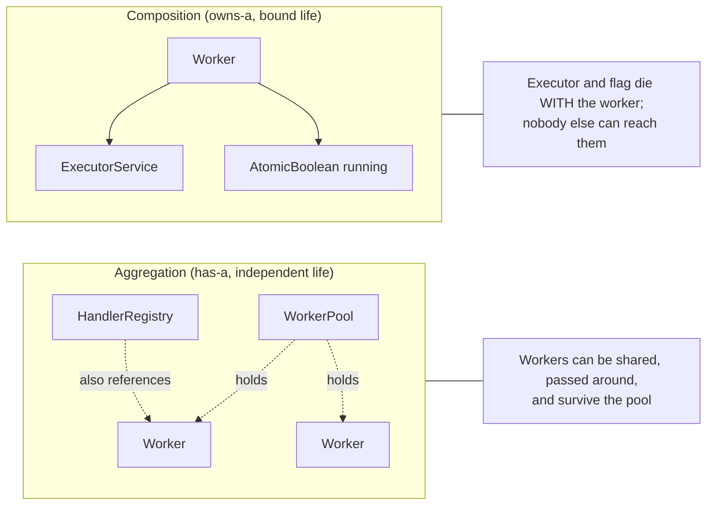
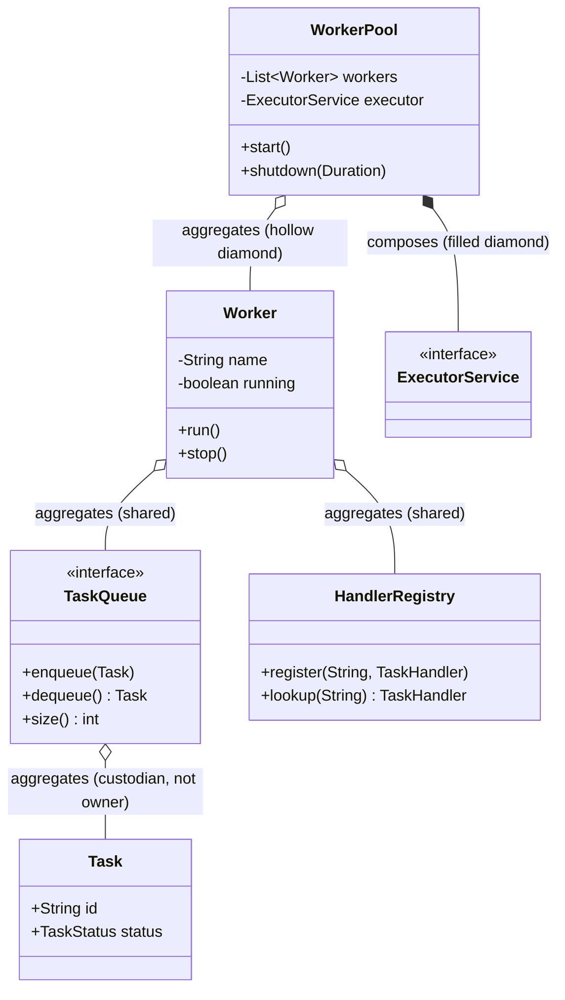

# Aggregation

> Where this fits: a `WorkerPool` *has* `Worker`s, but it does not bring them into existence from nothing and they could outlive it; an `InMemoryTaskQueue` *holds* `Task`s, but it did not create them and they keep existing after they are dequeued. That "has-a, but I don't own the lifecycle" wiring is **aggregation** — the relationship that decides who is responsible for constructing, sharing, and disposing of the objects in our platform.

The previous chapter, [chapter-14-association.md](chapter-14-association.md), drew the edges of the object graph: who refers to whom. This chapter sharpens one specific kind of edge — the **has-a relationship with independent lifecycles**. The next chapter, [chapter-16-composition.md](chapter-16-composition.md), sharpens the *other* one: has-a with a *bound* lifecycle. The distinction between these two is the single most consequential modeling decision you will make repeatedly in a backend, because it dictates your shutdown path, your resource leaks, and your testability. Get it wrong and you either double-free a shared resource or leak one that nobody disposes.

---

## 1. Why This Exists

Association told you "object A uses object B." But "uses" hides a critical question that production engineers must answer on day one: **when A goes away, does B go away too?**

Consider two relationships in our Task Queue platform that look identical in code — both are "A has a field of type B" — yet behave completely differently:

1. A `WorkerPool` has a list of `Worker`s. If you shut down and discard the pool, should the `Worker`s be destroyed? In our design, the `Worker`s are stopped, but a `Worker` is a plain object that could in principle be re-registered into another pool or live in a registry. The pool *manages* them but does not *exclusively own* their existence. This is **aggregation**.
2. A `Worker` has an `ExecutorService` it created internally and an internal `AtomicBoolean running` flag. If the `Worker` is destroyed, those die with it — nobody else has a reference, nobody else can use them, and the `Worker` is responsible for shutting the executor down. This is **composition** (next chapter).

Both are "has-a." Only aggregation says "but the parts have their own life." The reason this distinction *exists* as a named concept is **ownership of lifecycle**: who calls `new`, who shares the reference, and who is responsible for cleanup. UML (1997) introduced the **hollow diamond** notation precisely so a team could state, on a whiteboard, "the pool aggregates workers — they are shared and outlive the pool" versus "the worker composes its executor — it owns and disposes it." That single glyph encodes a contract about memory, resources, and shutdown.



> **The one-sentence test:** if you can hand the part to *someone else* and it would still make sense on its own, it is aggregation. If the part only makes sense *inside* its owner and dies with it, it is composition.

---

## 2. The Naive Version

A first-cut `WorkerPool` that creates everything itself, conflating ownership with mere usage:

```java
// NAIVE: the pool secretly owns and constructs everything.
public class NaiveWorkerPool {
    private final List<Worker> workers = new ArrayList<>();

    public NaiveWorkerPool(int size) {
        for (int i = 0; i < size; i++) {
            // Each worker builds its OWN private, empty queue and its OWN handlers.
            TaskQueue queue = new InMemoryTaskQueue();        // <-- bug factory
            Map<String, TaskHandler> handlers = new HashMap<>();
            handlers.put("email", new EmailHandler());        // hard-wired
            workers.add(new Worker(queue, handlers));
        }
    }

    public void start() {
        for (Worker w : workers) new Thread(w).start();
    }
}
```

Why this is wrong, concretely:

- **Each `Worker` gets its own empty `InMemoryTaskQueue`.** A task you `enqueue` into the pool's "real" queue is never seen — the workers are draining private queues that never receive anything. This is the single most common beginner concurrency bug in worker-pool code.
- **Handlers are hard-coded.** Adding a new task type means editing the pool. This violates the Open/Closed Principle and couples the pool to every handler in the system ([../04-oop-and-ood/solid.md](../04-oop-and-ood/solid.md)).
- **No shared lifecycle story.** Who shuts the queue down? Who owns the threads? It is unclear, which means in production something leaks.

The root mistake: the pool *constructed* its collaborators (`new InMemoryTaskQueue()`), which is the syntactic signature of **composition**, when what we actually wanted was **aggregation** — a *shared* queue handed in from outside that the workers reference but do not own.

---

## 3. Improved Version

Move from "the pool creates the parts" to "the parts are handed in and shared." This is the aggregation refactor: pass references rather than `new` them internally.

```java
// IMPROVED: collaborators are injected; the queue is SHARED across all workers.
public class WorkerPool {
    private final List<Worker> workers = new ArrayList<>();
    private final List<Thread> threads = new ArrayList<>();

    public WorkerPool(int size, TaskQueue sharedQueue, HandlerRegistry registry) {
        for (int i = 0; i < size; i++) {
            // Same queue reference for every worker -> they cooperate on one queue.
            workers.add(new Worker("worker-" + i, sharedQueue, registry));
        }
    }

    public void start() {
        for (Worker w : workers) {
            Thread t = new Thread(w, w.name());
            threads.add(t);
            t.start();
        }
    }
}
```

Now the queue is genuinely shared — all workers pull from the one queue you enqueue into. The pool **aggregates** workers, and the workers **aggregate** the shared queue and registry. None of them created those collaborators, so none of them should destroy them. But this version still has a gap: there is no clean `shutdown()` and no statement of who owns the queue's disposal. That is what the production version nails down.

---

## 4. Production-Quality Version

A staff-engineer `WorkerPool` makes the lifecycle contract explicit: it *manages* (starts/stops) the workers it aggregates, but it explicitly **does not** close the shared queue, because it did not create it. The component that *created* the queue owns its disposal.

```java
import java.util.List;
import java.util.Objects;
import java.util.concurrent.ExecutorService;
import java.util.concurrent.Executors;
import java.util.concurrent.TimeUnit;

/**
 * Aggregates Workers and runs them on a thread pool.
 *
 * Lifecycle contract (read this before touching shutdown):
 *  - WorkerPool OWNS the ExecutorService it creates -> it shuts it down. (composition)
 *  - WorkerPool AGGREGATES the Workers it is configured with -> it stops them
 *    but does not "destroy" them; a Worker is a reusable object. (aggregation)
 *  - WorkerPool AGGREGATES the shared TaskQueue -> it NEVER closes the queue,
 *    because it did not create it. Whoever created the queue closes it. (aggregation)
 */
public final class WorkerPool {

    private final List<Worker> workers;          // aggregated: handed in, shared-able
    private final ExecutorService executor;      // composed: created and owned here
    private volatile boolean started = false;

    public WorkerPool(List<Worker> workers) {
        // Defensive copy of the LIST, not of the Worker objects: we still share the
        // SAME Worker instances (aggregation), we just don't expose our list.
        this.workers = List.copyOf(Objects.requireNonNull(workers, "workers"));
        if (this.workers.isEmpty()) {
            throw new IllegalArgumentException("WorkerPool needs at least one worker");
        }
        this.executor = Executors.newVirtualThreadPerTaskExecutor(); // Java 21 Loom
    }

    public synchronized void start() {
        if (started) throw new IllegalStateException("already started");
        started = true;
        for (Worker w : workers) {
            executor.submit(w); // Worker implements Runnable
        }
    }

    /** Stops the workers we manage, then disposes ONLY what we own. */
    public void shutdown(java.time.Duration grace) throws InterruptedException {
        for (Worker w : workers) {
            w.stop(); // cooperative stop; flips the worker's own running flag
        }
        executor.shutdown(); // we created it, so we close it (composition)
        if (!executor.awaitTermination(grace.toMillis(), TimeUnit.MILLISECONDS)) {
            executor.shutdownNow();
        }
        // NOTE: we deliberately do NOT touch the shared TaskQueue here.
        // It is aggregated, not owned. Its creator is responsible for closing it.
    }

    /** Read-only view; callers cannot mutate our membership. */
    public List<Worker> workers() {
        return workers; // already immutable via List.copyOf
    }
}
```

The single most important comment in that file is the one in `shutdown`: **we do not close the queue.** That line is the difference between aggregation and composition expressed in running code. The pool owns the executor (it `new`-ed it), so it closes the executor. It does not own the queue (someone handed it in), so it leaves the queue alone.

---

## 5. Code Walkthrough

### 5.1 Beginner example — the hollow diamond in plain Java

A library `has` books, but books exist independently — a book can be moved to another library or sold. That is aggregation: the simplest possible mirror of `WorkerPool`/`Worker`.

```java
import java.util.ArrayList;
import java.util.List;

class Book {                 // an independent entity
    final String title;
    Book(String title) { this.title = title; }
}

class Library {              // aggregates Books it did not create
    private final List<Book> shelf = new ArrayList<>();

    void add(Book b) { shelf.add(b); }   // receives an existing Book (reference)
    void remove(Book b) { shelf.remove(b); }
    int count() { return shelf.size(); }
}

public class AggregationDemo {
    public static void main(String[] args) {
        Book book = new Book("Effective Java"); // book is born OUTSIDE the library
        Library a = new Library();
        Library b = new Library();
        a.add(book);
        a.remove(book);
        b.add(book);                            // SAME book, now in another library
        // The book outlived its membership in `a`. That is aggregation.
        System.out.println(a.count() + " " + b.count()); // 0 1
    }
}
```

Key tells of aggregation in this code: the `Book` is constructed *outside* `Library`, it is *passed in* by reference, and it can move between containers without being copied or recreated.

### 5.2 Intermediate example — the queue aggregates tasks it does not own

Our `InMemoryTaskQueue` is a textbook aggregator: it holds `Task` objects, but the API layer created them, and after `dequeue` a `Worker` keeps using the same `Task`. The queue never owns the task's lifecycle.

```java
import java.time.Instant;
import java.util.concurrent.BlockingQueue;
import java.util.concurrent.LinkedBlockingQueue;

enum TaskStatus { PENDING, SCHEDULED, RUNNING, SUCCEEDED, FAILED, RETRYING, DEAD }

record Task(String id, String type, String payload, TaskStatus status,
            int attempts, int maxAttempts, Instant createdAt,
            Instant scheduledAt, int priority) {

    Task withStatus(TaskStatus s) {
        return new Task(id, type, payload, s, attempts, maxAttempts,
                        createdAt, scheduledAt, priority);
    }
}

interface TaskQueue {
    void enqueue(Task t) throws InterruptedException;
    Task dequeue() throws InterruptedException;
    int size();
}

/** Aggregates Tasks: it holds references it received; it never creates Tasks. */
final class InMemoryTaskQueue implements TaskQueue {
    private final BlockingQueue<Task> queue = new LinkedBlockingQueue<>();

    @Override public void enqueue(Task t) throws InterruptedException {
        queue.put(t);                // receives an existing Task (aggregation)
    }
    @Override public Task dequeue() throws InterruptedException {
        return queue.take();         // returns it; the same Task lives on
    }
    @Override public int size() { return queue.size(); }
}

public class QueueAggregationDemo {
    public static void main(String[] args) throws InterruptedException {
        Task t = new Task("11111111-1111-1111-1111-111111111111", "email",
                "{\"to\":\"a@b.com\"}", TaskStatus.PENDING, 0, 3,
                Instant.now(), Instant.now(), 5);

        TaskQueue q = new InMemoryTaskQueue();
        q.enqueue(t);
        Task pulled = q.dequeue();
        // Same identity flowed through; the queue did not own or copy it.
        System.out.println(pulled.id().equals(t.id())); // true
        Task running = pulled.withStatus(TaskStatus.RUNNING); // task lives on, evolves
        System.out.println(running.status());                  // RUNNING
    }
}
```

The `Task` is born in the API layer, *flows through* the queue, and *outlives* its time in the queue inside the worker. The queue is a temporary custodian, never an owner — the defining shape of aggregation over a collection. (The `BlockingQueue` underneath is covered in [../06-concurrency/blocking-queue.md](../06-concurrency/blocking-queue.md).)

### 5.3 Production-inspired example — a builder that wires shared aggregates

In production, a single composition root wires the shared collaborators once and hands the *same references* to everyone. This is aggregation at the architecture scale: one queue, one registry, many workers, one pool.

```java
import java.util.ArrayList;
import java.util.HashMap;
import java.util.List;
import java.util.Map;

record TaskResult(boolean success, String message, boolean retryable) {}

@FunctionalInterface
interface TaskHandler { TaskResult handle(Task task) throws Exception; }

/** Aggregates handlers keyed by task type; handlers are shared, not owned. */
final class HandlerRegistry {
    private final Map<String, TaskHandler> handlers = new HashMap<>();
    HandlerRegistry register(String type, TaskHandler h) { handlers.put(type, h); return this; }
    TaskHandler lookup(String type) { return handlers.get(type); }
}

final class Worker implements Runnable {
    private final String name;
    private final TaskQueue queue;          // aggregated: shared, not owned
    private final HandlerRegistry registry; // aggregated: shared, not owned
    private volatile boolean running = true;

    Worker(String name, TaskQueue queue, HandlerRegistry registry) {
        this.name = name; this.queue = queue; this.registry = registry;
    }
    String name() { return name; }
    void stop() { running = false; }

    @Override public void run() {
        while (running) {
            try {
                Task t = queue.dequeue();
                TaskHandler h = registry.lookup(t.type());
                if (h == null) continue;
                h.handle(t.withStatus(TaskStatus.RUNNING));
            } catch (InterruptedException e) {
                Thread.currentThread().interrupt();
                return;
            } catch (Exception e) {
                // real code routes to retry/DLQ; omitted for focus
            }
        }
    }
}

/** Composition root: builds shared aggregates ONCE, injects them everywhere. */
final class PlatformBootstrap {
    static WorkerPool build(int poolSize) {
        TaskQueue sharedQueue = new InMemoryTaskQueue();          // created HERE
        HandlerRegistry registry = new HandlerRegistry()
                .register("email", task -> new TaskResult(true, "sent", false))
                .register("report", task -> new TaskResult(true, "built", false));

        List<Worker> workers = new ArrayList<>();
        for (int i = 0; i < poolSize; i++) {
            // SAME sharedQueue and registry references for all workers.
            workers.add(new Worker("worker-" + i, sharedQueue, registry));
        }
        return new WorkerPool(workers); // pool aggregates the workers
        // The bootstrap, not the pool, owns sharedQueue's disposal.
    }
}
```

Everything important is one reference shared many times. The `sharedQueue` and `registry` are created in exactly one place (the composition root) and *aggregated* by every worker. That is what lets you submit a task once and have any worker pick it up.

---

## 6. UML: The Hollow Diamond

UML draws aggregation as a **hollow (white) diamond** on the *container* side, and composition as a **filled (black) diamond**. The diamond always sits next to the *whole*; the line runs to the *part*.



Reading the diagram: every `o--` (hollow diamond) is "has-a with independent life." The only `*--` (filled diamond) is the `ExecutorService`, which the pool creates and destroys. In Mermaid, `o--` renders the hollow-diamond aggregation and `*--` renders the filled-diamond composition.

---

## 7. How This Applies to Our Task Queue Project

| Whole | Part | Relationship | Why |
| --- | --- | --- | --- |
| `WorkerPool` | `Worker` | Aggregation | Workers are configured in and managed, but are reusable objects with their own identity. |
| `Worker` | `TaskQueue` | Aggregation | One queue is shared by all workers; the worker never created it. |
| `Worker` | `HandlerRegistry` | Aggregation | The registry is shared platform-wide; workers only read it. |
| `InMemoryTaskQueue` | `Task` | Aggregation | The queue is a temporary custodian; tasks are created upstream and live on downstream. |
| `WorkerPool` | `ExecutorService` | Composition | The pool `new`-s it and shuts it down — bound lifecycle (see next chapter). |
| `Worker` | `running` flag | Composition | Internal state, unreachable from outside, dies with the worker. |

The practical payoff in our platform: because the queue is *aggregated* (shared, injected), you can swap `InMemoryTaskQueue` for `PostgresTaskQueue` in Phase 2 by changing one line in the composition root, and every worker uses the new queue with zero edits. See how this enables substitution at [../04-oop-and-ood/dependency-injection.md](../04-oop-and-ood/dependency-injection.md), and how low coupling is the goal at [../04-oop-and-ood/coupling.md](../04-oop-and-ood/coupling.md).

---

## 8. Tradeoffs

| Dimension | Aggregation (shared, independent life) | Composition (owned, bound life) |
| --- | --- | --- |
| Who calls `new` | An outside party (composition root) | The owner, internally |
| Sharing | Yes — many wholes can reference one part | No — exclusive to one owner |
| Disposal | The creator disposes; the whole must NOT | The owner disposes |
| Testability | High — inject a fake/mock part | Lower — part is hidden inside |
| Coupling | Lower (depend on interface, inject impl) | Higher (concrete part baked in) |
| Risk | Forgetting who owns disposal → leak | Leaking the part's reference → broken encapsulation |
| UML | Hollow diamond `o--` | Filled diamond `*--` |

Honest tradeoff: aggregation buys you flexibility and testability at the cost of a *clear ownership policy you must document and enforce*. When you share a `TaskQueue` across ten workers, you have created a question — "who closes it?" — that did not exist when each worker owned its own. The answer must be written down (we put it in the `shutdown` comment) or you get either a double-close or a leak. Composition avoids that question entirely by making ownership exclusive, which is why you should *prefer composition for resources you create and aggregation for collaborators you receive*.

---

## 9. Common Mistakes and Pitfalls

- **Constructing a shared collaborator inside the whole.** `this.queue = new InMemoryTaskQueue()` in `Worker` turns an intended aggregation into an accidental composition, giving every worker a private empty queue. *Fix:* inject the queue through the constructor.
- **Closing an aggregated resource.** Having `WorkerPool.shutdown()` call `queue.close()` double-frees a resource the pool did not create. If two pools share the queue, the first shutdown breaks the second pool. *Fix:* only the creator disposes; document it.
- **Leaking the internal collection by reference.** `return workers;` over a mutable `ArrayList` lets callers mutate the pool's membership. *Fix:* return `List.copyOf(...)` or `Collections.unmodifiableList(...)`. (Note: copying the *list* is right; copying the *Workers* would be wrong — aggregation shares the parts.)
- **Confusing "defensive copy of the container" with "copy of the parts."** Aggregation means you may copy the list to protect your structure, but you keep sharing the *same* part instances. Deep-copying the parts would silently turn it into composition.
- **Bidirectional aggregation without an owner.** If `Worker` holds `WorkerPool` and `WorkerPool` holds `Worker`, neither is clearly the whole, and shutdown ordering becomes ambiguous. *Fix:* keep the navigation one-directional (whole → part) unless you have a hard requirement.
- **Forgetting null/empty guards.** An aggregated collaborator is handed in, so it can be `null`. *Fix:* `Objects.requireNonNull` in the constructor — fail fast at wiring time, not at 3 a.m. under load.

---

## 10. Refactoring Exercise

**Bad** — composition masquerading as aggregation; private queues and hard-wired handlers:

```java
public class BadPool {
    private final List<Worker> workers = new ArrayList<>();
    public BadPool(int n) {
        for (int i = 0; i < n; i++) {
            TaskQueue q = new InMemoryTaskQueue();   // private per-worker queue (bug)
            Map<String, TaskHandler> h = new HashMap<>();
            h.put("email", new EmailHandler());      // hard-wired
            workers.add(new Worker("w" + i, q, new HandlerRegistry(h)));
        }
    }
    public List<Worker> getWorkers() { return workers; } // leaks mutable list
}
```

**Improved** — share the queue and registry by injecting them:

```java
public class ImprovedPool {
    private final List<Worker> workers = new ArrayList<>();
    public ImprovedPool(int n, TaskQueue sharedQueue, HandlerRegistry registry) {
        for (int i = 0; i < n; i++) {
            workers.add(new Worker("w" + i, sharedQueue, registry)); // shared refs
        }
    }
    public List<Worker> getWorkers() { return workers; } // still leaks
}
```

**Production-quality** — immutable membership, explicit ownership, no disposal of aggregates:

```java
public final class ProdPool {
    private final List<Worker> workers;
    private final ExecutorService executor; // owned (composition)

    public ProdPool(List<Worker> workers) {
        this.workers = List.copyOf(Objects.requireNonNull(workers, "workers"));
        if (this.workers.isEmpty()) throw new IllegalArgumentException("empty pool");
        this.executor = Executors.newVirtualThreadPerTaskExecutor();
    }
    public void start() { workers.forEach(executor::submit); }
    public void shutdown() {
        workers.forEach(Worker::stop);
        executor.shutdown();                 // dispose ONLY what we own
        // do NOT close the shared queue/registry: aggregated, not owned
    }
    public List<Worker> workers() { return workers; } // immutable, safe to expose
}
```

The arc: stop *creating* the shared parts, start *receiving* them, then lock down membership and clarify that the pool disposes only what it created.

---

## 11. Exercises

### Easy

- **E1 (knowledge check).** In UML, which diamond denotes aggregation, and on which end of the line does it sit — the whole or the part? What does that diamond promise about lifecycle?
- **E2 (coding).** Write a `TagCloud` class that aggregates `String` tags created elsewhere: methods `add(String)`, `remove(String)`, and `size()`. The same tag string must be addable to two different `TagCloud`s. Prove it in a `main`.

### Medium

- **E3 (coding).** Implement a `WorkerPool` whose `workers()` getter cannot be used to mutate the pool's membership, yet still returns the *same* `Worker` instances (not copies). Demonstrate that mutating the returned list throws, while the workers themselves are shared.
- **E4 (refactoring).** Given a `Worker` that does `this.queue = new InMemoryTaskQueue()` in its constructor, refactor it to aggregate an injected `TaskQueue`. Show that two workers now drain the *same* queue.

### Hard

- **E5 (design).** Two `WorkerPool`s share one `TaskQueue` (a "blue/green" deploy where both pools drain the same backlog). Design the ownership and shutdown protocol so that shutting down one pool does **not** close the shared queue, and the queue is closed exactly once when *both* pools are gone. Sketch it with a small `QueueOwner`/reference-count idea.
- **E6 (interview-style).** A teammate says "aggregation and composition are the same thing in Java because both are just object fields." Refute this with a concrete bug that only appears if you treat an aggregation as a composition. Then give the one code-level tell that distinguishes them.
- **E7 (stretch).** Extend the production `WorkerPool` so it aggregates a shared `MetricsCollector` (counters for tasks processed) injected from outside, while still composing its own `ExecutorService`. Ensure `shutdown()` flushes nothing on the metrics collector (the platform owns it) but does shut the executor down. Add a test asserting the executor is terminated and the metrics collector is still usable afterward.

---

## 12. Solutions

### E1

The **hollow (white) diamond** denotes aggregation, and it sits on the **whole** (container) end of the line; the plain line runs to the **part**. It promises an **independent lifecycle**: the part can exist before the whole, be shared by multiple wholes, and survive the whole's destruction. The whole must therefore **not** dispose the part.

### E2

```java
import java.util.ArrayList;
import java.util.List;

final class TagCloud {
    private final List<String> tags = new ArrayList<>();
    void add(String tag) { tags.add(tag); }
    void remove(String tag) { tags.remove(tag); }
    int size() { return tags.size(); }
}

public class E2 {
    public static void main(String[] args) {
        String shared = "java";              // created OUTSIDE both clouds
        TagCloud a = new TagCloud();
        TagCloud b = new TagCloud();
        a.add(shared);
        b.add(shared);                       // same string, two aggregators
        System.out.println(a.size() + " " + b.size()); // 1 1
        a.remove(shared);
        System.out.println(a.size() + " " + b.size()); // 0 1 -> tag outlived `a`
    }
}
```

The tag is born outside, shared by reference, and survives removal from one cloud — the signature of aggregation.

### E3

```java
import java.util.List;
import java.util.Objects;

final class WorkerPool {
    private final List<Worker> workers;
    WorkerPool(List<Worker> workers) {
        // Immutable copy of the LIST; the SAME Worker instances are shared.
        this.workers = List.copyOf(Objects.requireNonNull(workers));
    }
    List<Worker> workers() { return workers; } // List.copyOf -> immutable view
}

public class E3 {
    public static void main(String[] args) {
        TaskQueue q = new InMemoryTaskQueue();
        HandlerRegistry r = new HandlerRegistry();
        Worker w0 = new Worker("w0", q, r);
        WorkerPool pool = new WorkerPool(List.of(w0));

        // Same instance is shared (aggregation), not a copy:
        System.out.println(pool.workers().get(0) == w0); // true

        // Membership cannot be mutated through the getter:
        try {
            pool.workers().add(new Worker("hacker", q, r));
        } catch (UnsupportedOperationException ex) {
            System.out.println("membership is immutable"); // printed
        }
    }
}
```

`List.copyOf` protects the *structure* (you cannot add/remove workers) while still exposing the *same* `Worker` objects — exactly the aggregation contract: share the parts, protect the container.

### E4

```java
final class Worker implements Runnable {
    private final String name;
    private final TaskQueue queue;          // injected -> aggregation
    private volatile boolean running = true;
    Worker(String name, TaskQueue queue) { this.name = name; this.queue = queue; }
    void stop() { running = false; }
    public void run() {
        while (running) {
            try { queue.dequeue(); } catch (InterruptedException e) {
                Thread.currentThread().interrupt(); return;
            }
        }
    }
}

public class E4 {
    public static void main(String[] args) throws InterruptedException {
        TaskQueue shared = new InMemoryTaskQueue();   // created ONCE, outside
        Worker a = new Worker("a", shared);
        Worker b = new Worker("b", shared);
        shared.enqueue(sampleTask());
        // Either a or b can take from the SAME queue -> proves sharing.
        Task pulled = shared.dequeue();
        System.out.println(pulled != null); // true; one shared backlog
    }
    static Task sampleTask() {
        return new Task("id", "email", "{}", TaskStatus.PENDING, 0, 3,
                java.time.Instant.now(), java.time.Instant.now(), 1);
    }
}
```

Before: each worker called `new InMemoryTaskQueue()` and saw an empty private queue. After: one queue is injected and both workers cooperate on the same backlog.

### E5

Use **reference counting** with a handle that the pools register with. The pools aggregate the queue; the handle owns it.

```java
import java.util.concurrent.atomic.AtomicInteger;

final class SharedQueueHandle implements AutoCloseable {
    private final TaskQueue queue;
    private final AtomicInteger refs = new AtomicInteger(0);
    private final AutoCloseable disposer; // how to actually free the queue

    SharedQueueHandle(TaskQueue queue, AutoCloseable disposer) {
        this.queue = queue; this.disposer = disposer;
    }
    TaskQueue acquire() { refs.incrementAndGet(); return queue; }
    @Override public void close() throws Exception {
        if (refs.decrementAndGet() == 0) disposer.close(); // closed exactly once
    }
}
```

Each pool calls `handle.acquire()` at construction and `handle.close()` at shutdown. Shutting down one pool decrements the count but does **not** close the queue while the other pool still holds a reference. The queue closes exactly once, when the count hits zero. The pools never touch the queue's disposer directly — ownership lives in `SharedQueueHandle`, the parts are merely aggregated.

### E6

**Refutation.** Treating an aggregation as a composition causes a **shared-resource double-close (or premature close) bug**. Concretely: if two `WorkerPool`s share one `PostgresTaskQueue` (a connection-pool-backed queue) and you wrongly let `WorkerPool.shutdown()` call `queue.close()`, then shutting down pool A closes the connection pool *while pool B is still draining tasks* — pool B's `dequeue()` now throws "pool is shut down." This bug is invisible with a single pool and only appears under sharing, which is exactly what aggregation enables and composition forbids.

**The code-level tell.** Look at who calls `new` on the part. If the part is created *inside* the owner (`this.x = new X()`) and never escapes, it is composition. If it is *passed into the constructor* (`Owner(X x) { this.x = x; }`) and may be shared, it is aggregation. Disposal must follow creation: only the creator closes.

### E7

```java
import java.time.Duration;
import java.util.List;
import java.util.Objects;
import java.util.concurrent.ExecutorService;
import java.util.concurrent.Executors;
import java.util.concurrent.TimeUnit;
import java.util.concurrent.atomic.AtomicLong;

final class MetricsCollector {                 // owned by the platform, not the pool
    private final AtomicLong processed = new AtomicLong();
    void incProcessed() { processed.incrementAndGet(); }
    long processed() { return processed.get(); }
}

final class WorkerPool {
    private final List<Worker> workers;        // aggregated
    private final MetricsCollector metrics;    // aggregated (shared, injected)
    private final ExecutorService executor;    // composed (owned)

    WorkerPool(List<Worker> workers, MetricsCollector metrics) {
        this.workers = List.copyOf(Objects.requireNonNull(workers));
        this.metrics = Objects.requireNonNull(metrics);
        this.executor = Executors.newVirtualThreadPerTaskExecutor();
    }
    MetricsCollector metrics() { return metrics; }
    void start() { workers.forEach(executor::submit); }
    void shutdown(Duration grace) throws InterruptedException {
        workers.forEach(Worker::stop);
        executor.shutdown();                   // dispose what we own
        if (!executor.awaitTermination(grace.toMillis(), TimeUnit.MILLISECONDS)) {
            executor.shutdownNow();
        }
        // metrics is NOT flushed/closed here: the platform owns it.
    }
    boolean isExecutorTerminated() { return executor.isTerminated(); }
}
```

Test sketch (JUnit 5 + AssertJ):

```java
import org.junit.jupiter.api.Test;
import java.time.Duration;
import java.util.List;
import static org.assertj.core.api.Assertions.assertThat;

class WorkerPoolMetricsTest {
    @Test void shutsDownExecutorButLeavesMetricsUsable() throws Exception {
        MetricsCollector metrics = new MetricsCollector();
        TaskQueue q = new InMemoryTaskQueue();
        HandlerRegistry r = new HandlerRegistry();
        WorkerPool pool = new WorkerPool(
                List.of(new Worker("w0", q, r)), metrics);
        pool.start();
        pool.shutdown(Duration.ofSeconds(2));

        assertThat(pool.isExecutorTerminated()).isTrue();   // owned -> disposed
        metrics.incProcessed();                              // aggregated -> still alive
        assertThat(pool.metrics().processed()).isEqualTo(1);
    }
}
```

The pool disposes its executor (composition) but leaves the injected `MetricsCollector` fully usable after shutdown (aggregation). This mirrors the real platform, where one `MeterRegistry` is shared across pools and outlives any single one — see [../04-oop-and-ood/dependency-injection.md](../04-oop-and-ood/dependency-injection.md).

---

## 13. Interview Questions and Takeaways

1. **Q: Define aggregation and contrast it with composition.**
   A: Both are "has-a." Aggregation is has-a with *independent lifecycles* — the part is created elsewhere, can be shared, and survives the whole (UML hollow diamond). Composition is has-a with a *bound lifecycle* — the whole creates and exclusively owns the part, which dies with it (filled diamond).

2. **Q: How do you tell aggregation from composition by reading Java code?**
   A: Follow the `new`. If the part is constructed inside the owner and never escapes, it is composition. If it is passed into the constructor (injected) and may be shared, it is aggregation. Disposal must follow creation.

3. **Q: Why does the WorkerPool not close the shared TaskQueue in shutdown?**
   A: Because the pool aggregates the queue — it did not create it. Closing it would double-free a resource that other components (or another pool) may still use. The creator (composition root) owns disposal.

4. **Q: What bug arises if you accidentally turn an aggregation into a composition?**
   A: A shared resource gets a private copy or gets closed by the wrong owner. In our pool, per-worker `new InMemoryTaskQueue()` gives each worker a private empty queue, so enqueued tasks are never processed.

5. **Q: How do you safely expose an aggregated collection?**
   A: Return an unmodifiable view (`List.copyOf` / `Collections.unmodifiableList`) so callers cannot mutate membership, while still sharing the *same* part instances — never deep-copy the parts, or you have silently switched to composition.

6. **Q: Is a Java field reference always aggregation?**
   A: No. A field reference is just association. Whether it is aggregation or composition depends on lifecycle ownership, which the language does not enforce — you express and document it.

7. **Q: When should you prefer aggregation over composition?**
   A: When the part is a *collaborator* you want to share, swap, or mock — like a `TaskQueue` or `MetricsCollector`. Prefer composition for internal state and resources you create and must dispose (like an `ExecutorService`).

**Takeaways:** Aggregation = has-a + independent life + hollow diamond. The decisive question is "who owns disposal?" Inject collaborators, document ownership, never close what you did not create.

---

## 14. Production Considerations

- **Resource leaks vs double-frees.** The aggregation/composition boundary *is* your resource-lifecycle boundary. A shared `PostgresTaskQueue` (Phase 2) wraps a connection pool. If a pool closes it on shutdown (treating it as composition), other consumers break; if nobody closes it, you leak connections until the database refuses new ones. Make the composition root own it and close it once, on application shutdown.
- **Shutdown ordering.** Stop the things that *use* the shared part before disposing the part. The pool stops its workers (which dequeue from the queue) before the application closes the queue. Reverse that and workers hit a closed queue mid-flight.
- **Reference counting at scale.** When multiple horizontally-scaled components share a broker (Phase 4: Redis/Kafka), "who closes it" becomes a distributed-ownership question. Usually the connection/client is aggregated by every consumer and owned by a single client-manager bean (Spring's container handles this via `@Bean` lifecycle and `destroyMethod`).
- **Monitoring the aggregate.** Because the `MetricsCollector` / `MeterRegistry` is aggregated and shared, you get *one* coherent view across all pools — exactly why you share it rather than give each pool its own. Per-pool registries would fragment your dashboards.
- **Spring DI mirrors this exactly.** A `@Bean TaskQueue` is created once and aggregated (injected) into every `Worker`/`WorkerPool`; the container, not the consumers, owns its lifecycle and `destroyMethod`. Understanding aggregation makes Spring's container behavior obvious rather than magical — see [../04-oop-and-ood/dependency-injection.md](../04-oop-and-ood/dependency-injection.md).
- **Testcontainers and fakes.** Because aggregated parts are injected, tests pass a fake `TaskQueue` or an in-memory `MetricsCollector` without touching the production wiring — the testability dividend of aggregation.

---

## What We Can Improve In Our Project Using This Concept

Today some early-phase code constructs collaborators inside their users (a leftover `new InMemoryTaskQueue()` in worker setup, and a per-worker handler map). We can hoist all shared collaborators — `TaskQueue`, `HandlerRegistry`, `MetricsCollector` — into a single composition root (`PlatformBootstrap`) and aggregate them into every `Worker` and `WorkerPool`. This makes the in-memory → `PostgresTaskQueue` swap a one-line change, eliminates the private-empty-queue bug class, and gives us one shared metrics view across all pools.

## Project Refactoring Task

1. Remove every `new InMemoryTaskQueue()` / inline handler map from `Worker` and `WorkerPool`; require them as constructor parameters.
2. Add `PlatformBootstrap.build(int poolSize)` as the single place that creates the shared queue, registry, and metrics collector and injects them.
3. Make `WorkerPool.workers()` return `List.copyOf(...)`; make `WorkerPool.shutdown()` stop workers and shut down only the executor it owns — never the queue.
4. Add a unit test proving (a) two workers drain the same injected queue, and (b) `shutdown()` terminates the executor while leaving the injected `MetricsCollector` usable.

## Git Commit For This Chapter

```text
refactor(core): aggregate shared collaborators via composition root

- Inject TaskQueue, HandlerRegistry, MetricsCollector instead of new-ing them
- Add PlatformBootstrap as single wiring point for shared aggregates
- WorkerPool now owns only its ExecutorService; never closes the shared queue
- Expose immutable workers() view; document aggregation vs composition ownership
- Tests: shared-queue draining + executor-terminated-while-metrics-alive

Files touched:
  src/main/java/.../Worker.java
  src/main/java/.../WorkerPool.java
  src/main/java/.../HandlerRegistry.java
  src/main/java/.../PlatformBootstrap.java
  src/test/java/.../WorkerPoolMetricsTest.java
```

## Architecture Impact

Centralizing shared aggregates in a composition root turns the platform into a clean object graph: one queue, one registry, one metrics registry, many workers, one (or more) pools — all wired from a single seam. This seam is what later enables broker pluggability (Phase 4), horizontal scaling (many pools sharing one persistent queue), and clean shutdown ordering. It also pins down resource ownership, eliminating the two failure modes that bite worker pools in production: private-empty-queue silent drops and shared-resource double-close.

## Interview Takeaways

- Aggregation is **has-a with independent lifecycles**: hollow diamond, shared parts, creator owns disposal.
- The deciding question is always **"who owns disposal?"** — follow the `new`.
- A Java field is just association; aggregation vs composition is a *lifecycle* distinction the language does not enforce but you must document.
- Inject collaborators (aggregate), own your internal resources (compose), and never close what you did not create.
- This is the structural basis of dependency injection and the reason Spring's bean lifecycle behaves the way it does.
