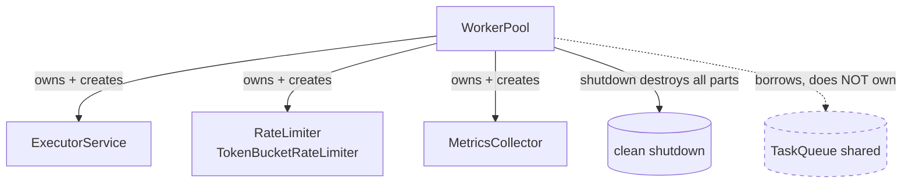
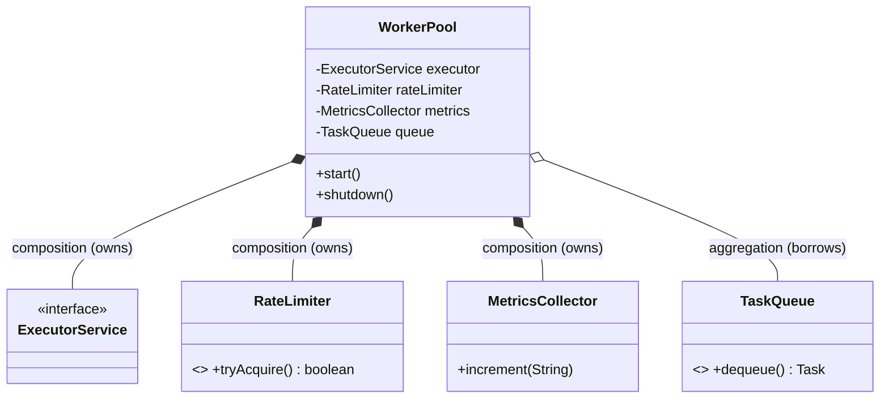
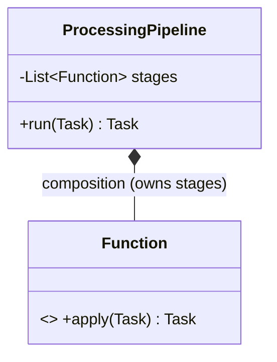

# Composition

> Where this fits: a `WorkerPool` is not just a bag of `Worker`s — it *is* an `ExecutorService` plus a `RateLimiter` plus a `MetricsCollector` welded together into one running thing. Those parts are created by the pool, live exactly as long as the pool lives, and die when `shutdown()` is called. Nobody else holds them, nobody else can break them. That "I made you, I own you, I destroy you" relationship is **composition**, and it is the backbone of how we build complex behavior in Phase 1 out of small, single-purpose parts.

The previous chapter, [chapter-15-aggregation.md](chapter-15-aggregation.md), covered the *loose* whole-part relationship: a `WorkerPool` *has* `Worker`s and a shared `TaskQueue` whose lifecycle it does not own (the UML **hollow diamond**). Composition is the *strong* version: the whole **owns** its parts, the parts have a **dependent lifecycle**, and the parts are **not shared**. That is the UML **filled diamond**. The next chapter, [chapter-17-composition-vs-inheritance.md](chapter-17-composition-vs-inheritance.md), turns this into the most important design heuristic you will ever learn: *favor composition over inheritance*. This chapter is the foundation for that — it teaches you what composition actually *is* in Java, mechanically and in design terms.

---

## 1. Why This Exists

The real problem composition solves is: **how do you build a big, capable object out of small, focused objects without that big object becoming a god-class?**

Phase 1 of our platform is `Client -> Task Submission API -> In-Memory Queue -> Worker Pool -> Task Execution`. Look closely at `WorkerPool`. It has to do several genuinely different jobs:

1. Run N worker threads concurrently → needs an `ExecutorService`.
2. Not overwhelm downstream systems → needs a `RateLimiter`.
3. Report throughput, latency, and failures → needs a `MetricsCollector`.
4. Pull tasks and dispatch them → needs `Worker`s, which need a `TaskQueue`.

You could write all four jobs as one 600-line class with a thread array, a token-counting field, a pile of counters, and a dispatch loop. It would work. It would also be untestable, unextensible, and the kind of thing that gets a "what *is* this" in code review.

Composition is the alternative. Each job becomes its own type with one responsibility. `WorkerPool` then becomes a small coordinator that **owns one instance of each** and **delegates** to them. The pool's behavior emerges from how its parts are wired together, not from a monolith of inlined logic. This is the single-responsibility principle (covered later in [../04-oop-and-ood/cohesion.md](../04-oop-and-ood/cohesion.md) and [../04-oop-and-ood/solid.md](../04-oop-and-ood/solid.md)) made structural.

The reason composition exists *as a distinct, named concept* — versus plain aggregation — is **lifecycle and ownership**. When you compose, you take on a contract:

- **You create the part** (usually in your constructor, with `new`, or you build it from primitives the caller passed).
- **You are the only one who holds a reference to it** (you never leak it).
- **You destroy the part when you die** (you call `close()` / `shutdown()` on it in your own cleanup).

Get that contract right and you get clean shutdown, no resource leaks, no aliasing bugs, and parts you can swap or test in isolation. Get it wrong — leak an owned part, or fail to close it — and you get the two classic production bugs this chapter exists to prevent.

**Historical note.** The filled-diamond/hollow-diamond distinction is from UML (OMG, late 1990s). UML defines *composite aggregation* (the filled diamond) with two crisp rules that Java has no keyword for but that you encode in code: a part belongs to **at most one** composite at a time, and the composite is **responsible for the part's lifecycle**. There is no `compose` keyword in Java — composition is a *design statement* you make through where you call `new`, whether you leak the reference, and who calls the part's cleanup method. This chapter teaches you to write that statement correctly.



> Note the dashed `TaskQueue`: the pool *composes* its executor, rate limiter, and metrics, but it only *aggregates* the shared queue. One object can be both a composer of some parts and a borrower of others. Knowing which is which is the whole skill.

---

## 2. Composition vs Aggregation vs Association — The Exact Line

Lock this down before any code. All three are "has-a". The difference is **ownership and lifecycle**.

| Relationship | UML | Lifecycle of part | Sharing | Who creates the part | Example in our project |
|---|---|---|---|---|---|
| Association | plain line / arrow | fully independent | n/a | anyone | `Worker` knows the `MetricsCollector` it reports to |
| Aggregation | hollow ◇ diamond | independent; outlives whole | **shared** | someone else, passed in | `WorkerPool` ◇— shared `TaskQueue` |
| **Composition** | **filled ◆ diamond** | **dependent; dies with whole** | **exclusive** | **the whole itself** | `WorkerPool` ◆— `ExecutorService`, `RateLimiter`, `MetricsCollector` |

Two litmus tests decide composition every time:

1. **Lifecycle test.** "If I destroy the whole, must the part also be destroyed?" If yes → composition. The `ExecutorService` inside a `WorkerPool` is meaningless after the pool dies; destroy it. The shared `TaskQueue` is *not* — other components still use it; leave it.
2. **Sharing test.** "Can two wholes legally point at the same part instance at the same time?" If no → composition. Two `WorkerPool`s must not share one `TokenBucketRateLimiter` instance internally (each pool rate-limits itself); each makes its own. They *can* share a `TaskQueue` (that's the point of a queue) → aggregation.



The filled diamonds (`*--`) on the executor, rate limiter, and metrics; the hollow diamond (`o--`) on the queue. That diagram *is* the design.

---

## 3. The Naive Version

Here is the first-cut `WorkerPool` a Java newcomer writes: one class that inlines every responsibility. (Domain types `Task`, `TaskStatus`, `TaskHandler`, `TaskResult`, `TaskQueue` are from the canonical model.)

```java
// NAIVE: a god-class that inlines executor, rate limiting, and metrics by hand.
public class WorkerPool {
    private final TaskQueue queue;
    private final Map<String, TaskHandler> handlers;
    private final Thread[] threads;                 // raw threads, hand-rolled
    private volatile boolean running = true;

    // rate limiting, inlined as bare fields
    private long tokens;
    private final long capacity;
    private long lastRefillNanos;

    // metrics, inlined as bare fields
    private long succeeded;
    private long failed;

    public WorkerPool(TaskQueue queue, Map<String, TaskHandler> handlers,
                      int size, long ratePerSec) {
        this.queue = queue;
        this.handlers = handlers;
        this.threads = new Thread[size];
        this.capacity = ratePerSec;
        this.tokens = ratePerSec;
        this.lastRefillNanos = System.nanoTime();
    }

    public void start() {
        for (int i = 0; i < threads.length; i++) {
            threads[i] = new Thread(this::loop);
            threads[i].start();
        }
    }

    private void loop() {
        while (running) {
            try {
                // rate limiting tangled into the dispatch loop
                synchronized (this) {
                    long now = System.nanoTime();
                    tokens = Math.min(capacity,
                        tokens + (now - lastRefillNanos) * capacity / 1_000_000_000L);
                    lastRefillNanos = now;
                    if (tokens < 1) { wait(5); continue; }
                    tokens--;
                }
                Task t = queue.dequeue();
                TaskHandler h = handlers.get(t.type());
                TaskResult r = h.handle(t);
                synchronized (this) {
                    if (r.success()) succeeded++; else failed++;   // metrics inlined
                }
            } catch (Exception e) {
                synchronized (this) { failed++; }
            }
        }
    }

    public void shutdown() {
        running = false;
        for (Thread t : threads) t.interrupt();
    }

    public long succeeded() { return succeeded; }
    public long failed()    { return failed; }
}
```

What is wrong:

- **Three responsibilities in one class.** Thread management, token-bucket math, and counters are all tangled into one `loop()`. You cannot test the rate-limiting logic without spinning up real threads.
- **No reuse.** The token-bucket math lives here and only here. Phase 3 needs the *same* rate limiter in front of the API layer — now you copy-paste it.
- **Hand-rolled threads.** Raw `Thread[]`, manual `interrupt()`, a `volatile boolean` flag. The JDK already solved this with `ExecutorService`; we re-invented it badly (no graceful drain, no `awaitTermination`).
- **Metrics that can't be exported.** Two `long` fields. Phase 3 needs Micrometer/Prometheus counters. This couples metrics format to the pool forever.
- **Locking is wrong.** `synchronized (this)` mixes rate-limit state and metric state under the same monitor — false contention, and `wait(5)` while holding nothing useful.

The naive version *works* in a demo and rots in production. Every new requirement edits this one file.

---

## 4. Improved Version

Extract each responsibility into its own composed part. The pool now *owns* an `ExecutorService`, a `RateLimiter`, and a `MetricsCollector`, and delegates to them. First the parts:

```java
// Part 1: rate limiting, isolated and independently testable.
public interface RateLimiter {
    boolean tryAcquire();
}

public final class TokenBucketRateLimiter implements RateLimiter {
    private final long capacity;
    private final double refillPerNano;
    private double tokens;
    private long lastRefillNanos;

    public TokenBucketRateLimiter(long permitsPerSecond) {
        this.capacity = permitsPerSecond;
        this.tokens = permitsPerSecond;
        this.refillPerNano = permitsPerSecond / 1_000_000_000.0;
        this.lastRefillNanos = System.nanoTime();
    }

    @Override
    public synchronized boolean tryAcquire() {
        long now = System.nanoTime();
        tokens = Math.min(capacity, tokens + (now - lastRefillNanos) * refillPerNano);
        lastRefillNanos = now;
        if (tokens >= 1.0) { tokens -= 1.0; return true; }
        return false;
    }
}
```

```java
// Part 2: metrics, isolated. Phase 3 swaps the body for Micrometer counters; callers don't change.
public final class MetricsCollector {
    private final java.util.concurrent.ConcurrentHashMap<String, java.util.concurrent.atomic.LongAdder> counters =
        new java.util.concurrent.ConcurrentHashMap<>();

    public void increment(String name) {
        counters.computeIfAbsent(name, k -> new java.util.concurrent.atomic.LongAdder()).increment();
    }

    public long count(String name) {
        var c = counters.get(name);
        return c == null ? 0 : c.sum();
    }
}
```

Now the pool composes the parts and delegates:

```java
// IMPROVED: WorkerPool composes its parts and delegates. It no longer DOES rate limiting or metrics.
public class WorkerPool {
    private final TaskQueue queue;                    // borrowed (aggregation)
    private final Map<String, TaskHandler> handlers;  // borrowed
    private final int size;

    private final ExecutorService executor;           // owned (composition)
    private final RateLimiter rateLimiter;            // owned (composition)
    private final MetricsCollector metrics;           // owned (composition)

    public WorkerPool(TaskQueue queue, Map<String, TaskHandler> handlers,
                      int size, long permitsPerSecond) {
        this.queue = queue;
        this.handlers = handlers;
        this.size = size;
        // The pool CREATES its owned parts here — that is what makes it composition.
        this.executor    = Executors.newFixedThreadPool(size);
        this.rateLimiter = new TokenBucketRateLimiter(permitsPerSecond);
        this.metrics     = new MetricsCollector();
    }

    public void start() {
        for (int i = 0; i < size; i++) {
            executor.submit(this::loop);
        }
    }

    private void loop() {
        while (!Thread.currentThread().isInterrupted()) {
            try {
                if (!rateLimiter.tryAcquire()) {     // delegate rate limiting
                    Thread.sleep(2);
                    continue;
                }
                Task t = queue.dequeue();
                TaskHandler h = handlers.get(t.type());
                TaskResult r = h.handle(t);
                metrics.increment(r.success() ? "task.succeeded" : "task.failed"); // delegate metrics
            } catch (InterruptedException e) {
                Thread.currentThread().interrupt();
                return;
            } catch (Exception e) {
                metrics.increment("task.failed");
            }
        }
    }

    public void shutdown() {
        // Own the part → own its destruction. Shut down the executor we created.
        executor.shutdownNow();
    }

    public MetricsCollector metrics() { return metrics; }
}
```

This is already a huge improvement. Each part is testable alone (`new TokenBucketRateLimiter(10)` and assert `tryAcquire()`), reusable (Phase 3's API layer reuses `TokenBucketRateLimiter` verbatim), and the pool reads as a thin coordinator. But two things are still off: the constructor *hard-codes* `new TokenBucketRateLimiter(...)` and `new MetricsCollector()`, so you can't substitute a fake in a unit test or a different limiter in prod; and `shutdown()` doesn't await termination or release the rate limiter cleanly.

---

## 5. Production-Quality Version

A staff engineer keeps composition (the pool still owns its parts and their lifecycles) but resolves the testability tension with **constructor injection plus a default factory**. The pool *can* create its own parts (true composition by default), yet *also* accept supplied parts for testing — without leaking ownership semantics. The trick: when parts are injected, the caller is handing them over; the pool still treats them as owned and closes the ones that are `AutoCloseable`.

```java
import java.util.Map;
import java.util.concurrent.ExecutorService;
import java.util.concurrent.Executors;
import java.util.concurrent.TimeUnit;

/**
 * WorkerPool: composes an ExecutorService + RateLimiter + MetricsCollector.
 * Owns all three (filled diamond). Borrows the shared TaskQueue (hollow diamond).
 */
public final class WorkerPool implements AutoCloseable {

    private final TaskQueue queue;                    // aggregated (shared, not owned)
    private final Map<String, TaskHandler> handlers;  // aggregated
    private final int size;

    private final ExecutorService executor;           // composed (owned)
    private final RateLimiter rateLimiter;            // composed (owned)
    private final MetricsCollector metrics;           // composed (owned)

    private volatile boolean started = false;

    /** Production constructor: the pool builds its own parts → genuine composition. */
    public WorkerPool(TaskQueue queue, Map<String, TaskHandler> handlers,
                      int size, long permitsPerSecond) {
        this(queue, handlers, size,
             // Java 21 virtual threads: cheap, one per worker, ideal for blocking dequeue().
             Executors.newThreadPerTaskExecutor(Thread.ofVirtual().name("worker-", 0).factory()),
             new TokenBucketRateLimiter(permitsPerSecond),
             new MetricsCollector());
    }

    /**
     * Test/advanced constructor: parts are injected. Ownership still transfers to the pool —
     * the pool closes them in close(). Callers must NOT reuse an injected part elsewhere.
     */
    public WorkerPool(TaskQueue queue, Map<String, TaskHandler> handlers, int size,
                      ExecutorService executor, RateLimiter rateLimiter, MetricsCollector metrics) {
        this.queue       = java.util.Objects.requireNonNull(queue);
        this.handlers    = Map.copyOf(handlers);      // defensive copy: the map is ours now
        this.size        = size;
        this.executor    = java.util.Objects.requireNonNull(executor);
        this.rateLimiter = java.util.Objects.requireNonNull(rateLimiter);
        this.metrics     = java.util.Objects.requireNonNull(metrics);
    }

    public synchronized void start() {
        if (started) throw new IllegalStateException("WorkerPool already started");
        started = true;
        for (int i = 0; i < size; i++) executor.submit(this::loop);
    }

    private void loop() {
        while (!Thread.currentThread().isInterrupted()) {
            try {
                if (!rateLimiter.tryAcquire()) {
                    metrics.increment("task.throttled");
                    Thread.sleep(2);
                    continue;
                }
                Task t = queue.dequeue();             // blocking; borrowed shared queue
                long startNanos = System.nanoTime();
                TaskHandler h = handlers.get(t.type());
                if (h == null) {
                    metrics.increment("task.no_handler");
                    continue;
                }
                TaskResult r = h.handle(t);
                metrics.recordNanos("task.duration", System.nanoTime() - startNanos);
                metrics.increment(r.success() ? "task.succeeded" : "task.failed");
            } catch (InterruptedException e) {
                Thread.currentThread().interrupt();    // restore flag, exit loop
                return;
            } catch (Exception e) {
                metrics.increment("task.error");
            }
        }
    }

    /** Graceful shutdown: drain, then force. We own the executor, so we close it. */
    public void shutdown() {
        executor.shutdown();                           // stop accepting, let in-flight finish
        try {
            if (!executor.awaitTermination(30, TimeUnit.SECONDS)) {
                executor.shutdownNow();                // force-cancel stragglers
            }
        } catch (InterruptedException e) {
            executor.shutdownNow();
            Thread.currentThread().interrupt();
        }
    }

    /** AutoCloseable so try-with-resources destroys ALL owned parts deterministically. */
    @Override
    public void close() {
        shutdown();
        // Composition contract: destroy every owned part that needs destruction.
        if (rateLimiter instanceof AutoCloseable ac) closeQuietly(ac);
        if (metrics     instanceof AutoCloseable ac) closeQuietly(ac);
        // NOTE: we deliberately do NOT close `queue` — it is aggregated, not owned.
    }

    private static void closeQuietly(AutoCloseable c) {
        try { c.close(); } catch (Exception ignored) { /* best-effort cleanup */ }
    }

    public MetricsCollector metrics() { return metrics; }
}
```

Why this is the version that ships:

- **Ownership is explicit and total.** The default constructor `new`s all three parts; `close()` destroys all three. The shared `queue` is conspicuously *not* closed — the comment encodes the design decision so the next engineer can't "fix" it into a bug.
- **`AutoCloseable` + try-with-resources** gives deterministic, exception-safe teardown. `try (var pool = new WorkerPool(...)) { pool.start(); ... }` cleans up even on exception.
- **Injectable for tests, owned in production.** The second constructor lets a test pass a `DirectExecutorService` and a fake `RateLimiter` (always-true), so the dispatch logic is testable without threads — yet ownership semantics are unchanged. (This is the seam to dependency injection, [../04-oop-and-ood/dependency-injection.md](../04-oop-and-ood/dependency-injection.md).)
- **Java 21 virtual threads** as the executor: each worker mostly blocks on `dequeue()`, the textbook case where one virtual thread per worker beats a fixed platform pool.
- **Defensive copy** of the handlers map (`Map.copyOf`) so an external caller can't mutate the pool's dispatch table after construction — the aliasing protection that composition demands of *internal* state (see common mistakes below).

`MetricsCollector` gains the timing method the loop uses:

```java
public final class MetricsCollector {
    private final java.util.concurrent.ConcurrentHashMap<String, java.util.concurrent.atomic.LongAdder> counters =
        new java.util.concurrent.ConcurrentHashMap<>();
    private final java.util.concurrent.ConcurrentHashMap<String, java.util.concurrent.atomic.LongAdder> nanos =
        new java.util.concurrent.ConcurrentHashMap<>();

    public void increment(String name) {
        counters.computeIfAbsent(name, k -> new java.util.concurrent.atomic.LongAdder()).increment();
    }
    public void recordNanos(String name, long value) {
        nanos.computeIfAbsent(name, k -> new java.util.concurrent.atomic.LongAdder()).add(value);
    }
    public long count(String name) {
        var c = counters.get(name);
        return c == null ? 0 : c.sum();
    }
}
```

---

## 6. Code Walkthrough

### Beginner — composition is just a field you create and own

The simplest composition: a `TaskEnvelope` *has-a* `TaskAuditLog` it stamps itself. The audit record is created inside, never shared, and dies with the envelope. Filled diamond.

```java
import java.time.Instant;
import java.util.UUID;

public record TaskAuditLog(Instant createdAt, String createdBy) { }

public final class TaskEnvelope {
    private final String id;
    private final String type;
    private final TaskAuditLog audit;   // composed: created here, owned here

    public TaskEnvelope(String type, String createdBy) {
        this.id    = UUID.randomUUID().toString();
        this.type  = type;
        // The audit log is born inside this object and belongs to it alone.
        this.audit = new TaskAuditLog(Instant.now(), createdBy);
    }

    public String id()           { return id; }
    public String type()         { return type; }
    public TaskAuditLog audit()  { return audit; }   // immutable record → safe to expose
}
```

The key signal: `new TaskAuditLog(...)` happens *inside* `TaskEnvelope`, and nothing outside ever passed it in or holds it. That is composition in its purest form — and because `TaskAuditLog` is an immutable record, returning it doesn't leak mutable state.

### Intermediate — composing a strategy part and delegating to it

A `RetryHandler` composes a `RetryPolicy` (from the canonical model). The handler owns the policy and delegates the "how long to wait" decision to it.

```java
import java.time.Duration;
import java.util.Optional;

public interface RetryPolicy {
    Optional<Duration> nextDelay(int attempt);
}

public final class ExponentialBackoffRetryPolicy implements RetryPolicy {
    private final int maxAttempts;
    private final Duration base;
    private final java.util.random.RandomGenerator rng = java.util.random.RandomGenerator.getDefault();

    public ExponentialBackoffRetryPolicy(int maxAttempts, Duration base) {
        this.maxAttempts = maxAttempts;
        this.base = base;
    }

    @Override
    public Optional<Duration> nextDelay(int attempt) {
        if (attempt >= maxAttempts) return Optional.empty();           // give up → DLQ
        long millis = base.toMillis() * (1L << attempt);               // 2^attempt growth
        long jitter = rng.nextLong(millis / 2 + 1);                    // full-ish jitter
        return Optional.of(Duration.ofMillis(millis + jitter));
    }
}

public final class RetryHandler {
    private final RetryPolicy policy;   // composed: the handler owns its policy instance

    public RetryHandler(int maxAttempts, Duration base) {
        // Created internally → composition. A different policy would be a different constructor.
        this.policy = new ExponentialBackoffRetryPolicy(maxAttempts, base);
    }

    /** Returns the delay before the next attempt, or empty if the task should go to the DLQ. */
    public Optional<Duration> onFailure(Task task) {
        return policy.nextDelay(task.attempts());   // delegate the decision to the owned part
    }
}
```

Delegation is the verb that pairs with composition: `RetryHandler` doesn't compute backoff itself; it *delegates* to the `RetryPolicy` it owns. Swap the policy type and the handler's logic is untouched.

### Production-inspired — the full composed `WorkerPool` wired into Phase 1

This is the assembly the application's `main` performs, showing who composes what and who shares what.

```java
import java.util.Map;

public class Phase1Application {
    public static void main(String[] args) throws Exception {

        // SHARED part (aggregation): one queue, referenced by both the API and the pool.
        TaskQueue queue = new InMemoryTaskQueue();

        // Handler table — borrowed by the pool (aggregation), built here.
        Map<String, TaskHandler> handlers = Map.of(
            "email",  task -> new TaskResult(true,  "sent",    false),
            "report", task -> new TaskResult(false, "io fail", true)
        );

        // The pool COMPOSES its executor + rate limiter + metrics internally (filled diamond).
        try (WorkerPool pool = new WorkerPool(queue, handlers, /*size*/ 4, /*permitsPerSec*/ 500)) {
            pool.start();

            // API side shares the SAME queue instance — that's why the queue is aggregated, not composed.
            TaskSubmissionApi api = new TaskSubmissionApi(queue);
            api.submit(new Task(java.util.UUID.randomUUID().toString(), "email", "{}",
                                TaskStatus.PENDING, 0, 3,
                                java.time.Instant.now(), java.time.Instant.now(), 5));

            Thread.sleep(100);
            System.out.println("succeeded=" + pool.metrics().count("task.succeeded"));
        } // try-with-resources → pool.close() → executor + rate limiter + metrics destroyed.
          //                       queue survives: it was never the pool's to destroy.
    }
}

final class TaskSubmissionApi {
    private final TaskQueue queue;            // aggregated, shared
    TaskSubmissionApi(TaskQueue queue) { this.queue = queue; }
    void submit(Task t) { queue.enqueue(t); }
}
```

The `try`-with-resources block is the punchline: closing the pool tears down exactly the three composed parts and leaves the aggregated `queue` alive. Ownership made executable.

---

## 7. How This Applies to Our Task Queue Project

Concrete composition relationships across the canonical model:

| Whole | Composed parts (owned, filled ◆) | Aggregated parts (borrowed, hollow ◇) |
|---|---|---|
| `WorkerPool` | `ExecutorService`, `RateLimiter`, `MetricsCollector` | `TaskQueue`, handler map |
| `InMemoryTaskQueue` | the internal `BlockingQueue` | the `Task`s flowing through (they outlive the queue's hold) |
| `TokenBucketRateLimiter` | its token counters / refill state | — |
| `RetryHandler` | its `RetryPolicy` | the `Task` it acts on |
| `TaskScheduler` | its `DelayQueue` / `ScheduledExecutorService` | the `Task`s it schedules |
| `Worker` | — (it owns nothing heavy) | `TaskQueue`, handler lookup, `MetricsCollector` |

The pattern repeats: each "engine" object composes the concurrency/state primitives it needs to *function* and merely borrows the domain data that *flows through* it. `WorkerPool` composing `ExecutorService` + `RateLimiter` + `MetricsCollector` is the canonical example the whole curriculum returns to — it is composition, delegation, and single-responsibility in one object.

In later phases this grows: Phase 3's `WorkerNode` composes a Resilience4j `CircuitBreaker` and a Micrometer `MeterRegistry`; Phase 4's broker-backed pool composes a Kafka/RabbitMQ consumer. The *shape* — own your engine parts, borrow your data — never changes.

---

## 8. Tradeoffs

Composition is the right default, but it is not free.

| Dimension | Composition (own the parts) | Inheritance / inlining (be the parts) |
|---|---|---|
| Coupling | low — parts swappable behind interfaces | high — behavior fused into one class |
| Testability | high — fake the part, test the whole in isolation | low — must instantiate the whole giant |
| Reuse | high — `TokenBucketRateLimiter` reused in API + pool | none — logic trapped in the host class |
| Object count / indirection | more objects, one extra hop per call | fewer objects, direct calls |
| Lifecycle burden | **you must remember to close owned parts** | trivial — nothing separate to close |
| Construction complexity | wiring/DI needed | none |

Honest costs:

- **Lifecycle bookkeeping.** Owning a part means you *must* destroy it. Forget to `shutdown()` the `ExecutorService` and you leak threads forever. Composition trades "easy to write" for "easy to leak if sloppy". `AutoCloseable` + try-with-resources is the discipline that pays this back.
- **Indirection cost.** Every delegation is one more virtual call and one more object on the heap. For a hot path measured in nanoseconds it can matter; for a `WorkerPool` dispatching tasks measured in milliseconds it is noise. Measure before you collapse a composition for speed.
- **Construction gets verbose.** Wiring five parts by hand is tedious; this is exactly the itch dependency-injection frameworks (Spring, from Phase 2) scratch.

The verdict: prefer composition by default; the testability and reuse wins dwarf the indirection cost in any I/O-bound backend. The one thing you must *never* skimp on is the lifecycle contract.

---

## 9. Common Mistakes and Pitfalls

- **Leaking an owned part.** Returning the internal `ExecutorService` from a getter lets a caller `shutdownNow()` it behind your back. **Fix:** never expose owned mutable parts; expose *behavior* (`pool.metrics()` returns a read-only view or the value, not the live mutable internals you depend on).
- **Forgetting to destroy owned parts.** Composition without a `close()`/`shutdown()` that releases the executor, sockets, files, or threads = a resource leak. **Fix:** implement `AutoCloseable`; close every owned part in `close()`; use try-with-resources at the call site.
- **Destroying a borrowed part.** Calling `queue.close()` in `WorkerPool.shutdown()` because "it's a field" kills a *shared* resource the API still needs. **Fix:** apply the lifecycle test — only close what dies with you; leave aggregated parts alone and comment why.
- **Constructor that accepts a part you then treat as shared.** If the caller can hold the same instance you injected and mutate it, you don't own it — you're aggregating, even though you *meant* composition. **Fix:** either defensively copy at construction (`Map.copyOf`, `List.copyOf`) or document that ownership transfers and the caller must not retain the reference.
- **Sharing a stateful composed part across two wholes.** Two `WorkerPool`s pointing at one `TokenBucketRateLimiter` field will rate-limit each other's tasks — almost never intended. **Fix:** each whole `new`s its own stateful part.
- **Exposing internal mutable collections.** Returning the live handler `Map` lets callers corrupt your dispatch table. **Fix:** `Map.copyOf` on the way in and/or `Collections.unmodifiableMap`/value copies on the way out.
- **Confusing "I have a field of type X" with composition.** A field is just a reference. Whether it's composition, aggregation, or association is decided by *who created it and who destroys it*, not by the field's existence.

---

## 10. Refactoring Exercise

**Bad** — a `TaskScheduler` that inlines its timing engine, its metrics, and even its rate limiting, and leaks the engine:

```java
public class TaskScheduler {
    public final java.util.concurrent.ScheduledExecutorService exec =   // PUBLIC + leaked!
        java.util.concurrent.Executors.newScheduledThreadPool(2);
    public long scheduledCount;                                          // inlined metric, public
    private long tokens = 100;                                           // inlined rate limit

    public void schedule(Task t, java.time.Duration delay, TaskQueue q) {
        if (tokens <= 0) return;        // silently drops!
        tokens--;
        exec.schedule(() -> q.enqueue(t), delay.toMillis(),
                      java.util.concurrent.TimeUnit.MILLISECONDS);
        scheduledCount++;
    }
    // No shutdown() at all → leaks the scheduler thread pool forever.
}
```

Problems: public leaked `exec` (anyone can shut it down or pile work onto it), inlined metric and rate-limit fields, silent task drops, and **no lifecycle management** — the composed thread pool is never destroyed.

**Improved** — make the parts private, add real cleanup, stop inlining:

```java
public class TaskScheduler implements AutoCloseable {
    private final java.util.concurrent.ScheduledExecutorService exec =
        java.util.concurrent.Executors.newScheduledThreadPool(2);   // composed + private
    private final MetricsCollector metrics = new MetricsCollector();// composed, not inlined
    private final RateLimiter limiter = new TokenBucketRateLimiter(100); // composed
    private final TaskQueue queue;                                  // aggregated (shared)

    public TaskScheduler(TaskQueue queue) { this.queue = queue; }

    public boolean schedule(Task t, java.time.Duration delay) {
        if (!limiter.tryAcquire()) { metrics.increment("schedule.throttled"); return false; }
        exec.schedule(() -> queue.enqueue(t), delay.toMillis(),
                      java.util.concurrent.TimeUnit.MILLISECONDS);
        metrics.increment("schedule.accepted");
        return true;
    }

    @Override public void close() { exec.shutdownNow(); }  // destroy the owned part
    public MetricsCollector metrics() { return metrics; }
}
```

**Production-quality** — graceful shutdown, injectable parts for testing, ownership total over composed parts, queue left untouched:

```java
import java.time.Duration;
import java.util.Objects;
import java.util.concurrent.ScheduledExecutorService;
import java.util.concurrent.TimeUnit;

public final class TaskScheduler implements AutoCloseable {
    private final ScheduledExecutorService exec;   // composed (owned)
    private final RateLimiter limiter;             // composed (owned)
    private final MetricsCollector metrics;        // composed (owned)
    private final TaskQueue queue;                 // aggregated (shared, NOT owned)

    /** Production: scheduler builds its own engine parts. */
    public TaskScheduler(TaskQueue queue, long permitsPerSecond) {
        this(queue,
             java.util.concurrent.Executors.newScheduledThreadPool(2),
             new TokenBucketRateLimiter(permitsPerSecond),
             new MetricsCollector());
    }

    /** Test/advanced: parts injected; ownership transfers to the scheduler. */
    public TaskScheduler(TaskQueue queue, ScheduledExecutorService exec,
                         RateLimiter limiter, MetricsCollector metrics) {
        this.queue   = Objects.requireNonNull(queue);
        this.exec    = Objects.requireNonNull(exec);
        this.limiter = Objects.requireNonNull(limiter);
        this.metrics = Objects.requireNonNull(metrics);
    }

    public boolean schedule(Task task, Duration delay) {
        if (!limiter.tryAcquire()) { metrics.increment("schedule.throttled"); return false; }
        exec.schedule(() -> queue.enqueue(task), delay.toMillis(), TimeUnit.MILLISECONDS);
        metrics.increment("schedule.accepted");
        return true;
    }

    @Override
    public void close() {
        exec.shutdown();
        try {
            if (!exec.awaitTermination(10, TimeUnit.SECONDS)) exec.shutdownNow();
        } catch (InterruptedException e) {
            exec.shutdownNow();
            Thread.currentThread().interrupt();
        }
        // queue is aggregated → intentionally NOT closed here.
    }

    public MetricsCollector metrics() { return metrics; }
}
```

The journey: stop leaking, stop inlining, own the parts you create, destroy them deterministically, and never destroy what you only borrowed.

---

## 11. Exercises

### Easy

**E1 (Knowledge check).** For each pair, say composition (filled ◆) or aggregation (hollow ◇) and justify with the lifecycle test:
(a) `WorkerPool` and its `ExecutorService`; (b) `WorkerPool` and the shared `TaskQueue`; (c) `TaskScheduler` and its `DelayQueue`; (d) `Worker` and the `MetricsCollector` it reports to.

**E2 (Coding).** Write an immutable `RateLimitConfig` record with `permitsPerSecond` and `burst`, and a `TokenBucketRateLimiter` that *composes* one `RateLimitConfig` (created in its constructor from two `long` args). The config must never be exposed mutably.

### Medium

**M1 (Coding).** Build a `WorkerHealth` class that **composes** three parts it creates internally — a `MetricsCollector`, a `java.time.Clock`, and a counter for consecutive failures — and exposes a `boolean healthy()` that returns false after 5 consecutive failures. Record a success/failure via `report(boolean ok)`.

**M2 (Refactoring).** Given the leaky `TaskScheduler` from §10's "bad" code, refactor it so the `ScheduledExecutorService` is private and properly shut down, and prove (in a `main`) that the queue passed in is *not* destroyed by `scheduler.close()`.

### Hard

**H1 (Design).** Design a `ProcessingPipeline` that composes an ordered list of stages, where each stage is a `Function` mapping a `Task` to a `Task` (validate → enrich → rate-limit-check → dispatch). The pipeline owns its stages; adding a stage must not require editing existing stages. Sketch the `classDiagram` and implement `run(Task)`.

**H2 (Interview-style).** A teammate proposes making `WorkerPool extends ThreadPoolExecutor` to "get the executor for free". Argue, with code, why composing an `ExecutorService` is superior to inheriting from one. Give two concrete bugs the inheritance approach invites.

**H3 (Stretch).** Make the production `WorkerPool` support **hot-swapping** its `RateLimiter` at runtime (change permits/sec without restarting) while preserving the composition/ownership contract (old limiter destroyed if `AutoCloseable`, new one owned). Keep `tryAcquire()` lock-free on the hot path using a `volatile`/atomic reference.

---

## 12. Solutions

### E1

(a) **Composition ◆** — destroy the pool and the executor is meaningless; the pool creates it; not shared. (b) **Aggregation ◇** — the queue outlives the pool and is shared with the API; lifecycle independent. (c) **Composition ◆** — the `DelayQueue` is created by and exists only for the scheduler; not shared. (d) **Aggregation ◇** (often) — a `MetricsCollector` is typically shared across many workers; the worker borrows it. (If a worker *created* a private collector only it uses, that would be composition — ownership decides, not the type.)

### E2

```java
public record RateLimitConfig(long permitsPerSecond, long burst) {
    public RateLimitConfig {
        if (permitsPerSecond <= 0 || burst <= 0)
            throw new IllegalArgumentException("must be positive");
    }
}

public final class TokenBucketRateLimiter implements RateLimiter {
    private final RateLimitConfig config;   // composed: built inside, never leaked
    private double tokens;
    private long lastRefillNanos;

    public TokenBucketRateLimiter(long permitsPerSecond, long burst) {
        this.config = new RateLimitConfig(permitsPerSecond, burst);   // created here → composition
        this.tokens = burst;
        this.lastRefillNanos = System.nanoTime();
    }

    @Override
    public synchronized boolean tryAcquire() {
        long now = System.nanoTime();
        double refill = (now - lastRefillNanos) * config.permitsPerSecond() / 1_000_000_000.0;
        tokens = Math.min(config.burst(), tokens + refill);
        lastRefillNanos = now;
        if (tokens >= 1.0) { tokens -= 1.0; return true; }
        return false;
    }
    // Note: no getter exposing `config` mutably; the record is immutable anyway, but we keep it private.
}
```

The `RateLimitConfig` is immutable and created inside the limiter — textbook composition of a value object.

### M1

```java
import java.time.Clock;

public final class WorkerHealth {
    private final MetricsCollector metrics = new MetricsCollector(); // composed
    private final Clock clock = Clock.systemUTC();                   // composed
    private int consecutiveFailures = 0;                            // composed state
    private static final int THRESHOLD = 5;

    public synchronized void report(boolean ok) {
        if (ok) {
            consecutiveFailures = 0;
            metrics.increment("worker.success");
        } else {
            consecutiveFailures++;
            metrics.increment("worker.failure");
        }
    }

    public synchronized boolean healthy() {
        return consecutiveFailures < THRESHOLD;
    }

    public long lastCheckEpochMs() { return clock.millis(); }
    public MetricsCollector metrics() { return metrics; }
}
```

All three parts are created inside and owned; `WorkerHealth` delegates counting to the composed `MetricsCollector` and computes health from its own composed counter.

### M2

```java
public final class TaskScheduler implements AutoCloseable {
    private final java.util.concurrent.ScheduledExecutorService exec =
        java.util.concurrent.Executors.newScheduledThreadPool(2);   // composed + private
    private final TaskQueue queue;                                  // aggregated

    public TaskScheduler(TaskQueue queue) { this.queue = queue; }

    public void schedule(Task t, java.time.Duration delay) {
        exec.schedule(() -> queue.enqueue(t), delay.toMillis(),
                      java.util.concurrent.TimeUnit.MILLISECONDS);
    }

    @Override public void close() { exec.shutdownNow(); }   // destroy owned part only
}

class Demo {
    public static void main(String[] args) {
        TaskQueue queue = new InMemoryTaskQueue();
        try (TaskScheduler s = new TaskScheduler(queue)) {
            // schedule something...
        } // s.close() shuts down exec...
        // ...but the queue is still fully usable, proving it was not owned by the scheduler:
        System.out.println("queue still alive, size=" + queue.size());
    }
}
```

The proof is that `queue.size()` works *after* the scheduler is closed — the borrowed part survived its borrower.

### H1



```java
import java.util.List;
import java.util.function.Function;

public final class ProcessingPipeline {
    private final List<Function<Task, Task>> stages;   // composed: owned, copied in

    public ProcessingPipeline(List<Function<Task, Task>> stages) {
        this.stages = List.copyOf(stages);   // defensive copy → caller can't mutate our stages
    }

    public Task run(Task input) {
        Task current = input;
        for (var stage : stages) {
            current = stage.apply(current);   // delegate to each owned stage in order
        }
        return current;
    }
}

// Usage: adding a stage = adding a Function; existing stages are untouched (open/closed).
class Wire {
    static ProcessingPipeline build() {
        return new ProcessingPipeline(List.of(
            t -> { /* validate */ return t; },
            t -> { /* enrich   */ return t; },
            t -> { /* rate-limit check */ return t; },
            t -> { /* mark dispatched  */ return t; }
        ));
    }
}
```

The pipeline composes its stages and delegates by iterating; new behavior is a new `Function`, never an edit to existing stages.

### H2

```java
// INHERITANCE (bad): WorkerPool IS-A ThreadPoolExecutor.
class BadWorkerPool extends java.util.concurrent.ThreadPoolExecutor {
    BadWorkerPool() { super(4, 4, 0L, java.util.concurrent.TimeUnit.MILLISECONDS,
                            new java.util.concurrent.LinkedBlockingQueue<>()); }
}
```

Why composition wins:

1. **Leaky abstraction.** Extending `ThreadPoolExecutor` exposes ~30 inherited public methods (`getQueue()`, `setCorePoolSize()`, `purge()`, `prestartAllCoreThreads()`) on your `WorkerPool` API. Callers can now mutate the pool's internals in ways you never intended — your encapsulation is gone. **Bug it invites:** a caller calls `pool.getQueue().clear()` and silently drops queued tasks.
2. **Locked into one executor.** You can never switch to virtual threads (`newThreadPerTaskExecutor`) or a `ForkJoinPool` without changing your class's *type* and breaking every `instanceof`/cast. **Bug it invites:** migrating to Java 21 virtual threads requires rewriting the class hierarchy. Composition just changes which `ExecutorService` you `new`.

Composition (`private final ExecutorService executor`) exposes only `start()`/`shutdown()`, hides the executor entirely, and lets you swap the executor implementation freely. This is the thesis of [chapter-17-composition-vs-inheritance.md](chapter-17-composition-vs-inheritance.md).

### H3

```java
import java.util.concurrent.atomic.AtomicReference;

public final class WorkerPool implements AutoCloseable {
    // ... other composed parts ...
    private final AtomicReference<RateLimiter> rateLimiterRef;   // volatile-semantics holder

    public WorkerPool(/* ... */ RateLimiter initial) {
        this.rateLimiterRef = new AtomicReference<>(initial);    // owned
    }

    private void loop() {
        // hot path: single volatile read, no lock
        RateLimiter rl = rateLimiterRef.get();
        if (!rl.tryAcquire()) { /* throttle */ }
        // ...
    }

    /** Hot-swap: install a new owned limiter, destroy the old one if it was closeable. */
    public void setRateLimiter(RateLimiter next) {
        java.util.Objects.requireNonNull(next);
        RateLimiter old = rateLimiterRef.getAndSet(next);   // atomic swap
        if (old instanceof AutoCloseable ac) {
            try { ac.close(); } catch (Exception ignored) {}  // destroy the part we owned
        }
        // `next` is now owned by the pool; caller must not reuse it.
    }

    @Override public void close() {
        RateLimiter rl = rateLimiterRef.get();
        if (rl instanceof AutoCloseable ac) {
            try { ac.close(); } catch (Exception ignored) {}
        }
        // ... shut down executor, etc.
    }
}
```

The ownership contract holds across the swap: at any instant exactly one limiter is owned, the displaced one is destroyed, and the hot path stays lock-free via the atomic reference (one volatile read per dispatch).

---

## 13. Interview Questions and Takeaways

1. **"What is the difference between composition and aggregation in Java?"** Both are "has-a". Composition = the whole *owns* the part, creates it, and destroys it with itself; the part is not shared (UML filled diamond). Aggregation = the whole *references* a part with an independent, often shared lifecycle it does not destroy (hollow diamond). In code the difference is *who calls `new` and who calls `close()`*, not the field's presence.

2. **"How do you express composition if Java has no keyword for it?"** Through three coding choices: create the part inside the owner (`new` in the constructor or via a default factory), never leak the reference (no getter returning the live mutable part), and destroy the part in the owner's `close()`/`shutdown()`. `AutoCloseable` + try-with-resources is the idiomatic enforcement.

3. **"Why favor composition over inheritance?"** Composition keeps coupling low and encapsulation intact, allows swapping/faking parts (testability) and reusing them elsewhere, and avoids the fragile-base-class and leaky-API problems of inheritance. Inheritance exposes the parent's whole API and locks you into one implementation. (Full treatment: next chapter.)

4. **"Give a real example where you'd compose three things into one object."** `WorkerPool` composes an `ExecutorService` (concurrency), a `RateLimiter` (flow control), and a `MetricsCollector` (observability). Each is single-responsibility and independently testable; the pool is a thin coordinator that delegates.

5. **"What is delegation and how does it relate to composition?"** Delegation is forwarding a method call to a composed part instead of implementing the behavior yourself (`WorkerPool.loop()` calls `rateLimiter.tryAcquire()`). Composition is the *structural* ownership; delegation is the *behavioral* forwarding that composition enables.

6. **"What's the danger of returning an owned mutable part from a getter?"** You leak control of your internals — a caller can mutate or destroy the part behind your back (e.g., `shutdownNow()` your executor), breaking your invariants. Fix: expose behavior or immutable views, never the live owned object.

7. **"How does composition interact with resource cleanup?"** Owning a part means owning its destruction. The owner must release every composed resource (threads, sockets, files) in `close()`. Forgetting this is a resource leak; destroying a *borrowed* (aggregated) part is a use-after-free for other holders.

**Takeaways:** Composition = own + create + destroy + don't share. It is the primary tool for building big behavior from small parts. The skill is knowing, per field, whether you compose it (close it) or aggregate it (leave it).

---

## 14. Production Considerations

- **Leaked thread pools are the #1 composition leak.** Every owned `ExecutorService`/`ScheduledExecutorService` must be shut down or its threads are non-daemon and keep the JVM alive forever. In Phase 1, the `WorkerPool` and `TaskScheduler` each own a pool; both must implement `AutoCloseable`. Monitor live thread count (`jstack`, Micrometer `jvm.threads.live`); a steadily climbing count means a composed pool isn't being closed.
- **Shutdown ordering.** When several composed parts must be torn down, order matters: stop accepting work (executor `shutdown()`), drain in-flight tasks (`awaitTermination`), then release downstream parts (close the circuit breaker, flush metrics). Closing metrics before draining loses the final counts.
- **Don't double-close.** If a part is shared by mistake (you thought you composed it but two owners hold it), both will `close()` it — the second close throws or corrupts. Composition's "exclusive ownership" rule is what prevents this; enforce it.
- **Metrics on the composed parts themselves.** Export each composed part's health: rate-limiter throttle rate (`task.throttled`), executor queue depth and active threads, error counters. These are the early-warning signals when a composed engine degrades.
- **Virtual threads change the executor calculus.** In Java 21, composing `newThreadPerTaskExecutor` with virtual threads is ideal for the blocking-`dequeue()` workers — but virtual threads must not be pooled and pinning on `synchronized` can stall them. Keep the rate limiter's `synchronized` blocks tiny, or use a lock-free token bucket on the hot path.
- **Construction-time failures.** If a composed part throws in the owner's constructor *after* an earlier part was created, you leak the earlier part (it was never assigned and never closed). For multi-part constructors, build into locals and assign at the end, or wrap in a factory that closes partial work on failure.

---

## What We Can Improve In Our Project Using This Concept

Our Phase 1 `WorkerPool` currently risks being a god-class. Applying composition rigorously, we make it own exactly three engine parts — `ExecutorService`, `RateLimiter`, `MetricsCollector` — and borrow the `TaskQueue` and handler map. Each owned part becomes its own single-responsibility type that we can unit-test and reuse (the `TokenBucketRateLimiter` will be reused verbatim in front of Phase 3's API layer). We add `AutoCloseable` to `WorkerPool` and `TaskScheduler` so shutdown is deterministic and leak-free, and we annotate (in code comments and the class diagram) which fields are composed versus aggregated so future engineers don't accidentally close the shared queue.

## Project Refactoring Task

1. Extract `TokenBucketRateLimiter` and `MetricsCollector` into standalone classes (if still inlined).
2. Refactor `WorkerPool` to compose `ExecutorService` + `RateLimiter` + `MetricsCollector`, creating them in a default constructor and accepting injected versions in a second constructor for tests.
3. Implement `AutoCloseable` on `WorkerPool` and `TaskScheduler`; `close()` destroys only the composed parts and explicitly leaves the aggregated `TaskQueue` alive (with a comment).
4. Add a JUnit 5 + AssertJ test that injects a `DirectExecutorService` and an always-true fake `RateLimiter`, runs one task, and asserts `metrics.count("task.succeeded") == 1` — proving the parts are swappable.
5. Add a test asserting the shared `TaskQueue` is still usable after `pool.close()`.

## Git Commit For This Chapter

```bash
git add backend-engineering-roadmap/02-core-oop/chapter-16-composition.md \
        src/main/java/com/platform/worker/WorkerPool.java \
        src/main/java/com/platform/ratelimit/TokenBucketRateLimiter.java \
        src/main/java/com/platform/metrics/MetricsCollector.java \
        src/main/java/com/platform/scheduler/TaskScheduler.java \
        src/test/java/com/platform/worker/WorkerPoolCompositionTest.java
git commit -m "refactor(worker): compose ExecutorService + RateLimiter + MetricsCollector in WorkerPool

Extract rate limiting and metrics into owned, single-responsibility parts.
WorkerPool now composes its engine parts (AutoCloseable) and aggregates the
shared TaskQueue. Default ctor creates parts; second ctor injects them for tests."
```

Files touched: `WorkerPool.java`, `TokenBucketRateLimiter.java`, `MetricsCollector.java`, `TaskScheduler.java`, `WorkerPoolCompositionTest.java`, and this chapter.

## Architecture Impact

Composition turns `WorkerPool` from a monolith into a small coordinator over swappable parts, which is what makes the later-phase architecture evolutions cheap: swapping the in-memory `ExecutorService` for virtual threads, adding a Resilience4j circuit breaker in Phase 3, or replacing the rate limiter with a distributed one in Phase 4 are all *part swaps*, not rewrites. Deterministic `AutoCloseable` shutdown of owned parts is the foundation for clean rolling deploys and horizontal scaling — each node tears down its composed engine cleanly without disturbing the shared queue or broker.

## Interview Takeaways

- Composition = the whole owns, creates, and destroys its parts, which are not shared (UML filled diamond); aggregation = borrowed, shared, independent lifecycle (hollow diamond).
- In Java, composition is encoded by *who calls `new` and who calls `close()`*, not by any keyword.
- The lifecycle test ("must the part die with the whole?") and the sharing test ("can two wholes hold this instance?") decide composition every time.
- Delegation is the behavioral partner of composition: forward to the owned part instead of inlining the logic.
- Own a part → own its destruction. `AutoCloseable` + try-with-resources is the discipline that prevents leaks.
- `WorkerPool` composing `ExecutorService` + `RateLimiter` + `MetricsCollector` is the canonical, reusable example of building behavior by composing single-responsibility parts.
