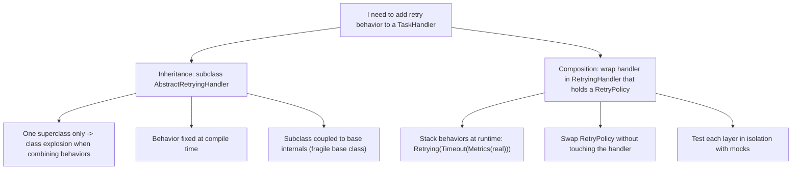
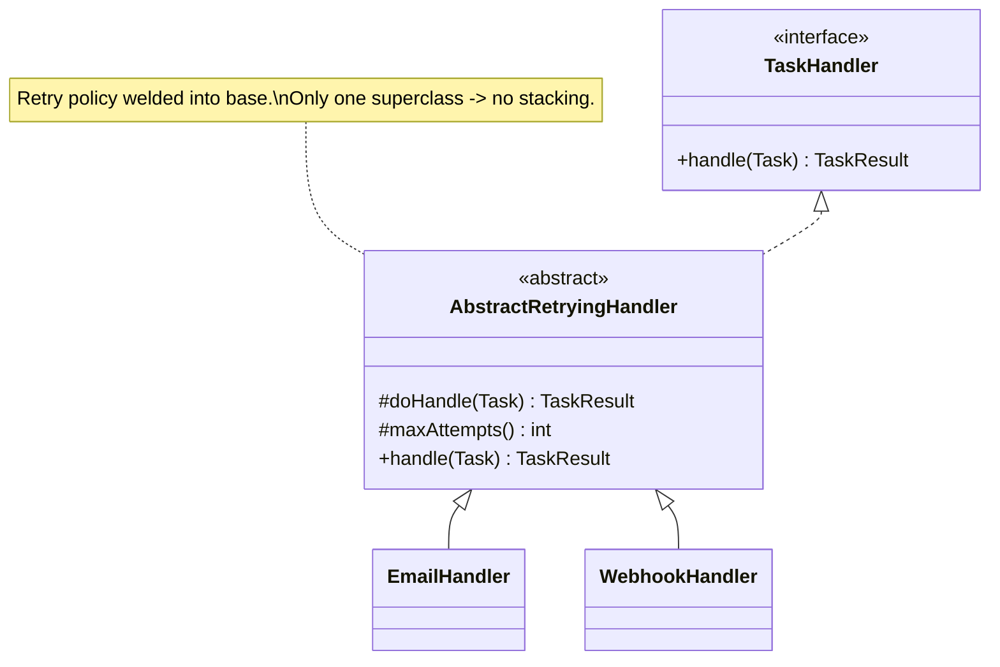
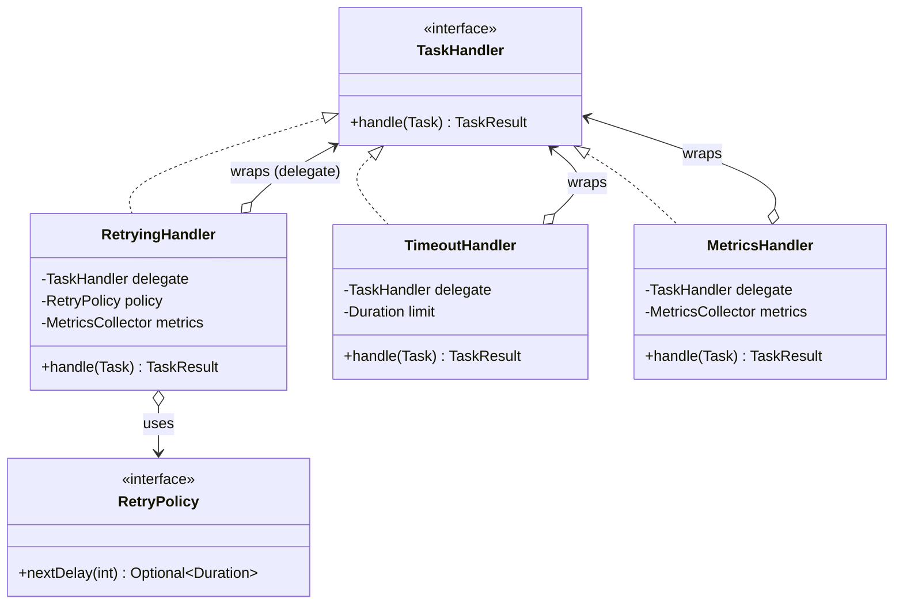

# Composition vs Inheritance

> Where this fits: this is the single most consequential modeling decision you will make on the Task Queue platform. When we need a `TaskHandler` that retries on failure, do we make it *extend* an `AbstractRetryingHandler`, or do we *wrap* a plain handler inside a `RetryingHandler` that holds a `RetryPolicy`? The first answer ships fast and rots; the second answer is the seed of the Decorator pattern and the reason our handler stack is testable, swappable, and stackable. This chapter resolves that decision with code.

This is the capstone of the relationship chapters. You have met [inheritance](chapter-08-inheritance.md) ("is-a", reuse by extending a base class), [abstract classes](chapter-12-abstract-classes.md) (partial templates), [interfaces](chapter-13-interfaces.md) (pure contracts), and [composition](chapter-16-composition.md) ("owns-a", reuse by holding a field and delegating to it). Now we put inheritance and composition in the ring together and decide which one to reach for — using one concrete, recurring problem from our platform: **adding retry behavior to a handler.**

The industry slogan is "favor composition over inheritance." This chapter explains *why* that slogan exists, *when* it is wrong, and *exactly how* to refactor an inheritance tree into a composed design without losing code reuse.

---

## 1. Why This Exists

Both inheritance and composition are mechanisms for **code reuse** and **polymorphism**. They look interchangeable on day one. They are not interchangeable on day ninety.

Concretely, our platform keeps growing handler behaviors. A `TaskHandler` (recall the canonical contract: `TaskResult handle(Task task) throws Exception`) might need to:

- retry on retryable failures,
- enforce a timeout,
- emit metrics (count, latency),
- log entry/exit,
- rate-limit calls to a downstream service,
- be idempotent.

The question "how do I add behavior X to a handler?" has two structural answers. **Inheritance** says: create a subclass that adds X. **Composition** says: create a wrapper that holds a handler, adds X, and delegates the rest.

The reason this decision matters so much is **combinatorics**. With 6 behaviors, inheritance forces you toward a class explosion — `RetryingTimeoutHandler`, `RetryingMetricsHandler`, `RetryingTimeoutMetricsHandler`, … — because a Java class can extend only **one** superclass. Composition lets you *stack* behaviors at runtime like Lego bricks. That single fact drives most of the slogan.

> Historical note: "Favor object composition over class inheritance" is one of the two foundational principles in the 1994 Gang of Four *Design Patterns* book. It was a reaction to 1980s–90s codebases drowning in deep, fragile inheritance trees. The Decorator, Strategy, and Adapter patterns are all, at their core, "use composition where you were tempted to subclass."



---

## 2. The Two Mechanisms, Side by Side

The discriminator is the relationship verb.

| | Inheritance | Composition |
|---|---|---|
| Relationship | **is-a** (`RetryingHandler` *is a* `Handler`) | **has-a / owns-a** (`RetryingHandler` *has a* `Handler` + a `RetryPolicy`) |
| Reuse via | extending a base class | delegating to a held field |
| Binding time | compile time (fixed at `extends`) | run time (inject any collaborator) |
| Multiplicity | one superclass max (Java) | unlimited collaborators |
| Coupling | tight — sees `protected` internals | loose — sees only the field's public API |
| Combining behaviors | new subclass per combination | stack wrappers at runtime |
| Testability | must instantiate full hierarchy | mock each collaborator independently |
| Breaks when | base class changes (fragile base class) | a collaborator's *contract* changes |

A useful rule of thumb that goes beyond the slogan:

> Use **inheritance** only when the subclass is a genuine, permanent *subtype* that satisfies the Liskov Substitution Principle and shares the base's identity. Use **composition** when you are reusing *behavior* or *implementation* — which is most of the time.

Two diagnostic questions:

1. **"Would this still be true if the project ran for ten years?"** A `Task` is-a thing forever. A handler that-happens-to-retry-today is not a permanent subtype; retrying is a behavior you bolt on. That smells like composition.
2. **"Can I substitute the child anywhere the parent is expected, with no surprises?"** If not, you do not have an is-a relationship; you have implementation reuse masquerading as inheritance.

---

## 3. The Naive Version — An Inheritance Tree of Retrying Handlers

Here is the design a team reaches for first, because Java makes `extends` cheap. We start from the canonical model.

```java
// Canonical model (from the spec) — shown here for context.
public enum TaskStatus { PENDING, SCHEDULED, RUNNING, SUCCEEDED, FAILED, RETRYING, DEAD }

public record Task(String id, String type, String payload, TaskStatus status,
                   int attempts, int maxAttempts,
                   java.time.Instant createdAt, java.time.Instant scheduledAt, int priority) {}

public record TaskResult(boolean success, String message, boolean retryable) {
    public static TaskResult ok()              { return new TaskResult(true,  "ok", false); }
    public static TaskResult retry(String why) { return new TaskResult(false, why,  true);  }
    public static TaskResult fail(String why)  { return new TaskResult(false, why,  false); }
}

@FunctionalInterface
public interface TaskHandler {
    TaskResult handle(Task task) throws Exception;
}
```

Now the naive inheritance design:

```java
// NAIVE: retry logic lives in an abstract base class. Concrete handlers extend it.
public abstract class AbstractRetryingHandler implements TaskHandler {

    protected abstract TaskResult doHandle(Task task) throws Exception; // subclass fills this in
    protected abstract int maxAttempts();                              // subclass tunes this

    @Override
    public final TaskResult handle(Task task) throws Exception {
        Exception last = null;
        for (int attempt = 1; attempt <= maxAttempts(); attempt++) {
            try {
                TaskResult r = doHandle(task);
                if (r.success() || !r.retryable()) return r; // done or non-retryable
            } catch (Exception e) {
                last = e; // swallow and retry
            }
            Thread.sleep(1000L * attempt); // hard-coded backoff, hard-coded units, swallows interrupt below
        }
        return TaskResult.fail("exhausted retries: " + (last == null ? "no exception" : last.getMessage()));
    }
}

// A concrete handler is forced to extend the retrying base to "get" retries.
public class EmailHandler extends AbstractRetryingHandler {
    @Override protected TaskResult doHandle(Task task) { /* send email */ return TaskResult.ok(); }
    @Override protected int maxAttempts() { return 3; }
}

public class WebhookHandler extends AbstractRetryingHandler {
    @Override protected TaskResult doHandle(Task task) { /* POST webhook */ return TaskResult.ok(); }
    @Override protected int maxAttempts() { return 5; }
}
```

It compiles. It even works. Now watch it rot:

- **Retry strategy is hard-coded.** `Thread.sleep(1000L * attempt)` is linear backoff baked into the base. Want exponential backoff with jitter for the webhook but fixed delay for email? You cannot — the policy is welded into the superclass.
- **One superclass, so behaviors do not combine.** You now need a `TimeoutHandler` and a `MetricsHandler`. A class can extend only one of them. To get *retry + timeout + metrics* you write `AbstractRetryingTimeoutMetricsHandler`, then the next combination, then the next. This is the class explosion the slogan warns about.
- **Fragile base class.** Every concrete handler is coupled to the base's `protected` shape (`doHandle`, `maxAttempts`). Change the template-method signature and every subclass breaks. (See the fragile-base-class discussion in [chapter-08-inheritance.md](chapter-08-inheritance.md).)
- **A plain handler can't opt in.** If someone already wrote a `TaskHandler` as a lambda, they cannot get retries without rewriting it as a subclass.
- **Hard to test the retry logic alone.** To test "does it retry exactly 3 times on retryable failures?" you must subclass the abstract class in your test. You cannot inject a controllable fake handler — the handler *is* the subclass.



---

## 4. Improved Version — Pull the Policy Out, Compose It In

First refactor: stop hard-coding the backoff. Introduce the canonical `RetryPolicy` abstraction and **inject** it. The handler now *has-a* policy instead of *being-a* retrying thing.

```java
import java.time.Duration;
import java.util.Optional;

public interface RetryPolicy {
    /** Delay before the given (1-based) attempt, or empty when we should give up. */
    Optional<Duration> nextDelay(int attempt);
}

public final class FixedDelayRetryPolicy implements RetryPolicy {
    private final int maxAttempts;
    private final Duration delay;
    public FixedDelayRetryPolicy(int maxAttempts, Duration delay) {
        this.maxAttempts = maxAttempts;
        this.delay = delay;
    }
    @Override public Optional<Duration> nextDelay(int attempt) {
        return attempt < maxAttempts ? Optional.of(delay) : Optional.empty();
    }
}
```

Now the retrying handler **holds** a `TaskHandler` (the thing that does real work) and a `RetryPolicy` (the thing that decides when to stop), instead of forcing subclasses to fill in `protected` hooks.

```java
import java.time.Duration;
import java.util.Optional;

// IMPROVED: composition. RetryingHandler wraps any TaskHandler and any RetryPolicy.
public final class RetryingHandler implements TaskHandler {
    private final TaskHandler delegate;   // has-a: the real work
    private final RetryPolicy policy;     // has-a: the retry strategy

    public RetryingHandler(TaskHandler delegate, RetryPolicy policy) {
        this.delegate = delegate;
        this.policy = policy;
    }

    @Override
    public TaskResult handle(Task task) throws Exception {
        int attempt = 1;
        while (true) {
            TaskResult result = safeInvoke(task);          // run the wrapped handler
            if (result.success() || !result.retryable()) {
                return result;                              // success or non-retryable: stop
            }
            Optional<Duration> delay = policy.nextDelay(attempt);
            if (delay.isEmpty()) {
                return TaskResult.fail("retries exhausted after " + attempt + " attempts: " + result.message());
            }
            sleep(delay.get());
            attempt++;
        }
    }

    private TaskResult safeInvoke(Task task) {
        try {
            return delegate.handle(task);
        } catch (Exception e) {
            return TaskResult.retry("exception: " + e.getMessage()); // treat thrown exceptions as retryable
        }
    }

    private static void sleep(Duration d) {
        try { Thread.sleep(d.toMillis()); }
        catch (InterruptedException e) { Thread.currentThread().interrupt(); }
    }
}
```

The win is already visible at the call site. `EmailHandler` and `WebhookHandler` go back to being *plain* handlers that know nothing about retries:

```java
// Plain handlers: zero retry knowledge.
TaskHandler email   = task -> { /* send email */ return TaskResult.ok(); };
TaskHandler webhook = task -> { /* POST webhook */ return TaskResult.ok(); };

// Retry behavior is composed on, with DIFFERENT policies, at wiring time.
TaskHandler retryingEmail =
    new RetryingHandler(email, new FixedDelayRetryPolicy(3, Duration.ofSeconds(1)));

TaskHandler retryingWebhook =
    new RetryingHandler(webhook, new ExponentialBackoffRetryPolicy(5, Duration.ofMillis(200)));
```

We have removed the welding. Retry strategy is now a swappable field. A lambda handler can opt into retries. The base class is gone, so there is nothing fragile to break.

---

## 5. Production-Quality Version — A Composable Handler Stack (Decorator Preview)

The staff-engineer version recognizes that `RetryingHandler` is an instance of a general shape: **a `TaskHandler` that wraps a `TaskHandler` and adds one concern.** That shape is the **Decorator pattern** (covered in depth later under design patterns). Because every wrapper *is* a `TaskHandler`, wrappers **stack arbitrarily** — exactly the combinatorial freedom inheritance could not give us.

```java
import java.time.Duration;
import java.util.Optional;

/** Production retry decorator: bounded jittered backoff, exception classification, metrics, interrupt-safe. */
public final class RetryingHandler implements TaskHandler {

    private final TaskHandler delegate;
    private final RetryPolicy policy;
    private final MetricsCollector metrics;          // composed-in observability

    public RetryingHandler(TaskHandler delegate, RetryPolicy policy, MetricsCollector metrics) {
        this.delegate = delegate;
        this.policy   = policy;
        this.metrics  = metrics;
    }

    @Override
    public TaskResult handle(Task task) throws Exception {
        int attempt = 1;
        while (true) {
            TaskResult result = invokeOnce(task);
            if (result.success() || !result.retryable()) {
                return result;
            }
            Optional<Duration> delay = policy.nextDelay(attempt);
            if (delay.isEmpty()) {
                metrics.increment("handler.retry.exhausted", "type", task.type());
                return TaskResult.fail("retries exhausted after " + attempt + " attempts: " + result.message());
            }
            metrics.increment("handler.retry.scheduled", "type", task.type());
            sleepInterruptibly(delay.get());
            attempt++;
        }
    }

    private TaskResult invokeOnce(Task task) throws InterruptedException {
        try {
            metrics.increment("handler.attempt", "type", task.type());
            return delegate.handle(task);
        } catch (InterruptedException e) {
            throw e; // never swallow interruption — propagate so the Worker can shut down cleanly
        } catch (Exception e) {
            // Classify: by default thrown exceptions are retryable, but honor a non-retryable marker.
            boolean retryable = !(e instanceof NonRetryableException);
            metrics.increment("handler.exception", "type", task.type(), "retryable", String.valueOf(retryable));
            return new TaskResult(false, e.getClass().getSimpleName() + ": " + e.getMessage(), retryable);
        }
    }

    private static void sleepInterruptibly(Duration d) throws InterruptedException {
        Thread.sleep(d.toMillis()); // virtual-thread friendly; cheap to park under Project Loom
    }
}

/** Marker for failures that must NOT be retried (bad input, auth failure, etc.). */
public final class NonRetryableException extends RuntimeException {
    public NonRetryableException(String message) { super(message); }
}
```

And the canonical exponential-backoff policy with jitter (the production retry strategy):

```java
import java.time.Duration;
import java.util.Optional;
import java.util.concurrent.ThreadLocalRandom;

public final class ExponentialBackoffRetryPolicy implements RetryPolicy {
    private final int maxAttempts;
    private final Duration base;
    private final Duration cap;

    public ExponentialBackoffRetryPolicy(int maxAttempts, Duration base) {
        this(maxAttempts, base, Duration.ofSeconds(30));
    }
    public ExponentialBackoffRetryPolicy(int maxAttempts, Duration base, Duration cap) {
        this.maxAttempts = maxAttempts;
        this.base = base;
        this.cap  = cap;
    }

    @Override
    public Optional<Duration> nextDelay(int attempt) {
        if (attempt >= maxAttempts) return Optional.empty();
        long raw    = base.toMillis() * (1L << (attempt - 1));            // base * 2^(attempt-1)
        long capped = Math.min(raw, cap.toMillis());
        long jitter = ThreadLocalRandom.current().nextLong(capped + 1);   // full jitter: [0, capped]
        return Optional.of(Duration.ofMillis(jitter));
    }
}
```

Now stack decorators. Each adds exactly one concern, each is a `TaskHandler`, and the order is explicit and meaningful:

```java
TaskHandler core = task -> { /* call payment gateway */ return TaskResult.ok(); };

TaskHandler shipped =
    new RetryingHandler(                              // outermost: retries the whole timed+metered call
        new TimeoutHandler(                           // then: bound each attempt's duration
            new MetricsHandler(core, metrics),        // innermost: time the real work
            Duration.ofSeconds(2)),
        new ExponentialBackoffRetryPolicy(5, Duration.ofMillis(200)),
        metrics);
```

To get a *different* combination — say metrics-but-no-retry, or retry-with-timeout-but-no-metrics — you reorder fields. No new classes. That is the payoff inheritance structurally cannot match.



> The `o-->` (aggregation) arrows say: each decorator *holds* a `TaskHandler` and delegates to it. The `<|..` (implements) arrows say: each decorator *is* a `TaskHandler`. Both relationships together are what make the stack work.

---

## 6. Code Walkthrough — Beginner, Intermediate, Production

### Beginner: see the substitution

The whole trick is that a wrapper has the same type as the thing it wraps. Anywhere a `TaskHandler` is expected, a `RetryingHandler` fits — because it *is* a `TaskHandler`.

```java
import java.time.Duration;

public class BeginnerDemo {
    public static void main(String[] args) throws Exception {
        // A handler that fails the first time, succeeds the second.
        var flaky = new TaskHandler() {
            int calls = 0;
            public TaskResult handle(Task t) {
                calls++;
                return calls < 2 ? TaskResult.retry("cold cache") : TaskResult.ok();
            }
        };

        TaskHandler robust = new RetryingHandler(flaky,
                new FixedDelayRetryPolicy(3, Duration.ofMillis(10)));

        Task t = new Task("id-1", "demo", "{}", TaskStatus.PENDING, 0, 3,
                          java.time.Instant.now(), java.time.Instant.now(), 0);

        System.out.println(robust.handle(t)); // TaskResult[success=true, ...] — it retried once
    }
}
```

### Intermediate: choose composition over a subclass, and feel the difference

Suppose we *also* want logging. With inheritance we would write a `LoggingRetryingHandler` subclass. With composition we write a tiny independent decorator and stack it.

```java
public final class LoggingHandler implements TaskHandler {
    private final TaskHandler delegate;
    private final System.Logger log = System.getLogger("handler");
    public LoggingHandler(TaskHandler delegate) { this.delegate = delegate; }

    @Override public TaskResult handle(Task task) throws Exception {
        log.log(System.Logger.Level.INFO, "-> {0} type={1}", task.id(), task.type());
        try {
            TaskResult r = delegate.handle(task);
            log.log(System.Logger.Level.INFO, "<- {0} success={1}", task.id(), r.success());
            return r;
        } catch (Exception e) {
            log.log(System.Logger.Level.WARNING, "xx {0} threw {1}", task.id(), e.toString());
            throw e;
        }
    }
}

// Logging OUTSIDE retries (log once) vs INSIDE retries (log every attempt) is just field order:
TaskHandler logOncePerTask  = new LoggingHandler(new RetryingHandler(core, policy));
TaskHandler logEveryAttempt = new RetryingHandler(new LoggingHandler(core), policy);
```

Read those last two lines slowly: the *semantics* changed by reordering composition, with zero new types. An inheritance design cannot express "log per task" vs "log per attempt" without two different subclasses.

### Production-inspired: registering composed handlers in the platform

In the real platform, a `Worker` looks up a `TaskHandler` by `task.type()` from a registry. We register the **fully composed** handler so the worker stays dumb — it just calls `handle`.

```java
import java.time.Duration;
import java.util.Map;
import java.util.concurrent.ConcurrentHashMap;

public final class HandlerRegistry {
    private final Map<String, TaskHandler> handlers = new ConcurrentHashMap<>();

    public void register(String type, TaskHandler handler) { handlers.put(type, handler); }

    public TaskHandler get(String type) {
        TaskHandler h = handlers.get(type);
        if (h == null) throw new IllegalArgumentException("no handler for type: " + type);
        return h;
    }
}

// Wiring (e.g. in a Spring @Configuration in Phase 2 onward):
public final class HandlerWiring {
    public static HandlerRegistry build(MetricsCollector metrics) {
        var registry = new HandlerRegistry();

        TaskHandler email = task -> { /* send email */ return TaskResult.ok(); };
        registry.register("email",
            new RetryingHandler(new MetricsHandler(email, metrics),
                                new FixedDelayRetryPolicy(3, Duration.ofSeconds(1)),
                                metrics));

        TaskHandler webhook = task -> { /* POST webhook */ return TaskResult.ok(); };
        registry.register("webhook",
            new RetryingHandler(new TimeoutHandler(new MetricsHandler(webhook, metrics), Duration.ofSeconds(2)),
                                new ExponentialBackoffRetryPolicy(5, Duration.ofMillis(200)),
                                metrics));

        return registry;
    }
}
```

The `Worker` never knows whether a handler retries, times out, or emits metrics. That separation — the worker depends only on the `TaskHandler` interface — is the reason the system stays extensible. Compare with the inheritance design, where adding a new behavior combination forced a new class into the hierarchy.

---

## 7. How This Applies to Our Task Queue Project

- **`RetryingHandler` replaces `AbstractRetryingHandler`.** Retry is now a decorator (`has-a TaskHandler` + `has-a RetryPolicy`) rather than a base class. This is the project refactor at the heart of this chapter.
- **`RetryPolicy` is a Strategy.** `FixedDelayRetryPolicy` and `ExponentialBackoffRetryPolicy` are interchangeable strategies *composed into* the retrying handler — composition again, one level deeper.
- **The `Worker` depends on the `TaskHandler` interface only** (see [interfaces](chapter-13-interfaces.md)), so it is immune to how behaviors are assembled. That is composition enabling [polymorphism](chapter-09-polymorphism.md).
- **`WorkerPool` is itself composition** (see [chapter-16-composition.md](chapter-16-composition.md)) — it *owns* an `ExecutorService`, a `RateLimiter`, a `MetricsCollector`. Same principle, different scale.
- **Where inheritance still earns its place:** the `enum TaskStatus` is a closed set, and a sealed `TaskEvent` hierarchy (Phase 4 `EventBus`) is real is-a modeling — those *are* subtypes, so sealed types/inheritance is correct there, not composition.

---

## 8. Tradeoffs

Composition is the default, not a religion. Be honest about the costs.

| Concern | Inheritance wins | Composition wins |
|---|---|---|
| Combining N independent behaviors | ✗ class explosion (2^N) | ✓ stack at runtime |
| Changing behavior without recompiling callers | ✗ fixed at `extends` | ✓ swap injected field |
| Boilerplate / forwarding methods | ✓ inherit for free | ✗ must write delegation (or default-method interface) |
| Reusing a large, stable template with mandated steps | ✓ template method | ~ possible but wordier |
| Coupling | ✗ tight (protected internals, fragile base) | ✓ loose (public API only) |
| Unit testing a single concern | ✗ must build whole hierarchy | ✓ mock collaborators |
| Substitutability (LSP) for a true subtype | ✓ natural | ~ requires wrapper to honor contract |
| Reading a deep stack at a glance | ✓ one class | ✗ "where does this call actually go?" |
| Performance | ✓ no delegation hop | ~ one virtual call per layer (negligible) |

Two honest downsides of composition you must own:

1. **Delegation boilerplate.** If `TaskHandler` had twenty methods, every decorator would forward nineteen it does not care about. Mitigation: keep interfaces small (it has one method) and/or use a default-method "forwarding interface."
2. **Indirection.** A five-layer decorator stack can make a stack trace read like an onion. Mitigation: give decorators clear names, keep stacks shallow, and log the composed chain at startup.

---

## 9. Common Mistakes and Pitfalls

- **Subclassing to reuse code, not to be a subtype.** "I extended `ArrayList` to get a stack" — now your stack exposes `add(index, e)` and `remove(index)`. Fix: compose (`hold` a `Deque` field) and expose only `push`/`pop`.
- **Deep inheritance for cross-cutting concerns.** Retry, timeout, metrics, logging are *orthogonal* concerns. Modeling them as a single inheritance chain is the original sin. Fix: one decorator per concern.
- **Leaking the wrapped object's full API.** A decorator that exposes the delegate breaks encapsulation and lets callers bypass the added behavior. Fix: `delegate` is `private final`; never return it.
- **Swallowing `InterruptedException` in a retry loop.** The naive base did `catch (Exception e)` around `Thread.sleep`, eating interruption. Fix: re-interrupt or rethrow so the `Worker` can shut down.
- **Forgetting decorators must honor the contract (LSP for composition).** If `TaskHandler.handle` must not return `null`, your decorator must not either. A wrapper that violates the contract is worse than a bad subclass.
- **Composing in a way that hides a bug-prone order.** `Retry(Timeout(x))` retries timeouts; `Timeout(Retry(x))` bounds the *total* retry budget. Pick deliberately and document it.
- **Making production classes `final` then needing to extend them in a test.** Compose mocks instead of subclassing the system under test; you rarely need to extend production classes if you composed correctly.

---

## 10. Refactoring Exercise

**Step 1 — Bad (inheritance, welded policy, swallowed interruption):**

```java
public abstract class AbstractRetryingHandler implements TaskHandler {
    protected abstract TaskResult doHandle(Task t) throws Exception;
    public final TaskResult handle(Task t) {
        for (int i = 0; i < 3; i++) {
            try {
                TaskResult r = doHandle(t);
                if (r.success()) return r;
            } catch (Exception e) { /* ignore */ }
            try { Thread.sleep(1000); } catch (InterruptedException e) { /* ignore */ }
        }
        return TaskResult.fail("gave up");
    }
}
public class PdfHandler extends AbstractRetryingHandler {
    protected TaskResult doHandle(Task t) { /* render pdf */ return TaskResult.ok(); }
}
```

**Step 2 — Improved (extract policy, compose, but still rough):**

```java
import java.time.Duration;

public final class RetryingHandler implements TaskHandler {
    private final TaskHandler delegate;
    private final RetryPolicy policy;
    public RetryingHandler(TaskHandler delegate, RetryPolicy policy) {
        this.delegate = delegate; this.policy = policy;
    }
    public TaskResult handle(Task t) throws Exception {
        int attempt = 1;
        while (true) {
            TaskResult r;
            try { r = delegate.handle(t); }
            catch (Exception e) { r = TaskResult.retry(e.getMessage()); }
            if (r.success() || !r.retryable()) return r;
            var delay = policy.nextDelay(attempt);
            if (delay.isEmpty()) return TaskResult.fail("exhausted: " + r.message());
            Thread.sleep(delay.get().toMillis());
            attempt++;
        }
    }
}
// PdfHandler is now a plain handler:
TaskHandler pdf = t -> { /* render pdf */ return TaskResult.ok(); };
TaskHandler robustPdf = new RetryingHandler(pdf, new FixedDelayRetryPolicy(3, Duration.ofSeconds(1)));
```

**Step 3 — Production (interrupt-safe, non-retryable classification, metrics, stackable):** use the `RetryingHandler` from §5 with `MetricsCollector`, `NonRetryableException` handling, interrupt propagation, and the ability to nest inside/around `TimeoutHandler`, `MetricsHandler`, `LoggingHandler`. The diff between Step 2 and Step 3 is *robustness*, not structure — the structure (composition) was already right at Step 2, which is the whole point.

---

## 11. Exercises

### Easy

**E1 (knowledge check).** In one sentence each: when does a Java class have a *legitimate* reason to use `extends`, and what is the single hardest structural limit of inheritance that composition removes?

**E2 (coding).** Write a `MetricsHandler` decorator that implements `TaskHandler`, wraps a delegate, increments a counter `"handler.success"` or `"handler.failure"` based on the result, and returns the delegate's result unchanged.

### Medium

**M1 (refactoring).** You are given a `TimedRetryingHandler extends AbstractRetryingHandler` that also enforces a timeout inside `doHandle`. Refactor it into two independent decorators (`RetryingHandler`, `TimeoutHandler`) so timeout and retry can be combined in either order.

**M2 (design).** Your team wants "retry, but only for `IOException`s; never for `IllegalArgumentException`." Without subclassing, design how a caller expresses retryable-vs-not. (Hint: the `TaskResult.retryable` flag and a `NonRetryableException` marker already exist.)

### Hard

**H1 (interview-style).** A junior proposes `class CachingRetryingHandler extends RetryingHandler` to add caching. Explain why this reintroduces the problem we just solved, and give the composition alternative.

**H2 (stretch).** Implement a forwarding default-method interface `ForwardingTaskHandler` so future decorators do not repeat `private final TaskHandler delegate` plumbing. Show `MetricsHandler` rewritten on top of it. (This is exactly how Guava's `Forwarding*` classes work.)

---

## 12. Solutions

**E1.** *Use `extends` when the subclass is a true, permanent subtype that satisfies LSP and shares the base's identity (e.g., a sealed `TaskEvent` subtype), reusing **type**, not merely implementation.* The hardest limit composition removes: **single inheritance** — a class can extend only one superclass, so orthogonal behaviors cannot be combined by subclassing, whereas decorators stack without limit.

**E2.**

```java
public final class MetricsHandler implements TaskHandler {
    private final TaskHandler delegate;
    private final MetricsCollector metrics;
    public MetricsHandler(TaskHandler delegate, MetricsCollector metrics) {
        this.delegate = delegate; this.metrics = metrics;
    }
    @Override public TaskResult handle(Task task) throws Exception {
        TaskResult r = delegate.handle(task);
        metrics.increment(r.success() ? "handler.success" : "handler.failure", "type", task.type());
        return r; // pass through unchanged
    }
}
```

**M1.**

```java
import java.time.Duration;
import java.util.concurrent.*;

public final class TimeoutHandler implements TaskHandler {
    private static final ExecutorService POOL =
        Executors.newThreadPerTaskExecutor(Thread.ofVirtual().factory()); // Loom: cheap per-call thread
    private final TaskHandler delegate;
    private final Duration limit;
    public TimeoutHandler(TaskHandler delegate, Duration limit) {
        this.delegate = delegate; this.limit = limit;
    }
    @Override public TaskResult handle(Task task) throws Exception {
        Future<TaskResult> f = POOL.submit(() -> delegate.handle(task));
        try {
            return f.get(limit.toMillis(), TimeUnit.MILLISECONDS);
        } catch (TimeoutException e) {
            f.cancel(true);
            return TaskResult.retry("timeout after " + limit.toMillis() + "ms"); // retryable: a slow attempt may pass next time
        } catch (ExecutionException e) {
            return TaskResult.retry("error: " + e.getCause().getMessage());
        }
    }
}

// Now combine in either order — that flexibility was impossible with the merged subclass:
TaskHandler retryThenTimeoutEach = new RetryingHandler(new TimeoutHandler(core, Duration.ofSeconds(2)), policy);
TaskHandler timeoutWholeRetry    = new TimeoutHandler(new RetryingHandler(core, policy), Duration.ofSeconds(10));
```

**M2.** Express retryability in two complementary places, no subclassing required:
1. A handler that *knows* a failure is permanent returns `TaskResult.fail(...)` (`retryable=false`), so `RetryingHandler` stops immediately.
2. A handler that *throws* signals permanence by throwing `NonRetryableException`; `RetryingHandler.invokeOnce` classifies any other exception as retryable and `NonRetryableException` as non-retryable.

```java
TaskHandler validating = task -> {
    if (task.payload().isBlank()) throw new NonRetryableException("empty payload"); // never retried
    if (downstreamFlaky())        return TaskResult.retry("downstream 503");        // retried
    return TaskResult.ok();
};
```

**H1.** `CachingRetryingHandler extends RetryingHandler` re-welds two orthogonal concerns (caching + retry) into one class via inheritance — the exact class-explosion trap. You would next need `CachingTimeoutHandler`, `CachingRetryingTimeoutHandler`, and so on; and the subclass is now coupled to `RetryingHandler`'s internals (fragile base). The composition fix: a standalone `CachingHandler implements TaskHandler` decorator that wraps any `TaskHandler`, so you write `new RetryingHandler(new CachingHandler(core), policy)` or `new CachingHandler(new RetryingHandler(core, policy))` — caching of attempts vs caching of final results becomes a deliberate ordering choice, with no new combined classes.

**H2.**

```java
// A forwarding base via default methods: decorators override only what they change.
public interface ForwardingTaskHandler extends TaskHandler {
    TaskHandler delegate(); // the only thing a decorator must supply
    @Override default TaskResult handle(Task task) throws Exception {
        return delegate().handle(task);
    }
}

public final class MetricsHandler implements ForwardingTaskHandler {
    private final TaskHandler delegate;
    private final MetricsCollector metrics;
    public MetricsHandler(TaskHandler delegate, MetricsCollector metrics) {
        this.delegate = delegate; this.metrics = metrics;
    }
    @Override public TaskHandler delegate() { return delegate; }
    @Override public TaskResult handle(Task task) throws Exception {
        TaskResult r = ForwardingTaskHandler.super.handle(task); // reuse default forwarding
        metrics.increment(r.success() ? "handler.success" : "handler.failure", "type", task.type());
        return r;
    }
}
```

The forwarding interface removes the delegation plumbing; each decorator declares `delegate()` once and overrides only the method it augments. This is precisely the pattern behind Guava's `ForwardingList`, `ForwardingMap`, etc.

---

## 13. Interview Questions and Takeaways

1. **"Why favor composition over inheritance?"** — Composition is loosely coupled, binds at runtime, and lets orthogonal behaviors combine without class explosion; inheritance is tightly coupled, fixed at compile time, limited to one superclass, and prone to the fragile-base-class problem. Inheritance is for true subtypes; composition is for behavior reuse.

2. **"When is inheritance the right call?"** — When there is a genuine, permanent is-a relationship that satisfies LSP, when you want a template method enforcing a fixed algorithm skeleton, or when modeling a closed set with sealed types — value/enum/event hierarchies, not cross-cutting behaviors.

3. **"What is the fragile base class problem?"** — Subclasses depend on a base class's *internal* (often `protected`) behavior; an innocent change in the base silently breaks subclasses. Composition avoids it by depending only on a collaborator's *public contract*.

4. **"How does Decorator relate to this chapter?"** — Decorator *is* the canonical 'composition instead of subclassing' pattern: a wrapper that implements the same interface, holds the wrapped object, adds one concern, and delegates the rest — enabling runtime stacking.

5. **"Show how to add retry without changing the handler."** — Wrap it: `new RetryingHandler(handler, policy)`. The handler is unchanged and unaware; retry is a composed concern.

6. **"Inheritance gives free code reuse; composition makes me write delegation. Isn't inheritance better?"** — The free reuse comes with tight coupling and the single-superclass ceiling. Delegation boilerplate is bounded (small interfaces, forwarding defaults) and buys you swappability, testability, and combinability — usually a winning trade.

7. **"Where does composition order matter?"** — Decorator nesting changes semantics: `Retry(Timeout(x))` retries each timed attempt; `Timeout(Retry(x))` bounds total retry time. Choose and document deliberately.

**Takeaways:** *is-a → inheritance, has-a → composition.* Default to composition for behavior; reserve inheritance for true subtypes and template methods. Decorators turn "another subclass" into "another field." Keep interfaces tiny so delegation stays cheap.

---

## 14. Production Considerations

- **Stack traces and observability.** A deep decorator stack obscures the failing layer. Name decorators clearly, log the composed chain at startup (`Retry -> Timeout -> Metrics -> core`), and keep stacks shallow (3–4 layers).
- **Interrupt and shutdown correctness.** Retry/timeout decorators run inside `Worker` threads (often virtual threads under Loom). They must propagate `InterruptedException` so `WorkerPool.shutdown()` drains cleanly; swallowing it leaks threads and hangs shutdown.
- **Retry storms / thundering herd.** Naive fixed-delay retries from many workers synchronize and hammer a recovering downstream. Production retry policies use **exponential backoff with full jitter** (as in `ExponentialBackoffRetryPolicy`) and a hard attempt cap; beyond the cap the task goes to the **dead-letter queue**, never an infinite loop.
- **Idempotency.** Retrying a non-idempotent handler can double-charge a card or send two emails. Composition makes this explicit: wrap with an idempotency decorator, or ensure handlers are idempotent before composing retry on top.
- **Metrics on every layer.** Because each concern is its own decorator, you can emit per-concern metrics (`handler.attempt`, `handler.retry.exhausted`, `handler.timeout`) without entangling them — invaluable for diagnosing whether failures are timeouts, exceptions, or exhaustion.
- **Performance.** Each decorator adds one virtual method call; negligible versus the actual work (network/DB). Do not denormalize the stack for speed — clarity wins here.
- **Config-driven assembly.** In Phase 2+ (Spring Boot), assemble the handler stack in a `@Configuration` so policies (max attempts, backoff base, timeout) come from `application.yml` and differ per environment without code changes.

---

## What We Can Improve In Our Project Using This Concept

Replace the `AbstractRetryingHandler` inheritance tree with a composed `RetryingHandler` decorator that wraps a plain `TaskHandler` plus an injected `RetryPolicy`. Extract `TimeoutHandler`, `MetricsHandler`, and `LoggingHandler` as sibling decorators so any combination is assembled at wiring time instead of encoded as a subclass. Make every concrete handler (`email`, `webhook`, `pdf`) a plain, retry-unaware `TaskHandler`, and register the fully composed stack in `HandlerRegistry` so `Worker` stays oblivious to behavior assembly.

## Project Refactoring Task

1. Delete `AbstractRetryingHandler` and convert `EmailHandler`/`WebhookHandler` into plain `TaskHandler` implementations (or lambdas).
2. Implement `RetryingHandler` (composition of `TaskHandler` + `RetryPolicy` + `MetricsCollector`) with interrupt propagation and `NonRetryableException` classification.
3. Implement `FixedDelayRetryPolicy` and `ExponentialBackoffRetryPolicy` (jittered, capped).
4. Add `TimeoutHandler`, `MetricsHandler`, `LoggingHandler` decorators; optionally a `ForwardingTaskHandler` to kill delegation boilerplate.
5. Wire composed stacks per task type in `HandlerRegistry`; assert `Worker` references only the `TaskHandler` interface.
6. Add tests: a flaky fake handler proving exact retry counts; an order test proving `Retry(Timeout)` vs `Timeout(Retry)` semantics.

## Git Commit For This Chapter

```bash
git commit -m "refactor(handlers): replace AbstractRetryingHandler inheritance with composed RetryingHandler decorator"
```

Files touched: `RetryingHandler.java` (new), `RetryPolicy.java`, `FixedDelayRetryPolicy.java`, `ExponentialBackoffRetryPolicy.java`, `TimeoutHandler.java` (new), `MetricsHandler.java` (new), `LoggingHandler.java` (new), `NonRetryableException.java` (new), `HandlerRegistry.java`, `HandlerWiring.java` (new); removed `AbstractRetryingHandler.java`; updated `EmailHandler.java`, `WebhookHandler.java`; tests under `src/test/java`.

## Architecture Impact

The handler layer flips from a rigid inheritance hierarchy to a pluggable decorator pipeline. Cross-cutting concerns (retry, timeout, metrics, logging) become independently composable and independently testable units. `Worker` and `WorkerPool` depend only on the `TaskHandler` interface, so they are insulated from behavior changes. This is the structural foundation for the Decorator, Strategy, and Chain-of-Responsibility patterns introduced later, and it makes per-environment, config-driven behavior assembly possible in Phase 2 onward.

## Interview Takeaways

- "Favor composition over inheritance" exists because single inheritance + tight coupling + fragile base classes make behavior combination and change expensive; composition makes them cheap.
- Use inheritance only for true, LSP-satisfying subtypes and template methods; use composition (decorators, strategies) for cross-cutting behavior.
- `RetryingHandler` wrapping a `TaskHandler` + `RetryPolicy` is the project's flagship example: it turns "another subclass" into "another field," enabling runtime stacking, isolated testing, and swappable policies.
