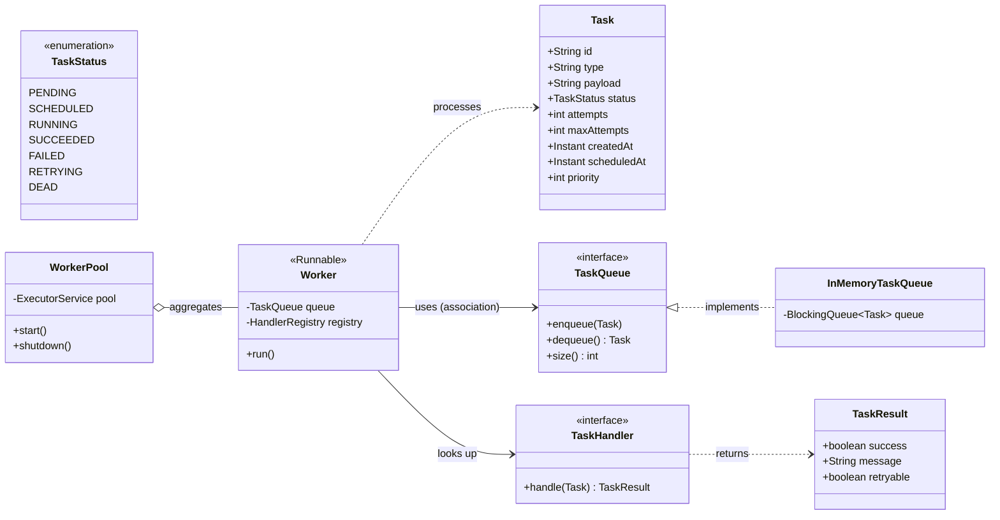
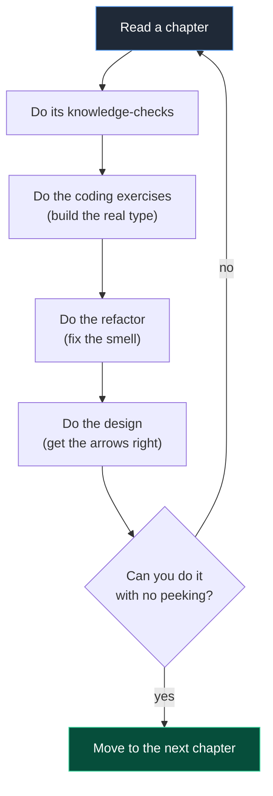

# Core OOP: Exercises

> A graded problem set for the **whole** `02-core-oop` module — all 17 chapters, from object
> references through composition-vs-inheritance. Almost every exercise builds a real piece of our
> **Distributed Task Queue and Event Processing Platform**: we model `Task`, `Worker`, and
> `TaskQueue` relationships, kill `instanceof` chains with polymorphism, and refactor inheritance
> hierarchies into composition. Solve them with `javac` open. When you want to compare against a
> staff-engineer answer, the complete, compilable solutions live in
> **[`./solutions.md`](./solutions.md)**, referenced by the **same IDs used here** (e.g. `E1`,
> `M7`, `H3`).

---

## How To Use This File

This is **not** a chapter — there is no new theory here, only problems. The 17 chapters in this
module already taught the concepts; each exercise points back at the chapter it exercises:

| Topic | Chapter |
|---|---|
| Object identity & references | [`./chapter-01-objects-and-references.md`](./chapter-01-objects-and-references.md) |
| Fields & methods | [`./chapter-02-fields-and-methods.md`](./chapter-02-fields-and-methods.md) |
| Constructors | [`./chapter-03-constructors.md`](./chapter-03-constructors.md) |
| Access modifiers | [`./chapter-04-access-modifiers.md`](./chapter-04-access-modifiers.md) |
| Static members | [`./chapter-05-static-members.md`](./chapter-05-static-members.md) |
| Overloading | [`./chapter-06-method-overloading.md`](./chapter-06-method-overloading.md) |
| Overriding | [`./chapter-07-method-overriding.md`](./chapter-07-method-overriding.md) |
| Inheritance | [`./chapter-08-inheritance.md`](./chapter-08-inheritance.md) |
| Polymorphism | [`./chapter-09-polymorphism.md`](./chapter-09-polymorphism.md) |
| Up/down-casting | [`./chapter-10-upcasting-and-downcasting.md`](./chapter-10-upcasting-and-downcasting.md) |
| `instanceof` & pattern matching | [`./chapter-11-instanceof.md`](./chapter-11-instanceof.md) |
| Abstract classes | [`./chapter-12-abstract-classes.md`](./chapter-12-abstract-classes.md) |
| Interfaces | [`./chapter-13-interfaces.md`](./chapter-13-interfaces.md) |
| Association | [`./chapter-14-association.md`](./chapter-14-association.md) |
| Aggregation | [`./chapter-15-aggregation.md`](./chapter-15-aggregation.md) |
| Composition | [`./chapter-16-composition.md`](./chapter-16-composition.md) |
| Composition vs inheritance | [`./chapter-17-composition-vs-inheritance.md`](./chapter-17-composition-vs-inheritance.md) |

Each exercise is **numbered and tagged** so the solutions file can address it precisely:

- The **letter prefix** is the difficulty: `E` = Easy, `M` = Medium, `H` = Hard.
- The number is a counter within that difficulty.
- A bracketed tag — `[knowledge-check]`, `[coding]`, `[refactor]`, `[design]`, `[interview]`,
  `[stretch]` — tells you what kind of work it is.

### Suggested order


Do the knowledge-checks first to surface gaps cheaply, then coding to assemble the domain types,
then refactors to turn bad code into shippable code, then design/interview/stretch work that
integrates the whole module.

### The slice of the canonical model these exercises build



> The relationships above are the heart of this module. A `Worker` **uses** a `TaskQueue`
> (association — both can outlive each other), a `WorkerPool` **aggregates** `Worker`s, and as you
> reach the composition chapters you will see a `Worker` **compose** its own retry and metrics
> collaborators. Keep this diagram next to you while you work.

---

## Group A — Knowledge-Check (E1–E10)

> Short-answer questions. Write a 1–4 sentence answer per item. These are cheap and catch the
> misconceptions that make the coding exercises painful later.

### E1 `[knowledge-check]` Easy — references vs objects
You write `Task a = new Task(...); Task b = a;` then change `b`'s status. Does `a` see the change?
Now you write `Task c = new Task(...)` with identical fields. Is `a == c` true? Is `a.equals(c)`
true? Explain each answer in terms of references vs object identity.
(See [`./chapter-01-objects-and-references.md`](./chapter-01-objects-and-references.md).)

### E2 `[knowledge-check]` Easy — `==` vs `equals` for `Task.id`
Two `Task` instances were loaded from the database in two separate queries, both representing the
same row (same UUID `id`). Which comparison should the code use to treat them as "the same task",
and what must you override on `Task` to make that work correctly?

### E3 `[knowledge-check]` Easy — constructors and `this`/`super`
In one sentence each: (a) what does an implicit `super()` call do at the top of a constructor, and
(b) when would you use constructor chaining with `this(...)` in our `Task` type?
(See [`./chapter-03-constructors.md`](./chapter-03-constructors.md).)

### E4 `[knowledge-check]` Easy — access modifiers ladder
Order `private`, `protected`, package-private (default), and `public` from most to least
restrictive. For each, give one member of our `InMemoryTaskQueue` that would correctly use that
level. (See [`./chapter-04-access-modifiers.md`](./chapter-04-access-modifiers.md).)

### E5 `[knowledge-check]` Easy — static vs instance
Which of these belong on the **instance** and which on the **class** (`static`)? (a) a `Task`'s
`attempts` counter, (b) a global count of tasks ever created, (c) the default `maxAttempts` of `3`,
(d) the `Logger` for the `Worker` class. Justify each.

### E6 `[knowledge-check]` Easy — overloading vs overriding
`InMemoryTaskQueue` has `enqueue(Task t)` and you add `enqueue(Task t, int priority)`. Is that
overloading or overriding? `Worker` provides its own `run()` from `Runnable`. Is that overloading
or overriding? Define both terms in one line each.
(See [`./chapter-06-method-overloading.md`](./chapter-06-method-overloading.md) and
[`./chapter-07-method-overriding.md`](./chapter-07-method-overriding.md).)

### E7 `[knowledge-check]` Easy — overriding rules
You override `TaskHandler.handle`. List the three rules an override must respect regarding
(a) return type, (b) checked exceptions, and (c) access modifier. Why does the `@Override`
annotation matter even though it is optional?

### E8 `[knowledge-check]` Easy — upcasting is implicit, downcasting is not
Given `TaskQueue q = new InMemoryTaskQueue();`, why is the assignment allowed with no cast, but
`InMemoryTaskQueue mem = q;` requires an explicit cast? What runtime exception can the cast throw,
and how does `instanceof` prevent it?
(See [`./chapter-10-upcasting-and-downcasting.md`](./chapter-10-upcasting-and-downcasting.md).)

### E9 `[knowledge-check]` Easy — abstract class vs interface
Give two reasons to choose an **abstract class** over an **interface** for a shared
`AbstractTaskHandler`, and two reasons to choose an **interface** instead. Where does Java 21's
`sealed` keyword change this decision?
(See [`./chapter-12-abstract-classes.md`](./chapter-12-abstract-classes.md) and
[`./chapter-13-interfaces.md`](./chapter-13-interfaces.md).)

### E10 `[knowledge-check]` Medium — association vs aggregation vs composition
For each pair, name the relationship (association / aggregation / composition) and justify it by
**lifetime ownership**:
1. `Worker` ↔ `TaskQueue`
2. `WorkerPool` ↔ `Worker`
3. `Worker` ↔ its private `MetricsCollector` created in the constructor
4. `Task` ↔ `TaskStatus`

(See [`./chapter-14-association.md`](./chapter-14-association.md),
[`./chapter-15-aggregation.md`](./chapter-15-aggregation.md),
[`./chapter-16-composition.md`](./chapter-16-composition.md).)

---

## Group B — Coding (E11–M8)

> Build real domain types. Each should compile under Java 21 and come with a tiny `main` or JUnit 5
> check that proves it works.

### E11 `[coding]` Easy — the `Task` record and `TaskStatus` enum
Implement the canonical `TaskStatus` enum (`PENDING, SCHEDULED, RUNNING, SUCCEEDED, FAILED,
RETRYING, DEAD`) and a `Task` as a **record** with exactly the canonical fields:

```java
public record Task(
    String id, String type, String payload, TaskStatus status,
    int attempts, int maxAttempts, Instant createdAt, Instant scheduledAt, int priority) { }
```

Requirements:
- Add a **compact constructor** that rejects a null/blank `id` and `type`, and rejects
  `maxAttempts < 1` and `attempts < 0`.
- Add a static factory `Task.newTask(String type, String payload)` that generates a UUID `id`, sets
  `status = PENDING`, `attempts = 0`, `maxAttempts = 3`, `createdAt = Instant.now()`,
  `scheduledAt = createdAt`, `priority = 0`.
- Add `Task withStatus(TaskStatus s)` and `Task incrementedAttempt()` that return **new** records
  (records are immutable). Explain in a comment why returning a copy is safer than a setter.

### E12 `[coding]` Easy — `TaskResult` and a `TaskHandler` lambda
Implement `record TaskResult(boolean success, String message, boolean retryable)` with two static
factories `TaskResult.ok(String message)` and `TaskResult.fail(String message, boolean retryable)`.
Then declare the functional interface:

```java
@FunctionalInterface
public interface TaskHandler {
    TaskResult handle(Task task) throws Exception;
}
```

Write an `EmailHandler` **as a lambda** assigned to a `TaskHandler` variable that returns
`TaskResult.ok("sent")` when `task.type().equals("email")`. Prove a functional interface can be
implemented by a lambda. (See
[`./chapter-13-interfaces.md`](./chapter-13-interfaces.md).)

### E12b `[coding]` Easy — overloaded factory methods
On a `Tasks` utility class, write three **overloaded** static `create` methods that demonstrate
[`./chapter-06-method-overloading.md`](./chapter-06-method-overloading.md):
`create(String type)`, `create(String type, String payload)`, and
`create(String type, String payload, int priority)`. Each delegates to the next using sensible
defaults. Add a knowledge note: why is overloading resolved at **compile time** while overriding is
resolved at **runtime**?

### E13 `[coding]` Easy — `TaskQueue` interface + `InMemoryTaskQueue`
Define the canonical interface and a `BlockingQueue`-backed implementation:

```java
public interface TaskQueue {
    void enqueue(Task t);
    Task dequeue() throws InterruptedException;
    int size();
}
```

Implement `InMemoryTaskQueue` backed by a `LinkedBlockingQueue<Task>`. Make the field `private
final`. Write a test that enqueues 3 tasks and dequeues them FIFO. (Concurrency depth comes later in
[`../06-concurrency/blocking-queue.md`](../06-concurrency/blocking-queue.md); here just use the type.)

### E14 `[coding]` Medium — `HandlerRegistry` keyed by task type
Build a `HandlerRegistry` that maps a task `type` string to a `TaskHandler`:
- `void register(String type, TaskHandler handler)` (reject duplicate type).
- `Optional<TaskHandler> handlerFor(String type)`.
- Keep the backing `Map` **private**; expose no mutable view.

Register an `EmailHandler` and a `ReportHandler`, then look up `"email"`. Show how the registry lets
you add new handlers **without touching the `Worker`** — your first taste of the Open/Closed idea.

### M1 `[coding]` Medium — `Worker implements Runnable`
Implement the canonical `Worker`:

```java
public final class Worker implements Runnable {
    private final TaskQueue queue;
    private final HandlerRegistry registry;
    // constructor assigns both (association: passed in, not created)
    @Override public void run() { /* loop: dequeue, look up handler, execute, handle outcome */ }
}
```

Requirements:
- In `run()`, loop until interrupted: `dequeue()`, look up the handler by `task.type()`, call
  `handle`, and print the resulting `TaskStatus` it would transition to (`SUCCEEDED` on success,
  `RETRYING`/`FAILED`/`DEAD` on failure — full retry logic comes in M3).
- If no handler is found, treat the task as `FAILED` with a clear message.
- Handle `InterruptedException` correctly (restore the interrupt flag and exit the loop). Add a
  comment explaining why swallowing the interrupt is a bug.

### M2 `[coding]` Medium — `WorkerPool` aggregating workers
Implement `WorkerPool`:
- Constructor takes `int size`, a `TaskQueue`, and a `HandlerRegistry`.
- `start()` creates `size` `Worker`s and submits them to an `ExecutorService`
  (use `Executors.newFixedThreadPool(size)` — or `newVirtualThreadPerTaskExecutor()` and note the
  difference per the SPEC).
- `shutdown()` performs an orderly shutdown (`shutdown()`, `awaitTermination`, then `shutdownNow`).

Explain in a comment why this is **aggregation** (the pool holds workers but workers are simple
runnables it manages) and contrast with composition. (See
[`./chapter-15-aggregation.md`](./chapter-15-aggregation.md).)

### M3 `[coding]` Medium — `RetryPolicy` strategy via interface
Define and implement:

```java
public interface RetryPolicy {
    Optional<Duration> nextDelay(int attempt); // empty => give up (task becomes DEAD)
}
```

- `FixedDelayRetryPolicy(Duration delay, int maxAttempts)` returns the same delay while
  `attempt < maxAttempts`, else empty.
- `ExponentialBackoffRetryPolicy(Duration base, int maxAttempts)` returns
  `base * 2^attempt` plus random jitter, else empty.

Wire a `RetryPolicy` into `Worker` so that on a `retryable` failure it computes the next delay and,
if present, transitions the task to `RETRYING` and re-enqueues it; if empty, transitions to `DEAD`.
This is the Strategy pattern in disguise — same plug-in shape you will see in
[`../05-design-patterns/strategy.md`](../05-design-patterns/strategy.md).

### M4 `[coding]` Medium — abstract base handler with template method
Create `abstract class AbstractTaskHandler implements TaskHandler`:
- `public final TaskResult handle(Task task)` is a **template method**: it logs start, validates the
  payload via `protected abstract void validate(String payload) throws Exception`, then runs
  `protected abstract TaskResult doHandle(Task task) throws Exception`, then logs the outcome.
- Subclass it with `EmailHandler` and `ImageResizeHandler`.

Note in a comment why `handle` is `final` (so subclasses cannot break the validate→execute→log
contract). (See [`./chapter-12-abstract-classes.md`](./chapter-12-abstract-classes.md).)

### M5 `[coding]` Medium — `equals`/`hashCode` identity for a mutable `Task` class
The record gives you value equality for free. Now build a **mutable** `MutableTask` class (plain
class, settable `status` and `attempts`) and override `equals`/`hashCode` based **only on the
immutable `id`**. Show why basing `hashCode` on a mutable field would break a `HashSet<MutableTask>`
when you mutate a stored task. Add a test that mutates a task already inside a set and demonstrates
the bug being avoided.
(See [`./chapter-01-objects-and-references.md`](./chapter-01-objects-and-references.md) and
[`./chapter-02-fields-and-methods.md`](./chapter-02-fields-and-methods.md).)

### M6 `[coding]` Medium — polymorphic dispatch over handlers
Write a `Dispatcher` that holds a `List<TaskHandler>` registered with their type strings and, given
a `Task`, calls the right handler **polymorphically** with no `if/else` on concrete handler types.
Then add a third handler **without modifying** `Dispatcher`. This proves polymorphism + Open/Closed.
(See [`./chapter-09-polymorphism.md`](./chapter-09-polymorphism.md).)

### M7 `[coding]` Medium — sealed `TaskEvent` hierarchy + switch pattern matching
Model task lifecycle events as a **sealed** interface so the compiler enforces exhaustiveness:

```java
public sealed interface TaskEvent permits TaskEnqueued, TaskStarted, TaskSucceeded, TaskFailed {}
public record TaskEnqueued(String taskId, Instant at) implements TaskEvent {}
public record TaskStarted(String taskId, String workerName, Instant at) implements TaskEvent {}
public record TaskSucceeded(String taskId, long durationMillis) implements TaskEvent {}
public record TaskFailed(String taskId, String reason, boolean retryable) implements TaskEvent {}
```

Write `String describe(TaskEvent e)` using a **switch with record patterns** — no `default`, so the
compiler fails if you add a new event and forget to handle it. This previews the `EventBus` from
[`../08-distributed-systems/dlq.md`](../08-distributed-systems/dlq.md). (See
[`./chapter-11-instanceof.md`](./chapter-11-instanceof.md).)

### M8 `[coding]` Medium — `DeadLetterQueue` interface + in-memory impl
Define `interface DeadLetterQueue { void send(Task t, String reason); }`. Implement
`InMemoryDeadLetterQueue` storing `(Task, reason, Instant)` records, and call it from `Worker` when
`RetryPolicy.nextDelay` returns empty (task becomes `DEAD`). Add a `List<DeadLetter> drain()` for
inspection. (See [`../07-queues-and-messaging/dead-letter-queues.md`](../07-queues-and-messaging/dead-letter-queues.md).)

---

## Group C — Refactoring (M9–M14)

> Each problem gives you bad code. Your job: identify the smell, then rewrite it. **Do not** post the
> solution — compare against [`./solutions.md`](./solutions.md) when done.

### M9 `[refactor]` Medium — kill the `instanceof` chain
This dispatcher is a textbook `instanceof` ladder. Refactor it to polymorphism (or a sealed switch),
removing every `instanceof`.

```java
class BadDispatcher {
    String process(Object handler, Task task) {
        if (handler instanceof EmailHandler) {
            return ((EmailHandler) handler).sendEmail(task);
        } else if (handler instanceof SmsHandler) {
            return ((SmsHandler) handler).sendSms(task);
        } else if (handler instanceof ReportHandler) {
            return ((ReportHandler) handler).buildReport(task);
        } else {
            throw new IllegalArgumentException("unknown handler");
        }
    }
}
```

Deliverable: a `TaskHandler` interface so `process` becomes a single polymorphic call. Write one
sentence on why the original violates Open/Closed.
(See [`./chapter-11-instanceof.md`](./chapter-11-instanceof.md) and
[`./chapter-09-polymorphism.md`](./chapter-09-polymorphism.md).)

### M10 `[refactor]` Medium — status logic as a `switch` chain on the enum
The retry decision below is a chain of `instanceof` plus magic strings. Refactor it using switch
pattern matching over a sealed `TaskResult`-derived outcome, or move the policy onto `TaskStatus`.

```java
String nextStatus(Task task, TaskResult r) {
    if (r.success()) return "SUCCEEDED";
    if (!r.success() && r.retryable() && task.attempts() < task.maxAttempts()) return "RETRYING";
    if (!r.success() && r.retryable() && task.attempts() >= task.maxAttempts()) return "DEAD";
    if (!r.success() && !r.retryable()) return "FAILED";
    return "UNKNOWN";
}
```

Deliverable: return a `TaskStatus` (not a String), collapse the duplicated `!r.success()` checks,
and make the transition total. (See
[`./chapter-09-polymorphism.md`](./chapter-09-polymorphism.md).)

### M11 `[refactor]` Medium — inheritance → composition for a `Worker` variant
A `LoggingMetricsWorker` was built by **extending** `Worker` to add logging and metrics. The problem:
to also get a "rate-limited" variant you would need `LoggingMetricsRateLimitedWorker`, and the
combinations explode (the classic class-explosion smell). Refactor the cross-cutting concerns
(logging, metrics, rate limiting) into **collaborators composed into one `Worker`**.

```java
class Worker implements Runnable { /* base loop */ }
class LoggingWorker extends Worker { /* + logging */ }
class LoggingMetricsWorker extends LoggingWorker { /* + metrics */ }
class LoggingMetricsRateLimitedWorker extends LoggingMetricsWorker { /* + rate limit */ }
```

Deliverable: one `Worker` that **composes** a `MetricsCollector`, a `Logger`, and a `RateLimiter`
(any can be a no-op default). Explain why "favor composition over inheritance" applies here and how
it removes 2^n subclasses. (See
[`./chapter-17-composition-vs-inheritance.md`](./chapter-17-composition-vs-inheritance.md).)

### M12 `[refactor]` Medium — leaky encapsulation in `InMemoryTaskQueue`
This queue returns its internal list, letting callers mutate it from outside (a Law-of-Demeter and
encapsulation violation). Refactor so internal state cannot leak.

```java
class InMemoryTaskQueue {
    public List<Task> tasks = new ArrayList<>();         // public mutable field
    public List<Task> getTasks() { return tasks; }       // returns the live list
}
```

Deliverable: `private final` storage, a defensive/unmodifiable view for any read accessor, and the
canonical `enqueue/dequeue/size` API. State why exposing the live list is dangerous in a concurrent
queue. (See [`./chapter-04-access-modifiers.md`](./chapter-04-access-modifiers.md) and
[`../04-oop-and-ood/law-of-demeter.md`](../04-oop-and-ood/law-of-demeter.md).)

### M13 `[refactor]` Medium — fat constructor doing too much
This constructor opens a thread pool, registers handlers, and starts work — side effects in a
constructor make the object impossible to test and surprising to construct. Refactor to a thin
constructor (assignment only) plus explicit `start()`.

```java
class WorkerPool {
    WorkerPool(int size) {
        this.pool = Executors.newFixedThreadPool(size);
        this.registry = new HandlerRegistry();
        registry.register("email", new EmailHandler());      // side effect
        for (int i = 0; i < size; i++) pool.submit(new Worker(/*...*/)); // starts immediately
    }
}
```

Deliverable: dependencies injected, no work in the constructor, `start()`/`shutdown()` lifecycle.
(See [`./chapter-03-constructors.md`](./chapter-03-constructors.md) and
[`../04-oop-and-ood/dependency-injection.md`](../04-oop-and-ood/dependency-injection.md).)

### M14 `[refactor]` Medium — protected field abuse across an inheritance tree
A base `AbstractTaskHandler` exposes `protected int attempts` and subclasses mutate it directly,
coupling every subclass to the base's internal representation. Refactor to keep state private with a
narrow protected/abstract API (a template method) so subclasses cannot corrupt invariants.
(See [`./chapter-12-abstract-classes.md`](./chapter-12-abstract-classes.md) and
[`./chapter-04-access-modifiers.md`](./chapter-04-access-modifiers.md).)

---

## Group D — Design (M15–H3)

> No starter code — produce a small design: a UML `classDiagram` (Mermaid), the key interfaces, and
> 3–6 sentences of rationale and tradeoffs.

### M15 `[design]` Medium — model the Worker/Queue/Pool relationships
Produce a Mermaid `classDiagram` for `WorkerPool`, `Worker`, `TaskQueue`, `InMemoryTaskQueue`,
`HandlerRegistry`, and `TaskHandler`. Mark each edge correctly as **association** (`-->`),
**aggregation** (`o--`), **composition** (`*--`), **realization** (`..|>`), or **dependency**
(`..>`). Justify every relationship by ownership/lifetime. This is the deliverable diagram for the
whole module — get the arrows right.

### M16 `[design]` Medium — design the retry/DLQ collaboration
Design how `Worker`, `RetryPolicy`, `TaskQueue`, and `DeadLetterQueue` collaborate when a task fails.
Provide a Mermaid `sequenceDiagram` showing: handle → fail (retryable) → `nextDelay` present →
re-enqueue as `RETRYING`; and handle → fail → `nextDelay` empty → `DeadLetterQueue.send` as `DEAD`.
List which relationships are association vs composition and why.

### M17 `[design]` Medium — interface segregation for handlers
Some handlers need a payload validator, some need a progress reporter, some need neither. Design a
set of **small interfaces** (`TaskHandler`, `Validating`, `ProgressReporting`) instead of one fat
interface, and show how a concrete handler composes the ones it needs. Explain the connection to the
"I" in SOLID. (See [`../04-oop-and-ood/solid.md`](../04-oop-and-ood/solid.md) and
[`./chapter-13-interfaces.md`](./chapter-13-interfaces.md).)

### H1 `[design]` Hard — decide composition vs inheritance for queue variants
You need a `PriorityTaskQueue`, a `DelayedTaskQueue`, and a `RateLimitedTaskQueue`. Present **two**
designs: (a) an inheritance hierarchy rooted at `InMemoryTaskQueue`, and (b) a composition/decorator
approach where each variant **wraps** a `TaskQueue`. Compare them in a table across: combinability
(can you get a rate-limited priority queue?), testability, and fragility under change. Recommend one
and defend it. (See [`./chapter-17-composition-vs-inheritance.md`](./chapter-17-composition-vs-inheritance.md)
and [`../05-design-patterns/decorator.md`](../05-design-patterns/decorator.md).)

### H2 `[design]` Hard — full lifecycle state machine
Design the `Task` lifecycle as a state machine over `TaskStatus`. Provide a Mermaid
`stateDiagram-v2` covering every legal transition (`PENDING → SCHEDULED → RUNNING → SUCCEEDED`,
`RUNNING → RETRYING → RUNNING`, `RETRYING → DEAD`, `RUNNING → FAILED`, etc.) and explicitly mark
illegal transitions. Then propose how to **enforce** legal transitions in code without an
`instanceof`/`switch` sprawl — e.g. a transition table or the State pattern.
(See [`../05-design-patterns/state.md`](../05-design-patterns/state.md).)

### H3 `[design]` Hard — extension points without modifying the worker
Design the `Worker` so that all of these can be added **without editing `Worker` source**: a new task
type/handler, a new retry policy, a new metrics backend, and a new "before/after task" hook. Identify
exactly which OOP mechanisms (interfaces, composition, strategy, observer) give each extension point
and where the seams are. Tie each to the Open/Closed and Dependency-Inversion principles.
(See [`../04-oop-and-ood/solid.md`](../04-oop-and-ood/solid.md).)

---

## Group E — Interview (H4–H7)

> Whiteboard-style. Write the code or the crisp verbal answer you'd give in a 45-minute loop.

### H4 `[interview]` Medium — "Why favor composition over inheritance?"
Answer as if asked in an interview, then **prove it** with our domain: show the inheritance
class-explosion for `Worker` variants (logging × metrics × rate-limit = many subclasses) and the
composition version that collapses them. End with the one-line rule and one case where inheritance is
still the right call. (See [`./chapter-17-composition-vs-inheritance.md`](./chapter-17-composition-vs-inheritance.md).)

### H5 `[interview]` Medium — design `equals`/`hashCode` for `Task`
The interviewer asks you to implement `equals` and `hashCode` for `Task`. Walk through: what is
identity for a task (the UUID `id`), the five `equals` contract properties, why `hashCode` must be
consistent with `equals`, and the danger of using a mutable field. Then show why a **record** gives
you value equality automatically and when that is *not* what you want.
(See [`./chapter-01-objects-and-references.md`](./chapter-01-objects-and-references.md).)

### H6 `[interview]` Hard — "Refactor this `instanceof` chain live"
Given the `BadDispatcher` from M9 on the whiteboard, refactor it to polymorphism *and* to a sealed
`switch`, then explain when each is better: polymorphism (behavior lives with the data; open for new
types) vs sealed switch (behavior lives with the operation; compiler-checked exhaustiveness over a
**closed** set). State which you'd pick for `TaskHandler` and which for `TaskEvent`, and why.
(See [`./chapter-11-instanceof.md`](./chapter-11-instanceof.md).)

### H7 `[interview]` Hard — abstract class vs interface vs sealed interface
The interviewer asks you to model `TaskHandler`. Compare three designs: a plain interface, an
abstract base class, and a sealed interface. For each, discuss extensibility (can third parties add
implementations?), shared code reuse, and how `default` methods, `private` interface methods (Java 9+)
and `sealed` (Java 17+) change the calculus. Recommend one for a library others extend, and one for a
fixed internal set. (See [`./chapter-12-abstract-classes.md`](./chapter-12-abstract-classes.md),
[`./chapter-13-interfaces.md`](./chapter-13-interfaces.md).)

---

## Group F — Stretch (H8–H10)

> Bigger, integrative builds. These foreshadow later modules; partial credit for getting the object
> model right even if not every edge case is handled.

### H8 `[stretch]` Hard — decorator stack of `TaskQueue` wrappers
Build a decorator family over `TaskQueue`: `MetricsTaskQueue` (counts enqueues/dequeues),
`LoggingTaskQueue`, and `RateLimitedTaskQueue` (drops or blocks enqueue when a `TokenBucketRateLimiter`
denies). Each takes a `TaskQueue` in its constructor and delegates. Demonstrate composing them:

```java
TaskQueue q = new MetricsTaskQueue(
                  new LoggingTaskQueue(
                      new RateLimitedTaskQueue(
                          new InMemoryTaskQueue(), new TokenBucketRateLimiter(10, 1))));
```

Show that ordering matters and that this composition is impossible to do cleanly with inheritance.
Foreshadows [`../05-design-patterns/decorator.md`](../05-design-patterns/decorator.md) and
[`../08-distributed-systems/rate-limiting.md`](../08-distributed-systems/rate-limiting.md).

### H9 `[stretch]` Hard — end-to-end mini platform (Phase-1 slice)
Wire the whole Phase-1 slice together using only this module's concepts:
`Task` → `InMemoryTaskQueue` → `WorkerPool` of `Worker`s → `HandlerRegistry` → `RetryPolicy` →
`InMemoryDeadLetterQueue`. Submit 50 tasks where ~30% of handlers fail (some retryable, some not).
After shutdown, assert: succeeded + dead + failed = 50, every `DEAD` task hit `maxAttempts`, and the
queue is empty. Keep the object relationships clean — this is your portfolio piece for the module and
the seed of [`../09-project/phase-1.md`](../09-project/phase-1.md).

### H10 `[stretch]` Hard — pluggable `TaskScheduler` via composition
Add `interface TaskScheduler { void schedule(Task t, Duration delay); }`, backed by a
`ScheduledExecutorService` that re-enqueues the task after the delay, and **compose** it into the
retry flow (a `RETRYING` task is scheduled rather than busy-re-enqueued). Keep `Worker` unaware of the
scheduler's implementation — it should depend only on the `TaskScheduler` interface (Dependency
Inversion). Foreshadows [`../07-queues-and-messaging/scheduling-queues.md`](../07-queues-and-messaging/scheduling-queues.md).

---

## Self-Assessment Rubric

Score each exercise you attempt. You "own" a concept when you can do the coding + refactor + design
tier for it without looking.

| Tier | What "done" means |
|---|---|
| Knowledge-check | Answered in your own words, no peeking, matches the chapter |
| Coding | Compiles under Java 21, has a test/`main`, uses canonical names exactly |
| Refactoring | Smell named, rewrite removes it, no behavior change, explained in one sentence |
| Design | Correct Mermaid `classDiagram` arrows, ownership justified, tradeoffs honest |
| Interview | Crisp verbal answer + working code under time pressure |
| Stretch | Object model stays clean as the system grows; relationships still correct |



---

## Common Mistakes And Pitfalls (read before you start)

- **Comparing `Task` ids with `==`.** Use `.equals()` (or compare the `id` strings). `==` tests
  reference identity, which fails for two objects loaded from the same DB row. (E2, M5, H5)
- **Basing `hashCode` on a mutable field.** Mutate a `Task`'s `status` while it sits in a `HashSet`
  and you lose it. Hash on the immutable `id` only. (M5)
- **`instanceof` chains.** Every `instanceof` ladder in a dispatcher is a missed polymorphism or
  sealed-switch. They violate Open/Closed and grow forever. (M9, M10, H6)
- **Deep inheritance for cross-cutting concerns.** Logging/metrics/rate-limiting via subclassing
  causes 2^n class explosion. Compose collaborators instead. (M11, H4, H8)
- **Leaking internal collections.** Returning the live backing list breaks encapsulation and is a
  data race in a concurrent queue. Return an unmodifiable view or nothing. (M12)
- **Work in constructors.** Constructors should assign and validate, not start threads or perform
  I/O. Use an explicit `start()`. (M13)
- **Swallowing `InterruptedException`.** Always restore the interrupt flag and stop the loop, or your
  `WorkerPool` will never shut down. (M1, M2)
- **Forgetting `@Override`.** Without it, a misspelled or mis-signatured override silently becomes a
  new overload — a bug the compiler would otherwise catch. (E7)
- **Protected mutable fields.** They let subclasses corrupt base invariants. Keep state private,
  expose a narrow abstract/template API. (M14)

---

## What We Can Improve In Our Project Using This Concept

Completing this set leaves you with the actual Phase-1 nucleus of the platform: an immutable `Task`,
a `TaskStatus` lifecycle, a `TaskQueue` interface with an in-memory implementation, a polymorphic
`HandlerRegistry`, a `Worker`/`WorkerPool` pair with clean association/aggregation boundaries, a
`RetryPolicy` strategy, and a `DeadLetterQueue` — all with **zero `instanceof` chains** and
cross-cutting concerns added by **composition**, not inheritance. That is exactly the foundation
[`../09-project/phase-1.md`](../09-project/phase-1.md) builds on.

## Project Refactoring Task

Pick the worst smell in your current scratch code and fix it end to end:
1. Replace any handler `instanceof`/`switch` dispatch with the `HandlerRegistry` + polymorphism (M6, M9).
2. Make `Task` immutable (record or final fields) and key identity on `id` (M5, H5).
3. Lock down `InMemoryTaskQueue` encapsulation — no leaked collections (M12).
4. Recompose `Worker` variants from collaborators (`MetricsCollector`, `Logger`, `RateLimiter`)
   instead of subclasses (M11, H8).

## Git Commit For This Chapter

```bash
git add 02-core-oop/exercises.md
git commit -m "docs(02-core-oop): add graded module exercise set (E/M/H) for all 17 OOP chapters

- knowledge-check, coding, refactoring, design, interview, stretch tiers
- builds Task/Worker/Queue/WorkerPool slice of the canonical model
- targets instanceof-chain removal and inheritance-to-composition refactors
- numbered IDs (E1..H10) referenced by solutions.md"
```

Files touched: `02-core-oop/exercises.md` (this file); solutions land separately in
`02-core-oop/solutions.md`.

## Architecture Impact

These exercises crystallize the Phase-1 object graph: `WorkerPool o-- Worker --> TaskQueue` (with
`InMemoryTaskQueue ..|> TaskQueue`), `Worker ..> Task`, `Worker --> HandlerRegistry --> TaskHandler`,
and `Worker` **composing** `RetryPolicy`, `DeadLetterQueue`, and metrics/logging collaborators.
Getting these relationship kinds right now — association vs aggregation vs composition — is what lets
later phases swap `InMemoryTaskQueue` for `PostgresTaskQueue` and a distributed broker
([`../09-project/phase-2.md`](../09-project/phase-2.md),
[`../09-project/phase-4.md`](../09-project/phase-4.md)) **without rewriting the workers**.

## Interview Takeaways

- Identity for an entity like `Task` is its key (`id`), not its field values; equality and hashing
  follow from that. (H5)
- Polymorphism and sealed switches both kill `instanceof` chains — choose by whether the type set is
  open (polymorphism) or closed and compiler-checked (sealed switch). (H6)
- "Favor composition over inheritance" is concrete here: cross-cutting concerns multiply subclasses
  but add cleanly as composed collaborators. (H4)
- Association vs aggregation vs composition is decided by **lifetime ownership**, and getting it right
  is what makes the architecture swappable. (E10, M15)
- Abstract class vs interface vs sealed interface is a tradeoff over shared code, third-party
  extensibility, and exhaustiveness — there is no single right answer, only a right answer *for the
  constraint*. (H7)

> **Next:** check your work against the complete, compilable answers in
> **[`./solutions.md`](./solutions.md)**, then start the project build in
> [`../09-project/phase-1.md`](../09-project/phase-1.md).
