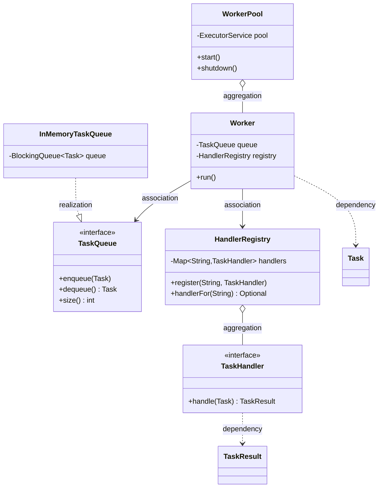
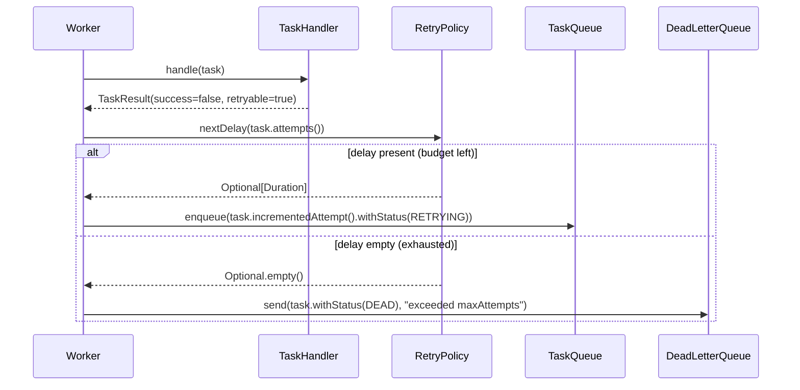
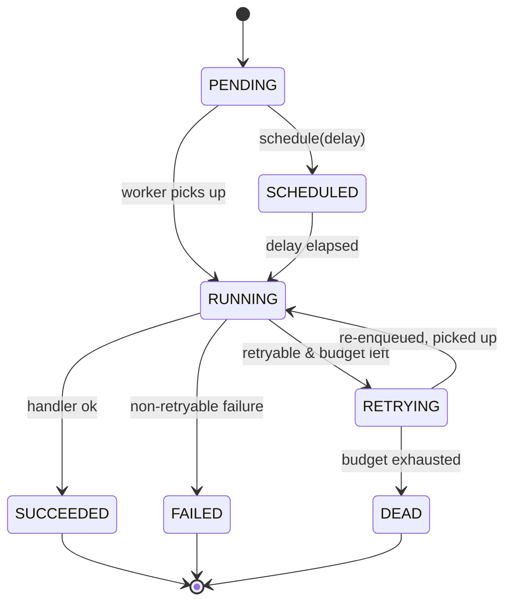
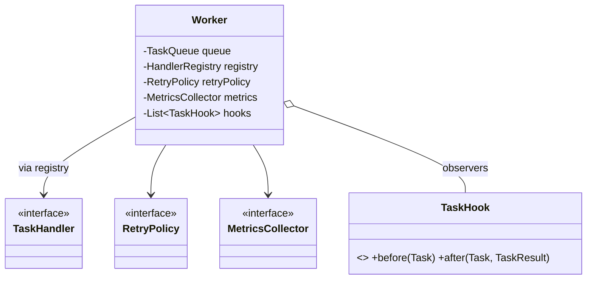

# Core OOP: Solutions

> Complete, compilable answers to every exercise in **[`./exercises.md`](./exercises.md)**, addressed
> by the **same IDs** (`E1`…`H10`). Each solution gives you the code (Java 21), the reasoning and
> tradeoffs, and the **common wrong approaches** so you can grade not just *whether* your answer works
> but *why* the staff-engineer version is shaped the way it is. Everything builds the Phase-1 slice of
> our **Distributed Task Queue and Event Processing Platform**.

All code compiles under Java 21 (`javac --release 21`). Where solutions share types (`Task`,
`TaskStatus`, `TaskQueue`, `TaskHandler`, …) the **first** definition is canonical; later solutions
reference it rather than redefining it.


---

## Group A — Knowledge-Check Solutions (E1–E10)

### E1 — references vs objects

**Answer.** `Task b = a;` copies the *reference*, not the object — `a` and `b` name the **same**
heap object, so mutating through `b` is visible through `a`. (Our `Task` is an immutable record, so
you cannot actually mutate `status`; the question is about the reference model — pretend a mutable
field for the thought experiment.) For `c`, `a == c` is **false**: `==` compares references and `c`
is a *different* object. `a.equals(c)` is **true** *iff* `equals` is value-based — which a record
gives you for free (it compares every component). For a hand-written class you would have to override
`equals`.

> Rule: `==` is *identity* (same address); `equals` is *equivalence* (same value, by your definition).

**Common wrong approach.** Assuming `Task b = a` *copies* the object. Java only ever copies the
reference for objects — there is no implicit deep copy. The only "copy" you get is from records'
`with`-style helpers (E11) or an explicit copy constructor.

### E2 — `==` vs `equals` for `Task.id`

**Answer.** Use **`equals`**, not `==`. Two rows loaded by two queries are two distinct heap objects,
so `==` is false even though they are the *same task*. To make `equals` mean "same task" you override
`equals`/`hashCode` to compare on the **`id`** (the UUID) only — never on `status`/`attempts`, which
drift over the task's life. A record's auto-generated `equals` compares *all* components, which is
wrong for an entity whose mutable-in-spirit fields change; that is exactly why M5 builds a
hand-written `equals` keyed on `id`.

**Common wrong approach.** Trusting the record's value equality for a *persistent entity*. Records
model **values**; database rows are **entities** with stable identity. Mixing them up makes
"the same task at two points in time" look unequal.

### E3 — constructors and `this`/`super`

**Answer.** (a) An implicit `super()` invokes the **superclass no-arg constructor first**, so the
parent's fields are initialised before the child runs — every object is built base-up. (b) Use
`this(...)` constructor chaining in `Task` to funnel several convenience constructors into **one
canonical constructor** that holds all validation, so the invariants are checked in exactly one place
(see E12b's overloaded factories for the same idea applied to static methods).

**Common wrong approach.** Duplicating validation in every constructor. Chain to one canonical
constructor so a new invariant is added once.

### E4 — access modifiers ladder

**Answer (most → least restrictive):** `private` → package-private (default) → `protected` →
`public`.

| Modifier | `InMemoryTaskQueue` member | Why |
|---|---|---|
| `private` | `private final BlockingQueue<Task> queue` | internal storage; nobody outside may touch it |
| package-private | a package-local `int internalCapacityHint()` test seam | visible to same-package tests, hidden from the world |
| `protected` | a `protected void onEnqueue(Task t)` hook for a subclass | subclasses may extend behaviour, outsiders may not |
| `public` | `enqueue`, `dequeue`, `size` | the contract callers depend on |

> `protected` is *less* restrictive than package-private because it adds **subclasses in other
> packages** to the package-private audience.

**Common wrong approach.** Ranking `protected` as more restrictive than default. It is broader: it
opens the member to all subclasses everywhere, plus the package.

### E5 — static vs instance

| Member | Instance / static | Why |
|---|---|---|
| (a) `attempts` | **instance** | each `Task` has its own attempt count |
| (b) total tasks ever created | **static** | one number for the whole class, not per object |
| (c) default `maxAttempts = 3` | **static** (and `final`) | a shared constant; same for every task |
| (d) `Logger` for `Worker` | **static final** | one logger per class is the idiom; named after the class, not the object |

**Common wrong approach.** Making the global counter an instance field — every object would have its
own "global" count, which is no global at all. Static state must also be **thread-safe** (use
`AtomicLong`), a trap we revisit in [`../06-concurrency/atomics-and-thread-safety.md`](../06-concurrency/atomics-and-thread-safety.md).

### E6 — overloading vs overriding

**Answer.** `enqueue(Task)` + `enqueue(Task, int)` is **overloading**: same name, *different
parameter list*, resolved at **compile time** by the static argument types. `Worker.run()`
re-declaring `Runnable.run()` is **overriding**: same signature in a subtype, resolved at **runtime**
by the object's actual class.

- *Overloading* — several methods, one name, distinguished by parameters (compile-time).
- *Overriding* — a subtype replaces an inherited method's body, same signature (runtime).

**Common wrong approach.** Calling the second `enqueue` an override. Overriding requires an *identical*
signature in a *subtype*; changing the parameter list makes it a sibling, not a replacement.

### E7 — overriding rules

**Answer.** An override must:

1. **Return type** — be the same type or a **covariant** (narrower) subtype.
2. **Checked exceptions** — throw the *same* checked exceptions or **fewer/narrower** ones (never a
   broader checked exception). `TaskHandler.handle` declares `throws Exception`, so an override may
   throw any subtype or nothing.
3. **Access modifier** — be **at least as visible** (you may widen `protected`→`public`, never
   narrow).

`@Override` matters because it makes the **compiler verify** you actually overrode something. Misspell
the name or get a parameter type wrong and, without the annotation, you silently create a *new
overload* that never runs — a bug that compiles cleanly.

**Common wrong approach.** Believing an override may broaden the throws clause. It may only keep or
shrink it; broadening would break callers who handle only the base's declared exceptions.

### E8 — upcasting implicit, downcasting explicit

**Answer.** `TaskQueue q = new InMemoryTaskQueue();` is an **upcast** — every `InMemoryTaskQueue`
*is-a* `TaskQueue`, always safe, so no cast is needed. `InMemoryTaskQueue mem = q;` is a **downcast**:
the compiler only knows `q`'s static type is `TaskQueue`, which *might* point at some other
implementation, so it forces you to assert the narrowing with `(InMemoryTaskQueue) q`. If the runtime
object is not actually an `InMemoryTaskQueue`, the JVM throws **`ClassCastException`**. Guarding with
`if (q instanceof InMemoryTaskQueue mem)` (pattern binding) tests *and* binds in one step, so the cast
only happens when it is provably safe.

**Common wrong approach.** Down-casting "to be safe" without an `instanceof` guard, then catching
`ClassCastException`. Exceptions are not control flow; pattern-match instead.

### E9 — abstract class vs interface

**Choose an abstract class when:** (1) you want to **share implementation/state** across subclasses
(fields plus concrete helper methods, like a template `handle`); (2) you want a **single, controlled
inheritance lineage** with `protected` hooks.

**Choose an interface when:** (1) a type must be implemented by classes that already extend something
else (Java has single class inheritance but multiple interface inheritance); (2) you want a small,
**capability-style contract** mixed into many unrelated types (E.g. `Validating`, `ProgressReporting`
in M17).

`sealed` changes the decision by letting an interface (or class) **enumerate its permitted
implementors**, so you get interface flexibility *plus* a **closed set** the compiler can check for
exhaustiveness — exactly what M7's `TaskEvent` needs.

**Common wrong approach.** Reaching for an abstract class only to share a couple of constants —
`interface` with `static final` fields (or an `enum`) does that without burning the single-inheritance
slot.

### E10 — association vs aggregation vs composition

| Pair | Relationship | Justification (lifetime ownership) |
|---|---|---|
| 1. `Worker` ↔ `TaskQueue` | **association** | the queue is *passed in*; both outlive each other independently |
| 2. `WorkerPool` ↔ `Worker` | **aggregation** | the pool *holds* workers but they are interchangeable parts it manages, not exclusively owned for life |
| 3. `Worker` ↔ private `MetricsCollector` made in its constructor | **composition** | the worker *creates and owns* it; when the worker dies, so does the collector |
| 4. `Task` ↔ `TaskStatus` | **association** (to a shared enum value) | enum constants are singletons shared by every task; the task merely *refers* to one |

**Common wrong approach.** Calling #2 composition. Composition implies *exclusive, cradle-to-grave
ownership*; a pool that is handed pre-built workers, or whose workers could be moved to another pool,
is aggregation. The litmus test is always **"if the owner dies, must the part die too?"**

---

## Group B — Coding Solutions (E11–M8)

### E11 — the `Task` record and `TaskStatus` enum

```java
package taskqueue.model;

public enum TaskStatus {
    PENDING, SCHEDULED, RUNNING, SUCCEEDED, FAILED, RETRYING, DEAD
}
```

```java
package taskqueue.model;

import java.time.Instant;
import java.util.UUID;

public record Task(
        String id, String type, String payload, TaskStatus status,
        int attempts, int maxAttempts, Instant createdAt, Instant scheduledAt, int priority) {

    // Compact constructor: runs *before* the implicit field assignments,
    // so it is the one place to enforce every invariant.
    public Task {
        if (id == null || id.isBlank())   throw new IllegalArgumentException("id must be non-blank");
        if (type == null || type.isBlank()) throw new IllegalArgumentException("type must be non-blank");
        if (maxAttempts < 1) throw new IllegalArgumentException("maxAttempts must be >= 1");
        if (attempts < 0)    throw new IllegalArgumentException("attempts must be >= 0");
    }

    /** Static factory: the only blessed way to mint a brand-new task. */
    public static Task newTask(String type, String payload) {
        Instant now = Instant.now();
        return new Task(UUID.randomUUID().toString(), type, payload,
                TaskStatus.PENDING, 0, 3, now, now, 0);
    }

    // Returning a *copy* (not a setter) keeps Task immutable: a Task already
    // sitting in a HashSet/queue can never have its hash or state change under
    // another thread, so there are no torn reads and no lost-from-set bugs.
    public Task withStatus(TaskStatus s) {
        return new Task(id, type, payload, s, attempts, maxAttempts, createdAt, scheduledAt, priority);
    }

    public Task incrementedAttempt() {
        return new Task(id, type, payload, status, attempts + 1, maxAttempts, createdAt, scheduledAt, priority);
    }
}
```

```java
// Proof
var t = Task.newTask("email", "{\"to\":\"a@b.c\"}");
assert t.status() == TaskStatus.PENDING && t.attempts() == 0;
var running = t.withStatus(TaskStatus.RUNNING);
assert t.status() == TaskStatus.PENDING;       // original untouched
assert running.attempts() == 0 && running.status() == TaskStatus.RUNNING;
```

**Reasoning / tradeoffs.** The **compact constructor** centralises validation; the **static factory**
hides the wide canonical constructor behind an intention-revealing name; the **`with*` copy methods**
preserve immutability, which is the single biggest concurrency win in the whole platform — an
immutable `Task` is safe to share across worker threads with zero locking.

**Common wrong approaches.** (1) Adding setters "for convenience" — it destroys the immutability the
queue relies on. (2) Validating in the static factory instead of the compact constructor — then a raw
`new Task(...)` skips the checks. Put invariants in the constructor, conveniences in factories.

### E12 — `TaskResult` and a `TaskHandler` lambda

```java
package taskqueue.model;

public record TaskResult(boolean success, String message, boolean retryable) {
    public static TaskResult ok(String message)                  { return new TaskResult(true,  message, false); }
    public static TaskResult fail(String message, boolean retry) { return new TaskResult(false, message, retry); }
}
```

```java
package taskqueue.handler;

import taskqueue.model.Task;
import taskqueue.model.TaskResult;

@FunctionalInterface
public interface TaskHandler {
    TaskResult handle(Task task) throws Exception;
}
```

```java
// A functional interface has exactly one abstract method, so a lambda *is* an implementation.
TaskHandler emailHandler = task ->
        task.type().equals("email")
                ? TaskResult.ok("sent")
                : TaskResult.fail("not an email task", false);

assert emailHandler.handle(Task.newTask("email", "{}")).success();
```

**Reasoning.** One abstract method ⇒ the lambda's parameter/return *shape* matches the SAM (single
abstract method), so the compiler can synthesise the implementation. Static factories on `TaskResult`
read at the call site like `ok(...)`/`fail(...)` instead of a positional boolean soup.

**Common wrong approach.** Adding a second abstract method to `TaskHandler` — that breaks
`@FunctionalInterface` and the lambda no longer compiles. `default`/`static` methods are fine; a second
*abstract* one is not.

### E12b — overloaded factory methods

```java
package taskqueue.model;

public final class Tasks {
    private Tasks() {}  // utility class: no instances

    public static Task create(String type) {
        return create(type, "{}");
    }
    public static Task create(String type, String payload) {
        return create(type, payload, 0);
    }
    public static Task create(String type, String payload, int priority) {
        Task base = Task.newTask(type, payload);
        return new Task(base.id(), base.type(), base.payload(), base.status(),
                base.attempts(), base.maxAttempts(), base.createdAt(), base.scheduledAt(), priority);
    }
}
```

**Knowledge note.** Overloading is resolved at **compile time** because the compiler picks the method
from the *static* (declared) types of the arguments — it is pure type matching with no object involved.
Overriding is resolved at **runtime** because the JVM dispatches on the *actual* class of the receiver
object via the vtable; the same call site can land in different method bodies depending on what the
reference truly points at.

**Common wrong approach.** Re-implementing defaults in each overload instead of delegating up the
chain — duplication that drifts. Each overload should fill in *one* default and call the richer sibling.

### E13 — `TaskQueue` interface + `InMemoryTaskQueue`

```java
package taskqueue.queue;

import taskqueue.model.Task;

public interface TaskQueue {
    void enqueue(Task t);
    Task dequeue() throws InterruptedException;
    int size();
}
```

```java
package taskqueue.queue;

import taskqueue.model.Task;
import java.util.concurrent.BlockingQueue;
import java.util.concurrent.LinkedBlockingQueue;

public final class InMemoryTaskQueue implements TaskQueue {
    private final BlockingQueue<Task> queue = new LinkedBlockingQueue<>();

    @Override public void enqueue(Task t) { queue.add(t); }
    @Override public Task dequeue() throws InterruptedException { return queue.take(); } // blocks until available
    @Override public int size() { return queue.size(); }
}
```

```java
// FIFO test
var q = new InMemoryTaskQueue();
var a = Task.newTask("email", "1");
var b = Task.newTask("email", "2");
var c = Task.newTask("email", "3");
q.enqueue(a); q.enqueue(b); q.enqueue(c);
assert q.dequeue().equals(a);   // record equality on all fields
assert q.dequeue().equals(b);
assert q.dequeue().equals(c);
assert q.size() == 0;
```

**Reasoning.** `private final` on the backing queue is the encapsulation contract — callers reach it
*only* through the three interface methods. `dequeue()` uses `take()` (blocking) rather than `poll()`
(returns null) so a `Worker` parks instead of spin-looping; the blocking semantics are the whole point
of a `BlockingQueue`, explored further in [`../06-concurrency/blocking-queue.md`](../06-concurrency/blocking-queue.md).

**Common wrong approach.** Backing it with a plain `ArrayDeque` plus manual `wait/notify`, or with
`poll()` and a busy-wait. Use the concurrency-safe `LinkedBlockingQueue` and let `take()` block.

### E14 — `HandlerRegistry` keyed by task type

```java
package taskqueue.handler;

import java.util.HashMap;
import java.util.Map;
import java.util.Optional;

public final class HandlerRegistry {
    private final Map<String, TaskHandler> handlers = new HashMap<>();

    public void register(String type, TaskHandler handler) {
        if (handlers.putIfAbsent(type, handler) != null) {
            throw new IllegalStateException("handler already registered for type: " + type);
        }
    }

    public Optional<TaskHandler> handlerFor(String type) {
        return Optional.ofNullable(handlers.get(type));
    }
}
```

```java
var registry = new HandlerRegistry();
registry.register("email",  task -> TaskResult.ok("emailed"));
registry.register("report", task -> TaskResult.ok("report built"));
assert registry.handlerFor("email").isPresent();
assert registry.handlerFor("unknown").isEmpty();
```

**Reasoning.** The `Map` is `private` and **never** returned, so the registry fully owns its state
(no `getHandlers()` that leaks a mutable view — that is M12's smell). `Optional` makes "no handler"
an explicit, un-ignorable outcome. Crucially, a `Worker` calls only `handlerFor(type)`; adding a
*new* task type means calling `register(...)` — **`Worker` source never changes**. That is the
Open/Closed Principle made concrete (the full payoff is M6).

**Common wrong approach.** `register` silently overwriting an existing type, hiding a config bug, or
exposing the `Map` via a getter. `putIfAbsent` + throw fails loud; keep the map private.

### M1 — `Worker implements Runnable`

```java
package taskqueue.worker;

import taskqueue.handler.HandlerRegistry;
import taskqueue.handler.TaskHandler;
import taskqueue.model.Task;
import taskqueue.model.TaskResult;
import taskqueue.model.TaskStatus;
import taskqueue.queue.TaskQueue;

public final class Worker implements Runnable {
    private final TaskQueue queue;          // association: passed in, not created here
    private final HandlerRegistry registry; // association

    public Worker(TaskQueue queue, HandlerRegistry registry) {
        this.queue = queue;
        this.registry = registry;
    }

    @Override
    public void run() {
        while (!Thread.currentThread().isInterrupted()) {
            Task task;
            try {
                task = queue.dequeue();             // blocks
            } catch (InterruptedException e) {
                // Restoring the flag lets *callers* (the pool) observe the interrupt
                // and shut down. Swallowing it would make the pool un-stoppable.
                Thread.currentThread().interrupt();
                return;                              // exit the loop
            }
            process(task);
        }
    }

    private void process(Task task) {
        TaskHandler handler = registry.handlerFor(task.type()).orElse(null);
        if (handler == null) {
            System.out.printf("[%s] no handler -> %s%n", task.id(), TaskStatus.FAILED);
            return;
        }
        try {
            TaskResult r = handler.handle(task);
            TaskStatus next = r.success()
                    ? TaskStatus.SUCCEEDED
                    : (r.retryable() ? TaskStatus.RETRYING : TaskStatus.FAILED);
            System.out.printf("[%s] %s -> %s%n", task.id(), r.message(), next);
        } catch (Exception e) {
            System.out.printf("[%s] threw %s -> %s%n", task.id(), e, TaskStatus.FAILED);
        }
    }
}
```

**Reasoning.** Both collaborators are **injected** (association), which makes the worker testable with
fakes. The interrupt handling is the production-critical bit: catching `InterruptedException`,
**re-setting the flag**, and returning is the only way `WorkerPool.shutdown()` can actually stop the
loop. Full retry/DLQ wiring lands in M3/M8.

**Common wrong approach.** `catch (InterruptedException e) {}` (swallow) — the thread keeps looping,
`awaitTermination` times out, and the pool hangs. Always restore the flag and stop.

### M2 — `WorkerPool` aggregating workers

```java
package taskqueue.worker;

import taskqueue.handler.HandlerRegistry;
import taskqueue.queue.TaskQueue;
import java.util.concurrent.ExecutorService;
import java.util.concurrent.Executors;
import java.util.concurrent.TimeUnit;

public final class WorkerPool {
    private final int size;
    private final TaskQueue queue;
    private final HandlerRegistry registry;
    private ExecutorService pool;

    public WorkerPool(int size, TaskQueue queue, HandlerRegistry registry) {
        this.size = size;
        this.queue = queue;
        this.registry = registry;
    }

    // Aggregation: the pool *manages* Workers (creates, submits, stops them) but a
    // Worker is a plain Runnable that could run under any executor. The pool does not
    // hold unique, irreplaceable state of the Worker — contrast with composition,
    // where the part is created in the constructor and cannot exist without the owner.
    public void start() {
        // Fixed thread pool: one OS thread per worker. For thousands of mostly-blocked
        // workers, newVirtualThreadPerTaskExecutor() scales far better (cheap Loom threads).
        pool = Executors.newFixedThreadPool(size);
        for (int i = 0; i < size; i++) {
            pool.submit(new Worker(queue, registry));
        }
    }

    public void shutdown() {
        if (pool == null) return;
        pool.shutdown();                                  // stop accepting, let running finish
        try {
            if (!pool.awaitTermination(5, TimeUnit.SECONDS)) {
                pool.shutdownNow();                       // interrupt the blocked dequeue()s
            }
        } catch (InterruptedException e) {
            pool.shutdownNow();
            Thread.currentThread().interrupt();
        }
    }
}
```

**Reasoning.** The graceful `shutdown()` → `awaitTermination` → `shutdownNow()` sequence is the
idiomatic three-step. `shutdownNow()` *interrupts* the workers, which (because of M1's correct
interrupt handling) is what finally breaks them out of a blocked `dequeue()`.

**Common wrong approach.** Calling only `shutdown()` — the workers are parked in `take()` forever and
never see the request. You must `shutdownNow()` (interrupt) to unblock them.

### M3 — `RetryPolicy` strategy via interface

```java
package taskqueue.retry;

import java.time.Duration;
import java.util.Optional;

public interface RetryPolicy {
    Optional<Duration> nextDelay(int attempt); // empty => give up (task becomes DEAD)
}
```

```java
package taskqueue.retry;

import java.time.Duration;
import java.util.Optional;

public final class FixedDelayRetryPolicy implements RetryPolicy {
    private final Duration delay;
    private final int maxAttempts;
    public FixedDelayRetryPolicy(Duration delay, int maxAttempts) {
        this.delay = delay; this.maxAttempts = maxAttempts;
    }
    @Override public Optional<Duration> nextDelay(int attempt) {
        return attempt < maxAttempts ? Optional.of(delay) : Optional.empty();
    }
}
```

```java
package taskqueue.retry;

import java.time.Duration;
import java.util.Optional;
import java.util.concurrent.ThreadLocalRandom;

public final class ExponentialBackoffRetryPolicy implements RetryPolicy {
    private final Duration base;
    private final int maxAttempts;
    public ExponentialBackoffRetryPolicy(Duration base, int maxAttempts) {
        this.base = base; this.maxAttempts = maxAttempts;
    }
    @Override public Optional<Duration> nextDelay(int attempt) {
        if (attempt >= maxAttempts) return Optional.empty();
        long backoffMillis = base.toMillis() * (1L << attempt);          // base * 2^attempt
        long jitter = ThreadLocalRandom.current().nextLong(backoffMillis / 2 + 1);
        return Optional.of(Duration.ofMillis(backoffMillis + jitter));    // full-ish jitter
    }
}
```

```java
// Wiring into Worker.process(...) (replacing the M1 FAILED branch on retryable failures)
private final RetryPolicy retryPolicy;   // composed-in strategy

private void onFailure(Task task, TaskResult r) {
    if (!r.retryable()) { transition(task, TaskStatus.FAILED); return; }
    Optional<Duration> delay = retryPolicy.nextDelay(task.attempts());
    if (delay.isPresent()) {
        Task retrying = task.incrementedAttempt().withStatus(TaskStatus.RETRYING);
        queue.enqueue(retrying);                 // re-enqueue (M10 scheduler refines this)
    } else {
        transition(task, TaskStatus.DEAD);       // M8 sends to the DLQ here
    }
}
```

**Reasoning.** `RetryPolicy` is the **Strategy pattern**: the worker depends on the *interface*, and
you swap fixed vs exponential backoff with no change to `Worker`. Jitter avoids the *thundering herd*
where thousands of tasks fail at once and retry in lockstep. `1L << attempt` (not `Math.pow`) keeps it
integral and avoids overflow surprises for small attempt counts. Same shape recurs in
[`../05-design-patterns/strategy.md`](../05-design-patterns/strategy.md).

**Common wrong approach.** Hard-coding `Thread.sleep(2^attempt * 1000)` inside the worker. That bakes
the policy into the worker (no swapping, no testing) and *blocks the worker thread* for the whole
backoff — H10's `TaskScheduler` fixes the blocking by scheduling the re-enqueue.

### M4 — abstract base handler with template method

```java
package taskqueue.handler;

import taskqueue.model.Task;
import taskqueue.model.TaskResult;

public abstract class AbstractTaskHandler implements TaskHandler {

    // final: subclasses cannot break the validate -> execute -> log contract.
    @Override
    public final TaskResult handle(Task task) throws Exception {
        System.out.printf("[%s] start type=%s%n", task.id(), task.type());
        validate(task.payload());                 // step 1 (subclass)
        TaskResult result = doHandle(task);       // step 2 (subclass)
        System.out.printf("[%s] done success=%b%n", task.id(), result.success());
        return result;                            // step 3 (base)
    }

    protected abstract void validate(String payload) throws Exception;
    protected abstract TaskResult doHandle(Task task) throws Exception;
}
```

```java
public final class EmailHandler extends AbstractTaskHandler {
    @Override protected void validate(String payload) {
        if (!payload.contains("to")) throw new IllegalArgumentException("email needs a 'to'");
    }
    @Override protected TaskResult doHandle(Task task) { return TaskResult.ok("sent"); }
}

public final class ImageResizeHandler extends AbstractTaskHandler {
    @Override protected void validate(String payload) {
        if (!payload.contains("url")) throw new IllegalArgumentException("resize needs a 'url'");
    }
    @Override protected TaskResult doHandle(Task task) { return TaskResult.ok("resized"); }
}
```

**Reasoning.** The **template method** (`handle`) fixes the *skeleton* (log → validate → execute →
log) and defers the *variant steps* to subclasses. Making `handle` **`final`** is the crux: it
guarantees every handler validates before it executes and logs after — a subclass cannot accidentally
(or maliciously) skip a step. The `protected` hooks are the only extension surface.

**Common wrong approach.** Leaving `handle` non-`final` so a subclass overrides the *whole* template,
defeating the point. Lock the skeleton, open only the steps.

### M5 — `equals`/`hashCode` identity for a mutable `Task` class

```java
package taskqueue.model;

import java.util.Objects;

public final class MutableTask {
    private final String id;            // identity: immutable
    private TaskStatus status;          // mutable state
    private int attempts;               // mutable state

    public MutableTask(String id, TaskStatus status) {
        this.id = Objects.requireNonNull(id);
        this.status = status;
    }
    public void setStatus(TaskStatus s) { this.status = s; }
    public void incrementAttempts()     { this.attempts++; }
    public String id() { return id; }

    // Identity is the id ONLY. Hashing/equality must not see status or attempts,
    // or a task's bucket would move when its status changes while it sits in a set.
    @Override public boolean equals(Object o) {
        return o instanceof MutableTask other && id.equals(other.id);
    }
    @Override public int hashCode() { return id.hashCode(); }
}
```

```java
// Demonstration: mutate a task that already lives in a HashSet.
var set = new java.util.HashSet<MutableTask>();
var t = new MutableTask("id-1", TaskStatus.PENDING);
set.add(t);
t.setStatus(TaskStatus.RUNNING);    // mutate AFTER insertion
t.incrementAttempts();
assert set.contains(t);             // still found: hashCode(id) is unchanged
assert set.contains(new MutableTask("id-1", TaskStatus.SUCCEEDED)); // equal by id
```

**Reasoning.** A `HashSet` files each element in a bucket chosen by `hashCode()` at *insertion* time.
If `hashCode` depended on `status`, mutating `status` would change the *correct* bucket but not move
the element, so `contains` would compute the new bucket, look there, and **miss** — the object is
"lost" inside the set it is still in. Keying identity on the immutable `id` makes the hash stable for
life. (The record `Task` in E11 sidesteps this entirely by being immutable.)

**Common wrong approaches.** (1) Auto-generating `equals/hashCode` over *all* fields (IDE default) on
a mutable entity. (2) Overriding `equals` but forgetting `hashCode` (or vice-versa) — they must change
together or hash-based collections break.

### M6 — polymorphic dispatch over handlers

```java
package taskqueue.dispatch;

import taskqueue.handler.HandlerRegistry;
import taskqueue.handler.TaskHandler;
import taskqueue.model.Task;
import taskqueue.model.TaskResult;

public final class Dispatcher {
    private final HandlerRegistry registry;
    public Dispatcher(HandlerRegistry registry) { this.registry = registry; }

    public TaskResult dispatch(Task task) throws Exception {
        TaskHandler handler = registry.handlerFor(task.type())
                .orElseThrow(() -> new IllegalStateException("no handler for " + task.type()));
        return handler.handle(task);     // ONE polymorphic call — no if/else on concrete types
    }
}
```

```java
var registry = new HandlerRegistry();
registry.register("email",  t -> TaskResult.ok("emailed"));
registry.register("report", t -> TaskResult.ok("reported"));
var dispatcher = new Dispatcher(registry);

// Add a THIRD handler with zero edits to Dispatcher:
registry.register("sms", t -> TaskResult.ok("texted"));
assert dispatcher.dispatch(Task.newTask("sms", "{}")).success();
```

**Reasoning.** Dispatch is **data-driven** (look up by `type`) and the actual behaviour is chosen by
**dynamic dispatch** on the `TaskHandler` you found. New behaviour = new `register(...)` call;
`Dispatcher` is *closed for modification, open for extension* — the Open/Closed Principle in one
method. See [`./chapter-09-polymorphism.md`](./chapter-09-polymorphism.md).

**Common wrong approach.** `if (task.type().equals("email")) ... else if (...)` inside `dispatch`.
That is the very `instanceof`/string ladder M9 exists to kill.

### M7 — sealed `TaskEvent` hierarchy + switch pattern matching

```java
package taskqueue.event;

import java.time.Instant;

public sealed interface TaskEvent
        permits TaskEnqueued, TaskStarted, TaskSucceeded, TaskFailed {}

public record TaskEnqueued(String taskId, Instant at)                       implements TaskEvent {}
public record TaskStarted (String taskId, String workerName, Instant at)    implements TaskEvent {}
public record TaskSucceeded(String taskId, long durationMillis)             implements TaskEvent {}
public record TaskFailed  (String taskId, String reason, boolean retryable) implements TaskEvent {}
```

```java
static String describe(TaskEvent e) {
    return switch (e) {                                  // no default!
        case TaskEnqueued(var id, var at)            -> "enqueued " + id + " at " + at;
        case TaskStarted(var id, var w, var at)      -> "started " + id + " on " + w;
        case TaskSucceeded(var id, var ms)           -> "succeeded " + id + " in " + ms + "ms";
        case TaskFailed(var id, var reason, var rt)  -> "failed " + id + ": " + reason + (rt ? " (retryable)" : "");
    };
}
```

**Reasoning.** `sealed` + `permits` **closes** the type set, so the `switch` is provably exhaustive and
needs **no `default`**. Add a fifth `TaskEvent` and forget to handle it, and the switch **fails to
compile** — exhaustiveness is enforced by the compiler, not a runtime `UNKNOWN` branch. Record
patterns destructure components inline. This is the seed of the Phase-4 `EventBus`
([`../08-distributed-systems/dlq.md`](../08-distributed-systems/dlq.md)).

**Common wrong approach.** Adding a `default -> ...` "just in case". It silences the compiler's
exhaustiveness check, so a new event type slips through unhandled. On a *closed* set, omit `default`.

### M8 — `DeadLetterQueue` interface + in-memory impl

```java
package taskqueue.dlq;

import taskqueue.model.Task;
import java.time.Instant;
import java.util.ArrayList;
import java.util.Collections;
import java.util.List;

public interface DeadLetterQueue {
    void send(Task t, String reason);
}

public record DeadLetter(Task task, String reason, Instant at) {}

public final class InMemoryDeadLetterQueue implements DeadLetterQueue {
    private final List<DeadLetter> letters = Collections.synchronizedList(new ArrayList<>());

    @Override public void send(Task t, String reason) {
        letters.add(new DeadLetter(t.withStatus(taskqueue.model.TaskStatus.DEAD), reason, Instant.now()));
    }

    /** Snapshot copy — never expose the live list (M12). */
    public List<DeadLetter> drain() {
        synchronized (letters) { return new ArrayList<>(letters); }
    }
}
```

```java
// Worker calls it where M3 produced DEAD:
//   if (retryPolicy.nextDelay(task.attempts()).isEmpty())
//       deadLetterQueue.send(task, "exceeded maxAttempts");
```

**Reasoning.** The DLQ is a sink for tasks that exhausted retries, so failures are *observable* rather
than silently dropped. `drain()` returns a **copy**, preserving encapsulation. The list is
`synchronized` because multiple workers send concurrently. Conceptual depth in
[`../07-queues-and-messaging/dead-letter-queues.md`](../07-queues-and-messaging/dead-letter-queues.md).

**Common wrong approach.** Logging the dead task and discarding it. Without a DLQ you cannot replay or
audit poison messages — the whole point is a durable, inspectable parking lot.

---

## Group C — Refactoring Solutions (M9–M14)

### M9 — kill the `instanceof` chain

**Smell:** an `instanceof` ladder that must be edited for every new handler — it violates Open/Closed
(adding `SmsHandler` forces a change to `process`).

```java
// Each handler implements the same interface...
public interface TaskHandler { TaskResult handle(Task task) throws Exception; }

public final class EmailHandler  implements TaskHandler { public TaskResult handle(Task t){ return TaskResult.ok("email");  } }
public final class SmsHandler    implements TaskHandler { public TaskResult handle(Task t){ return TaskResult.ok("sms");    } }
public final class ReportHandler implements TaskHandler { public TaskResult handle(Task t){ return TaskResult.ok("report"); } }

// ...so the whole ladder collapses to one polymorphic call.
public final class GoodDispatcher {
    public TaskResult process(TaskHandler handler, Task task) throws Exception {
        return handler.handle(task);    // no instanceof, no casts
    }
}
```

**Why the original violates Open/Closed:** every new handler requires *editing* `process` (a new
`else if` + cast), so the class is not closed for modification. Polymorphism moves the behaviour into
the handler, leaving `process` untouched forever.

**Common wrong approach.** "Refactoring" by replacing `instanceof` with a `switch` on
`handler.getClass().getSimpleName()` — same coupling, now stringly-typed and worse.

### M10 — status logic as a switch chain on the enum

**Smell:** duplicated `!r.success()` checks, magic `String` returns, and a non-total `UNKNOWN` branch.

```java
static TaskStatus nextStatus(Task task, TaskResult r) {
    if (r.success()) return TaskStatus.SUCCEEDED;
    if (!r.retryable()) return TaskStatus.FAILED;                 // non-retryable failure
    return task.attempts() < task.maxAttempts()                  // retryable: budget left?
            ? TaskStatus.RETRYING
            : TaskStatus.DEAD;
}
```

**Reasoning.** Returning a `TaskStatus` (not a `String`) makes illegal states unrepresentable and lets
the compiler catch typos. Factoring the single `r.success()` guard to the top removes the duplicated
`!r.success()` conditions; the remaining decision is a clean two-way on the attempt budget. The
function is now **total** — every input maps to a real status, so the `UNKNOWN` sentinel is gone.

**Common wrong approach.** Keeping `String` returns "for logging." Return the enum and call
`.name()` at the log site; never let a stringly-typed status leak into business logic.

### M11 — inheritance → composition for a `Worker` variant

**Smell:** `Logging → LoggingMetrics → LoggingMetricsRateLimited` — cross-cutting concerns stacked by
subclassing, so every *combination* needs its own class (2ⁿ explosion).

```java
// Small collaborator interfaces, each with a no-op default impl.
public interface MetricsCollector { void onProcessed(Task t, boolean ok);
    MetricsCollector NOOP = (t, ok) -> {}; }
public interface RateLimiter { boolean tryAcquire();
    RateLimiter UNLIMITED = () -> true; }

public final class Worker implements Runnable {
    private final TaskQueue queue;
    private final HandlerRegistry registry;
    private final MetricsCollector metrics;     // composed
    private final System.Logger log;            // composed
    private final RateLimiter rateLimiter;      // composed

    public Worker(TaskQueue queue, HandlerRegistry registry,
                  MetricsCollector metrics, System.Logger log, RateLimiter rateLimiter) {
        this.queue = queue; this.registry = registry;
        this.metrics = metrics; this.log = log; this.rateLimiter = rateLimiter;
    }

    @Override public void run() {
        while (!Thread.currentThread().isInterrupted()) {
            if (!rateLimiter.tryAcquire()) continue;         // rate-limit concern: composed in
            Task task;
            try { task = queue.dequeue(); }
            catch (InterruptedException e) { Thread.currentThread().interrupt(); return; }
            log.log(System.Logger.Level.INFO, "processing " + task.id());   // logging: composed in
            boolean ok = handle(task);
            metrics.onProcessed(task, ok);                   // metrics: composed in
        }
    }
    private boolean handle(Task task) {
        return registry.handlerFor(task.type())
                .map(h -> { try { return h.handle(task).success(); } catch (Exception e) { return false; } })
                .orElse(false);
    }
}
```

**Reasoning.** Logging, metrics, and rate limiting are **independent axes**. With inheritance, *k*
axes force up to 2ᵏ subclasses. With composition, *one* `Worker` accepts *k* collaborators and you mix
any subset at construction (`MetricsCollector.NOOP`, `RateLimiter.UNLIMITED` are the "off" settings).
"Favor composition over inheritance" applies because these concerns are *has-a*, not *is-a*, and they
combine multiplicatively — the exact failure mode subclassing handles worst.

**Common wrong approach.** Keeping the base `Worker` and adding *one more* subclass per combo. That
is the smell, not the fix. Decompose into collaborators.

### M12 — leaky encapsulation in `InMemoryTaskQueue`

**Smell:** a `public` mutable field *and* a getter that hands back the **live** list — any caller can
mutate internal state, and in a concurrent queue that is a data race.

```java
import java.util.List;
import java.util.concurrent.BlockingQueue;
import java.util.concurrent.LinkedBlockingQueue;

public final class InMemoryTaskQueue implements TaskQueue {
    private final BlockingQueue<Task> queue = new LinkedBlockingQueue<>();   // private final

    @Override public void enqueue(Task t) { queue.add(t); }
    @Override public Task dequeue() throws InterruptedException { return queue.take(); }
    @Override public int size() { return queue.size(); }

    /** Read-only *snapshot* for inspection — callers cannot mutate the queue. */
    public List<Task> snapshot() { return List.copyOf(queue); }   // immutable copy
}
```

**Reasoning.** `private final` storage + a canonical `enqueue/dequeue/size` API means the only way to
change the queue is through methods that preserve its invariants. `snapshot()` returns an *immutable
copy* (`List.copyOf`), so reads can never corrupt internal state. Exposing the live list in a
concurrent queue is doubly dangerous: a caller iterating it while a worker enqueues triggers
`ConcurrentModificationException` or torn reads — a **data race**, not just an encapsulation slip. See
[`../04-oop-and-ood/law-of-demeter.md`](../04-oop-and-ood/law-of-demeter.md).

**Common wrong approach.** `return Collections.unmodifiableList(tasks)` over the *live* list. That
blocks the *caller* from mutating but still reflects concurrent writes mid-iteration. Copy for a true
snapshot.

### M13 — fat constructor doing too much

**Smell:** the constructor opens a thread pool, registers handlers, and *starts work* — side effects
that make the object impossible to construct in a test without spinning real threads.

```java
public final class WorkerPool {
    private final int size;
    private final TaskQueue queue;
    private final HandlerRegistry registry;     // injected, not built here
    private ExecutorService pool;

    // Thin constructor: assignment only. No threads, no I/O, no registration.
    public WorkerPool(int size, TaskQueue queue, HandlerRegistry registry) {
        this.size = size;
        this.queue = queue;
        this.registry = registry;
    }

    public void start() {                        // explicit, observable lifecycle
        pool = Executors.newFixedThreadPool(size);
        for (int i = 0; i < size; i++) pool.submit(new Worker(queue, registry));
    }
    public void shutdown() { /* graceful shutdown as in M2 */ }
}
```

```java
// Composition root wires + registers handlers BEFORE start() — caller's job, not the ctor's.
var registry = new HandlerRegistry();
registry.register("email", new EmailHandler());
var pool = new WorkerPool(4, new InMemoryTaskQueue(), registry);
pool.start();
```

**Reasoning.** A constructor that only *assigns* can be called from any test with fakes and never
leaks a thread. Side effects move to `start()`, giving an explicit lifecycle you can assert on.
Dependencies are **injected** rather than `new`-ed internally, which is the seam for swapping
`InMemoryTaskQueue` for `PostgresTaskQueue` later — the principle behind
[`../04-oop-and-ood/dependency-injection.md`](../04-oop-and-ood/dependency-injection.md).

**Common wrong approach.** "Lazy" side effects hidden in a getter instead of a constructor — still a
surprise, just relocated. Make lifecycle explicit (`start`/`shutdown`).

### M14 — protected field abuse across an inheritance tree

**Smell:** `protected int attempts` lets every subclass mutate the base's representation directly, so
the base can never change how it tracks attempts without breaking subclasses, and a subclass can
violate the invariant (negative attempts, skipping the cap).

```java
public abstract class AbstractTaskHandler implements TaskHandler {
    private int attempts;          // PRIVATE: only the base touches the field

    // Narrow, controlled API for subclasses — they read/advance, never assign.
    protected final int attempts()       { return attempts; }
    protected final void recordAttempt() { attempts++; }   // base owns the invariant

    @Override
    public final TaskResult handle(Task task) throws Exception {
        recordAttempt();                       // base enforces the count
        validate(task.payload());
        return doHandle(task);
    }
    protected abstract void validate(String payload) throws Exception;
    protected abstract TaskResult doHandle(Task task) throws Exception;
}
```

**Reasoning.** State stays **`private`**; subclasses get a **narrow `protected` API** (`attempts()`
read + `recordAttempt()` advance) that cannot corrupt the invariant. The base is now free to change
`attempts` to an `AtomicInteger` or move it elsewhere without touching a single subclass —
encapsulation across the inheritance boundary. `protected` should expose *behaviour* (methods), almost
never *state* (fields). See [`./chapter-12-abstract-classes.md`](./chapter-12-abstract-classes.md).

**Common wrong approach.** "Just make it `protected` so subclasses are convenient." Convenience now =
fragile hierarchy later. Expose a method, not the field.

---

## Group D — Design Solutions (M15–H3)

### M15 — Worker/Queue/Pool relationships (the module diagram)



**Rationale.** `InMemoryTaskQueue ..|> TaskQueue` is **realization** (implements the interface).
`WorkerPool o-- Worker` is **aggregation**: the pool manages workers but they are interchangeable
runnables. `Worker --> TaskQueue` and `Worker --> HandlerRegistry` are **associations**: both are
injected and outlive each other. `HandlerRegistry o-- TaskHandler` is **aggregation**: handlers are
registered (held) but defined elsewhere. `Worker ..> Task` and `TaskHandler ..> TaskResult` are
**dependencies** (used transiently as a parameter/return, not stored). Get these arrows right and
later phases can replace the queue implementation without touching the worker.

### M16 — retry/DLQ collaboration



**Relationships.** `Worker → RetryPolicy`, `Worker → TaskQueue`, and `Worker → DeadLetterQueue` are
all **associations** — every collaborator is injected through the interface and is swappable
(`FixedDelay` ↔ `ExponentialBackoff`, in-memory ↔ Postgres ↔ broker). None is composition: the worker
neither creates nor exclusively owns them, which is precisely what makes the retry/DLQ machinery
pluggable across phases.

### M17 — interface segregation for handlers

```java
public interface TaskHandler { TaskResult handle(Task task) throws Exception; }

public interface Validating       { void validate(String payload) throws Exception; }
public interface ProgressReporting{ void reportProgress(int percent); }

// A handler composes ONLY the capabilities it needs.
public final class ImageResizeHandler implements TaskHandler, Validating, ProgressReporting {
    public void validate(String payload) { if (!payload.contains("url")) throw new IllegalArgumentException("need url"); }
    public void reportProgress(int p)    { System.out.println("resize " + p + "%"); }
    public TaskResult handle(Task t) throws Exception { validate(t.payload()); reportProgress(100); return TaskResult.ok("resized"); }
}

// A trivial handler implements just the core interface.
public final class PingHandler implements TaskHandler {
    public TaskResult handle(Task t) { return TaskResult.ok("pong"); }
}
```

**Rationale.** Three small interfaces beat one fat `TaskHandler` that *forces* every handler to
implement `validate` and `reportProgress` even when they are meaningless (the SMS handler does not
"report progress"). This is the **Interface Segregation Principle** — the "I" in SOLID: clients should
not depend on methods they do not use. Handlers opt into capabilities by *implementing* the extra
interfaces, and generic code can probe `if (h instanceof ProgressReporting pr) pr.reportProgress(..)`.
See [`../04-oop-and-ood/solid.md`](../04-oop-and-ood/solid.md).

### H1 — composition vs inheritance for queue variants

**Design (a) — inheritance:** `PriorityTaskQueue extends InMemoryTaskQueue`, etc. A rate-limited
*priority* queue needs `RateLimitedPriorityTaskQueue` — a new class per combination.

**Design (b) — composition/decorator:** each variant *wraps* a `TaskQueue` and delegates.

```java
public final class RateLimitedTaskQueue implements TaskQueue {
    private final TaskQueue delegate;
    private final RateLimiter limiter;
    public RateLimitedTaskQueue(TaskQueue delegate, RateLimiter limiter) {
        this.delegate = delegate; this.limiter = limiter;
    }
    @Override public void enqueue(Task t) {
        if (!limiter.tryAcquire()) throw new IllegalStateException("rate limit exceeded");
        delegate.enqueue(t);
    }
    @Override public Task dequeue() throws InterruptedException { return delegate.dequeue(); }
    @Override public int size() { return delegate.size(); }
}
// Combine freely: new RateLimitedTaskQueue(new PriorityTaskQueue(new InMemoryTaskQueue()), limiter)
```

| Criterion | (a) Inheritance | (b) Composition / decorator |
|---|---|---|
| Combinability | 2ⁿ classes for n features; rate-limited+priority needs a bespoke subclass | mix any subset at runtime by nesting wrappers |
| Testability | must test through a fat subclass with all behaviours baked in | each wrapper tested in isolation over a fake `TaskQueue` |
| Fragility under change | base change ripples into every subclass; brittle hierarchy | wrappers are independent; change one without touching others |

**Recommendation:** **(b) composition/decorator.** Queue features are orthogonal and must combine; the
decorator gives runtime combinability, isolated tests, and no class explosion. Inheritance would force
a bespoke class for every feature subset. Full treatment in
[`./chapter-17-composition-vs-inheritance.md`](./chapter-17-composition-vs-inheritance.md) and
[`../05-design-patterns/decorator.md`](../05-design-patterns/decorator.md).

### H2 — full lifecycle state machine



**Illegal transitions** (explicitly forbidden): `SUCCEEDED → *anything` (terminal), `DEAD → RUNNING`,
`FAILED → RETRYING`, `PENDING → SUCCEEDED` (cannot succeed without running).

**Enforcement without `instanceof`/`switch` sprawl** — a transition table:

```java
import java.util.Map;
import java.util.Set;
import static taskqueue.model.TaskStatus.*;

public final class TaskTransitions {
    private static final Map<TaskStatus, Set<TaskStatus>> LEGAL = Map.of(
        PENDING,   Set.of(SCHEDULED, RUNNING),
        SCHEDULED, Set.of(RUNNING),
        RUNNING,   Set.of(SUCCEEDED, FAILED, RETRYING),
        RETRYING,  Set.of(RUNNING, DEAD),
        SUCCEEDED, Set.of(),
        FAILED,    Set.of(),
        DEAD,      Set.of()
    );
    public static boolean isLegal(TaskStatus from, TaskStatus to) {
        return LEGAL.getOrDefault(from, Set.of()).contains(to);
    }
    public static Task transition(Task t, TaskStatus to) {
        if (!isLegal(t.status(), to))
            throw new IllegalStateException("illegal " + t.status() + " -> " + to);
        return t.withStatus(to);
    }
}
```

**Rationale.** A **data table** describes the legal edges declaratively, so adding a transition is a
one-line data change, not new branching code. The alternative — the **State pattern** (a class per
status with `next()` methods) — is heavier but lets each state carry behaviour; for a fixed enum the
table is simpler. See [`../05-design-patterns/state.md`](../05-design-patterns/state.md).

### H3 — extension points without modifying the worker



| Extension | OOP mechanism | Seam | Principle |
|---|---|---|---|
| New task type/handler | polymorphism + registry | `HandlerRegistry.register(...)` | Open/Closed |
| New retry policy | Strategy (interface) | inject a `RetryPolicy` impl | Dependency Inversion |
| New metrics backend | Strategy (interface) | inject a `MetricsCollector` | Dependency Inversion |
| Before/after hook | Observer | add a `TaskHook` to the hook list | Open/Closed |

```java
public interface TaskHook {
    default void before(Task t) {}
    default void after(Task t, TaskResult r) {}
}
```

**Rationale.** `Worker` depends only on **interfaces** it does not own (`TaskHandler`, `RetryPolicy`,
`MetricsCollector`, `TaskHook`) — that is **Dependency Inversion**. Every new capability arrives by
*supplying an implementation*, never by editing `Worker` — that is **Open/Closed**. The seams are the
constructor parameters and the registry/hook lists. See [`../04-oop-and-ood/solid.md`](../04-oop-and-ood/solid.md).

---

## Group E — Interview Solutions (H4–H7)

### H4 — "Why favor composition over inheritance?"

**Verbal answer.** Inheritance models *is-a* and is great for genuine subtype substitution, but it
binds the subclass to the superclass's implementation and only lets you vary along **one** axis. The
moment you have **multiple independent, combinable concerns**, subclassing explodes: *k* concerns →
up to 2ᵏ classes. Composition models *has-a*: you hold collaborators behind interfaces and mix any
subset at runtime.

**Proof in our domain.** Logging × metrics × rate-limiting via inheritance:
`Worker → LoggingWorker → LoggingMetricsWorker → LoggingMetricsRateLimitedWorker`, and you still lack
`MetricsOnlyWorker`, `RateLimitedLoggingWorker`, … — eight classes for three flags. The composition
version (M11) is **one** `Worker` taking three collaborators; "off" is `MetricsCollector.NOOP` /
`RateLimiter.UNLIMITED`. Three flags → 1 class, 2³ behaviours.

**Rule + caveat.** *Prefer composition for combinable, cross-cutting concerns; use inheritance only
for a true is-a with stable, substitutable behaviour* — e.g. `AbstractTaskHandler` with a `final`
template method (M4), where there is exactly one axis (the handling steps) and the base genuinely
defines the contract.

**Common wrong answer.** "Inheritance is always bad." It is not — template methods and genuine
subtyping are fine. The nuance is *combinable concerns*.

### H5 — design `equals`/`hashCode` for `Task`

**Identity.** A task's identity is its **UUID `id`**, not its field values; `status`/`attempts` drift
over its life, so equality must ignore them (E2, M5).

**The five `equals` contract properties:** reflexive (`x.equals(x)`), symmetric
(`x.equals(y) ⇔ y.equals(x)`), transitive, **consistent** (repeated calls agree while objects
unchanged), and `x.equals(null)` is `false`.

**`hashCode` consistency:** equal objects must share a hash code, so hash on the same field(s) used by
`equals` — here, `id`. Using a **mutable** field would let a stored object migrate buckets and vanish
from a `HashSet` (the M5 bug).

```java
@Override public boolean equals(Object o) { return o instanceof Task t && id.equals(t.id()); }
@Override public int hashCode() { return id.hashCode(); }
```

**Records.** `record Task(...)` auto-generates value equality over **all** components. That is right
for a *value* but **wrong for an entity** whose state changes — two snapshots of the same task at
different attempts would be unequal. So: record for values, hand-written `id`-based `equals` for
entities. (Or keep the record immutable and treat each version as a distinct value, comparing `id()`
explicitly when you mean "same entity.")

**Common wrong answer.** Overriding `equals` but not `hashCode`, or hashing on `status`. Both silently
break hash collections.

### H6 — refactor the `instanceof` chain live

**Polymorphism version** (open set):

```java
public interface TaskHandler { TaskResult handle(Task task) throws Exception; }
// each handler implements it; dispatch is: handler.handle(task)
```

**Sealed-switch version** (closed set):

```java
public sealed interface Outcome permits Emailed, Texted, Reported {}
record Emailed(Task t) implements Outcome {}
record Texted(Task t)  implements Outcome {}
record Reported(Task t)implements Outcome {}

static String render(Outcome o) {
    return switch (o) {                    // exhaustive, compiler-checked
        case Emailed e  -> "email "  + e.t().id();
        case Texted  s  -> "sms "    + s.t().id();
        case Reported r -> "report " + r.t().id();
    };
}
```

**When each wins.**
- **Polymorphism** — behaviour lives *with the data*; the type set is **open**, so third parties add
  new handlers without touching existing code. Best for `TaskHandler` (plugins register new types).
- **Sealed switch** — behaviour lives *with the operation*; the type set is **closed** and the
  compiler enforces exhaustiveness across every operation. Best for `TaskEvent` (a fixed lifecycle set
  with many consumers like logging, metrics, the DLQ).

**Pick:** polymorphism for `TaskHandler` (extensible), sealed switch for `TaskEvent` (closed,
exhaustively handled). See [`./chapter-11-instanceof.md`](./chapter-11-instanceof.md).

### H7 — abstract class vs interface vs sealed interface for `TaskHandler`

| Design | Third-party extensibility | Shared code reuse | Java features in play |
|---|---|---|---|
| **plain interface** | open — anyone implements it | `default`/`static`/`private` (Java 9+) interface methods give limited reuse | SAM ⇒ lambdas |
| **abstract class** | open but single-inheritance only | full: fields + concrete helpers + `final` template method | template method (M4) |
| **sealed interface** | **closed** — only `permits` types | as interface, plus exhaustiveness | `sealed`/`permits` (Java 17+) |

**Recommendation.** For a **library others extend** (plugins, new task types) → a **plain interface**:
maximal extensibility, lambda-friendly, no inheritance slot burned. For a **fixed internal set** the
compiler should reason about exhaustively → a **sealed interface** (or `enum`). The **abstract class**
fits when you must share *implementation and state* and a `final` template method enforces a contract
(our `AbstractTaskHandler`). There is no universal winner — pick for the constraint. See
[`./chapter-12-abstract-classes.md`](./chapter-12-abstract-classes.md) and
[`./chapter-13-interfaces.md`](./chapter-13-interfaces.md).

---

## Group F — Stretch Solutions (H8–H10)

### H8 — decorator stack of `TaskQueue` wrappers

```java
public final class MetricsTaskQueue implements TaskQueue {
    private final TaskQueue delegate;
    private final java.util.concurrent.atomic.AtomicLong enq = new java.util.concurrent.atomic.AtomicLong();
    private final java.util.concurrent.atomic.AtomicLong deq = new java.util.concurrent.atomic.AtomicLong();
    public MetricsTaskQueue(TaskQueue delegate) { this.delegate = delegate; }
    @Override public void enqueue(Task t) { enq.incrementAndGet(); delegate.enqueue(t); }
    @Override public Task dequeue() throws InterruptedException { Task t = delegate.dequeue(); deq.incrementAndGet(); return t; }
    @Override public int size() { return delegate.size(); }
    public long enqueued() { return enq.get(); }
    public long dequeued() { return deq.get(); }
}

public final class LoggingTaskQueue implements TaskQueue {
    private final TaskQueue delegate;
    public LoggingTaskQueue(TaskQueue delegate) { this.delegate = delegate; }
    @Override public void enqueue(Task t) { System.out.println("enqueue " + t.id()); delegate.enqueue(t); }
    @Override public Task dequeue() throws InterruptedException { Task t = delegate.dequeue(); System.out.println("dequeue " + t.id()); return t; }
    @Override public int size() { return delegate.size(); }
}

public final class RateLimitedTaskQueue implements TaskQueue {
    private final TaskQueue delegate;
    private final RateLimiter limiter;
    public RateLimitedTaskQueue(TaskQueue delegate, RateLimiter limiter) { this.delegate = delegate; this.limiter = limiter; }
    @Override public void enqueue(Task t) {
        if (!limiter.tryAcquire()) throw new IllegalStateException("rate limit exceeded");
        delegate.enqueue(t);
    }
    @Override public Task dequeue() throws InterruptedException { return delegate.dequeue(); }
    @Override public int size() { return delegate.size(); }
}
```

```java
TaskQueue q = new MetricsTaskQueue(
                  new LoggingTaskQueue(
                      new RateLimitedTaskQueue(
                          new InMemoryTaskQueue(), new TokenBucketRateLimiter(10, 1))));
```

**Why ordering matters.** Wrap order = call order. With `Metrics(Logging(RateLimited(...)))`, a
*rate-denied* enqueue is **counted then logged then rejected** — metrics see attempts. Flip to
`RateLimited(Metrics(Logging(...)))` and a denied enqueue **never reaches** metrics/logging, so they
only see *accepted* traffic. Same parts, different semantics — you choose by what each layer should
observe.

**Why inheritance can't do this cleanly.** Inheritance fixes the layering at *compile time* in the
class hierarchy; you cannot reorder `Metrics` vs `RateLimited`, nor pick a subset at runtime, without
a bespoke subclass per arrangement. The decorator composes any order of any subset at runtime.
Foreshadows [`../05-design-patterns/decorator.md`](../05-design-patterns/decorator.md) and
[`../08-distributed-systems/rate-limiting.md`](../08-distributed-systems/rate-limiting.md).

### H9 — end-to-end mini Phase-1 platform

```java
import java.time.Duration;
import java.util.concurrent.atomic.AtomicInteger;

public final class MiniPlatform {
    public static void main(String[] args) throws Exception {
        var queue    = new InMemoryTaskQueue();
        var dlq      = new InMemoryDeadLetterQueue();
        var registry = new HandlerRegistry();
        var policy   = new FixedDelayRetryPolicy(Duration.ofMillis(1), 3);

        var succeeded = new AtomicInteger();
        var dead      = new AtomicInteger();
        var failed    = new AtomicInteger();

        // ~30% fail: a third are non-retryable (FAILED), a third are retryable-forever (DEAD).
        registry.register("ok",    t -> { succeeded.incrementAndGet(); return TaskResult.ok("done"); });
        registry.register("flaky", t -> TaskResult.fail("transient", true));   // retried to DEAD
        registry.register("bad",   t -> TaskResult.fail("permanent", false));  // straight to FAILED

        // A single-threaded driver makes the asserts deterministic for the demo.
        for (int i = 0; i < 50; i++) {
            String type = switch (i % 5) { case 0, 1, 2 -> "ok"; case 3 -> "flaky"; default -> "bad"; };
            queue.enqueue(Task.newTask(type, "{}"));
        }

        Task t;
        while (queue.size() > 0) {
            t = queue.dequeue();
            var handler = registry.handlerFor(t.type()).orElseThrow();
            var r = handler.handle(t);
            if (r.success()) continue;                       // succeeded counter already bumped
            if (!r.retryable()) { failed.incrementAndGet(); continue; }
            // retryable: consult policy
            if (policy.nextDelay(t.attempts()).isPresent()) {
                queue.enqueue(t.incrementedAttempt().withStatus(TaskStatus.RETRYING));
            } else {
                dlq.send(t, "exceeded maxAttempts");
                dead.incrementAndGet();
            }
        }

        // 30 ok + 10 flaky(->DEAD) + 10 bad(->FAILED) = 50
        assert succeeded.get() + dead.get() + failed.get() == 50
                : "accounting: " + succeeded + "+" + dead + "+" + failed;
        assert dlq.drain().stream().allMatch(dl -> dl.task().status() == TaskStatus.DEAD);
        assert queue.size() == 0;
        System.out.printf("ok=%d dead=%d failed=%d queueEmpty=%b%n",
                succeeded.get(), dead.get(), failed.get(), queue.size() == 0);
    }
}
```

**Reasoning.** Every `flaky` task is retried until `nextDelay` returns empty at `attempt == 3`, then
sent to the DLQ as `DEAD`; `bad` tasks are non-retryable so they become `FAILED` immediately; the rest
`SUCCEED`. The accounting invariant `succeeded + dead + failed == 50` proves no task was lost — the
core correctness property of a task queue. (A real run uses the `WorkerPool`; the single-threaded
driver here keeps the asserts deterministic without sleeping on retry delays.) This is the seed of
[`../09-project/phase-1.md`](../09-project/phase-1.md).

**Common wrong approach.** Asserting exact counts against a *multi-threaded* pool without
synchronisation, then chasing flaky test failures. Either make the demo deterministic (as above) or
use `CountDownLatch`/`awaitTermination` and atomic counters.

### H10 — pluggable `TaskScheduler` via composition

```java
package taskqueue.schedule;

import taskqueue.model.Task;
import java.time.Duration;

public interface TaskScheduler {
    void schedule(Task t, Duration delay);
}
```

```java
package taskqueue.schedule;

import taskqueue.model.Task;
import taskqueue.queue.TaskQueue;
import java.time.Duration;
import java.util.concurrent.Executors;
import java.util.concurrent.ScheduledExecutorService;
import java.util.concurrent.TimeUnit;

public final class ReEnqueueScheduler implements TaskScheduler {
    private final TaskQueue queue;                 // composed: re-enqueues after the delay
    private final ScheduledExecutorService timer = Executors.newSingleThreadScheduledExecutor();

    public ReEnqueueScheduler(TaskQueue queue) { this.queue = queue; }

    @Override public void schedule(Task t, Duration delay) {
        timer.schedule(() -> queue.enqueue(t), delay.toMillis(), TimeUnit.MILLISECONDS);
    }
    public void shutdown() { timer.shutdown(); }
}
```

```java
// Worker depends only on the TaskScheduler INTERFACE (Dependency Inversion):
private final TaskScheduler scheduler;   // injected

private void onRetryableFailure(Task task) {
    retryPolicy.nextDelay(task.attempts()).ifPresentOrElse(
        delay -> scheduler.schedule(task.incrementedAttempt().withStatus(TaskStatus.RETRYING), delay),
        ()    -> deadLetterQueue.send(task, "exceeded maxAttempts")
    );
}
```

**Reasoning.** Replacing M3's *busy* re-enqueue with `scheduler.schedule(...)` means a `RETRYING` task
reappears in the queue only **after** its backoff elapses — the worker thread is **never blocked**
waiting. `Worker` references only `TaskScheduler`, so a `DelayQueue`-backed or distributed scheduler
drops in unchanged (**Dependency Inversion**). The scheduler **composes** the `TaskQueue` it
re-enqueues into. Foreshadows
[`../07-queues-and-messaging/scheduling-queues.md`](../07-queues-and-messaging/scheduling-queues.md).

**Common wrong approach.** `Thread.sleep(delay)` inside the worker before re-enqueueing — it ties up a
worker thread for the entire backoff, so a handful of long-backoff retries starves the pool. Offload
the wait to a scheduler.

---

## What We Can Improve In Our Project Using This Concept

These solutions *are* the Phase-1 nucleus: an immutable `Task` record keyed on `id`, a `TaskStatus`
state machine with an enforced transition table (H2), a `TaskQueue` interface with an encapsulated
in-memory impl (E13, M12), a polymorphic `HandlerRegistry`/`Dispatcher` (E14, M6) that is closed for
modification, a `Worker`/`WorkerPool` pair with correct association/aggregation boundaries (M1, M2), a
`RetryPolicy` strategy (M3), an `InMemoryDeadLetterQueue` (M8), and cross-cutting concerns added by
**composition and decorators** (M11, H8) — zero `instanceof` chains anywhere.

## Project Refactoring Task

1. Replace any handler `instanceof`/`switch` dispatch with `HandlerRegistry` + polymorphism (M6, M9).
2. Make `Task` immutable and key identity on `id`; hand-write `equals`/`hashCode` for any mutable
   variant (M5, H5).
3. Lock down `InMemoryTaskQueue` — `private final` storage, snapshot reads only (M12).
4. Recompose `Worker` variants from collaborators (`MetricsCollector`, `Logger`, `RateLimiter`)
   instead of subclasses (M11, H8); make the retry path use a `TaskScheduler` (H10).

## Git Commit For This Chapter

```bash
git add 02-core-oop/solutions.md
git commit -m "docs(02-core-oop): add complete solutions (E1-H10) for the OOP module

- knowledge-check answers with common-wrong-approach callouts
- compilable coding solutions: Task/TaskQueue/Worker/WorkerPool/RetryPolicy/DLQ
- refactors: instanceof->polymorphism, inheritance->composition, leak fixes
- design diagrams (classDiagram, sequenceDiagram, stateDiagram-v2) + interview answers
- stretch: TaskQueue decorator stack, Phase-1 mini platform, pluggable scheduler"
```

Files touched: `02-core-oop/solutions.md` (this file).

## Architecture Impact

Solving these locks in the Phase-1 object graph — `WorkerPool o-- Worker --> TaskQueue` with
`InMemoryTaskQueue ..|> TaskQueue`, `Worker --> HandlerRegistry o-- TaskHandler`, and `Worker`
**associating** `RetryPolicy`/`DeadLetterQueue`/`TaskScheduler` through interfaces. Because every
collaborator is an interface behind an injection seam, later phases swap `InMemoryTaskQueue` for
`PostgresTaskQueue` ([`../09-project/phase-2.md`](../09-project/phase-2.md)) and then a distributed
broker ([`../09-project/phase-4.md`](../09-project/phase-4.md)) **without rewriting the workers**.

## Interview Takeaways

- Entity identity (`Task`) is its key (`id`), not its field values; `equals`/`hashCode` follow from
  that and must use an **immutable** field (H5, M5).
- Polymorphism and sealed switches both kill `instanceof` chains — open type set → polymorphism,
  closed compiler-checked set → sealed switch (H6, M7).
- "Favor composition over inheritance" is concrete: cross-cutting concerns multiply subclasses (2ⁿ)
  but compose as collaborators or decorators (H4, M11, H8).
- Association vs aggregation vs composition is decided by **lifetime ownership**, and getting it right
  is what makes the architecture swappable across phases (E10, M15).
- Abstract class vs interface vs sealed interface is a tradeoff over shared code, third-party
  extensibility, and exhaustiveness — right answer *for the constraint*, not in the abstract (H7).

> **Done.** With these solutions you have the full Phase-1 object model. Start the real build in
> [`../09-project/phase-1.md`](../09-project/phase-1.md).
