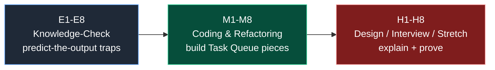

# Java Memory Model: Exercises

> Where this fits in the project: these exercises drill the memory-model muscles you use on every line of the Task Queue — how a `Task` reference is copied into a `Worker`'s stack frame, when a finished `Task` becomes garbage, why an immutable `Task` is safe to share across a `WorkerPool` without locks, and why interned task-type `String`s belong in a bounded cache. Get these wrong in production and you ship aliasing bugs, memory leaks, and data races; get them right and the platform stays correct under load.

This is the **module-level problem set** for `03-java-memory-model`. It is deliberately **interview-trap-heavy**: pass-by-value puzzles, GC-reachability reasoning, mutable-to-immutable refactors, and reference-type cache exercises. It spans all seven chapters:
[stack-vs-heap](./stack-vs-heap.md), [object-references](./object-references.md),
[pass-by-value](./pass-by-value.md), [garbage-collection](./garbage-collection.md),
[object-lifecycle](./object-lifecycle.md), [immutable-objects](./immutable-objects.md),
and [string-pool](./string-pool.md).

**Solutions live in a separate file.** Every exercise here is numbered with a stable ID — **E1–E8** (Knowledge-Check), **M1–M8** (Coding & Refactoring), **H1–H8** (Design, Interview & Stretch) — so you can grade your work against **[./solutions.md](./solutions.md)** by ID. Each `H#` is tagged with its track (`[design]`, `[interview]`, `[stretch]`).

How to use this set:

- Try every **Knowledge-Check (E1–E8)** *before* running code — these are the interview traps. Write down the predicted output **with reasoning**, then compile to verify.
- The **Coding & Refactoring (M1–M8)** exercises build real pieces of the Task Queue. Keep your code; later modules reuse `Task`, `TaskQueue`, `TaskHandler`, and the registry.
- The **Design / Interview / Stretch (H1–H8)** exercises ask you to explain out loud *and* prove it with a snippet, benchmark, or diagram.
- Difficulty: **Easy** = single concept, **Medium** = combine two concepts, **Hard** = subtle aliasing/GC/concurrency reasoning. Each exercise carries its tag.
- A scratch Maven project is enough. **Java 21**, JUnit 5 + AssertJ for the testable exercises.



Reference model used throughout (the canonical Phase-1 slice — see [phase-1](../09-project/phase-1.md)):

```java
public enum TaskStatus { PENDING, SCHEDULED, RUNNING, SUCCEEDED, FAILED, RETRYING, DEAD }

public record Task(
        String id, String type, String payload, TaskStatus status,
        int attempts, int maxAttempts,
        java.time.Instant createdAt, java.time.Instant scheduledAt, int priority) {

    public Task withStatus(TaskStatus s) {
        return new Task(id, type, payload, s, attempts, maxAttempts, createdAt, scheduledAt, priority);
    }
    public Task withIncrementedAttempt() {
        return new Task(id, type, payload, status, attempts + 1, maxAttempts, createdAt, scheduledAt, priority);
    }
}

public record TaskResult(boolean success, String message, boolean retryable) {}

@FunctionalInterface
public interface TaskHandler { TaskResult handle(Task task) throws Exception; }
```

---

## Group A — Knowledge-Check (E1–E8): predict the output, then verify

These are the traps. For each, **write your prediction and a one-line reason before compiling**. The reason is the part interviewers grade.

### E1 (Easy) — Where does each thing live: stack or heap?

For the method below, state for **each named entity** whether it lives on the **stack** or the **heap**, and why. Be careful to distinguish the *reference variable* from the *object it points at*.

```java
public TaskResult run(Task task) {
    int attempt = task.attempts();                    // (a) attempt
    String type = task.type();                        // (b) type, and the chars it points to
    Task copy = task.withStatus(TaskStatus.RUNNING);  // (c) copy
    return new TaskResult(true, "ok", false);         // (d) the returned object
}
```

Produce a table with rows (a)–(d). Then answer: when `run` returns, what is copied onto the **caller's** stack frame, and what stays on the heap? Cross-check your reasoning against [stack-vs-heap](./stack-vs-heap.md).

### E2 (Easy) — `==` vs `.equals` for `Task`

Two queries load the **same** database row into `Task a` and `Task b` (two separate `new Task(...)` allocations with identical field values).

- Is `a == b` true?
- Is `a.equals(b)` true *because `Task` is a record*?
- What changes if `Task` were a hand-written class with **no** `equals` override?

Explain the difference between *value* equality (records, all components) and *entity* equality (id only), and why a persistent entity whose `status`/`attempts` drift over time should **not** use all-field equality. (You will build the entity version in **M5**.)

### E3 (Easy) — String pool `==` puzzles

Predict the output of each line, and draw (in words) where `a`, `b`, `c`, `d` point.

```java
String a = "email";
String b = "email";
String c = new String("email");
String d = c.intern();
System.out.println(a == b);          // (1)
System.out.println(a == c);          // (2)
System.out.println(a == d);          // (3)
System.out.println(a.equals(c));     // (4)
```

State the rule for **when `==` on `String` is safe** and why it silently breaks the moment one operand comes from `new String`, a DB column, or a network read. Link [string-pool](./string-pool.md).

### E4 (Easy) — Reachability and GC eligibility

After this snippet runs, which `Task` objects are **eligible for garbage collection** at the comment? Justify object-by-object, not variable-by-variable.

```java
Task t1 = new Task("1", "email", "{}", TaskStatus.PENDING, 0, 3,
        java.time.Instant.now(), java.time.Instant.now(), 0);
Task t2 = new Task("2", "email", "{}", TaskStatus.PENDING, 0, 3,
        java.time.Instant.now(), java.time.Instant.now(), 0);
Task t3 = t1;
t1 = t2;
// <-- here
```

The trap: does `t1 = t2` "free" the id-`1` object? Then state the **one additional line** that would make the id-`1` object eligible, and clarify why *eligible* is not the same as *immediately reclaimed*. Cross-link [garbage-collection](./garbage-collection.md).

### E5 (Easy) — Pass-by-value: predict the mutation

Java is pass-by-value. Predict what each `println` shows and give the reason for each in one phrase using *copy of the reference*.

```java
static void bump(int n) { n++; }
static void retag(Task t) { t = t.withStatus(TaskStatus.RUNNING); }
static void poison(StringBuilder sb) { sb.append("!"); }

int x = 5; bump(x);                  System.out.println(x);
Task task = somePendingTask();       // status == PENDING
retag(task);                         System.out.println(task.status());
StringBuilder sb = new StringBuilder("hi"); poison(sb); System.out.println(sb);
```

Why does `poison` change what the caller sees but `retag` does not, even though both receive an object? This is the heart of [pass-by-value](./pass-by-value.md).

### E6 (Easy) — Object lifecycle states

Name, in order, the phases an object passes through from `new` to reclamation. For each phase, say whether the JVM **guarantees** it or treats it as **best-effort**. Draw the lifecycle as a Mermaid `stateDiagram-v2`.

Then answer the trap: is `finalize()` a reliable destructor like C++ `~Foo()`? What should you use instead to release a file handle, socket, or DB connection, and why? Cross-link [object-lifecycle](./object-lifecycle.md).

### E7 (Easy) — Why immutability removes locks

Two `Worker` threads pull the **same** `Task` object reference out of the queue. Explain precisely why making `Task` immutable means they need **no lock** to read it.

Your answer must cover the three ingredients of a data race and identify which one immutability removes. Then state the subtle requirement: why the fields must be `final` (records make every component `final`), and what the JLS **final-field freeze** guarantees about cross-thread visibility after a constructor completes *without leaking `this`*. Link [immutable-objects](./immutable-objects.md) and [atomics-and-thread-safety](../06-concurrency/atomics-and-thread-safety.md).

### E8 (Easy) — Stack size vs heap size failure modes

Your service crashes two different ways under two different bugs. Match each crash to (1) the memory **region**, (2) a typical **cause** in the Task Queue, and (3) the JVM **flag** that tunes it.

- **Crash A:** `java.lang.StackOverflowError`
- **Crash B:** `java.lang.OutOfMemoryError: Java heap space`

Then answer the trap that separates juniors from seniors: why is *raising the flag* (`-Xss` or `-Xmx`) almost never the real fix, and why is globally raising `-Xss` especially dangerous when you run thousands of virtual-thread workers? Cross-link [stack-vs-heap](./stack-vs-heap.md).

---

## Group B — Coding & Refactoring (M1–M8): build real Task Queue pieces

Write compilable Java 21. Add JUnit 5 + AssertJ tests where indicated. Keep all three versions of each refactor so the solutions file can compare them.

### M1 (Medium) — A leak-free bounded handler cache `[coding]`

A `Worker` looks up a `TaskHandler` by task `type`. The first cut caches handlers in a plain `HashMap<String, TaskHandler>` keyed by type. A misbehaving producer sends **millions of distinct one-off types**, so the cache grows without bound and OOMs.

Build a **bounded, leak-free** registry/cache:

- Cap the number of cached entries; evict the least-recently-used when full (hint: a `LinkedHashMap` in access-order with `removeEldestEntry`, or an explicit bound).
- API: `void register(String type, TaskHandler h)` and `Optional<TaskHandler> lookup(String type)`.
- Write a test that registers more than the cap and asserts the cache size never exceeds the bound (so it can never OOM on hostile input).

Explain in a comment **why an unbounded cache is a memory leak even though you "use" every entry once** (the entries you will never look up again are still reachable). Cross-link [garbage-collection](./garbage-collection.md).

### M2 (Medium) — Detect a self-referential leak with a heap-eligibility test `[coding]`

Write a small program plus a `WeakReference`-based assertion that **proves** an object became unreachable after you drop the last strong reference — i.e., a unit test for *"this does not leak."*

- Create a `Node` that holds a reference to **itself** (`this.self = this`) to form a cycle.
- Wrap it in a `WeakReference`, drop the only external strong reference, then loop `System.gc()` + a short `Thread.sleep` and assert `weakRef.get()` eventually returns `null`.

In your write-up, explain why this also proves Java's GC is **tracing, not reference-counting** (a refcount would leak the cycle), and why the retry loop is required rather than asserting reclamation immediately. Acknowledge that the test is **probabilistic** (`System.gc()` is a hint) and describe how you bound the flakiness ("clears within N attempts"). Cross-link [object-references](./object-references.md).

### M3 (Medium) — Fix a "pass-by-reference" bug in the `Worker` `[refactor]`

A junior wrote a `Worker.advance` that tries to mark a task `RUNNING` by reassigning the parameter. It "does nothing." First **reproduce** the bug, draw a memory diagram showing why, then fix it.

```java
// BAD: reassigns the parameter, expecting the caller to see the change.
static void advance(Task task) {
    task = task.withStatus(TaskStatus.RUNNING); // rebinds the LOCAL copy only
}
// caller:
Task t = pending();
advance(t);
// t.status() is STILL PENDING — the caller never sees RUNNING.
```

Deliverables:

1. A `stateDiagram-v2` or `flowchart` showing the caller frame, the `advance` frame, and the two heap objects, illustrating which reference points where after the reassignment.
2. The production fix as a **return-the-new-value** method (`static Task advance(Task task)` and a caller that does `t = advance(t)`).
3. A short note on why the *alternative* fix (make `Task` mutable + a setter) "works" but reintroduces the thread-safety problems immutability removed in **E7**.

Add a test asserting `advance(pending).status() == RUNNING` while the original `pending` stays `PENDING`. Cross-link [pass-by-value](./pass-by-value.md).

### M4 (Medium) — Convert stack-bound recursion to bounded iteration `[refactor]`

A recursive cumulative-backoff helper throws `StackOverflowError` when a misconfigured task sets `maxAttempts` to 500,000. Refactor it to **constant stack depth** and cap the input.

```java
// BAD: O(n) stack frames; blows up for large attempt counts.
static long cumulativeDelayMillis(int attempt, long baseMillis) {
    if (attempt <= 0) return 0;
    return baseMillis * (1L << attempt) + cumulativeDelayMillis(attempt - 1, baseMillis);
}
```

Requirements for the fixed version:

- One stack frame regardless of `attempt` (iterate).
- Cap the loop (a `1L << i` with `i > 63` is nonsense; pick a sane `MAX_ATTEMPTS`).
- **Saturate** on overflow so you never return a *negative* delay that would corrupt the `TaskScheduler`.
- Validate inputs (`attempt >= 0`, `baseMillis >= 0`).

In your write-up, state why a "DSA O(1) space" recursion is actually **O(n) stack space** on the JVM, and why `-Xss` and "tail-call hopes" are not fixes (HotSpot does **not** do tail-call optimization). Cross-link [stack-vs-heap](./stack-vs-heap.md) and the retry design in [retries](../08-distributed-systems/retries.md).

### M5 (Medium) — Entity equality keyed on identity, not all fields `[coding]`

`Task` as a record uses value equality over *all* components, which is wrong for a persistent entity whose `status`/`attempts` change. Write a `TaskEntity` whose `equals`/`hashCode` are keyed on the **immutable `id` only**, and explain when you want each style.

Requirements:

- `final String id` (identity), mutable `status`/`attempts`.
- `equals` uses `instanceof` pattern matching and compares `id` only; `hashCode` returns `id.hashCode()` (stable for the entity's whole life).
- A test proving that putting `TaskEntity` instances with the same `id` but different `status` into a `HashSet` deduplicates to size 1, and that mutating `status` after insertion does **not** lose the entry (because the hash is stable).

Pitfall to address in the write-up: why including `status`/`attempts` in `hashCode` corrupts a `HashSet`, and why overriding `equals` without `hashCode` (or vice versa) silently breaks hash-based collections. Cross-link [immutable-objects](./immutable-objects.md) and **E2**.

### M6 (Medium) — A memory-safe object pool for reusable buffers `[coding]`

Workers serialize `Task` payloads into a reusable `byte[]` buffer. Naively allocating a new buffer per task churns the young generation. Build a **bounded** pool that does not leak and never hands the same buffer to two threads.

Requirements:

- Back it with an `ArrayBlockingQueue<byte[]>` pre-filled with `poolSize` fixed-size buffers (so it cannot grow the heap unbounded).
- `byte[] acquire() throws InterruptedException` (blocks when all checked out) and `void release(byte[] buffer)` (validates the buffer belongs to the pool, never blocks).
- Show the **mandatory** `try/finally` borrow pattern so a buffer is always returned even on exception.

In the write-up, argue *when pooling is worth it* (large/expensive buffers, very high throughput) and when it is a **pessimization** (small short-lived objects, where bump-pointer allocation + generational GC is nearly free). Name the failure mode of a missed `release` (a *capability* leak that eventually deadlocks the pool). Cross-link [garbage-collection](./garbage-collection.md) and [blocking-queue](../06-concurrency/blocking-queue.md).

### M7 (Medium) — Truly immutable `Task` with a mutable field `[refactor]`

A `Task` variant must carry `List<String> tags`. A record stores the *reference*, so callers can mutate the list after construction. Make it genuinely immutable.

```java
// BROKEN immutability: the list reference is final, but its CONTENTS are not.
public record LeakyTask(String id, java.util.List<String> tags) {}

var tags = new java.util.ArrayList<>(java.util.List.of("a"));
var t = new LeakyTask("1", tags);
tags.add("evil");           // t.tags() now contains "evil" — escaped mutation!
```

Refactor to a `SafeTask` that:

- **Defensive-copies on the way in** (compact canonical constructor: copy and wrap unmodifiable).
- **Returns an unmodifiable view on the way out** (override the record accessor so callers can't mutate via the getter).

Write tests proving: (1) mutating the caller's original list after construction does not change `SafeTask`; (2) `safeTask.tags().add("x")` throws `UnsupportedOperationException`. Explain why `final` freezes the *reference*, not the *object it points at*. Cross-link [immutable-objects](./immutable-objects.md) and **M4** from the [02-core-oop exercises](../02-core-oop/exercises.md) if you've done them.

### M8 (Medium) — Unsubscribe to stop a listener leak `[refactor]`

A metrics dashboard subscribes to per-task events. Components register listeners on a long-lived `EventBus`-style registry but **never unsubscribe**, so listeners (and everything they capture) leak for the life of the process.

```java
// BAD: register-only API. Listeners (and their captured state) live forever.
public final class LeakyRegistry {
    private final java.util.List<Runnable> listeners = new java.util.ArrayList<>();
    public void subscribe(Runnable l) { listeners.add(l); } // no way to remove!
}
```

Refactor `subscribe` to return an `AutoCloseable` **subscription handle** whose `close()` removes the listener (use a `ConcurrentHashMap<Long, Runnable>` keyed by a generated id). Show the `try (var sub = registry.subscribe(...)) { ... }` usage that makes the listener's lifetime symmetric with try-with-resources.

In the write-up: explain why this is the most common heap leak in long-lived services (the registry holds a **strong** reference to each listener, and each listener captures its enclosing object); and why a `WeakReference`/`WeakHashMap` variant is the *wrong* tool for event subscriptions (a lambda with no other strong referent is collected almost immediately and events silently stop). Tie back to **E4**'s reachability reasoning. Cross-link [object-references](./object-references.md) and (Phase 4) [dead-letter-queues](../07-queues-and-messaging/dead-letter-queues.md).

---

## Group C — Design, Interview & Stretch (H1–H8): explain, then prove

For interview items, write a crisp spoken answer **and** a minimal code proof. For design/stretch items, produce code, a diagram, and a short rationale.

### H1 (Hard) — Choose a GC for the task-queue workload `[design]`

The platform runs 64 worker threads, allocates many short-lived `Task`/`TaskResult` objects, and must keep **p99 task latency low**. Pick a garbage collector, justify it against the alternatives, and name the flags you'd set.

Deliverables:

- A comparison table of **G1GC**, **ZGC**, **Parallel**, and **Serial** across pause profile, throughput, and fit for *our* workload.
- A recommendation grounded in the **generational hypothesis** ("most tasks die young").
- A concrete `java ...` launch line. Address two classic mistakes: reaching for `-XX:+UseParallelGC` "for speed" on a latency service, and leaving `-Xms != -Xmx` so the heap resizes at runtime.

Cross-link [garbage-collection](./garbage-collection.md) and [observability-and-ops](../10-system-design/observability-and-ops.md).

### H2 (Hard) — A `Cleaner`-based safety net for native handles `[design]`

A `Task` payload can reference an off-heap/native resource (say a memory-mapped temp file). `finalize()` is deprecated. Design **deterministic cleanup with a non-deterministic safety net**.

Requirements:

- A `PayloadHandle implements AutoCloseable` whose `close()` frees the resource **deterministically and exactly once**.
- A `java.lang.ref.Cleaner` registered as a *safety net only*, with the cleanup state held in a **static** class (or record) that has **no back-reference** to `PayloadHandle`.

Explain the critical trap: why a back-reference from the cleanup state to the handle makes the handle **never unreachable**, so the `Cleaner` never fires (you've recreated the `finalize()` problem). State why `Cleaner` is a net, not a plan, and that callers must still use try-with-resources. Cross-link [object-lifecycle](./object-lifecycle.md).

### H3 (Hard) — "Explain `Task t2 = t1` and what gets copied." `[interview]`

Walk an interviewer through **exactly** what happens in memory for `Task t2 = t1;`, and contrast it with `Task t2 = new Task(...);` and with a **deep copy**.

Your spoken answer (4–6 sentences) must use the words *reference variable*, *stack slot*, *address*, and *aliasing*, and must explain that after `t2 = t1` there are **two references to one heap object** (so mutating through one is visible through the other — though with an immutable record there is nothing to mutate). Then give a tiny code proof using `==` and `System.identityHashCode`. Cross-link [object-references](./object-references.md).

### H4 (Hard) — "Is Java pass-by-value or pass-by-reference?" `[interview]`

Give the **definitive** answer with a code proof.

- State that Java is **always pass-by-value**, and that for objects the *value copied is the reference*.
- Provide a proof that hinges on **reassignment**: a method that reassigns its parameter (`sb = new StringBuilder(...)`) cannot change the caller's variable, whereas one that mutates through it (`sb.append(...)`) can.
- Pre-empt the rebuttal "but I can change the object's fields, so it's by-reference" — explain why that is consistent with pass-by-value.

Cross-link [pass-by-value](./pass-by-value.md). Relate to **E5** and **M3**.

### H5 (Hard) — Diagnose an `OutOfMemoryError` in production `[interview]`

Your task-queue service throws `OutOfMemoryError: Java heap space` after running for **three days**. Walk through how you'd **diagnose and fix** it as a runbook.

Your answer must include, in order:

1. **Capture evidence before restart** (`-XX:+HeapDumpOnOutOfMemoryError -XX:HeapDumpPath=/dumps`; pull the `.hprof`).
2. **Analyze the dominator tree** in Eclipse MAT / VisualVM to find the object retaining the most heap.
3. **Identify the GC-root chain** pinning the leaked objects (a `static` collection, a never-unsubscribed listener registry, an unbounded cache — the patterns from **M1**, **M8**, **E8**).
4. **Fix the design**, not just the flag — bound the collection / add unsubscribe / cap the cache.
5. **Confirm** with a soak test or a `WeakReference` eligibility probe (the **M2** technique).

Cross-link [garbage-collection](./garbage-collection.md) and [observability-and-ops](../10-system-design/observability-and-ops.md).

### H6 (Hard) — A copy-on-write `Task` update path for concurrent workers `[design]`

Multiple workers may **read** a `Task` while one **updates** its status. Design an update path with **zero locks on the read side**, and show the state machine.

Requirements:

- Keep `Task` immutable; updates produce **new instances** via `withStatus`/`withIncrementedAttempt`.
- The single mutable cell is one `AtomicReference<Task>` that the updater swaps with a **compare-and-set** (CAS) retry loop, so a concurrent update never silently overwrites another.
- A `stateDiagram-v2` overlaying the `TaskStatus` transitions (`PENDING -> RUNNING -> SUCCEEDED | RETRYING -> SCHEDULED | FAILED -> DEAD`) with the memory reasoning (readers see a consistent snapshot; only the reference cell changes).

Discuss the tradeoff vs a `synchronized` mutable `Task`: CAS is lock-free and great under read-heavy contention but can **livelock** under extreme write contention. Cross-link [atomics-and-thread-safety](../06-concurrency/atomics-and-thread-safety.md) and [immutable-objects](./immutable-objects.md).

### H7 (Hard) — Prove escape analysis eliminates an allocation `[stretch]`

Claim: the JVM can allocate some objects on the **stack** (or eliminate them entirely) via **escape analysis**. Demonstrate the concept and explain when it applies to our code.

- Write a hot loop that allocates a short-lived `TaskResult` per iteration and **never lets it escape** the method (read a field, accumulate, discard). After JIT warmup, the allocation should be scalar-replaced or stack-allocated — i.e., ~0 bytes allocated.
- Run with diagnostic flags (or JFR / async-profiler allocation profiling) to **observe** the elimination:

```bash
java -XX:+UnlockDiagnosticVMOptions -XX:+PrintEscapeAnalysis -XX:+PrintEliminateAllocations Bench
```

- Then **break** escape analysis by storing the `TaskResult` into a field or a collection, and show allocation reappears.

Write up the implication for the worker hot path: how to keep it allocation-light so the young generation stays cheap. Cross-link [stack-vs-heap](./stack-vs-heap.md) and [garbage-collection](./garbage-collection.md).

### H8 (Hard) — A memory-aware backpressure gate for the queue `[stretch]`

The in-memory `TaskQueue` can grow until the heap OOMs under a producer burst. Build an `InMemoryTaskQueue` that applies **backpressure** — blocking producers when the queue is full — so the heap is **bounded by design**, and explain the memory reasoning.

Requirements:

- Implement the canonical interface: `void enqueue(Task t)`, `Task dequeue() throws InterruptedException`, `int size()`.
- Back it with a **bounded** `ArrayBlockingQueue<Task>` (capacity `Q`); `enqueue` should block (or offer-with-timeout) when full rather than allocate past the cap.
- Derive a back-of-envelope formula for peak retained bytes as a function of queue capacity `Q`, average `payload` size `P`, and in-flight worker count `W`, and use it to pick `Q` for a given `-Xmx`.

Write up why bounding the queue is the design-level cure for the OOM, why most `Task` objects die young (so they're cheap for a generational collector), and what changes if `payload`s are large enough to get promoted to old gen. Cross-link [backpressure](../08-distributed-systems/backpressure.md), [blocking-queue](../06-concurrency/blocking-queue.md), and [capacity-estimation](../10-system-design/capacity-estimation.md).

---

## Self-assessment checklist

Before opening the solutions, confirm you can answer **without** running code:

- [ ] Stack vs heap: the *variable* is a reference on the stack; the *object* is on the heap (E1, H3, M4).
- [ ] `==` vs `.equals` traps for `String` and entities, and the string pool (E2, E3, M5).
- [ ] Pass-by-value: what the "value" is for an object, and why reassignment never reaches the caller (E5, M3, H4).
- [ ] GC eligibility = unreachability; what a GC root is; three leak patterns and their fixes (E4, M1, M8, H5).
- [ ] Why immutable objects are thread-safe for free, and what `final` fields guarantee (E7, M7, H6).
- [ ] Stack vs heap failure modes (`StackOverflowError` vs `OutOfMemoryError`) and that tuning flags ≠ fixes (E8, M4, H5).
- [ ] Lifecycle phases, why `finalize` is unreliable, and the `Cleaner`/`AutoCloseable` pattern (E6, H2).
- [ ] How escape analysis, generational GC, and backpressure keep the worker loop allocation-cheap and bounded (H1, H7, H8).

---

## What We Can Improve In Our Project Using This Concept

Working these exercises directly upgrades the Task Queue codebase:

- **Make `Task` immutable with withers** (M3, M7, H6) so the *same* object is safe to hand to multiple `Worker` threads in the `WorkerPool` without locks — the highest-leverage memory-model decision in Phase 1.
- **Bound every long-lived collection** — the handler cache (M1), the `EventBus` listener registry (M8) — so the service does not leak across its weeks-long uptime; back it with the runbook in H5.
- **Bound the queue itself** (H8) so a producer burst applies backpressure instead of OOMing the heap.
- **Cap and saturate retry math** (M4) so a misconfigured `maxAttempts` cannot overflow the stack or produce negative delays.
- **Key entity identity on `id`** (M5) so `Task` rows behave correctly in hash-based collections as their state mutates.

## Project Refactoring Task

Apply **M3 + M7 + M8 + H8** together as one coherent refactor on the Phase-1 codebase:

1. Convert any mutating `Worker.advance`-style code to **return-the-new-value** using the immutable `Task` withers.
2. Make any tag/metadata-carrying `Task` variant **defensively copy** its collections in and out (M7).
3. Replace the register-only `EventBus`/listener API with an **`AutoCloseable` subscription** (M8).
4. Swap the unbounded in-memory queue for the **bounded, backpressuring** `InMemoryTaskQueue` (H8).
5. Add tests proving (a) no shared-mutable aliasing remains, (b) the original `Task` is never mutated by a transition, (c) unsubscribing makes the listener GC-eligible (the M2 weak-ref probe).

## Git Commit For This Chapter

```text
refactor(memory): immutable Task updates, bounded caches/queue, leak-free listeners

- Replace Worker.advance mutation with return-the-new-value over immutable Task withers (M3)
- Defensive-copy collection-carrying Task variants in/out; unmodifiable accessors (M7)
- Bound the handler cache (LRU cap) and convert listener registry to AutoCloseable subscriptions (M1, M8)
- Replace unbounded in-memory queue with a backpressuring ArrayBlockingQueue-backed InMemoryTaskQueue (H8)
- Cap + saturate cumulative backoff math; iterative, overflow-safe (M4)
- equals/hashCode on TaskEntity keyed by id only for stable hashing (M5)
- Tests: pass-by-value semantics, weak-ref GC eligibility, immutability of transitions, defensive copies

Files touched:
  src/main/java/.../domain/Task.java
  src/main/java/.../domain/TaskEntity.java
  src/main/java/.../worker/Worker.java
  src/main/java/.../queue/InMemoryTaskQueue.java
  src/main/java/.../registry/HandlerCache.java
  src/main/java/.../events/Registry.java
  src/main/java/.../retry/Backoff.java
  src/test/java/.../memory/MemoryModelTest.java
```

## Architecture Impact

Choosing immutability for `Task` (M3, M7, H6) changes the platform's concurrency contract: workers share read-only objects, so the queue and worker pool need **no locks on task state** — only the queue's internal buffer is synchronized, and `AtomicReference` CAS handles the rare concurrent update. Bounding the handler cache, the listener registry, and the queue (M1, M8, H8) keeps the heap flat across long uptimes, which keeps GC pauses short and predictable — a prerequisite for the latency SLOs set in [scaling-the-platform](../10-system-design/scaling-the-platform.md) and the GC choice in **H1**. Backpressure on the queue turns an unbounded-growth OOM into a producer-side wait, making the system degrade gracefully under load.

## Interview Takeaways

- Java is **pass-by-value**; for objects the value is a **copy of the reference**, so you can mutate the pointed-to object but never rebind the caller's variable (E5, M3, H4).
- A **memory leak in a GC'd language is unintentional reachability** — a live GC root pinning objects you no longer need (E4, M1, M8, H5).
- **Immutable objects are thread-safe for free**, and `final` fields provide the JLS **safe-publication** guarantee without synchronization (E7, M7, H6).
- Know the **`==` vs `.equals`** traps cold: string literals are interned, `new String` is not; prefer entity equality keyed on `id` for things with a database row (E2, E3, M5).
- **Stack vs heap failures are different bugs** (`StackOverflowError` vs `OutOfMemoryError`) and *tuning flags rarely fix them* — convert recursion to iteration, bound your collections (E8, M4, H5).
