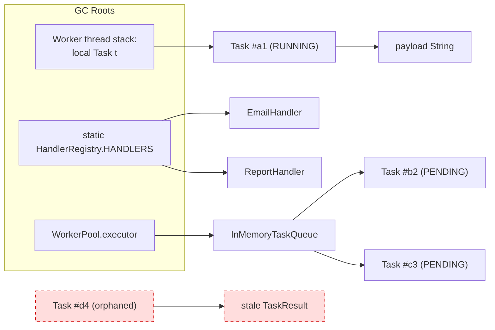
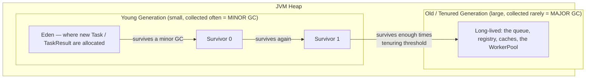
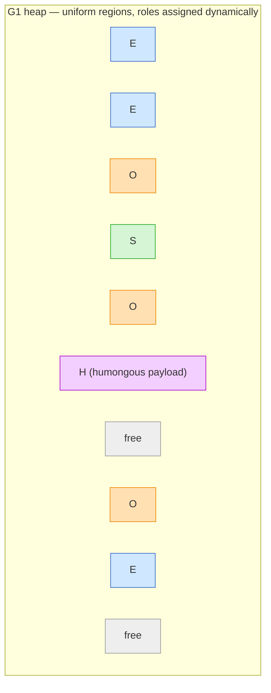
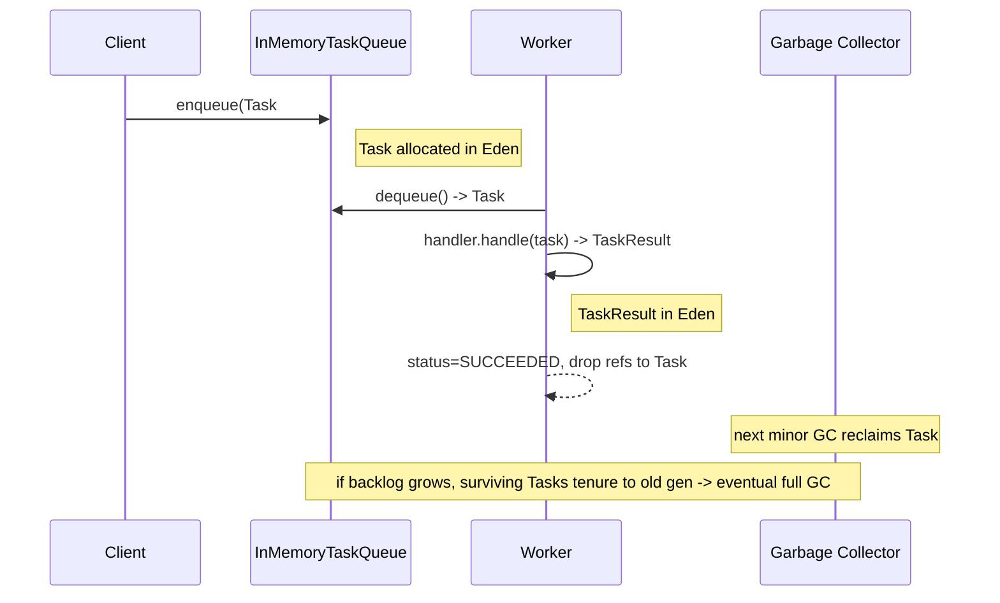
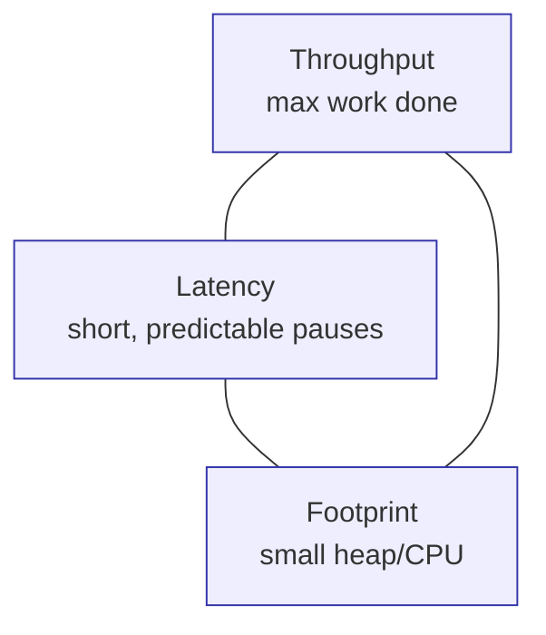

# Garbage Collection

> Where this fits in the project: every `Task` our API accepts, every `TaskResult` a `Worker` produces, every byte of JSON payload lives on the JVM heap. The garbage collector decides when that memory is reclaimed — and *when it pauses the world to do so*. For a latency-sensitive task queue that promises sub-100ms enqueue and predictable processing, a 400ms full-GC pause is not a curiosity; it is an SLA violation, a pile of timed-out HTTP requests, and a backlog of un-dequeued tasks. This chapter teaches how the GC works, how to observe it, how to tune it, and how a lingering reference in an `InMemoryTaskQueue` or a handler registry turns into a slow OutOfMemoryError.

This chapter is the *engine room* of the memory model. [stack-vs-heap.md](./stack-vs-heap.md) told you *where* objects live; [object-references.md](./object-references.md) told you how references point at them; [object-lifecycle.md](./object-lifecycle.md) traced a single object from birth to eligibility. Here we answer the remaining question: **once an object is unreachable, who reclaims its memory, when, and at what cost?**

---

## 1. Why this exists — the real problem it solves

In C, you call `malloc` and `free`. Forget a `free` and you leak; `free` twice and you corrupt the heap; `free` too early and you have a use-after-free that a security researcher will later name. Manual memory management is a permanent tax on every programmer and a permanent source of CVEs.

Java's bet, made in 1995, was: **let the runtime track which objects are still reachable and reclaim the rest automatically.** You allocate with `new`; you never free. This eliminates an entire bug class. The price you pay is twofold, and both halves of the price are the subject of this chapter:

1. **You give up control over *when* memory is freed.** The GC runs on its own schedule. An object can be unreachable for milliseconds or seconds before its memory is actually reclaimed.
2. **Reclamation costs CPU and, classically, *pause time*.** To safely reclaim memory the collector often must stop your application threads — a *stop-the-world* (STW) pause. For a batch job nobody notices. For a request-serving backend with a p99 latency budget, every STW pause is a spike on your latency graph.

> Historical note: the tradeoff has been relentlessly attacked for 30 years. Serial GC (1996) stopped every thread for the whole collection. Parallel GC (2004) used multiple threads to shorten the pause. CMS (2004, removed in JDK 14) tried to do most marking concurrently. **G1** (production default since JDK 9, 2017) made pauses *predictable* by collecting the heap in regions and targeting a pause goal. **ZGC** and **Shenandoah** (production-ready ~2019–2021) push pauses below 1ms by doing almost everything — including compaction — concurrently. The arc of GC history bends toward *shorter, more predictable pauses*, because that is exactly what backends like our task queue need.

The core insight that makes automatic collection possible:

> **An object is garbage if and only if it is unreachable from the GC roots.** If no live thread, no active stack frame, and no static field can reach an object by following references, your program can never touch it again — so its memory is safe to reclaim.

This is a precise, decidable property (reachability in a directed graph), which is why a machine can compute it. It is *not* the same as "the object is no longer useful" — and that gap is exactly where memory leaks live (Section 11).

---

## 2. GC roots and reachability

The GC builds a graph: nodes are objects, edges are references. It starts from a fixed set of **GC roots** and marks everything reachable. Whatever is left unmarked is garbage.

GC roots include:

- **Local variables and operand-stack entries** of every currently executing method, on every thread's stack.
- **Static fields** of loaded classes (e.g. a `static final Map` registry).
- **Active threads** themselves and thread-local variables.
- **JNI / native references** held by native code.
- **Synchronization monitors** held by `synchronized` blocks.



`Task #d4` and the `stale TaskResult` it points at form an *island*: they reference each other but nothing reachable from a root references them. **Reachability is transitive but islands are still garbage** — this is why Java does not leak on reference cycles the way naive reference-counting does. A cycle with no external root reference is collectible.

> Key consequence for our project: a `Task` is collectible the instant the *last* root-reachable chain to it is broken. If `InMemoryTaskQueue` still holds it, it is alive. If a `WorkerPool` thread still has it as a stack local, it is alive. If a `Map<String, Task> inFlight` still has its id mapped to it, it is alive — *even if you intend it to be done*. Holding a reference you never use again is the leak.

---

## 3. The naive version — stop-the-world mark-and-sweep over the whole heap

The simplest correct collector. Conceptually:

```text
1. Stop every application thread (STW).
2. MARK:  starting from GC roots, walk the reference graph, set a "marked" bit on every reachable object.
3. SWEEP: scan the entire heap; any object without the marked bit is freed (added to a free list).
4. Resume application threads.
```

```java
// Pseudocode of a naive single-heap mark-sweep collector.
// This is NOT how the JVM is structured; it shows the limitation.
final class NaiveCollector {
    void collect(Heap heap, Set<Object> roots) {
        // ---- STOP THE WORLD ---- all app threads frozen here ----
        Deque<Object> grey = new ArrayDeque<>(roots);
        while (!grey.isEmpty()) {                 // MARK
            Object o = grey.pop();
            if (heap.mark(o)) {                   // returns false if already marked
                grey.addAll(heap.referencesOf(o));
            }
        }
        for (Object o : heap.allObjects()) {      // SWEEP — scans the WHOLE heap
            if (!heap.isMarked(o)) heap.free(o);
            else heap.clearMark(o);
        }
        // ---- RESUME THE WORLD ----
    }
}
```

**Why this hurts a task queue:**

- **Pause scales with live-set size *and* heap size.** Mark cost ∝ live objects; sweep cost ∝ total heap. A 16GB heap means a long sweep, regardless of how few objects survive. With our queue holding hundreds of thousands of `Task` objects under load, that is a multi-hundred-millisecond freeze.
- **Fragmentation.** Sweep leaves freed memory in scattered gaps. Allocating a fresh `Task` whose payload is a 50KB JSON string may fail to find a contiguous gap even though total free memory is ample → premature OOM or expensive free-list searches.
- **Every collection touches everything.** It ignores the single most important empirical fact about object lifetimes.

That empirical fact is the **generational hypothesis**, and it is the key to every improvement below.

---

## 4. Improved version — generational GC (young + old)

Decades of measurement show:

> **The weak generational hypothesis: most objects die young.** A huge fraction of allocations are short-lived (loop temporaries, intermediate `TaskResult`s, parsed JSON nodes). A small fraction live a long time (the queue itself, the handler registry, caches).
>
> **The strong hypothesis (corollary): old objects rarely reference young ones.**

If most objects die young, collecting *only the young area* reclaims most garbage for a fraction of the work. So the heap is split:



- **Eden** — almost all `new` allocations land here. Allocation is a near-free *pointer bump* (move a pointer forward in a thread-local allocation buffer, a TLAB).
- **Survivor spaces (S0/S1)** — objects that survive a minor GC are copied here. Two spaces let the collector *copy* live objects from one to the other (and from Eden), which simultaneously **compacts** them (no fragmentation) and is cheap because it only touches *live* objects, not dead ones.
- **Old generation** — objects that survive enough minor GCs (the *tenuring threshold*) are *promoted* here.

### Minor vs major vs full GC

| Term | What it collects | Frequency | Typical pause |
| --- | --- | --- | --- |
| **Minor GC** | Young generation only (Eden + one survivor) | Frequent (seconds) | Short — copies only young survivors |
| **Major GC** | Old generation | Infrequent | Longer — much more live data |
| **Full GC** | Entire heap (young + old) + often metaspace, usually compacting | Rare, often a warning sign | Longest — can be seconds on a big heap |

> Terminology caution: "major" and "full" are used loosely and inconsistently across collectors and blog posts. The distinction that *matters operationally* is **young-only collection (cheap, frequent) vs whole-heap collection (expensive, rare)**. When you see frequent *full* GCs in your logs, something is wrong — usually a leak or an undersized heap.

### The cross-generational reference problem and the card table

If a minor GC only scans the young generation, how does it know an *old* object holds the last reference to a *young* object? If it ignored that, it would wrongly free a live object.

Solution: the **write barrier** + **card table / remembered set**. Every time application code writes a reference into a field (`oldObj.field = youngObj`), a tiny piece of injected code (the write barrier) marks the card (a ~512-byte region) containing `oldObj` as "dirty." During a minor GC the collector treats dirty old-gen cards as additional roots. This is why generational GC works without scanning the whole old generation on every minor GC — and it is why excessive mutation of long-lived objects (e.g. constantly rewriting fields of a long-lived cache) has a hidden GC cost.

### Copying collection beats mark-sweep for the young gen

The young generation uses **copying collection**, not mark-sweep:

```text
MARK + COPY (young gen):
  - From roots (+ dirty cards), find live young objects.
  - COPY each live object into the empty survivor space (or old gen if tenuring).
  - The entire Eden + source survivor is now declared empty in O(1) — just reset the pointer.
Cost is proportional to LIVE data only. Dead objects cost nothing.
And the destination is compact: zero fragmentation.
```

Because most young objects are dead, "cost ∝ live data" is exactly the win the generational hypothesis predicts.

---

## 5. Production-quality version — G1, and an overview of ZGC

### G1GC (Garbage-First) — the default since JDK 9

G1 keeps generations *logically* but abandons the fixed contiguous young/old layout. It divides the heap into ~2048 equal **regions** (1–32MB each). A region is dynamically tagged as Eden, Survivor, Old, or **Humongous** (for objects ≥ half a region — e.g. an enormous task payload).



What makes G1 production-grade for our queue:

- **Pause-time target.** You set `-XX:MaxGCPauseMillis=200` (the goal, not a guarantee). G1 estimates how many regions it can collect within that budget and collects the ones with the **most garbage first** ("garbage-first" → maximum reclamation per millisecond of pause). This trades *throughput* for *predictability* — exactly the trade a latency-sensitive backend wants.
- **Incremental compaction.** Because it evacuates live objects out of collected regions, G1 compacts as it goes. No long fragmentation-induced full GC under normal operation.
- **Mostly-concurrent old-gen marking.** A concurrent marking cycle runs alongside your threads to find old-gen garbage; only short evacuation pauses are STW.
- **Humongous handling.** Objects spanning multiple regions get special treatment. Allocating many huge payloads can fragment humongous regions and trigger full GCs — a real concern if our `Task.payload` can be megabytes. Prefer streaming/compressing big payloads or storing them out of heap.

### ZGC and Shenandoah — sub-millisecond pauses

When even G1's tens-of-milliseconds pauses are too much (think: a queue fronting a real-time bidding system), **ZGC** (`-XX:+UseZGC`) and **Shenandoah** target **< 1ms pauses regardless of heap size** — they scale to terabyte heaps. They achieve this by doing the expensive work — *including relocation/compaction* — **concurrently** with application threads, using:

- **Load barriers / colored pointers (ZGC)** — a check on every reference load that lets the collector relocate objects while the app runs and fix up pointers lazily.
- Pauses bounded by root-scanning, not by heap size.

The cost: ZGC/Shenandoah consume more CPU and memory bandwidth (the barriers run on every access) and historically gave up some peak throughput versus G1/Parallel. With **generational ZGC** (production in JDK 21, our target) much of that throughput gap closed, making it a serious default candidate for latency-critical services.

| Collector | Flag | Pause profile | Best for |
| --- | --- | --- | --- |
| Serial | `-XX:+UseSerialGC` | Long STW, single-threaded | Tiny heaps, CLIs, containers with 1 CPU |
| Parallel | `-XX:+UseParallelGC` | STW but parallel; best **throughput** | Batch jobs that don't care about latency |
| G1 (default) | `-XX:+UseG1GC` | Predictable, target-driven, tens of ms | **Most backends — our queue's default** |
| ZGC (gen.) | `-XX:+UseZGC` | **< 1ms**, heap-size-independent | Latency-critical, large heaps |
| Shenandoah | `-XX:+UseShenandoahGC` | < 1ms, concurrent compaction | Same niche; OpenJDK builds |

---

## 6. Code walkthrough — observing GC from inside the JVM

### Beginner: watch the young generation churn

`new` is cheap; *surviving* is what costs. This program allocates a flood of short-lived `Task`-like objects and prints how memory rises and falls as minor GCs reclaim them.

```java
import java.time.Instant;

public class GcChurnDemo {

    // A small slice of our canonical Task — enough to allocate realistically.
    record MiniTask(String id, String type, String payload, Instant createdAt) {}

    public static void main(String[] args) {
        Runtime rt = Runtime.getRuntime();
        for (int round = 0; round < 5; round++) {
            // Allocate a million short-lived tasks. Each dies almost immediately:
            // nothing outside the loop references them, so they are pure young-gen garbage.
            for (int i = 0; i < 1_000_000; i++) {
                MiniTask t = new MiniTask(
                        "id-" + i, "email",
                        "{\"to\":\"user" + i + "@example.com\"}", Instant.now());
                if (t.id().isEmpty()) System.out.println("never happens"); // touch it so JIT can't elide
            }
            long usedMb = (rt.totalMemory() - rt.freeMemory()) / (1024 * 1024);
            System.out.printf("round %d: heap used = %d MB%n", round, usedMb);
        }
    }
}
```

Run it and *see* the collector work:

```bash
# Unified GC logging (JDK 9+). Watch minor GCs fire and reclaim Eden.
java -Xlog:gc -Xmx256m GcChurnDemo
```

```text
[0.031s][info][gc] GC(0) Pause Young (Normal) (G1 Evacuation Pause) 132M->2M(256M) 3.114ms
[0.061s][info][gc] GC(1) Pause Young (Normal) (G1 Evacuation Pause) 134M->2M(256M) 2.870ms
...
```

The takeaway: heap shoots up to ~132M then collapses to ~2M in a few milliseconds. Millions of objects, near-zero survivors, tiny pause — that is generational GC monetizing the "most objects die young" hypothesis.

### Intermediate: surviving objects get promoted, pauses get longer

Now keep references so objects *survive* and get tenured. The same allocation volume costs far more because every object must be copied through survivor spaces and into the old gen.

```java
import java.util.ArrayList;
import java.util.List;

public class GcPromotionDemo {
    record MiniTask(String id, byte[] payload) {}

    public static void main(String[] args) {
        // A long-lived list: every task we add stays reachable -> survives -> promotes to old gen.
        List<MiniTask> retained = new ArrayList<>();
        for (int i = 0; i < 2_000_000; i++) {
            retained.add(new MiniTask("id-" + i, new byte[64]));
            if (i % 250_000 == 0) {
                System.out.printf("retained=%,d%n", retained.size());
            }
        }
        System.out.println("done; retained " + retained.size() + " tasks");
    }
}
```

```bash
# Detailed logging: tag young vs full, show heap regions and promotion.
java -Xlog:gc*,gc+heap=debug -Xmx512m GcPromotionDemo
```

You will see minor pauses lengthen and eventually old-gen ("major") activity appear, because the survivors must be marched into the old generation. **Lesson for the queue: an unbounded `InMemoryTaskQueue` is exactly this program.** If producers outrun consumers, retained `Task` objects flood the old gen and you march toward a full GC and then an OOM. This is the case for a *bounded* `BlockingQueue` and backpressure (see [../06-concurrency/blocking-queue.md](../06-concurrency/blocking-queue.md) and [../08-distributed-systems/backpressure.md](../08-distributed-systems/backpressure.md)).

### Production-inspired: measure GC impact on dequeue latency

A staff engineer does not guess about pauses — they *measure* them programmatically via the `GarbageCollectorMXBean` and correlate with their own latency metrics.

```java
import java.lang.management.GarbageCollectorMXBean;
import java.lang.management.ManagementFactory;
import java.util.List;

/**
 * Wraps a TaskQueue dequeue loop and attributes observed latency spikes to GC pauses.
 * In production you would push these into Micrometer (see metrics chapters) instead of printing.
 */
public final class GcAwareDequeueMonitor {

    private final List<GarbageCollectorMXBean> gcBeans =
            ManagementFactory.getGarbageCollectorMXBeans();

    /** Snapshot of cumulative GC counters across all collectors (young + old). */
    record GcSnapshot(long totalCount, long totalTimeMs) {
        static GcSnapshot capture(List<GarbageCollectorMXBean> beans) {
            long count = 0, time = 0;
            for (GarbageCollectorMXBean b : beans) {
                count += Math.max(0, b.getCollectionCount());
                time  += Math.max(0, b.getCollectionTime());
            }
            return new GcSnapshot(count, time);
        }
        GcSnapshot minus(GcSnapshot other) {
            return new GcSnapshot(totalCount - other.totalCount, totalTimeMs - other.totalTimeMs);
        }
    }

    /** Run one unit of work, returning the result; print if a GC overlapped it. */
    public <T> T timed(java.util.function.Supplier<T> unitOfWork) {
        GcSnapshot before = GcSnapshot.capture(gcBeans);
        long start = System.nanoTime();
        T result = unitOfWork.get();
        long elapsedMicros = (System.nanoTime() - start) / 1_000;
        GcSnapshot delta = GcSnapshot.capture(gcBeans).minus(before);
        if (delta.totalCount() > 0) {
            System.out.printf(
                "unit took %d us; %d GC(s) ran during it for %d ms — latency likely GC-attributable%n",
                elapsedMicros, delta.totalCount(), delta.totalTimeMs());
        }
        return result;
    }

    public static void main(String[] args) {
        var monitor = new GcAwareDequeueMonitor();
        // Simulate a dequeue+process loop; allocate garbage so GC actually fires.
        for (int i = 0; i < 100; i++) {
            monitor.timed(() -> {
                byte[] junk = new byte[2_000_000]; // simulate per-task allocation pressure
                junk[0] = 1;
                return junk.length;
            });
        }
    }
}
```

This is the production pattern: **never report raw latency without GC attribution.** When p99 dequeue latency spikes, the first question is "was a GC pause overlapping that request?" The `GarbageCollectorMXBean` (or the JFR `jdk.GarbageCollection` event) gives you the answer instead of a guess. In Phase 3 we wire these counters into Micrometer/Prometheus (see [../10-system-design/observability-and-ops.md](../10-system-design/observability-and-ops.md)).

---

## 7. How this applies to our Task Queue project

The canonical model maps directly onto generations and onto leak risks:

| Canonical type | Typical lifetime | Generation it ends up in | GC concern |
| --- | --- | --- | --- |
| `Task` (in flight) | Short — enqueue → dequeue → execute | Young, ideally never promoted | Healthy: dies young after `SUCCEEDED` |
| `Task` (queued, backlogged) | As long as the backlog | Promoted to old gen | **Backlog = old-gen growth = full-GC risk** |
| `TaskResult` | Very short — created, inspected, discarded | Young | Healthy churn |
| `payload` (JSON string/bytes) | Tied to its `Task` | Young or **Humongous** if large | Big payloads → humongous regions → full GC |
| `InMemoryTaskQueue` (the `BlockingQueue`) | Whole process | Old gen | Itself fine; what it *holds* is the leak surface |
| `HandlerRegistry` (`static Map<String,TaskHandler>`) | Whole process (a GC root!) | Old gen | A registry that never evicts = classic leak source |
| `WorkerPool` / `ExecutorService` | Whole process | Old gen | Fine; threads are roots, so anything a worker stack-references is pinned |

Two project-specific GC rules fall out of this:

1. **Keep `Task` objects short-lived.** The fast path — enqueue, immediately dequeue, process, drop — keeps tasks in the young generation where collection is nearly free. Anything that *retains* tasks (a forgotten `inFlight` map, an unbounded queue, a metrics buffer that keeps every `TaskResult`) drags them into the old generation and turns frequent cheap minor GCs into rare expensive full GCs.
2. **A bounded queue is a GC strategy, not just a concurrency one.** Bounding `InMemoryTaskQueue` caps how much can be retained, which caps old-gen growth, which caps full GCs. Backpressure protects latency at *two* layers: the application (don't overload workers) and the GC (don't flood the old gen).



---

## 8. Tradeoffs — honest engineering tradeoffs

GC tuning is a three-way tension. You cannot maximize all three; you choose which to sacrifice.



| You optimize for | Pick | You give up |
| --- | --- | --- |
| Raw throughput (batch, ETL) | Parallel GC, large young gen | Pause predictability — long STW is fine for batch |
| Predictable latency (our queue) | G1 with a pause target | ~5–15% throughput vs Parallel; more CPU on barriers |
| Ultra-low latency (real-time) | ZGC / Shenandoah | More CPU and memory bandwidth on load barriers |
| Tiny footprint (FaaS, sidecars) | Serial GC, small heap | Both throughput and latency at scale |

Other honest tradeoffs:

- **Bigger heap → fewer GCs but longer ones.** A 32GB heap collects less often but a full GC on it (with a non-concurrent collector) can freeze you for seconds. With G1/ZGC the relationship is gentler, but "just add RAM" is not free.
- **Generational GC assumes the hypothesis holds.** If your workload is *anti-generational* — most objects are long-lived (a giant in-memory cache, a huge retained queue) — the young gen buys you little and you pay write-barrier cost for nothing. Profile before assuming.
- **Allocation is cheap; *retention* is expensive.** Counterintuitive to C programmers: in Java, churning short-lived objects is often *faster* than pooling them, because pooled objects survive, promote, and add to old-gen GC cost. Object pooling is usually a premature pessimization — use it only for genuinely expensive-to-create resources (threads, connections), never for plain `Task`/`TaskResult` values.

---

## 9. Common mistakes and pitfalls

- **Treating `System.gc()` as a tool.** It is a *suggestion* the JVM may ignore, and when honored it usually forces a full STW collection — the opposite of what a latency-sensitive service wants. Disable accidental calls with `-XX:+DisableExplicitGC`. Fix: never call it; tune the heap instead.
- **Believing "unreachable = collected immediately."** Eligibility is not collection. Memory stays used until the next GC reclaims it; under low allocation pressure that may be a long time. Fix: don't write logic that depends on prompt collection.
- **Pooling plain value objects to "avoid GC."** Pooling `Task`/`TaskResult` keeps them alive, promotes them, and *increases* GC cost while adding bugs (stale state, thread-safety). Fix: let short-lived objects die young.
- **Mutating long-lived objects in a hot loop.** Every reference write into an old-gen object dirties a card and adds minor-GC scan work. A frequently-rewritten long-lived cache is a hidden GC tax. Fix: prefer immutable young objects (see [immutable-objects.md](./immutable-objects.md)) on hot paths.
- **Huge payloads → humongous regions.** With G1, a `Task.payload` larger than half a region forces humongous allocation; many of these fragment the heap and trigger full GCs. Fix: cap payload size, store large blobs out of heap or in object storage, keep only a reference in the `Task`.
- **Confusing a leak with an undersized heap.** Both show rising memory and frequent full GCs. Fix: take a heap histogram (`jmap -histo`) — a true leak shows *one* class growing without bound; an undersized heap shows healthy proportions but no headroom.
- **Tuning before measuring.** Copy-pasting "magic" GC flags from a blog usually makes things worse. Fix: enable GC logging, establish a baseline, change one flag, measure.

---

## 10. Refactoring exercise — a leaking in-flight registry

A frequent real bug: tracking in-flight tasks in a `Map` for status lookups, but forgetting to remove entries. The queue runs for hours, then OOMs.

### Bad — entries are never removed

```java
import java.util.Map;
import java.util.concurrent.ConcurrentHashMap;

// BAD: in-flight tracking that leaks. Every task ever seen stays in the map forever.
public final class LeakyTaskTracker {
    // This map is reachable from a long-lived service -> a GC root chain -> nothing here is ever collectible.
    private final Map<String, Task> inFlight = new ConcurrentHashMap<>();

    public void onStart(Task t) {
        inFlight.put(t.id(), t);   // added on start...
    }

    public void onFinish(Task t) {
        // BUG: we forgot to remove. The map grows by one per task, forever.
        // Tasks promote to old gen, full GCs get frequent, then OutOfMemoryError.
    }

    public Task lookup(String id) { return inFlight.get(id); }
}
```

The `Task` is logically dead — succeeded, no one cares — but it is *reachable* through `inFlight`, so the GC cannot reclaim it. Reachable-but-useless is the textbook Java leak.

### Improved — remove on completion

```java
import java.util.Map;
import java.util.concurrent.ConcurrentHashMap;

// BETTER: symmetric put/remove. Entries leave the map when the task completes,
// so completed Tasks become unreachable and die young.
public final class BoundedTaskTracker {
    private final Map<String, Task> inFlight = new ConcurrentHashMap<>();

    public void onStart(Task t)  { inFlight.put(t.id(), t); }
    public void onFinish(Task t) { inFlight.remove(t.id()); }  // the fix: break the reference
    public Task lookup(String id) { return inFlight.get(id); }
}
```

Better, but fragile: if `onFinish` is skipped because a worker crashed mid-task or an exception bypassed the cleanup, the entry leaks again. We want the leak to *self-heal* even when our bookkeeping is imperfect.

### Production-quality — bounded, self-evicting, and observable

```java
import com.github.benmanes.caffeine.cache.Cache;
import com.github.benmanes.caffeine.cache.Caffeine;
import java.time.Duration;
import java.util.Optional;

/**
 * Production in-flight registry for the Task Queue.
 *
 * Defenses against the leak, in layers:
 *  1) maximumSize  -> hard cap: the registry can never grow without bound, even if onFinish is never called.
 *  2) expireAfterWrite -> time bound: a crashed worker's entry self-evicts after a grace period.
 *  3) recordStats  -> observability: we can alarm on hit/eviction rates (wired into Micrometer in Phase 3).
 *
 * Caffeine entries are evicted, breaking the reference, so evicted Tasks become collectible.
 */
public final class InFlightRegistry {

    private final Cache<String, Task> inFlight;

    public InFlightRegistry(long maxConcurrent, Duration staleAfter) {
        this.inFlight = Caffeine.newBuilder()
                .maximumSize(maxConcurrent)          // hard upper bound on retained Tasks
                .expireAfterWrite(staleAfter)        // self-heal if onFinish never runs
                .recordStats()                       // expose eviction/hit metrics
                .build();
    }

    public void onStart(Task t)  { inFlight.put(t.id(), t); }
    public void onFinish(Task t) { inFlight.invalidate(t.id()); }

    public Optional<Task> lookup(String id) {
        return Optional.ofNullable(inFlight.getIfPresent(id));
    }

    /** Exposed for the metrics layer: a climbing eviction count signals leaked / stuck tasks. */
    public long evictionCount() { return inFlight.stats().evictionCount(); }
    public long size()          { return inFlight.estimatedSize(); }
}
```

The progression — *never remove* → *remove on success* → *bounded + time-expiring + observable* — is the same maturity curve as the rest of the curriculum: correctness first, then resilience to your own bugs, then visibility. The production version cannot leak unbounded memory even if every other safeguard fails, because `maximumSize` is a hard ceiling enforced by eviction, which breaks the reference and lets GC do its job.

---

## 11. Memory leaks in a queue or registry — the Java way to leak

You *can* leak memory in a garbage-collected language. A "leak" in Java is not unreachable memory the GC missed — it is **reachable memory you will never use again.** The GC is correct to keep it; the bug is that *you* hold the reference.

The four classic leak shapes, all present in a task queue:

1. **The unbounded collection.** An `InMemoryTaskQueue` with no capacity bound, or an ever-growing `List<TaskResult>` "audit log" in memory. Fix: bound it; spill old data to disk/DB.
2. **The lapsed listener / forgotten registry entry.** Subscribing a `TaskEventListener` to the `EventBus` (Phase 4) and never unsubscribing, or the `inFlight` map of Section 10. The listener/entry is held by the bus/map forever. Fix: symmetric register/unregister, or weak references, or bounded caches.
3. **The static field that never lets go.** A `static Map` cache (a `HandlerRegistry` that also caches results) accumulating entries. Statics are GC roots — anything they hold lives for the whole process. Fix: bounded cache with eviction.
4. **The pinned-by-thread reference.** A long-lived `Worker` thread whose stack local still references a huge object, or a `ThreadLocal<Task>` never cleared on a pooled thread. The thread is a GC root, so the object is pinned for the thread's life. Fix: clear thread-locals in a `finally`; don't stash large objects in long-lived stack frames.

Diagnosing one:

```bash
# 1. Confirm it's a leak, not just a small heap: watch heap-after-full-GC trend UP over hours.
java -Xlog:gc:file=gc.log -Xmx1g -jar taskqueue.jar

# 2. Take a live histogram — a leak shows ONE class climbing without bound.
jmap -histo:live <pid> | head -20

# 3. Capture a heap dump and open it in a tool (Eclipse MAT, VisualVM) to find the dominator tree:
jmap -dump:live,format=b,file=heap.hprof <pid>
# In MAT: "Path to GC Roots" on the leaking class tells you exactly which map/list/thread pins it.
```

> Why this hurts a *latency-sensitive* queue specifically: a slow leak doesn't just end in OOM. Long before the crash, the old generation fills, full GCs grow frequent, and each full GC is a multi-hundred-millisecond STW pause. Your p99 enqueue/dequeue latency degrades for *hours* before anything crashes. The leak's first symptom is a latency-SLA breach, not an OutOfMemoryError. Catch it on the GC-pause graph, not in the crash log.

---

## 12. Stop-the-world pauses and why they hurt our queue

A STW pause freezes *every* application thread at a **safepoint** so the collector can move objects and update references without races. During the pause:

- No HTTP request to `POST /tasks` is being served — they queue in the OS socket backlog or time out.
- No `Worker` is dequeuing — task throughput drops to zero for the pause duration.
- Any timeout measured *across* the pause (a client's 200ms read timeout, a `Future.get(timeout)`) can spuriously expire, manufacturing retries and duplicate work.

```mermaid
gantt
    title Dequeue latency vs GC pauses (illustrative)
    dateFormat X
    axisFormat %Lms
    section Worker
    process task   :0, 5
    process task   :5, 10
    BLOCKED at safepoint (full GC) :crit, 10, 410
    process task   :410, 415
    section Effect
    requests timing out :crit, 10, 410
```



The mitigation hierarchy, in the order a staff engineer applies it:

1. **Allocate less / retain less.** The cheapest pause is the GC that never runs. Bound the queue, drop large payloads out of heap, avoid pooling that pins objects, prefer streaming.
2. **Right-size the heap and young gen.** Too-small young gen → constant minor GCs; too-small heap → frequent full GCs. Give the young gen room so most garbage dies there.
3. **Pick a pause-oriented collector.** G1 with a sane `MaxGCPauseMillis`; escalate to ZGC if even tens of ms violate the SLA.
4. **Make latency GC-aware.** Report and alarm on GC pause time (Section 6); exclude or annotate GC-overlapping requests so you debug the right thing.

---

## 13. Tuning basics

> Rule zero: **measure, change one thing, measure again.** Never paste a wall of flags.

Essential, defensible flags for our queue's services:

```bash
java \
  -Xms4g -Xmx4g \                       # fix heap size: equal min=max avoids runtime resizing pauses
  -XX:+UseG1GC \                        # explicit default; predictable pauses for a latency service
  -XX:MaxGCPauseMillis=150 \            # pause GOAL (not guarantee) — aligns GC with our latency SLA
  -XX:+HeapDumpOnOutOfMemoryError \     # post-mortem: dump heap so we can diagnose the leak after OOM
  -XX:HeapDumpPath=/var/log/taskqueue/ \
  -Xlog:gc*:file=/var/log/taskqueue/gc.log:time,uptime,level,tags:filecount=5,filesize=20m \
  -jar taskqueue.jar
```

Why each matters:

- **`-Xms == -Xmx`.** A growing heap triggers resize work and can mask sizing problems. In a server with known capacity, fix it.
- **`-XX:MaxGCPauseMillis`.** The single most important G1 knob for us; it tells G1 to trade throughput for shorter pauses, matching the queue's latency contract.
- **`+HeapDumpOnOutOfMemoryError` + path.** When (not if) a leak finally OOMs, you get a heap dump for forensic analysis. Free insurance.
- **GC logging to rotating files.** Without it you are debugging blind. This is the data behind every conclusion in this chapter.

Sizing the young generation matters because **most allocation should die there**. If you see lots of objects being promoted (premature tenuring), either the young gen is too small or objects genuinely live long; `-Xlog:gc+age=trace` shows the age distribution so you can tell which. For ZGC, the young/old split is automatic; you mostly just set the heap size and a soft max.

**Anti-patterns to avoid when tuning:**

- Setting `MaxGCPauseMillis` absurdly low (e.g. `1`) — G1 will collect tiny slices constantly, throughput collapses, and the goal still isn't met.
- Tuning survivor ratios and tenuring thresholds by hand before establishing a baseline — modern G1/ZGC adapt these; manual tuning is a last resort backed by data.
- Calling `System.gc()` or relying on it in tests — it gives false confidence and forces full GCs.

---

## 14. Exercises

### Easy

**E1 (knowledge check).** A `Task` object becomes unreachable from all GC roots at time T. True or false: its memory is freed at time T. Explain in one sentence.

**E2 (knowledge check).** Match each to *minor*, *major/full*, or *neither*: (a) Eden fills up; (b) you call `System.gc()`; (c) the old generation fills and must be compacted; (d) a thread-local `Task` is set.

**E3 (coding).** Write a `main` that allocates 5 million short-lived `MiniTask` objects in a loop (none retained), run it with `-Xlog:gc -Xmx128m`, and report how many GCs ran and the total pause time. Use `ManagementFactory.getGarbageCollectorMXBeans()` to read the counters.

### Medium

**M1 (refactoring).** The `LeakyTaskTracker` from Section 10 leaks. Without using a third-party cache, refactor it so completed tasks become collectible *and* the map cannot grow beyond a configured maximum (evict oldest on overflow). Explain why your fix lets the GC reclaim evicted tasks.

**M2 (coding).** Implement a `GcPressureGauge` that, given two GC-counter snapshots taken N seconds apart, computes GC time as a *percentage* of wall-clock time (the "GC overhead"). A backend spending > 5% of wall time in GC is in trouble. Return a record `(double gcOverheadPercent, long collections)`.

**M3 (design).** Our `Task.payload` can occasionally be a 4MB JSON blob. Explain what happens to such an object under G1 (region size 2MB), why a flood of them can trigger full GCs, and propose a design change to the canonical `Task` model that avoids humongous allocation.

### Hard

**H1 (interview-style).** A teammate "optimizes" the worker hot path by pooling `TaskResult` objects in a `ConcurrentLinkedQueue` to "reduce GC." After deploy, p99 latency gets *worse* and full GCs become more frequent. Explain precisely why, using generational GC mechanics, and what you would do instead.

**H2 (design + coding).** Design an in-flight registry that survives worker crashes without leaking and without a third-party dependency, using `java.lang.ref` (weak/soft references) and/or a background sweeper. State the tradeoff of weak references here versus a bounded time-expiring cache.

**H3 (stretch).** Compare G1 and generational ZGC for our Phase 3 queue under a 6GB heap and a 50ms p99 SLA. Describe the experiment you would run (load profile, metrics, flags), what result would make you choose each, and the CPU/throughput cost you would accept for ZGC.

---

## 15. Solutions

### E1

**False.** Becoming unreachable makes the object *eligible* for collection; its memory is reclaimed only at the next GC that visits its generation, which may be much later (or never, if the JVM exits first). Eligibility ≠ reclamation.

### E2

(a) **minor** — Eden filling triggers a young collection. (b) **major/full** — `System.gc()`, if honored, forces a full collection. (c) **major/full** — compacting the old gen is whole-heap/old-gen work. (d) **neither** — setting a thread-local just writes a reference; it triggers no GC (though it can *prevent* collection by keeping the object reachable).

### E3

```java
import java.lang.management.GarbageCollectorMXBean;
import java.lang.management.ManagementFactory;
import java.time.Instant;
import java.util.List;

public class E3GcCounter {
    record MiniTask(String id, String type, String payload, Instant createdAt) {}

    public static void main(String[] args) {
        List<GarbageCollectorMXBean> beans = ManagementFactory.getGarbageCollectorMXBeans();
        long count0 = 0, time0 = 0;
        for (var b : beans) { count0 += b.getCollectionCount(); time0 += b.getCollectionTime(); }

        long sink = 0;
        for (int i = 0; i < 5_000_000; i++) {
            MiniTask t = new MiniTask("id-" + i, "email",
                    "{\"i\":" + i + "}", Instant.EPOCH); // EPOCH avoids per-iter Instant.now() cost
            sink += t.payload().length();                // touch so JIT can't elide allocation
        }

        long count1 = 0, time1 = 0;
        for (var b : beans) { count1 += b.getCollectionCount(); time1 += b.getCollectionTime(); }
        System.out.printf("GCs ran: %d, total GC time: %d ms (sink=%d)%n",
                count1 - count0, time1 - time0, sink);
    }
}
```

Run with `java -Xlog:gc -Xmx128m E3GcCounter`. You will see many minor GCs, each only a few milliseconds, because none of the tasks survive — the entire 5M-object workload reclaims almost for free. This is the generational hypothesis paying off.

### M1

```java
import java.util.LinkedHashMap;
import java.util.Map;

/**
 * Bounded in-flight tracker without third-party deps.
 * - onFinish removes the entry (normal path) -> task becomes unreachable -> collectible.
 * - LinkedHashMap with removeEldestEntry caps size: on overflow the eldest entry is dropped,
 *   which also removes the only reference to that Task, making it collectible (self-healing).
 * Wrap in synchronization (done below) for multi-thread use.
 */
public final class BoundedLruTaskTracker {
    private final Map<String, Task> inFlight;

    public BoundedLruTaskTracker(int maxEntries) {
        this.inFlight = new LinkedHashMap<>(16, 0.75f, true) { // access-order LRU
            @Override protected boolean removeEldestEntry(Map.Entry<String, Task> e) {
                return size() > maxEntries;
            }
        };
    }

    public synchronized void onStart(Task t)  { inFlight.put(t.id(), t); }
    public synchronized void onFinish(Task t) { inFlight.remove(t.id()); }
    public synchronized Task lookup(String id) { return inFlight.get(id); }
    public synchronized int size() { return inFlight.size(); }
}
```

Why the GC can now reclaim evicted tasks: removing or evicting an entry deletes the `Map`'s reference to that `Task`. If nothing else references it, the chain from every GC root to that `Task` is broken, so the next GC reclaims it. The cap guarantees the retained set — and thus old-gen growth attributable to this tracker — is bounded regardless of bugs in `onFinish`.

### M2

```java
public final class GcPressureGauge {

    record Overhead(double gcOverheadPercent, long collections) {}

    /**
     * @param beforeTimeMs cumulative GC time (ms) at window start
     * @param beforeCount  cumulative GC count at window start
     * @param afterTimeMs  cumulative GC time (ms) at window end
     * @param afterCount   cumulative GC count at window end
     * @param wallClockMs  wall-clock elapsed between the two snapshots
     */
    static Overhead measure(long beforeTimeMs, long beforeCount,
                            long afterTimeMs,  long afterCount,
                            long wallClockMs) {
        long gcMs = afterTimeMs - beforeTimeMs;
        long collections = afterCount - beforeCount;
        double pct = wallClockMs == 0 ? 0.0 : (100.0 * gcMs) / wallClockMs;
        return new Overhead(pct, collections);
    }

    public static void main(String[] args) {
        // Example: 320ms of GC over a 10s window = 3.2% overhead (healthy; > 5% is a red flag).
        Overhead o = measure(0, 0, 320, 12, 10_000);
        System.out.printf("GC overhead = %.2f%% across %d collections%n",
                o.gcOverheadPercent(), o.collections());
    }
}
```

Reading > 5% sustained means the application spends an unhealthy share of its time collecting rather than serving tasks; investigate allocation rate, heap size, and leaks. (The HotSpot heuristic for `GC overhead limit exceeded` OOM is ~98% time in GC reclaiming < 2% heap.)

### M3

Under G1 with 2MB regions, a 4MB payload is a **humongous** object: it cannot fit in a single region, so G1 allocates it across contiguous *humongous regions* (rounding up — here 2 regions). Humongous objects are allocated directly in the old gen, bypass the normal young-gen fast path, and are only reclaimed during certain collection cycles. A flood of them fragments the heap (you need *contiguous* free regions), and when contiguous space runs short G1 falls back to a **full GC** to compact — a long STW pause.

Design fix to the canonical model: keep `Task.payload` small by storing only a *reference* to large content, not the content itself. Concretely, add a `payloadRef` (an object-store key or DB blob id) and an inline `payload` cap (e.g. ≤ 32KB); payloads over the cap are written to external storage (S3/DB) and only the key travels in the `Task`. This keeps every `Task` comfortably below the humongous threshold, so tasks stay in the young gen and die cheaply. It also helps the broker (Phase 4): smaller messages, faster serialization.

### H1

Generational GC makes *short-lived* objects nearly free to collect — they die in Eden and are reclaimed by a fast copying minor GC that only touches survivors. A `TaskResult` is the archetypal short-lived object: created, inspected, discarded. **Pooling forces it to survive.** A pooled `TaskResult` is referenced by the pool (a long-lived object), so it survives minor GCs, gets *promoted to the old generation*, and now contributes to expensive major/full GCs instead of cheap minor ones. You have converted free young-gen garbage into costly old-gen retention. Worse, pooling adds card-marking cost (writing into pooled objects dirties old-gen cards), thread-safety overhead on the pool, and bugs from stale state.

The fix: **delete the pool.** Let `TaskResult` objects be allocated fresh and die young. If profiling later shows genuine allocation-rate pressure, address it by reducing allocation (reuse buffers at the I/O boundary, use primitives/records, avoid boxing) — not by pinning value objects alive. Pooling is justified only for objects whose *construction* is expensive (threads, DB connections, large buffers), never for plain value records.

### H2

```java
import java.lang.ref.WeakReference;
import java.util.Map;
import java.util.Optional;
import java.util.concurrent.ConcurrentHashMap;

/**
 * In-flight registry that cannot leak even if onFinish never runs.
 *
 * Strategy: store WeakReferences to Tasks. The map never *pins* a Task; the moment the
 * worker's strong reference (its stack local) is gone, the Task becomes weakly-reachable
 * and the GC may reclaim it, automatically clearing our WeakReference. A background sweeper
 * purges cleared entries so the MAP itself doesn't grow unbounded with dead WeakReference shells.
 *
 * Tradeoff vs a bounded time-expiring cache (Caffeine, Section 10):
 *  - Weak refs: zero retention, fully GC-driven, but lookup() can return empty *while the task
 *    is still running* if the only strong ref was transiently dropped — and timing is nondeterministic.
 *  - Time-expiring cache: deterministic retention window (good for "show status for N minutes after
 *    completion"), but pins memory for that window. Choose by whether you need post-completion lookups.
 */
public final class WeakInFlightRegistry {
    private final Map<String, WeakReference<Task>> map = new ConcurrentHashMap<>();

    public void onStart(Task t)  { map.put(t.id(), new WeakReference<>(t)); }
    public void onFinish(Task t) { map.remove(t.id()); }

    public Optional<Task> lookup(String id) {
        WeakReference<Task> ref = map.get(id);
        if (ref == null) return Optional.empty();
        Task t = ref.get();
        if (t == null) { map.remove(id, ref); return Optional.empty(); } // purge cleared shell
        return Optional.of(t);
    }

    /** Call periodically (e.g. a ScheduledExecutorService) to drop entries whose Task was collected. */
    public void sweep() {
        map.entrySet().removeIf(e -> e.getValue().get() == null);
    }
}
```

The weak-reference design *cannot* leak `Task` memory because it never holds a strong reference; the only residual growth is empty `WeakReference` shells, which the `sweep()` purges. The honest downside is semantic: lookups are racy with collection and you lose the "keep status visible for N minutes after completion" guarantee that a time-expiring cache gives. For an *operational* in-flight view (currently running tasks), weak refs are elegant; for a *user-facing* recent-history view, prefer the bounded time-expiring cache.

### H3

Experiment design. Deploy two identical Phase-3 stacks differing only in GC flags: A = `-XX:+UseG1GC -XX:MaxGCPauseMillis=50 -Xms6g -Xmx6g`; B = `-XX:+UseZGC -Xms6g -Xmx6g` (generational ZGC, JDK 21). Drive both with the same production-shaped load (steady RPS plus periodic bursts; realistic payload-size distribution including the occasional large payload). Collect from each: p50/p99/p999 enqueue and dequeue latency, GC pause histogram (`-Xlog:gc`/JFR), GC overhead %, CPU utilization, and max throughput before the SLA breaks.

Decision rule. If G1 already holds p99 < 50ms with acceptable CPU, **keep G1** — it costs less CPU and gives higher throughput per core. Choose **ZGC** if G1's p999 or its full-GC tail blows the 50ms budget under bursts (G1's evacuation pauses can spike with humongous/heavy promotion), since ZGC's sub-millisecond pauses flatten the tail. The price you accept for ZGC: higher CPU and memory-bandwidth use from load barriers and a modest throughput reduction (a few percent with generational ZGC) — worth it when the p999 latency tail, not raw throughput, is what the SLA sells. Validate the choice under the *burst* profile specifically, because that is where pause tails — and thus the difference between the collectors — actually show up.

---

## 16. Interview questions and takeaways

1. **"How does the JVM decide an object is garbage?"** Reachability from GC roots. If no chain of references from any root (stack locals, statics, active threads, JNI) reaches the object, it is garbage — even if it participates in a reference cycle, because the cycle is an unreachable island.

2. **"Explain generational GC and why it's a win."** Most objects die young (the weak generational hypothesis). Splitting the heap into a small young gen (collected often and cheaply via copying) and a large old gen (collected rarely) means most garbage is reclaimed in fast minor GCs that touch only live data. Cross-gen references are tracked with a write barrier + card table.

3. **"Minor vs major vs full GC?"** Minor = young gen only, frequent, short. Major = old gen. Full = whole heap (often + metaspace), usually compacting, rare and longest. The operationally important split is young-only (cheap) vs whole-heap (expensive); frequent full GCs signal a leak or undersized heap.

4. **"What is a stop-the-world pause and why does it matter for a backend?"** A freeze of all application threads at a safepoint so the collector can move objects safely. For a request-serving system every STW pause is a latency spike: requests time out, throughput drops to zero for the pause, and cross-pause timeouts spuriously fire causing retries.

5. **"Can you leak memory in Java? Give an example."** Yes — by holding references you never use again. Classic: a `static`/long-lived map or listener registry that you add to but never remove from (our `inFlight` map, a lapsed `TaskEventListener`). The object is reachable so the GC keeps it; the bug is yours.

6. **"G1 vs ZGC — when each?"** G1 (default) gives predictable, target-driven pauses (tens of ms) with good throughput — fine for most backends. ZGC/Shenandoah give sub-millisecond pauses independent of heap size by doing compaction concurrently, at higher CPU cost — choose when even tens of ms violate the SLA or the heap is huge.

7. **"Should you pool short-lived objects to reduce GC?"** Almost never. Pooling makes objects survive and promote to the old gen, converting cheap young-gen garbage into expensive old-gen retention and adding card-marking and concurrency cost. Pool only genuinely expensive-to-construct resources (threads, connections).

8. **"What's the first thing you do when full GCs spike in production?"** Confirm it's a leak vs undersized heap by checking whether heap-after-full-GC trends upward over time; take a `jmap -histo:live` (one class climbing = leak); capture a heap dump and use "path to GC roots" to find what pins the leaking objects. Then fix the retention, don't just enlarge the heap.

---

## 17. Production considerations

- **Containers and the heap.** In Kubernetes, the JVM sizes the heap from the *container* memory limit (`-XX:MaxRAMPercentage`, default-on UseContainerSupport in modern JDKs). Set `MaxRAMPercentage` (e.g. 75%) rather than a fixed `-Xmx` so the queue scales with the pod, and leave headroom for thread stacks, metaspace, and direct buffers — otherwise the *kernel* OOM-kills the container even though the JVM heap looked fine.
- **Direct/off-heap memory is invisible to heap tuning.** NIO `ByteBuffer.allocateDirect`, Netty pooled buffers, and memory-mapped files live *outside* the heap and are not bounded by `-Xmx`. A broker client (Phase 4) leaking direct buffers will OOM-kill the container while the heap graph looks healthy. Bound it with `-XX:MaxDirectMemorySize` and monitor it separately.
- **Metaspace is not the heap.** Class metadata lives in metaspace; dynamic class generation (some proxies, scripting, hot redeploys) can exhaust it (`OutOfMemoryError: Metaspace`) independently of object allocation. Cap it with `-XX:MaxMetaspaceSize` and watch it.
- **Ship GC logs and pause metrics.** GC logging to rotating files plus `GarbageCollectorMXBean`/JFR counters into Micrometer/Prometheus is non-negotiable for a latency-sensitive queue. Alarm on: GC overhead % > 5, p99 pause > your budget, and heap-after-full-GC trending up. See [../10-system-design/observability-and-ops.md](../10-system-design/observability-and-ops.md).
- **Warm-up and the JIT interact with GC.** Right after startup, allocation patterns and the JIT are unsettled; the first minutes often show worse GC behavior. Don't route full traffic to a freshly-started pod (readiness gating, slow-start load balancing) or your p99 spikes on every deploy.
- **Allocation rate is the lever you control in code.** You rarely tune your way out of a bad allocation profile; you *code* your way out — bound queues, cap payloads, avoid pooling value objects, reuse I/O buffers, prefer records/primitives over boxed types on hot paths. The best GC pause is the collection that never had to run.

---

## What We Can Improve In Our Project Using This Concept

- Replace the unbounded `InMemoryTaskQueue` backing `BlockingQueue` with a **bounded** one so producer floods cause backpressure instead of old-gen growth and full GCs.
- Introduce a bounded, self-evicting `InFlightRegistry` (Section 10) so completed/abandoned `Task`s become collectible and status lookups can't leak.
- Cap `Task.payload` size and add a `payloadRef` for large blobs (Section 15/M3) to keep tasks out of G1 humongous regions.
- Wire `GarbageCollectorMXBean` pause counters and GC overhead % into the Phase 3 `MetricsCollector` / Micrometer registry, and alarm on them.
- Audit every long-lived collection and the `EventBus` (Phase 4) listener registry for symmetric register/unregister to prevent lapsed-listener leaks.

## Project Refactoring Task

Refactor the in-flight task tracking and queue bounding to be GC-safe and observable:

1. Make `InMemoryTaskQueue` bounded (constructor takes a capacity; `enqueue` blocks or rejects per a configured policy) and expose `size()` as a gauge.
2. Add an `InFlightRegistry` with a `maximumSize` and `expireAfterWrite` (Caffeine or the dependency-free `BoundedLruTaskTracker`), used by `Worker.onStart`/`onFinish`.
3. Add a `GcMetrics` component that reads `getCollectionCount`/`getCollectionTime` each scrape interval and publishes `gc.count`, `gc.pause.ms`, and a derived `gc.overhead.percent`.
4. Add a JUnit 5 + AssertJ test that floods the registry past its bound and asserts `estimatedSize()` stays capped (proving the leak can't recur).
5. Document chosen GC flags (Section 13) in the service's container start command.

## Git Commit For This Chapter

```text
perf(gc): bound in-flight registry and queue, add GC pause metrics

- InMemoryTaskQueue: add capacity bound + rejection/backpressure policy
- InFlightRegistry: maximumSize + expireAfterWrite so completed/abandoned
  Tasks become collectible (fixes slow old-gen growth -> full-GC latency)
- Task: cap inline payload, add payloadRef for large blobs (avoid G1 humongous)
- GcMetrics: publish gc.count / gc.pause.ms / gc.overhead.percent via Micrometer
- tests: assert registry size stays bounded under flood

Files touched:
  src/main/java/.../queue/InMemoryTaskQueue.java
  src/main/java/.../registry/InFlightRegistry.java
  src/main/java/.../model/Task.java
  src/main/java/.../metrics/GcMetrics.java
  src/test/java/.../registry/InFlightRegistryTest.java
  deploy/taskqueue.Dockerfile (GC flags)
```

## Architecture Impact

Bounding retention and making GC observable changes the platform's failure mode from *silent latency rot then OOM crash* to *visible, backpressured, alarmable degradation*. The queue now exerts backpressure (ties into [../08-distributed-systems/backpressure.md](../08-distributed-systems/backpressure.md)) instead of absorbing unbounded load into the heap; GC pause time becomes a first-class SLO signal feeding the observability stack; and capping payloads keeps the object-size profile compatible with both G1 and the Phase 4 broker's message-size limits. Net effect: a more predictable, horizontally scalable system whose per-node latency is decoupled from how long it has been running.

## Interview Takeaways

- Garbage = unreachable from GC roots; you leak in Java by *retaining* references, not by missing a `free`.
- Generational GC wins because most objects die young; minor (young) GCs are cheap, full (whole-heap) GCs are expensive and a red flag if frequent.
- STW pauses are latency spikes for a backend; G1 targets predictable pauses, ZGC/Shenandoah target sub-millisecond ones at higher CPU cost.
- Don't pool plain value objects to "reduce GC" — it backfires by promoting them to the old gen.
- For our queue: bound the queue and the in-flight registry, cap payloads, and put GC pause/overhead on the metrics dashboard.
