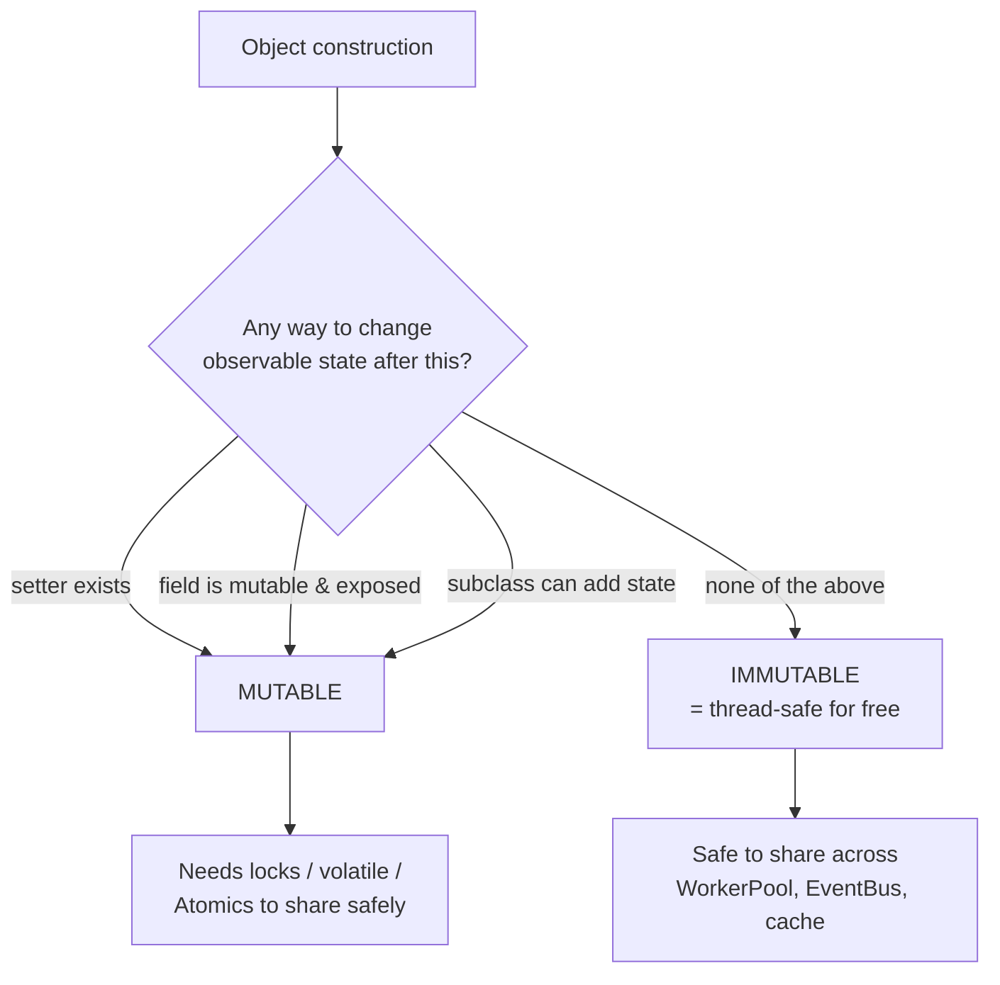
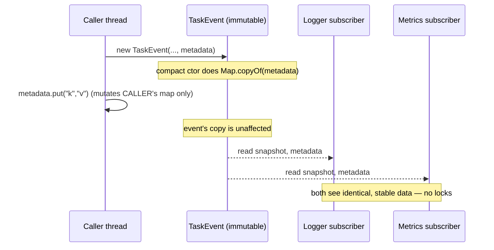
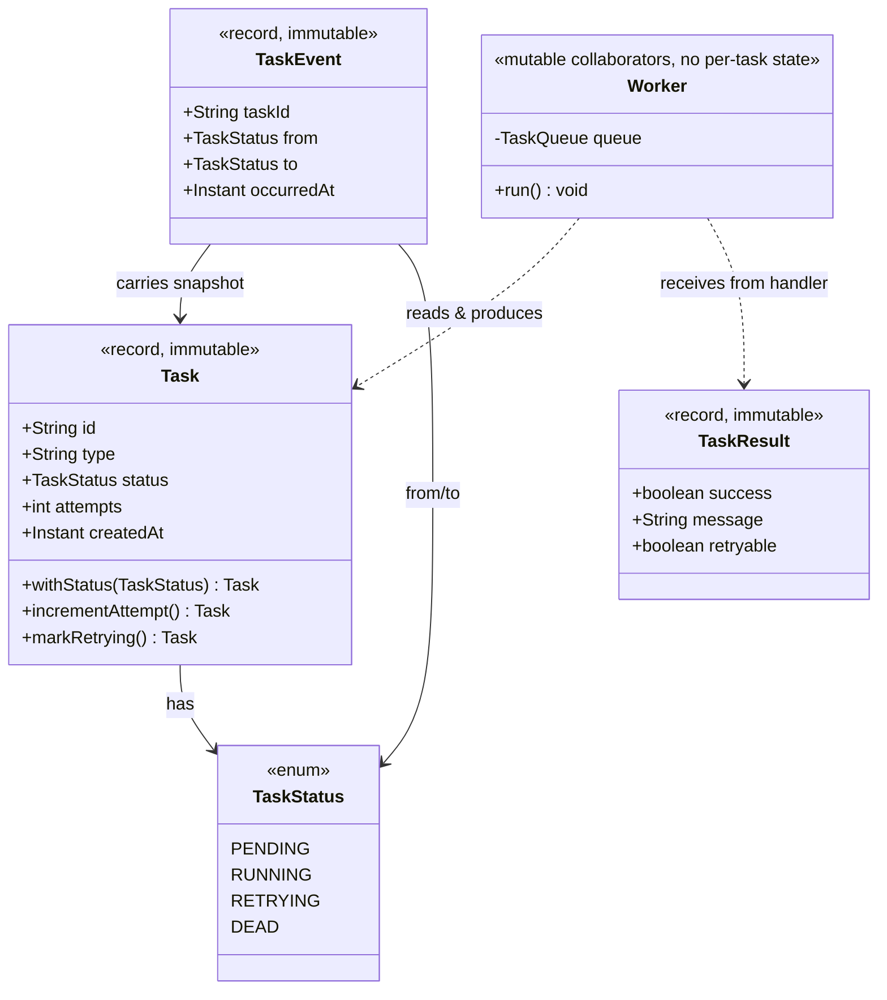

# Immutable Objects

> Where in this project: a single `Task` object is read by the API thread that created it, the scheduler that times it, the `Worker` that runs it, and the `EventBus` that publishes a `TaskEvent` about it — sometimes all within the same millisecond on different threads. If any of those threads can *mutate* that shared `Task`, you have a data race. Immutability is the cheapest, most reliable way to share a `Task` or `TaskEvent` across a `WorkerPool` without a single lock.

This chapter is part of module `03-java-memory-model`. It builds directly on [object references](./object-references.md) (immutability is about controlling what a reference can *do* to the object it points at), [pass-by-value](./pass-by-value.md) (why a defensive copy actually protects you), and the heap/stack split from [stack vs heap](./stack-vs-heap.md) (immutable objects live on the shared heap but are safe to share *because* nobody can write them after construction). It is the conceptual bridge into [atomics and thread safety](../06-concurrency/atomics-and-thread-safety.md) and [concurrent collections](../06-concurrency/concurrent-collections.md).

---

## 1. Why this exists — the real problem it solves

You have written thousands of programs where a single thread mutates a single array in place. `dp[i] = dp[i-1] + dp[i-2]`. That is fine: there is exactly one writer and one reader and they are the same thread. Backend services destroy that assumption. Our task queue has *many* threads touching the *same* objects on the *same* heap.

Here is the concrete failure. Suppose `Task` is a normal mutable class and two threads share one instance:

```java
// Thread A (a Worker that picked up the task)
task.setStatus(TaskStatus.RUNNING);
task.setAttempts(task.getAttempts() + 1);

// Thread B (the metrics reporter, running at the same instant)
if (task.getStatus() == TaskStatus.RUNNING) {
    int a = task.getAttempts();   // might read the OLD attempts with the NEW status
    metrics.record(task.getStatus(), a);  // inconsistent snapshot
}
```

Thread B can observe `status == RUNNING` but `attempts` still at the old value, because the two writes in thread A are not atomic together and — worse — without synchronization the JVM does **not** guarantee thread B ever sees thread A's writes at all (that is the *visibility* problem from the Java Memory Model). You get torn reads, stale reads, and reordering. The classic fixes are locks (slow, deadlock-prone) or careful `volatile`/`Atomic` usage (subtle, easy to get wrong).

Immutability sidesteps the entire category. **If an object's state cannot change after construction, then there is nothing to race on.** Every thread that holds a reference sees the same value forever. No locks, no `volatile`, no memory barriers in your code — the JVM guarantees that the values of `final` fields are visible to all threads once the constructor finishes (the *final-field freeze* of the JMM, JLS §17.5). Thread-safety becomes a property of the *type*, not a discipline you have to enforce at every call site.

Historically this is not new. Lisp had immutable cons cells in 1958. Erlang built telecom systems handling millions of concurrent processes on the rule that *all data is immutable*. Functional languages (Haskell, Clojure, Scala) treat mutation as the exception, not the default. Java's `String`, `Integer`, `LocalDate`, and now `record` are all immutable by design. The industry learned the hard way: shared mutable state is the single largest source of concurrency bugs, and the most robust cure is to remove the "mutable" part.

> The rule of thumb that staff engineers internalize: **make every class immutable unless you have a measured reason not to.** Mutability is an optimization you justify, not a default you assume.

---

## 2. What "immutable" precisely means

An object is immutable when **its observable state cannot change after construction**. In Java, the textbook recipe (from Joshua Bloch's *Effective Java*, Item 17) is five rules:

1. **Do not provide mutators.** No `setX` methods, no methods that change state.
2. **Ensure the class cannot be extended.** Make it `final` (or use a `record`, which is implicitly final). A subclass could add mutable state or override behavior, breaking the immutability contract.
3. **Make all fields `final`.** This communicates intent and gives you the JMM final-field visibility guarantee.
4. **Make all fields `private`.** Otherwise callers reach in and mutate, or depend on representation.
5. **Ensure exclusive access to any mutable components.** If a field references a mutable object (an array, a `List`, a `Date`), never share that reference with a client. Make **defensive copies** on the way in (constructor) and on the way out (accessors).

Rule 5 is the one that trips people up, and it is the reason "all fields `final`" is *necessary but not sufficient*. A `final` field can still point at a mutable object. We will spend section 5 on this.



---

## 3. The naive version — a mutable `Task` shared across workers

This is the first thing most people write coming from a non-Java background. A plain mutable bean.

```java
// NAIVE: a fully mutable Task. Looks innocent, races horribly when shared.
public class Task {
    private String id;
    private String type;
    private String payload;
    private TaskStatus status;
    private int attempts;
    private int maxAttempts;
    private Instant createdAt;
    private Instant scheduledAt;
    private int priority;

    public Task() { }   // empty bean constructor

    // getters and setters for EVERY field
    public String getId() { return id; }
    public void setId(String id) { this.id = id; }
    public TaskStatus getStatus() { return status; }
    public void setStatus(TaskStatus status) { this.status = status; }
    public int getAttempts() { return attempts; }
    public void setAttempts(int attempts) { this.attempts = attempts; }
    public Instant getCreatedAt() { return createdAt; }
    public void setCreatedAt(Instant createdAt) { this.createdAt = createdAt; }
    // ... and so on for every field
}
```

What is wrong:

- **Anyone can mutate identity.** `task.setId("oops")` after the task is enqueued silently corrupts every index, map key, and log line that used the old id. The `id`, `type`, and `createdAt` are *intrinsic facts* — they should be impossible to change.
- **No safe sharing.** Two `Worker`s holding the same reference can interleave `setStatus`/`setAttempts` and produce torn state (the section-1 bug).
- **No visibility guarantee.** Without `final` fields or synchronization, a thread may never see another thread's writes.
- **Broken as a map key / set element.** If you put a `Task` in a `HashSet` keyed on its fields and then mutate a field, the object is now in the wrong bucket and `contains` lies to you.
- **Half-constructed objects.** The empty constructor lets a `Task` exist with `id == null`, `status == null`. Every consumer must null-check or risk an NPE.

This compiles and "works" in a single-threaded test. It is a time bomb in a `WorkerPool`.

---

## 4. Improved version — immutable core, `final` fields, validating constructor

First refactor: lock down the fields that are *facts about the task's identity* and validate everything at construction. We keep `status` and `attempts` mutable for now (we will fix that in section 5) but make the class otherwise immutable.

```java
// IMPROVED: id, type, createdAt are now permanently fixed. Construction validates.
public final class Task {                    // final: no subclass can break immutability
    private final String id;                 // intrinsic identity — never changes
    private final String type;               // routing key for the handler — never changes
    private final String payload;            // the work — never changes
    private final int maxAttempts;           // policy fixed at submission
    private final Instant createdAt;         // a historical fact — never changes
    private final int priority;              // fixed at submission

    // Still mutable for now; section 5 removes these.
    private TaskStatus status;
    private int attempts;
    private Instant scheduledAt;

    public Task(String id, String type, String payload,
                int maxAttempts, Instant createdAt, int priority) {
        this.id = Objects.requireNonNull(id, "id");
        this.type = Objects.requireNonNull(type, "type");
        this.payload = Objects.requireNonNull(payload, "payload");
        if (maxAttempts < 1) {
            throw new IllegalArgumentException("maxAttempts must be >= 1, got " + maxAttempts);
        }
        this.maxAttempts = maxAttempts;
        this.createdAt = Objects.requireNonNull(createdAt, "createdAt");
        this.priority = priority;
        this.status = TaskStatus.PENDING;     // every task is born PENDING
        this.attempts = 0;
    }

    public String id() { return id; }
    public String type() { return type; }
    public String payload() { return payload; }
    public int maxAttempts() { return maxAttempts; }
    public Instant createdAt() { return createdAt; }
    public int priority() { return priority; }

    public synchronized TaskStatus status() { return status; }
    public synchronized void transitionTo(TaskStatus next) { this.status = next; }
    public synchronized int attempts() { return attempts; }
    public synchronized void incrementAttempts() { this.attempts++; }
}
```

This is a real improvement: identity is now immutable, the object can never be half-built, and the validating constructor means *if you hold a `Task`, it is well-formed*. But the mutable `status`/`attempts` still force `synchronized` on every access, which is the lock tax we wanted to avoid. The next step removes mutation entirely.

---

## 5. Production-quality version — a fully immutable `Task` with copy-on-write transitions

A staff engineer ships a `Task` that is **fully immutable**. State changes are modeled as producing a **new** `Task` value, not mutating the old one. This is *copy-on-write*: `markRunning()` returns a fresh `Task` that is identical except `status == RUNNING`. The Java `record` is the perfect carrier — it gives you `final` fields, a canonical constructor, accessors, `equals`/`hashCode`/`toString` for free, and is implicitly `final`.

```java
import java.time.Instant;
import java.util.Objects;

// PRODUCTION: Task is a fully immutable record. State transitions return new values.
public record Task(
        String id,
        String type,
        String payload,
        TaskStatus status,
        int attempts,
        int maxAttempts,
        Instant createdAt,
        Instant scheduledAt,
        int priority
) {
    // Compact canonical constructor: validate + normalize at every construction,
    // including the ones produced by our with* methods below.
    public Task {
        Objects.requireNonNull(id, "id");
        Objects.requireNonNull(type, "type");
        Objects.requireNonNull(payload, "payload");
        Objects.requireNonNull(status, "status");
        Objects.requireNonNull(createdAt, "createdAt");
        if (maxAttempts < 1) {
            throw new IllegalArgumentException("maxAttempts must be >= 1");
        }
        if (attempts < 0) {
            throw new IllegalArgumentException("attempts must be >= 0");
        }
        // scheduledAt may be null (means "run as soon as possible").
    }

    /** Factory for a brand-new submission. The common, ergonomic entry point. */
    public static Task newTask(String type, String payload, int maxAttempts, int priority) {
        Instant now = Instant.now();
        return new Task(
                java.util.UUID.randomUUID().toString(),
                type, payload,
                TaskStatus.PENDING,
                0, maxAttempts,
                now, null, priority);
    }

    // --- copy-on-write transitions: each returns a NEW Task, leaving `this` untouched ---

    public Task withStatus(TaskStatus next) {
        return new Task(id, type, payload, next, attempts, maxAttempts, createdAt, scheduledAt, priority);
    }

    public Task incrementAttempt() {
        return new Task(id, type, payload, status, attempts + 1, maxAttempts, createdAt, scheduledAt, priority);
    }

    public Task scheduledFor(Instant when) {
        return new Task(id, type, payload, TaskStatus.SCHEDULED, attempts, maxAttempts, createdAt, when, priority);
    }

    // --- intent-revealing convenience methods built on the primitives above ---

    public Task markRunning()   { return withStatus(TaskStatus.RUNNING); }
    public Task markSucceeded() { return withStatus(TaskStatus.SUCCEEDED); }
    public Task markFailed()    { return withStatus(TaskStatus.FAILED); }
    public Task markDead()      { return withStatus(TaskStatus.DEAD); }

    /** Bump the attempt count and move into RETRYING in one atomic value-producing step. */
    public Task markRetrying() {
        return incrementAttempt().withStatus(TaskStatus.RETRYING);
    }

    public boolean hasAttemptsLeft() {
        return attempts < maxAttempts;
    }
}
```

Why this is the version to ship:

- **Thread-safe with zero locks.** A `Task` value never changes, so any number of `Worker`s, the `EventBus`, the scheduler, and a metrics gauge can read it concurrently with no synchronization. The JMM final-field guarantee (records make every field `final`) means a fully constructed `Task` is safely publishable.
- **Auditability.** Each transition is a distinct value. You can log `before` and `after`, store the history, replay it, and you never lose the prior state by accident.
- **Safe as map keys and queue elements.** A `Task` placed in a `HashMap`, `PriorityBlockingQueue`, or `Set` will never silently relocate, because its `equals`/`hashCode` inputs cannot change.
- **No half-built objects.** The compact constructor validates on *every* path, including the `with*` copies.
- **Reads like the domain.** `task.markRetrying()` returns the next state; the caller assigns it back: `task = task.markRetrying();`.

### What about the cost?

Copy-on-write allocates a new object per transition. A `Task` has nine fields; the record is a shallow copy (the `String` and `Instant` fields are themselves immutable, so we copy *references*, not deep data). On modern JVMs, allocating a small short-lived object costs a bump-pointer in the young generation and is collected cheaply — typically a few nanoseconds. A task that goes `PENDING → RUNNING → RETRYING → RUNNING → SUCCEEDED` allocates ~5 `Task` objects over its whole lifetime, which is dramatically cheaper than the lock contention and cache-line ping-pong a mutable shared object would cause across cores. **Measure before you assume copy-on-write is "too slow."** It almost never is for control-plane objects like tasks and events.

---

## 6. Code walkthrough — beginner, intermediate, production

### 6.1 Beginner — the smallest immutable value in our model: `TaskResult`

`TaskResult` is the return value of every `TaskHandler.handle(...)`. It is the textbook immutable carrier and a perfect first record.

```java
// A record is immutable by construction: final fields, no setters, implicitly final class.
public record TaskResult(boolean success, String message, boolean retryable) {

    // Static factories make call sites read like English and centralize defaults.
    public static TaskResult ok() {
        return new TaskResult(true, "ok", false);
    }

    public static TaskResult retryable(String message) {
        return new TaskResult(false, message, true);
    }

    public static TaskResult permanentFailure(String message) {
        return new TaskResult(false, message, false);
    }
}
```

```java
// Usage inside a handler. The returned value can be shared, logged, cached — it can't change.
TaskHandler emailHandler = task -> {
    boolean sent = sendEmail(task.payload());
    return sent ? TaskResult.ok()
                : TaskResult.retryable("SMTP timeout");
};
```

Two threads can hold the same `TaskResult` and read `success`/`message`/`retryable` concurrently with no coordination. That is immutability buying you thread-safety for free, in the simplest possible form.

### 6.2 Intermediate — copy-on-write transitions in the `Worker`

Here is how the production `Task` flows through a `Worker`. Notice the pattern: **read state, produce a new state, hand the new value to the repository.** The local variable is reassigned; no object is mutated.

```java
public final class Worker implements Runnable {
    private final TaskQueue queue;
    private final Map<String, TaskHandler> handlers;
    private final TaskRepository repository;
    private final RetryPolicy retryPolicy;
    private final DeadLetterQueue dlq;

    public Worker(TaskQueue queue, Map<String, TaskHandler> handlers,
                  TaskRepository repository, RetryPolicy retryPolicy, DeadLetterQueue dlq) {
        this.queue = queue;
        this.handlers = handlers;
        this.repository = repository;
        this.retryPolicy = retryPolicy;
        this.dlq = dlq;
    }

    @Override
    public void run() {
        try {
            while (!Thread.currentThread().isInterrupted()) {
                Task task = queue.dequeue();          // immutable snapshot

                Task running = task.markRunning();     // NEW value, original untouched
                repository.save(running);

                TaskHandler handler = handlers.get(running.type());
                if (handler == null) {
                    repository.save(running.markFailed());
                    dlq.send(running, "no handler for type " + running.type());
                    continue;
                }

                Task outcome = execute(running, handler);  // returns the next immutable state
                repository.save(outcome);
            }
        } catch (InterruptedException e) {
            Thread.currentThread().interrupt();
        }
    }

    private Task execute(Task running, TaskHandler handler) {
        try {
            TaskResult result = handler.handle(running);
            if (result.success()) {
                return running.markSucceeded();
            }
            if (result.retryable() && running.hasAttemptsLeft()) {
                return running.markRetrying();          // bumps attempts + moves to RETRYING
            }
            Task dead = running.markDead();
            dlq.send(dead, result.message());
            return dead;
        } catch (Exception ex) {
            if (running.hasAttemptsLeft()) {
                return running.markRetrying();
            }
            Task dead = running.markDead();
            dlq.send(dead, "exception: " + ex.getMessage());
            return dead;
        }
    }
}
```

The key property: `task`, `running`, and `outcome` are three distinct immutable values. If another thread happened to hold the original `task` reference (say, it was also in the queue's internal structure or an event), that thread is completely unaffected by anything this `Worker` does. There is no shared mutable cell to race on.

### 6.3 Production-inspired — immutable `TaskEvent` on the `EventBus` and a defensive-copy case

In Phase 4 the `EventBus` publishes a `TaskEvent` to many subscribers, each running on its own thread (a logger, a metrics sink, a webhook dispatcher). If the event were mutable, one subscriber could corrupt what the others see. So the event is immutable — and it carries the immutable `Task` snapshot at the moment of the transition.

```java
import java.time.Instant;
import java.util.Map;

public record TaskEvent(
        String taskId,
        TaskStatus from,
        TaskStatus to,
        Task snapshot,          // the immutable Task value at the moment of transition
        Instant occurredAt,
        Map<String, String> metadata   // <-- a potentially mutable collection: the trap
) {
    // Defensive copy + unmodifiable wrap so the event truly cannot be mutated through `metadata`.
    public TaskEvent {
        Objects.requireNonNull(taskId, "taskId");
        Objects.requireNonNull(to, "to");
        Objects.requireNonNull(snapshot, "snapshot");
        occurredAt = (occurredAt == null) ? Instant.now() : occurredAt;
        // Copy on the way IN so the caller can't keep a reference and mutate our internals later.
        metadata = (metadata == null)
                ? Map.of()
                : Map.copyOf(metadata);     // Map.copyOf returns an unmodifiable copy
    }

    public static TaskEvent of(Task before, Task after, Map<String, String> meta) {
        return new TaskEvent(after.id(), before.status(), after.status(), after, Instant.now(), meta);
    }
}
```

Why the `metadata` line matters and the rest of the record does not need it:

- `taskId`, `from`, `to`, `occurredAt` are immutable types (`String`, enum, `Instant`) — copying references is enough.
- `snapshot` is our immutable `Task` — no copy needed.
- `metadata` is a `Map`, which is a **mutable interface**. If we stored the caller's reference directly, the caller could call `meta.put(...)` *after* constructing the event and change what every subscriber sees. `Map.copyOf` makes a private, unmodifiable copy at the boundary. This is a **defensive copy**, and it is the single most common place immutability leaks in real code.



---

## 7. How this applies to our Task Queue project

Concrete decisions across the canonical model:

| Type | Immutability decision | Why |
| --- | --- | --- |
| `TaskResult` | Fully immutable `record` | Pure return value shared across threads, logged, cached. |
| `Task` | Fully immutable `record`; transitions via `with*`/`mark*` | Shared by API, scheduler, workers, event bus. Copy-on-write removes all locking. |
| `TaskStatus` | `enum` (inherently immutable singletons) | Enum constants are shared globally; immutability is free. |
| `TaskEvent` | Immutable `record` with defensive copy of `metadata` | Fan-out to many subscriber threads; must be tamper-proof. |
| `RetryPolicy` impls | Immutable (config fixed in constructor) | `FixedDelayRetryPolicy`, `ExponentialBackoffRetryPolicy` are stateless after construction → shareable singletons. |
| `Worker` | *Not* immutable, but holds only `final` collaborator references | Has no mutable per-task state; the mutable bits (queue position) live in the queue. |
| `InMemoryTaskQueue` | Mutable by necessity (it *is* the shared mutable state) | Concentrate mutation in ONE well-tested, thread-safe place (a `BlockingQueue`) and keep everything flowing through it immutable. See [blocking-queue](../06-concurrency/blocking-queue.md). |

The architectural principle: **push mutability to the edges and concentrate it.** The queue and the database are the only things that genuinely need to be mutable shared state, and both are already engineered to be thread-safe (`BlockingQueue`, the database's transaction system). Everything that *flows through* them — `Task`, `TaskResult`, `TaskEvent` — is immutable, so it can be copied between threads, queues, caches, and the wire without a single race.



---

## 8. Tradeoffs

| Dimension | Immutable (copy-on-write) | Mutable (in-place) |
| --- | --- | --- |
| Thread-safety | Free; no locks, no `volatile` | Requires locks / `Atomic` / careful `volatile` |
| Reasoning | A value never changes → trivial to reason about | Must track every writer and ordering |
| Allocation | One small object per transition | Zero allocation per change |
| GC pressure | More short-lived young-gen objects | Less garbage |
| Memory footprint | Higher if you keep many versions | Lower (one slot) |
| Map/Set keys | Safe forever | Dangerous if mutated after insert |
| Auditability | Each version is a record you can keep | History lost on mutate |
| Hot-path performance | Excellent for control-plane (tasks/events) | Better for huge, frequently-mutated buffers |

The honest summary: immutability trades a little allocation for a lot of correctness. For **control-plane objects** — tasks, events, config, results — that is an overwhelmingly good trade. For **data-plane hot loops** — a 10-million-element numeric buffer mutated billions of times — in-place mutation (or off-heap memory) wins, and you localize that mutation behind a thread-safe boundary. Our `Task`/`TaskEvent` are firmly control-plane. Choose immutability for them without hesitation.

> Note on "structural sharing": languages like Clojure make immutable collections cheap by sharing unchanged sub-structure between versions (persistent data structures). Java's `record` copy is shallow, so for our 9-field `Task` we share the references to the immutable `String`/`Instant` fields automatically — only the record shell is re-allocated. That is why copy-on-write on `Task` is cheap.

---

## 9. Common mistakes and pitfalls

- **"All fields `final`" but a field points at a mutable object.** A `final Map<String,String> metadata` is still mutable through `metadata.put(...)`. **Fix:** defensive copy + unmodifiable wrap (`Map.copyOf`, `List.copyOf`), or use a truly immutable collection.
- **Leaking a mutable field through an accessor.** `public Date getCreatedAt() { return this.createdAt; }` where `Date` is mutable — the caller does `task.getCreatedAt().setTime(0)` and corrupts you. **Fix:** use `Instant` (immutable) — exactly why our model specifies `Instant`, not `Date`. If you must hold a mutable type, return a copy.
- **Storing an array.** `private final int[] data;` is mutable element-by-element. `final` only freezes the reference, not the contents. **Fix:** copy in (`data.clone()`) and copy out, or expose a `List.of(...)`.
- **Mutating an object after using it as a `HashMap` key / `Set` element.** Even one mutated field changes `hashCode` and the object becomes unreachable in the map. **Fix:** only use immutable objects as keys (our `Task` qualifies).
- **Forgetting validation runs only once.** With a mutable class, validating in a setter is required; with an immutable record, validate in the **compact constructor** so every `with*` copy is also validated. Don't skip it.
- **Thinking `record` deep-copies for you.** It does not. A record's generated constructor and accessors store/return the references as-is. Add defensive copies yourself for mutable component types.
- **Over-applying immutability to genuinely stateful infra.** A connection pool, a `BlockingQueue`, a counter — these *are* mutable state. Don't contort them into immutability; make them properly thread-safe and keep the objects flowing *through* them immutable.
- **Calling `markRunning()` and ignoring the result.** `task.markRunning();` does nothing useful if you discard the returned value — the original `task` is unchanged. **Fix:** `task = task.markRunning();` (and IDE inspections can flag ignored return values of `@CheckReturnValue` methods).

---

## 10. Refactoring exercise — bad → improved → production

### 10.1 Bad

```java
// BAD: mutable, leaks internals, allows half-built and corrupted state.
public class Job {
    public String id;                 // public mutable identity
    public List<String> tags;         // public mutable collection
    public Date createdAt;            // mutable Date
    public String status;             // stringly-typed status

    public Job(String id, List<String> tags) {
        this.id = id;
        this.tags = tags;             // stores caller's list — aliasing bug
        this.createdAt = new Date();
        this.status = "NEW";
    }

    public List<String> getTags() { return tags; }   // leaks the internal list
}
```

Problems: `id` reassignable; `tags` aliased and leaked (caller can `add` after construction); `Date` mutable; status is a magic string; no validation.

### 10.2 Improved

```java
// IMPROVED: final fields, defensive copies, enum status, validation — but still a class.
public final class Job {
    private final String id;
    private final List<String> tags;
    private final Instant createdAt;
    private final TaskStatus status;

    public Job(String id, List<String> tags, Instant createdAt, TaskStatus status) {
        this.id = Objects.requireNonNull(id);
        this.tags = List.copyOf(Objects.requireNonNull(tags));  // immutable defensive copy
        this.createdAt = Objects.requireNonNull(createdAt);
        this.status = Objects.requireNonNull(status);
    }

    public String id() { return id; }
    public List<String> tags() { return tags; }   // already unmodifiable, safe to return
    public Instant createdAt() { return createdAt; }
    public TaskStatus status() { return status; }

    public Job withStatus(TaskStatus next) {
        return new Job(id, tags, createdAt, next);
    }
}
```

### 10.3 Production

```java
// PRODUCTION: record + compact constructor centralizes validation AND defensive copy,
// so every with* copy is automatically safe. Minimal boilerplate, maximal guarantees.
public record Job(String id, List<String> tags, Instant createdAt, TaskStatus status) {

    public Job {
        Objects.requireNonNull(id, "id");
        Objects.requireNonNull(createdAt, "createdAt");
        Objects.requireNonNull(status, "status");
        // Defensive, unmodifiable copy applied on EVERY construction path:
        tags = (tags == null) ? List.of() : List.copyOf(tags);
    }

    public static Job create(String id, List<String> tags) {
        return new Job(id, tags, Instant.now(), TaskStatus.PENDING);
    }

    public Job withStatus(TaskStatus next) {
        return new Job(id, tags, createdAt, next);   // re-runs compact ctor → re-validates
    }
}
```

The record version is shorter than the improved class *and* stronger: the compact constructor is the single chokepoint where validation and defensive copying happen, so `withStatus` cannot accidentally bypass them.

---

## 11. Exercises

### Easy

**E1 (knowledge check).** Explain in two sentences why a fully immutable object is thread-safe without any locks. What JMM guarantee makes a freshly constructed immutable object safely visible to other threads?

**E2 (coding).** Convert this mutable `RateLimitConfig` into an immutable record with validation (`capacity > 0`, `refillPerSecond > 0`):

```java
public class RateLimitConfig {
    public int capacity;
    public double refillPerSecond;
}
```

### Medium

**M1 (refactoring).** The following `TaskBatch` leaks its internal list and stores a mutable `Instant[]`-like array. Make it properly immutable (defensive copies in and out) without changing the public method names.

```java
public class TaskBatch {
    private final List<Task> tasks;
    private final long[] timestamps;
    public TaskBatch(List<Task> tasks, long[] timestamps) {
        this.tasks = tasks;
        this.timestamps = timestamps;
    }
    public List<Task> getTasks() { return tasks; }
    public long[] getTimestamps() { return timestamps; }
}
```

**M2 (design).** Our `Task` uses copy-on-write for `status`. A teammate argues that in the hot path (millions of tasks/second) the allocation is wasteful and we should make `status` a `volatile` mutable field instead. Lay out the decision: when is each correct, what do you measure, and what hybrid keeps most of the immutability benefits?

### Hard

**H1 (interview-style).** Design an immutable `Task` that must also be **serializable to JSON** (for the `PostgresTaskQueue` payload and the wire), comparable by `priority` then `createdAt` (for a `PriorityBlockingQueue`), and usable as a `HashMap` key. Write the record, the `Comparator`, and explain why immutability is what makes it safe as a key and as a queue element simultaneously.

**H2 (stretch).** Implement a tiny immutable, append-only `TaskHistory` that records every `Task` version a task passed through, returning a *new* `TaskHistory` on each append (persistent-list style with structural sharing). Show that two histories sharing a common prefix do not copy the prefix.

---

## 12. Solutions

### E1

An immutable object's state cannot change after construction, so there is no shared mutable cell for two threads to race on — every reader sees the same value forever, which is exactly what thread-safety means. The relevant JMM guarantee is the **final-field freeze** (JLS §17.5): once a constructor that sets `final` fields completes, those field values are guaranteed visible to any thread that reads the object through a reference obtained after construction, with no extra synchronization. Records make all fields `final`, so they inherit this guarantee.

### E2

```java
public record RateLimitConfig(int capacity, double refillPerSecond) {
    public RateLimitConfig {
        if (capacity <= 0) {
            throw new IllegalArgumentException("capacity must be > 0, got " + capacity);
        }
        if (refillPerSecond <= 0) {
            throw new IllegalArgumentException("refillPerSecond must be > 0, got " + refillPerSecond);
        }
    }
}
```

This is now safe to share as a singleton config across every `TokenBucketRateLimiter` on every thread.

### M1

```java
import java.util.List;
import java.util.Objects;

public final class TaskBatch {
    private final List<Task> tasks;
    private final long[] timestamps;

    public TaskBatch(List<Task> tasks, long[] timestamps) {
        Objects.requireNonNull(tasks, "tasks");
        Objects.requireNonNull(timestamps, "timestamps");
        this.tasks = List.copyOf(tasks);          // immutable copy IN
        this.timestamps = timestamps.clone();      // array copy IN
    }

    public List<Task> getTasks() {
        return tasks;                              // already unmodifiable
    }

    public long[] getTimestamps() {
        return timestamps.clone();                 // copy OUT so callers can't mutate ours
    }
}
```

Two copies are required for the array because `final` only freezes the reference, not the elements; `List.copyOf` already produces an unmodifiable list so its accessor needs no extra copy. `Task` elements are themselves immutable, so we do not need to deep-copy them.

### M2

- **Immutable copy-on-write is correct when** the object is shared across threads (ours is), transitions are infrequent relative to reads, and you want auditability/safe keys. This is the default for control-plane objects.
- **A single `volatile TaskStatus status` mutable field is correct when** the object is genuinely hot (status churns at a rate where allocation shows up in a profiler), each task is owned by one writer at a time, and you have *measured* the GC/allocation cost. `volatile` gives visibility but **not** atomicity across multiple fields — so you can only get away with it if `status` is the *only* mutating field and it is a single reference write.
- **What to measure:** allocation rate (`-Xlog:gc` or async-profiler alloc mode), young-gen GC frequency/pause, and end-to-end p99 latency with each design under realistic load. Do not refactor on a hunch.
- **Hybrid that keeps the wins:** keep `Task` immutable but store only the *id* in the queue, and keep the mutable status in a single thread-safe place — e.g. an `AtomicReference<TaskStatus>` per task held in a `ConcurrentHashMap<String, AtomicReference<TaskStatus>>`, or the database row. Then the immutable `Task` snapshot still flows safely across threads while the one mutating cell is concentrated and atomic. Most teams do not need this; the plain copy-on-write record is fast enough.

### H1

```java
import com.fasterxml.jackson.annotation.JsonProperty;
import java.time.Instant;
import java.util.Comparator;
import java.util.Objects;

public record Task(
        @JsonProperty("id") String id,
        @JsonProperty("type") String type,
        @JsonProperty("payload") String payload,
        @JsonProperty("status") TaskStatus status,
        @JsonProperty("attempts") int attempts,
        @JsonProperty("maxAttempts") int maxAttempts,
        @JsonProperty("createdAt") Instant createdAt,
        @JsonProperty("scheduledAt") Instant scheduledAt,
        @JsonProperty("priority") int priority
) {
    public Task {
        Objects.requireNonNull(id);
        Objects.requireNonNull(type);
        Objects.requireNonNull(status);
        Objects.requireNonNull(createdAt);
        if (maxAttempts < 1) throw new IllegalArgumentException("maxAttempts >= 1");
    }

    // Higher priority first (descending), then earlier createdAt first (FIFO tie-break).
    public static final Comparator<Task> QUEUE_ORDER =
            Comparator.comparingInt(Task::priority).reversed()
                      .thenComparing(Task::createdAt);

    public Task withStatus(TaskStatus next) {
        return new Task(id, type, payload, next, attempts, maxAttempts, createdAt, scheduledAt, priority);
    }
}
```

```java
PriorityBlockingQueue<Task> queue = new PriorityBlockingQueue<>(64, Task.QUEUE_ORDER);
Map<String, Task> byId = new HashMap<>();
```

Why immutability makes both uses safe *at once*: a `PriorityBlockingQueue` orders elements by the `Comparator` **at insertion time** and assumes their ordering keys do not change; a `HashMap` buckets a key by its `hashCode` **at insertion time** and assumes it does not change. If `Task` were mutable and someone changed `priority` or any field after insertion, the queue's heap invariant and the map's bucket placement would both silently break — `contains`/`get` would lie and `poll` could return out of order. Because `Task` is immutable, `priority`, `createdAt`, and the `equals`/`hashCode` inputs are frozen, so both data structures stay correct forever. Jackson serializes records by their components automatically (no setters needed), so the same immutable type goes to JSON, to Postgres, and across the wire unchanged.

### H2

```java
import java.util.Optional;

// Persistent (structurally-shared) immutable history. Each append returns a NEW history
// that points at the OLD one as its tail — the prefix is shared, never copied.
public final class TaskHistory {
    private final Task head;            // most recent version (null only for EMPTY)
    private final TaskHistory tail;     // everything before it (shared)
    private final int size;

    public static final TaskHistory EMPTY = new TaskHistory(null, null, 0);

    private TaskHistory(Task head, TaskHistory tail, int size) {
        this.head = head;
        this.tail = tail;
        this.size = size;
    }

    public TaskHistory append(Task version) {
        // O(1): build a new node whose tail IS the current history. No prefix copy.
        return new TaskHistory(version, this, this.size + 1);
    }

    public Optional<Task> latest() {
        return Optional.ofNullable(head);
    }

    public int size() {
        return size;
    }

    // Walks newest -> oldest. The shared prefix is the SAME object across histories.
    public TaskHistory tail() {
        return tail;
    }
}
```

```java
TaskHistory base = TaskHistory.EMPTY
        .append(task)                 // PENDING
        .append(task.markRunning());  // RUNNING

TaskHistory branchA = base.append(task.markSucceeded());
TaskHistory branchB = base.append(task.markRetrying());

// branchA.tail() and branchB.tail() are the SAME object reference as `base`:
assert branchA.tail() == base;        // structural sharing: the prefix is NOT copied
assert branchB.tail() == base;
```

Because every node is immutable, `branchA` and `branchB` can both safely point at the shared `base` prefix — there is no risk that one branch mutates a node the other relies on. This is exactly how persistent data structures get cheap "copies": immutability is the precondition that makes structural sharing safe.

---

## 13. Interview questions and takeaways

1. **Q: Why is an immutable object automatically thread-safe?**
   A: Its state never changes after construction, so there is no write for any thread to race against; all readers see one fixed value. The JMM final-field guarantee makes a properly constructed immutable object safely visible to other threads without synchronization.

2. **Q: Is making all fields `final` enough for immutability?**
   A: No. `final` freezes the *reference*, not the object it points to. A `final List` or `final int[]` is still mutable through its contents. You also need defensive copies (or immutable component types) and the class must be `final`/a record so a subclass can't add mutable state.

3. **Q: What is a defensive copy and where do you make it?**
   A: A private copy of a mutable input so callers can't mutate your internals through a retained reference. Make it on the way **in** (constructor) and on the way **out** (accessors) for any mutable component type. `List.copyOf`/`Map.copyOf` do both copy and unmodifiable-wrap.

4. **Q: Why does our model use `Instant` instead of `java.util.Date`?**
   A: `Date` is mutable (`setTime`), so exposing it would leak a mutable field. `Instant` is immutable, so it can be stored and returned directly with no copy — keeping `Task` immutable for free.

5. **Q: What's the cost of copy-on-write transitions and when is it a problem?**
   A: One small short-lived allocation per transition. For control-plane objects (a handful of transitions per task) it's negligible and cheaper than the locking a mutable shared object would need. It only matters in genuine hot loops with millions of mutations, where you'd measure and possibly concentrate mutation behind a thread-safe boundary.

6. **Q: Why are immutable objects safe as `HashMap` keys but mutable ones dangerous?**
   A: A map buckets a key by its `hashCode` at insertion. If a mutable key's fields change, its `hashCode` changes and it lands in the wrong bucket — `get`/`contains` then fail to find it. Immutable keys can't change, so they stay findable.

7. **Q: Do Java records give you immutability automatically?**
   A: They give you `final` fields, no setters, and an implicitly final class — so for components that are themselves immutable, yes. But records do **not** deep-copy mutable components; you must add defensive copies in the compact constructor for things like `List`/`Map`/arrays.

8. **Q: How do you validate an immutable object so invariants always hold?**
   A: Put validation in the constructor (the compact constructor for a record). Because every `with*` copy routes through that same constructor, every version is validated — there is no setter path to bypass.

**Takeaways:** default to immutability; reach for `record`; validate and defensively-copy in one place (the compact constructor); model state changes as new values; concentrate the unavoidable mutation in a few well-tested thread-safe components.

---

## 14. Production considerations

- **GC behavior at scale.** Copy-on-write creates young-generation garbage. Modern collectors (G1, ZGC) handle short-lived objects cheaply, but watch allocation rate under peak load. If a profiler shows `Task` allocation dominating, you are likely re-creating tasks far more than transitions warrant — fix the call pattern before abandoning immutability.
- **Visibility vs. atomicity.** Immutability gives you *both* for a single object: a fully-constructed immutable object is visible and consistent. But publishing the *reference* still needs a safe channel — a `BlockingQueue`, a `ConcurrentHashMap`, an `AtomicReference`, or a `volatile` field. Don't stash a new `Task` in a plain field and expect another thread to see it. See [atomics and thread safety](../06-concurrency/atomics-and-thread-safety.md).
- **Serialization round-trips.** When a `Task` goes to Postgres or onto a broker and comes back, you reconstruct a *new* immutable object — there is no shared identity across the boundary, which is exactly right for distributed systems. Use stable equality by `id` for cross-process identity, and rely on idempotency (see [idempotency](../08-distributed-systems/idempotency.md)) rather than object identity.
- **Memory if you keep history.** Auditing every version is powerful but unbounded. Cap retained history (last N versions) or persist transitions to a log and keep only the latest in memory.
- **Library interop.** Some frameworks (older JPA, certain serializers) expect mutable beans with no-arg constructors. Spring Data JDBC, Jackson, and modern JPA all support records/immutables — prefer those. If a library demands mutability, keep an immutable domain `Task` and a separate mutable persistence entity, mapping between them at the boundary.
- **Monitoring.** Track `task_transitions_total` (a Micrometer counter incremented per produced version) and young-gen GC pause time. A spike in transitions without a matching workload spike usually signals a retry storm, not an immutability problem.

---

## What We Can Improve In Our Project Using This Concept

Today's first-cut `Task` (from earlier chapters) is a mutable bean with setters. We can:

- Convert `Task`, `TaskResult`, and (in Phase 4) `TaskEvent` to immutable `record`s.
- Replace every `task.setStatus(...)` / `task.setAttempts(...)` call site with copy-on-write `task = task.markRunning()` / `task = task.markRetrying()`.
- Centralize validation in compact constructors and add defensive copies for any `Map`/`List`/array component (notably `TaskEvent.metadata`).
- Remove `synchronized`/locks that only existed to protect mutable `Task` state, simplifying `Worker` and the queue.

## Project Refactoring Task

1. Change `Task` to the fully immutable record from section 5, including `newTask` factory and `with*`/`mark*` methods.
2. Update `Worker.run()` and `execute(...)` to thread the new immutable values (`task = task.markRunning()`, etc.) and `repository.save(...)` each produced version.
3. Make `TaskResult` a record with `ok`/`retryable`/`permanentFailure` factories.
4. Add unit tests asserting that calling `markRunning()` leaves the original instance unchanged (`assertThat(original.status()).isEqualTo(PENDING)`), and that `metadata` passed to a `TaskEvent` cannot mutate the event after construction.
5. Delete now-redundant `synchronized` accessors on `Task`.

## Git Commit For This Chapter

```text
refactor(domain): make Task, TaskResult, TaskEvent immutable records with copy-on-write transitions

- convert Task to a final record; add newTask factory and with*/mark* transitions
- convert TaskResult to a record with ok/retryable/permanentFailure factories
- add compact-constructor validation and defensive copy of TaskEvent.metadata (Map.copyOf)
- rewrite Worker to thread immutable Task values instead of mutating shared state
- remove synchronized accessors that guarded the old mutable Task

Files touched:
  src/main/java/com/taskqueue/domain/Task.java
  src/main/java/com/taskqueue/domain/TaskResult.java
  src/main/java/com/taskqueue/event/TaskEvent.java
  src/main/java/com/taskqueue/worker/Worker.java
  src/test/java/com/taskqueue/domain/TaskImmutabilityTest.java
```

## Architecture Impact

Immutability shifts the system from "shared mutable objects guarded by locks" to "immutable values flowing through a few thread-safe channels." The only mutable shared state becomes the `TaskQueue` (a `BlockingQueue`) and the `TaskRepository` (the database) — both already engineered for concurrency. This makes the move to a `WorkerPool` of many threads, and later to [distributed workers](../09-project/phase-4.md) and a real broker, far safer: an immutable `Task` or `TaskEvent` can be copied between threads, serialized to a queue, and reconstructed on another node with zero risk of in-flight mutation. It is a precondition for the event-driven fan-out of Phase 4.

## Interview Takeaways

- Immutability = thread-safety for free, via the JMM final-field guarantee; no locks needed.
- `final` fields are necessary but not sufficient — defend mutable components with copies.
- Records are the idiomatic immutable carrier in Java 21; validate in the compact constructor.
- Model state changes as new values (copy-on-write); reassign the local, never mutate.
- Concentrate unavoidable mutation in a few thread-safe components; keep everything flowing through them immutable.
