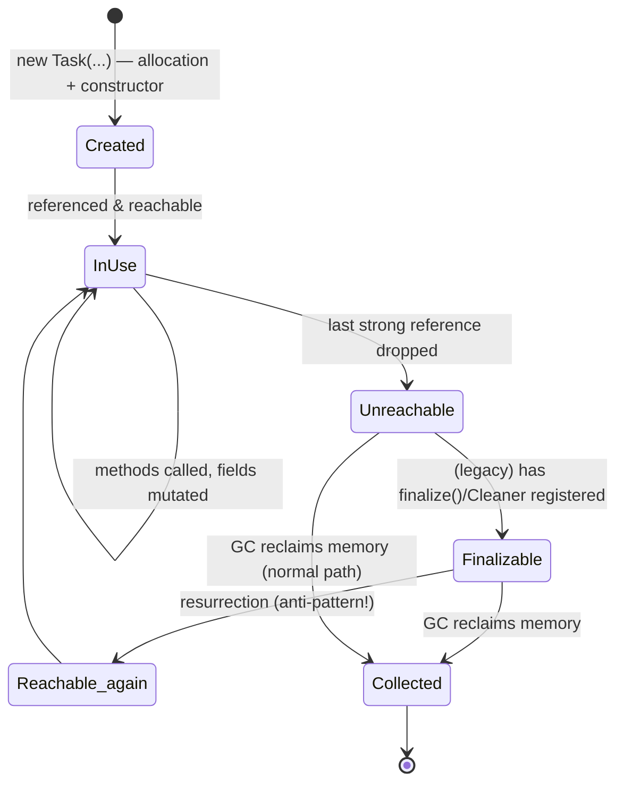
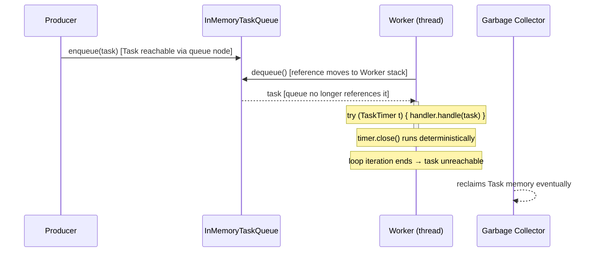
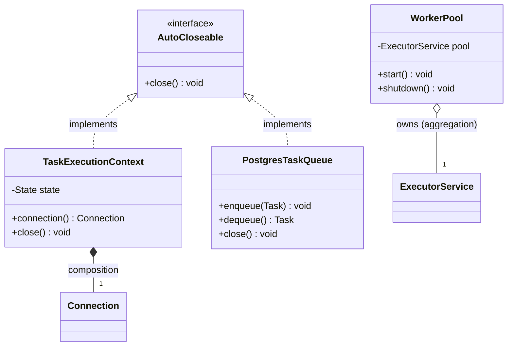

# Object Lifecycle

> Where this fits in the project: every `Task` in our queue is a Java object that is born when a client submits it, lives while a `Worker` processes it, and dies when nothing references it anymore. Understanding that birth-to-death journey — and how scarce resources like DB connections and executors are released along the way — is what keeps the platform from leaking memory and file descriptors under load.

This chapter is about the *temporal* dimension of objects: not just where they live ([stack vs heap](./stack-vs-heap.md)) but *when* they come into existence, *when* they become eligible for collection, and *how* we deterministically release the non-memory resources they hold (sockets, file handles, threads). We will trace a single `Task` from `enqueue()` all the way to garbage collection, and we will bury finalizers once and for all.

---

## 1. Why this exists — the real problem it solves

Java gives you automatic memory management. You never call `free()`. That removes an entire class of bugs (use-after-free, double-free, dangling pointers) but it introduces two subtler problems:

1. **Non-deterministic death.** You do not control *when* an object is collected. The garbage collector runs on its own schedule. So you cannot rely on "when the object dies, the socket closes." If you hold a database connection inside an object and wait for GC to release it, your connection pool drains and the app hangs — possibly minutes or hours later, far from the code that caused it.

2. **The resource/memory mismatch.** Memory is plentiful and the GC is good at reclaiming it. But operating-system resources — file descriptors, TCP sockets, native memory, thread handles, DB connections — are scarce and *not* managed by the GC. The JVM heap can be 90% free while you have exhausted all 1024 file descriptors. The GC will not save you here, because from its point of view there is plenty of memory.

> Historical note: Java 1.0 (1996) shipped with `finalize()` as the answer to "run cleanup before death." It was a mistake. Finalizers run on an unspecified thread, at an unspecified time (or never), can resurrect objects, slow down GC, and silently swallow exceptions. By Java 9 (2017) `Object.finalize()` was deprecated; in Java 18 it was deprecated *for removal*. The lesson the language learned: **tie resource release to a deterministic scope, not to garbage collection.** That deterministic scope is `try-with-resources` over `AutoCloseable`.

So the object lifecycle has two parallel tracks that we must keep distinct:

| Track | Who manages it | When it happens | Tool |
| --- | --- | --- | --- |
| **Memory** | The garbage collector | Non-deterministic, eventually | Reachability + GC (see [garbage-collection.md](./garbage-collection.md)) |
| **Resources** | You, the programmer | Deterministic, at scope exit | `try-with-resources` / `AutoCloseable` |

The whole art of this chapter is keeping those two tracks separated and never trying to do resource cleanup on the memory track.

---

## 2. The lifecycle phases

An object passes through these phases:



1. **Creation** — `new` allocates heap memory, zeroes the fields, then the constructor runs to establish invariants.
2. **In use (reachable)** — at least one chain of strong references leads from a GC root (a stack local, a static field, an active thread) to the object.
3. **Unreachable** — no GC root can reach it anymore. It is now *eligible* for collection. It is **not** dead yet — the GC just *may* collect it.
4. **Finalization** (legacy / `Cleaner`) — an optional, best-effort hook. For modern code this is only the `Cleaner` as a safety net, never primary cleanup.
5. **Collected** — the GC reclaims the memory. The object no longer exists.

Two facts senior engineers internalize:

- *Unreachable ≠ collected.* There can be an arbitrary delay (or none, if the JVM exits first).
- *Reachable ≠ in use.* You can keep a reference to something you will never touch again — that is exactly what a memory leak is in Java (a "lapsed listener," a forgotten map entry). The GC cannot collect it because *you* are still holding it.

---

## 3. The naive version — relying on `finalize()`

Here is a first-cut attempt at a "task execution context" that holds a JDBC connection. The author, coming from C++, reaches for `finalize()` to release it.

```java
// BAD: do not ship this. Demonstrates why finalizers are dead.
import java.sql.Connection;
import java.sql.DriverManager;

public class TaskExecutionContext {
    private final Connection connection;

    public TaskExecutionContext(String jdbcUrl) throws Exception {
        this.connection = DriverManager.getConnection(jdbcUrl); // scarce resource!
    }

    public Connection connection() {
        return connection;
    }

    @Override
    protected void finalize() throws Throwable {
        try {
            if (connection != null && !connection.isClosed()) {
                connection.close(); // "cleanup on death"
            }
        } finally {
            super.finalize();
        }
    }
}
```

Why this is broken — every one of these is a real production failure mode:

- **No guarantee it ever runs.** If the JVM exits, or the object is never collected (heap is large, GC is lazy), `finalize()` is simply never called. Your connection leaks for the life of the process.
- **Unpredictable timing.** Even when it runs, it runs *whenever the finalizer thread gets to it* — potentially many GC cycles later. Under load you exhaust the connection pool long before finalizers catch up. The classic symptom: `SQLException: connection pool exhausted` while heap usage looks healthy.
- **It runs on the finalizer thread**, a single shared daemon thread. Slow finalizers create a backlog; objects pile up unfinalized, and you get an `OutOfMemoryError` even though the objects are technically collectable.
- **Resurrection.** A finalizer can store `this` into a static field, making the object reachable again. The GC then must re-check, and the finalizer never runs a second time. Pure footgun.
- **Swallowed exceptions.** Exceptions thrown from a finalizer are ignored. Failures are invisible.
- **Performance.** Finalizable objects take *two* GC cycles to collect and bypass fast allocation paths. They measurably slow the collector.

This is why `finalize()` is deprecated for removal. **Never override it.** Onward.

---

## 4. Improved version — `AutoCloseable` + manual `close()`

The fix is to stop pretending death is a cleanup trigger and instead make cleanup an explicit, deterministic action. Java models this with the `AutoCloseable` interface.

```java
import java.sql.Connection;
import java.sql.DriverManager;

public class TaskExecutionContext implements AutoCloseable {
    private final Connection connection;

    public TaskExecutionContext(String jdbcUrl) throws Exception {
        this.connection = DriverManager.getConnection(jdbcUrl);
    }

    public Connection connection() {
        return connection;
    }

    @Override
    public void close() throws Exception {
        connection.close(); // deterministic: happens when WE say so
    }
}
```

Usage — but done by hand, which is still fragile:

```java
TaskExecutionContext ctx = new TaskExecutionContext(url);
try {
    // ... use ctx.connection() to run the task ...
} finally {
    ctx.close(); // must remember this in every path
}
```

Better than `finalize()` — cleanup is deterministic and on *our* thread. But the manual `try/finally` is verbose and easy to forget. Miss it on one exception path and you leak again. We can do better.

---

## 5. Production-quality version — `try-with-resources`

Java 7 added `try-with-resources`. Any object whose class implements `AutoCloseable` (or `java.io.Closeable`, which narrows `close()` to throw only `IOException`) can be declared in the resource list of a `try`, and the compiler guarantees `close()` is called when the block exits — normally *or* via exception, *or* via `return`/`break`.

```java
import java.sql.Connection;
import java.sql.PreparedStatement;
import java.sql.ResultSet;

public class TaskRunner {

    /** Runs a single task with a freshly-leased execution context. */
    public TaskResult run(Task task, String jdbcUrl) throws Exception {
        // ctx is closed automatically when this block exits, on ANY path.
        try (TaskExecutionContext ctx = new TaskExecutionContext(jdbcUrl);
             PreparedStatement ps = ctx.connection()
                     .prepareStatement("UPDATE tasks SET status = ? WHERE id = ?")) {

            ps.setString(1, TaskStatus.RUNNING.name());
            ps.setString(2, task.id());
            ps.executeUpdate();

            // ... actually execute the task's work ...
            return new TaskResult(true, "completed", false);
        }
        // ps.close() then ctx.close() called here automatically, in REVERSE order.
        // If the body throws, close() still runs, and any close() exception is
        // attached as a *suppressed* exception on the original — no lost stack traces.
    }
}
```

Why a staff engineer ships this:

- **Deterministic.** `close()` runs at the end of the lexical block, period. No dependence on GC.
- **Exception-safe.** Resources close even when the body throws. The primary exception is preserved; cleanup exceptions are attached via `Throwable.getSuppressed()` rather than masking the real error (a notorious bug with hand-written `finally` blocks).
- **Reverse order.** Multiple resources close in reverse declaration order, matching construction dependencies (you close the `PreparedStatement` before the `Connection` it came from).
- **Effectively-final resources (Java 9+).** You can list a pre-existing effectively-final variable directly: `try (existingResource) { ... }`.

### Where does the `Cleaner` fit?

`try-with-resources` is the primary mechanism. But what if a caller *forgets* to use it, or an object escapes its intended scope? Java 9 introduced `java.lang.ref.Cleaner` as a **safety net** — a modern, well-behaved replacement for finalizers. It registers a cleanup action that runs (best-effort) when the object becomes unreachable, on a dedicated cleaner thread, with no resurrection and no GC-cycle penalty for non-leaked objects.

The rule: **`Cleaner` is a backstop, never the plan.** Correct code closes deterministically; the cleaner only fires for the buggy path, and ideally logs a warning so you can fix the leak.

```java
import java.lang.ref.Cleaner;

/**
 * Production-grade resource holder: deterministic close() is primary,
 * Cleaner is a leak-detecting safety net.
 */
public final class TaskExecutionContext implements AutoCloseable {

    // One Cleaner per app is the norm — it owns a daemon thread.
    private static final Cleaner CLEANER = Cleaner.create();

    /**
     * State MUST be a static nested class (or otherwise NOT hold a reference
     * back to the outer TaskExecutionContext) — otherwise the object can never
     * become unreachable and the cleaner never runs. This is the #1 Cleaner bug.
     */
    private static final class State implements Runnable {
        private final java.sql.Connection connection;
        private boolean closed = false;

        State(java.sql.Connection connection) {
            this.connection = connection;
        }

        // Called by close() OR by the Cleaner. Idempotent.
        @Override
        public void run() {
            if (closed) return;
            closed = true;
            try {
                connection.close();
            } catch (Exception e) {
                System.getLogger("TaskExecutionContext")
                      .log(System.Logger.Level.WARNING, "failed to close connection", e);
            }
        }
    }

    private final State state;
    private final Cleaner.Cleanable cleanable;

    public TaskExecutionContext(java.sql.Connection connection) {
        this.state = new State(connection);
        // If we forget to close(), this runs when WE become unreachable.
        this.cleanable = CLEANER.register(this, state);
    }

    public java.sql.Connection connection() {
        return state.connection;
    }

    @Override
    public void close() {
        // Deterministic path: invokes state.run() now AND deregisters from the
        // cleaner so it cannot run twice.
        cleanable.clean();
    }
}
```

> The subtle, mandatory detail: the cleaning action (`State`) must **not** reference the outer object (`TaskExecutionContext`). If it did, the registered object would be reachable from its own cleaning action and could never be collected, defeating the whole mechanism. That is why `State` is a `static` nested class holding only the connection.

---

## 6. Code walkthrough — beginner → intermediate → production

### Beginner: watching creation, use, and unreachability

```java
public class LifecycleDemo {
    public static void main(String[] args) {
        // CREATION: heap allocation + constructor runs.
        Task task = new Task(
                java.util.UUID.randomUUID().toString(),
                "email",
                "{\"to\":\"a@b.com\"}",
                TaskStatus.PENDING,
                0, 3,
                java.time.Instant.now(),
                java.time.Instant.now(),
                5);

        // IN USE: reachable via the local variable `task`.
        System.out.println("status = " + task.status());

        // UNREACHABLE: reassigning the only reference makes the old Task eligible for GC.
        task = null; // the original object can now be collected — eventually.

        // We cannot force collection, only *suggest* it. Never rely on this in real code.
        System.gc();
        System.out.println("Suggested a GC. The old Task may or may not be collected yet.");
    }
}
```

Takeaway: `task = null` does not free anything immediately. It removes the *reference*; the GC frees the *memory* on its own schedule. For the reference mechanics, see [object-references.md](./object-references.md).

### Intermediate: try-with-resources over an executor

A worker pool owns an `ExecutorService`, which owns threads — a scarce resource. `ExecutorService` itself implements `AutoCloseable` since Java 19, so we can scope it.

```java
import java.util.concurrent.ExecutorService;
import java.util.concurrent.Executors;
import java.util.concurrent.TimeUnit;

public class ScopedWorkerPoolDemo {
    public static void main(String[] args) throws InterruptedException {
        // ExecutorService is AutoCloseable (Java 19+): close() does an orderly
        // shutdown + awaitTermination. Virtual threads keep this cheap.
        try (ExecutorService pool = Executors.newVirtualThreadPerTaskExecutor()) {
            for (int i = 0; i < 5; i++) {
                int id = i;
                pool.submit(() -> System.out.println("worker handled task " + id));
            }
        } // close() blocks until all submitted tasks finish, then releases threads.

        System.out.println("All workers done, pool closed deterministically.");
    }
}
```

This is the lifecycle lesson applied to threads: the executor's resources are released at the end of the `try` block, not whenever the GC happens to notice. See [executor-service.md](../06-concurrency/executor-service.md) for the pool internals and [threads.md](../06-concurrency/threads.md) for virtual threads.

### Production-inspired: the full `Task` journey through the queue

This ties the whole chapter together — a `Task` traversing creation, use across threads, and unreachability, while the `Worker` uses `try-with-resources` for the per-task resource scope.

```java
import java.util.concurrent.BlockingQueue;
import java.util.concurrent.LinkedBlockingQueue;

// --- canonical model (trimmed to what we need here) ---
enum TaskStatus { PENDING, SCHEDULED, RUNNING, SUCCEEDED, FAILED, RETRYING, DEAD }

record TaskResult(boolean success, String message, boolean retryable) {}

record Task(String id, String type, String payload, TaskStatus status,
            int attempts, int maxAttempts, java.time.Instant createdAt,
            java.time.Instant scheduledAt, int priority) {
    Task withStatus(TaskStatus s) {
        return new Task(id, type, payload, s, attempts, maxAttempts,
                createdAt, scheduledAt, priority);
    }
}

@FunctionalInterface
interface TaskHandler { TaskResult handle(Task task) throws Exception; }

interface TaskQueue {
    void enqueue(Task t);
    Task dequeue() throws InterruptedException;
    int size();
}

final class InMemoryTaskQueue implements TaskQueue {
    private final BlockingQueue<Task> queue = new LinkedBlockingQueue<>();
    public void enqueue(Task t) { queue.add(t); }          // Task enters the world of the queue
    public Task dequeue() throws InterruptedException { return queue.take(); }
    public int size() { return queue.size(); }
}

final class Worker implements Runnable {
    private final TaskQueue queue;
    private final TaskHandler handler;
    private volatile boolean running = true;

    Worker(TaskQueue queue, TaskHandler handler) {
        this.queue = queue;
        this.handler = handler;
    }

    @Override
    public void run() {
        while (running) {
            Task task;
            try {
                task = queue.dequeue();          // the Task reference moves to this thread's stack
            } catch (InterruptedException e) {
                Thread.currentThread().interrupt();
                return;
            }
            process(task);
            // `task` goes out of scope at the bottom of the loop body:
            // if nothing else references it, it is now unreachable and GC-eligible.
        }
    }

    private void process(Task task) {
        Task running = task.withStatus(TaskStatus.RUNNING);
        // try-with-resources scopes any per-task resource (here, a metrics timer).
        try (var ignored = new TaskTimer(running.id())) {
            TaskResult result = handler.handle(running);
            System.out.println(running.id() + " -> "
                    + (result.success() ? TaskStatus.SUCCEEDED : TaskStatus.FAILED));
        } catch (Exception e) {
            System.out.println(running.id() + " threw: " + e.getMessage());
        }
        // The old `task` and `running` Task objects, plus the timer, are released here.
    }

    void stop() { running = false; }
}

/** A trivial AutoCloseable resource scoped to one task's execution. */
final class TaskTimer implements AutoCloseable {
    private final String taskId;
    private final long startNanos = System.nanoTime();
    TaskTimer(String taskId) { this.taskId = taskId; }
    @Override public void close() {
        long micros = (System.nanoTime() - startNanos) / 1_000;
        System.out.println("task " + taskId + " took " + micros + "us");
    }
}
```

Trace the lifecycle of one `Task`:

1. **Created** by the producer and handed to `enqueue()`.
2. **Reachable** from the `BlockingQueue`'s internal node (a GC root chain: thread → queue → node → Task).
3. **Handed off**: `dequeue()` removes it from the queue and returns it onto the worker thread's stack. The queue no longer references it.
4. **In use** during `process()`.
5. **Unreachable** at the end of the loop body — no stack local, no queue node, nothing references it. Eligible for GC.
6. **Collected** at the collector's discretion. The `TaskTimer` it used was already released *deterministically* by `try-with-resources`, independent of when the `Task` itself is collected.



---

## 7. How this applies to our Task Queue project

Concrete touch points in the canonical model:

- **`Task`** is a short-lived, immutable [record](./immutable-objects.md). It lives only as long as it is referenced by the queue, a worker stack, or a repository result. Because it is immutable, "mutating" status produces a *new* `Task` and abandons the old one — the old one becomes garbage. High task throughput therefore produces high allocation churn, which is exactly what generational GC is tuned for (see [garbage-collection.md](./garbage-collection.md)).
- **`TaskQueue` / `InMemoryTaskQueue`** is a *root holder*: anything in the queue is reachable and cannot be collected. A queue that grows unbounded is a classic Java memory leak — objects are reachable forever. Backpressure and bounded queues exist partly to keep the live set finite.
- **`Worker` / `WorkerPool`** own an `ExecutorService` and its threads. The pool's `shutdown()` is the *resource-release* step of its lifecycle; without it, the JVM will not exit (non-daemon threads keep it alive). This is the executor analog of `close()`.
- **`TaskRepository` / `PostgresTaskQueue`** (Phase 2) hold JDBC connections. Every `Connection`, `Statement`, and `ResultSet` is `AutoCloseable` and **must** be scoped with `try-with-resources`. This is where finalizer-style thinking does the most damage in real systems.
- **`MetricsCollector`** timers and the Phase 4 **`EventBus`** subscriptions are the lapsed-listener leak risk: a listener that is never unsubscribed keeps its enclosing object reachable forever.



---

## 8. Tradeoffs

| Mechanism | Determinism | Failure mode | When to use |
| --- | --- | --- | --- |
| **GC (memory)** | None (eventual) | Leak if reachable; OOM | Always, automatically — for *memory* only |
| **`finalize()`** | None / may never run | Leaks, GC slowdown, resurrection | **Never.** Deprecated for removal |
| **`Cleaner`** | Best-effort, after unreachable | Runs late or never if app exits | Safety net only, under a deterministic `close()` |
| **`AutoCloseable.close()` (manual)** | Full, if you remember | Leak if you forget on some path | Rare; prefer try-with-resources |
| **`try-with-resources`** | Full, compiler-enforced | None within the block | Default for *all* resources |
| **`PhantomReference` + queue** | Manual, advanced | Complex; easy to misuse | Frameworks needing precise post-mortem hooks |

The headline tradeoff: **memory cleanup is automatic but non-deterministic; resource cleanup must be deterministic and is therefore your job.** Trying to make memory deterministic (calling `System.gc()`) or making resources automatic (`finalize()`) both fail. Keep the tracks separate.

A secondary tradeoff with `Cleaner`: it adds a tiny per-object registration cost and a daemon thread. For hot, short-lived objects like `Task` you would *not* register a cleaner — there is no native resource to clean. Reserve cleaners for objects that wrap a real OS handle and might escape scoping.

---

## 9. Common mistakes and pitfalls

- **Relying on `finalize()` for cleanup.** It is deprecated for removal and was never reliable. Fix: implement `AutoCloseable`, use try-with-resources.
- **Calling `System.gc()` to "free" a resource.** It only *suggests* a memory collection and does nothing for sockets/handles. Fix: close the resource explicitly.
- **Forgetting that reachable means uncollectable.** A static `Map<String, Task>` cache, or a never-removed `EventBus` listener, keeps objects alive forever (lapsed-listener leak). Fix: bound caches, unsubscribe listeners, use weak references where appropriate.
- **`Cleaner` action referencing the outer object.** The object never becomes unreachable, so the cleaner never fires. Fix: make the cleanup state a `static` nested class holding only what it needs.
- **Closing in the wrong order by hand.** Closing a `Connection` before its `ResultSet` corrupts state. Fix: let try-with-resources close in reverse declaration order.
- **Swallowing the close exception and masking the real one.** Hand-written `finally { x.close(); }` can throw and hide the original failure. Fix: try-with-resources attaches close failures as *suppressed* exceptions automatically.
- **Not closing an `ExecutorService` / `WorkerPool`.** Non-daemon worker threads keep the JVM alive; the process never exits. Fix: `shutdown()` + `awaitTermination()`, or use the `AutoCloseable` executor in a try-with-resources block.
- **Assuming a returned resource is the caller's to close — without saying so.** Document ownership. Whoever creates the resource (or is handed ownership) closes it.

---

## 10. Refactoring exercise

### Bad

```java
// Leaks connections under load; cleanup tied to GC via finalize().
public class TaskStore {
    private java.sql.Connection conn;

    public TaskStore(String url) throws Exception {
        conn = java.sql.DriverManager.getConnection(url);
    }

    public Task find(String id) throws Exception {
        java.sql.Statement st = conn.createStatement();          // never closed
        java.sql.ResultSet rs = st.executeQuery(
                "SELECT * FROM tasks WHERE id = '" + id + "'");  // also SQL-injectable
        rs.next();
        return map(rs);                                          // st & rs leak on every call
    }

    @Override
    protected void finalize() throws Throwable {                 // dead pattern
        if (conn != null) conn.close();
        super.finalize();
    }

    private Task map(java.sql.ResultSet rs) { /* ... */ return null; }
}
```

### Improved

```java
// Resources scoped; finalize() gone. Still opens a connection per call (wasteful).
public class TaskStore implements AutoCloseable {
    private final java.sql.Connection conn;

    public TaskStore(String url) throws Exception {
        this.conn = java.sql.DriverManager.getConnection(url);
    }

    public java.util.Optional<Task> find(String id) throws Exception {
        try (var ps = conn.prepareStatement("SELECT * FROM tasks WHERE id = ?")) {
            ps.setString(1, id);                                  // parameterized — no injection
            try (var rs = ps.executeQuery()) {
                return rs.next() ? java.util.Optional.of(map(rs)) : java.util.Optional.empty();
            }
        } // ps and rs closed deterministically, in reverse order
    }

    @Override
    public void close() throws Exception { conn.close(); }        // deterministic, caller-controlled

    private Task map(java.sql.ResultSet rs) { /* ... */ return null; }
}
```

### Production-quality

```java
import javax.sql.DataSource;
import java.util.Optional;

/**
 * Owns no connection — leases one from a pooled DataSource per call and returns
 * it on close. This is how PostgresTaskQueue / TaskRepository behave in Phase 2.
 * No finalizer, no Cleaner needed: every borrowed resource is scoped.
 */
public final class TaskStore implements TaskRepository {

    private final DataSource dataSource; // e.g. HikariCP, injected (see dependency-injection.md)

    public TaskStore(DataSource dataSource) {
        this.dataSource = dataSource;
    }

    @Override
    public Optional<Task> findById(String id) {
        String sql = "SELECT id, type, payload, status, attempts, max_attempts, "
                   + "created_at, scheduled_at, priority FROM tasks WHERE id = ?";
        // Connection is BORROWED and returned to the pool on close() — not destroyed.
        try (var conn = dataSource.getConnection();
             var ps = conn.prepareStatement(sql)) {
            ps.setString(1, id);
            try (var rs = ps.executeQuery()) {
                return rs.next() ? Optional.of(map(rs)) : Optional.empty();
            }
        } catch (java.sql.SQLException e) {
            throw new TaskStoreException("findById failed for " + id, e);
        }
    }

    @Override public void save(Task t) { /* parameterized upsert, same scoping */ }
    @Override public java.util.List<Task> pollDue(int n) { return java.util.List.of(); }

    private Task map(java.sql.ResultSet rs) throws java.sql.SQLException {
        return new Task(
                rs.getString("id"), rs.getString("type"), rs.getString("payload"),
                TaskStatus.valueOf(rs.getString("status")),
                rs.getInt("attempts"), rs.getInt("max_attempts"),
                rs.getTimestamp("created_at").toInstant(),
                rs.getTimestamp("scheduled_at").toInstant(),
                rs.getInt("priority"));
    }

    static final class TaskStoreException extends RuntimeException {
        TaskStoreException(String msg, Throwable cause) { super(msg, cause); }
    }
}
```

The progression: kill the finalizer → scope every resource with try-with-resources → stop owning the scarce resource at all, leasing it from a pool per operation. The final version has no per-object lifecycle resource problem because it holds no resource between calls.

---

## 11. Exercises

### Easy

**E1 (knowledge check).** At which moment does a `Task` object become *eligible* for garbage collection in this snippet, and at which moment is its memory actually reclaimed?

```java
Task t = new Task("id-1", "email", "{}", TaskStatus.PENDING, 0, 3,
        java.time.Instant.now(), java.time.Instant.now(), 5);
queue.enqueue(t);
t = null;
```

**E2 (coding).** Write a class `FileTaskLog implements AutoCloseable` that opens a `java.io.BufferedWriter` to a log file, exposes `append(String line)`, and closes the writer in `close()`. Then show a `main` that uses it with try-with-resources to write two lines.

### Medium

**M1 (refactoring).** The following method leaks the executor (the JVM never exits) and uses a finalizer. Refactor it to release the executor deterministically with no finalizer.

```java
public class BatchRunner {
    private final java.util.concurrent.ExecutorService pool =
            java.util.concurrent.Executors.newFixedThreadPool(4);

    public void runAll(java.util.List<Runnable> jobs) {
        jobs.forEach(pool::submit);
    }

    @Override
    protected void finalize() { pool.shutdown(); }
}
```

**M2 (design).** Your team has a `MetricsCollector` that registers a listener on the `EventBus` in its constructor but never unregisters. Explain the leak in lifecycle terms and propose two fixes (one deterministic, one using weak references). No full code required — a sketch is enough.

### Hard

**H1 (coding + concept).** Implement `NativeBufferHandle`, an `AutoCloseable` that simulates owning a native resource. Make `close()` idempotent and deterministic, and register a `Cleaner` as a *safety net* that logs a warning if the handle was garbage-collected without being closed. The cleaner action must not prevent the handle from being collected.

**H2 (interview-style).** Explain to an interviewer why `finalize()` was deprecated and what replaced it, then describe a scenario where even a `Cleaner` is insufficient and you must rely on a deterministic shutdown hook instead.

---

## 12. Solutions

### E1 — Solution

The `Task` becomes **eligible** for GC immediately after `t = null;` *only if* nothing else references it. But `queue.enqueue(t)` stored it in the queue, so it is still reachable via the queue node. Therefore it is **not** eligible at `t = null;` — the queue still holds it. It becomes eligible only after it is also dequeued and dropped from the queue. Memory is reclaimed at some later, unspecified time chosen by the GC (possibly never, if the JVM exits first). The lesson: nulling a local does nothing while another root still references the object.

### E2 — Solution

```java
import java.io.BufferedWriter;
import java.io.IOException;
import java.nio.file.Files;
import java.nio.file.Path;

public final class FileTaskLog implements AutoCloseable {
    private final BufferedWriter writer;

    public FileTaskLog(Path path) throws IOException {
        this.writer = Files.newBufferedWriter(path);
    }

    public void append(String line) throws IOException {
        writer.write(line);
        writer.newLine();
    }

    @Override
    public void close() throws IOException {
        writer.close(); // flushes then releases the file descriptor
    }

    public static void main(String[] args) throws IOException {
        try (FileTaskLog log = new FileTaskLog(Path.of("tasks.log"))) {
            log.append("task id-1 SUCCEEDED");
            log.append("task id-2 FAILED");
        } // writer.close() runs here on every exit path — file descriptor released
    }
}
```

### M1 — Solution

```java
public final class BatchRunner {

    /** Each batch gets a scoped pool that is shut down deterministically. */
    public void runAll(java.util.List<Runnable> jobs) {
        try (var pool = java.util.concurrent.Executors.newFixedThreadPool(4)) {
            jobs.forEach(pool::submit);
        } // close() (Java 19+) calls shutdown() + awaitTermination() — threads released
    }
}
```

If you must target pre-19, do it by hand but still deterministically:

```java
var pool = java.util.concurrent.Executors.newFixedThreadPool(4);
try {
    jobs.forEach(pool::submit);
} finally {
    pool.shutdown();
    pool.awaitTermination(60, java.util.concurrent.TimeUnit.SECONDS);
}
```

The finalizer is removed entirely. The fix: the executor's lifecycle is now bound to the method scope, not to GC.

### M2 — Solution

The leak in lifecycle terms: the `EventBus` holds a strong reference to the registered `MetricsCollector` listener. As long as the bus is alive (it usually lives for the whole app), the listener is **reachable**, so the `MetricsCollector` — and everything *it* references — can never be collected, even after the rest of the app is done with it. This is the **lapsed-listener leak**.

- *Deterministic fix:* make `MetricsCollector` implement `AutoCloseable`; in `close()` call `eventBus.unsubscribe(this)`. Whoever owns the collector closes it, removing the strong reference and restoring collectability.
- *Weak-reference fix:* have the `EventBus` store listeners in a structure of `WeakReference`s (or a `WeakHashMap`-style registry). When the collector is otherwise unreachable, the bus's weak reference does not keep it alive, and the bus prunes dead entries on the next publish. Tradeoff: listeners may vanish unexpectedly if you do not keep a strong reference elsewhere, so this suits caches/observers more than mandatory subscribers.

### H1 — Solution

```java
import java.lang.ref.Cleaner;

public final class NativeBufferHandle implements AutoCloseable {

    private static final Cleaner CLEANER = Cleaner.create();

    /** Holds the "native" state; must NOT reference NativeBufferHandle. */
    private static final class State implements Runnable {
        private final long fakeNativePtr;
        private volatile boolean released = false;
        private final boolean[] closedByUser; // shared flag to decide whether to warn

        State(long fakeNativePtr, boolean[] closedByUser) {
            this.fakeNativePtr = fakeNativePtr;
            this.closedByUser = closedByUser;
        }

        @Override
        public void run() { // called by close() OR by the Cleaner
            if (released) return;
            released = true;
            // free(fakeNativePtr) would go here.
            if (!closedByUser[0]) {
                System.getLogger("NativeBufferHandle").log(
                        System.Logger.Level.WARNING,
                        "LEAK: NativeBufferHandle " + fakeNativePtr
                                + " was GC'd without close(). Fix the call site.");
            }
        }
    }

    private final State state;
    private final Cleaner.Cleanable cleanable;
    private final boolean[] closedByUser = {false};

    public NativeBufferHandle(long fakeNativePtr) {
        this.state = new State(fakeNativePtr, closedByUser);
        this.cleanable = CLEANER.register(this, state); // safety net
    }

    @Override
    public void close() {
        closedByUser[0] = true; // suppress the leak warning
        cleanable.clean();      // idempotent: runs state.run() once, deregisters
    }
}
```

Why it is correct: `State` is a `static` nested class and never references the `NativeBufferHandle`, so the handle can become unreachable and trigger the cleaner. `cleanable.clean()` is idempotent and deregisters, so `close()` and the cleaner cannot double-free. The `closedByUser` flag lets the cleaner warn *only* on the leaked path — a built-in leak detector.

### H2 — Solution (model answer)

`finalize()` was deprecated (for removal in Java 18) because it is fundamentally unreliable and dangerous: it may never run, runs at an unpredictable time on a shared finalizer thread, can resurrect objects, slows GC by requiring two collection cycles, and swallows exceptions. Resource cleanup tied to it leaks under load. Its replacements are **`try-with-resources` over `AutoCloseable`** for deterministic cleanup (primary), and **`java.lang.ref.Cleaner`** as a best-effort safety net (secondary).

Even a `Cleaner` is insufficient when cleanup must happen *before the JVM dies* but the object is still reachable at shutdown — for example, flushing in-flight metrics or draining the queue when the process receives SIGTERM. The cleaner only fires when an object becomes *unreachable*, which may never happen before exit, and cleaner threads are daemon threads that the JVM does not wait for. For that you register a `Runtime.getRuntime().addShutdownHook(...)` (or Spring's `@PreDestroy` / `SmartLifecycle`) so the `WorkerPool.shutdown()` and final flush run deterministically during process termination.

---

## 13. Interview questions and takeaways

1. **Q: What is the difference between an object being unreachable and being collected?**
   A: Unreachable means no GC root can reach it, so it is *eligible*. Collected means the GC has actually reclaimed its memory. There is an unbounded, non-deterministic gap between the two; the object may never be collected if the JVM exits first.

2. **Q: Why is `finalize()` deprecated?**
   A: No guarantee it runs, unpredictable timing on a shared thread, allows resurrection, swallows exceptions, and forces a two-cycle collection that slows GC. It leaks scarce resources under load. Use `AutoCloseable` + try-with-resources; use `Cleaner` only as a backstop.

3. **Q: What does try-with-resources guarantee, and how does it handle exceptions during `close()`?**
   A: It calls `close()` on each declared resource at block exit on every path (normal, exception, return), in reverse declaration order. If the body throws and `close()` also throws, the body's exception is the primary one and the close exception is attached via `Throwable.getSuppressed()` — nothing is masked.

4. **Q: When would you use a `Cleaner` instead of try-with-resources?**
   A: Never as the primary mechanism. Only as a safety net for objects wrapping a native/OS resource that might escape proper scoping — to release the resource and ideally log a leak warning if `close()` was missed.

5. **Q: Why must a `Cleaner`'s cleanup action not reference the object it cleans?**
   A: If it did, the object would be reachable from its own registered action and could never become unreachable, so the cleaner would never run. The state must be a static class holding only the resource.

6. **Q: A `Task` is immutable. What does "changing its status" do to the heap?**
   A: It allocates a *new* `Task` and abandons the old one, which becomes garbage. High throughput means high short-lived allocation — well suited to generational GC's young generation.

7. **Q: Your service runs out of file descriptors but heap looks fine. What is happening?**
   A: A resource leak: file/socket handles are not being closed. The GC manages memory, not descriptors, so it does not help. Audit for unscoped `Connection`/`Statement`/`Stream` usage and add try-with-resources.

8. **Q: How do you ensure cleanup runs at JVM shutdown for still-reachable objects?**
   A: A `Runtime.addShutdownHook` (or framework lifecycle callback) — neither GC, finalizers, nor cleaners are guaranteed to run before exit.

**Takeaways:** keep the *memory* track (GC, non-deterministic) and the *resource* track (close, deterministic) strictly separate. Never use `finalize()`. Default to try-with-resources. Use `Cleaner` only as a leak-detecting backstop. Remember that *reachable means uncollectable* — leaks in Java are objects you forgot to stop referencing.

---

## 14. Production considerations

- **Connection/descriptor exhaustion is the #1 lifecycle failure.** It manifests as pool-timeout exceptions or "too many open files" while heap looks healthy. Monitor open file descriptors and pool active/idle counts (HikariCP exposes these via Micrometer). Alert before exhaustion.
- **GC pressure from churn.** A high-throughput task queue allocates many short-lived `Task`, `TaskResult`, and intermediate objects. This is fine for modern collectors (G1, ZGC), but watch allocation rate and young-gen pause times. Reusing buffers and avoiding needless wrapper allocations on the hot path helps. See [garbage-collection.md](./garbage-collection.md).
- **Leak detection in tests.** HikariCP's `leakDetectionThreshold` logs stack traces for connections held too long — invaluable for catching unscoped resources before production. Netty's `ResourceLeakDetector` does the analogous thing for buffers.
- **Shutdown ordering.** On SIGTERM, stop accepting new tasks, drain in-flight work, then `WorkerPool.shutdown()` and close the queue/repository — in that order. Closing the connection pool while workers still need it causes spurious failures during deploys.
- **Cleaner threads are daemons.** Do not count on them at shutdown. Anything that *must* flush (metrics, audit logs, DLQ writes) goes in a shutdown hook or framework `@PreDestroy`, not a cleaner.
- **`Cleaner` overhead.** Registering a cleaner per object has a cost; do not put it on hot, resource-free objects like `Task`. Reserve it for the handful of types that own native handles.
- **Beware `ThreadLocal` leaks** in pooled-thread environments (worker pools, servlet containers): a `ThreadLocal` set on a pooled thread and never removed keeps its value reachable for the life of the thread. Always `remove()` in a `finally`.

---

## What We Can Improve In Our Project Using This Concept

- Make `PostgresTaskQueue` and `TaskRepository` lease connections per operation via try-with-resources rather than holding a long-lived `Connection`, eliminating any finalizer-style cleanup and fixing descriptor-exhaustion risk under load.
- Make `WorkerPool` and any executor-owning component `AutoCloseable`, and use the Java 19+ `AutoCloseable` `ExecutorService` so pool shutdown is deterministic and exception-safe.
- Audit the Phase 4 `EventBus` for lapsed-listener leaks: give `MetricsCollector` and other long-lived subscribers an `unsubscribe()` path (deterministic) or store listeners weakly.
- Add a single application `Cleaner` only for the rare types that wrap native/OS handles, used purely as a leak-detecting safety net with a warning log.
- Add a JVM shutdown hook that drains in-flight tasks and flushes metrics/DLQ writes before exit.

## Project Refactoring Task

Refactor the Phase 2 persistence layer so that no class holds a JDBC `Connection` as a field. Introduce a `DataSource` (HikariCP) injected via constructor. Rewrite `TaskRepository.save`, `findById`, and `pollDue` to borrow a connection per call inside try-with-resources, with parameterized statements. Remove every `finalize()` in the codebase. Make `WorkerPool` implement `AutoCloseable` (delegating `close()` to `shutdown()` + `awaitTermination`) and wrap its usage in `main` with a try-with-resources block. Enable HikariCP `leakDetectionThreshold` in the test profile and add a test that asserts no connection is held after a `findById` call returns.

## Git Commit For This Chapter

```text
refactor(persistence,worker): deterministic resource lifecycle via AutoCloseable

- Remove all finalize() overrides (deprecated for removal)
- TaskRepository/PostgresTaskQueue now lease pooled connections per op with
  try-with-resources instead of holding a long-lived Connection field
- Make WorkerPool implement AutoCloseable -> shutdown() + awaitTermination()
- Add application-wide Cleaner as a leak-detection safety net for native handles
- Add JVM shutdown hook to drain in-flight tasks and flush metrics
- Enable HikariCP leakDetectionThreshold in test profile

Files touched:
  src/main/java/.../queue/PostgresTaskQueue.java
  src/main/java/.../repo/TaskRepository.java
  src/main/java/.../repo/JdbcTaskRepository.java
  src/main/java/.../worker/WorkerPool.java
  src/main/java/.../runtime/ResourceCleaner.java
  src/main/java/.../runtime/ShutdownHooks.java
  src/test/java/.../repo/JdbcTaskRepositoryLeakTest.java
  src/test/resources/application-test.yml
```

## Architecture Impact

This shifts the system from implicit, GC-coupled cleanup to explicit, scope-bounded resource ownership. The persistence layer becomes stateless with respect to connections (it leases from a pool), which is a precondition for horizontal scaling in Phase 4 — stateless components scale out trivially. Deterministic `WorkerPool` shutdown enables graceful rolling deploys (drain-then-stop) instead of dropping in-flight tasks. The `Cleaner` safety net and leak detection make resource leaks observable rather than silent, improving operability. Net effect: lower risk of descriptor/connection exhaustion, cleaner shutdown semantics, and a clear separation between the memory track (GC) and the resource track (close).

## Interview Takeaways

- Two independent tracks: memory is reclaimed by the GC (non-deterministic); resources are released by `close()` (deterministic). Never conflate them.
- `finalize()` is dead — deprecated for removal. Replacements: try-with-resources (primary) and `Cleaner` (safety net only).
- try-with-resources closes in reverse order on every exit path and preserves the primary exception via suppressed exceptions.
- "Reachable means uncollectable" — Java leaks are forgotten references (caches, lapsed listeners, `ThreadLocal`s on pooled threads).
- For must-run-at-exit cleanup of still-reachable objects, use a shutdown hook, not GC/finalizers/cleaners.
