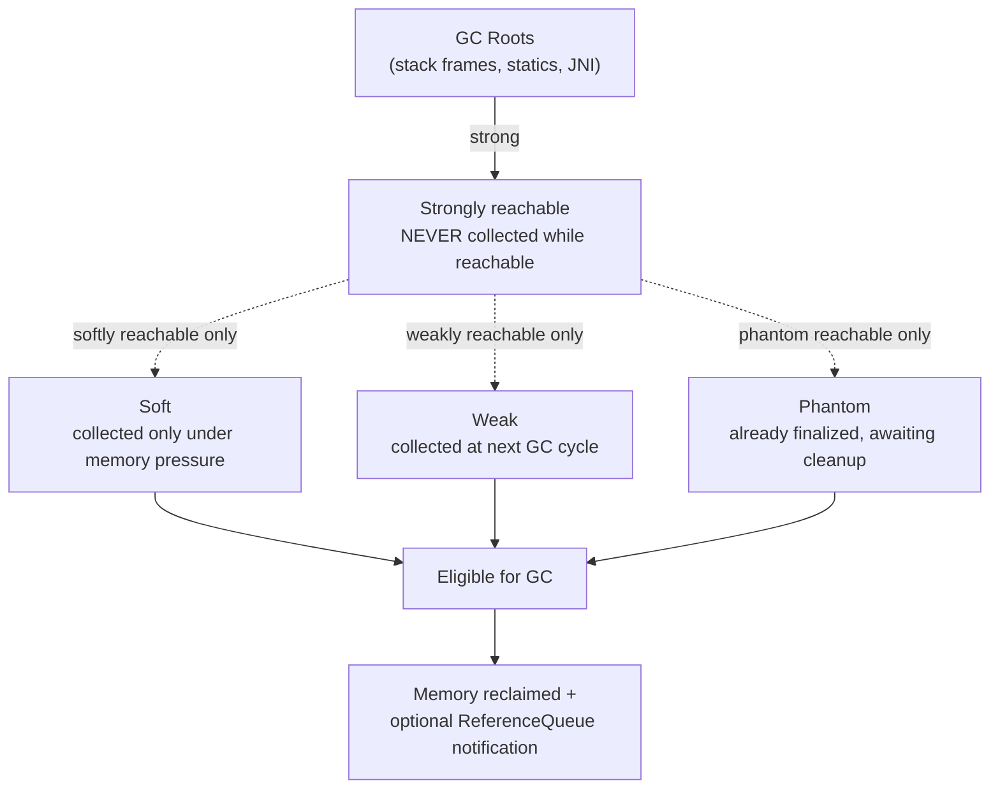
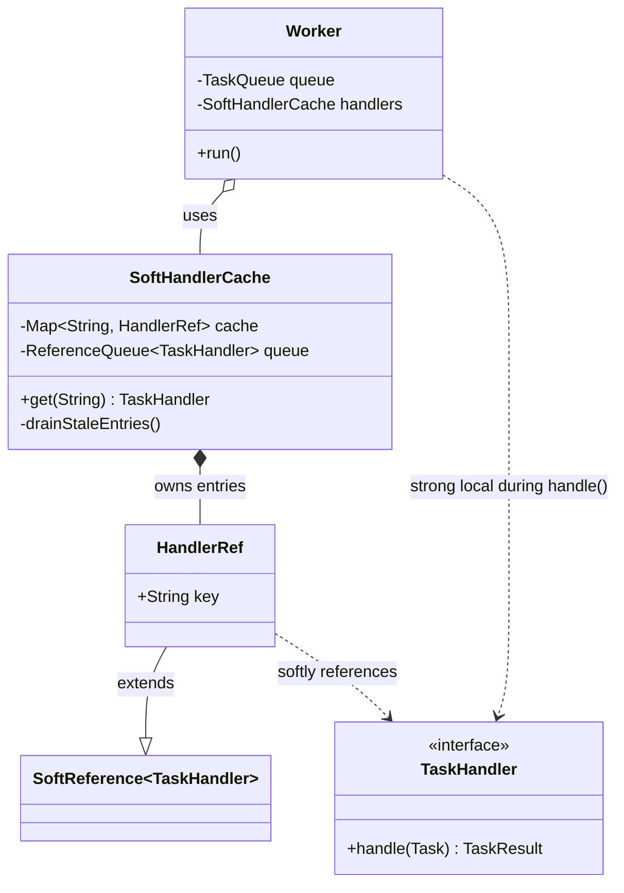

# Object References

> Where this fits in the project: every `Task`, `TaskHandler`, and `TaskQueue` in our platform is touched through a *reference*. Understanding what a reference actually is — a typed handle to a heap object, not the object itself — is the difference between code that quietly leaks memory under load and code that scales. This chapter also unlocks a real production technique: building a worker-side handler cache that lets the garbage collector reclaim entries automatically using `SoftReference` and `WeakReference`.

## Why this exists

In C you carry raw pointers: a 64-bit address you can do arithmetic on, dereference, free, and accidentally dereference again after freeing (use-after-free) — one of the most expensive bug classes in computing history. Java made a deliberate tradeoff: you never hold an address. You hold a **reference**, an opaque handle the JVM controls. You cannot do pointer arithmetic, you cannot `free()`, and you cannot create a dangling pointer. The garbage collector frees objects for you, but only when it can *prove* nothing reachable still points to them.

That last word — **reachability** — is the whole game. The GC starts from a set of *GC roots* (live stack frames, static fields, JNI handles) and walks every reference it can follow. Anything it reaches is *live* and stays. Anything it cannot reach is *garbage* and is eligible for collection. A reference is therefore not just a way to *find* an object; it is a way to *keep it alive*. Hold a reference too long and you have a memory leak in a language that supposedly cannot leak.

Java then went further than most managed languages and exposed the reachability machinery to you through `java.lang.ref`: `SoftReference`, `WeakReference`, `PhantomReference`, and `ReferenceQueue`. These let you say "keep this object only if memory is plentiful" or "let it die the moment nothing else needs it, but tell me when it dies." Caches, canonicalizing maps, and resource cleanup all depend on these. If you have only ever used ordinary (strong) references, half of the memory model is invisible to you.

> If you have not yet read [stack-vs-heap.md](stack-vs-heap.md), skim it first: a reference *variable* lives on the stack (or inside another heap object), while the *object* it points at lives on the heap. This chapter is about the arrow between them.

## The reference taxonomy at a glance



The reachability *strength* of an object is the **strongest** reference that still reaches it. If even one strong reference exists, the object is strongly reachable and immortal until that reference is dropped. Only when *all* remaining paths are soft/weak/phantom do those weaker semantics kick in.

## The naive version — a handler cache that never lets go

Our `Worker` looks up a `TaskHandler` by task type on every dequeue. Building handlers can be expensive (they may hold connection pools, compiled templates, etc.), so a first instinct is to cache them in a map.

```java
// NAIVE: strong references everywhere. The cache is a leak.
public final class HandlerCache {
    private final Map<String, TaskHandler> cache = new HashMap<>();
    private final HandlerFactory factory;

    public HandlerCache(HandlerFactory factory) {
        this.factory = factory;
    }

    public TaskHandler get(String taskType) {
        // computeIfAbsent keeps a STRONG reference to every handler forever.
        return cache.computeIfAbsent(taskType, factory::create);
    }
}
```

What is wrong:

- **It is an unbounded, immortal cache.** Every distinct `taskType` ever seen pins its handler for the lifetime of the cache. If task types are dynamic (tenant-scoped types like `tenant-9f3a:resize-image`), the map grows without bound. The handlers are *strongly reachable* through the map, so the GC can never reclaim them — even when memory is critically low and the JVM would rather drop the cache than throw `OutOfMemoryError`.
- **No eviction policy.** There is no LRU, no TTL, nothing. The map only ever grows.
- **No notion of "nice to keep, fine to drop."** A cache is exactly the place where you want the GC to reclaim entries under pressure and rebuild them later. Strong references give you the opposite: maximum retention regardless of pressure.

This is the single most common Java memory leak: *a long-lived collection holding strong references to objects you have logically finished with.*

## Improved version — bounded cache, but still strong

A reasonable first improvement is to bound the cache and evict by usage. `LinkedHashMap` in access order gives a serviceable LRU.

```java
// IMPROVED: bounded LRU. Better, but eviction is policy-driven, not memory-driven.
public final class BoundedHandlerCache {
    private final Map<String, TaskHandler> cache;
    private final HandlerFactory factory;

    public BoundedHandlerCache(HandlerFactory factory, int maxEntries) {
        this.factory = factory;
        this.cache = new LinkedHashMap<>(16, 0.75f, true) {
            @Override
            protected boolean removeEldestEntry(Map.Entry<String, TaskHandler> e) {
                return size() > maxEntries;
            }
        };
    }

    public synchronized TaskHandler get(String taskType) {
        return cache.computeIfAbsent(taskType, factory::create);
    }
}
```

This caps memory and evicts cold entries. But it still uses *strong* references, so the cache occupies its full configured budget regardless of how much heap is left. If you size `maxEntries` for the worst case it wastes memory in the common case; if you size it for the common case it thrashes under spikes. The cache cannot *cooperate* with the GC. That is what soft/weak references fix.

## Production-quality version — soft-value cache with reference cleanup

A staff engineer ships a cache whose *values* are softly reachable: kept while memory is plentiful, dropped automatically when the JVM is about to run out, and rebuilt on demand. We pair it with a `ReferenceQueue` so we can promptly evict the now-dead map *keys* (otherwise the keys leak — a classic mistake covered later).

```java
import java.lang.ref.ReferenceQueue;
import java.lang.ref.SoftReference;
import java.util.Map;
import java.util.concurrent.ConcurrentHashMap;

/**
 * A handler cache whose values are held softly. Under memory pressure the GC
 * reclaims handlers we are not actively using; the next get() rebuilds them.
 * A ReferenceQueue lets us drain stale map entries so the keys do not leak.
 */
public final class SoftHandlerCache {

    /** SoftReference subclass that remembers its own key, so we can evict it. */
    private static final class HandlerRef extends SoftReference<TaskHandler> {
        final String key;
        HandlerRef(String key, TaskHandler handler, ReferenceQueue<TaskHandler> q) {
            super(handler, q);
            this.key = key;
        }
    }

    private final Map<String, HandlerRef> cache = new ConcurrentHashMap<>();
    private final ReferenceQueue<TaskHandler> queue = new ReferenceQueue<>();
    private final HandlerFactory factory;

    public SoftHandlerCache(HandlerFactory factory) {
        this.factory = factory;
    }

    public TaskHandler get(String taskType) {
        drainStaleEntries(); // housekeeping: remove keys whose values were collected

        HandlerRef ref = cache.get(taskType);
        TaskHandler handler = (ref == null) ? null : ref.get();
        if (handler != null) {
            return handler; // strong local var now keeps it alive for the caller
        }
        // Either absent or the soft value was reclaimed: rebuild and re-cache.
        TaskHandler created = factory.create(taskType);
        cache.put(taskType, new HandlerRef(taskType, created, queue));
        return created;
    }

    /** Remove map entries whose soft value has been cleared by the GC. */
    private void drainStaleEntries() {
        HandlerRef stale;
        while ((stale = (HandlerRef) queue.poll()) != null) {
            // Only remove if still mapped to THIS dead ref (avoid clobbering a fresh entry).
            cache.remove(stale.key, stale);
        }
    }

    public int size() {
        return cache.size();
    }
}
```

Why this is the version to ship:

- **It cooperates with the GC.** The soft cache expands to use spare heap and contracts under pressure. The HotSpot rule of thumb: soft references are cleared in least-recently-used-ish order based on `-XX:SoftRefLRUPolicyMSPerMB` (default ~1000 ms of survival per free MB of heap). You get a self-tuning, memory-pressure-aware cache for free.
- **The `ReferenceQueue` prevents the key leak.** When the GC clears a `HandlerRef`'s referent, it enqueues the `HandlerRef`. `drainStaleEntries()` polls that queue and removes the matching map entry, so dead keys do not accumulate.
- **`remove(key, value)` is the conditional two-arg form**, so we never delete a freshly inserted entry that happens to share the key with a stale one (a real race in concurrent caches).
- **Thread-safe** via `ConcurrentHashMap` and the inherently atomic `ReferenceQueue.poll()`.

> Production reality check: for real workloads, prefer a purpose-built cache like **Caffeine** (`Caffeine.newBuilder().softValues().maximumSize(...).build()`) over hand-rolling this. We build it by hand here to *understand* the reference machinery; in [scaling-the-platform.md](../10-system-design/scaling-the-platform.md) we discuss when to reach for a library instead.

## Code walkthrough

### Beginner — a reference is a handle, not the object

```java
import java.util.UUID;
import java.time.Instant;

public class ReferenceBasics {
    public static void main(String[] args) {
        // 'a' and 'b' are reference VARIABLES (on the stack).
        // The Task OBJECT lives on the heap. There is exactly ONE object here.
        Task a = new Task(
            UUID.randomUUID().toString(), "email", "{\"to\":\"x\"}",
            TaskStatus.PENDING, 0, 3, Instant.now(), Instant.now(), 5);

        Task b = a;            // copies the HANDLE, not the object. Two arrows, one box.

        b.markRunning();       // mutating through b is visible through a (same object)
        System.out.println(a.status()); // RUNNING

        System.out.println(a == b);          // true  -> same identity (same handle)
        System.out.println(a.equals(b));     // true  -> trivially, same object

        a = null;              // drop one handle; the object is still reachable via b
        System.out.println(b.status());      // RUNNING -> object very much alive
        b = null;              // now NO strong reference reaches the object...
        // ...it is eligible for GC. We never freed it; reachability decided its fate.
    }
}
```

The mental model: a reference variable holds a *handle*. Assignment (`b = a`) copies the handle, never the object. `==` compares handles (identity); `equals` compares logical value (and you almost always want `equals`/`hashCode` for domain objects like `Task`).

### Intermediate — strong vs weak reachability, observed

```java
import java.lang.ref.WeakReference;

public class WeakVsStrong {
    public static void main(String[] args) throws InterruptedException {
        Object strong = new Object();
        WeakReference<Object> weak = new WeakReference<>(strong);

        System.out.println(weak.get() != null); // true: 'strong' keeps it alive

        strong = null;        // drop the ONLY strong reference
        System.gc();          // a hint; enough to clear a weakly-reachable object in practice
        Thread.sleep(50);

        System.out.println(weak.get() == null); // true: object was collected
        // The weak reference did NOT keep the object alive. That is the entire point.
    }
}
```

A `WeakReference` lets you *observe* an object without *retaining* it. The instant the object becomes weakly reachable (no strong/soft paths remain), it is eligible for collection at the next GC. This is what `WeakHashMap` uses for its *keys*.

### Production-inspired — wiring the soft cache into a Worker

```java
import java.util.Optional;

/**
 * Worker pulls a Task, resolves its handler via the soft cache, executes,
 * and records the outcome. The cache silently rebuilds handlers the GC
 * reclaimed under pressure -- the Worker code is unaware and unaffected.
 */
public final class CachingWorker implements Runnable {

    private final TaskQueue queue;
    private final SoftHandlerCache handlers;
    private final TaskRepository repository;
    private volatile boolean running = true;

    public CachingWorker(TaskQueue queue, SoftHandlerCache handlers, TaskRepository repository) {
        this.queue = queue;
        this.handlers = handlers;
        this.repository = repository;
    }

    @Override
    public void run() {
        while (running) {
            try {
                Task task = queue.dequeue();           // blocks until work arrives
                TaskHandler handler = handlers.get(task.type()); // may rebuild transparently
                try {
                    TaskResult result = handler.handle(task);
                    Task next = result.success() ? task.succeeded() : task.failed(result);
                    repository.save(next);
                } catch (Exception e) {
                    repository.save(task.failed(
                        new TaskResult(false, e.getMessage(), true)));
                }
            } catch (InterruptedException e) {
                Thread.currentThread().interrupt();    // honor the cancellation contract
                running = false;
            }
        }
    }

    public void stop() {
        this.running = false;
    }
}
```

The key observation: because `handlers.get(...)` returns a *strong* local reference, the handler cannot be collected mid-execution even if memory pressure spikes during `handle(task)`. Soft/weak semantics only apply when *no* strong reference remains. Holding a strong local across the critical section is exactly how you make a soft cache safe to use.

## How this applies to our Task Queue project



Concrete mapping to the canonical model:

- **`TaskQueue` / `InMemoryTaskQueue`.** A `BlockingQueue<Task>` holds *strong* references to every queued `Task`. That is correct: a pending task must not be collected. But it also means a runaway producer that floods an unbounded queue is *literally* a strong-reference leak that ends in `OutOfMemoryError`. Bounding the queue (`new ArrayBlockingQueue<>(capacity)`) plus backpressure ([backpressure.md](../08-distributed-systems/backpressure.md)) is the reference-aware fix.
- **`Worker` and `TaskHandler`.** The handler registry should hold handlers softly (above) so per-tenant or rarely-used handlers can be reclaimed.
- **`MetricsCollector`.** If you key metrics by `Task` instances in a plain map and never remove them, the map pins every task forever. Key by `task.id()` (a `String`) and evict on terminal status instead.
- **`EventBus` listeners (Phase 4).** Subscriptions are the textbook listener leak: the bus holds a strong reference to every `TaskEventListener`, so listeners that forget to unsubscribe live forever. A `WeakReference`-based subscription list (with a `ReferenceQueue` sweep) is one mitigation; explicit `unsubscribe()` is the cleaner one. See [observer.md](../05-design-patterns/observer.md).

## Tradeoffs

| Reference kind | Kept alive while reachable? | Cleared when... | Survives `System.gc()`? | Primary use |
|---|---|---|---|---|
| **Strong** (`Object o = ...`) | Always | Never (until unreachable) | Yes | Normal program references; the default |
| **Soft** (`SoftReference`) | While memory allows | JVM is low on heap (LRU-ish) | Usually yes | Memory-sensitive **caches** |
| **Weak** (`WeakReference`) | No | Next GC after it is weakly reachable | No (cleared) | Canonicalizing maps, `WeakHashMap` keys, listener registries |
| **Phantom** (`PhantomReference`) | No; `get()` always returns `null` | After finalization, before reclamation | N/A | Deterministic **post-mortem cleanup** (replacing `finalize`) |

Other honest tradeoffs:

- **Soft caches are not free lunches.** They add a layer of indirection, defeat some JIT optimizations, and their clearing timing is opaque and GC-implementation-specific. You cannot reason precisely about hit rates. A *bounded* strong-reference cache (Caffeine with `maximumSize`) is more predictable and usually preferable for hot paths; reserve soft references for "large optional cache, never want OOM."
- **Weak references make lifetimes non-local.** An object can vanish between two lines if nothing else holds it. This is great for leak avoidance and terrible for code that assumes stability. Always pin a strong local before use.
- **`PhantomReference` requires a `ReferenceQueue` and a reaper thread.** It is more work than `try-with-resources`, which you should prefer for anything `AutoCloseable`. Phantoms shine only for native resources or cleanup you cannot express with `close()`.
- **`finalize()` is deprecated for removal.** Do not use it. Use `try-with-resources`, or `java.lang.ref.Cleaner` (built on phantom references) for the rare native-handle case.

## Common mistakes and pitfalls

- **The lingering-collection leak.** A `static` `List`/`Map`/`Set` that you only ever add to. *Fix:* remove entries when logically done, bound the collection, or hold values softly/weakly.
- **Using `WeakHashMap` for the wrong side.** `WeakHashMap` holds *keys* weakly, *values* strongly. If your value strongly references its key (directly or via a closure), the key is never weakly reachable and never collected — the map leaks. *Fix:* make sure values do not reference keys, or use a soft-value cache instead.
- **Forgetting to drain the `ReferenceQueue`.** Soft/weak references whose referents are cleared still leave the *`Reference` object* and (in a map) its *key* in your structure. *Fix:* poll the queue and remove stale entries, as in `drainStaleEntries()`.
- **Relying on `System.gc()` for correctness.** It is a hint; a JVM may ignore it. *Fix:* never depend on GC timing for program logic — only for tests, and even there, prefer awaiting a condition.
- **Confusing `==` with `equals`.** `==` compares handles (identity). Two distinct `Task` objects with equal fields are `equals` but not `==`. *Fix:* override `equals`/`hashCode`; use `equals` for value comparison (records do this for you).
- **Assuming reassigning a field frees memory immediately.** Setting `a = null` only drops *that* handle; the object survives if any other handle reaches it. *Fix:* trace all reachability paths, not just the one in front of you.
- **Holding a strong reference inside a soft cache value.** If your cached value strongly references the cache or the key, you re-pin everything. *Fix:* keep cached values self-contained.

## Refactoring exercise

**Bad — a listener registry that leaks every subscriber forever:**

```java
// BAD: strong references; unsubscribed-in-spirit listeners never die.
public final class TaskEventBus {
    private final List<TaskEventListener> listeners = new ArrayList<>();

    public void subscribe(TaskEventListener l) { listeners.add(l); }

    public void publish(TaskEvent e) {
        for (TaskEventListener l : listeners) l.onEvent(e);
    }
}
```

A short-lived `DashboardListener` that subscribes and is then discarded is still strongly reachable through `listeners`. It never gets collected, and worse, it keeps receiving events.

**Improved — explicit unsubscribe with a returned token:**

```java
// IMPROVED: callers can remove themselves. Still leaks if they forget.
public final class TaskEventBus {
    private final List<TaskEventListener> listeners = new CopyOnWriteArrayList<>();

    public AutoCloseable subscribe(TaskEventListener l) {
        listeners.add(l);
        return () -> listeners.remove(l); // close() to unsubscribe
    }

    public void publish(TaskEvent e) {
        for (TaskEventListener l : listeners) l.onEvent(e);
    }
}
```

Better — `try (var sub = bus.subscribe(listener)) { ... }` deterministically unsubscribes. But undisciplined callers still leak.

**Production-quality — weak subscriptions with a reference-queue sweep, plus explicit unsubscribe as the happy path:**

```java
import java.lang.ref.ReferenceQueue;
import java.lang.ref.WeakReference;
import java.util.concurrent.ConcurrentLinkedQueue;

/**
 * Listeners are held weakly: if a subscriber is otherwise unreachable, it is
 * collected and silently dropped on the next publish/sweep. Callers SHOULD
 * still unsubscribe explicitly; weakness is a safety net, not a license to
 * be sloppy. A ReferenceQueue lets us purge dead WeakReferences promptly.
 */
public final class WeakTaskEventBus {

    private static final class Sub extends WeakReference<TaskEventListener> {
        Sub(TaskEventListener l, ReferenceQueue<TaskEventListener> q) { super(l, q); }
    }

    private final ConcurrentLinkedQueue<Sub> subs = new ConcurrentLinkedQueue<>();
    private final ReferenceQueue<TaskEventListener> dead = new ReferenceQueue<>();

    public AutoCloseable subscribe(TaskEventListener l) {
        Sub sub = new Sub(l, dead);
        subs.add(sub);
        return sub::clear; // explicit unsubscribe: clear the weak ref now
    }

    public void publish(TaskEvent e) {
        sweep();
        for (Sub s : subs) {
            TaskEventListener l = s.get(); // pin strongly for the call
            if (l != null) {
                l.onEvent(e);
            }
        }
    }

    private void sweep() {
        Object stale;
        while ((stale = dead.poll()) != null) {
            subs.remove(stale); // drop the dead WeakReference wrapper itself
        }
    }
}
```

This survives forgetful callers (weakly reachable listeners are collected) *and* serves disciplined callers (explicit unsubscribe via `close()`), while the `ReferenceQueue` keeps the `subs` collection from accumulating dead wrappers.

## Exercises

### Easy

1. **(Knowledge check)** True or false, with one sentence of justification each:
   (a) After `b = a; a = null;`, the object is eligible for GC.
   (b) `SoftReference.get()` can return `null`.
   (c) `WeakReference` keeps its referent alive across a GC.
   (d) `PhantomReference.get()` returns the referent.

2. **(Coding)** Write a method `boolean sameObject(Task x, Task y)` that returns `true` only when `x` and `y` are the *same* object (identity), and a separate `boolean sameValue(Task x, Task y)` that returns `true` when they have equal `id` and `status`. Show why one uses `==` and the other does not.

### Medium

3. **(Coding)** Implement a `WeakReference`-based "interner" `TaskTypeInterner` with method `String intern(String type)` that returns a canonical instance per distinct value, so equal type strings share one object, and the canonical instance is collected once no caller references it. Use a `Map<String, WeakReference<String>>` and a `ReferenceQueue`.

4. **(Refactoring)** Take the `BoundedHandlerCache` from the Improved section and convert it into a soft-value cache *without* leaking keys. Prove (in a comment) why a naive `Map<String, SoftReference<TaskHandler>>` leaks keys and how your `ReferenceQueue` fixes it.

### Hard

5. **(Design)** Design the reference strategy for the `EventBus` in Phase 4, where listeners may be in-process objects *or* proxies to remote subscribers. Specify, per listener kind, whether you hold strong/weak/soft and why, how you detect dead remote subscribers, and how you avoid both leaks and "lost notification" bugs. No code required — a one-page design with a table.

6. **(Interview-style)** A teammate reports that the service's heap grows steadily and a heap dump shows millions of `Task` objects retained by a `ConcurrentHashMap` in `MetricsCollector`. Diagnose the leak in terms of reachability, then propose two distinct fixes (one structural, one reference-based) and state the tradeoff between them.

7. **(Stretch)** Replace any use of `finalize()` with a `java.lang.ref.Cleaner` to release a native-ish resource (simulate with an `AtomicBoolean` "closed" flag). Demonstrate that the cleaner runs after the owning object becomes unreachable, and explain why `Cleaner` (phantom-based) is safer than `finalize`.

## Solutions

### Solution 1 (Knowledge check)

(a) **True** — after `a = null`, the only handle is `b`; but the object is reachable via `b`, so it is *not* eligible. Trick: the statement says "after `b = a; a = null;`" — `b` still reaches it, so **False** that it is eligible. (The object is eligible only once `b` is also dropped.)
(b) **True** — a soft reference's referent can be cleared under memory pressure, after which `get()` returns `null`.
(c) **False** — `WeakReference` never keeps its referent alive; it is cleared at the next GC once the referent is weakly reachable.
(d) **False** — `PhantomReference.get()` always returns `null` by design; you use it only to learn *when* the referent has been finalized, via a `ReferenceQueue`.

### Solution 2

```java
public final class IdentityVsValue {
    // Same object: compare handles. Used when identity is what you mean.
    public static boolean sameObject(Task x, Task y) {
        return x == y; // true only if both handles point to the ONE heap object
    }

    // Same value: compare logical content. Records generate equals() from fields,
    // but here we want a partial comparison, so we compare the fields explicitly.
    public static boolean sameValue(Task x, Task y) {
        if (x == y) return true;
        if (x == null || y == null) return false;
        return x.id().equals(y.id()) && x.status() == y.status();
        // x.status() == y.status() is fine: TaskStatus is an enum (identity == value).
    }
}
```

`==` on `Task` compares references (identity). Two `Task` objects deserialized from the same row are distinct objects, so `==` is `false` even though they represent the same task — which is exactly why value comparison must go through fields/`equals`.

### Solution 3

```java
import java.lang.ref.ReferenceQueue;
import java.lang.ref.WeakReference;
import java.util.Map;
import java.util.concurrent.ConcurrentHashMap;

public final class TaskTypeInterner {
    private static final class Ref extends WeakReference<String> {
        final String key;
        Ref(String key, String value, ReferenceQueue<String> q) {
            super(value, q);
            this.key = key;
        }
    }

    private final Map<String, Ref> pool = new ConcurrentHashMap<>();
    private final ReferenceQueue<String> dead = new ReferenceQueue<>();

    public String intern(String type) {
        purge();
        // Defensive copy so the canonical instance is independent of caller's string.
        String value = new String(type);
        while (true) {
            Ref existing = pool.get(type);
            if (existing != null) {
                String canonical = existing.get();
                if (canonical != null) {
                    return canonical; // share the live canonical instance
                }
                pool.remove(type, existing); // stale; fall through to reinsert
            }
            Ref created = new Ref(type, value, dead);
            Ref prior = pool.putIfAbsent(type, created);
            if (prior == null) {
                return value;
            }
            String winner = prior.get();
            if (winner != null) {
                return winner; // someone else won the race; use theirs
            }
            pool.remove(type, prior); // their value died; retry
        }
    }

    private void purge() {
        Ref stale;
        while ((stale = (Ref) dead.poll()) != null) {
            pool.remove(stale.key, stale);
        }
    }
}
```

Because values are held weakly, once no caller keeps a canonical instance it is collected and `purge()` removes its key — no unbounded growth. The CAS-style loop handles concurrent racers and freshly-died entries.

### Solution 4

```java
import java.lang.ref.ReferenceQueue;
import java.lang.ref.SoftReference;
import java.util.Map;
import java.util.concurrent.ConcurrentHashMap;

public final class SoftBoundedHandlerCache {
    // WHY a naive Map<String, SoftReference<TaskHandler>> leaks KEYS:
    // when the GC clears a SoftReference's value, the String key and the now-empty
    // SoftReference object both REMAIN in the map. Over time the map fills with
    // empty references keyed by every type ever seen. The ReferenceQueue below
    // lets us learn which references were cleared and remove their keys.
    private static final class HRef extends SoftReference<TaskHandler> {
        final String key;
        HRef(String key, TaskHandler h, ReferenceQueue<TaskHandler> q) { super(h, q); this.key = key; }
    }

    private final Map<String, HRef> cache = new ConcurrentHashMap<>();
    private final ReferenceQueue<TaskHandler> dead = new ReferenceQueue<>();
    private final HandlerFactory factory;

    public SoftBoundedHandlerCache(HandlerFactory factory) { this.factory = factory; }

    public TaskHandler get(String type) {
        drain();
        HRef ref = cache.get(type);
        TaskHandler h = (ref == null) ? null : ref.get();
        if (h != null) return h;
        TaskHandler created = factory.create(type);
        cache.put(type, new HRef(type, created, dead));
        return created;
    }

    private void drain() {
        HRef stale;
        while ((stale = (HRef) dead.poll()) != null) {
            cache.remove(stale.key, stale);
        }
    }
}
```

### Solution 5 (design sketch)

| Listener kind | Reference held | Rationale | Death detection |
|---|---|---|---|
| In-process object | **Weak**, with explicit `unsubscribe()` as primary path | Safety net against forgotten unsubscribes; bus must not pin app objects | `ReferenceQueue` sweep on publish |
| Remote subscriber proxy | **Strong**, with heartbeat/lease | A proxy is cheap; the *remote* side is what may vanish, and GC cannot see that | Lease expiry / missed heartbeats → explicit removal |

Lost-notification avoidance: never deliver to a `get()`-ed listener without pinning it to a strong local first; for remote proxies, deliver through a durable outbox so a momentarily-unreachable subscriber gets the event on reconnect (ties into [message-queues.md](../07-queues-and-messaging/message-queues.md) and idempotency at the consumer). Leak avoidance: weak in-process refs + lease-based remote refs ensure no category grows unbounded.

### Solution 6 (diagnosis)

Reachability diagnosis: the `ConcurrentHashMap` in `MetricsCollector` is a GC root path (reachable from a static or long-lived field). Every `Task` used as a key (or value) is therefore *strongly reachable* and immortal. Even after a task reaches `SUCCEEDED`/`DEAD`, the map still reaches it, so the GC cannot reclaim it. Millions of terminal tasks accumulate.

Fix A (structural): never key metrics by `Task` objects. Aggregate into bounded counters/timers keyed by `task.type()` and `task.status()` (a handful of cardinalities), discarding per-task identity entirely. Memory becomes O(number of types), not O(number of tasks).

Fix B (reference-based): if per-task entries are genuinely required, hold them in a `WeakHashMap`-style structure or evict on terminal status with a `ReferenceQueue` sweep.

Tradeoff: Fix A loses per-task granularity but is bounded and cheap and is what you actually want for metrics; Fix B preserves granularity but reintroduces lifetime complexity and is still unbounded if tasks are long-lived. Ship Fix A; reach for B only if an audit trail truly needs per-task data — and then push it to storage, not the heap.

### Solution 7

```java
import java.lang.ref.Cleaner;
import java.util.concurrent.atomic.AtomicBoolean;

public final class NativeResource implements AutoCloseable {
    private static final Cleaner CLEANER = Cleaner.create();

    // State MUST NOT reference the outer NativeResource, or the object can never
    // become phantom-reachable and the cleaner never runs.
    private static final class State implements Runnable {
        private final AtomicBoolean closed = new AtomicBoolean(false);
        @Override public void run() {            // the cleanup action
            if (closed.compareAndSet(false, true)) {
                System.out.println("released native handle");
            }
        }
    }

    private final State state = new State();
    private final Cleaner.Cleanable cleanable = CLEANER.register(this, state);

    @Override public void close() {              // deterministic path (preferred)
        cleanable.clean(); // runs state.run() now, exactly once
    }
}
```

`Cleaner` is built on phantom references: the registered `State` runs only after the `NativeResource` becomes phantom-reachable (unreachable and finalized). It is safer than `finalize()` because the cleanup logic lives in a *separate* object that cannot accidentally resurrect the owner, runs on a dedicated thread, and is invoked exactly once. Always prefer the deterministic `close()` via try-with-resources; the cleaner is the safety net for callers who forget.

## Interview questions and takeaways

1. **What is the difference between a reference and a pointer?** A reference is an opaque, type-safe handle managed by the JVM; you cannot do arithmetic on it, free it, or dereference a freed one. A pointer is a raw address. References enable GC and eliminate use-after-free and dangling-pointer bugs at the cost of giving up manual control.

2. **Name the four reference strengths and one use case each.** Strong (normal refs), Soft (memory-sensitive caches), Weak (canonicalizing maps / listener registries / `WeakHashMap` keys), Phantom (deterministic post-mortem cleanup via `Cleaner`).

3. **When is an object eligible for garbage collection?** When it is no longer *strongly* reachable from any GC root. If only soft/weak/phantom paths remain, weaker semantics apply (soft = cleared under pressure, weak = next GC, phantom = after finalization).

4. **How does `SoftReference` differ from `WeakReference`?** Soft references are cleared only when the JVM is short on memory (great for caches); weak references are cleared at the next GC once the referent is weakly reachable (great for not retaining objects at all).

5. **Why does `WeakHashMap` sometimes leak?** It holds *keys* weakly but *values* strongly. If a value references its key, the key stays strongly reachable and is never collected, so the entry never goes away.

6. **What is a `ReferenceQueue` for?** The GC enqueues a `Reference` object after clearing its referent, letting you perform cleanup (e.g., remove stale map entries/keys) deterministically rather than scanning for empties.

7. **Why is `finalize()` deprecated, and what replaces it?** It runs on an unspecified thread at an unspecified time, can resurrect objects, and harms performance. Replace it with try-with-resources for `AutoCloseable` and `java.lang.ref.Cleaner` for native cleanup.

8. **How can a memory leak happen in a garbage-collected language?** By keeping objects strongly reachable longer than needed — typically a long-lived collection (static map/list, cache, listener registry) that you only add to.

**Takeaways:** a reference *keeps things alive*; reachability, not your intent, decides what survives; caches want soft values + a reference queue; listeners want weak refs + explicit unsubscribe; and you almost never want `finalize`.

## Production considerations

- **Heap dumps are your truth.** When the heap grows, take a dump (`jmap -dump:live,format=b,file=heap.hprof <pid>`) and open it in Eclipse MAT or VisualVM. Sort by *retained size* and look at the *dominator tree* — the leak is whatever long-lived object retains the most. Nine times out of ten it is a strong-referenced collection.
- **Tune soft-reference aggressiveness.** `-XX:SoftRefLRUPolicyMSPerMB` controls how long soft referents survive per free MB. Lower it to clear caches sooner under pressure; raise it for cache-heavy services with ample heap. Measure cache hit rate before and after.
- **Soft references and OOM.** The JVM clears all softly-reachable objects before throwing `OutOfMemoryError`. A soft cache therefore *cannot* be the direct cause of OOM — but the objects you pull *out* of it (and pin strongly) can. Watch your strong roots.
- **GC pauses scale with live set.** Weak/soft/phantom references add work to GC (reference processing). Millions of them measurably lengthen pauses. Prefer bounded strong caches on hot paths; reserve weak/soft for genuinely optional, large structures.
- **Listener leaks are silent until they are not.** They manifest as slowly growing heap and *duplicate* event processing (dead-but-reachable listeners still fire). Add a gauge for `eventBus.subscriberCount` and alert on unbounded growth.
- **Never depend on `System.gc()`** in production; it can trigger a costly full GC or be disabled entirely via `-XX:+DisableExplicitGC`. See [garbage-collection.md](garbage-collection.md) for collector internals and tuning.

## What We Can Improve In Our Project Using This Concept

- Replace the strong-reference handler registry in `Worker`/`WorkerPool` with `SoftHandlerCache`, so rarely-used and per-tenant handlers are reclaimable under memory pressure instead of pinned forever.
- Bound `InMemoryTaskQueue` and add backpressure so a flood of strongly-referenced `Task` objects cannot OOM the JVM.
- Make `MetricsCollector` key by `task.id()`/`task.type()` and aggregate, eliminating per-`Task` retention.
- Harden the Phase 4 `EventBus` against listener leaks with weak subscriptions plus explicit `unsubscribe()`.

## Project Refactoring Task

Introduce `SoftHandlerCache` and wire it into `Worker`. Add a JUnit 5 + AssertJ test that registers a handler, forces memory pressure (or invokes `System.gc()` after dropping the strong reference) and asserts the cache rebuilds the handler on the next `get(...)`. Add a second test asserting that after the soft value is cleared, `drainStaleEntries()` removes the dead key (assert `cache.size()` returns to zero). Then audit the codebase for any `static` collection that only grows and convert it to a bounded or weak/soft structure.

## Git Commit For This Chapter

```text
refactor(worker): cache TaskHandlers with soft references to avoid retention leaks

- Add SoftHandlerCache backed by SoftReference + ReferenceQueue
- Wire CachingWorker to resolve handlers via the soft cache
- Bound InMemoryTaskQueue capacity to prevent strong-reference OOM
- Key MetricsCollector by task id/type instead of Task instances
- Tests: cache rebuild under GC pressure; stale-key drain to zero

Files touched:
  src/main/java/.../worker/SoftHandlerCache.java
  src/main/java/.../worker/CachingWorker.java
  src/main/java/.../queue/InMemoryTaskQueue.java
  src/main/java/.../metrics/MetricsCollector.java
  src/test/java/.../worker/SoftHandlerCacheTest.java
```

## Architecture Impact

This change keeps worker memory bounded and self-tuning: the handler cache now scales with available heap rather than with the number of distinct task types ever seen, removing a latent OOM under multi-tenant load. Bounding the in-memory queue turns silent heap exhaustion into explicit backpressure, which the API layer can translate into a 429/503 instead of a crash. The `EventBus` hardening removes a class of duplicate-delivery bugs. Net effect: predictable, bounded memory across the worker tier, a prerequisite for the horizontal scaling targeted in Phase 4.

## Interview Takeaways

- A reference is a *handle that keeps objects alive*; **reachability** decides GC, not your intent.
- Memory leaks in Java are almost always *long-lived strong references* in a collection you only add to.
- Caches want **soft** values plus a **`ReferenceQueue`** to evict dead keys; registries want **weak** refs plus explicit unsubscribe.
- `WeakHashMap` holds keys weakly and values strongly — a value that references its key reintroduces the leak.
- Never use `finalize()`; use try-with-resources or `Cleaner`. Never rely on `System.gc()` for correctness.
