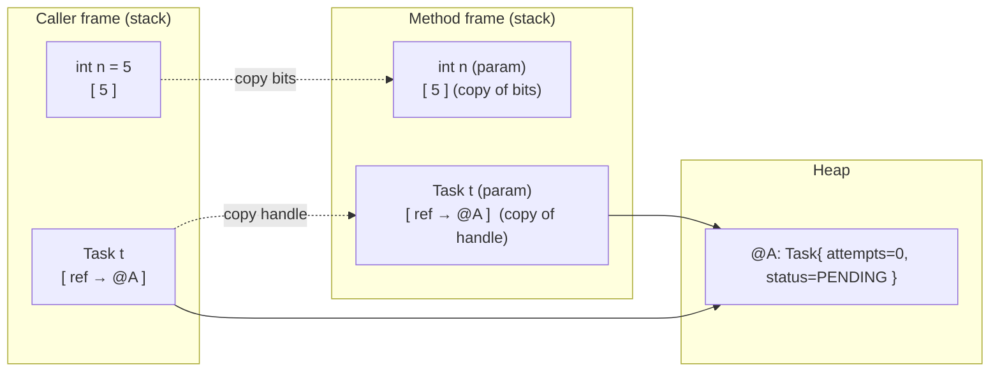
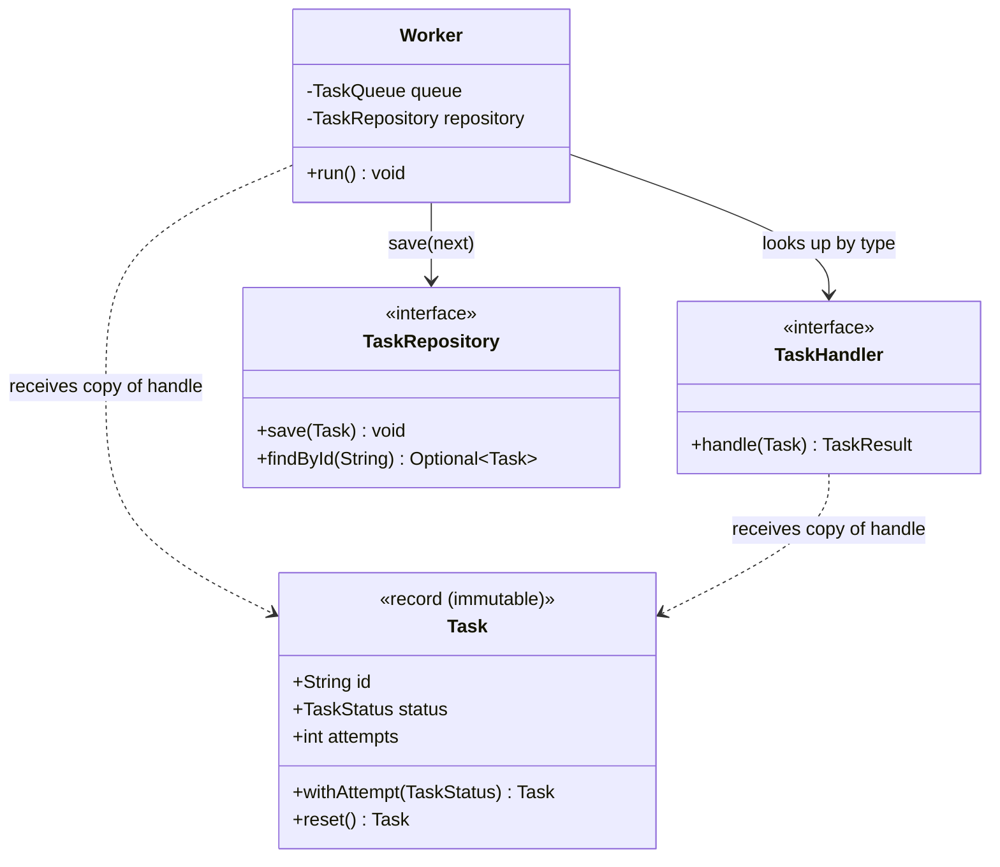

# Pass-by-Value in Java

> Where this fits in the project: every time our `Worker` hands a `Task` to a `TaskHandler`, or a `RetryPolicy` mutates `attempts`, or two worker threads touch the *same* `Task` object, the result is governed by one rule — **Java is always pass-by-value**. Misunderstanding this rule is the single most common source of "but I changed it and it didn't change" bugs in a backend service. This chapter makes the rule mechanical and obvious.

---

## 1. Why this exists — the real problem it solves

When you call a method and pass an argument, the language must decide *what exactly the parameter receives*. There are two classic answers:

- **Pass-by-value**: the method gets a **copy** of the argument. Changes to the parameter do not affect the caller's variable.
- **Pass-by-reference**: the method gets an **alias** for the caller's variable. Reassigning the parameter reassigns the caller's variable.

C++ has both (`int x` vs `int& x`). C has only pass-by-value but lets you *simulate* by-reference with pointers (`int*`). Java made a deliberate, simplifying choice in 1995: **Java is pass-by-value, always, with no exceptions and no syntax to opt out.** There is no `&`, no `ref`, no `out`. This removed a whole category of aliasing surprises that plagued C/C++ codebases.

The catch — and the reason this is the most-asked Java interview question — is that for objects, **the value that gets copied is a reference** (a handle/pointer to a heap object), not the object itself. So when people say "Java passes objects by reference," they are confusing two different things:

1. The *reference* is passed by value (a copy of the handle).
2. Both handles still point at the *same* heap object, so mutations through either handle are visible to both.

These two facts coexist, and keeping them straight is the entire game. For background on how variables hold references and where objects live, see [`object-references.md`](object-references.md) and [`stack-vs-heap.md`](stack-vs-heap.md).

> **The one-sentence rule:** Java copies the *contents of the variable*. For primitives, that's the value. For objects, that's the reference (an address-like handle). It never copies the object, and it never aliases the caller's variable slot.

---

## 2. The mental model: variables, slots, and handles

Think of every variable — local, parameter, field — as a labeled **box** (a slot) that holds **bits**.

- A primitive variable's box holds the actual bits (`int attempts` holds `0x00000003`).
- An object variable's box holds a **reference** — an opaque handle the JVM uses to find the object on the heap.

When you call `method(x)`, the JVM **copies the bits in `x`'s box into the parameter's box**. That copy is the whole story.



Two crucial reads of this diagram:

- The primitive copy (`n`) is fully independent. Nothing the method does to its `n` touches the caller's `n`.
- The reference copy (`t`) is independent **as a slot**, but both slots point at `@A`. The method can mutate `@A`, and the caller sees it. The method cannot make the caller's slot point somewhere else.

---

## 3. The naive version — the bug that ships

A first-cut `RetryPolicy`-style helper that "resets" a task before requeueing. The author *thinks* they are reassigning the caller's task to a fresh one.

```java
// NAIVE — looks correct, silently does nothing useful
public final class TaskResetterNaive {

    /** Intends to give the caller a brand-new PENDING task. It does not. */
    public static void reset(Task task) {
        // Reassigning the PARAMETER. This only repoints the local copy of the handle.
        task = new Task(
            task.id(), task.type(), task.payload(),
            TaskStatus.PENDING, 0, task.maxAttempts(),
            task.createdAt(), task.scheduledAt(), task.priority()
        );
        // The new object is now referenced ONLY by the local `task`. The caller never sees it.
    }
}
```

Caller:

```java
Task t = Task.create("email", "{\"to\":\"a@b.com\"}");   // status=PENDING, attempts already 0
// ... worker ran it, attempts became 3, status FAILED ...
TaskResetterNaive.reset(t);
System.out.println(t.status() + " attempts=" + t.attempts());
// EXPECTED (by the author): PENDING attempts=0
// ACTUAL:                   FAILED  attempts=3   <-- the reset evaporated
```

**Why it fails:** `reset` reassigned its *local* `task` slot. That slot was a copy of the caller's handle. Repointing the copy does nothing to the caller's slot, and when the method returns the local slot is discarded. The freshly built object becomes unreachable and is garbage-collected (see [`garbage-collection.md`](garbage-collection.md)).

This is the trap in its purest form: **reassigning a parameter never affects the caller.**

---

## 4. Improved version — mutate the object the caller can see

If `Task` were mutable, we could change the *fields of the shared object* instead of repointing the local handle. Mutation flows back to the caller because both slots reference the same heap object.

```java
// MUTABLE Task variant used ONLY to illustrate the mechanic.
// Our canonical Task is a record (immutable); see section 7 for why that is better.
public final class MutableTask {
    String id, type, payload;
    TaskStatus status;
    int attempts, maxAttempts;
    // ... constructor / getters omitted for brevity ...
}

public final class TaskResetterImproved {

    /** Works: mutates the shared object, so the caller observes the change. */
    public static void reset(MutableTask task) {
        task.status = TaskStatus.PENDING;   // writes through the handle into @A
        task.attempts = 0;                  // same object the caller holds
        // No reassignment of `task` itself — we never touch the local slot.
    }
}
```

Now the caller's `t.status()` reads `PENDING`. This works, and it is exactly how a lot of real Java code behaves. But it is a *footgun*: it relies on shared mutable state, and the moment two worker threads share that `MutableTask`, you have a data race (see section 14 and [`atomics-and-thread-safety.md`](../06-concurrency/atomics-and-thread-safety.md)).

---

## 5. Production-quality version — return a new value, never mutate-in-place across boundaries

The version a staff engineer ships keeps `Task` **immutable** (a record) and treats "reset" as a **pure function**: input task in, new task out. The caller is responsible for replacing its own reference. This sidesteps the pass-by-value confusion entirely — because there is nothing to mutate, the only way to "change" a task is to produce a new one and reassign at the call site.

```java
// Canonical immutable model (matches the curriculum's domain model).
public record Task(
        String id,
        String type,
        String payload,
        TaskStatus status,
        int attempts,
        int maxAttempts,
        java.time.Instant createdAt,
        java.time.Instant scheduledAt,
        int priority) {

    public static Task create(String type, String payload) {
        var now = java.time.Instant.now();
        return new Task(java.util.UUID.randomUUID().toString(), type, payload,
                TaskStatus.PENDING, 0, 5, now, now, 0);
    }

    /** Pure: returns a NEW Task; never mutates `this`. */
    public Task reset() {
        return new Task(id, type, payload, TaskStatus.PENDING, 0,
                maxAttempts, createdAt, scheduledAt, priority);
    }

    /** Pure: returns a NEW Task with attempts+1 and the given status. */
    public Task withAttempt(TaskStatus newStatus) {
        return new Task(id, type, payload, newStatus, attempts + 1,
                maxAttempts, createdAt, scheduledAt, priority);
    }
}
```

```java
public final class RetryService {
    private final TaskRepository repository;   // see TaskRepository in the domain model

    public RetryService(TaskRepository repository) {
        this.repository = repository;
    }

    /** The call site reassigns its OWN reference, then persists. No aliasing surprises. */
    public Task requeue(Task failed) {
        Task fresh = failed.reset();   // new object
        repository.save(fresh);        // make the change durable
        return fresh;                  // hand the new reference back to the caller
    }
}
```

**Rationale:** with immutability, the pass-by-value rule becomes harmless trivia. You *cannot* accidentally mutate the caller's task, because the object has no mutators. The only way to propagate change is `task = task.withAttempt(...)` at the call site, which is explicit and reviewable. We dig into this in [`immutable-objects.md`](immutable-objects.md).

---

## 6. Code walkthrough — beginner, intermediate, production

### 6.1 Beginner: primitives never come back changed

```java
public class PassByValuePrimitives {

    static void tryToBump(int attempts) {
        attempts = attempts + 1;   // bumps the LOCAL copy only
        System.out.println("inside method:  attempts = " + attempts); // 4
    }

    public static void main(String[] args) {
        int attempts = 3;
        tryToBump(attempts);
        System.out.println("after method:   attempts = " + attempts); // 3 — unchanged
    }
}
```

The method received a copy of the bits `3`. Incrementing the copy left the original alone. To "return" a new value, you must literally `return` it: `attempts = bump(attempts);`.

### 6.2 Intermediate: the two faces of an object parameter

```java
import java.time.Instant;

public class PassByValueObjects {

    // Face 1: MUTATION through the handle — visible to the caller.
    static void mutate(StringBuilder sb) {
        sb.append("-mutated");   // writes into the shared object
    }

    // Face 2: REASSIGNMENT of the parameter — invisible to the caller.
    static void reassign(StringBuilder sb) {
        sb = new StringBuilder("brand-new");  // repoints the LOCAL copy only
        sb.append("-and-ignored");
    }

    public static void main(String[] args) {
        StringBuilder a = new StringBuilder("task");
        mutate(a);
        System.out.println("after mutate:   " + a);   // task-mutated   (changed)

        StringBuilder b = new StringBuilder("task");
        reassign(b);
        System.out.println("after reassign: " + b);   // task           (unchanged)
    }
}
```

> **The whole interview answer in two lines:** mutation through the handle is visible; reassignment of the parameter is not. Both are consistent with "the reference was passed by value."

### 6.3 Production-inspired: a Worker executes a handler, and why immutability saves us

```java
import java.util.Map;
import java.util.concurrent.ConcurrentHashMap;

@FunctionalInterface
interface TaskHandler {
    TaskResult handle(Task task) throws Exception;
}

record TaskResult(boolean success, String message, boolean retryable) {
    static TaskResult ok(String m)    { return new TaskResult(true,  m, false); }
    static TaskResult retry(String m) { return new TaskResult(false, m, true);  }
}

/**
 * A Worker pulls a Task, finds its handler, runs it, and decides the next state.
 * Because Task is an immutable record, the handler CANNOT corrupt the Worker's
 * view of the task: it receives a copy of the handle to a frozen object.
 */
public final class Worker implements Runnable {

    private final TaskQueue queue;
    private final Map<String, TaskHandler> handlers;
    private final TaskRepository repository;
    private volatile boolean running = true;

    public Worker(TaskQueue queue, Map<String, TaskHandler> handlers, TaskRepository repository) {
        this.queue = queue;
        this.handlers = handlers;
        this.repository = repository;
    }

    @Override
    public void run() {
        while (running) {
            try {
                Task task = queue.dequeue();                    // local handle to a frozen object
                TaskHandler handler = handlers.get(task.type());
                if (handler == null) {
                    repository.save(task.withStatus(TaskStatus.DEAD));
                    continue;
                }
                TaskResult result = handler.handle(task);       // handler can't mutate `task`
                Task next = result.success()
                        ? task.withStatus(TaskStatus.SUCCEEDED)
                        : task.withAttempt(TaskStatus.RETRYING); // produces a NEW Task
                repository.save(next);                          // reassign-and-persist
            } catch (InterruptedException e) {
                Thread.currentThread().interrupt();
                running = false;
            } catch (Exception e) {
                // handler threw — left as production concern; see section 14
            }
        }
    }

    public void stop() { running = false; }
}
```

Even if a buggy `TaskHandler` *tried* to scribble on the task, it could not: there are no setters. The worst it could do is build its own copy and forget it — exactly the harmless naive bug from section 3. Immutability turns a class of cross-boundary mutation bugs into no-ops.

(`withStatus` is the obvious sibling of `withAttempt`; both return new `Task` instances.)

---

## 7. How this applies to our Task Queue project

The canonical domain model leans on pass-by-value semantics in several hot spots:

| Call site | What is passed by value | Right way to "change" it |
| --- | --- | --- |
| `TaskHandler.handle(Task task)` | a copy of the handle to a frozen `Task` | return a `TaskResult`; let the `Worker` build the next `Task` |
| `RetryPolicy.nextDelay(int attempt)` | a copy of the `int` | return `Optional<Duration>`; never mutate `attempt` |
| `DeadLetterQueue.send(Task t, String reason)` | copies of two handles | DLQ stores/forwards; it does not mutate `t` |
| `TaskRepository.save(Task t)` | a copy of the handle | repository persists the snapshot it was handed |
| `EventBus.publish(TaskEvent e)` | a copy of the handle | listeners receive the same immutable event |



The dotted dependencies (`..>`) carry the key insight: callers pass **copies of handles** to a **shared immutable `Task`**. No one mutates across the boundary; everyone produces new `Task` values and reassigns.

---

## 8. Tradeoffs

| Approach | Pros | Cons | When to choose |
| --- | --- | --- | --- |
| **Mutate shared object in-method** | Zero allocation; "natural" for OO beginners | Aliasing bugs; not thread-safe; hard to reason about who changed what | Tight inner loops on a *thread-confined* object you fully own |
| **Return a new value (immutable)** | No aliasing; trivially thread-safe; auditable history | Extra allocations; more boilerplate (mitigated by records) | Default for domain objects like `Task`, `TaskResult`, `TaskEvent` |
| **Mutable holder / array as out-param** | Lets a method "return" multiple values | Obscure; smells of C pointer-passing; easy to misuse | Almost never — prefer a record return type |

A note on allocation cost: a `Task` is a small object (a handful of references + ints). On modern JVMs with escape analysis and TLAB allocation, short-lived `withAttempt(...)` copies are cheap and often die in the young generation. Do **not** trade correctness for premature allocation savings on the task path; profile first (see [`garbage-collection.md`](garbage-collection.md)).

---

## 9. Common mistakes and pitfalls

- **"Java passes objects by reference."** No. It passes the *reference by value*. Reassigning the parameter proves it — the caller is unaffected.
- **Trying to swap two objects in a method.** `void swap(Task a, Task b)` cannot swap the caller's variables. It only swaps local copies of handles. *Fix:* return a record/pair, or swap at the call site.
- **Using an `int[]{value}` or a one-field "holder" as an out-parameter.** It works, but it's a C-ism that hides intent. *Fix:* return a value object.
- **Mutating a method argument and expecting the caller to "not see it."** If the object is mutable and shared, the caller *will* see it. *Fix:* defensive copy on the boundary, or make the type immutable.
- **Assuming `String` mutation propagates.** `String` is immutable; `s.toUpperCase()` returns a new string and the caller's `s` is unchanged unless reassigned. See [`string-pool.md`](string-pool.md).
- **Confusing reference equality with value equality after a copy.** Passing a handle copies the handle, so `arg == callerVar` is `true` (same object) — but a *defensive copy* makes them `false`.
- **Sharing one mutable `Task` across worker threads.** Pass-by-value gives each thread a copy of the *handle*, not a copy of the *object*; the data race is real. *Fix:* immutability or proper synchronization.

---

## 10. Refactoring exercise — bad → improved → production

**Scenario:** a `BackoffCalculator` is supposed to advance a task to its next retry: bump attempts and compute the delay.

### Bad

```java
// BAD: tries to "return" the new attempt count by reassigning the parameter,
// and tries to "return" the delay through a mutable Task. Both leak nothing back.
public final class BackoffBad {
    public static void advance(Task task, int attempt, long outDelayMillis) {
        attempt = attempt + 1;                 // local copy — lost on return
        outDelayMillis = 1000L * attempt;      // local copy — lost on return
        task = task.withAttempt(TaskStatus.RETRYING); // repoints local handle — lost
        // Caller sees: unchanged attempt, unchanged outDelayMillis, unchanged task. Nothing works.
    }
}
```

### Improved

```java
// IMPROVED: mutate the shared object (works), but still leaks the delay nowhere.
public final class BackoffImproved {
    // Assume a MutableTask for illustration.
    public static long advance(MutableTask task) {
        task.attempts = task.attempts + 1;     // visible to caller (shared object)
        task.status = TaskStatus.RETRYING;
        return 1000L * task.attempts;           // delay returned properly
    }
}
```

### Production

```java
// PRODUCTION: immutable Task, pure function, both outputs via a record return.
import java.time.Duration;

public record Backoff(Task task, Duration delay) {}

public final class BackoffProduction {

    private final RetryPolicy retryPolicy;   // canonical interface

    public BackoffProduction(RetryPolicy retryPolicy) {
        this.retryPolicy = retryPolicy;
    }

    /**
     * Pure: input task -> (next task, delay). Returns empty when retries are exhausted,
     * signalling the caller to dead-letter the task.
     */
    public java.util.Optional<Backoff> advance(Task task) {
        Task next = task.withAttempt(TaskStatus.RETRYING);
        return retryPolicy.nextDelay(next.attempts())
                .map(delay -> new Backoff(next, delay));
    }
}
```

The production version cannot suffer pass-by-value confusion: there is nothing to mutate, and *both* results travel home through the `Optional<Backoff>` return type. The caller reassigns its own `task` reference from `backoff.task()`.

---

## 11. Exercises

### Easy

**E1 (knowledge check).** Fill in the blanks: "Java is always pass-by-______. For an object argument, the thing copied is the ______, not the object. Therefore, ______ the object's fields is visible to the caller, but ______ the parameter is not."

**E2 (predict the output).**
```java
static void f(int x, int[] xs) {
    x = 99;
    xs[0] = 99;
}
public static void main(String[] a) {
    int v = 1; int[] arr = {1};
    f(v, arr);
    System.out.println(v + " " + arr[0]);
}
```
What is printed, and why?

### Medium

**M1 (coding).** Write a method `withDoubledPriority(Task task)` that returns a new `Task` whose `priority` is doubled, leaving the original untouched. Then write a 3-line `main` proving the original is unchanged.

**M2 (refactoring).** This method is meant to "clear" a list of tasks for the caller but doesn't. Explain why, then fix it two different ways (one mutating, one returning).
```java
static void clear(java.util.List<Task> tasks) {
    tasks = new java.util.ArrayList<>();
}
```

### Hard

**H1 (design).** A `Worker` and a `MetricsCollector` both hold a reference to the *same* mutable `Task` while the worker advances its status. Describe the data race, then redesign so the bug is impossible. State the tradeoff you accepted.

**H2 (interview-style).** Implement `boolean trySwap(Task[] slot, int i, int j)` that swaps two `Task` references *inside an array* the caller owns. Explain precisely why this swap *is* visible to the caller even though Java is pass-by-value, whereas a `swap(Task a, Task b)` on two local variables is not.

**H3 (stretch).** Without using `synchronized`, make a single `Task` safely shareable across virtual threads that each need to "advance" it, such that no update is lost. (Hint: combine immutability with an `AtomicReference<Task>` and `updateAndGet`.)

---

## 12. Solutions

**E1.** value; reference; **mutating** the object's fields; **reassigning** the parameter.

**E2.** Prints `1 99`. `v` is a primitive copied by value, so `x = 99` changes only the local copy. `arr` is a *handle* copied by value, but `xs` and `arr` point to the same array object, so `xs[0] = 99` writes into the shared array and the caller sees it.

**M1.**
```java
public final class PriorityOps {
    public static Task withDoubledPriority(Task task) {
        return new Task(task.id(), task.type(), task.payload(), task.status(),
                task.attempts(), task.maxAttempts(), task.createdAt(),
                task.scheduledAt(), task.priority() * 2);
    }

    public static void main(String[] args) {
        Task original = new Task("id-1", "email", "{}", TaskStatus.PENDING,
                0, 5, java.time.Instant.now(), java.time.Instant.now(), 3);
        Task doubled = withDoubledPriority(original);
        System.out.println(original.priority() + " -> " + doubled.priority()); // 3 -> 6
    }
}
```
The original is untouched because `Task` is immutable and we built a *new* instance.

**M2.** It fails because `tasks = new ArrayList<>()` reassigns the **local** parameter handle; the caller's list reference is unchanged, and its list is still full.
```java
// Fix A — mutate the shared list (visible to caller):
static void clearA(java.util.List<Task> tasks) {
    tasks.clear();   // empties the SAME list object the caller holds
}

// Fix B — return a fresh list; caller reassigns:
static java.util.List<Task> clearB(java.util.List<Task> tasks) {
    return new java.util.ArrayList<>();
}
// caller: myList = clearB(myList);
```

**H1.** *Race:* the worker calls a (hypothetical) `task.setStatus(RUNNING)` while `MetricsCollector` reads `task.getStatus()` to bucket a gauge. Without synchronization, the reader may observe a torn or stale value, and there is no happens-before edge, so even a fully written field might not be visible. *Redesign:* make `Task` an immutable record. The worker computes `Task next = task.withStatus(RUNNING)` and publishes `next` to the metrics collector explicitly (e.g., via the `EventBus`). Each reader sees a complete, frozen snapshot. *Tradeoff:* one extra small allocation per state transition, accepted in exchange for eliminating the data race and making state history auditable.

**H2.**
```java
public static boolean trySwap(Task[] slot, int i, int j) {
    if (i < 0 || j < 0 || i >= slot.length || j >= slot.length) return false;
    Task tmp = slot[i];
    slot[i] = slot[j];
    slot[j] = tmp;
    return true;
}
```
The array `slot` is passed as a *copy of the handle*, but that handle points at the caller's array **object**. Writing `slot[i] = ...` mutates that shared object, so the caller observes the swap. A `swap(Task a, Task b)` instead receives copies of two handles in *local slots*; swapping the locals cannot reach back into the caller's distinct variables, so it's invisible.

**H3.**
```java
import java.util.concurrent.atomic.AtomicReference;

public final class SharedTaskCell {
    private final AtomicReference<Task> ref;

    public SharedTaskCell(Task initial) {
        this.ref = new AtomicReference<>(initial);
    }

    /** Lock-free advance: retries CAS until it wins; never loses an update. */
    public Task advance(TaskStatus newStatus) {
        return ref.updateAndGet(current -> current.withAttempt(newStatus));
    }

    public Task get() { return ref.get(); }
}
```
Each virtual thread calls `advance(...)`. `updateAndGet` applies the pure `withAttempt` transform and compare-and-swaps the new immutable `Task` in; on contention it retries with the latest value. Immutability guarantees each thread reasons about a frozen snapshot; the `AtomicReference` provides the happens-before edge and lost-update protection without locks. See [`atomics-and-thread-safety.md`](../06-concurrency/atomics-and-thread-safety.md).

---

## 13. Interview questions and takeaways

1. **"Is Java pass-by-value or pass-by-reference?"** Always pass-by-value. For objects, the *reference* is copied by value; the object is shared. Reassigning the parameter never affects the caller.
2. **"Then why does changing a field inside a method affect the caller?"** Because the copied handle still points at the same heap object; field writes go through the handle into the shared object.
3. **"Write a method that swaps two `Integer`s for the caller. Can you?"** No — `Integer` is immutable and locals can't be repointed from inside the callee. You must return the swapped pair or swap at the call site (or swap inside an array/list the caller owns).
4. **"Does passing a large object copy the object?"** No. It copies only the small reference (a few bytes), regardless of object size. That's why pass-by-value is cheap even for huge objects.
5. **"How does this interact with `final` parameters?"** `final` forbids reassigning the parameter slot; it does **not** make the object immutable. You can still mutate a non-final-field object through a `final` handle.
6. **"What about autoboxing — `void f(Integer i)` then `i++`?"** `i++` unboxes, increments, and reboxes into a *new* `Integer`, reassigning the local. Caller unaffected. Classic trap.
7. **"Why does immutability make pass-by-value a non-issue?"** With no mutators, the only way to propagate change is to return a new value and reassign at the call site — explicit and race-free.

**Takeaways:** Java copies the variable's contents. Mutation-through-handle is visible; reassignment-of-parameter is not. Immutable records (`Task`, `TaskResult`, `TaskEvent`) make the rule irrelevant and make concurrency safe by construction.

---

## 14. Production considerations

- **Concurrency correctness.** In a `WorkerPool`, multiple `Worker` threads may dequeue references to the *same* cached object if your queue or cache returns shared instances. Pass-by-value copies the *handle*, not the object — so without immutability or synchronization you get data races and lost updates. Immutable `Task` is the cheapest insurance.
- **Defensive copies at trust boundaries.** When accepting collections or mutable objects from callers (e.g., a `TaskController` receiving a request DTO), copy on the way in and on the way out if the type is mutable, so external code cannot mutate your internal state through a shared handle. Records and `List.copyOf` make this idiomatic.
- **Serialization boundaries.** When a `Task` crosses a network boundary (Phase 4 `EventBus`/broker), it is serialized to bytes and deserialized into a *brand-new* object on the other side — there is no shared handle across processes at all. Reasoning that worked in-process (mutation visible) is meaningless across the wire; design for value semantics from the start.
- **Memory pressure.** The immutable-`with` pattern allocates per transition. On the hot task path this is usually fine (young-gen, escape analysis), but verify with allocation profiling under load before optimizing. Don't reintroduce mutability to save allocations until a profiler proves it matters.
- **Debugging tip.** "I changed it and nothing happened" almost always means you reassigned a parameter (invisible) instead of mutating the shared object or returning the new value. Grep for parameter reassignment in suspect methods first.

---

## What We Can Improve In Our Project Using This Concept

- Audit every method that takes a `Task` and ensure none *reassign* the parameter expecting the caller to see it. Replace any such code with explicit return-and-reassign.
- Lock `Task`, `TaskResult`, and `TaskEvent` in as immutable records with `withAttempt`, `withStatus`, and `reset` helpers, so cross-boundary mutation bugs become impossible.
- Add defensive copies (or `List.copyOf`) at the `TaskController` and `DeadLetterQueue` boundaries where external callers hand us mutable structures.

## Project Refactoring Task

Refactor `Worker.run()` and `RetryService.requeue(...)` so that **no** method mutates a `Task` in place. Every state transition must go through `task.withStatus(...)` / `task.withAttempt(...)`, produce a new `Task`, and persist via `TaskRepository.save(next)`. Add a unit test `PassByValueSemanticsTest` that asserts: (a) reassigning a `Task` parameter inside a helper leaves the caller's reference unchanged, and (b) `requeue` returns a *new* object (`assertThat(fresh).isNotSameAs(failed)`).

## Git Commit For This Chapter

```text
docs(memory-model): add pass-by-value chapter and enforce value-semantics in Worker

- add 03-java-memory-model/pass-by-value.md (concept chapter)
- refactor Worker.run to use Task.withStatus/withAttempt instead of in-place mutation
- add Task.reset()/withAttempt() pure helpers
- add PassByValueSemanticsTest covering reassignment vs mutation

Files touched:
  03-java-memory-model/pass-by-value.md
  src/main/java/com/taskq/core/Task.java
  src/main/java/com/taskq/worker/Worker.java
  src/main/java/com/taskq/retry/RetryService.java
  src/test/java/com/taskq/core/PassByValueSemanticsTest.java
```

## Architecture Impact

Adopting strict value semantics for `Task` removes shared-mutable-state hazards from the worker layer. This is a prerequisite for safe horizontal scaling: when tasks are immutable values, the same code is correct whether a task lives on one thread, many threads (`WorkerPool`), or many nodes communicating via the `EventBus`. It also simplifies the serialization story in Phase 4, since value objects map cleanly to wire formats and there is no in-process aliasing to reconcile.

## Interview Takeaways

- Java is **always** pass-by-value; for objects the *reference* is the value being copied.
- Mutating the shared object through the handle is visible to the caller; reassigning the parameter is not.
- `final` on a parameter blocks reassignment, not mutation.
- Immutability (records + `with`-methods) makes the whole question moot and makes concurrency safe by construction — the staff-engineer default for domain objects like `Task`.
