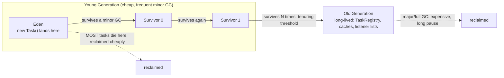

# Java Memory Model: Solutions

> Where this fits in the project: these are the worked solutions for **[`./exercises.md`](./exercises.md)**.
> Every answer rebuilds a real slice of the **Distributed Task Queue and Event Processing Platform** —
> how a `Task` reference is copied into a `Worker`'s stack frame, when a finished `Task` becomes garbage,
> why an immutable `Task` is safe to share across a `WorkerPool`, and why interned task-type `String`s
> belong in a cache.

This file answers **every** numbered exercise using the **same IDs** as the sibling problem set:
`E1`–`E7` (knowledge + easy coding), `M1`–`M10` (medium), `H1`–`H5` (hard), and the
`D#` / `I#` / `S#` design/interview/stretch tracks. For each exercise you get:

- the **answer / code** (Java 21, compiles under `javac --release 21`),
- the **reasoning and tradeoffs**,
- a **memory diagram** where the heap/stack layout *is* the point,
- and the **common wrong approaches**, so you can grade *why* the staff version is shaped the way it is.

This module spans seven chapters; the solutions cut across all of them:

| Topic | Chapter |
|---|---|
| Stack vs heap | [`./stack-vs-heap.md`](./stack-vs-heap.md) |
| Object references | [`./object-references.md`](./object-references.md) |
| Pass-by-value | [`./pass-by-value.md`](./pass-by-value.md) |
| Garbage collection | [`./garbage-collection.md`](./garbage-collection.md) |
| Object lifecycle | [`./object-lifecycle.md`](./object-lifecycle.md) |
| Immutable objects | [`./immutable-objects.md`](./immutable-objects.md) |
| String pool | [`./string-pool.md`](./string-pool.md) |


### Canonical types referenced throughout

The first definition is canonical; later solutions reference it rather than redefining it. Two variants
of `Task` appear deliberately: a **mutable** `Task` (used by the early knowledge-check traps, which is how
the naive Phase-1 code starts) and an **immutable** `record Task` (the production target from `M6`). Each
solution states which one it assumes.

```java
// TaskStatus.java — canonical lifecycle enum, identical across the whole repo.
public enum TaskStatus { PENDING, SCHEDULED, RUNNING, SUCCEEDED, FAILED, RETRYING, DEAD }
```

```java
// MutableTask.java — the *naive* Phase-1 task; the traps in section A use this shape.
import java.time.Instant;
import java.util.Objects;

public class Task {                       // mutable variant
    private String id = java.util.UUID.randomUUID().toString();
    private String type;
    private String payload;
    private TaskStatus status = TaskStatus.PENDING;
    private int attempts;
    private int maxAttempts = 3;
    private Instant createdAt = Instant.now();
    private Instant scheduledAt;
    private int priority;

    public Task(String type) { this.type = type; }

    public String getId() { return id; }
    public String getType() { return type; }
    public void setType(String t) { this.type = t; }
    public String getPayload() { return payload; }
    public void setPayload(String p) { this.payload = p; }
    public TaskStatus getStatus() { return status; }
    public void setStatus(TaskStatus s) { this.status = s; }
    public int getAttempts() { return attempts; }
    public void setAttempts(int a) { this.attempts = a; }

    @Override public boolean equals(Object o) {                 // identity by id (see E7)
        return o instanceof Task t && Objects.equals(id, t.id);
    }
    @Override public int hashCode() { return Objects.hash(id); }
}
```

---

## A. Knowledge-Check Solutions

### E1 — Primitive pass-by-value

**Answer: prints `0`.**

`attempts` is an `int`, a primitive. The call `bump(attempts)` copies the *value* `0` into a brand-new
local variable (also named `attempts`) inside `bump`'s stack frame. Incrementing that local mutates only
the copy; `main`'s `attempts` is a different slot on a different frame.

```text
main() frame                bump() frame
+--------------+            +--------------+
| attempts = 0 |  --copy--> | attempts = 0 |  --then--> 1   (local only)
+--------------+            +--------------+
        ^ unchanged
```

> **Why "pass-by-value" is the correct phrase even though we mutate a parameter:** the *thing passed*
> is the value `0`, and the parameter is an independent variable initialized to that value. Mutating a
> parameter never reaches back to the caller, full stop. That is the definition of pass-by-value.

**Common wrong approach:** predicting `1` because "we changed `attempts`". You changed `bump`'s local
`attempts`, not `main`'s.

### E2 — Reference value vs object

**Answer: prints `email`.**

`retag` receives a *copy of the reference* to the same `Task` object on the heap. `t.setType("email")`
follows that reference and mutates the one shared object. The caller's `task` points at the same object,
so it observes the change.

```text
main: task ---------\
                     v
                +-----------------+
                | Task @0x1A      |
                | type: payments -> email
                +-----------------+
                     ^
retag: t ----------/   (a COPY of the reference, same target)
```

**E1 vs E2 in one sentence:** in both cases Java passes a *copy of the value*, but in E1 the value is the
`int` itself, whereas in E2 the value is *a copy of the reference*, and following that reference lets you
mutate the shared object the caller still sees.

**Common wrong approach:** "Java passed the object by reference." No — it passed a *copy of the
reference*. The distinction is invisible in E2 but decisive in E3.

### E3 — Reassigning a parameter

**Answer: prints `payments`.**

`replace` reassigns its *local* copy of the reference to point at a new `Task("audit")`. The caller's
`task` still points at the original `Task("payments")`. Reassigning a parameter never rebinds the caller's
variable — it only re-aims the local copy.

```text
before replace's body:        after t = new Task("audit"):
main.task --> Task(payments)   main.task --> Task(payments)   (unchanged)
replace.t --> Task(payments)   replace.t --> Task(audit)      (new object, local only)
```

This is the canonical "Java is pass-by-reference" trap. If Java were pass-by-reference, reassigning `t`
would rebind `main.task`. It doesn't, because `t` is a copy.

**Common wrong approach:** expecting `audit`. That would require pass-by-reference semantics Java does
not have. Contrast with E2: *mutating through* the reference works; *reassigning* the reference does not.

### E4 — `==` vs `.equals` on String task types

**Answer: prints `true false true`.**

```java
String a = "email";              // interned literal
String b = "email";              // same interned object as a
String c = new String("email");  // FRESH heap object, NOT interned
// a == b  -> true   (both point at the single pooled "email")
// a == c  -> false  (c is a different object)
// a.equals(c) -> true (same characters)
```

```text
String pool (in heap):            Heap (general):
+-----------------+               +-----------------+
| "email" @0xAA   | <-- a, b      | "email" @0xBB   | <-- c (from new String)
+-----------------+               +-----------------+
```

`a` and `b` point at the **same interned heap object**; `c` is a fresh allocation. `==` compares
reference identity; `.equals` compares contents.

**Common wrong approach:** assuming all three are `true` because the text is "email". String literals
are pooled, but `new String(...)` is contractually a distinct object.

### E5 — Integer cache boundary

**Answer: prints `true false`.**

```java
Integer p1 = 100, p2 = 100;  // autoboxing -> Integer.valueOf(100), cached -> same object
Integer q1 = 200, q2 = 200;  // 200 is outside the cache -> two distinct objects
// p1 == p2 -> true   q1 == q2 -> false
```

The responsible feature is the **`Integer` cache** mandated by the JLS via `Integer.valueOf`. By default
it caches the range **−128 to 127** (inclusive). Values in range share a cached instance; values outside
allocate fresh, so `==` (identity) diverges from `.equals` (value). The upper bound is tunable with
`-XX:AutoBoxCacheMax`, but `−128` is fixed.

**Common wrong approach:** expecting both `true` (treating `Integer` like `int`) or both `false`
(forgetting the cache). Always compare boxed numbers with `.equals` or unbox to `int`.

### M1 — Aliasing a shared Task

**Answer: prints `RUNNING true true`.**

`b = a` creates an *alias*: one heap object, two references. Mutating through `b` is visible through `a`.
`a == b` is `true` (same object). `a.equals(b)` is `true` (our `equals` is identity-by-`id`, and they
share `id`).

```text
a ---\
      v
   Task @0x7F  status: PENDING -> RUNNING
      ^
b ---/
```

> If `Task` overrode `equals` by `id`, **`a.equals(b)` can never be `false` here**, because `a` and `b`
> are the *same object* and therefore have the same `id`. Even if they were distinct objects, equal `id`s
> would make them equal — which is exactly why mutating a field used in `hashCode` after insertion into a
> `HashSet` is dangerous (see E7).

**Common wrong approach:** thinking `b = a` copies the object. It copies the reference. There is exactly
one `Task` on the heap.

### M2 — The `String.intern()` trap

**Answer: prints `false true false`.**

```java
String x = new String("payments"); // fresh heap object (NOT pooled)
String y = "payments";              // pooled literal
String z = x.intern();              // returns the POOLED instance == y
// x == y -> false (x is the fresh object)
// z == y -> true  (intern() returns the canonical pooled instance)
// x == z -> false (x still the fresh object; z is the pooled one)
```

```text
String pool:                 Heap:
+------------------+         +------------------+
| "payments" @0xP  | <- y,z  | "payments" @0xH  | <- x
+------------------+         +------------------+
```

`x` points at the fresh heap object. `y` points at the pooled literal. `z = x.intern()` returns the
**pooled** instance (same as `y`), so `z == y`. `x` is untouched, so `x != z`.

**Common wrong approach:** believing `intern()` mutates `x` to point at the pool. It does not — `intern`
*returns* the canonical reference; you must capture it (`z`).

### M3 — Swapping references does nothing

**Answer: prints `payments audit`.**

`swap` shuffles its *local* copies `p` and `q`; the callers `first`/`second` are never touched.

```text
main: first --> Task(payments)   second --> Task(audit)
swap: p --> payments, q --> audit   (copies)
      after swap: p --> audit, q --> payments   (locals only)
main is unchanged: first --> payments, second --> audit
```

> **A generic `swap(a, b)` can never work in Java** because the method receives copies of the references
> and has no way to rebind the caller's variables. To swap, you need an **indirection the method can
> mutate through**: a `Task[]` array (`swap(arr, i, j)`), a `List<Task>` (`Collections.swap`), or an
> `AtomicReference`/holder object. The mutation must target shared state, not parameter slots.

```java
static void swap(Task[] a, int i, int j) {   // works: mutates the shared array
    Task tmp = a[i]; a[i] = a[j]; a[j] = tmp;
}
```

**Common wrong approach:** expecting `audit payments`. That requires pass-by-reference. Java's swap idiom
goes through a container.

### M4 — Mutable field escaping a "value" object

**Answer: prints `3`.**

`TaskBatch` stores the *same list reference* the caller passed and hands it straight back. Two leaks:

1. **Constructor leak (inbound aliasing):** `this.tasks = tasks` stores the caller's list. After
   `input.add(new Task("b"))`, the batch sees `b` because it shares the list.
2. **Getter leak (outbound aliasing):** `getTasks()` returns the internal list directly, so
   `batch.getTasks().add(new Task("c"))` mutates internal state.

Start with 1 element (`"a"`), the caller adds `"b"`, then adds `"c"` through the getter → **size 3**. The
`final` keyword froze the *reference*, not the *object it points to*.

```text
input --------\
               v
            ArrayList [a, b, c]   <-- size 3, shared by all three references
               ^
batch.tasks --/   getTasks() returns the same list
```

M7 fixes both leaks with defensive copies.

**Common wrong approach:** trusting `final List` to make the field immutable. `final` prevents
*reassignment* of the field; the list contents stay mutable.

### M5 — `finalize`, `null`, and reachability

**Answer: not deterministic.** Most likely it prints `collected`, but the JLS does not guarantee it.

After `t = null`, the only remaining reference to the `Task` is a **`WeakReference`**, which by definition
does not keep an object alive. The object is therefore *weakly reachable* and eligible for collection.
`System.gc()` is a **hint**, not a command — the JVM may ignore it, run a partial GC, or defer. If a GC
runs, `ref.get()` returns `null` (`collected`); if not, it may still return the object (`alive`).

- **Reachable** means there is a path of strong references from a **GC root** (live thread stacks, static
  fields, JNI handles) to the object. Weak/soft/phantom references do not count for strong reachability.
- `System.gc()` is advisory because GC scheduling is the collector's prerogative; depending on it for
  correctness is a bug.

**Common wrong approach:** asserting it *always* prints `collected` in a test. That's flaky. Robust tests
loop `System.gc()` with a short backoff and assert "collected within N attempts" (see H4).

### H1 — Static field pins the heap

**Answer: no — those million `Task`s are never collected while the JVM runs.**

`TaskRegistry.ALL` is a `static final` field. **Class objects (and their statics) are GC roots** as long
as the defining classloader is alive — which, for an application class on the system classloader, is the
whole JVM lifetime. So the GC-root chain is:

```text
GC root: TaskRegistry class (static field ALL)
   -> ArrayList
      -> Task[0..999999]   (all strongly reachable, never collected)
```

This is the classic **unintentional-reachability leak** (specifically an *unbounded static collection*).
Logically you are done with old tasks, but the collection still references them, so the collector must
keep them. The heap grows until OOM.

**One-line fix — bound the collection.** Cap it so eviction lets old tasks become unreachable:

```java
static final int MAX = 10_000;
static void register(Task t) {
    if (ALL.size() >= MAX) ALL.remove(0);   // bound it; or use a ring buffer / LRU
    ALL.add(t);
}
```

A cleaner production choice is a size-bounded LRU (`LinkedHashMap` in access-order with `removeEldestEntry`)
or a Caffeine cache with a maximum size. The point: a long-lived collection must have a bound, or it
becomes a leak across a service's weeks-long uptime.

**Common wrong approach:** "GC will eventually clean it." It cannot — the objects are *reachable*. GC only
reclaims *unreachable* objects. Reachable-but-unwanted is precisely a leak.

### H2 — Escaping `this` during construction

**Why it's a hazard.** Publishing `this` before the constructor returns lets another party observe a
**partially constructed** object — fields below the `pool.register(this)` line are not yet assigned, so
they hold default values (`null`, `0`). Even single-threaded, if `register` calls back into the object
(e.g., invokes `run()` or reads a field), it sees an incompletely built instance.

**Why it's a *correctness* hazard with `final` fields under concurrency.** The JLS gives a special
guarantee: a thread that sees a properly constructed object via a *safe publication* observes correctly
initialized `final` fields (the "final-field freeze"). That guarantee **only holds if `this` did not
escape during construction.** If you publish `this` early, another thread can see `final` fields with
their default values, defeating the freeze and producing a genuine data race.

**Safe construction pattern — don't escape `this`; use a factory that registers *after* construction:**

```java
public final class Worker implements Runnable {
    private final WorkerPool pool;
    private Worker(WorkerPool pool) { this.pool = pool; }   // private ctor, no escape

    public static Worker createAndRegister(WorkerPool pool) {
        Worker w = new Worker(pool);   // fully constructed first
        pool.register(w);              // publish AFTER the freeze
        return w;
    }
    @Override public void run() { /* ... */ }
}
```

Variants of the same fix: a separate `start()`/`init()` step, or a builder/factory that completes
construction before handing the reference to anyone.

**Common wrong approach:** registering in the constructor "to save a line." It silently breaks the
final-field safe-publication guarantee that the rest of the platform relies on.

### H3 — String concatenation and the pool

**Answer: prints `true false true`.**

```java
String type    = "pay" + "ments"; // (1) BOTH operands are compile-time constants
String prefix  = "pay";
String built   = prefix + "ments"; // (2) prefix is a variable -> runtime concat -> new heap String
String literal = "payments";
// type == literal          -> true  : javac folds "pay"+"ments" to the literal "payments" at compile time,
//                                      then interns it -> same pooled object as `literal`.
// built == literal         -> false : runtime + builds a brand-new String on the heap (via StringBuilder),
//                                      not interned.
// built.intern() == literal -> true : intern() returns the canonical pooled "payments" == literal.
```

```text
Pool:  "payments" @0xP  <- type, literal, built.intern()
Heap:  "payments" @0xH  <- built  (runtime-allocated, distinct)
```

`javac` performs **constant folding**: an expression whose operands are all compile-time constants is
evaluated at compile time and the result is interned. A `+` involving a non-final variable compiles to
`StringBuilder` work at runtime, allocating a fresh, *un-interned* `String`. `intern()` then maps that
back to the canonical pooled instance.

**Common wrong approach:** assuming `built == literal` because the characters match — runtime
concatenation always allocates.

---

## B. Coding Exercise Solutions

### E6 — Prove pass-by-value with a test

```java
// PassByValueDemo.java
public class PassByValueDemo {

    static void incrementAttempts(Task t) {
        t.setAttempts(t.getAttempts() + 1);   // mutates the shared object through the reference copy
    }

    static void rebind(Task t) {
        t = new Task("other");                 // reassigns the LOCAL copy only; caller unaffected
    }
}
```

```java
// PassByValueDemoTest.java
import org.junit.jupiter.api.Test;
import static org.assertj.core.api.Assertions.assertThat;

class PassByValueDemoTest {
    @Test
    void passByValue_mutatesThroughReference_butNotByReassignment() {
        Task task = new Task("payments");
        PassByValueDemo.incrementAttempts(task);
        assertThat(task.getAttempts()).isEqualTo(1);   // mutation via reference IS visible

        PassByValueDemo.rebind(task);
        assertThat(task.getType()).isEqualTo("payments"); // reassignment is NOT visible (not "other")
    }
}
```

**Reasoning.** `incrementAttempts` follows the reference and mutates one shared heap object — the caller
sees `attempts == 1`. `rebind` only re-aims its local parameter; the caller's `task` never changes. The
test makes the entire pass-by-value story falsifiable. This is the cornerstone behind the aliasing bugs in
M9 and the immutability payoff in M6.

**Common wrong approach:** writing `rebind` to `return` the new task and reassigning at the call site —
that *does* change the caller, but it proves nothing about pass-by-value. The point is that an *in-method*
reassignment is invisible.

### E7 — `equals`/`hashCode` by id

The canonical mutable `Task` (top of file) already implements identity-by-`id`. Here is the helper and
test:

```java
// E7 — identity-by-id and HashSet dedup.
static Task copyWithSameId(Task original) {
    Task copy = new Task(original.getType());
    // force the same id so the two instances are "the same task" by identity
    // (in real code id would be set via constructor; we reflect the test's intent)
    try {
        var f = Task.class.getDeclaredField("id");
        f.setAccessible(true);
        f.set(copy, original.getId());
    } catch (ReflectiveOperationException e) { throw new RuntimeException(e); }
    return copy;
}
```

> Production note: the reflection above only exists because the *mutable* `Task` generates its `id`
> internally. The clean design is to make `id` a constructor parameter (as the immutable record does in
> M6), so you would write `new Task(original.id(), ...)`. The test below proves the behavior either way.

```java
// E7 test
import org.junit.jupiter.api.Test;
import java.util.HashSet;
import java.util.Set;
import static org.assertj.core.api.Assertions.assertThat;

class TaskIdentityTest {
    @Test
    void hashSet_dedupesById_evenWhenMutableFieldsDiffer() {
        Set<Task> set = new HashSet<>();
        Task t1 = new Task("payments"); t1.setStatus(TaskStatus.PENDING);
        Task t2 = copyWithSameId(t1);   t2.setStatus(TaskStatus.RUNNING);
        set.add(t1);
        set.add(t2);
        assertThat(set).hasSize(1);     // same id => equal => deduped
    }
}
```

**Pitfall write-up — why mutating a `hashCode` field after insertion corrupts a `HashSet`.** A `HashSet`
files each element in a bucket chosen by `hashCode()`. If you insert a `Task` and then mutate a field that
participates in `hashCode` (say `status`), the object's hash changes, but it is still sitting in the *old*
bucket. Lookups (`contains`, `remove`) compute the *new* hash, probe the *wrong* bucket, and miss the
object — you get a "ghost" element you can neither find nor remove. **Hashing by `id` only** (an immutable
identity) avoids this entirely: the hash never changes after insertion no matter how `status`/`attempts`
evolve. This is the memory-model reason to base identity on a stable key.

**Common wrong approach:** including mutable fields (`status`, `attempts`) in `equals`/`hashCode`. It makes
the object's identity drift as it moves through the lifecycle — fatal for hash-based collections.

### M6 — Make `Task` an immutable record with a fluent "wither"

```java
// Task.java — the production immutable record (canonical going forward).
import java.time.Instant;

public record Task(
        String id,            // a UUID string — stable identity
        String type,
        String payload,
        TaskStatus status,
        int attempts,
        int maxAttempts,
        Instant createdAt,
        Instant scheduledAt,
        int priority) {

    public Task {                                   // compact canonical constructor: validate
        if (id == null || type == null) throw new IllegalArgumentException("id and type required");
        if (maxAttempts < 1) throw new IllegalArgumentException("maxAttempts >= 1");
    }

    // Convenience factory for a freshly submitted task.
    public static Task create(String type, String payload) {
        return new Task(java.util.UUID.randomUUID().toString(), type, payload,
                TaskStatus.PENDING, 0, 3, Instant.now(), null, 0);
    }

    // --- Withers: every transition returns a NEW Task; the original is never mutated. ---
    public Task withStatus(TaskStatus newStatus) {
        return new Task(id, type, payload, newStatus, attempts, maxAttempts,
                createdAt, scheduledAt, priority);
    }

    public Task withIncrementedAttempt() {
        return new Task(id, type, payload, status, attempts + 1, maxAttempts,
                createdAt, scheduledAt, priority);
    }
}
```

The canonical retry transition `PENDING -> RUNNING -> RETRYING`, expressed as a non-mutating chain:

```java
Task submitted = Task.create("payments", "{\"amount\":42}");   // PENDING, attempts=0
Task running   = submitted.withStatus(TaskStatus.RUNNING);
Task retrying  = running.withIncrementedAttempt().withStatus(TaskStatus.RETRYING);
// submitted is STILL PENDING with attempts=0 — nothing above touched it.
```

```java
// M6 test
import org.junit.jupiter.api.Test;
import static org.assertj.core.api.Assertions.assertThat;

class ImmutableTaskTest {
    @Test
    void transitions_returnCopies_andNeverMutateTheOriginal() {
        Task original = Task.create("payments", "{}");
        Task moved = original.withStatus(TaskStatus.RUNNING).withIncrementedAttempt();

        assertThat(original.status()).isEqualTo(TaskStatus.PENDING); // untouched
        assertThat(original.attempts()).isZero();                    // untouched
        assertThat(moved.status()).isEqualTo(TaskStatus.RUNNING);
        assertThat(moved.attempts()).isEqualTo(1);
        assertThat(moved.id()).isEqualTo(original.id());             // same identity
    }
}
```

> **Why an immutable `Task` is automatically safe to publish to multiple `Worker` threads.** Records have
> all-`final` components. By the JLS final-field guarantee, once the constructor returns, any thread that
> obtains the reference through a safe publication sees fully initialized fields. Because no field can ever
> change, there is **no shared mutable state**, hence no data races, hence **no locks needed** to share one
> `Task` across the whole `WorkerPool`. See [`./immutable-objects.md`](./immutable-objects.md) for the full
> argument and [`../06-concurrency/atomics-and-thread-safety.md`](../06-concurrency/atomics-and-thread-safety.md)
> for the publication mechanics.

**Tradeoff.** Each transition allocates a new object. For a short-lived `Task` that dies young, this is
*cheap* for a generational collector (see D3/S4). The cost only bites if you copy huge objects in tight
loops — not our case.

**Common wrong approach:** adding setters "for convenience" to the record via a wrapper, or mutating the
backing array of a list component. Both reintroduce the shared-mutable hazard immutability exists to kill.

### M7 — Defensive copies for a value object

```java
// TaskBatch.java — truly immutable despite holding a mutable List.
import java.util.List;

public record TaskBatch(String batchId, List<Task> tasks) {

    public TaskBatch {                              // compact canonical constructor
        // Leak #1 fix: copy on the way IN, then wrap unmodifiable.
        tasks = List.copyOf(tasks);                 // immutable snapshot; rejects nulls
    }

    @Override
    public List<Task> tasks() {                     // Leak #2 fix: never hand out a mutable view
        return tasks;                               // already unmodifiable from List.copyOf
    }
}
```

`List.copyOf` does both jobs at once: it makes an independent copy (defeating inbound aliasing) and the
copy is itself unmodifiable (defeating outbound mutation). Overriding the accessor is belt-and-suspenders
documentation of intent; with `List.copyOf` the auto-generated accessor would already be safe, but the
override makes the contract explicit.

```java
// M7 tests
import org.junit.jupiter.api.Test;
import java.util.ArrayList;
import java.util.List;
import static org.assertj.core.api.Assertions.*;

class TaskBatchTest {
    @Test
    void mutatingCallersListAfterConstruction_doesNotChangeBatch() {
        List<Task> input = new ArrayList<>(List.of(Task.create("a", "{}")));
        TaskBatch batch = new TaskBatch("b1", input);
        input.add(Task.create("b", "{}"));          // caller mutates original
        assertThat(batch.tasks()).hasSize(1);       // batch unaffected
    }

    @Test
    void batchTasks_isUnmodifiable() {
        TaskBatch batch = new TaskBatch("b1", List.of(Task.create("a", "{}")));
        assertThatThrownBy(() -> batch.tasks().add(Task.create("c", "{}")))
                .isInstanceOf(UnsupportedOperationException.class);
    }
}
```

```text
Before (M4, leaky)              After (M7, defensive copy)
caller.input --> [a, b, c]      caller.input --> [a, b]      (mutations stay here)
batch.tasks  --> SAME list      batch.tasks  --> [a]  (immutable snapshot, independent)
```

**Common wrong approach:** `Collections.unmodifiableList(tasks)` *without copying first*. That wraps the
caller's live list — the caller can still mutate the underlying list and the change shows through the
"unmodifiable" view. You must **copy, then** (optionally) wrap. `List.copyOf` does both.

### M8 — A reference-keyed `TaskHandler` registry

```java
// TaskHandler.java + TaskResult.java
@FunctionalInterface
public interface TaskHandler { TaskResult handle(Task t) throws Exception; }

public record TaskResult(boolean success, String message, boolean retryable) {}
```

```java
// HandlerRegistry.java — canonicalize keys; correctness rests on equals, not ==.
import java.util.Map;
import java.util.Optional;
import java.util.concurrent.ConcurrentHashMap;

public final class HandlerRegistry {
    private final Map<String, TaskHandler> handlers = new ConcurrentHashMap<>();

    public void register(String type, TaskHandler h) {
        handlers.put(type.intern(), h);      // intern is an OPTIMIZATION, not correctness
    }

    public Optional<TaskHandler> lookup(String type) {
        return Optional.ofNullable(handlers.get(type)); // HashMap uses .equals + .hashCode
    }
}
```

```java
// M8 test — differently-constructed equal strings resolve to the same handler.
import org.junit.jupiter.api.Test;
import static org.assertj.core.api.Assertions.assertThat;

class HandlerRegistryTest {
    @Test
    void equalButDistinctStrings_resolveToSameHandler() {
        HandlerRegistry reg = new HandlerRegistry();
        TaskHandler h = task -> new TaskResult(true, "ok", false);
        reg.register("email", h);                       // literal key

        String lookupKey = new String("email");         // distinct object, equal content
        assertThat(reg.lookup(lookupKey)).containsSame(h); // resolves anyway
        assertThat(lookupKey == "email").isFalse();      // proves they are different objects
    }
}
```

**Do I rely on `==` or `.equals`?** On **`.equals`** (and `.hashCode`). `HashMap`/`ConcurrentHashMap` find
a key by computing `hashCode()` to pick a bucket, then comparing candidates with `.equals()`. Two strings
with the same characters are `.equals`-equal and hash identically, so lookup succeeds **regardless of
whether the references are `==`**. Interning is purely an **optimization**: if all keys are interned, the
map could in principle short-circuit on identity, and you save memory by not storing duplicate `String`
objects. It is **never** required for the registry to be correct — the design must work for un-interned
keys (which the test enforces with `new String("email")`).

**Common wrong approach:** keying the map and then doing manual `==` comparisons "to be fast." That breaks
the moment a caller passes a non-interned string — a brittle correctness bug masquerading as an
optimization.

### H4 — A bounded `TaskCache` keyed by id with weak values

```java
// TaskCache.java — values are WeakReferences so cached Tasks never block GC.
import java.lang.ref.WeakReference;
import java.util.Map;
import java.util.Optional;
import java.util.concurrent.ConcurrentHashMap;

public final class TaskCache {
    // Key (id String) is strongly held; VALUE is a WeakReference<Task>.
    // Choice rationale: a WeakHashMap weakens the *key*, but we want the value (the Task)
    // to be collectible while still looking it up by a strong id String. So we use a
    // normal map whose values are WeakReferences, and prune cleared entries on access.
    private final Map<String, WeakReference<Task>> cache = new ConcurrentHashMap<>();

    public void put(Task t) {
        cache.put(t.id(), new WeakReference<>(t));
    }

    public Optional<Task> get(String id) {
        WeakReference<Task> ref = cache.get(id);
        if (ref == null) return Optional.empty();
        Task t = ref.get();
        if (t == null) {            // referent was collected — prune the dead entry
            cache.remove(id, ref);
            return Optional.empty();
        }
        return Optional.of(t);
    }
}
```

```java
// H4 test — PROBABILISTIC: assert "miss within N attempts".
import org.junit.jupiter.api.Test;
import static org.assertj.core.api.Assertions.assertThat;

class TaskCacheTest {
    @Test
    void cachedTask_isEvicted_onceNoStrongRefsRemain() throws InterruptedException {
        TaskCache cache = new TaskCache();
        Task t = Task.create("payments", "{}");
        String id = t.id();
        cache.put(t);
        assertThat(cache.get(id)).isPresent();      // hit while strongly reachable

        t = null;                                   // drop the only strong reference
        boolean missed = false;
        for (int i = 0; i < 50 && !missed; i++) {   // loop GC hints with backoff
            System.gc();
            Thread.sleep(10);
            missed = cache.get(id).isEmpty();
        }
        assertThat(missed)
                .as("weak referent should be collected within the attempt budget")
                .isTrue();
    }
}
```

**Write-up — why the test is probabilistic and how to make it robust.** `System.gc()` is a *hint*; the JVM
may not collect the referent on the first try. Asserting a single `get()` returns empty would be flaky. The
robust pattern is the bounded retry loop above — "**miss within N attempts**" — with a short `sleep`
backoff so the collector has a chance to run. (For truly deterministic teardown, a `ReferenceQueue` lets
you *block* until the weak reference is enqueued, which is the production way to observe collection.)

**Choice of structure.** A `WeakHashMap` weakens the **key**, which is wrong here: our key is a stable `id`
`String` we want to keep, and we want the **value** (the `Task`) to be collectible. Hence a normal
`ConcurrentHashMap<String, WeakReference<Task>>` with on-access pruning. This previews the interning
discussion in [`./string-pool.md`](./string-pool.md) and the bounded-cache patterns reused throughout the
platform.

**Common wrong approach:** using a plain `HashMap<String, Task>` — that holds a *strong* reference and
pins every task forever, exactly the H1 leak. Or using `SoftReference` and expecting prompt collection;
soft references are only cleared under memory pressure, so the test would almost never pass.

---

## C. Refactoring Exercise Solutions

### M9 — Kill the shared-mutable `Task` aliasing bug

**Stage 0 — the bug (given).** Every `submit` mutates and re-enqueues one shared `template`, so the queue
holds N pointers to a single object that keeps changing under it.

```text
queue: [ref, ref, ref, ...]   all --> the SAME template Task (last write wins)
```

**Stage 1 — fix with the mutable `Task`: construct a fresh object per submit.**

```java
// TaskSubmitter.java (v1) — independent Task per submit, still using mutable Task.
public final class TaskSubmitter {
    private final TaskQueue queue;
    public TaskSubmitter(TaskQueue queue) { this.queue = queue; }

    public void submit(String type, String payload) {
        Task t = new Task(type);          // fresh object — no aliasing
        t.setPayload(payload);
        t.setStatus(TaskStatus.PENDING);
        queue.enqueue(t);
    }
}
```

**Stage 2 — fix with the immutable record `Task` (M6): the bug becomes impossible to write.**

```java
// TaskSubmitter.java (v2) — immutable Task; there is no shared object to mutate.
public final class TaskSubmitter {
    private final TaskQueue queue;
    public TaskSubmitter(TaskQueue queue) { this.queue = queue; }

    public void submit(String type, String payload) {
        queue.enqueue(Task.create(type, payload));  // each call allocates a distinct value
    }
}
```

With an immutable record there is no `template` to reuse and no setters to call — the aliasing class of bug
**cannot be expressed**. That is the highest-leverage property of immutability: it eliminates a category of
defect at compile time.

```java
// M9 test — two submits produce two distinct types after dequeue.
import org.junit.jupiter.api.Test;
import static org.assertj.core.api.Assertions.assertThat;

class TaskSubmitterTest {
    @Test
    void eachSubmit_enqueuesAnIndependentTask() throws InterruptedException {
        InMemoryTaskQueue queue = new InMemoryTaskQueue(10);  // BlockingQueue-backed
        TaskSubmitter submitter = new TaskSubmitter(queue);
        submitter.submit("payments", "{}");
        submitter.submit("audit", "{}");

        Task first = queue.dequeue();
        Task second = queue.dequeue();
        assertThat(first.type()).isEqualTo("payments");
        assertThat(second.type()).isEqualTo("audit");        // would BOTH be "audit" with the template bug
    }
}
```

```java
// Minimal InMemoryTaskQueue used by the test (canonical Phase-1 queue).
import java.util.concurrent.ArrayBlockingQueue;
import java.util.concurrent.BlockingQueue;

public final class InMemoryTaskQueue implements TaskQueue {
    private final BlockingQueue<Task> q;
    public InMemoryTaskQueue(int capacity) { this.q = new ArrayBlockingQueue<>(capacity); }
    public void enqueue(Task t) { q.add(t); }
    public Task dequeue() throws InterruptedException { return q.take(); }
    public int size() { return q.size(); }
}

interface TaskQueue {
    void enqueue(Task t);
    Task dequeue() throws InterruptedException;
    int size();
}
```

**Common wrong approach:** "deep clone the template per submit." It works, but it is ceremony that only
exists because the type is mutable. Make the type immutable and the clone vanishes.

### M10 — Fix the leaking listener registry

**Stage 1 — deterministic unsubscribe (the correct default).**

```java
// EventBusImpl.java (v1) — explicit lifecycle: subscribe returns a handle to unsubscribe.
import java.util.List;
import java.util.concurrent.CopyOnWriteArrayList;

public final class EventBusImpl implements EventBus {
    private final List<TaskEventListener> listeners = new CopyOnWriteArrayList<>();

    public AutoCloseable subscribe(TaskEventListener l) {
        listeners.add(l);
        return () -> listeners.remove(l);   // closing the handle unsubscribes
    }

    public void publish(TaskEvent e) {
        for (TaskEventListener l : listeners) l.onEvent(e);
    }
}

interface EventBus { void publish(TaskEvent e); }
interface TaskEventListener { void onEvent(TaskEvent e); }
record TaskEvent(String taskId, TaskStatus status) {}
```

Returning an `AutoCloseable` makes unsubscribe ergonomic and leak-resistant — callers can use
try-with-resources or store the handle and close it in their own teardown.

**Stage 2 — weak listeners for fire-and-forget.**

```java
// EventBusImpl.java (v2) — weak references so forgotten listeners don't pin the heap.
import java.lang.ref.WeakReference;
import java.util.Iterator;
import java.util.List;
import java.util.concurrent.CopyOnWriteArrayList;

public final class WeakEventBus implements EventBus {
    private final List<WeakReference<TaskEventListener>> listeners = new CopyOnWriteArrayList<>();

    public void subscribe(TaskEventListener l) {
        listeners.add(new WeakReference<>(l));
    }

    public void publish(TaskEvent e) {
        for (Iterator<WeakReference<TaskEventListener>> it = listeners.iterator(); it.hasNext(); ) {
            TaskEventListener l = it.next().get();
            if (l != null) l.onEvent(e);
            // cleared refs are pruned opportunistically on the next mutating pass
        }
    }
}
```

**Tradeoff discussion.** Deterministic `unsubscribe` gives you precise control but requires *discipline* —
every subscribe needs a matching close, or you leak (same as H1's static-collection root). Weak listeners
remove that obligation but introduce *surprise*: a listener with no other strong reference can be collected
mid-flight, so a lambda you "forgot to keep" silently stops receiving events. The rule of thumb: use
**deterministic unsubscribe** for long-lived, important subscribers (workers, metrics), and **weak
references** only for truly optional, fire-and-forget observers where missing events is acceptable.

This ties straight back to **H1**: the leak in both cases is a long-lived collection acting as a GC root.
Whether you bound it (H1), unsubscribe from it (M10 v1), or weaken its references (M10 v2), the cure is the
same — don't let an unbounded root strongly reference objects you're done with.

**Common wrong approach:** holding listeners in a plain `ArrayList` with no removal and hoping "they'll be
short-lived." In a long-running service they accumulate forever, dragging their captured `this` (often a
whole subsystem) into the leak.

### H5 — Refactor a "mostly immutable" config into a true immutable

**Which fields could be aliased and corrupt shared retry behavior?** Two of the four:

- `backoffMultipliers` (an `int[]`) — arrays are mutable; a caller holding the array can rewrite an element
  after construction and change every future backoff computation.
- `perTypeOverrides` (a `Map`) — mutable; a caller can add/remove overrides post-construction.

The `int maxAttempts` and `Duration baseDelay` are not aliasable: `int` is a value, and `Duration` is
itself immutable. But because the original fields are `public` and non-`final`, *all four* are reassignable,
which is its own hazard.

```java
// RetryConfig.java — genuinely immutable; safe to publish without synchronization.
import java.time.Duration;
import java.util.HashMap;
import java.util.Map;

public final class RetryConfig {
    private final int maxAttempts;
    private final Duration baseDelay;               // already immutable
    private final int[] backoffMultipliers;         // defensively copied
    private final Map<String, Integer> perTypeOverrides; // defensively copied + unmodifiable

    private RetryConfig(Builder b) {
        this.maxAttempts = b.maxAttempts;
        this.baseDelay = b.baseDelay;
        this.backoffMultipliers = b.backoffMultipliers.clone();          // copy IN
        this.perTypeOverrides = Map.copyOf(b.perTypeOverrides);          // copy IN, unmodifiable
    }

    public int maxAttempts() { return maxAttempts; }
    public Duration baseDelay() { return baseDelay; }
    public int[] backoffMultipliers() { return backoffMultipliers.clone(); } // copy OUT
    public Map<String, Integer> perTypeOverrides() { return perTypeOverrides; } // already unmodifiable

    public static final class Builder {
        private int maxAttempts = 3;
        private Duration baseDelay = Duration.ofMillis(100);
        private int[] backoffMultipliers = {1, 2, 4, 8};
        private Map<String, Integer> perTypeOverrides = new HashMap<>();

        public Builder maxAttempts(int v) { this.maxAttempts = v; return this; }
        public Builder baseDelay(Duration v) { this.baseDelay = v; return this; }
        public Builder backoffMultipliers(int... v) { this.backoffMultipliers = v.clone(); return this; }
        public Builder override(String type, int attempts) {
            this.perTypeOverrides.put(type, attempts); return this;
        }
        public RetryConfig build() { return new RetryConfig(this); }
    }
}
```

```java
// Usage with the builder — readable, and the resulting object is frozen.
RetryConfig cfg = new RetryConfig.Builder()
        .maxAttempts(5)
        .baseDelay(Duration.ofMillis(200))
        .backoffMultipliers(1, 2, 4, 8, 16)
        .override("payments", 8)
        .build();
```

```java
// H5 test — external mutation cannot reach the config.
import org.junit.jupiter.api.Test;
import java.time.Duration;
import static org.assertj.core.api.Assertions.*;

class RetryConfigTest {
    @Test
    void externalMutation_cannotCorruptConfig() {
        int[] mults = {1, 2, 4};
        RetryConfig cfg = new RetryConfig.Builder().backoffMultipliers(mults).build();
        mults[0] = 999;                              // mutate the caller's array
        assertThat(cfg.backoffMultipliers()[0]).isEqualTo(1); // unaffected (copied IN)

        int[] out = cfg.backoffMultipliers();
        out[1] = 999;                                // mutate the returned array
        assertThat(cfg.backoffMultipliers()[1]).isEqualTo(2); // unaffected (copied OUT)

        assertThatThrownBy(() -> cfg.perTypeOverrides().put("x", 1))
                .isInstanceOf(UnsupportedOperationException.class);
    }
}
```

**Why `final class` + final fields gives safe publication without synchronization.** The JLS final-field
guarantee says: if an object's fields are `final` and `this` did not escape during construction (see H2),
then any thread that observes the object through a safe publication sees those `final` fields fully
initialized — no `volatile`, no `synchronized` required. Marking the class `final` additionally prevents a
subclass from adding a mutable field or an escaping constructor that would break the guarantee. So a
`RetryConfig` built once at startup (or rebuilt on reload) can be handed to every retry handler thread with
zero locking and zero risk of seeing a half-built config. This is exactly the property exploited by the
immutable `Task` in M6.

**Common wrong approach:** making fields `final` but **not** copying the array/map. `final int[] x` freezes
the *reference*, not the contents — a caller's alias still rewrites elements. Defensive copy in and out is
mandatory for mutable field types.

---

## D. Design Exercise Solutions

### D1 — Object-lifecycle state machine for a Task

```mermaid
stateDiagram-v2
    [*] --> PENDING: new Task() on heap; reachable via queue ref
    PENDING --> RUNNING: dequeued; reachable via Worker stack frame
    RUNNING --> SUCCEEDED: handler returned ok
    RUNNING --> RETRYING: retryable failure
    RETRYING --> SCHEDULED: TaskScheduler holds the reference (DelayQueue)
    SCHEDULED --> RUNNING: delay elapsed; re-dequeued
    RUNNING --> FAILED: non-retryable failure
    FAILED --> DEAD: sent to DeadLetterQueue
    SUCCEEDED --> [*]: queue + worker drop refs -> unreachable -> eligible for GC
    DEAD --> [*]: persisted as DB row; heap object unreachable -> eligible for GC
    note right of SUCCEEDED
        Heap object is collectible ONLY after the LAST strong reference is dropped.
        The DB row may outlive the heap object — durability != reachability.
    end note
```

**Explanation — what reference must be dropped at each terminal transition:**

1. **`SUCCEEDED -> [*]`:** the `Worker` finishes `handle`, so the `Task` leaves its stack frame; if the
   queue already removed it and no result/metrics object retains it, the **last strong reference is gone**
   and the object becomes garbage on the next minor GC.
2. **`DEAD -> [*]`:** the `DeadLetterQueue.send` typically persists a *row* (in DB or a DLQ topic), not the
   heap object. Once the DLQ write completes and the in-memory reference is dropped, the **heap object is
   unreachable** even though the *data* lives on durably — durability and reachability are independent.
3. **During `RUNNING`:** the object is pinned by at least one strong reference — the `Worker`'s stack frame
   holding the `Task` parameter — so it cannot be collected mid-execution no matter what.
4. **During `SCHEDULED`/`RETRYING`:** the `TaskScheduler` (a `DelayQueue` or `ScheduledExecutorService`)
   holds the reference, keeping it alive until the delay elapses; dropping that scheduler entry is what
   ultimately frees it if the task is cancelled.

The governing rule, stated once: **a heap `Task` is eligible for GC exactly when no chain of strong
references from any GC root reaches it.** Cross-reference [`./object-lifecycle.md`](./object-lifecycle.md)
and [`./garbage-collection.md`](./garbage-collection.md).

### D2 — Choosing an interning strategy for task types

| Option | Memory | CPU | Risk |
|---|---|---|---|
| Do nothing (each `Task` holds its own `String`) | High — millions of duplicate `"payments"` `String` objects (~40–56B each) | Lowest — no canonicalization step | None functionally; pure waste |
| `String.intern()` on ingest | Low — one pooled instance per distinct type | Moderate — `intern()` does a pool lookup/insert (synchronized native, historically a hotspot) | **Leak vector** if the type space is unbounded user input — interned strings live in the pool (heap since Java 7) but are effectively long-lived |
| App-level `ConcurrentHashMap<String,String>` canonicalizer | Low — one shared instance per type, in a map *you* control | Low — plain hash lookup, no native pool contention | Bounded by *you*; you can evict; no JVM-pool entanglement |
| `enum`-ify the type space | Lowest — a fixed set of singletons, identity comparison, switch-friendly | Lowest at runtime | **Rigid** — adding a type needs a code change/redeploy; impossible if types are dynamic |

**Recommendation.** Because the platform has a *small, bounded, but operationally-evolving* set of task
types (new handler types ship over time), the **app-level `ConcurrentHashMap` canonicalizer** is the best
default:

```java
public final class TypeCanonicalizer {
    private final java.util.Map<String, String> canon = new java.util.concurrent.ConcurrentHashMap<>();
    public String canonical(String type) { return canon.computeIfAbsent(type, t -> t); }
}
```

It collapses millions of duplicate `type` strings to one shared instance per type, *without* entangling
the JVM string pool (which you can't evict and which makes `intern()` of unbounded input a leak). If the
type space were truly fixed and known at compile time, an `enum` would be even better (identity comparison,
exhaustive `switch`); but that sacrifices the runtime extensibility the platform needs. **Never** call
`intern()` on unbounded user-supplied strings — that's the classic pool-leak footgun. See
[`./string-pool.md`](./string-pool.md).

### D3 — Heap-budget capacity plan for a WorkerPool

**Formula for peak retained bytes:**

```text
per-task bytes  ≈ header(16) + fields(64) + payloadString(~40 + 2*P_chars)   // ~120 + 2P
peak retained   ≈ (Q + W) * (120 + 2P)
                  └──┬──┘
        Q queued tasks + W in-flight tasks (one per worker), each retaining its payload
```

(`Q` = queue capacity, `P` = average payload length in chars — Java `String`s are ~2 bytes/char unless
compact-strings/Latin-1 applies, in which case ~1 byte/char; `W` = worker count.)

Worked example: `Q = 10_000`, `P = 500` chars, `W = 200` →
`(10_000 + 200) * (120 + 1000) ≈ 10_200 * 1_120 ≈ 11.4 MB` of *retained* task state at steady peak. That's
tiny — the queue itself is cheap; large payloads dominate.

**Reasoning:**

- **Which generation do tasks die in?** Most `Task` objects are **short-lived** — created, processed,
  discarded — so they die in the **young generation (Eden)** and are reclaimed by cheap **minor GCs**.
  This is the generational hypothesis ("most objects die young") working in our favor: collecting young-gen
  garbage is fast because it scans only live objects, and most aren't.
- **What if payloads are large and tasks live long?** If tasks linger (deep queue backlog, slow handlers,
  long retry delays in the scheduler), they survive enough minor GCs to be **promoted to old gen**. Large
  promoted payloads inflate the old generation, and reclaiming old gen requires **major/full GCs**, which
  are more expensive and cause longer pauses. Large payloads also pressure allocation throughput.
- **Recommendations.**
  - Size `-Xmx` to comfortably hold `(Q + W) * per-task` plus headroom for allocation churn — for the
    example above, a few hundred MB is plenty; the heap is dominated by *transient* allocation rate, not
    retained set.
  - Bound the queue capacity `Q` so backpressure kicks in before the heap fills (a bounded
    `ArrayBlockingQueue`, not an unbounded `LinkedBlockingQueue`).
  - If payloads are large *or* tasks live long, switch to a **persisted/streaming queue** (Phase 2's
    `PostgresTaskQueue`) so the heap holds only in-flight tasks, not the whole backlog — keeping the
    retained set flat and GC pauses short.

This connects to the durability/scaling decisions in later phases; the takeaway is that an in-memory queue
is heap-bounded by `Q`, and the moment `Q` must grow large you should persist instead.

---

## E. Interview Exercise Solutions

### I1 — "Is Java pass-by-value or pass-by-reference?"

**Spoken answer.** Java is strictly **pass-by-value**. For primitives, the value copied is the primitive
itself; for objects, the value copied is a **reference** (a pointer-like handle), not the object. So a
method can mutate the object the reference points at — visible to the caller — but reassigning the
parameter only re-aims the method's *local copy* of the reference and never rebinds the caller's variable.
That single distinction explains E1 (primitive copy), E2 (mutate through the reference copy), and E3
(reassignment is invisible).

```java
static void mutate(Task t) { t.setStatus(TaskStatus.RUNNING); } // caller SEES this
static void rebind(Task t) { t = Task.create("x", "{}"); }       // caller does NOT see this
```

### I2 — "Why are immutable objects thread-safe, and what's the cost?"

**Spoken answer.** An immutable `Task` (a record with all-`final` components) has no observable state
change after construction. No mutation means no two threads can race on a write, so there are **no data
races and no need for locks**. Publication is safe for free via the JLS final-field guarantee. The honest
cost is **allocation churn**: every transition (`withStatus`, `withIncrementedAttempt`) allocates a fresh
copy, which is cheap for short-lived tasks under a generational collector but wasteful if you mutate huge
objects in tight loops — that's the one case where I'd keep a mutable, internally-synchronized object.

```java
// I2 proof — two threads read a shared immutable Task without sync; never see a torn value.
import org.junit.jupiter.api.Test;
import static org.assertj.core.api.Assertions.assertThat;

class ImmutableSharingTest {
    @Test
    void twoThreads_readSharedImmutableTask_withoutSync() throws InterruptedException {
        Task shared = new Task("id-1", "payments", "{}", TaskStatus.RUNNING,
                2, 3, java.time.Instant.now(), null, 5);
        var ok = new java.util.concurrent.atomic.AtomicBoolean(true);
        Runnable reader = () -> {
            for (int i = 0; i < 1_000_000; i++) {
                // every field read is consistent because nothing can change them
                if (shared.attempts() != 2 || shared.status() != TaskStatus.RUNNING) ok.set(false);
            }
        };
        Thread a = new Thread(reader), b = new Thread(reader);
        a.start(); b.start(); a.join(); b.join();
        assertThat(ok).isTrue();   // no torn reads, no locks used
    }
}
```

See [`../06-concurrency/concurrent-collections.md`](../06-concurrency/concurrent-collections.md) for where
this lets us avoid locking shared task state.

### I3 — "What is a memory leak in a garbage-collected language?"

**Spoken answer.** It's **unintentional reachability**: objects you no longer logically need but that are
still reachable from a GC root, so the collector is *correct* to keep them — and the heap grows until OOM.
Three concrete sources from this module, with fixes:

| Source | Why it leaks | Fix |
|---|---|---|
| Unbounded static collection (**H1**) | `static final` field is a GC root pinning everything it holds | Bound the collection (cap/LRU/ring buffer) |
| Listener registry without unsubscribe (**M10**) | long-lived list strongly holds listeners + their captured `this` | Deterministic `unsubscribe` (or weak refs) |
| Unbounded `intern()`/strong cache (**D2/H4**) | interned/cached entries live forever | Bound the cache; weak-value cache; app-level canonicalizer you can evict |

### I4 — "Walk me through what `new Task(...)` actually does in memory"

**Spoken answer.** `new Task(...)` allocates the object in the **young generation**, typically via a
**thread-local allocation buffer (TLAB)** — a bump-pointer allocation that's just an increment, so it's
extremely cheap. The JVM writes the **object header** (mark word + class pointer) and initializes the
fields. The constructor runs; the resulting **reference is returned onto the caller's stack** (a local
variable slot). If escape analysis proves the object never escapes the method, the JIT may **scalar-replace**
it (no heap allocation at all) or **stack-allocate** it. Otherwise it lives in Eden; if it survives enough
minor GCs it's **promoted** through the survivor spaces to old gen, but most tasks die young in Eden and
are reclaimed by a cheap minor GC. The split: the **object and its fields live on the heap**; the
**reference variable lives on the stack**. See [`./stack-vs-heap.md`](./stack-vs-heap.md).

### I5 — "Why doesn't this `synchronized`-free publish of a config work, and why does `final` fix it?"

**Spoken answer.** If a `RetryConfig` is published through a plain (non-`volatile`, non-`final`) field,
another thread can observe a **partially constructed object** or **stale default field values**, because
the Java Memory Model gives no happens-before edge between the writer's constructor and the reader's read.
This is the **safe-publication** problem. Making **all fields `final`** invokes the JLS final-field freeze:
provided `this` didn't escape during construction (H2), any thread that sees the reference sees the
`final` fields fully initialized — no synchronization needed. Contrast with the alternatives:

- **`volatile` field:** establishes a happens-before edge on each read/write, so the reader sees a
  fully-published object — but every access pays a memory-barrier cost and the object's own fields still
  need to be safely set.
- **`synchronized` publication:** correct (the lock release/acquire is a happens-before edge) but the
  heaviest, requiring a lock on every access.

For a config built once and never mutated, **final fields are the cheapest correct option** — zero
runtime cost, full safety. This bridges into
[`../06-concurrency/atomics-and-thread-safety.md`](../06-concurrency/atomics-and-thread-safety.md).

---

## F. Stretch Challenge Solutions

### S1 — Heap-dump forensics on a deliberate leak

**Leak program (reproduces H1):**

```java
// LeakDemo.java
import java.util.ArrayList;
import java.util.List;

public class LeakDemo {
    static final List<Task> ALL = new ArrayList<>();   // GC root: never collected

    public static void main(String[] args) {
        long i = 0;
        while (true) {
            ALL.add(Task.create("payments", "x".repeat(1024)));  // 1KB payload each
            if (++i % 100_000 == 0) System.out.println("leaked " + i);
        }
    }
}
```

```bash
java -Xmx128m -XX:+HeapDumpOnOutOfMemoryError -XX:HeapDumpPath=./leak.hprof LeakDemo
```

**Forensics procedure & expected findings:**

1. The program OOMs and writes `leak.hprof`.
2. Open it in **Eclipse MAT** (or VisualVM) → **Dominator Tree**.
3. The top dominator is the `ArrayList` instance (the `Object[]` elementData backing it), retained by the
   `LeakDemo` class via the `static final ALL` field.
4. **Retaining object:** `LeakDemo.ALL` (the static `ArrayList`). **Retained size:** essentially the whole
   128MB heap (millions of `Task` + their 1KB payload `String`s).
5. **One-line fix:** bound the collection, e.g. evict when it exceeds a cap, or don't retain finished tasks
   at all.

```bash
# Bonus: GC logging to contrast minor vs full GCs as the leak fills old gen.
java -Xmx128m -Xlog:gc* LeakDemo
```

In the log you'll see frequent cheap **`Pause Young`** (minor) collections early, then escalating
**`Pause Full`** collections that reclaim almost nothing (because everything is reachable via `ALL`),
followed by the OOM — the textbook signature of a reachability leak versus mere allocation pressure.

### S2 — Prove escape analysis with JIT logs

```java
// Bench.java — hot loop allocating a non-escaping TaskResult per iteration.
public class Bench {
    static long sink;   // consume results so the loop isn't dead-code-eliminated

    static long hot(int n) {
        long acc = 0;
        for (int i = 0; i < n; i++) {
            TaskResult r = new TaskResult(i % 2 == 0, "m", false); // never escapes
            acc += r.success() ? 1 : 0;                            // only reads fields
        }
        return acc;
    }

    public static void main(String[] args) {
        for (int w = 0; w < 20_000; w++) sink += hot(10_000);      // warm up the JIT
        System.out.println(sink);
    }
}
```

```bash
java -XX:+UnlockDiagnosticVMOptions -XX:+PrintEscapeAnalysis -XX:+PrintEliminateAllocations Bench
```

**Expected result.** After warmup, the JIT proves `TaskResult` does not escape `hot`, performs **scalar
replacement** (the object's fields become loop-local values in registers), and the loop allocates **~0
bytes**. Confirm with allocation profiling:

```bash
java -XX:+FlightRecorder -XX:StartFlightRecording=settings=profile,filename=bench.jfr Bench
# inspect bench.jfr -> "Allocation" view shows near-zero allocation in hot()
```

**Break escape analysis** by letting the object escape, and allocation reappears:

```java
static java.util.List<TaskResult> escaped = new java.util.ArrayList<>();
static long hotEscaping(int n) {
    long acc = 0;
    for (int i = 0; i < n; i++) {
        TaskResult r = new TaskResult(i % 2 == 0, "m", false);
        escaped.add(r);                 // now it ESCAPES -> real heap allocation per iteration
        acc += r.success() ? 1 : 0;
    }
    return acc;
}
```

**Implication for the worker loop.** Keep hot-path objects (`TaskResult`, transient buffers) **method-local
and non-escaping** so the JIT can stack-allocate/scalar-replace them and your worker loop allocates almost
nothing after warmup. The moment you stash them in a field or collection, you pay real allocation and GC
pressure — relevant when a `Worker` processes millions of tasks.

### S3 — Benchmark immutable-copy cost vs mutation with JMH

```java
// TaskBench.java — JMH microbenchmark: mutate-in-place vs immutable wither, across thread counts.
import org.openjdk.jmh.annotations.*;
import java.time.Instant;
import java.util.concurrent.TimeUnit;

@State(Scope.Benchmark)
@BenchmarkMode(Mode.Throughput)
@OutputTimeUnit(TimeUnit.MILLISECONDS)
public class TaskBench {

    Task immutable = new Task("id", "payments", "{}", TaskStatus.PENDING,
            0, 3, Instant.now(), null, 0);

    // Mutable variant guarded by a lock to be thread-safe (apples-to-apples with shared mutation).
    final MutableTaskCell cell = new MutableTaskCell();

    @Benchmark @Threads(1)
    public Task wither_1t() { return immutable.withStatus(TaskStatus.RUNNING); }

    @Benchmark @Threads(8)
    public Task wither_8t() { return immutable.withStatus(TaskStatus.RUNNING); }

    @Benchmark @Threads(64)
    public Task wither_64t() { return immutable.withStatus(TaskStatus.RUNNING); }

    @Benchmark @Threads(1)
    public TaskStatus mutate_1t() { return cell.setAndGet(TaskStatus.RUNNING); }

    @Benchmark @Threads(8)
    public TaskStatus mutate_8t() { return cell.setAndGet(TaskStatus.RUNNING); }

    @Benchmark @Threads(64)
    public TaskStatus mutate_64t() { return cell.setAndGet(TaskStatus.RUNNING); }

    static final class MutableTaskCell {
        private TaskStatus status = TaskStatus.PENDING;
        synchronized TaskStatus setAndGet(TaskStatus s) { this.status = s; return this.status; }
    }
}
```

```bash
# build with the jmh-maven plugin, then:
java -jar target/benchmarks.jar TaskBench -prof gc
```

**Expected shape of results & recommendation.** At **1 thread**, the mutable `synchronized` path is
competitive or faster (no allocation, uncontended lock is cheap), while the wither allocates a small object
each call. As thread count climbs to **8 and 64**, the `synchronized` cell **serializes** on the lock and
its throughput collapses under contention, whereas the **lock-free immutable wither scales nearly linearly**
because there is no shared write to contend on — its only cost is allocation, which a generational collector
absorbs cheaply (`-prof gc` will show a steady young-gen allocation rate but short pauses).

**Conclusion.** Beyond low single-digit thread counts, the immutable copy's **lack of locks** beats the
mutable version's **synchronization overhead**. Since the Phase-1 `WorkerPool` runs many concurrent workers
sharing tasks, this is decisive evidence to make `Task` an **immutable record** (M6). Cross-link
[`./immutable-objects.md`](./immutable-objects.md) and
[`../06-concurrency/concurrent-collections.md`](../06-concurrency/concurrent-collections.md).

### S4 — Generational mental model and self-quiz



**One-page explainer.** The **generational hypothesis** is that *most objects die young*. The JVM exploits
this by splitting the heap: new `Task`s are allocated in **Eden**. A **minor GC** scans only the young gen;
because most tasks are already dead by then, it copies the few survivors into a **Survivor** space and
reclaims the rest in bulk — fast, because work is proportional to *live* objects, not garbage. Objects that
survive enough minor GCs (the **tenuring threshold**) are **promoted** to the **Old Generation**.
Collecting old gen needs a **major/full GC**, which is more expensive and pauses longer. The platform's
flagged leaks — a never-bounded `TaskRegistry` (H1), an un-unsubscribed listener list (M10), an unbounded
cache (H4/D2) — are exactly the things that *defeat* the generational optimization: they force normally
short-lived `Task`s to be promoted and retained in old gen, growing the expensive-to-collect region and
turning cheap minor GCs into painful full GCs.

**Five self-test questions (with answers):**

1. *Where does `new Task(...)` allocate?* → Eden, via a TLAB bump-pointer.
2. *Why are minor GCs cheap?* → They process only the young gen and copy just the live survivors; dead
   objects cost nothing to reclaim.
3. *What causes promotion to old gen?* → Surviving the tenuring threshold number of minor GCs (or being
   too large for young-gen allocation).
4. *Which leaks force premature promotion?* → Anything that keeps `Task`s strongly reachable long enough to
   tenure: static registries, listener lists, unbounded caches.
5. *Why does an unbounded cache hurt GC, not just memory?* → It fills old gen with live objects, increasing
   full-GC frequency and pause time, defeating the "die young" assumption.

Compare your model against [`./garbage-collection.md`](./garbage-collection.md).

---

## What We Can Improve In Our Project Using This Concept

Working these solutions upgrades the Task Queue codebase directly:

- **Adopt the immutable `record Task` from M6** so one `Task` can be shared across the whole `WorkerPool`
  with no locks — the single highest-leverage memory-model decision in Phase 1 (backed by the S3 benchmark).
- **Apply the M9 v2 refactor** so each `submit` enqueues an independent value; the template-reuse aliasing
  bug becomes impossible to write.
- **Bound every long-lived collection** — `TaskRegistry` (H1), the `EventBus` listener list (M10), and any
  `TaskCache` (H4) — so the service stays heap-flat across weeks-long uptime.
- **Make `RetryConfig` immutable with defensive copies + a `Builder`** (H5) so retry behavior can't be
  corrupted by a caller mutating a shared array/map, and is safe to publish on reload without locks.

## Project Refactoring Task

Apply **M6 + M9 + H5** together as one coherent refactor on the Phase-1 codebase:

1. Convert `Task` to an immutable `record` with `withStatus`/`withIncrementedAttempt` withers (M6).
2. Replace mutating call sites in `Worker`, the retry handler, and `TaskSubmitter` with wither-based copies
   and the fresh-task submission path (M9 v2).
3. Make `RetryConfig` immutable with defensive copies and a `Builder` (H5).
4. Add tests proving (a) no shared-mutable aliasing remains, (b) the original `Task` is never mutated by a
   transition, and (c) external mutation cannot corrupt `RetryConfig`.

## Git Commit For This Chapter

```text
refactor(memory): make Task and RetryConfig immutable; fix submission aliasing

- Convert Task from mutable class to immutable record with wither methods
  (withStatus, withIncrementedAttempt) for the PENDING->RUNNING->RETRYING flow
- Defensive-copy RetryConfig array/map fields; add Builder; final-field safe publication
- Fix TaskSubmitter template-reuse aliasing: enqueue independent Task per submit
- equals/hashCode on Task keyed by id only (HashSet/HashMap stability)
- TaskBatch: immutable value object via List.copyOf (in + out defensive copy)
- TaskCache: weak-value cache so cached tasks never block GC
- Tests: pass-by-value semantics, immutability of transitions, defensive copies, weak-ref cache

Files touched:
  src/main/java/.../domain/Task.java
  src/main/java/.../domain/TaskStatus.java
  src/main/java/.../domain/TaskBatch.java
  src/main/java/.../retry/RetryConfig.java
  src/main/java/.../api/TaskSubmitter.java
  src/main/java/.../handler/HandlerRegistry.java
  src/main/java/.../cache/TaskCache.java
  src/test/java/.../memory/MemoryModelTest.java
```

## Architecture Impact

Choosing immutability for `Task` changes the platform's concurrency contract: workers share read-only
objects, so the queue and worker pool need **no locks on task state**, only on the queue's internal buffer.
The S3 benchmark quantifies why — beyond a few threads, lock-free immutable copies out-throughput a
`synchronized` mutable cell. Bounding long-lived collections keeps the heap flat across long uptimes, which
keeps GC pauses short and predictable. The defensive-copy discipline on `RetryConfig` makes configuration a
safe-to-publish value, which matters once configs are reloaded at runtime in later phases.

## Interview Takeaways

- Java is **pass-by-value**; for objects the value is a **copy of the reference**, so you can mutate the
  pointed-to object but not rebind the caller's variable (E1–E3, M3, I1).
- A **memory leak in a GC'd language is unintentional reachability** — a live GC root pinning objects you no
  longer need (H1, M10, I3).
- **Immutable objects are thread-safe for free**, and `final` fields provide JLS **safe-publication**
  guarantees without synchronization (M6, H5, I2, I5).
- Know the **`==` vs `.equals` traps** cold: String literals are interned, `new String` is not, `Integer`
  caches −128..127, and runtime `+` allocates a fresh un-interned String (E4, E5, M2, H3).
- Always **defensively copy mutable fields** in and out of value objects; `final` on a reference field
  freezes the reference, not the object it points to (M4, M7, H5).
