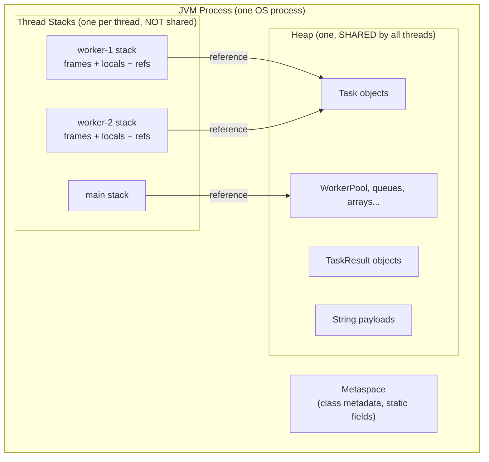
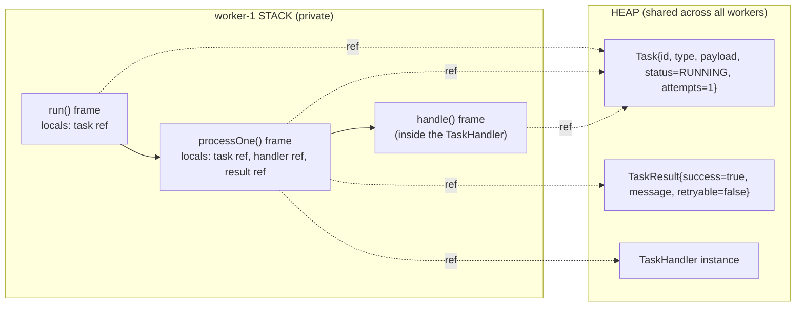

# Stack vs Heap

> Where in this project: every time a `Worker` thread pulls a `Task` off the `TaskQueue` and calls `handler.handle(task)`, the JVM is juggling two memory regions — a per-thread **stack** of call frames and a shared **heap** of objects. Understanding which region holds what is the difference between debugging a `StackOverflowError` in five minutes and staring at a heap dump for an afternoon.

This chapter is the foundation of module `03-java-memory-model`. Before we talk about [object references](./object-references.md), [pass-by-value](./pass-by-value.md), or [garbage collection](./garbage-collection.md), you need a precise mental model of where bytes physically live when your code runs.

---

## 1. Why this exists — the real problem it solves

You came from DSA. You have written `int[] dp = new int[n]` thousands of times and never once asked: *where does `dp` live, and where does the array it points to live?* In competitive programming that question is invisible because the program is single-threaded, short-lived, and the OS reclaims everything at exit.

Backend engineering breaks all three assumptions:

- **Long-lived processes.** Our task-queue service runs for weeks. A reference you forget to drop leaks for weeks.
- **Many threads.** A `WorkerPool` runs 16, 64, or 10,000 concurrent `Worker`s. Each has its own stack. Get the stack size wrong and you either waste gigabytes or crash under deep recursion.
- **Shared mutable state.** Multiple workers touch the same `Task` objects on the heap. Where an object lives determines whether it can be shared, and sharing determines whether you need locks.

Historically, the stack/heap split predates Java by decades. C let you choose: stack-allocate with `int x;` or heap-allocate with `malloc`. The cost of that freedom was manual `free()` and the entire genre of use-after-free bugs. Java's design decision — **all objects live on the heap, all local variables and call bookkeeping live on the stack, and a garbage collector owns the heap** — traded that freedom for safety. You no longer choose *where* an object goes, but you absolutely still pay for *how much* goes where. This chapter teaches you to reason about that cost.

---

## 2. The two regions at a glance



The single most important takeaway from that diagram: **stacks are private per thread; the heap is one shared region.** Two `Worker` threads can hold references on *their own* stacks that point at the *same* `Task` object on the shared heap. That is exactly how data races begin — and why [atomics and thread safety](../06-concurrency/atomics-and-thread-safety.md) exist.

| Property | Stack | Heap |
| --- | --- | --- |
| What lives here | Frames: local variables (primitives + references), return address, operand stack | Objects, arrays, instance fields, the *contents* a reference points to |
| Lifetime | Tied to the method call (popped on return) | Until no longer reachable, then GC reclaims |
| Allocation cost | Push/pop a pointer — effectively free | Bump pointer or free-list, plus GC bookkeeping |
| Thread visibility | Private to one thread | Shared across all threads |
| Size | Small, fixed per thread (default ~512KB–1MB) | Large, configurable (`-Xmx`), e.g. 4GB |
| Failure mode | `StackOverflowError` | `OutOfMemoryError: Java heap space` |
| Managed by | The JVM automatically via call/return | The garbage collector |

---

## 3. The naive version — assuming everything is "just a variable"

Here is how a learner new to Java often reasons. They write a recursive retry calculator for our `RetryPolicy` and assume it behaves like a math function:

```java
// NAIVE: treats recursion as free, ignores that each call costs a stack frame.
public final class NaiveBackoff {

    // Compute cumulative delay after `attempt` retries by recursing.
    public long cumulativeDelayMillis(int attempt, long baseMillis) {
        if (attempt <= 0) {
            return 0;
        }
        long thisDelay = baseMillis * (1L << attempt); // 2^attempt * base
        return thisDelay + cumulativeDelayMillis(attempt - 1, baseMillis);
    }
}
```

What is wrong here is not the math — it is the *memory model assumption*. The learner thinks "this is just arithmetic." But every call to `cumulativeDelayMillis` pushes a **new stack frame** holding `attempt`, `baseMillis`, and `thisDelay`. With a small `attempt` (our `maxAttempts` is usually 3–10) this is fine. But if a buggy config sets `maxAttempts` to 200,000 because someone confused milliseconds with attempts, this recurses 200,000 frames deep and the JVM throws:

```text
Exception in thread "worker-1" java.lang.StackOverflowError
    at NaiveBackoff.cumulativeDelayMillis(NaiveBackoff.java:9)
    at NaiveBackoff.cumulativeDelayMillis(NaiveBackoff.java:10)
    ... thousands of identical lines ...
```

> **The lesson:** recursion depth is bounded by stack size, not by the heap. A recursive algorithm that is "O(n) time, O(1) extra space" in your DSA head is actually **O(n) stack space** in the JVM. That O(n) lives on a small, fixed budget.

---

## 4. Improved version — make the stack cost explicit, move state to the heap

The fix is to convert recursion (stack-bound) into iteration (constant stack, no growth), and where we genuinely need to accumulate large state, put it on the heap deliberately:

```java
// IMPROVED: iterative — one frame, constant stack depth regardless of `attempt`.
public final class IterativeBackoff {

    public long cumulativeDelayMillis(int attempt, long baseMillis) {
        long total = 0;
        for (int i = 1; i <= attempt; i++) {
            total += baseMillis * (1L << i);
        }
        return total; // `total`, `i`, `attempt`, `baseMillis` all sit in ONE frame
    }
}
```

Now the stack depth is constant — exactly one frame for this method no matter how large `attempt` is. The loop variables `total` and `i` are primitives living *in the frame*; they vanish when the method returns. Nothing escapes to the heap.

This is the first real engineering instinct of this module: **prefer iteration over deep recursion in production server code**, because server threads have small stacks and you cannot afford to blow them under adversarial input.

---

## 5. Production-quality version — model the cost, cap the input, and know what's on the heap

A staff engineer ships code that is correct *and* defensive about both memory regions. Here we fold the backoff into our canonical `ExponentialBackoffRetryPolicy`, returning `Optional<Duration>` exactly as the SPEC mandates, and we cap inputs so neither region can be exhausted by bad config.

```java
import java.time.Duration;
import java.util.Optional;
import java.util.concurrent.ThreadLocalRandom;

/**
 * Production RetryPolicy. Note where memory lives:
 *  - `baseDelay`, `maxDelay`, `multiplier`, `maxAttempts` are instance fields:
 *    they live on the HEAP, inside this policy object.
 *  - Inside nextDelay(), `attempt`, `cappedExp`, `raw`, `jitter` are locals:
 *    they live on the STACK frame of nextDelay() and disappear on return.
 *  - The returned Optional<Duration> and Duration are NEW heap objects;
 *    the caller's stack frame holds only a REFERENCE to them.
 */
public final class ExponentialBackoffRetryPolicy implements RetryPolicy {

    private final Duration baseDelay;   // heap
    private final Duration maxDelay;    // heap
    private final int maxAttempts;      // heap (primitive field, but inside a heap object)
    private final double multiplier;    // heap

    public ExponentialBackoffRetryPolicy(Duration baseDelay,
                                         Duration maxDelay,
                                         int maxAttempts,
                                         double multiplier) {
        this.baseDelay = baseDelay;
        this.maxDelay = maxDelay;
        this.maxAttempts = maxAttempts;
        this.multiplier = multiplier;
    }

    @Override
    public Optional<Duration> nextDelay(int attempt) {
        // `attempt` is a primitive copy on THIS frame (pass-by-value, see ../03-java-memory-model/pass-by-value.md).
        if (attempt >= maxAttempts) {
            return Optional.empty();           // no allocation of a Duration; signal "give up"
        }
        // Cap the exponent so 1L << exp can never overflow or recurse — pure stack-local math.
        int cappedExp = Math.min(attempt, 30);
        long base = baseDelay.toMillis();
        long raw = (long) (base * Math.pow(multiplier, cappedExp));
        long bounded = Math.min(raw, maxDelay.toMillis());

        // Full jitter: random in [0, bounded] to de-correlate retry storms.
        long jitter = ThreadLocalRandom.current().nextLong(bounded + 1);

        // Duration.ofMillis allocates ONE small object on the heap; we return a reference to it.
        return Optional.of(Duration.ofMillis(jitter));
    }
}
```

Two production properties to internalize:

1. **No unbounded stack growth.** There is no recursion; the exponent is capped at 30 so `Math.pow` and the shift can never spiral. This method uses exactly one frame.
2. **Minimal heap churn.** It allocates at most one `Duration` and one `Optional` per call. On a worker doing 50k tasks/sec, allocation *rate* is what stresses the GC, not total live size — see [garbage collection](./garbage-collection.md). Returning `Optional.empty()` (a shared singleton) for the common "stop retrying" case allocates nothing.

---

## 6. Code walkthrough — beginner, intermediate, production

### 6a. Beginner: primitives vs references in a single method

```java
public class StackHeapBeginner {
    public static void main(String[] args) {
        int attempts = 3;                 // STACK: the value 3 is stored in the frame
        String type = "send-email";       // STACK: `type` holds a reference; the String "send-email" is on the HEAP
        int[] history = {100, 200, 400};  // STACK: `history` holds a reference; the int[] array is on the HEAP

        System.out.println(attempts + " " + type + " " + history.length);
    }
}
```

Walkthrough of the `main` frame:

- `attempts` is an `int`. The **value** `3` is copied directly into the stack frame. There is no heap object.
- `type` is a `String` *reference*. The frame holds an arrow (a pointer); the actual character data lives in a `String` object on the heap (and in the [string pool](./string-pool.md)).
- `history` is an `int[]` *reference*. The frame holds an arrow; the three `int`s `{100, 200, 400}` live contiguously inside an array object on the heap.

> Rule of thumb: **the eight primitive types (`int`, `long`, `double`, `boolean`, `char`, `byte`, `short`, `float`) store their value directly in the frame. Everything else — every `Object`, every array, every `Task` — is accessed through a reference, and the object itself lives on the heap.**

### 6b. Intermediate: tracing a method call's frames

```java
public class StackHeapIntermediate {

    record Task(String id, String type, int attempts) {}  // a Task object lives on the heap

    static Task incrementAttempts(Task t) {
        // `t` here is a NEW reference variable in incrementAttempts's frame,
        // copied from the caller's reference. It points at the SAME heap Task.
        // records are immutable, so we build a new heap Task and return its reference.
        return new Task(t.id(), t.type(), t.attempts() + 1);
    }

    public static void main(String[] args) {
        Task original = new Task("t-1", "resize-image", 0); // heap object A, ref in main's frame
        Task bumped = incrementAttempts(original);           // heap object B, ref in main's frame
        System.out.println(original.attempts() + " " + bumped.attempts()); // prints "0 1"
    }
}
```

Frame-by-frame:

1. `main` frame is pushed. `original` (a reference) is created and points to **heap object A** (`attempts=0`).
2. `incrementAttempts` frame is pushed. Its parameter `t` is a **copy of the reference** — a second arrow pointing to the same heap object A. (This is [pass-by-value of the reference](./pass-by-value.md).)
3. Inside, `new Task(...)` allocates **heap object B** (`attempts=1`) and returns its reference.
4. `incrementAttempts` frame is **popped**. Its local `t` vanishes. Heap objects A and B both still exist (both still referenced from `main`).
5. Back in `main`, `bumped` points at B, `original` still points at A. Output: `0 1`.

This is why we say "objects outlive frames." The frame that *created* heap object B is long gone, but B survives because `main` still references it.

### 6c. Production-inspired: a Worker executing a Task, full memory picture

```java
import java.util.Map;
import java.util.concurrent.ConcurrentHashMap;

final class Worker implements Runnable {

    private final TaskQueue queue;                       // heap (field of this Worker)
    private final Map<String, TaskHandler> handlers;     // heap; shared registry
    private final String name;                           // heap

    Worker(String name, TaskQueue queue, Map<String, TaskHandler> handlers) {
        this.name = name;
        this.queue = queue;
        this.handlers = handlers;
    }

    @Override
    public void run() {
        // This run() executes on THIS worker's OWN stack.
        while (!Thread.currentThread().isInterrupted()) {
            try {
                Task task = queue.dequeue();             // `task` ref on THIS stack -> shared heap Task
                processOne(task);                         // pushes a new frame on THIS stack
            } catch (InterruptedException e) {
                Thread.currentThread().interrupt();
                return;
            }
        }
    }

    private void processOne(Task task) {
        // New frame: parameter `task` (a reference copy), local `handler`, local `result`.
        TaskHandler handler = handlers.get(task.type());  // ref to a shared handler on the heap
        if (handler == null) {
            return;
        }
        try {
            TaskResult result = handler.handle(task);      // NEW TaskResult on heap; ref on this frame
            // ... inspect result.success(), decide retry vs done ...
        } catch (Exception e) {
            // exception object lives on the heap; its reference unwinds up the stack frames
        }
        // When processOne returns, `handler` and `result` references vanish.
        // The TaskResult object becomes unreachable (if not stored) and is eligible for GC.
    }
}
```



Notice the **same `Task` object** is referenced from three different frames simultaneously (`run`, `processOne`, `handle`). All those arrows point at one heap object. If two *different* workers dequeue and mutate the same `Task` concurrently, you have a race. That is the bridge to [concurrent collections](../06-concurrency/concurrent-collections.md) and [locks](../06-concurrency/locks.md).

---

## 7. How this applies to our Task Queue project

Mapping the canonical model to memory regions makes architecture decisions concrete:

| Canonical element | Where it lives | Why it matters |
| --- | --- | --- |
| `Task` (record) | Heap; one object per submitted task | Shared between API thread (creator) and worker thread (consumer). Reachable as long as it's in the queue. |
| `TaskStatus` (enum) | Heap; but **exactly one instance per constant** (`PENDING`, `RUNNING`...) | Enum constants are singletons — `task.status() == TaskStatus.RUNNING` is a pointer compare, cheap and safe. |
| `TaskResult` (record) | Heap; short-lived, one per `handle()` call | High allocation rate at scale → tune GC, not heap size. |
| `Worker` (Runnable) | Heap (the object); but its `run()` executes on a **dedicated thread stack** | Each worker thread = one stack. 1,000 platform workers = ~1,000 × stack size of committed memory. |
| `WorkerPool` (`ExecutorService`) | Heap | Holds references to worker threads and the queue; keeps them reachable. |
| `InMemoryTaskQueue` (`BlockingQueue`) | Heap | The backing array/nodes and every queued `Task` are heap objects → this is where a backlog becomes a heap-size problem. |
| `RetryPolicy` / `RateLimiter` impls | Heap; usually one shared instance | Stateless or atomic-state, so safe to share across worker stacks. |
| Method locals inside `handle()`, `nextDelay()`, `tryAcquire()` | Stack frame of the executing thread | Vanish on return; never a leak source. |

The crucial production insight for **Phase 1**: when you back the queue with an in-memory `BlockingQueue` and producers outpace consumers, the queue grows, every queued `Task` stays reachable on the heap, and you march toward `OutOfMemoryError`. That single failure mode is *the* motivation for [backpressure](../08-distributed-systems/backpressure.md) and for moving to a `PostgresTaskQueue` in **Phase 2**, where the backlog lives in the database rather than your JVM heap.

The crucial insight for **thread sizing**: when the `WorkerPool` uses platform threads, each worker consumes a full OS stack (~1MB committed lazily, but reserved address space). Scaling to 50,000 concurrent blocking tasks would demand ~50GB of stack reservation — infeasible. This is precisely why Phase 1's worker model and [virtual threads](../06-concurrency/threads.md) matter: a virtual thread's stack lives on the **heap** as a resizable continuation object, not as a fixed OS stack, so a million of them is realistic.

---

## 8. Tradeoffs — honest engineering

| Decision | Stack-favoring choice | Heap-favoring choice | When to pick which |
| --- | --- | --- | --- |
| Recursion vs iteration | Iteration (constant stack) | Recursion (frames per depth) | Use iteration on server threads with deep/untrusted input; recursion is fine for bounded depth (tree walks ≤ tens of thousands). |
| Local primitive vs boxed `Integer` | `int` (value in frame) | `Integer` (object on heap) | Prefer primitives in hot loops; boxing in a 50k/sec path creates millions of garbage objects. |
| Big array as local vs field | Allocate, use, drop (becomes garbage fast) | Hold as a field (lives until owner dies) | Don't cache giant buffers as fields "to avoid allocation" unless profiling proves the churn hurts. |
| Platform thread per worker | Real OS stack per worker | Virtual thread (stack on heap) | Few CPU-bound workers → platform; many blocking workers → virtual threads. |
| Thread stack size (`-Xss`) | Larger = deeper recursion allowed, more memory per thread | Smaller = more threads fit, shallower recursion | Lower `-Xss` (e.g. 256k) when running tens of thousands of platform threads and recursion is shallow. |

There is no universally "better" region. The art is matching the data's *lifetime and sharing needs* to the region: short-lived, thread-private, primitive-ish → stack-friendly; long-lived or shared → heap.

---

## 9. Common mistakes and pitfalls

- **"Objects live on the stack."** No. In standard Java, *all* objects live on the heap; only references and primitives live on the stack. (Escape analysis may scalar-replace a provably-non-escaping object so it never really allocates, but you cannot rely on that — write code as if every `new` hits the heap.)
- **Assuming recursion is free.** Each call is a frame. Deep or unbounded recursion (e.g. recursing over `maxAttempts` or a linked list of millions) throws `StackOverflowError`. Fix: iterate, or use an explicit heap-allocated stack/deque.
- **Confusing the two errors.** `StackOverflowError` = too-deep call chain (a *control-flow* bug, usually). `OutOfMemoryError: Java heap space` = too many live objects (a *retention/leak* bug, usually). They need totally different debugging tools.
- **Thinking a returned local "dies."** A local *reference* dies when its frame pops, but the *object* it pointed at survives as long as anything else references it. Returning `new Task(...)` is perfectly safe.
- **Leaking via static/long-lived collections.** Adding `Task`s to a `static List` and never removing them keeps every one reachable forever → slow heap leak. The stack never leaks; the heap does. See [object lifecycle](./object-lifecycle.md).
- **Over-sizing thread stacks.** Bumping `-Xss` to "be safe" multiplied by 10,000 threads silently eats gigabytes. Size it to your real max depth plus headroom.
- **Boxing in hot paths.** `Map<String, Integer>` counters, `List<Long>` of timings, autoboxing in stream pipelines — each box is a heap object. In a worker's hot loop this dominates GC pressure.

---

## 10. Refactoring exercise — bad → improved → production

**Scenario:** a metrics helper for the `MetricsCollector` totals per-priority task latencies. The first cut recurses over a list and boxes everything.

**Bad** — recursion (stack growth) + boxing (heap churn):

```java
import java.util.List;

public class LatencySum {
    // BAD: recurses once per element (stack grows with list size),
    // and uses Long/Integer boxing (a heap object per number).
    public Long sumFrom(List<Long> latencies, Integer index) {
        if (index >= latencies.size()) {
            return 0L; // autoboxes to a Long object
        }
        return latencies.get(index) + sumFrom(latencies, index + 1);
    }
}
```

For a 2-million-element list this throws `StackOverflowError` *and* allocates millions of `Long`/`Integer` boxes along the way.

**Improved** — iterate (constant stack), but still boxing on the input type:

```java
import java.util.List;

public class LatencySum {
    // IMPROVED: one frame regardless of size. Still pays boxing on List<Long>.
    public long sumFrom(List<Long> latencies) {
        long total = 0;            // primitive accumulator in the frame
        for (Long latency : latencies) {
            total += latency;      // unboxes each element; no per-call frame
        }
        return total;
    }
}
```

Constant stack depth now. We removed the `StackOverflowError` risk entirely.

**Production** — constant stack *and* primitive-friendly API, zero boxing:

```java
public final class LatencyStats {

    /**
     * Sums a primitive long[]: no recursion (constant stack),
     * no boxing (no per-element heap objects). One frame, one pass.
     */
    public long sum(long[] latenciesNanos) {
        long total = 0L;
        for (long ns : latenciesNanos) {  // `ns` and `total` are primitives in the frame
            total += ns;
        }
        return total;
    }

    /** Mean as a double, guarding the empty case. Still zero allocation. */
    public double meanMillis(long[] latenciesNanos) {
        if (latenciesNanos.length == 0) {
            return 0.0;
        }
        return (sum(latenciesNanos) / (double) latenciesNanos.length) / 1_000_000.0;
    }
}
```

The production version: constant stack (no recursion), zero heap allocation in the hot path (primitive `long[]`, primitive locals), and a defensive empty-check. This is exactly the shape `MetricsCollector` aggregation code should take when it runs on every task completion.

---

## 11. Exercises

> Solutions are in section 12. Try each before peeking. Repo-wide exercise sets also live in [exercises.md](./exercises.md).

### Easy

**E1 (knowledge check).** For each of the following inside a method `void f()`, say whether the *value or object* lives on the stack frame or on the heap: (a) `int n = 5;` (b) `String s = "RUNNING";` (c) `Task t = new Task(...);` (d) the parameter `int attempt` of `nextDelay(int attempt)`.

**E2 (knowledge check).** What error do you get from infinite recursion, and what error do you get from `new long[Integer.MAX_VALUE]` repeated until exhaustion? Name both and one tool to diagnose each.

### Medium

**M1 (coding).** Write a method `int stackDepthEstimate()` that recurses until it catches `StackOverflowError`, then returns how many frames it reached. Use it to print the approximate max depth on your machine. (This demonstrates that the stack is finite and measurable.)

**M2 (refactoring).** The following queue-drainer recurses to process a backlog and will blow the stack on a large queue. Refactor it to iterate so it processes any backlog size with constant stack depth.

```java
void drainRecursively(TaskQueue queue) throws InterruptedException {
    if (queue.size() == 0) return;
    Task t = queue.dequeue();
    process(t);
    drainRecursively(queue); // BAD: one frame per task
}
```

### Hard

**H1 (design).** Our **Phase 1** in-memory queue is unbounded. A burst of submissions enqueues 50 million `Task` objects. Explain, in terms of stack vs heap, *exactly* which region fills and what error you get. Then describe two design changes (one local to the JVM, one architectural) that fix it, and explain which memory region each change relocates the pressure to.

**H2 (interview-style).** You are handed a heap dump showing 8GB of live `Task` objects with status `SUCCEEDED`. The service should drop tasks once succeeded. In stack-vs-heap terms, what kind of bug is this, why is the stack irrelevant to diagnosing it, and what JVM tool would you reach for?

**H3 (stretch).** Implement a `cumulativeBackoff(int attempts, Duration base)` that returns `List<Duration>` of per-attempt delays, capped so that (a) it never recurses, (b) it allocates exactly one list of size `attempts`, and (c) it is safe for `attempts` up to 1,000,000 without `StackOverflowError`. Then argue why the result list's *size* — not the method's stack — is the real memory constraint.

---

## 12. Solutions

### E1

(a) `int n = 5;` — the **value 5 lives directly in the stack frame**; no heap object. (b) `String s = "RUNNING";` — `s` (the reference) lives in the frame; the `String` object lives on the **heap** (specifically the [string pool](./string-pool.md)). (c) `Task t = new Task(...)` — `t` (reference) in the frame; the `Task` object on the **heap**. (d) `int attempt` — a primitive parameter, so its value is a **copy in the frame** (pass-by-value); no heap involvement.

### E2

Infinite recursion → `java.lang.StackOverflowError`; diagnose by reading the (highly repetitive) stack trace to find the unbounded recursive call. Exhausting the heap → `java.lang.OutOfMemoryError: Java heap space`; diagnose with a heap dump (`-XX:+HeapDumpOnOutOfMemoryError`) opened in Eclipse MAT or VisualVM, or live with `jmap -histo <pid>`.

### M1

```java
public final class StackProbe {

    public int stackDepthEstimate() {
        return recurse(1);
    }

    private int recurse(int depth) {
        try {
            return recurse(depth + 1); // grows one frame per call
        } catch (StackOverflowError e) {
            return depth;              // caught at the deepest reachable frame
        }
    }

    public static void main(String[] args) {
        // Typical output: tens of thousands (varies by -Xss, JIT, and frame size).
        System.out.println("Approx max stack depth: " + new StackProbe().stackDepthEstimate());
    }
}
```

Explanation: each `recurse` call pushes a frame holding `depth`. When the stack hits its limit the JVM throws `StackOverflowError`, which we catch and return the depth reached. The exact number depends on `-Xss` and how large each frame is (more locals = fewer frames fit). This proves the stack is **finite and measurable**, unlike the conveniently-infinite stack you imagined in DSA.

### M2

```java
void drainIteratively(TaskQueue queue) throws InterruptedException {
    while (queue.size() > 0) {          // loop: constant stack depth
        Task t = queue.dequeue();
        process(t);
    }
    // Each iteration reuses the SAME frame; `t` is overwritten, not stacked.
}
```

The recursive version pushed one frame per task and would `StackOverflowError` on a large backlog. The iterative version uses a single frame for any backlog size; the local `t` is overwritten each pass. This is the canonical "recursion → iteration to bound the stack" refactor — and it's exactly the shape `Worker.run()` uses.

### H1

**Which region fills:** the *references* to the 50M tasks are tiny and transient (each lives briefly in an API-thread frame during enqueue). The 50M `Task` **objects** — plus their `String payload`s and the queue's internal nodes/array — all live on the **heap** and stay reachable because the `BlockingQueue` holds them. So the **heap** fills and you get `OutOfMemoryError: Java heap space`. The stack is irrelevant here; enqueueing is iterative and shallow.

**Two fixes:**
1. *Local/JVM:* bound the queue — `new ArrayBlockingQueue<>(capacity)` instead of an unbounded `LinkedBlockingQueue`. This relocates pressure off the heap by applying [backpressure](../08-distributed-systems/backpressure.md): producers block (or get rejected) once the cap is hit, so the heap can't grow without bound. The pressure moves to the *producer*, which now waits.
2. *Architectural:* move the backlog out of the JVM entirely — back the queue with PostgreSQL (`PostgresTaskQueue`, **Phase 2**) or a broker (**Phase 4**). Now the 50M tasks live in the database/broker's storage, not your heap; the JVM holds only a small working set. The pressure moves to *durable external storage*, which is designed for it.

### H2

**Kind of bug:** a **heap retention / memory leak** — `SUCCEEDED` tasks are being kept reachable (e.g. added to a `static` list or a cache and never removed) instead of dropped. The objects can't be GC'd because something still references them.

**Why the stack is irrelevant:** stacks are per-thread, small, and self-cleaning (frames pop on return). 8GB of retained objects cannot sit on any stack; this is purely a question of *what on the heap is keeping those references alive*. The stack tells you nothing about retention.

**Tool:** a heap dump analyzed for the **dominator tree / GC roots path** — Eclipse MAT's "Path to GC Roots" shows you which field/collection retains the `SUCCEEDED` tasks. (`-XX:+HeapDumpOnOutOfMemoryError` to capture, MAT or VisualVM to inspect.) See [object lifecycle](./object-lifecycle.md) and [garbage collection](./garbage-collection.md).

### H3

```java
import java.time.Duration;
import java.util.ArrayList;
import java.util.List;

public final class CumulativeBackoff {

    /**
     * Per-attempt delays, exponential with a hard cap.
     * (a) No recursion: a single for-loop → constant stack depth.
     * (b) One allocation: an ArrayList pre-sized to `attempts`.
     * (c) Safe for attempts up to 1_000_000: the loop never grows the stack.
     */
    public List<Duration> cumulativeBackoff(int attempts, Duration base) {
        if (attempts < 0) {
            throw new IllegalArgumentException("attempts must be >= 0");
        }
        List<Duration> delays = new ArrayList<>(attempts); // ONE heap list, right-sized
        long baseMillis = base.toMillis();
        for (int i = 0; i < attempts; i++) {
            int cappedExp = Math.min(i, 30);               // cap exponent: no overflow
            long ms = baseMillis * (1L << cappedExp);
            delays.add(Duration.ofMillis(ms));
        }
        return delays;
    }
}
```

**Why the list size — not the stack — is the real constraint:** the method itself uses one frame (the loop reuses it), so `StackOverflowError` is impossible regardless of `attempts`. But the *result* is a `List<Duration>` of `attempts` elements, each a heap object. At `attempts = 1,000,000` that's a million `Duration`s plus a million-slot backing array — a **heap** cost, potentially hundreds of MB. So the bottleneck moved from a control-flow limit (stack) to a data-size limit (heap). The fix in real life is to *not* materialize all delays at once: compute the next delay lazily via `nextDelay(attempt)` (section 5) and never hold the whole list. This is the iterator/streaming instinct applied to memory.

---

## 13. Interview questions and takeaways

**Q1. Where do objects live in Java — stack or heap?**
All objects live on the heap. The stack holds primitives and *references* to heap objects, plus call bookkeeping. (Mention escape analysis as a JIT optimization that may scalar-replace non-escaping objects, but say you don't rely on it.)

**Q2. What's the difference between `StackOverflowError` and `OutOfMemoryError`?**
`StackOverflowError` means a thread's call stack exceeded its size limit — usually unbounded/deep recursion; it's a per-thread, control-flow problem. `OutOfMemoryError: Java heap space` means the shared heap has no room for new objects — usually a leak or genuinely too much live data; it's a retention problem. Different causes, different tools (stack trace vs heap dump).

**Q3. If two threads have references to the same object, where is that object?**
On the shared heap — there is exactly one heap per JVM. Each thread's reference lives on its own private stack, but both point to the same heap object. That shared object is why you may need synchronization.

**Q4. Is passing an object to a method "pass by reference"?**
No — Java is strictly pass-by-value. For objects, the *value of the reference* (the pointer) is copied. Both the caller's and callee's references point at the same heap object, so mutations are visible, but reassigning the parameter doesn't affect the caller. See [pass-by-value](./pass-by-value.md).

**Q5. Why does each thread have its own stack but share the heap?**
A stack records *that thread's* in-progress method calls — inherently private; sharing it would be meaningless and unsafe. The heap holds program data that often needs to be shared between threads (a `Task` produced by the API thread and consumed by a worker), so one shared heap is the natural design.

**Q6. How does stack size relate to how many threads you can run?**
Each platform thread reserves a stack (default ~512KB–1MB). With N threads you reserve N × stack size of address space, so stack size caps your thread count. Virtual threads sidestep this by storing their stacks as resizable continuations on the heap, enabling millions of threads.

**Q7. You see a `StackOverflowError` with no obvious recursion — what could it be?**
Mutual recursion (A calls B calls A), an accidental infinite loop through getters/`toString()`/`equals()`, deeply nested data (a linked list / JSON parsed recursively), or a too-small `-Xss`. Read the trace for the repeating cycle.

**Takeaways:** Stack = per-thread, small, fast, self-cleaning, holds frames (primitives + references). Heap = shared, large, GC-managed, holds all objects. Recursion costs stack; allocation costs heap. Match a datum's lifetime and sharing to the right region, and you'll predict both failure modes before they happen.

---

## 14. Production considerations

- **Set `-XX:+HeapDumpOnOutOfMemoryError -XX:HeapDumpPath=/var/dumps`** in every deployment. When a worker OOMs at 3am you want the dump, not a guess.
- **Size `-Xss` deliberately when running many platform threads.** Default ~1MB × thousands of workers reserves gigabytes. If your call depth is shallow, `-Xss256k` reclaims that. If you do legitimately deep recursion, *raise* it — but prefer fixing the recursion.
- **Watch allocation *rate*, not just heap *size*.** Our `TaskResult`-per-task pattern produces short-lived garbage; the young-generation GC handles it, but at 100k tasks/sec the allocation rate drives GC frequency. Profile with `-Xlog:gc*` or async-profiler's allocation mode. See [garbage collection](./garbage-collection.md).
- **An unbounded in-memory queue is a heap time bomb.** Always cap `BlockingQueue` capacity in Phase 1, and move durable backlog to Postgres/broker by Phase 2/4. A growing queue is the most common path to heap OOM in this exact architecture.
- **Boxing in hot paths is invisible heap pressure.** Audit `Map<String, Integer>` counters, `List<Long>` timing buffers, and stream autoboxing in the worker loop. Switch to primitive arrays or primitive-specialized streams (`LongStream`) where it's hot.
- **Virtual threads change the calculus.** With virtual threads (Phase 1 worker option), each "thread" stack lives on the heap; you trade fixed per-thread OS stacks for heap-resident continuations. Monitor heap, not thread-stack reservation, in that model.
- **Monitor `jvm_memory_used_bytes{area="heap"}` and thread count via Micrometer/Prometheus** ([observability](../10-system-design/observability-and-ops.md)). A steadily climbing heap that never drops after GC is a leak; a climbing thread count is a stuck/leaking worker pool.

---

## What We Can Improve In Our Project Using This Concept

- **Bound the Phase 1 queue.** Replace any unbounded `LinkedBlockingQueue` in `InMemoryTaskQueue` with a capacity-bounded `ArrayBlockingQueue` so a submission burst applies backpressure instead of filling the heap.
- **De-recursify any depth-unbounded logic.** Audit `RetryPolicy`, queue draining, and any JSON/payload walking to ensure no recursion scales with `maxAttempts` or task count.
- **Kill boxing in `MetricsCollector` hot paths.** Aggregate latencies with primitive `long[]` and primitive locals as in section 10's production version.
- **Document the heap budget per task.** Roughly size `Task` + `payload` + queue overhead so capacity planning (queue cap × per-task bytes) is grounded in real heap math.

## Project Refactoring Task

Refactor `InMemoryTaskQueue` to be capacity-bounded and to expose `remainingCapacity()`. Change the `enqueue` contract so that when full it either blocks the producer or throws a `QueueFullException` (your choice — document the tradeoff). Add a JUnit 5 + AssertJ test that enqueues past capacity on a bounded queue and asserts the chosen backpressure behavior, proving the heap can no longer grow without bound. Then add a second test that drains a 1,000,000-task backlog via the iterative drainer from M2/section 12 and asserts it completes without `StackOverflowError`.

## Git Commit For This Chapter

```text
docs(memory): add stack-vs-heap chapter; bound in-memory queue to prevent heap OOM

- Add 03-java-memory-model/stack-vs-heap.md (frames vs objects, primitives vs
  references, StackOverflowError vs OutOfMemoryError, worker memory diagram)
- Convert ExponentialBackoffRetryPolicy to iterative, capped-exponent form
- Bound InMemoryTaskQueue capacity; add remainingCapacity()
- De-box MetricsCollector latency aggregation to primitive long[]

Files touched:
  03-java-memory-model/stack-vs-heap.md (new)
  src/main/java/queue/InMemoryTaskQueue.java
  src/main/java/retry/ExponentialBackoffRetryPolicy.java
  src/main/java/metrics/LatencyStats.java
  src/test/java/queue/InMemoryTaskQueueTest.java
```

## Architecture Impact

Bounding the in-memory queue turns an unbounded heap-growth failure (silent OOM under load) into an explicit, observable backpressure signal at the API boundary. This is the first place the architecture acknowledges that **heap is finite** — the same realization that motivates the Phase 2 move to `PostgresTaskQueue` (backlog lives in durable storage, not the JVM heap) and the Phase 4 move to a distributed broker. It also frames the platform-vs-virtual-thread decision for the `WorkerPool`: platform workers cost fixed OS stacks (limiting concurrency), virtual workers put stacks on the heap (enabling massive concurrency). Every later scaling decision in this curriculum traces back to "which region absorbs the pressure."

## Interview Takeaways

- All objects are on the heap; stacks hold primitives, references, and call frames — and each thread has its own stack while the heap is shared.
- `StackOverflowError` (deep recursion, per-thread, control-flow) and `OutOfMemoryError: Java heap space` (retention/leak, shared) are different bugs with different tools (stack trace vs heap dump).
- Java is pass-by-value; for objects the *reference value* is copied, so the same heap object is shared but reassignment isn't.
- An unbounded in-memory queue is the canonical heap-OOM path; bound it or externalize the backlog.
- Thread stack size caps platform-thread count; virtual threads relocate stacks to the heap to scale to millions.
