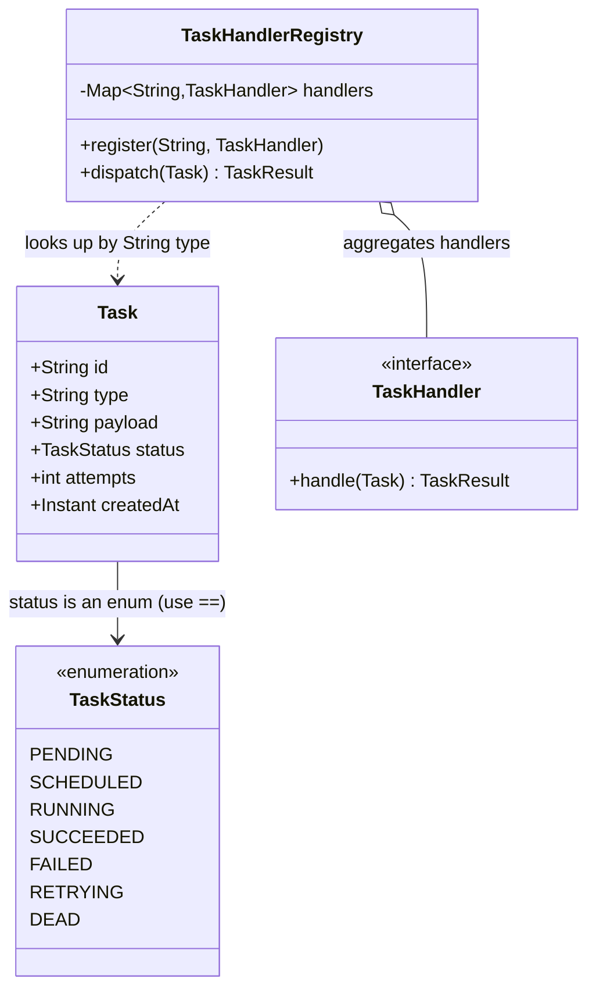

# String Pool and String Internals

> Where in this project: every `Task` carries a `String id` (a UUID), a `String type` (the routing key a `Worker` uses to look up a `TaskHandler`), and a `String payload` (a JSON blob that can be a few bytes or a few megabytes). Three strings, three completely different lifetimes and memory profiles. If you treat them all the same way you will either leak memory on payloads, blow up CPU on id comparisons, or — the classic — compare task types with `==` and ship a bug that only fires in production.

This chapter sits inside module `03-java-memory-model`, right after [immutable objects](./immutable-objects.md). Strings are the canonical immutable object in Java and the one place where the JVM keeps a hidden, process-wide cache — the **string pool**. Understanding it is the difference between strings being "just text" and strings being a deliberate engineering decision for every field on `Task`.

---

## 1. Why this exists — the real problem it solves

You have written `String s = "hello"` ten thousand times. In DSA, a string is a character array you index into; its identity never mattered because you only ever compared values. Backend engineering forces three new questions that DSA never asked:

1. **Identity vs value.** When two `Worker` threads pull two `Task`s whose `type` is `"email.send"`, are those two `String` objects, or one shared object? The answer changes how `==` behaves and how much memory you burn.
2. **Memory pressure.** A queue holding 1,000,000 pending tasks, each with a 2KB JSON `payload`, is holding ~2GB of `String` data on the heap. Strings are objects with headers, a backing array, and (pre–Java 9) two bytes per character. The encoding of that backing array is a production decision.
3. **Comparison cost.** Looking up a `TaskHandler` by `task.type()` in a `HashMap` hashes and compares strings on the hot path of every single task execution. String hashing and equality are not free.

Historically, the string pool exists because early Java programs were drowning in duplicate string literals. Class files are full of literals — method names, constants, the same `"OK"` and `"ERROR"` repeated across hundreds of classes. Without deduplication, every literal occurrence would allocate a fresh object. So the JVM was designed to **intern** string literals: collapse identical literals to a single shared instance. That single design choice — plus immutability, which makes sharing safe — is the entire foundation of this chapter.

> Strings are immutable *specifically so that they can be safely shared* (interned, cached in `HashMap` keys, passed across threads without locks). Immutability and the pool are two halves of one idea. If you have not read [immutable objects](./immutable-objects.md) yet, read it first — this chapter assumes you know *why* `String` is final and unmodifiable.

---

## 2. The mental model — where do strings live?

Three different constructs produce a `String`, and they land in three different places:

```mermaid
flowchart TB
    subgraph Heap["Java Heap"]
        subgraph Pool["String Pool (interned strings, in heap since Java 7)"]
            P1["\"email.send\""]
            P2["\"report.generate\""]
            P3["\"PENDING\""]
        end
        subgraph Regular["Regular heap objects (NOT pooled)"]
            R1["new String(\"email.send\")<br/>distinct object"]
            R2["payload JSON, 2KB byte[]"]
            R3["UUID string from randomUUID()"]
        end
    end
    Literal["String t = \"email.send\";"] -->|literal -> interned| P1
    NewKw["String t = new String(\"email.send\");"] -->|new -> fresh object| R1
    Runtime["UUID.randomUUID().toString()"] -->|computed at runtime| R3
    R1 -.->|.intern() returns| P1
```

Key facts that drive everything below:

- **String literals are interned automatically.** Every `"email.send"` literal anywhere in your codebase refers to the *same* `String` object in the pool.
- **`new String(...)` always allocates a fresh object**, even if an identical string already sits in the pool. `new` is an explicit "I want a distinct object" instruction.
- **Strings built at runtime** (concatenation of variables, `UUID.randomUUID().toString()`, `readLine()`, JSON parsing) are *not* interned. They are ordinary heap objects.
- **The pool moved.** In Java 6 and earlier it lived in PermGen (a fixed-size region that caused `OutOfMemoryError: PermGen space` when over-interned). Since Java 7 the pool lives in the main heap, and since Java 8 PermGen is gone entirely (replaced by Metaspace). This matters: aggressive `intern()` today pressures your normal heap and the GC, not a separate region.

---

## 3. The naive version — comparing strings with `==`

Here is the first-cut `Worker` dispatch logic a newcomer writes. It looks up the handler by comparing the task type against known types.

```java
// NAIVE: do not ship this.
public final class NaiveWorker {

    TaskResult dispatch(Task task) throws Exception {
        String type = task.type();

        // BUG: == compares object identity (reference equality), not text.
        if (type == "email.send") {
            return new EmailHandler().handle(task);
        } else if (type == "report.generate") {
            return new ReportHandler().handle(task);
        }
        return new TaskResult(false, "unknown type: " + type, false);
    }
}
```

This compiles. It even *passes some tests* — which is exactly what makes it dangerous. Here is why it is broken:

```java
String fromLiteral = "email.send";              // interned, points into the pool
String fromApi = new String("email.send");      // fresh heap object
String fromJson = parseTypeFromJson("{...}");    // built at runtime, not interned

fromLiteral == "email.send";   // true  — both are the pooled instance
fromApi == "email.send";       // false — different object, same text
fromJson == "email.send";      // false — runtime string, not interned
```

The `task.type()` value in production comes from an HTTP request body parsed by Jackson — a **runtime** string. It is never the pooled literal. So `type == "email.send"` is `false`, the dispatch falls through to "unknown type", and every email task silently fails. The unit test that constructed `new Task("...", "email.send", ...)` with a *literal* in the test source happened to pass because the test's literal *was* interned. Classic heisenbug: green in CI, red in prod.

**Limitation:** `==` on `String` tests reference identity, not textual equality. It "works" only when both operands happen to be the same pooled object, which you cannot rely on for runtime data.

---

## 4. Improved version — use `equals`, and understand why

The fix is one method call, but the *understanding* is the point.

```java
// IMPROVED: correct, but still verbose and not extensible.
public final class ImprovedWorker {

    TaskResult dispatch(Task task) throws Exception {
        String type = task.type();

        // equals() compares character content. "email.send".equals(type)
        // is the null-safe ordering: the literal can never be null.
        if ("email.send".equals(type)) {
            return new EmailHandler().handle(task);
        } else if ("report.generate".equals(type)) {
            return new ReportHandler().handle(task);
        }
        return new TaskResult(false, "unknown type: " + type, false);
    }
}
```

Two deliberate choices:

- **`equals` not `==`.** `String.equals` first checks reference identity (a fast path that *does* benefit from interning), then compares lengths, then compares characters. It returns `true` for any two strings with the same content regardless of where they live.
- **Literal-on-the-left (`"email.send".equals(type)`).** This is the "Yoda condition" idiom. If `type` is `null`, `type.equals(...)` throws `NullPointerException`, but `"email.send".equals(null)` calmly returns `false`. For `Task.type` that should never be null, you might still prefer `type.equals(...)` for readability — but for fields that *can* be null, literal-on-the-left is a free guard.

It is correct now. But an `if/else` chain over string literals is the [strategy pattern](../05-design-patterns/strategy.md) screaming to be born. Adding a new task type means editing this method — a violation of the open/closed principle.

---

## 5. Production-quality version — a handler registry keyed by `String`

A staff engineer does not branch on string literals. They register handlers in a map and look them up. This is exactly how the real `Worker` in our project finds its `TaskHandler`.

```java
import java.util.Map;
import java.util.concurrent.ConcurrentHashMap;

/**
 * Production dispatch: handlers registered by task type, looked up in O(1).
 * The map's keys are Strings, so this class is a live demonstration of why
 * String equality/hashCode matter on the hot path.
 */
public final class TaskHandlerRegistry {

    // ConcurrentHashMap: many Worker threads read this on every task.
    private final Map<String, TaskHandler> handlers = new ConcurrentHashMap<>();

    /** Registered once at startup. The key is typically a literal -> interned. */
    public void register(String type, TaskHandler handler) {
        handlers.put(type, handler);
    }

    /**
     * Look up by the task's runtime type string. HashMap.get hashes the key
     * and uses equals() for bucket resolution -- never ==. So a runtime
     * string that merely EQUALS "email.send" resolves correctly.
     */
    public TaskResult dispatch(Task task) throws Exception {
        TaskHandler handler = handlers.get(task.type());
        if (handler == null) {
            return new TaskResult(false, "no handler for type: " + task.type(), false);
        }
        return handler.handle(task);
    }
}
```

Why this is the version to ship:

- **Correctness is structural.** There is no `==` anywhere; `HashMap` mandates `equals`/`hashCode`, so the interning trap simply cannot occur.
- **O(1) dispatch.** No matter how many task types exist, lookup is one hash-and-compare. The `if/else` chain was O(number of types) per task.
- **Open for extension.** New task type → `register(...)` at startup. No edit to the dispatch hot path.
- **String hashing is cached.** `String.hashCode()` is computed once and cached in a field inside the `String` object (the `hash` field). Repeated map lookups on the same key reuse it. This is a direct consequence of immutability — the hash can be cached precisely because the content can never change.

> Registration with literal keys means the map's keys are pooled. Lookups with runtime keys still work via `equals`, but if you control the type values you can intern them at the boundary (see §14) to make the fast-path reference check in `equals` fire and shrink the heap.

---

## 6. Code walkthrough — beginner, intermediate, production

### 6.1 Beginner — proving the pool exists

```java
public class PoolBasics {
    public static void main(String[] args) {
        String a = "PENDING";              // literal -> pool
        String b = "PENDING";              // SAME pooled object
        String c = new String("PENDING");  // fresh heap object
        String d = c.intern();             // returns the pooled "PENDING"

        System.out.println(a == b);            // true  — one shared instance
        System.out.println(a == c);            // false — c is a distinct object
        System.out.println(a.equals(c));       // true  — same characters
        System.out.println(a == d);            // true  — intern() canonicalised c

        // Compile-time constant folding: "PEN" + "DING" is computed by javac
        // into the single literal "PENDING", so it is the same pooled object.
        String e = "PEN" + "DING";
        System.out.println(a == e);            // true  — constant-folded literal

        // But a runtime concatenation builds a NEW string, not pooled.
        String prefix = "PEN";
        String f = prefix + "DING";            // computed at runtime
        System.out.println(a == f);            // false — fresh object
        System.out.println(a == f.intern());   // true  — interned on demand
    }
}
```

The lesson: **whether two equal strings are the same object depends entirely on how each was created** — literal, `new`, compile-time-constant concatenation, or runtime concatenation. `equals` papers over all of it; `==` exposes all of it.

### 6.2 Intermediate — immutability and `StringBuilder`

Strings are immutable, so every "modification" allocates a new object. Building a string in a loop with `+` is a textbook O(n²) trap.

```java
import java.util.List;

public class StringMutation {

    // BAD: each += allocates a new String and copies all prior chars.
    // For n tasks this is O(n^2) characters copied. Garbage explosion.
    static String summariseBad(List<Task> tasks) {
        String out = "";
        for (Task t : tasks) {
            out += t.id() + ":" + t.status() + "\n"; // new String every iteration
        }
        return out;
    }

    // GOOD: StringBuilder is a mutable char buffer. Appends amortise to O(1);
    // total work is O(n). One backing array, grown by doubling.
    static String summariseGood(List<Task> tasks) {
        StringBuilder sb = new StringBuilder(tasks.size() * 48); // pre-size to avoid regrowth
        for (Task t : tasks) {
            sb.append(t.id()).append(':').append(t.status()).append('\n');
        }
        return sb.toString(); // one final immutable String
    }
}
```

Note the nuance the JVM hides: a *single* expression like `a + b + c` is fine — `javac` (via the `invokedynamic`-based `StringConcatFactory` since Java 9) already compiles it to an efficient concatenation. The O(n²) trap is specifically `+=` **inside a loop**, where each iteration is a separate, fully-realised `String`. `StringBuilder` (single-threaded) or `StringBuffer` (synchronized, rarely needed) is the fix. Pre-sizing the buffer avoids repeated array copies as it grows.

### 6.3 Production-inspired — memory-aware payload handling

The `Task.payload` is the dangerous string. It is large, it is held for the entire time the task sits in the queue, and naive substring handling used to leak the whole thing.

```java
import java.nio.charset.StandardCharsets;

public final class PayloadInspector {

    /**
     * Pull a small routing hint out of a possibly-huge JSON payload.
     *
     * Historical landmine: before Java 7u6, String.substring() SHARED the
     * parent's char[] via offset/count fields. Extracting 10 chars from a
     * 2MB payload kept all 2MB alive. Modern substring() COPIES, so this is
     * safe today -- but the lesson stands: a String can transitively pin a
     * large backing array. Always reason about what a String references.
     */
    static String extractTypeHint(String payload) {
        int i = payload.indexOf("\"type\":\"");
        if (i < 0) return "unknown";
        int start = i + 8;
        int end = payload.indexOf('"', start);
        // Modern substring copies; the 2MB payload can be GC'd independently.
        return (end > start) ? payload.substring(start, end) : "unknown";
    }

    /**
     * Measure the true heap cost of a payload. Since Java 9's Compact Strings
     * (JEP 254), a String storing only Latin-1 chars uses 1 byte/char; any
     * non-Latin-1 char flips the whole string to UTF-16 at 2 bytes/char.
     */
    static long approximateHeapBytes(String payload) {
        // 16-byte object header + 4-byte coder/hash overhead is approximate;
        // the backing byte[] dominates for large payloads.
        byte[] utf8 = payload.getBytes(StandardCharsets.UTF_8);
        boolean latin1 = payload.chars().allMatch(c -> c < 256);
        long backing = latin1 ? payload.length() : (long) payload.length() * 2;
        return 40 + backing; // header + array header + content, order-of-magnitude
    }
}
```

The two production lessons baked in here: (1) a `String` can transitively keep a much larger array alive, and (2) since Java 9, the heap cost of a string depends on whether its content is Latin-1 — ASCII JSON is half the cost of UTF-16 JSON.

---

## 7. How this applies to our Task Queue project

Map each `Task` field to its string strategy:

| Field | Source | Pooled? | Strategy |
| --- | --- | --- | --- |
| `String id` | `UUID.randomUUID().toString()` | No (runtime) | **Never intern.** Each is unique; interning would only bloat the pool with single-use entries. Compare with `equals`. Consider storing as 16 raw bytes if memory-critical. |
| `String type` | request body / config | No by default | **Low cardinality** (dozens of values). Ideal `intern()` or registry-key candidate — dedupes thousands of `Task`s down to one shared `"email.send"`. |
| `String status` | derived from `TaskStatus` enum | N/A | **Use the enum, not a string.** `TaskStatus.PENDING` is already a singleton; `==` is correct *for enums*. Never store status as a raw string. |
| `String payload` | request body, often large | No | **Never intern.** High cardinality, large, short-to-medium lived. Treat as a heap liability; stream or offload to storage when huge (Phase 2+). |



The single biggest takeaway for the project: **`status` is an enum, `type` is a low-cardinality string worth deduping, `payload` is a memory liability, `id` is high-cardinality and never interned.** One generic "they're all strings" mindset gets all four wrong.

---

## 8. Tradeoffs

| Decision | Pro | Con | When to choose |
| --- | --- | --- | --- |
| Compare with `equals` | Always correct | Slightly slower than `==` (but `equals` short-circuits on `==` internally) | Always, for `String` |
| Compare with `==` | Fastest possible | Reference identity only — wrong for runtime strings | Only for enums and known-interned values |
| `intern()` task types | Dedup → less heap, fast `equals` fast-path | Interning has CPU cost; over-interning bloats the pool/heap | Low-cardinality, long-lived, many duplicates |
| Registry map keyed by `String` | O(1), extensible, no `==` traps | Map overhead; needs good `hashCode` (free for `String`) | Always, for dispatch |
| `StringBuilder` | O(n) building, one allocation | More verbose than `+` | Loops and incremental builds |
| Store `id` as raw 16 bytes | ~halves id memory, faster equality | Loses human-readable logs, more code | Only when id memory is proven hot |
| Compact Strings (default JDK 9+) | ~50% heap savings for ASCII | Non-Latin-1 char flips to UTF-16 | Automatic; just keep payloads ASCII where you can |

The honest summary: `intern()` is a **memory-vs-CPU trade with a footgun**. It helps a narrow case (many duplicates of a small set of long-lived strings) and hurts everything else. Most code should never call it; let the registry map and literal interning do the work for free.

---

## 9. Common mistakes and pitfalls

- **Comparing strings with `==`.** The headline bug. Fix: use `equals` (or a `Map`/`Set` that uses it for you).
- **Interning unbounded/high-cardinality data** (task ids, payloads, user input). The pool grows without bound and pressures the GC. Fix: only intern small, known, repeated sets.
- **Building strings with `+=` in a loop.** O(n²) garbage. Fix: `StringBuilder`, pre-sized.
- **Assuming `intern()` is cheap.** It does a pool lookup/insert under the hood and historically had scaling issues with a fixed-size native hashtable (`-XX:StringTableSize`). Fix: prefer literals and maps; reach for `intern()` only with evidence.
- **Treating `status` as a `String`.** Loses type safety, enables typos (`"PENDIG"`), and wastes memory. Fix: use the `TaskStatus` enum; switch over it with pattern matching.
- **`switch` on a `String` and forgetting it uses `equals` + `hashCode`** under the hood (and is null-hostile pre-Java 21). Fix: prefer enums, or handle null explicitly.
- **Leaking a big payload via a small substring** (only a risk on ancient JDKs, but the *transitive reachability* lesson is permanent). Fix: copy what you keep; let the big array die.
- **`new String("literal")`.** Pointless allocation that defeats the pool. Fix: just use the literal.

---

## 10. Refactoring exercise — bad → improved → production

**Bad.** A scheduler that decides retry behavior by string-comparing the type with `==` and concatenates a log line in a loop.

```java
// BAD
class BadScheduler {
    String buildAudit(List<Task> tasks) {
        String log = "";
        for (Task t : tasks) {
            String action;
            if (t.type() == "payment.charge") {   // == bug
                action = "high-priority";
            } else {
                action = "normal";
            }
            log = log + t.id() + " -> " + action + "\n"; // O(n^2)
        }
        return log;
    }
}
```

**Improved.** Correct comparison, `StringBuilder`.

```java
// IMPROVED
class ImprovedScheduler {
    String buildAudit(List<Task> tasks) {
        StringBuilder log = new StringBuilder(tasks.size() * 40);
        for (Task t : tasks) {
            String action = "payment.charge".equals(t.type()) ? "high-priority" : "normal";
            log.append(t.id()).append(" -> ").append(action).append('\n');
        }
        return log.toString();
    }
}
```

**Production.** Priority is data, not a hardcoded literal; the audit uses a text block template and a `Set` of high-priority types (which uses `equals`/`hashCode`, never `==`).

```java
// PRODUCTION
import java.util.List;
import java.util.Set;

final class TaskAuditor {
    // Configured at startup; literals here are interned, dedup is automatic.
    private final Set<String> highPriorityTypes;

    TaskAuditor(Set<String> highPriorityTypes) {
        this.highPriorityTypes = Set.copyOf(highPriorityTypes); // immutable defensive copy
    }

    String buildAudit(List<Task> tasks) {
        StringBuilder log = new StringBuilder(tasks.size() * 40);
        for (Task t : tasks) {
            String action = highPriorityTypes.contains(t.type()) ? "high-priority" : "normal";
            log.append(t.id()).append(" -> ").append(action).append('\n');
        }
        return log.toString();
    }
}
```

The progression mirrors §3→§5: kill the `==` bug, kill the quadratic concatenation, then make the rules *data* so adding a high-priority type is a config change, not a code change.

---

## 11. Exercises

### Easy

**E1 (knowledge check).** Without running it, give the output and a one-line reason for each:

```java
String a = "RETRYING";
String b = "RETRY" + "ING";
String c = new String("RETRYING");
String d = c.intern();
System.out.println(a == b);
System.out.println(a == c);
System.out.println(a == d);
System.out.println(a.equals(c));
```

**E2 (coding).** Write `boolean sameType(Task x, Task y)` that returns whether two tasks share a type, correctly handling the case where either type is `null`.

### Medium

**M1 (refactoring).** The method below builds a comma-separated id list and compares status with `==`. Fix both problems.

```java
String summarise(List<Task> tasks) {
    String ids = "";
    int running = 0;
    for (Task t : tasks) {
        ids += t.id() + ",";
        if (t.status().name() == "RUNNING") running++; // status is an enum!
    }
    return running + " running of " + ids;
}
```

**M2 (design).** You receive 5,000,000 tasks/day. `type` has only ~40 distinct values; `id` is a unique UUID; `payload` averages 1.5KB. Decide, with justification, which fields to `intern()`, which to leave alone, and which to store in a non-`String` form. Estimate the heap saved by your `type` decision.

### Hard

**H1 (interview-style).** Explain precisely what `String.intern()` does, where the pool lives in Java 8 vs Java 21, and one realistic production scenario where calling `intern()` *hurts* throughput. Then propose a safer alternative that gets most of the benefit.

**H2 (stretch).** Implement a bounded, thread-safe "type canonicalizer" that deduplicates up to `N` distinct task-type strings (returning the shared instance) but, unlike `String.intern()`, never grows the JVM string pool and is fully under your control. It must evict nothing within the cap and reject (return the original, uninterned) beyond the cap so it can never leak unbounded memory.

---

## 12. Solutions

### E1

```text
a == b   -> true   : "RETRY"+"ING" is a compile-time constant, folded to the literal "RETRYING" (same pooled object).
a == c   -> false  : new String(...) always allocates a fresh, distinct object.
a == d   -> true   : c.intern() returns the canonical pooled "RETRYING", which is a.
a.equals(c) -> true: equals compares characters; content is identical.
```

### E2

```java
static boolean sameType(Task x, Task y) {
    // java.util.Objects.equals is null-safe on both sides.
    return java.util.Objects.equals(x.type(), y.type());
}
```

`Objects.equals(a, b)` returns `true` if both are `null`, `false` if exactly one is `null`, else `a.equals(b)`. This is the idiomatic null-safe string comparison.

### M1

```java
String summarise(List<Task> tasks) {
    StringBuilder ids = new StringBuilder(tasks.size() * 38);
    int running = 0;
    for (Task t : tasks) {
        ids.append(t.id()).append(',');
        // status is the TaskStatus enum: == is CORRECT and fastest for enums.
        if (t.status() == TaskStatus.RUNNING) running++;
    }
    return running + " running of " + ids;
}
```

Two fixes: `StringBuilder` removes the O(n²) concatenation, and comparing the **enum** directly with `==` is both correct and idiomatic. The original `t.status().name() == "RUNNING"` did a string `==` on a runtime string (`name()` returns a fresh-ish string) — a guaranteed `false` in the general case and a textbook bug.

### M2

Decision and reasoning:

- **`type` → intern / registry-key.** ~40 distinct values across 5M tasks means ~125,000 duplicate references per value. Interning collapses each to one `String`. A `"payment.charge"` string is ~14 chars → with Compact Strings ~14 bytes content + ~24 bytes overhead ≈ 38 bytes. Without dedup: 5,000,000 × 38 ≈ **190 MB** of type strings. With dedup: 40 × 38 ≈ **1.5 KB**, plus the per-`Task` reference (8 bytes) which you pay either way. Net savings on the *content*: ~190 MB → near zero. Use a bounded canonicalizer (H2) rather than raw `intern()` so the pool stays controlled.
- **`id` → leave as-is, or store as 16 raw bytes if proven hot.** Every id is unique, so interning gives zero dedup and only bloats the pool. A 36-char UUID string ≈ 60 bytes; 5M/day ≈ 300 MB/day if all retained. If id memory is a hot path, store the UUID's two `long`s (16 bytes) and render the string only for logging.
- **`payload` → never intern; treat as liability.** High cardinality, large, defeats the entire point of a dedup pool. In Phase 2+ offload large payloads to PostgreSQL/object storage and keep only a reference in memory.
- **`status` → not a `String` at all.** Use `TaskStatus`. Zero per-task allocation; the enum constants are shared singletons.

### H1

`String.intern()` looks the string up in the JVM-wide string pool: if an `equals`-equal string is already there, it returns that canonical instance; otherwise it adds this string and returns it. Result: all interned, equal strings are `==`-identical.

Pool location: **Java 6 and earlier → PermGen** (fixed size, caused `OutOfMemoryError: PermGen space`). **Java 7, 8, …, 21 → the main Java heap** (PermGen was removed in Java 8 in favor of Metaspace, but the string *pool* itself moved to the heap back in Java 7). So in Java 21, interned strings are normal heap objects subject to ordinary GC.

A scenario where `intern()` hurts: interning **high-cardinality runtime strings** — e.g., calling `intern()` on every task `id` or every `payload`. The pool's backing hashtable (sized by `-XX:StringTableSize`, default ~65,536 buckets historically) degrades as it fills; lookups and inserts contend and slow down, and the interned strings are now long-lived heap garbage the GC must scan. Throughput drops and pauses lengthen.

Safer alternative: a **bounded application-level canonical map** (`ConcurrentHashMap<String,String>` with a size cap, or a Guava/Caffeine interner). You get dedup for the values you choose, with an eviction/cap policy you control, and you never touch the JVM-wide pool. That is H2.

### H2

```java
import java.util.Map;
import java.util.concurrent.ConcurrentHashMap;

/**
 * Bounded, thread-safe string canonicalizer for low-cardinality values
 * such as Task.type. Unlike String.intern() it never touches the JVM
 * string pool and cannot grow past `cap`, so it can never leak unbounded
 * memory. Beyond the cap it returns the original string uninterned.
 */
public final class BoundedCanonicalizer {

    private final ConcurrentHashMap<String, String> table = new ConcurrentHashMap<>();
    private final int cap;

    public BoundedCanonicalizer(int cap) {
        if (cap <= 0) throw new IllegalArgumentException("cap must be > 0");
        this.cap = cap;
    }

    /**
     * Returns the canonical (shared) instance for `s`. If `s` is the first of
     * its content seen and we are under cap, it becomes canonical. If we are
     * at cap and `s` is new, we return `s` itself without storing it -- the
     * map can never exceed `cap` entries.
     */
    public String canonical(String s) {
        if (s == null) return null;
        String existing = table.get(s);
        if (existing != null) return existing;          // hot path: already canonical
        if (table.size() >= cap) return s;              // at capacity: do not store
        // putIfAbsent is atomic; on race the winner's value is returned.
        String prior = table.putIfAbsent(s, s);
        return (prior != null) ? prior : s;
    }

    public int size() { return table.size(); }
}
```

Usage at the API boundary, where a `Task` is first constructed from a request:

```java
Task task = new Task(
    UUID.randomUUID().toString(),          // id: NOT canonicalized (unique)
    canonicalizer.canonical(req.type()),   // type: deduped to a shared instance
    req.payload(),                         // payload: NOT canonicalized (large/unique)
    TaskStatus.PENDING, 0, 5,
    Instant.now(), null, req.priority()
);
```

Why this is better than `intern()` here: the cap guarantees bounded memory; the map is GC'd with your application object, not pinned in a JVM-wide structure; and you can swap in an LRU/Caffeine cache later without changing call sites. The `size() >= cap` check uses `ConcurrentHashMap.size()` which is a weakly-consistent estimate — acceptable here because a slight overshoot of a few entries under heavy contention is harmless for a memory *bound*. If you need a hard cap, gate inserts through `compute`/an `AtomicInteger` counter.

---

## 13. Interview questions and takeaways

1. **Q: What is the difference between `==` and `.equals()` for strings?**
   A: `==` compares object references (identity); `.equals()` compares character content. Two strings can be `equals` but not `==` (e.g., a literal vs `new String(...)`). Always use `equals` for value comparison; `==` only works by accident when both operands are the same pooled object.

2. **Q: What is the string pool and why does it exist?**
   A: A JVM-wide cache of canonical `String` instances. String literals are automatically interned into it so that identical literals across the codebase share one object, saving memory. It is safe because strings are immutable. Since Java 7 it lives in the heap.

3. **Q: Why is `String` immutable, and how does that relate to the pool?**
   A: Immutability lets strings be safely shared without defensive copies — which is the prerequisite for pooling/interning, for caching `hashCode`, and for using strings as `HashMap` keys and across threads without locks. If strings were mutable, one holder could corrupt every sharer.

4. **Q: `String s = new String("hi");` — how many objects are created?**
   A: Up to two. The literal `"hi"` is one object placed in the pool (if not already there); `new String("hi")` creates a second, distinct heap object that copies the content. `new` always allocates a fresh object even though an equal one exists.

5. **Q: When would you call `intern()`, and when is it a mistake?**
   A: Call it for low-cardinality, long-lived, heavily-duplicated strings (like task types) to dedup memory and enable the `==` fast-path. It is a mistake for high-cardinality runtime data (ids, payloads, arbitrary user input) — it bloats the pool, pressures the GC, and can degrade throughput.

6. **Q: Why is concatenating strings in a loop with `+` slow?**
   A: Strings are immutable, so each `+=` allocates a new `String` and copies all prior characters — O(n²) total and a flood of garbage. Use `StringBuilder` (O(n)), ideally pre-sized.

7. **Q: What changed about strings' memory footprint in Java 9?**
   A: Compact Strings (JEP 254). A `String` now backs onto a `byte[]` plus a `coder` flag; pure Latin-1 content uses 1 byte/char instead of 2. ASCII-heavy data (most JSON, ids, types) roughly halved in heap cost. Any non-Latin-1 character flips the whole string to UTF-16.

8. **Q: Is `StringBuilder` thread-safe?**
   A: No — that is the point. `StringBuilder` is the unsynchronized, fast version; `StringBuffer` is the synchronized legacy version. Build in a single thread with `StringBuilder` and publish the immutable result; you almost never need `StringBuffer`.

**Takeaways:** Use `equals` (or maps/sets) for value comparison. The pool dedups *literals* for free; only `intern()` for narrow, justified cases. Strings are immutable so they can be shared safely. Treat large/high-cardinality strings (payloads, ids) as heap liabilities; treat low-cardinality strings (types) as dedup opportunities; treat status as an enum.

---

## 14. Production considerations

- **Heap dominated by payloads.** In a queue holding millions of tasks, `String payload` is usually the single largest line item in a heap dump (`jmap -histo` / Eclipse MAT will show `byte[]` and `String` at the top). Mitigation: cap payload size at the API, offload large payloads to PostgreSQL or object storage in Phase 2+, and keep only a reference in the in-memory `Task`.
- **String table sizing.** If you do intern at scale, tune `-XX:StringTableSize` and watch `-XX:+PrintStringTableStatistics` at exit. A too-small table turns interning into a hash-collision hot spot. Better: avoid JVM interning and use a bounded canonicalizer (§12, H2).
- **GC pressure from string churn.** The `+=`-in-a-loop antipattern, JSON re-serialization, and excessive `substring`/`split` create short-lived garbage that fills the young generation and raises minor-GC frequency. Profile with allocation profilers (async-profiler) before optimizing.
- **Compact Strings and locale data.** Keep ids and types ASCII. A single emoji or non-Latin-1 char in a `type` doubles that string's footprint and disables the cheap Latin-1 path for it.
- **Security/observability.** Never log full payloads (they may contain PII or secrets) and never use them as map keys (high cardinality → unbounded maps → leak). Log a truncated hash or the `type` instead.
- **Equality on the hot path.** Dispatch hashes `task.type()` per task. With low-cardinality interned types, `String.equals` hits its `==` fast-path and `hashCode` is cached — effectively free. This is the quiet payoff of getting the type strategy right.

---

## What We Can Improve In Our Project Using This Concept

- Replace any `==` string comparison in `Worker`/dispatch with a `TaskHandlerRegistry` lookup (`HashMap`/`ConcurrentHashMap`) so the interning trap is structurally impossible.
- Introduce a `BoundedCanonicalizer` (or a Caffeine interner) at the API ingestion boundary to dedup `Task.type`, cutting type-string heap from hundreds of MB to a few KB at million-task scale.
- Ensure `Task.status` is the `TaskStatus` enum everywhere — never a raw `String` — and switch over it with Java 21 pattern matching.
- Add a payload-size guard at submission and a plan to offload large payloads to PostgreSQL in [Phase 2](../09-project/phase-2.md).

## Project Refactoring Task

Refactor the in-memory dispatch path:
1. Create `TaskHandlerRegistry` (`Map<String, TaskHandler>`) and register handlers by type at `WorkerPool` startup.
2. Change `Worker.run()` to look up the handler via `registry.dispatch(task)` instead of any `if/else` on type; delete every `==` string comparison.
3. Add `BoundedCanonicalizer` and canonicalize `Task.type` in the submission API; leave `id` and `payload` untouched.
4. Add a unit test asserting that a `Task` whose `type` came from a parsed JSON string (not a literal) still dispatches correctly — locking in the `equals`-not-`==` behavior.

## Git Commit For This Chapter

```text
refactor(dispatch): key handlers by String type via registry; dedup task types

- add TaskHandlerRegistry backed by ConcurrentHashMap<String, TaskHandler>
- replace == string comparisons in Worker with equals-based map lookup
- add BoundedCanonicalizer; canonicalize Task.type at API boundary
- enforce TaskStatus enum for status (remove raw status strings)
- test: runtime-parsed type strings dispatch correctly

Files touched:
  src/main/java/taskqueue/worker/TaskHandlerRegistry.java
  src/main/java/taskqueue/worker/Worker.java
  src/main/java/taskqueue/api/BoundedCanonicalizer.java
  src/main/java/taskqueue/model/Task.java
  src/test/java/taskqueue/worker/TaskHandlerRegistryTest.java
```

## Architecture Impact

Dispatch becomes O(1) and open/closed: new task types are registered, not branched on, so the worker hot path never changes as the catalog grows. Keying on `String` makes string equality/hashing a hot-path property — addressed by interning low-cardinality types and caching `hashCode` (free via immutability). Memory architecture shifts: types collapse to shared instances while payloads are explicitly treated as a liability to be capped and, in Phase 2, offloaded — keeping the in-memory queue's footprint bounded as it scales toward the distributed broker of [Phase 4](../09-project/phase-4.md).

## Interview Takeaways

- `==` is identity, `equals` is content; the string pool makes them *coincidentally* agree for literals, which is exactly why `==` bugs hide in tests and surface in production.
- Immutability is what makes the pool, `hashCode` caching, and lock-free sharing safe — it is a feature, not an accident.
- `intern()` is a memory/CPU trade for low-cardinality, long-lived, duplicated strings only; a bounded canonicalizer is the safer production tool.
- Build strings with `StringBuilder`; know that single-expression concatenation is already optimized but `+=`-in-a-loop is O(n²).
- Right-size your strings per field: enum for status, dedup for type, leave-alone for id, liability-managed for payload.
