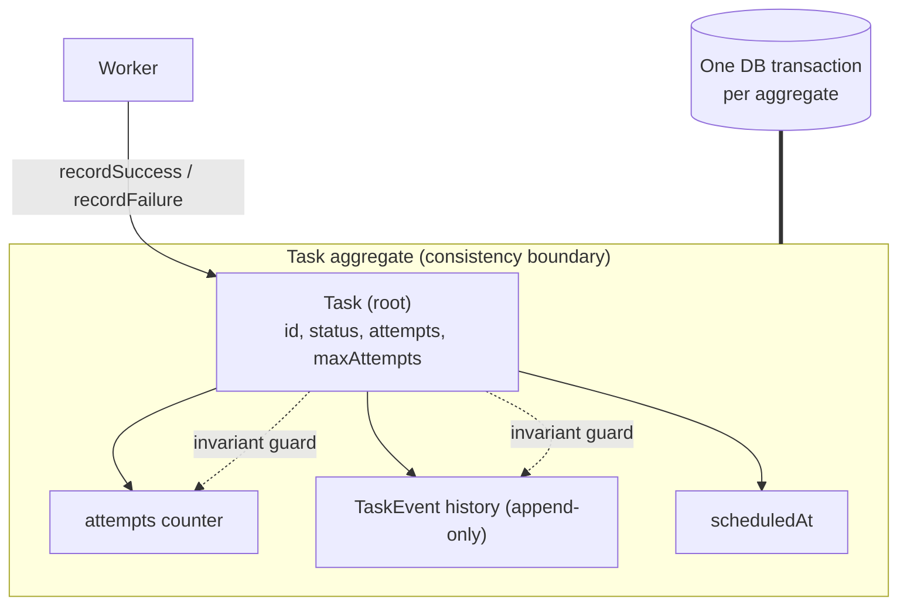
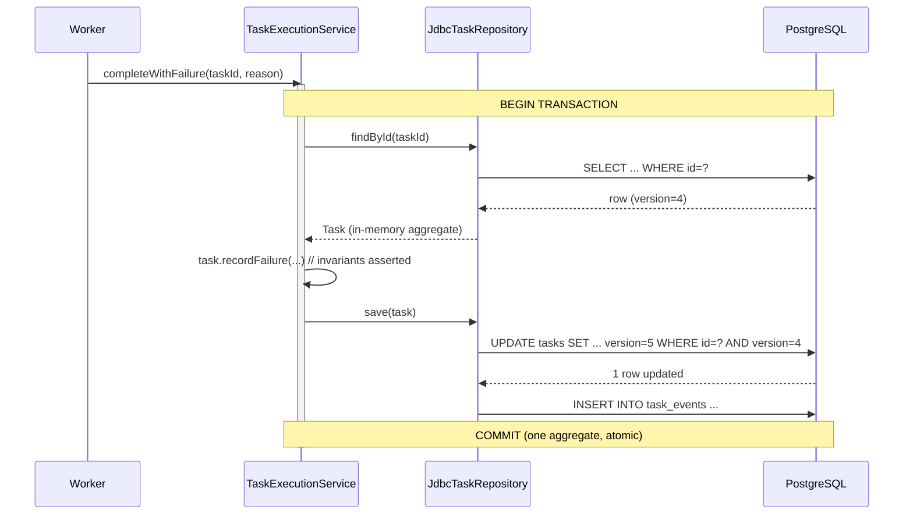
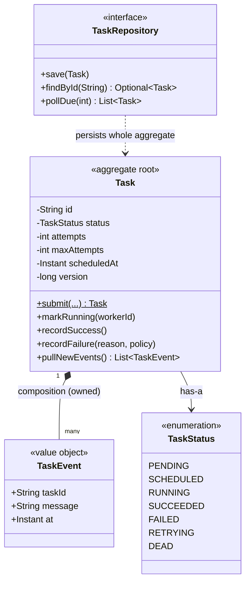

# Aggregates and Boundaries

> Where this fits in the project: in our Distributed Task Queue, a `Task` is never just a row in a table. It owns its attempt count, the timeline of its status transitions, and the events it emits when a worker touches it. This chapter shows how to draw a *consistency boundary* around `Task` so that one API call, one worker outcome, and — in Phase 2 — one database transaction all agree on what "valid" means.

This chapter builds directly on [domain modeling](./domain-modeling.md). Once you know how to find the nouns of a domain, the next question is: *which of those nouns must change together, atomically?* That cluster is an **aggregate**, and getting its boundary right is the difference between a system that corrupts data under load and one that does not.

---

## 1. Why This Exists — the real problem it solves

When a worker finishes processing a `Task`, several pieces of state change *at the same instant*:

- `attempts` increments by one,
- `status` flips from `RUNNING` to one of `SUCCEEDED`, `FAILED`, `RETRYING`, or `DEAD`,
- a `TaskEvent` is appended to the task's history ("attempt 3 failed: connection timeout"),
- on a retry, `scheduledAt` is pushed into the future by the [retry policy](../08-distributed-systems/retries.md).

These changes are not independent. They are bound by **invariants** — rules that must *always* hold:

- A `Task` is `DEAD` **if and only if** `attempts >= maxAttempts`.
- `attempts` never decreases, and never exceeds `maxAttempts`.
- Every status transition is legal (you cannot go `SUCCEEDED -> RUNNING`).
- The event history is append-only and consistent with the current status.

If half of those updates land and half don't — say `status = DEAD` is persisted but `attempts` is still `2` while `maxAttempts` is `3` — your data is now *lying*. The task looks both dead and retryable. A reconciliation job will "rescue" it and re-run a payload that was supposed to be poisoned. This is not hypothetical; partial, inconsistent writes are the single most common source of corruption in queue and workflow systems.

The **Aggregate** pattern, named and popularized by Eric Evans in *Domain-Driven Design* (2003), is the disciplined answer. An **aggregate** is a cluster of objects we treat as a *single unit for data changes*. One object — the **aggregate root** — is the only object outsiders may hold a reference to or call methods on. The root is the guardian of the cluster's invariants.

The historical context is worth one sentence: before DDD, teams used the database transaction as the *only* consistency tool. They wrapped arbitrary sets of rows in `BEGIN ... COMMIT` and hoped. DDD's contribution was to flip the dependency: **the transaction boundary should match a boundary that already exists in the domain.** Find the cluster that shares invariants. Make it an aggregate. Then: *one transaction modifies exactly one aggregate.*

> **The one-sentence rule:** an aggregate is the unit of consistency — one transaction modifies one aggregate instance; everything outside is eventually consistent.

Internalizing this rule makes Phase 2 (PostgreSQL + transactions) and Phase 4 (distributed workers) dramatically easier to reason about, because you stop asking "what should I lock?" and start asking "which aggregate am I changing?"



---

## 2. The Naive Version

Here is how almost everyone first models `Task` and its surrounding data: a bag of public fields, with mutation logic scattered across whatever service happens to touch it.

```java
// NAIVE: anemic data holder, public fields, no boundary, no guard.
public class Task {
    public String id;
    public String type;
    public String payload;
    public TaskStatus status;
    public int attempts;
    public int maxAttempts;
    public Instant createdAt;
    public Instant scheduledAt;
    public int priority;
    public List<TaskEvent> events = new ArrayList<>();
}
```

And the `Worker` reaches in and edits raw fields:

```java
// NAIVE: the Worker mutates Task internals directly.
public class Worker {

    void onFailure(Task task, String reason) {
        task.attempts = task.attempts + 1;                    // (1)
        task.events.add(new TaskEvent(task.id, reason));      // (2)
        if (task.attempts >= task.maxAttempts) {
            task.status = TaskStatus.DEAD;                    // (3)
        } else {
            task.status = TaskStatus.RETRYING;                // (4)
            task.scheduledAt = Instant.now().plusSeconds(30); // (5)
        }
    }

    void onSuccess(Task task) {
        task.status = TaskStatus.SUCCEEDED;                   // (6)
    }
}
```

Why this is dangerous, even though it "works" in a happy-path demo:

- **No single owner of the invariants.** The rule "`DEAD` iff `attempts >= maxAttempts`" lives inside `Worker.onFailure`. The day someone writes a `RescueService` or a `RetryHandler` that flips status without re-checking attempts, the invariant silently breaks. There is no compiler or class boundary stopping them.
- **Steps can be reordered or partially applied.** If an exception is thrown between line (1) and line (3), `attempts` is bumped but `status` is stale. The object is now internally inconsistent in memory — before any database is even involved.
- **The events list is exposed.** Anyone can call `task.events.clear()` or add an event that contradicts the status. The "append-only history" is a comment, not a guarantee.
- **It encourages multi-aggregate transactions.** Because nothing tells you where the boundary is, a developer will happily write one method that mutates a `Task`, a `WorkerNode` record, and a `RateLimiter` quota in a single transaction "to be safe," accidentally coupling three independent things and creating lock contention.

This is the **anemic domain model**: data with no behavior, behavior with no home. It is the default, and it is the thing aggregates exist to fix.

---

## 3. Improved Version

The first real improvement: make the fields private and force all mutation through methods on `Task`. The `Task` becomes the **aggregate root** and starts guarding its own invariants.

```java
public final class Task {
    private final String id;
    private final String type;
    private final String payload;
    private TaskStatus status;
    private int attempts;
    private final int maxAttempts;
    private final Instant createdAt;
    private Instant scheduledAt;
    private final int priority;
    private final List<TaskEvent> events = new ArrayList<>();

    public Task(String id, String type, String payload,
                int maxAttempts, int priority, Instant now) {
        this.id = Objects.requireNonNull(id);
        this.type = Objects.requireNonNull(type);
        this.payload = Objects.requireNonNull(payload);
        if (maxAttempts < 1) throw new IllegalArgumentException("maxAttempts >= 1");
        this.status = TaskStatus.PENDING;
        this.attempts = 0;
        this.maxAttempts = maxAttempts;
        this.createdAt = now;
        this.scheduledAt = now;
        this.priority = priority;
    }

    // The only ways the outside world may change a Task:

    public void markRunning() {
        requireStatus(TaskStatus.PENDING, TaskStatus.SCHEDULED, TaskStatus.RETRYING);
        this.status = TaskStatus.RUNNING;
        this.attempts++;
        record("attempt " + attempts + " started");
    }

    public void recordSuccess() {
        requireStatus(TaskStatus.RUNNING);
        this.status = TaskStatus.SUCCEEDED;
        record("succeeded on attempt " + attempts);
    }

    public void recordFailure(String reason, Optional<Duration> nextDelay) {
        requireStatus(TaskStatus.RUNNING);
        record("attempt " + attempts + " failed: " + reason);
        if (attempts >= maxAttempts || nextDelay.isEmpty()) {
            this.status = TaskStatus.DEAD;
        } else {
            this.status = TaskStatus.RETRYING;
            this.scheduledAt = Instant.now().plus(nextDelay.get());
        }
    }

    private void requireStatus(TaskStatus... allowed) {
        for (TaskStatus s : allowed) if (s == status) return;
        throw new IllegalStateException(
            "illegal transition from " + status + "; expected one of " + Arrays.toString(allowed));
    }

    private void record(String message) {
        events.add(new TaskEvent(id, message, Instant.now()));
    }

    // Read-only accessors; note the defensive copy on the list.
    public TaskStatus status() { return status; }
    public int attempts() { return attempts; }
    public List<TaskEvent> events() { return List.copyOf(events); }
    public String id() { return id; }
}
```

What improved:

- **One owner of invariants.** The `DEAD`-iff-`attempts-exhausted` rule now lives in exactly one place: `recordFailure`. There is no second door.
- **Illegal transitions throw.** `requireStatus` makes `SUCCEEDED -> RUNNING` impossible at runtime instead of merely discouraged.
- **`attempts` is incremented exactly once per run**, inside `markRunning`, so it can never double-count or skip.
- **The event list is encapsulated.** `events()` returns an immutable copy; nobody can mutate history from outside. (See [immutable objects](../03-java-memory-model/immutable-objects.md) for why `List.copyOf` matters here.)

This is genuinely better. But it is still missing two things a staff engineer cares about: the boundary is *implicit* (nothing names the aggregate or forbids reaching into child objects), and there is no story for **concurrent** updates or **persistence**. We fix both next.

---

## 4. Production-Quality Version

The production version adds three things on top of the improved version:

1. **An explicit version field for optimistic concurrency** — so two workers cannot both apply a transition to the same `Task` and clobber each other.
2. **Child entities referenced only by identity from outside the aggregate** — other aggregates (e.g., a `WorkerNode`) hold a `taskId`, never a `Task` reference.
3. **A clean separation between the domain method (pure, no I/O) and the application service (transaction + persistence)** — so the aggregate stays testable and the transaction boundary is obvious.

```java
public final class Task {
    private final String id;
    private final String type;
    private final String payload;
    private TaskStatus status;
    private int attempts;
    private final int maxAttempts;
    private final Instant createdAt;
    private Instant scheduledAt;
    private final int priority;
    private long version;                    // optimistic-locking version
    private final List<TaskEvent> newEvents; // events produced this transaction

    // Reconstitution constructor used by the repository when loading from DB.
    public Task(String id, String type, String payload, TaskStatus status,
                int attempts, int maxAttempts, Instant createdAt,
                Instant scheduledAt, int priority, long version) {
        this.id = id;
        this.type = type;
        this.payload = payload;
        this.status = status;
        this.attempts = attempts;
        this.maxAttempts = maxAttempts;
        this.createdAt = createdAt;
        this.scheduledAt = scheduledAt;
        this.priority = priority;
        this.version = version;
        this.newEvents = new ArrayList<>();
    }

    /** Factory enforcing creation invariants. */
    public static Task submit(String type, String payload, int maxAttempts,
                              int priority, Instant now) {
        if (maxAttempts < 1) throw new IllegalArgumentException("maxAttempts >= 1");
        Task t = new Task(UUID.randomUUID().toString(), type, payload,
                TaskStatus.PENDING, 0, maxAttempts, now, now, priority, 0);
        t.record("submitted");
        return t;
    }

    public void markRunning(String workerId) {
        requireStatus(TaskStatus.PENDING, TaskStatus.SCHEDULED, TaskStatus.RETRYING);
        this.status = TaskStatus.RUNNING;
        this.attempts++;
        record("attempt %d started by %s".formatted(attempts, workerId));
    }

    public void recordSuccess() {
        requireStatus(TaskStatus.RUNNING);
        this.status = TaskStatus.SUCCEEDED;
        record("succeeded on attempt " + attempts);
    }

    public void recordFailure(String reason, RetryPolicy policy) {
        requireStatus(TaskStatus.RUNNING);
        record("attempt %d failed: %s".formatted(attempts, reason));
        Optional<Duration> delay =
            attempts < maxAttempts ? policy.nextDelay(attempts) : Optional.empty();
        if (delay.isEmpty()) {
            this.status = TaskStatus.DEAD;
            record("exhausted retries; moved to DEAD");
        } else {
            this.status = TaskStatus.RETRYING;
            this.scheduledAt = Instant.now().plus(delay.get());
            record("retrying after " + delay.get());
        }
        assertInvariants();
    }

    /** Centralized invariant check — the contract of the aggregate. */
    private void assertInvariants() {
        if (attempts < 0 || attempts > maxAttempts)
            throw new IllegalStateException("attempts out of range: " + attempts);
        boolean exhausted = attempts >= maxAttempts;
        if (status == TaskStatus.DEAD && !exhausted)
            throw new IllegalStateException("DEAD but attempts not exhausted");
    }

    private void requireStatus(TaskStatus... allowed) {
        for (TaskStatus s : allowed) if (s == status) return;
        throw new IllegalStateException(
            "illegal transition from %s; expected one of %s"
                .formatted(status, Arrays.toString(allowed)));
    }

    private void record(String message) {
        newEvents.add(new TaskEvent(id, message, Instant.now()));
    }

    /** Events produced this unit of work, to be flushed by the repository. */
    public List<TaskEvent> pullNewEvents() {
        List<TaskEvent> drained = List.copyOf(newEvents);
        newEvents.clear();
        return drained;
    }

    // Accessors used by the repository mapper and read paths.
    public String id() { return id; }
    public TaskStatus status() { return status; }
    public int attempts() { return attempts; }
    public int maxAttempts() { return maxAttempts; }
    public Instant scheduledAt() { return scheduledAt; }
    public long version() { return version; }
    void bumpVersion() { this.version++; } // package-private; repo calls after save
}
```

`TaskEvent` is a value object — an immutable record with no identity of its own. It only makes sense *inside* a `Task`, which is the textbook signal of an entity that belongs to the aggregate, not a separate aggregate:

```java
public record TaskEvent(String taskId, String message, Instant at) {
    public TaskEvent {
        Objects.requireNonNull(taskId);
        Objects.requireNonNull(message);
        Objects.requireNonNull(at);
    }
}
```

Key production decisions and *why*:

- **`version` + optimistic locking** replaces pessimistic row locks for the common case. Two workers loading the same task and racing to update it will both compare-and-swap on `version`; the loser gets a stale-version error and retries. This scales far better than `SELECT ... FOR UPDATE` held across the whole task run.
- **The aggregate method does no I/O.** `recordFailure` computes new state purely in memory and asserts invariants. Persistence is the application service's job (Section 5). This keeps the domain logic trivially unit-testable with no database.
- **Events are buffered and pulled.** The aggregate accumulates `newEvents` and hands them to the repository to flush *in the same transaction*. This is how the [event bus](../08-distributed-systems/idempotency.md) and audit log stay consistent with state without leaking infrastructure into the domain object.

---

## 5. How Aggregate Boundaries Map to DB Transactions (Phase 2)

This is the section that makes aggregates *operational* rather than philosophical. In [Phase 2](../09-project/phase-2.md) we move from an in-memory queue to PostgreSQL via `TaskRepository`. The aggregate boundary becomes the **transaction boundary**, literally.

### The mapping

| Domain concept | Database mechanism |
|----------------|--------------------|
| Aggregate instance (one `Task` + its events) | The rows changed inside one `@Transactional` method |
| Aggregate root identity (`Task.id`) | Primary key `tasks.id` |
| Child entity (`TaskEvent`) | Rows in `task_events` with FK `task_id`, written in the *same* transaction |
| Invariant ("`DEAD` iff exhausted") | Enforced in Java *and* backed by a CHECK constraint as a safety net |
| Optimistic concurrency (`version`) | `UPDATE ... WHERE id = ? AND version = ?`; 0 rows affected ⇒ conflict |
| Reference to *another* aggregate | A foreign-key *column* (e.g. `worker_node_id`), never a JOIN you transactionally lock |

The schema (Flyway migration `V2__tasks.sql`):

```sql
CREATE TABLE tasks (
    id            UUID PRIMARY KEY,
    type          TEXT        NOT NULL,
    payload       JSONB       NOT NULL,
    status        TEXT        NOT NULL,
    attempts      INT         NOT NULL DEFAULT 0,
    max_attempts  INT         NOT NULL,
    created_at    TIMESTAMPTZ NOT NULL,
    scheduled_at  TIMESTAMPTZ NOT NULL,
    priority      INT         NOT NULL DEFAULT 0,
    version       BIGINT      NOT NULL DEFAULT 0,
    -- Invariant as a defensive constraint: DEAD implies attempts exhausted.
    CONSTRAINT dead_implies_exhausted
        CHECK (status <> 'DEAD' OR attempts >= max_attempts),
    CONSTRAINT attempts_in_range
        CHECK (attempts >= 0 AND attempts <= max_attempts)
);

CREATE TABLE task_events (
    id       BIGSERIAL PRIMARY KEY,
    task_id  UUID NOT NULL REFERENCES tasks(id) ON DELETE CASCADE,
    message  TEXT NOT NULL,
    at       TIMESTAMPTZ NOT NULL
);

CREATE INDEX idx_task_events_task_id ON task_events(task_id);
```

> The CHECK constraints are not redundant with the Java invariants — they are the *last line of defense*. If a buggy migration script or an ad-hoc `UPDATE` ever tries to violate the invariant, the database refuses. Belt and suspenders: the aggregate enforces it for correctness and good error messages; the database enforces it for durability against code you don't control.

### The application service: one transaction, one aggregate

```java
@Service
public class TaskExecutionService {

    private final TaskRepository repository;
    private final RetryPolicy retryPolicy;

    public TaskExecutionService(TaskRepository repository, RetryPolicy retryPolicy) {
        this.repository = repository;
        this.retryPolicy = retryPolicy;
    }

    /** One transaction. One aggregate. */
    @Transactional
    public void completeWithFailure(String taskId, String reason) {
        Task task = repository.findById(taskId)
            .orElseThrow(() -> new TaskNotFoundException(taskId));

        task.recordFailure(reason, retryPolicy);   // pure domain logic, no I/O

        repository.save(task);                      // CAS on version + flush events
    }
}
```

And the repository implements the compare-and-swap that makes the version field do real work:

```java
@Repository
public class JdbcTaskRepository implements TaskRepository {

    private final JdbcTemplate jdbc;

    @Override
    public void save(Task task) {
        int updated = jdbc.update("""
            UPDATE tasks
               SET status = ?, attempts = ?, scheduled_at = ?, version = version + 1
             WHERE id = ? AND version = ?
            """,
            task.status().name(), task.attempts(),
            Timestamp.from(task.scheduledAt()), task.id(), task.version());

        if (updated == 0) {
            // Someone else changed this aggregate since we loaded it.
            throw new OptimisticLockException(task.id());
        }
        // Same transaction: append the events the aggregate produced.
        for (TaskEvent e : task.pullNewEvents()) {
            jdbc.update("INSERT INTO task_events(task_id, message, at) VALUES (?,?,?)",
                e.taskId(), e.message(), Timestamp.from(e.at()));
        }
    }
}
```



### The rule you must not break

> **Do not modify two aggregates in one transaction.** If a worker outcome needs to update a `Task` *and* push the dead task into the [dead-letter queue](../07-queues-and-messaging/dead-letter-queues.md), do **not** wrap both in one `@Transactional`. Commit the `Task` change first; let the DLQ pick it up asynchronously (or via an outbox row written *inside* the task transaction). Cross-aggregate consistency is **eventual**, not immediate.

The reason is twofold. Practically, multi-aggregate transactions create wide lock footprints that throttle throughput and deadlock under load. Architecturally, the moment Phase 4 distributes `Task` storage and the DLQ across different nodes or brokers, a cross-aggregate transaction becomes a distributed transaction — a thing you want to avoid at almost any cost.

---

## 6. Code Walkthrough

### Beginner example — find the boundary

The smallest useful slice: a `Task` that guards just one invariant. No persistence, no concurrency.

```java
public final class Task {
    private final String id;
    private TaskStatus status = TaskStatus.PENDING;
    private int attempts = 0;
    private final int maxAttempts;

    public Task(String id, int maxAttempts) {
        this.id = id;
        this.maxAttempts = maxAttempts;
    }

    public void fail() {
        attempts++;
        status = (attempts >= maxAttempts) ? TaskStatus.DEAD : TaskStatus.RETRYING;
    }

    public TaskStatus status() { return status; }
    public int attempts() { return attempts; }
}
```

```java
Task t = new Task("t1", 3);
t.fail(); // attempts=1, RETRYING
t.fail(); // attempts=2, RETRYING
t.fail(); // attempts=3, DEAD  -- invariant: DEAD iff attempts>=maxAttempts
System.out.println(t.status()); // DEAD
```

The lesson: `attempts` and `status` change together, through one method. There is no way to reach a state where `status == DEAD` but `attempts < maxAttempts`. *That* is an aggregate, in miniature.

### Intermediate example — entities vs. value objects inside the boundary

Now the aggregate contains a child entity collection (`TaskEvent`) and exposes it safely.

```java
public final class Task {
    private final String id;
    private TaskStatus status = TaskStatus.PENDING;
    private int attempts = 0;
    private final int maxAttempts;
    private final List<TaskEvent> events = new ArrayList<>();

    public Task(String id, int maxAttempts) {
        this.id = id;
        this.maxAttempts = maxAttempts;
    }

    public void start() {
        if (status != TaskStatus.PENDING && status != TaskStatus.RETRYING)
            throw new IllegalStateException("cannot start from " + status);
        status = TaskStatus.RUNNING;
        attempts++;
        events.add(new TaskEvent(id, "started attempt " + attempts, Instant.now()));
    }

    public void fail(String reason) {
        if (status != TaskStatus.RUNNING)
            throw new IllegalStateException("cannot fail from " + status);
        events.add(new TaskEvent(id, "failed: " + reason, Instant.now()));
        status = (attempts >= maxAttempts) ? TaskStatus.DEAD : TaskStatus.RETRYING;
    }

    // Read-only view; callers cannot mutate our history.
    public List<TaskEvent> history() { return Collections.unmodifiableList(events); }
}
```

```java
Task t = new Task("t2", 2);
t.start();           // RUNNING, attempts=1
t.fail("timeout");   // RETRYING
t.start();           // RUNNING, attempts=2
t.fail("timeout");   // DEAD

// t.history().add(...) -> UnsupportedOperationException. History is protected.
```

`TaskEvent` is a *value object*: two events with the same fields are interchangeable, and they have no lifecycle independent of the task. That is exactly why they live *inside* the aggregate and are never their own aggregate.

### Production-inspired example — root-mediated child access

A common temptation is to let callers grab a child and mutate it. The aggregate root must mediate *all* changes, even to children, so invariants spanning the children stay enforced. Here the root caps the event history and never lets callers append directly.

```java
public final class Task {
    private static final int MAX_EVENTS_RETAINED = 1000;

    private final String id;
    private TaskStatus status = TaskStatus.PENDING;
    private int attempts = 0;
    private final int maxAttempts;
    private final Deque<TaskEvent> events = new ArrayDeque<>();

    public Task(String id, int maxAttempts) {
        this.id = id; this.maxAttempts = maxAttempts;
    }

    public void start(String workerId) {
        requireStatus(TaskStatus.PENDING, TaskStatus.SCHEDULED, TaskStatus.RETRYING);
        status = TaskStatus.RUNNING;
        attempts++;
        addEvent("attempt %d started by %s".formatted(attempts, workerId));
    }

    public void fail(String reason, RetryPolicy policy) {
        requireStatus(TaskStatus.RUNNING);
        addEvent("attempt %d failed: %s".formatted(attempts, reason));
        boolean canRetry = attempts < maxAttempts && policy.nextDelay(attempts).isPresent();
        status = canRetry ? TaskStatus.RETRYING : TaskStatus.DEAD;
    }

    // Children mutated ONLY through the root, which enforces the cap invariant.
    private void addEvent(String message) {
        events.addLast(new TaskEvent(id, message, Instant.now()));
        while (events.size() > MAX_EVENTS_RETAINED) {
            events.removeFirst(); // bounded history; never unbounded growth
        }
    }

    private void requireStatus(TaskStatus... allowed) {
        for (TaskStatus s : allowed) if (s == status) return;
        throw new IllegalStateException("illegal transition from " + status);
    }

    public List<TaskEvent> snapshot() { return List.copyOf(events); }
    public TaskStatus status() { return status; }
}
```

The invariant "history is bounded to 1000 events" is *only* enforceable because the root owns the collection and is the sole writer. The moment you hand out a mutable `List<TaskEvent>`, that invariant is gone.

---

## 7. How This Applies to Our Task Queue Project

The canonical domain model maps cleanly onto aggregate roles:



Concrete decisions for our platform:

- **`Task` is the aggregate root.** It owns `attempts`, `status`, `scheduledAt`, and its `TaskEvent` history. Nothing outside touches those fields directly. The composition arrow (`*--`) is deliberate: `TaskEvent` cannot outlive its `Task`. See [composition](../02-core-oop/chapter-16-composition.md) for the modeling rule and [aggregation](../02-core-oop/chapter-15-aggregation.md) for the contrast.
- **`TaskRepository` saves and loads the *whole* aggregate**, not individual events. Its `findById` returns a fully-reconstituted `Task`; its `save` persists the task row and flushes buffered events in one transaction. `pollDue(n)` returns due aggregates for workers to claim.
- **`Worker` and `WorkerNode` are *separate* aggregates.** A `Worker` references a `Task` by id while running it; it never holds the `Task` inside its own boundary. Claiming a task is an `UPDATE tasks SET status='RUNNING', worker_node_id=? WHERE id=? AND status IN (...)` — a single-aggregate change with optimistic semantics.
- **The DLQ is across a boundary.** Moving a `DEAD` task to the [dead-letter queue](../07-queues-and-messaging/dead-letter-queues.md) is a separate, eventually-consistent step — not part of the task's status transaction.

---

## 8. Tradeoffs

| Decision | Pro | Con / cost |
|----------|-----|-----------|
| Small aggregate (Task + its events only) | Cheap transactions, low contention, scales horizontally | Cross-aggregate rules become eventually consistent — you must design for it |
| Large aggregate (Task + Worker + Quota together) | Strong immediate consistency across all of it | Wide locks, deadlocks, poor throughput, blocks Phase 4 sharding |
| Optimistic locking (`version`) | High concurrency, no held locks | Callers must handle conflict + retry; lost updates surface as exceptions |
| Pessimistic locking (`SELECT FOR UPDATE`) | Simple mental model, no retry loop | Serializes access to the row; throughput collapses under contention |
| Enforce invariants in the aggregate | Great errors, fully unit-testable, no DB needed | Duplicated as DB CHECK constraints for durability |
| Anemic model (no aggregate) | Less code up front, "flexible" | Invariants leak everywhere; the corruption bugs arrive later and are expensive |

The defining tradeoff is **immediate vs. eventual consistency**. Aggregates push you toward *small* boundaries and *eventual* cross-boundary consistency — which is exactly what lets the system scale, but forces you to confront "what if the second step fails?" up front (outbox pattern, idempotent retries; see [idempotency](../08-distributed-systems/idempotency.md)).

---

## 9. Common Mistakes and Pitfalls

- **Modeling a giant aggregate.** Putting `Task`, `WorkerNode`, and `RateLimiter` in one boundary "for safety" creates lock storms. *Fix:* one boundary per cluster of true invariants; reference other aggregates by id.
- **Holding a reference to another aggregate's internals.** A `Worker` keeping a live `Task` object and mutating it bypasses the task's own transaction. *Fix:* load the `Task` aggregate inside the transaction that changes it.
- **Exposing mutable collections.** Returning the raw `List<TaskEvent>` lets callers corrupt history. *Fix:* return `List.copyOf(...)` or `Collections.unmodifiableList(...)`.
- **Two aggregates in one transaction.** `@Transactional` wrapping a task update *and* a DLQ insert across stores. *Fix:* commit the aggregate, then use an outbox/event for the rest.
- **Forgetting the version on update.** `UPDATE ... WHERE id = ?` without `AND version = ?` silently allows lost updates. *Fix:* always compare-and-swap on version, treat 0 rows as a conflict.
- **Invariants only in the database.** Relying solely on a CHECK constraint gives terrible error messages and untestable domain logic. *Fix:* enforce in the aggregate first; use constraints as a backstop.
- **Reconstitution that skips validation but creation that enforces it — or vice versa.** Loading from DB should *trust* persisted state (no re-running of `submit`), while creation must validate. Mixing these double-runs side effects like emitting a "submitted" event on every load.

---

## 10. Refactoring Exercise

**Bad:** mutation logic lives in a service, fields are public.

```java
public class Task {
    public TaskStatus status;
    public int attempts;
    public int maxAttempts;
    public List<TaskEvent> events = new ArrayList<>();
}

public class RetryHandler {
    void handleFailure(Task t, String reason) {
        t.attempts++;
        t.events.add(new TaskEvent(t.toString(), reason, Instant.now()));
        if (t.attempts >= t.maxAttempts) t.status = TaskStatus.DEAD;
        else t.status = TaskStatus.RETRYING;
    }
}
```

**Improved:** the logic moves onto `Task`; fields become private; transitions are guarded.

```java
public final class Task {
    private TaskStatus status = TaskStatus.RUNNING;
    private int attempts;
    private final int maxAttempts;
    private final List<TaskEvent> events = new ArrayList<>();
    private final String id;

    public Task(String id, int maxAttempts) { this.id = id; this.maxAttempts = maxAttempts; }

    public void recordFailure(String reason) {
        if (status != TaskStatus.RUNNING) throw new IllegalStateException("not running");
        attempts++;
        events.add(new TaskEvent(id, "failed: " + reason, Instant.now()));
        status = (attempts >= maxAttempts) ? TaskStatus.DEAD : TaskStatus.RETRYING;
    }

    public TaskStatus status() { return status; }
    public List<TaskEvent> events() { return List.copyOf(events); }
}
```

**Production-quality:** add optimistic version, buffered events, centralized invariant assertion, and a retry policy so the aggregate computes the next delay itself.

```java
public final class Task {
    private final String id;
    private TaskStatus status;
    private int attempts;
    private final int maxAttempts;
    private Instant scheduledAt;
    private long version;
    private final List<TaskEvent> newEvents = new ArrayList<>();

    public Task(String id, TaskStatus status, int attempts, int maxAttempts,
                Instant scheduledAt, long version) {
        this.id = id; this.status = status; this.attempts = attempts;
        this.maxAttempts = maxAttempts; this.scheduledAt = scheduledAt; this.version = version;
    }

    public void recordFailure(String reason, RetryPolicy policy) {
        if (status != TaskStatus.RUNNING) throw new IllegalStateException("not running");
        newEvents.add(new TaskEvent(id, "attempt %d failed: %s".formatted(attempts, reason), Instant.now()));
        Optional<Duration> delay = attempts < maxAttempts ? policy.nextDelay(attempts) : Optional.empty();
        if (delay.isEmpty()) {
            status = TaskStatus.DEAD;
        } else {
            status = TaskStatus.RETRYING;
            scheduledAt = Instant.now().plus(delay.get());
        }
        assertInvariants();
    }

    private void assertInvariants() {
        if (status == TaskStatus.DEAD && attempts < maxAttempts)
            throw new IllegalStateException("DEAD but attempts not exhausted");
    }

    public List<TaskEvent> pullNewEvents() {
        var out = List.copyOf(newEvents); newEvents.clear(); return out;
    }
    public long version() { return version; }
    public TaskStatus status() { return status; }
    public int attempts() { return attempts; }
    public Instant scheduledAt() { return scheduledAt; }
    public String id() { return id; }
}
```

The progression is the whole point: behavior migrates *into* the boundary, the boundary gains a concurrency story, and persistence stays outside the domain object.

---

## 11. Exercises

### Easy

**E1 (knowledge check).** In one sentence, state the rule that connects an aggregate to a database transaction. Why does breaking it hurt at scale?

**E2 (coding).** Add a `cancel()` method to `Task` that is legal only from `PENDING`, `SCHEDULED`, or `RETRYING`, sets status to `FAILED`, and records an event. Reject `cancel()` on a `RUNNING` or `SUCCEEDED` task.

### Medium

**M1 (refactoring).** Given a `Task` that exposes `public List<TaskEvent> getEvents()` returning the live list, refactor so external code can read but not mutate history, and so the aggregate caps retained events at 500.

**M2 (design).** A new requirement: a `Task` can have child `Subtask`s, and a parent may only be `SUCCEEDED` when *all* subtasks are `SUCCEEDED`. Decide whether `Subtask` belongs inside the `Task` aggregate or is its own aggregate. Justify with the invariant and the expected number of subtasks.

### Hard

**H1 (interview-style).** Implement `JdbcTaskRepository.save` with optimistic locking such that a concurrent update throws `OptimisticLockException`, and events are flushed in the same transaction. Then describe what the *caller* should do on conflict.

**H2 (stretch).** Design the outbox approach so that "move a `DEAD` task to the DLQ" is reliable without a cross-aggregate transaction. Sketch the table, the write, and the relay.

---

## 12. Solutions

**E1.** One transaction modifies exactly one aggregate instance; everything outside the aggregate is eventually consistent. Breaking it (multiple aggregates per transaction) widens lock footprints, causes deadlocks and contention, and turns into distributed transactions once aggregates are sharded across nodes in Phase 4.

**E2.**

```java
public void cancel() {
    requireStatus(TaskStatus.PENDING, TaskStatus.SCHEDULED, TaskStatus.RETRYING);
    this.status = TaskStatus.FAILED;
    record("cancelled by request");
}
// requireStatus and record as defined earlier; RUNNING/SUCCEEDED throw IllegalStateException.
```

The guard makes "cancel a running task" impossible rather than a silent overwrite — the invariant "you cannot cancel work that is mid-flight" is enforced by the type, not by convention.

**M1.**

```java
public final class Task {
    private static final int MAX_EVENTS = 500;
    private final Deque<TaskEvent> events = new ArrayDeque<>();

    private void addEvent(String message) {
        events.addLast(new TaskEvent(id, message, Instant.now()));
        while (events.size() > MAX_EVENTS) events.removeFirst();
    }

    public List<TaskEvent> events() { return List.copyOf(events); } // read-only snapshot
}
```

External code now gets an immutable copy; the `addEvent` private method is the only writer, so the 500-event cap is a true invariant.

**M2.** If the parent's `SUCCEEDED` status is an *invariant* over all subtasks (parent cannot be `SUCCEEDED` unless every subtask is), and the subtask count is **small and bounded** (say < 50), put `Subtask` *inside* the `Task` aggregate so the rule is enforced atomically in one transaction. If subtasks can be **large or unbounded** (thousands), the aggregate would be too big to load and lock efficiently — make `Subtask` its own aggregate and reconcile the parent status **eventually** via events ("subtask completed" -> recompute parent). The deciding factors are exactly two: *does a true invariant span them*, and *how many are there*. Small + true invariant ⇒ same aggregate; large or weak rule ⇒ separate aggregates.

**H1.**

```java
@Override
public void save(Task task) {
    int rows = jdbc.update("""
        UPDATE tasks
           SET status = ?, attempts = ?, scheduled_at = ?, version = version + 1
         WHERE id = ? AND version = ?
        """,
        task.status().name(), task.attempts(),
        Timestamp.from(task.scheduledAt()), task.id(), task.version());

    if (rows == 0) throw new OptimisticLockException(task.id());

    for (TaskEvent e : task.pullNewEvents()) {
        jdbc.update("INSERT INTO task_events(task_id, message, at) VALUES (?,?,?)",
            e.taskId(), e.message(), Timestamp.from(e.at()));
    }
}
```

On conflict the **caller** (the application service) should: roll back, re-`findById` to load the latest version, re-apply the domain operation against the fresh state, and `save` again — bounded to a few retries before surfacing an error. The key insight: the conflict means *someone else legitimately advanced the aggregate*, so blindly overwriting would lose their update; reloading and reapplying is the correct, lossless response.

**H2.** Write an `outbox` row *inside the same transaction* that flips the task to `DEAD`:

```sql
CREATE TABLE outbox (
    id         BIGSERIAL PRIMARY KEY,
    aggregate  TEXT NOT NULL,         -- 'Task'
    payload    JSONB NOT NULL,        -- { taskId, reason }
    created_at TIMESTAMPTZ NOT NULL DEFAULT now(),
    published  BOOLEAN NOT NULL DEFAULT false
);
```

```java
@Transactional
public void killTask(String taskId, String reason) {
    Task t = repository.findById(taskId).orElseThrow();
    t.recordFailure(reason, retryPolicy);      // becomes DEAD
    repository.save(t);                          // same transaction:
    outbox.insert("Task", Map.of("taskId", taskId, "reason", reason));
}
```

A separate **relay** polls `outbox WHERE published = false`, sends each to the [DLQ](../07-queues-and-messaging/dead-letter-queues.md), and marks it published. Because the outbox row and the task change commit atomically (one aggregate's transaction, plus a row in the *same* database), the DLQ delivery is guaranteed *eventually* with no distributed transaction. The relay must be idempotent because it may deliver twice after a crash — which is fine, since the DLQ consumer is keyed by `taskId`.

---

## 13. Interview Questions and Takeaways

1. **What is an aggregate, and what is the aggregate root?** A cluster of objects treated as one unit for data changes; the root is the only member the outside world references and the guardian of the cluster's invariants. *Takeaway: the root mediates all mutation.*

2. **Why one transaction per aggregate?** To keep transactions small and contention low, and to avoid distributed transactions once aggregates are sharded. Cross-aggregate consistency is made eventual on purpose.

3. **Entity vs. value object — give an example from the task queue.** `Task` is an entity (has identity, a lifecycle). `TaskEvent` is a value object (immutable, interchangeable, no independent lifecycle), which is why it lives inside the `Task` aggregate.

4. **How do aggregate boundaries map to database transactions?** The rows changed inside one `@Transactional` method are exactly one aggregate; the version column gives optimistic concurrency; CHECK constraints back the invariants.

5. **Optimistic vs. pessimistic locking for the `Task` aggregate?** Optimistic (`version` CAS) scales because no lock is held across the task run; pessimistic (`SELECT FOR UPDATE`) is simpler but serializes the row. Workers favor optimistic with a small retry loop.

6. **How do you keep two aggregates consistent without a shared transaction?** The outbox/event pattern: write an outbox row in the aggregate's transaction; an idempotent relay delivers it eventually. See [idempotency](../08-distributed-systems/idempotency.md).

7. **What's the symptom of an aggregate that's too big?** Lock contention, deadlocks, slow loads, and inability to shard — you're loading dozens of child rows just to change one field.

8. **Why not just use database transactions and skip aggregates?** Transactions tell you *how* to be atomic but not *what* should be atomic. Aggregates define the boundary; without them, invariants leak across services and corruption is only a matter of time.

---

## 14. Production Considerations

- **Optimistic-lock retries need bounds and metrics.** Count conflicts per task type; a spike means two workers are claiming the same tasks — a sign your claim query (`pollDue`) isn't excluding in-flight rows. Emit a Micrometer counter `task.save.conflicts`.
- **CHECK constraints catch what code misses.** When an ad-hoc `UPDATE` or a bad migration violates an invariant, the constraint turns silent corruption into a loud, blocked write. Keep them in sync with the aggregate's `assertInvariants`.
- **Bound your child collections.** An append-only `TaskEvent` history that never caps will eventually make the aggregate slow to load and the `task_events` table enormous. Cap retained events in the aggregate and archive the rest out-of-band.
- **Reconstitution must be side-effect free.** Loading a `Task` from the database must not re-emit creation events or re-run validation that mutates state. Use a distinct reconstitution constructor from the `submit` factory.
- **Outbox relay is a single point you must monitor.** If the relay stalls, `DEAD` tasks never reach the DLQ. Alert on `outbox` rows older than N minutes with `published = false`.
- **Beware lazy-loaded child collections under JPA.** If you adopt JPA later, a `LazyInitializationException` when reading events outside the transaction is the framework telling you the aggregate boundary and the transaction boundary disagree. Map the aggregate to load its events eagerly within the unit of work, or use explicit repository fetches.

---

## What We Can Improve In Our Project Using This Concept

Right now an early-phase `Task` is close to an anemic record with a service mutating it. We can:

- Promote `Task` to a true aggregate root: private fields, transition methods (`markRunning`, `recordSuccess`, `recordFailure`), and a centralized `assertInvariants`.
- Move all status/attempt/event mutation off `Worker` and `RetryHandler` and onto `Task`.
- Add a `version` field and switch `JdbcTaskRepository.save` to a compare-and-swap, so concurrent worker updates can't clobber each other.
- Buffer `TaskEvent`s on the aggregate and flush them inside the same transaction as the task update.

## Project Refactoring Task

1. Make every field of `Task` private; delete all `setX` methods.
2. Implement `markRunning`, `recordSuccess`, `recordFailure(reason, RetryPolicy)` on `Task`, each guarded by `requireStatus` and ending with `assertInvariants()`.
3. Add `long version` and a buffered `newEvents` list with `pullNewEvents()`.
4. Rewrite `JdbcTaskRepository.save` to `UPDATE ... WHERE id = ? AND version = ?`, throwing `OptimisticLockException` on 0 rows, and to flush events in the same transaction.
5. Add the `dead_implies_exhausted` and `attempts_in_range` CHECK constraints via a Flyway migration.
6. Add a unit test proving `recordFailure` reaches `DEAD` only when `attempts >= maxAttempts`, with no database involved.

## Git Commit For This Chapter

```text
refactor(domain): make Task an aggregate root with enforced invariants

- Encapsulate Task fields; route all mutation through transition methods
- Add markRunning/recordSuccess/recordFailure with requireStatus guards
- Centralize invariant checks in assertInvariants()
- Add optimistic-locking version field and buffered TaskEvent emission
- Switch JdbcTaskRepository.save to compare-and-swap on version
- Add CHECK constraints (dead_implies_exhausted, attempts_in_range)

Files touched:
  src/main/java/.../domain/Task.java
  src/main/java/.../domain/TaskEvent.java
  src/main/java/.../persistence/JdbcTaskRepository.java
  src/main/java/.../app/TaskExecutionService.java
  src/main/resources/db/migration/V2__tasks.sql
  src/test/java/.../domain/TaskAggregateTest.java
```

## Architecture Impact

Defining `Task` as an aggregate fixes the consistency model for the rest of the platform. Phase 2's transactions become trivial to scope ("one aggregate, one transaction"). Phase 3's [rate limiting](../08-distributed-systems/idempotency.md) and metrics stay *outside* the boundary, so they never widen a lock. Phase 4's horizontal scaling becomes feasible because a small aggregate can be sharded by `Task.id` without ever needing a distributed transaction — cross-aggregate steps (DLQ, event bus) are already eventually consistent by design.

## Interview Takeaways

- An aggregate is the **unit of consistency**; the root **guards the invariants** and mediates all mutation.
- **One transaction per aggregate** — keep boundaries small; make cross-boundary consistency eventual.
- Map the boundary to the database: rows in one `@Transactional`, a `version` column for optimistic locking, CHECK constraints as a backstop.
- Reference *other* aggregates by **id**, never by holding their internals.
- The anemic model is the trap; behavior belongs **inside** the boundary it protects.
