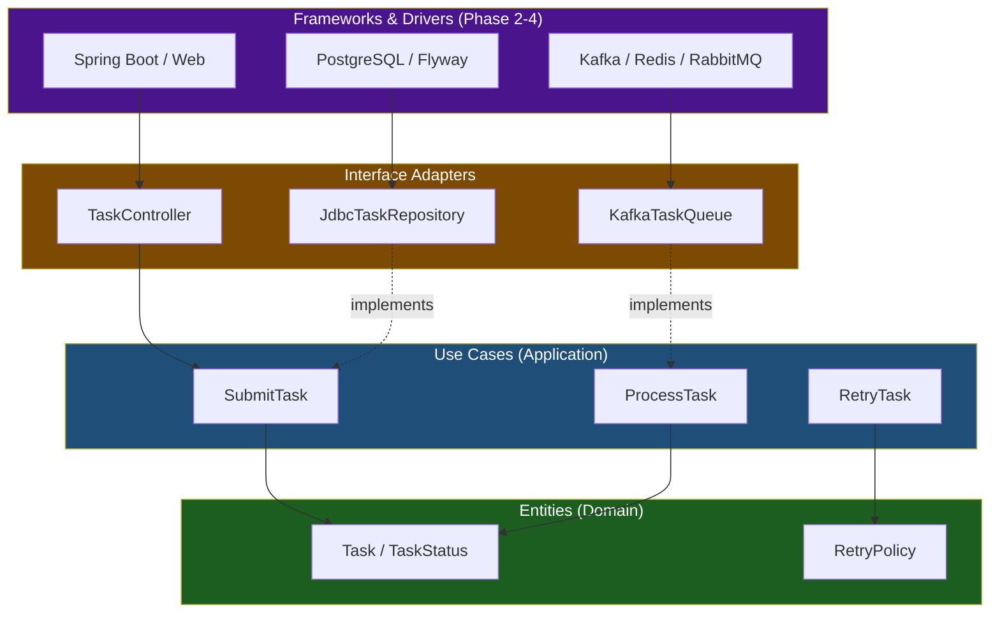
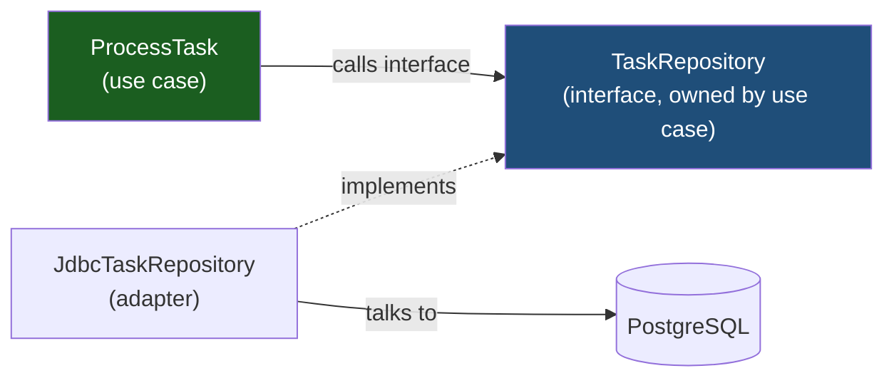
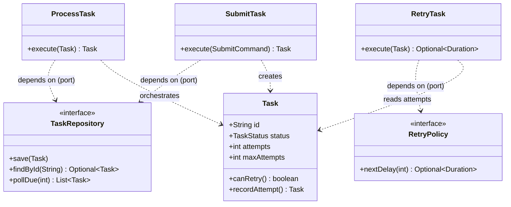

# Clean Architecture

> Where this fits in the project: Clean Architecture is the blueprint that tells us *which direction our dependencies point*. It lets the Task Queue platform keep its core rules — what a `Task` is, how `SubmitTask`, `ProcessTask`, and `RetryTask` behave — completely independent of Spring, PostgreSQL, Kafka, and HTTP. When we swap an `InMemoryTaskQueue` for a `PostgresTaskQueue` in Phase 2, or a database for Kafka in Phase 4, the inner rings should not even compile differently.

## Why This Exists

Most backends rot from the outside in. A team starts with a Spring controller, wires it straight to a JPA repository, sprinkles business rules into `@Service` beans, and within a year the domain logic is *smeared across* the framework: you cannot test `RetryTask` without a database, you cannot reason about `ProcessTask` without reading three annotation magic layers, and replacing PostgreSQL means rewriting the rules.

**Clean Architecture, formalized by Robert C. Martin (Uncle Bob) in 2012 and his 2017 book, is one answer to a single question: what should the *most important* code in your system depend on?** His answer is radical and simple — *nothing volatile*. Your business rules should depend on nothing. The database, the web framework, the message broker, the UI — those are details, and details depend on policy, never the reverse.

This is not a new idea; it is a *synthesis*. Clean Architecture unifies several earlier patterns that all discovered the same truth independently:

| Pattern | Author | Year | Core idea |
|---|---|---|---|
| Hexagonal (Ports & Adapters) | Alistair Cockburn | 2005 | App core talks to the outside only through ports |
| Onion Architecture | Jeffrey Palermo | 2008 | Domain at the center, dependencies point inward |
| DCI / BCE | Trygve Reenskaug, Ivar Jacobson | 1990s | Separate entities, boundaries, controllers |
| Clean Architecture | Robert C. Martin | 2012 | Concentric rings + the Dependency Rule |

They are 90% the same pattern with different names. We cover [hexagonal-architecture.md](hexagonal-architecture.md) and [layered-architecture.md](layered-architecture.md) as siblings, and this chapter explicitly compares all three.

Why should a DSA-strong engineer care? Because algorithmic skill is graded on time/space complexity, but a *system* is graded on **change cost** and **testability**. The single biggest lever on both is the *direction of source-code dependencies*. Clean Architecture is a discipline for keeping that arrow pointing the right way.



## The Dependency Rule

Everything in Clean Architecture reduces to **one law**:

> **The Dependency Rule:** Source code dependencies point only *inward*, toward higher-level policy. Nothing in an inner ring may know anything about an outer ring — not a class name, not a function name, not a type.

The rings, from center outward, are:

1. **Entities** — enterprise-wide business rules. In our project: `Task`, `TaskStatus`, `TaskResult`, `RetryPolicy`. These would still be true if we deleted the API and the database.
2. **Use Cases** — application-specific rules that orchestrate entities. In our project: `SubmitTask`, `ProcessTask`, `RetryTask`. They define *what the application does*.
3. **Interface Adapters** — translators. `TaskController` turns HTTP into use-case calls; `JdbcTaskRepository` turns the `TaskRepository` interface into SQL. They convert between the format convenient for use cases and the format convenient for the outside.
4. **Frameworks & Drivers** — Spring Boot, PostgreSQL, Kafka, the JVM's HTTP server. The volatile, replaceable stuff. *Details.*

The trick that makes the rule *possible* is **Dependency Inversion** (the D in [solid.md](solid.md)): when control must flow outward (a use case needs to save a `Task`), we do not let the use case depend on the database. Instead the use case *owns an interface* (`TaskRepository`), and the database ring *implements* it. The source dependency points inward even though the runtime call flows outward. This is the single most important mechanical idea in the whole pattern, and it is just [dependency-injection.md](dependency-injection.md) applied at the architectural scale.



> The source arrow from `JdbcTaskRepository` points *inward* to the interface. The runtime control flows *outward* to PostgreSQL. The Dependency Rule is about the *source* arrow, not the runtime arrow.

## The Naive Version

Here is how the Task Queue's submission endpoint looks when nobody is watching the dependency arrows. This is the typical Phase-2 first cut: a controller wired straight to JPA, with business rules living wherever was convenient.

```java
// 04-oop-and-ood — DO NOT SHIP. Domain rules trapped inside the framework.
@RestController
@RequestMapping("/tasks")
public class TaskController {

    @Autowired
    private TaskJpaRepository jpaRepo;   // a Spring Data repository: framework leak

    @PostMapping
    public ResponseEntity<TaskEntity> submit(@RequestBody SubmitRequest req) {
        // Business rule #1 — buried in the controller.
        if (req.getType() == null || req.getType().isBlank()) {
            return ResponseEntity.badRequest().build();
        }
        // Business rule #2 — also in the controller, with a magic number.
        int maxAttempts = req.getMaxAttempts() <= 0 ? 3 : req.getMaxAttempts();

        TaskEntity entity = new TaskEntity();           // JPA @Entity, not our domain Task
        entity.setId(UUID.randomUUID().toString());
        entity.setType(req.getType());
        entity.setPayload(req.getPayload());
        entity.setStatus("PENDING");                    // String, not TaskStatus
        entity.setMaxAttempts(maxAttempts);
        entity.setCreatedAt(Instant.now());

        TaskEntity saved = jpaRepo.save(entity);        // SQL leaks into the controller flow
        return ResponseEntity.ok(saved);
    }
}
```

What is wrong with this, ranked by how much it will hurt later:

1. **Business rules are untestable in isolation.** To test "type is required" or "default maxAttempts is 3," you must boot Spring and (with `@DataJpaTest`) a database. A rule that is one `if` statement now needs Testcontainers.
2. **The domain model is the persistence model.** `TaskEntity` is a JPA `@Entity` with a no-arg constructor and mutable setters. The database schema now dictates the shape of our most important type. Change a column, change your domain.
3. **`TaskStatus` degraded to a `String`.** The canonical sealed-ish enum is gone; nothing stops `setStatus("PENidng")`.
4. **The dependency arrow points the wrong way.** The "business logic" depends on `org.springframework.data` and `jakarta.persistence`. Swap PostgreSQL for Kafka and you rewrite this method.
5. **Screaming nothing.** Open this package and it screams "Spring app." It does not scream "Task Queue."

## Improved Version

First refactor: pull the rules out of the controller into a **use case** object and introduce a **port** so the use case no longer depends on JPA. We use the canonical `Task` record and `TaskRepository` interface from the spec.

```java
// domain ring — pure Java, no framework imports.
public record Task(
        String id, String type, String payload, TaskStatus status,
        int attempts, int maxAttempts, Instant createdAt,
        Instant scheduledAt, int priority) {

    /** Entity rule: a freshly submitted task is PENDING with zero attempts. */
    public static Task newPending(String type, String payload, int maxAttempts, int priority) {
        if (type == null || type.isBlank()) {
            throw new IllegalArgumentException("type is required");
        }
        int attempts = Math.max(1, maxAttempts);
        return new Task(UUID.randomUUID().toString(), type, payload, TaskStatus.PENDING,
                0, attempts, Instant.now(), null, priority);
    }
}
```

```java
// use-case ring — owns the port interface, depends on nothing volatile.
public interface TaskRepository {                 // the PORT, owned by the inner ring
    void save(Task t);
    Optional<Task> findById(String id);
    List<Task> pollDue(int n);
}

public final class SubmitTask {                   // the USE CASE
    private final TaskRepository repository;       // depends on the abstraction, not JPA

    public SubmitTask(TaskRepository repository) {
        this.repository = repository;
    }

    public Task execute(SubmitCommand cmd) {
        Task task = Task.newPending(cmd.type(), cmd.payload(), cmd.maxAttempts(), cmd.priority());
        repository.save(task);
        return task;
    }

    public record SubmitCommand(String type, String payload, int maxAttempts, int priority) {}
}
```

```java
// adapter ring — the controller is now a thin translator: HTTP <-> use case.
@RestController
@RequestMapping("/tasks")
public class TaskController {
    private final SubmitTask submitTask;

    public TaskController(SubmitTask submitTask) {   // constructor injection, no field @Autowired
        this.submitTask = submitTask;
    }

    @PostMapping
    public ResponseEntity<TaskResponse> submit(@RequestBody SubmitRequest req) {
        Task task = submitTask.execute(
                new SubmitTask.SubmitCommand(req.type(), req.payload(), req.maxAttempts(), req.priority()));
        return ResponseEntity.status(201).body(TaskResponse.from(task));
    }
}
```

The win: `SubmitTask` and `Task` are now plain Java. You can unit-test the rule "default attempts to 1, reject blank type" in microseconds, no Spring, no database. But we still have two leaks: the adapter still maps `Task` straight into JPA somewhere, and we have not separated the *request/response DTOs* from the domain. The production version closes those.

## Production-Quality Version

A staff engineer ships **four explicit packages**, each ring a directory, with the persistence adapter mapping between a domain `Task` and a database row so neither contaminates the other. Here is the full vertical slice for `ProcessTask` — the use case the `Worker` drives.

```java
// ---------- ring 1: entities (domain) ----------
package com.platform.domain;

public enum TaskStatus { PENDING, SCHEDULED, RUNNING, SUCCEEDED, FAILED, RETRYING, DEAD }

public record TaskResult(boolean success, String message, boolean retryable) {
    public static TaskResult ok()                 { return new TaskResult(true, "ok", false); }
    public static TaskResult retry(String why)    { return new TaskResult(false, why, true); }
    public static TaskResult fail(String why)     { return new TaskResult(false, why, false); }
}

@FunctionalInterface
public interface TaskHandler {                    // domain abstraction, no framework
    TaskResult handle(Task task) throws Exception;
}
```

```java
// ---------- ring 1: entity rule lives WITH the entity ----------
package com.platform.domain;

public record Task(String id, String type, String payload, TaskStatus status,
                   int attempts, int maxAttempts, Instant createdAt,
                   Instant scheduledAt, int priority) {

    public Task markRunning()   { return withStatus(TaskStatus.RUNNING); }
    public Task markSucceeded() { return withStatus(TaskStatus.SUCCEEDED); }

    /** Enterprise rule: a task may retry only while it has attempts left. */
    public boolean canRetry()   { return attempts < maxAttempts; }

    public Task recordAttempt() {
        return new Task(id, type, payload, TaskStatus.RETRYING, attempts + 1,
                maxAttempts, createdAt, scheduledAt, priority);
    }

    private Task withStatus(TaskStatus s) {
        return new Task(id, type, payload, s, attempts, maxAttempts,
                createdAt, scheduledAt, priority);
    }
}
```

```java
// ---------- ring 2: use case + the ports it owns ----------
package com.platform.usecase;

import com.platform.domain.*;

public interface HandlerRegistry { TaskHandler handlerFor(String type); }   // PORT
public interface DeadLetterQueue { void send(Task t, String reason); }       // PORT (canonical)
public interface RetryPolicy     { Optional<Duration> nextDelay(int attempt); } // PORT

public final class ProcessTask {
    private final TaskRepository repository;     // PORT (defined in usecase package)
    private final HandlerRegistry registry;
    private final RetryPolicy retryPolicy;
    private final DeadLetterQueue dlq;

    public ProcessTask(TaskRepository repository, HandlerRegistry registry,
                       RetryPolicy retryPolicy, DeadLetterQueue dlq) {
        this.repository = repository;
        this.registry = registry;
        this.retryPolicy = retryPolicy;
        this.dlq = dlq;
    }

    /** Application rule: run the handler, then decide success / retry / dead. */
    public Task execute(Task task) {
        TaskHandler handler = registry.handlerFor(task.type());
        Task running = task.markRunning();
        repository.save(running);
        try {
            TaskResult result = handler.handle(running);
            if (result.success()) {
                Task done = running.markSucceeded();
                repository.save(done);
                return done;
            }
            return handleFailure(running, result.retryable(), result.message());
        } catch (Exception e) {
            return handleFailure(running, true, e.getMessage());   // unknown errors are retryable
        }
    }

    private Task handleFailure(Task task, boolean retryable, String reason) {
        if (retryable && task.canRetry() && retryPolicy.nextDelay(task.attempts()).isPresent()) {
            Task retrying = task.recordAttempt();
            repository.save(retrying);
            return retrying;                       // RetryTask use case will pick it up
        }
        dlq.send(task, reason);                     // out of attempts -> dead letter
        repository.save(task);
        return task;
    }
}
```

```java
// ---------- ring 3: adapter that maps domain <-> SQL, owned by the OUTER ring ----------
package com.platform.adapter.persistence;

import com.platform.domain.*;
import com.platform.usecase.TaskRepository;
import org.springframework.jdbc.core.JdbcTemplate;

public final class JdbcTaskRepository implements TaskRepository {   // implements inner port
    private final JdbcTemplate jdbc;

    public JdbcTaskRepository(JdbcTemplate jdbc) { this.jdbc = jdbc; }

    @Override public void save(Task t) {
        jdbc.update("""
            INSERT INTO tasks (id, type, payload, status, attempts, max_attempts,
                               created_at, scheduled_at, priority)
            VALUES (?,?,?,?,?,?,?,?,?)
            ON CONFLICT (id) DO UPDATE SET status = EXCLUDED.status,
                                           attempts = EXCLUDED.attempts,
                                           scheduled_at = EXCLUDED.scheduled_at
            """,
            t.id(), t.type(), t.payload(), t.status().name(), t.attempts(),
            t.maxAttempts(), Timestamp.from(t.createdAt()),
            t.scheduledAt() == null ? null : Timestamp.from(t.scheduledAt()), t.priority());
    }

    @Override public Optional<Task> findById(String id) {
        return jdbc.query("SELECT * FROM tasks WHERE id = ?", this::mapRow, id).stream().findFirst();
    }

    @Override public List<Task> pollDue(int n) {
        return jdbc.query("""
            SELECT * FROM tasks
            WHERE status IN ('PENDING','RETRYING','SCHEDULED')
              AND (scheduled_at IS NULL OR scheduled_at <= now())
            ORDER BY priority DESC, created_at ASC
            LIMIT ?""", this::mapRow, n);
    }

    private Task mapRow(ResultSet rs, int rowNum) throws SQLException {
        Timestamp sched = rs.getTimestamp("scheduled_at");
        return new Task(rs.getString("id"), rs.getString("type"), rs.getString("payload"),
                TaskStatus.valueOf(rs.getString("status")), rs.getInt("attempts"),
                rs.getInt("max_attempts"), rs.getTimestamp("created_at").toInstant(),
                sched == null ? null : sched.toInstant(), rs.getInt("priority"));
    }
}
```

```java
// ---------- ring 4: frameworks wire everything together. ----------
package com.platform.config;

@Configuration
public class BeanWiring {                          // the ONLY place that knows all rings exist
    @Bean SubmitTask submitTask(TaskRepository r)  { return new SubmitTask(r); }

    @Bean ProcessTask processTask(TaskRepository r, HandlerRegistry h,
                                  RetryPolicy p, DeadLetterQueue d) {
        return new ProcessTask(r, h, p, d);
    }

    @Bean TaskRepository taskRepository(JdbcTemplate jdbc) {
        return new JdbcTaskRepository(jdbc);       // outer choice, injected inward
    }
}
```

Notice what the inner rings *do not* import: no `org.springframework`, no `jakarta.persistence`, no `java.sql`. Only `com.platform.config` and `com.platform.adapter.*` touch frameworks. That is the Dependency Rule made physical: you could enforce it with ArchUnit (shown in Production Considerations).

## Code Walkthrough

**Beginner — the inner rings are just plain objects you can `new`.** The whole point is that the core needs no container.

```java
// No Spring. No database. Pure unit test of an entity rule.
Task t = Task.newPending("send-email", "{\"to\":\"a@b.com\"}", 3, 5);
System.out.println(t.status());     // PENDING
System.out.println(t.attempts());   // 0
System.out.println(t.canRetry());   // true  (0 < 3)
```

**Intermediate — wire a use case to a fake adapter for a fast test.** Because `SubmitTask` depends on the `TaskRepository` *interface*, the test supplies an in-memory fake. No mocking framework needed.

```java
class InMemoryTaskRepository implements TaskRepository {
    private final Map<String, Task> store = new ConcurrentHashMap<>();
    public void save(Task t)              { store.put(t.id(), t); }
    public Optional<Task> findById(String id) { return Optional.ofNullable(store.get(id)); }
    public List<Task> pollDue(int n)      { return List.copyOf(store.values()).subList(0, n); }
}

@Test
void submit_defaults_attempts_and_persists() {
    var repo = new InMemoryTaskRepository();
    var submit = new SubmitTask(repo);

    Task task = submit.execute(new SubmitTask.SubmitCommand("resize-image", "{}", 0, 0));

    assertThat(task.status()).isEqualTo(TaskStatus.PENDING);
    assertThat(task.maxAttempts()).isEqualTo(1);              // 0 -> defaulted to 1
    assertThat(repo.findById(task.id())).isPresent();         // persisted through the port
}
```

**Production-inspired — the `Worker` drives `ProcessTask` through the use-case boundary.** The canonical `Worker implements Runnable` never touches SQL; it speaks only to use cases and the `TaskQueue`.

```java
public final class Worker implements Runnable {
    private final TaskQueue queue;          // port (InMemory / Postgres / Kafka behind it)
    private final ProcessTask processTask;  // use case
    private volatile boolean running = true;

    public Worker(TaskQueue queue, ProcessTask processTask) {
        this.queue = queue;
        this.processTask = processTask;
    }

    @Override public void run() {
        while (running) {
            try {
                Task task = queue.dequeue();        // blocks; outer ring decides HOW
                processTask.execute(task);          // inner ring decides WHAT
            } catch (InterruptedException e) {
                Thread.currentThread().interrupt();
                running = false;
            }
        }
    }

    public void stop() { running = false; }
}
```

The beauty: in Phase 1 `queue` is an `InMemoryTaskQueue` backed by a `BlockingQueue` (see [../06-concurrency/blocking-queue.md](../06-concurrency/blocking-queue.md)); in Phase 4 it is a `KafkaTaskQueue`. `Worker`, `ProcessTask`, and `Task` are byte-for-byte identical. Only the wiring in `com.platform.config` changes.

## How This Applies to Our Task Queue Project

Mapping the canonical model onto the four rings:

| Ring | Canonical types | Why it lives here |
|---|---|---|
| **Entities** | `Task`, `TaskStatus`, `TaskResult`, `RetryPolicy` (interface + the math), `RetryPolicy` implementations | Pure rules: "a DEAD task never runs," "attempts < maxAttempts to retry," backoff math. True regardless of transport or storage. |
| **Use Cases** | `SubmitTask`, `ProcessTask`, `RetryTask`, and the ports `TaskRepository`, `TaskQueue`, `DeadLetterQueue`, `HandlerRegistry`, `TaskScheduler` | Application orchestration. They *own* the port interfaces. |
| **Interface Adapters** | `TaskController`, `JdbcTaskRepository`, `InMemoryTaskQueue`, `KafkaTaskQueue`, `Resilience4jRateLimiterAdapter`, request/response DTOs | Translators between use cases and the outside world. |
| **Frameworks & Drivers** | Spring Boot, PostgreSQL + Flyway, Kafka/Redis/RabbitMQ, Micrometer, the JVM | Replaceable details. |

The three use cases named in our focus map cleanly to the inner rings:



`RetryTask` is the third use case: it consumes a `RETRYING` task, asks the `RetryPolicy` for `nextDelay(attempt)`, and either schedules a future run (via the `TaskScheduler` port) or, if `nextDelay` returns an empty `Optional`, hands the task to the `DeadLetterQueue`. All three use cases share entities, own ports, and import zero framework code.

## Tradeoffs

| Dimension | Clean Architecture | Plain layered (controller→service→repo) |
|---|---|---|
| Testability of core | Excellent — pure unit tests, no container | Poor — service tests need Spring + DB |
| Cost of swapping infra (DB, broker) | Low — write a new adapter, change wiring | High — rewrite service internals |
| Files / indirection per feature | High — entity + use case + ports + adapters + DTOs | Low — one service method |
| Onboarding speed for juniors | Slower — must learn the ring discipline | Faster — familiar 3-layer shape |
| Compile-time enforcement | Strong (package rules, ArchUnit) | Weak |
| Risk for a tiny CRUD service | **Over-engineering** | Right-sized |

Honest verdict: Clean Architecture's cost is **ceremony**. A 200-line CRUD microservice does not need five files per endpoint — that is gold-plating, and [dry-kiss-yagni.md](dry-kiss-yagni.md) would call it out. The pattern earns its keep when (a) business rules are non-trivial and worth testing in isolation, (b) infrastructure is *likely to change* (our broker goes In-Memory → Postgres → Kafka across phases), and (c) the system lives long enough that change cost dominates. The Task Queue platform hits all three, which is exactly why we teach it here and not in the Phase-1 hello-world.

A common middle ground: apply Clean Architecture to the *core domain* (task lifecycle, retry, DLQ) and let a peripheral concern (an admin metrics endpoint) be a plain controller-to-query shortcut. Architecture is per-context, not global dogma.

## Common Mistakes and Pitfalls

- **The "anemic" inversion: ports owned by the outer ring.** If `TaskRepository` lives in the `adapter.persistence` package next to `JdbcTaskRepository`, the use case now depends *outward*. **Fix:** the interface belongs in the *use-case* package; the implementation lives outside.
- **Letting JPA `@Entity` be your domain entity.** Annotations, no-arg constructors, and lazy-loading proxies are persistence concerns. **Fix:** keep a pure domain `Task` and a separate `TaskRow`/`TaskEntity`, mapping between them in the adapter.
- **DTOs leaking into use cases.** If `SubmitTask.execute` takes a `@RequestBody SubmitRequest`, your use case now depends on the web layer. **Fix:** the controller maps `SubmitRequest` → `SubmitCommand` (a use-case-owned record).
- **"Mapping is boilerplate, skip it."** Skipping the domain↔DB mapping is how the schema silently dictates the domain. The mapping *is* the firewall. Keep it (MapStruct can generate it).
- **Annotation contamination of entities.** A `@Transactional` or `@Component` on a use case is a small leak; a `jakarta.*` import on an *entity* is a large one. Entities must be the purest ring.
- **Treating the Dependency Rule as a runtime rule.** Runtime calls flow outward all the time (a use case calls the database). The rule constrains *source/compile dependencies*, enforced via interfaces. Confusing the two leads people to think the pattern is impossible.
- **One giant `usecase` god-class.** Bundling submit+process+retry into a `TaskService` recreates the very god-class [cohesion.md](cohesion.md) warns against. One use case per *application operation*.

## Refactoring Exercise

**Bad — framework-coupled, untestable, status as `String`:**

```java
@Service
public class TaskService {
    @Autowired private TaskJpaRepository repo;     // outer dependency
    @Autowired private KafkaTemplate<String,String> kafka;

    @Transactional
    public TaskEntity retry(String id) {
        TaskEntity e = repo.findById(id).orElseThrow();
        if (e.getAttempts() >= e.getMaxAttempts()) {
            kafka.send("dlq", e.getId());          // broker leak inside business rule
            e.setStatus("DEAD");
        } else {
            e.setAttempts(e.getAttempts() + 1);
            e.setStatus("RETRYING");
            // exponential backoff math, inline, with magic numbers
            long delayMs = (long) (Math.pow(2, e.getAttempts()) * 1000);
            e.setScheduledAt(Instant.now().plusMillis(delayMs));
        }
        return repo.save(e);
    }
}
```

**Improved — extract a use case, depend on ports, but backoff math still inline:**

```java
public final class RetryTask {
    private final TaskRepository repository;
    private final DeadLetterQueue dlq;

    public RetryTask(TaskRepository repository, DeadLetterQueue dlq) {
        this.repository = repository;
        this.dlq = dlq;
    }

    public Task execute(String id) {
        Task task = repository.findById(id).orElseThrow();
        if (!task.canRetry()) {
            dlq.send(task, "max attempts exhausted");
            return task;                            // status handling still crude
        }
        long delayMs = (long) (Math.pow(2, task.attempts()) * 1000);   // math leaked into use case
        Task retrying = task.recordAttempt();
        repository.save(retrying);
        return retrying;
    }
}
```

**Production — backoff is an entity policy behind a port; the use case only orchestrates:**

```java
// entity ring: the backoff IS a business rule, behind the canonical RetryPolicy port.
public final class ExponentialBackoffRetryPolicy implements RetryPolicy {
    private final Duration base;
    private final int maxAttempts;
    private final RandomGenerator jitter;

    public ExponentialBackoffRetryPolicy(Duration base, int maxAttempts) {
        this(base, maxAttempts, RandomGenerator.getDefault());
    }
    ExponentialBackoffRetryPolicy(Duration base, int maxAttempts, RandomGenerator jitter) {
        this.base = base; this.maxAttempts = maxAttempts; this.jitter = jitter;
    }

    @Override public Optional<Duration> nextDelay(int attempt) {
        if (attempt >= maxAttempts) return Optional.empty();            // signal: go to DLQ
        long exp = base.toMillis() * (1L << Math.min(attempt, 20));     // 2^attempt, capped
        long withJitter = exp / 2 + jitter.nextLong(exp / 2 + 1);       // full-ish jitter
        return Optional.of(Duration.ofMillis(withJitter));
    }
}

// use-case ring: orchestration only — no math, no broker, no SQL.
public final class RetryTask {
    private final TaskRepository repository;
    private final TaskScheduler scheduler;
    private final RetryPolicy retryPolicy;
    private final DeadLetterQueue dlq;

    public RetryTask(TaskRepository repository, TaskScheduler scheduler,
                     RetryPolicy retryPolicy, DeadLetterQueue dlq) {
        this.repository = repository; this.scheduler = scheduler;
        this.retryPolicy = retryPolicy; this.dlq = dlq;
    }

    public Optional<Duration> execute(Task task) {
        Optional<Duration> delay = retryPolicy.nextDelay(task.attempts());
        if (delay.isEmpty()) {
            dlq.send(task, "retry policy exhausted");
            repository.save(task);
            return Optional.empty();
        }
        Task retrying = task.recordAttempt();
        repository.save(retrying);
        scheduler.schedule(retrying, delay.get());   // port; backed by DelayQueue or ScheduledExecutor
        return delay;
    }
}
```

The final version is testable with zero infrastructure (inject a fixed-seed `RandomGenerator` and fake ports), the backoff math is a swappable entity policy, and `RetryTask` reads like a sentence: *ask the policy; if exhausted, dead-letter; else record an attempt and schedule it.*

## Exercises

### Easy

**E1 (knowledge-check).** In one sentence, state the Dependency Rule, and explain why a use case can still *call* the database at runtime without violating it.

**E2 (coding).** Given the pure `Task` record, add an entity method `markDead()` that returns a copy with status `DEAD`, and a guard `isTerminal()` returning `true` for `SUCCEEDED` and `DEAD`. No framework imports allowed.

### Medium

**M1 (refactoring).** You are handed a `TaskController` that calls `jpaRepo.save(...)` directly and contains the rule "reject tasks whose `priority` is outside 0–9." Refactor so the rule lives in the entity, the persistence sits behind the `TaskRepository` port, and the controller becomes a thin translator.

**M2 (design).** Sketch (classes + the direction of dependency arrows) how you would add a `CancelTask` use case that marks a non-terminal task as `FAILED` and notifies an external webhook. Which ring owns the "notify webhook" interface? Which ring implements it?

### Hard

**H1 (interview-style).** Your team wants to migrate the Task Queue from PostgreSQL to a Kafka-backed `TaskQueue` (Phase 4) without touching `ProcessTask`, `RetryTask`, or `Task`. Describe exactly which files you add, which you change, and how an ArchUnit test would *fail the build* if someone imports `org.apache.kafka` inside the `usecase` package.

**H2 (stretch).** Implement a compile-time-checkable package structure and a JUnit `ArchUnit` test that enforces: (a) `domain` imports nothing from `usecase`, `adapter`, or `config`; (b) `usecase` imports nothing from `adapter`, `config`, or any framework; (c) only `config` and `adapter` may import `org.springframework`.

## Solutions

**E1.** *The Dependency Rule:* source-code dependencies point only inward — an inner ring's code names nothing in an outer ring. A use case can call the database at runtime because it calls through an interface (`TaskRepository`) that the use case *owns*; the database adapter implements that interface, so the *source* dependency points inward while the *runtime* control flows outward. Direction of source ≠ direction of control.

**E2.**

```java
public Task markDead() { return withStatus(TaskStatus.DEAD); }

public boolean isTerminal() {
    return status == TaskStatus.SUCCEEDED || status == TaskStatus.DEAD;
}
// withStatus is the private helper shown in the production Task above; pure Java, no imports.
```

**M1.**

```java
// entity rule
public static Task newPending(String type, String payload, int maxAttempts, int priority) {
    if (type == null || type.isBlank()) throw new IllegalArgumentException("type required");
    if (priority < 0 || priority > 9)  throw new IllegalArgumentException("priority must be 0..9");
    return new Task(UUID.randomUUID().toString(), type, payload, TaskStatus.PENDING,
            0, Math.max(1, maxAttempts), Instant.now(), null, priority);
}

// use case owns the port
public final class SubmitTask {
    private final TaskRepository repository;
    public SubmitTask(TaskRepository repository) { this.repository = repository; }
    public Task execute(String type, String payload, int maxAttempts, int priority) {
        Task t = Task.newPending(type, payload, maxAttempts, priority);
        repository.save(t);
        return t;
    }
}

// adapter: thin controller
@RestController @RequestMapping("/tasks")
class TaskController {
    private final SubmitTask submitTask;
    TaskController(SubmitTask submitTask) { this.submitTask = submitTask; }

    @PostMapping ResponseEntity<TaskResponse> submit(@RequestBody SubmitRequest r) {
        Task t = submitTask.execute(r.type(), r.payload(), r.maxAttempts(), r.priority());
        return ResponseEntity.status(201).body(TaskResponse.from(t));   // 0..9 rule rejected with 400 by handler
    }
}
```

The priority rule now throws `IllegalArgumentException` from the entity; a single `@ExceptionHandler(IllegalArgumentException.class)` in the adapter ring maps it to HTTP 400. The rule is unit-testable without Spring.

**M2.** The `CancelTask` use case owns a `Notifier` (or `WebhookPort`) *interface* declared in the use-case ring. An adapter — say `HttpWebhookNotifier` using `RestClient` — implements it in the adapter ring. Dependency arrows: `CancelTask → Notifier (port)` inward; `HttpWebhookNotifier ⟶ implements ⟶ Notifier` from the outer ring inward. The use case never imports `RestClient`. Skeleton:

```java
// usecase ring
public interface Notifier { void taskCancelled(Task t); }      // PORT

public final class CancelTask {
    private final TaskRepository repository;
    private final Notifier notifier;
    public CancelTask(TaskRepository repo, Notifier n) { this.repository = repo; this.notifier = n; }
    public Task execute(String id) {
        Task t = repository.findById(id).orElseThrow();
        if (t.isTerminal()) throw new IllegalStateException("cannot cancel a terminal task");
        Task cancelled = t.withStatus(TaskStatus.FAILED);  // assume a package-visible helper
        repository.save(cancelled);
        notifier.taskCancelled(cancelled);
        return cancelled;
    }
}
```

**H1.** *Files added:* `adapter/queue/KafkaTaskQueue.java` implementing the existing `TaskQueue` port, plus Kafka config (consumer/producer beans) under `config`. *Files changed:* only `com.platform.config.BeanWiring` (swap the `TaskQueue` bean from `InMemoryTaskQueue`/`PostgresTaskQueue` to `KafkaTaskQueue`) and `pom.xml` (add the Kafka client). *Files untouched:* `ProcessTask`, `RetryTask`, `Task`, `TaskQueue` — none import Kafka. *ArchUnit guard:*

```java
@Test void usecases_must_not_depend_on_kafka() {
    JavaClasses classes = new ClassFileImporter().importPackages("com.platform");
    noClasses().that().resideInAPackage("..usecase..")
        .should().dependOnClassesThat().resideInAPackage("org.apache.kafka..")
        .check(classes);   // build fails if anyone adds the import
}
```

**H2.**

```text
com.platform
├── domain      (pure: java.* only)
├── usecase     (domain + java.* only; owns all ports)
├── adapter     (usecase + domain + frameworks)
└── config      (everything; the composition root)
```

```java
import com.tngtech.archunit.core.domain.JavaClasses;
import com.tngtech.archunit.core.importer.ClassFileImporter;
import org.junit.jupiter.api.Test;
import static com.tngtech.archunit.lang.syntax.ArchRuleDefinition.*;

class ArchitectureRulesTest {
    private final JavaClasses classes =
            new ClassFileImporter().importPackages("com.platform");

    @Test void domain_depends_on_nothing_internal() {
        noClasses().that().resideInAPackage("..domain..")
            .should().dependOnClassesThat()
            .resideInAnyPackage("..usecase..", "..adapter..", "..config..")
            .check(classes);
    }

    @Test void usecase_is_framework_free() {
        noClasses().that().resideInAPackage("..usecase..")
            .should().dependOnClassesThat()
            .resideInAnyPackage("..adapter..", "..config..",
                                "org.springframework..", "jakarta.persistence..", "org.apache.kafka..")
            .check(classes);
    }

    @Test void spring_only_in_outer_rings() {
        classes().that().dependOnClassesThat().resideInAPackage("org.springframework..")
            .should().resideInAnyPackage("..adapter..", "..config..")
            .check(classes);
    }
}
```

Adding `archunit-junit5` to the test scope makes these three tests fail the build the instant someone violates the Dependency Rule — turning architecture from a wiki page into a CI gate.

## Interview Questions and Takeaways

1. **"What is the Dependency Rule and how do you enforce it in Java?"** Source dependencies point inward; enforce it by having inner rings declare interfaces (ports) that outer rings implement, plus an ArchUnit/package-cycle test in CI. The DIP from [solid.md](solid.md) is the mechanism.

2. **"How is Clean Architecture different from Hexagonal?"** They are the same core idea with different framing. Hexagonal speaks of a single app boundary with *ports* (interfaces) and *adapters* (implementations), symmetric on all sides. Clean adds *more concentric rings* and explicitly separates *entities* (enterprise rules) from *use cases* (application rules). In practice: hexagonal's "inside the hexagon" ≈ Clean's entities + use cases; hexagonal's adapters ≈ Clean's interface adapters. See [hexagonal-architecture.md](hexagonal-architecture.md).

3. **"How is it different from classic layered architecture?"** Layered (UI→service→data) lets dependencies point *downward* toward the database, so the domain depends on persistence. Clean *inverts* the persistence dependency: the database depends on the domain via a port. Layered is easier to start, harder to test and swap. See [layered-architecture.md](layered-architecture.md).

4. **"What is screaming architecture?"** Uncle Bob's point that a project's top-level structure should *scream its use cases*, not its framework. Opening our repo should reveal `SubmitTask`, `ProcessTask`, `RetryTask` — not `controllers/`, `services/`, `repositories/`. The architecture should tell you the system is a *task queue*, not that it is a *Spring app*.

5. **"Isn't this over-engineering for a CRUD app?"** Often yes. The pattern pays off when business rules are non-trivial, infrastructure is volatile, and the system is long-lived. For a thin CRUD service, controller→repository is fine; forcing five files per endpoint is the YAGNI violation in [dry-kiss-yagni.md](dry-kiss-yagni.md).

6. **"Where do DTOs go, and why not reuse the domain object?"** DTOs (request/response, JPA rows) live in the adapter ring. Reusing the domain `Task` as your JSON body and DB row couples three independent rates of change (API contract, schema, business rules) into one type; a wire-format change would force a domain change.

7. **"Who owns the port interface?"** The *consumer* — i.e., the inner ring that needs the capability. `TaskRepository` is owned by `usecase`, implemented by `adapter`. If the interface sits next to its implementation, you have not inverted anything.

8. **"How do entities differ from use cases?"** Entities encode rules true across the *whole enterprise* and many applications (a DEAD task never runs; attempts can't exceed maxAttempts). Use cases encode rules specific to *this application's* flows (submit validates then persists; process runs the handler then routes the outcome). Entities don't know use cases exist.

## Production Considerations

- **Enforce the rule in CI, not in code review.** Humans miss imports. An ArchUnit test (above) or a Maven `maven-enforcer` / `degraph` package-cycle check fails the build deterministically. Without automated enforcement, the architecture decays within a quarter.
- **Watch transaction boundaries.** Use cases are the natural place for a transaction, but `@Transactional` is a Spring annotation. Either tolerate that one pragmatic leak on use cases, or wrap the use case in a thin transactional adapter (`@Transactional` decorator) so the use case stays pure. Both are defensible; pick one and document it.
- **Mapping has a cost.** Domain↔DTO↔row mapping adds allocations on the hot path. For our `pollDue(n)` loop running thousands of times a second, benchmark it; MapStruct generates allocation-light mappers, and records map cleanly. Measure before you "optimize away" the firewall.
- **Don't let `Optional`/`Instant` leak as API types.** The use case may return `Optional<Task>` and `Instant`; the adapter must serialize them deliberately (ISO-8601 strings, explicit null handling) so a Jackson default doesn't dictate your contract.
- **Observability lives in adapters, mostly.** Micrometer timers around `ProcessTask.execute` are best applied via a decorating adapter (an `InstrumentedProcessTask` implementing the same interface) so the use case has no `io.micrometer` import. This keeps the [../10-system-design/observability-and-ops.md](../10-system-design/observability-and-ops.md) concern out of the core.
- **The composition root is a blast radius.** `BeanWiring` knows every ring; a bug there can mis-wire the whole app. Keep it dumb (only `new`/`@Bean`), and integration-test it (a `@SpringBootTest` that asserts the context loads and the right `TaskQueue` impl is injected per profile).
- **Sealed types sharpen entities.** Java 21 sealed interfaces let you model `TaskResult` variants or task commands exhaustively, so `switch` pattern matching over them is compile-checked — a Clean-friendly way to keep rules in the entity ring total and explicit.

## What We Can Improve In Our Project Using This Concept

Today (early phases) our submission path likely wires the controller to the queue/repository directly. We can restructure into four packages — `domain`, `usecase`, `adapter`, `config` — and pull `SubmitTask`, `ProcessTask`, and `RetryTask` out as first-class use-case objects that own the `TaskRepository`, `TaskQueue`, `DeadLetterQueue`, `RetryPolicy`, and `TaskScheduler` ports. The immediate payoff: every business rule becomes unit-testable in microseconds with fakes, and the Phase-2→Phase-4 broker migration (In-Memory → Postgres → Kafka) becomes a new adapter plus a one-line wiring change instead of a rewrite.

## Project Refactoring Task

1. Create packages `com.platform.domain`, `com.platform.usecase`, `com.platform.adapter`, `com.platform.config`.
2. Move `Task`, `TaskStatus`, `TaskResult`, `TaskHandler`, and the `RetryPolicy` implementations into `domain`; strip every framework import from them.
3. Create `SubmitTask`, `ProcessTask`, `RetryTask` in `usecase`; move the `TaskRepository`, `TaskQueue`, `DeadLetterQueue`, `HandlerRegistry`, `RetryPolicy`, `TaskScheduler` *interfaces* there too (consumer owns the port).
4. Make `TaskController`, `JdbcTaskRepository`, `InMemoryTaskQueue` implement the ports from `adapter`; add request/response DTOs there and map to/from domain `Task`.
5. Move all `@Configuration`/`@Bean` wiring into `config` and add an `ArchitectureRulesTest` (ArchUnit) that fails the build on a Dependency-Rule violation.
6. Add unit tests for each use case using in-memory fakes — no Spring context.

## Git Commit For This Chapter

```bash
git commit -m "refactor(architecture): adopt clean architecture rings and the dependency rule

- split into domain/usecase/adapter/config packages
- extract SubmitTask, ProcessTask, RetryTask use cases owning their ports
- introduce pure domain Task; JdbcTaskRepository maps domain<->SQL
- add ArchUnit ArchitectureRulesTest to enforce the dependency rule in CI"
```

Files touched: `domain/Task.java`, `domain/TaskStatus.java`, `domain/TaskResult.java`, `domain/ExponentialBackoffRetryPolicy.java`, `usecase/SubmitTask.java`, `usecase/ProcessTask.java`, `usecase/RetryTask.java`, `usecase/ports/*.java`, `adapter/web/TaskController.java`, `adapter/persistence/JdbcTaskRepository.java`, `config/BeanWiring.java`, `test/ArchitectureRulesTest.java`.

## Architecture Impact

This is a *foundational* change: it establishes the dependency topology that every later phase relies on. Phase 2's PostgreSQL and Phase 4's Kafka/Redis become *adapters* swapped at the composition root, not rewrites of business logic. Rate limiting ([../08-distributed-systems/rate-limiting.md](../08-distributed-systems/rate-limiting.md)), circuit breakers, and metrics enter as decorating adapters around use cases, keeping the core pure. The cost is more files and a hard rule the team must keep — paid back the first time we swap infrastructure or need to unit-test a rule without booting a database.

## Interview Takeaways

- The whole pattern is *one rule*: source dependencies point inward; enforce it with interfaces (DIP) and an ArchUnit CI gate.
- Entities = enterprise rules; use cases = application rules; adapters = translators; frameworks = replaceable details.
- The consumer owns the port; the outer ring implements it. That single inversion is what makes the core testable and infrastructure swappable.
- Screaming architecture: the directory layout should reveal `SubmitTask`/`ProcessTask`/`RetryTask`, not `controllers/services/repositories`.
- Clean ≈ Hexagonal ≈ Onion; Clean adds explicit entity/use-case separation. All beat layered on testability and swap cost, at the price of ceremony — so apply it where rules are rich and infra is volatile, not to thin CRUD.
