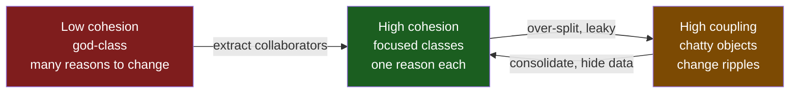
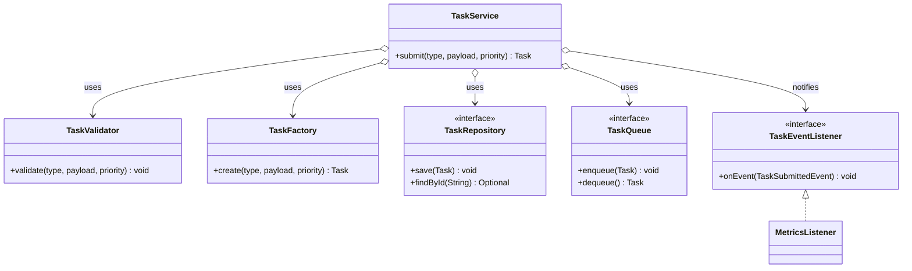
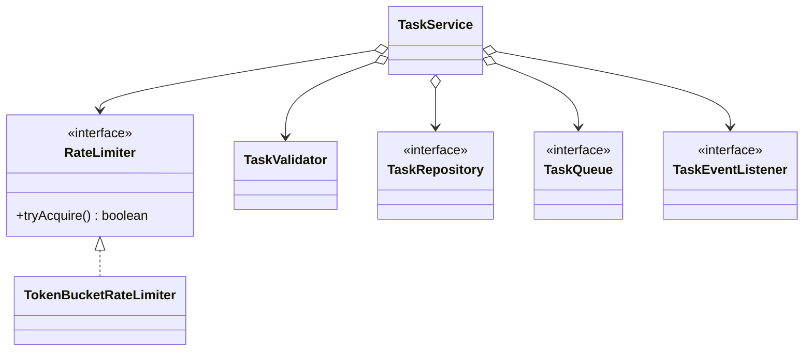

# Cohesion

> Where this fits in the project: cohesion is the force that decides how we carve the Task Queue platform into classes. Get it right and `TaskService`, `Worker`, `RetryHandler`, and `TaskRepository` each have exactly one reason to change. Get it wrong and you ship a 900-line god-class that the whole team is afraid to touch.

## Why This Exists

**Cohesion measures how strongly the responsibilities of a single module belong together.** A highly cohesive class does one thing, does it well, and changes for exactly one reason. A low-cohesion class is a junk drawer: validation, persistence, queueing, retry math, metrics, and email notifications all crammed into one type because "they were all about tasks."

The term comes from Larry Constantine's *structured design* work in the 1970s (later formalized with Ed Yourdon and Glenford Myers). They ranked cohesion on a spectrum from **coincidental** (worst) to **functional** (best). The insight has outlived the structured-programming era because it is really a statement about *change*: software that you can change cheaply tends to group code that changes together and separate code that changes for different reasons. Robert C. Martin's later *Single Responsibility Principle* — "a class should have only one reason to change" — is cohesion restated as a design rule (see [solid.md](solid.md)).

Why should a DSA-strong engineer care? Because algorithms are graded on time/space complexity, but production code is graded on *change cost*. The single biggest driver of change cost is whether a change is **localized** (touch one cohesive class) or **smeared** (touch a god-class plus everything that depends on it). Cohesion is the lever.

Cohesion has a sibling: **coupling**. High cohesion *within* a module and low coupling *between* modules are the twin goals of modular design. This chapter is about the first; its partner is [coupling.md](coupling.md). The two trade off — over-splitting one class can spike coupling — so always read them together.



## The Naive Version

Here is the kind of class that grows organically when nobody is watching. Every time a new requirement landed, someone added a method to `TaskService` because "it's about tasks." It uses the canonical `Task` and `TaskStatus` model.

```java
// 04-oop-and-ood — DO NOT SHIP. The god-class anti-pattern.
public class TaskService {

    private final DataSource dataSource;          // persistence
    private final BlockingQueue<Task> queue;      // queueing
    private final Map<String, Integer> counters;  // metrics
    private final SmtpClient smtp;                 // notifications

    public TaskService(DataSource ds, BlockingQueue<Task> q, SmtpClient smtp) {
        this.dataSource = ds;
        this.queue = q;
        this.counters = new ConcurrentHashMap<>();
        this.smtp = smtp;
    }

    // Responsibility 1: validate raw input
    public Task submit(String type, String payload, int priority) {
        if (type == null || type.isBlank()) {
            throw new IllegalArgumentException("type required");
        }
        if (payload != null && payload.length() > 1_000_000) {
            throw new IllegalArgumentException("payload too large");
        }
        if (priority < 0 || priority > 9) {
            throw new IllegalArgumentException("priority 0..9");
        }

        // Responsibility 2: build the domain object
        Task task = new Task(
            UUID.randomUUID().toString(), type, payload,
            TaskStatus.PENDING, 0, 3,
            Instant.now(), Instant.now(), priority);

        // Responsibility 3: persist with hand-written SQL
        try (Connection c = dataSource.getConnection();
             PreparedStatement ps = c.prepareStatement(
                 "INSERT INTO tasks(id,type,payload,status,attempts,max_attempts,priority) " +
                 "VALUES (?,?,?,?,?,?,?)")) {
            ps.setString(1, task.id());
            ps.setString(2, task.type());
            ps.setString(3, task.payload());
            ps.setString(4, task.status().name());
            ps.setInt(5, task.attempts());
            ps.setInt(6, task.maxAttempts());
            ps.setInt(7, task.priority());
            ps.executeUpdate();
        } catch (SQLException e) {
            throw new RuntimeException("save failed", e);
        }

        // Responsibility 4: enqueue
        queue.offer(task);

        // Responsibility 5: metrics
        counters.merge("submitted." + type, 1, Integer::sum);

        // Responsibility 6: notification
        smtp.send("ops@corp.com", "task submitted", task.id());

        return task;
    }

    // Responsibility 7: retry backoff math, inline
    public long nextRetryDelayMillis(int attempt) {
        long base = 1000L;
        long delay = (long) (base * Math.pow(2, attempt));
        long jitter = (long) (Math.random() * 500);
        return Math.min(delay + jitter, 60_000L);
    }

    // Responsibility 8: status reporting + formatting
    public String renderStatusReport() {
        StringBuilder sb = new StringBuilder();
        counters.forEach((k, v) -> sb.append(k).append('=').append(v).append('\n'));
        return sb.toString();
    }
}
```

**Why this is bad — count the reasons to change:**

| Trigger for change | Code that must move |
| --- | --- |
| New validation rule | `submit()` |
| Switch JDBC → Spring Data JDBC | `submit()` |
| Switch in-memory queue → Postgres queue | `submit()` |
| Switch SMTP → Slack | `submit()` and constructor |
| Change retry curve | `nextRetryDelayMillis()` |
| Add Micrometer | `counters`, `submit()`, `renderStatusReport()` |
| Change report format | `renderStatusReport()` |

Eight responsibilities, at least seven independent reasons to change, all funneling through one `submit()` method. This is **logical/coincidental cohesion**: things live together because they were typed near each other, not because they belong together. Every test needs a `DataSource`, a queue, *and* an SMTP server. The blast radius of any edit is the whole class.

## Improved Version

First refactor: peel off the responsibilities that are clearly their own concept. We do not need a framework yet — just classes with single jobs that the service *orchestrates*.

```java
// Each class now has one reason to change.

public final class TaskValidator {
    public void validate(String type, String payload, int priority) {
        if (type == null || type.isBlank())
            throw new IllegalArgumentException("type required");
        if (payload != null && payload.length() > 1_000_000)
            throw new IllegalArgumentException("payload too large");
        if (priority < 0 || priority > 9)
            throw new IllegalArgumentException("priority 0..9");
    }
}

public final class TaskFactory {
    public Task create(String type, String payload, int priority) {
        Instant now = Instant.now();
        return new Task(UUID.randomUUID().toString(), type, payload,
            TaskStatus.PENDING, 0, 3, now, now, priority);
    }
}

// Persistence hidden behind the canonical TaskRepository interface.
public interface TaskRepository {
    void save(Task t);
    Optional<Task> findById(String id);
    List<Task> pollDue(int n);
}
```

Now `TaskService` becomes a thin **orchestrator** that wires these collaborators together. Notice it no longer knows SQL, queue internals, or retry math.

```java
public final class TaskService {
    private final TaskValidator validator;
    private final TaskFactory factory;
    private final TaskRepository repository;
    private final TaskQueue queue;

    public TaskService(TaskValidator validator, TaskFactory factory,
                       TaskRepository repository, TaskQueue queue) {
        this.validator = validator;
        this.factory = factory;
        this.repository = repository;
        this.queue = queue;
    }

    public Task submit(String type, String payload, int priority) {
        validator.validate(type, payload, priority);
        Task task = factory.create(type, payload, priority);
        repository.save(task);
        queue.enqueue(task);
        return task;
    }
}
```

Better: metrics, notifications, and retry math are gone from the hot path. But there is still a subtle smell — `submit()` *directly* does persistence then queueing then (eventually) notification. If we want notifications to be optional and side-effect-y, baking them into the orchestrator still couples the submit flow to those concerns. Let us push further.

## Production-Quality Version

A staff engineer ships the version below. Cross-cutting reactions (metrics, notifications) become **observers/events** so the submit flow stays purely about submitting. Retry math lives behind the canonical `RetryPolicy`. Each collaborator is an interface so it is swappable and testable. This is what we would actually run in Phase 2/3.

```java
// --- Canonical model references ---
public enum TaskStatus { PENDING, SCHEDULED, RUNNING, SUCCEEDED, FAILED, RETRYING, DEAD }

public record Task(String id, String type, String payload, TaskStatus status,
                   int attempts, int maxAttempts, Instant createdAt,
                   Instant scheduledAt, int priority) {}

public interface TaskQueue {
    void enqueue(Task t);
    Task dequeue() throws InterruptedException;
    int size();
}

public interface TaskRepository {
    void save(Task t);
    Optional<Task> findById(String id);
    List<Task> pollDue(int n);
}

public interface RetryPolicy {
    Optional<Duration> nextDelay(int attempt);
}
```

```java
// One concept per class. Each is independently testable and swappable.

public final class TaskValidator {
    private static final int MAX_PAYLOAD = 1_000_000;
    public void validate(String type, String payload, int priority) {
        if (type == null || type.isBlank())
            throw new ValidationException("type required");
        if (payload != null && payload.length() > MAX_PAYLOAD)
            throw new ValidationException("payload exceeds " + MAX_PAYLOAD);
        if (priority < 0 || priority > 9)
            throw new ValidationException("priority must be 0..9");
    }
}

public final class TaskFactory {
    private final Clock clock;            // injected for deterministic tests
    private final int defaultMaxAttempts;
    public TaskFactory(Clock clock, int defaultMaxAttempts) {
        this.clock = clock;
        this.defaultMaxAttempts = defaultMaxAttempts;
    }
    public Task create(String type, String payload, int priority) {
        Instant now = clock.instant();
        return new Task(UUID.randomUUID().toString(), type, payload,
            TaskStatus.PENDING, 0, defaultMaxAttempts, now, now, priority);
    }
}

// Retry curve is its own cohesive thing — see ../08-distributed-systems/retries.md
public final class ExponentialBackoffRetryPolicy implements RetryPolicy {
    private final Duration base;
    private final Duration cap;
    private final int maxAttempts;
    private final RandomGenerator rng;
    public ExponentialBackoffRetryPolicy(Duration base, Duration cap,
                                         int maxAttempts, RandomGenerator rng) {
        this.base = base; this.cap = cap;
        this.maxAttempts = maxAttempts; this.rng = rng;
    }
    @Override public Optional<Duration> nextDelay(int attempt) {
        if (attempt >= maxAttempts) return Optional.empty();
        long raw = (long) (base.toMillis() * Math.pow(2, attempt));
        long jitter = rng.nextLong(0, base.toMillis() + 1);   // full jitter
        long ms = Math.min(raw + jitter, cap.toMillis());
        return Optional.of(Duration.ofMillis(ms));
    }
}
```

Cross-cutting reactions become an event publication, so the submit path does not grow when we add the next reaction (audit log, webhook, Kafka mirror). This anticipates the Phase 4 `EventBus`.

```java
public record TaskSubmittedEvent(Task task, Instant at) {}

@FunctionalInterface
public interface TaskEventListener {
    void onEvent(TaskSubmittedEvent event);
}

// Metrics is a listener — it changes only when metrics requirements change.
public final class MetricsListener implements TaskEventListener {
    private final MeterRegistry registry;
    public MetricsListener(MeterRegistry registry) { this.registry = registry; }
    @Override public void onEvent(TaskSubmittedEvent e) {
        registry.counter("tasks.submitted", "type", e.task().type()).increment();
    }
}
```

The orchestrator stays small. Its single responsibility is *coordinating the submit use case* — and that is the only reason it changes.

```java
public final class TaskService {
    private final TaskValidator validator;
    private final TaskFactory factory;
    private final TaskRepository repository;
    private final TaskQueue queue;
    private final List<TaskEventListener> listeners;
    private final Clock clock;

    public TaskService(TaskValidator validator, TaskFactory factory,
                       TaskRepository repository, TaskQueue queue,
                       List<TaskEventListener> listeners, Clock clock) {
        this.validator = validator;
        this.factory = factory;
        this.repository = repository;
        this.queue = queue;
        this.listeners = List.copyOf(listeners);
        this.clock = clock;
    }

    public Task submit(String type, String payload, int priority) {
        validator.validate(type, payload, priority);
        Task task = factory.create(type, payload, priority);
        repository.save(task);                       // durable first
        queue.enqueue(task);                         // then make visible
        var event = new TaskSubmittedEvent(task, clock.instant());
        listeners.forEach(l -> l.onEvent(event));    // fan out reactions
        return task;
    }
}
```

Compare the two designs structurally. The god-class fans every concern through one type; the cohesive design gives each concern a home.



> The diamond/open-arrow (`o-->`) marks **aggregation**: `TaskService` holds references to collaborators it does not own the lifecycle of — they are injected. See [aggregates.md](aggregates.md) and [../02-core-oop/chapter-15-aggregation.md](../02-core-oop/chapter-15-aggregation.md) for the UML semantics.

## Code Walkthrough

### Beginner example — one job, named clearly

Cohesion starts at the method level. A method should compute one thing. Below, the first method mixes parsing, math, and I/O; the second does one job.

```java
// Low method cohesion: parses, computes, and prints.
void process(String raw) {
    int n = Integer.parseInt(raw.trim());
    int doubled = n * 2;
    System.out.println("result=" + doubled);
}

// High method cohesion: a pure transformation, easy to test.
int doubled(int n) {
    return n * 2;
}
```

The second version is a pure function: deterministic, no side effects, trivially unit-tested. When every method is like this, classes compose from honest pieces.

### Intermediate example — splitting a class by reason-to-change

`Worker` should *run tasks*, not *decide retry timing*. Here we keep `Worker` cohesive by delegating the retry decision to `RetryPolicy` and the failure routing to `DeadLetterQueue`.

```java
public final class Worker implements Runnable {
    private final TaskQueue queue;
    private final Map<String, TaskHandler> handlers;
    private final RetryPolicy retryPolicy;
    private final TaskScheduler scheduler;
    private final DeadLetterQueue dlq;

    public Worker(TaskQueue queue, Map<String, TaskHandler> handlers,
                  RetryPolicy retryPolicy, TaskScheduler scheduler,
                  DeadLetterQueue dlq) {
        this.queue = queue; this.handlers = handlers;
        this.retryPolicy = retryPolicy; this.scheduler = scheduler;
        this.dlq = dlq;
    }

    @Override public void run() {
        while (!Thread.currentThread().isInterrupted()) {
            try {
                Task task = queue.dequeue();
                execute(task);
            } catch (InterruptedException e) {
                Thread.currentThread().interrupt();
                return;
            }
        }
    }

    private void execute(Task task) {
        TaskHandler handler = handlers.get(task.type());
        if (handler == null) { dlq.send(task, "no handler for " + task.type()); return; }
        try {
            TaskResult result = handler.handle(task);
            if (result.success()) return;
            if (result.retryable()) reschedule(task, result.message());
            else dlq.send(task, result.message());
        } catch (Exception ex) {
            reschedule(task, ex.toString());
        }
    }

    // Worker delegates *when* to retry; it doesn't compute the curve itself.
    private void reschedule(Task task, String reason) {
        retryPolicy.nextDelay(task.attempts())
            .ifPresentOrElse(
                delay -> scheduler.schedule(task, delay),
                () -> dlq.send(task, "max attempts: " + reason));
    }
}
```

`Worker` changes only when the *execution loop* changes. The retry curve changes in `RetryPolicy`; the dead-letter routing changes in `DeadLetterQueue` (see [../07-queues-and-messaging/dead-letter-queues.md](../07-queues-and-messaging/dead-letter-queues.md)). That is high **functional cohesion**: every line of `Worker` serves the single function "drain the queue and execute tasks."

### Production-inspired example — Spring wiring keeps cohesion intact

In Phase 2 with Spring Boot, dependency injection makes the cohesive design ergonomic: each focused class is a `@Component`/`@Bean`, and Spring assembles them. Cohesion is preserved *because* the framework does the wiring, not the classes (contrast with [dependency-injection.md](dependency-injection.md)).

```java
@Configuration
class TaskSubmissionConfig {

    @Bean TaskValidator taskValidator() { return new TaskValidator(); }

    @Bean TaskFactory taskFactory(Clock clock,
            @Value("${tasks.default-max-attempts:3}") int maxAttempts) {
        return new TaskFactory(clock, maxAttempts);
    }

    @Bean RetryPolicy retryPolicy() {
        return new ExponentialBackoffRetryPolicy(
            Duration.ofSeconds(1), Duration.ofMinutes(1), 5,
            RandomGenerator.getDefault());
    }

    @Bean TaskService taskService(TaskValidator v, TaskFactory f,
            TaskRepository r, TaskQueue q,
            List<TaskEventListener> listeners, Clock clock) {
        return new TaskService(v, f, r, q, listeners, clock);
    }
}

@RestController
@RequestMapping("/tasks")
class TaskController {
    private final TaskService taskService;
    TaskController(TaskService taskService) { this.taskService = taskService; }

    @PostMapping
    ResponseEntity<TaskView> submit(@RequestBody @Valid SubmitTaskRequest req) {
        Task task = taskService.submit(req.type(), req.payload(), req.priority());
        return ResponseEntity.status(HttpStatus.CREATED).body(TaskView.from(task));
    }
}
```

The `TaskController` is cohesive too: it only translates HTTP to/from the domain (request mapping, status codes, view models). It contains zero business logic — that lives in `TaskService`. This is the cohesion contract of a [layered-architecture.md](layered-architecture.md).

## How This Applies to Our Task Queue Project

Cohesion is the principle that produced the canonical model in the first place. Each interface in the spec is a cohesion boundary:

| Class / interface | Single responsibility (reason to change) |
| --- | --- |
| `TaskValidator` | input rules change |
| `TaskFactory` | how a `Task` is constructed (defaults, id strategy) |
| `TaskRepository` | persistence technology / schema |
| `TaskQueue` | queueing mechanism (in-memory → Postgres → broker) |
| `Worker` | the execute loop |
| `WorkerPool` | thread lifecycle (start/shutdown) |
| `RetryPolicy` | the backoff curve |
| `DeadLetterQueue` | where/why dead tasks go |
| `RateLimiter` | admission control algorithm |
| `TaskScheduler` | delayed execution mechanism |
| `MetricsCollector` | what we measure |
| `EventBus` | how events fan out (Phase 4) |

When you can fill in a table like this and every row has *exactly one* trigger, your decomposition is cohesive. If a row has two triggers, split it. If two rows always change together, consider merging them (over-splitting is also a cohesion failure — see Tradeoffs).

## Tradeoffs

The seven classic cohesion levels, worst to best, with a Task Queue example of each:

| Level | Meaning | Task Queue example | Verdict |
| --- | --- | --- | --- |
| Coincidental | unrelated bits grouped randomly | a `Utils` class with `parseJson`, `nextDelay`, `sendEmail` | avoid |
| Logical | one class, behavior chosen by a flag | `handle(String mode)` switching submit/cancel/report | avoid |
| Temporal | grouped because they run at the same time | `startup()` that opens DB + queue + metrics | tolerate at edges |
| Procedural | steps that run in sequence | a method doing validate→save→enqueue | acceptable for a use case |
| Communicational | operate on the same data | methods all reading/writing the same `Task` | good |
| Sequential | output of one feeds the next | parse→validate→persist pipeline | good |
| Functional | every element serves one well-defined task | `ExponentialBackoffRetryPolicy.nextDelay` | best |

**The central tradeoff: cohesion vs. coupling and vs. class count.** Splitting a god-class into ten focused classes raises cohesion but can raise coupling (more wiring, more navigation) and cognitive overhead. There is a sweet spot:

| Decision | Pro | Con |
| --- | --- | --- |
| Extract a collaborator | localizes change, testable in isolation | one more type, one more injection point |
| Keep it inline | fewer moving parts | every reason-to-change touches one class |
| Use events for reactions | submit path stops growing | indirection, harder to trace flow |
| Merge two tiny classes that always co-change | fewer hops | risk of re-growing a blob |

A useful rule: **extract when a concern has its own reason to change *or* its own test surface.** Do not extract just to satisfy a line-count metric.

## Common Mistakes and Pitfalls

- **The `Manager`/`Service`/`Util`/`Helper` magnet.** Names with no nouns attract unrelated code. Fix: name by responsibility (`RetryPolicy`, not `RetryHelper`).
- **Splitting by layer instead of by reason-to-change.** `TaskDataMapper`, `TaskBusinessLogic`, `TaskValidationStuff` can still be low-cohesion if validation logic is scattered across all three. Fix: keep one concept whole.
- **Anemic over-splitting.** Ten one-method classes that must always be called together is procedural code wearing class costumes — high coupling, fake cohesion. Fix: merge classes that always co-change.
- **Feature envy.** A method that mostly touches *another* object's data belongs on that object. Fix: move the method (see [law-of-demeter.md](law-of-demeter.md)).
- **Hidden temporal coupling in constructors.** Doing I/O, registering metrics, and spawning threads in one constructor is temporal cohesion. Fix: a focused `start()`/lifecycle method.
- **Boolean/enum parameter dispatch.** `process(task, MODE_SUBMIT)` is logical cohesion. Fix: separate methods or polymorphic types.
- **Measuring cohesion by line count.** A 300-line class can be perfectly cohesive; a 30-line class can be a mess. Lines are a *hint*, not the metric.

## Refactoring Exercise

**Bad** — a god-class method mixing five concerns:

```java
public Task handleSubmission(String type, String payload, int priority) {
    if (type == null) throw new IllegalArgumentException();           // validate
    Task t = new Task(UUID.randomUUID().toString(), type, payload,    // construct
        TaskStatus.PENDING, 0, 3, Instant.now(), Instant.now(), priority);
    jdbc.update("INSERT INTO tasks ...", t.id(), t.type());           // persist
    queue.offer(t);                                                   // enqueue
    metrics.computeIfAbsent("sub", k -> new AtomicInteger()).incrementAndGet(); // metrics
    return t;
}
```

**Improved** — extract collaborators, orchestrator delegates:

```java
public Task handleSubmission(String type, String payload, int priority) {
    validator.validate(type, payload, priority);
    Task t = factory.create(type, payload, priority);
    repository.save(t);
    queue.enqueue(t);
    metrics.recordSubmitted(t.type());
    return t;
}
```

**Production-quality** — reactions become events; the orchestrator no longer grows when new reactions are added:

```java
public Task submit(String type, String payload, int priority) {
    validator.validate(type, payload, priority);
    Task task = factory.create(type, payload, priority);
    repository.save(task);
    queue.enqueue(task);
    publisher.publish(new TaskSubmittedEvent(task, clock.instant()));
    return task;
}
```

Each step here belongs to *submitting a task* (sequential + communicational cohesion), and every other concern (metrics, audit, webhooks) lives behind `publish`, changing independently.

## Exercises

### Easy

1. **Knowledge check.** Define cohesion in one sentence, then name the worst and best levels on Constantine's scale and give a Task Queue example of each.
2. **Spot the smell.** Given the `TaskService` god-class from "The Naive Version," list every distinct reason it would have to change.

### Medium

3. **Coding exercise.** Extract a `TaskValidator` from the god-class so that `submit` delegates validation. Write a JUnit 5 + AssertJ test proving the validator rejects a blank `type` and a priority of `10` *without* touching a database or queue.
4. **Refactoring exercise.** The method below has low cohesion. Split it into focused pieces.

```java
String reportAndPrune(List<Task> tasks) {
    StringBuilder sb = new StringBuilder();
    Iterator<Task> it = tasks.iterator();
    while (it.hasNext()) {
        Task t = it.next();
        if (t.status() == TaskStatus.DEAD) { it.remove(); continue; }
        sb.append(t.id()).append('=').append(t.status()).append('\n');
    }
    return sb.toString();
}
```

### Hard

5. **Design exercise.** Phase 3 adds rate limiting and a dead-letter queue to the submit path. Decide what belongs in `TaskService`, what becomes a new collaborator, and what becomes an event listener. Justify each boundary with its reason-to-change. Draw the resulting class diagram.
6. **Interview-style.** "A teammate says splitting `TaskService` into five classes is over-engineering and slows them down. Argue both sides, then state the heuristic you would actually apply." Answer in under 150 words.
7. **Stretch challenge.** Write a tiny static-analysis helper that flags low-cohesion classes by approximating **LCOM4** (Lack of Cohesion of Methods): build a graph where methods are connected if they share a field or call each other, and report the number of connected components. More than one component is a split candidate.

## Solutions

**1.** Cohesion measures how strongly a module's elements belong together and serve a single purpose; a cohesive class has *one reason to change*. Worst is **coincidental** cohesion (e.g. a `Utils` class holding `parseJson`, `nextDelay`, and `sendEmail` — unrelated). Best is **functional** cohesion (e.g. `ExponentialBackoffRetryPolicy` whose every line serves "compute the next retry delay").

**2.** The naive `TaskService` changes for: new validation rule; construction defaults; persistence technology; queueing technology; notification channel; retry curve; metrics library; report format. Eight reasons → eight latent classes.

**3.**

```java
public final class TaskValidator {
    public void validate(String type, String payload, int priority) {
        if (type == null || type.isBlank())
            throw new IllegalArgumentException("type required");
        if (priority < 0 || priority > 9)
            throw new IllegalArgumentException("priority must be 0..9");
    }
}
```

```java
class TaskValidatorTest {
    private final TaskValidator validator = new TaskValidator();

    @Test void rejectsBlankType() {
        assertThatThrownBy(() -> validator.validate("  ", "{}", 0))
            .isInstanceOf(IllegalArgumentException.class)
            .hasMessageContaining("type");
    }

    @Test void rejectsOutOfRangePriority() {
        assertThatThrownBy(() -> validator.validate("email", "{}", 10))
            .isInstanceOf(IllegalArgumentException.class)
            .hasMessageContaining("priority");
    }

    @Test void acceptsValidInput() {
        assertThatCode(() -> validator.validate("email", "{}", 5))
            .doesNotThrowAnyException();
    }
}
```

No `DataSource`, no `TaskQueue` — that is the payoff of high cohesion: the unit under test has a tiny, honest dependency surface.

**4.** Two concerns are tangled: *pruning dead tasks* (mutation) and *rendering a report* (read-only formatting). Split them.

```java
public final class TaskPruner {
    /** Removes DEAD tasks; returns how many were removed. */
    public int pruneDead(List<Task> tasks) {
        int before = tasks.size();
        tasks.removeIf(t -> t.status() == TaskStatus.DEAD);
        return before - tasks.size();
    }
}

public final class TaskStatusReporter {
    public String render(List<Task> tasks) {
        return tasks.stream()
            .map(t -> t.id() + "=" + t.status())
            .collect(Collectors.joining("\n"));
    }
}
```

Now pruning changes when retention policy changes; reporting changes when the report format changes — different reasons, different classes. Callers compose them: `pruner.pruneDead(tasks); String r = reporter.render(tasks);`.

**5.** Boundaries and their reasons to change:

- `RateLimiter` (new collaborator) — admission algorithm changes; injected into `TaskService.submit`, which calls `tryAcquire()` and throws/rejects on `false`. Reason-to-change: the limiting algorithm (token bucket → sliding window).
- `DeadLetterQueue` (existing collaborator) — *not* on the submit path; it belongs to `Worker`/failure handling. Reason-to-change: where dead tasks are stored.
- Metrics/audit (event listeners) — react to `TaskSubmittedEvent` / `TaskRejectedEvent`. Reason-to-change: observability requirements.
- `TaskService` keeps only orchestration: rate-limit check → validate → construct → persist → enqueue → publish.



The `DeadLetterQueue` is deliberately absent from this diagram — it is the `Worker`'s concern, not submission's. Putting it here would smear two reasons-to-change across one class.

**6.** *Over-engineering side:* five classes mean more files, more injection, more navigation; for a one-off script that is pure cost. *Cohesion side:* the moment two of those concerns change independently (and validation, persistence, and retry always do), a god-class forces shotgun edits and untestable units. *Heuristic:* extract a collaborator when it has its own reason to change **or** its own test surface; otherwise inline it. Apply the rule per concern, not per line count. So: split validation, persistence, and retry (they vary independently); keep trivial construction inline until it earns its own type.

**7.**

```java
public final class Lcom4Analyzer {
    /** Methods are linked if they share a field or one calls the other.
     *  Returns the number of connected components (1 == cohesive). */
    public int components(Map<String, Set<String>> methodFields,
                          Map<String, Set<String>> methodCalls) {
        List<String> methods = new ArrayList<>(methodFields.keySet());
        UnionFind uf = new UnionFind(methods);
        for (String a : methods) {
            for (String b : methods) {
                if (a.equals(b)) continue;
                boolean sharesField = !Collections.disjoint(
                    methodFields.get(a), methodFields.get(b));
                boolean calls = methodCalls.getOrDefault(a, Set.of()).contains(b)
                             || methodCalls.getOrDefault(b, Set.of()).contains(a);
                if (sharesField || calls) uf.union(a, b);
            }
        }
        return uf.distinctRoots();
    }

    static final class UnionFind {
        private final Map<String, String> parent = new HashMap<>();
        UnionFind(List<String> nodes) { nodes.forEach(n -> parent.put(n, n)); }
        String find(String x) {
            while (!x.equals(parent.get(x))) {
                parent.put(x, parent.get(parent.get(x)));   // path halving
                x = parent.get(x);
            }
            return x;
        }
        void union(String a, String b) { parent.put(find(a), find(b)); }
        int distinctRoots() {
            Set<String> roots = new HashSet<>();
            for (String n : parent.keySet()) roots.add(find(n));
            return roots.size();
        }
    }
}
```

A result greater than `1` means the class has method clusters that never touch the same data — a strong signal to split it along those clusters. Run it on the naive `TaskService` and you will get several components (validation methods share no fields with the SQL methods).

## Interview Questions and Takeaways

1. **What is cohesion, and how does it relate to SRP?** Cohesion is how well a module's parts serve one purpose; SRP is the design rule "one reason to change," which is cohesion stated as an axiom for classes.
2. **High cohesion vs. low coupling — how do they relate?** They are complementary modularity goals, but they trade off: aggressively splitting for cohesion can raise inter-class coupling. Aim for high cohesion *and* low coupling; when forced to choose locally, prefer the split that minimizes change cost overall.
3. **Name the cohesion levels and which to avoid.** Coincidental, logical, temporal, procedural, communicational, sequential, functional. Avoid coincidental/logical; tolerate temporal at system edges; aim for functional.
4. **How do you spot a low-cohesion class in review?** Vague name (`Manager`/`Util`); many unrelated fields; methods that share no fields; a constructor needing wildly different dependencies; tests requiring a DB *and* a queue *and* SMTP. LCOM-style analysis quantifies it.
5. **Give a metric for cohesion.** LCOM4: model methods as a graph (linked if they share a field or call each other) and count connected components; >1 suggests a split.
6. **When is splitting a class *wrong*?** When the pieces always change together and are always called together — you have added coupling and indirection for no localization benefit. Cohesion is about *independent* reasons to change.
7. **How does DI help cohesion?** It lets each focused class declare its narrow dependencies while a separate composition root does the wiring, so cohesion is not sacrificed for convenience. See [dependency-injection.md](dependency-injection.md).

**Takeaways:** one reason to change per class; name by responsibility; extract when a concern has its own reason to change or its own test surface; do not chase line-count metrics; cohesion and coupling are read together.

## Production Considerations

- **Change-failure rate is the real metric.** Teams that decompose by reason-to-change ship smaller, safer diffs. A PR that touches one cohesive class is reviewable; one that touches a god-class plus ten dependents is where incidents are born.
- **Test surface area.** Low cohesion forces heavyweight tests (whole `@SpringBootTest` with Testcontainers just to test a validation rule). High cohesion enables fast unit tests, which keeps CI green and feedback tight.
- **Hot-path growth.** Watch the submit/execute paths. If `submit()` keeps gaining lines release after release, that is creeping low cohesion — move reactions to events/listeners (this is exactly why Phase 4 introduces `EventBus`).
- **Observability boundaries.** A cohesive `MetricsListener`/`MetricsCollector` means metric names and labels live in one place, so dashboards and alerts do not drift. Scattered `counter++` calls across a god-class produce inconsistent metric naming and silent gaps.
- **Concurrency safety.** Cohesive classes have smaller, clearer mutable state, which makes thread-safety auditable. A god-class with seven mutable fields touched by many methods is where data races hide (see [../06-concurrency/atomics-and-thread-safety.md](../06-concurrency/atomics-and-thread-safety.md)).
- **Onboarding and bus factor.** New engineers can own `RetryPolicy` in a day; nobody can safely own a 900-line `TaskService` for months. Cohesion is an organizational scaling property as much as a code one.

## What We Can Improve In Our Project Using This Concept

Our Phase 1/2 code likely has an emerging `TaskService` that submits, validates, persists, enqueues, and (soon) rate-limits. We can:

- Extract `TaskValidator`, `TaskFactory`, and keep `TaskService` as a thin orchestrator.
- Move retry math out of `Worker` into `RetryPolicy` implementations.
- Move metrics and notifications behind `TaskEventListener` so the submit path stops growing.
- Ensure `TaskController` holds zero business logic — only HTTP translation.

## Project Refactoring Task

Take the current `TaskService` and apply the LCOM4 analyzer (Exercise 7) mentally or as a script. For every method cluster that shares no fields with another cluster, extract a class. Concretely: split out `TaskValidator` and `TaskFactory`, route `MetricsListener` through an event, and add a `TaskValidatorTest`/`TaskFactoryTest` that need neither a database nor a queue. Verify the orchestrator `submit()` is under ~10 lines and reads as a sequence of single-responsibility calls.

## Git Commit For This Chapter

```text
refactor(tasks): split TaskService god-class into cohesive collaborators

Extract TaskValidator, TaskFactory; move retry math to RetryPolicy and
metrics/notifications to TaskEventListener. TaskService is now a thin
orchestrator with a single reason to change.

Files touched:
  src/main/java/com/taskq/submit/TaskService.java
  src/main/java/com/taskq/submit/TaskValidator.java
  src/main/java/com/taskq/submit/TaskFactory.java
  src/main/java/com/taskq/submit/event/TaskSubmittedEvent.java
  src/main/java/com/taskq/submit/event/MetricsListener.java
  src/main/java/com/taskq/retry/ExponentialBackoffRetryPolicy.java
  src/test/java/com/taskq/submit/TaskValidatorTest.java
  src/test/java/com/taskq/submit/TaskFactoryTest.java
```

## Architecture Impact

Decomposing by cohesion turns the submission flow into a small set of swappable, independently testable units, which is the precondition for the layered ([layered-architecture.md](layered-architecture.md)) and hexagonal ([hexagonal-architecture.md](hexagonal-architecture.md)) structures we adopt later. It also enables horizontal evolution: the `TaskQueue` boundary lets us swap in-memory → Postgres → broker without touching `TaskService`, and the event boundary lets Phase 4's `EventBus` fan out reactions without editing the hot path. High cohesion is what makes the four-phase evolution a sequence of localized changes rather than rewrites.

## Interview Takeaways

- Define cohesion as "one reason to change" and connect it to SRP and to coupling.
- Recall Constantine's seven levels; aim for functional, avoid coincidental/logical.
- Spot low cohesion by smell (vague names, unrelated fields, heavy tests) and by metric (LCOM4 components > 1).
- Justify extraction by *independent reason to change or independent test surface* — not by line count.
- Know when *not* to split: pieces that always co-change belong together.
