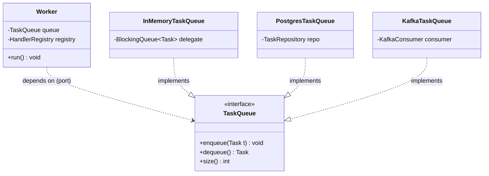

# Coupling

> Where this fits: coupling is the property that decides whether you can swap our `InMemoryTaskQueue` for a `PostgresTaskQueue` or a Kafka broker without rewriting the `Worker`. It is the single most important lever for keeping the Task Queue platform changeable across all four phases.

Coupling measures **how much one piece of code depends on another**. Two classes are tightly coupled when a change in one forces a change in the other; they are loosely coupled when each can evolve behind a stable contract. This chapter is the structural twin of [cohesion](./cohesion.md): cohesion is about how well things belong *together inside* a module, coupling is about how strongly modules *depend on each other across* boundaries. The design goal is the famous slogan: **high cohesion, low coupling**.

---

## Why this exists — the real problem it solves

Software is read, changed, and extended far more often than it is written. The cost of a change is roughly proportional to **how many places you must touch to make it**. Coupling is the variable that controls that blast radius.

A short history makes the motivation concrete:

- In the 1970s, **Larry Constantine** and **Edward Yourdon** (*Structured Design*) formalized coupling and cohesion as the two axes of modular quality. They ranked coupling from worst to best: content → common → external → control → stamp → data coupling.
- In 1994, **Robert C. Martin** quantified coupling at the package level with **afferent coupling (Ca)** and **efferent coupling (Ce)**, and derived **instability** and the **Stable Dependencies Principle**.
- The **Dependency Inversion Principle** (the *D* in [SOLID](./solid.md)) says: depend on abstractions, not concretions. That is the practical recipe for cutting coupling.

For our Task Queue, the stakes are concrete. In Phase 1 the queue is an in-memory `BlockingQueue`. In Phase 2 it becomes PostgreSQL. In Phase 4 it becomes Kafka or Redis. If `Worker` is coupled to a concrete `LinkedBlockingQueue`, every phase boundary is a rewrite. If `Worker` depends only on the `TaskQueue` **port** (interface), the queue implementation becomes a plug.

> **Definition.** Two modules A and B are *coupled* if you cannot understand or change A without also understanding or changing B. The strength of coupling is the amount of shared knowledge between them.

---

## Tight vs loose coupling

### Tight coupling

```java
// TIGHT: Worker reaches into a concrete data structure and a concrete handler.
public class Worker implements Runnable {
    private final java.util.concurrent.LinkedBlockingQueue<Task> queue; // concrete type
    private final EmailTaskHandler emailHandler;                        // concrete handler

    public Worker(java.util.concurrent.LinkedBlockingQueue<Task> queue,
                  EmailTaskHandler emailHandler) {
        this.queue = queue;
        this.emailHandler = emailHandler;
    }

    @Override
    public void run() {
        while (!Thread.currentThread().isInterrupted()) {
            try {
                Task t = queue.take();              // tied to BlockingQueue API
                if (t.type().equals("email")) {     // hard-coded type dispatch
                    emailHandler.handle(t);
                }
            } catch (Exception e) {
                Thread.currentThread().interrupt();
            }
        }
    }
}
```

What this class *knows* (and therefore depends on):
- The queue is a `LinkedBlockingQueue` (not just *some* queue).
- There is exactly one task type, `"email"`.
- The handler is `EmailTaskHandler` specifically.

Each of those is a future edit. Add an SMS task → edit `Worker`. Move to Postgres → edit `Worker`. Add Kafka → edit `Worker`. The blast radius is enormous.

### Loose coupling

```java
// LOOSE: Worker depends only on stable ports and a lookup strategy.
public class Worker implements Runnable {
    private final TaskQueue queue;                       // port, not concretion
    private final java.util.function.Function<String, TaskHandler> handlers;

    public Worker(TaskQueue queue, java.util.function.Function<String, TaskHandler> handlers) {
        this.queue = queue;
        this.handlers = handlers;
    }

    @Override
    public void run() {
        while (!Thread.currentThread().isInterrupted()) {
            try {
                Task task = queue.dequeue();             // TaskQueue contract only
                TaskHandler handler = handlers.apply(task.type());
                if (handler != null) handler.handle(task);
            } catch (InterruptedException e) {
                Thread.currentThread().interrupt();
            } catch (Exception e) {
                // outcome handling elaborated in the production version
            }
        }
    }
}
```

Now `Worker` knows only the `TaskQueue` contract and a function from type name to handler. Swapping the queue implementation, adding task types, or changing the broker leaves `Worker` untouched.

| Aspect | Tight coupling | Loose coupling |
|---|---|---|
| Depends on | concrete classes | abstractions (ports) |
| Change blast radius | large, ripples outward | small, contained |
| Testability | needs real collaborators | mock/fake the port |
| Reuse | hard, drags dependencies | easy, self-contained |
| Compile-time deps | many | few |
| Initial effort | low | slightly higher (define interfaces) |

---

## Afferent and efferent coupling, instability, and stable dependencies

Constantine's qualitative ranking is useful, but Martin's metrics let us *measure* coupling at the package or module level.

- **Efferent coupling (Ce, "outgoing")** of a module = number of other modules it depends *on*. High Ce means the module is fragile — many things can break it.
- **Afferent coupling (Ca, "incoming")** = number of other modules that depend *on it*. High Ca means the module is responsible — many things break if it changes.
- **Instability** `I = Ce / (Ce + Ca)`, in `[0, 1]`. `I = 0` is maximally stable (nothing depends out, lots depends in); `I = 1` is maximally unstable.

> **Stable Dependencies Principle (SDP):** depend in the direction of stability. A module should only depend on modules at least as stable as itself — i.e., `I` should *decrease* as you follow dependency arrows.

This is exactly why we put our domain (`Task`, `TaskStatus`, `TaskQueue`, `TaskHandler`) at the stable core: many things depend on it (high Ca), it depends on almost nothing (low Ce), so it is stable (low `I`) — and stable things are safe to depend on. Volatile things (a Kafka adapter, a Postgres adapter) sit at the unstable edge and depend *inward* on the stable core.

```mermaid
flowchart LR
    subgraph Stable core, low I
        DOM["domain<br/>Task, TaskStatus<br/>TaskQueue, TaskHandler<br/>I ~ 0.1"]
    end
    subgraph Unstable edge, high I
        MEM["in-memory adapter<br/>I ~ 0.8"]
        PG["postgres adapter<br/>I ~ 0.8"]
        KAFKA["kafka adapter<br/>I ~ 0.8"]
    end
    MEM --> DOM
    PG --> DOM
    KAFKA --> DOM
    WORKER["worker module"] --> DOM
```

Arrows point from unstable to stable. No arrow points outward from the domain — that is the SDP satisfied. If you ever see the domain `import`ing a concrete adapter, you have an SDP violation and an upcoming pain point.

---

## Depending on abstractions: ports decouple the worker from the broker

The mechanism that turns tight coupling into loose coupling is **the dependency inversion** of [hexagonal architecture](./hexagonal-architecture.md): instead of high-level policy depending on low-level detail, both depend on an abstraction *owned by the high-level side*. We call that abstraction a **port**.



`Worker` depends on `TaskQueue` (a dashed dependency arrow). The three adapters *implement* `TaskQueue` (hollow-triangle realization arrows). The dependency arrow and the implementation arrows meet at the interface but never at a concrete class — that is the decoupling. `Worker` has zero compile-time knowledge of `InMemoryTaskQueue`, `PostgresTaskQueue`, or `KafkaTaskQueue`.

---

## The naive version

A first cut that "just works" in Phase 1 and quietly accumulates coupling debt.

```java
import java.util.concurrent.LinkedBlockingQueue;

// Everything wired together by hand, concretions everywhere.
public class TaskProcessor {

    private final LinkedBlockingQueue<Task> queue = new LinkedBlockingQueue<>();
    private final EmailTaskHandler emailHandler = new EmailTaskHandler();
    private final ReportTaskHandler reportHandler = new ReportTaskHandler();

    public void submit(Task task) {
        queue.add(task);                       // coupled to add() semantics, no blocking control
    }

    public void processForever() {
        while (true) {
            try {
                Task t = queue.take();
                switch (t.type()) {            // dispatch glued into the processor
                    case "email"  -> emailHandler.handle(t);
                    case "report" -> reportHandler.handle(t);
                    default -> System.err.println("unknown type " + t.type());
                }
            } catch (Exception e) {
                e.printStackTrace();           // no retry, no DLQ, no metrics
            }
        }
    }
}
```

Limitations, each a coupling smell:

- **Construction coupling:** `new EmailTaskHandler()` inside the class — you cannot substitute a fake in a test or a different implementation in production.
- **Concrete queue coupling:** tied to `LinkedBlockingQueue`. Phase 2's Postgres queue cannot drop in.
- **Control coupling:** the `switch` is control coupling — `TaskProcessor` must change every time a new task type is added.
- **No seam for retry/DLQ/metrics:** outcome handling is hard-coded, so [retries](../08-distributed-systems/retries.md) and [dead-letter queues](../07-queues-and-messaging/dead-letter-queues.md) cannot be inserted without surgery.

---

## Improved version

Introduce the `TaskQueue` port and a handler registry. The processor stops constructing its collaborators.

```java
import java.util.Map;
import java.util.concurrent.ConcurrentHashMap;

// Worker depends on a port and a registry; both are injected.
public class Worker implements Runnable {

    private final TaskQueue queue;
    private final HandlerRegistry registry;

    public Worker(TaskQueue queue, HandlerRegistry registry) {
        this.queue = queue;
        this.registry = registry;
    }

    @Override
    public void run() {
        while (!Thread.currentThread().isInterrupted()) {
            try {
                Task task = queue.dequeue();
                TaskHandler handler = registry.lookup(task.type());
                if (handler == null) {
                    System.err.println("no handler for " + task.type());
                    continue;
                }
                handler.handle(task);
            } catch (InterruptedException e) {
                Thread.currentThread().interrupt();
            } catch (Exception e) {
                System.err.println("task failed: " + task_id_safe(e));
            }
        }
    }

    private static String task_id_safe(Exception e) {
        return e.getMessage() == null ? "unknown" : e.getMessage();
    }
}

// Open for new types without editing Worker — extension point, not a switch.
final class HandlerRegistry {
    private final Map<String, TaskHandler> byType = new ConcurrentHashMap<>();

    public HandlerRegistry register(String type, TaskHandler handler) {
        byType.put(type, handler);
        return this;
    }

    public TaskHandler lookup(String type) {
        return byType.get(type);
    }
}
```

What improved:

- `Worker` depends on `TaskQueue` and `HandlerRegistry`, both **injected** (see [dependency injection](./dependency-injection.md)).
- Adding a task type is a `registry.register(...)` call at the composition root, not an edit to `Worker`. The `switch` is gone — control coupling removed.
- Tests can pass a fake `TaskQueue` and a registry of stub handlers.

Still missing: structured outcome handling (`TaskResult`), retry policy, DLQ, and metrics — all of which we now have *seams* for.

---

## Production-quality version

The version a staff engineer ships: `Worker` orchestrates ports for the queue, retry policy, DLQ, and metrics, and never names a concrete collaborator.

```java
import java.time.Duration;
import java.time.Instant;
import java.util.Optional;

/**
 * Worker pulls Tasks from a TaskQueue port, dispatches via a HandlerRegistry,
 * and routes outcomes through RetryPolicy, TaskScheduler, DeadLetterQueue,
 * and MetricsCollector ports. It is coupled to NONE of their implementations.
 */
public final class Worker implements Runnable {

    private final TaskQueue queue;
    private final HandlerRegistry registry;
    private final RetryPolicy retryPolicy;
    private final TaskScheduler scheduler;
    private final DeadLetterQueue deadLetters;
    private final MetricsCollector metrics;

    public Worker(TaskQueue queue,
                  HandlerRegistry registry,
                  RetryPolicy retryPolicy,
                  TaskScheduler scheduler,
                  DeadLetterQueue deadLetters,
                  MetricsCollector metrics) {
        this.queue = queue;
        this.registry = registry;
        this.retryPolicy = retryPolicy;
        this.scheduler = scheduler;
        this.deadLetters = deadLetters;
        this.metrics = metrics;
    }

    @Override
    public void run() {
        while (!Thread.currentThread().isInterrupted()) {
            Task task = null;
            try {
                task = queue.dequeue();
                process(task);
            } catch (InterruptedException e) {
                Thread.currentThread().interrupt();
                return;
            } catch (Exception unexpected) {
                if (task != null) routeFailure(task, "worker error: " + unexpected.getMessage(), true);
            }
        }
    }

    private void process(Task task) {
        TaskHandler handler = registry.lookup(task.type());
        if (handler == null) {
            deadLetters.send(task, "no handler for type " + task.type());
            metrics.increment("tasks.dead.no_handler");
            return;
        }
        long start = System.nanoTime();
        try {
            TaskResult result = handler.handle(task);
            metrics.recordTimer("task.duration", Duration.ofNanos(System.nanoTime() - start));
            if (result.success()) {
                metrics.increment("tasks.succeeded");
            } else {
                routeFailure(task, result.message(), result.retryable());
            }
        } catch (Exception e) {
            routeFailure(task, "exception: " + e.getMessage(), true);
        }
    }

    private void routeFailure(Task task, String reason, boolean retryable) {
        metrics.increment("tasks.failed");
        if (!retryable || task.attempts() + 1 >= task.maxAttempts()) {
            deadLetters.send(task, reason);
            metrics.increment("tasks.dead");
            return;
        }
        Optional<Duration> delay = retryPolicy.nextDelay(task.attempts() + 1);
        if (delay.isEmpty()) {
            deadLetters.send(task, "retry policy exhausted: " + reason);
            metrics.increment("tasks.dead");
            return;
        }
        Task retrying = task.withStatus(TaskStatus.RETRYING).withIncrementedAttempts();
        scheduler.schedule(retrying, delay.get());
        metrics.increment("tasks.retried");
    }
}
```

Why this is the shippable version:

- **Every collaborator is a port.** `TaskQueue`, `RetryPolicy`, `TaskScheduler`, `DeadLetterQueue`, `MetricsCollector` are all interfaces. `Worker` can run identically against in-memory, Postgres, or Kafka adapters.
- **Stable-direction dependencies.** `Worker` (high-level policy) depends on abstractions in the stable domain core; volatile adapters depend inward. SDP satisfied.
- **Outcome routing is explicit and testable.** Retry vs DLQ logic lives in one method with injected policies. To change backoff strategy you swap a `RetryPolicy` implementation — see [`ExponentialBackoffRetryPolicy`](../08-distributed-systems/retries.md).
- **No hidden global state.** Metrics is a port too, so a test can assert on counter increments with a fake `MetricsCollector`.

The supporting ports and the immutable `Task` helpers:

```java
import java.time.Duration;
import java.time.Instant;
import java.util.List;
import java.util.Optional;

public enum TaskStatus { PENDING, SCHEDULED, RUNNING, SUCCEEDED, FAILED, RETRYING, DEAD }

public record TaskResult(boolean success, String message, boolean retryable) {
    public static TaskResult ok()                 { return new TaskResult(true, "ok", false); }
    public static TaskResult retry(String why)    { return new TaskResult(false, why, true); }
    public static TaskResult fail(String why)     { return new TaskResult(false, why, false); }
}

@FunctionalInterface
public interface TaskHandler { TaskResult handle(Task task) throws Exception; }

public interface TaskQueue {
    void enqueue(Task t);
    Task dequeue() throws InterruptedException;
    int size();
}

public interface RetryPolicy { Optional<Duration> nextDelay(int attempt); }

public interface TaskScheduler { void schedule(Task t, Duration delay); }

public interface DeadLetterQueue { void send(Task t, String reason); }

public interface MetricsCollector {
    void increment(String counter);
    void recordTimer(String name, Duration duration);
}

public record Task(String id, String type, String payload, TaskStatus status,
                   int attempts, int maxAttempts, Instant createdAt,
                   Instant scheduledAt, int priority) {

    public Task withStatus(TaskStatus s) {
        return new Task(id, type, payload, s, attempts, maxAttempts, createdAt, scheduledAt, priority);
    }
    public Task withIncrementedAttempts() {
        return new Task(id, type, payload, status, attempts + 1, maxAttempts, createdAt, scheduledAt, priority);
    }
}
```

---

## Code walkthrough — beginner, intermediate, production

### Beginner: see coupling by counting imports

```java
// Count the distinct collaborators a class must KNOW about. That count IS its efferent coupling.
public class CouplingDemo {

    // Ce = 1: this class depends on exactly one abstraction.
    static class GoodNotifier {
        private final TaskQueue queue;            // 1 dependency, an interface
        GoodNotifier(TaskQueue queue) { this.queue = queue; }
        void notifyDone(Task t) { queue.enqueue(t.withStatus(TaskStatus.SUCCEEDED)); }
    }

    // Ce = 3: this class names three concrete collaborators it could have avoided.
    static class BadNotifier {
        private final InMemoryTaskQueue queue = new InMemoryTaskQueue();   // concrete
        private final EmailTaskHandler email   = new EmailTaskHandler();   // concrete
        private final java.util.logging.Logger log =                       // concrete
                java.util.logging.Logger.getLogger("notify");
        void notifyDone(Task t) {
            queue.enqueue(t.withStatus(TaskStatus.SUCCEEDED));
            log.info("done " + t.id());
        }
    }
}
```

The lesson: every concrete name in a class is a dependency edge. `GoodNotifier` can be reused and tested in isolation; `BadNotifier` drags an in-memory queue, an email handler, and a logger with it everywhere.

### Intermediate: a fake proves the decoupling

```java
import java.util.ArrayDeque;
import java.util.Deque;

// Because Worker depends on the TaskQueue port, a test supplies an in-process fake.
final class FakeTaskQueue implements TaskQueue {
    private final Deque<Task> items = new ArrayDeque<>();
    @Override public void enqueue(Task t) { items.addLast(t); }
    @Override public Task dequeue() throws InterruptedException {
        if (items.isEmpty()) throw new InterruptedException("drained");
        return items.removeFirst();
    }
    @Override public int size() { return items.size(); }
}

final class RecordingMetrics implements MetricsCollector {
    final java.util.Map<String, Integer> counters = new java.util.HashMap<>();
    @Override public void increment(String c) { counters.merge(c, 1, Integer::sum); }
    @Override public void recordTimer(String name, java.time.Duration d) { /* noop in test */ }
}
```

No database, no broker, no threads-of-other-systems. The decoupling buys you a unit test that runs in microseconds. This is the practical payoff of low efferent coupling.

### Production-inspired: the composition root wires concretions in ONE place

```java
import java.util.concurrent.ExecutorService;
import java.util.concurrent.Executors;
import java.util.concurrent.ScheduledExecutorService;

/**
 * The ONLY class allowed to name concrete adapters. All coupling to concrete
 * implementations is concentrated here, at the edge, where it is cheap to change.
 */
public final class TaskPlatform {

    private final ExecutorService pool;

    public TaskPlatform(int workers) {
        // Concrete choices live here and nowhere else.
        TaskQueue queue            = new InMemoryTaskQueue();
        DeadLetterQueue dlq        = new InMemoryDeadLetterQueue();
        RetryPolicy retry          = new ExponentialBackoffRetryPolicy(/*base*/ java.time.Duration.ofMillis(200), /*max*/ 5);
        MetricsCollector metrics   = new MicrometerMetricsCollector();
        ScheduledExecutorService scheduleExec = Executors.newSingleThreadScheduledExecutor();
        TaskScheduler scheduler    = new DelayQueueScheduler(queue, scheduleExec, metrics, java.time.Clock.systemUTC());

        HandlerRegistry registry = new HandlerRegistry()
                .register("email",  new EmailTaskHandler())
                .register("report", new ReportTaskHandler());

        // Virtual threads (Project Loom) — one carrier-cheap thread per worker.
        this.pool = Executors.newVirtualThreadPerTaskExecutor();
        for (int i = 0; i < workers; i++) {
            pool.submit(new Worker(queue, registry, retry, scheduler, dlq, metrics));
        }
    }

    public void shutdown() { pool.shutdownNow(); }
}
```

Swapping Phase 1 → Phase 2 means changing **only these lines** to `new PostgresTaskQueue(repo)` and `new PostgresDeadLetterQueue(repo)`. Nothing downstream — `Worker`, `HandlerRegistry`, handlers — changes. The whole platform's coupling to "which queue" is now a single edit site.

---

## How this applies to our Task Queue project

| Canonical type | Role in coupling | Effect |
|---|---|---|
| `TaskQueue` (port) | decouples `Worker` from the broker | swap in-memory ↔ Postgres ↔ Kafka with no `Worker` change |
| `TaskHandler` (port) | decouples dispatch from business logic | new task types via registration, not edits |
| `RetryPolicy` (port) | decouples retry timing from the worker | fixed ↔ exponential backoff by injection |
| `DeadLetterQueue` (port) | decouples failure routing | DLQ backend changes without touching policy |
| `MetricsCollector` / `MeterRegistry` | decouples observability | Micrometer ↔ noop ↔ test fake |
| `HandlerRegistry` | replaces a `switch` with a lookup | removes control coupling |
| `TaskPlatform` (composition root) | concentrates concrete coupling | one edit site per phase transition |

The arrows in our [layered](./layered-architecture.md) and [hexagonal](./hexagonal-architecture.md) designs all point inward toward the stable domain, satisfying the Stable Dependencies Principle.

---

## Tradeoffs

> Loose coupling is not free, and "more interfaces" is not automatically "better design."

| Decision | Benefit | Cost |
|---|---|---|
| Introduce a port (`TaskQueue`) | swap implementations, test in isolation | one more file; indirection to navigate |
| Inject everything | explicit dependencies, testability | verbose constructors; needs a wiring root |
| Registry over `switch` | open for extension | dispatch errors move to runtime |
| Stable domain core | safe to depend on | discipline to keep adapters out |
| Interface per collaborator | maximum flexibility | over-abstraction if there is only ever one impl |

**The over-abstraction trap.** An interface with exactly one implementation and no plausible second one is *speculative generality* — coupling you pay for in indirection without buying flexibility. Add the port when a second implementation is real or imminent (our queue genuinely has three across phases) or when you need a test seam. Otherwise a concrete class is fine; you can [extract the interface](./dependency-injection.md) later with an IDE refactor in seconds.

**Coupling you cannot remove.** Everything depends on the domain `Task`/`TaskStatus`. That is *good* coupling — it is afferent coupling to a stable core. Do not try to abstract the domain itself behind interfaces; that is cargo-cult decoupling that makes the code harder, not softer.

---

## Common mistakes and pitfalls

- **`new` inside business logic.** `new PostgresTaskQueue()` in `Worker` hard-wires the implementation. *Fix:* inject the `TaskQueue` port; construct concretions only in `TaskPlatform`.
- **Leaky abstraction.** `TaskQueue` that exposes `getUnderlyingResultSet()` re-couples callers to JDBC. *Fix:* the port speaks the domain (`Task`), never the implementation's vocabulary.
- **Control coupling via flags.** `process(Task t, boolean useKafka)` makes the callee branch on caller intent. *Fix:* polymorphism — two implementations, no flag.
- **God object pulling everyone in.** A `TaskManager` that does queueing, retry, DLQ, and metrics has huge efferent coupling. *Fix:* split by responsibility; see [cohesion](./cohesion.md) and the [Single Responsibility Principle](./solid.md).
- **Cyclic dependencies.** `Worker` → `Metrics` → `Worker` creates a cycle that cannot be tested or compiled independently. *Fix:* break the cycle with an interface or an event ([EventBus](../09-project/phase-4.md)); instability is undefined inside a cycle.
- **Depending downward in stability.** A stable core importing a volatile adapter violates SDP and breaks every time the adapter changes. *Fix:* invert the dependency with a port.
- **Stamp/data over-passing.** Passing a whole `Task` when a handler needs only `payload` couples the handler to the full shape. Usually fine for a cohesive aggregate, but watch it for cross-context calls.

---

## Refactoring exercise

**Bad** — a scheduler glued to a concrete queue and a concrete clock:

```java
import java.util.concurrent.LinkedBlockingQueue;

public class SchedulerBad {
    private final LinkedBlockingQueue<Task> queue;          // concrete queue
    public SchedulerBad(LinkedBlockingQueue<Task> queue) { this.queue = queue; }

    public void schedule(Task t, long delayMs) {
        new Thread(() -> {                                  // ad-hoc thread, no control
            try { Thread.sleep(delayMs); } catch (InterruptedException ignored) {}
            queue.add(t.withStatus(TaskStatus.SCHEDULED));  // tied to add()
        }).start();
    }
}
```

Problems: coupled to `LinkedBlockingQueue`, coupled to wall-clock `Thread.sleep`, untestable without real time, spawns unmanaged threads.

**Improved** — depend on the `TaskQueue` port and inject the executor:

```java
import java.time.Duration;
import java.util.concurrent.ScheduledExecutorService;
import java.util.concurrent.TimeUnit;

public class SchedulerImproved implements TaskScheduler {
    private final TaskQueue queue;                          // port, not concretion
    private final ScheduledExecutorService executor;        // injected, controllable

    public SchedulerImproved(TaskQueue queue, ScheduledExecutorService executor) {
        this.queue = queue;
        this.executor = executor;
    }

    @Override
    public void schedule(Task t, Duration delay) {
        executor.schedule(
            () -> queue.enqueue(t.withStatus(TaskStatus.SCHEDULED)),
            delay.toMillis(), TimeUnit.MILLISECONDS);
    }
}
```

**Production-quality** — add a `Clock` seam, metrics port, and graceful semantics:

```java
import java.time.Clock;
import java.time.Duration;
import java.util.concurrent.ScheduledExecutorService;
import java.util.concurrent.TimeUnit;

public final class DelayQueueScheduler implements TaskScheduler {

    private final TaskQueue queue;
    private final ScheduledExecutorService executor;
    private final MetricsCollector metrics;
    private final Clock clock;                              // injectable time for tests

    public DelayQueueScheduler(TaskQueue queue,
                               ScheduledExecutorService executor,
                               MetricsCollector metrics,
                               Clock clock) {
        this.queue = queue;
        this.executor = executor;
        this.metrics = metrics;
        this.clock = clock;
    }

    @Override
    public void schedule(Task task, Duration delay) {
        if (delay.isNegative() || delay.isZero()) {
            queue.enqueue(task.withStatus(TaskStatus.SCHEDULED));
            metrics.increment("scheduler.immediate");
            return;
        }
        metrics.increment("scheduler.scheduled");
        executor.schedule(() -> {
            try {
                queue.enqueue(task.withStatus(TaskStatus.SCHEDULED));
            } catch (RuntimeException e) {
                metrics.increment("scheduler.enqueue_failed");
            }
        }, delay.toMillis(), TimeUnit.MILLISECONDS);
    }
}
```

Now the scheduler depends only on ports (`TaskQueue`, `MetricsCollector`) and a `Clock`. It is testable with a fake queue and a fixed clock, and its concrete `ScheduledExecutorService` is chosen at the composition root.

---

## Exercises

### Easy

**E1 (knowledge check).** Define afferent and efferent coupling in one sentence each, and write the instability formula. Is the domain `Task` record more stable or less stable than a `KafkaTaskQueue` adapter? Why?

**E2 (coding).** Given the tightly coupled `Worker` from "The naive version," rewrite it so it depends only on the `TaskQueue` port and a `HandlerRegistry`. It must compile against the canonical interfaces.

### Medium

**M1 (refactoring).** The `Reporter` below has efferent coupling of 3 to concrete classes. Reduce it to depend on abstractions only.

```java
public class Reporter {
    private final InMemoryTaskQueue queue = new InMemoryTaskQueue();
    private final MicrometerMetricsCollector metrics = new MicrometerMetricsCollector();
    void report(Task t) {
        queue.enqueue(t);
        metrics.increment("reported");
    }
}
```

**M2 (design).** A new requirement: emit a `TaskEvent` whenever a task moves to `DEAD`. Design the change so `Worker` does not gain coupling to a concrete event system. Name the port and where it is wired.

### Hard

**H1 (interview-style).** You inherit a `TaskService` with `Ce = 9` (it `new`s a queue, a Postgres repo, an HTTP client, a logger, a metrics client, a retry policy, a DLQ, a clock, and a thread pool). Walk through how you would reduce its coupling step by step, what tests you would add first, and how you would measure success.

**H2 (stretch).** Implement a `CompositeTaskQueue` that fronts a primary `TaskQueue` and falls back to a secondary on failure, without `Worker` knowing two queues exist. Prove with a test that `Worker`'s code is unchanged.

---

## Solutions

### E1

- *Afferent coupling (Ca)* of a module is the number of modules that depend on it (incoming).
- *Efferent coupling (Ce)* is the number of modules it depends on (outgoing).
- Instability: `I = Ce / (Ce + Ca)`, range `[0, 1]`.

`Task` is **more stable**: many modules depend on it (high Ca) and it depends on almost nothing (low Ce), giving low `I`. The `KafkaTaskQueue` adapter is unstable: it depends outward on the Kafka client and the domain (high Ce) while little depends on it (low Ca), giving high `I`. We therefore make the adapter depend on `Task`, never the reverse — the Stable Dependencies Principle.

### E2

```java
public final class Worker implements Runnable {
    private final TaskQueue queue;
    private final HandlerRegistry registry;

    public Worker(TaskQueue queue, HandlerRegistry registry) {
        this.queue = queue;
        this.registry = registry;
    }

    @Override
    public void run() {
        while (!Thread.currentThread().isInterrupted()) {
            try {
                Task task = queue.dequeue();
                TaskHandler handler = registry.lookup(task.type());
                if (handler != null) handler.handle(task);
            } catch (InterruptedException e) {
                Thread.currentThread().interrupt();
            } catch (Exception e) {
                System.err.println("handler error: " + e.getMessage());
            }
        }
    }
}
```

`Worker` now names zero concrete collaborators. `Ce` to concretions is 0; it depends only on the `TaskQueue` and `HandlerRegistry` abstractions.

### M1

```java
public final class Reporter {
    private final TaskQueue queue;             // was InMemoryTaskQueue
    private final MetricsCollector metrics;    // was MicrometerMetricsCollector

    public Reporter(TaskQueue queue, MetricsCollector metrics) {
        this.queue = queue;
        this.metrics = metrics;
    }

    public void report(Task t) {
        queue.enqueue(t);
        metrics.increment("reported");
    }
}
```

Efferent coupling to *concrete* types dropped from 3 to 0; the two remaining dependencies are stable abstractions. The concrete `InMemoryTaskQueue` and `MicrometerMetricsCollector` are now chosen at `TaskPlatform`.

### M2

Add an `EventBus` **port** (the canonical one introduced in [Phase 4](../09-project/phase-4.md)):

```java
public record TaskEvent(String taskId, TaskStatus status, java.time.Instant at, String reason) {}

public interface TaskEventListener { void onEvent(TaskEvent e); }

public interface EventBus {
    void publish(TaskEvent e);
    void subscribe(TaskEventListener l);
}
```

`Worker` receives an `EventBus` in its constructor and calls `eventBus.publish(new TaskEvent(task.id(), TaskStatus.DEAD, Instant.now(clock), reason))` in `routeFailure` right before `deadLetters.send(...)`. `Worker` is coupled only to the `EventBus` interface. The concrete bus (in-memory, Kafka, RabbitMQ) is wired at `TaskPlatform`. No new concrete coupling enters `Worker`.

### H1

Step-by-step coupling reduction for the `Ce = 9` `TaskService`:

1. **Characterization tests first.** Before touching anything, write tests that pin current behavior so the refactor is safe. Because the class `new`s its collaborators, start with the few seams you can exploit (public method outputs), then widen.
2. **Extract interfaces** for each concrete collaborator that has (or will have) a second implementation or needs a test seam: `TaskQueue`, `TaskRepository`, an `HttpClientPort`, `MetricsCollector`, `RetryPolicy`, `DeadLetterQueue`, `Clock`, and the executor. Logging can stay concrete (SLF4J facade is already an abstraction).
3. **Constructor-inject** all of them; delete every `new` from the body. `Ce` to concrete classes drops toward 0.
4. **Move construction to the composition root** (`TaskPlatform`), where concrete choices are centralized.
5. **Split by responsibility** if the class is still doing too much — queueing vs persistence vs HTTP are different reasons to change ([SRP](./solid.md)). High `Ce` often co-occurs with low cohesion.
6. **Measure success:** `Ce` to concretions ~0; unit tests run with fakes and no I/O; a phase swap (in-memory → Postgres) touches only the wiring root; cyclomatic complexity per method falls. Tools: ArchUnit to assert "domain must not depend on adapters," and a dependency-cycle check in CI.

### H2

```java
public final class CompositeTaskQueue implements TaskQueue {
    private final TaskQueue primary;
    private final TaskQueue secondary;

    public CompositeTaskQueue(TaskQueue primary, TaskQueue secondary) {
        this.primary = primary;
        this.secondary = secondary;
    }

    @Override
    public void enqueue(Task t) {
        try { primary.enqueue(t); }
        catch (RuntimeException e) { secondary.enqueue(t); }
    }

    @Override
    public Task dequeue() throws InterruptedException {
        try { return primary.dequeue(); }
        catch (RuntimeException e) { return secondary.dequeue(); }
    }

    @Override
    public int size() { return primary.size() + secondary.size(); }
}
```

Proof that `Worker` is unchanged — it sees only a `TaskQueue`:

```java
import org.junit.jupiter.api.Test;
import static org.assertj.core.api.Assertions.assertThat;

class CompositeTaskQueueTest {

    @Test
    void worker_uses_composite_without_knowing_it() throws Exception {
        TaskQueue failing = new TaskQueue() {                  // primary always fails
            public void enqueue(Task t) { throw new RuntimeException("primary down"); }
            public Task dequeue() { throw new RuntimeException("primary down"); }
            public int size() { return 0; }
        };
        FakeTaskQueue backup = new FakeTaskQueue();
        TaskQueue composite = new CompositeTaskQueue(failing, backup);

        Task t = new Task("id-1", "email", "{}", TaskStatus.PENDING,
                0, 3, java.time.Instant.now(), java.time.Instant.now(), 0);

        composite.enqueue(t);                                  // routed to backup
        assertThat(backup.size()).isEqualTo(1);                // fallback worked

        // Worker would call composite.dequeue() with IDENTICAL code as for any TaskQueue.
        Task pulled = backup.dequeue();
        assertThat(pulled.id()).isEqualTo("id-1");
    }
}
```

`CompositeTaskQueue` is itself a `TaskQueue`, so it composes transparently — a small example of the [Composite pattern](../05-design-patterns/composite.md) used to add behavior without adding coupling to `Worker`.

---

## Interview questions and takeaways

1. **What is the difference between coupling and cohesion?** Cohesion is intra-module relatedness (do the parts belong together); coupling is inter-module dependence (how strongly modules rely on each other). Aim for high cohesion, low coupling — they often improve together.

2. **Rank the kinds of coupling from worst to best.** Content (one module reaches into another's internals) → common (shared global state) → external → control (passing a flag that drives the callee's branching) → stamp (passing a whole record when only a field is needed) → data (passing only what is needed). Strive for data coupling.

3. **What is afferent vs efferent coupling, and what is instability?** Ca = incoming dependencies, Ce = outgoing; `I = Ce/(Ce+Ca)`. Stable modules have low `I`; you should depend in the direction of stability (SDP).

4. **How does the Dependency Inversion Principle reduce coupling?** High-level policy and low-level detail both depend on an abstraction owned by the high-level side, so policy no longer names concrete details. In our platform, `Worker` depends on `TaskQueue`, not `KafkaTaskQueue`.

5. **When is an interface over-abstraction?** When it has one implementation, no plausible second, and no test-seam need. That is speculative generality — indirection without payoff. Extract the interface when the need is real; an IDE does it in seconds.

6. **How do you detect coupling problems in a large codebase?** Count efferent coupling per class, look for `new` of infrastructure in business logic, search for dependency cycles, and enforce architectural rules with ArchUnit (e.g., "domain must not import adapters"). High `Ce` plus low cohesion flags a god object.

7. **Why is depending on the domain `Task` not "bad coupling"?** It is afferent coupling to a stable core. Stable, widely depended-on abstractions are safe to depend on; the SDP encourages exactly this.

**Takeaways.** Coupling is the cost-of-change variable. Cut it by depending on abstractions (ports), injecting collaborators, and concentrating concrete choices at a composition root. Direct every dependency toward stability. But do not abstract speculatively — coupling you cannot remove (to the stable domain) is fine.

---

## Production considerations

- **Coupling shows up as deploy blast radius.** In a service mesh, tightly coupled modules force lock-step deploys. Ports let you deploy the queue adapter independently of the worker logic.
- **Hidden coupling through shared mutable state** (a static singleton metrics object, a shared connection pool) is invisible in class diagrams but very real at runtime; it causes contention and flaky tests. Prefer injected, scoped instances.
- **Serialization coupling.** When the broker becomes Kafka, the wire format of `Task`'s `payload` couples producer and consumer across deploys. Version your schema; do not let a `Task` field rename break in-flight messages. See [message ordering](../08-distributed-systems/message-ordering.md) and [idempotency](../08-distributed-systems/idempotency.md).
- **Monitoring.** Track a per-module dependency count in CI (fail the build if the domain package gains an outward dependency). ArchUnit and `jdeps` make this enforceable.
- **Cyclic dependencies at runtime** can deadlock initialization (two singletons each needing the other). Break cycles with interfaces or an event bus before they reach production.
- **Over-decoupling cost.** Excessive indirection slows on-call debugging — a stack trace through five interfaces and a dynamic proxy is harder to read at 3 a.m. Balance: abstract at true seams (queue, broker, policy), keep straight calls within a cohesive module.

---

## What We Can Improve In Our Project Using This Concept

- Replace any direct `new InMemoryTaskQueue()` / handler `switch` inside `Worker` with the `TaskQueue` port and a `HandlerRegistry`, so Phase 2's `PostgresTaskQueue` and Phase 4's broker drop in with no worker change.
- Introduce a single `TaskPlatform` composition root that is the only place naming concrete adapters, concentrating all infrastructure coupling at the edge.
- Add ArchUnit tests asserting the domain package has zero outward dependencies on adapters, enforcing the Stable Dependencies Principle in CI.

## Project Refactoring Task

Refactor the Phase 1 worker loop to depend only on ports. Concretely: (1) extract `TaskQueue`, `RetryPolicy`, `TaskScheduler`, `DeadLetterQueue`, and `MetricsCollector` interfaces; (2) constructor-inject all five into `Worker`; (3) replace the type `switch` with a `HandlerRegistry`; (4) move all `new` calls into `TaskPlatform`; (5) write a `WorkerTest` using `FakeTaskQueue` and `RecordingMetrics` that runs without any real I/O. Acceptance: `Worker` names no concrete collaborator, and swapping `InMemoryTaskQueue` for `PostgresTaskQueue` touches only `TaskPlatform`.

## Git Commit For This Chapter

```bash
git add backend-engineering-roadmap/04-oop-and-ood/coupling.md \
        src/main/java/com/taskqueue/worker/Worker.java \
        src/main/java/com/taskqueue/worker/HandlerRegistry.java \
        src/main/java/com/taskqueue/port/TaskQueue.java \
        src/main/java/com/taskqueue/platform/TaskPlatform.java \
        src/test/java/com/taskqueue/worker/WorkerTest.java
git commit -m "refactor(worker): depend on TaskQueue port to decouple worker from queue impl

Introduce HandlerRegistry to remove control coupling from the type switch,
inject RetryPolicy/Scheduler/DLQ/Metrics ports, and centralize concrete
wiring in TaskPlatform. Worker now names zero concrete collaborators."
```

Files touched: `Worker.java`, `HandlerRegistry.java`, `TaskQueue.java`, `TaskPlatform.java`, `WorkerTest.java`, and this chapter.

## Architecture Impact

The dependency graph inverts: high-level `Worker` policy no longer points at low-level queue/broker details; both point at ports in the stable domain core. This is the structural precondition for [hexagonal](./hexagonal-architecture.md) and [clean architecture](./clean-architecture.md), enables the Phase 1→2→4 queue swaps with localized change, and makes horizontal scaling possible because workers are interchangeable units coupled only to contracts, not to a specific broker.

## Interview Takeaways

- Coupling is the cost-of-change metric; reduce it by depending on abstractions and injecting collaborators.
- Know Ca, Ce, and `I = Ce/(Ce+Ca)`, and the Stable Dependencies Principle: depend toward stability.
- Ports decouple the worker from the queue/broker; the composition root concentrates concrete coupling.
- Do not over-abstract: an interface with one implementation and no test-seam need is speculative generality.
- Coupling to a stable domain core is good coupling; coupling outward from the core is the smell to chase.
