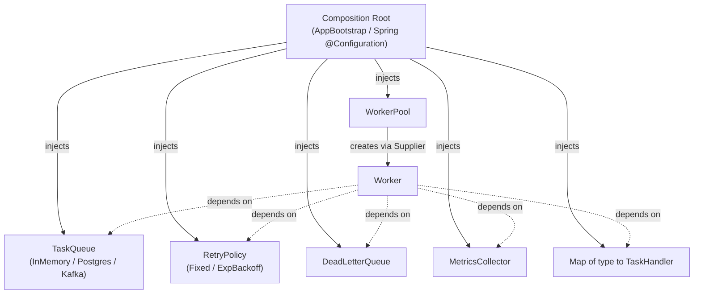
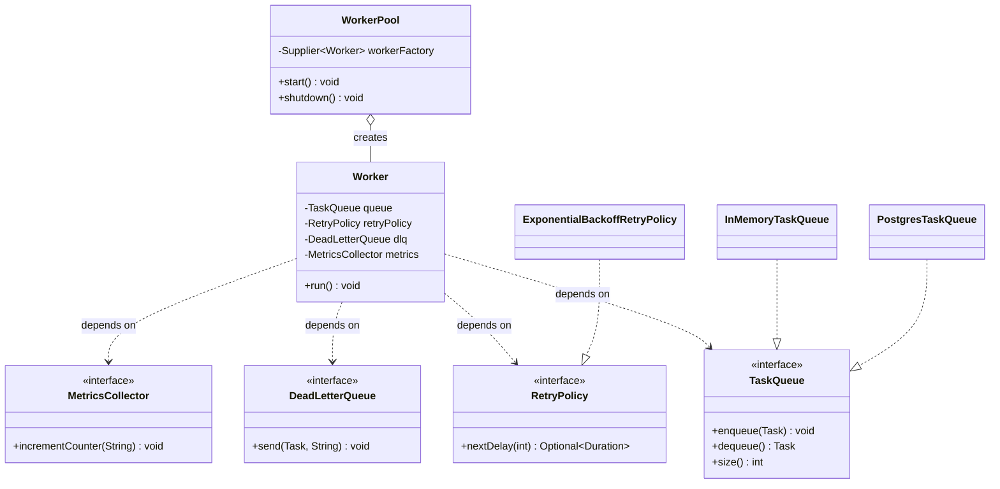

# Dependency Injection

> Where this fits: dependency injection (DI) is *how* the loose coupling we argued for in [coupling](./coupling.md) actually gets wired up at runtime. It is the mechanism that lets a `Worker` depend on the `TaskQueue` **interface** while someone *else* decides whether the concrete object is an `InMemoryTaskQueue` (Phase 1), a `PostgresTaskQueue` (Phase 2), or a Kafka-backed broker (Phase 4). DI is the assembly glue of the whole platform.

Dependency injection is a simple idea wrapped in intimidating vocabulary: **an object should be given the things it needs instead of building them itself.** That single rule — "ask for collaborators, don't construct them" — is what makes our `WorkerPool`, `Worker`, `RetryPolicy`, `DeadLetterQueue`, and `MetricsCollector` independently testable, swappable, and assemblable into different topologies per phase.

This chapter takes you from `new` scattered everywhere and static singletons, through hand-written ("poor man's") DI, to a Spring Boot 3 container — and shows exactly why each step makes our Task Queue easier to test and evolve.

---

## Why this exists — the real problem it solves

Every non-trivial object needs *collaborators*: a `Worker` needs a `TaskQueue`, a registry of `TaskHandler`s, a `RetryPolicy`, a `DeadLetterQueue`, and a `MetricsCollector`. There are only two places that knowledge of "which concrete collaborator" can live:

1. **Inside the object** — the object calls `new` or a static factory itself. The object *controls* its dependencies.
2. **Outside the object** — someone hands the collaborators in. Control of dependencies is *inverted* out to a caller or a container. This is **Inversion of Control (IoC)**, and DI is the most common way to achieve it.

A little history makes the motivation land:

- Early-2000s enterprise Java drowned in `new` calls and the **Service Locator** anti-pattern (`ServiceRegistry.get(EmailService.class)`). Tests were brutal: you could not replace a real database or SMTP server without rewriting production code.
- **Martin Fowler**'s 2004 essay *"Inversion of Control Containers and the Dependency Injection Pattern"* coined the term "dependency injection" and split it cleanly from Service Locator. The key insight: with a Service Locator the object still *reaches out* and pulls; with DI the object *passively receives*. Receiving is testable; reaching out is not.
- **Spring** (2003) and later **Google Guice** (2007) turned DI into mainstream infrastructure. By Spring Boot 3 (the stack we use from Phase 2 on), constructor injection with `@Component`/`@Service` and autowiring is the default.

The real problem DI solves is **decision placement**. The decision "use PostgreSQL, not memory" should be made *once, at the edge of the system* (the composition root / `main` / Spring config), not smeared across a hundred classes that each call `new PostgresTaskQueue(...)`. Centralize the wiring decision and the rest of the code depends only on the [interfaces](../02-core-oop/chapter-13-interfaces.md).

> **Definition.** *Dependency Injection* is a technique where an object receives its dependencies from outside rather than creating them. *Inversion of Control* is the broader principle: the framework/caller, not the object, decides the object's collaborators and lifecycle.

---

## The naive version — `new` inside the class

Here is the first-cut `Worker`, written the way most people new to OOD write it. It builds everything it needs.

```java
// NAIVE: Worker constructs its own world. Untestable, unswappable.
public class Worker implements Runnable {

    private final InMemoryTaskQueue queue = new InMemoryTaskQueue();          // hard-wired
    private final ExponentialBackoffRetryPolicy retry =                       // hard-wired
            new ExponentialBackoffRetryPolicy(Duration.ofSeconds(1), 5);
    private final ConsoleDeadLetterQueue dlq = new ConsoleDeadLetterQueue();  // hard-wired

    @Override
    public void run() {
        while (!Thread.currentThread().isInterrupted()) {
            try {
                Task task = queue.dequeue();
                TaskHandler handler = HandlerRegistry.INSTANCE.lookup(task.type()); // static singleton!
                TaskResult result = handler.handle(task);
                if (!result.success() && result.retryable()) {
                    retry.nextDelay(task.attempts())
                         .ifPresentOrElse(d -> queue.enqueue(task), () -> dlq.send(task, result.message()));
                }
                Metrics.INSTANCE.incrementCounter("tasks.processed"); // another static singleton
            } catch (InterruptedException e) {
                Thread.currentThread().interrupt();
                return;
            } catch (Exception e) {
                Metrics.INSTANCE.incrementCounter("tasks.errored");
            }
        }
    }
}
```

What is wrong with this — concretely, not abstractly:

- **You cannot test it without a real queue.** `new InMemoryTaskQueue()` is baked in. In Phase 2 you would have to change this *class* to use PostgreSQL.
- **`HandlerRegistry.INSTANCE` and `Metrics.INSTANCE` are global singletons.** A test that registers a fake email handler leaks into the next test. Global mutable state is shared across the JVM, so tests cannot run in parallel and order-dependence creeps in.
- **You cannot verify behavior.** To assert "a failed retryable task is re-enqueued", you need to *observe* the queue. With a hidden private `new InMemoryTaskQueue()` you have no handle on it.
- **Compile-time coupling to concretions.** `Worker` now `import`s `ExponentialBackoffRetryPolicy`. Per the Dependency Inversion Principle from [SOLID](./solid.md), it should depend on the `RetryPolicy` abstraction instead.

> Why `new` inside a class hurts testing, stated once and for all: `new X()` is a **hard-coded edge** in your object graph. A unit test exists precisely to replace some edges with fakes/mocks so you can isolate one node. Hard-coded edges are exactly the edges you cannot cut.

---

## Improved version — manual constructor injection

The smallest possible fix: stop calling `new`; accept collaborators as constructor parameters, typed as **interfaces**.

```java
// IMPROVED: Worker receives its collaborators. Depends only on abstractions.
public class Worker implements Runnable {

    private final TaskQueue queue;                       // interface
    private final Map<String, TaskHandler> handlers;     // injected registry
    private final RetryPolicy retryPolicy;               // interface
    private final DeadLetterQueue deadLetterQueue;       // interface
    private final MetricsCollector metrics;              // interface

    public Worker(TaskQueue queue,
                  Map<String, TaskHandler> handlers,
                  RetryPolicy retryPolicy,
                  DeadLetterQueue deadLetterQueue,
                  MetricsCollector metrics) {
        this.queue = Objects.requireNonNull(queue, "queue");
        this.handlers = Objects.requireNonNull(handlers, "handlers");
        this.retryPolicy = Objects.requireNonNull(retryPolicy, "retryPolicy");
        this.deadLetterQueue = Objects.requireNonNull(deadLetterQueue, "deadLetterQueue");
        this.metrics = Objects.requireNonNull(metrics, "metrics");
    }

    @Override
    public void run() {
        while (!Thread.currentThread().isInterrupted()) {
            try {
                Task task = queue.dequeue();
                process(task);
            } catch (InterruptedException e) {
                Thread.currentThread().interrupt();
                return;
            }
        }
    }

    private void process(Task task) {
        TaskHandler handler = handlers.get(task.type());
        if (handler == null) {
            deadLetterQueue.send(task, "no handler for type " + task.type());
            metrics.incrementCounter("tasks.no_handler");
            return;
        }
        try {
            TaskResult result = handler.handle(task);
            if (result.success()) {
                metrics.incrementCounter("tasks.succeeded");
            } else if (result.retryable()) {
                retryPolicy.nextDelay(task.attempts())
                        .ifPresentOrElse(d -> queue.enqueue(task),
                                         () -> deadLetterQueue.send(task, result.message()));
                metrics.incrementCounter("tasks.retried");
            } else {
                deadLetterQueue.send(task, result.message());
                metrics.incrementCounter("tasks.failed");
            }
        } catch (Exception e) {
            deadLetterQueue.send(task, "handler threw: " + e.getMessage());
            metrics.incrementCounter("tasks.errored");
        }
    }
}
```

Now the same `Worker` class works in Phase 1 (memory), Phase 2 (Postgres), and Phase 4 (Kafka) without a single line changing — because **the wiring decision moved out of the class.** Every `new` was deleted; every type is an interface. In a unit test you pass fakes; in production the composition root passes real implementations.

The cost: *someone* must now do the wiring. In Phase 1 that someone is `main` (manual DI). From Phase 2 on, that someone is the Spring container.

---

## Production-quality version — composition root + container

A staff engineer ships two things: (1) a single **composition root** that assembles the graph, and (2) configuration that makes the graph swappable per environment. Below is the manual composition root we use in Phase 1, then the Spring Boot 3 version we graduate to in Phase 2.

### Manual composition root (Phase 1)

```java
// AppBootstrap.java — the ONE place that knows concrete types. The composition root.
public final class AppBootstrap {

    public static void main(String[] args) {
        // 1. Pick concrete implementations exactly once, here at the edge.
        MetricsCollector metrics = new InMemoryMetricsCollector();
        TaskQueue queue = new InMemoryTaskQueue(/* capacity */ 10_000);
        DeadLetterQueue dlq = new LoggingDeadLetterQueue(metrics);
        RetryPolicy retryPolicy = new ExponentialBackoffRetryPolicy(
                Duration.ofSeconds(1), Duration.ofMinutes(5), 5, /*jitter*/ true);

        // 2. Build the handler registry (also injected, never static).
        Map<String, TaskHandler> handlers = Map.of(
                "email",  new EmailTaskHandler(/* smtp client */),
                "resize", new ImageResizeTaskHandler());

        // 3. Assemble the WorkerPool from injected parts.
        WorkerPool pool = new WorkerPool(
                /* workerCount */ Runtime.getRuntime().availableProcessors(),
                () -> new Worker(queue, handlers, retryPolicy, dlq, metrics));

        // 4. Run.
        pool.start();
        Runtime.getRuntime().addShutdownHook(new Thread(pool::shutdown));
    }

    private AppBootstrap() {}
}
```

`WorkerPool` takes a `Supplier<Worker>` (a factory) so each thread gets its own `Worker` instance while sharing the thread-safe collaborators:

```java
public final class WorkerPool {
    private final int workerCount;
    private final Supplier<Worker> workerFactory;
    private ExecutorService executor;

    public WorkerPool(int workerCount, Supplier<Worker> workerFactory) {
        if (workerCount <= 0) throw new IllegalArgumentException("workerCount must be > 0");
        this.workerCount = workerCount;
        this.workerFactory = Objects.requireNonNull(workerFactory, "workerFactory");
    }

    public void start() {
        executor = Executors.newFixedThreadPool(workerCount);
        for (int i = 0; i < workerCount; i++) {
            executor.submit(workerFactory.get());
        }
    }

    public void shutdown() {
        if (executor == null) return;
        executor.shutdownNow();
        try {
            if (!executor.awaitTermination(30, TimeUnit.SECONDS)) {
                System.err.println("WorkerPool did not terminate cleanly");
            }
        } catch (InterruptedException e) {
            Thread.currentThread().interrupt();
        }
    }
}
```

> Note how `WorkerPool` itself follows the rule: it does **not** `new Worker(...)`. It receives a `Supplier<Worker>`. The decision "how is a Worker built" is still in the composition root, not buried inside the pool. This keeps `WorkerPool` testable — a test passes a supplier of fake workers. (See [executor service](../06-concurrency/executor-service.md) for the pool mechanics.)

### Spring Boot 3 container (Phase 2 onward)

From Phase 2 we add Spring Boot. The container becomes the composition root. We declare beans; Spring resolves the graph by **constructor injection** (the idiomatic, recommended style).

```java
@Configuration
public class QueueConfig {

    @Bean
    MetricsCollector metricsCollector(MeterRegistry registry) {
        return new MicrometerMetricsCollector(registry); // Micrometer wired in, Phase 3
    }

    @Bean
    TaskQueue taskQueue(TaskRepository repository, MetricsCollector metrics) {
        return new PostgresTaskQueue(repository, metrics); // Phase 2: DB-backed
    }

    @Bean
    RetryPolicy retryPolicy() {
        return new ExponentialBackoffRetryPolicy(
                Duration.ofSeconds(1), Duration.ofMinutes(5), 5, true);
    }

    @Bean
    DeadLetterQueue deadLetterQueue(TaskRepository repository, MetricsCollector metrics) {
        return new PersistentDeadLetterQueue(repository, metrics);
    }
}
```

```java
@Component
public class Worker implements Runnable {

    private final TaskQueue queue;
    private final Map<String, TaskHandler> handlers;
    private final RetryPolicy retryPolicy;
    private final DeadLetterQueue deadLetterQueue;
    private final MetricsCollector metrics;

    // Single constructor => Spring auto-injects; no @Autowired needed.
    public Worker(TaskQueue queue,
                  List<TaskHandler> handlerBeans,   // Spring collects all TaskHandler beans
                  RetryPolicy retryPolicy,
                  DeadLetterQueue deadLetterQueue,
                  MetricsCollector metrics) {
        this.queue = queue;
        this.handlers = handlerBeans.stream()
                .collect(Collectors.toUnmodifiableMap(TaskHandler::supportedType, h -> h));
        this.retryPolicy = retryPolicy;
        this.deadLetterQueue = deadLetterQueue;
        this.metrics = metrics;
    }

    @Override public void run() { /* same loop as Improved version */ }
}
```

The beautiful part: the `Worker` source is **identical in spirit** to the manual version. Spring just plays the role `AppBootstrap.main` played. The decision moved from your `main` to the container, but the object stayed pure. That is the payoff of designing for DI before you adopt a DI framework.

---

## Code walkthrough — beginner, intermediate, production

### Beginner: injecting a single collaborator

The smallest meaningful DI: a service that needs a clock. Hard-coding `Instant.now()` makes time untestable; inject a `Clock`.

```java
public final class TaskFactory {
    private final Clock clock;                 // injected, not Clock.systemUTC() hard-wired

    public TaskFactory(Clock clock) {
        this.clock = Objects.requireNonNull(clock);
    }

    public Task create(String type, String payload, int priority) {
        return new Task(
                UUID.randomUUID().toString(),
                type,
                payload,
                TaskStatus.PENDING,
                0,                              // attempts
                3,                              // maxAttempts
                Instant.now(clock),            // testable!
                null,                          // scheduledAt
                priority);
    }
}
```

```java
@Test
void createsPendingTaskWithFixedTimestamp() {
    Clock fixed = Clock.fixed(Instant.parse("2026-06-10T00:00:00Z"), ZoneOffset.UTC);
    TaskFactory factory = new TaskFactory(fixed);

    Task task = factory.create("email", "{\"to\":\"a@b.com\"}", 5);

    assertThat(task.createdAt()).isEqualTo(Instant.parse("2026-06-10T00:00:00Z"));
    assertThat(task.status()).isEqualTo(TaskStatus.PENDING);
}
```

Lesson: anything *non-deterministic or external* — clock, random, network, DB, queue — should be an injected dependency so a test can replace it with something deterministic.

### Intermediate: injecting and testing the `Worker` with fakes

A **fake** is a working but simplified implementation (an in-memory queue you control). A **mock** is a recording/verifying stand-in (Mockito). Both are enabled by DI.

```java
// A hand-written fake queue: full implementation, but observable.
final class FakeTaskQueue implements TaskQueue {
    private final BlockingQueue<Task> q = new LinkedBlockingQueue<>();
    final List<Task> enqueued = new CopyOnWriteArrayList<>(); // spy on enqueues

    @Override public void enqueue(Task t) { enqueued.add(t); q.offer(t); }
    @Override public Task dequeue() throws InterruptedException { return q.take(); }
    @Override public int size() { return q.size(); }
}
```

```java
@Test
void failedRetryableTaskIsReEnqueued() throws Exception {
    FakeTaskQueue queue = new FakeTaskQueue();
    DeadLetterQueue dlq = mock(DeadLetterQueue.class);         // mock
    MetricsCollector metrics = mock(MetricsCollector.class);
    RetryPolicy retry = attempt -> Optional.of(Duration.ZERO); // always retry
    TaskHandler flaky = task -> new TaskResult(false, "transient", true);

    Worker worker = new Worker(queue, Map.of("email", flaky), retry, dlq, metrics);

    Task task = new Task("id-1", "email", "{}", TaskStatus.PENDING, 0, 3,
                         Instant.now(), null, 5);
    // push one task, then run a single processing cycle (test hook)
    queue.enqueue(task);
    runOneCycle(worker);

    assertThat(queue.enqueued).contains(task);            // re-enqueued for retry
    verify(dlq, never()).send(any(), any());              // not dead-lettered
    verify(metrics).incrementCounter("tasks.retried");
}
```

```java
@Test
void nonRetryableFailureGoesToDeadLetterQueue() throws Exception {
    FakeTaskQueue queue = new FakeTaskQueue();
    DeadLetterQueue dlq = mock(DeadLetterQueue.class);
    MetricsCollector metrics = mock(MetricsCollector.class);
    TaskHandler poison = task -> new TaskResult(false, "bad payload", false);

    Worker worker = new Worker(queue, Map.of("email", poison),
                               attempt -> Optional.empty(), dlq, metrics);

    Task task = new Task("id-2", "email", "{}", TaskStatus.PENDING, 0, 3,
                         Instant.now(), null, 5);
    queue.enqueue(task);
    runOneCycle(worker);

    verify(dlq).send(eq(task), contains("bad payload"));  // dead-lettered
    verify(metrics).incrementCounter("tasks.failed");
}
```

None of these tests touch PostgreSQL, a thread pool, or SMTP. They run in microseconds because every collaborator is injected and replaceable. That is the entire return on investment of DI.

> **Fakes vs mocks, decided:** prefer a **fake** for stateful collaborators you query (`TaskQueue`, `TaskRepository`) — assertions read naturally (`queue.enqueued`). Prefer a **mock** for collaborators you only *command* and want to verify interactions on (`DeadLetterQueue.send`, `MetricsCollector.incrementCounter`). Avoid mocking value types or things you can construct cheaply.

### Production-inspired: profiles and conditional wiring

In production you wire different implementations per environment without touching business code. Spring profiles do this declaratively.

```java
@Configuration
public class BrokerConfig {

    @Bean
    @Profile("local")                          // Phase 1 style, for dev
    TaskQueue inMemoryQueue(MetricsCollector m) {
        return new InMemoryTaskQueue(10_000, m);
    }

    @Bean
    @Profile("prod")                           // Phase 2/4 style, for prod
    @ConditionalOnProperty(name = "broker.type", havingValue = "postgres")
    TaskQueue postgresQueue(TaskRepository repo, MetricsCollector m) {
        return new PostgresTaskQueue(repo, m);
    }

    @Bean
    @Profile("prod")
    @ConditionalOnProperty(name = "broker.type", havingValue = "kafka")
    TaskQueue kafkaQueue(KafkaTemplate<String, String> kafka, MetricsCollector m) {
        return new KafkaTaskQueue(kafka, m);   // Phase 4 pluggable broker
    }
}
```

Switching the broker is now a config change (`broker.type=kafka`), not a code change — exactly the swap we promised in [coupling](./coupling.md) and the goal of [hexagonal architecture](./hexagonal-architecture.md), where these implementations are *adapters* plugged into *ports*.

---

## How this applies to our Task Queue project



Every arrow *into* `Worker` is a dependency that flows in from the composition root. `Worker` constructs nothing. The canonical classes map cleanly:

| Canonical type | How it is injected | Concrete impls swapped by DI |
| --- | --- | --- |
| `TaskQueue` | constructor param of `Worker` | `InMemoryTaskQueue` → `PostgresTaskQueue` → `KafkaTaskQueue` |
| `RetryPolicy` | constructor param of `Worker` | `FixedDelayRetryPolicy` ↔ `ExponentialBackoffRetryPolicy` |
| `DeadLetterQueue` | constructor param of `Worker` | `LoggingDeadLetterQueue` → `PersistentDeadLetterQueue` |
| `RateLimiter` | constructor param of API/Worker (Phase 3) | `TokenBucketRateLimiter` |
| `TaskRepository` | injected into `PostgresTaskQueue` | JDBC-backed, fakeable in tests |
| `MetricsCollector` | injected everywhere | `InMemoryMetricsCollector` → `MicrometerMetricsCollector` |
| `EventBus` (Phase 4) | injected into producers/listeners | in-memory → Kafka-backed |

Here is the UML showing the dependency *structure* — note all dependencies point at **interfaces**, satisfying Dependency Inversion:



---

## Tradeoffs

DI is not free. Honest accounting:

| Dimension | Manual DI (composition root) | Container DI (Spring) | Static singletons / `new` |
| --- | --- | --- | --- |
| Testability | Excellent | Excellent | Poor (global state, hard edges) |
| Wiring effort | You write the graph by hand | Container resolves it | None — but you pay later |
| Startup cost | Zero | Classpath scan + bean init (~hundreds of ms) | Zero |
| Compile-time safety | Full — missing dep = compile error | Partial — missing bean = runtime `NoSuchBeanDefinitionException` | N/A |
| Indirection / "magic" | Low — explicit | Higher — autowiring is implicit | None |
| Refactoring across phases | Edit one root file | Edit `@Configuration` | Edit every class with `new` |
| Good for | Phase 1, libraries, small services | Phase 2+ apps with many beans | Almost never (constants/utilities only) |

Key tradeoffs to internalize:

- **Constructor vs setter vs field injection.** Constructor injection makes dependencies *required and final*, enforces a valid object at construction, and works without reflection. Setter injection is for genuinely *optional* dependencies. Field injection (`@Autowired` on a field) is the worst: it hides dependencies, breaks `final`, requires reflection, and makes the class impossible to construct in a plain unit test without Spring. **Default to constructor injection.**
- **Container magic vs explicitness.** A Spring graph is concise but implicit; a bug like an accidental second `TaskQueue` bean surfaces only at runtime. Manual DI is verbose but every edge is visible and compiler-checked. Many teams keep core domain wiring manual and let the container handle the boring edges.
- **DI vs Service Locator.** Both decouple from concretions, but a Service Locator (`registry.get(TaskQueue.class)`) *hides* dependencies inside method bodies and still couples you to the locator. DI exposes dependencies in the signature. Prefer DI.

---

## Common mistakes and pitfalls

- **Calling `new` on a collaborator inside a method.** `var dlq = new LoggingDeadLetterQueue();` mid-method re-introduces a hard edge. Fix: inject it.
- **Field injection with `@Autowired`.** Untestable without reflection, non-final, hides the dependency list. Fix: constructor injection.
- **Reaching for `ApplicationContext.getBean(...)`.** That is Service Locator wearing a Spring costume. Fix: declare the dependency in the constructor.
- **Static singletons (`Metrics.INSTANCE`).** Global mutable state breaks test isolation and parallelism. Fix: make it an injected `MetricsCollector` bean (the same refactor we apply in [singleton](../05-design-patterns/singleton.md)).
- **Injecting concrete types instead of interfaces.** `Worker(InMemoryTaskQueue q)` re-couples you. Fix: depend on `TaskQueue`.
- **Constructors that do work.** A constructor should *store* dependencies, not open DB connections or start threads. Fix: keep constructors cheap; start work in `start()`/`@PostConstruct`.
- **Circular dependencies** (A needs B needs A). The container may resolve them with proxies, but it usually signals a missing third object. Fix: extract the shared responsibility.
- **God-constructor (10+ params).** A signal of low [cohesion](./cohesion.md). Fix: group related collaborators into a cohesive object, don't reach for field injection to hide the smell.

---

## Refactoring exercise — bad → improved → production

**Bad.** A `TaskSubmissionService` that builds its own world and uses a static singleton.

```java
public class TaskSubmissionService {
    public String submit(String type, String payload) {
        TaskQueue queue = new InMemoryTaskQueue();           // hard edge
        Task task = new Task(UUID.randomUUID().toString(), type, payload,
                TaskStatus.PENDING, 0, 3, Instant.now(), null, 5);
        Database.INSTANCE.save(task);                        // static singleton
        queue.enqueue(task);
        return task.id();
    }
}
```

Problems: a *new* empty queue every call (the task is enqueued into a queue no worker reads), an untestable static DB, hard-wired clock/priority, and no way to verify.

**Improved.** Inject collaborators via the constructor; depend on interfaces.

```java
public class TaskSubmissionService {
    private final TaskQueue queue;
    private final TaskRepository repository;
    private final Clock clock;

    public TaskSubmissionService(TaskQueue queue, TaskRepository repository, Clock clock) {
        this.queue = Objects.requireNonNull(queue);
        this.repository = Objects.requireNonNull(repository);
        this.clock = Objects.requireNonNull(clock);
    }

    public String submit(String type, String payload, int priority) {
        Task task = new Task(UUID.randomUUID().toString(), type, payload,
                TaskStatus.PENDING, 0, 3, Instant.now(clock), null, priority);
        repository.save(task);   // persist first (durability)
        queue.enqueue(task);     // then make visible to workers
        return task.id();
    }
}
```

**Production-quality.** A Spring service with constructor injection, validation, and metrics — assembled by the container.

```java
@Service
public class TaskSubmissionService {

    private final TaskQueue queue;
    private final TaskRepository repository;
    private final MetricsCollector metrics;
    private final Clock clock;

    public TaskSubmissionService(TaskQueue queue,
                                 TaskRepository repository,
                                 MetricsCollector metrics,
                                 Clock clock) {
        this.queue = queue;
        this.repository = repository;
        this.metrics = metrics;
        this.clock = clock;
    }

    public String submit(SubmitTaskCommand cmd) {
        if (cmd.type() == null || cmd.type().isBlank()) {
            throw new IllegalArgumentException("task type is required");
        }
        Task task = new Task(UUID.randomUUID().toString(), cmd.type(), cmd.payload(),
                TaskStatus.PENDING, 0, cmd.maxAttempts(), Instant.now(clock), null, cmd.priority());
        repository.save(task);
        queue.enqueue(task);
        metrics.incrementCounter("tasks.submitted");
        return task.id();
    }
}

// Clock is itself a bean so tests can override it with Clock.fixed(...).
@Configuration
class TimeConfig {
    @Bean Clock clock() { return Clock.systemUTC(); }
}
```

The progression: delete `new`, accept interfaces, let the container assemble. Each step strictly increases testability and phase-portability.

---

## Exercises

### Easy

**E1 (Knowledge check).** In one sentence each, define Inversion of Control and Dependency Injection, and state how they relate.

**E2 (Coding).** Refactor this class to use constructor injection. It currently hard-codes a `FixedDelayRetryPolicy`.

```java
public class RetryDecider {
    private final RetryPolicy policy = new FixedDelayRetryPolicy(Duration.ofSeconds(2));
    public boolean shouldRetry(int attempt) { return policy.nextDelay(attempt).isPresent(); }
}
```

### Medium

**M1 (Refactoring).** The `Worker` below uses `Metrics.INSTANCE` (a static singleton). Convert it to an injected `MetricsCollector`, and write one test proving the counter is incremented using a fake.

```java
public class Worker {
    void onSuccess() { Metrics.INSTANCE.incrementCounter("tasks.succeeded"); }
}
```

**M2 (Design).** Your `WorkerPool` currently does `new Worker(...)` internally, so tests of the pool also exercise the real `Worker`. Redesign the constructor so the pool can be tested in isolation with fake workers. State which DI style you used and why.

### Hard

**H1 (Interview-style).** Explain why field injection (`@Autowired` on a private field) is discouraged, and give two concrete failures it causes that constructor injection prevents.

**H2 (Stretch).** Build a tiny manual DI container (~30 lines) that registers suppliers by type and resolves a `Worker` by injecting its constructor dependencies from the registry. No reflection allowed; use explicit registration. Then explain the one capability Spring adds that your container lacks.

---

## Solutions

**E1.** *Inversion of Control* means the framework/caller — not the object — decides the object's collaborators and lifecycle. *Dependency Injection* is the specific technique of supplying those collaborators from outside (usually via the constructor). DI is one concrete way to achieve IoC; IoC is the principle, DI is the mechanism.

**E2.**

```java
public class RetryDecider {
    private final RetryPolicy policy;
    public RetryDecider(RetryPolicy policy) {        // injected
        this.policy = Objects.requireNonNull(policy);
    }
    public boolean shouldRetry(int attempt) { return policy.nextDelay(attempt).isPresent(); }
}

// Now testable with any policy, including a lambda:
@Test void retriesWhileDelayPresent() {
    RetryDecider decider = new RetryDecider(
            attempt -> attempt < 3 ? Optional.of(Duration.ZERO) : Optional.empty());
    assertThat(decider.shouldRetry(1)).isTrue();
    assertThat(decider.shouldRetry(3)).isFalse();
}
```

**M1.**

```java
public class Worker {
    private final MetricsCollector metrics;
    public Worker(MetricsCollector metrics) { this.metrics = Objects.requireNonNull(metrics); }
    void onSuccess() { metrics.incrementCounter("tasks.succeeded"); }
}

// Fake-based test, no static state, runs in parallel safely:
final class CountingMetrics implements MetricsCollector {
    final Map<String, Integer> counts = new ConcurrentHashMap<>();
    @Override public void incrementCounter(String name) { counts.merge(name, 1, Integer::sum); }
}

@Test void onSuccessIncrementsCounter() {
    CountingMetrics metrics = new CountingMetrics();
    new Worker(metrics).onSuccess();
    assertThat(metrics.counts).containsEntry("tasks.succeeded", 1);
}
```

**M2.** Use constructor injection of a factory — `Supplier<Worker>` — exactly as in the production section:

```java
public WorkerPool(int workerCount, Supplier<Worker> workerFactory) { /* store both */ }
```

Why a `Supplier` and not a single `Worker`? Each thread needs its own `Worker` instance (they run concurrently and may hold per-thread state), but they share the thread-safe collaborators. The supplier lets the *composition root* decide how a worker is built while keeping `WorkerPool` ignorant of it. Test in isolation:

```java
@Test void startsRequestedNumberOfWorkers() {
    AtomicInteger built = new AtomicInteger();
    WorkerPool pool = new WorkerPool(4, () -> {
        built.incrementAndGet();
        return new FakeWorker();   // a Worker subtype whose run() just returns
    });
    pool.start();
    pool.shutdown();
    assertThat(built.get()).isEqualTo(4);
}
```

**H1.** Field injection is discouraged because:
1. **It hides the dependency list.** The class's true requirements are invisible in its API; you must scan the body for `@Autowired` fields. Constructor injection makes the full dependency set a single, visible signature.
2. **It defeats `final` and immutability.** Fields cannot be `final`, so the object is mutable and can exist in a half-initialized state (fields null until Spring sets them via reflection).
3. **It is untestable without a container.** You cannot write `new Worker(...)` in a plain JUnit test — there is no constructor that accepts the dependencies — so you are forced to spin up Spring or use reflection. Constructor injection lets a unit test pass fakes directly and run in microseconds.

**H2.** A minimal no-reflection manual container:

```java
public final class TinyContainer {
    private final Map<Class<?>, Supplier<?>> registry = new HashMap<>();

    public <T> TinyContainer register(Class<T> type, Supplier<T> supplier) {
        registry.put(type, supplier);
        return this;
    }

    @SuppressWarnings("unchecked")
    public <T> T resolve(Class<T> type) {
        Supplier<?> s = registry.get(type);
        if (s == null) throw new IllegalStateException("no binding for " + type.getName());
        return (T) s.get();
    }
}

// Usage — wiring is explicit, compiler-checked, zero reflection:
TinyContainer c = new TinyContainer();
c.register(MetricsCollector.class, InMemoryMetricsCollector::new)
 .register(TaskQueue.class, () -> new InMemoryTaskQueue(10_000))
 .register(RetryPolicy.class, () -> new ExponentialBackoffRetryPolicy(
         Duration.ofSeconds(1), Duration.ofMinutes(5), 5, true))
 .register(DeadLetterQueue.class, () -> new LoggingDeadLetterQueue(c.resolve(MetricsCollector.class)))
 .register(Worker.class, () -> new Worker(
         c.resolve(TaskQueue.class), Map.of(),
         c.resolve(RetryPolicy.class), c.resolve(DeadLetterQueue.class),
         c.resolve(MetricsCollector.class)));

Worker worker = c.resolve(Worker.class);
```

The capability Spring adds that this lacks: **automatic constructor resolution via reflection** (autowiring). Our container requires you to write each `() -> new Worker(c.resolve(...), ...)` supplier by hand; Spring inspects the constructor, finds the right beans by type, and wires them for you — plus it manages **bean scopes/lifecycles** (singleton vs prototype, `@PostConstruct`/`@PreDestroy`) which our container does not.

---

## Interview questions and takeaways

1. **Q: What is dependency injection and what problem does it solve?**
   A: Supplying an object's collaborators from outside instead of constructing them internally. It removes hard-coded edges in the object graph, centralizing the "which concrete implementation" decision at the composition root and making every class independently testable and swappable.

2. **Q: Constructor vs setter vs field injection — which and why?**
   A: Default to constructor injection: dependencies become required and `final`, the object is always valid after construction, and it works with no reflection (so plain unit tests work). Setter injection is for genuinely optional dependencies. Field injection is discouraged — it hides dependencies, breaks immutability, and forces a container for testing.

3. **Q: How is DI different from the Service Locator pattern?**
   A: With a Service Locator the object reaches out and *pulls* (`registry.get(...)`), hiding its dependencies and coupling to the locator. With DI the object passively *receives* its dependencies in its signature, which are then visible and testable. DI is "don't call us, we'll call you" (the Hollywood Principle).

4. **Q: Why does calling `new` inside a class hurt testability?**
   A: `new X()` is a hard edge you cannot cut. Unit testing means replacing some collaborators with fakes/mocks; if a collaborator is constructed internally, there is no seam to substitute it, so you are forced to use the real (slow, external, non-deterministic) thing.

5. **Q: Does DI require a framework like Spring?**
   A: No. DI is a design technique — manual constructor injection plus a composition root is full DI. A framework only automates the wiring and manages bean lifecycles; the design discipline (depend on abstractions, receive collaborators) is independent of it.

6. **Q: What is a composition root?**
   A: The single place — `main`, an `AppBootstrap`, or a Spring `@Configuration` — where concrete implementations are chosen and the object graph is assembled. Everything else depends only on interfaces. Keeping wiring in one root limits the blast radius of a "switch from memory to Postgres" change to one file.

7. **Q: How do you avoid a 12-argument constructor?**
   A: It is a cohesion smell, not a DI problem. Group related collaborators into a cohesive higher-level object, split the class along its responsibilities (SRP), or introduce a small parameter object. Do **not** "fix" it by switching to field injection — that just hides the smell.

8. **Q: How does DI enable per-environment behavior in production?**
   A: The composition root (or Spring profiles / `@ConditionalOnProperty`) selects different implementations per environment — in-memory queue locally, Postgres in staging, Kafka in prod — with zero changes to business code, because everything depends on the `TaskQueue` interface.

---

## Production considerations

- **Startup time & graph validation.** Large Spring graphs add classpath scanning and bean-init time (hundreds of ms to seconds). A missing or duplicate bean fails at startup with `NoSuchBeanDefinitionException` / `NoUniqueBeanDefinitionException` — catch these in an integration test (`@SpringBootTest` context-loads) so they never reach production.
- **Bean scope correctness.** `Worker` holds no shared mutable state but runs on many threads — keep collaborators (`TaskQueue`, `MetricsCollector`) thread-safe singletons. If you ever make a bean stateful per-request, use the correct scope; accidental singleton sharing of mutable state is a classic concurrency bug (see [atomics and thread safety](../06-concurrency/atomics-and-thread-safety.md)).
- **No work in constructors.** Constructors run during wiring; opening connections or starting threads there makes startup fragile and ordering-dependent. Defer to `@PostConstruct` / explicit `start()`. Our `WorkerPool` starts threads in `start()`, not the constructor — and we register a JVM shutdown hook to drain them.
- **Avoid `ApplicationContext.getBean` in business code.** It re-introduces Service Locator coupling and hides dependencies from tests. Limit context access to the composition root.
- **Configuration as a dependency.** Inject typed config (`@ConfigurationProperties`) rather than reading `System.getenv` ad hoc; this keeps config testable and visible in signatures.
- **Observability of wiring.** In Phase 3 the `MetricsCollector` is itself injected (Micrometer). Because metrics are a dependency, tests verify counter behavior with a fake, and prod swaps in `MicrometerMetricsCollector` → Prometheus → Grafana with no code change.
- **Circular dependencies.** Spring can sometimes break cycles with proxies, but a cycle usually means a missing third collaborator or a misplaced responsibility — fix the design rather than relying on the container's escape hatch.

---

## What We Can Improve In Our Project Using This Concept

- Delete every `new InMemoryTaskQueue()`, `Metrics.INSTANCE`, and `HandlerRegistry.INSTANCE` from `Worker`, `WorkerPool`, and `TaskSubmissionService`; replace each with a constructor-injected interface (`TaskQueue`, `MetricsCollector`, `Map<String, TaskHandler>`).
- Introduce a single `AppBootstrap` composition root in Phase 1, then migrate it to a Spring `@Configuration` (`QueueConfig`, `BrokerConfig`) in Phase 2 with constructor injection throughout.
- Make `WorkerPool` take a `Supplier<Worker>` so the pool is testable without the real worker, and so each thread gets its own worker over shared thread-safe collaborators.
- Inject a `Clock` into anything that timestamps tasks so `createdAt`/`scheduledAt` become deterministic in tests.

## Project Refactoring Task

Convert the Phase 1 codebase from static-singleton wiring to constructor injection:
1. Add interfaces where missing (`MetricsCollector`, `DeadLetterQueue`) and make `Worker`, `WorkerPool`, `TaskSubmissionService` accept all collaborators via their constructors (typed as interfaces, validated with `Objects.requireNonNull`).
2. Create `AppBootstrap` as the only class that calls `new` on concrete implementations; wire the full graph there.
3. Write fake-/mock-based unit tests for `Worker`'s three outcome paths (success, retry, dead-letter) and a `WorkerPool` test using fake workers — none touching real I/O.
4. Verify the suite runs in well under a second, proving the dependencies are truly injected.

## Git Commit For This Chapter

```text
refactor(di): inject Worker/WorkerPool collaborators via constructor; add composition root

- Remove `new` calls and static singletons (Metrics.INSTANCE, HandlerRegistry.INSTANCE)
- Worker now depends on TaskQueue/RetryPolicy/DeadLetterQueue/MetricsCollector interfaces
- WorkerPool accepts Supplier<Worker>; AppBootstrap becomes the composition root
- Add fake/mock unit tests for success/retry/dead-letter paths

Files touched:
  src/main/java/.../Worker.java
  src/main/java/.../WorkerPool.java
  src/main/java/.../TaskSubmissionService.java
  src/main/java/.../AppBootstrap.java
  src/main/java/.../MetricsCollector.java
  src/test/java/.../WorkerTest.java
  src/test/java/.../WorkerPoolTest.java
```

## Architecture Impact

DI is the structural enabler for every later phase. Because `Worker` depends only on ports, Phase 2 swaps `InMemoryTaskQueue` for `PostgresTaskQueue`, Phase 3 injects a `TokenBucketRateLimiter` and a Micrometer `MetricsCollector`, and Phase 4 plugs in a Kafka/Redis broker and an `EventBus` — all by editing the composition root, not the business classes. DI is what makes [hexagonal architecture](./hexagonal-architecture.md)'s ports-and-adapters and [clean architecture](./clean-architecture.md)'s dependency rule physically real at runtime, and it is the concrete payoff of the low [coupling](./coupling.md) and the Dependency Inversion principle from [SOLID](./solid.md).

## Interview Takeaways

- "Ask for collaborators, don't construct them" — DI removes hard edges so objects are testable and swappable.
- Prefer **constructor injection** (required, final, reflection-free, unit-testable) over setter (optional only) and field injection (discouraged).
- IoC is the principle; DI is one mechanism; a container (Spring) only automates wiring and lifecycle — the discipline works without it.
- Keep the "which concrete impl" decision in **one composition root**; everything else depends on abstractions.
- `new` inside a class is the single biggest reason a class is hard to unit-test.
