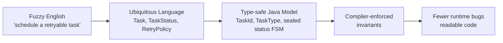
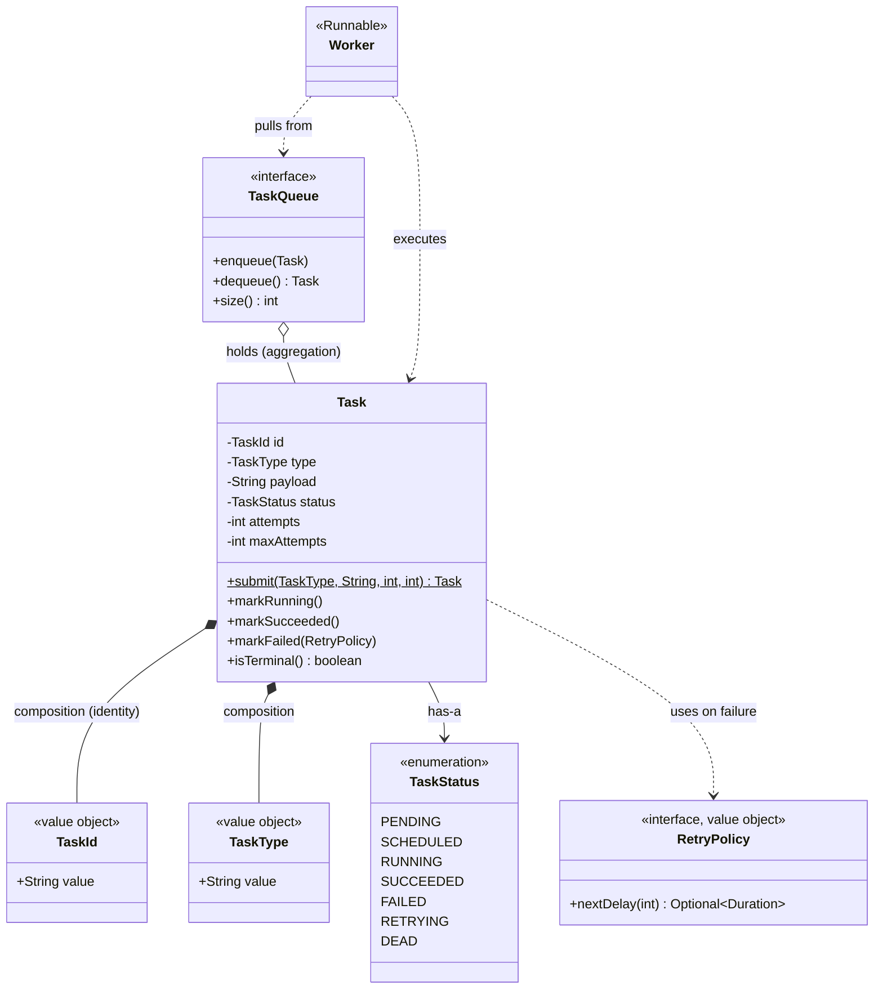

# Domain Modeling

> Where this fits in the project: before we write a single line of the worker pool or the REST API, we decide *what the words mean*. `Task`, `TaskId`, `TaskType`, `TaskStatus`, `RetryPolicy` — these are the nouns our whole platform is built from. Domain modeling is how we turn the fuzzy English description of "a distributed task queue" into precise, type-safe Java objects that the compiler can defend for us.

This chapter is the foundation for everything in [`04-oop-and-ood`](./cohesion.md). Once you can model a domain well, [aggregates](./aggregates.md), [layered architecture](./layered-architecture.md), and [hexagonal architecture](./hexagonal-architecture.md) become straightforward applications of the same discipline.

---

## 1. Why this exists — the real problem it solves

Every backend system has a hidden cost that does not show up in benchmarks: the cost of *misunderstanding*. A product manager says "schedule a task," a backend engineer hears "put a row in a table with a future timestamp," and a frontend engineer hears "show a calendar." Three months later, nobody can agree on what `status = 2` means, and a `String taskId` is silently being compared against a `String userId` because they are both just strings.

Domain modeling is the practice of building a shared, precise, *executable* vocabulary for a problem. It comes from **Domain-Driven Design (DDD)**, introduced by Eric Evans in 2003. We are doing **DDD-lite**: we steal the genuinely useful ideas — ubiquitous language, entities vs. value objects, state machines, avoiding primitive obsession, and bounded contexts — and skip the heavyweight ceremony that only pays off in large enterprise teams.

The payoff is concrete:

- **Fewer bugs the compiler can catch.** If `TaskId` and `TaskType` are distinct types, you literally cannot pass one where the other is expected.
- **Code that reads like the problem.** `task.transitionTo(RUNNING)` instead of `task.setStatus(2)`.
- **A model that survives refactoring.** When the spec changes from "in-memory queue" to "Postgres," the domain objects barely move; only the infrastructure around them does.

> **The core insight:** the most expensive defects are not logic errors — they are *modeling* errors, where the code allows states that should be impossible. Good domain modeling makes illegal states unrepresentable.



---

## 2. Ubiquitous language — naming is half the battle

The **ubiquitous language** is a single vocabulary shared by everyone — engineers, PMs, ops — and reflected *directly in the code*. There is no translation layer. If the team says "a task goes to the dead-letter queue after exhausting retries," then the code has a `DeadLetterQueue`, a `Task`, and the verb is `send`, not `archive` or `dispose`.

Our canonical domain model *is* our ubiquitous language. Here it is as a glossary:

| Term | Meaning in our domain | Java type |
|------|----------------------|-----------|
| Task | A unit of work submitted by a client | `Task` (entity) |
| TaskId | The stable identity of a task | `TaskId` (value object) |
| TaskType | The category that selects a handler, e.g. `email.send` | `TaskType` (value object) |
| TaskStatus | Where a task is in its lifecycle | `TaskStatus` (enum / sealed FSM) |
| Attempt | One execution try of a task | `int attempts` on `Task` |
| RetryPolicy | The *rule* for delays between attempts | `RetryPolicy` (value object) |
| Handler | The code that does the actual work for a `TaskType` | `TaskHandler` |
| Dead letter | A task that has permanently failed | `DEAD` status + `DeadLetterQueue` |

The discipline: **never invent a synonym in code that the team does not use out loud.** If two words mean the same thing ("job" and "task"), pick one and delete the other from the codebase. Drift between spoken language and code is where misunderstanding breeds.

---

## 3. The naive version — primitives and setters everywhere

Here is the first-cut `Task` most people write. It compiles, it runs, and it is a liability.

```java
// NAIVE: a bag of primitives with public setters. Avoid this.
public class Task {
    public String id;          // is this a UUID? a DB key? a type? who knows
    public String type;        // any string at all is "valid"
    public String payload;
    public int status;         // 0,1,2,3... magic numbers
    public int attempts;
    public int maxAttempts;
    public long createdAt;      // epoch millis, timezone-ambiguous
    public long scheduledAt;
    public int priority;

    // no constructor, no validation, no behavior
}
```

What is wrong with it:

- **Primitive obsession.** `id`, `type`, and `payload` are all `String`. The compiler will happily let you call `taskRepository.findById(task.type)` — a bug it cannot catch because everything is a `String`.
- **Magic numbers for status.** `status = 2` is meaningless. Worse, nothing stops `status = 99`, an impossible state.
- **No invariants.** You can construct a `Task` with `attempts = 5`, `maxAttempts = 3`, a `null` type, and a `createdAt` in the year 1970. Every field is independently mutable, so the object is never guaranteed to be in a consistent state.
- **No behavior.** The rule "a task can only go from `RUNNING` to `SUCCEEDED` or `FAILED`" lives nowhere — it is scattered across every service that touches a task, copied and pasted, and inevitably inconsistent.

This is an **anemic domain model**: data with no behavior, surrounded by procedural "service" code that manipulates it from the outside. It is the default failure mode of object-oriented code.

---

## 4. Improved version — value objects and an enum status

First, kill the primitives that have meaning. `id` and `type` are not strings — they are *identities* and *categories*. Make them value objects.

```java
// Improved: a value object for identity. Two TaskIds are equal iff their values match.
public record TaskId(String value) {
    public TaskId {
        if (value == null || value.isBlank()) {
            throw new IllegalArgumentException("TaskId must not be blank");
        }
    }
    public static TaskId newId() {
        return new TaskId(java.util.UUID.randomUUID().toString());
    }
    @Override public String toString() { return value; }
}
```

```java
// Improved: TaskType is a constrained category, not an arbitrary string.
public record TaskType(String value) {
    private static final java.util.regex.Pattern VALID =
        java.util.regex.Pattern.compile("[a-z][a-z0-9]*(\\.[a-z0-9]+)*"); // e.g. email.send

    public TaskType {
        if (value == null || !VALID.matcher(value).matches()) {
            throw new IllegalArgumentException("Invalid TaskType: " + value);
        }
    }
    @Override public String toString() { return value; }
}
```

Then replace the magic-number status with an enum so the set of states is closed and named:

```java
public enum TaskStatus {
    PENDING, SCHEDULED, RUNNING, SUCCEEDED, FAILED, RETRYING, DEAD
}
```

Now `Task` reads better and a whole class of mix-up bugs is gone — you cannot pass a `TaskType` where a `TaskId` is expected. But we are not done: the *rules of the lifecycle* still live nowhere, and `Task` is still mutable everywhere. That is what the production version fixes.

---

## 5. Production-quality version — entity with an invariant-protecting state machine

A staff engineer ships a `Task` that (a) is an **entity** identified by `TaskId`, (b) protects its invariants, and (c) encodes its **lifecycle as a state machine** so illegal transitions throw instead of silently corrupting state.

First, the canonical model exactly as the spec defines it, plus the supporting value objects and the retry-policy value object.

```java
import java.time.Instant;
import java.util.Optional;

// Value object: equal by value, immutable, no identity of its own.
public record TaskResult(boolean success, String message, boolean retryable) {
    public static TaskResult ok()                 { return new TaskResult(true, "ok", false); }
    public static TaskResult fail(String why)      { return new TaskResult(false, why, true); }
    public static TaskResult permanentFail(String why) { return new TaskResult(false, why, false); }
}

// Functional interface from the canonical model.
@FunctionalInterface
public interface TaskHandler {
    TaskResult handle(Task task) throws Exception;
}

// RetryPolicy CONFIG is a value object — it is a rule, it has no identity.
public sealed interface RetryPolicy permits FixedDelayRetryPolicy, ExponentialBackoffRetryPolicy {
    Optional<java.time.Duration> nextDelay(int attempt);
}
```

The status field becomes a small **state machine**. We keep `TaskStatus` as the enum the rest of the codebase already uses, but we centralize the legal transitions in one place so the rule exists exactly once.

```java
import java.util.EnumSet;
import java.util.Map;
import static java.util.Map.entry;

/** The single source of truth for which TaskStatus transitions are legal. */
public final class TaskLifecycle {
    private static final Map<TaskStatus, EnumSet<TaskStatus>> ALLOWED = Map.ofEntries(
        entry(TaskStatus.PENDING,   EnumSet.of(TaskStatus.SCHEDULED, TaskStatus.RUNNING)),
        entry(TaskStatus.SCHEDULED, EnumSet.of(TaskStatus.RUNNING)),
        entry(TaskStatus.RUNNING,   EnumSet.of(TaskStatus.SUCCEEDED, TaskStatus.FAILED, TaskStatus.RETRYING)),
        entry(TaskStatus.RETRYING,  EnumSet.of(TaskStatus.SCHEDULED, TaskStatus.RUNNING, TaskStatus.DEAD)),
        entry(TaskStatus.FAILED,    EnumSet.of(TaskStatus.RETRYING, TaskStatus.DEAD)),
        entry(TaskStatus.SUCCEEDED, EnumSet.noneOf(TaskStatus.class)), // terminal
        entry(TaskStatus.DEAD,      EnumSet.noneOf(TaskStatus.class))  // terminal
    );

    private TaskLifecycle() {}

    public static boolean canTransition(TaskStatus from, TaskStatus to) {
        return ALLOWED.getOrDefault(from, EnumSet.noneOf(TaskStatus.class)).contains(to);
    }

    public static boolean isTerminal(TaskStatus s) {
        return ALLOWED.getOrDefault(s, EnumSet.noneOf(TaskStatus.class)).isEmpty();
    }
}
```

Now the `Task` entity. It owns its identity, validates its invariants on construction, and exposes *intent-revealing behavior* — `markRunning()`, `markSucceeded()`, `markFailed()` — instead of a raw `setStatus`. Each behavior consults `TaskLifecycle` and refuses illegal moves.

```java
import java.time.Instant;
import java.util.Objects;

public final class Task {
    private final TaskId id;            // identity — never changes
    private final TaskType type;
    private final String payload;       // opaque JSON string, validated at the API edge
    private TaskStatus status;
    private int attempts;
    private final int maxAttempts;
    private final Instant createdAt;
    private Instant scheduledAt;
    private final int priority;

    private Task(TaskId id, TaskType type, String payload, TaskStatus status,
                 int attempts, int maxAttempts, Instant createdAt, Instant scheduledAt, int priority) {
        this.id          = Objects.requireNonNull(id, "id");
        this.type        = Objects.requireNonNull(type, "type");
        this.payload     = Objects.requireNonNull(payload, "payload");
        this.status      = Objects.requireNonNull(status, "status");
        this.createdAt   = Objects.requireNonNull(createdAt, "createdAt");
        this.scheduledAt = Objects.requireNonNull(scheduledAt, "scheduledAt");
        if (maxAttempts < 1)          throw new IllegalArgumentException("maxAttempts must be >= 1");
        if (attempts < 0)             throw new IllegalArgumentException("attempts must be >= 0");
        if (attempts > maxAttempts)   throw new IllegalArgumentException("attempts cannot exceed maxAttempts");
        this.attempts    = attempts;
        this.maxAttempts = maxAttempts;
        this.priority    = priority;
    }

    /** Factory for a freshly submitted task. Enforces sensible defaults in one place. */
    public static Task submit(TaskType type, String payload, int maxAttempts, int priority) {
        Instant now = Instant.now();
        return new Task(TaskId.newId(), type, payload, TaskStatus.PENDING,
                        0, maxAttempts, now, now, priority);
    }

    /** Rehydration factory used by the repository when loading from storage. */
    public static Task rehydrate(TaskId id, TaskType type, String payload, TaskStatus status,
                                 int attempts, int maxAttempts, Instant createdAt,
                                 Instant scheduledAt, int priority) {
        return new Task(id, type, payload, status, attempts, maxAttempts,
                        createdAt, scheduledAt, priority);
    }

    // --- behavior: every transition goes through the state machine ---

    private void transitionTo(TaskStatus next) {
        if (!TaskLifecycle.canTransition(this.status, next)) {
            throw new IllegalStateException(
                "Illegal transition for task %s: %s -> %s".formatted(id, status, next));
        }
        this.status = next;
    }

    public void markRunning() {
        transitionTo(TaskStatus.RUNNING);
        this.attempts++;            // an attempt is counted when we actually start running
    }

    public void markSucceeded() { transitionTo(TaskStatus.SUCCEEDED); }

    /** A failure that may or may not be retryable; the policy decides the next move. */
    public void markFailed(RetryPolicy policy) {
        transitionTo(TaskStatus.FAILED);
        if (attempts >= maxAttempts) {
            transitionTo(TaskStatus.DEAD);
            return;
        }
        transitionTo(TaskStatus.RETRYING);
        policy.nextDelay(attempts).ifPresentOrElse(
            delay -> {
                this.scheduledAt = Instant.now().plus(delay);
                transitionTo(TaskStatus.SCHEDULED);
            },
            () -> transitionTo(TaskStatus.DEAD)
        );
    }

    public boolean isDue(Instant now)  { return !scheduledAt.isAfter(now); }
    public boolean isTerminal()        { return TaskLifecycle.isTerminal(status); }

    // --- accessors (no public setters!) ---
    public TaskId id()           { return id; }
    public TaskType type()       { return type; }
    public String payload()      { return payload; }
    public TaskStatus status()   { return status; }
    public int attempts()        { return attempts; }
    public int maxAttempts()     { return maxAttempts; }
    public Instant createdAt()   { return createdAt; }
    public Instant scheduledAt() { return scheduledAt; }
    public int priority()        { return priority; }

    // --- entity equality: identity ONLY, never the mutable fields ---
    @Override public boolean equals(Object o) {
        return o instanceof Task other && id.equals(other.id);
    }
    @Override public int hashCode() { return id.hashCode(); }
    @Override public String toString() {
        return "Task[%s type=%s status=%s attempt=%d/%d]"
            .formatted(id, type, status, attempts, maxAttempts);
    }
}
```

Why this is the version to ship:

- **Identity is explicit and immutable.** `id` is `final`; `equals`/`hashCode` use *only* identity. This is the defining trait of an entity.
- **Illegal states are unrepresentable.** You cannot move from `SUCCEEDED` to `RUNNING`; the state machine throws.
- **Invariants are enforced once, at the boundary** (the constructor), so every `Task` in memory is valid by construction.
- **Behavior lives with data.** The retry/dead-letter rule is in `markFailed`, not smeared across three services.

---

## 6. Code walkthrough — beginner, intermediate, production

### 6.1 Beginner: entity vs. value object equality

The single most important distinction in domain modeling. **Entities are equal by identity; value objects are equal by value.**

```java
import java.util.UUID;

public class EqualityDemo {
    public static void main(String[] args) {
        // Value object: two TaskTypes with the same string ARE the same type.
        TaskType a = new TaskType("email.send");
        TaskType b = new TaskType("email.send");
        System.out.println("value objects equal? " + a.equals(b)); // true

        // Entity: two distinct tasks are NEVER equal, even with identical fields,
        // because they have different identities.
        Task t1 = Task.submit(a, "{}", 3, 0);
        Task t2 = Task.submit(a, "{}", 3, 0);
        System.out.println("different entities equal? " + t1.equals(t2)); // false

        // The SAME entity is equal to itself even after it mutates.
        Task t3 = t1;
        t1.markRunning();                 // status changed, identity did not
        System.out.println("same entity after mutation? " + t1.equals(t3)); // true
    }
}
```

The lesson: if you find yourself comparing two `Task` objects field-by-field, you are almost certainly confusing an entity for a value object. Identity is what makes `t1` "the same task" before and after it runs.

### 6.2 Intermediate: driving the state machine

Here we walk a task through its real lifecycle, with a retry policy deciding the path.

```java
import java.time.Duration;
import java.util.Optional;

public final class FixedDelayRetryPolicy implements RetryPolicy {
    private final Duration delay;
    private final int maxRetries;
    public FixedDelayRetryPolicy(Duration delay, int maxRetries) {
        this.delay = delay; this.maxRetries = maxRetries;
    }
    @Override public Optional<Duration> nextDelay(int attempt) {
        return attempt <= maxRetries ? Optional.of(delay) : Optional.empty();
    }
}

class LifecycleDemo {
    public static void main(String[] args) {
        RetryPolicy policy = new FixedDelayRetryPolicy(Duration.ofSeconds(5), 2);
        Task task = Task.submit(new TaskType("email.send"), "{\"to\":\"a@b.com\"}", 3, 0);

        System.out.println(task.status());          // PENDING
        task.markRunning();                          // PENDING -> RUNNING, attempts=1
        task.markFailed(policy);                     // -> RETRYING -> SCHEDULED (delay 5s)
        System.out.println(task.status());           // SCHEDULED
        System.out.println("due now? " + task.isDue(java.time.Instant.now())); // false

        task.markRunning();                          // SCHEDULED -> RUNNING, attempts=2
        task.markSucceeded();                        // RUNNING -> SUCCEEDED
        System.out.println(task.status());           // SUCCEEDED
        System.out.println("terminal? " + task.isTerminal()); // true

        // Attempting an illegal transition is rejected, loudly.
        try {
            task.markRunning();                      // SUCCEEDED -> RUNNING is illegal
        } catch (IllegalStateException e) {
            System.out.println("rejected: " + e.getMessage());
        }
    }
}
```

### 6.3 Production-inspired: the value object that ships with jitter

`ExponentialBackoffRetryPolicy` is the other half of the canonical `RetryPolicy`. It is a *value object* — pure configuration, no identity, fully immutable, safely shareable across all workers and threads.

```java
import java.time.Duration;
import java.util.Optional;
import java.util.concurrent.ThreadLocalRandom;

public final class ExponentialBackoffRetryPolicy implements RetryPolicy {
    private final Duration base;
    private final Duration cap;
    private final int maxRetries;
    private final double jitterFactor;   // 0.0 = none, 0.5 = +/-50%

    public ExponentialBackoffRetryPolicy(Duration base, Duration cap, int maxRetries, double jitterFactor) {
        if (base.isNegative() || base.isZero()) throw new IllegalArgumentException("base must be > 0");
        if (cap.compareTo(base) < 0)            throw new IllegalArgumentException("cap must be >= base");
        if (jitterFactor < 0 || jitterFactor > 1) throw new IllegalArgumentException("jitter in [0,1]");
        this.base = base; this.cap = cap; this.maxRetries = maxRetries; this.jitterFactor = jitterFactor;
    }

    @Override
    public Optional<Duration> nextDelay(int attempt) {
        if (attempt > maxRetries) return Optional.empty();   // exhausted -> caller sends to DLQ
        long baseMs = base.toMillis();
        long capMs  = cap.toMillis();
        // exponential growth, capped: base * 2^(attempt-1), clamped to cap
        long expMs  = Math.min(capMs, baseMs * (1L << Math.min(attempt - 1, 30)));
        // full jitter: spread retries so a thundering herd does not retry in lockstep
        long jitterRange = (long) (expMs * jitterFactor);
        long delayMs = jitterRange == 0 ? expMs
            : expMs - jitterRange + ThreadLocalRandom.current().nextLong(2 * jitterRange + 1);
        return Optional.of(Duration.ofMillis(Math.max(0, delayMs)));
    }
}
```

Notice the properties that make this a *good* value object: it is `final`, all fields are `final`, it validates on construction, it has no setters, and it is referentially transparent except for the deliberate randomness (which is the whole point of jitter). Two `ExponentialBackoffRetryPolicy` objects with the same config are interchangeable — exactly what we want from a value object. See [`08-distributed-systems/retries.md`](../08-distributed-systems/retries.md) for the distributed-systems rationale behind jitter and backoff.

---

## 7. How this applies to our Task Queue project

The whole platform is built on the model we just defined. Here is the structural picture as a UML class diagram.



Concrete mapping to canonical classes:

- **`Task` is the central entity.** Its identity (`TaskId`) is what `TaskRepository.findById` keys on, what the DLQ references, and what shows up in logs and metrics. It carries behavior, not just data.
- **`TaskId` and `TaskType` are value objects** that prevent the most common cross-wiring bug: passing a type where an id belongs.
- **`TaskStatus` plus `TaskLifecycle` form the state machine** that the `Worker` relies on. When a `Worker` pulls a task from the `TaskQueue`, it calls `markRunning()` / `markSucceeded()` / `markFailed(policy)`; the worker never sets status directly, so the lifecycle rule lives in exactly one place. The dedicated [state pattern](../05-design-patterns/state.md) chapter shows how to push this further when transitions grow complex.
- **`RetryPolicy` (and its `TaskResult`) are value objects** — shareable, immutable config injected into the `Worker` (see [dependency injection](./dependency-injection.md)).
- **The `TaskQueue` aggregates `Task` entities** but does not own their lifecycle; it just holds references (see [aggregation](../02-core-oop/chapter-15-aggregation.md) vs [composition](../02-core-oop/chapter-16-composition.md)).

This model also defines a **bounded context**: the "task processing" context. The `payload` is deliberately an opaque `String` — its internal structure belongs to *other* contexts (email, billing, etc.). We do not model it here. That boundary is what keeps our domain small and stable.

---

## 8. Tradeoffs — honest engineering tradeoffs

Rich domain models are not free. Here is where they pay off and where they cost.

| Dimension | Anemic model (primitives + services) | Rich domain model (this chapter) |
|-----------|--------------------------------------|----------------------------------|
| Initial code volume | Lower — just fields | Higher — value objects, factories, FSM |
| Compiler-caught bugs | Few; everything is `String`/`int` | Many; type system enforces invariants |
| Where rules live | Scattered across services | Centralized in the entity |
| Onboarding readability | Reads like CRUD | Reads like the problem domain |
| ORM / serialization friction | Trivial | Needs mapping (records ↔ DB rows) |
| Refactoring safety | Low; rules drift | High; one place to change |
| Risk of over-modeling | n/a | Real — can gold-plate trivial domains |

Key honest points:

- **Value objects add ceremony.** A `TaskId` record is more code than a `String`. Worth it for domain-significant identities and categories; *not* worth it for a throwaway internal flag.
- **State machines add indirection.** For a 2-state lifecycle, an `if` is fine. Our 7-state lifecycle with retries genuinely earns a centralized FSM.
- **DDD-lite, not full DDD.** We skip repositories-per-aggregate ceremony, domain events for everything, and elaborate factories. We keep ubiquitous language, entities/value objects, and invariant enforcement — the parts that earn their keep at our scale.
- **Mutability is a deliberate choice for `Task`.** A fully immutable `Task` (returning a new instance on every transition) is cleaner functionally but adds churn in a hot worker loop. We chose a controlled-mutation entity. We revisit the immutable alternative in [`03-java-memory-model/immutable-objects.md`](../03-java-memory-model/immutable-objects.md).

---

## 9. Common mistakes and pitfalls

- **Primitive obsession.** Using `String` for `id`, `type`, and `payload` alike. *Fix:* wrap domain-significant primitives in value objects (`TaskId`, `TaskType`).
- **Anemic entities.** A `Task` with only getters/setters and all logic in a `TaskService`. *Fix:* move behavior (`markFailed`) onto the entity that owns the data.
- **Equality by all fields on an entity.** Overriding `equals` to compare every field of `Task`. *Fix:* entities compare by identity only.
- **Mutable value objects.** A `RetryPolicy` with setters. *Fix:* make value objects `final` with `final` fields; use records.
- **Status as a free `int` or `String`.** Allows impossible values and silent transitions. *Fix:* enum plus a central transition table.
- **Letting infrastructure leak into the domain.** A `@Entity` JPA annotation or a `ResultSet` reference on `Task`. *Fix:* keep the domain model framework-free; map at the repository boundary (this is the heart of [hexagonal architecture](./hexagonal-architecture.md)).
- **Synonym drift.** Code says `Job`, the team says `Task`. *Fix:* pick one term, refactor mercilessly.
- **Timezone-ambiguous time.** Using `long` epoch millis or `LocalDateTime`. *Fix:* use `Instant` (UTC, unambiguous) as the canonical model specifies.

---

## 10. Refactoring exercise — bad → improved → production

**Step 0 — the bad code.** A handler-side helper that "fails" a task by poking primitives directly.

```java
// BAD: business rule smeared into a utility, mutating public fields, magic numbers.
class TaskUtil {
    static void fail(Task task) {          // Task here = the naive public-fields version
        task.status = 4;                    // 4 == "FAILED"? who knows
        task.attempts = task.attempts + 1;
        if (task.attempts > task.maxAttempts) {
            task.status = 6;                // 6 == "DEAD"?
        } else {
            task.status = 5;                // 5 == "RETRYING"
            task.scheduledAt = System.currentTimeMillis() + 5000; // fixed 5s, no policy
        }
    }
}
```

Problems: magic numbers, no state-machine validation, the retry rule is hard-coded, and the same logic is surely duplicated in three other places.

**Step 1 — improved.** Pull the rule into the entity and use the enum.

```java
// IMPROVED: behavior on the entity, enum status, but retry delay still hard-coded.
public void fail() {
    this.status = TaskStatus.FAILED;
    this.attempts++;
    if (attempts > maxAttempts) {
        this.status = TaskStatus.DEAD;
    } else {
        this.status = TaskStatus.RETRYING;
        this.scheduledAt = Instant.now().plusSeconds(5);
        this.status = TaskStatus.SCHEDULED;
    }
}
```

Better — but it still bypasses the lifecycle (no `canTransition` check) and bakes in a fixed 5-second delay instead of taking a policy.

**Step 2 — production.** This is exactly the `markFailed(RetryPolicy)` from §5: every move goes through `transitionTo`, the delay comes from an injected `RetryPolicy` value object, and exhaustion routes to `DEAD`. Reproduced for the diff:

```java
public void markFailed(RetryPolicy policy) {
    transitionTo(TaskStatus.FAILED);
    if (attempts >= maxAttempts) {
        transitionTo(TaskStatus.DEAD);
        return;
    }
    transitionTo(TaskStatus.RETRYING);
    policy.nextDelay(attempts).ifPresentOrElse(
        delay -> {
            this.scheduledAt = Instant.now().plus(delay);
            transitionTo(TaskStatus.SCHEDULED);
        },
        () -> transitionTo(TaskStatus.DEAD)
    );
}
```

The progression: rule **out of a utility** → **onto the entity** → **validated by the state machine and parameterized by a value object.** That is domain modeling as a refactoring discipline.

---

## 11. Exercises

### Easy

1. **Knowledge check.** In one sentence each, explain why `Task` is an entity and why `TaskType` is a value object. What is the single test you apply to decide?
2. **Coding.** Write a value object `Priority` that wraps an `int` constrained to the range 0–9 (inclusive), throwing on out-of-range values, with a static `default_()` of 0. Make it a record.

### Medium

3. **Coding.** Add a `markCancelled()` capability. Introduce a `CANCELLED` terminal status, update `TaskLifecycle` so a task can be cancelled from `PENDING`, `SCHEDULED`, or `RETRYING` (but not from `RUNNING`, `SUCCEEDED`, or `DEAD`), and add the entity method.
4. **Refactoring.** You are handed a `TaskService` with a method `void updateStatus(Task t, int newStatus)` that sets `t.status` directly. Refactor it so callers express *intent* (e.g. `start`, `complete`) and the lifecycle is enforced. State what you removed.

### Hard

5. **Design.** Our `payload` is an opaque `String`. A teammate wants to make it a strongly-typed `EmailPayload` / `BillingPayload` sealed hierarchy so handlers get type safety. Argue both sides in terms of bounded contexts, then recommend a design that keeps the task-processing context decoupled from payload schemas.
6. **Interview-style.** Without using any boolean flags, design a representation of `TaskStatus` as a Java `sealed interface` hierarchy (instead of an enum) such that `SCHEDULED` *carries* its `scheduledAt`, `DEAD` *carries* its reason, and `SUCCEEDED` carries nothing. Explain the tradeoff vs. the enum.
7. **Stretch.** Make `Task` fully immutable: every transition returns a *new* `Task` rather than mutating. Keep identity stable across versions and add a `version` field that increments on each transition (the basis of optimistic locking). Discuss the GC/throughput impact for a worker processing 50k tasks/sec.

---

## 12. Solutions

**Solution 1 (knowledge check).** `Task` is an entity because it has a continuous identity (`TaskId`) that persists as its fields mutate — the *same* task is still that task before and after it runs. `TaskType` is a value object because it has no identity of its own; two `email.send` types are completely interchangeable. The test: *"If I change a field, is it still the same thing?"* If yes → entity (identity matters). If two instances with equal fields are interchangeable → value object.

**Solution 2 (`Priority`).**

```java
public record Priority(int value) {
    public Priority {
        if (value < 0 || value > 9) {
            throw new IllegalArgumentException("Priority must be in [0,9], got " + value);
        }
    }
    public static Priority default_() { return new Priority(0); }
    public boolean isHigherThan(Priority other) { return this.value > other.value; }
}
```

The compact constructor validates; the record gives us value equality, immutability, and `toString` for free. This is the antidote to passing a bare `int` everywhere.

**Solution 3 (`markCancelled`).**

```java
// In TaskStatus: add CANCELLED.
public enum TaskStatus {
    PENDING, SCHEDULED, RUNNING, SUCCEEDED, FAILED, RETRYING, DEAD, CANCELLED
}

// In TaskLifecycle.ALLOWED: permit cancellation from the three non-running, non-terminal states.
entry(TaskStatus.PENDING,   EnumSet.of(TaskStatus.SCHEDULED, TaskStatus.RUNNING, TaskStatus.CANCELLED)),
entry(TaskStatus.SCHEDULED, EnumSet.of(TaskStatus.RUNNING, TaskStatus.CANCELLED)),
entry(TaskStatus.RETRYING,  EnumSet.of(TaskStatus.SCHEDULED, TaskStatus.RUNNING, TaskStatus.DEAD, TaskStatus.CANCELLED)),
entry(TaskStatus.CANCELLED, EnumSet.noneOf(TaskStatus.class)), // terminal

// In Task:
public void markCancelled() { transitionTo(TaskStatus.CANCELLED); }
```

Because `RUNNING` does not list `CANCELLED`, calling `markCancelled()` on a running task throws `IllegalStateException` — exactly the safety we wanted. The rule lives in one table.

**Solution 4 (refactor `updateStatus`).** Replace the leaky `updateStatus(Task, int)` with intent methods that delegate to the entity:

```java
public final class TaskService {
    private final RetryPolicy retryPolicy;
    public TaskService(RetryPolicy retryPolicy) { this.retryPolicy = retryPolicy; }

    public void start(Task t)    { t.markRunning(); }
    public void complete(Task t) { t.markSucceeded(); }
    public void fail(Task t)     { t.markFailed(retryPolicy); }
}
```

What was removed: (a) the `int` status parameter (primitive obsession + no validation), (b) the ability for callers to set *any* status from *anywhere*, and (c) the implicit invitation to duplicate the transition logic. The lifecycle is now enforced inside `Task`.

**Solution 5 (typed payload — design).** *For strong typing:* handlers stop parsing raw JSON and get compile-time safety; bad payloads fail at the edge. *Against:* it couples the task-processing context to every payload schema, so adding a new task type forces a change to the core `Task` model — a violation of the bounded-context boundary that keeps the queue generic. **Recommendation:** keep `payload` as an opaque `String` *in the domain core*. Push typing to the *edges*: each `TaskHandler` owns a small typed parser for its own `TaskType`, e.g.

```java
public final class EmailHandler implements TaskHandler {
    private final ObjectMapper mapper;
    public EmailHandler(ObjectMapper mapper) { this.mapper = mapper; }
    @Override public TaskResult handle(Task task) throws Exception {
        EmailPayload p = mapper.readValue(task.payload(), EmailPayload.class); // typed HERE
        // ... send the email ...
        return TaskResult.ok();
    }
    record EmailPayload(String to, String subject, String body) {}
}
```

The queue stays schema-agnostic and infinitely extensible; type safety lives where the type is actually known. This is the bounded-context boundary doing its job.

**Solution 6 (sealed status with data).**

```java
import java.time.Instant;

public sealed interface TaskState
        permits Pending, Scheduled, Running, Succeeded, Failed, Retrying, Dead {
    record Pending()                         implements TaskState {}
    record Scheduled(Instant scheduledAt)    implements TaskState {}
    record Running(int attempt)              implements TaskState {}
    record Succeeded()                       implements TaskState {}
    record Failed(String reason)             implements TaskState {}
    record Retrying(int attempt)             implements TaskState {}
    record Dead(String reason)               implements TaskState {}
}

// Exhaustive switch — the compiler forces you to handle every case.
static String describe(TaskState s) {
    return switch (s) {
        case Pending p              -> "waiting to be picked up";
        case Scheduled sc           -> "scheduled for " + sc.scheduledAt();
        case Running r              -> "running, attempt " + r.attempt();
        case Succeeded ok           -> "done";
        case Failed f               -> "failed: " + f.reason();
        case Retrying rt            -> "will retry (attempt " + rt.attempt() + ")";
        case Dead d                 -> "dead: " + d.reason();
    };
}
```

Tradeoff vs. enum: the sealed hierarchy lets each state *carry exactly the data it needs* (`Scheduled` has a time, `Dead` has a reason, `Succeeded` has nothing) and gives exhaustive `switch` checking — illegal *data* combinations become unrepresentable. The cost: it is more code, it does not map as cleanly to a single DB column, and the rest of our codebase already speaks `TaskStatus` (the enum). Use the enum for the persisted status and consider the sealed model when state-specific data multiplies.

**Solution 7 (immutable `Task`, sketch).**

```java
public final class Task {
    private final TaskId id;          // stable across versions
    private final TaskStatus status;
    private final int attempts;
    private final long version;       // increments each transition
    // ... other final fields ...

    private Task withStatus(TaskStatus next, int attempts) {
        if (!TaskLifecycle.canTransition(this.status, next))
            throw new IllegalStateException(status + " -> " + next);
        return new Task(id, /*type*/..., next, attempts, /*...*/, version + 1);
    }
    public Task markRunning()   { return withStatus(TaskStatus.RUNNING, attempts + 1); }
    public Task markSucceeded() { return withStatus(TaskStatus.SUCCEEDED, attempts); }
}
```

Identity (`id`) is copied unchanged so `old.id().equals(new.id())` holds across versions; `version` increments to support optimistic locking (`UPDATE ... WHERE id=? AND version=?`). **Impact at 50k tasks/sec:** every transition allocates a new `Task`, so a 3-transition task produces ~150k short-lived objects/sec. Modern generational GC (G1/ZGC) handles short-lived garbage cheaply — these objects die in the young generation — but it does raise allocation pressure and can hurt tail latency under extreme load. The win is thread-safety (immutable objects need no locks, ideal for the worker pool) and a clean audit trail of versions. The mutable version trades that safety for lower allocation; the right call depends on contention vs. throughput. See [`03-java-memory-model/garbage-collection.md`](../03-java-memory-model/garbage-collection.md).

---

## 13. Interview questions and takeaways

1. **Q: What is the difference between an entity and a value object?**
   A: An entity has a distinct identity that persists through state changes and is compared by that identity. A value object has no identity, is immutable, and is compared by its attributes. `Task` is an entity (identified by `TaskId`); `TaskType` and `RetryPolicy` are value objects.

2. **Q: What is "primitive obsession" and why is it a smell?**
   A: Using language primitives (`String`, `int`) to represent domain concepts that deserve their own type. It is a smell because the compiler cannot distinguish a `TaskId` from a `TaskType` when both are `String`, validation gets duplicated, and behavior has no home. Fix: introduce small value objects.

3. **Q: What is the "ubiquitous language" and why does it matter in code?**
   A: A single shared vocabulary used identically by domain experts and in the code, eliminating translation between business speak and class names. It matters because most expensive bugs are misunderstandings; when the code literally says `task.markFailed`, there is no ambiguity to mistranslate.

4. **Q: How do you prevent illegal states in a domain model?**
   A: Make them unrepresentable. Enforce invariants in constructors so no invalid instance can exist, model lifecycles as state machines that reject illegal transitions, and use the type system (enums, sealed interfaces, value objects) so the compiler rejects bad combinations.

5. **Q: What is an anemic domain model and when is it acceptable?**
   A: A model that is pure data with no behavior, manipulated by external "service" classes. It is acceptable for thin CRUD layers and DTOs at system boundaries, but for a domain with real rules (like our retry/dead-letter lifecycle) it scatters logic and invites inconsistency.

6. **Q: How does domain modeling relate to bounded contexts?**
   A: A bounded context is a boundary within which a model and its language are consistent. Our task-processing context treats `payload` as opaque precisely so it does not couple to the email/billing contexts that own that payload's schema. Keeping the boundary small keeps the model stable.

7. **Q: Why use `Instant` instead of `long` epoch millis or `LocalDateTime`?**
   A: `Instant` is an unambiguous point on the UTC timeline. `long` millis is dimensionless and easy to mix up; `LocalDateTime` has no timezone and silently breaks across regions. The canonical model standardizes on `Instant`.

> **Takeaways:** Model the *nouns and rules*, not the database. Identity defines entities; value defines value objects. Make illegal states unrepresentable. Keep the domain framework-free. Use the ubiquitous language everywhere — out loud and in code.

---

## 14. Production considerations

- **Serialization vs. invariants.** Jackson and JPA love no-arg constructors and field access, which can bypass your validating constructor. *Mitigation:* deserialize into a DTO at the edge, then construct the domain `Task` via the validating factory (`Task.submit` / `Task.rehydrate`). Never let the wire format reach into the domain.
- **State-machine evolution.** Adding a status (we added `CANCELLED` in the exercises) is a migration: existing persisted rows have the old set, and old workers may not understand the new state. Roll out the *reader* of the new state before the *writer*. Keep `TaskLifecycle` versioned alongside DB migrations (Flyway — see [`10-system-design/data-modeling-and-storage.md`](../10-system-design/data-modeling-and-storage.md)).
- **Observability hooks.** Because transitions funnel through one method (`transitionTo`), it is the natural place to emit a metric (`tasks.transition{from,to}`) or a domain event for the [event bus](../08-distributed-systems/idempotency.md). A scattered `setStatus` would make this impossible.
- **Concurrency.** A mutable `Task` shared across worker threads needs external synchronization or, better, single-ownership (one worker owns a task while processing it). The immutable variant (Solution 7) sidesteps this. See [`06-concurrency/atomics-and-thread-safety.md`](../06-concurrency/atomics-and-thread-safety.md).
- **Clock injection.** `Instant.now()` inside the entity makes time-based logic hard to test and non-deterministic. In production code, inject a `java.time.Clock` so tests can freeze time and so retry scheduling is reproducible.
- **What breaks at scale.** Over-modeling: wrapping *every* primitive in a value object bloats the codebase and slows the team. Model what carries domain meaning and validation; leave genuinely incidental data as primitives.

---

## What We Can Improve In Our Project Using This Concept

- Replace the naive public-field `Task` (and any `String id` / `int status` usage) with the entity-plus-value-object model from §5.
- Introduce `TaskId` and `TaskType` value objects across the codebase, eliminating raw `String` identifiers in `TaskRepository`, `TaskQueue`, `Worker`, and the future `TaskController`.
- Centralize all status changes through `TaskLifecycle` so the `Worker` and retry handler can never produce an illegal state.
- Standardize timestamps on `Instant` and make `RetryPolicy` / `TaskResult` immutable value objects shareable across the worker pool.

## Project Refactoring Task

Refactor the Phase 1 domain so that: (1) `Task` is an entity with a private mutable state guarded by `transitionTo`; (2) `TaskId` and `TaskType` are records with validation; (3) `TaskStatus` transitions live solely in `TaskLifecycle`; (4) `Worker` calls `markRunning()` / `markSucceeded()` / `markFailed(policy)` and never touches `status` directly; (5) add a JUnit 5 + AssertJ test that asserts an illegal transition (`SUCCEEDED -> RUNNING`) throws `IllegalStateException` and that a normal failure path lands a task in `SCHEDULED` then `DEAD` once attempts are exhausted.

## Git Commit For This Chapter

```text
refactor(domain): model Task as entity with value objects and a lifecycle FSM

- introduce TaskId and TaskType value objects (records with validation)
- add TaskLifecycle as the single source of truth for status transitions
- move markRunning/markSucceeded/markFailed behavior onto the Task entity
- make RetryPolicy and TaskResult immutable value objects
- standardize timestamps on Instant; remove public setters from Task
- add lifecycle tests (illegal transition throws; exhaustion -> DEAD)

Files touched:
  src/main/java/.../domain/Task.java
  src/main/java/.../domain/TaskId.java
  src/main/java/.../domain/TaskType.java
  src/main/java/.../domain/TaskStatus.java
  src/main/java/.../domain/TaskLifecycle.java
  src/main/java/.../domain/RetryPolicy.java
  src/main/java/.../domain/TaskResult.java
  src/test/java/.../domain/TaskLifecycleTest.java
```

## Architecture Impact

This change establishes the domain core as a framework-free, invariant-protecting layer that every other layer depends on but that depends on nothing. It is the precondition for [layered](./layered-architecture.md) and [hexagonal](./hexagonal-architecture.md) architecture: the `TaskQueue`, `TaskRepository`, and `TaskController` all become adapters around a stable domain. State transitions now have a single choke point, enabling consistent metrics, events, and audit logging across all four project phases without touching call sites.

## Interview Takeaways

- Identity defines entities; value defines value objects — know the one-line test ("change a field; still the same thing?").
- Primitive obsession is the most common modeling smell; small value objects are the fix.
- Make illegal states unrepresentable via constructors, enums/sealed types, and state machines.
- Keep the domain model free of frameworks; map at the boundaries.
- Ubiquitous language means the code and the conversation use the same words — no translation layer.
