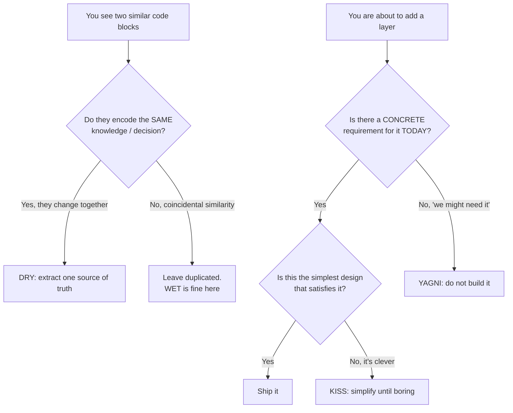
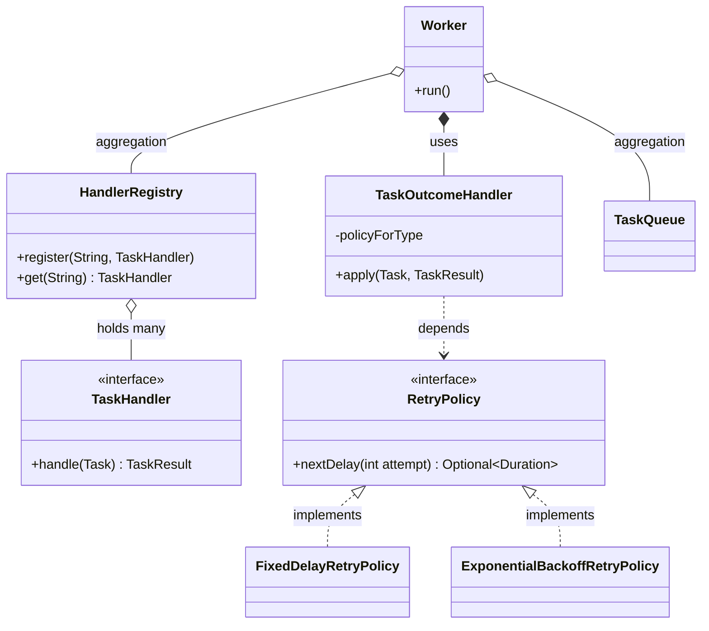

# DRY, KISS, YAGNI

> Where this fits: these three heuristics govern *how much structure* you put into the Task Queue. They are the brakes on the same engine that [SOLID](solid.md), [cohesion](cohesion.md), and [coupling](coupling.md) accelerate. SOLID tells you how to factor an abstraction well; DRY/KISS/YAGNI tell you *whether to create it at all*. Getting this balance wrong is how a 200-line in-memory queue becomes an unshippable "distributed framework" that processes zero tasks.

---

## 1. Why this exists — the real problem

Every senior engineer has watched a codebase die in one of two opposite ways:

1. **Death by duplication.** The same retry logic is copy-pasted into eleven handlers. A bug fix has to land in eleven places; it lands in nine. Two of the eleven silently keep the old behavior. This is the disease **DRY** (Don't Repeat Yourself) was invented to treat.

2. **Death by abstraction.** Someone "future-proofed" the queue with a `QueueBrokerStrategyFactoryProvider`, three layers of interfaces, and a plugin SPI — to support Kafka, Redis, and RabbitMQ that *nobody has asked for yet*. Now adding a single field to `Task` means touching nine files. This is the disease **KISS** (Keep It Simple, Stupid) and **YAGNI** (You Aren't Gonna Need It) were invented to treat.

The trap is that **the cure for one disease, over-applied, causes the other.** Aggressive DRY produces premature abstraction. Aggressive simplicity produces duplication. These three principles are not independent rules you apply in isolation — they are a *tension* you hold.

| Principle | Coined / popularized by | The fear it addresses |
|---|---|---|
| DRY | Hunt & Thomas, *The Pragmatic Programmer* (1999) | Knowledge duplicated → inconsistent edits |
| KISS | U.S. Navy design ethos (1960s), popularized in software later | Cleverness → unmaintainable code |
| YAGNI | Extreme Programming / Kent Beck (late 1990s) | Speculative generality → wasted effort + lock-in |

> **The precise definition of DRY that everyone forgets.** Hunt & Thomas wrote: *"Every piece of **knowledge** must have a single, unambiguous, authoritative representation within a system."* DRY is about **knowledge**, not **characters**. Two code blocks that look identical but encode *different decisions that can change independently* are **not** a DRY violation. Deduplicating them is the single most common way to create the wrong abstraction.

---

## 2. The three principles, sharply stated



- **DRY** — *Single source of truth for each piece of knowledge.* Applies to logic, configuration, schemas, magic numbers, and docs. Violation cost = drift. Over-application cost = coupling.
- **KISS** — *Prefer the boring, obvious solution.* Clever code optimizes for the moment of writing; simple code optimizes for the next reader (usually you, at 2 a.m., during an incident). Violation cost = nobody can safely change it.
- **YAGNI** — *Don't build for imagined futures.* Build for the requirement in front of you; add the extension point *when the second use case actually arrives*. Violation cost = you maintain (and get locked into) abstractions for use cases that never materialize, and they're usually wrong because you guessed the shape.

The Rule of Three is the practical reconciliation: **the first time you write something, just write it. The second time you see it duplicated, wince but tolerate it. The third time, refactor.** By the third occurrence you finally have enough evidence to know what the *real* abstraction is.

---

## 3. The naive version — duplication everywhere (a DRY violation)

Here is a first-cut worker outcome handler, copied into three task handlers. We use the canonical model: `Task`, `TaskStatus`, `TaskResult`, `RetryPolicy`.

```java
// EmailTaskHandler.java — first cut
public final class EmailTaskHandler implements TaskHandler {
    @Override
    public TaskResult handle(Task task) throws Exception {
        // ... send the email ...
        return new TaskResult(true, "sent", false);
    }

    // Outcome handling copy-pasted here:
    public void onResult(Task task, TaskResult result, TaskQueue queue, DeadLetterQueue dlq) {
        if (result.success()) {
            task = task.withStatus(TaskStatus.SUCCEEDED);
        } else if (result.retryable() && task.attempts() < task.maxAttempts()) {
            long delayMs = (long) Math.pow(2, task.attempts()) * 1000; // backoff
            task = task.withStatus(TaskStatus.RETRYING);
            // schedule re-enqueue after delayMs ...
            queue.enqueue(task);
        } else {
            task = task.withStatus(TaskStatus.DEAD);
            dlq.send(task, result.message());
        }
    }
}
```

The **exact same `onResult` block** is pasted into `ReportTaskHandler` and `WebhookTaskHandler`. Limitations:

- **Drift.** When we switch from `2^n` backoff to exponential-with-jitter, we must edit three files. Someone will miss one.
- **Inconsistent behavior.** `WebhookTaskHandler`'s copy got a typo: `task.attempts() <= task.maxAttempts()`, so webhooks retry one extra time. Nobody notices for months.
- **The magic number `1000`** and the `2^n` formula are duplicated knowledge — the *retry policy* is a single decision smeared across the codebase.

This is a genuine DRY violation: *all three copies must change together because they encode one decision* ("how do we react to a task outcome"). That is the litmus test.

---

## 4. Improved version — extract the single source of truth

Pull the outcome logic out of the handlers entirely. The handler should only know how to *do the work*; reacting to the result is the worker's job. And the backoff formula belongs to a `RetryPolicy`, not inline math.

```java
// ExponentialBackoffRetryPolicy.java — the ONE place backoff lives
public final class ExponentialBackoffRetryPolicy implements RetryPolicy {
    private final Duration base;
    private final int maxAttempts;
    private final RandomGenerator rng;

    public ExponentialBackoffRetryPolicy(Duration base, int maxAttempts, RandomGenerator rng) {
        this.base = base;
        this.maxAttempts = maxAttempts;
        this.rng = rng;
    }

    @Override
    public Optional<Duration> nextDelay(int attempt) {
        if (attempt >= maxAttempts) return Optional.empty();
        long raw = base.toMillis() * (1L << attempt);          // 2^attempt
        long jittered = raw / 2 + (long) (rng.nextDouble() * (raw / 2)); // 50%..100%
        return Optional.of(Duration.ofMillis(jittered));
    }
}
```

```java
// TaskOutcomeHandler.java — single source of truth for reacting to a result
public final class TaskOutcomeHandler {
    private final RetryPolicy retryPolicy;
    private final TaskScheduler scheduler;
    private final DeadLetterQueue dlq;
    private final TaskRepository repository;

    public TaskOutcomeHandler(RetryPolicy retryPolicy, TaskScheduler scheduler,
                              DeadLetterQueue dlq, TaskRepository repository) {
        this.retryPolicy = retryPolicy;
        this.scheduler = scheduler;
        this.dlq = dlq;
        this.repository = repository;
    }

    public void apply(Task task, TaskResult result) {
        if (result.success()) {
            repository.save(task.withStatus(TaskStatus.SUCCEEDED));
            return;
        }
        Optional<Duration> delay = result.retryable()
                ? retryPolicy.nextDelay(task.attempts())
                : Optional.empty();

        if (delay.isPresent()) {
            Task retrying = task.withStatus(TaskStatus.RETRYING).incrementAttempts();
            repository.save(retrying);
            scheduler.schedule(retrying, delay.get());
        } else {
            Task dead = task.withStatus(TaskStatus.DEAD);
            repository.save(dead);
            dlq.send(dead, result.message());
        }
    }
}
```

Now the three handlers shrink to *only* their real job:

```java
public final class EmailTaskHandler implements TaskHandler {
    @Override
    public TaskResult handle(Task task) throws Exception {
        // send the email; return outcome. No outcome routing here.
        return new TaskResult(true, "sent", false);
    }
}
```

One change point for backoff, one for outcome routing. This is DRY done **right**: we deduplicated *knowledge*, and the abstraction (`RetryPolicy`, `TaskOutcomeHandler`) maps to a real, single decision.

---

## 5. Production-quality version — DRY without over-coupling

The improved version is good. The *production* version is mostly about **knowing where to stop**. A staff engineer adds three things and consciously *refuses* to add four others.

What we add (justified by real requirements):

- `RetryPolicy` is injected, so a queue-overloaded service can swap exponential backoff for a `FixedDelayRetryPolicy` via configuration. This is a real, present need (different task types want different policies).
- Per-task-type policy lookup, because "payment" tasks and "email" tasks genuinely have different SLAs *today*.
- Metrics, because we already run Prometheus and we want retry/DLQ counters now.

```java
// TaskOutcomeHandler.java — production
public final class TaskOutcomeHandler {
    private final Function<String, RetryPolicy> policyForType; // by task.type()
    private final TaskScheduler scheduler;
    private final DeadLetterQueue dlq;
    private final TaskRepository repository;
    private final MeterRegistry metrics;

    public TaskOutcomeHandler(Function<String, RetryPolicy> policyForType,
                              TaskScheduler scheduler, DeadLetterQueue dlq,
                              TaskRepository repository, MeterRegistry metrics) {
        this.policyForType = policyForType;
        this.scheduler = scheduler;
        this.dlq = dlq;
        this.repository = repository;
        this.metrics = metrics;
    }

    public void apply(Task task, TaskResult result) {
        if (result.success()) {
            repository.save(task.withStatus(TaskStatus.SUCCEEDED));
            metrics.counter("tasks.succeeded", "type", task.type()).increment();
            return;
        }
        Optional<Duration> delay = result.retryable()
                ? policyForType.apply(task.type()).nextDelay(task.attempts())
                : Optional.empty();

        if (delay.isPresent()) {
            Task retrying = task.withStatus(TaskStatus.RETRYING).incrementAttempts();
            repository.save(retrying);
            scheduler.schedule(retrying, delay.get());
            metrics.counter("tasks.retried", "type", task.type()).increment();
        } else {
            Task dead = task.withStatus(TaskStatus.DEAD);
            repository.save(dead);
            dlq.send(dead, result.message());
            metrics.counter("tasks.dead", "type", task.type()).increment();
        }
    }
}
```

What we **deliberately do not add** (YAGNI):

- No `OutcomeHandlerFactory`, no `OutcomeStrategy` interface with one implementation. There is exactly one outcome algorithm. A `Function<String, RetryPolicy>` is the *entire* extension surface we need; we did not wrap it in a `RetryPolicyResolver` interface + `DefaultRetryPolicyResolverImpl`.
- No pluggable "outcome pipeline" with before/after interceptors. Nobody asked for it.
- No generic event-sourcing of every state transition. Phase 4 introduces an `EventBus`; *until then*, plain counters are enough.

> **The rule that ties it together:** add abstraction *in response to a second concrete consumer*, not in anticipation of one. `RetryPolicy` is an interface because we have **two real implementations today** (`FixedDelayRetryPolicy`, `ExponentialBackoffRetryPolicy`). `OutcomeStrategy` is **not** an interface because we have one.

---

## 6. Code walkthrough — beginner → intermediate → production

### Beginner: a DRY fix for a magic number

```java
// BAD: the same "max attempts" knowledge in three places
if (task.attempts() < 5) { /* retry */ }     // worker
if (rows.getInt("attempts") < 5) { /* ... */ } // repository SQL guard
button.setEnabled(task.attempts() < 5);        // admin UI

// GOOD: one constant, one meaning
public final class TaskPolicy {
    public static final int DEFAULT_MAX_ATTEMPTS = 5;
    private TaskPolicy() {}
}
```

But note KISS: don't over-DRY this into `ConfigurationConstantsRegistry.get("task.maxAttempts")` reflection lookups. A `public static final int` is the simplest thing that works. If `maxAttempts` later varies per task, it already lives on `Task` (it's a field in the canonical model) — so the *real* fix is `task.maxAttempts()`, not a global constant at all.

### Intermediate: KISS over cleverness

A "clever" task dispatcher that maps types to handlers via reflection and annotations:

```java
// CLEVER (avoid): scans the classpath, reads @HandlesType, builds the map reflectively
@HandlesType("email")
public final class EmailTaskHandler implements TaskHandler { /* ... */ }

// somewhere: ClasspathScanner.scan().filter(@HandlesType).collect(toMap(...))
```

The simple version a maintainer can read in five seconds:

```java
// SIMPLE (prefer): an explicit, boring registry
public final class HandlerRegistry {
    private final Map<String, TaskHandler> handlers = new ConcurrentHashMap<>();

    public void register(String type, TaskHandler handler) {
        handlers.put(type, handler);
    }

    public TaskHandler get(String type) {
        TaskHandler h = handlers.get(type);
        if (h == null) throw new IllegalArgumentException("No handler for type: " + type);
        return h;
    }
}
```

```java
// Wiring is explicit — you can grep for who handles "email":
var registry = new HandlerRegistry();
registry.register("email", new EmailTaskHandler());
registry.register("report", new ReportTaskHandler());
registry.register("webhook", new WebhookTaskHandler());
```

Reflection scanning saves you three lines of registration and costs you: startup-time classpath scanning, "where is this handler registered?" being un-greppable, broken native images / GraalVM, and obscure failures when an annotation is misspelled. KISS wins. (Spring's `@Component` scanning earns its complexity at framework scale; *your* 3-handler app does not need to reinvent it.)

### Production-inspired: YAGNI in the `Worker` loop

The `Worker` pulls from a `TaskQueue`, looks up the handler, executes, and routes the outcome. The temptation is to make it generic over *everything*.

```java
// Worker.java — production, but resisting speculative generality
public final class Worker implements Runnable {
    private final TaskQueue queue;
    private final HandlerRegistry registry;
    private final TaskOutcomeHandler outcome;
    private volatile boolean running = true;

    public Worker(TaskQueue queue, HandlerRegistry registry, TaskOutcomeHandler outcome) {
        this.queue = queue;
        this.registry = registry;
        this.outcome = outcome;
    }

    @Override
    public void run() {
        while (running) {
            Task task;
            try {
                task = queue.dequeue();        // blocks
            } catch (InterruptedException e) {
                Thread.currentThread().interrupt();
                return;
            }
            Task started = task.withStatus(TaskStatus.RUNNING);
            try {
                TaskResult result = registry.get(started.type()).handle(started);
                outcome.apply(started, result);
            } catch (Exception e) {
                // An exception is a failed, retryable outcome — one decision, one place.
                outcome.apply(started, new TaskResult(false, e.toString(), true));
            }
        }
    }

    public void stop() { running = false; }
}
```

Things we did **not** build into `Worker` because YAGNI:

- No pluggable `ExecutionMiddleware` chain. We have one execution model.
- No abstract `AbstractWorker<T extends Task>` generic hierarchy. There is one `Task`.
- No "remote worker via RPC" support. Phase 4 will introduce distributed workers through the `EventBus` / broker, and *that* is the right moment to design the remote boundary — with real network constraints in hand, not guessed.

---

## 7. How this applies to our Task Queue project



Concrete mapping:

- **DRY** lives in `TaskOutcomeHandler` and `RetryPolicy`: the *one* place outcome routing and backoff are decided. Handlers (`EmailTaskHandler`, `ReportTaskHandler`, `WebhookTaskHandler`) never duplicate it.
- **KISS** lives in `HandlerRegistry`: an explicit `Map`, not annotation/classpath magic. And in `Worker.run()`: a plain `while` loop, not a reactive stream framework, for a problem a blocking queue solves.
- **YAGNI** governs the `TaskQueue` interface. Phase 1 ships exactly `InMemoryTaskQueue` backed by a `BlockingQueue`. We do **not** ship `PostgresTaskQueue`, a Kafka adapter, or a broker SPI until Phase 2 and Phase 4 *require* them. The `TaskQueue` interface stays a three-method contract (`enqueue`, `dequeue`, `size`) precisely so it's cheap to implement when the real broker arrives.

---

## 8. The cautionary tale: premature distributed abstraction

This is the failure mode this chapter exists to prevent. A team is in **Phase 1** (in-memory queue, single process). An engineer, anticipating Phase 4's distributed brokers, builds this *now*:

```java
// The "future-proof" abstraction built in Phase 1 — DON'T
public interface DistributedQueueBroker<T extends Serializable> {
    CompletableFuture<Void> publish(String topic, T msg, PartitionKey key, DeliveryGuarantee g);
    Subscription<T> subscribe(String topic, ConsumerGroup group, OffsetStrategy offset);
    TransactionContext beginTransaction();
    void commitOffsets(ConsumerGroup group, Map<Partition, Offset> offsets);
}

public interface BrokerFactory {
    <T extends Serializable> DistributedQueueBroker<T> create(BrokerConfig config);
}

// ... plus InMemoryBrokerAdapter, BrokerConfig, PartitionKey, ConsumerGroup,
// OffsetStrategy, DeliveryGuarantee, TransactionContext, Subscription<T> ...
```

Nine new types, generics, futures, partitions, consumer groups, offset management — to back a single-process `LinkedBlockingQueue`. What actually goes wrong:

1. **The abstraction is wrong anyway.** It was modeled on a half-remembered Kafka API. When Phase 4 arrives the team picks **Redis Streams** first, whose model (consumer groups *and* `XACK`, but no partition offsets in the Kafka sense) doesn't fit. Then they add RabbitMQ (push-based, no offsets at all, acks per-message). The "generic" broker interface fits *none* of them cleanly, so it's rewritten — meaning all nine Phase-1 types were pure waste **plus** lock-in: every call site coded against `CompletableFuture<Void> publish(...)` even though the in-memory path is synchronous.

2. **Phase 1 velocity collapses.** Submitting a task now means constructing a `PartitionKey` and choosing a `DeliveryGuarantee` for a queue that has neither partitions nor delivery guarantees. New contributors can't find where a task actually runs.

3. **Testing is harder, not easier.** Tests must stub `Subscription<T>`, `ConsumerGroup`, and offset commits to exercise logic that, underneath, is `queue.take()`.

The YAGNI-correct Phase 1 is the canonical three-method interface:

```java
public interface TaskQueue {
    void enqueue(Task t);
    Task dequeue() throws InterruptedException;
    int size();
}

public final class InMemoryTaskQueue implements TaskQueue {
    private final BlockingQueue<Task> queue;

    public InMemoryTaskQueue(int capacity) {
        this.queue = new PriorityBlockingQueue<>(capacity,
                Comparator.comparingInt(Task::priority).reversed());
    }

    @Override public void enqueue(Task t) { queue.put(t); }
    @Override public Task dequeue() throws InterruptedException { return queue.take(); }
    @Override public int size() { return queue.size(); }
}
```

When Phase 4 arrives, you implement `RedisTaskQueue implements TaskQueue` (or `KafkaTaskQueue`) against the *same three methods*, with the broker's real semantics learned from the broker's real docs. The interface earns its keep *because it stayed small*. **A small interface is the cheapest insurance against an unknown future; a large speculative interface is a bet you almost always lose.**

> Note the asymmetry that makes YAGNI safe here: a *small, honest* interface is cheap to keep and cheap to extend later. The cost of "not abstracting enough" today is one `implements TaskQueue` later. The cost of "abstracting too much" today is rework *plus* lock-in *plus* drag on every commit until then. When you're unsure, under-abstract.

---

## 9. Tradeoffs

| Decision | DRY pull | KISS / YAGNI pull | Where the line is |
|---|---|---|---|
| Extract shared outcome logic | Strong — it's one decision | — | **Extract.** True knowledge duplication. |
| Generic `Broker<T>` in Phase 1 | "Avoid future copy-paste across brokers" | Strong — no second broker exists | **Don't.** No second consumer; shape unknown. |
| Interface for `RetryPolicy` | — | Mild ("just use a method") | **Interface.** Two real impls today. |
| Interface for `OutcomeHandler` | — | Strong | **Concrete class.** One impl. |
| Reflection-based handler discovery | "Less registration boilerplate" | Strong | **Explicit registry.** Greppable, no magic. |
| Config in one `application.yml` vs per-module | DRY config | — | **One source**, but allow env overrides. |

The core tradeoff in one sentence: **DRY reduces *change cost* (edit one place) but raises *coupling* (one place now serves many callers). KISS/YAGNI reduce *coupling and cognitive load* but tolerate some duplication.** You are constantly trading "I'll have to change N places later" against "this abstraction couples N callers and might be the wrong shape."

The decisive question is **rate of independent change.** If two duplicated blocks *always* change together, DRY them. If they change for *different reasons on different schedules*, leaving them duplicated is correct — coupling them creates the "wrong abstraction," where every caller's special case leaks back as a flag (`apply(task, result, boolean isPayment, boolean skipDlq, ...)`) until the abstraction is worse than the duplication ever was.

---

## 10. Common mistakes and pitfalls

- **Treating DRY as "no two identical lines."** It's about knowledge, not text. Fix: ask "if requirement X changes, do *both* copies have to change?" If no, leave them.
- **The wrong abstraction via premature DRY.** Two similar methods get merged behind a parameter; soon it's `boolean`-flag soup. Fix: Sandi Metz's rule — *"prefer duplication over the wrong abstraction."* Inline it back, then re-extract correctly.
- **YAGNI used as an excuse for no design.** YAGNI is not "never abstract"; it's "abstract when the second case is real." Fix: keep interfaces small *and present* where two impls already exist (`RetryPolicy`, `TaskQueue`).
- **KISS confused with "fewest lines."** A dense ternary chain is short and *unsimple*. Fix: optimize for the reader, not the character count.
- **Config duplication.** `maxAttempts` hard-coded in code, in SQL, and in the UI. Fix: one authoritative source (`Task.maxAttempts()` field); everything reads it.
- **Speculative generics.** `<T extends Serializable>` on a class that only ever holds `Task`. Fix: use `Task` directly; generify when a second type appears.
- **Over-DRYing tests.** Heavily factored test helpers hide what's being asserted. Fix: tests favor explicitness; some duplication in tests is *healthy*.

---

## 11. Refactoring exercise: bad → improved → production

**Bad.** One method "does it all," DRY-merged across unrelated concerns and clever to boot:

```java
// processEverything: enqueue, dequeue, retry, dlq — all here, flags everywhere
public void process(Task t, boolean retry, boolean toDlq, boolean immediate, int backoffType) {
    if (immediate) { run(t); }
    else if (retry) {
        long d = backoffType == 0 ? 1000 : backoffType == 1 ? 1000L << t.attempts() : 0;
        sleepThenRun(t, d); // clever, unreadable, untestable
    } else if (toDlq) { dlqInsert(t); }
}
```

**Improved.** Split responsibilities; replace the `backoffType` int with a `RetryPolicy`:

```java
public void onSuccess(Task t) { repository.save(t.withStatus(TaskStatus.SUCCEEDED)); }

public void onFailure(Task t, TaskResult r) {
    Optional<Duration> delay = r.retryable() ? retryPolicy.nextDelay(t.attempts()) : Optional.empty();
    if (delay.isPresent()) scheduler.schedule(t.incrementAttempts(), delay.get());
    else dlq.send(t.withStatus(TaskStatus.DEAD), r.message());
}
```

**Production.** This is exactly `TaskOutcomeHandler.apply(...)` from §5 — one entry point, policy injected per type, metrics emitted, no boolean flags, every branch testable in isolation. The progression shows all three principles working *together*: KISS killed the clever ternary, DRY put backoff in one `RetryPolicy`, and YAGNI kept us from adding an `OutcomeStrategy` interface for the single algorithm we have.

---

## 12. Exercises

### Easy

**E1 (knowledge check).** Two `TaskHandler` implementations both contain `Instant.now().isAfter(task.scheduledAt())`. Is this a DRY violation? Justify in two sentences.

**E2 (coding).** Replace the magic backoff `(long) Math.pow(2, n) * 1000` with a call to a `FixedDelayRetryPolicy` that returns a constant `Duration.ofSeconds(2)` for the first 3 attempts and empty afterward. Write the class.

### Medium

**M1 (refactoring).** Given a `dispatch(Task, boolean async, boolean persist, boolean metrics)` method bloated with booleans, refactor it so each concern is a collaborator and no boolean flag remains. Sketch the new signature(s).

**M2 (design).** Your lead proposes adding a `QueueBackend` interface now (Phase 1) with `InMemory`, `Postgres`, and `Kafka` impls "to save time later." Using YAGNI, write a 4-bullet argument for what to build now vs. defer, naming the canonical interface you *would* introduce.

### Hard

**H1 (interview-style).** Describe a real case where applying DRY made a codebase *worse*. Explain the "wrong abstraction" failure mode and the exact signal that tells you to inline-and-re-extract.

**H2 (stretch).** Implement a `HandlerRegistry` that is KISS (explicit registration) but supports one genuine present requirement: a fallback handler for unknown task types (so unknown tasks go to DLQ instead of throwing). Keep it under ~25 lines. Then argue why a plugin-discovery mechanism would be YAGNI here.

---

## 13. Solutions

**E1.** It is **not** a DRY violation in the sense that matters. Both lines encode the same *small, stable* idea ("is this task due?"), but they don't form a single decision likely to change independently. If you wanted, you could lift it to `task.isDue()` for readability — but the driver is clarity, not DRY. Over-extracting tiny coincidental expressions into shared utilities is how helper-class sprawl begins.

**E2.**

```java
public final class FixedDelayRetryPolicy implements RetryPolicy {
    private final Duration delay;
    private final int maxAttempts;

    public FixedDelayRetryPolicy(Duration delay, int maxAttempts) {
        this.delay = delay;
        this.maxAttempts = maxAttempts;
    }

    @Override
    public Optional<Duration> nextDelay(int attempt) {
        return attempt < maxAttempts ? Optional.of(delay) : Optional.empty();
    }
}
// new FixedDelayRetryPolicy(Duration.ofSeconds(2), 3)
```

The magic number and loop bound now live in *one* policy object, swappable by config. Note we did not add a factory — `new` is fine for a value-like policy (KISS/YAGNI).

**M1.**

```java
// Each concern becomes an explicit collaborator; the public API is intention-revealing.
public final class Dispatcher {
    private final ExecutorService executor;   // async
    private final TaskRepository repository;  // persist
    private final MeterRegistry metrics;      // metrics

    public Dispatcher(ExecutorService executor, TaskRepository repository, MeterRegistry metrics) {
        this.executor = executor;
        this.repository = repository;
        this.metrics = metrics;
    }

    public void dispatch(Task task, TaskHandler handler) {
        executor.submit(() -> {
            repository.save(task.withStatus(TaskStatus.RUNNING));
            metrics.counter("tasks.dispatched", "type", task.type()).increment();
            // ... run handler, route outcome ...
        });
    }
}
```

Booleans encoded *hidden modes*; collaborators make the modes explicit and independently testable. If a caller truly needs synchronous dispatch, that's a *different* method (`dispatchSync`) — not a flag — so each call site reads unambiguously.

**M2.**
- **Build now:** exactly the canonical `TaskQueue` interface (`enqueue`/`dequeue`/`size`) with one `InMemoryTaskQueue`. That's the smallest contract Phase 1 needs and Phase 2/4 can reuse.
- **Defer `PostgresTaskQueue`:** to Phase 2, when persistence is an actual requirement and the schema/SQL semantics are known.
- **Defer `KafkaTaskQueue`/broker:** to Phase 4, when distribution is real and the broker is *chosen* — its semantics (offsets vs. acks vs. visibility timeouts) decide the implementation, not a guess.
- **Why:** a 3-method interface is cheap to keep and cheap to implement later; three speculative impls are maintenance and lock-in for use cases that may never arrive in the guessed shape. Add the impl when the second/third *concrete* consumer exists.

**H1.** Classic case: two payment flows (card vs. ACH) shared 80% of validation, so they were merged behind `validate(Payment, boolean isAch)`. Over a year, ACH-specific rules accreted as flags: `isAch`, `skipCvv`, `requireMicroDeposit`, `allowSameDayWindow`. The method became a 300-line flag-driven maze where a card change risked breaking ACH. **The wrong-abstraction signal:** every new requirement adds a *parameter* or an `if (isAch)` branch rather than a clean override — the abstraction is absorbing differences instead of expressing commonality. **The fix:** inline the shared method back into both flows (accept the duplication), let them diverge, then extract *only* the genuinely identical core (e.g., `amountIsPositive`) into a small, flag-free helper. Per Sandi Metz: *prefer duplication over the wrong abstraction.*

**H2.**

```java
public final class HandlerRegistry {
    private final Map<String, TaskHandler> handlers = new ConcurrentHashMap<>();
    private final TaskHandler fallback;

    public HandlerRegistry(TaskHandler fallback) {     // real present need
        this.fallback = fallback;
    }

    public void register(String type, TaskHandler handler) {
        handlers.put(type, handler);
    }

    public TaskHandler get(String type) {
        return handlers.getOrDefault(type, fallback);  // unknown -> fallback (e.g. DLQ)
    }
}
// fallback example: task -> new TaskResult(false, "no handler: " + task.type(), false)
// -> non-retryable failure -> TaskOutcomeHandler routes it straight to the DLQ.
```

The fallback is justified because routing unknown types to the DLQ is a **concrete present requirement** (robustness against bad submissions). A plugin/SPI discovery mechanism is **YAGNI**: we have a fixed, known set of handlers wired at startup; classpath scanning or a service-loader plugin system would add startup cost, break greppability and native images, and solve a problem (dynamic third-party handler installation) that no requirement states. Add it only if "external teams ship handler jars we load at runtime" becomes real.

---

## 14. Interview questions and takeaways

1. **"What does DRY actually mean?"** — A single authoritative representation for each piece of *knowledge*. It's about decisions that change together, not identical characters. Coincidental duplication is fine.
2. **"When does DRY hurt?"** — When you merge code that's only *superficially* similar; the merged abstraction accumulates flags to handle each caller's special case (the "wrong abstraction"). Signal: new requirements add parameters/`if` branches. Fix: inline, then re-extract.
3. **"DRY vs. WET — is some duplication acceptable?"** — Yes. Across bounded contexts/services, a little duplication beats a shared library that couples teams and deploy cycles. In tests, explicitness > DRY.
4. **"How do you decide whether to add an abstraction?"** — Rule of Three + "is there a second *concrete* consumer today?" If not, defer (YAGNI). If yes, keep the interface minimal.
5. **"Give a YAGNI example you lived."** — Building a generic multi-broker queue interface in a single-process phase; it was the wrong shape when the real broker landed, and it dragged every commit until then. The right move was a 3-method `TaskQueue`.
6. **"KISS vs. clever — example?"** — Explicit `HandlerRegistry` map over annotation/classpath-scan handler discovery: greppable, debuggable, native-image-safe, readable in seconds.
7. **"Aren't KISS and DRY in conflict?"** — Often. DRY pushes toward shared abstractions (more coupling); KISS/YAGNI push toward fewer, simpler pieces (more local duplication). You resolve it by rate-of-independent-change: deduplicate things that change together; keep separate things that change apart.

**Takeaways:** DRY is about knowledge; KISS is about the reader; YAGNI is about restraint. Their shared enemy is *speculation*. Under-abstract when unsure — extending a small honest interface later is cheap; unwinding a big wrong one is not.

---

## 15. Production considerations

- **What breaks at scale:** the *wrong* shared abstraction becomes a contention point — every team needs a change in `CommonTaskUtils`, so it grows flags, becomes a deploy bottleneck, and its blast radius covers the whole platform. Monitor "files changed per feature" and "number of boolean parameters" as decoupling smells.
- **Premature generality and observability:** a speculative `Broker<T>` indirection makes traces/stack frames harder to read during incidents. Simpler call paths debug faster at 3 a.m.
- **Config DRY in production:** keep a single source of truth (one `application.yml` per env, env-var overrides) so `maxAttempts` can't disagree between code, DB, and dashboards. Drift here causes real incidents (tasks retried more/less than the runbook claims).
- **YAGNI and lock-in:** every speculative abstraction is also a *decision you can't easily reverse*. The cheapest reversible choice early is the small interface. Revisit at phase boundaries (Phase 2 persistence, Phase 4 distribution), not on a hunch.
- **Metrics to watch:** `tasks.retried` / `tasks.dead` counters validate that the *single* `TaskOutcomeHandler` behaves consistently — a spike in one task type's DLQ rate after a deploy often means a handler smuggled outcome logic back in (a DRY regression).

---

## What We Can Improve In Our Project Using This Concept

- Collapse all per-handler outcome/retry duplication into one `TaskOutcomeHandler` + injected `RetryPolicy` (true DRY).
- Replace any annotation/reflection handler discovery with an explicit `HandlerRegistry` (KISS).
- Audit interfaces: keep `TaskQueue`, `RetryPolicy`, `DeadLetterQueue` (multiple real impls or imminent ones); delete single-impl speculative interfaces like a Phase-1 `Broker<T>` (YAGNI).
- Ensure `maxAttempts` and backoff config have exactly one source of truth read everywhere.

## Project Refactoring Task

Find every place a `Task` outcome is handled (success/retry/DLQ) and route it through a single `TaskOutcomeHandler.apply(Task, TaskResult)`. Delete duplicated backoff math; have all of it call `RetryPolicy.nextDelay`. Remove any speculative broker/queue abstraction not backed by a second concrete implementation, reverting to the 3-method `TaskQueue` with `InMemoryTaskQueue`. Add `tasks.succeeded/retried/dead` counters in the one handler.

## Git Commit For This Chapter

```text
refactor(worker): centralize task outcome routing; drop speculative broker abstraction

- Add TaskOutcomeHandler as single source of truth for success/retry/DLQ (DRY)
- Move backoff into RetryPolicy impls; delete inline 2^n math in handlers
- Replace reflection-based handler lookup with explicit HandlerRegistry (KISS)
- Remove Phase-1 DistributedQueueBroker<T> + factory; keep 3-method TaskQueue (YAGNI)
- Emit tasks.succeeded/retried/dead counters from the single handler

Files: Worker.java, TaskOutcomeHandler.java, HandlerRegistry.java,
ExponentialBackoffRetryPolicy.java, FixedDelayRetryPolicy.java,
EmailTaskHandler.java, ReportTaskHandler.java, WebhookTaskHandler.java
(deleted: DistributedQueueBroker.java, BrokerFactory.java, BrokerConfig.java)
```

## Architecture Impact

Centralizing outcome logic makes the worker pipeline a **single decision point**, shrinking the blast radius of retry/DLQ changes and making behavior consistent across task types. Removing the speculative broker layer keeps the Phase-1 → Phase-4 migration path *cheaper*: a small `TaskQueue` contract is trivial to re-implement against a real broker, whereas a large guessed one would have to be rewritten. Net effect: lower coupling, faster Phase-1 velocity, and a clean seam for distribution when Phase 4's `EventBus` and real brokers arrive.

## Interview Takeaways

- DRY targets duplicated **knowledge**, not duplicated **text**; the wrong abstraction is worse than duplication.
- KISS optimizes for the next reader; cleverness is a liability during incidents.
- YAGNI: add abstraction on the **second concrete consumer**, not in anticipation — under-abstract when unsure.
- The decisive test is **rate of independent change**: deduplicate what changes together; separate what changes apart.

---

See also: [SOLID](solid.md) (how to factor an abstraction once you've decided to build one), [cohesion](cohesion.md) and [coupling](coupling.md) (the forces DRY trades between), [dependency-injection](dependency-injection.md) (how `RetryPolicy`/`HandlerRegistry` get wired), and [law-of-demeter](law-of-demeter.md) (another restraint heuristic).
