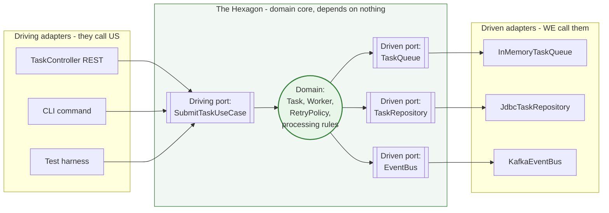
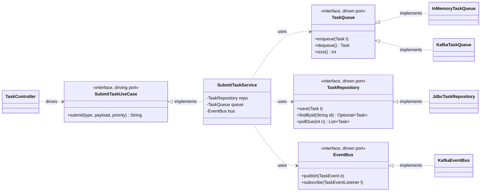

# Hexagonal (Ports and Adapters) Architecture

> Where this fits in the project: this is the structural backbone that lets our Task Queue swap an in-memory queue for PostgreSQL, then for Kafka, **without touching the domain or the worker logic**. It is the architecture that makes the platform *broker-agnostic* all the way from Phase 1 to Phase 4.

This chapter is a sibling to [layered-architecture.md](./layered-architecture.md) and [clean-architecture.md](./clean-architecture.md). Read [dependency-injection.md](./dependency-injection.md) first if "wiring" feels fuzzy, and skim [coupling.md](./coupling.md) and [cohesion.md](./cohesion.md) for the forces this architecture balances. The ports here are the same `TaskQueue`, `TaskRepository`, and `EventBus` interfaces you meet in [domain-modeling.md](./domain-modeling.md); the principle that makes it work is the Dependency Inversion Principle from [solid.md](./solid.md).

## Why this exists — the real problem it solves

Layered architecture gives you one rule: dependencies point *down*. Controller → Service → Repository → Database. That rule is good, but it has a quiet flaw — the *direction* of the dependency still points **toward the infrastructure**. The service layer, where your business rules live, ends up depending (even if indirectly, through a layer below it) on the database. When the database is the bottom of the stack, the database wins arguments. You find yourself shaping domain logic around what JDBC makes convenient.

Hexagonal architecture, introduced by Alistair Cockburn around 2005 (he first called it "ports and adapters"), inverts that. It says: **the domain sits in the middle and depends on nothing.** Everything that talks to the outside world — HTTP, Postgres, Kafka, a cron trigger, a test harness — plugs into the domain through *ports* (interfaces the domain owns) implemented by *adapters* (concrete classes the domain never imports). The arrow of dependency points **inward, toward the domain**, always.

Why does this matter for *our* project specifically? Because the Task Queue is defined by exactly the kind of churn hexagonal was built for:

- Phase 1: the queue is an in-memory `BlockingQueue`.
- Phase 2: the queue and task storage move into PostgreSQL.
- Phase 3: a rate limiter and dead-letter queue wrap the pipeline.
- Phase 4: the broker becomes Redis, Kafka, or RabbitMQ — pluggable.

If `Worker`, `WorkerPool`, and the task-processing rules depend on *Kafka the class*, then "swap the broker" means "rewrite the core." If they depend on *`TaskQueue` the interface*, swapping the broker is writing one new adapter and changing one line of wiring. That is the entire payoff, and it is enormous: the most volatile parts of the system (infrastructure) are kept at arm's length from the most valuable parts (business logic).

Historical aside: the name "hexagon" is deliberately *not* meaningful. Cockburn chose a hexagon precisely because it has no obvious top or bottom — to kill the mental habit of "UI on top, DB on the bottom" that layering encourages. The number six is arbitrary; it just gives you room to draw several ports on the edges. Onion architecture (Jeffrey Palermo, 2008) and Clean architecture (Robert Martin, 2012) are the same idea with different drawings — concentric rings instead of a hexagon. We cover Clean in [clean-architecture.md](./clean-architecture.md); here we use the hexagon because it makes the *symmetry between input and output* obvious.

## The core vocabulary: ports and adapters, driving and driven

Three terms carry the whole architecture. Get these exactly right.

- **Port** — an interface *owned by the domain* that describes a capability the domain needs (or offers), stated in the domain's own language. `TaskQueue`, `TaskRepository`, and `EventBus` are ports. Crucially, the port lives *inside* the hexagon. The domain defines it.
- **Adapter** — a concrete class *outside* the hexagon that implements (or calls) a port, translating between the domain and some specific technology. `InMemoryTaskQueue`, `PostgresTaskQueue`, and `KafkaEventBus` are adapters.
- **Driving vs driven** — the *direction* the call flows decides which kind of port it is.

The driving/driven distinction is the part people skip, and it is the part that makes the hexagon click.

| | Driving (primary) port | Driven (secondary) port |
| --- | --- | --- |
| Who initiates the call? | The outside world calls *in* | The domain calls *out* |
| Direction of control | Inward | Outward |
| Who implements it? | The **domain** implements it | An **adapter** implements it |
| Example port | `SubmitTaskUseCase` (the app's API) | `TaskRepository`, `TaskQueue`, `EventBus` |
| Example adapter | `TaskController` (REST), a CLI, a test | `JdbcTaskRepository`, `KafkaEventBus` |
| Plain-English role | "Things that drive the app" | "Things the app drives" |

A driving adapter (like a REST controller) **calls** a driving port. A driven adapter (like a Postgres repository) **is called through** a driven port. The domain implements driving ports and *consumes* driven ports. Both kinds of port are interfaces the domain controls; that is what keeps the dependency arrow pointing inward on both sides.



Read the arrows: every arrow that touches the hexagon points *into* it or is *owned by* it. The domain never has an arrow pointing out to a concrete technology. `KafkaEventBus` knows about `EventBus`; `EventBus` knows nothing about Kafka.

## The naive version — the domain reaches out and grabs Kafka

Here is the first cut a developer writes when they're new to OOD. It "works" in Phase 1. It becomes a wall in Phase 4.

```java
package com.platform.worker;

import org.apache.kafka.clients.producer.KafkaProducer;
import org.apache.kafka.clients.producer.ProducerRecord;
import java.sql.Connection;
import java.sql.DriverManager;
import java.sql.PreparedStatement;

// BAD: the domain imports Kafka, JDBC, and config. It IS the infrastructure.
public class Worker implements Runnable {

    private final KafkaProducer<String, String> producer; // concrete broker
    private final String jdbcUrl;                          // concrete DB

    public Worker() {
        // BAD: the worker builds its own infrastructure. No way to test or swap.
        var props = new java.util.Properties();
        props.put("bootstrap.servers", "kafka-prod-01:9092");
        this.producer = new KafkaProducer<>(props);
        this.jdbcUrl = "jdbc:postgresql://db-prod:5432/tasks";
    }

    @Override
    public void run() {
        try (Connection conn = DriverManager.getConnection(jdbcUrl, "app", "secret")) {
            // BAD: SQL string carving inside business logic
            PreparedStatement ps = conn.prepareStatement(
                "UPDATE tasks SET status = 'SUCCEEDED' WHERE id = ?");
            // ... pretend we processed a task ...
            ps.setString(1, "some-id");
            ps.executeUpdate();

            // BAD: business logic depends on Kafka serialization details
            producer.send(new ProducerRecord<>("task-events",
                "{\"type\":\"TASK_SUCCEEDED\"}"));
        } catch (Exception e) {
            throw new RuntimeException(e);
        }
    }
}
```

What is wrong, concretely:

- **You cannot unit-test `Worker`.** Constructing it opens a real Kafka connection and a real database socket. Your "unit" test is now an integration test that needs Docker.
- **You cannot swap the broker.** Phase 4 says "Kafka or Redis or RabbitMQ, pluggable." This class is welded to `KafkaProducer`. Pluggability is impossible without rewriting `Worker`.
- **Business rules drown in plumbing.** The actual logic ("mark succeeded, emit an event") is three lines buried in twenty lines of connection management and SQL strings.
- **The dependency arrow points the wrong way.** `Worker` (core) → `KafkaProducer` (infrastructure). The most valuable code depends on the most replaceable code. Exactly backwards.

## Improved version — extract interfaces, but ownership is still muddy

The first instinct is right: hide Kafka and JDBC behind interfaces. But where the interfaces *live* is what separates "layered" from "hexagonal." In the improved cut we define ports, but we leave them in an infrastructure-flavored package — a half-step.

```java
package com.platform.domain;

// Ports: interfaces the worker depends on instead of concrete tech.
public interface TaskRepository {
    void save(Task t);
    java.util.Optional<Task> findById(String id);
    java.util.List<Task> pollDue(int n);
}

public interface EventBus {
    void publish(TaskEvent e);
}
```

```java
package com.platform.domain;

// Worker now depends on PORTS, not Kafka or JDBC. Injected, not constructed.
public class Worker implements Runnable {

    private final TaskQueue queue;
    private final TaskRepository repository;
    private final EventBus eventBus;
    private final HandlerRegistry handlers; // type -> TaskHandler

    public Worker(TaskQueue queue, TaskRepository repository,
                  EventBus eventBus, HandlerRegistry handlers) {
        this.queue = queue;
        this.repository = repository;
        this.eventBus = eventBus;
        this.handlers = handlers;
    }

    @Override
    public void run() {
        try {
            Task task = queue.dequeue();              // driven port
            TaskHandler handler = handlers.lookup(task.type());
            TaskResult result = handler.handle(task);  // pure domain
            if (result.success()) {
                repository.save(task.withStatus(TaskStatus.SUCCEEDED));
                eventBus.publish(new TaskEvent(task.id(), TaskStatus.SUCCEEDED));
            }
        } catch (InterruptedException e) {
            Thread.currentThread().interrupt();
        } catch (Exception e) {
            // retry handling lives elsewhere; see RetryPolicy
            throw new RuntimeException(e);
        }
    }
}
```

This is a huge improvement — `Worker` is now testable with fakes and is broker-agnostic. But two things are still off, and they are the difference between "I used interfaces" and "I did hexagonal architecture":

1. **The driving side is missing.** Something still has to *trigger* the worker and *submit* tasks. Right now `run()` is the entry point, called from raw threads. There's no driving port describing the application's use cases as a first-class API.
2. **Port ownership is implied, not enforced.** Nothing stops a future teammate from putting `TaskRepository` in an `infrastructure` package and having the domain import *down* into it. The dependency rule must be a *structural* rule, not a vibe.

## Production-quality version — ports owned by the domain, adapters wired at the edge

The staff-engineer version makes three things explicit: **driving ports** as the application's public API, **driven ports** owned by the domain package, and a **composition root** at the very edge that is the only place allowed to know all the concrete adapters.

### 1. Driven ports — owned by the domain, in domain language

```java
package com.platform.domain.port;   // <-- ports live INSIDE the hexagon

import com.platform.domain.Task;

/**
 * Driven (secondary) port. The domain calls OUT through this.
 * Implementations are adapters that live OUTSIDE the domain package.
 * Phase 1: InMemoryTaskQueue. Phase 2: PostgresTaskQueue. Phase 4: a broker.
 */
public interface TaskQueue {
    void enqueue(Task t);
    Task dequeue() throws InterruptedException;
    int size();
}
```

```java
package com.platform.domain.port;

import com.platform.domain.Task;
import java.util.List;
import java.util.Optional;

public interface TaskRepository {
    void save(Task t);
    Optional<Task> findById(String id);
    List<Task> pollDue(int n);          // due-and-runnable tasks
}
```

```java
package com.platform.domain.port;

import com.platform.domain.event.TaskEvent;
import com.platform.domain.event.TaskEventListener;

/**
 * Driven port introduced in Phase 4. The domain publishes events; it does NOT
 * know whether they land in an in-process bus, Redis pub/sub, or a Kafka topic.
 */
public interface EventBus {
    void publish(TaskEvent e);
    void subscribe(TaskEventListener l);
}
```

### 2. Driving port — the application's use-case API

```java
package com.platform.domain.usecase;

/**
 * Driving (primary) port. The outside world calls IN through this.
 * The REST controller, a CLI, and tests all depend on THIS, never on a Worker
 * or a repository directly.
 */
public interface SubmitTaskUseCase {
    /** Returns the assigned task id. */
    String submit(String type, String payload, int priority);
}
```

The driving port is implemented *inside* the hexagon by an application service that orchestrates domain rules and driven ports:

```java
package com.platform.domain.usecase;

import com.platform.domain.Task;
import com.platform.domain.TaskStatus;
import com.platform.domain.port.TaskQueue;
import com.platform.domain.port.TaskRepository;
import com.platform.domain.port.EventBus;
import com.platform.domain.event.TaskEvent;
import java.time.Clock;
import java.time.Instant;
import java.util.UUID;

public final class SubmitTaskService implements SubmitTaskUseCase {

    private static final int DEFAULT_MAX_ATTEMPTS = 3;

    private final TaskRepository repository;
    private final TaskQueue queue;
    private final EventBus eventBus;
    private final Clock clock;            // injected -> deterministic tests

    public SubmitTaskService(TaskRepository repository, TaskQueue queue,
                             EventBus eventBus, Clock clock) {
        this.repository = repository;
        this.queue = queue;
        this.eventBus = eventBus;
        this.clock = clock;
    }

    @Override
    public String submit(String type, String payload, int priority) {
        // ----- pure domain rules; no HTTP, no SQL, no Kafka anywhere -----
        int clampedPriority = Math.clamp(priority, 0, 9);
        Instant now = clock.instant();
        Task task = new Task(
                UUID.randomUUID().toString(),
                type,
                payload,
                TaskStatus.PENDING,
                0,
                DEFAULT_MAX_ATTEMPTS,
                now,
                now,                       // scheduledAt == now: run immediately
                clampedPriority);

        repository.save(task);             // driven port
        queue.enqueue(task);               // driven port
        eventBus.publish(new TaskEvent(task.id(), TaskStatus.PENDING)); // driven port
        return task.id();
    }
}
```

Notice what this class imports: `java.time`, `java.util`, and `com.platform.domain.*`. **Zero** framework imports. No `org.springframework`, no `org.apache.kafka`, no `java.sql`. That is the litmus test for "is this inside the hexagon?" — grep the imports.

### 3. Driving adapter — REST controller calls the driving port

```java
package com.platform.adapter.web;          // <-- OUTSIDE the hexagon

import com.platform.domain.usecase.SubmitTaskUseCase;
import org.springframework.http.HttpStatus;
import org.springframework.http.ResponseEntity;
import org.springframework.web.bind.annotation.*;

@RestController
@RequestMapping("/tasks")
public class TaskController {

    private final SubmitTaskUseCase submitTask;   // depends on the PORT

    public TaskController(SubmitTaskUseCase submitTask) {
        this.submitTask = submitTask;
    }

    public record SubmitRequest(String type, String payload, Integer priority) {}
    public record SubmitResponse(String id) {}

    @PostMapping
    public ResponseEntity<SubmitResponse> submit(@RequestBody SubmitRequest req) {
        int priority = req.priority() == null ? 5 : req.priority();
        String id = submitTask.submit(req.type(), req.payload(), priority);
        return ResponseEntity.status(HttpStatus.CREATED).body(new SubmitResponse(id));
    }
}
```

The controller owns HTTP concerns (status codes, JSON DTOs) and *nothing else*. It translates the wire into a call on the driving port. Swap REST for gRPC and you write a new driving adapter; the hexagon never notices.

### 4. Driven adapters — concrete technology, one per broker

```java
package com.platform.adapter.queue;       // <-- OUTSIDE the hexagon

import com.platform.domain.Task;
import com.platform.domain.port.TaskQueue;
import java.util.Comparator;
import java.util.concurrent.PriorityBlockingQueue;

/** Phase 1 adapter. Pure JDK, no external broker. */
public final class InMemoryTaskQueue implements TaskQueue {

    private final PriorityBlockingQueue<Task> queue =
            new PriorityBlockingQueue<>(64,
                Comparator.comparingInt(Task::priority).reversed()   // high first
                          .thenComparing(Task::createdAt));

    @Override public void enqueue(Task t) { queue.put(t); }
    @Override public Task dequeue() throws InterruptedException { return queue.take(); }
    @Override public int size() { return queue.size(); }
}
```

```java
package com.platform.adapter.queue;

import com.platform.domain.Task;
import com.platform.domain.port.TaskQueue;
// Phase 4 adapter. Imagine a Kafka-backed implementation.
// The domain NEVER sees these imports.
import org.apache.kafka.clients.producer.KafkaProducer;
import org.apache.kafka.clients.producer.ProducerRecord;

public final class KafkaTaskQueue implements TaskQueue {

    private final KafkaProducer<String, String> producer;
    private final TaskCodec codec;          // domain Task <-> wire bytes
    private final String topic;
    private final java.util.concurrent.BlockingQueue<Task> consumed;

    public KafkaTaskQueue(KafkaProducer<String, String> producer,
                          TaskCodec codec, String topic,
                          java.util.concurrent.BlockingQueue<Task> consumed) {
        this.producer = producer;
        this.codec = codec;
        this.topic = topic;
        this.consumed = consumed;           // filled by a Kafka consumer loop
    }

    @Override
    public void enqueue(Task t) {
        producer.send(new ProducerRecord<>(topic, t.id(), codec.encode(t)));
    }

    @Override
    public Task dequeue() throws InterruptedException {
        return consumed.take();             // bridges async consumer to the port
    }

    @Override
    public int size() {
        return consumed.size();             // best-effort; lag is the real metric
    }
}
```

Both adapters satisfy the *same* `TaskQueue` port. The `dequeue()` contract ("block until a task is available") is honored by both — `InMemoryTaskQueue` via `take()`, `KafkaTaskQueue` via a bridge `BlockingQueue` that a consumer loop fills. The domain cannot tell them apart, which is the whole point. (For the broker tradeoffs themselves, see [../07-queues-and-messaging/message-queues.md](../07-queues-and-messaging/message-queues.md).)

### 5. The composition root — the only place that knows everything

```java
package com.platform.config;              // <-- the EDGE; wires adapters to ports

import com.platform.adapter.queue.InMemoryTaskQueue;
import com.platform.adapter.queue.KafkaTaskQueue;
import com.platform.domain.port.*;
import com.platform.domain.usecase.*;
import org.springframework.context.annotation.*;
import java.time.Clock;

@Configuration
public class Wiring {

    @Bean
    public Clock clock() { return Clock.systemUTC(); }

    /** Phase 1/dev profile: in-memory. */
    @Bean
    @Profile({"dev", "default"})
    public TaskQueue inMemoryQueue() { return new InMemoryTaskQueue(); }

    /** Phase 4/prod profile: Kafka. Same port, different adapter. */
    @Bean
    @Profile("kafka")
    public TaskQueue kafkaQueue(KafkaTaskQueue adapter) { return adapter; }

    /** The driving port is satisfied by a domain service. */
    @Bean
    public SubmitTaskUseCase submitTaskUseCase(TaskRepository repo, TaskQueue queue,
                                               EventBus bus, Clock clock) {
        return new SubmitTaskService(repo, queue, bus, clock);
    }
}
```

Switching the entire platform from an in-memory queue to Kafka is now a profile flag: `--spring.profiles.active=kafka`. The domain, the use cases, and every test are untouched. *That* is broker-agnostic.

## Code walkthrough — three escalating examples

### Beginner: a port, an adapter, and a test fake

The smallest possible hexagon: one port, one real adapter, and a fake adapter for testing. This is the entire idea in miniature.

```java
// PORT (inside the hexagon)
package com.platform.domain.port;
import com.platform.domain.Task;
public interface TaskRepository {
    void save(Task t);
    java.util.Optional<Task> findById(String id);
}
```

```java
// ADAPTER (outside): a trivial in-memory implementation
package com.platform.adapter.persistence;
import com.platform.domain.Task;
import com.platform.domain.port.TaskRepository;
import java.util.*;
import java.util.concurrent.ConcurrentHashMap;

public final class InMemoryTaskRepository implements TaskRepository {
    private final Map<String, Task> store = new ConcurrentHashMap<>();
    @Override public void save(Task t) { store.put(t.id(), t); }
    @Override public Optional<Task> findById(String id) {
        return Optional.ofNullable(store.get(id));
    }
}
```

```java
// TEST: the test itself is a driving adapter; the repo fake is a driven adapter.
import org.junit.jupiter.api.Test;
import static org.assertj.core.api.Assertions.assertThat;

class TaskRepositoryRoundTripTest {
    @Test
    void saved_task_can_be_found_by_id() {
        TaskRepository repo = new InMemoryTaskRepository();   // adapter under test
        Task t = TaskFixtures.pending("email");
        repo.save(t);
        assertThat(repo.findById(t.id())).contains(t);
    }
}
```

No database, no Spring, milliseconds to run. The test depends only on the *port*, so the same test class can later validate the JDBC adapter by swapping one line.

### Intermediate: testing a use case with hand-written fakes

Because the use case depends on ports, you test business rules in pure memory. This catches logic bugs without any infrastructure.

```java
import org.junit.jupiter.api.Test;
import java.time.*;
import java.util.*;
import static org.assertj.core.api.Assertions.assertThat;

class SubmitTaskServiceTest {

    // Fakes implement the driven ports. No mocking framework needed.
    static final class FakeQueue implements TaskQueue {
        final List<Task> enqueued = new ArrayList<>();
        public void enqueue(Task t) { enqueued.add(t); }
        public Task dequeue() { return enqueued.removeFirst(); }
        public int size() { return enqueued.size(); }
    }
    static final class FakeRepo implements TaskRepository {
        final Map<String, Task> saved = new HashMap<>();
        public void save(Task t) { saved.put(t.id(), t); }
        public Optional<Task> findById(String id) { return Optional.ofNullable(saved.get(id)); }
        public List<Task> pollDue(int n) { return List.copyOf(saved.values()); }
    }
    static final class FakeBus implements EventBus {
        final List<TaskEvent> published = new ArrayList<>();
        public void publish(TaskEvent e) { published.add(e); }
        public void subscribe(TaskEventListener l) { }
    }

    @Test
    void submit_clamps_priority_persists_enqueues_and_emits_event() {
        var queue = new FakeQueue();
        var repo = new FakeRepo();
        var bus = new FakeBus();
        var clock = Clock.fixed(Instant.parse("2026-06-07T00:00:00Z"), ZoneOffset.UTC);
        var service = new SubmitTaskService(repo, queue, bus, clock);

        String id = service.submit("email", "{\"to\":\"a@b.com\"}", 42); // out of range

        Task stored = repo.findById(id).orElseThrow();
        assertThat(stored.priority()).isEqualTo(9);             // clamped 42 -> 9
        assertThat(stored.status()).isEqualTo(TaskStatus.PENDING);
        assertThat(stored.createdAt()).isEqualTo(clock.instant());
        assertThat(queue.enqueued).hasSize(1);
        assertThat(bus.published).extracting(TaskEvent::status)
                                 .containsExactly(TaskStatus.PENDING);
    }
}
```

This test exercises a real business invariant (priority clamping, status initialization, the save→enqueue→publish ordering) and runs in under a millisecond. With the naive `Worker` from earlier, this test would have been impossible to write.

### Production-inspired: a decorating adapter adds rate limiting without touching the core

Hexagonal makes cross-cutting concerns *composable*. A rate limiter is not a domain rule — it is an infrastructure policy. So it becomes a **decorating adapter** that wraps a `TaskQueue` and still *is* a `TaskQueue`. The domain is none the wiser. (See [../08-distributed-systems/rate-limiting.md](../08-distributed-systems/rate-limiting.md) for the token bucket itself, and [../05-design-patterns/decorator.md](../05-design-patterns/decorator.md) for the pattern.)

```java
package com.platform.adapter.queue;

import com.platform.domain.Task;
import com.platform.domain.port.TaskQueue;
import com.platform.domain.port.RateLimiter;

/**
 * Decorating driven adapter: it IS a TaskQueue and it WRAPS a TaskQueue,
 * adding admission control. The domain depends only on TaskQueue, so this
 * slots in at the composition root with zero core changes.
 */
public final class RateLimitedTaskQueue implements TaskQueue {

    private final TaskQueue delegate;
    private final RateLimiter limiter;

    public RateLimitedTaskQueue(TaskQueue delegate, RateLimiter limiter) {
        this.delegate = delegate;
        this.limiter = limiter;
    }

    @Override
    public void enqueue(Task t) {
        if (!limiter.tryAcquire()) {
            throw new QueueOverloadedException(
                "rate limit exceeded for type=" + t.type());
        }
        delegate.enqueue(t);
    }

    @Override public Task dequeue() throws InterruptedException { return delegate.dequeue(); }
    @Override public int size() { return delegate.size(); }
}
```

Wiring it is one line at the edge:

```java
@Bean
public TaskQueue rateLimitedQueue(TokenBucketRateLimiter limiter) {
    return new RateLimitedTaskQueue(new InMemoryTaskQueue(), limiter);
}
```

`RateLimiter` is itself a port (`tryAcquire()` returning `boolean`), so the bucket implementation is swappable too. You can stack decorators — metrics, logging, retries — each a thin adapter implementing the same port. The core stays pure; policy lives at the edge where it belongs.

## How this applies to our Task Queue project

Mapping the canonical model onto the hexagon, precisely:

| Canonical element | Hexagon role | Where it lives |
| --- | --- | --- |
| `Task`, `TaskStatus`, `TaskResult` | Domain model | `domain` (inside) |
| `TaskHandler` (functional interface) | Domain abstraction (a plug-in point) | `domain` (inside) |
| `RetryPolicy`, `FixedDelayRetryPolicy`, `ExponentialBackoffRetryPolicy` | Pure domain rules | `domain` (inside) |
| `Worker`, `WorkerPool` | Domain orchestration | `domain` (inside) |
| `SubmitTaskUseCase` / `ProcessTaskUseCase` | **Driving port** | `domain.usecase` (inside) |
| `TaskQueue` | **Driven port** | `domain.port` (inside) |
| `TaskRepository` | **Driven port** | `domain.port` (inside) |
| `EventBus` | **Driven port** (Phase 4) | `domain.port` (inside) |
| `DeadLetterQueue`, `RateLimiter`, `TaskScheduler` | **Driven ports** | `domain.port` (inside) |
| `TaskController` (REST) | **Driving adapter** | `adapter.web` (outside) |
| `InMemoryTaskQueue` / `PostgresTaskQueue` / `KafkaTaskQueue` | **Driven adapters** | `adapter.queue` (outside) |
| `JdbcTaskRepository` | **Driven adapter** | `adapter.persistence` (outside) |
| `KafkaEventBus` / `RedisEventBus` / `InProcessEventBus` | **Driven adapters** | `adapter.event` (outside) |
| `TokenBucketRateLimiter` | **Driven adapter** | `adapter.ratelimit` (outside) |
| `Wiring` / Spring config | **Composition root** | `config` (the edge) |



The class diagram shows the inversion as concrete UML: every `implements` arrow points *from an adapter to a port* (inward), and every `uses` arrow stays inside the domain (service → ports). No domain class has a dependency arrow pointing out to `KafkaTaskQueue`.

The phase progression is now a table of adapter swaps, not rewrites:

| Phase | `TaskQueue` adapter | `TaskRepository` adapter | `EventBus` adapter |
| --- | --- | --- | --- |
| 1 | `InMemoryTaskQueue` | `InMemoryTaskRepository` | (none) |
| 2 | `PostgresTaskQueue` | `JdbcTaskRepository` (Flyway-migrated) | (none) |
| 3 | `RateLimitedTaskQueue` decorating Postgres | `JdbcTaskRepository` | `InProcessEventBus` |
| 4 | `KafkaTaskQueue` / `RedisTaskQueue` | `JdbcTaskRepository` | `KafkaEventBus` |

Each cell is a class you add at the edge. The hexagon — `Task`, `Worker`, `SubmitTaskService`, `RetryPolicy` — is identical in all four rows.

## Tradeoffs — honest engineering

| Dimension | Hexagonal wins | Hexagonal costs |
| --- | --- | --- |
| Testability | Use cases unit-tested with fakes in microseconds; no DB/broker | More test doubles to maintain |
| Swappability | New broker = new adapter + one wiring line | Premature ports add indirection for tech you never swap |
| Boundaries | Domain provably free of framework imports (grep test / ArchUnit) | More packages and interfaces; harder to navigate for newcomers |
| Cohesion | Business rules concentrated in the core | Mapping code (DTO ↔ domain ↔ row) proliferates at the edges |
| Onboarding | "Find the rule" is easy once you know the layout | Steeper learning curve than a flat controller→repo app |
| Velocity (early) | — | Slower for genuine throwaway CRUD; ceremony outpaces value |

When **not** to reach for the full hexagon:

- A thin CRUD service that maps HTTP straight to one table, with no real business rules and no plausible infrastructure churn. A two-layer controller→repository is honest there; forcing ports is gold-plating (see [dry-kiss-yagni.md](./dry-kiss-yagni.md)).
- A throwaway spike or prototype. Add ports when a *second* adapter becomes a real requirement, not speculatively.

For *our* Task Queue the calculus is clear: the spec mandates four different brokers and persistence backends across phases. That is exactly the volatility hexagonal exists to absorb, so the ceremony pays for itself by Phase 2.

## Common mistakes and pitfalls

- **Putting ports in an `infrastructure` package.** If `TaskQueue` lives next to `InMemoryTaskQueue` in an infra package, the domain ends up importing *down* into infrastructure and the inversion is lost. **Fix:** ports live *inside* the domain (`domain.port`); adapters live outside. The consumer owns the port.
- **A "domain" that imports Spring, JPA, or Kafka.** The most common silent failure. A `@Entity` annotation or a `KafkaTemplate` import in a domain class breaks the architecture even if the code "works." **Fix:** add an ArchUnit rule (below) that fails the build on any framework import inside `domain`.
- **Anemic ports that leak the technology.** A `TaskRepository` with a method `executeNativeQuery(String sql)` is a JDBC adapter wearing a port costume. **Fix:** ports speak domain language (`pollDue(int n)`), never SQL or topic names.
- **Forgetting the driving side.** Many "hexagonal" codebases only invert the *driven* (database) side and let controllers call services directly. That is half a hexagon. **Fix:** define driving ports (`SubmitTaskUseCase`) so the controller depends on an interface, and gRPC/CLI/test can drive the same API.
- **Leaking DTOs into the domain.** Letting the JSON `SubmitRequest` flow all the way into `SubmitTaskService`. **Fix:** the driving adapter maps DTO → primitive/domain args; the domain never sees the wire shape.
- **Mapping fatigue, then giving up.** Teams hit the DTO↔domain↔row mapping cost and "temporarily" let the entity be the domain object. **Fix:** accept a single shared `Task` when persistence shape == domain shape (it does in Phase 2), and only split when they genuinely diverge — but never let an adapter import bleed into the core.
- **God composition root.** The `Wiring` class grows logic. **Fix:** keep it dumb — only `new`/`@Bean`; no conditionals beyond profiles. If it needs logic, that logic is a use case.

## Refactoring exercise — bad → improved → production

**Bad.** A `ProcessTaskJob` welded to JDBC and Kafka, untestable and unswappable.

```java
public class ProcessTaskJob {
    public void run(String taskId) throws Exception {
        var conn = java.sql.DriverManager.getConnection(
            "jdbc:postgresql://db:5432/tasks", "app", "secret");
        var rs = conn.createStatement()
            .executeQuery("SELECT payload FROM tasks WHERE id = '" + taskId + "'"); // SQLi!
        rs.next();
        String payload = rs.getString("payload");
        // ...do work with payload...
        conn.createStatement().executeUpdate(
            "UPDATE tasks SET status='SUCCEEDED' WHERE id='" + taskId + "'");
        var producer = new org.apache.kafka.clients.producer.KafkaProducer<String,String>(
            new java.util.Properties());
        producer.send(new org.apache.kafka.clients.producer.ProducerRecord<>(
            "events", "{\"id\":\"" + taskId + "\"}"));
    }
}
```

**Improved.** Depend on ports; inject them. Logic separates from plumbing.

```java
public class ProcessTaskService {
    private final TaskRepository repository;
    private final EventBus eventBus;
    private final HandlerRegistry handlers;

    public ProcessTaskService(TaskRepository repository, EventBus eventBus,
                              HandlerRegistry handlers) {
        this.repository = repository;
        this.eventBus = eventBus;
        this.handlers = handlers;
    }

    public void process(String taskId) throws Exception {
        Task task = repository.findById(taskId)
            .orElseThrow(() -> new TaskNotFoundException(taskId));
        TaskResult result = handlers.lookup(task.type()).handle(task);
        TaskStatus next = result.success() ? TaskStatus.SUCCEEDED : TaskStatus.FAILED;
        repository.save(task.withStatus(next));
        eventBus.publish(new TaskEvent(task.id(), next));
    }
}
```

**Production.** Add the driving port, a result/retry decision, and keep the core import-clean. Retry mechanics live behind a `RetryPolicy` port (see [../08-distributed-systems/retries.md](../08-distributed-systems/retries.md)).

```java
package com.platform.domain.usecase;

import com.platform.domain.*;
import com.platform.domain.port.*;
import com.platform.domain.event.TaskEvent;
import java.time.Duration;
import java.util.Optional;

public interface ProcessTaskUseCase { void process(String taskId) throws Exception; }

public final class ProcessTaskService implements ProcessTaskUseCase {

    private final TaskRepository repository;
    private final EventBus eventBus;
    private final HandlerRegistry handlers;
    private final RetryPolicy retryPolicy;       // port
    private final TaskScheduler scheduler;       // port
    private final DeadLetterQueue dlq;           // port

    public ProcessTaskService(TaskRepository repository, EventBus eventBus,
                              HandlerRegistry handlers, RetryPolicy retryPolicy,
                              TaskScheduler scheduler, DeadLetterQueue dlq) {
        this.repository = repository; this.eventBus = eventBus;
        this.handlers = handlers; this.retryPolicy = retryPolicy;
        this.scheduler = scheduler; this.dlq = dlq;
    }

    @Override
    public void process(String taskId) throws Exception {
        Task task = repository.findById(taskId)
            .orElseThrow(() -> new TaskNotFoundException(taskId));
        Task running = task.withStatus(TaskStatus.RUNNING);
        persistAndEmit(running);

        TaskResult result;
        try {
            result = handlers.lookup(task.type()).handle(running);
        } catch (Exception e) {
            result = new TaskResult(false, e.getMessage(), true); // retryable
        }

        if (result.success()) {
            persistAndEmit(running.withStatus(TaskStatus.SUCCEEDED));
            return;
        }

        boolean canRetry = result.retryable()
                && running.attempts() + 1 < running.maxAttempts();
        Optional<Duration> delay = canRetry
            ? retryPolicy.nextDelay(running.attempts() + 1) : Optional.empty();

        if (canRetry && delay.isPresent()) {
            Task retrying = running.incrementAttempts().withStatus(TaskStatus.RETRYING);
            persistAndEmit(retrying);
            scheduler.schedule(retrying, delay.get());     // re-enqueue later
        } else {
            persistAndEmit(running.withStatus(TaskStatus.DEAD));
            dlq.send(running, result.message());           // driven port
        }
    }

    private void persistAndEmit(Task t) {
        repository.save(t);
        eventBus.publish(new TaskEvent(t.id(), t.status()));
    }
}
```

The final version handles the full lifecycle — `RUNNING → SUCCEEDED | RETRYING | DEAD` — using only ports. It is fully unit-testable with the fakes from earlier, and every infrastructure choice (Postgres, Kafka, token bucket, DelayQueue) is decided at the composition root, not here.

## Exercises

### Easy

**E1 (knowledge check).** In one sentence each, define *port*, *adapter*, *driving port*, and *driven port*, and state which side of the hexagon owns each.

**E2 (knowledge check).** A teammate puts the `TaskQueue` interface in package `com.platform.infrastructure.kafka`, next to `KafkaTaskQueue`. Explain precisely why this breaks the architecture and where the interface should live.

**E3 (coding).** Write an `InMemoryEventBus` adapter that implements the `EventBus` port (`publish` and `subscribe`) and delivers each published `TaskEvent` synchronously to all registered listeners.

### Medium

**M1 (coding).** Add a `DeadLetterQueue` port (`send(Task t, String reason)`) and two adapters: an `InMemoryDeadLetterQueue` (a list) and a `LoggingDeadLetterQueue` decorator that logs then delegates. Wire them so the logging one wraps the in-memory one.

**M2 (refactoring).** Take the `ProcessTaskJob` "bad" class above and split it so business logic is fully testable with fakes and contains zero `java.sql`/Kafka imports. Provide one passing unit test using fakes.

**M3 (design).** The team wants a CLI (`submit-task email '{"to":"x"}'`) *and* the REST API to share submission logic. Describe, with class names, how driving ports let both drive the same use case, and which classes are added vs reused.

### Hard

**H1 (design).** Design an `ArchUnit` test that fails the build if any class in package `com.platform.domain..` imports `org.springframework..`, `org.apache.kafka..`, or `java.sql..`. Explain why this rule *is* hexagonal architecture made executable.

**H2 (coding + design).** Implement a `MetricsTaskQueue` decorating adapter that records `enqueue` count, `dequeue` count, and current `size` via a `MetricsCollector` port, then wrap it around any `TaskQueue`. Show the composition-root wiring that stacks `Metrics(RateLimited(InMemory))`.

**H3 (interview-style).** Your CTO says: "Hexagonal is over-engineering; we ship faster with controllers calling repositories." Give a 90-second rebuttal grounded in *this* project's Phase 1→4 broker-swap requirement, and name the one situation where the CTO is right.

## Solutions

**E1.** A *port* is a domain-owned interface describing a capability in domain language; the domain (inside the hexagon) owns it. An *adapter* is a concrete class outside the hexagon implementing/calling a port for a specific technology. A *driving (primary) port* is called *into* the domain by the outside world and is *implemented by the domain* (e.g., `SubmitTaskUseCase`). A *driven (secondary) port* is called *out of* the domain to infrastructure and is *implemented by an adapter* (e.g., `TaskRepository`). Both interfaces are owned by the domain; only the implementation location differs.

**E2.** Placing `TaskQueue` in an infrastructure/Kafka package forces the domain to `import com.platform.infrastructure.kafka.TaskQueue`, i.e. the domain depends *outward* on infrastructure — the exact inversion hexagonal forbids. It also couples the port's identity to one broker. The interface must live inside the hexagon (`com.platform.domain.port.TaskQueue`); `KafkaTaskQueue` then implements it from outside, so the only cross-boundary arrow points *inward* (adapter → port). The consumer owns the port.

**E3.**

```java
package com.platform.adapter.event;

import com.platform.domain.port.EventBus;
import com.platform.domain.event.TaskEvent;
import com.platform.domain.event.TaskEventListener;
import java.util.List;
import java.util.concurrent.CopyOnWriteArrayList;

public final class InMemoryEventBus implements EventBus {
    private final List<TaskEventListener> listeners = new CopyOnWriteArrayList<>();

    @Override public void subscribe(TaskEventListener l) { listeners.add(l); }

    @Override
    public void publish(TaskEvent e) {
        for (TaskEventListener l : listeners) {
            l.onEvent(e);   // synchronous fan-out; fine for in-process Phase 3
        }
    }
}
```

`CopyOnWriteArrayList` lets us iterate during publish while subscriptions change concurrently, without locking the hot path. The domain depends on `EventBus`; this adapter is one of several (in-process here, Kafka in Phase 4) — all interchangeable.

**M1.**

```java
package com.platform.domain.port;
import com.platform.domain.Task;
public interface DeadLetterQueue { void send(Task t, String reason); }
```

```java
package com.platform.adapter.dlq;
import com.platform.domain.Task;
import com.platform.domain.port.DeadLetterQueue;
import java.util.*;
import java.util.concurrent.CopyOnWriteArrayList;

public final class InMemoryDeadLetterQueue implements DeadLetterQueue {
    public record Entry(Task task, String reason) {}
    private final List<Entry> dead = new CopyOnWriteArrayList<>();
    @Override public void send(Task t, String reason) { dead.add(new Entry(t, reason)); }
    public List<Entry> entries() { return List.copyOf(dead); }
}
```

```java
package com.platform.adapter.dlq;
import com.platform.domain.Task;
import com.platform.domain.port.DeadLetterQueue;
import java.lang.System.Logger;
import java.lang.System.Logger.Level;

public final class LoggingDeadLetterQueue implements DeadLetterQueue {
    private static final Logger LOG = System.getLogger(LoggingDeadLetterQueue.class.getName());
    private final DeadLetterQueue delegate;
    public LoggingDeadLetterQueue(DeadLetterQueue delegate) { this.delegate = delegate; }

    @Override
    public void send(Task t, String reason) {
        LOG.log(Level.WARNING, "DLQ task id={0} type={1} reason={2}",
                t.id(), t.type(), reason);
        delegate.send(t, reason);
    }
}
```

```java
// composition root: logging wraps in-memory
@Bean
public DeadLetterQueue deadLetterQueue() {
    return new LoggingDeadLetterQueue(new InMemoryDeadLetterQueue());
}
```

Both implement the *same* `DeadLetterQueue` port (Decorator pattern), so the domain calls `dlq.send(...)` and stays oblivious to logging. (See [../07-queues-and-messaging/dead-letter-queues.md](../07-queues-and-messaging/dead-letter-queues.md).)

**M2.** The refactor is the `ProcessTaskService` (Improved) shown in the Refactoring section — it imports only `domain` types. A passing test with fakes:

```java
import org.junit.jupiter.api.Test;
import static org.assertj.core.api.Assertions.assertThat;

class ProcessTaskServiceTest {
    @Test
    void successful_handler_marks_task_succeeded_and_emits_event() throws Exception {
        var repo = new FakeRepo();          // from the intermediate example
        var bus = new FakeBus();
        var task = TaskFixtures.pending("email");
        repo.save(task);
        var handlers = new HandlerRegistry();
        handlers.register("email", t -> new TaskResult(true, "ok", false));

        new ProcessTaskService(repo, bus, handlers).process(task.id());

        assertThat(repo.findById(task.id()).orElseThrow().status())
            .isEqualTo(TaskStatus.SUCCEEDED);
        assertThat(bus.published).extracting(TaskEvent::status)
            .containsExactly(TaskStatus.SUCCEEDED);
    }
}
```

No database, no Kafka, no SQL-injection surface — and the test is deterministic.

**M3.** Add a `SubmitTaskCliCommand` as a *new driving adapter* in `adapter.cli`; **reuse** `SubmitTaskUseCase` (port) and `SubmitTaskService` (implementation) unchanged. The CLI parses argv into `(type, payload, priority)` and calls `submitTask.submit(...)`. `TaskController` (REST) is also a driving adapter calling the same port. Added: `SubmitTaskCliCommand`. Reused: `SubmitTaskUseCase`, `SubmitTaskService`, every driven port and adapter. This is the driving-side inversion paying off — two front doors, one use case.

**H1.**

```java
import com.tngtech.archunit.junit.AnalyzeClasses;
import com.tngtech.archunit.junit.ArchTest;
import com.tngtech.archunit.lang.ArchRule;
import static com.tngtech.archunit.lang.syntax.ArchRuleDefinition.noClasses;

@AnalyzeClasses(packages = "com.platform")
class HexagonRulesTest {
    @ArchTest
    static final ArchRule domain_is_pure =
        noClasses().that().resideInAPackage("com.platform.domain..")
            .should().dependOnClassesThat()
            .resideInAnyPackage("org.springframework..", "org.apache.kafka..", "java.sql..");
}
```

This rule *is* hexagonal architecture made executable: the architecture's single law — "the domain depends on nothing external" — is now a CI gate. Without it, the rule is a comment someone violates on a deadline; with it, a framework import in `domain` fails the build, so the dependency arrow can never quietly flip outward.

**H2.**

```java
package com.platform.adapter.queue;
import com.platform.domain.Task;
import com.platform.domain.port.TaskQueue;
import com.platform.domain.port.MetricsCollector;

public final class MetricsTaskQueue implements TaskQueue {
    private final TaskQueue delegate;
    private final MetricsCollector metrics;
    public MetricsTaskQueue(TaskQueue delegate, MetricsCollector metrics) {
        this.delegate = delegate; this.metrics = metrics;
    }
    @Override public void enqueue(Task t) {
        delegate.enqueue(t); metrics.increment("queue.enqueue");
    }
    @Override public Task dequeue() throws InterruptedException {
        Task t = delegate.dequeue(); metrics.increment("queue.dequeue"); return t;
    }
    @Override public int size() {
        int s = delegate.size(); metrics.gauge("queue.size", s); return s;
    }
}
```

```java
// composition root: Metrics( RateLimited( InMemory ) )
@Bean
public TaskQueue taskQueue(MetricsCollector metrics, RateLimiter limiter) {
    return new MetricsTaskQueue(
               new RateLimitedTaskQueue(
                   new InMemoryTaskQueue(), limiter),
               metrics);
}
```

Each layer is an adapter implementing `TaskQueue`; the stack is assembled at the edge, and the domain still depends only on `TaskQueue`. `MetricsCollector` is itself a port, so a Micrometer-backed implementation slots in behind it without touching the core.

**H3.** Rebuttal: "Our spec requires the queue to be an in-memory `BlockingQueue` in Phase 1, PostgreSQL in Phase 2, and Kafka/Redis/RabbitMQ in Phase 4 — three broker swaps are *guaranteed*, not hypothetical. If `Worker` and our processing rules depend on Kafka directly, each swap is a rewrite of the most valuable, most-tested code in the system, under deadline, with regression risk. With one `TaskQueue` port, each swap is a new adapter plus one wiring line, and every business rule stays unit-tested in microseconds against fakes. The cost is a few interfaces and a composition root — paid back the first time we change infrastructure, which the roadmap says is Phase 2. The CTO is right in exactly one case: a thin CRUD service with no real business rules and no plausible infrastructure change — there, ports are ceremony and a controller→repository app is the honest design. Our platform is the opposite of that case."

## Interview questions and takeaways

**Q1: What problem does hexagonal architecture solve that plain layering doesn't?**
Layering points dependencies downward toward the database, so the domain still (transitively) depends on infrastructure. Hexagonal inverts that with the Dependency Inversion Principle: the domain owns the interfaces (ports) and depends on nothing concrete; infrastructure implements those interfaces (adapters). The result is a domain that is framework-free, unit-testable without I/O, and able to swap any external technology by writing a new adapter.

**Q2: Driving vs driven ports — give the precise difference.**
Driving (primary) ports are called *into* the application by the outside world and are implemented *inside* the domain (e.g., `SubmitTaskUseCase` implemented by `SubmitTaskService`; the REST controller is the driving adapter). Driven (secondary) ports are called *out of* the application toward infrastructure and are implemented by *adapters* outside (e.g., `TaskRepository` implemented by `JdbcTaskRepository`). Control flows inward through driving ports and outward through driven ports; both interfaces are owned by the domain.

**Q3: How is this different from Clean / Onion architecture?**
They are the same core idea — dependencies point inward, infrastructure is a detail — drawn differently. Onion uses concentric rings; Clean adds an explicit Entities-vs-Use-Cases split and the formal "Dependency Rule"; Hexagon emphasizes the input/output *symmetry* (driving/driven) and avoids a top/bottom mental model. In practice they interoperate; see [clean-architecture.md](./clean-architecture.md).

**Q4: Who owns the port interface, the consumer or the implementer?**
The consumer (the domain). This is the inversion: the domain declares the `TaskQueue` it needs in its own terms, and the infrastructure conforms. If the implementer owned it, the domain would depend outward and the architecture would collapse into layering. This is the same principle that drives interface placement in [dependency-injection.md](./dependency-injection.md).

**Q5: How do you enforce "the domain depends on nothing" in a real codebase?**
Package discipline plus an automated gate — an ArchUnit test that fails the build if any `domain..` class imports framework/JDBC/broker packages. Code review alone erodes under deadlines; the build must be the enforcer.

**Q6: Where do cross-cutting concerns like rate limiting and metrics go?**
They are infrastructure policy, not domain rules, so they become decorating adapters that implement the same port they wrap (`RateLimitedTaskQueue`, `MetricsTaskQueue` both *are* `TaskQueue`). They stack at the composition root, keeping the core pure.

**Q7: What's the cost, and when is hexagonal the wrong choice?**
Costs: more interfaces, more packages, DTO↔domain↔row mapping, steeper onboarding. Wrong choice for thin CRUD with no real rules and no infrastructure volatility, and for throwaway spikes. Add ports when a second adapter is a concrete requirement, not speculatively.

## Production considerations

- **Adapters are where production breaks, so test them with real infrastructure.** Unit tests cover the hexagon with fakes; the *adapters* (JDBC, Kafka) need integration tests against the real thing — use Testcontainers to spin up Postgres/Kafka in CI. A green unit suite plus a fake adapter can hide a broken SQL mapping; only a Testcontainers test catches it.
- **The port contract must be honored identically by every adapter.** `TaskQueue.dequeue()` promises "block until available." `InMemoryTaskQueue` does that via `take()`; a careless `KafkaTaskQueue` that returns `null` on an empty poll violates the contract and corrupts `Worker`. Write a *contract test* (a JUnit test against the interface) and run every adapter through it.
- **Transactions live in adapters/use cases, not in the domain.** The domain stays transaction-unaware; `@Transactional` belongs on the driven adapter or the application service at the edge. Crossing two driven ports (save + enqueue) atomically is a distributed-transaction problem — the transactional-outbox pattern (an adapter concern) is the production answer, not a domain change. See [../08-distributed-systems/idempotency.md](../08-distributed-systems/idempotency.md).
- **Mapping is a real cost; budget for it.** DTO ↔ domain ↔ row mapping is boring but error-prone. Keep it in the adapters, test it, and resist the urge to collapse layers by letting a `@Entity` be your domain object — that import is the camel's nose into a pure core.
- **The composition root is a blast radius.** `Wiring` knows every adapter; a mis-wire there can swap the wrong broker in prod. Keep it dumb (only `new`/`@Bean`/profiles) and add a `@SpringBootTest` that asserts the context loads and the expected `TaskQueue` implementation is injected per profile.
- **Observability rides the adapters.** Metrics, tracing, and structured logging belong in decorating adapters (`MetricsTaskQueue`) and at the controller edge, not sprinkled through the domain. This keeps the core readable and lets you change the metrics backend (Micrometer → OpenTelemetry) without touching business logic; see [../10-system-design/observability-and-ops.md](../10-system-design/observability-and-ops.md).
- **Don't let "pluggable" become "untested."** Four broker adapters means four production code paths. If only the in-memory one is exercised in CI, the Kafka one will fail on first prod use. Gate every shipped adapter behind a contract test and at least a smoke integration test.

## What We Can Improve In Our Project Using This Concept

Today the early-phase submission path likely wires the `TaskController` straight to a queue and repository, and the worker probably constructs or imports concrete infrastructure. We can restructure into `domain` (with `domain.port` and `domain.usecase`), `adapter`, and `config` packages; define `SubmitTaskUseCase`/`ProcessTaskUseCase` as driving ports; and pin `TaskQueue`, `TaskRepository`, `EventBus`, `DeadLetterQueue`, `RateLimiter`, and `TaskScheduler` as driven ports *owned by the domain*. The payoff is immediate and compounding: every business rule becomes unit-testable in microseconds with fakes, and the Phase-2→Phase-4 broker migration (In-Memory → Postgres → Kafka/Redis) becomes a new adapter plus a one-line wiring change instead of a core rewrite.

## Project Refactoring Task

1. Create packages `com.platform.domain`, `com.platform.domain.port`, `com.platform.domain.usecase`, `com.platform.adapter`, and `com.platform.config`.
2. Move `Task`, `TaskStatus`, `TaskResult`, `TaskHandler`, `Worker`, `WorkerPool`, and the `RetryPolicy` implementations into `domain`; strip every framework/JDBC/broker import from them.
3. Move the `TaskQueue`, `TaskRepository`, `EventBus`, `DeadLetterQueue`, `RateLimiter`, and `TaskScheduler` *interfaces* into `domain.port` (consumer owns the port).
4. Define `SubmitTaskUseCase` and `ProcessTaskUseCase` in `domain.usecase` with `SubmitTaskService`/`ProcessTaskService` implementations.
5. Make `TaskController`, `InMemoryTaskQueue`/`JdbcTaskRepository`/`KafkaTaskQueue`, and `KafkaEventBus`/`InMemoryEventBus` adapters in `adapter.*`; add request/response DTOs at the web edge and map to/from domain `Task`.
6. Move all `@Configuration`/`@Bean` wiring into `config.Wiring`, profile-gated per broker.
7. Add an `ArchUnit` `HexagonRulesTest` that fails the build on any framework import inside `domain..`, plus unit tests for each use case using in-memory fakes.

## Git Commit For This Chapter

```bash
git commit -m "refactor(architecture): adopt ports-and-adapters (hexagonal) topology

- introduce domain.port (TaskQueue, TaskRepository, EventBus, DeadLetterQueue,
  RateLimiter, TaskScheduler) owned by the domain
- add driving ports SubmitTaskUseCase/ProcessTaskUseCase with domain services
- move infrastructure into adapter.* (InMemory/Jdbc/Kafka queues, web controller)
- centralize wiring in config.Wiring, profile-gated per broker
- add ArchUnit HexagonRulesTest to enforce a pure domain in CI"
```

Files touched: `domain/Task.java`, `domain/TaskStatus.java`, `domain/TaskResult.java`, `domain/Worker.java`, `domain/ExponentialBackoffRetryPolicy.java`, `domain/port/TaskQueue.java`, `domain/port/TaskRepository.java`, `domain/port/EventBus.java`, `domain/port/DeadLetterQueue.java`, `domain/usecase/SubmitTaskUseCase.java`, `domain/usecase/SubmitTaskService.java`, `domain/usecase/ProcessTaskService.java`, `adapter/web/TaskController.java`, `adapter/queue/InMemoryTaskQueue.java`, `adapter/queue/KafkaTaskQueue.java`, `adapter/persistence/JdbcTaskRepository.java`, `config/Wiring.java`, `test/HexagonRulesTest.java`.

## Architecture Impact

This is a *foundational* change: it fixes the dependency topology every later phase relies on. Phase 2's PostgreSQL and Phase 4's Kafka/Redis/RabbitMQ become *adapters* swapped at the composition root, not rewrites of business logic. Rate limiting ([../08-distributed-systems/rate-limiting.md](../08-distributed-systems/rate-limiting.md)), circuit breakers ([../08-distributed-systems/circuit-breakers.md](../08-distributed-systems/circuit-breakers.md)), and metrics enter as decorating adapters around the core, keeping it pure. The cost is more files and a hard rule the team must keep — repaid the first time we swap infrastructure or need to test a rule without booting a database, which the roadmap schedules for Phase 2.

## Interview Takeaways

- The pattern is one rule plus one inversion: source dependencies point inward, and the *consumer* (domain) owns the port interface that the outer adapter implements.
- Ports are domain-owned interfaces in domain language; adapters are technology-specific implementations outside the hexagon. Grep the domain's imports — framework imports there mean you failed.
- Driving (primary) ports are implemented by the domain and called by driving adapters (REST/CLI/test); driven (secondary) ports are implemented by adapters and called by the domain (DB/broker/event bus).
- Cross-cutting concerns (rate limiting, metrics, logging) are decorating adapters that implement the same port they wrap, stacked at the composition root.
- Hexagon ≈ Onion ≈ Clean; choose it when infrastructure is volatile and rules are rich (our four-broker roadmap), and skip it for thin CRUD where it is pure ceremony. Enforce the dependency rule with ArchUnit in CI, not with good intentions.
