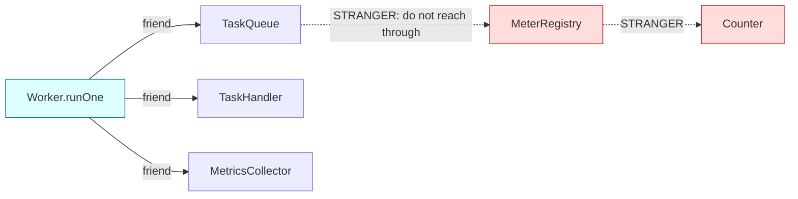
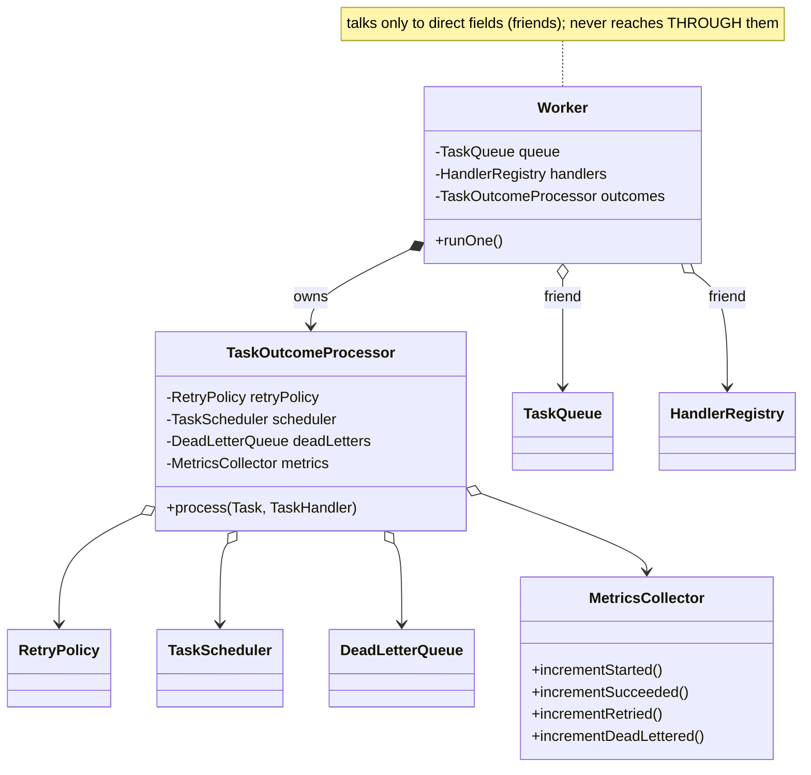
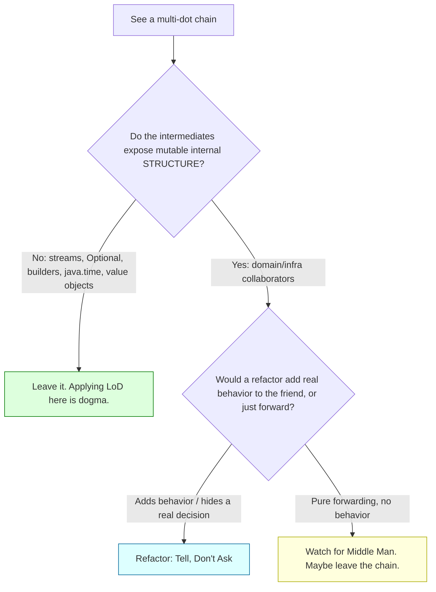

# Law of Demeter

> Where this fits: the Law of Demeter is the day-to-day discipline that keeps our `Worker`, `TaskQueue`, and `MetricsCollector` from reaching through each other's internals. It is what stops `task.getQueue().getMetrics().increment()` from appearing in our codebase and quietly welding three layers together. It is the tactical sibling of [coupling](./coupling.md): coupling tells you *that* dependencies cost you; the Law of Demeter tells you *exactly which call chains* create them.

The Law of Demeter (LoD), also called the **Principle of Least Knowledge**, is a single, almost mechanical rule: **a method should only talk to its immediate friends, never to strangers**. When you write `a.getB().getC().doSomething()`, the method is reaching past `a` to manipulate `c`, an object it was never given and should not know exists. This chapter shows how to spot these *train-wreck* chains in our Task Queue, how to refactor them with **Tell, Don't Ask**, and — just as importantly — when the law hardens into dogma and you should stop applying it.

---

## Why this exists — the real problem it solves

The Law of Demeter was formalized in 1987 by **Ian Holland** and colleagues on the *Demeter Project* at Northeastern University (Demeter was the Greek goddess of agriculture — the project was about "growing" software with adaptive programming). The observation that drove it: object-oriented programs accumulate hidden, transitive dependencies through navigation chains, and those chains are the dependencies you can least see and most often break.

Here is the real problem, stated plainly. Suppose a `Worker` does this:

```java
worker.getQueue().getMetrics().getRegistry().counter("tasks").increment();
```

That one line knows about **four** types: `Worker` knows `TaskQueue`, `TaskQueue` exposes `MetricsCollector`, `MetricsCollector` exposes a `MeterRegistry`, and the registry exposes a `Counter`. The `Worker` is now coupled to the internal structure of all three of its collaborators. If `MetricsCollector` stops wrapping a raw `MeterRegistry` (say it switches to a buffered async sink), this line breaks — even though conceptually the `Worker` only wanted to "count one task." The knowledge leaked across boundaries.

> **The core insight.** Every `.` after the first one in a chain is a dependency on the *shape* of an intermediate object. The Law of Demeter is a heuristic for capping how many such shapes any one method must know.

The cost this controls is **change blast radius**. In our four-phase project the structure beneath `TaskQueue` changes constantly: Phase 1 is a `BlockingQueue`, Phase 2 is `PostgresTaskQueue`, Phase 4 is a Kafka/Redis broker. If callers navigate *through* the queue's guts, every phase boundary is a sweep of broken call sites. If callers only ask the queue to do things, the guts can be rewritten freely.

### The formal rule

A method `m` of an object `O` may only call methods on:

1. `O` itself (`this`),
2. parameters passed into `m`,
3. objects `m` creates / instantiates,
4. `O`'s direct component objects (its fields),
5. (a common extension) global / singleton objects deliberately made available.

That is the whole law. The slogan version: **"only talk to your immediate friends"** — or even shorter, **"use only one dot."** (The one-dot rule is a useful smell detector, not a literal law; we will see exceptions.)



---

## The naive version — a train wreck

Here is a first-cut `Worker.runOne` written the way most people write it before they think about navigation. It is functional and it compiles, and it is a maintenance trap.

```java
// NAIVE: every line reaches through a stranger. Count the dots.
public final class Worker implements Runnable {
    private final TaskQueue queue;

    public Worker(TaskQueue queue) {
        this.queue = queue;
    }

    void runOne() throws InterruptedException {
        Task task = queue.dequeue();

        // Train wreck #1: count a started task by walking into the metrics internals.
        queue.getMetrics().getRegistry().counter("tasks.started").increment();

        // Train wreck #2: look up the handler by digging into a registry's internal map.
        TaskHandler handler = queue.getHandlerRegistry().getHandlers().get(task.type());

        try {
            TaskResult result = handler.handle(task);
            if (result.success()) {
                // Train wreck #3: mutate the task's status through a getter chain.
                task.getState().getStatus().setValue(TaskStatus.SUCCEEDED);
                queue.getMetrics().getRegistry().counter("tasks.succeeded").increment();
            }
        } catch (Exception e) {
            // Train wreck #4: reach across the queue into its dead-letter component.
            queue.getDeadLetterQueue().getStore().getList().add(task);
        }
    }
}
```

What is wrong here, beyond aesthetics?

- **`Worker` knows five collaborators' internals.** `MetricsCollector`'s `getRegistry()`, `Counter`'s `increment()`, the handler registry's internal `Map`, the task's `getState().getStatus()`, the DLQ's `getStore().getList()`. Any of those refactors breaks `Worker`.
- **The intermediate getters are pure leakage.** `getRegistry()`, `getStore()`, `getList()` exist only to expose internals. They are an admission that the object has no behavior of its own.
- **It is untestable in isolation.** To unit-test `Worker` you must build a `MetricsCollector` *with* a real `MeterRegistry`, a handler registry *with* a populated map, and a DLQ *with* a backing list. The chains force you to assemble the whole world.
- **NullPointerExceptions hide in the chain.** If `getStore()` returns null, the stack trace points at `Worker`, not at the broken collaborator.

---

## Improved version — collapse the chains into intention-revealing methods

The first refactor is mechanical: **give each collaborator a method that does the thing, so the caller asks once.** This is the move from "ask for parts and operate on them" to "tell the friend to act."

```java
// IMPROVED: each line talks to exactly one friend and asks it to do the work.
public final class Worker implements Runnable {
    private final TaskQueue queue;
    private final HandlerRegistry handlers;
    private final MetricsCollector metrics;
    private final DeadLetterQueue deadLetters;

    public Worker(TaskQueue queue, HandlerRegistry handlers,
                  MetricsCollector metrics, DeadLetterQueue deadLetters) {
        this.queue = queue;
        this.handlers = handlers;
        this.metrics = metrics;
        this.deadLetters = deadLetters;
    }

    void runOne() throws InterruptedException {
        Task task = queue.dequeue();
        metrics.incrementStarted();                  // one dot, tell the friend
        TaskHandler handler = handlers.handlerFor(task.type());  // one dot
        try {
            TaskResult result = handler.handle(task);
            if (result.success()) {
                metrics.incrementSucceeded();
            }
        } catch (Exception e) {
            deadLetters.send(task, e.getMessage());  // one dot, DLQ owns its store
        }
    }
}
```

Two structural changes made this possible:

1. **The strangers became friends.** Instead of reaching `queue.getMetrics()...`, `Worker` is *handed* the `MetricsCollector`, the `HandlerRegistry`, and the `DeadLetterQueue` directly via the constructor ([dependency injection](./dependency-injection.md)). Now they are fields — category 4 in the formal rule — so calling them is legal and honest.
2. **Each collaborator grew a behavior.** `metrics.incrementStarted()` replaces `getRegistry().counter(...).increment()`. The `MetricsCollector` now *owns* the decision of how a "started" event is recorded. The caller does not care if it is a Micrometer counter, a log line, or a no-op.

This is already a large win, but notice the task-status mutation disappeared. Where did it go? It belongs to the `Worker`'s outcome handling, and we will give it a proper home next.

---

## Production-quality version — Tell, Don't Ask with a focused outcome object

A staff engineer pushes one step further: the `Worker` should not even *decide* what to do with each outcome by poking at fields. It should **delegate the whole outcome** to an object whose job is exactly that. This is the **Tell, Don't Ask** principle — the philosophical engine behind the Law of Demeter.

> **Tell, Don't Ask.** Do not ask an object for its data and then make decisions on its behalf; tell the object what you want to happen and let it decide. Asking pulls behavior out of objects into chains; telling pushes behavior back where the data lives.

```java
// PRODUCTION: Worker orchestrates friends; each friend owns its own knowledge.
public final class Worker implements Runnable {

    private final TaskQueue queue;
    private final HandlerRegistry handlers;
    private final TaskOutcomeProcessor outcomes;  // owns retry/DLQ/metrics decisions
    private volatile boolean running = true;

    public Worker(TaskQueue queue, HandlerRegistry handlers, TaskOutcomeProcessor outcomes) {
        this.queue = queue;
        this.handlers = handlers;
        this.outcomes = outcomes;
    }

    @Override
    public void run() {
        while (running) {
            try {
                runOne();
            } catch (InterruptedException e) {
                Thread.currentThread().interrupt();
                return;
            }
        }
    }

    void runOne() throws InterruptedException {
        Task task = queue.dequeue();
        TaskHandler handler = handlers.handlerFor(task.type());
        // TELL: hand the whole job to the outcome processor. No getter chains.
        outcomes.process(task, handler);
    }

    void stop() { this.running = false; }
}
```

```java
// The outcome processor concentrates all the "what next" decisions in ONE place.
// Every collaborator it uses is a direct field — Law of Demeter satisfied.
public final class TaskOutcomeProcessor {

    private final RetryPolicy retryPolicy;
    private final TaskScheduler scheduler;
    private final DeadLetterQueue deadLetters;
    private final MetricsCollector metrics;

    public TaskOutcomeProcessor(RetryPolicy retryPolicy, TaskScheduler scheduler,
                                DeadLetterQueue deadLetters, MetricsCollector metrics) {
        this.retryPolicy = retryPolicy;
        this.scheduler = scheduler;
        this.deadLetters = deadLetters;
        this.metrics = metrics;
    }

    void process(Task task, TaskHandler handler) {
        metrics.incrementStarted();
        try {
            TaskResult result = handler.handle(task);
            if (result.success()) {
                metrics.incrementSucceeded();
                return;
            }
            if (result.retryable()) {
                scheduleRetry(task, result.message());
            } else {
                deadLetters.send(task, result.message());
                metrics.incrementDeadLettered();
            }
        } catch (Exception e) {
            scheduleRetry(task, e.getMessage());
        }
    }

    private void scheduleRetry(Task task, String reason) {
        int nextAttempt = task.attempts() + 1;
        // retryPolicy returns Optional<Duration>; empty means "out of attempts".
        retryPolicy.nextDelay(nextAttempt).ifPresentOrElse(
            delay -> {
                scheduler.schedule(task, delay);
                metrics.incrementRetried();
            },
            () -> {
                deadLetters.send(task, "max attempts exhausted: " + reason);
                metrics.incrementDeadLettered();
            }
        );
    }
}
```

Why this is the version to ship:

- **`Worker` knows three friends and zero internals.** Its entire job is "dequeue, find handler, hand off." That is a method you can read in five seconds and test with three mocks.
- **All policy lives behind behavior-rich methods.** `metrics.incrementDeadLettered()`, `deadLetters.send(...)`, `scheduler.schedule(...)`, `retryPolicy.nextDelay(...)`. Not one of them exposes a backing structure. You can swap Micrometer for OpenTelemetry, a `DelayQueue` scheduler for a `ScheduledExecutorService`, or an in-memory DLQ for a Kafka topic, and `TaskOutcomeProcessor` does not change.
- **The `Optional<Duration>` from `RetryPolicy` is consumed in place.** We do not write `retryPolicy.nextDelay(n).get()` (a chain that hides a possible exception); we use `ifPresentOrElse`, which *tells* both branches what to do.

---

## Code walkthrough

### Beginner example — one dot vs many dots

```java
// BAD: the caller walks the object graph to reach a count.
class ReportPrinter {
    void printQueueDepth(WorkerPool pool) {
        // pool -> queue -> internal deque -> size.  Three strangers.
        int depth = pool.getQueue().getInternalDeque().size();
        System.out.println("Queue depth: " + depth);
    }
}

// GOOD: ask the friend a question it is happy to answer.
class ReportPrinter {
    void printQueueDepth(TaskQueue queue) {  // queue handed in directly
        System.out.println("Queue depth: " + queue.size());
    }
}
```

`TaskQueue.size()` is part of our canonical interface precisely so callers never need `getInternalDeque()`. The interface is the friend; the deque is a stranger.

### Intermediate example — Tell, Don't Ask removes a getter chain

```java
// BAD: ask the task for its parts, then make the decision outside the task.
class StatusUpdater {
    void markDone(Task task, Clock clock) {
        if (task.getStatus() == TaskStatus.RUNNING) {
            task.setStatus(TaskStatus.SUCCEEDED);
            task.setCompletedAt(clock.instant());
            task.setAttempts(task.getAttempts());  // logic scattered across getters/setters
        }
    }
}
```

```java
// GOOD: tell the Task to complete itself; it owns its own invariants.
// Task is immutable: state transitions return a new Task (records help here).
public record Task(String id, String type, String payload, TaskStatus status,
                   int attempts, int maxAttempts, Instant createdAt,
                   Instant scheduledAt, int priority) {

    /** Tell, Don't Ask: the Task knows the legal transition RUNNING -> SUCCEEDED. */
    public Task succeed() {
        if (status != TaskStatus.RUNNING) {
            throw new IllegalStateException("cannot succeed from " + status);
        }
        return new Task(id, type, payload, TaskStatus.SUCCEEDED, attempts,
                        maxAttempts, createdAt, scheduledAt, priority);
    }

    public Task failedRetryable() {
        return new Task(id, type, payload, TaskStatus.RETRYING, attempts + 1,
                        maxAttempts, createdAt, scheduledAt, priority);
    }
}
```

```java
// The caller now TELLS, and no longer ASKS for status to branch on it.
class StatusUpdater {
    Task markDone(Task task) {
        return task.succeed();  // one friend, one tell, invariant enforced inside
    }
}
```

The transition rule (`RUNNING -> SUCCEEDED` is legal, others are not) now lives *inside* `Task`. Every caller benefits; no caller can corrupt the state machine by forgetting a guard.

### Production-inspired example — a fluent Builder is NOT a Demeter violation

A frequent confusion: "isn't `Task.builder().type("email").priority(5).build()` a train wreck?" No. The one-dot heuristic flags chains that walk *across different objects'* internals. A fluent builder returns **the same object** (`this`) every time, so there is only one collaborator and no leaked structure.

```java
public final class TaskBuilder {
    private String type;
    private String payload = "{}";
    private int priority = 0;
    private int maxAttempts = 3;

    public TaskBuilder type(String type)        { this.type = type; return this; }        // returns this
    public TaskBuilder payload(String payload)  { this.payload = payload; return this; }    // returns this
    public TaskBuilder priority(int priority)   { this.priority = priority; return this; }  // returns this
    public TaskBuilder maxAttempts(int n)       { this.maxAttempts = n; return this; }      // returns this

    public Task build() {
        Objects.requireNonNull(type, "type is required");
        return new Task(UUID.randomUUID().toString(), type, payload,
                        TaskStatus.PENDING, 0, maxAttempts,
                        Instant.now(), Instant.now(), priority);
    }
}
```

```java
// LEGAL fluent chain: every call targets the same TaskBuilder instance.
Task task = new TaskBuilder()
        .type("send-email")
        .priority(7)
        .maxAttempts(5)
        .build();
```

The distinguishing question is never "how many dots?" but **"how many distinct objects' internals am I touching?"** A builder touches one. A train wreck touches many.



---

## How this applies to our Task Queue project

The canonical chain to kill in our codebase is the metrics one:

```java
task.getQueue().getMetrics().increment();        // forbidden
```

Three problems compress into that single line. First, `Task` is a **record** — a value object. It should not hold a reference back to the `TaskQueue` it came from at all; that is an upward dependency from data to infrastructure. Second, even if it did, walking `Task -> TaskQueue -> MetricsCollector` chains a value object to two infrastructure objects. Third, `increment()` with no argument tells you nothing about *what* is being counted.

The Demeter-respecting design keeps each role talking only to friends:

| Object | Friends it may talk to | Strangers it must NOT reach through |
|--------|------------------------|-------------------------------------|
| `Worker` | `TaskQueue`, `HandlerRegistry`, `TaskOutcomeProcessor` | `MeterRegistry`, `Counter`, DLQ's backing store |
| `TaskOutcomeProcessor` | `RetryPolicy`, `TaskScheduler`, `DeadLetterQueue`, `MetricsCollector` | the registry inside `MetricsCollector` |
| `MetricsCollector` | its own `MeterRegistry` (a field) | nobody reaches through *it* |
| `Task` (record) | only its own fields | the queue, the metrics, the scheduler — none |

Concretely, `MetricsCollector` wraps the registry and exposes intent, so no one walks through it:

```java
public final class MetricsCollector {
    private final MeterRegistry registry;   // a friend (field), never exposed

    public MetricsCollector(MeterRegistry registry) {
        this.registry = registry;
    }

    public void incrementStarted()      { registry.counter("tasks.started").increment(); }
    public void incrementSucceeded()    { registry.counter("tasks.succeeded").increment(); }
    public void incrementRetried()      { registry.counter("tasks.retried").increment(); }
    public void incrementDeadLettered() { registry.counter("tasks.dead").increment(); }

    // Timer access also stays behind behavior, not a getRegistry() leak.
    public <T> T timeExecution(String type, Supplier<T> body) {
        return registry.timer("task.execution", "type", type).record(body);
    }
}
```

Note the crucial asymmetry: it is fine for `MetricsCollector` to call `registry.counter(...).increment()` — the `MeterRegistry` is its **own field** (category 4), and `registry.counter(...)` returns a `Counter` that the registry *manufactured for this caller*, not an exposed internal. The line stays inside one object's walls. The violation only happens when an *outsider* walks that path.

This is the difference between [coupling](./coupling.md) and Demeter in practice: coupling asks "does `Worker` depend on `MeterRegistry`?" Demeter asks "does `Worker`'s *code* navigate to `MeterRegistry` through intermediaries?" The fix for both is the same — a behavior-rich `MetricsCollector` interface — but Demeter is the lens that makes the offending *line of code* jump out at you in review.

---

## Tradeoffs — the cost of wrappers and delegation

The Law of Demeter is not free. Every chain you collapse is a **delegating method** you must write and maintain. Be honest about the bill.

| Dimension | Train-wreck chains | Demeter-respecting delegation |
|-----------|--------------------|-------------------------------|
| Coupling / blast radius | High: callers break on any internal change | Low: internals can be rewritten freely |
| Readability at the call site | Dense, but "all in one place" | Clear intent (`metrics.incrementStarted()`) |
| Number of methods to write | Few; you reuse existing getters | More; each friend needs intent methods |
| Indirection to trace | None; the chain is explicit | More; you "chase" through delegators |
| Testability | Poor; must assemble whole graph | Good; mock the direct friend |
| Risk of "middleman" classes | None | Real: wrappers that only forward calls |

The two genuine costs:

1. **Delegation bloat.** If `TaskOutcomeProcessor` needs ten facts from `RetryPolicy`, strictly avoiding chains can push you to add ten forwarding methods to a wrapper, producing a **Middle Man** class (Fowler's code smell) that does nothing but forward. At that point the law is fighting you — the wrapper has no behavior of its own.
2. **Indirection tax on readers.** A reader of `metrics.incrementDeadLettered()` cannot see *how* the count happens without opening `MetricsCollector`. With a literal chain, the mechanism is on screen. For a brand-new reader, one honest chain can be *clearer* than three layers of one-line delegators.

> **Rule of thumb.** Apply Demeter hardest at *module and architectural boundaries* (between `Worker` and the metrics/DLQ subsystems, between API and persistence). Relax it for *data structures you own and that are stable* — walking a small, closed value object's parts is rarely worth a forwarding method.

---

## When the law becomes dogma

This is the section most treatments skip, and it is the most important for a working engineer. The Law of Demeter is a **heuristic**, not a theorem. Treating "one dot" as an absolute produces worse designs.

**It is dogma when you wrap data holders.** Some object graphs exist to be *navigated*. A parsed JSON tree, a DTO, a `Map`, a Java Stream pipeline — these are data, not behavior-bearing collaborators. Forcing Demeter on them is absurd:

```java
// Streams chain by design. This is NOT a Demeter violation; do not "fix" it.
List<String> dueTypes = repository.pollDue(100).stream()
        .filter(t -> t.priority() > 5)
        .map(Task::type)
        .distinct()
        .sorted()
        .toList();
```

Each `Stream` operation returns a stream that the previous call *created* for this caller (category 3 of the formal rule). There is no leaked internal state. Likewise, `Optional` chains (`findById(id).map(Task::type).orElse("unknown")`) and fluent builders are explicitly fine.

**It is dogma when the wrapper adds nothing.** If you write `class QueueFacade { int size() { return queue.size(); } }` purely to avoid one dot, you have created a Middle Man. The forwarding method is *worse* than the chain it replaced, because now there are two places to read and the indirection hides the real owner.

**It is dogma when you fight a stable third-party API.** `LocalDate.now().plusDays(7).atStartOfDay(ZoneOffset.UTC).toInstant()` chains four times across JDK types. You are not going to wrap `java.time`. These types are immutable, designed to be chained, and never going to surprise you. Leave it.

The honest formulation: **Demeter protects you from coupling to objects that might change out from under you.** When the intermediate objects are immutable value types, library types, or things the caller itself just created, the protection is unnecessary — apply judgment, not the rule.



---

## Common mistakes and pitfalls

- **Counting dots literally.** `stream().filter().map().toList()` has three dots and zero violations. *Fix:* count distinct objects' internals touched, not dots.
- **Hiding the chain in a local variable.** `var m = task.getQueue().getMetrics(); m.increment();` is still a violation — you split one line into two, but `Worker` still navigated through `Task` and `TaskQueue`. *Fix:* inject the `MetricsCollector` directly.
- **"Fixing" Demeter by adding pure forwarders.** Creates Middle Man classes that forward every call. *Fix:* only add a method if the friend gains *behavior* (a decision, a guard, a default), not just a pass-through.
- **Letting value objects hold back-references.** Giving `Task` a `getQueue()` so callers can navigate from data to infrastructure inverts your dependencies. *Fix:* keep `Task` a pure record; pass collaborators to the `Worker`, not into the `Task`.
- **Applying LoD to your own private internals.** Within one class, navigating your own composite fields is allowed (`this.config.retry().maxAttempts()` is legal — `config` is your field). *Fix:* the law governs talking to *other* objects' internals, not your own.
- **Ignoring NullPointerException risk in long chains.** `a.getB().getC()` NPEs if `getB()` returns null, and the trace blames the caller. *Fix:* `Optional`-returning friends, or `Tell, Don't Ask` so the friend handles its own nulls.
- **Over-applying at the wrong altitude.** Putting forwarders on a `Map` or DTO. *Fix:* reserve LoD for behavior-bearing collaborators at boundaries.

---

## Refactoring exercise

We will take the metrics-and-DLQ train wreck and walk it through bad → improved → production. This is the exercise you should be able to do reflexively in code review.

### Bad

```java
// Reaches through three subsystems on the way to recording a failure.
class FailureRecorder {
    void recordFailure(Task task, WorkerPool pool, Exception cause) {
        // pool -> queue -> dlq -> store -> list : a four-stranger walk.
        pool.getQueue().getDeadLetterQueue().getStore().getList().add(task);
        // pool -> queue -> metrics -> registry -> counter : another four-stranger walk.
        pool.getQueue().getMetrics().getRegistry().counter("tasks.failed").increment();
        // pool -> logger -> appender : leaking the logging pipeline too.
        pool.getLogger().getAppender().write("Task " + task.id() + " failed: " + cause);
    }
}
```

### Improved

```java
// Hand the collaborators in directly; ask each friend to do the job.
class FailureRecorder {
    private final DeadLetterQueue deadLetters;
    private final MetricsCollector metrics;

    FailureRecorder(DeadLetterQueue deadLetters, MetricsCollector metrics) {
        this.deadLetters = deadLetters;
        this.metrics = metrics;
    }

    void recordFailure(Task task, Exception cause) {
        deadLetters.send(task, cause.getMessage());  // DLQ owns its store
        metrics.incrementDeadLettered();             // metrics owns its registry
    }
    // Logging moves out entirely: it is a cross-cutting concern, not this class's job.
}
```

### Production-quality

```java
// Tell, Don't Ask all the way: one method that expresses INTENT, no navigation,
// and failure handling consolidated so the policy lives in exactly one place.
public final class FailureRecorder {

    private final DeadLetterQueue deadLetters;
    private final MetricsCollector metrics;

    public FailureRecorder(DeadLetterQueue deadLetters, MetricsCollector metrics) {
        this.deadLetters = deadLetters;
        this.metrics = metrics;
    }

    /**
     * Records a terminal failure: dead-letters the task with a structured reason
     * and bumps the metric. Returns the task in its DEAD state so the caller can
     * persist it without asking us for the new status afterward.
     */
    public Task recordTerminalFailure(Task task, String reason) {
        Task dead = task.markDead(reason);   // Task owns its own state transition
        deadLetters.send(dead, reason);      // friend owns its store
        metrics.incrementDeadLettered();     // friend owns its registry
        return dead;
    }
}
```

```java
// The state transition the production version relies on lives ON the Task record.
public record Task(String id, String type, String payload, TaskStatus status,
                   int attempts, int maxAttempts, Instant createdAt,
                   Instant scheduledAt, int priority) {
    public Task markDead(String reason) {
        return new Task(id, type, payload, TaskStatus.DEAD, attempts,
                        maxAttempts, createdAt, scheduledAt, priority);
    }
}
```

The production version eliminated every chain, removed the logging leak, moved the status transition into `Task` (where its invariant belongs), and returns the new `Task` so the caller never has to *ask* "what status is it now?"

---

## Exercises

### Easy

**E1 (knowledge check).** A reviewer rejects `pool.getQueue().size()` as a Law of Demeter violation but approves `taskRepository.pollDue(100).stream().map(Task::type).toList()`. Are they being consistent? Explain.

**E2 (spot the stranger).** In `worker.getQueue().getMetrics().increment()`, list every object `Worker` becomes coupled to, and identify which are "friends" and which are "strangers" under the formal rule.

**E3 (coding).** `TaskQueue` exposes `getInternalDeque()` so callers can read its size. Add the canonical `size()` method to the `TaskQueue` interface and an `InMemoryTaskQueue` implementation so callers never need the deque.

### Medium

**M1 (refactor).** Refactor this method to obey the Law of Demeter without creating a pure Middle Man:

```java
class RateLimitGate {
    boolean allow(Worker worker) {
        return worker.getNode().getRateLimiter().tryAcquire();
    }
}
```

**M2 (design).** A teammate proposes giving `Task` a `getQueue()` method "so any code holding a `Task` can re-enqueue it." Explain why this is a Demeter and dependency-direction problem, and propose an alternative.

**M3 (Tell, Don't Ask).** Rewrite this ask-heavy code as tell-style, moving the decision into the right object:

```java
void process(Task task, TaskScheduler scheduler) {
    if (task.attempts() < task.maxAttempts() && task.status() == TaskStatus.FAILED) {
        scheduler.schedule(task, Duration.ofSeconds(30));
    }
}
```

### Hard

**H1 (interview-style).** Your metrics HTTP endpoint currently does `workerPool.getQueue().getMetrics().getRegistry().scrape()` to expose Prometheus metrics. Design a Demeter-respecting path from the controller to the scrape output that survives swapping the in-memory metrics for a remote OTLP exporter. Sketch the interfaces.

**H2 (stretch).** Write a tiny static-analysis check (a JUnit test using ArchUnit) that fails the build if any class in package `worker` calls a method on the internals of the metrics registry — i.e., flags chains like `x.getMetrics().getRegistry()`. Discuss what false positives a naive "no method on a getter's return value" rule produces and how you would tune it.

---

## Solutions

**E1.** They are consistent. `pool.getQueue().size()` navigates through `WorkerPool` to reach `TaskQueue`'s internals — the caller's code knows the queue lives inside the pool, a stranger relationship. The stream chain only calls methods on streams that the *previous call created for this caller*; `pollDue` returns a fresh `List`, `.stream()` creates a stream, each operator returns a new stream. No leaked internal structure, so the Law of Demeter does not apply. The reviewer correctly distinguishes "walking other objects' internals" from "chaining transformations on objects I was just handed." (The `pool.getQueue().size()` fix is to inject the `TaskQueue` into whoever needs the size, then call `queue.size()`.)

**E2.** `Worker` becomes coupled to: `TaskQueue` (via `getQueue()`), `MetricsCollector` (via `getMetrics()` — reached *through* the queue), and whatever `increment()`'s receiver is. Under the formal rule, the only legal targets are `this`, parameters, created objects, and `Worker`'s own fields. If `TaskQueue` is a field, it is a *friend*. But `MetricsCollector` reached via `queue.getMetrics()` is a **stranger** — `Worker` is touching the queue's internal collaborator. Fix: inject `MetricsCollector` as its own field so it becomes a friend.

**E3.**

```java
public interface TaskQueue {
    void enqueue(Task t);
    Task dequeue() throws InterruptedException;
    int size();   // callers ask the queue, never the deque
}

public final class InMemoryTaskQueue implements TaskQueue {
    private final BlockingQueue<Task> queue = new LinkedBlockingQueue<>();

    @Override public void enqueue(Task t) { queue.offer(t); }
    @Override public Task dequeue() throws InterruptedException { return queue.take(); }
    @Override public int size() { return queue.size(); }   // structure stays hidden
}
```

`getInternalDeque()` is deleted. The `BlockingQueue` is now a private implementation detail; swapping it for a `PriorityBlockingQueue` (see [priority queues](../07-queues-and-messaging/priority-queues.md)) changes nothing for callers.

**M1.** Inject the `RateLimiter` directly rather than navigating `worker -> node -> rateLimiter`. The gate's job is rate limiting; the `RateLimiter` is its true collaborator, not the `Worker`.

```java
public final class RateLimitGate {
    private final RateLimiter rateLimiter;   // direct friend, injected

    public RateLimitGate(RateLimiter rateLimiter) {
        this.rateLimiter = rateLimiter;
    }

    public boolean allow() {
        return rateLimiter.tryAcquire();
    }
}
```

This is not a Middle Man, because the gate adds a *meaning* ("is this call allowed right now?") distinct from the raw `tryAcquire()` — it is the seam where you would later add per-tenant buckets, logging of throttles, or a metric. A pure Middle Man would be a class whose only method is `tryAcquire()` forwarding straight through with no added concept.

**M2.** Two problems. First, **dependency direction**: `Task` is a value object in the domain core; `TaskQueue` is infrastructure. Giving `Task` a reference to the queue makes the domain depend on infrastructure, the inverse of clean layering (see [clean architecture](./clean-architecture.md)). Second, **Demeter**: any code holding a `Task` could then write `task.getQueue().enqueue(other)`, navigating from data into infrastructure and coupling every `Task` holder to the queue's API. Alternative: keep `Task` pure; whoever needs to re-enqueue already has, or should be injected, a `TaskQueue` reference. Re-enqueueing is the *caller's* responsibility (`queue.enqueue(task)`), not the task's.

**M3.** The decision "should this task be retried?" belongs to the `Task` (it owns `attempts`, `maxAttempts`, `status`). Tell the task to compute its own retryability; tell the scheduler only when there is something to do.

```java
public record Task(String id, String type, String payload, TaskStatus status,
                   int attempts, int maxAttempts, Instant createdAt,
                   Instant scheduledAt, int priority) {
    public boolean canRetry() {
        return status == TaskStatus.FAILED && attempts < maxAttempts;
    }
}

void process(Task task, TaskScheduler scheduler, RetryPolicy retryPolicy) {
    if (task.canRetry()) {
        retryPolicy.nextDelay(task.attempts() + 1)
                   .ifPresent(delay -> scheduler.schedule(task, delay));
    }
}
```

The caller no longer asks for two fields and a status to assemble the rule — `Task.canRetry()` owns it, and the delay decision is delegated to `RetryPolicy` (see [retries](../08-distributed-systems/retries.md)).

**H1.** Put a behavior-bearing port between the controller and the metrics implementation. The controller talks to one friend; the friend hides whether metrics are local or remote.

```java
// Port the controller depends on. It knows NOTHING about MeterRegistry.
public interface MetricsExporter {
    String scrape();   // returns the exposition payload (Prometheus text, etc.)
}

// In-memory Micrometer-backed implementation.
public final class PrometheusMetricsExporter implements MetricsExporter {
    private final PrometheusMeterRegistry registry;   // its own field
    public PrometheusMetricsExporter(PrometheusMeterRegistry registry) {
        this.registry = registry;
    }
    @Override public String scrape() { return registry.scrape(); }
}

// Remote OTLP implementation — swappable with zero controller changes.
public final class OtlpMetricsExporter implements MetricsExporter {
    @Override public String scrape() {
        return "# metrics are pushed via OTLP; scrape endpoint disabled\n";
    }
}

@RestController
public final class MetricsController {
    private final MetricsExporter exporter;   // one friend, injected
    public MetricsController(MetricsExporter exporter) { this.exporter = exporter; }

    @GetMapping(value = "/metrics", produces = "text/plain")
    public String metrics() {
        return exporter.scrape();   // no chain, no registry knowledge
    }
}
```

The controller's path is now `controller -> MetricsExporter.scrape()`: one dot, one friend. Swapping `PrometheusMetricsExporter` for `OtlpMetricsExporter` is a wiring change in one configuration class. The old chain `workerPool.getQueue().getMetrics().getRegistry().scrape()` would have broken at four points.

**H2.** An ArchUnit rule that targets the *infrastructure type* rather than the syntactic shape of the chain.

```java
import com.tngtech.archunit.core.domain.JavaClasses;
import com.tngtech.archunit.core.importer.ClassFileImporter;
import com.tngtech.archunit.lang.syntax.ArchRuleDefinition;
import org.junit.jupiter.api.Test;

class LawOfDemeterArchTest {

    @Test
    void workersShouldNotReachThroughMetricsRegistry() {
        JavaClasses classes = new ClassFileImporter().importPackages("com.example.worker");

        // Heuristic: worker classes must not call MeterRegistry/Counter methods directly.
        // If a Worker touches MeterRegistry, it reached THROUGH MetricsCollector.
        ArchRuleDefinition.noClasses()
            .that().resideInAPackage("..worker..")
            .should().callMethodWhere(target ->
                target.getTargetOwner().getName().contains("MeterRegistry")
                || target.getTargetOwner().getName().contains("Counter"))
            .check(classes);
    }
}
```

**Discussion of false positives.** A naive "no call on a getter's return value" rule flags every legitimate fluent API: streams (`list.stream().filter(...)`), builders (`builder.type(...).build()`), `Optional`, and `java.time`. Those are *not* violations. Tuning options: (1) restrict the rule to specific "internal" types you control (as above — only `MeterRegistry`/`Counter`, not JDK types); (2) maintain an allowlist of fluent/immutable types (`java.util.stream.*`, `java.util.Optional`, `*.Builder`, `java.time.*`); (3) prefer asserting on *forbidden target packages* (infrastructure internals) rather than on the syntactic shape of chains, because the package boundary is what you actually care about. The lesson mirrors the chapter: the rule is only valuable where the intermediate is a mutable, changeable collaborator — encode *that*, not "count the dots."

---

## Interview questions and takeaways

1. **"State the Law of Demeter and give the one-dot heuristic's limitation."** A method should only call methods on `this`, its parameters, objects it creates, and its own fields — talk to friends, not strangers. The one-dot heuristic is a *smell detector*: it produces false positives on fluent builders, streams, `Optional`, and immutable library chains, because those return objects the caller created or that cannot surprise it. Count distinct objects' internals touched, not dots.

2. **"How does the Law of Demeter relate to Tell, Don't Ask?"** Tell, Don't Ask is the cause; Demeter chains are the symptom. When you *ask* an object for its parts and decide on its behalf, you produce navigation chains. When you *tell* the object what to do, behavior moves to where the data lives and the chains disappear. Fixing Demeter violations almost always means relocating a decision.

3. **"Is `a.getB().getC()` always a violation?"** No. It is a violation only when `B` and `C` are objects whose *internal structure* you are reaching into and that might change. If they are immutable value objects, library types (`java.time`), or objects the previous call manufactured for you (a `Stream`, a builder's `this`), there is no hidden coupling to protect against.

4. **"What does over-applying the law cost?"** Delegation bloat and Middle Man classes — wrappers whose every method just forwards a call, adding indirection without behavior. It also taxes readers, who must chase through layers of one-line delegators to see what actually happens. Apply the law at boundaries; relax it for stable, owned data.

5. **"How would you detect violations at scale?"** Code review for getter-chains on *infrastructure* types; an ArchUnit rule forbidding domain packages from calling specific infrastructure internals; and watching for "feature envy" (a method using another object's data more than its own). Encode the *package boundary* you care about, not the syntactic dot count, to avoid false positives.

6. **"Give a concrete refactor."** `task.getQueue().getMetrics().increment()` → inject a `MetricsCollector` with `incrementStarted()`/`incrementSucceeded()` intent methods; keep `Task` a pure record with no back-reference to the queue. The chain collapses to `metrics.incrementSucceeded()`.

**Takeaways:** The Law of Demeter caps how much each method must know about the *shape* of its collaborators. Its real payoff is a small change blast radius across our four phases, where everything beneath `TaskQueue` and `MetricsCollector` is constantly rewritten. Use it as a sharp tool at boundaries, not a religion applied to value objects and fluent APIs.

---

## Production considerations

- **Chains hide where failures originate.** A four-deep getter chain that NPEs reports the *caller's* line, not the broken collaborator. In production incidents this turns a one-line fix into a debugging session. Behavior-rich friends fail with messages that name the responsible component (`deadLetters.send(...)` can throw `DeadLetterException` with context).
- **Demeter protects your serialization and wire boundaries.** When `Task` is a pure record with no back-references, it serializes cleanly to JSON for the API and to a DB row for `PostgresTaskQueue` (Phase 2). A `Task` that held a `getQueue()` reference would create a serialization cycle and leak infrastructure into your wire format.
- **Metrics cardinality lives behind the wrapper.** Because callers go through `MetricsCollector.incrementDeadLettered()` rather than `registry.counter(name, tags...)`, the *one place* that constructs counter names and tags controls cardinality. Train-wreck call sites scattered across the codebase are how you accidentally create a million-series Prometheus explosion.
- **Swapping brokers in Phase 4 is a wiring change, not a sweep.** If no code navigates *through* `TaskQueue` into a `BlockingQueue` or a Kafka `Producer`, replacing the implementation touches one configuration class. Every train-wreck call site would otherwise be a merge-conflict-prone edit.
- **Watch the Middle Man smell in monitoring code.** Teams under-applying *and* over-applying the law both show up here: a `MetricsFacade` that forwards 30 raw counter calls is as bad as 30 raw chains. Audit for wrappers that add no decision.
- **Indirection has a real latency-of-understanding cost on-call.** During an incident, three layers of delegation can slow comprehension. Keep delegation shallow (one hop) at hot paths, and prefer intention-revealing names so the on-call engineer does not need to open the wrapper.

---

## What We Can Improve In Our Project Using This Concept

- Delete any `getRegistry()`, `getStore()`, `getInternalDeque()`, and similar internal-exposing getters from `MetricsCollector`, `DeadLetterQueue`, and `TaskQueue`. Replace them with intent methods (`incrementStarted()`, `send(task, reason)`, `size()`).
- Make `Task` a pure record with **no** reference back to `TaskQueue`, `MetricsCollector`, or any infrastructure. Move state transitions (`succeed()`, `failedRetryable()`, `markDead()`, `canRetry()`) onto `Task` so callers *tell* rather than *ask*.
- Introduce `TaskOutcomeProcessor` so `Worker.runOne()` is a three-friend orchestration with zero getter chains, concentrating retry/DLQ/metrics policy in one Demeter-clean place.
- Add a `MetricsExporter` port between the metrics HTTP endpoint and the Micrometer registry so the HTTP layer never reaches through to `MeterRegistry`.

## Project Refactoring Task

Refactor the metrics path end-to-end. (1) Search the codebase for every occurrence of `.getMetrics()` and `.getRegistry()` and confirm none are called by an outsider. (2) Give `MetricsCollector` the four `increment*` intent methods plus `timeExecution`. (3) Inject `MetricsCollector` (and `DeadLetterQueue`, `RetryPolicy`, `TaskScheduler`) into a new `TaskOutcomeProcessor`; rewrite `Worker.runOne()` to call `outcomes.process(task, handler)`. (4) Move all `Task` status mutations onto the `Task` record as transition methods. (5) Add an ArchUnit test asserting that no class in the `worker` package calls `MeterRegistry` or `Counter` directly. Verify the test suite is green and that swapping `InMemoryTaskQueue` for a stub queue requires no change to `Worker`.

## Git Commit For This Chapter

```text
refactor(worker): eliminate Demeter train-wrecks via intent methods and TaskOutcomeProcessor

- remove getRegistry()/getStore()/getInternalDeque() internal-exposing getters
- add intent methods to MetricsCollector (incrementStarted/Succeeded/Retried/DeadLettered)
- introduce TaskOutcomeProcessor to own retry/DLQ/metrics policy in one place
- move Task state transitions (succeed/failedRetryable/markDead/canRetry) onto the record
- add MetricsExporter port for the HTTP metrics endpoint
- add ArchUnit rule forbidding worker.* from calling MeterRegistry/Counter directly

Files touched:
  src/main/java/.../worker/Worker.java
  src/main/java/.../worker/TaskOutcomeProcessor.java        (new)
  src/main/java/.../metrics/MetricsCollector.java
  src/main/java/.../metrics/MetricsExporter.java            (new)
  src/main/java/.../model/Task.java
  src/main/java/.../queue/TaskQueue.java
  src/main/java/.../queue/InMemoryTaskQueue.java
  src/test/java/.../arch/LawOfDemeterArchTest.java          (new)
```

## Architecture Impact

The Law of Demeter is what keeps our [layered](./layered-architecture.md) and [hexagonal](./hexagonal-architecture.md) boundaries from being silently bypassed. A clean architecture on paper is worthless if `Worker` can navigate `queue.getMetrics().getRegistry()` straight through three layers in one line. Enforcing "talk to friends, not strangers" means each phase boundary — in-memory to Postgres to Kafka — is a wiring change behind a stable port, not a codebase sweep. It is the line-level enforcement of the same principle [coupling](./coupling.md) and [dependency injection](./dependency-injection.md) state at the module level.

## Interview Takeaways

- The law is "only talk to your immediate friends"; the one-dot heuristic detects smells but produces false positives on streams, builders, `Optional`, and immutable library chains.
- Tell, Don't Ask is the cure: relocate the decision into the object that owns the data, and the chain disappears.
- Honest tradeoff: over-application breeds Middle Man wrappers and indirection tax. Apply at boundaries and to changeable infrastructure; relax for stable value objects and fluent APIs.
- The concrete project fix: kill `task.getQueue().getMetrics().increment()` by injecting a behavior-rich `MetricsCollector` and keeping `Task` a pure, back-reference-free record.
